# 第十五章将按钮分配给宏

介绍

在本章中，我们将探讨在 Excel 中将按钮分配给宏的过程。通过在快速访问工具栏和 Excel 工作表上创建按钮，我们可以自动化任务，提高效率并简化��杂操作。加入我们，深入探索 Excel 自动化的世界，并发现按钮-宏集成的力量。

结构

在本章中，我们将讨论以下主题：

+   在快速访问工具栏上创建按钮

+   修改菜单或按钮

+   在 Excel 工作表上创建按钮

+   编辑记录的宏

目标

通过本章结束时，读者将了解如何在快速访问工具栏上创建按钮以快速访问宏，并学习如何修改菜单或按钮以自定义其外观和功能。读者还将能够探索在 Excel 工作表上直接创建用于特定任务的按钮的过程，并熟练地编辑记录的宏以增强自动化并根据特定要求进行定制。

在快速访问工具栏上创建按钮

要在快速访问工具栏上创建按钮，请按照以下步骤操作：

1.  点击 Office 按钮。

1.  点击 Excel 选项。

1.  转到自定义选项卡。

1.  在“从下拉框中选择命令”下，选择宏。

1.  将您的宏添加到自定义快速访问工具栏。

参考以下图 15.1：

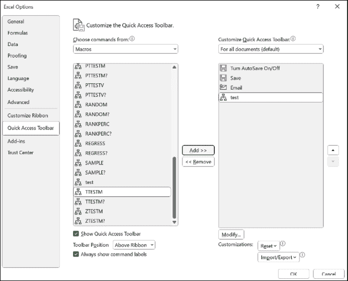

图 15.1：在快速访问工具栏上创建按钮

修改菜单或按钮

每当您想要创建新按钮，编辑现有按钮或从快速访问工具栏中删除任何按钮时，请按照以下步骤操作：

1.  点击修改…按钮。

1.  选择您喜欢的图标。

1.  提及显示名称。

1.  点击确定。

参考以下图 15.2：

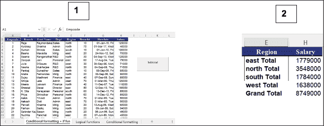

图 15.2：修改菜单或按钮

场景 4

创建一个宏，该宏将提取按区域划分的薪水总和（使用“薪水工作表”）。单击“小计”按钮后，应在新工作表上添加按区域划分的小计，如下所示图 15.3：

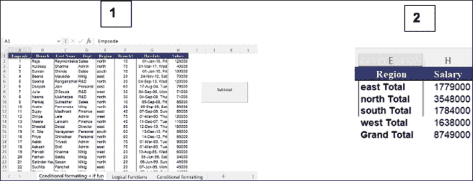

图 15.3：场景 4

要解决此场景，请按照以下步骤操作：

1.  开始录制（命名为 Subtotal_Macro）

1.  选择薪水表（源数据）

1.  选择 A1 单元格（数据库从 A1 开始）

1.  按照图 15.4 中显示的方式对区域进行排序：

    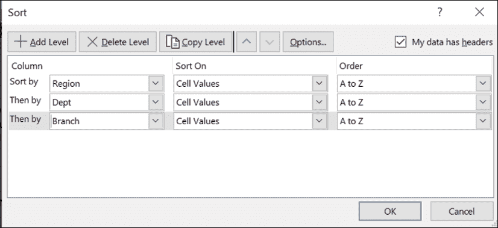

    图 15.4：场景 4 解决方案

    注意：排序必须按照小计的要求进行。错误的排序将导致错误的小计。

1.  按照图 15.5 中显示的方式对区域进行小计，并按照给定的步骤操作：

    1.  在数据选项卡上，转到大纲组。

    1.  点击小计按钮。

    1.  也选择区域。

    1.  选择求和函数（根据要求可以选择其他函数）

    1.  选择“工资”字段。

    1.  点击“确定”。

    参考图 15.5：

    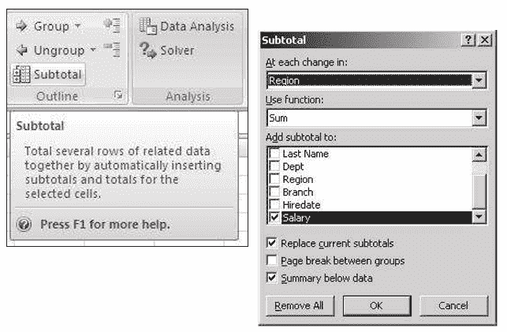

    图 15.5：场景 4 解决方案

1.  点击大纲的第二级（只显示小计）

1.  选择数据。

1.  按下 Alt + ;（分号）键组合以从选择中选择可见单元格。

1.  复制所选内容（Ctrl + C）。

1.  插入新工作表（Shift + F11）。

1.  粘贴复制的数据（Ctrl + V）。

1.  转到工资表（源数据）。

1.  删除小计，使用以下步骤：

    1.  转到“数据”选项卡。点击“小计”。

    1.  点击“RemoveAll”按钮。

1.  激活上一个工作表（Ctrl + PageUp）。

1.  停止录制

参考以下图 15.6：

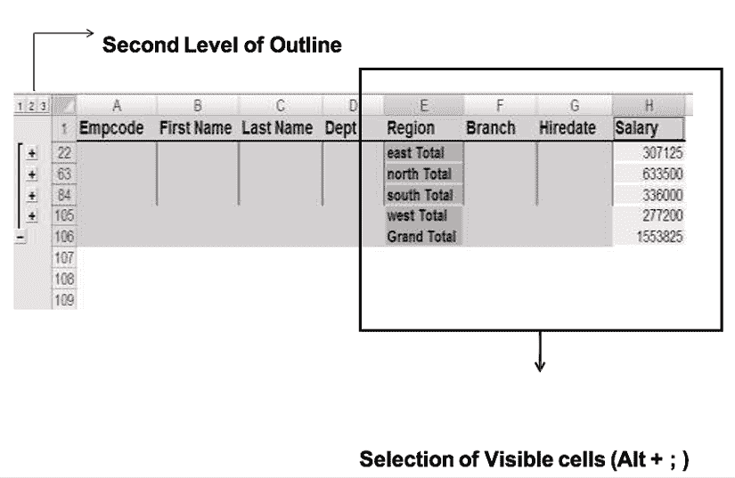

图 15.6：场景 4 解决方案

在 Excel 工作表上创建按钮

在 Excel 工作表上创建一个按钮，请按照以下步骤进行：

1.  激活工资表。

1.  转到“控件”组。

1.  选择按钮（表单控件），如图 15.7（b）所示

1.  分配小计宏，如图 15.7（c）所示。

1.  更改标题（右键单击并编辑文本），如图 15.7（d）所示。

参考以下图 15.7：

图 15.7：在 Excel 工作表上创建按钮

场景 5

创建一个宏，将从不同部门和区域提取记录。用户将输入所需的部门和区域，然后点击筛选按钮，如图 15.8 所示：

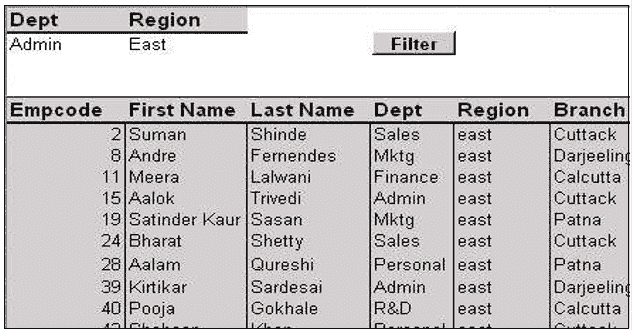

图 15.8：场景 5

注意：上述宏将自动化高级筛选的工作。

按照以下步骤进行：

1.  激活工资表。

1.  为高级筛选创建条件范围。

1.  开始录制。

1.  给予名称“Filter_Macro”。

1.  存储在本工作簿中。

1.  点击数据库的标题（单元格 A5）。

1.  进行高级筛选。

    1.  点击“数据”选项卡。

    1.  点击“高级”。

    参考图 15.9：

    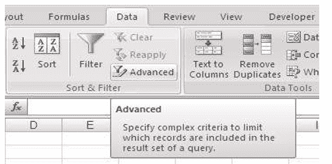

    图 15.9：场景 5 解决方案

1.  提供列表范围，即数据库范围，如图 15.10 所示。

1.  提供条件范围。

1.  点击“确定”。

1.  停止录制。

1.  从“开发人员”选项卡 | “控件”组创建一个按钮。

1.  将筛选宏分配给此按钮。

参考图 15.10：

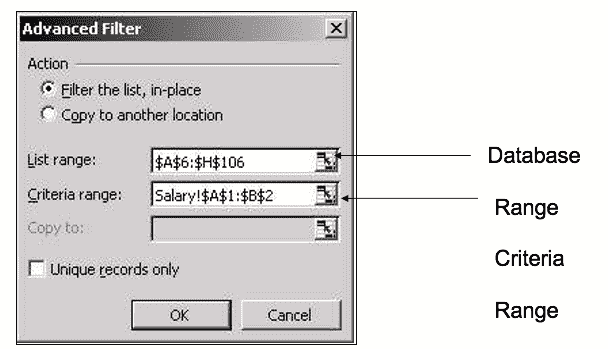

图 15.10：场景 5 解决方案

编辑记录的宏

有时记录的宏可能无法完全自动化。然后你需要编辑你记录的宏。或者，你可能想在记录的宏中添加一些操作，然后你可以编辑你的宏。

例如，在场景 5 中，不要在 Excel 中更改条件，而是让你的宏询问区域和部门。用户将输入然后点击“确定”。然后，宏将执行筛选。

要编辑你记录的宏，请按照以下步骤进行：

1.  转到“工具”。

1.  点击“宏”。

1.  打开 Visual Basic 编辑器。

1.  打开你的宏的代码窗口。

场景 6

打开场景 5 并修改代码以执行以下操作。用户应该获得一个 InputBox 来输入所需的部门和地区，然后单击筛选按钮。参考图 15.11：

图 15.11：场景 6

要编辑您录制的宏，请执行以下步骤：

1.  转到工具。

1.  选择宏。

1.  选择 Filter_Macro。

1.  点击编辑，如图 15.12 所示。

1.  打开您的宏的代码窗口。

参考图 15.12：

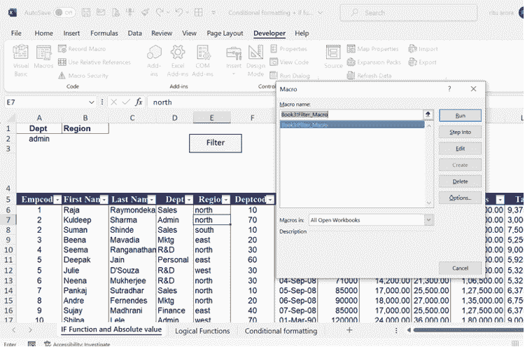

图 15.12：场景 6 解决方案

参考 Training File3.xls。

1.  宏定义以关键字 Sub 开头，并以 End Sub 结束。

1.  Inputbox 是一个用于从最终用户获取输入的函数。

1.  范围是一个类。

注意：我们将稍后详细讨论编写过程。

参考图 15.13：

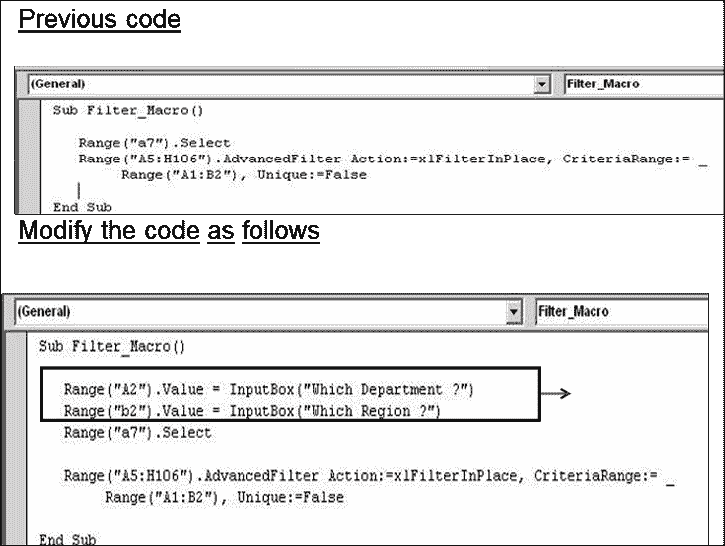

图 15.13：场景 6 解决方案

场景 7

创建一个宏来从 txt 文件（sales.txt）导入数据并设计一个数据透视表，显示按产品和月份总销售额。此宏将自动化从 txt 文件导入数据并创建一个数据透视表报告（参考 Training File4.xls）：

| 数字销售总和 |  |
| --- | --- |
| 产品 | 月份 | 总数 |
| 光盘 | 一月 二月 | 100000 |
|  | 三月 | 7500012000 |
| 光盘总数 | 187000 |
| 显��器 一月 二月 |  | 1500020000 |
| 显示器总数 | 35000 |
| 闪存 | 一月 | 75000 |
|  | 三月 | 73000 |
| 闪存总数 | 148000 |
| 总计 | 370000 |

表 15.1：示例数据

要解决这种情况，请按照以下步骤操作：

1.  开始录制（命名为 import_txt）

1.  点击数据菜单。

1.  选择导入外部数据 | 导入数据。

1.  选择 sales.txt。

1.  选择数据类型为分隔符，如图 15.14 所示（1）。

1.  点击下一步

1.  选择分隔符（逗号），如图 15.14 所示（2）。

1.  点击下一步。

    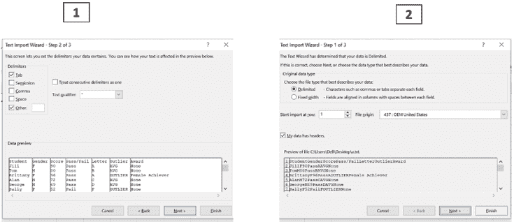

    图 15.14：场景 7 解决方案

1.  选择每个数据的类型，如图 15.15 所示。

1.  点击完成。

1.  选择现有工作表选项，如图 15.15 所示。

1.  点击确定。

1.  现在使用导入的数据创建一个数据透视表，并将其放在新工作表中。

1.  停止录制。

    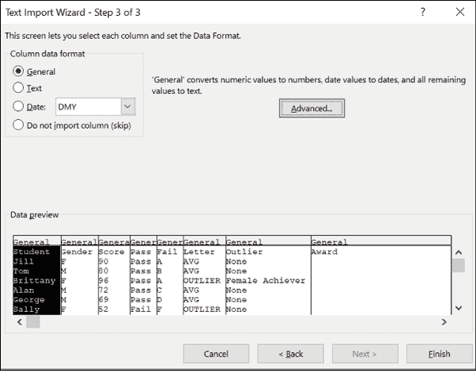

    图 15.15：场景 7 解决方案

场景 8

参考 Training File4.xls：

场景-8

| 目的 | 原始代码 | 修���后的代码 |
| --- | --- | --- |
| 用于文件选择 | ActiveSheet.QueryTables.Ad d(Connection:=”TEXT;c:\vb a\sales.txt”,Destination:=Ran ge(“A1”)) | ActiveSheet.QueryTables.Add(C onnection:=”TEXT;” & Application.GetOpenFilename, Destination:=Range(“A1”)) |
| 对于可变长度数据 | ActiveWorkbook.PivotCache s.Add(SourceType:=xlDatab ase, SourceData:= “Sheet31!R1C1:R7C3”).CreatePivotTable | ActiveWorkbook.PivotCaches.A dd(SourceType:=xlDatabase, SourceData:=Range(“a1”).CurrentRegion.A ddress).CreatePivotTable |

练习 1

创建一个宏（Report_title），它将在现有工作簿的单元格地址单元格内容中添加一个新工作表，并包含以下详细信息。

A2：您的公司名称

A3：标题为“每日报告”

A4：今天的日期

A6：序号

B6：产品

C6：销售数量

按照给定的步骤解决问题：

1.  点击“工具” | “宏”。

1.  选择记录新宏。

1.  将宏的名称命名为“报告标题”。

1.  分配快捷键。

1.  选择存储位置。

1.  在描述框中添加详细信息。

1.  点击“确定”。

1.  添加一个空白工作表（Shift+F11 或插入菜单 | 工作表）

1.  点击 A2 并输入你公司的名称。

1.  点击 A3，输入标题为“每日报告”。

1.  点击 A4，输入“=today()”。

1.  从 A6 到 C6 输入“序号”、“产品”和“销售数量”

1.  停止录制。

练习 2

创建一个宏，添加签名，即您的姓名和职务在数据末尾。

注意：假设工作表的格式是练习 1。

这个宏总是在当前工作表之前添加一个工作表。修改该宏，使其在当前工作表之后添加新工作表。

按照给定的步骤解决问题：

1.  点击“工具” | “宏”。

1.  选择记录新宏。

1.  将宏的名称命名为“汇总”。

1.  分配一个快捷键。

1.  选择存储宏的位置。

1.  在描述框中添加详细信息。

1.  点击“确定”。

1.  点击单元格 A6。

1.  使用 Ctrl + ↓到达数据末尾。

1.  点击“相对引用”。

1.  现在向下移动 3 行，输入你的姓名和职务。

1.  关闭相对引用。

1.  停止录制。

1.  修改语句“Sheets.add”为“sheets.add after:=activesheet”。

结论

在本章中，我们讨论了在 Excel 中为宏分配按钮的主题。我们学习了如何在快速访问工具栏上创建按钮，并通过修改菜单或按钮来自定义它们。此外，我们探讨了直接在 Excel 工作表上创建按钮的过程。我们还讨论了编辑记录的宏以增强其功能的过程。

练习

1.  创建一个宏，提取按地区汇总的工资总和，并将其添加到新工作表中。

1.  创建一个宏，根据部门和地区筛选记录。

1.  从文本文件导入数据并创建数据透视表报告。

1.  修改现有宏中的文件选择和变量长度数据的代码。

1.  练习创建一个宏，在工作表中添加每日报告标题。

1.  练习创建一个宏，在数据末尾添加签名。

加入我们书籍的 Discord 空间

加入书籍的 Discord Workspace，获取最新更新、优惠、全球技术动态、新发布和作者会话：

**[`discord.bpbonline.com`](https://discord.bpbonline.com)**

