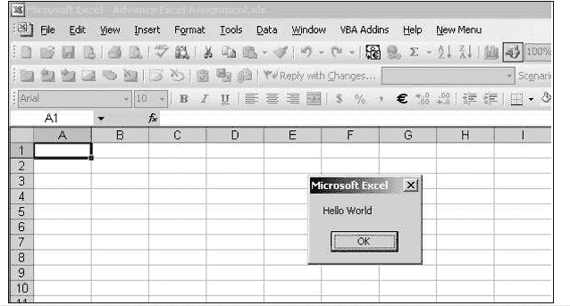
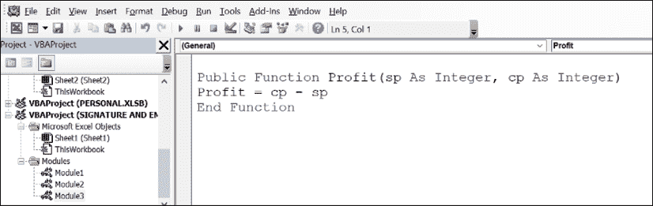

# 第十六章 VBA 中的函数和子例程

介绍

本章将介绍 Excel VBA 编程中函数和子例程的概念。它解释了两者之间的区别，然后深入探讨在模块中使用 Visual Basic Editor 编写代码。本章还涵盖了用于控制过程内代码执行流程的分支技术。

结构

在本章中，我们将讨论以下主题：

+   编写过程

+   Visual Basic Editor

+   插入模块

+   在模块内编写代码

+   子过程

+   函数过程

+   分支过程

目标

学习完本章后，读者将能够编写过程并了解 Visual Basic Editor，以便插入模块、编写代码等。读者还将了解子过程、函数过程以及分支过程。

编写过程

您可以为记录的每个操作编写代码。所有过程都写在一个模块内。

要编写代码，您需要打开 Visual Basic Editor。打开 Visual Basic Editor 的快捷键是 Alt + F11。

模块是一组过程。有两种类型的过程：

+   子过程：子过程用于自动化 Excel 操作。子过程是在 Sub 和 End Sub 块之间封装的代码单元。没有任何参数的子过程是一个宏。

+   函数过程：函数用于自动化任何复杂计算。函数过程在 Function 和 End Function 块之间封装。

子过程和函数过程之间的区别在下表表 16.1 中有所探讨：

| 子过程 | 函数过程 |
| --- | --- |
| 它不能返回值 | 它可以返回值 |
| 它可以在 Excel 对象上执行操作 | 它不能在 Excel 对象上执行操作 |

表 16.1：过程之间的区别

这里有一些你可以记住的要点：

+   两种过程可能有或没有参数。

+   没有参数的子过程是一个宏。

+   所有宏都是过程，但并非所有过程都是宏。

Visual Basic Editor

下图图 16.1 显示了 Visual Basic Editor 中的代码窗口：

图 16.1：Visual Basic Editor 中的代码窗口

Visual Basic Editor 中代码窗口的不同部分如下：

+   项目资源管理器：它显示了项目（Excel 工作簿）的分层列表以及每个项目包含和引用的所有项目。

+   属性窗口：它列出了所选对象的设计时属性及其当前设置。您可以在设计时更改这些属性。当选择多个控件时，属性窗口包含所有所选控件共有的属性列表。

+   代码窗口：使用代码窗口编写、显示和编辑 Visual Basic 代码。您可以打开与模块数量相同的代码窗口，以便轻松查看不同形式或模块中的代码，并在它们之间复制和粘贴。

图 16.2 更详细地探讨了项目资源管理器：

+   查看代码：显示代码窗口，以便您编写和编辑与所选项目相关的代码。

+   查看对象：显示所选项目的对象窗口，一个现有文档或用户表单。

+   切换文件夹：隐藏和显示对象文件夹，同时仍显示其中包含的各个项目。

+   列表窗口：列出所有加载的项目及每个项目中包含的项目。

属性是任何对象的特征。属性窗口显示了所选对象的属性，如图 16.2 所示：

图 16.2：项目资源管理器和属性窗口

现在让我们来看看代码窗口的不同部分（参考图 16.3）：

+   对象框：显示当前项目中对象的列表。

+   过程窗口：包含当前模块的所有过程或所选对象的事件。

+   过程视图：一次只显示一个过程。

+   完整模块视图：显示当前模块中的所有过程。

参考以下图 16.3：

图 16.3：代码窗口

项目资源管理器键盘快捷键

现在让我们来看看各种键盘快捷键：

+   回车 + Æ：打开列表中的所选文件，或展开和折叠列表以显示其子条目。

+   SHIFT+ENTERÆ：打开所选文件的代码窗口。

+   F7 + Æ：打开所选文件的代码窗口。

+   SHIFT+F10 Æ：查看快捷菜单。

+   HOME + Æ：选择列表中的第一个文件。

+   END + Æ：选择列表中的最后一个文件。

+   右箭头 + Æ：展开列表，然后每次按下时选择列表中的子条目。

+   左箭头 + Æ：选择列表中的子条目，然后每次按下时���上移动列表，直到子条目列表折叠为文件夹。

+   上箭头 + Æ：逐个向上移动列表中的条目。

+   下箭头 + Æ：逐个向下移动列表中的条目。

插入模块

要插入模块，请按照给定步骤进行：

1.  选择要存储过程的书籍，如图 16.4（1）所示。

1.  选择“插入”菜单，然后选择“模块”，如图 16.4（2）所示。

1.  已添加 Module1。你可以通过属性窗口更改名称，如图 16.4（3）所示。

参考图 16.4：

图 16.4：插入模块

在模块内编写代码

要在模块内编写代码，请按照以下步骤进行：

1.  双击要在其中编写过程代码的模块，如下所示的图 16.5（a）。

1.  编写您的过程代码，如下所示的图 16.5（b）。

参考以下图 16.5：

图 16.5：在模块内编写代码

子过程

子过程是一系列由 Sub 和 End Sub 语句包围的 Visual Basic 语句，执行操作但不返回值。

子过程可以接受参数，如常量、变量或由调用过程传递的表达式。

如果一个子过程没有参数，子语句必须包含一对空括号

宏

宏如下所示：

| Sub HelloWorld()MsgBOx "Hello World"End Sub |
| --- |

图 16.6 包含一个宏：

图 16.6：宏

函数过程

函数过程是一系列由 Function 和 End Function 语句包围的 Visual Basic 语句。

函数过程类似于子过程，但函数还可以返回一个值。函数过程可以接受由调用过程传递给它的参数。

如果一个函数过程没有参数，其函数语句必须包含一对空括号。函数通过在过程的一个或多个语句中为其名称赋值来返回一个值。

例如，

| Function Celsius (fDegrees)Celsius = (fDegrees - 32) * 5 / 9End Function |
| --- |

参考以下图 16.7：

图 16.7：用户定义函数

编写函数的语法

| Function name_of_function( argument1 , argument2 , …)processing the arguments name_of_function= ResultEnd Function |
| --- |

注意：参数是您希望从最终用户那里获得以计算结果的输入。

两个过程可能有或没有参数：

通过值传递 Æ：如果通过值传递参数，则被调用过程仅接收从调用过程传递的变量的副本。如果被调用过程���改值，则更改仅影响副本而不影响调用过程中的变量。

通过引用传递 Æ：如果在调用过程时通过引用传递参数，则过程可以访问内存中的实际变量。因此，过程可以更改变量的值。默认情况下，参数是通过引用传递的。

场景 9

编写一个函数来计算利润，其中利润是销售价格和成本价格的差额。利润函数需要两个参数，即成本价格和销售价格。

参考 Training File5.xls

| Function Profit(CP, SP)Profit = SP - CPEnd Function |
| --- |

分支过程

如果你想根据条件的值运行一段代码块，可以使用以下决策结构。

+   ¾ 如果...那么...Endif

+   ¾ 如果...那么...否则...Endif

+   ¾ 如果...那么...否则如果...那么...否则...Endif

+   ¾ 选择 Case …End Select

使用 如果...那么...Endif

单个条件并运行单个语句或一组语句。

使用 如果...那么...否则...Endif

单个条件，但根据条件的结果运行两个不同的语句或语句块。

使用 If...Then...Elseif…Then…Else…Endif 或 Select Case…End

选择多个条件并运行多个语句块中的一个。

场景 10

编写一个函数来检查人是否有资格投票。为了检查资格，Vote 函数需要年龄作为参数。

参考培训文件 5.xls

| 函数 Vote(Age)If Age >= 18 ThenVote = "有资格"ElseVote = "不符合资格"EndIfEnd Function |
| --- |

场景 11

编写一个函数根据基本工资找到员工的等级（使用 If Elseif）：

等级工资

D <8000

C 8000 – 15000

B 15000 – 25000

A >=25000

参考培训文件 5.xls

| 函数 Grade (salary)If salary<8000 ThenGrade = "D"ElseIf salary<15000 ThenGrade = "C"ElseIf salary<25000 ThenGrade = "B"ElseGrade ="A"End IfEnd Function |
| --- |

场景 12

编写一个函数根据等级找到奖金（使用 Select Case）

等级奖金

A 25000

B 20000

C 15000

D 10000

参考培训文件 5.xls

| 函数 bonus(grade)Select Case gradeCase "a", "A"bonus = 25000Case "b", "B"bonus = 20000Case "c", "C"bonus = 15000Case Elsebonus = 10000End SelectEnd Function |
| --- |

场景 13

编写一个函数来根据地区计算津贴。如果地区是东部或西部，则津贴为 5%，否则为 10%。使用 OR 运算符来检查多个条件。

OR 运算符

OR 运算符用于对两个表达式执行逻辑合取。如果任一表达式结果为真，则结果为真。

| 函数 CalcDa(Region, sal)If Region = "east" Or Region = "west" ThenCalcDa = sal * 0.05ElseCalcDa = sal * 0.1EndIfEnd Function |
| --- |

场景 14

编写一个函数来根据地区计算津贴。如果地区是东部且工资>10000，则为 5%，否则为 10%。

使用 AND 运算符来检查多个条件。

AND 运算符

用于对两个表达式执行逻辑合取。AND 如果所有表达式结果为真，则结果为真。

| 函数 CalcDa(Region, sal)If Region = "east" And sal > 10000 ThenCalcDa = sal * 0.05ElseCalcDa = sal * 0.1EndIf |
| --- |

结论

函数和子程序是 VBA 中强大的工具，帮助您自动化任务并在 Excel 中执行计算。通过了解如何编写过程，使用 Visual Basic Editor，并应用分支技术，您可以增强您的 VBA 编程技能，并创建更高效和动态的 Excel 应用程序。

练习

1.  编写一个函数来计算矩形的面积，给定其长度和宽度。

1.  创建一个子程序来根据特定条件格式化一系列单元格，例如突出显示值高于某个阈值的单元格。

1.  开发一个将华氏温度转换为摄氏温度的函数。

1.  编写一个子程序，将数据列按升序排序。

1.  创建一个函数来计算给定数字的阶乘。

加入我们书籍的 Discord 空间

加入书籍的 Discord 工作区，获取最新更新、优惠、全球科技动态、新发布内容以及与作者的交流：

**[`discord.bpbonline.com`](https://discord.bpbonline.com)**

