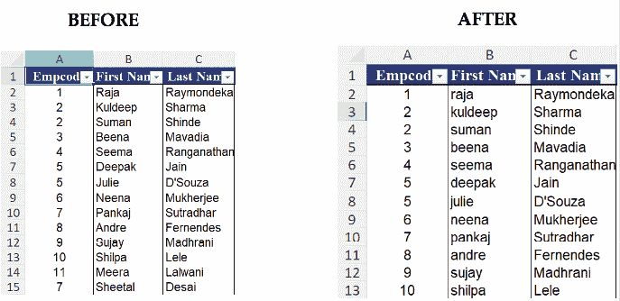
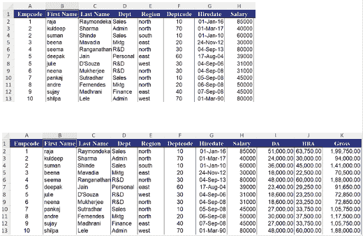

# 第十九章 VBA 中的循环结构

介绍

在本章中，我们将深入探讨 Visual Basic for Applications（VBA）中的循环结构主题。循环是强大的工具，可以使代码重复执行，提高效率并自动化任务。本章探讨了不同类型的循环，如 Do...Loop、For...Next 和 For Each...Next 循环，以及基于特定事件运行的自动执行的宏。

结构

在本章中，我们将讨论以下主题：

+   使用循环（重复动作）

+   使用 Do…Loop 语句

+   使用 For…Next 语句

+   使用 For Each…Next 语句

+   自动执行的宏

目标

通过本章结束时，读者将学习 VBA 中的循环结构，如 Do...Loop、For...Next 和 For Each...Next，以及实际示例的实现。

使用循环（重复动作）

循环允许您重复运行一组语句。一些循环重复语句直到条件为 False；其他循环重复语句直到条件为 True。还有一些循环重复语句特定次数或对集合中的每个对象重复。

选择要使用的循环

有各种循环可以使用，例如：

+   Do…Loop：在条件为 True 时循环。

+   For…Next：使用计数器运行指定次数的语句。

+   For Each…Next：为集合中的每个对象重复一组语句。

使用 Do…Loop 语句

您可以使用 Do...Loop 语句无限次运行一组语句。这些语句在条件为 True 时重复，或者直到条件变为 True。

语法：

Do [{While | Until} 条件]

[语句]

[退出 Do]

[语句]

循环

在条件为真时重复语句

在 Do...Loop 语句中，有两种使用 While 关键字检查条件的方式¾您可以在进入循环之前检查条件，或者¾您可以在循环至少运行一次后检查条件。

在进入循环之前检查条件

在进入循环之前检查条件的语法是：

DO WHILE (条件)

要重复的代码

循环

在循环至少运行一次后检查条件

在循环至少运行一次后检查条件的语法是：

DO

要重复的代码

LOOP WHILE (条件)

场景 17

编写一个接受和验证用户名的代码。不应允许空名称。参考培训文件 5.xls：

参考图 19.1：

图 19.1：场景 17

| Sub validate_name()Dim name As Stringname = InputBox("输入您的姓名")Do While Trim(name) = ""MsgBox "姓名不能为空"name = InputBox("输入您的姓名")LoopEnd Sub |
| --- |

注意：Trim 函数会删除单词开头和结尾的空格。

使用 For…Next 语句

+   您可以使用 For...Next 语句重复执行一组语句特定次数。

+   For 循环使用一个计数器变量，其值在每次循环内部重复时增加或减少。

语法：

对于计数变量=初始值到最终值 STEP 步长值

要重复的代码

下一个

注意：数据类型越小，更新所需的时间越短。

场景 18

创建一个名为 fill_series 的宏，以显示从 1 到 10 的数字（从单元格 A1 开始）。

Sub fill_series()

声明 fill_val 为整数

Range("A1").Select

对于 fill_val = 1 到 10

ActiveCell.Value = fill_val

ActiveCell.Offset(1, 0).Select Next

End Sub

Offset 函数()用于指向或引用对象的上、下、左或右。

语法：

OFFSET(行，列)

示例

1.  Activecell.Offset(1,0).select：这将选择 Activecell 下面 1 行，右边 0 列的单元格，

1.  Activecell.Offset(0,1).select：这将选择 Activecell 右边 0 行，1 列的单元格，

1.  Activecell.Offset(-1,0).select：这将选择 Activecell 上面 1 行，右边 0 列的单元格，

1.  Activecell.Offset(0,-1).select：这将选择 Activecell 下面 0 行，左边 1 列的单元格。

使用 ForEach…Next 语句

For Each...Next 语句为集合中的每个对象或数组中的元素重复执行一组语句。

Visual Basic 每次循环运行时都会自动设置一个变量。

可以在循环中的任何位置放置任意数量的 Exit For 语句作为退出的替代方式。

语法：

对于每个元素在组中

[语句]

[退出 For]

[语句]

下一个[element]

必需：用于迭代集合或数组元素的变量。对于集合，元素只能是 Variant 变量、通用对象变量或任何特定对象变量。对于数组，元素只能是 Variant 变量。

组：必需。对象集合或数组的名称

语句

可选。在组中的每个项目上执行的一个或多个语句。

场景 19

创建一个名为 UPPER_CASE 的宏，将数据转换为大写字母。使用 Ucase()函数将大小写转换为大写字母

参考以下图 19.2：

图 19.2：场景 19

| Sub UPPER_CASE()Dim wscell As RangeFor Each wscell In Selectionwscell.Value = UCase(wscell.Value)NextEnd Sub |
| --- |

场景 20

创建一个名为 lower_case 的宏，将数据转换为小写字母。使用 lcase()函数将大小写转换为小写字母

参考图 19.3：

图 19.3：场景 20

| Sub lower_case()Dim wscell As RangeFor Each wscell In Selectionwscell.Value = LCase(wscell.Value)NextEnd Sub |
| --- |

场景 21

创建一个名为 Proper_case 的宏，将数据转换为标题大小写字母。使用 WorksheetFunction 对象在 VBA 中使用 Excel 中的任何函数。

参考图 19.4：

图 19.4：场景 21

| Sub Proper_Case()Dim wscell As RangeFor Each wscell In Selectionwscell.Value = Application.WorksheetFunction.Proper(wscell.Value) NextEnd Sub |
| --- |

场景 22

打开场景 22 并进行修改。在记录宏后，您应该询问用户是否继续，并根据用户的响应运行。如果用户点击确定，则应继续数据输入。如果用户点击取消，则显示“谢谢”并结束宏。参考图 19.5：

图 19.5：场景 22

| Sub Data_Entry1()Dim EmpCode As Integer, next_row As IntegerDim EmpName As StringDim doj As DateDim Salary As CurrencyWorksheets("database").SelectRange("a65536").SelectSelection.End(xlUp).Selectnext_row = ActiveCell.Row + 1DoEmpCode = InputBox("输入员工编号")EmpName = InputBox("输入员工姓名")doj = InputBox("输入入职日期 mm/dd/yy")Salary = InputBox("输入员工工资")Cells(next_row , 1).Value = EmpCodeCells(next_row , 2).Value = EmpNameCells(next_row , 3).Value = Format(doj, "MMM DD YYYY")Cells(next_row , 4).Value = Salarynext_row =next_row + 1Loop While (MsgBox("是否继续？", vbOKCancel) = vbOK)MsgBox "谢谢"End Sub |
| --- |

场景 23

创建一个宏，将为每个员工计算以下内容

+   住房津贴（工资的 75%）

+   DA（工资的 60%）

+   总计（工资+住房津贴+DA）

参考图 19.6：

图 19.6：场景 23

解决这个问题可能有两种方法

参考培训文件 6.xls

1.  通过宏，您可以将公式放入单元格中：

    | Sub Gross_Salary()‘用户将选择范围 H2:H101 单元格作为范围。对于选择中的每个 wscellwscell.Offset(0, 1).Value = "=rc[-1]*75%"wscell.Offset(0, 2).Value = "=rc[-2]*60%"wscell.Offset(0, 3).Value = "=sum(rc[-1]:rc[-3])"NextEnd Sub |
    | --- |

1.  在您的宏中计算并仅将结果放入单元格中：

    | Sub Gross_Salary()用户将选择范围 H2:H101 Dim wscell As RangeFor Each wscell In Selectionwscell.Offset(0, 1).Value= wscell.Value * .75wscell.Offset(0, 2).Value = wscell.Value * 60%wscell.Offset(0, 3).Value = wscell.value + wscell.Offset(0, 1).Value + wscell.Offset(0, 2).ValueNextEnd Sub |
    | --- |

场景 24

创建一个宏来显示当前工作簿中工作表名称的列表。参考图 19.7：

图 19.7：场景 24

| Sub list_sheets()„ 声明一个工作表对象变量 Dim sht As WorksheetFor Each sht In WorksheetsActiveCell.Value = sht.nameActiveCell.Offset(1, 0).SelectNextEnd Sub |
| --- |

自动执行的宏

语法是：

| fydyr |
| --- |

参考以下表 19.1：

| 到 | 使用 |
| --- | --- |
| 在工作簿打开时运行宏 | Sub auto_open()End Sub |
| 在工作簿关闭时运行宏 | Sub auto_close()End Sub |

表 19.1：自动执行的宏

练习 3

编写一个名为“Search_sheet”的函数来检查任何工作表是否存在。

| Function Search_sheet(newSht)Dim sht As WorksheetFor Each sht In WorksheetsIf UCase(sht.name) = UCase(newSht) ThenSearch_sheet = "工作表(" & newSht & ") 存在"Exit FunctionEnd IfNextSearch_sheet = "工作表(" & newSht & ") 不存在"End Function |
| --- |

练习 4

编写一个宏，为每位员工增加 2000 的工资。

场景 25

创建一个宏，使用数据透视表生成按区域和部门工资总和以及员工数量的总计。修改代码，使每次都在当前数据上生成数据透视表。

参考培训文件 6.xls

| Sub Pivot_Summary()Range("A2").SelectActiveWorkbook.PivotCaches.Add(SourceType:=xlDatabase, SourceData:= _ Range("a2").CurrentRegion).CreatePivotTable TableDestination:="", TableName:= _ "PivotTable2", DefaultVersion:=xlPivotTableVersion10ActiveSheet.PivotTableWizard TableDestination:=ActiveSheet.Cells(3, 1)ActiveSheet.Cells(3, 1).SelectActiveSheet.PivotTables("PivotTable2").AddFields RowFields:=Array("Region", _ "Dept", "Data")With ActiveSheet.PivotTables("PivotTable2").PivotFields("salary").Orientation = xlDataField.Position = 1End WithWith ActiveSheet.PivotTables("PivotTable2").PivotFields("Empcode").Orientation = xlDataField.Caption = "Count of Empcode".Function = xlCountEnd WithRange("C3").SelectWith ActiveSheet.PivotTables("PivotTable2").DataPivotField.Orientation = xlColumnField.Position = 1End WithEnd Sub |
| --- |

场景 26

编写一段代码，如果“master”工作表中存在，则从“daily”工作表中删除重复记录。

（使用嵌套循环）

解决方案 26

参考培训文件 7.xls

| Sub duplicates()Dim wscell As Range, tcell As RangeWorksheets("master").SelectRange("a2").SelectRange(ActiveCell, ActiveCell.End(xlDown)).SelectFor Each wscell In SelectionWorksheets("daily").SelectRange("a2").SelectRange(ActiveCell, ActiveCell.End(xlDown)).SelectFor Each tcell In SelectionIf tcell.Value = wscell.Value Thentcell.EntireRow.Delete End IfNextNextActiveCell.SelectEnd Sub |
| --- |

可以使用查找命令编写相同的代码如下

| Sub duplicates_With_find()Worksheets("master").SelectRangec("a2").SelectRange(ActiveCell, ActiveCell.End(xlDown)).SelectFor Each tcell In SelectionWorksheets("daily").SelectSet c = Cells.Find(What:=tcell.Value)If Not c Is Nothing Then Rows(c.Row).DeleteEnd IfNextEnd Sub |
| --- |

场景 27

创建一个名为 Merging_Sheets 的宏，将所有工作表的数据复制到一个工作表中

你的宏应该生成一个按区域销售数量总计和员工代码总计的数据透视表。

解决方案

| Sub Merging_Sheets()'Scenario27'在末尾添加一个工作表，并将其命名为 consolidate 并创建标题 Worksheets.Add After:=Worksheets(Worksheets.Count)ActiveSheet.Name = "consolidate"ActiveSheet.Range("a1").SelectRange("a1").Value = "Product"Range("b1").Value = "Sales"将每个工作表的数据复制到 consolidate 工作表 For Index = 1 To Worksheets.Count - 1Worksheets(Index).SelectRange("a2").SelectRange(Selection, Selection.End(xlDown)).SelectRange(Selection, Selection.End(xlToRight)).SelectSelection.CopyWorksheets("consolidate").SelectCells(Range("a65536").End(xlUp).Row + 1, 1).SelectActiveSheet.PasteNext,生成一个关于合并数据的数据透视表 Sheets("consolidate").SelectRange("A1").SelectApplication.CutCopyMode = FalseActiveWorkbook.PivotCaches.Add(SourceType:=xlDatabase, SourceData:= _Range("a1").CurrentRegion).CreatePivotTable TableDestination:="", TableName _:="PivotTable1", DefaultVersion:=xlPivotTableVersion10ActiveSheet.PivotTableWizard TableDestination:=ActiveSheet.Cells(3, 1) ActiveSheet.Cells(3, 1).SelectActiveSheet.PivotTables("PivotTable1").AddFields RowFields:="Product"ActiveSheet.PivotTables("PivotTable1").PivotFields("Sales").Orientation = _ xlDataFieldEnd Sub |
| --- |

结论

精通循环结构对于有效的 VBA 编程至关重要。通过利用循环，您可以自动化重复任务，处理大量数据，并提高 VBA 程序的整体效率。本章全面介绍了循环及其在 VBA 中的应用，为您提供了编写简洁而强大的代码的技能，节省时间和精力。

练习

1.  编写一个名为“PrintNumbers”的 VBA 宏，将数字从 1 打印到 100 在即时窗口中。

1.  创建一个名为“CalculateSum”的 VBA 宏，用于计算从 1 到 10 的数字的总和，并在消息框中显示结果。

1.  编写一个名为“EvenNumbers”的 VBA 宏，在即时窗口中打印从 1 到 20 的所有偶数。

1.  创建一个名为“Factorial”的 VBA 宏，用于计算给定数字的阶乘。该宏应提示用户输入一个数字，然后在消息框中显示阶乘结果。

1.  编写一个名为“ReverseString”的 VBA 宏，提示用户输入一个字符串，然后在即时窗口中打印字符串的反转。

1.  创建一个名为“TableOfSquares”的 VBA 宏，生成从 1 到 10 的平方表。该宏应在新工作表中的不同列中显示数字及其平方。

1.  编写一个���为“CountCharacters”的 VBA 宏，计算给定字符串中的字符数。该宏应提示用户输入一个字符串，然后在消息框中显示计数。

加入我们书籍的 Discord 空间

加入书籍的 Discord Workspace，获取最新更新、优惠、全球科技动态、新发布和与作者的交流：

**[`discord.bpbonline.com`](https://discord.bpbonline.com)**

