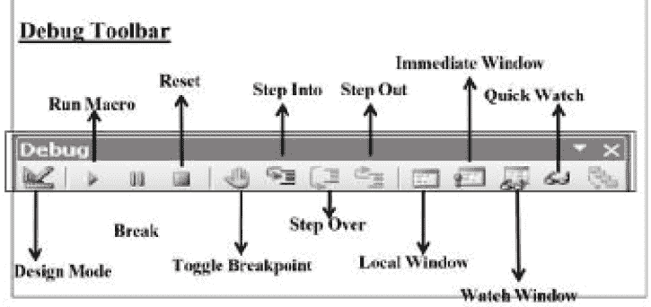

# 第二十一章 VBA 中的调试和错误处理

介绍

在本章中，我们将探讨在 Visual Basic for Applications（VBA）中调试和错误处理的重要概念。调试是识别和解决 VBA 代码中的运行时错误和逻辑错误的过程。错误处理涉及实施策略来处理和管理在代码执行过程中发生的错误。通过理解这些概念并利用适当的技术，我们可以创建更健壮和可靠的 VBA 宏。

结构

在本章中，我们将讨论以下主题：

+   错误

+   错误处理

+   错误编号

+   调试宏

目标

通过本章，读者将了解有关错误、错误处理和错误编号的内容，这些内容与调试一起在 VBA 中至关重要。

错误

如果语句失败，将生成一个错误。有三种类型的错误：

+   逻辑：当宏没有给出预期结果时。这些错误可以通过改变逻辑和试错方法来处理

+   技术：当运行时出现任何语句失败时。使用 On Error 语句来处理这些错误。

+   语法：这些包括拼写错误的关键字、括号不匹配以及各种其他错误。Excel 会标记您的语法错误，直到它们被纠正之前，您无法执行您的代码。

错误处理

处理错误有三种方式：

+   每当遇到错误时，将控制转移到特定的标签或代码行。

    +   On Error GoTo line / label On Error

+   立即继续执行导致运行时错误的语句后面的语句。

    +   On Error Resume Next

+   禁用当前过程中的任何已启用的错误处理程序。

    +   On Error GoTo 0

注意：错误处理例程不是一个子过程或函数过程。它是由一行标签或行号标记的代码部分。如果不使用 On Error 语句，任何发生的运行时错误都是致命的；也就是说，会显示错误消息并停止执行。

场景 28

打开场景 22。如果数据库工作表不存在，将会生成一个错误。修改代码以处理此错误，也就是说，你的程序应该在数据库工作表不存在时添加一个新的工作表。

注意：使用 On Error GoTo line / label

解决方案

| Sub Error_handling1()On Error GoTo err_handlerDim EmpCode As Integer, next_row As IntegerDim EmpName As StringDim doj As DateDim Salary As CurrencyWorksheets("database").SelectRange("a65536").SelectSelection.End(xlUp).Selectnext_row = ActiveCell.Row + 1DoEmpCode = InputBox("输入员工代码")EmpName = InputBox("输入员工姓名")doj = InputBox("输入入职日期 mm/dd/yy")Salary = InputBox("输入员工薪水")Cells(next_row , 1).Value = EmpCodeCells(next_row , 2).Value = EmpNameCells(next_row , 3).Value = Format(doj, "MMM DD YYYY")Cells(next_row , 4).Value = Salarynext_row =next_row + 1Loop While (MsgBox("是否继续?", vbOKCancel) = vbOK)MsgBox "谢谢"Exit Suberr_handler: Worksheets.AddActiveSheet.name ="database"Range("a1").Value = "员工代码"Range("b1").Value = "员工姓名"Range("c1").Value = "入职日期"Range("d1").Value = "薪水"Resume NextEnd Sub |
| --- |

错误编号

每个运行时错误都有一个编号。如果您知道编号，可以通过编号捕获错误。例如，请参考以下表 21.1：

| 错误编号 | 描述 |
| --- | --- |
| 61 | 磁盘已满 |
| 4 | 应用程序定义或对象定义错误 |
| 7 | 内存不足 |
| 9 | 下标超出范围 |

表 21.1: 错误编号及其相应描述

尝试以下代码以查看特定错误编号的错误

| Sub Show_Error():Dim ErrorNumber   For ErrorNumber = 61 To 64 ' 循环值为 61 – 64。       Msgbox Error(ErrorNumber)   Next ErrorNumberEnd Sub |
| --- |

场景 29

打开场景 28。如果留空输入框，您的宏将生成一个错误。按照以下方式修改代码（使用 On error resume next）

| Sub Error_handling2()Dim EmpCode As Integer, next_row As IntegerDim EmpName As StringDim doj As DateDim Salary As Currency' 如果有任何错误，应继续下一行 On Error resume NextWorksheets("database").SelectRange("a65536").SelectSelection.End(xlUp).Select next_row= ActiveCell.Row + 1DoEmpCode = InputBox("输入员工代码")EmpName = InputBox("输入员工姓名")doj = InputBox("输入入职日期 mm/dd/yy")Salary = InputBox("输入员工薪水")Cells(next_row , 1).Value = EmpCode Cells(next_row , 2).Value = EmpNameCells(next_row , 3).Value = Format(doj, "MMM DD YYYY")Cells(next_row , 4).Value = Salary next_row =next_row + 1Loop While (MsgBox("是否继续?", vbOKCancel) = vbOK) MsgBox "谢谢"End Sub |
| --- |

调试宏

调试是找到和纠正运行时错误和逻辑错误的过程。按 F8 逐行执行代码。

调试工具栏可在以下图 21.1 中看到：

图 21.1: 调试工具栏

这里是各种工具栏按钮：

+   设计模式：打开或关闭设计模式。

+   运行子程序/用户窗体或运行宏：如果光标在过程中，则运行当前过程，如果当前活动的是用户窗体，则运行用户窗体，如果既不是代码窗口也不是用户窗体，则运行宏。

+   中断：在程序运行时停止执行并切换到中断模式。

+   重置：清除执行堆栈和模块级变量，并重置项目。

+   切换断点：在当前行设置或移除断点。

+   逐步执行：逐条执行代码。

+   逐步跳过：在代码窗口中逐个过程或语句执行代码。

+   跳出：执行当前执行点所在过程的剩余行。

+   本地窗口：显示本地窗口。

+   立即窗口：显示立即窗口。

+   观察窗口：显示观察窗口。

+   快速监视：显示当前选定表达式的当前值的快速监视对话框。

+   调用堆栈：显示调用对话框，列出当前活动的过程调用（应用程序中已启动但尚未完成的过程）。

这里有一些提示，将帮助您将错误最小化：

+   使用 Option Explicit：这将强制您为每个使用的变量定义数据类型。这将避免常见的拼写变量名错误。

+   使用缩进格式化您的代码：如果您有几个嵌套的 For...Next 循环，例如，一致的缩进将使跟踪它们变得更加容易。

+   谨慎使用 On Error Resume Next：此语句导致 Excel 忽略任何错误并继续。在某些情况下，使用此语句将导致 Excel 忽略不应被忽略的错误。您可能会有错误而自己都没有意识到。

+   使用注释：养成写注释的习惯，这样当您重新访问您的代码时，您可以理解逻辑。添加一些描述您逻辑的注释可以节省您大量的时间。

+   保持你的子程序和函数简单：将代码编写成较小的模块，每个模块都有一个明确定义的目的。

+   使用宏录制器识别属性和方法：如果您不记得属性或方法的名称或语法，录制一个宏并查看录制的代码。

+   考虑采用不同的方法：如果您在使特定例程正常工作方面遇到困难，您可能希望放弃这个想法，尝试完全不同的方法。在大多数情况下，Excel 提供了几种实现相同目标的替代方法。

+   使用调试工具栏

结论

调试和错误处理是 VBA 开发人员必备的技能。通过有效地管理错误和调试我们的代码，我们可以创建更健壮和无错误的宏。应用最佳实践，如适当的代码格式化、注释和使用可用的调试工具，将帮助我们高效地预防和解决错误。

练习

1.  打开一个新的 Excel 工作簿并导航到 Visual Basic 编辑器（VBE）。

1.  在 VBE 中，插入一个新模块来编写 VBA 代码。

1.  创建一个名为“CalculateStatistics”的子例程，不带任何参数。

1.  声明用于存储输入值和计算统计数据的必要变量。

1.  使用高级错误处理技术（如“On Error GoTo”、“On Error Resume Next”和“Err.Raise”）实现错误处理。

1.  提示用户使用“Application.InputBox”方法从工作表输入一系列数字。

1.  使用“WorksheetFunction”对象在所选范围上执行以下计算：

    1.  计算数字的总和。

    1.  计算数字的平均值。

    1.  计算范围内的最大值。

    1.  计算范围内的最小值。

1.  在单独的消息框中显示计算出的统计数据。

1.  包括全面的错误处理，以处理诸如无效输入、空选择、范围内的非数字值或除零错误等情况。

1.  通过使用不同的输入执行宏来测试它，并验证它有效地处理错误并提供准确的结果。

加入我们书籍的 Discord 空间

加入书籍的 Discord Workspace，获取最新更新、优惠、全球技术动态、新发布和与作者的会话：

**[`discord.bpbonline.com`](https://discord.bpbonline.com)**

