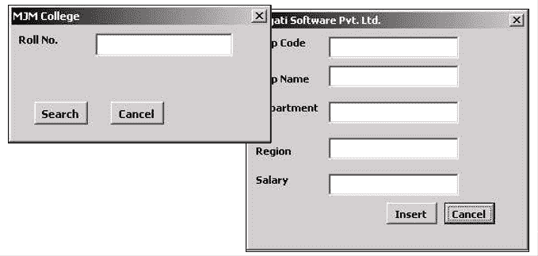
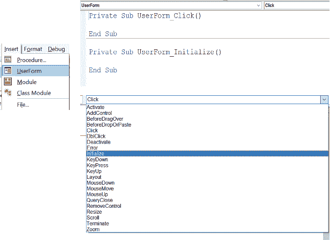
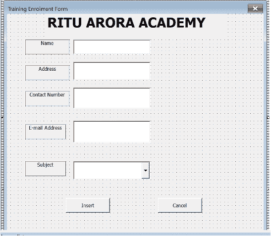

# 第二十二章 VBS 中的用户表单和用户输入

介绍

用户表单和用户输入是在 Visual Basic Scripting（VBS）中创建交互式和用户友好应用程序的重要方面。用户表单允许开发人员设计直观的界面，并捕获用户输入以实现各种目的。通过利用诸如标签、文本框、按钮等控件，VBS 开发人员可以创建动态、响应迅速的表单，从而增强整体用户体验。

在本章中，我们将探讨在 VBS 中创建用户表单的过程，包括设计表单布局、添加控件和处理事件。我们还将讨论如何将用户输入整合到您的脚本中，使您的应用程序能够响应用户操作并执行相关任务。

结构

在本章中，我们将介绍以下主题：

+   用户表单

+   创建用户表单

+   添加其他控件

+   处理控件的事件

目标

本章结束时，读者将了解用户表单以及如何创建它们，添加其他控件以及处理控件的事件。了解 VBS 中的用户表单和用户输入将使您能够构建满足用户特定需求的交互式和功能性应用程序。

用户表单

用户表单用于创建自定义对话框。参考以下图 22.1：

图 22.1：用户表单

创建用户表单

要创建用户表单，请按照以下步骤操作：

1.  点击插入菜单

1.  选择 UserForm，如图 22.2（a）所示。

1.  这将在您的工作簿中添加一个对象 UserForm1，如图 22.2（b）所示。

1.  使用属性窗口更改表单的名称、行为和外观。例如，要更改表单上的标题，设置 Caption 属性，如图 22.2（c）所示

参考图 22.2：

图 22.2：创建用户表单

添加其他控件

要添加其他控件，请按照以下步骤操作：

1.  点击工具栏中的工具箱，如图 22.3（a）所示。

1.  将控件拖放到表单上，如图 22.3（b）所示。

1.  从属性窗口更改属性，如名称、字体等，如图 22.3（c）所示

参考图 22.3：

图 22.3：添加其他控件

处理控件的事件

要处理控件的事件，请按照以下步骤操作：

1.  打开表单的代码窗口。

1.  选择表单控件。

1.  从项目资源管理器窗口中点击查看代码工具，如图 22.4（a）所示。

1.  从图 22.4（b）中选择您在表单中放置的控件。

1.  选择您控件的事件，如图 22.4（c）所示。

1.  按照 图 22.4（d）中所示编写事件代码。

图 22.4：处理控件事件

场景 30

创建一个用户表单，用于接受参与者的信息以报名培训。该表单应包含“插入”和“取消”命令按钮。单击“插入”按钮时，表单中输入的信息必须进入 Excel。单击“取消”按钮时，表单应关闭。

解决方案

按照给定的步骤：

1.  插入一个用户表单。

1.  从属性窗口更改名称和标题。

1.  表单的名称应为 USR_enrol。

1.  标题应为培训报名表。

1.  设计如 图 22.5 所示的表单：

图 22.5：场景 30 解决方案

在这里，

+   标签：显示描述性文本。

+   文本框：文本框是用户输入信息最常用的控件。

+   ListBox：显示值列表并允许选择一个或多个。

+   ComboBox：结合了 ListBox 和 TextBox 的功能。用户可以像使用 TextBox 一样输入新值，或者像使用 ListBox 一样选择现有值。

+   框架：创建一个功能性和视觉控制组。

+   属性：属性（��性或变量）。

+   方法：对象将执行的操作与属性。

参考以下 表 22.1：

| 控件 | 名称 | 属性 | 值 |
| --- | --- | --- | --- |
| 标签 | LBL_ 标题 | 标题 | Ritu Arora 学院。 |
| 标签 | LBL_name | 标题 | 姓名 |
| 标签 | LBL_address | 标题 | 地址 |
| 标签 | LBL_contactno | 标题 | 联系电话 |
| 标签 | LBL_ 电子邮件 | 标题 | 电子邮件地址 |
| 标签 | LBL_ 主题 | 标题 | 主题 |
| 文本框 | TXT_name |  |  |
| 文本框 | TXT_address |  |  |
| 文本框 | TXT_contactno |  |  |
| 文本框 | TXT_email |  |  |
| 文本框 | TXT_companyname | 文本 | 输入您的公司名称 |
| 框架 | FRM_ 详细信息 | 标题 | 其他详细信息 |
| 组合框 | CBO_subject | 标题 |  |
| 选项按钮 | OPT_company | 标题 | 公司 |
| 选项按钮 | OPT_Personal | 标题 | 个人 |
| 命令按钮 | CMD_insert | 标题 | 插入 |
| 命令按钮 | CMD_cancel | 标题 | 取消 |

表 22.1：员工用户表单

结论

总之，用户表单和用户输入是 Visual Basic Scripting（VBS）的基本组成部分，允许开发人员创建交互式和用户友好的应用程序。通过利用用户表单，开发人员可以设计直观的界面，捕获用户输入，并增强整体用户体验。整合用户表单并有效管理用户输入可以极大地提高 VBS 应用程序的功能性和可用性。

练习

1.  创建一个名为“RegistrationForm”的用户表单，用于捕获活动注册的用户信息。该表单应包括以下控件：

    1.  标签：“姓名：”，“电子邮件：”，“电话：”，“活动：”，“付款方式：”

    1.  文本框：用户输入他们的姓名、电子邮件和电话号码。

    1.  组合框：包含用户可选择的事件列表。

    1.  选项按钮：用户选择他们偏好的付款方式（例如，“信用卡”，“PayPal”，“现金”）。

    1.  命令按钮：“提交”和“清除”。

你的任务是设计具有适当控件的用户表单，设置它们的属性，并处理提交和清除按钮的事件。

加入我们书籍的 Discord 空间

加入书籍的 Discord 工作区，获取最新更新、优惠、全球科技动态、新发布和与作者的交流：

**[`discord.bpbonline.com`](https://discord.bpbonline.com)**

