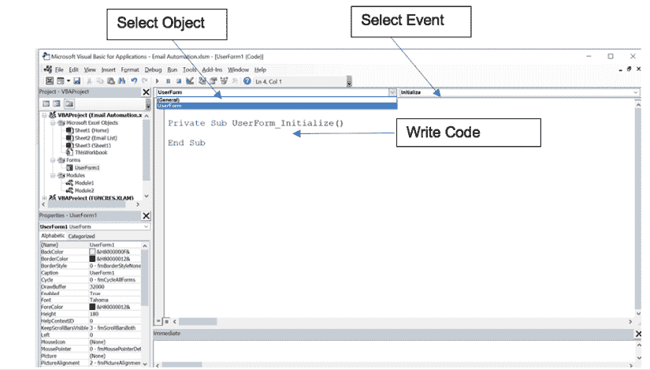
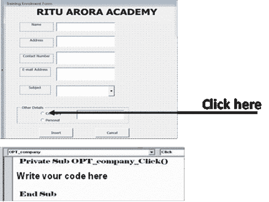
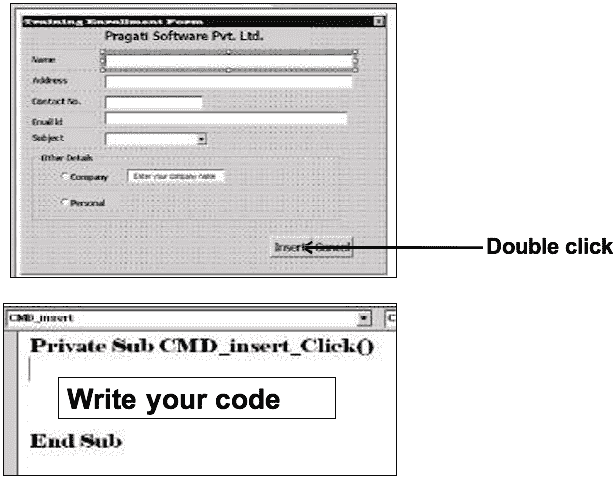
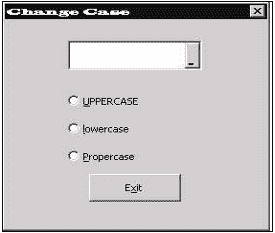
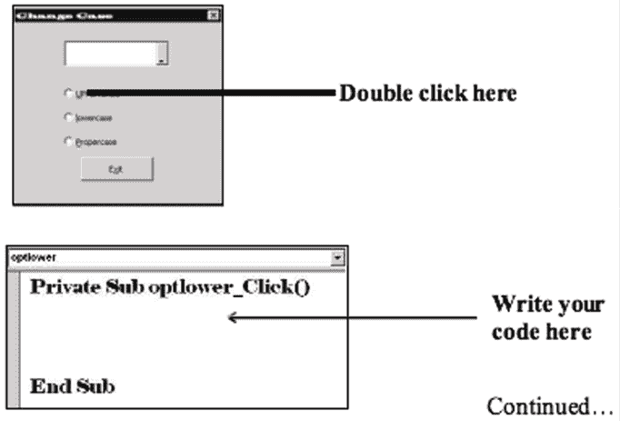
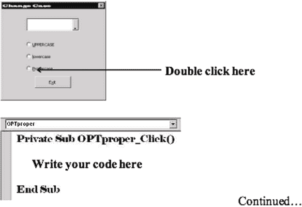

# 第二十三章高级 VBA 技术和最佳实践

介绍

在本章中，我们深入探讨了高级 VBA 技术和最佳实践，以增强 Excel 应用程序的功能和效率。我们探讨了初始化控件值、使用选项按钮、创建自定义按钮和用户表单、利用 Add-ins、实现大小写转换 Add-In 以及通过代码创建菜单等主题。通过掌握这些高级技术，读者将更深入地了解 VBA 编程，并能够构建更强大和用户友好的 Excel 应用程序。

结构

在本章中，我们将讨论以下主题：

+   给控件初始值的代码

+   选项按钮的代码

+   插入按钮的代码

+   显示用户表单的代码

+   Add-ins

+   更改大小写表单的代码

+   通过代码创建菜单

目标

通过本章结束，读者将学习到关于高级 VBA 技术和最佳实践以增强其 Excel 应用程序的知识。

给控件初始值的代码

要给控件初始值，按照以下步骤进行：

1.  从项目资源管理器中选择查看代码表单。

1.  选择 UserForm 对象。

1.  选择初始化事件。

参考以下图 23.1：

图 23.1：给控件初始值

代码如下：

| 私有子过程 UserForm_Initialize()TXT_name.Value = ""TXT_address.Value = ""TXT_contact_no.Value = ""TXT_company_name.Value = ""CBO_subject.AddItem "MS Excel"CBO_subject.AddItem "VBA with Excel"CBO_subject.AddItem "MS Word"CBO_subject.AddItem "MS Powerpoint"CBO_subject.AddItem "MS Office"CBO_subject.AddItem "MS Access"CBO_subject.AddItem "MS Project" OPT_company.Value = TrueEnd Sub |
| --- |

选项按钮的代码

要应用选项按钮，请按照以下步骤进行：

1.  双击 OPT_company

    私有子过程 OPT_company_Click()

    '当用户选择此选项时，txt_companyname 文本框将可见。

    TXT_companyname.Visible = True

    结束子程序

1.  双击 OPT_personal

    私有子过程 OPT_personal_Click()

    '当用户选择此选项时，txt_companyname 文本框将不可见

    TXT_companyname.Visible = False

    结束子程序

参考以下图 23.2：

图 23.2：添加选项按钮

插入按钮的代码

参考以下图 23.3：

图 23.3：添加插入按钮

双击插入按钮

| Private Sub CMD_insert_Click()' 代码查找下一个空单元格 ActiveWorkbook.Sheets("Training Enrollment").ActivateRange("a1").SelectDoIf IsEmpty(ActiveCell) = False ThenActiveCell.Offset(1, 0).SelectEnd IfLoop Until IsEmpty(ActiveCell) = True' 代码将表单中的值放入 ExcelActiveCell.Value = TXT_name.ValueActiveCell.Offset(0, 1).Value = TXT_address.ValueActiveCell.Offset(0, 2).Value = TXT_contactno.ValueActiveCell.Offset(0, 3).Value = TXT_email.ValueActiveCell.Offset(0, 4).Value = CBO_subject.Value 如果 OPT_personal.Value = True ThenActiveCell.Offset(0, 5).Value = "个人" ElseActiveCell.Offset(0, 5).Value =  TXT_companyname.ValueEnd IfTXT_name.Value = ""TXT_address.Value = ""TXT_contact_no.Value = ""TXT_email.Value = ""TXT_companyname.Value = "输入您的公司名称"TXT_companyname.Visible = False CBO_subject.Value = ""OPT_company.Value = TrueEnd Sub |
| --- |

在插入值后清除表单，请按照以下步骤操作：

1.  双击取消按钮。

1.  然后编写以下代码：

    Private Sub CMD_cancel_Click() 卸载 me

    End Sub

显示用户表单的代码

要从 Excel 运行用户表单，插入一个模块并编写一个宏：

| Sub Enrol_form()USR_enrol.ShowEnd Sub |
| --- |

插件

插件是单独的实用程序。它们为软件提供一些额外的功能。插件的扩展名是.XLAM。在 Excel 中，我们有一些现成的插件，如求解器、分析工具包、条件求和向导等。

场景 31

创建一个插件，根据用户选择的选项将大小写转换为大写/小写/首字母大写。

解决方案

按照给定的步骤操作：

1.  设计一个插件表单，如图 23.4 所示：

    

    图 23.4：设计插件表单

1.  打开一个新的 Excel 工作簿。

1.  打开 Visual Basic 编辑器。

1.  插入一个用户表单，并将其命名为 Changecase。

1.  给标题改变大小写。

1.  在表单上拖动对象。

1.  设计如下所示的表 23.1：

    | 对象 | 名称 | 属性 | 值 |
    | --- | --- | --- | --- |
    | 引用编辑 | Refselect |  |  |
    | 选项按钮 | Optupper | 标题 | 大写 |
    | 选项按钮 | Optlower | 标题 | 小写 |
    | 选项按钮 | Optproper | 标题 | 首字母大写 |
    | 命令按钮 | Cmdexit | 标题 | 退出 |

    表 23.1：选项按钮

1.  打开 Changecase 表单的代码窗口

1.  为不同的控件编写代码

更改大小写表单的代码

双击 OPTupper 控件。

| Private Sub OPTupper_Click()'当用户选择此选项时，将转换为大写 Dim rng As Range, wscell As RangeSet rng = Range(refselect)For Each wscell In rngwscell.Value = UCase(wscell.Value)NextEnd Sub |
| --- |

参考以下图 23.5：

图 23.5：小写

现在，双击 OPTlower 控件。

| Private Sub optlower_Click()'当用户选择此选项时，将转换为大写 Dim rng As Range, wscell As RangeSet rng = Range(refselect)For Each wscell In rngwscell.Value = LCase(wscell.Value)NextEnd Sub |
| --- |

参考以下图 23.6：

图 23.6：ProperCase

双击 opt_upper 控件并编写以下代码

| Private Sub optproper_Click()'当用户选择此选项时，将转换为大写 Dim rng As Range, wscell As RangeSet rng = Range(refselect)For Each wscell In rngwscell.Value = Application.WorksheetFunction.Proper(wscell.Value)NextEnd Sub |
| --- |

双击 cmdexit 控件

| Private Sub cmdExit_Click()EndEnd Sub |
| --- |

插入一个模块并编写一个宏来显示 Changecase 表单

| Sub show()Changecase.showEnd Sub |
| --- |

通过代码创建菜��

参考以下代码：

| Sub auto_open()'此代码将在现有菜单栏中创建一个新菜单，其中将有一个菜单项，即 Changecase Add-InsDim newmenu As CommandBarPopupDim menuitem As CommandBarButtonSet newmenu = CommandBars(1).Controls.Add(Type:=msoControlPopup, before:=CommandBars(1).Controls("help").Index)newmenu.Caption = "E&xtras"'当选择 Changecase 菜单项时，应显示 changecase 表单 Set menuitem = newmenu.Controls.Add(Type:=msoControlButton) menuitem.Caption = "&Change Case" menuitem.OnAction = "show"End SubSub auto_close()'当从 Excel 中移除加载项时，将删除菜单 CommandBars(1).Controls("extras").DeleteEnd Sub |
| --- |

在这里，

+   Auto_Open(): 这是在打开工作簿时触发的第一个事件。

+   Auto_Close(): 这是在打开工作簿时触发的最后一个事件。

结论

在本章中，我们探讨了可以显著改进 Excel 应用程序功能和用户体验的高级 VBA 技术和最佳实践。从初始化控件值到处理选项按钮，创建自定义按钮和用户表单，利用加载项，并通过代码创建菜单，我们涵盖了广泛的主题。通过应用这些技术并遵循概述的最佳实践，读者可以创建更强大、高效和用户友好的 Excel 应用程序。掌握这些高级技术后，读者将能够将他们的 VBA 技能提升到更高水平。

练习

让我们考虑一个基于示例的练习，结合了本章讨论的几种高级 VBA 技术。

场景：您正在 Excel 中开发一个项目管理工具。该工具允许用户输入项目细节，跟踪进度并生成报告。您的任务是通过实现以下功能来增强该工具：

1.  添加一个名为“TaskForm”的用户表单，允许用户输入任务细节，包括任务名称、分配人员、开始日期、结束日期和状态（例如，“未开始”，“进行中”，“已完成”）。

1.  在 TaskForm 中实现验证检查，确保所有必填字段都填写完整，并且结束日期不早于开始日期。如果任何验证失败，显示适当的错误消息。

1.  在 TaskForm 上创建一个自定义的“插入”按钮，将输入的任务详情添加到指定的工作表，如“ProjectTasks”。确保每个新任务都插入到新行，并在成功插入后清空输入字段。

1.  使用 VBA 代码实现一个菜单系统。在 Excel 菜单栏中创建一个名为“项目管理”的新菜单项。在“项目管理”菜单下，添加选项以打开 TaskForm，显示所有任务列表，并生成一个汇总报告。

1.  开发一个汇总报告功能，计算并显示任务总数、每个状态类别中的任务数以及已完成任务的百分比。汇总报告应显示在名为“TaskSummary”的新工作表中。

1.  实现一个名为“TaskUtilities”的插件，提供额外的任务管理功能，如按名称或日期对任务进行排序，按状态筛选任务，并生成专门的报告。通过在不同的工作簿中使用该插件来测试它，并验证其功能。

1.  在整个项目中应用最佳的代码组织、错误处理和优化实践，以确保清晰高效的 VBA 代码。

加入我们书籍的 Discord 空间

加入书籍的 Discord 工作区，获取最新更新、优惠、全球科技动态、新发布和与作者的交流：

**[`discord.bpbonline.com`](https://discord.bpbonline.com)**

