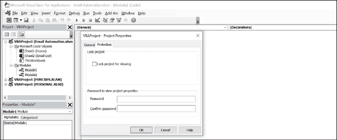
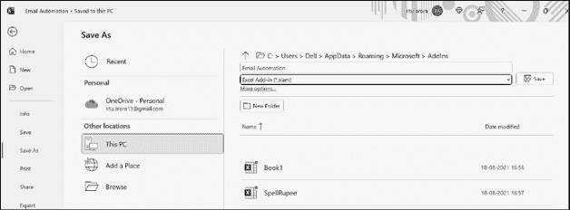
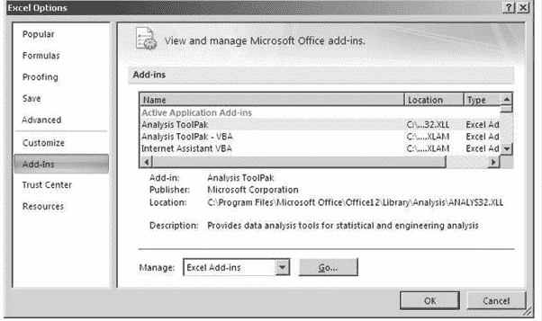
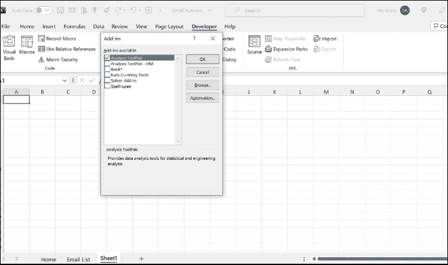

# 第二十四章 使用 VBA 构建自定义插件

介绍

在本章中，我们将探讨在 Excel 中使用 Visual Basic for Applications（VBA）构建自定义插件的过程。插件是可以集成到 Excel 中以增强其功能并简化工作流程的附加功能或工具。我们将涵盖诸如使用密码保护插件和有效使用插件等主题。

结构

在本章中，我们将讨论以下主题：

+   使用密码保护您的插件

+   使用插件

目标

在本章结束时，读者将学会如何使用密码保护他们的插件以确保安全性，以及如何有效利用插件来增强 Excel 的功能。

使用密码保护您的插件

要使用密码保护您的插件，请按照以下步骤操作：

1.  折叠项目的所有对象（插入表单和模块以用于插件的 Excel 文件）。

1.  右键单击该项目。

1.  选择 VBA 项目属性。

1.  选择“保护”选项卡。

1.  选择“锁定以查看”。

1.  设置密码。

1.  点击“确定”。

参考图 24.1：

图 24.1：添加密码

1.  一旦您准备好添加插件的表单和模块，切换到 Excel 环境。

1.  将当前文件保存为插件类型（.xlam 扩展名），如图 24.2 所示：

    

    图 24.2：保存当前文件

使用插件

要使用插件，请按照以下步骤操作：

1.  点击“Office”按钮。

1.  点击“Excel 选项”。

1.  选择“插件”。

1.  点击“前往…”按钮，如图 24.3 所示：

    

    图 24.3：选择插件

1.  浏览以找到您的插件，如图 24.4 所示：

    

    图 24.4：定位您的插件

结论

总之，使用 VBA 构建自定义插件使用户能够扩展 Excel 的功能并简化其工作流程。通过密码保护插件可以确保其安全性。有效利用插件可以提高生产力，使用户能够在 Excel 中访问额外的功能和工具。

练习

1.  打开 Microsoft Excel 并创建一个新的工作簿。

1.  创建一个简单的 VBA 宏，用特定字体、字体大小和背景颜色格式化所选单元格。

1.  将 VBA 宏保存为具有.xlam 扩展名的插件。

1.  使用密码保护插件以确保其安全性。

1.  通过在 Excel 中安装并使用插件来格式化不同工作表中的单元格来测试插件。

加入我们书籍的 Discord 空间

加入本书的 Discord Workspace，获取最新更新、优惠、全球技术动态、新发布和与作者的交流：

**[`discord.bpbonline.com`](https://discord.bpbonline.com)**

