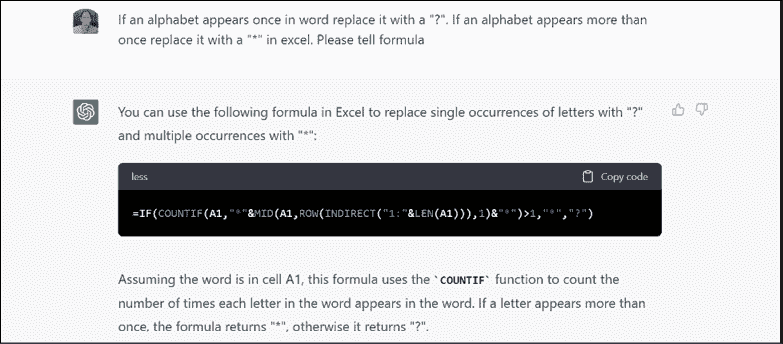
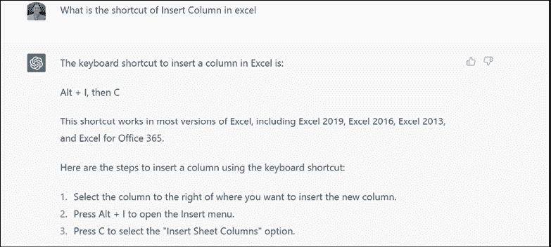
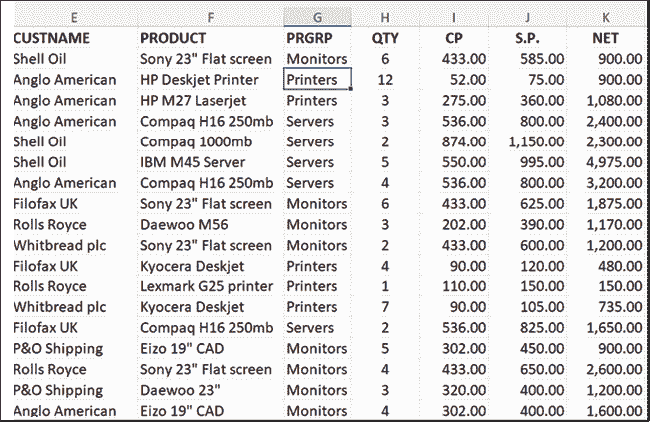
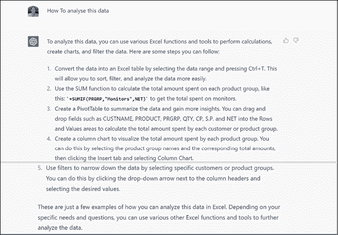
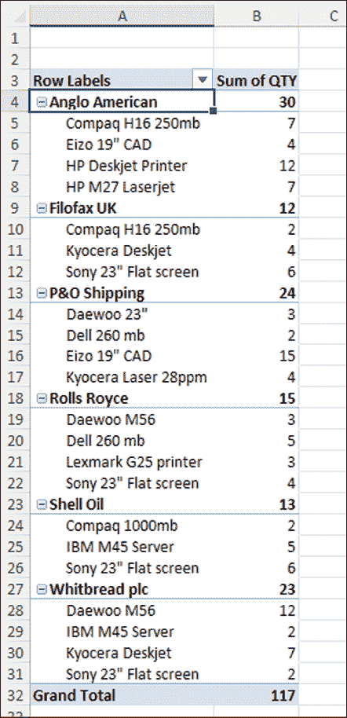
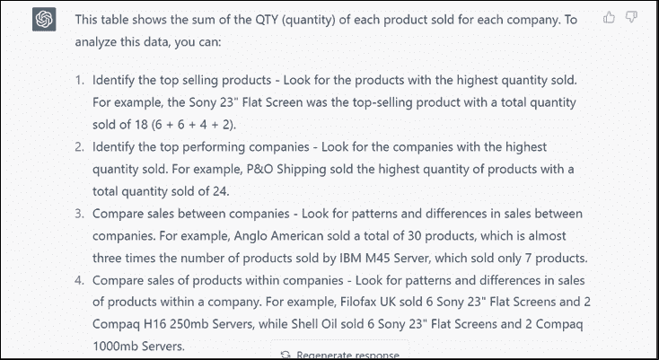
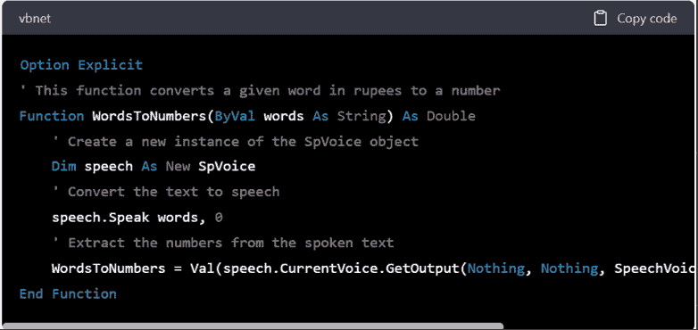
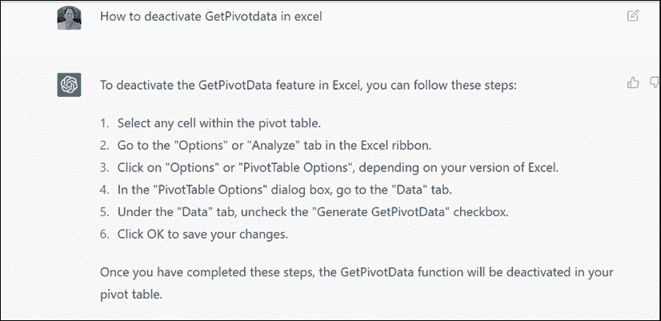

# 第二十五章 ChatGPT 与 Excel

介绍

在本章中，我们将探讨如何将 ChatGPT 与 Excel 集成。Excel 是一个强大的数据组织和分析工具，而 ChatGPT 是一个可以在各种 Excel 相关任务中提供帮助的 AI 语言模型。通过结合这些工具，您可以利用两者的功能来增强您的 Excel 体验。

结构

在本章中，我们将讨论以下主题：

+   使用 ChatGPT 与 Excel

目标

通过本章结束时，读者将学会如何将 ChatGPT 与 Excel 集成，以实现各种目的，进一步发挥 Excel 的功能，并提高在数据分析、公式故障排除和格式设置等任务中的效率。

使用 ChatGPT 与 Excel

Excel 是一个强大的组织和分析数据的工具，另一方面，ChatGPT 是一个可以在包括 Excel 在内的各个领域提供帮助的 AI 语言模型。以下是您可以一起使用 Excel 和 ChatGPT 的一些方式：

+   请求 Excel 函数和公式的帮助：您可以向 ChatGPT 请求帮助解决您遇到困难的特定 Excel 函数或公式。只需描述问题或提供示例，ChatGPT 可以提供解决方案或提供逐步指南，如图 25.1 所示：

    

    图 25.1：向 ChatGPT 请求 Excel 函数和公式的帮助

+   获取使用 Excel 的技巧和窍门：ChatGPT 可以为更有效地使用 Excel 提供技巧和窍门。例如，您可以要求快捷方式、格式设置技巧或自动化任务的方法，如图 25.2 所示：

    

    图 25.2：向 ChatGPT 询问如何使用 Excel 的技巧和窍门

+   从数据分析中获取见解：Excel 可用于分析数据并生成见解，如图 25.3 所示。ChatGPT 可以帮助您解释分析结果或建议新的查看数据的方式，如图 25.4 所示：

    

    图 25.3：Excel 上的数据

转到 ChatGPT，在聊天中写下如何分析这些数据。回应如图 25.4 所示：

图 25.4：ChatGPT 如何分析这些数据

+   在 Excel 电子表格上进行协作：您可以使用 ChatGPT 与他人在 Excel 电子表格上进行协作。例如，您可以要求 ChatGPT 建议对电子表格进行更改或改进，或者就数据的特定方面提供反馈。图 25.5 展示了一个带有数据的电子表格：

    

    图 25.5：带有数据的电子表格

请求 ChatGPT 对图 25.5 中显示的数据透视表提供反馈，生成以下回应：

图 25.6：ChatGPT 的回应

+   对于在 Excel 中编码：您可以使用 ChatGPT 生成任何代码；例如，使用 VBA 在 Excel 中将数字转换为单词。

要在 Excel 中使用 VBA 将单词转换为卢比数字，您可以创建一个自定义函数，该函数使用 Microsoft Speech 对象库将文本转换为语音，然后从所说的文本中提取数字。以下是您可以执行此操作的示例：

1.  打开一个新的 Excel 工作簿，按 Alt + F11 打开 VBA 编辑器。

1.  在编辑器中，转到插入 | 模块，创建一个新模块。

1.  在新模块中，复制并粘贴图 25.7 中显示的代码：

    

    图 25.7：要复制到新模块的代码

1.  保存模块并返回到您的 Excel 工作表。

1.  在您想要将单词转换为卢比数字的单元格中，输入以下公式：

    =WordsToNumbers(“仅两千五百卢比五十派仅”)

1.  按 Enter 键计算结果。

1.  此公式将单词“仅两千五百卢比五十派仅”转换为数字 2500.50。您可以将示例文本替换为您要转换的实际文本。

总的来说，Excel 和 ChatGPT 的结合可以帮助您更高效、更有效地处理数据，并为您的工作提供新的见解和视角。假设您有一张包含公司销售数据的电子表格。您想要计算每个月的总销售额，并创建一个图表来可视化数据。为此，您需要按照以下步骤操作：

1.  首先，您可以使用 Excel 创建一个新列，并使用 MONTH 函数从销售数据中提取日期的月份。

1.  然后，您可以使用 SUMIFS 函数计算每个月的总销售额。您需要为函数指定条件，以便对每个月的销售数据进行求和。

1.  一旦您有了总数，您可以创建一个图表来可视化数据。选择您的数据，转到插入选项卡，并选择您想要创建的图表类型。

1.  如果您不确定要使用哪种图表类型或如何格式化图表，可以向 ChatGPT 寻求建议。例如，您可以询问“用于按月可视化销售数据的最佳图表类型是什么？”或“如何使我的图表更具视觉吸引力？”

1.  ChatGPT 可以根据最佳实践和设计原则提供建议。如果您不确定如何使用 Excel 中的特定功能或设置，也可以向 ChatGPT 询问。参考图 25.8 作为示例：

    

    图 25.8：向 ChatGPT 寻求有关 Excel 中特定功能或设置的帮助

总的来说，使用 Excel 和 ChatGPT 一起可以帮助您更高效、更有效地处理数据，并为您的工作提供新的见解和视角。

结论

总之，将 ChatGPT 与 Excel 集成为用户提供了有价值的帮助和指导。通过利用 Excel 函数和公式的强大功能，再加上 ChatGPT 的能力，用户可以提高在数据分析、公式故障排除和格式设置等任务中的效率。ChatGPT 还可以提供有关更有效使用 Excel 的技巧、窍门和见解。此外，与 ChatGPT 合作在电子表格上进行协作并从 ChatGPT 获取反馈，可以增强使用 Excel 的整体体验。通过结合这些工具，用户可以优化其数据管理和分析工作流程，从而提高生产力和做出更好的决策。

练习

1.  打开 Microsoft Excel 并创建一个新工作簿。

1.  在工作表中输入以下示例销售数据

    | 日期 | 销售额 |
    | --- | --- |
    | 01-01-2023 | $500 |
    | 05-01-2023 | $300 |
    | 10-02-2023 | $750 |
    | 15-02-2023 | $600 |
    | 03-03-2023 | $900 |
    | 07-03-2023 | $400 |

表 25.1：示例销售数据

创建一个执行以下任务的 VBA 宏：

1.  计算每个月的总销售额。

1.  确定销售额最高的月份。

1.  在消息框中显示计算出的总额和销售额最高的月份。

加入我们书籍的 Discord 空间

加入该书的 Discord 工作区，获取最新更新、优惠、全球科技动态、新发布内容以及与作者的交流：

**[`discord.bpbonline.com`](https://discord.bpbonline.com)**

