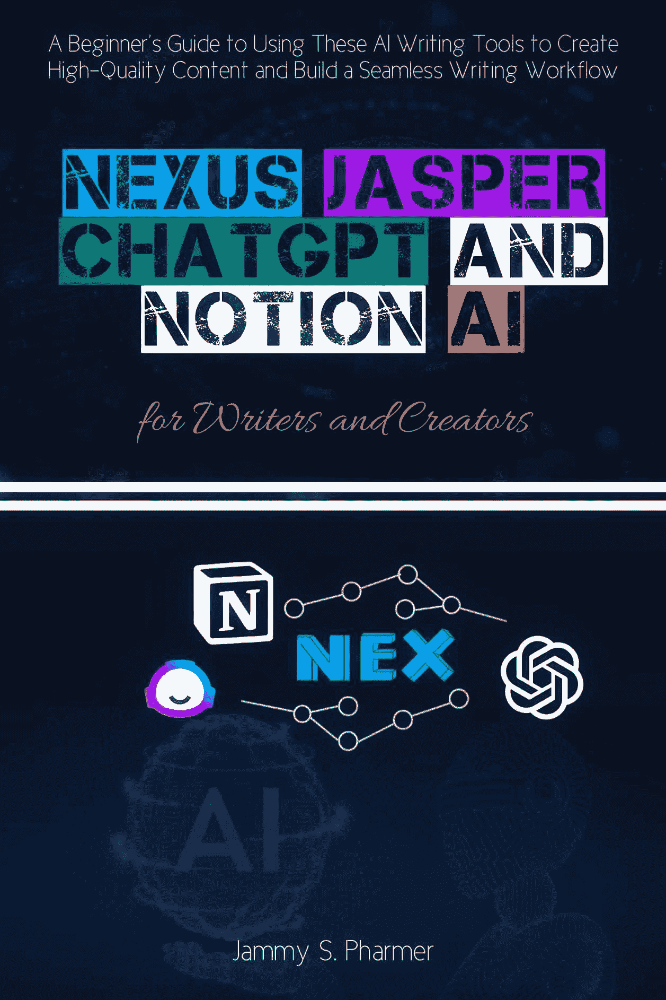

# 作家和创作者的 Nexus、Jasper、ChatGPT 和 Notion AI

> 原文：[Nexus, Jasper, ChatGPT, and Notion AI for Writers and Creators:](https://annas-archive.gl/md5/10f4ebfb07a89d34da2141eff7d3a832)
> 
> 译者：[飞龙](https://github.com/wizardforcel)
> 
> 协议：[CC BY-NC-SA 4.0](https://creativecommons.org/licenses/by-nc-sa/4.0/)

使用这些 AI 写作工具创建高质量内容并构建无缝写作工作流程的入门指南

引言

欢迎来到写作的未来

在数字创作的不断演变中，人工智能（AI）已经开辟了自己的领域，成为塑造我们内容生产方式的一种变革性工具。对于作家、博主、营销人员、教育者和自由职业者来说，AI 提供了一个前所未有的机会，以简化工作流程、增强创造力和提高生产力。本指南旨在深入探讨四个关键的 AI 工具——ChatGPT、Nexus、Jasper 和 Notion——它们正在重塑内容创作世界。通过理解这些工具及其协同工作方式，本书提供了实用的见解，帮助你有效地利用它们的潜力。AI 的兴起不是遥远的未来，而是当下的现实。从简化写作过程到提供研究协助，这些工具代表了技术在书面表达领域所能提供的尖端技术。有了它们的帮助，作家不再受限于耗时从零开始起草内容。相反，他们可以专注于最重要的事情——塑造想法、构建叙事和有效地与受众沟通。

这本书的目的很简单：赋予你，作为作家或创作者，利用人工智能在日常工作流程中有效工作的实用技能。无论你是经验丰富的专业人士还是步入人工智能世界的初学者，目标都是为你提供可操作的知识。我们将探讨的工具具有现实世界的应用和多种用例，从生成博客文章和社交媒体内容到创作完整长篇书籍和教育材料。

今天人工智能对作家和内容创作者意味着什么

对于作家和内容创作者来说，人工智能进入他们的工具箱是一场变革。写作，曾经被视为根植于个人技能的艺术形式，现在得到了算法和机器学习模型的增强，这些模型能够分析大量数据并生成上下文相关的内容。这些 AI 模型并不取代作家；相反，它们通过简化日常任务、提供灵感和帮助内容结构化来增强他们的能力。

考虑人工智能在起草和修改内容中的作用。作家不再需要花费数小时来头脑风暴想法、制定提纲或手动编辑每一个单词。人工智能可以协助这些过程，提供建议、润色文本，甚至根据最少的信息生成整个段落。有了这种支持，作家能够专注于他们工作的创造性方面——添加独特的视角、引人入胜的叙述以及与读者产生共鸣的声音。此外，人工智能工具不断进化，这意味着它们在效率和相关性方面随着时间的推移而提高。本指南中探讨的工具——ChatGPT、Nexus、Jasper 和 Notion——代表了内容创作者可用的最先进和用户友好的系统之一。这些工具中的每一个都可以成为你写作过程中的一个重要组成部分，无论你是生成想法、优化内容以适应搜索引擎优化（SEO），还是自动化耗时的工作。随着人工智能的不断发展，它在内容创作中的作用只会越来越大。作家会发现，通过这些工具，他们与受众建立联系、创作高质量作品和按时完成任务的能力得到了显著提升。当人工智能提供支持时，写作的传统障碍，如写作障碍或缺乏时间，就不再是那么大的障碍。无论你是博主、作家、教育者还是营销人员，了解人工智能以及如何将其融入你的工作中正在成为一种必备技能。

为什么选择这本书？为了赋予初学者实用的、现实世界的 AI 工作流程

这本书的目的不是对人工智能技术进行理论探索。相反，它是一本实用的指南，旨在指导你如何在写作过程中直接应用这些工具。通过关注现实世界的流程，目标是向你展示人工智能如何无缝地融入你的日常活动中，并在写作的质量和效率上带来切实的改进。对于初学者来说，人工智能工具的广阔世界可能会让人感到不知所措。在众多选项中，很难辨别哪些工具最适合你的特定需求。本书通过专注于目前最广泛使用和最有效的四种人工智能工具来消除噪音。每一章都会逐步指导你如何使用这些工具，重点在于实际应用。最终目标是确保你在阅读完本书后，对如何将这些建筑系统整合到现有的写作流程中，并更高效地开始创作优质内容有清晰的理解。人工智能的力量在于其自动化日常任务、提供改进建议以及协助创意过程的能力。然而，当人工智能在更广泛的流程中战略性地使用时，其真正的价值才得以释放。本指南教你如何使用这里探索的工具构建这样的工作流程。通过结合 ChatGPT、Nexus、Jasper 和 Notion 的优势，你可以创建一个既提高生产力又激发创造力的统一系统。

本书面向对象：博主、作者、教育者、营销人员和自由职业者

这本书是为所有参与内容创作的人量身定制的，从博主和作者到教育者、营销人员和自由职业者。这些职业中的每一个都可以从我们探索的工具中受益，因为人工智能技术能够解决各行业作家面临的独特挑战。

例如，博主会发现像 ChatGPT 这样的 AI 工具可以帮助他们生成内容想法、撰写草稿，甚至优化他们的帖子以适应搜索引擎优化（SEO）。作者可以使用这些工具来制定情节大纲、润色对话或借助 AI 创建整个章节。另一方面，教育者和营销人员可以使用 AI 来创建教育材料、促销内容和吸引受众的有效文案。经常需要处理多个项目且截止日期紧迫的自由职业者会发现，AI 工具可以自动化重复性任务，使他们能够更多地关注核心技能。例如，自由职业者不必花费数小时进行头脑风暴或编辑草稿，他们可以依赖 AI 来生成想法并简化修订过程。因此，他们可以在更短的时间内向客户交付高质量的内容，从而承担更多的工作并增加收入。

无论你的具体职业是什么，这本书将向你展示如何将人工智能集成到现有的工作流程中，以提升你内容生产的质量和数量。目标是让 AI 成为你的工具，补充你的技能和能力，而不是取代它们。

四个工具概述：ChatGPT、Nexus、Jasper、Notion

本书讨论的四个 AI 工具——ChatGPT、Nexus、Jasper 和 Notion——在内容创作过程中各自发挥着独特的作用。理解每个工具的独特功能对于最大化它们的潜力至关重要。

1. ChatGPT：由 OpenAI 开发，ChatGPT 是最先进的语言模型之一。它擅长根据用户输入理解和生成类似人类的文本。ChatGPT 可以帮助构思想法、起草内容、回答问题和提供关于各种主题的见解。它进行自然对话的能力使其成为寻求与受众互动并产生新想法的作家们不可或缺的工具。

2. Nexus：Nexus 是一个旨在帮助创作者优化其写作流程的人工智能平台。它专注于提供高级内容生成功能，如摘要、改写和上下文文本生成。Nexus 可以通过节省时间的工具提高创作者的生产力，并提升他们所产生内容的整体质量。

3. Jasper：以其在几秒钟内生成高质量副本的能力而闻名，Jasper 非常适合营销人员和内容创作者，他们希望制作 SEO 优化的博客文章、产品描述、广告文案等。Jasper 的设计重点在于营销文案，使其成为数字营销领域任何人的必备工具。

4. Notion：虽然 Notion 广为人知是一个生产力工具，但其增强人工智能的功能使其成为寻求组织思想、研究和内容的作家们的绝佳选择。Notion 允许作家创建数据库、管理项目并以支持无缝写作流程的方式构建内容。AI 集成通过自动化某些任务，如总结笔记和生成内容想法，帮助作家。

这些工具的每个选择都是基于其在内容创作中的实际应用，指南将展示如何将它们组合使用以简化你的写作流程。

如何使用本指南：分步项目和集成

本书旨在通过实际操作经验帮助您学习。每一章都介绍了一种工具的逐步使用方法，随后通过一个项目展示如何将其整合到您的写作流程中。到本书结束时，您将掌握这些 AI 工具的核心功能，并能够协同使用它们来改进您的创作过程。这些项目旨在具有教育性、实用性和易于遵循。您将学习如何从头到尾使用 AI 创建内容，利用每个工具的独特优势。这些项目对初学者尤其有益，因为它们提供了清晰的指导和示例，帮助您完成学习过程。

通过这些项目，您将学习如何产生想法、组织内容、撰写和修改草稿，以及优化您的作品以获得最大影响。随着您的进步，您将发现如何将 AI 整合到您的日常工作中，以增强您的写作能力并节省时间。在接下来的章节中，您会发现这些 AI 工具与您的写作流程的整合将变得自然而然。无论您是作家、博主、营销人员还是自由职业者，通过本指南培养的技能将帮助您更聪明地工作，而不是更辛苦地工作。

第一章

开始使用 AI 写作工具

人工智能（AI）融入写作工具标志着内容创作领域的变革时期。从博客到书籍，从社交媒体帖子到营销文案，AI 已经彻底改变了内容的生成、编辑和优化方式。本章介绍了 AI 写作工具、它们的特性以及如何增强您的写作流程。它将探讨这些工具为何具有如此大的影响力，指导您选择正确的工具，解释关键术语，帮助您设置工具包，并讨论在写作中使用 AI 的伦理影响。

1.1 什么让 AI 写作工具具有颠覆性？

AI 写作工具正在以前所未有的方式颠覆内容创作。在其核心，这些工具利用复杂的机器学习模型和自然语言处理（NLP）技术来生成和优化模仿人类语言模式的文本。这种创新具有颠覆性的原因有很多，所有这些都有助于提高作家的效率和创造力。

首先，AI 写作工具能够快速处理大量信息。它们可以分析主题、研究数据和历史内容，其规模是人类无法复制的。作家可以使用 AI 来协助产生想法、构建文章结构、撰写初稿，甚至以传统所需时间的一小部分完成整个项目。这种速度和效率使作家能够更多地关注其工作的创造性方面，而不是被繁琐的起草和编辑任务所困扰。

其次，这些工具提供个性化的建议和优化，从而提高内容质量。通过机器学习，人工智能可以评估您写作的语气、风格和结构，并提供如何使其更具吸引力、更有说服力或更易读的建议。通过用户交互和反馈不断改进的能力确保了人工智能写作工具能够根据作者的特定偏好进行演变和适应。

此外，人工智能写作工具通常内置了内容优化的功能。这包括如 SEO 关键词优化、句子改写建议甚至调整语气以适应特定受众等功能。对于博主、营销人员和内容创作者来说，这意味着他们的写作不仅更高效，而且更有助于实现其目标。自动化写作过程中的某些方面，如研究、大纲或结构，可以减轻作者的心理负担。随着 AI 执行重复性和耗时的工作，作者可以将精力集中在创作引人入胜的叙述和有意义的内

从本质上讲，人工智能写作工具赋予作者更高的生产力、更多的创造力和更专注于写作真正重要的方面。结果是，作者可以在更短的时间内放大他们的努力，生产出更加精致、专业的作品。

1.2 如何选择适合您需求的工具

选择人工智能写作工具是一个至关重要的决定，它取决于作者的具体需求和目标。在众多工具中，每个工具都提供不同的功能，因此评估工具的功能、灵活性和对您独特写作任务的适用性非常重要。选择合适的 AI 工具的第一步是了解您想用它达到什么目标。如果您是一位希望快速生成内容的博主，您可能需要一个擅长以最少输入草拟文章的工具。对于营销人员或广告商，一个能够生成高转化率文案或广告脚本的 AI 工具可能更为合适。对于作家或教育工作者，您可能需要一个帮助生成想法、撰写大纲甚至整章的工具。

在评估人工智能写作工具时，需要考虑的一个关键特性是它用于内容生成的模型。最好的工具由先进的模型驱动，如 GPT-4 或其他最先进的语言模型，这些模型能够理解上下文，在长段落中保持连贯性，并生成符合期望语气的文本。这些模型通常更为复杂，能够生成更自然、更精致、更类似人类的文本。

接下来，考虑工具提供的定制化程度。一些 AI 写作工具提供“即插即用”的体验，你只需输入一个主题，然后让工具生成内容。然而，其他工具则提供更高级的定制选项，例如调整文本的语气、风格和结构。如果你需要精细控制写作，寻找提供灵活输出设置的工具有助于你精确指定内容的呈现方式。

另一个重要的考虑因素是工具处理不同类型内容的能力。一些 AI 工具专注于生成博客文章和文章，而其他工具则针对特定的格式，如电子邮件副本、产品描述或社交媒体帖子。对于在多种格式下工作的作家来说，选择一个能够在不同内容类型之间无缝切换的工具至关重要。

最后，评估用户界面和易用性。一个直观且易于导航的工具将有助于你在长期内节省时间和精力。寻找易于与其他平台集成的工具，如文字处理器、内容管理系统或 SEO 工具，以简化你的工作流程。选择合适的 AI 写作工具取决于你了解自己的需求以及不同工具如何与你的写作过程相匹配。通过仔细评估可用选项，你可以找到一个补充你的工作流程并最大化你生产力的工具。

1.3 必要术语：提示、标记、工作流程、模板

当你开始使用 AI 写作工具时，你将遇到几个基本术语和概念，这些术语和概念对于理解这些工具的工作方式至关重要。熟悉这些术语将帮助你导航 AI 领域并更有效地使用这些工具。

● 提示：提示是提供给 AI 写作工具的输入或指令，用于生成内容。提示的复杂度可能有所不同，从简单的短语或关键词到更详细的关于你希望创建的内容类型的指令。提示的清晰度和具体性直接影响 AI 生成输出的质量和相关性。在大多数 AI 写作工具中，你会在文本框中提供提示，然后模型根据你的输入生成内容。

● 标记：标记是指 AI 处理和生成的单个文本单元。这些标记可以是单词、单词的一部分或标点符号。例如，“Hello, world!”由三个标记组成：“Hello,”、“world,”和标点符号“!”。AI 模型通常用标记来衡量它们的处理能力，理解标记限制很重要，因为它们直接影响输出的长度和细节。许多 AI 工具，尤其是基于 GPT 模型的工具，对每个查询都有一个最大标记限制。

● 工作流程：工作流程是指作家在使用 AI 写作工具时遵循的一系列步骤或过程。这可能包括输入提示、审查和编辑 AI 生成的文本、优化内容以及发布。简化工作流程是使用 AI 写作工具的关键优势之一，因为它们有助于自动化各种任务，如生成初稿、建议编辑或提高内容的可读性。

● 模板：模板是 AI 工具提供的预构建格式或结构，帮助作家创建特定类型的内

1.4 设置你的 AI 工具包（基本账户设置与免费/付费选项）

要开始使用 AI 写作工具，你需要设置你的工具包。这包括选择最适合你需求的工具，创建账户，以及了解可用的不同定价选项。许多 AI 写作工具提供免费和付费版本，每个版本都有其自己的功能集。当你首次注册 AI 写作工具时，你通常会被提示创建一个账户。这个过程通常很简单，只需要提供一些基本信息，比如你的名字、电子邮件地址，如果你选择付费计划，有时还需要提供支付详情。一旦你的账户创建成功，你将获得访问平台功能的权限。

对于初学者来说，许多工具提供免费版本或试用期，让你可以在不做出财务承诺的情况下探索工具的功能。这些免费版本通常有一些限制，比如受限的字数或对高级功能的访问。然而，它们是熟悉平台并确定它是否符合你需求的一个极好方式。

付费选项通常提供更广泛的功能，例如访问更多令牌、更高品质的输出和额外的定制选项。这些付费计划的定价可能因工具的功能和服务水平而显著不同。一些工具按使用次数收费，而其他工具则采用按月或按年订阅的模式。在选择计划时，考虑你计划多久使用一次 AI 工具以及你需要什么样的输出。如果你是一个休闲作家，免费版本可能就足够了。然而，如果你计划生产大量内容或需要更高级的功能，付费计划可能是必要的。

1.5 AI 伦理与你的声音：保持真实

随着 AI 越来越成为内容创作过程不可或缺的一部分，围绕其使用的伦理考量变得越来越突出。作者必须注意如何将 AI 融入他们的工作中，确保其与他们的价值观相符并保持他们声音的真实性。主要的伦理担忧之一是 AI 生成的内容可能具有误导性或欺骗性。虽然 AI 可以生成高质量的文本，但它无法像人类作者那样理解上下文。因此，作者应始终审阅和编辑 AI 生成的文本，以确保其准确、事实核查并与他们的信息一致。过度依赖 AI 进行内容创作而缺乏适当的监督可能导致错误、误解甚至剽窃。

此外，作者在使用 AI 写作工具时必须确保他们的独特声音得到保留。AI 可以复制语言模式并根据现有数据生成文本，但它无法复制定义个人写作风格的细微差别、情感和创造力。作者应将 AI 视为提升写作的工具，而不是替代品。通过在 AI 辅助和自身创造力之间保持平衡，作者可以创作出既高效又真正属于他们自己的内容。

最后，使用 AI 写作工具引发了关于作者身份和知识产权的问题。作者必须对其使用 AI 保持透明，尤其是如果他们使用 AI 生成的文本进行商业用途时。这种透明度有助于建立与读者的信任，并确保作者与 AI 的关系在伦理上是健全的。将 AI 融入写作过程提供了显著的好处，但以意识和责任感来对待它是至关重要的。通过保持清晰的伦理框架并忠实于你独特的声音，你可以利用 AI 创作出引人入胜、真实的内容，与你的受众产生共鸣。

第二章

掌握 ChatGPT 用于写作与研究

由 OpenAI 开发的 ChatGPT 是一个强大的语言模型，它重塑了我们对写作、研究和内容生成的看法。凭借其根据简单提示生成类似人类文本的能力，ChatGPT 已成为内容创作者、营销人员和研究人员的关键工具。本章深入探讨了 ChatGPT 的核心功能，并探讨了有效利用它来撰写博客文章、概述文章、进行研究和更多实际应用的方法。

2.1 什么是 ChatGPT？其功能概述

本质上，ChatGPT 是 OpenAI 的 GPT（生成式预训练变换器）语言模型的一个变体。经过海量文本数据的训练，ChatGPT 能够根据用户输入生成连贯、上下文相关的回复。其优势在于理解自然语言提示的能力，这使其成为各种写作和研究任务的卓越工具。ChatGPT 的工作原理是根据初始输入预测序列中的下一个词。这基于其在训练阶段学习到的模式。它可以进行对话、回答问题、撰写文章、生成创意内容，甚至模拟个性。ChatGPT 可以处理多种多样的内容形式，从随意对话到高度结构化的专业写作。该模型在自然语言生成方面表现出色，意味着它能生成流畅、自然的可读内容。这一特性使其在内容创作任务中极其有用，例如撰写博客文章、生成社交媒体文案，甚至创建电子邮件序列。其多功能性使其能够适应不同的写作风格，无论是正式、非正式、幽默还是技术性的语气。

然而，ChatGPT 的真正力量在于其协助写作和研究的能力。与传统的写作助手不同，ChatGPT 不仅能纠正语法和标点；它可以根据简短的提示生成整个段落或页面的内容。当任务涉及结构化信息时，例如概述文章或头脑风暴主题，它尤其有效。其与外部数据源和数据库的集成也使其能够通过总结相关材料和发现关键见解来辅助研究。总之，ChatGPT 不仅仅是一个写作工具；它是一个多方面的助手，使用户能够更高效地写作、创作和研究。无论你是在处理博客文章、书籍还是广告活动，ChatGPT 都能提供宝贵的支持，简化流程并提高生产力。

2.2 使用提示词撰写博客文章（分步指南）

使用 ChatGPT 撰写博客文章，首先要明确定义主题并提供精心设计的提示。生成内容的质量在很大程度上取决于输入的具体性和清晰度。以下是使用 ChatGPT 撰写博客文章的分步方法：

步骤 1：定义主题

在与 ChatGPT 互动之前，必须确定博客文章的主题。例如，如果你要写关于“冥想的好处”，你可以向 ChatGPT 提供类似这样的提示：“写一篇讨论冥想对心理健康益处的博客文章。”

步骤 2：提供结构化提示

ChatGPT 在结构化输入下表现更佳。为获得最优结果，请将任务分解为清晰的模块。例如，与其要求生成一篇笼统的博客文章，不如要求一篇包含以下部分的博客文章：

引言

三个主要好处

结论

例如，您可以输入：

“写一篇博客文章，包括引言、冥想对心理健康三个关键益处，以及针对初学者的具体建议的结论。”

第 3 步：生成和编辑

一旦输入提示，ChatGPT 将生成一个响应。最初的输出可能是一个很好的起点，但可能需要一些微调。审查生成的内容，编辑以提高清晰度，并删除任何不相关的部分。您还可以要求 ChatGPT 对文章的特定部分进行精炼，例如增加细节或使结论更具影响力。

第 4 步：增强 SEO（可选）

对于旨在在搜索引擎上排名靠前的博客文章，SEO 至关重要。在生成内容后，您可以使用 ChatGPT 来协助关键词优化。提供您希望包含的关键词列表，并要求 ChatGPT 对某些部分进行修订以优化 SEO，同时不损害写作的流畅性和质量。

第 5 步：最终确定并发布

在审查和精炼内容后，您将准备好发布您的博客文章。ChatGPT 通过让您专注于战略元素，如 SEO 和风格，从而在写作过程中节省时间，而工具则处理内容生成的繁重工作。

通过遵循这些步骤，您可以利用 ChatGPT 简化撰写博客文章的过程。该工具不仅快速生成文本，而且产生的文本内容连贯、主题相关且质量高。

2.3 使用 ChatGPT 生成书籍、文章和剧本的大纲

ChatGPT 最强大的功能之一是协助大纲创建过程。撰写一本书、文章或剧本可能会让人感到不知所措，尤其是当你不确定从哪里开始时。ChatGPT 可以作为头脑风暴伙伴，帮助将复杂的思想分解成可消化的组成部分。以下是有效使用它的方法：

第 1 步：定义范围和目的

首先向 ChatGPT 提供一个清晰的项目范围。对于一本书，请指定类型、目标受众和主要主题。对于一篇文章，确定主题和您想要涵盖的关键点。

例如：

“我想写一本关于小企业数字营销策略的书。目标受众是初学者。请为我创建一本 10 章书的详细大纲。”

对于一篇文章：

“请概述一篇关于人工智能如何改善内容营销的文章。”

第 2 步：生成大纲

ChatGPT 可以根据您的指示生成一个全面的大纲。对于书籍或长篇内容，它通常会建议一个包含引言、关键章节和结论的结构。对于文章，它可能会将内容分解为涵盖引言、关键论点和总结的章节。

第 3 步：精炼大纲

审查生成的大纲，并向 ChatGPT 提供反馈以进行细化。如果任何部分需要更具体或扩展，你可以要求 ChatGPT 对特定章节或要点进行详细阐述。例如，如果一本书的大纲第五章感觉过于模糊，你可以提示：

“扩展第五章：小企业社交媒体策略。包括提高参与度的实用技巧。”

第 4 步：使用大纲进行内容生成

一旦你有一个稳固的大纲，你可以继续对其进行细化，或者根据提供结构开始写作。有了大纲在手，ChatGPT 可以帮助为每个部分生成内容，确保写作保持组织性和与原始愿景的一致性。

ChatGPT 生成详细、逻辑大纲的能力在处理复杂项目时是一笔宝贵的财富。它可以通过建议内容结构和提供整个写作过程的清晰路线图来节省作者大量时间。

2.4 使用 ChatGPT 进行研究：如何核实事实并深入探究

虽然 ChatGPT 是生成想法和撰写草稿的优秀工具，但在事实准确性方面并非完美无缺。了解如何利用 ChatGPT 进行研究——更重要的是，如何验证和扩展其输出——是至关重要的。

第 1 步：要求提供参考文献

当使用 ChatGPT 进行研究时，始终要求提供来源或参考文献，尤其是如果你正在处理事实性主题。例如：

“提供关于人工智能内容创作最新趋势的信息，包括来源。”

这将提示 ChatGPT 生成一个包含链接到可靠来源的响应，例如研究、文章或专家意见。然而，始终手动核对这些来源，以确保信息准确且最新。

第 2 步：使用 ChatGPT 总结复杂主题

当你需要将复杂的研究提炼成易于消化的摘要时，ChatGPT 非常有价值。如果你正在处理学术论文或长篇报告，你可以提示：

“用 300 字总结 2023 年 AI 趋势报告的关键发现。”

模型将提供一个简化的版本，让你能够快速抓住要点。

第 3 步：通过后续问题深入挖掘

如果你需要更详细的见解或更广泛的背景信息，使用后续问题深入特定领域。例如，如果 ChatGPT 生成关于 AI 趋势的基本概述，你可以跟进：

“更详细地解释人工智能对内容个性化的影响。”

通过一系列迭代提示，你可以逐步构建对主题的更全面理解。

2.5 ChatGPT 用于电子邮件序列、广告文案和创意写作

ChatGPT 非常灵活，可以协助各种形式的内容创作，而不仅仅是标准文章。以下是如何使用它来创建电子邮件序列、广告文案和创意写作。

电子邮件序列

创建电子邮件序列可能是一项艰巨的任务，尤其是在尝试平衡个性化和效率时。ChatGPT 通过生成个性化、引人入胜的文案来简化这一过程。例如，如果你正在推广一款新产品，你可以向 ChatGPT 输入以下提示：

“为介绍一款面向作家的新 AI 工具创建一个 5 部分电子邮件序列。”

工具将生成一系列电子邮件，每封都有明确的目的，例如介绍产品、解决痛点或突出客户评价。它甚至可以建议提高打开率的主题行。

广告文案

对于广告文案，ChatGPT 可以生成简洁、有影响力的文本，旨在吸引注意力。通过提供产品或服务的清晰描述，ChatGPT 可以为展示广告、社交媒体帖子或搜索引擎广告创建文案。一个提示可能如下所示：

“为针对小型企业的全新数字营销服务撰写一个引人入胜的谷歌广告描述。”

ChatGPT 将复杂信息压缩成简短、有说服力的陈述的能力使其成为营销人员宝贵的资产。

创意写作

除了专业写作，ChatGPT 还能协助创意写作，如故事、诗歌或剧本。通过提供如下提示：

“写一个关于一位年轻发明家创造革命性 AI 工具的短篇故事。”

ChatGPT 可以生成富有想象力和吸引力的叙述。

2.6 常见错误及如何修复不良输出

虽然 ChatGPT 是一个强大的工具，但它并非没有局限性。常见问题包括重复的语言、不准确的信息，以及可能缺乏连贯性或创造性的输出。以下是修复这些错误的策略：

1. 重复的语言：如果 ChatGPT 生成重复或冗余的文本，重新措辞你的提示以要求多样性。例如，与其要求“列出冥想的好处”，尝试“列出对精神和身体健康都有益的冥想独特好处。”

2. 不准确的信息：如果 ChatGPT 生成的内容包含错误，你可以要求它澄清或纠正信息。例如，“你能提供更多关于冥想经济效益的准确数据，并引用来源吗？”

3. 缺乏创意：当输出感觉平淡无奇或缺乏原创性时，尝试在提示中引入更具体的指令。例如，与其要求一个简单的博客文章，你还可以要求对主题进行创意处理：“写一篇关于冥想的博客文章，融入独特的隐喻和生动的意象。”

通过遵循这些策略，你可以修复常见错误并提高 AI 生成内容的品质。

精通 ChatGPT 需要了解如何有效地利用其优势，同时承认其局限性。通过深思熟虑的提示和迭代优化，ChatGPT 可以成为写作、研究和内容创作不可或缺的工具。

第三章

使用 Nexus AI 提升内容

人工智能持续重塑着各个行业，内容创作是其中最被改变的领域之一。推动这一变革的工具之一是 Nexus AI，这是一个强大的内容生成平台，它提供了独特的功能，以简化写作过程。Nexus AI 因其定制的功能、高级特性和在多个写作和内容创作领域的专业应用，与其他 AI 模型（包括 ChatGPT）区别开来。本章探讨了 Nexus AI 的工作原理，它相对于其他 AI 工具的优势，以及如何在不同的环境中有效使用，从学术写作到网站内容生成和配音脚本。

3.1 Nexus AI 是什么？为什么它独一无二？

Nexus AI 是一个前沿平台，它使用机器学习算法在多种格式下生成内容，使其成为作家、营销人员和内容创作者不可或缺的工具。Nexus AI 在速度和质量上都有深入的关注，为那些通常需要大量时间和精力的任务提供了一种多功能的解决方案。

Nexus AI 的主要区别在于它能够提供更精确的内容生成能力，这不仅因为它模仿了类似人类的语言，还因为它为特定用例提供了直观的设计。它旨在与各种工作流程集成，帮助用户从创意文案和 SEO 优化的文章到高度技术性的报告和配音脚本等一切内容的生产。Nexus AI 使用高级语言模型和复杂的算法来理解上下文，确保内容不仅语法正确，而且连贯且与上下文相关。Nexus AI 的一个关键特性是其可定制的模板，这些模板满足不同的写作需求。这些模板允许用户根据特定的参数生成内容，例如字数、语气或格式。此外，Nexus 还提供内置的编辑助手，帮助精炼内容，使其清晰、吸引人且结构合理。这个特性对于那些希望快速生产高质量内容而又不牺牲深度或原创性的用户特别有用。Nexus AI 的独特价值主张还在于其与外部 API、数据库和内容管理系统的集成。这使得它能够实时获取信息、数据点和趋势，确保生成的内容是最新和相关的。这使得 Nexus 对于需要确保他们生产的内容准确性和时效性的作家、研究人员和营销人员特别有用。

3.2 Nexus 与 ChatGPT 对比：它做得更好的地方

虽然 Nexus AI 和 ChatGPT 都是复杂的语言模型，但它们的功能和应用存在显著差异。这两个工具都由先进的自然语言处理（NLP）模型驱动，但它们的目标用例、性能和定制选项使它们各具特色。

专业化：Nexus AI 的设计考虑到了更广泛的内容类型。它不仅用于生成文本，还用于组织内容、建议编辑，甚至优化 SEO。另一方面，ChatGPT 在生成对话文本和回答问题方面表现出色。它更适合交互式任务和基于提示指令生成内容。虽然 ChatGPT 的回答通常是概括性的，但 Nexus AI 的优势在于其针对特定任务的定制化，使其更适合需要更多工作结构的内容创作者。

内容结构化：Nexus AI 在内容结构化方面优于 ChatGPT 的一个领域。Nexus 提供模板和工作流程，允许用户输入特定参数（例如，字数、受众、写作风格），并输出详细、有组织的草稿。这对于需要清晰性和连贯性的专业环境来说非常理想。虽然 ChatGPT 能够生成涵盖各种主题的文本，但它并不擅长以遵循特定指南或格式的方式结构化内容。

SEO 和营销整合：Nexus 内置了针对营销人员和 SEO 专家定制的功能。它可以分析趋势、建议关键词，并提供 SEO 友好的内容建议，这不是 ChatGPT 的核心功能。如果你的目标是生产在搜索引擎上排名良好的网络内容，Nexus 能够处理关键词整合、SEO 审计和基于 SEO 指南的内容修订。ChatGPT 可以协助 SEO，但 Nexus 在关键词研究、优化和搜索引擎排名方面提供了更强大的支持。

定制化和用户控制：Nexus AI 为用户提供更多对生成内容的控制。它允许进行详细的定制选项，例如指定语气、声音和风格，使其更能适应各种写作需求。例如，你可以告诉 Nexus 生成正式语气的内容，或者更口语化的内容，取决于受众。虽然 ChatGPT 很灵活，但它并不提供相同水平的风格和语气控制。除非给出非常具体的提示，否则其回答可能会显得有些标准化。

当 ChatGPT 在头脑风暴和快速内容生成方面表现出色时，Nexus AI 更适合那些需要更多控制、结构和专业工具进行内容生产的人。

3.3 使用 Nexus 进行学术写作与报告

Nexus AI 生成结构良好、连贯文本的能力使其成为学术写作和报告生成的理想工具。学术写作通常需要清晰的论证、精确的引用和遵循特定的格式指南——Nexus AI 能够很好地满足这些需求。

第一步：构建您的报告

首先，Nexus AI 允许用户为研究论文、报告和论文创建结构化的提纲。通过输入主题和所需部分（例如，引言、文献综述、方法、结论），用户可以收到一个高度详细的结构，这将成为报告的骨架。这有助于简化写作过程，并确保不会遗漏任何重要内容。

第 2 步：内容生成

一旦确定了提纲，用户可以利用 Nexus AI 的内容生成工具来填充每个部分。该工具可以根据输入参数生成详细的解释、定义和分析。Nexus 能够适应学术论文中常见的风格和语气，确保生成的内容与学术写作所需的正式写作风格相一致。

第 3 步：研究协助

Nexus AI 在开展研究方面也非常有用。它可以从各种学术数据库和可靠来源中提取信息，提供相关数据、统计和研究来支持你的论点。例如，你可以向 Nexus 提出具体的研究问题，如：

“2022 年关于气候变化对农业影响的研究有哪些关键发现？”

Nexus 将生成相关学术工作的摘要或引用，帮助你了解你所在领域最新的研究成果。

第 4 步：编辑和优化

内容生成后，Nexus AI 的编辑助手可以帮助润色论文。它可以建议在清晰度、结构和风格方面的改进，使论文更加连贯和易读。Nexus 还可以检查常见的写作错误，如语法错误或时态不一致。

3.4 博客和网站内容生成工作流程（实操示例）

对于博客作者和数字营销人员，Nexus AI 提供了一个从最初的想法到最终优化的优秀内容生成工作流程。

第 1 步：创意生成

Nexus AI 可以根据关键词、趋势或受众偏好来协助进行头脑风暴。例如，你可以输入一个查询，如：

“生成关于内容营销中 AI 主题的博客文章想法。”

Nexus 将提供一系列博客文章标题，例如“AI 如何改变中小企业内容营销”或“AI 在个性化客户体验中的作用。”

第 2 步：内容创作

一旦选定了主题，Nexus 可以使用提供的提示生成整篇文章。你可以指定所需的长度、语气和写作风格。例如，你可能输入：

“撰写一篇关于初学者内容营销中 AI 的 1,500 字博客文章。使用对话式语气并包含示例。”

Nexus 将生成内容，然后你可以根据你的专业知识和品牌声音进行细化。

第 3 步：SEO 优化

完成草案后，Nexus 可以通过建议相关关键词和提升内容的可读性来协助进行 SEO 优化。例如，你可以提示：

“优化博客文章，使其针对关键词‘AI 内容营销工具’，并检查可读性评分是否高于 60。”

Nexus 将分析文本，建议包含的关键词，并改进句子结构以提高可读性。

第 4 步：发布和跟踪性能

Nexus 甚至可以帮助将内容集成到内容管理系统 (CMS) 中，并跟踪其在不同平台上的性能。凭借其集成能力，Nexus 可以自动化内容创建和分发过程的部分，节省时间并提高您营销活动的效率。

3.5 使用 Nexus 创建旁白脚本和图像提示

Nexus AI 不仅在生成书面内容方面表现出色，而且在生成旁白脚本和为设计师提供视觉提示方面也表现出色。

旁白脚本

在创建旁白脚本时，脚本的风格和节奏至关重要。Nexus 可以生成针对特定格式的脚本，无论是商业广告、解释视频还是旁白。例如，您可以输入：

“为推广新人工智能软件工具的 YouTube 广告生成 30 秒的旁白脚本。”

Nexus 将生成一个简洁、引人入胜的脚本，与目标受众和媒体保持一致。

图像提示

Nexus 也可以用来创建详细的图像提示。设计师可以使用 Nexus 生成特定图像或图形的视觉方向。例如，你可以要求 Nexus：

“生成一个用于创建未来人工智能工作空间视觉表现的提示。”

工具将提供所需图像的详细描述，然后可以将其交给设计师或用于设计软件。

3.6 如何在 Nexus 内部自定义语气和风格

Nexus AI 的一个突出特点是它能够自定义生成内容的语气和风格。对于作家和营销人员来说，调整语气以适应受众至关重要。Nexus 提供了多种选项，可以根据受众、目的和期望的影响等因素自定义内容。

色调调整

Nexus 允许您从一系列预定义的语气中选择，如正式、对话、专业或休闲。您还可以根据内容的上下文指定更细微的语气，如说服性、权威性或同理心。例如：

“生成一个具有说服性语气的产品描述，鼓励用户现在购买该软件。”

风格修改

对于更高级的自定义，Nexus 允许您指定写作风格。无论您更喜欢简短、有力的句子还是长篇描述性的段落，Nexus 都可以调整风格以符合您的需求。您可以输入如下指令：

“用正式的风格写作，使用学术词汇。”

或者，采用不同的语气：

“创建一个幽默和机智的对话风格。”

这些自定义功能使 Nexus 成为满足各种写作需求的多功能工具，从企业报告到轻松的博客文章。

Nexus AI 是一款功能丰富的工具，为作家、营销人员和内容创作者提供了一系列功能。它能够根据特定需求定制内容，并拥有广泛的定制选项，这使得它成为任何希望简化内容生成流程同时保持高质量的人不可或缺的资源。

第四章

使用 Jasper AI 进行专业文案写作

随着数字内容创作的不断发展，AI 驱动的工具已成为专业文案作者不可或缺的工具。在这个领域中最突出的工具之一是 Jasper AI，这是一个专门设计来帮助营销人员、作家和公司大规模生成高质量、以转化率为重点的文案的语言模型。本章深入探讨了 Jasper AI 的工作原理，探讨了其功能，并展示了如何有效地使用它进行各种类型的专业文案写作，从产品描述等短篇内容到博客文章和着陆页等长篇作品。

4.1 Jasper 是什么？快速设置和仪表板导览

Jasper AI 是一个由 OpenAI 的 GPT-3 技术驱动的最先进的内容生成平台。与通用语言模型不同，Jasper 已经针对营销和文案写作应用进行了微调，使其成为跨行业内容创作者的必备工具。它旨在帮助用户快速生成内容，无论是博客文章、社交媒体文案、电子邮件营销，甚至是书籍或白皮书等长篇作品。Jasper 的吸引力在于其能够简化文案写作流程。该平台使用复杂的算法和预训练数据集的组合，根据简单的提示生成连贯且上下文相关的内 容。这使得文案作者可以显著减少写作、构思和修订所花费的时间，从而让他们能够更多地专注于策略、创造性和优化。

设置 Jasper 是一个简单直观的过程。在注册账户后，您将看到一个干净、用户友好的仪表板。登录后，您将看到多个部分，每个部分都针对不同类型的内容创作。仪表板分为三个主要部分：

模板：创建特定类型内容（如产品描述、社交媒体帖子、博客引言）的预构建格式。

● 文档编辑器：本节允许您开始一个新项目，在这里您可以撰写或编辑长篇内容，并应用 Jasper 的全部功能进行连续文本生成。

● 老板模式：这是一种高级功能，允许用户访问更详细的内容生成，包括长篇写作，而不会受到干扰。此模式还使 Jasper 能够理解复杂的命令，使其成为需要对其文案进行详细控制的内容营销人员的理想工具。

Jasper 直观的仪表板和简单的设置允许新手和经验丰富的作家快速利用 AI 进行内容生成。对于新用户，界面提供提示和教程，确保用户能够充分利用该平台。

4.2 Jasper 的网页文案、产品描述等模板

Jasper AI 的一个突出特点是它拥有大量针对特定内容类型的模板库。这些模板通过提供预设的结构和格式，帮助用户快速创建内容。模板设计时考虑了各种目标，从生成潜在客户到品牌故事讲述。

● 网页文案

对于从事网站内容创作的专业文案撰写者，Jasper 的网页文案模板是一笔宝贵的财富。这些模板允许用户生成吸引人的标题、引人入胜的产品描述和引人注目的行动号召（CTAs）。只需输入企业或产品的简要描述，Jasper 就能生成多个变体的文案，这为内容创作者节省了时间和精力。例如，一个提示如“为提供 30 天健身挑战的健身品牌撰写着陆页”，将促使 Jasper 创建一系列结构化、引人入胜的网页文案，吸引注意力并推动转化。

● 产品描述

Jasper 的产品描述模板非常适合寻求为产品创建引人注目描述的电子商务企业。这些描述旨在突出关键特性，解决客户痛点，并说服读者进行购买。模板提供了不同语气选项，包括专业、休闲或说服性，这取决于企业的品牌指南。例如，一个提示如“为高端皮包撰写产品描述”，将生成一个精心制作、不仅详细描述产品特性，还触动购买决策中常见的情感触点的描述。

● 广告文案

创建有说服力的广告文案是 Jasper 擅长的另一个领域。无论是对 Google Ads、Facebook 还是 Instagram，平台都提供模板，使用户能够制作出简短、引人注目的广告。广告文案模板可以根据特定的营销目标进行定制，无论是旨在提高知名度、推动流量还是提升销量。

● 社交媒体帖子

Jasper 还包括社交媒体帖子模板，使用户能够创建与受众产生共鸣的帖子。这些模板帮助为不同的平台生成内容，包括 Instagram、Twitter 和 LinkedIn，其格式旨在吸引和激发行动。

这些预构建模板简化了创建定制内容的流程，减少了从头开始的需求，从而在不牺牲质量的情况下加快内容生产。

4.3 如何使用 Boss 模式创建长篇内容

Boss Mode 是 Jasper AI 的一个高级功能，它通过允许用户编写详细的文章、博客文章甚至书籍，并基于输入提供持续的内容生成，从而解锁 Jasper 的全部功能。

第 1 步：开始输入提示

Boss Mode 的长时间写作功能从详细的提示开始。例如，您可以输入：

“撰写一篇关于有机农业益处的 2,000 字博客文章，包括引言、关于健康益处、环境影响和经济优势的三个部分，以及结论。”

Jasper 将根据这个提示为每个部分生成内容，提供符合您指令的结构化思想流程。

第 2 步：持续内容生成

在写作过程中，您可以提示 Jasper 继续生成额外的段落或部分。您可以要求 Jasper 编写特定的部分，扩展一个观点，甚至以不同的语气重写内容。Jasper 在保持长篇内容连贯性方面表现出色，确保整体流程逻辑清晰且引人入胜。

第 3 步：迭代优化

一旦初稿完成，您可以通过要求 Jasper 重写特定句子、阐明观点或增强引言和结论来微调内容。该工具还可以通过建议关键词和优化内容以提高可见性来帮助 SEO。

Boss Mode 快速高效地生成长篇内容的能力使其对营销人员、博客作者和需要短时间内生产大量内容的文案撰写者来说非常有价值。

4.4 邮件营销活动、着陆页和营销漏斗

对于希望生成潜在客户并推动转化的营销人员和企业来说，Jasper AI 是创建邮件营销活动、着陆页和营销漏斗的无价工具。

● 邮件营销活动

创建个性化的吸引人的邮件序列可能很耗时，但 Jasper 简化了这一过程。使用专为电子邮件营销设计的模板，用户可以生成针对其受众的主题行、正文副本和 CTA。Jasper 可以创建一系列邮件，随着时间的推移培养潜在客户，提供鼓励进一步互动的有用内容。例如，用户可以输入：

“撰写一个关于使用 AI 工具提高生产力的 5 天挑战的邮件序列。”

Jasper 将创建一系列邮件，教育、吸引并激励读者，并提供清晰的转化路径。

● 着陆页

着陆页是转化漏斗的关键部分。使用 Jasper，营销人员可以生成具有说服力文案、引人注目的标题和清晰 CTA 的高转化率着陆页。该工具适应各种写作风格的能力确保着陆页与目标受众产生共鸣并推动互动。您还可以生成多个变体以测试哪个版本的着陆页表现最佳。

● 营销漏斗

Jasper 还可以帮助设计整个营销漏斗，从最初的意识阶段到最终的购买阶段。通过使用 Jasper 的内容生成模板，用户可以创建一个无缝的内容流，引导潜在客户通过漏斗的每个阶段。无论你需要博客文章、电子邮件还是着陆页，Jasper 都能确保你的漏斗保持一致且有效地将潜在客户转化为客户。

4.5 使用 Jasper AI 建立品牌声音

对于品牌来说，在所有沟通中保持一致和真实的语气对于建立信任和认可至关重要。Jasper AI 通过允许用户在所有生成的内容中定义和维护他们的品牌声音提供了一种独特的解决方案。

第 1 步：定义你的品牌声音

使用 Jasper 建立品牌声音的第一步是定义与品牌身份相符的语气和风格。无论你的品牌声音是友好、权威、幽默还是专业，你都可以为 Jasper 设置要遵循的语气。你可以输入详细的指南，例如：

“以对话式的语气生成内容，吸引年轻、技术娴熟的专业人士。”

第 2 步：一致的输出

一旦定义了品牌声音，Jasper 将在所有类型的内容中保持这种声音，确保每篇写作都与公司的语气相符。这种一致性对于在多个活动中工作的营销团队尤为重要，因为它确保了从社交媒体帖子到电子邮件通讯的所有内容都感觉来自同一个声音。

第 3 步：调整和优化

Jasper 的灵活性允许你根据需要调整品牌声音。随着品牌的发展或关于受众的新见解出现，Jasper 可以快速调整以反映这些变化，确保你的信息保持相关和有效。

4.6 通过 Jasper Docs 与团队或客户协作

Jasper 的协作功能使其非常适合团队合作大型内容项目。无论你是与内部团队还是客户合作，Jasper 都提供无缝协作和内容管理的工具。

第 1 步：共享文档

使用 Jasper Docs，团队可以实时协作编辑文档。你可以创建共享文档，让多个团队成员可以贡献、编辑和精炼内容。这个功能确保了每个人都处于同一页面上，并允许进行高效的反馈和迭代。

第 2 步：版本控制和反馈

Jasper Docs 提供版本控制，因此你可以跟踪更改、恢复到以前的草稿，并确保所有修订都得到适当记录。客户可以直接在平台上审查内容、留下反馈、批准或拒绝内容。这消除了长时间电子邮件线程的需要，并确保了流畅的工作流程。

第 3 步：客户协作

对于自由职业者和代理机构，Jasper 的协作工具使得与客户沟通变得容易。通过共享草稿并在实时整合反馈，您可以快速调整内容以满足客户期望，从而在更短的时间内交付更高质量的工作。

第 4 步：分配任务和委托章节

对于大型内容项目，Jasper Docs 允许团队成员在共享文档中分配任务和委托章节。当涉及多人共同创建内容时，这一功能尤其有用，无论是作家团队、编辑还是主题专家。

- 任务分配：您可以将文档分解为章节，并将特定任务分配给不同的团队成员。例如，如果您正在创建一篇长篇博客文章，您可以分配引言给一个人，正文给另一个人，结论给其他人。

- 委托：随着任务的完成，团队成员可以将其标记为已完成，主要作家或经理可以审查内容，以确保各部分的一致性和质量。这简化了写作过程，减少了瓶颈，因为团队成员可以同时处理文档的不同部分。

通过有效分配工作量，Jasper Docs 使得管理大型项目变得更加容易，并确保所有内容与项目目标保持一致。

第 5 步：实时编辑和评论

实时协作是 Jasper Docs 的核心优势之一。与其他协作平台一样，团队成员可以同时编辑文档，这促进了即时更新、调整和添加。这一功能显著提高了写作团队的效率，确保在其他人完成编辑之前不会浪费时间。

- 实时编辑：随着变更的进行，文档会实时更新，以便所有协作者。这在面对紧迫的截止日期时尤其有用，因为团队可以无缝地编辑、修订和优化内容。

- 评论和反馈：团队成员可以直接在文档中留言，突出需要改进的区域或提出更改建议。例如，如果编辑觉得某个部分需要更多细节或清晰度，他们可以添加如下评论：“在这段中扩展 AI 在营销中的益处。”

- 可追踪的变更：类似于版本控制，Jasper Docs 记录了编辑过程中所做的所有变更。这使用户能够回顾之前的版本，在必要时恢复到旧草稿，并确保没有遗漏任何重要细节。

这种协作环境不仅加快了工作流程，而且通过鼓励所有团队成员持续提供反馈，提高了工作质量。

第 6 步：客户批准和反馈整合

Jasper Docs 使与客户协作并纳入他们的反馈变得更加容易。通过与客户共享文档，您可以让他们实时审查内容、留下评论，甚至批准或拒绝部分内容。这种集成消除了长时间电子邮件交换或来回审批流程的需求。

- 客户访问：可以根据客户的参与程度授予他们查看或编辑权限。如果他们只需要审查内容，您可以共享具有只读访问权限的文档，确保他们无法进行更改。如果他们希望提出更改，您可以授予编辑权限或允许他们添加评论。

- 反馈和修订：客户可以直接在文档中留下反馈，无论是通过评论还是内联编辑。如果客户要求对特定部分进行更改，您可以轻松定位并解决他们的关切。例如，如果客户要求对产品的一个特定功能给予更多强调，您可以快速调整内容，而无需发送单独的文档来回。

- 审批流程：一旦内容经过修订且客户满意，他们可以直接在 Jasper Docs 中给出批准。此审批流程简化并记录在案，确保所有反馈和变更都有明确的记录。

通过启用直接协作和反馈，Jasper Docs 简化了客户审查流程，允许更快地获得批准并减少重复修订的需求。

第 7 步：版本历史和文档控制

版本控制是协作项目团队的关键特性，因为它提供了一种组织化、系统化的方法来跟踪变更和管理文档的不同版本。Jasper Docs 包含一个集成的版本历史功能，允许用户跟踪随时间的变化。

- 版本历史：Jasper Docs 在编辑文档时会自动保存版本。每次进行新更改时，文档都会保存为一个新的版本。您可以访问文档的先前版本，回顾过去的更改，并在需要时将文档恢复到早期状态。

- 变更日志：版本历史伴随着详细的变更日志，显示每个变更的作者和日期。此功能有助于避免混淆并确保所有贡献者都了解最新的修改。

- 无冲突的协作：由于有版本历史记录，多个团队成员可以无需担心意外覆盖彼此的贡献而共同编辑同一份文档。如果有人不小心删除或修改了内容，可以通过检索之前的版本来恢复所需的文本。

此功能对于预期会有多次修订和贡献的大型或持续项目团队特别有用。版本控制确保内容得到良好管理，并防止重要信息的丢失。

第 8 步：导出和与其他工具集成

一旦协作过程完成，Jasper Docs 允许用户导出并将文档与其他平台或工具集成。这一功能对于需要在不同格式中使用内容的团队尤其有价值，无论是用于发布、演示还是分析。

- 导出选项：您可以从 Jasper Docs 以各种格式导出文档，包括 PDF、Word 和纯文本。这使用户能够在 Jasper 中完成内容，然后以适合其需求的方式与客户、同事或利益相关者分享。此外，将这些格式导出确保了文档在跨不同平台共享时仍保留其格式和结构。

- 第三方集成：Jasper Docs 可以与流行的内容管理系统（CMS）和其他生产力工具集成，例如 Google Docs、Slack 或 Trello。这种集成确保内容在不同工作流程阶段之间无缝流动，从构思到发布。例如，如果您的团队使用 CMS 来管理内容，您可以直接将 Jasper Docs 集成到该平台以简化发布过程。

能够以多种格式导出内容并集成第三方工具确保团队可以将 Jasper Docs 作为更广泛的内容创作和分发工作流程的一部分使用。

使用 Jasper Docs 进行协作的好处

- 流程简化：Jasper Docs 将内容创作、反馈和编辑的所有方面集中在一个平台上，减少了需要多个沟通渠道和工具的需求。

- 实时协作：该平台允许团队实时共同编辑文档，确保每个人可以同时贡献而不会产生混淆。

- 高效的客户互动：客户可以直接参与编辑和审批过程，减少传统工作流程中常见的延迟和来回沟通。

- 组织和控制：通过版本历史和文档控制，团队可以保持编辑的清晰记录，确保没有工作丢失，每个更改都得到跟踪和管理。

Jasper Docs 设计用于帮助团队更聪明地工作而不是更辛苦，通过简化内容创作过程并实现实时协作。无论您是与内部团队、自由职业者还是客户合作，Jasper Docs 都能促进更高效、透明和有序的工作流程，使其成为每个领域内容创作者不可或缺的工具。

Jasper AI 拥有一系列丰富的功能，为寻求简化内容创作流程的内容创作者、营销人员和企业提供全面解决方案。通过其直观的平台、可定制的模板、协作工具和强大的内容生成能力，Jasper 使得大规模生产高质量文案成为可能，同时保持一致性和品牌声音。

第五章

使用 Notion AI 进行组织和规划

在内容创作数字工具不断扩大的世界中，Notion AI 已成为作家、研究人员和各行业专业人士的强大解决方案。以其多功能性和易用性而闻名，Notion AI 提供了一种创新的方法来组织、规划和管理工作写作项目。本章探讨了 Notion AI 的功能，其规划内容项目的能力，以及它如何帮助简化内容创作、研究和项目管理的过程。

5.1 开始使用 Notion AI（安装和工作空间设置）

Notion AI 无缝集成到 Notion 平台中，这是一个因其简洁的界面、可定制的功能和能够在一个空间内统一笔记、项目管理以及知识组织而成为许多专业人士必备工具的生产力工具。安装 Notion AI 是一个简单的流程，从创建 Notion 账户并激活 AI 功能开始。

第 1 步：安装过程

要开始使用，只需访问 Notion 网站或在您的设备上下载 Notion 应用程序，无论是桌面设备还是移动设备。注册并登录后，可以通过平台设置访问 Notion AI 功能。Notion AI 在免费和高级计划中均可用，高级计划提供扩展的功能和更多访问权限，例如更高的使用限制和与其他平台的先进集成。一旦设置好 Notion，激活 Notion AI 需要从工作空间设置中选择它，在那里您可以切换 AI 的功能开和关。这种设置让您能够在 Notion 现有的框架中使用 AI 驱动的工具，实现自动内容生成、任务管理以及更复杂的流程。

第 2 步：设置您的办公空间

Notion 中的工作空间设置高度可定制，允许您创建一个适合您工作流程的环境。您可以使用数据库、页面和块来组织工作空间，这些是 Notion 组织结构的核心元素。通过为特定类型的内容或项目（如博客文章、文章或学术论文）创建数据库，您可以有效地分类并实时跟踪进度。

此外，Notion AI 还协助创建结构化任务、笔记甚至文档大纲，对于同时管理多个项目的作家来说，这是一个必不可少的工具。一旦设置好工作空间，您就可以开始利用 Notion AI 的功能来简化内容创作流程并减少在重复性组织任务上的时间。

5.2 使用 Notion 规划与跟踪内容项目

内容规划是写作的一个重要方面，尤其是对于书籍、博客系列或多章节文章等长篇项目。Notion AI 通过提供一系列帮助您为内容项目创建路线图并高效跟踪进度的功能来简化这一过程。

● 项目规划

Notion 的一个突出特点是它处理复杂项目的能力。通过创建详细的内容计划，您可以把大型项目分解成更小、更易管理的任务。Notion 允许您创建详细的项目模板，在其中您可以输入写作项目的目标、截止日期和里程碑。这些模板可以根据需要定制，包括目标受众、写作风格和所需内容类型。

例如，如果您正在撰写一系列博客文章，您可以创建一个包含每个文章标题、发布时间表、关键词策略和状态（例如，草稿、审查、最终版）字段的模板。随着您取得进展，项目数据库将自动更新，让您跟踪已完成和待办事项。 

● 跟踪进度

Notion AI 集成了进度跟踪功能，可以自动更新您任务的状态。通过设置截止日期、分配优先级以及标记任务为“进行中”或“已完成”，您可以清晰地了解项目各个阶段的情况。AI 还可以发送即将到来的截止日期和需要您注意的任务提醒。这对于包含多个变动部分的大型项目尤其有用，保持有序的结构对于按时完成任务至关重要。

5.3 使用提示进行 AI 头脑风暴和任务分解

Notion AI 最具创新性的特点之一是其在头脑风暴和任务分解方面的辅助能力。传统的头脑风暴可能耗时且精神负担重。Notion AI 通过为用户提供快速生成想法并将其分解为可执行任务的能力来克服这些障碍。

● AI 驱动头脑风暴

使用提示，您可以引导 Notion AI 根据特定输入生成内容想法。例如，如果您是一位难以想出博客文章主题的作家，您可以向 AI 提供一般主题领域，它将生成一系列可能的标题或文章角度。您可以通过指定语气、受众或风格来微调结果。

例如，您可能需要输入：

“生成关于远程工作的 10 个博客文章想法，重点关注自由职业者的生产力技巧。”

Notion AI 将提供一系列博客文章的想法，例如“远程工作者 5 个生产力技巧”或“如何作为自由职业者有效管理时间。”

分解任务

一旦您有了想法，Notion AI 可以帮助您将它们分解成更小、更易于管理的任务。如果您正在撰写文章或章节，您可以提示 AI 生成大纲，确定关键部分和子部分。这种任务分解使组织思想和结构化写作过程变得更容易。例如，在确定博客主题后，您可以提示 Notion AI：

“为关于自由职业者日常重要性的 1,500 字文章创建一个大纲。”

AI 将生成包含“引言”、“为什么日常惯例很重要”、“建立日常惯例的技巧”和“结论”等部分的提纲。这将帮助您规划写作并确保涵盖所有必要的要点。

5.4 在 Notion 中创建内容日历

内容日历是保持内容创作一致性的宝贵工具，尤其是对于博客作者、营销人员和社交媒体影响者来说。Notion AI 提供了一个强大的系统来创建和管理内容日历，让您能够跟踪截止日期、发布计划和内容主题。

设置日历

要创建内容日历，首先在 Notion 中创建一个日历数据库。从那里，您可以输入每个内容项目的日期并分配相关细节，例如标题、目标关键词和状态（例如，草稿、准备发布）。Notion AI 可以根据趋势、过去的表现和其他相关数据建议最佳发布日期，以提供帮助。

例如，您可以提示：

“为我博客创建一个月度内容日历，包括每篇帖子的截止日期和 SEO 关键词。”

Notion AI 将生成一个包含内容想法、关键词和适当截止日期的日历，帮助您保持组织和高效。

自动化提醒和更新

一旦您设置了内容日历，Notion AI 将自动发送即将到来的截止日期的提醒。这确保您不会错过任何发布日期。AI 还与其他工具集成，如 Google Calendar，使您更容易将内容计划与其他个人或专业日程同步。

5.5 管理研究、大纲和发布步骤

在写作过程中管理研究和大纲至关重要，尤其是对于需要详细内容的项目，如学术论文、报告或长篇文章。Notion AI 提供工具简化这些任务，使研究组织和大纲创建更加高效。

研究管理

Notion 允许您创建一个研究数据库，您可以在此存储与项目相关的文章、研究和参考文献。借助 AI 的帮助，您可以提取关键摘录或总结信息，用于您的内容。例如，您可能输入：

“总结这项关于社交媒体对营销影响的研究的关键发现。”

Notion AI 将生成一个简洁的摘要，让您能够快速访问写作最相关的信息。

概括和结构化内容

一旦研究就绪，您可以提示 Notion AI 根据您收集的数据生成大纲。例如：

“使用我收集的研究创建一篇关于数字营销对小型企业益处的博客文章的大纲。”

AI 将帮助将您的发现组织成结构化的提纲，确保您的论点逻辑呈现且由证据充分支持。

发布步骤

Notion AI 还可以引导您完成出版过程的最后阶段。它可以提醒您进行最终修订，帮助格式化，甚至在发布前提出优化您内容以适应搜索引擎优化的建议。如果您同时处理多个项目，Notion 与其任务管理系统的集成将允许您跟踪哪些内容已准备好上线，哪些仍在进行中。

5.6 自动化笔记、待办事项和每日写作目标

内容创作的效率往往取决于保持组织和跟踪的能力。Notion AI 提供强大的工具来自动化笔记、待办事项和写作目标，让您保持一致且高效的工作流程。

自动化日常任务

对于那些每天处理多个写作项目的人来说，拥有一个管理待办事项和截止日期的系统是必不可少的。Notion AI 可以根据您的正在进行的项目和每日目标自动生成待办事项列表。通过设置重复任务或使用 AI 的任务建议，您可以自动化完成任务的过程，并确保您整天都保持专注。

例如，您可能会提示：

“为我的写作任务创建一个每日待办事项列表，包括博客文章编辑和电子邮件草稿。”

人工智能将为您生成一个包含明确行动项目的列表，供您完成。

每日写作目标

为了保持生产力，设定每日写作目标是至关重要的。Notion AI 可以帮助您设定目标并跟踪您的字数，让您保持动力。如果您设定每天 1,000 字的目标，Notion AI 将发送提醒并跟踪您的进度。您还可以根据您正在工作的具体项目自定义您的目标。

Notion AI 代表了一套全面的内容创作、组织和写作任务管理工具。无论是作家、市场营销人员还是项目经理，Notion AI 都可以简化规划、研究、写作和发布的过程，使您在多个项目中保持组织和高效。凭借其协助头脑风暴、大纲制定、研究管理和工作流程自动化的能力，Notion AI 不仅仅是一个生产力工具——它是内容开发过程中每个阶段的创作者的强大助手。

第六章

使用所有 4 个工具的逐步博客工作流程

博客是一个动态且多方面的过程，需要结合创造力、研究、技术技能和组织能力。在当今快节奏的数字环境中，用于简化这一过程的工具从未如此复杂。将 ChatGPT、Nexus、Jasper 和 Notion 整合到全面的博客工作流程中，提供了一种强大而高效的方法来处理内容创作的各个方面——从初步研究到发布。本章将指导你使用这四个 AI 工具完成完整的博客文章工作流程。目标是向你展示每个工具如何相互补充，以及如何一起使用以在更短的时间内创建高质量的内容。

6.1 使用 ChatGPT 研究博客主题

任何成功博客文章的基础都是确定正确的主题。选择一个与目标受众产生共鸣、解决他们的痛点并在搜索引擎中排名良好的主题至关重要。ChatGPT 通过基于当前趋势、受众兴趣和 SEO 要求生成相关想法，在帮助博主研究博客主题方面发挥着关键作用。

第 1 步：定义目标

在使用 ChatGPT 生成博客文章主题之前，定义文章的目标是至关重要的。你是想教育你的受众、推广产品，还是分享个人经历？明确的目标将确保生成的主题与你的整体内容策略相一致。

第 2 步：提示 ChatGPT 获取主题想法

一旦你有了目标，你就可以提示 ChatGPT 生成博客主题。例如，你可以问：

“为专注于内容创作者 AI 工具的数字营销博客建议 10 个博客文章想法。”

ChatGPT 将随后生成一系列博客文章的主题，从广泛的主题到更细分的思想，这取决于提示。

第 3 步：细化主题

在收到初步建议后，你可以要求 ChatGPT 根据特定的关键词、目标受众或甚至语气来细化主题。例如，如果你想专注于特定的 SEO 方面，你可以提示：

“将这些博客文章想法细化，以关注使用 AI 工具的 SEO 策略。”

ChatGPT 将生成一个更具体的话题列表，帮助你缩小选项并选择与你的目标最契合的一个。

第 4 步：验证主题

一旦你有一系列潜在的主题，验证它们在搜索量和相关性方面是至关重要的。你可以手动使用像 Google 关键词规划师或 Ahrefs 这样的关键词研究工具来完成这项工作，或者 ChatGPT 可以通过生成与你的主题相关的关键词建议来协助你。例如：

“为我提供与‘内容创作者 AI 工具’相关的相关关键词，以帮助优化博客文章。”

ChatGPT 可以建议二级关键词或长尾关键词，这可能会帮助提高你博客的 SEO。

ChatGPT 在主题研究中的作用是无价的，因为它加快了头脑风暴过程，并提供了灵感，确保您的博客不仅相关，而且针对受众参与和 SEO 进行了优化。

6.2 使用 Nexus 生成第一稿

一旦确定主题，下一步就是生成第一稿。Nexus AI 在内容生成方面表现出色，提供各种格式的优质写作，包括博客。Nexus 在生成详细、结构良好的草稿方面特别有用，这可以作为完整博客文章的基础。

第 1 步：设置参数

首先，为您的博客文章设置参数。这包括目标字数、语气、风格以及您想要包含的任何关键点或子标题。例如：

“写一篇关于内容创作者 AI 工具的 1500 字博客文章，包括引言、三个关键工具和结论。使用对话式的语气。”

Nexus 允许您输入此类规范，确保生成的内容符合您对文章的愿景。

第 2 步：生成草稿

设置好参数后，您可以提示 Nexus 生成内容。该工具将生成一篇涵盖您所请求关键点的全面博客文章草稿，具有引言、正文和结论的清晰结构。

第 3 步：审查和编辑内容

Nexus 生成草稿后，您会想要审查它以确保其符合您的期望。这正是 Nexus 在提供干净、易读的内容方面表现出色的地方，这需要最少的编辑。例如，模型可能会生成一篇关于内容创作者 AI 工具的信息丰富且引人入胜的文章，但您可能想要调整语气、添加个人轶事或调整措辞以保持流畅。

如果您发现某些部分过于笼统或缺乏深度，您可以要求 Nexus 对其进行扩展。例如：

“扩展关于 AI 工具提高写作质量的部分，并就具体功能提供更多细节。”

Nexus 将自动生成额外内容以增强草稿。

第 4 步：完成第一稿

一旦内容达到您的期望，您就有一个坚实的初稿，可以进一步润色。Nexus 使起草过程高效且精确，为您节省数小时写作时间。

6.3 使用 Jasper 进行编辑和 SEO 优化

编辑和优化您的博客文章以适应 SEO 是确保内容排名良好并触及目标受众的重要步骤。虽然 Nexus 有助于生成内容，但 Jasper AI 专注于提高文本的可读性和 SEO。Jasper 可以帮助进行语法、风格和 SEO 相关的更改，润色您的草稿，并确保其遵循最佳实践。

第 1 步：编辑以提高清晰度和可读性

首先，将内容通过 Jasper 的编辑工具。Jasper 擅长识别不自然的措辞，改进句子结构，并使内容对受众更加清晰和吸引人。例如，如果 Nexus 的初稿过于复杂或冗长，Jasper 可以重新措辞句子，使其对您的受众来说更加清晰和吸引人。

您还可以要求 Jasper 调整内容的语气。如果原始草案感觉过于正式，您可以指示 Jasper 使其更加对话式，或者如果它过于随意，您可以要求更专业的语气。

第 2 步：SEO 优化

一旦内容可读，下一步就是针对 SEO 进行优化。Jasper 提供 SEO 优化工具，可以帮助进行关键词整合。例如，您可能输入：

“优化这篇博客文章，使其针对关键词‘AI 内容创作工具’，并确保包含相关长尾关键词，如‘最适合博客作者的 AI 工具’和‘内容自动化软件。’”

Jasper 将审查内容并提出更改建议，以自然地融入这些关键词，提高在搜索引擎上排名良好的机会。它还将分析句子长度、段落结构和整体可读性，提供改进建议。

第 3 步：审查额外的 SEO 元素

Jasper 还可以帮助优化博客的元数据，例如元描述、标题标签和图像 alt 文本。这些元素在 SEO 中扮演着至关重要的角色，Jasper 可以根据您博客文章的内容生成有效的建议。通过使用 Jasper，您确保博客文章不仅经过精心打磨，而且针对搜索引擎进行了优化，增加了其可见性和参与度。

6.4 在 Notion 中组织和安排

博客文章的组织和安排对于保持一致的内容发布日程至关重要。Notion 作为一个一站式工作空间，用于管理您的内容日历、跟踪截止日期和存储笔记。它允许博客作者组织想法、概述文章并跟踪其进度，确保内容创作过程顺利进行。

第 1 步：组织内容日历

一旦您的博客文章优化完毕并准备就绪，您可以使用 Notion 来安排其发布。在 Notion 中创建一个内容日历，您可以跟踪您计划发布的所有博客文章、其状态和截止日期。您还可以为过程的每个阶段设置提醒，从起草到发布，确保没有遗漏。例如，您可能创建一个包括以下列的表格：

- 博客文章标题

- 目标发布日期

当前状态（例如，草案、编辑、计划中）

- 需要针对的关键词

- 行动号召

第 2 步：协作和反馈

如果您与团队合作或需要外部反馈，Notion 可以使协作变得简单。您可以在 Notion 中共享您的博客文章草案，分配任务给其他团队成员，并允许评论和修订。这确保了内容制作过程的每个部分，从起草到最终批准，都得到了组织和简化。

第 3 步：跟踪分析

除了组织和安排，Notion 还可以帮助跟踪已发布博客文章的表现。通过集成分析工具，如 Google Analytics，您可以创建仪表板来监控关键指标，例如页面浏览量、跳出率和页面停留时间。这有助于您了解博客文章的表现情况，并允许基于数据的未来内容决策。

6.5 最终发布清单与优化

在发布博客文章之前，遵循最终清单以确保一切井然有序非常重要。这一步骤有助于您避免可能影响文章质量或表现力的错误。

第 1 步：最终审查

对博客文章进行最终审查，以确保所有部分都连贯且与受众相关。这包括：

- 检查语法错误

- 确保语气和风格的一致性

- 核实所有信息和来源的准确性

第 2 步：为可读性进行格式化

正确的格式化可以提高博客文章的可读性。请确保：

- 正确使用标题和副标题

- 在必要时使用项目符号和编号列表

- 内容被分成易于消化的段落

第 3 步：添加视觉元素

将相关图片、视频或信息图表融入内容中，以增强内容的表现力。视觉元素可以提高参与度，并有助于解释复杂的概念。务必优化图片的 alt 文本以利于 SEO，使用相关关键词。

第 4 步：最终 SEO 检查

使用 SEO 审计工具对博客文章进行审查，以确保所有方面都进行了优化。这包括检查关键词密度、可读性评分、内部和外部链接以及元数据。

第 5 步：发布和推广

一切准备就绪后，安排您的博客文章发布。通过社交媒体平台、电子邮件列表和其他营销渠道分享，以最大化其覆盖范围。使用 Notion 的日历，您还可以安排后续文章或提醒，以便在博客文章发布后与受众互动。

第七章

使用 AI 工具编写电子书

人工智能（AI）的兴起彻底改变了我们处理写作和发布的方式，尤其是对于长篇内容，如电子书。在过去，写一本书需要几周或几个月的研究、起草、修订和格式化。今天，AI 工具可以显著简化并改进这一过程，提高生产力同时保持输出质量。本章探讨了如何利用 AI 工具——ChatGPT、Jasper、Notion 和 Nexus——高效地创建、组织、起草和发布您的电子书，将这个过程从一项令人畏惧的任务转变为更结构化和可管理的任务。

7.1 使用 ChatGPT 创建书籍大纲

电子书大纲是整本书的蓝图，指导结构、流程和内容。传统上，作者会花费大量时间精心制作详细的大纲，确保每一章都对整体叙事或论点有所贡献。然而，借助 ChatGPT 等 AI 工具的帮助，这个过程变得更加快速和直观。

第 1 步：定义电子书的目的和受众

在开始制定大纲之前，明确你电子书的目的和目标受众至关重要。这是一本自助书籍、技术指南、小说还是短篇小说集？理解你电子书的核心目标有助于 ChatGPT 生成相关且有针对性的大纲。例如，你可能输入：

“创建一本关于通过冥想管理压力的自助书籍的大纲。目标受众是 25-40 岁的年轻专业人士。”

第 2 步：请求大纲

一旦你定义了参数，你就可以提示 ChatGPT 为你生成电子书的大纲。一个结构良好的提示可能看起来像这样：

“生成一本关于减轻压力的冥想 10 章书的提纲。每章应包括主题、要点以及内容的简要描述。”

ChatGPT 将回复一个详细的大纲，分解章节、子主题以及每个部分的摘要。例如，回复可能看起来像这样：

第一章：冥想介绍——冥想的定义、益处以及支持其有效性的科学研究成果。

第二章：理解压力——压力是什么，它如何影响身体和心灵，以及冥想如何帮助减轻它。

第三章：冥想基础——开始冥想的逐步指南。

(等等……)

第 3 步：细化大纲

一旦 ChatGPT 提供了初始大纲，你就可以根据你对这本书的愿景进行细化。例如，如果你觉得第五章需要更多地关注实践练习而不是理论，你可以要求：

“修改第五章，使其专注于实践冥想练习，并减少理论背景。”

ChatGPT 将相应调整大纲，确保每个章节都与你的目标一致。

第 4 步：针对类型和风格进行定制

根据你电子书的类型，ChatGPT 可以调整大纲以匹配适当的语气和结构。例如，如果你在写小说，结构可能会有所不同，更多地关注情节发展和人物弧线，而不是指导性内容。

7.2 使用 Jasper 的 Boss 模式起草章节

一旦你的大纲就绪，下一步就是起草你的电子书内容。Jasper，一个 AI 驱动的写作助手，特别有效于快速高效地起草高质量文本。Jasper 的 Boss 模式允许用户通过提供具体指令来生成长篇内容，从而让你对文本的语气、风格和结构有更大的控制权。

第 1 步：输入你的章节大纲

要开始起草，您可以将大纲中的部分或章节摘要输入到 Jasper 的 Boss 模式中。例如，如果您正在撰写正念电子书的第一章，您可能输入：

“撰写第一章的前 800 字，介绍正念、其定义以及支持其减轻压力的科学研究的引言。”

Jasper 将根据您的提示生成草稿，产生与主题一致、信息丰富且与上下文相关的文本。

第 2 步：完善输出

Jasper 的 Boss 模式让您可以根据需要调整输出。在收到初稿后，您可以要求 Jasper：

扩展特定点：“扩展关于正念冥想益处的部分。”

简化语言：“用更简单的语言重写段落，以便更广泛的读者群理解。”

调整语气：“使语气更加随意和对话式。”

这种定制确保每个章节都与您偏好的写作风格和语气相匹配。

第 3 步：处理大规模内容生成

对于通常包含数万字的电子书，Jasper 一次生成大量内容的能力非常有价值。您不必手动编写每一段，Jasper 可以根据用户的最小输入生成多个部分甚至整章。这显著减少了完成草稿所需的时间。

7.3 使用 Notion 组织研究和笔记

编写电子书通常涉及管理大量研究和笔记。跟踪相关文章、研究、参考文献和想法对于生产高质量内容至关重要。Notion 是一个组织研究和笔记的优秀工具，尤其是在与 AI 写作工具集成时。

第 1 步：设置您的 Notion 工作空间

Notion 允许您创建一个集中式工作空间，您可以在这里组织与您的电子书相关的所有信息。您可以创建每个章节的页面，添加研究、想法和草稿的部分。例如：

第一章：正念入门——关于定义、关键研究、引言和资源的笔记。

第二章：理解压力——关于压力管理的文章、压力水平的数据以及其他支持内容。

第 2 步：组织您的调研

在 Notion 中，您可以创建数据库来跟踪研究，例如您计划在电子书中引用的文章或研究。您可以按主题、重要性或与特定章节的相关性对这些内容进行组织。例如：

研究数据库：将研究分类到正念益处、科学研究、压力研究等领域。

第 3 步：将 Notion 与写作任务集成

当你使用 Jasper 或 ChatGPT 起草你的电子书时，你可以参考你在 Notion 中组织的研究。例如，如果你需要在第三章中引用关于正念的研究，你可以快速访问存储在 Notion 中的信息，并将相关细节复制到你的电子书草稿中。这确保了你在撰写章节时不需要在多个文件或网站上搜索。

第 4 步：使用 Notion 进行写作管理

除了研究之外，Notion 还可以用来跟踪写作进度。你可以为每一章设定目标并跟踪截止日期，确保你按计划进行。该应用还允许你在写作过程中存储灵感或随机出现的想法，帮助你保持持续的创造力流动。

7.4 在 Nexus 中设计补充提示

一旦你有了内容草稿，你可能需要生成补充材料，如图像提示或旁白脚本，以补充你的电子书。Nexus AI 在这个领域表现出色，为创意资产提供针对性的内容生成，可以增强你的电子书。

第 1 步：创建图像提示

如果你的电子书需要插图或视觉辅助工具，Nexus AI 可以帮助你创建详细的图像提示。例如，你可能输入：

“为关于自然中正念的一章生成一个描绘和平自然场景的插图提示。”

Nexus 将生成一个艺术家或图形设计师可以使用来创建图像的描述。

第 2 步：生成旁白脚本

如果你计划为你的电子书创建有声读物或宣传视频，Nexus 可以生成旁白脚本。你可以提供如下描述：

“为关于正念减轻压力的 1 分钟宣传视频创建旁白脚本。”

Nexus 将生成一个符合所需长度的脚本，确保它引人入胜、信息丰富，并与你的电子书的语气保持一致。

第 3 步：自定义补充内容

Nexus 允许自定义补充内容的风格和语气。无论是调整旁白脚本以使其听起来更正式还是更随意，或者微调图像提示以关注特定元素，Nexus 都为你提供了灵活性，以确保内容完美地补充你的电子书。

7.5 电子书封面/描述写作的格式化技巧与 AI 工具

你的电子书的格式和封面及描述的设计在其成功中起着重要作用。格式良好的电子书更容易阅读，更具吸引力，更有可能吸引读者。AI 工具也可以协助这些任务，确保你的电子书看起来专业，并针对在线发布平台进行了优化。

第 1 步：格式化你的电子书

像 Scrivener 或 Reedsy 这样的人工智能工具可以帮助你为不同的平台（例如，Kindle、iBooks 或 PDF）格式化你的电子书。这些工具允许你轻松安排章节、创建目录和调整文本对齐。人工智能驱动的格式化工具还可以优化你的电子书以适应各种屏幕尺寸，确保你的内容在任何设备上看起来都很棒。

第 2 步：撰写书籍描述

书籍描述是电子书营销策略中最重要元素之一。一个引人入胜、写得好的描述可以推动销量并吸引读者。使用像 ChatGPT 或 Jasper 这样的人工智能工具，你可以生成一个诱人的书籍描述，突出你电子书的关键主题和好处。例如，你可能提示：

“为针对忙碌专业人士的冥想和压力减轻自助书籍撰写一个吸引人的书籍描述。”

人工智能将生成一个精致、吸引人的描述，总结你电子书的精髓，同时鼓励读者购买。

第 3 步：设计封面

即使没有图形设计经验，像 Canva 和 Designhill 这样的人工智能工具也可以帮助你设计专业的书籍封面。通过提供一些参数（如书籍类型、颜色偏好和图像），这些工具将生成符合你愿景的设计选项。

第 4 步：布局和设计的一致性

一旦你完成了内容的草稿，确保整个电子书在视觉上的一致性至关重要。像 Scrivener、Vellum 和 Reedsy 这样的格式化工具不仅帮助你组织章节，还允许你设置一致的字体、标题和页面布局。一致性确保了内容在电子阅读器和印刷格式上易于阅读且视觉上吸引人。

使用章节分隔：在章节或部分之间创建清晰的视觉分隔，以确保你的电子书有一个干净、有序的流程。

选择合适的字体：人工智能工具可以帮助推荐针对数字屏幕优化的字体（例如，Georgia、Times New Roman 或 Arial）。

调整行间距和页边距：确保电子书不会太密集或太稀疏；在格式化工具中调整这些设置可以在读者的体验中产生重大差异。

通过自动化调整布局和确保设计一致性的繁琐任务，人工智能工具可以为你节省大量的时间和精力。它们允许你专注于电子书的更具创造性的方面，而格式化工具则处理结构。

第 5 步：预览你的电子书

在发布之前，预览你的电子书在不同格式下的外观，确保它在不同的设备（如 Kindle、平板电脑、桌面电脑）上看起来都很好。Amazon KDP（Kindle Direct Publishing）和其他平台提供预览工具，但人工智能工具可以提供额外的质量控制层。

- 在移动设备上测试：检查您的电子书在移动设备上的外观，因为很大一部分读者将通过智能手机访问您的内容。基于 AI 的格式化工具可以模拟移动视图，让您在发布前纠正任何布局问题。

- PDF 与 ePub：AI 格式化工具通常生成电子书的 ePub（用于电子阅读器）和 PDF 版本。请确保两种格式都易于阅读且视觉上保持一致。

Adobe InDesign 等 AI 工具还可以模拟您的书籍打印后的外观，确保您的电子书布局在不同格式中有效转换。

第 6 步：优化可访问性

确保您的电子书对所有读者都易于访问，包括视觉障碍读者，这对于扩大受众至关重要。AI 工具可以通过提供有关字体大小、对比度和图片替代文本的建议来帮助优化可访问性。

- 语音到文本兼容性：许多电子书阅读器提供语音到文本功能。使用 AI 工具，您可以通过简化句子结构或确保其与屏幕阅读器兼容来优化文本，以适应这些读者。

- 图片的替代文本：如果您的电子书包含图片或图表，AI 工具可以帮助撰写替代文本描述，以改善视觉障碍读者的可访问性。

这些步骤有助于您遵守可访问性指南，使您的电子书可供更广泛的读者阅读，进一步扩大其市场覆盖范围。

第 7 步：生成社交媒体片段

一旦您的电子书格式化并准备就绪，AI 工具可以帮助生成社交媒体片段，您可以用它进行营销。通过输入您书籍的关键主题或引言，AI 工具如 ChatGPT 和 Jasper 可以创建旨在提高参与度的社交媒体帖子、推文或 Instagram 标题。

- 创建引人入胜的引言：从您的书中选择关键引言，并提示 AI 工具创建适合社交媒体的视觉吸引人的帖子。

- 标签建议：AI 还可以生成与 Instagram、Twitter 或 LinkedIn 等平台上的帖子相关的相关标签。例如：

“生成与压力管理和正念相关的标签。”

这些片段旨在在各种社交媒体平台上推广您的电子书，鼓励您的受众了解更多并购买您的书籍。

第 8 步：撰写吸引人的作者简介和附录内容

您的作者简介和附录（位于书籍正文之后的内容）对于与读者建立联系至关重要。AI 工具可以帮助生成一份既亲切又专业的作者简介。例如：

- 作者简介生成：输入您的教育背景、经验和写作此书的个人动机等详细信息。AI 工具将为您量身定制一份专业简介，符合您的风格和语气。例如：

“为一位专注于压力管理和正念的作者撰写简介，该作者在企业健康领域有经验。”

- 尾部内容：这一部分通常包括呼吁行动，例如鼓励读者留下评论、加入通讯列表或查看作者的其他书籍。AI 可以根据您书籍的语气生成定制的尾部内容，确保其与您的品牌定位一致。

第 9 步：利用 AI 生成的广告和活动增强营销

当您的电子书发布后，AI 工具可以帮助您制定广告活动来推广您的作品。为 Facebook、Google Ads 或 Amazon Marketing Services 等平台生成的 AI 广告可以根据您的理想受众进行定制。

- 广告文案生成：像 Jasper 和 Copy.ai 这样的工具可以帮助生成强调电子书价值主张的短文案。例如，如果您的书是关于减轻压力的正念，您可以输入：

“为关于减轻压力的正念书籍创建一个引人注目的广告文案。”

- 广告设计：像 Canva 这样的 AI 工具允许您设计广告创意，如横幅、社交媒体帖子或数字传单。您可以输入设计偏好，如配色方案、图片和文本，AI 将生成各种选项。

这简化了您的营销工作，并帮助您以最小的努力最大化电子书的影响力。

第 10 步：跟踪表现和 AI 驱动调整

当您的电子书上线并开始营销时，AI 工具可以帮助您跟踪其在各个平台上的表现。例如，Amazon KDP 提供销售跟踪，但 AI 工具可以通过分析读者参与度、关键词表现和转化率来做得更多。

- 销售分析：AI 可以提供有关哪些关键词、类别或营销策略推动最多销售的见解。基于此，您可以调整价格、促销甚至内容本身，以最大化销售。

- 读者情绪：AI 工具还可以分析读者评论，识别可能影响未来更新或营销策略的重复主题或评论。

这种数据驱动的方法允许您不断优化您的电子书和营销策略，确保长期成功。

第 11 步：自动化更新和修订

AI 工具还可以帮助您自动更新您的电子书。这对于您的电子书主题快速变化的情况特别有用，例如科技或健康趋势。而不是每次有新信息出现时手动更新内容，AI 可以根据最新的研究或趋势协助生成修订。

例如：

内容更新：您可以提示 AI 审查与特定主题相关的部分，并根据新信息生成更新后的文本。

- 自动格式化：如果内容有所更改，AI 工具可以自动重新格式化更新后的内容，以确保与现有的电子书布局保持一致。

关于格式化和营销的最终评论 使用人工智能工具对电子书进行格式化、设计和营销的过程显著减少了人工劳动，并提高了最终产品的整体质量。人工智能工具不仅帮助您撰写和构建您的电子书，还处理耗时任务，如格式化、封面设计和营销优化。通过利用这些高级功能，作者可以专注于写作的创造性方面，同时确保他们的作品经过精心打磨、专业，并在竞争激烈的电子书市场中取得成功。将人工智能集成到电子书创作过程中不再是奢侈品；对于希望高效、专业地创作高质量内容的作家来说，这是必需的。随着人工智能工具的不断进化，电子书创作的可能性将不断扩展，使作家能够更轻松地触及更广泛的受众并创作出更具影响力的内容。

第八章

使用人工智能创建社交媒体内容

社交媒体的演变改变了个人和商业与世界互动的方式。曾经，社交媒体主要是个人沟通的平台，现在它已成为营销、品牌建设和内容创作的全球舞台。对于内容创作者、营销人员和企业来说，定期生产吸引人、高质量的内容至关重要。然而，不断产生新想法、撰写文案、创建视觉内容和安排日程所需的时间和精力可能令人不堪重负。这就是人工智能工具发挥作用的地方，它们提供了高效的解决方案，以简化整个内容创作过程。在本章中，我们将探讨如何利用人工智能技术，特别是 ChatGPT、Jasper、Notion 和 Nexus，来创建社交媒体内容。我们将研究这些工具如何帮助从生成吸引人的标题到为视频撰写脚本、安排帖子以及设计引人注目的视觉内容。通过将人工智能集成到您的社交媒体工作流程中，您不仅可以节省时间，还可以提高内容的连贯性和质量。

8.1 使用 ChatGPT 生成标题想法

任何社交媒体帖子中最关键的组成部分之一就是标题。一个引人入胜的标题可以吸引注意力、激发互动并激励追随者采取行动，无论是点赞、评论还是分享。然而，每天想出新颖、富有创意的标题可能既耗时又具有挑战性。ChatGPT 凭借其先进的语言处理能力，为生成吸引人的标题提供了一个绝佳的解决方案。

它是如何工作的

ChatGPT 通过处理提示并根据其在训练期间学习到的模式生成响应来工作。当您提供与您的内容相关的提示时，它会分析上下文并生成符合您期望的语气和风格的标题。ChatGPT 可以创建各种标题，从机智幽默到专业信息丰富。

示例用例：

假设你正在经营一个生活方式品牌，并想发布一张温馨、时尚的家居环境的图片。你想要一个能唤起温暖和风格的字幕，鼓励你的粉丝想象自己置身于这个场景中。

向 ChatGPT 的提示：

“为一张展示时尚客厅的 Instagram 帖子生成一个字幕。这个字幕应该是温馨的、吸引人的，并鼓励粉丝标记一个喜欢这个空间的朋友。”

生成字幕：

“找到你完美的舒适角落。这个客厅在呼唤你的名字！标记一个喜欢在这里放松的朋友。#家居目标 #舒适氛围 #室内灵感”

这个提示生成的字幕不仅与图片相关，而且通过鼓励互动来吸引观众。ChatGPT 可以生成无数的变化，确保你的内容保持新鲜，无需不断头脑风暴新想法。

8.2 使用 Jasper 编写短视频或短片脚本

随着像 Instagram 和 TikTok 这样的社交媒体平台继续优先考虑短视频内容，为 Reels、TikTok Shorts 和其他小视频创作吸引人的脚本变得至关重要。为这些短视频编写引人入胜的脚本不仅需要创造力，还需要简洁和清晰。Jasper 凭借其生成高质量文案的能力，在协助社交媒体视频脚本编写方面特别有效。

工作原理

Jasper 使用一个专为生成长篇内容（如博客文章和脚本）设计的老板模式功能。它可以分析你的输入并生成一个吸引人、简洁且与视频的语气和目标一致的脚本。此外，Jasper 允许定制，这意味着你可以指定脚本应该是幽默的、启发性的还是信息性的。

示例用例：

假设你想为一个新的健身应用创建一个 30 秒的 Instagram Reel。你需要一个简短的脚本，介绍这个应用，突出其功能，并鼓励用户下载。

向 Jasper 的提示：

“为推广新健身应用的 Instagram Reel 编写一个 30 秒的脚本。语气应该是充满活力的、有趣的、令人信服的，并包含一个号召行动，鼓励观众下载应用。”

生成脚本：

“准备好击败你的健身目标了吗？认识[应用名称]，这是一个全能的健身应用，拥有你需要的所有功能来变得更强大、更快、更健康！跟踪你的进度，找到适合你的锻炼，并加入一个在每个步骤都激励你的社区。今天下载[应用名称]，开始你的健身之旅，享受免费的 7 天试用期。你在等什么？让我们行动起来！”

Jasper 快速生成脚本的能力使得内容创作者可以专注于视频的视觉元素，知道脚本将会吸引人并且符合品牌风格。

8.3 在 Notion 中的内容调度板

虽然生成内容是这一过程中的关键部分，但下一步——内容安排——同样重要。在社交媒体中，一致性是关键，但没有适当的系统，跟踪每条帖子何时何地发布可能会很困难。Notion，一个高度灵活的信息组织工具，在 AI 的帮助下可以转变为高效的内容日历和安排系统。

工作原理

Notion 允许你创建可定制的看板和日历，在那里你可以组织你的内容想法，设定截止日期，并安排发布。通过集成 AI 功能，Notion 可以协助自动化这一过程的一部分。例如，它可以基于你受众的参与模式建议最佳的发布时间，或者当内容需要撰写或发布时提供提醒。

示例用例：

一个内容创作者正在为一个为期一个月的产品发布社交媒体活动工作，可以使用 Notion 创建一个具有以下功能的内容看板：

> 一个带有计划发布日期的日历视图。
> 
> 一个包括撰写、编辑和安排截止日期的任务列表。
> 
> 一个用于发布状态的列（例如，草稿、最终版、已安排、已发布）。

Notion 的 AI 工具可以建议改进内容流程，识别用户参与趋势，甚至根据你行业中的热门话题推荐相关的标签。

8.4 使用 Nexus 进行视觉提示（用于缩略图或钩子）

虽然字幕和脚本至关重要，但像缩略图和钩子这样的视觉内容在 YouTube、Instagram 和 TikTok 等平台上吸引注意力也非常关键。Nexus AI 提供了强大的视觉提示工具，可以帮助你为缩略图、视频钩子和社交媒体帖子视觉生成想法。

工作原理

Nexus AI 可以根据简单的文本描述创建详细的图像提示。你可以输入对视觉的具体要求，例如图像类型、目标受众和期望的风格。然后，Nexus 将生成你可以传递给设计师或用于 AI 设计软件（如 DALL-E 或 MidJourney）的提示。

示例用例：

如果你正在创建一个关于前 10 个健身建议的 YouTube 视频，你可以在 Nexus 中输入以下提示：“生成一个 YouTube 缩略图的提示，展示一个肌肉发达的人举重，并带有粗体文字‘前 10 个健身建议’。背景应该是明亮且充满活力的，具有高对比度。”

Nexus 将生成一个详细的描述，供图形设计师或视觉内容创作者使用，以制作一个能够吸引观众注意力并提高点击率的缩略图。

8.5 真实案例：帖子、帖子串、视频

为了全面了解 AI 在社交媒体内容创作中的力量，让我们考察一些真实案例，了解这些 AI 工具如何协同工作，以产生有效且引人入胜的内容。

示例 1：Instagram 帖子

一个时尚品牌正在推出一个新系列，并需要一个 Instagram 帖子来突出该系列的关键特性，同时鼓励粉丝购物。使用 ChatGPT，他们可以生成一个既能激发兴奋感又包含行动号召元素的文案。

向 ChatGPT 的提示：

“为一个新的夏日时尚系列写一个 Instagram 文案。突出服装的舒适、风格和多功能性，并包含一个现在购物的行动号召。”

生成的文案：

“夏日变得格外凉爽。我们的新系列全部关于舒适、风格和多功能性——非常适合即将到来的阳光明媚的日子。这个季节你将选择哪件单品？点击现在购物！#夏日风格 #时尚前沿 #新系列”

这个文案旨在激发兴趣，同时鼓励粉丝直接参与。

示例 2：Twitter 帖子

一家科技公司想要发布一个 Twitter 帖子来解释其最新软件发布的功能。该公司使用 ChatGPT 生成一个引人入胜、简洁且信息丰富的帖子。

向 ChatGPT 的提示：

“创建一个包含 5 个部分的 Twitter 帖子，解释新软件发布的关键特性，重点关注其效率和用户友好的界面。”

生成帖子：

1. “🚀 我们很高兴宣布最新软件更新的发布！包含旨在提高你的生产力和简化工作流程的新特性。以下是快速概述 👇 #科技新闻 #软件更新。”

2. “1️⃣ 改进的用户界面：我们重新设计了仪表板，以提供更干净、更直观的体验。导航你的项目从未如此简单！#用户体验 #设计”

3. “2️⃣ 加速处理：凭借我们优化的算法，你的任务现在运行速度提高了 30%。节省时间，完成更多任务！⏱️ #生产力 #技术升级”

4. “3️⃣ 加强安全：你的数据比以往任何时候都更安全。我们新的安全措施确保你的信息得到保护。🔐 #网络安全 #隐私”

5. “今天尝试新特性，并告诉我们你的想法！#新发布 #创新 #科技社区”

这个帖子有效地将软件的新特性以简洁、清晰和吸引人的方式呈现给观众。

示例 3：YouTube 视频脚本

一个内容创作者正在制作一个关于“2023 年五大旅游目的地”的 YouTube 视频。他们使用 Jasper 生成一个引人入胜且具有说服力的脚本。

向 Jasper 的提示：

“为关于 2023 年五大旅游目的地的 YouTube 视频写一个 5 分钟的脚本。语气应该是信息性和热情的。”

生成的脚本：

“欢迎回到频道，大家！今天，我们要谈论的是 2023 年你必须访问的五大旅游目的地。无论你是寻找冒险、放松还是文化体验，这些地方应有尽有。让我们开始吧！”

“首先，我们有京都，日本。以其令人叹为观止的寺庙和宁静的花园而闻名，京都提供了一个从现代生活的喧嚣中平静逃离的地方。”

“接下来，我们将前往冰岛！如果你热爱自然奇观，这个地方就是为你准备的。从喷泉到火山，这里的地貌独一无二。”

（其他目的地继续）

这个脚本旨在引人入胜且信息丰富，在保持自然流畅的同时，激发对每个目的地的兴奋感。

ChatGPT、Jasper、Notion 和 Nexus 等 AI 工具是社交媒体领域中内容创作者的无价资源。无论你是生成标题、撰写脚本、设计视觉内容还是安排帖子，AI 都可以显著提高你内容创作过程的质量和效率。通过利用这些工具，你可以增强你的社交媒体存在感，更有效地吸引你的受众。

第九章

作为创作者使用人工智能构建个人品牌

在数字内容创作的世界中，建立强大的个人品牌不仅是一种奢侈，更是一种必需。无论你是影响者、作家、艺术家还是任何类型的内容创作者，数字景观既提供了巨大的机会，也面临着激烈的竞争。为了脱颖而出，创作者需要发展独特的声音，有效地与他们的受众沟通，并在所有平台上保持一致性。人工智能（AI）在帮助创作者构建和放大他们的个人品牌方面发挥着越来越重要的作用。

本章探讨了人工智能工具如何帮助内容创作者构建和优化他们的个人品牌。它涵盖了使用人工智能进行细分市场开发、内容创作和管理，并概述了如何将像 Notion、Jasper、ChatGPT 和 Nexus 这样的工具整合到创作者的工作流程中。通过利用这些人工智能技术，创作者可以专注于他们的核心创作过程，而人工智能则处理一些繁琐、耗时的工作。

9.1 使用人工智能开发你的声音和细分市场

在拥挤的数字空间中，创作者的声音和细分市场是他们身份和区别于竞争对手的关键要素。AI 工具在帮助创作者通过提供见解、建议甚至自动内容生成来磨练这些方面发挥着至关重要的作用。

使用人工智能寻找你的细分市场

建立个人品牌的第一个步骤是选择一个既与创作者又与目标受众产生共鸣的细分市场。像 ChatGPT 这样的 AI 工具可以帮助在构思过程中。通过要求 AI 在特定类别内生成一系列细分市场想法，创作者可以快速探索潜在的方向。例如，一个对健身感兴趣的创作者可以向 ChatGPT 输入：

“为内容创作者生成健身领域的细分市场想法。”

ChatGPT 可以建议子领域，例如针对老年人的力量训练、针对心理健康问题的瑜伽，或者针对初学者的高强度间歇训练（HIIT）。有了这些建议，创作者可以更好地了解他们可以在哪里产生最大影响，并相应地调整他们的信息。一旦选择了领域，AI 可以帮助创作者定义他们的声音——一种与他们的受众产生共鸣的独特沟通风格。像 Jasper 这样的工具可以在各种语气和风格中生成内容，让创作者可以尝试并找到最有效的方法。例如，一个个人理财创作者可能会选择严肃、权威的语气来讨论预算或投资等话题，而在讨论针对千禧一代的财务建议时，则使用更轻松、更贴近的语气。

AI 用于受众研究

除了生成内容之外，AI 还可以帮助理解目标受众。像 Notion 这样的工具可以用来跟踪跨平台的受众洞察、评论和反馈。这使创作者能够了解什么内容与他们的受众产生共鸣，他们面临什么问题，以及他们寻求哪种类型的内容。AI 还可以通过分析社交媒体和搜索引擎上的相关内容，自动识别特定领域的趋势话题。通过 AI 驱动的调研，创作者可以确保他们的声音和领域与市场需求相一致。

9.2 将 Notion 用作创作者仪表板

内容创作不仅仅是产生想法——它还需要仔细的计划、组织和各种项目的管理。对于希望简化工作流程并跟上项目进度的创作者来说，Notion 是一个强大的工具。Notion 提供了一个数字工作空间，创作者可以在一个地方管理他们的内容日历、跟踪想法和组织研究。对于构建个人品牌的创作者来说，Notion 中的组织良好的仪表板是必不可少的。它允许他们跟踪内容想法的状态、即将到来的合作和营销活动，确保没有任务遗漏。

● 创建集中式内容日历

Notion 的一个关键用途是内容日历管理。内容日历帮助创作者提前规划他们的帖子、博客文章、视频以及其他形式的内容。Notion 可以定制以包括截止日期、写作提示以及研究材料的链接。Notion 的灵活性允许创作者将每个项目分解为可管理的任务，跟踪进度，并在需要时与团队成员协作。例如，创作者可以设定每周目标，发布三篇博客文章，制作两段视频，并在社交媒体上与他们的社区互动。

理念和研究管理

Notion 也可以用作存储研究和想法的仓库。一位正在撰写书籍的创作者可能会使用 Notion 来跟踪章节想法、关键主题和资源。该平台与 AI 工具如 Nexus 或 ChatGPT 的集成允许无缝协作，AI 可以为创作者生成想法、提供写作提示，甚至进行研究，所有这些都被存储在一个中央位置。此外，Notion 的数据库功能允许创作者按主题、平台或状态对内容进行排序。这对于管理跨不同媒介（例如视频、博客、播客）的多个项目的创作者尤其有用。快速搜索、过滤和分类想法的能力确保内容创作保持有序和高效。

9.3 Jasper 用于网站文案和“关于我”页面

作为创作者，网站往往是个人品牌的核心枢纽。特别是“关于我”页面，在给人留下第一印象方面起着至关重要的作用。这个页面提供了一个机会来定义创作者的故事、使命和独特的卖点。Jasper 是一款专门为撰写高质量文案而构建的 AI 工具，可用于为网站创建引人入胜、有说服力和 SEO 友好的内容。

● 打造引人入胜的“关于我”页面

Jasper 可以为“关于我”页面生成与创作者的声音和使命相一致的草稿。例如，如果一位创作者专注于可持续生活，Jasper 可以提示如下：

“为一位推广可持续生活和环保习惯的内容创作者撰写一个‘关于我’页面。语气应该是温暖和邀请性的，重点在于教育和激励受众。”

Jasper 将生成一个引人入胜的故事，包括创作者的背景、对可持续性的热情以及受众可以从他们的内容中期待什么。AI 驱动的这种方法确保了语言既真实又针对受众参与进行了优化。

● 撰写网站文案

Jasper 在撰写其他网站文案时也非常宝贵，例如着陆页、服务描述或博客文章引言。通过向 Jasper 提供关键的产品或服务信息，创作者可以快速生成有说服力、清晰、简洁且针对目标受众的文案。例如，一位提供在线辅导的创作者可能会使用 Jasper 生成强调其课程优势的文案，包括客户评价和行动号召。

此外，Jasper 优化内容以适应 SEO 的能力意味着网站文案将包含战略性地放置的关键词，以提高在搜索引擎中的可见性。对于希望扩大其在线影响力的创作者来说，这个功能对于吸引流量到他们的网站至关重要。

9.4 ChatGPT/Nexus 用于新闻稿和访谈

新闻稿和采访是创作者建立公众形象和扩大品牌影响力的关键工具。两者都是塑造媒体、行业专业人士和潜在合作伙伴如何看待创作者的关键。ChatGPT 和 Nexus 等 AI 工具可以简化生成新闻稿和准备采访的过程。

● 发布新闻稿

新闻稿是关于新项目、产品或事件的正式公告。对于推出新书、课程或合作的创作者，ChatGPT 和 Nexus 可以生成符合新闻业标准的专业且吸引人的新闻稿。

例如，一位推出新在线课程的创作者可以用以下方式提示 ChatGPT：

“撰写一份新闻稿，宣布推出一门针对初学者的可持续时尚在线课程。语气应专业，同时也要吸引媒体关注。”

ChatGPT 将生成一份包含课程、创作者资格以及为什么该课程对目标受众有价值的必要信息的新闻稿。Nexus 通过进一步优化新闻稿以适应媒体分发，增加了对内容 SEO 和清晰度的关注。

● 准备采访

当创作者接受采访——无论是播客、文章还是视频采访——准备是关键。ChatGPT 和 Nexus 可以通过生成与创作者个人品牌相符的可能问题和答案来协助。例如，如果一位创作者被采访关于他们创作环保内容的过程，ChatGPT 可以生成对如下问题的深思熟虑的回答：

“是什么激励你开始创作关于可持续性的内容？”

这些 AI 生成的回答可以进一步调整和适应创作者的声音，确保他们的信息一致且真实。此外，使用 AI 进行此目的可以减轻心理负担，帮助创作者专注于个人品牌的创意方面。

9.5 构建统一的在线形象

构建统一的在线形象不仅仅是创作优质内容，还在于确保所有数字接触点的连贯性。对于创作者来说，这意味着在社交媒体、他们的网站或电子邮件通讯中保持统一的语气、信息和美学。AI 工具可以通过确保一致性和自动化内容创作的一部分来帮助简化这一过程。

● 保持一致性

Jasper、ChatGPT 和 Notion 等 AI 工具可用于创作在各种平台上保持一致声音的内容。例如，Jasper 可以生成与创作者的博客或网站相同的语气和风格的社会媒体帖子，确保个人品牌在所有渠道上保持一致。Notion 凭借其数据库功能，可以跟踪创作者想要保持的内容主题和关键信息，为内容规划和审查提供一个中心位置。

● 自动化内容创作

AI 还有助于内容创作的自动化。ChatGPT 可以生成多个版本的帖子或电子邮件，这些帖子或电子邮件可以提前调整和安排。对于拥有大量粉丝的创作者来说，这一功能确保了他们在社交媒体上保持活跃，并与受众保持互动，而无需花费大量时间逐个撰写每篇帖子。此外，AI 还可以帮助内容再利用。借助 AI 工具，博客文章、播客或视频可以被转换成社交媒体帖子、电子邮件通讯或促销材料。这使得创作者能够扩大其影响力，同时节省时间和精力。

作为创作者建立个人品牌需要一致性、创造力和战略规划。Notion、Jasper、ChatGPT 和 Nexus 等人工智能工具在这个过程中是宝贵的资产。它们帮助创作者发展自己的声音，简化内容创作，并保持在线形象的统一，同时节省时间并提高生产力。通过将这些 AI 驱动的工具融入他们的工作流程中，创作者可以专注于他们最擅长的事情——创作出与受众产生共鸣的内容。

第十章

写作中的最佳实践、陷阱与 AI 的未来

人工智能无疑已经改变了内容创作的格局，但将其融入写作工作流程也带来了挑战和机遇。尽管 AI 写作工具功能强大，但它们的局限性需要被理解和解决，以充分发挥其潜力。本章将探讨在写作中使用 AI 的最佳实践，强调要避免的常见陷阱，并讨论 AI 在内容创作中的未来。它还将研究 AI 如何补充人类创造力并增强自由职业机会。

10.1 AI 并不完美：学习编辑和改进

虽然 AI 在自然语言处理方面取得了重大进展，但它仍然远非完美。作家必须认识到，包括 ChatGPT、Nexus 在内的 AI 工具，其有效性仅取决于它们接收到的输入和驱动它们的算法。这些工具尽管功能强大，但并不具备像人类作家那样的真正理解、直觉或创造力。因此，编辑和改进是 AI 辅助写作过程中必要的步骤。

理解 AI 的局限性

类似于 ChatGPT 和 Nexus 这样的 AI 模型，它们根据从大量数据集中学习到的模式生成内容。然而，这些模型仍然可能生成事实错误、上下文不合适或缺乏细微差别的文本。AI 也无法像人类一样理解某些词语或短语背后的情感隐含或意图。这在营销等需要语气和受众定位的领域尤为重要。例如，一篇关于气候变化的 AI 生成文章可能在事实上是正确的，但缺乏激发读者采取行动所需的说服性语气。同样，AI 有时也可能在讽刺、反语或幽默等细微之处失败。这些领域需要作者的触感来完善输出，并调整以达到预期效果。

编辑的重要性

在使用 AI 写作工具时，编辑是必不可少的。作者应将 AI 生成的内容视为初稿而非成品。这意味着要审查内容的一致性、准确性和风格。AI 工具可以帮助生成想法、构建文章并提供起点，但需要人类干预来微调信息、纠正事实错误并确保语气与目标受众相匹配。

在编辑 AI 生成的内容时，应关注以下方面：

1. 准确性：验证 AI 模型提出的事实、统计数据和主张。与可信来源交叉核对以确保正确性。

2. 清晰度和连贯性：AI 有时可能生成感觉上不连贯或重复的句子。寻找可以使其过渡更平滑、思想流动更顺畅的区域。

3. 风格和语气：确保写作符合您独特的风格或品牌风格。如果 AI 生成的文本听起来过于通用，可能需要重写，使其更具吸引力或个性化。

AI 可以加速内容创作，但如果没有仔细的编辑，它也可能生成缺乏深度和人文联系的文本。作者必须将 AI 工具视为写作过程中的合作伙伴，而不是他们技能的替代品。

10.2 随着工具变化保持更新

AI 领域正在迅速发展，跟上 AI 工具的变化对于最大化其益处至关重要。开发者定期更新 AI 模型以提高准确性、扩展功能并解决局限性。随着 AI 越来越多地融入日常工作中，了解这些更新以及它们如何影响您的内容生成过程将是至关重要的。

监控工具改进

人工智能工具如 ChatGPT、Nexus 和 Jasper 会定期进行更新，以提升其性能。这些改进可能包括对底层模型的更新、新功能的添加或优化算法，使工具在生成高质量内容方面更加有效。例如，OpenAI 的 GPT 模型自首次发布以来已经更新了好几次，每个新版本都提供了改进的功能，例如更好地处理上下文和更精细地控制语气和风格。

为了跟上最新工具的变化，可以考虑以下策略：

1. 关注官方渠道：订阅人工智能工具开发者的新闻通讯、论坛或博客。这些通常包括新功能的发布说明、教程和使用指南。

2. 参与社区：人工智能工具社区，无论是在线论坛、Reddit 小组还是专门的社交媒体渠道，都是了解变化和更新的宝贵资源。社区反馈还可以提供关于新功能在实际应用中如何工作的见解。

3. 测试新功能：当新功能发布时，花时间进行实验。这种动手方法可以帮助你更好地理解它们对你的工作流程的影响，并确定它们是否提供了额外的价值。

跟踪人工智能工具的变化将确保你使用的是最有效的版本，并可以利用新功能来改进你的内容生成流程。

10.3 结合人类创造力和人工智能效率

人工智能在写作中最强大的一个方面是它能够补充人类的创造力。人工智能擅长重复性或耗时的工作，例如生成提纲、起草文本和优化 SEO。然而，在许多领域，如开发独特想法、构建情感叙述和确保真实性等方面，人类的创造力仍然是不可替代的。

● 人工智能与人类创造力的协同作用

人工智能可以通过以下方式支持创造力：

1. 想象力生成：人工智能工具可以根据现有数据或趋势建议主题、主题或标题，以帮助构思想法。例如，一个遇到写作瓶颈的作者可以提示人工智能生成一系列潜在的文章想法。这些想法可以作为更深入创造性工作的灵感来源。

2. 起草和结构：人工智能可以根据一组指令或关键词生成草稿，然后由作者进行修改和扩展。作者可以专注于塑造叙事、加入自己的声音并确保内容与受众产生共鸣，而人工智能则处理初始起草的重复性工作。

3. 研究和事实核查：人工智能可以帮助收集相关信息和核实事实。作者可以使用人工智能工具快速总结研究、识别关键发现并将准确数据纳入其内容中。这加快了研究过程，并允许作者专注于分析和解释。

4. 内容润色：AI 工具可以通过提供改进句子结构、语法或风格的建议来协助编辑。作家可以使用这些建议来提升他们的作品，同时保持他们独特的声音和风格。

成功的关键在于在 AI 效率和人类创造力之间找到平衡。虽然 AI 可以显著提高生产力，但最终是人类的作家带来了原创性、情感深度和真实性的最后一笔，真正吸引了读者。

10.4 使用 AI 写作工具进行自由职业

AI 写作工具正迅速成为寻求提高生产力和向客户提供高质量内容的自由撰稿人的必备资产。自由撰稿人面临着管理多个项目并应对紧迫截止日期的挑战，AI 可以通过自动化写作过程的部分环节来显著减轻这些压力。

利用 AI 提高自由职业效率

1. 内容生成：自由撰稿人可以使用 AI 生成初稿，从而减少写作所需的时间。例如，自由撰稿人不必花费数小时来撰写博客文章或文章，而是可以使用 AI 生成一个只需进行少量编辑和润色的草稿。这使得自由撰稿人能够承担更多项目并更有效地满足截止日期。

2. SEO 优化：许多自由撰稿人专注于需要 SEO 优化的内容。像 Nexus 和 ChatGPT 这样的 AI 工具可以通过建议关键词和改进内容的整体结构来生成 SEO 友好的文本。这有助于自由撰稿人创建在搜索引擎上排名良好且符合客户期望的内容。

3. 客户沟通：自由撰稿人可以使用 AI 帮助处理客户沟通，例如起草电子邮件、提案或发票。AI 工具可以自动化常规任务，节省时间，并使自由撰稿人能够专注于客户关系和创意工作。

4. 研究辅助：AI 工具可以帮助收集文章、报告和其他类型内容所需的数据。自由撰稿人可以提示 AI 工具提取相关研究并总结发现，使研究过程更快、更高效。

虽然 AI 可以处理自由职业中重复且耗时的工作，但自由撰稿人能够润色、个性化并保持其创意触感的能力，使他们与自动化系统区分开来。自由撰稿人应将 AI 视为工作流程中的合作伙伴，这样他们就可以专注于高价值任务，同时简化更常规的工作。

10.5 未来趋势：多模态 AI，语音+视频工具

随着 AI 技术的不断进步，我们可以期待看到更多集成了多种媒体形式（包括文本、语音和视频）的复杂工具。这些多模态 AI 系统将显著提升内容创作，实现书面、口语和视觉内容之间的无缝集成。

多模态 AI：下一个前沿

多模态 AI 指的是能够同时处理和生成不同类型内容，如文本、音频和视觉媒体的系统。这是 AI 领域的一个关键发展，因为它允许创作者在多个平台上生成更多动态和吸引人的内容。

例如，一个多模态 AI 工具可能允许用户输入一个单一的提示，并生成不仅包括书面内容，还包括视频脚本、图像描述，甚至配音脚本。这些工具将简化视频营销、播客和多媒体故事讲述的内容创作，为内容创作者提供一站式解决方案。

语音和视频工具也在不断发展，使 AI 能够生成逼真的语音和视频内容。例如，基于特定脚本的 AI 生成的配音可以与 AI 生成的视觉内容相结合，如动画视频或幻灯片。这种集成将允许创作者快速制作高质量的视频，用于营销、教育和娱乐目的，而无需具备广泛的技术技能。

对内容创作者的影响

多模态 AI 工具的出现将赋予内容创作者以前所未有的效率，在多个渠道上生产高质量的内容。无论是撰写文章、录制播客还是制作视频，创作者都将能够利用 AI 从单一的想法或提示中生成多种形式的内容。AI 在写作和内容创作领域的未来前景广阔，语音和视频工具的整合有望彻底改变内容的生成和消费方式。随着这些工具变得更加易于获取和复杂，内容创作者将发现自己更好地装备起来，以满足现代数字媒体的需求。

结论

作家的新超级力量

随着内容创作领域的持续演变，人工智能已经巩固了自己作为作家、营销人员、教育者和各种类型内容创作者的基本工具的地位。从简化写作过程到增强创造力、提高生产力，AI 已经成为写作世界不可或缺的资产。它不再只是一个未来的概念，而是一个日常的现实，赋予了作家达到新的效率和创造力的顶峰。有了 ChatGPT、Nexus、Jasper 和其他工具，AI 已经成为作家的新超级力量。

在这本书中，我们探讨了这些工具如何改变你对待写作、研究和内容创作的方法。我们看到了 AI 如何帮助生成想法、完善草稿、优化 SEO，甚至协助研究过程。AI 在从博客文章和社交媒体内容到复杂学术论文和创意写作等各个方面提供协助的能力意味着，作家可以更多地专注于他们的核心优势——创造力、讲故事和深化与观众的联系。

正如我们所学的，ChatGPT 提供了一种对话式的生成内容方法，提供有用的建议和针对特定查询的答案。Nexus AI 凭借其可定制的模板和功能，提供了一种更结构化的内容生成体验，非常适合专业写作任务。Jasper 在营销和推广内容方面表现出色，提供能够推动转化并吸引受众的高质量文案。同时，Notion 可以帮助作家保持组织，管理从笔记到内容日历和项目跟踪的各个方面。每个工具都有其独特的优势，了解如何将它们结合起来，为内容创作者开辟新的可能性。

● 你所学内容的回顾

在前面的章节中，我们已经清楚地了解了 AI 工具如何极大地提升你的写作过程。以下是关键收获的回顾：

1. 人工智能在写作中的作用：人工智能改变了内容生产的方式。通过自动化写作中更繁琐的部分，AI 让作家能够专注于内容创作的创意和战略组成部分。

2. ChatGPT 的功能：ChatGPT 能够对写作提示提供即时、上下文相关的响应，适用于广泛的用途——从头脑风暴和草稿撰写到研究和内容优化。

3. Nexus AI 的独特功能：Nexus 提供了一种定制化水平，以满足特定需求，无论是学术写作、营销文案还是社交媒体内容。它生成结构化内容的能力，以及其研究能力，使其成为多个领域作家的强大工具。

4. 工作流程优化：ChatGPT 和 Nexus 都能帮助你简化写作工作流程，从最初的内容构思和提纲到最终的草稿。有策略地使用这些工具可以帮助你以更快的速度产出高质量的内容。

5. 实际应用：本书提供了如何使用 AI 进行特定任务（如博客文章生成、剧本编写、研究和电子邮件序列）的逐步指导。这种实践方法展示了 AI 工具如何无缝集成到现有工作流程中。

SEO 和内容优化：Nexus 和 Jasper 等工具配备了 SEO 功能，有助于优化内容以适应搜索引擎，确保你的内容不仅符合质量标准，而且排名靠前，吸引更多读者。

如何通过 AI 不断改进和学习

人工智能是一个不断发展的领域，模型和工具不断根据用户反馈和技术进步而改进。在这个领域保持领先的关键是保持适应性和对学习的承诺。随着 ChatGPT、Nexus 和 Jasper 等工具的新更新和功能的发布，继续尝试新的功能，以改进你的工作流程和内容质量。

这里有一些方法可以帮助你通过 AI 不断改进和学习：

1. 尝试新功能：定期探索您 AI 工具的最新更新和功能。例如，ChatGPT 和 Nexus 经常推出新的模型和定制选项，这些选项可以显著提高生成内容的质量。

2. 参加网络研讨会和工作坊：许多 AI 工具提供商举办网络研讨会、教程和社区论坛，您可以在这些地方从其他用户和开发者那里学习。这是一个深入了解技术并了解最佳实践的好机会。

3. 加入在线社区：AI 写作是一个不断发展的领域，在 Reddit、Discord 和专门的 AI 写作小组等论坛上活跃着众多社区。这些平台允许您分享经验、解决问题并学习新的策略。

4. 参与挑战：参加写作挑战或黑客马拉松，您可以在这些活动中测试 AI，并看到其他人如何使用它。这些经历有助于您推动技术的极限，并发现创造性的应用。

5. 研究 AI 研究：关注与 AI 进步相关的论文和文章。通过了解模型背后的理论和开发，您可以更深入地欣赏它们的性能和局限性，这反过来又可以帮助您更有效地使用它们。

您与 AI 工具互动得越多，您就越会了解它们的细微差别。随着时间的推移，这将使您能够更快、更高效地创建高质量的内容，同时增强您的创造力和原创性。

鼓励实验和保持创造力

使用 AI 进行写作最令人兴奋的方面之一是实验的机会。AI 是一个可以赋予您打破传统写作约束的工具，让您探索新的想法和写作格式。随着您对这些工具越来越熟悉，不要害怕以非传统的方式尝试它们。

例如，您可以使用 ChatGPT 来为小说中的角色、对话或情节点构思想法。Nexus 可以帮助您构建复杂的学术论文结构，而 Jasper 可以将您的写作精炼成用于营销材料的精美副本。使用这些工具没有“正确”或“错误”的方式——重要的是您如何有效地将它们整合到您的工作中以实现您独特的目标。

创造力应该始终处于您所做的一切的中心。虽然 AI 工具可以生成内容，但它们不能取代人类的触感——只有作家才能提供的情感、细微差别和想象力。将 AI 视为合作伙伴，而不是替代品，让您的创造力自由流淌。在保持对您作品艺术方向控制的同时，拥抱 AI 的能力。

奖励资源：新闻通讯、社区和提示库

为了进一步丰富您使用 AI 工具的体验，有一些资源可以帮助您保持信息灵通、保持联系并激发灵感：

通讯：订阅 AI 相关的通讯将让你了解 AI 领域的最新发展。像 The AI Times、The Writer’s Digest 和 OpenAI 的博客这样的资源，定期发布关于新 AI 技术和其在写作中应用的文章、案例研究和教程。

在线社区：如前所述，在线社区是交流想法、提问并从其他 AI 用户那里学习的好地方。例如，Reddit 的 AI 写作子版块、Discord 的 AI 写作服务器以及与 AI 相关的 Facebook 群组，都为作家提供了一个讨论经验、分享技巧并互相帮助的协作空间。

提示库：许多 AI 写作工具，包括 ChatGPT 和 Nexus，允许你存储和分享定制提示，这些提示可以优化你的内容创作过程。你可以在各种 AI 写作网站上或工具本身中找到共享的提示库。这些提示可以帮助激发你的写作灵感，或更高效地生成特定风格或格式的内

此外，一些网站和平台整理了创意写作提示单，如 Writing Prompts 或 Reedsy Prompts，这对于尝试不同类型的写作和拓展 AI 能做什么的边界非常有帮助。

对你的 AI 辅助写作之旅的信心最后词

写作世界中 AI 工具的兴起是一个开启无限可能的现象。正如我们在本书中探讨的，AI 不再仅仅是自动化重复性任务的工具；它已成为一个增强创作过程并提高生产力的合作伙伴。在你继续写作之旅的过程中，请记住，AI 是你的资产——而不是取代你独特声音和创造力的替代品。在这本指南中你遇到的每个工具，无论是 ChatGPT 因其对话性质，Nexus 因其灵活性，还是 Jasper 因其营销能力，都是构建适合你需求的工作流程的垫脚石。你实验得越多，你将发现更多利用 AI 能力为你带来优势的新方法。

AI 辅助写作并不仅仅是关于提高输出速度——它关乎提升你的技艺，放大你的声音，以及以更有意义的方式与你的受众连接。无论你是寻求完善写作流程的资深作家，还是探索 AI 潜力的初学者，要知道这些工具会与你一同进化，随着时间的推移提供新的功能、能力和改进。拥抱 AI 的力量，保持好奇心，并继续拓展你写作的边界。随着你对这些技术的熟悉程度增加，你将解锁新的创意可能性，让你能够高效且自信地创作高质量的内容。写作的未来已经到来，有了 AI 作为你的盟友，你将能够充分利用其巨大的潜力。
