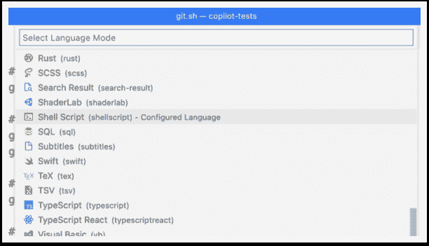

# （一）

# 序言

## 关于本书

本书旨在成为一个有趣、易读且实践性强的探索，介绍如何将人工智能工具作为您的“配对编程”伙伴。在本书中，我希望您能看到如何使用 GitHub Copilot 和 ChatGPT 等人工智能工具使您自己的任务更加轻松和有效。

在本书的篇幅中，我们将涵盖以下主题：

+   在软件开发中使用人工智能

+   Shell 脚本命令

+   Git 命令

+   常见算法

+   学习 RxJS

+   Angular 的 HttpClient

+   正则表达式

+   数据生成

+   敏捷项目管理

+   让我们构建一个应用程序！

+   单元测试

+   其他考虑因素

+   软件开发的未来

我的目标是激励您提出自己的想法，并大大提高您的效率。

## 本书适合谁？

本书适用于任何级别的软件开发人员，从“刚开始”到“准备退休”。尽管我的大多数示例使用特定的网络技术，如 HTML、JavaScript、TypeScript 和 Ionic，但您不需要熟悉这些语言和框架就能从本书中获益。

## 跟随阅读

无论您从事何种类型的软件开发，我相信您会发现通过用您喜欢的任何语言跟随阅读是有价值的。

我很高兴为您提供本书中大部分提示的列表，以便您可以跟随阅读而不必自己输入。您可以在这里免费注册并下载它们：

[`walkingriver.gumroad.com/l/pair-programming-bonus`](https://walkingriver.gumroad.com/l/pair-programming-bonus)

## 更新和问题

如果您有任何问题或只想了解本书和未来书籍的更新情况，请随时在上面的链接注册，或发送电子邮件至 michael@walkingriver.com。

我也在 Twitter 上非常活跃，您可以在[@WalkingRiver](https://twitter.com/walkingriver)上找到我的帖子。

如果您喜欢这本书，我会感激您在购买地方留下积极的评论。

# 在软件开发中使用 AI

图片由[Gerd Altmann 在 Pixabay 上](https://pixabay.com/users/geralt-9301/?utm_source=link-attribution&amp;utm_medium=referral&amp;utm_campaign=image&amp;utm_content=2167835)提供

我第一次听说 GitHub Copilot 是在 2022 年中期。我对这样一个想法很感兴趣，即有人从每个公共 GitHub 存储库中的源代码训练了一个人工智能（以下简称“AI”）模型。此外，一旦模型被训练，它基本上可以理解我的源代码并实时提供建议。如果这是真的，我必须试一试。

我注册了免费的测试版并等待。大约一周后，我收到了接受测试计划的电子邮件，附带了一个安装 Visual Studio Code 扩展的链接。我安装了这个扩展并开始尝试。看起来很酷，但我个人机器上并不经常进行日常编码，也不准备在工作电脑上安装测试版软件。所以，我很快就忘记了一段时间。

六月份，我举办了一个现场移动应用开发研讨会。在代码演示中，我在我个人的 Mac 上运行了 VS Code。Copilot 仍然安装着，并继续弹出并提供代码补全建议。最后，有人问这是什么，于是我们离题并花了一些时间探索 Copilot 的功能。它似乎知道在我们之前应该写什么代码。我们都印象深刻，至少可以这么说。

它似乎对 Ionic 和 Angular、HTML、CSS 和 TypeScript 了如指掌。它理解这些语言在我为研讨会构建的演示应用程序的上下文中。它很少出错，几乎提供了与我即将输入的代码几乎相同的代码。

几个月后，ChatGPT 出现并席卷了世界。这是第一个具有对话界面的“平易近人”的 AI。人们可以向它提问并期望得到连贯的答案。

数百万人开始尝试它，看看它能否通过简要描述问题来编写代码。虽然不完美，但它的答案出奇地好。人们开始想知道我们是否已经进入了一个奇怪的新软件开发世界，一个传统编码和软件开发人员很快就会过时的世界。

## 我们将涵盖什么

我写这本书的目的是描述 AI 如何在典型软件开发人员的日常活动中使用。在我们深入探讨这些概念之前，让我们高层次地看一下这些工具能为我们做什么和不能做什么。

## AI 工具能做什么？

1.  代码生成：AI 可以根据一组输入和要求生成代码，这可以加快开发过程并减少错误的几率。

1.  测试自动化：AI 可以用于自动生成测试用例和测试脚本，这可以节省时间并提高软件的质量。

1.  质量保证：AI 可以用于自动评估代码的质量，这有助于在问题变严重之前识别潜在问题。

1.  UI/UX 设计：AI 可以用于生成 UI/UX 设计，这可以节省时间并改善整体用户体验。

1.  语言处理：AI 可以用于自然语言处理，可用于软件开发中的自然语言界面。

1.  预测性分析：AI 可以用于预测未来的趋势、错误和需要关注的领域。

1.  AI 驱动的搜索：AI 可以用于搜索和推荐相关的代码片段、库和工具给开发人员。

我将专注于列表中的前两项，因为它们似乎与当今软件开发最相关。

## 它们的局限性是什么？

1.  对上下文的理解有限：AI 可能无法完全理解编写代码的上下文，这可能导致错误或不一致。

1.  缺乏创造力：AI 可以生成功能性的代码或设计，但可能缺乏人类开发人员的创造力。

1.  有限处理复杂性的能力：AI 可能会在涉及许多变量和相互依赖的复杂代码或设计中遇到困难。

1.  缺乏对行业标准和最佳实践的理解：AI 可能不了解特定行业或领域的最佳实践和标准，这可能导致次优结果。

1.  缺乏灵活性：AI 可能无法像人类开发人员那样适应变化的需求或意外情况。

1.  有限处理非结构化数据的能力：AI 可能会在处理组织不良或不符合特定格式的数据时遇到困难。

1.  一般化能力有限：AI 可能难以从示例中推广，并且在没有明确训练的情况下可能无法很好地工作。

1.  数据偏见：如果训练数据不多样化且代表人口，AI 模型可能会延续人类偏见。

1.  对大量数据的依赖：AI 模型通常需要大量数据进行训练，这可能难以获取和处理。

1.  缺乏可解释性：AI 模型可能是不透明的，这使得难以理解它们是如何得出特定决定或输出的。正如我们将看到的，这就是 ChatGPT 的亮点所在。

## 本书中使用的不同 AI

有很多 AI 工具可供选择。我不会假装了解其中一半。市场渗透率和影响力最大的两个似乎是来自 OpenAI 的 ChatGPT 和来自 GitHub 的 Copilot。这两个我将在整本书中重点关注。

### ChatGPT

ChatGPT 是由 OpenAI 开发的语言模型。它是 GPT（生成式预训练转换器）模型的一个变种，经过大量互联网文本数据的训练，可以生成类似人类的文本。该模型被微调用于特定任务，如语言翻译、文本摘要和对话。ChatGPT 能够理解和响应自然语言输入，因此可以用于各种应用，如聊天机器人、虚拟助手和基于语言的游戏。

人们很快就发现它也可以用来生成多种语言的可运行计算机代码。作为一个强大的语言生成模型，ChatGPT 可以在多种方面帮助软件开发：

1.  代码生成：ChatGPT 可以根据一组输入和要求生成代码片段甚至完成函数，这样可以加快开发进程并减少错误的机会。

1.  文本生成：ChatGPT 可以用来生成评论、文档甚至提交消息，这可以节省开发者的时间并提高代码的可读性。

1.  测试用例生成：ChatGPT 可以用来为软件生成测试用例和测试脚本，这可以节省时间并提高软件的质量。

要使用 ChatGPT，你需要注册 OpenAI API 账号，你可以在[`chat.openai.com/chat`](https://chat.openai.com/chat)注册。如果你已经有了 OpenAI 账号，可以直接使用该账号登录。如果没有，你需要注册一个账号。

在撰写本文时，该服务有两个服务等级：一个是免费的，但你可能经常发现它"工作负载已满"，这样就很难使用。

还有一个付费的服务等级，ChatGPT PLUS，目前每月价格为 20 美元。OpenAI 还宣布了更多服务等级的计划，以及一个候补名单，以便获取更多信息。

### GitHub Copilot

Copilot 是由 GitHub 开发的基于人工智能的编码助手。它旨在通过建议代码补全来帮助开发者更高效、更有效地编写代码。Copilot 使用机器学习来理解你正在工作的代码，并根据代码的上下文、仓库的结构以及你正在操作的文件的内容提出补全建议。根据你正在处理的代码的上下文，Copilot 可以为变量、函数等提供建议。

该工具可以用于生成代码片段、完成函数调用和参数，并提供变量和函数名的建议。Copilot 可以与多种编程语言一起使用，如 Python、JavaScript 和 Go，并且可以集成到流行的代码编辑器中，如 Visual Studio Code、Atom 和 Sublime Text。在本书中，我将专门在 VS Code 中使用它。

GitHub Copilot 的一个关键特性是它能够理解开发者的意图。这意味着它不仅能够建议代码片段，还能理解开发者试图解决的问题，并相应地提供建议。例如，如果开发者试图编写一个对数字列表进行排序的函数，Copilot 会理解开发者试图对列表进行排序，并会提供排序算法的建议。在 JavaScript 中，我个人的一个盲点是编写 reducer。Copilot 在我每次尝试时都为我正确完成了它们。

有时，Copilot 会提供多种可能性。如果您对 Copilot 最初提供的代码不满意，可以使用 macOS 上的 Opt+[ 和 Opt+]或 Windows 和 Linux 上的 Alt+[ 和 Alt+]循环浏览多个建议。

GitHub Copilot 的另一个重要特性是它能够从开发者的代码库中学习。当您编写代码时，Copilot 将学习您的编程风格，并使用这些信息来提供更准确和相关的建议。这意味着您使用 Copilot 越多，它就会越了解您的编程偏好，并改进其建议。

GitHub Copilot 还利用 GitHub 庞大的代码库来学习其他开发者的最佳实践和模式。它可以利用开源代码和开发者团队的贡献来提供符合社区最佳实践的建议。

要使用 Copilot，您需要在 [`github.com/features/copilot`](https://github.com/features/copilot) 注册。GitHub Copilot 在测试期间是免费使用的，但现在已经正式发布，需要购买许可。在撰写本文时，Copilot 的价格为每位开发者一年 100 美元。如需了解再决定是否订阅，还可以申请免费试用。学生和开源项目维护者仍可以免费使用，但需要申请并等待批准。

### ChatGPT 与 Copilot

ChatGPT 和 GitHub Copilot 都是使用 AI 技术设计的工具，旨在帮助软件开发人员开展工作。这两款工具都使用机器学习算法为开发者提供智能建议和辅助，但它们是为开发过程的不同方面而设计的。

这两款工具之间的主要区别之一是它们的关注领域。ChatGPT 专注于自然语言处理任务，而 GitHub Copilot 专注于代码完成和建议。ChatGPT 可以用于生成文本回复或代码，而 GitHub Copilot 主要用于生成代码片段。

另一个区别是这两个工具的使用方式。ChatGPT 通过类似聊天的界面访问（因此得名），因此开发人员更多地是描述性地使用它来生成代码。另一方面，GitHub Copilot 集成到开发环境中，并且可以直接在您的项目中使用。

在整本书中，我将使用这两个工具来强调它们如何在适当的情况下发挥最有效的作用。

## 争议-开发人员应该使用这些工具吗？

我认为我应该早点澄清这一点，因为有些人觉得答案肯定是否定的。

Copilot 使用 GitHub 的代码库来训练其模型并提出建议，而由此产生的一个主要抱怨是，这可能会导致不良编码实践和安全漏洞的传播。由于该工具是使用代码库来学习其他开发人员的实践和模式，它可能无意中学习并推广这些代码库中存在的不良编码实践和安全漏洞。这可能导致开发人员在无意中将这些问题纳入自己的代码中，可能导致安全漏洞或其他问题。

另一个潜在问题是，Copilot 可能会削弱对代码库的理解和知识的重要性；开发人员可能过于依赖该工具的建议，而不花时间理解他们正在处理的代码。这可能导致开发人员未能完全理解代码库，使得将来更难以维护和解决问题。

此外，Copilot 使用 GitHub 的代码库来训练其模型还引发了有关隐私和数据安全的担忧。由于该工具正在分析并学习开发人员编写的代码，因此它可能还在收集和分析敏感数据，例如用户名、密码或其他个人信息。

### 许可问题

对于引起争议和批评的更大的问题之一是与用于训练 AI 模型的数据的许可问题有关。这可能是一个重大关注点，因为在没有适当许可或许可证的情况下使用代码可能会引起法律问题。可能出现的一些具体问题包括：

1.  如果用于训练 AI 模型的数据受版权保护，就可能会涉及侵犯版权。

1.  如果用于训练 AI 模型的数据构成他人的商业秘密，未经适当许可使用可能涉及侵犯商业秘密。

1.  如果用于训练 AI 模型的数据包含个人信息，并且未经适当许可或匿名处理，那么可能会违反隐私法。

1.  如果用于训练 AI 模型的数据受许可证或合同约束，以一种违反这些条款的方式使用它可能导致法律问题。

对于开发人员和组织而言，了解这些问题并为用于训练 AI 模型的任何数据获得适当的许可和许可证非常重要。这可能包括获取开源数据集的许可证或与数据提供者协商协议以使用专有数据。

### 不尊重许可证

使用人工智能来帮助编写软件时，重要的是考虑可能被用来训练人工智能的代码的开源许可证。开源许可证是规定受许可证覆盖的代码可以如何使用、修改和分发的协议。不同的开源许可证有不同的条款和条件，因此要仔细审查用来训练人工智能的任何代码的许可证，并确保它们得到遵守。这可能涉及获得适当的权限，给予原始作者以信用，并对代码进行任何必需的更改。未能正确遵守开源许可证可能会导致法律后果，例如因侵犯版权而被起诉。

一个具体的例子可能更清楚地说明这个问题。在我的一个移动应用中，我使用了一种算法来生成任意大小的一副卡片。我在 GitHub 上找到的 JavaScript 代码（没有使用 Copilot）明确标有“GPL 许可”。据我理解（我不是律师），这意味着我可以在自己的代码中自由使用这个算法，甚至可以出售这个应用。这是允许的。然而，我必须在源代码中包含 GPL 通知。我还必须以相同的许可证发布我的源代码。

如果 Copilot 向我建议了这个算法，而我不知道它的许可证，然后继续以不同的许可证提供我的应用？我技术上是否违反了原始算法的 GPL 许可证？如果是的话，这会使我或我的雇主面临什么风险？不幸的是，这类问题可能需要在法庭上解决。在我写这篇文章时，至少有一起有关 Copilot 在其建议中使用许可软件的诉讼正在进行中。

### 伦理考虑

使用人工智能帮助软件开发的伦理是什么？使用人工智能来帮助编写软件是否合乎道德？开发者或公司是否真的可以声称他们是所述软件的合适作者？这可能看起来很奇怪，但我就是问 ChatGPT 这个问题。它回答道。

通常认为使用人工智能来辅助软件开发是伦理的，只要开发者和公司在开发过程中对人工智能的作用透明，并在需要时给予应得的信用。开发者或公司可以宣称软件的作者，但也应该承认在开发过程中使用的人工智能的贡献。此外，重要的是确保在软件开发中使用的任何人工智能模型都是在道德上获得的数据进行训练，并且不会延续任何偏见。

我还问它是否有其他需要注意的伦理考虑。

首先，存在公平性和偏见的问题。重要的是确保 AI 系统不是基于有偏见的数据做出决策，因为这可能导致对某些个人或群体的不公平对待。此外，还有问责制的问题。重要的是考虑谁对 AI 系统造成的任何错误或失误负责，并确保有适当的保障措施以防止发生此类错误。最后，还有隐私问题。重要的是确保用户的个人数据以一种尊重其隐私并符合相关法律法规的方式收集、使用和存储。

## 本书中使用的约定

如上所示，我采用了在不同字体和背景中打印 AI 输出的约定，这样您可以轻松区分我的想法和 AI 的想法。

当我展示一个评论或提示让 Copilot 生成代码时，我会这样展示。

当我展示一个评论或提示让 ChatGPT 生成代码时，我会这样展示。

从 ChatGPT 中直接使用的输出将以这种方式显示。

此外，任何命令或生成的源代码将以这种方式显示。

# Shell 脚本命令

图片由 [cocoandwifi](https://pixabay.com/users/cocoandwifi-4330980/?utm_source=link-attribution&utm_medium=referral&utm_campaign=image&utm_content=4996834) 提供自 [Pixabay](https://pixabay.com/?utm_source=link-attribution&utm_medium=referral&utm_campaign=image&utm_content=4996834)

Shell 脚本是任何想要在计算机上高效管理和自动化任务的人的基本技能。

让我们看看 Copilot 和 ChatGPT 在 shell 脚本中的表现。不久前，我写了一篇关于这些符号（~|&||&&$!`()?）在 bash（或类似）shell 中的含义以及如何使用它们的文章。

GitHub Copilot 和 ChatGPT 能否仅凭评论给我这些类型的命令？继续阅读以了解详情。

## #!/bin/bash

Copilot 只在代码编辑器的上下文中工作。它没有像 ChatGPT 那样的对话界面。因此，为了测试 Copilot，我做的第一件事是在 VS Code 中创建一个空白文件。在文件顶部，我添加了一个“shebang”行来指示文件包含 shell 脚本代码。

#!/bin/bash

接下来，我添加了以下注释，看看 Copilot 会为我写什么。

# 检查目录是否存在并打印消息

令我惊讶的是，它什么也没做。也许，我想，Copilot 不了解 shell 脚本，这个实验很快就会结束。然后我明白了。它没有从 shebang 中得到提示，而是可能从文件扩展名中得到的。我将文件保存为 copilot.sh 然后再试一次。

这次，Copilot 给了我一些代码。

如果 [ ! -d /home/username/Downloads ]; then

echo "目录/home/username/Downloads 不存在。"

fi

这不是我预期的，但它确实做了评论中说的事情。

### 文件扩展名？

正如我所提到的，Copilot 需要知道文件的类型才能为您编写代码。通过进一步的实验，我发现让 Copilot 理解文件类型的不是文件扩展名。相反，是 VS Code 本身。将文件保存为.sh 扩展名告诉 VS Code 这是一个 Shell 脚本文件。

文件扩展名不如 VS Code 认为的文件类型重要。在大多数情况下，VS Code 会自动正确识别。如果没有，您可以点击底部状态栏中的“纯文本”短语。页面顶部将出现一个菜单，允许您手动选择文件类型。

在我的情况下，将文件保存为.sh 就解决了问题。在另一种情况下，添加“Shebang”行就解决了问题。结果似乎不一致，所以请仔细检查类型。

记住的重要一点是，Copilot 只关心文件类型而不关心扩展名。

### 聊天 GPT 怎么样？

ChatGPT 似乎更适合这些事情，考虑到其更具对话性质。以下是它对相同提示的回应：

检查目录并在不存在时打印消息

您可以使用 test 命令（也称为 [ 或 [[）来检查目录是否存在，并使用 echo 命令在不存在时打印消息。以下是一个示例：

如果 test ! -d /path/to/directory; then

echo "目录不存在"

结束

或者，您可以使用 if [ ! -d "/path/to/directory" ]; then 命令并带有相同的 echo 消息。

另一个选项是使用 if [[ ! -d "/path/to/directory" ]]; then

两组输出之间的区别立即显而易见。ChatGPT 在回答中提供解释，而不仅仅给出代码。正如您将看到的，这可能是使用 ChatGPT 而不是 Copilot 的重要优势。

## 查找命令

我接下来尝试的是在我的主目录及其子目录中查找所有 PDF 文件。通常情况下，我会使用 find 命令。Copilot 会建议这样做吗？我输入了以下评论：

# 查找我主目录中的所有 PDF 文件并打印每个文件的路径

当我按下回车键时，什么都没有发生。我尝试了几次，但 Copilot 拒绝建议任何内容。然后我决定尝试给它一个提示。我在那个评论的下面单独一行输入了单词 find。Copilot 立即活跃起来，并建议以下完成：

find /home/username -name "*.pdf" -print

我有点失望。除非我的主目录碰巧是 /home/username，否则该命令将无法工作。然而，然后我开始考虑。Copilot 做了艰难的部分。它正确地得到了 find 命令的语法。我总是可以编辑它以修复我的主目录。

实际上，当我将提示更改为 find ~ 时，它会自行完成而无需进一步帮助。

如果您不知道，~ 是一个表示“我的帐户主目录”的 shell 快捷方式。

ChatGPT 给了我两个不同的选项。

查找我主目录中的所有 PDF 文件并打印每个文件的路径

您可以使用 find 命令搜索您的主目录中的所有 PDF 文件并打印每个文件的路径。这里是一个示例：

find ~ -name "*.pdf" -print

这将搜索您的主目录（~）中以 .pdf 结尾的所有文件，并打印每个文件的路径。

或者，您可以使用带有通配符的 ls 命令，

ls ~/ -R | grep .pdf$

这将递归列出您的主目录中的所有文件，并仅过滤具有 .pdf 扩展名的文件。

正如我预料的那样，ChatGPT 比 Copilot 做得更好。与以前一样，我欣赏它提供解释而不仅仅是命令。如果您想要学习，这将是更好的体验。

## 后台任务

我接下来想要做的一件事是确定 AI 是否知道如何使用一些经常使初学者困惑的符号。它们会知道大于号（>）用于重定向输出，和和符号（&）用于在后台运行命令吗？

我更改了我的评论如下，然后给了它同上面一样的提示。

# 在后台查找我的主文件夹下的所有 PDF 文件并将结果写入名为 pdfs.txt 的文件中。

find ~ -name "*.pdf" > pdfs.txt &

这完全正确，尽管我对它省略了-print 参数感到困惑。然后我记得查找命令的默认行为是输出。

跟以前一样，ChatGPT 给了我多个选项，并详细解释了每个选项。

在后台查找我主文件夹下的所有 PDF 文件并将结果写入名为 pdfs.txt 的文件中。

你可以使用 find 命令搜索你主文件夹下的所有 PDF 文件，并使用 tee 命令将结果写入名为 pdfs.txt 的文件中。以下是一个例子：

find ~ -name "*.pdf" -print | tee pdfs.txt &

这将搜索你的主目录及其子目录中所有以.pdf 结尾的文件，并打印每个文件的路径。输出将被传输到 tee 命令，该命令将其写入当前目录中名为 pdfs.txt 的文件中。最后的&符号将在后台运行该命令，因此你可以继续使用终端。

或者，你可以使用带通配符的 ls 命令，

ls ~/ -R | grep .pdf$ >> pdfs.txt &

这将递归列出你的主目录及其子目录中的所有文件，并只筛选出扩展名为.pdf 的文件，写入 pdfs.txt 文件中。最后的&符号也会在后台运行该命令。

我完全忘记了 tee 命令。我也对 ls 命令更加印象深刻，它使用 grep 和简单的正则表达式找到以.pdf 结尾的文件。它还假设我想要追加到 pdfs.txt 文件中如果它已经存在。虽然不完全是我要求的，但它实际上给了我更多。

## 输出管道

接下来，我想看看他们是否知道如何将一个命令的输出作为另一个命令的输入。我还很好奇他们是否知道刚才生成的前一个命令。他们会记得吗？

这里是我的 Copilot 评论和它生成的命令。

# 在后台计算我的主文件夹中的 PDF 文件数量，并输出结果。

find ~ -name "*.pdf" | wc -l &

我希望它会使用上一个命令创建的文件，但它没有这样做。不过，它确实记得我更倾向于使用 find ~。

ChatGPT 再次给了我多个选项。

在后台计算我的主文件夹中的 PDF 文件数量，并输出结果。

你可以使用 find 命令搜索主目录中的所有 PDF 文件，然后使用 wc 命令计算文件数量并输出结果。以下是一个例子：

find ~ -name "*.pdf" -print | wc -l > count.txt &

这将搜索您的主目录及其子目录中以 .pdf 结尾的所有文件，打印每个文件的路径，然后将输出传输到带有 -l 选项的 wc 命令中，该选项将计算行数并将输出重定向到当前目录中名为 count.txt 的文件。最后的 & 将在后台运行该命令，因此您可以继续使用终端。

或者，您可以使用带通配符的 ls 命令：

ls -R ~/ | grep .pdf$ | wc -l > count.txt &

这将递归列出您的主目录及其子目录中的所有文件，仅筛选出扩展名为 .pdf 的文件，将输出传输到带有 -l 选项的 wc 命令中，该选项将计算行数并将输出重定向到当前目录中名为 count.txt 的文件。最后的 & 将在后台运行该命令。

此时，我开始想知道是否有必要使用 Copilot 来进行命令行操作。我继续在这些测试中这样做。

## 重定向错误以忽略它们

大多数人知道如何使用 > 字符将命令的输出重定向到文件中。如果命令遇到任何错误，这些错误仍将显示在终端中，这在后台运行命令时可能会令人困惑。

我知道可以将错误重定向到一个名为 /dev/null 的特殊文件中，以便完全忽略它们。不幸的是，我永远记不住语法。我不知道为什么，因为它并不那么复杂。这可能是我的一个奇怪的盲点吧。

幸运的是，Copilot 知道如何做。我决定结合一些上述概念看看它会做什么。它第一次就做对了。

# 在后台查找所有位于我的主文件夹下的 PDF 文件，忽略错误，并将输出写入文件。

find ~ -name "*.pdf" > pdfs.txt 2> /dev/null &

### ChatGPT 记住了

ChatGPT 真正酷的地方在于它记住了你对话的早期部分。对于这个，我改变了提示，简单地要求它“重写最后一个命令以忽略任何错误”。解释几乎与它上面提供的相同，所以我就不重复了，只是展示它给我的命令。同样，它给了我两个选项。

### 选项 1 – 查找

find ~ -name "*.pdf" -print 2> /dev/null | wc -l > count.txt &

### 选项 2 – ls

ls -R ~/ 2> /dev/null | grep .pdf$ | wc -l > count.txt &

## *nix 系统管理

我开始想知道他们是否能帮助我处理一些常见的系统管理任务，比如创建用户、将用户添加到组等等。

### 添加一个新用户账户

我决定从简单的事情开始，所以我让 Copilot 为我创建一个新用户账户。

# 创建一个新用户账户

sudo adduser 用户名

这在 Mac 上不起作用。也许在 Linux 上可以。我决定再试一次，得到了这个结果。

# 在 macOS 上创建一个新用户账户

dscl . -create /Users/用户名

运行会给我一个权限错误。我再次尝试，在命令前面加上 sudo。可能这个命令有用；我不确定。文件夹/Users/username 不存在，当我打开用户控制面板时也没有出现这个名称的用户。也许我还是忽略了什么。

这是一个例子，Copilot 可能比帮助更令人沮丧。

ChatGPT 再次表现出色，提供了更多的细节和解释。

在 macos 上创建一个新的用户帐户

要在 macOS 上创建一个新的用户帐户，你可以使用 dscl（Directory Service 命令行实用程序）命令。下面是一个示例，如何创建一个名为“newuser”的新用户帐户和密码为“newpassword”：

sudo dscl . -create /Users/newuser

sudo dscl . -create /Users/newuser UserShell /bin/bash

sudo dscl . -create /Users/newuser RealName "New User"

sudo dscl . -create /Users/newuser UniqueID "501"

sudo dscl . -create /Users/newuser PrimaryGroupID 20

sudo dscl . -create /Users/newuser NFSHomeDirectory /Users/newuser

sudo dscl . -passwd /Users/newuser newpassword

这创建了帐户，将 shell 设置为/bin/bash，设置了 RealName、UniqueID、PrimaryGroupID 和 home 目录，并设置了密码。

或者，你可以使用 sysadminctl 命令来创建一个新的用户帐户并设置密码。下面是一个例子：

sudo sysadminctl -addUser newuser -fullName "New User" -password newpassword -admin

这将创建一个帐户，用户名为“newuser”，全名为“New User”，密码为“newpassword”，并具有管理员权限。

你也可以通过转到系统偏好设置 > 用户和群组 > 单击锁图标进行解锁 > 单击“+”符号添加新用户来使用图形界面。

请注意，这些命令需要管理员权限，并且应注意谨慎使用。

我在我的 Mac 上尝试了第二个命令，它毫无问题。ChatGPT 在这里绝对是赢家。

### 使现有用户成为管理员

接下来，我询问它们两个如何使现有用户成为管理员。

# 使用户'michael'成为本地管理员

sudo dseditgroup -o edit -a michael -t user admin

老实说我不确定那个命令是否有效，但它看起来正确。再次，Copilot 是在帮忙还是令人沮丧？

ChatGPT 再次给了我一系列选项，其中第二个与 Copilot 的建议相匹配。

使用户'michael'成为本地管理员

要将用户“michael”设置为 macOS 上的本地管理员，你可以使用 dscl（Directory Service 命令行实用程序）命令。下面是如何将用户“michael”设置为本地管理员的示例：

sudo dscl . -append /Groups/admin GroupMembership michael

这个命令将用户“michael”添加到“admin”组。 "admin"组的成员在系统上具有管理员权限。

或者，你可以使用 dseditgroup 命令将用户添加到“admin”组。下面是一个例子：

sudo dseditgroup -o edit -a michael -t user admin

这个命令将用户“michael”添加到“admin”组。

您还可以通过转到系统偏好设置 > 用户与组 > 单击锁图标以解锁 > 右键单击要更改的用户 > 选择“高级选项” > 将“帐户类型”更改为“管理员”来使用 GUI。

请注意，这些命令需要管理员权限，并应谨慎使用。

### 备份文件

您曾经使用 rsync 从一个系统备份文件到另一个系统吗？没有？当然没有。没有人这样做（好吧，也许有些人这样做）。很难记住语法。这就是为什么存在 Dropbox 和其他类似服务的原因。也许 Copilot 知道语法。

# 将我的主文件夹同步到远程服务器

rsync -avz—delete ~/ username@server:/home/username

它遭受了之前的路径名问题，但同样，这些问题很容易识别和修复。不那么容易辨认的是这些参数是否正确。我在我的 Mac 上做了一点研究，使用 man rsync 阅读命令的在线手册。看起来上面的命令正是您想要将源文件夹同步到目标机器的命令。

—delete 参数告诉命令删除目的地上不在源上的任何额外文件。如果您只想复制所有内容，保留在目的地上您可能已经删除的文件，可以省略此参数。

ChatGPT 给了我四个不同的建议，其中 rsync 是第一个。它还建议使用 scp，这是我打算接下来询问的。

将我的主文件夹同步到远程服务器

在 macOS 上同步您的主文件夹到远程服务器有几种方法。以下是一些选项：

rsync：这个命令行工具可用于在两个位置之间同步文件和目录。以下是如何使用 rsync 将您的主文件夹同步到远程服务器的示例：

rsync -avz -e ssh ~/ username@remote-server:/path/to/remote/folder/

此命令将同步主文件夹中的所有文件和目录到指定的远程服务器。-a 选项告诉 rsync 保留文件权限和所有权，-v 选项提供详细输出，-z 选项启用压缩以加快传输速度。-e 选项指定要使用的远程 shell，在本例中为 ssh。

scp：这个命令行工具可用于在本地计算机和远程服务器之间复制文件和目录。以下是如何使用 scp 将您的主文件夹同步到远程服务器的示例：

scp -r ~/ username@remote-server:/path/to/remote/folder/

此命令将复制主文件夹中的所有文件和目录到指定的远程服务器。-r 选项告诉 scp 递归复制目录。

Finder：您还可以使用 Finder 将您的主文件夹与远程服务器同步，方法是将远程文件夹挂载为本地卷，使用 SMB、NFS 或 FTP 协议，然后使用 Finder 复制文件和文件夹。

第三方软件：还有第三方软件如 ChronoSync、Carbon Copy Cloner 等，可用于将您的主文件夹同步到远程服务器。

请注意，这些命令需要设置具有适当权限和访问权限的远程服务器，并确保你有正确的登录凭据来访问远程服务器。

### 从服务器安全地复制到本地

也许你不想备份文件，而是想将远程服务器上的一些文件复制到本地。你可以使用这样的命令。

# 从服务器安全地复制到本地文件夹

scp -r username@server:/home/username/ ~/Downloads

是的，这个也是正确的。ChatGPT 已经建议了 scp 作为将文件同步到远程服务器的一种可能方法，我完全预料到它会轻松地完成这个任务。

从服务器安全地复制到本地文件夹

要在 macOS 上安全地从远程服务器复制文件到本地文件夹，你可以使用 scp 命令。scp 代表“安全复制”，它使用 SSH 协议传输文件。

这是一个使用 scp 将名为“file.txt”的文件从远程服务器“remote-server”复制到本地文件夹“~/Downloads”的示例：

scp username@remote-server:/path/to/file.txt ~/Downloads

这个命令将文件“file.txt”从远程服务器上指定路径复制到你的主目录中的“Downloads”文件夹。

你也可以通过添加-r 选项（表示“递归”）来复制一个目录及其内容

scp -r username@remote-server:/path/to/directory ~/Downloads

你也可以通过列出它们来复制多个文件和目录，例如：

scp username@remote-server:/path/to/file1.txt /path/to/file2.txt /path/to/directory1/ ~/Downloads

如果远程服务器使用非默认端口，你也可以使用-P 选项指定不同的端口号：

scp -P 22 username@remote-server:/path/to/file.txt ~/Downloads

请注意，这些命令需要设置具有适当权限和访问权限的远程服务器，并确保你有正确的登录凭据来访问远程服务器。此外，scp 命令在传输数据时对数据进行加密，提供了额外的安全层。

### 存档文件夹

有时我们想通过创建归档文件来备份一个文件夹。我们可能想通过电子邮件发送它或将其上传到公共服务器，或者只是简单地将其复制到闪存驱动器中。如果目标是保持文件在一起，那么归档是完美的。如果我能记住那个命令的语法就好了。

我给了他们相同的提示，首先是 Copilot。我要求他们分别给出归档和解压给定目录的命令。

# 使用 tar 和 gzip 对 src 目录进行归档

tar -cvzf src.tar.gz src

# 解压 tar.gz 文件

tar -xvzf src.tar.gz

这些命令是正确的，但再次，Copilot 提供的信息没有上下文。在源代码中，这是有很多意义的。但如果你不知道 tar 命令的作用，你可能还是会迷失。你肯定不会知道你可以安全地删除参数中的 v 并仍然得到想要的结果。

让我们看看 ChatGPT 的表现如何。

使用 tar 和 gzip 对 src 目录进行归档

要使用 tar 和 gzip 归档 src 目录，可以使用以下命令：

tar -czvf src.tar.gz src/

此命令创建一个名为 src.tar.gz 的新归档文件，其中包含 src 目录的内容。-c 选项告诉 tar 创建新的归档文件，-z 选项告诉它使用 gzip 压缩归档文件，并且-v 选项告诉它显示有关创建归档的详细信息。-f 选项指定了归档文件的名称和位置。

您还可以使用以下命令与 gzip 一起使用 tar

tar -zcvf src.tar.gz src/

它将产生相同的结果。

请注意，此命令将在当前目录中创建归档文件，可以指定不同的目录保存归档文件。另外，原始 src 目录不会被删除，如果要在归档后删除它，可以添加—remove-files 选项

tar -czvf src.tar.gz—remove-files src/

此命令将归档 src 目录并在归档后删除原始目录。

这是我第一次看到 ChatGPT 提供与其第一个建议相同的信息作为替代选项。请注意，前两个命令是相同的，排列参数的顺序是无关紧要的。它们实际上是完全相同的命令。

我确实很欣赏它给出的第三个选项。我不知道—remove-files 选项。

然后我要求它解压 tar 文件。我承认我没有做好准备来接受其生成的教程。

要解压.tar.gz 文件，可以使用以下命令：

tar -xzvf src.tar.gz

这个命令告诉 tar 解压 src.tar.gz 文件的内容，-x 选项告诉它解压归档文件，-z 选项告诉它使用 gzip 解压归档文件，并且-v 选项告诉它显示有关解压过程的详细信息。-f 选项指定了归档文件的名称和位置。

您还可以使用以下命令

tar -xvf src.tar.gz

此命令还会提取 src.tar.gz 文件的内容，但您需要通过添加-z 选项来指定文件已经经过 gzipped 压缩

tar -xvzf src.tar.gz

此命令将归档文件的内容提取到当前目录，如果要将文件提取到不同的目录，可以使用-C 选项

tar -xvzf src.tar.gz -C /path/to/directory

此命令将文件提取到目录/path/to/directory。

请注意，提取的文件将具有与原始文件相同的权限和所有权，如果要更改提取文件的权限或所有权，可以使用—no-same-permissions 和—no-same-owner 选项。

tar -xvzf src.tar.gz—no-same-permissions—no-same-owner

此命令将以当前用户的权限和所有权解压文件。

此外，在提取文件后，您可以通过添加-k 选项删除原始归档文件

tar -xvzf src.tar.gz -k

此命令将提取文件并保留原始归档文件。

值得注意的是，tar.gz 文件也被称为 tarballs，它们是 tar 存档和 gzip 压缩的组合，.tar 文件包含文件，.gz 文件是压缩的。重要的是使用 -x 和 -z 选项分别提取和解压文件。

再次，它混淆了，而且基本上给了我两个不同选项的相同命令。否则，我觉得它彻底地解释了事情。

### GitHub SSH 密钥

我不知道你们，但我总是不得不查找如何使用 git+ssh 协议为 GitHub 创建新的 SSH 密钥。也许我可以让 Copilot 为我做这件事。

# 创建并将新的 github ssh 密钥复制到剪贴板

ssh-keygen -t rsa -b 4096 -C "

" && cat ~/.ssh/id_rsa.pub | pbcopy

该命令是正确的，和我预期的完全一致，除了它给我的 -C " 提示语。实际上，Copilot 在该参数后停止了，好像它希望我输入一些内容。

每当 Copilot 以部分命令作为输出时，它要么等待您自己输入更多信息，要么希望您在下一行继续。

结果表明 -C 只是密钥的一个注释，所以我可以输入类似 github-key 等内容然后继续。当我按下 Return 键时，它给了我第二行。该行告诉 shell 使用 pbcopy 将我的家目录下的 .ssh 目录中的公钥复制到剪贴板。

在那一点上，计算机的剪贴板应该有我的公钥的副本，然后我可以将其粘贴到 GitHub 的公钥 UI 中。

ChatGPT 建议我使用我的电子邮件地址作为注释，并给了我一个完整的例子。它还将该过程分割成了两个命令而不是一个。

创建并将新的 github ssh 密钥复制到剪贴板

要在 macOS 上为 GitHub 使用创建和复制新的 SSH 密钥，您可以使用 ssh-keygen 和 pbcopy 命令。以下是创建新 SSH 密钥并将其复制到剪贴板的示例：

打开终端并生成一个新的 SSH 密钥：

ssh-keygen -t rsa -b 4096 -C "your_email@example.com"

该命令将使用 4096 位密钥大小创建一个新的 RSA 密钥，并将邮箱 "your_email@example.com" 与该密钥关联为注释。

在提示时，您可以按 Enter 接受密钥的默认位置和文件名，或输入新位置和文件名。

生成密钥后，您可以使用 pbcopy 命令将密钥复制到剪贴板：

pbcopy < ~/.ssh/id_rsa.pub

该命令将文件 "~/.ssh/id_rsa.pub" 的内容复制到剪贴板。

进入 GitHub 设置，在 SSH 和 GPG 密钥下，点击 "New SSH Key" 按钮。

给该密钥命名，并将密钥粘贴到 "Key" 栏，点击 "Add SSH key" 按钮。

您可以通过运行 ssh -T git@github.com 来测试连接。

请注意，pbcopy 命令仅在 macOS 上有效，并且用于将数据复制到剪贴板。在其他操作系统上，命令可能不同，您可能需要使用 xclip 或 xsel 将密钥复制到剪贴板。

我喜欢 ChatGPT 超越实际命令，提供示例、选项甚至注意事项。

## 专用于 macOS 的命令

到目前为止，我对 Copilot 和 ChatGPT 能够做到的印象深刻。有些命令我很难记住，特别是在 macOS 上操作媒体文件的命令。让我们看看它们在其中一些命令上的表现如何。

不幸的是，我似乎已经达到了 Copilot 能力的极限。我尝试的每个评论都没有产生有效的命令。这是第一个，要求 Copilot 将一个 JPEG 文件夹转换为 PNG 格式。

它给我的命令在我的 Mac 上不起作用，但看起来应该可以。

# 将当前目录中的所有 jpg 文件转换为 png 文件

for file in *.jpg; do

convert "$file" "${file%.jpg}.png"

完成

ChatGPT 自然地解释了原因。

将当前目录中的所有 jpg 文件转换为 png 文件

您可以使用 ImageMagick 的命令行工具 convert 将当前目录中的所有 JPG 文件转换为 PNG 文件。以下是如何使用 convert 将所有 JPG 文件转换为 PNG 文件的示例：

for file in *.jpg; do convert "$file" "${file%.jpg}.png"; done

这个命令将循环遍历当前目录中具有 .jpg 扩展名的所有文件，在每个文件上运行 convert 命令，并将输出保存到具有相同名称但扩展名为 .png 的新文件中。

或者，您可以使用 ImageMagick 的 find 和 mogrify 命令：

find . -name "*.jpg" -exec mogrify -format png {} +

这个命令将搜索当前目录及其子目录中的所有 .jpg 文件，并将它们的格式更改为 .png 并覆盖原始文件。

请注意，这将覆盖原始的 JPG 文件。如果您想保留原始文件，可以修改命令以将输出保存到不同位置或使用不同的文件名。

有趣的是，它的第一个建议与 Copilot 的完全相同。不同之处在于 ChatGPT 告诉我 convert 命令来自 ImageMagick。决定还不要放弃，我问它如何安装 ImageMagick。

这就是它告诉我的。

如何安装 ImageMagick？

要在 macOS 上安装 ImageMagick，您可以使用软件包管理器 Homebrew。以下是使用 Homebrew 安装 ImageMagick 的步骤：

如果您尚未安装 Homebrew，请在终端中运行以下命令来安装：

/bin/bash -c "$(curl -fsSL https://raw.githubusercontent.com/Homebrew/install/HEAD/install.sh)"

安装了 Homebrew 后，您可以使用它来通过在终端中运行以下命令来安装 ImageMagick：

brew install imagemagick

安装完成后，您可以通过运行以下命令来检查是否成功：

convert -version

这将显示您安装的 ImageMagick 版本。

在 macOS 上安装 ImageMagick 的另一种方法是从官方网站下载二进制包并手动安装。您可以在此处找到二进制包：[`imagemagick.org/script/download.php#macosx`](https://imagemagick.org/script/download.php#macosx)

请注意，您可能需要将 ImageMagick 二进制文件添加到系统的 PATH 中，以便终端识别 convert 和 mogrify 命令。

我遇到了其他命令的类似问题。这个命令对我也没用，但没有提示错误可能是什么。

# 从文件夹中提取所有 mp4 文件的音频

for file in *.mp4; do

ffmpeg -i "$file" -vn -acodec copy "${file%.mp4}.mp3"

完成

不出所料，ChatGPT 给了我更多的上下文，建议了一个很相似的命令，但也解释了我需要理解的内容。

从文件夹中提取所有 mp4 文件的音频

您可以使用命令行工具 ffmpeg 在 macOS 上从所有 MP4 文件中提取音频。以下是如何使用 ffmpeg 从当前目录中的所有 MP4 文件中提取音频并将其保存为 MP3 文件的示例：

for file in *.mp4; do ffmpeg -i "$file" -vn -acodec libmp3lame -ac 2 -q:a 4 -y "${file%.mp4}.mp3"; done

这个命令将循环遍历当前目录中具有.mp4 扩展名的所有文件，在每个文件上运行 ffmpeg 命令，并将音频输出保存到一个新文件中，文件名相同，但扩展名为.mp3。

该命令使用-i 选项指定输入文件，-vn 选项禁用视频流，-acodec 选项指定音频编解码器，-ac 2 指定音频通道数，-q:a 4 指定音频质量和-y 用于覆盖输出文件。

您可以通过更改 mp3 和 libmp3lame 来更改输出文件格式和编解码器。

请注意，如果系统中尚未安装 ffmpeg，您可能需要在系统中安装 ffmpeg。您可以通过在终端中运行以下命令来使用 Homebrew 安装 ffmpeg：

brew install ffmpeg

另外，请注意，该命令将覆盖同名现有文件。如果您想保留原始文件，可以修改命令将输出保存到不同位置或使用不同文件名。

ChatGPT 给我的命令更完整，但它的解释是误导的。-y 参数将自动覆盖输出上的任何现有文件，但该命令不会破坏输入文件。

我的最后一个测试是尝试使用 avconvert 在 macOS 上提取音频。Copilot 给了我一个单一命令。

# 使用 avconvert 从视频文件中提取音频

avconvert -i video.mp4 -vn -acodec copy audio.mp3

显然，这个命令已经不复存在了，ChatGPT 很高兴向我解释了这一点。

avconvert 是什么？

avconv 是一个类似于 ffmpeg 的命令行工具，可用于转换多媒体文件。在 macOS 上使用 avconv 提取视频文件的音频，您可以使用以下命令：

avconv -i inputfile.mp4 -vn -acodec libmp3lame -ac 2 -q:a 4 -y outputfile.mp3

此命令使用 -i 选项指定输入文件，-vn 选项禁用视频流，-acodec 选项将音频编解码器指定为 libmp3lame，-ac 2 选项指定音频通道数，-q:a 4 选项指定音频质量，-y 选项覆盖已存在的输出文件。

您可以根据需要更改输入和输出文件名和格式，也可以根据需要更改编解码器和质量选项。

请注意，如果系统尚未安装 avconv，则可能需要在系统中安装 avconv。您可以通过在终端中运行以下命令来安装 avconv：

brew install libav

请注意，avconv 和 ffmpeg 类似但并非完全相同，它们的语法和选项可能略有不同。有些在 ffmpeg 中有效的选项或编解码器可能在 avconv 中无效，反之亦然。此外，ffmpeg 的使用更为普遍，并且有更积极的开发，但两者都可以用于从视频文件中提取音频。

请注意，Copilot 没有回答我提出的问题，或者我是这样认为的。感到困惑和稍有好奇，我随后要求澄清。

avconv 和 avconvert 之间有什么区别？

avconv 和 avconvert 实际上是同一件事，avconv 是 libav 库的命令行工具，这是 ffmpeg 库的一个分支。avconv 曾是 libav 库的命令行工具，它相当于 ffmpeg 库的命令行工具，但 libav 项目在 2018 年停止了，现在 libav 开发者建议使用 ffmpeg 而不是 avconv。avconvert 是 avconv 的拼写错误，这两个命令都可以执行相同的任务。avconv 工具已被 ffmpeg 取代，但您可能会发现一些旧资源或脚本使用 avconv 或 avconvert。

总之，avconv 和 avconvert 是相同的命令行工具，但 libav 项目在 2018 年停止，现在建议使用 ffmpeg 而不是 avconv。

我从 Copilot 那里没有得到任何上下文。令我惊讶的是，我以为 avconvert 是当前和正确的命令。显然，在这两个方面我都错了。

## 结语

虽然使用 AI 工具可能节省时间和精力，但重要的是评估生成的命令的质量，并确保它们安全有效。ChatGPT 的输出优于 Copilot，但我对本章的目的有所期待。

ChatGPT 是一个高级人工智能模型，能够理解并回答更复杂和微妙的问题。Copilot 是一个专为开发人员设计的人工智能助手，用来帮助他们完成编码任务，但它不像 ChatGPT 那样先进。然而，重要的是，无论哪种工具都可以帮助你有效地完成任务。ChatGPT 和 Copilot 都可以准确可靠地回答你的问题，但 ChatGPT 的输出更详细和全面。最终，使用哪种工具取决于你的具体需求和偏好。

除了输出质量的差异外，另一个要考虑的方面是每个工具的专业领域。ChatGPT 是一个通用的语言模型，经过大量文本数据的训练，因此在主题可能不熟悉时，或者需要解释或澄清时，它是一个很好的选择。它擅长提供对主题的全面理解，可以用于广泛的任务，包括语言翻译、文本生成和问题回答。

另一方面，Copilot 是一个专为开发人员设计、在实际软件上进行过训练的人工智能助手。因此，它可能更擅长理解你代码的上下文，并提供与你具体需求相符的解决方案。

正如你将看到的，它可以通过建议代码片段、提供文档，甚至为你完成代码来帮助你处理编码任务。

如果你是一个开发人员，并且需要帮助解决你的代码问题，Copilot 是一个很好的选择。

# Git 命令

GitHub 提交图按作者

## GitHub Copilot 能帮助 Git 本身吗？

在我使用 shell 脚本的经验之后，我决定探索 Copilot 如何帮助学习 Git 命令。在本章中，我将详细介绍我的发现，并演示 Copilot 如何有效地辅助学习过程。

## 基本 Git 命令

就像我在 shell 脚本中所做的那样，我在 VS Code 中创建了一个空白文档，并将其类型设置为 Shell 脚本。接下来，我开始在文档中添加注释，看看 Copilot 会建议什么。在下面的每种情况中，我尽可能少地输入，以充分运用 Copilot。

我从简单开始，只是让它为我创建一个新的 git 仓库。

# 创建一个空的 git 仓库

git init

接下来，我想设置我的 git 用户名和邮箱，但我总是记不住确切的命令。然而，Copilot 可以。

# 设置我的 git 用户名和邮箱

git config user.name "Mike Callaghan"

git config user.email "michael@walkingriver.com"

不幸的是，但可以理解的是，Copilot 不知道我的姓名和邮箱地址。我自己添加了这些信息。它建议使用“John Doe”，这是一个简单的提示，我需要更改它。对于邮箱，它在开头引号处停止建议的文本，建议我自己完成这一行。

一个空的 git 仓库并不是很有用，所以我想创建一个新的分支，向其中添加一个文件，然后提交更改并推送该分支。以下是这些命令，都是根据 Copilot 从我的评论中建议的：

# 创建并切换到名为 develop 的新分支

git checkout -b develop

# 创建一个文件

echo "Hello World" > hello.txt

# 将所有新文件和更新的文件提交到这个分支

git add .

git commit -m "Initial commit"

# 推送此分支到远程仓库

git push -u origin develop

# 切换回主分支

git checkout main

# 将 develop 分支合并到主分支

git merge develop

# 将主分支重新定位到 develop 分支

git checkout develop

git rebase main

这些都是相当不错的猜测。到目前为止，我对 Copilot 对 git 的理解感到满意。

### 中级 Git 命令

在本章的其余部分，我在一个成熟的仓库上运行生成的命令，而不是上面创建的那个。这个仓库有多个分支、提交、标签等。

#### 提交日志

Git-log 可以让您以相反顺序查看仓库的提交的快速摘要，从最新到最旧。Copilot 帮助我学习了许多关于该命令的变体。

# 展示 develop 分支上最近的 10 次提交

git log—oneline -10 develop

# 展示所有分支上最近的 10 次提交

git log—oneline -10—all

# 展示所有分支上最近的 10 次提交并展示图形

git log—oneline -10—all—graph

# 显示所有分支上最近的 10 个提交，显示图形和作者

git log—oneline -10—all—graph—author="Mike Callaghan"

我不确定这个是否准确。我相信它会显示所有 Mike Callaghan 的提交，但不是所有提交和它们的作者。再次强调，小心接受 Copilot 提供的内容。它可以帮助，但如果不小心，也会伤害你。

#### 撤销错误的提交

我很难记住正确的 git 命令来撤销我不想提交的更改。Copilot 是否能让我不再参考那篇文章？这是我询问时得到的回答。

# 撤销最后一次提交

git reset—hard HEAD~1

# 回滚最后一次提交并保留更改

git reset—soft HEAD~1

# 从 ee670f5 到 9ad6740 回滚所有提交

git revert ee670f5..9ad6740

这些完全正确。

#### Cherry Pick

有时我们想从另一个分支选择单个先前提交并将其应用到当前分支。这称为 cherry picking，Copilot 也知道如何做。

# 将提交 9ad6740 cherry-pick 到 main

git checkout main

git cherry-pick 9ad6740

#### Git Diff

如果你想查看两个提交之间的变化，可以使用 git-diff 命令。

# 比较提交 ee670f5 和 9ad6740

git diff ee670f5 9ad6740

这样做是有效的，但不够直观。也许有更好的选择？

### DiffMerge

我以前用过一个叫 DiffMerge 的应用程序，它提供了一个更好的 UI 来比较差异。我想知道 Copilot 是否能帮我安装和配置它。

# 从 brew 安装 diffmerge

brew install—cask diffmerge

# 将 difftool 设置为 diffmerge

git config—global diff.tool diffmerge

git config—global difftool.diffmerge.cmd 'diffmerge "$LOCAL" "$REMOTE"'

git config—global difftool.prompt false

# 使用外部 diff 工具比较提交 ee670f5 和 9ad6740

git difftool ee670f5 9ad6740

请注意，尽管 DiffMerge 在 macOS 和 Windows 上都可以运行，但 brew 命令是特定于 macOS 的。我要求在 Windows 上安装，结果给了我这个：

# 在 Windows 上安装 diffmerge

choco install diffmerge

我没有 Windows 电脑来尝试，但看起来是合法的。上面的其余命令应该是一样的。

### 高级 Git 命令

我不自诩为 git 专家。我最多只能算是一个中级学生。尽管如此，我在 git 上做了一些更高级的活动，并在这里为您呈现。

#### 存档 Repo

你是否曾经需要向某人发送你的 git 存储库的副本，而不附带任何 git 内容？你可以在所需的提交处检出正确的分支，删除.git 文件夹，然后将其压缩。你知道 git 可以为你完成所有这些吗？

# 存档当前分支

git archive -o archive.zip HEAD

# 存档当前分支并排除.gitignore 文件

git archive -o archive.zip HEAD—. ':!*.gitignore'

# 存档提交 1319f65 并排除.gitignore 文件

git archive -o archive.zip 1319f65—. ':!*.gitignore'

#### 清理过时的分支和文件

完成拉取请求后，清理旧的功能分支通常是个好主意。GitHub 和 GitLab 可以自动配置这样做。问题是，在本地存储库中这样做并不那么容易。

# 删除所有已合并的分支

git branch—merged | grep -v "\*" | xargs -n 1 git branch -d

有时，你可能想要从本地存储库和远程存储库中删除一个单独的分支。

# 本地和远程删除 myfeature 分支

git branch -d myfeature

git push origin—delete myfeature

如果你在本地有未跟踪的文件，想要清理它们怎么办？

# 从当前工作树中删除未跟踪的本地文件

git clean -f

#### 浅克隆

你是否遇到过一个 Git 存储库占用了太多磁盘空间的情况？过了一段时间，你可能会决定不需要完整的历史记录，而且只克隆其中的一个部分会更容易。这叫做“浅克隆”，Copilot 知道如何做。

# 克隆存储库，只保留 2022 年 1 月 1 日之后的提交

git clone—shallow-since=2022-01-01

# 克隆存储库，只保留 2022 年 1 月 1 日之后和 2023 年 1 月 1 日之前的提交

git clone—shallow-since=2022-01-01—shallow-until=2023-01-01

# 克隆存储库，只保留 2022 年 1 月 1 日之后和 2023 年 1 月 1 日之前的提交且只有主分支

git clone—shallow-since=2022-01-01—shallow-until=2023-01-01—branch main

# 克隆存储库，只保留 2022 年 1 月 1 日之后和 2023 年 1 月 1 日之前的提交，只有主分支和只有最后 10 个提交。

git clone—shallow-since=2022-01-01—shallow-until=2023-01-01—branch main—depth 10

到目前为止，我觉得没必要记住这些命令。Copilot 会替我记住它们。

#### 永久删除一个文件

对于我的最后操作，假设你不小心将一个包含秘密（密码、私钥等）的文件提交到远程存储库。如果你只是从本地删除它，将文件添加到 .gitignore，并提交，这样做行不通。文件仍然可以恢复。以这种方式删除文件的唯一方法是重写历史。幸运的是，git 可以这样做，但事实上并不像说的那么容易，你会看到的。

当我要求 Copilot 删除一个包含秘密的文件时，这就是 Copilot 提供的。

# 意外提交到 git 的 secrets 文件

git filter-branch—force—index-filter 'git rm—cached—ignore-unmatch secrets.txt'—prune-empty—tag-name-filter cat——all

老实说，我不想测试这个命令，但我决定在一个不重要的存储库中试一试。我将 secrets.txt 替换为 package-lock.json，我觉得删除这个特定文件不会带来太大危险。

当我运行它时，git 给了我一个大警告：

git-filter-branch 有很多陷阱，生成了被搅乱的历史

重写。在继续之前按 Ctrl-C 中断，然后使用

其他过滤工具，如'git filter-repo'

(https://github.com/newren/git-filter-repo/) 链接查看`filter-branch`手册页了解更多详情；为了抑制这个警告

有关 filter-branch 的详细手册页，请参阅更多详细信息；要抑制此警告，

设置 FILTER_BRANCH_SQUELCH_WARNING=1。

我让它运行，想着“最坏的情况是什么？”结果是它移除了我整个项目中每个 package-lock.json 的实例。除此之外，本地和远程仓库分歧了大约 20 个提交，所以我从来没有弄清楚那是否是我想要的。

我让 Copilot 修复了我的分歧分支，它提供了这个选择：

# 修复分歧的分支

git fetch—all

git reset—hard origin/main

它有效了，现在我回到了最开始的地方。

现在，那个警告到底是什么意思？也许这是我们应该考虑的事情。我调研了 git-filter-repo，看起来是一个更好的解决方案。而且，事实证明，Copilot 似乎也知道那个。

# 使用 filter-repo 意外推送到远程的 secrets 文件。

git filter-repo—path-glob '!secrets.txt'

因为我没有安装它，所以命令没有生效。不过，我对它能提供正确的语法印象深刻（我推测）。

### 最后的话

除了最后一个请求和 git log 的一个小问题之外，Copilot 处理了我提出的一切。每当我不记得要使用哪个 git 命令时，我可能会继续使用它。

你可能想知道为什么我这里没有使用 ChatGPT。我预计它能够正确地执行这些相同的命令。我敦促你尝试一下作为练习。给我发封邮件，告诉我进展如何。

# 常见算法

图片由[Pixabay](https://pixabay.com/?utm_source=link-attribution&utm_medium=referral&utm_campaign=image&utm_content=1486361)的[Markus Spiske](https://pixabay.com/users/markusspiske-670330/?utm_source=link-attribution&utm_medium=referral&utm_campaign=image&utm_content=1486361)提供

我最喜欢 AI 的用途之一是让它为常见算法生成代码。在本章中，我将重点介绍一些我用它解决常见问题的真实场景。

## IIFE

您知道 JavaScript 中的 IIFE 是什么吗？好吧，只需问 ChatGPT！

JavaScript 中的 IIFE 是什么，我为什么需要它，以及如何创建一个？

IIFE 代表立即调用的函数表达式。这是 JavaScript 中常用的设计模式，用于为您的代码创建一个私有作用域，并避免用变量和函数污染全局命名空间。

在需要封装一些代码并防止其影响页面上其他代码的情况下，您可能会使用 IIFE。例如，您可以使用 IIFE 来定义应用程序中的一个模块，其中模块的代码包含在 IIFE 的私有作用域内。

要创建一个 IIFE，您只需定义一个函数表达式并将其包装在括号中使其成为表达式。然后，您可以通过在其后附加一对括号立即调用该函数，就像这样：

(function() {

// 在这里放置您的代码

})();

在这个例子中，定义了一个匿名函数并立即调用。该函数为其中的代码创建了一个私有作用域，防止其中声明的任何变量或函数泄漏到全局作用域中。

请注意，围绕函数表达式的括号是必需的，因为它们使函数被解释为表达式而不是声明。没有这些括号，JavaScript 解析器会将函数解释为函数声明，这只能在某些上下文中使用。

这是一个相当令人印象深刻的解释。实际上，它给了我一个更长的解释，但我为您精简了一下。

实际上，使用 TypeScript，我们几乎不再需要使用 IIFE。事实上，如果我们让 ChatGPT 将其最后一个 IIFE 转换为等效的 TypeScript 类，会怎么样？

如果我们在 TypeScript 中使用类，那么该代码的等价物会是什么？

如果您要在 TypeScript 中使用类来实现与 IIFE 示例类似的结果，您可以定义一个类并使用构造函数方法来执行您的代码。

这里是一个例子：

class MyClass {

构造函数() {

// 在这里放置您的代码

}

}

new MyClass();

在这个例子中，当使用 new 关键字创建类的实例时，MyClass 构造函数会立即执行。

你也可以向构造方法传递参数，就像这样：

class MyClass {

constructor(arg1, arg2) {

// 你的代码在这里

}

}

new MyClass(val1, val2);

在这种情况下，参数 val1 和 val2 作为 arg1 和 arg2 传递给构造方法。

在 TypeScript 中使用类提供了额外的好处，如更好的类型检查和封装，以及定义公共和私有成员的能力。然而，IIFE 和类示例的总体目标是相同的：封装您的代码，防止其影响页面上的其他代码。

注意我不必重复我的请求，只需要求它重写“那段代码”。这是 ChatGPT 记住对话上下文的第一个例子。

## 数组函数

Copilot 和 ChatGPT 在帮助操作数组方面非常擅长。你只需要提出请求。

### Reduce

由于某种原因，我总是记不住如何使用 JavaScript 的 reduce 函数来计算数组中项目的总和。然而，GitHub Copilot 知道。我只需提供我想要实现的注释，让 Copilot 完成剩下的工作。

考虑以下“拼图”数组。这是我游戏 Foreword 中的一个片段，一个单词方块游戏。

// 这个例子的“拼图”部分数组

private demoPuzzles: Puzzle[] = [

{ id:88, size: 4, solution: ['abetbabeebontent'] },

{ id:89, size: 4, solution: ['icedcaveevendent'] },

{ id:90, size: 8, solution: ['abetracemirestun', 'armsbaitecruteen'] },

{ id:91, size: 8, solution: ['cageheaturicmyth', 'chumaerygaitetch'] }

];

注意一些拼图有一个解，一些有两个解。我的实际拼图数组有成千上万个元素。

现在假设我想计算我的拼图数组中的总解数。我提供了一个简单的注释给 Copilot，让它生成代码。

// 计算 demo Puzzle 数组中的总解数

const total = this.demoPuzzles.reduce((acc, puzzle) => acc + puzzle.solution.length, 0);

是的，我本可以使用 for 循环，或查找 Array.reduce 的语法，但 Copilot 为我完成了这项工作，只需一个注释。对我来说，这很高效！

### 过滤

接下来，假设我想找到数组中大小为 4 的所有拼图。我给 Copilot 第一个注释。然后它继续写第二个注释。

//  查找所有大小为 4 的拼图

//  查找所有大小为 8 的拼图

它能够做到这一点，因为它了解应用程序的上下文，并且可以看到我在做什么。通过识别一些拼图大小为 4，一些大小为 8，它提供了第二个注释。接下来发生的事情让我感到惊讶。它没有给我期望的数组过滤函数，而是给了我这个。

public findPuzzlesBySize(size: number): Puzzle[] {

return this.demoPuzzles.filter(puzzle => puzzle.size === size);

}

没错。它给了我一个通用函数，可以按任何大小查找谜题。

当我给 ChatGPT 相同提示时，它走了稍微不同的方向。

给定一个看起来像以下数组的数组，找到所有大小为 4 或 8 的谜题。（然后我粘贴了谜题数组）。

要查找所有大小为 4 或 8 的谜题，您可以在 demoPuzzles 数组上使用 filter 方法，并提供一个检查每个谜题大小的回调函数：

const filteredPuzzles = demoPuzzles.filter(puzzle => puzzle.size === 4 || puzzle.size === 8);

这将返回一个新数组，其中仅包含大小为 4 或 8 的谜题。

您还可以使用 forEach 方法检查每个谜题的大小，然后将匹配的谜题推入新数组：

const filteredPuzzles = [];

demoPuzzles.forEach(puzzle => {

if (puzzle.size === 4 || puzzle.size === 8) {

filteredPuzzles.push(puzzle);

}

});

这与 filter 方法实现了相同的结果。

无论哪种情况，结果过滤后的谜题数组将仅包含大小为 4 或 8 的谜题。

在这种情况下，ChatGPT 字面上带我，给了我一种找到大小为 4 或大小为 8 的谜题的方法。奇怪的是，它给我的代码将产生一个与原始内容相同的数组，这一点一点也不有用。

另一方面，Copilot 给了我更接近我所需的代码。可以认为这是 Copilot 的胜利。

### 排序

如果我想对数组进行排序怎么办？我知道 JavaScript 有一个 sort 函数，它接受一个描述排序方式的回调函数。但也许我不太记得语法。

要求 Copilot 对我的谜题数组进行排序，将较大（大小为 8）的谜题放在前面，给了我这个：

// 按大小排序谜题，最大的在前

puzzles = this.demoPuzzles.sort((a, b) => b.size - a.size);

注意，这次 Copilot 只给了我一行代码，而不是完整的函数。根据我的经验，这更符合 Copilot 通常的回应方式。

ChatGPT 给了我这个回应。

const sortedPuzzles = demoPuzzles.sort((a, b) => b.size - a.size);

这将返回一个新数组，其中包含按大小排序的谜题，最大的在前。

在这个例子中，sort 方法接受一个回调函数，比较 a 和 b 对象的 size 属性。通过从 b.size 减去 a.size，我们确保谜题根据大小按降序排序。

这两个函数是相同的，这是一个好迹象。我仍然喜欢 ChatGPT 为其建议提供解释，而 Copilot 则假定您只需要它来编写代码。

### 数组作为堆栈或队列

有时我们想要使用数组实现堆栈或队列。Copilot 和 ChatGPT 也可以帮助处理这个问题。

当我要求 ChatGPT 完成一组强类型的 TypeScript 函数时，它给了我这个：

生成一组强类型的 TypeScript 函数，以将数组视为堆栈或队列。

type Puzzle = { id: number; size: number; solution: string[] };

function pushToStack(stack: Puzzle[], puzzle: Puzzle): Puzzle[] {

return [...stack, puzzle];

}

function popFromStack(stack: Puzzle[]): [Puzzle | undefined, Puzzle[]] {

const poppedPuzzle = stack[stack.length - 1];

const newStack = stack.slice(0, stack.length - 1);

return [poppedPuzzle, newStack];

}

function enqueue(queue: Puzzle[], puzzle: Puzzle): Puzzle[] {

return [...queue, puzzle];

}

function dequeue(queue: Puzzle[]): [Puzzle | undefined, Puzzle[]] {

const dequeuedPuzzle = queue[0];

const newQueue = queue.slice(1);

return [dequeuedPuzzle, newQueue];

}

通常，它为每个函数提供了完整的解释。

Copilot 更加简洁，尽管它在我的第一个注释之后写了每一行（包括新注释）。

// 添加一个新拼图到拼图列表中的队列的函数

addPuzzle() {

this.demoPuzzles.push({ id: 92, size: 4, solution: ['cageheaturicmyth', 'chumaerygaitetch'] });

}

// 从拼图列表中移除一个拼图的函数

removePuzzle() {

this.demoPuzzles.pop();

}

// 添加一个新拼图到拼图列表中的队列的函数

pushPuzzle() {

this.demoPuzzles.unshift({ id: 92, size: 4, solution: ['cageheaturicmyth', 'chumaerygaitetch'] });

}

// 从拼图列表中移除一个拼图的函数

popPuzzle() {

this.demoPuzzles.shift();

}

注意它没有尝试为我创建一个新的拼图类型。它知道我已经有了数据，只给我提供了我在应用程序上下文中需要的内容。

然而，它完全错误地假设我想要一个硬编码的拼图文字（而且是无效的），而不是给函数一个拼图参数。

幸运的是，Copilot 只需要重新表述的注释来纠正那个错误的假设。

// 添加一个新拼图到拼图列表中的队列的函数，

// 以强类型的拼图对象作为参数

addPuzzle(puzzle: Puzzle) {

this.demoPuzzles.push(puzzle);

}

它对其他函数的处理都正确，但对于这个例子，我认为不需要再显示所有的代码。

### 数组转哈希

在我的一个项目中，我查询了一个远程网络服务以检索客户和销售信息，返回的数据结构看起来类似于以下内容。

"订单": [

{

"id": "订单 1",

"customerName": "约翰·史密斯",

"productName": "衬衫",

"数量": 2,

"价格": 25

},

{

"id": "订单 2",

"customerName": "简·多",

"productName": "裤子",

"数量": 1,

"价格": 40

},

{

"id": "订单 3",

"customerName": "鲍勃·约翰逊",

"productName": "袜子",

"数量": 3,

"价格": 10

}

]

注意，订单是一个数组，每个订单都是数组中一个独立的对象。现在想象一下，有数百或数千个这样的订单。如果我只想获取订单 72，我将不得不遍历整个数组。如果数据结构是哈希而不是数组，每个订单都有其 id 作为键，那么获取任意元素将更简单（也更快）。

我很快就能编写循环遍历整个数组并生成一个新的哈希对象的代码，但这是 ChatGPT 擅长的枯燥任务。这是我给它的提示，随后是它生成的代码。

ChatGPT 建议使用 reduce 函数，这实在是我从未想到的。就像我之前告诉过你的，这不是我擅长的函数之一。这是我的（许多？）盲点之一。

我在 TypeScript 中有一个具有以下结构的数组。（我将上面的 JSON 粘贴到这里）。我想将它从数组转换为哈希数组，以便可以通过其 "id" 地址访问每个对象。

你可以通过使用 reduce 方法将数组转换为哈希数组，并创建一个新对象，其中 "id" 属性作为键。这里是一个例子：

const hashArray = orders.reduce((acc, config) => {

acc[config.id] = config;

return acc;

}, {});

现在你可以通过像这样的"id"访问每个对象：hashArray["order2"]。

然后我进一步完善它，要求一个独立的函数，它为我创建了一个（未显示）。

## 字符串操作

你经常发现自己经常操作文本吗？我知道我会。从长输入中提取较小的文本片段，确定一个字符串是否存在于另一个字符串中，处理填充等。这些事情相当简单，但如果不必要的话，我宁愿不输入这些东西。

### 字符串搜索

考虑在长字符串中查找单词的每个出现的问题。ChatGPT 会如何处理？

const text = "The quick brown fox jumps over the lazy dog.";

// 查找所有出现的子字符串"the"（不区分大小写）

const substring = /the/gi;

const matches = text.match(substring);

// 打印匹配项

console.log(matches);

ChatGPT 直接使用了正则表达式。我将在本书后面更深入地讨论正则表达式。

Copilot 也使用了正则表达式，但它走了完全不同的方向。

const regex = /the/gi;

let m;

while ((m = regex.exec(text)) !== null) {

// 这是为了避免与零宽匹配无限循环

if (m.index === regex.lastIndex) {

regex.lastIndex++;

}

// 结果可以通过 `m` 变量访问。

m.forEach((match, groupIndex) => {

console.log(`找到匹配项，组 ${groupIndex}：${match}`);

});

}

老实说，我并不完全确定 Copilot 给我的东西。为了好玩，我将 Copilot 的代码示例粘贴到 ChatGPT 中，并要求它解释给我听。这就是它说的。

这段 JavaScript 代码使用正则表达式在给定文本中找到子字符串 "the" 的所有出现，并将匹配项记录到控制台。以下是它的工作原理：

const regex = /the/gi; - 这一行创建了一个正则表达式 regex，用 /the/ 语法匹配子字符串 "the"。g 和 i 标志分别用于执行全局搜索和不区分大小写搜索。

let m; - 这一行声明了一个未初始化的变量 m。

while ((m = regex.exec(text)) !== null) { - This line sets m to the result of calling the regex.exec(text) method, which returns an array of information about the next match of the regular expression in the text string. The while loop continues as long as m is not null.

if (m.index === regex.lastIndex) { regex.lastIndex++; } - This line checks whether the match is a zero-width match (i.e., an empty string), and if so, increments the lastIndex property of the regex object to avoid an infinite loop.

m.forEach((match, groupIndex) => { console.log(Found match, group ${groupIndex}: ${match}); }); - This line loops through each match in the m array using the forEach() method, and logs each match and its group index to the console using a template literal.

总的来说，这段代码是前面代码示例的更高级版本，使用 regex.exec()方法迭代每个匹配并访问其属性。使用 forEach()允许更细粒度控制输出，并提供访问匹配的组索引，这在处理更复杂的正则表达式时会很有用。

Do you see what it did? Read that final paragraph carefully. ChatGPT recognized that the code I pasted from Copilot was related to my original question, and then explained that it was a more advanced example of the same concept. Truly amazing!

### 移除空格

有时，你可能面对一大段过多空白的文本。在给定这样的字符串的情况下，你会如何去除其中多余的空白，同时保留重要的文本呢？

对于这个例子，我要求 ChatGPT 生成一些带有大量额外空白的“lorem ipsum”文本示例。

const loremIpsumWithWhitespace = `

Lorem ipsum  dolor sit amet, consectetur adipiscing elit.  Fusce molestie turpis  nec  felis malesuada accumsan. Vestibulum  tincidunt lacus nec nulla dignissim blandit. Morbi tristique, enim eu imperdiet luctus, nisl turpis aliquam nunc,  eu interdum purus  velit  quis velit.  Curabitur vel semper tellus,  at iaculis lectus.  Morbi sed lectus  ac nibh eleifend tristique.  Praesent sagittis elit vel dui consequat,  eu maximus purus molestie. Integer varius  pharetra odio, non vestibulum urna lobortis et.  Sed et eleifend lorem, quis mollis ipsum.

Pellentesque  consectetur  mauris sed risus laoreet,  vel malesuada augue convallis.  Nullam vestibulum commodo metus, id tristique est suscipit id. Etiam pretium sagittis malesuada.  Vivamus sit amet mi lorem.  Etiam hendrerit euismod libero, nec  accumsan massa laoreet vel.  Donec  viverra felis et urna fringilla, non convallis tellus egestas. Suspendisse faucibus quam in erat sagittis  dignissim. Duis maximus risus sit amet eros bibendum feugiat.

接下来，我要求一个通用函数，它将接受这种类型的输入并返回移除所有不重要空白的字符串。

function removeInsignificantWhitespace(text) {

// Replace all whitespace characters with a single space

const stripped = text.replace(/\s+/g, " ");

// 移除前导/尾随空格和换行符

return stripped.trim();

}

这个函数首先使用正则表达式（/\s+/g）匹配所有出现的一个或多个空白字符（空格、制表符、换行符等），然后使用 replace()方法将它们替换为一个空格字符。

最终的字符串然后传递给 trim()方法，该方法会移除任何前导或尾随空格或换行符。

这确保最终输出只包含必要的空格字符（例如单词之间的空格），而不包含不必要的空格字符。

对于 Copilot 的测试，我从前面的长 JavaScript 常量开始，并给了一个类似的提示。它的结果有点简洁。

// 从字符串中移除所有空格的函数

function removeWhitespace(text: string) {

return text.replace(/\s/g, '');

}

Copilot 结果有趣的地方在于，当我粘贴了冗长的文本后，它建议了自己的注释。永远记住，Copilot 的强项在于它对整个应用程序的意识。

### 空格填充

现在，让我们考虑一下谜题数组。如果我想要使用只有文本的固定宽度字体生成一些漂亮的格式，我该如何做？ChatGPT 给了我以下函数，以及输出看起来像的示例：

const printTable = (puzzles: Puzzle[]): void => {

console.log('ID  Size  Solution');

console.log('——————————-');

puzzles.forEach(puzzle => {

console.log(`${puzzle.id.toString().padEnd(4, ' ')}${puzzle.size.toString().padEnd(6, ' ')}${puzzle.solution[0]}`);

});

};

printTable(demoPuzzles);

这段代码将以固定宽度字体的形式输出 demoPuzzles 数组，如下所示：

––––––––

ID  Size  Solution

——————————-

88  4  abetbabeebontent

89  4  icedcaveevendent

90  8  abetracemirestun

91  8  cageheaturicmyth

Copilot 给了我一些不同的东西，但我认为在这种情况下它作弊了。

// 以只使用文本的方式将谜题数组打印为表格，适用于使用固定宽度字体。

printPuzzles() {

let puzzleTable = this.demoPuzzles.map(p => {

return { id: p.id, size: p.size, solution: p.solution.join(' ') };

});

console.table(puzzleTable);

}

从技术上讲，console.table 确实做到了我要求的，所以在这方面是正确的。我决定再给它一个提示，看看能否让它写出更接近 ChatGPT 的东西。

// 以只使用文本的方式将谜题数组打印为表格，适用于使用固定宽度字体的输出，使用 console.log。

printPuzzles() {

// 获取最长的谜题 id，以便填充 id 列以对齐谜题数据。

const longestId = this.demoPuzzles.reduce((longest, puzzle) => Math.max(longest, puzzle.id.toString().length), 0);

// 打印标题行。

console.log(`id${' '.repeat(longestId - 2)} | size | solution`);

console.log('-'.repeat(longestId + 2) + '-+-' + '-'.repeat(5) + '-+-' + '-'.repeat(16));

// 打印谜题行。

this.demoPuzzles.forEach(puzzle => {

console.log(`${puzzle.id}${' '.repeat(longestId - puzzle.id.toString().length)} | ${puzzle.size} | ${puzzle.solution.join(' ')}`);

});

}

第二次运行效果更好。你觉得呢？我喜欢它寻找最长 ID 的功能，这样我就可以正确填充列。这是一个很好的点子。

### 生成 CSV 文件

如果我想要将数组输出为逗号分隔的文件呢？Copilot 给了我几乎与上面相同的代码，但带有一些额外的逻辑。

// 生成包含谜题数组的 CSV 文件

generateCsv() {

// 创建一个带有标题行和每个谜题行的 CSV 文件。

const csv = 'id,size,solution\r\n' + this.demoPuzzles.map(puzzle => `${puzzle.id},${puzzle.size},"${puzzle.solution.join(' ')}"`).join('\r\n');

// 将 CSV 文件写入磁盘。

require('fs').writeFileSync('puzzles.csv', csv);

}

依赖人工智能来为你工作的一个危险是它可能会创建看起来合理但存在错误的代码。在这种情况下，如果我的任何字段包含逗号，这个函数生成的输出很可能会导致 CSV 文件无法阅读。

ChatGPT 给了我几乎相同的代码，只是它考虑了谜题字段中可能存在的逗号。

import * as fs from 'fs';

const generateCSV = (puzzles: Puzzle[]): void => {

const header = 'id,size,solution\n';

const rows = puzzles.map(puzzle => `${puzzle.id},${puzzle.size},"${puzzle.solution.join(';')}"\n`);

const csv = header + rows.join('');

fs.writeFileSync('puzzles.csv', csv);

};

generateCSV(demoPuzzles);

请注意，这两个解决方案都假设我在使用 Node，因为每个解决方案都使用了 fs 库。ChatGPT 特别注意告诉我我需要来自 NodeJS 的 fs 模块。

请注意，为了运行此代码，您需要安装 fs 模块和 Node.js 运行时。

### 生成 HTML

我也可以要求它为我生成 HTML。ChatGPT 确实按照我要求的方式做了，再次记住了我的谜题数组和对象的形状。

创建一个 JavaScript 函数，将谜题数组输出为 HTML 表格

function printTable(puzzles) {

const table = document.createElement('table');

const headerRow = document.createElement('tr');

const idHeader = document.createElement('th');

const sizeHeader = document.createElement('th');

const solutionHeader = document.createElement('th');

idHeader.textContent = 'ID';

sizeHeader.textContent = '大小';

solutionHeader.textContent = '解决方案';

headerRow.appendChild(idHeader);

headerRow.appendChild(sizeHeader);

headerRow.appendChild(solutionHeader);

table.appendChild(headerRow);

puzzles.forEach(puzzle => {

const row = document.createElement('tr');

const idCell = document.createElement('td');

const sizeCell = document.createElement('td');

const solutionCell = document.createElement('td');

idCell.textContent = puzzle.id;

sizeCell.textContent = puzzle.size;

solutionCell.textContent = puzzle.solution.join(';');

row.appendChild(idCell);

row.appendChild(sizeCell);

row.appendChild(solutionCell);

table.appendChild(row);

});

document.body.appendChild(table);

}

printTable(demoPuzzles);

在这里，我认为它可能已经超越了自己。我原本期望看到一堆硬编码的带有 HTML 字符的字符串。我没想到它会使用 DOM 操作，但当然，在许多情况下这可能是更好的解决方案。

Copilot 会做得一样好吗？实际上，它做了我最初期望的事情。

// 将谜题数组输出为 HTML 表格的函数

printPuzzlesAsHtml() {

// 获取最长的谜题 ID，以便我们可以填充 ID 列以对齐谜题数据。

const longestId = this.demoPuzzles.reduce((longest, puzzle) => Math.max(longest, puzzle.id.toString().length), 0);

// 打印标题行。

console.log('<table>');

console.log('<tr><th>id</th><th>size</th><th>solution</th></tr>');

// 打印谜题行。

this.demoPuzzles.forEach(puzzle => {

console.log(`<tr><td>${puzzle.id}</td><td>${puzzle.size}</td><td>${puzzle.solution.join(' ')}</td></tr>`);

});

console.log('</table>');

}

这并不意味着它无法使用 DOM API。我所要做的就是稍微改变我的提示。

// 使用 DOM API 输出谜题数组为 HTML 表格的函数

private outputPuzzles(puzzles: Puzzle[]): void {

const table = document.createElement('table');

const header = document.createElement('tr');

header.innerHTML = '<th>ID</th><th>Size</th><th>Solution</th>';

table.appendChild(header);

puzzles.forEach(puzzle => {

const row = document.createElement('tr');

row.innerHTML = `<td>${puzzle.id}</td><td>${puzzle.size}</td><td>${puzzle.solution}</td>`;

table.appendChild(row);

});

document.body.appendChild(table);

}

我不确定这样做是否更好。最终它为我构建了一个 DOM 调用和 HTML 字符串文本的混合体。这就是这些 AI 的问题；通常您必须尝试多次相同的方法才能得到您要找的代码。

### 结论

本章主要关注数组和字符串操作，这是我日常工作中的大部分内容。您可能经常使用不同的算法。请放心，这两个工具都将为您节省大量输入时间。要记住的重要事情是提示与您要求它们使用的语言一样重要。

此外，正如你所看到的，有时你必须尝试多个提示才能得到正确的代码。最后，请确保验证代码的正确性。任何工具都可以创建看起来很棒但不考虑边缘情况的代码。

记住，归根结底，你是程序员，而不是 AI。

# 学习 RxJS

由 [Gerd Altmann from Pixabay](https://pixabay.com/users/geralt-9301/?amp;utm_medium=referral&amp;utm_campaign=image&amp;utm_content=3175073) 的图像

与 Copilot 和 ChatGPT 一起处理常见算法让我想到它们可能会是学习 JavaScript 中的 React 扩展（RxJS）或者至少帮助我记住一些它的非显而易见的语法的非常有用的工具。

很多人不喜欢使用 RxJS，认为它太复杂了。他们倾向于避开它，但我认为这很遗憾。是的，RxJS 可能有一个陡峭的学习曲线，但学会以“反应式”的方式思考并有效地使用 RxJS 是值得努力的。我想知道 Copilot 在帮助其他人学习 RxJS 方面能有多大帮助。

对于本章，我将继续使用之前的那组谜题数组。如果你需要回顾，它看起来是这样的：

// 用于此示例的“谜题”部分数组

private demoPuzzles: Puzzle[] = [

{ id:88, size: 4, solution: ['abetbabeebontent'] },

{ id:89, size: 4, solution: ['icedcaveevendent'] },

{ id:90, size: 8, solution: ['abetracemirestun', 'armsbaitecruteen'] },

{ id:91, size: 8, solution: ['cageheaturicmyth', 'chumaerygaitetch'] }

];

## from 和 of

保持上面的谜题数组，让我们假设这些谜题是游戏的一部分，并且它们存在为一个 Observable 流。此外，假设游戏从外部来源获取它们。现在，我们不需要担心它们来自哪里。每当出现一个新的谜题时，游戏将对其进行“某些”处理。

因此，我要求 Copilot 就是这样做的。这是我写的注释以及它为我写的代码：

// 从示例谜题数组创建一个新的 Observable

const puzzles$ = from(this.demoPuzzles);

完美！RxJS 的 from 函数从一个数组创建了一个新的 Observable，在数组的每个元素上都会发出一个新值。这正是我想要的。还请注意，它使用了一个常见的命名约定，即在标识符后面添加 $，表示它是一个 Observable。

还有另一个 RxJS 操作符，即 of，也可以从数组创建一个 Observable。虽然使用它也是有效的，但 of 只会创建一个 Observable 并发出一次，包含整个数组。这不是我想要的，但不知何故 Copilot 知道（或者猜到）了。

## filter

现在我们有了一个 Observable，让我们对它做点什么。让我们从一些更简单和更常见的 RxJS 操作符开始：map 和 filter。

RxJS 的 filter 操作符用于实现其名字的含义：过滤现有的流，只包括与某些提供的条件匹配的项目。

如果游戏玩家只想看到尺寸为 4 的谜题怎么办？我们能让 Copilot 为我们做到这点吗？这是我输入的评论以及 Copilot 根据评论生成的代码的回应：

// 仅将谜题筛选为尺寸为 4 的谜题

const size4$ = puzzles$.pipe(filter(puzzle => puzzle.size === 4));

它给了我们什么？它创建了一个新的 Observable，使用了之前的一贯命名惯例称为 size4$。

它还正确理解了使用 filter 操作符，我们首先必须使用 RxJS 的 pipe 函数。每当你使用 RxJS Observable 并且想要在订阅值流之前对其进行操作时，你需要将操作符列表传入 pipe 函数中。

然后，为了选择尺寸为 4 的谜题，它正确地推断出我需要 filter 操作符，它接受一个回调函数来定义流中每个项目应该如何匹配。如果它看起来很熟悉，那是因为它的工作方式与 Array.filter 完全相同。

你可能会认为我在评论中有点耍花招，使用了“Filter”这个词。如果我使用不同的短语会发生什么？好吧，我决定找出答案。我删掉了上面的代码及其评论，然后输入了完全新的东西。我想避免暗示“选择”或“过滤”之类的词语。这是它给我的。

// 给我尺寸为 4 的谜题

const size4$ = puzzles$.pipe(filter(puzzle => puzzle.size === 4));

它仍然正确地决定我需要在 pipe 中添加 filter 操作符，它将“four”转换为 4 。相当令人印象深刻。

## map

让我们看看如果我们只想要每个上述谜题的一部分会发生什么。也许我们只会显示每个谜题的第一个解决方案。

每当你想要将一个对象强制转换为另一个对象时，你首先会使用 map 操作符，它的工作方式与 JavaScript 数组函数 map 非常相似。

就像以前的例子一样，这里是我的评论和生成的代码：

// 仅显示每个谜题的第一个解决方案

const firstSolution$ = size4$.pipe(map(puzzle => puzzle.solution[0]));

你看到它的操作了吗？它正确地假设我将使用先前命令的输出，所以它给了我之前的 size4$value。就像我以前指出的那样，这表明 Copilot 意识到你源代码的上下文。

我认为我唯一不同意的是 firstSolution$ 的名字，但我现在想不出更好的名字。

此时，我有一个经过过滤和映射的 Observable，它只会在产生时给我尺寸为 4 的谜题的第一个解决方案。

## 能为我合并它们吗？

如果我构造我的评论尝试让 Copilot 为我编写整个管道会怎么样？让我们看看它的样子。

// 给我每个尺寸为 4 的谜题的第一个解决方案

puzzles$.pipe(

filter(puzzle => puzzle.size === 4),

map(puzzle => puzzle.solution[0]),

first()

).subscribe(solution => console.log(solution));

老实说，这很接近，但这不是我想要的。我觉得注释中的“of”这个词可能会让它困惑。另外，它坚持要添加 subscribe，而我并不想要它这样做。在构建 RxJS 解决方案时，我尽量不订阅，因为这要求我记住何时必须取消订阅。我稍后会谈到这一点。

我决定给它一些更多的提示，看看我是否能帮助它。在这种情况下，我在下一行键入了注释和 const，暗示 Copilot 我想要一个常量而不是订阅。

// 给我每个大小为 4 的谜题的第一个解

const

firstSolution$ = puzzles$.pipe(

filter(puzzle => puzzle.size === 4),

map(puzzle => puzzle.solution[0]),

first()

);

更好了，但它添加了 first()，而这绝对不是我想要的。它被注释中的“first”这个词所迷惑。

为什么我不想使用 first()？这个操作符只会给我 Observable 流中的第一个值，而这不是我想要的。相反，我想要来自流中每个值的第一个谜题。这是微妙但重要的区别。

让我们看看我是否可以做出最后一次调整以更接近。 

// 给我每一个大小为四的谜题中的第一个解

const firstSolution$ = puzzles$.pipe(

filter(puzzle => puzzle.size === 4),

map(puzzle => puzzle.solution[0])

);

这正是我想让它做的。对我来说，关键是你需要非常明确地表达你的意图。不要害怕拒绝它的第一次尝试。你总是可以再试一次。

## take

take 操作符用于从 Observable 中选择（或取出）一定数量的值，然后自动断开连接。Copilot 完全知道如何为我构建这个结构。

// 仅取出前两个大小为 8 的谜题

const firstTwoSize8Puzzles$ = this.demoPuzzles$.pipe(

filter(puzzle => puzzle.size === 8),

take(2)

);

我觉得我可能会给它一个曲球，所以我要求它只记录上一个示例中的谜题。它做得很对，建立在它刚刚创建的代码上。

// 将上一个示例中的前两个大小为 8 的谜题记录到控制台中

firstTwoSize8Puzzles$.subscribe(puzzle => console.log(puzzle));

## tap

有时你希望在不影响流或任何下游操作符的情况下查看 Observable 流中的值。tap 操作符就是为这种情况设计的。我能让 Copilot 重新编写我的上面的记录语句以使用 tap 吗？

// 取出前两个大小为 8 的谜题，但将所有的谜题记录到控制台

const demoPuzzles2$ = demoPuzzles$.pipe(

tap(puzzles => console.log(puzzles)),

filter(puzzles => puzzles.size === 8),

take(2)

);

这看起来差不多，尽管我对它的命名并不满意。事实上，Copilot 似乎记得我不喜欢订阅我的 Observables，所以我会忽略这个奇怪的名称。

## subscribe

尽管我不愿意过早使用 subscribe，但我能否让 Copilot 订阅 Observable？毫无疑问，只要有正确的提示。事实证明，一旦我按下回车键，Copilot 立即提供了以下代码，而我并没有采取进一步的行动。

demoPuzzles2$.subscribe(puzzles => console.log(puzzles));

这正是我希望它做的。我想它读懂了我的想法。

## 那么 ChatGPT 对 RxJS 怎么样呢？

ChatGPT 对此的帮助较少，但并非因为你可能期望的原因。起初，我以为它会更好，特别是因为它倾向于解释它产生的代码。但我对 ChatGPT 对 RxJS 不满意的原因是，它似乎对我的话过于字面。

例如，当我询问它使用 take 来获取前两个元素时，它实际上将一切都写成了一个完整的函数。Copilot 倾向于在你需要时为你提供所需的代码。

ChatGPT 擅长解释 Copilot 写的代码。让我们在进行下一步之前看看这将如何运行。我询问 ChatGPT 这段代码的作用。它给出了以下分析，我确信你会认为这很令人印象深刻。

以下代码块的作用是什么？

const firstSolution$ = puzzles$.pipe(

filter(puzzle => puzzle.size === 4),

map(puzzle => puzzle.solution[0])

);

当然，你提供的代码确实完成了以下工作：

创建一个 observable puzzles$，它发出一个更大的 Puzzle 对象数组的每个元素，类似于我们之前看到的 demoPuzzles 数组。

使用管道方法创建一系列操作符，这些操作符将应用于 puzzles$ observable 的每个发射。

链中的第一个操作符是 filter，它过滤掉没有大小属性为 4 的拼图。这意味着只有大小为 4 的拼图将被允许继续传递。

链中的第二个操作符是 map，它将每个剩余的拼图映射到它的第一个解决方案。因为每个 Puzzle 对象的 solution 属性是一个字符串数组，所以我们使用数组索引操作符[0]来选择数组的第一个元素作为解决方案。

生成的 observable firstSolution$ 发出每个拼图有 4 个大小的第一个解决方案。

总结一下，该代码通过大小过滤 Puzzle 对象的流，然后将剩余的拼图映射到它们的第一个解决方案，从而产生一个表示每个有 4 个拼图大小的第一个解决方案的字符串流。

## 总结一下？

诚然，在这里我使用的操作符远不止我使用的几个。RxJS 非常庞大，拥有 100 多个操作符，尽管大多数开发者通常只使用其中不到十几个。本章的目标不是对 RxJS 进行彻底的测试。

我的目的是看看 Copilot 是否可以帮助新手开发者了解 RxJS，并且只知道它的一点点功能。稍后在更合适的情境下会使用更多 RxJS。

Copilot 能帮助某人学习 RxJS 或更好地使用它吗？我持怀疑态度，因为它并不总是给我想要的代码。一个刚开始接触 RxJS 的新手可能没有足够的经验来知道什么时候接受，什么时候再试一次。

Copilot 可能是有经验的 JavaScript 开发人员的更好选择，他们了解 RxJS 的基础知识。他们可以合理地期望它会选择正确的操作符来满足他们的需求。

最终，虽然我发现 Copilot 是一个有用且[大多数时候]无害的工具，但它经常需要被迫做正确的事情。

我并不认为它是 RxJS 初学者的工具，他们可能会被错误的代码误导。

ChatGPT，另一方面，在帮助新手理解代码方面表现出色。只需将其粘贴到文本框中并请求解释。这是强大的，不应忽视。

# Angular 的 HttpClient

图片由[Gerd Altmann](https://pixabay.com/users/geralt-9301/?utm_source=link-attribution&utm_medium=referral&utm_campaign=image&utm_content=2528410)提供，来自[Pixabay](https://pixabay.com/?utm_source=link-attribution&utm_medium=referral&utm_campaign=image&utm_content=2528410)

现在让我们考虑一下 Angular 的 HttpClient，它大量使用 RxJS。事实上，HttpClient 通常是新的 Angular 开发人员首次接触 RxJS 的地方。这可能是一个决定性的体验。

所以，我想看看它在使用 Angular 的 HttpClient 时如何处理一些常见的编码模式。

即使你不是 Angular 开发人员，这个过程也值得理解。

## 一个典型的 Angular 服务

对于这个示例，我决定从一个空白网页开始，看看我能写多少少量的代码。记住 Copilot 需要知道它正在处理的文件类型，我立即告诉 VS Code 这是一个 TypeScript 文件，方法是点击窗口右下角的文件类型，并从提供的选项中选择 TypeScript。

接下来，我在文件顶部输入了以下注释：

// 在根目录提供服务

Copilot 立即给了我三行代码：

[@Injectable](http://twitter.com/Injectable "Twitter profile for @Injectable")({

providedIn: 'root'

})

它停在那里；我猜它在等待我提供更多信息。我决定不这样做，只是按下了 Tab 键，它回应如下：

export class ApiService {

// API 地址

private apiUrl = '[`api.github.com/users'`](https://api.github.com/users%27);

constructor(private http: HttpClient) {}

// 获取用户

getUser(username: string): Observable<User> {

return this.http.get<User>(`${this.apiUrl}/${username}`);

}

// 获取仓库

getRepos(username: string): Observable<Repo[]> {

return this.http.get<Repo[]>

(`${this.apiUrl}/${username}/repos`);

}

}

这一切都很酷，但不是我想要的。不过我也不能抱怨太多，因为我没有给它任何其他信息。我决定保留这个类，但暂时移除了两个函数。这样整个文件看起来像这样：

// 在根目录提供服务

@Injectable({

providedIn: 'root'

}) export class ApiService {

// API 地址

private apiUrl = 'https://api.github.com/users';

constructor(private http: HttpClient) {}

}

如果你在跟着做，你会注意到 Copilot 并不会自动导入任何 Angular 标识符。好消息是 VS Code 会为我做这个工作。或者也许我可以说服 Copilot 来做这个。如果我在文件顶部输入 import 会怎么样呢？

当我这样做时，没有任何变化。也许另一个提示会有所帮助。我在文件顶部添加了一个注释和一个单词 import。Copilot 自动建议了剩下的部分。

// Angular 服务

import { Injectable } from '[@angular/core](http://twitter.com/angular/core "Twitter profile for @angular/core")';

import { HttpClient } from '[@angular/common](http://twitter.com/angular/common "Twitter profile for @angular/common")/http';

现在导入已经处理好了，我可以继续进行实验的其余部分了。

## 一个简单的 HTTP GET

每当我构建演示应用程序时，我总是苦恼于在哪里找到可以展示的体面远程数据 API。我很少有时间或倾向去构建我自己的，所以我喜欢寻找一些有趣、有趣或两者兼有的东西。

如果我简单地要求 Copilot 为我找点什么，它会提供给我什么？我移除了 apiUrl 变量及其注释。然后在类的顶部添加了一个新的注释。

// 从远程 Web 服务器获取一些示例数据

getSampleData() {

return this.http.get('https://jsonplaceholder.typicode.com/todos/1');

}

这不是我预期的，但它起作用。因此，我决定尝试一个不同的提示。

// 从 API 获取所有帖子

getAllPosts() {

return this.http.get('[`jsonplaceholder.typicode.com/posts'`](https://jsonplaceholder.typicode.com/posts%27));

}

这相当酷，而且事实证明，该 API 是完全可用的。

## 让我们加入一些 RxJS

对 http.get 的调用返回一个 Observable，但目前我们没有处理任何情况。如果出现错误会怎样？我决定在 getAllPosts 中添加提示以支持错误处理。

我将返回值改为 const posts$，得到了这个结果。

const posts$ =

this.http.get('[`jsonplaceholder.typicode.com/posts'`](https://jsonplaceholder.typicode.com/posts%27));

// 记录 API 调用中的任何错误

posts$.subscribe(

posts => console.log(posts),

err => console.log(err)

);

好吧，这根本不是我想要的。我希望它会建议使用 .pipe 和 .catchError 。我决定通过创建一个 logError 函数再次给出提示，这次再次得到了 Copilot 的帮助。

// 将任何错误记录到控制台

handleError(error: any): Promise<any> {

console.error('发生了一个错误', error);

return Promise.reject(error.message || error);

}

这感觉好像它在猜测我的意图时变得更糟了。所以，我尝试了一个不同的提示。

// 在 observable 中记录任何错误到控制台

logError(err) {

console.error('发生了一个错误：' + err);

}

更好。嗯，至少我的计划是这样写的。下一步，我对 Copilot 看到我的文件中的函数并自动调用它感到好奇。

// 在返回给调用者之前检测和处理 observable 流中的错误。

posts$.subscribe(

data => console.log(data),

err => console.error(err),

() => console.log('帖子加载完毕') // 当 observable 完成时调用此函数。

);

返回 posts$;

如果你是一个对于 Angular 或其 HttpClient 或 RxJS 不熟悉的初学者，你可能会认为这是合理的代码。不是，在这种情况下至少不是。代码块创建了一个 RxJS 订阅对象，但从未取消订阅。在这种情况下是可以的，但只因为我知道 HTTP GET 总会完成或出错。然而，这不是处理这个问题的最佳方式。

在完全放弃之前，我决定再试一件事情。

而不是一个注释，我从下一行开始以 posts$.pipe，并让 Copilot 建议其余部分。这就是它给我的。

posts$.pipe(

catchError(this.logError));

这就是我要找的内容！

但是，你们中聪明的人可能已经注意到，我的 logError 函数已经不再有效了。我不得不将其更改为返回一个 Observable，但是 Copilot 并没有真正帮助我完成这个任务。这是我自己做的。现在它看起来像这样。

// 将 Observable 中的任何错误记录到控制台

logError(err): Observable<any> {

console.error('出错了：' + err);

return of();

}

## 在 Angular 模板中使用 Observable

如果我们不能获取 Observable 的值，那 Observable 有什么用呢？这一章的最后一个例子是将该 API 调用返回的文章显示在网页上。我不得不承认，这是非常有趣的。

我从一个空白文件开始，并将以下第一行作为注释。它建议了其他所有内容，只有少数提示，我将在代码块后解释。

// Angular "文章" 组件

import { Component, OnInit } from '[@angular/core](http://twitter.com/angular/core "Twitter profile for @angular/core")';

[@Component](http://twitter.com/Component "Twitter profile for @Component")({

selector: 'app-posts',

template: `

<h1>文章</h1>

<ul>

<li *ngFor="let post of posts">

{{ post.title }}

</li>

</ul>

`,

styles: []

})

export class PostsComponent implements OnInit {

posts: any;

constructor(private apiService: ApiService) { }

ngOnInit() {

this.apiService.getAllPosts().subscribe((data) => {

this.posts = data;

});

}

}

最初，它想要一个单独的文件来放置我的模板和样式。这是完全有效的，但对于我的例子来说有点过头了。我删除了这些行，并手动输入了模板和样式。然后它添加了你在上面看到的内容。

它正确地找到并引用了另一个文件中的 ApiService，虽然我确实不得不修复其导入。我认为这只是一个小麻烦，因为 VS Code 会为我处理这个问题。

## 那什么是异步管道？

我以前提到，如果我不必要订阅 Observable，我更喜欢避免。Angular 提供了自动订阅和取消订阅的异步管道。我能让 Copilot 来帮我处理吗？

遵循使用带有后缀美元符的 Observable 变量的常见做法，我将变量名从 posts 更改为 posts$，并删除了 ngOnInit 的主体。

当我在该函数内添加一个空行时，Copilot 确切地建议了我想要的：

ngOnInit() {

this.posts$ = this.apiService.getAllPosts();

}

唯一剩下的就是看看它是否能修复模板。于是，我回到了`<li *ngFor`，把整个块都擦掉了。Copilot 坚持要把它放回原样，但那根本行不通。甚至都没有一个叫做`posts`的变量，所以它给了我一个字面上的错误。

不想就这样放弃，我在`<ul>`标签内部添加了一个 HTML 注释，希望这样会有所帮助。这招奏效了！

<ul>

<!—遍历`posts$`可观察对象并显示每篇文章—>

<li *ngFor="let post of posts$ | async">

{{ post.title }}

</li>

</ul>

总的来说，一旦我用正确的提示激发它，它的表现让我印象深刻。

## ChatGPT 呢？

也许你会想，ChatGPT 在这一切中都在哪里？嗯，因为我大部分时间都待在代码编辑器里，我觉得 Copilot 更适合这些示例。然而，作为对 ChatGPT 能力的一次测试，我让它为我生成一切，使用我对 Copilot 的提示作为提示。

这是提示及其完整输出。

为我构建一个完整的 Angular 服务，从远程 Web 服务获取一些示例数据（也许是博客文章）。务必记录遇到的任何错误。然后创建一个作为 Angular 组件实现的网页，该组件在无序列表中显示来自服务的博客文章标题。最好在模板中使用 Angular 的异步管道而不是订阅可观察对象。

当然，我很乐意帮助你！这是一个从远程 Web 服务获取博客文章的 Angular 服务和组件的示例实现：

import { Injectable } from '@angular/core';

import { HttpClient } from '@angular/common/http';

import { Observable, throwError } from 'rxjs';

import { catchError } from 'rxjs/operators';

@Injectable({

providedIn: 'root'

})

export class BlogPostService {

private apiUrl = 'https://jsonplaceholder.typicode.com/posts';

constructor(private http: HttpClient) { }

getBlogPosts(): Observable<any[]> {

return this.http.get<any[]>(this.apiUrl).pipe(

catchError(error => {

console.error('获取博客文章时出错：', error);

return throwError(error);

})

);

}

}

该服务使用 Angular 的 HttpClient 模块向指定的 API URL 发送 HTTP GET 请求。如果请求过程中发生错误，服务会将错误记录到控制台并使用 rxjs 库中的 throwError 方法抛出错误。

import { Component, OnInit } from '@angular/core';

import { Observable } from 'rxjs';

import { BlogPostService } from '../blog-post.service';

@Component({

selector: 'app-blog-post-list',

template: `

<h2>博客文章</h2>

<ul>

<li *ngFor="let post of posts$ | async">{{ post.title }}</li>

</ul>

`

})

export class BlogPostListComponent implements OnInit {

posts$: Observable<any[]>;

constructor(private blogPostService: BlogPostService) { }

ngOnInit(): void {

this.posts$ = this.blogPostService.getBlogPosts();

}

}

此组件在模板中使用异步管道来订阅由 BlogPostService 返回的 posts$可观察对象。组件的 ngOnInit 方法将 posts$可观察对象设置为调用服务上的 getBlogPosts 的结果。

最后，您需要将 HttpClientModule 添加到您的应用程序模块的 imports 数组中，以使 HttpClient 可用于服务：

导入 { NgModule } from '@angular/core';

导入 { BrowserModule } from '@angular/platform-browser';

导入 { HttpClientModule } from '@angular/common/http';

导入 { AppComponent } from './app.component';

导入 { BlogPostListComponent } from './blog-post-list/blog-post-list.component';

@NgModule({

declarations: [

AppComponent,

BlogPostListComponent

],

imports: [

BrowserModule,

HttpClientModule

],

providers: [],

启动：[AppComponent]

})

export class AppModule { }

就是这样！有了这段代码，您应该能够使用异步管道在 Angular 组件中显示从远程网络服务检索到的博客文章标题列表。

哇！ChatGPT 几乎完全构建了相同的代码，包括解释。事实上，它生成的内容比我从 Copilot 得到的更完整。

我对它所写的唯一抱怨是，它的信息略显过时。Angular 14.2 引入了“独立组件”的开发者预览，这些组件不需要包含在 NgModule 内。您甚至可以编写完整的应用程序而不需要一个 NgModule。Angular 15 正式将它们纳入了框架。

这只是一个小事，但它可以说明一个重要的观点。ChatGPT 的知识并不了解过去两年的情况。我让 ChatGPT 使用 Angular 15 中的独立组件重写上述应用程序。这是它的回复。

对不起，但 Angular 15 不是一个存在的版本 - 我截止到 2021 年 9 月的知识截止日期的最新版本是 Angular 12。但是，我可以提供一个示例，展示如何使用 Angular 的无组件路由和 ng-container 元素（在 Angular 4 中引入）重写应用程序。

然后它继续给我几乎相同的应用程序，但添加了一些默认路由。当我写这篇文章时，Angular 12 已经过时了 3 个版本，很快就会过时 4 个版本。我甚至认为它已经不再受支持了。

让这成为一个友好的提醒和警告。ChatGPT 在其所做的事情上表现出色，如果你正在寻找那些往往具有长期生存力的信息。这就是为什么它在处理正则表达式、脚本和常见算法时表现出色。据其自己承认，它的知识可能会过时，尤其是在这个行业中，这个行业的发展速度如此之快。

# 正则表达式

作者和 OpenAI 提供的图片

输入验证是确保数据完整性和防止安全漏洞的关键组成部分。然而，制作有效的正则表达式（regexes）可能是一项耗时且具有挑战性的任务。这就是 Copilot 和 ChatGPT 发挥作用的地方。在本章中，我着手探索它们如何仅仅通过一个简单的提示来生成用于输入验证的正则表达式，并发现了这种基于人工智能的工具的惊人有效性。继续阅读，了解我的发现以及这种工具的惊人有效性。

## 正则表达式 101 网站

我决定使用现有的正则表达式网站来帮助我测试 Copilot 提供的内容：[regex101: 构建、测试和调试正则表达式](https://regex101.com/)。 ([`regex101.com`](https://regex101.com))

这个网站让我选择要测试的正则表达式类型，并具有一些非常酷的错误检测和调试功能。

### 电子邮件地址

我首先想到的是评估一个字符串是否是有效的电子邮件地址。

我让 Copilot 在一个 TypeScript 文件中为我创建一个电子邮件模式。这就是它给我的东西。

// 电子邮件正则表达式

emailRegex = /^(([^<>()\[\]\\.,;:\s@"]+(\.[^<>()\[\]\\.,;:\s@"]+)*)|(".+"))@((\[[0-9]{1,3}\.[0-9]{1,3}\.[0-9]{1,3}\.[0-9]{1,3}\])|(([a-zA-Z\-0-9]+\.)+[a-zA-Z]{2,}))$/;

它看起来很聪明，但它有效吗？将其放入[regex101.com](http://regex101.com/)，我能够相对快速地测试一些电子邮件。以下是我尝试过的一些其他电子邮件地址：

### 匹配

mike@company.com

mike@company.co.uk

x@y.com

mike@x.cc

### 未匹配

mike@localhost

mike@10.0.0.1

mike@x.

比尔

前两个是有效的，但 Copilot 的正则表达式未能匹配它们。ChatGPT 会做得更好吗？

给我一个验证电子邮件地址的正则表达式

^[a-zA-Z0-9._%+-]+@[a-zA-Z0-9.-]+\.[a-zA-Z]{2,}$

这个看起来与 Copilot 给我的完全不同。它在我的测试电子邮件地址上表现如何？事实证明，它完全匹配。ChatGPT 为我提供了关于它给我的正则表达式的详细解释，我不会在这里重复。可以说它是完整的。

所以，它们并不差，但我想知道它们与专业人士相比如何。

根据我在[一篇关于最全面电子邮件正则表达式的文章](https://www.abstractapi.com/guides/email-address-pattern-validation)中找到的内容，这是“最佳”的电子邮件模式：

([-!#-'*+/-9=?A-Z^-~]+(\.[-!#-'*+/-9=?A-Z^-~]+)*|"([]!#-[^-~ \t]|(\\[\t -~]))+")@(0-9A-Za-z?(\.0-9A-Za-z?)*|\[((25[0-5]|2[0-4][0-9]|1[0-9]{2}|[1-9]?[0-9])(\.(25[0-5]|2[0-4][0-9]|1[0-9]{2}|[1-9]?[0-9])){3}|IPv6:((((0|[1-9A-Fa-f][0-9A-Fa-f]{0,3}):){6}|::((0|[1-9A-Fa-f][0-9A-Fa-f]{0,3}):){5}|[0-9A-Fa-f]{0,4}::((0|[1-9A-Fa-f][0-9A-Fa-f]{0,3}):){4}|(((0|[1-9A-Fa-f][0-9A-Fa-f]{0,3}):)?(0|[1-9A-Fa-f][0-9A-Fa-f]{0,3}))?::((0|[1-9A-Fa-f][0-9A-Fa-f]{0,3}):){3}|(((0|[1-9A-Fa-f][0-9A-Fa-f]{0,3}):){0,2}(0|[1-9A-Fa-f][0-9A-Fa-f]{0,3}))?::((0|[1-9A-Fa-f][0-9A-Fa-f]{0,3}):){2}|(((0|[1-9A-Fa-f][0-9A-Fa-f]{0,3}):){0,3}(0|[1-9A-Fa-f][0-9A-Fa-f]{0,3}))?::(0|[1-9A-Fa-f][0-9A-Fa-f]{0,3}):|(((0|[1-9A-Fa-f][0-9A-Fa-f]{0,3}):){0,4}(0|[1-9A-Fa-f][0-9A-Fa-f]{0,3}))?::)((0|[1-9A-Fa-f][0-9A-Fa-f]{0,3}):(0|[1-9A-Fa-f][0-9A-Fa-f]{0,3})|(25[0-5]|2[0-4][0-9]|1[0-9]{2}|[1-9]?[0-9])(\.(25[0-5]|2[0-4][0-9]|1[0-9]{2}|[1-9]?[0-9])){3})|(((0|[1-9A-Fa-f][0-9A-Fa-f]{0,3}):){0,5}(0|[1-9A-Fa-f][0-9A-Fa-f]{0,3}))?::(0|[1-9A-Fa-f][0-9A-Fa-f]{0,3})|(((0|[1-9A-Fa-f][0-9A-Fa-f]{0,3}):){0,6}(0|[1-9A-Fa-f][0-9A-Fa-f]{0,3}))?::)|(?!IPv6:)[0-9A-Za-z-]*[0-9A-Za-z]:[!-Z^-~]+)])

那是一个 1240 个字符的正则表达式！看起来与 AI 给我的那个完全不同。

这个做得更好，包括匹配上述列表中第一个正则表达式未能匹配的两个有效电子邮件地址。

mike@localhost

mike@10.0.0.1

老实说，我认为 AI 的两个正则表达式都不错，但它们确实漏掉了那两个有效的电子邮件地址。

### 电话号码

接下来，它们在验证电话号码方面表现如何？我给 Copilot 一个评论提示，看看它能给我什么，起初它给了我这个。

// 带有可选国家代码的电话号码模式

phoneRegex = /^(\+?1)?[2-9]\d{2}2-9\d{6}$/;

这个有点用，但不允许号码中有任何标点或空格。它允许一个可选的 +1，但这只适用于美国电话号码。

### 匹配

2025551212

8002822882

+12025551212

+14079393463

### 未匹配

603–555–1212

603 555 1212

(603) 555 1212

尽管还没有完全泄气，我想我会再试一次。我给了它一个不同的评论：

// 国际电话号码

phoneRegex = /^\+?([0-9]{2})\)?[-. ]?([0-9]{3})[-. ]?([0-9]{3})[-. ]?([0-9]{4})$/;

这个更加灵活，但仍然无法匹配我认为一些常见电话号码格式：

### 匹配

+01 202 555 1212

+014079393463

// 英国号码

+44 889 234 1239

+44.889.234.1239

+44 889–234–1239

### 未匹配

(202) 555–1212

800–282–2882

到目前为止，我对 Copilot 给我的东西并不满意。ChatGPT 给了我这个：

给我一个可以验证任何电话号码，美国或国际的正则表达式，宽松接受常见标点符号。

^[\+]?[\d]{0,3}[\s.-]?[\(]?[\d]{1,3}[\)]?[\s.-]?[\d]{3,4}[\s.-]?[\d]{3,4}$

实际上效果更差，只匹配了前两个英国数字，并且无法匹配 Copilot 模式的同样内容。也许用正则表达式匹配电话号码太困难了。

### 有效的 URL

虽然与验证无关，但我想知道 Copilot 是否会给我一个识别字符串中所有有效 URL 的模式。这对于爬取网站可能会有用。和其他例子一样，我先写了一个注释。它给了我两个选项：

// 用于在字符串中找到 URL 的正则表达式

urlRegex = /((https?:\/\/)|(www\.))[^\s]+/g;

urlRegex = /((https?:\/\/)?[\w-]+(\.[\w-]+)+\.?(:\d+)?(\/\S*)?)/g;

我觉得这些建议真的很酷的地方在于 Copilot 在两个正则表达式上都给了我“g”修饰符（全局匹配），可能是因为我在评论中要求“URLs”（复数），而不是单一的“URL”。

第一个，虽然乍一看还行，但是完全错了。我的测试字符串是带有大量链接的网页源代码。第一个正则表达式给了我 137 个匹配项，但经进一步检查，它包含了周围文本的标点符号，而不是 URL 的一部分。

因此，我决定尝试第二个更长的建议。那个实际上更糟糕，匹配了一堆明显不是 URL 的文本。我对这两个正则表达式的困扰之处在于它们匹配了 HTML 属性中的引号。

根据这两个正则表达式，该 img 标签的 URL 部分是 https://pictures.com/images/12345.jpg"

使我觉得也许我的评论提示错了。我不是在“字符串”中搜索 URL，也许我应该更具体一点。我决定再试一次。

// 用于从 img 和 a 标签中找到所有 URL 的正则表达式

urlRegex = /]*src="([^"]*)"[^>]*>|<a[^>]*href="([^"]*)"[^>]*>/g;

有趣的是，我认为这个最接近。请注意，我的评论对我正在寻找的东西更加具体。更重要的是，我需要仔细检查匹配项。实际的 URL 在每个匹配的第二组中。

ChatGPT 一直以来都取得了一些研究和实验的成果。

给我一个正则表达式，从 HTML 页面的文本中找到所有 img 和 a 标签的 URL。

(?<== 0; i—) {

let digit = parseInt(cardNumber.charAt(i), 10);

if (shouldDouble) {

if ((digit *= 2) > 9) digit -= 9;

}

sum += digit;

shouldDouble = !shouldDouble;

}

return sum % 10 === 0;

} // 结束 validateCreditCardNumber

我没有运行它来测试，但这更接近我预期的结果。随时尝试一下。

我怀疑 ChatGPT 在这方面会更好，所以我给了它一个类似的提示，看看它会得出什么。

实现一个使用 Lunh 算法验证信用卡号的函数

当然，这里有一个使用 Luhn 算法验证信用卡号的 Python 函数：

def validate_credit_card_number(card_number):

# 反转信用卡号并将每个数字转换为整数

digits = [int(x) for x in str(card_number)][::-1]

# 将每第二个数字的值加倍

doubled_digits = []

for i, digit in enumerate(digits):

if i % 2 == 1:

doubled_digits.append(digit * 2)

else:

doubled_digits.append(digit)

# 将加倍值的数字和未加倍的数字相加

total = 0

for digit in doubled_digits:

if digit > 9:

total += digit - 9

else:

total += digit

# 如果总和是 10 的倍数，则信用卡号有效

return total % 10 == 0

它有效吗？我不太清楚。老实说，我没有测试过。我不会说 Python，但它让我一窥 ChatGPT（和可能是 Copilot）了解的一些语言。我从 Copilot 得到的 JavaScript 代码与网站上的 JavaScript 代码看起来不同。

如果你决定测试任一版本，请告诉我它是否有效。

### HTML 标签

Copilot 能识别合法的 HTML 标签吗？

// 识别输入文本中的所有 HTML 标签

private htmlTagRegex = /<[^>]*>/g;

我不会在这里展示匹配结果，但这个似乎有效。我唯一的抱怨是它也看到了闭合标签。

ChatGPT 认为我仍然想要 Python，基于我上次与它的对话。这是另一个提醒，你的对话有 ChatGPT 会记住的上下文。

编写一个正则表达式来识别输入文本中的所有 HTML 标签。

import re

模式 = r'<\/?[a-zA-Z]+\b(?:\s*[a-zA-Z]+=(?:"[^"]*"|\'[^\']*\'))*\s*\/?>'

tags = re.findall(pattern, input_text)

回到给我原始正则表达式，不要包裹在 Python 中

<\/?[a-zA-Z]+\b(?:\s*[a-zA-Z]+=(?:"[^"]*"|\'[^\']*\'))*\s*\/?>

它们似乎是相同的正则表达式，只是前者包含了 Python 语法。

### 检测重复单词

在一段文本中检测重复单词有多难？

// 在输入文本中查找重复的单词

private repeatedWordRegex = /\b(\w+)\b\s+\b\1\b/g;

我本以为这个会比实际复杂，但反思之后，这正是正则表达式擅长的事情。ChatGPT 给出的模式几乎完全相同，只是似乎考虑了被标点符号分隔的重复单词。

\b(\w+)\b(?=.*\b\1\b)

请注意，这个正则表达式不会匹配被非单词字符分隔的重复单词（例如，“hello, hello”不会匹配）。如果你想匹配无论分隔它们的字符是什么的重复单词，你可以在正则表达式中用空格字符\s 替换单词边界\b。

#### 检测到重复单词

迈克曾在此处留下痕迹

敏捷的棕色狐狸跳过了懒狗

空格，最终的边界

#### 未检测到重复单词

迈克曾在此处

迈克曾在此处留下痕迹

空格，最终的边界

敏捷的棕色狐狸跳过了懒狗

你可能注意到正则表达式是区分大小写的。添加一个 i 应该可以解决这个问题。

### 有效的 JavaScript 标识符

在我看到它写的内容后，这个我才明白，但这不是我期望的（老实说，我不确定我期望什么）。

// 识别输入文本中的所有有效 JavaScript 关键字

private jsKeywordRegex = /\b(break|case|catch|continue|debugger|default|delete|do|else|finally|for|function|if|in|instanceof|new|return|switch|this|throw|try|typeof|var|void|while|with|class|const|enum|export|extends|import|super|implements|interface|let|package|private|protected|public|static|yield|abstract|boolean|byte|char|double|final|float|goto|int|long|native|short|synchronized|throws|transient|volatile)\b/g;

ChatGPT 给出的实际上是几乎相同的正则表达式。

\b(?:await|break|case|catch|class|const|continue|debugger|default|delete|do|else|enum|export|extends|false|finally|for|function|if|implements|import|in|instanceof|interface|let|new|null|package|private|protected|public|return|super|switch|this|throw|true|try|typeof|var|void|while|with|yield)\b

更仔细地查看这两个模式，我并不确信它们两者都是 100%正确的。

### 结论

在一些早期的失败之后，我认为可以肯定地说，ChatGPT 和 Copilot 都可以帮助处理正则表达式。然而，正如你所看到的，它们都远非完美。

就像任何由 AI（甚至其他开发人员）为你编写的代码一样，你不能简单地不加怀疑地接受所给出的代码。理解代码的功能是很重要的。

正如我之前所写的，我会在合适的情况下继续使用它们。不过，我不会盲目地使用由人工智能为我写的一切。

# 数据生成

图片由[Pixabay 的 Thorsten Frenzel](https://pixabay.com/users/thorstenf-7677369/?amp;utm_medium=referral&amp;utm_campaign=image&amp;utm_content=4178462)提供

## 永远不要缺少应用程序的样本数据

生成样本数据是应用程序开发的一个关键方面，因为它允许开发人员在受控环境中测试和完善他们的软件。在本章中，我们将探讨 Copilot 和 ChatGPT 在为应用程序生成样本数据方面的有效性。我们将从简单的示例开始，逐渐转向更复杂的想法，分享沿途的成功和失败。通过本章的结束，您将更好地了解这些工具的能力和局限性，以及如何利用它们来改进您的应用程序开发过程。

与以往一样，我将展示我的简单评论，然后是 AI 建议的内容，必要时附有评论。

## Lorem Ipsum 文本

首先，让我们看看 Copilot 为一般请求“lorem ipsum”文本提供了什么建议。

// 生成一段 lorem ipsum 文本

const text = require('lorem-ipsum').loremIpsum({count: 1, units: 'paragraphs'});

这根本不是我期望的。我希望它可以简单地为我构建一些。老实说，我从来没有听说过[lorem-ipsum npm 包](https://www.npmjs.com/package/lorem-ipsum/v/1.0.5)，所以我决定去找它。我安装了这个包并运行了我的代码，输出如下：

Aliquip qui est officia tempor elit aliquip。Lorem culpa ea exercitation aliqua aliquip et aute。Eiusmod ad sunt labore proident id reprehenderit ullamco dolore laborum excepteur ad eiusmod laboris。Et duis consectetur culpa nulla velit adipisicing minim velit dolore deserunt commodo id occaecat。Mollit aliquip consectetur aliquip duis eu incididunt ut amet deserunt qui。

再次，这不是我期望的，但它做对了。当它给我可用的代码时，我几乎不能抱怨。

ChatGPT 完全按照我的期望做了，没有任何额外提示。它就是有效的。

Lorem ipsum dolor sit amet, consectetur adipiscing elit. Sed auctor, purus non ornare congue, magna magna porta velit, eget malesuada velit velit vel mi. Sed velit velit, suscipit vel dolor eu, malesuada ornare elit. Sed dictum id elit vel dictum. Donec malesuada risus vitae ipsum placerat, eget aliquam velit ullamcorper. Sed in eros vel velit blandit elementum. Sed nec tempor tellus. Sed non eros euismod, feugiat eros ut, gravida dolor. Nam auctor malesuada est, euismod euismod erat tempor id.

## 美国学校列表

对于下一个实验，我想要一个可以在美国找到的学校列表。这个实验采用了与上面相同的模式，但结果不同。

// 美国的学校列表

const schools = require('us-schools').schools;

console.log(schools);

不幸的是，没有这样的 npm 包存在，至少我找不到。我开始对这个过程的信心比开始时更少。

另一方面，ChatGPT 再次成功。

给我一个美国学校的列表作为 JavaScript 数组

const schools = [

{ name: "哈佛大学", state: "马萨诸塞" },

{ name: "斯坦福大学", state: "加利福尼亚" },

{ name: "普林斯顿大学", state: "新泽西" },

{ name: "耶鲁大学", state: "康涅狄格" },

{ name: "哥伦比亚大学", state: "纽约" },

{ name: "布朗大学", state: "罗德岛" },

{ name: "宾夕法尼亚大学", state: "宾夕法尼亚" },

{ name: "康奈尔大学", state: "纽约" },

{ name: "达特茅斯学院", state: "新罕布什尔" }

];

## 伪造带有地址的客户

想知道我是否能从 Copilot 中获得成功，我继续进行我的预定清单。它能为我生成一些虚假客户吗？

// 生成一个随机客户姓名和地址列表

const faker = require('faker');

const customers = [];

for (let i = 0; i < 100; i++) {

customers.push({

name: faker.name.findName(),

address: faker.address.streetAddress(),

city: faker.address.city(),

state: faker.address.state(),

zip: faker.address.zipCode(),

});

}

我过去曾使用[faker](https://www.npmjs.com/package/@faker-js/faker)（[`www.npmjs.com/package/@faker-js/faker`](https://www.npmjs.com/package/@faker-js/faker)），所以我对这个有更高的期望。我安装了 faker npm 包，并添加了一个 console.table(customers) 命令。这会在浏览器控制台中以网格形式打印数组，每个“客户”占据一行。

这给了我错误，因为 require 行不正确。正确的版本是

const { faker } = require('@faker-js/faker');

一旦我修复了那个问题，我被告知 findName 已被弃用，应使用 fullName，但代码仍在运行。我得到了一组虚假客户的输出。

GitHub Copilot 是在多年的现有代码基础上训练的，因此某些代码将基于较旧的模式或已弃用的库。这是不可避免的，但好消息是随着我们继续训练，它只会变得更好。

鉴于您已经看到的内容，您可能更信任 ChatGPT 能够做对这个。如果您打赌的话，您会输掉。

生成一个随机客户姓名和地址列表

const faker = require('faker');

let customers = [];

for(let i = 0; i < 10; i++) {

let customer = {

name: faker.name.findName(),

address: faker.address.streetAddress()

}

customers.push(customer);

}

console.log(customers);

ChatGPT 做出了与 Copilot 完全相同的错误。这并不完全出乎意料，因为 ChatGPT 训练所使用的数据于 2021 年结束。它并不知道在那之后对库和框架进行的任何更新。更意外的是，它写出的代码几乎与 Copilot 完全相同。

稍作修改后，我并不完全感到泄气，于是让 ChatGPT 再次尝试，这次不使用 faker。我想看看它是否能够自己完成。它给出的结果比我预期的要多，但它做到了我的要求。

生成一个不使用 faker 库的随机客户姓名和地址列表

let customers = []

const firstNames = ['John', 'Emily', 'Jessica', 'Michael', 'David',

'Jacob', 'Madison', 'Ethan', 'Elizabeth']

const lastNames = ['Smith', 'Johnson', 'Williams', 'Jones', 'Brown',

'Miller', 'Wilson', 'Moore', 'Taylor']

const streets = ['Main St', 'High St', 'Park Ave', '1st St', '2nd St',

'4th St', '5th St', '6th St', '7th St']

const cities = ['New York', 'Los Angeles', 'Chicago', 'Houston',

'Philadelphia', 'San Antonio', 'San Diego', 'Dallas']

const states = ['NY', 'CA', 'TX', 'AZ', 'PA', 'TX', 'CA', 'TX', 'CA']

const zipCodes = ['10001', '90001', '60601', '77001', '85001', '19019',

'78201', '92201', '75201', '95201']

for(let i = 0; i < 10; i++) {

let customer = {

name: firstNames[Math.floor(Math.random() * firstNames.length)] +

' ' + lastNames[Math.floor(Math.random() * lastNames.length)],

address: streets[Math.floor(Math.random() * streets.length)] + ' ' +

cities[Math.floor(Math.random() * cities.length)] + ' ' +

states[Math.floor(Math.random() * states.length)] + ' ' +

zipCodes[Math.floor(Math.random() * zipCodes.length)]

}

customers.push(customer)

}

这次代码生成的另一个有趣之处：我要求 ChatGPT 将代码包装在 60 个字符处，并使用单引号而不是双引号，它确实做到了。

## 随机颜色生成

你曾经需要一些随机颜色吗？我承认这个有点不那么令人印象深刻，但是我决心继续下去。此刻，我做出的假设是，Copilot 会继续使用 faker。

// 为每个客户添加一个随机颜色

const colors = ['red', 'green', 'blue', 'yellow', 'orange', 'purple'];

for (const customer of customers) {

customer.color = colors[Math.floor(Math.random() * colors.length)];

}

当然，我错了。这更接近在开始使用 faker 之前我期望它能够做到的。我希望得到一些 CSS 颜色而不是名字。

// 为每个客户添加一个喜欢的 CSS 颜色

for (const customer of customers) {

customer.color = faker.commerce.color();

}

什么？它又回到了使用 faker！这没关系，但是 commerce.color()显然也已经被弃用了。Copilot 从未建议使用更新的函数。不过，它奏效了，这可能是我们唯一可以期待的。

ChatGPT 接受了我提出的注释，重新编写了整个代码块，并在适当的位置添加了新功能。以下是它添加的相关行：

为每个客户添加一个随机颜色

const colors = ['红色', '绿色', '蓝色', '橙色', '黄色', '紫色', '粉色', '棕色', '灰色', '黑色']

for(let i = 0; i < 10; i++) {

let customer = {

. . .

color: colors[Math.floor(Math.random() * colors.length)]

}

customers.push(customer)

}

console.log(customers)

如果我让它使用 CSS 颜色，它会做得像那样好吗？它表现得非常完美，将上述颜色数组更改为一个 colorValues 数组。

为每位顾客添加一个喜爱的 CSS 颜色

const colorValues = ['#ff0000', '#00ff00', '#0000ff', '#ffa500',

'#ffc0cb', '#a52a2a', '#808080', '#000000']

注意，ChatGPT 在生成的代码中不使用分号。我不知道该怎么办，但如果你想要包含它们，你可以简单地要求它这样做。

顺便说一下，ChatGPT 很乐意使用假数据库来生成颜色。我不会在这里包含那段代码，因为它还坚持使用一个无法运行的版本。

正如我之前所说的，这些东西并不完美。

## 电影标题

电影标题呢？它们能生成真实的电影还是听起来真实但又是假的电影？

// 为每位顾客添加一个喜爱的电影

for (const customer of customers) {

customer.movie = faker.commerce.productName();

}

显然，假数据库对电影一无所知，而 Copilot 则无法（或不愿意）建议其他任何事情。

我认为这个是失败的，至少对于 Copilot 来说是这样的。

ChatGPT 确实做到了我最初希望它能做到的事情。它为我提供了一系列电影标题。

// 为每位顾客添加一个喜爱的电影

const movies = ['教父', '肖申克的救赎', '黑暗骑士', '黄金三镖客', '指环王:王者归来', '低俗小说', '黑客帝国', '好家伙', '飞越疯人院', '七武士']

然后，它向每位顾客中添加了来自该数组的随机元素（未显示）。

鉴于电影列表，我并不对 Copilot 能否处理其余的列表抱有很高的期望。尽管如此，我对 ChatGPT 的期望仍然很高，我会在这里呈现其余部分，除非结果与我的（现在微薄的）期望差距很大。

## 汽车品牌和型号

### Copilot

// 每位顾客驾驶什么样的汽车？

for (const customer of customers) {

customer.car = faker.vehicle.model();

}

### ChatGPT

它从中为我提供了另一个数组，以供随机分配汽车。

每位顾客驾驶什么样的汽车？

const cars = ['福特', '雪佛兰', '丰田', '本田', '日产', '吉普', '道奇', '克莱斯勒', '宝马', '奔驰']

## 狗的品种

### Copilot

// 每位顾客拥有什么样的狗？

for (const customer of customers) {

customer.dog = faker.animal.dog();

}

### ChatGPT

每位顾客拥有什么样的狗？

const dogs = ['金毛寻回犬', '拉布拉多寻回犬', '德国牧羊犬', '英国斗牛犬', '贵宾犬', '比格犬', '罗威纳犬', '约克郡梗']

## 牌组

### Copilot

// 创建一副随机牌

const deck = [];

const suits = ['红心', '方块', '黑桃', '梅花'];

const ranks = ['A', '2', '3', '4', '5', '6', '7', '8', '9', '10', 'J', 'Q', 'K'];

for (const suit of suits) {

for (const rank of ranks) {

deck.push({ suit, rank });

}

}

这不错，而且准确。接下来，我们可能想要洗牌。

// 洗牌

deck.sort(() => Math.random() - 0.5);

不错。而且它没有使用 faker。

### ChatGPT

ChatGPT 做了类似的工作，并添加了一些解释，正如我们所见，这是它输出的典型特征。

// 创建一个包含所有可能卡牌值的数组

const cardValues = ['A', '2', '3', '4', '5', '6', '7', '8', '9', '10', 'J', 'Q', 'K'];

// 创建一个包含所有可能卡牌花色的数组

const cardSuits = ['红心', '方块', '黑桃', '梅花'];

// 创建一个空数组来存储随机排列的卡牌

const randomDeck = [];

// 遍历每个卡牌值和花色，创建一个新的卡牌对象并将其推送到 randomDeck 数组中

for (let i = 0; i < cardValues.length; i++) {

for (let j = 0; j < cardSuits.length; j++) {

const card = { value: cardValues[i], suit: cardSuits[j] };

randomDeck.push(card);

}

}

console.log(randomDeck);

这段代码将创建一个包含 52 张卡牌的随机牌堆，其中包括 13 种卡牌值（A、2、3 等）和 4 种花色（红心、方块、黑桃、梅花）。生成的 randomDeck 数组将包含 52 个卡牌对象，每个对象都有一个值属性和一个花色属性。

当我要求它洗牌时，我期望它使用内置的数组函数，但它没有。相反，它用了一种费力的方式写了一个洗牌函数。

// 洗牌函数

function shuffleDeck(deck) {

// 遍历牌堆并将每张牌与随机选择的牌交换

for (let i = 0; i < deck.length; i++) {

const randomIndex = Math.floor(Math.random() * deck.length);

const temp = deck[i];

deck[i] = deck[randomIndex];

deck[randomIndex] = temp;

}

return deck;

}

// 洗牌

const shuffledDeck = shuffleDeck(randomDeck);

console.log(shuffledDeck);

鼓励的，我又问了一次，这次指示它使用内置的数组函数。它基本上给了我 Copilot 写的相同函数。

// 使用内置的 Javascript 数组功能洗牌

const shuffledDeck = randomDeck.sort(() => Math.random() - 0.5);

console.log(shuffledDeck);

那应该就可以了。关键在于准确地要求你想要的东西。

## Uno 卡牌堆

他们甚至知道 Uno 卡牌是什么吗？

### Copilot

// 创建一个随机的 Uno 卡牌堆

const unoDeck = [];

const colors = ['红色', '黄色', '绿色', '蓝色'];

const specialCards = ['跳过', '反转', '抽两张', '万能', '万能抽四张'];

for (const color of colors) {

for (const rank of ranks) {

unoDeck.push({ color, rank });

}

for (const specialCard of specialCards) {

unoDeck.push({ color, specialCard });

}

}

很明显它知道一些关于 Uno 卡片的东西，包括颜色和特殊卡片。我有点烦恼它没有创建等级。我推测它使用了上一个代码块中的等级数组，因为我没有删除任何那部分代码。

我决定删除其他卡片的代码，然后再试一次。

// 创建一个随机的 Uno 卡牌牌堆

const { uno } = require('@faker-js/faker');

const deck = [];

for (let i = 0; i < 108; i++) {

deck.push(uno.card());

}

不，这一点都不起作用。毫不奇怪，faker 库没有输出。我尝试的其他方法都没用。第一个代码块实际上更好。

### ChatGPT

ChatGPT 给我的成果让我印象深刻。它生成了功能完备、文档完善的代码，并解释了它生成的内容。

创建一个随机的 Uno 卡牌牌堆

// 创建一个包含所有可能的卡片值的数组

const cardValues = ['0', '1', '2', '3', '4', '5', '6', '7', '8', '9', 'Skip', 'Reverse', 'Draw Two', 'Wild', 'Wild Draw Four'];

// 创建一个包含所有可能的卡片颜色的数组

const cardColors = ['Red', 'Yellow', 'Green', 'Blue'];

// 创建一个空数组来存储 Uno 卡片的随机牌堆

const randomDeck = [];

// 循环遍历每张卡片的值和颜色，创建一个新的卡片对象并将其推入 randomDeck 数组

for (let i = 0; i < cardValues.length; i++) {

for (let j = 0; j < cardColors.length; j++) {

// 跳过'Wild'和'Wild Draw Four'卡片值，因为它们可以是任何颜色

if (cardValues[i] === 'Wild' || cardValues[i] === 'Wild Draw Four') {

continue;

}

const card = { value: cardValues[i], color: cardColors[j] };

randomDeck.push(card);

}

}

// 将'Wild'和'Wild Draw Four'卡片添加到 randomDeck 数组中

for (let i = 0; i < 4; i++) {

const wildCard = { value: 'Wild', color: 'Any' };

randomDeck.push(wildCard);

}

for (let i = 0; i < 4; i++) {

const wildDrawFourCard = { value: 'Wild Draw Four', color: 'Any' };

randomDeck.push(wildDrawFourCard);

}

console.log(randomDeck);

这段代码创建了一个包含 108 张 Uno 卡片的随机牌堆，包括 15 个卡片值（0，1，2，等等）和 4 个卡片颜色（红色，黄色，绿色，蓝色），以及两张特殊卡片'Wild'和'Wild Draw Four'，这些卡片可以是任何颜色，然后它创建一个循环来为每种颜色添加 4 张'Wild'和'Wild Draw Four'卡，并将其推入 randomDeck 数组，最终的 randomDeck 数组将包含 108 个卡片对象，每个对象都有一个值属性和一个颜色属性。

## 食品杂货购物清单

### Copilot

这个也使用了 faker，经过几次失败尝试后，最终给我这个：

// 创建一个随机的食品杂货购物清单

const groceryList = [];

for (let i = 0; i < 10; i++) {

groceryList.push(faker.commerce.productName());

}

这更多证明了 Copilot 意识到了你项目中的其他代码。有时你需要删除它生成的代码，然后再试一次。如果你不喜欢结果，尝试稍微改变一下注释。

### ChatGPT

ChatGPT 采取了稍微不同的方法。它似乎能够理解是否应该考虑先前的指令。在给定这个提示时，它做了我想到的事情。

创建一个可能的杂货项目数组

// 创建一个可能的杂货项目数组

`const groceryItems = ['Apples', 'Bananas', 'Oranges', 'Lemons', 'Lettuce', 'Carrots', 'Potatoes', 'Onions', 'Tomatoes', 'Garlic', 'Ground Beef', 'Chicken Breasts', 'Eggs', 'Milk', 'Cheese', 'Bread', 'Pasta', 'Rice', 'Beans', 'Cereal', 'Yogurt'];`

// 创建一个空数组来存储随机的股票清单

`const randomList = [];`

// 生成随机数量的项目的函数

`function randomNumberOfItems() {`

返回`Math.floor(Math.random() * groceryItems.length);`

}

// 遍历 groceryItems 数组并将随机数量的项目推送到 randomList 数组

`for (let i = 0; i < randomNumberOfItems(); i++) {`

`randomList.push(groceryItems[Math.floor(Math.random() * groceryItems.length)]);`

}

`console.log(randomList);`

这段代码创建了一个可能的杂货项目数组，然后创建一个空数组来存储随机的杂货清单，还创建了一个使用 Math.random()生成随机项目数量的函数 randomNumberOfItems，然后使用这个函数创建一个 for 循环，将随机数量的项目推送到 randomList 数组中。最终的 randomList 数组将包含来自 groceryItems 数组的随机数量的杂货项目。

## 股票市场符号

### Copilot

Copilot 在这方面做出了英勇的尝试，但它想要使用 faker 中的货币符号，显然没有股票代码。

// 创建一个随机股票符号列表

`const symbols = [];`

`for (let i = 0; i < 100; i++) {`

`symbols.push(faker.finance.currencyCode());`

}

它生成了一个包含 100 个 3 个字母代码的列表。对于演示 UI 中的示例代码而言，我想这样做就足够了。

### ChatGPT

我最欣赏 ChatGPT 的地方在于它理解上下文。它知道我所说的“股票符号”的含义。它给了我一个非常详尽的代码块。

创建一个随机股票符号列表

// 创建一个可能的股票符号数组

`const stockSymbols = ['AAPL', 'GOOGL', 'AMZN', 'FB', 'MSFT', 'BABA', 'TATAMOTORS', 'BA', 'INFY', 'WMT', 'GE', 'CVX', 'PG', 'XOM', 'CMCSA', 'C'];`

// 创建一个空数组来存储随机的股票符号

`const randomStockSymbols = [];`

// 生成随机数量的股票符号的函数

`function randomNumberOfSymbols() {`

`return Math.floor(Math.random() * stockSymbols.length);`

}

// 遍历 stockSymbols 数组并将随机数量的符号推送到 randomStockSymbols 数组

`for (let i = 0; i < randomNumberOfSymbols(); i++) {`

`randomStockSymbols.push(stockSymbols[Math.floor(Math.random() * stockSymbols.length)]);`

}

`console.log(randomStockSymbols);`

## 随机股票价格流

它们还能提供来自这些符号之一的随机价格流吗？

### Copilot

// 创建一个随机股票价格列表

`const prices = [];`

`for (let i = 0; i < 100; i++) {`

prices.push(faker.finance.amount());

}

console.table(prices);

然后我想让 Copilot 把这两个列表合在一起。

// 将价格和代码合并为股票列表

const stocks = [];

for (let i = 0; i < 100; i++) {

stocks.push({

symbol: symbols[i],

price: prices[i],

});

}

console.table(stocks);

这并不糟糕，但生成一个我可以订阅的流会很酷。

// 为每支股票生成一个可观察流的价格，每 5 秒变化一次

const { interval } = require('rxjs');

const { map, mergeMap } = require('rxjs/operators');

const { from } = require('rxjs');

const { zip } = require('rxjs');

const { take } = require('rxjs/operators');

const stockStream = from(stocks);

const priceStream = interval(5000).pipe(take(10));

const combinedStream = zip(stockStream, priceStream).pipe(

map(([stock, price]) => {

stock.price = price;

return stock;

}

));

combinedStream.subscribe((stock) => {

console.log(stock);

});

这很酷，而且大部分是正确的。我更希望它从之前创建的列表中获取价格，但它为我做了大部分繁重的工作。当我运行它时，它每 5 秒发出一个股票代码和价格。

### ChatGPT

我从 ChatGPT 得到的代码与 Copilot 给我的类似，但更完整。与过去的提示一样，它坚持为每个问题提供完整的答案。这是它完整给我的内容。

生成一个可观察流的价格，每 5 秒变化一次

const { Observable } = rxjs;

// 创建一个可能的股票代码数组

const stockSymbols = ['AAPL', 'GOOGL', 'AMZN', 'FB', 'MSFT', 'BABA', 'TATAMOTORS', 'BA', 'INFY', 'WMT', 'GE', 'CVX', 'PG', 'XOM', 'CMCSA', 'C'];

// 创建一个空数组来存储随机股票代码

const randomStockSymbols = [];

// 生成随机数量的股票代码的函数

function randomNumberOfSymbols() {

return Math.floor(Math.random() * stockSymbols.length);

}

// 遍历 stockSymbols 数组，并将随机数量的代码推送到 randomStockSymbols 数组中

for (let i = 0; i < randomNumberOfSymbols(); i++) {

randomStockSymbols.push(stockSymbols[Math.floor(Math.random() * stockSymbols.length)]);

}

console.log(randomStockSymbols);

// 创建一个空数组来存储随机股票价格

const randomStockPrices = [];

// 生成一个随机股票价格的函数

function randomStockPrice() {

return (Math.random() * (300 - 50) + 50).toFixed(2);

}

// 遍历 randomStockSymbols 数组，并将随机股票价格推送到 randomStockPrices 数组中

for (let i = 0; i < randomStockSymbols.length; i++) {

const stock = {

symbol: randomStockSymbols[i],

price: randomStockPrice()

};

randomStockPrices.push(stock);

}

console.log(randomStockPrices);

// 为每个股票代码创建一个可观察流

const stockStreams = randomStockSymbols.map(symbol => {

return Observable.create(observer => {

setInterval(() => {

observer.next({

symbol,

price: randomStockPrice()

});

}, 5000);

});

});

// 订阅每个股票流并记录更新后的股票价格

stockStreams.forEach(stream => {

stream.subscribe(stock => {

console.log(`${stock.symbol}: $${stock.price}`);

});

});

此代码使用 rxjs 库和 Observable.create()方法为 randomStockSymbols 数组中的每个股票符号生成一个可观察流。它使用 setInterval()函数每 5 秒发出一个包含符号和随机价格的新股票对象。然后订阅每个股票流，并记录更新后的股票价格。

重要提示：要使此代码工作，您应该首先导入 rxjs 库。

你必须承认这相当完整。

## 结论

总的来说，我认为 Copilot 在成功度量标准上得 5 或 6 分（满分 10 分）。它最终更像是使用 faker 库的助手。我想，即使它没有做我期望它做的事情，真正重要的是如何生成示例数据并不那么重要。Copilot 使用其可用的工具，这是一件好事。我认为这不应该算在 Copilot 的账上。考虑到其设计目的，它做得很好。 

另一方面，ChatGPT 得分为 8 或 9。它会使用或不使用现有的库，这使得它更加灵活。它还会记住过去的请求，因此您可以给出如“再次使用单引号而不是双引号”或“使用内置 JavaScript 数组函数重写该函数”等指示。我没有展示 ChatGPT 的一个缺点是，每次您要求它重新编写或重构之前的答案时，它都会缓慢地重新生成整个代码块。经过五六次这样的操作后，它生成答案的时间感觉越来越长。

我后来发现，ChatGPT Plus，即付费订阅版，生成代码的速度要快得多。我想那就是你每月付 20 美元的原因（截至 2023 年 3 月的价格）。

当我们继续探索使用这些工具的各种方式时，我想你会同意每种方法都有其优点，这取决于在何处以及如何使用。

# 敏捷项目管理

图片由[Pixabay](https://pixabay.com/?utm_source=link-attribution&utm_medium=referral&utm_campaign=image&utm_content=4784909)的[14995841](https://pixabay.com/users/14995841-14995841/?utm_source=link-attribution&utm_medium=referral&utm_campaign=image&utm_content=4784909)提供

我要在这里承认一点。我不喜欢项目管理任务。我不喜欢创建故事、梳理故事、做项目估算等。我想构建可工作的代码，并尽快完成。

然而，我确实认识到项目管理任务的价值。这就是人工智能发挥作用的地方。人工智能可以通过自动化项目管理过程的某些方面，使过程变得更简单、更愉快。例如，由人工智能驱动的工具可以通过创建全面的用户验收标准来协助故事梳理。

这样可以尽快完成这些任务，这样我就可以开始更有趣的工作，即交付软件。在本章中，我将向您展示我如何使用 ChatGPT 进行项目规划。

请注意，GitHub Copilot 实际上不太适合这种用法，但当需要编写一些代码时，我会回到使用它。

## 项目概念

我开始向 ChatGPT 描述一个应用程序。所讨论的应用程序是许多书籍和视频课程中的演示应用程序。

该应用程序将存储和管理单个教室的考勤情况。它将存储班级花名册和学生家长的姓名和联系信息。它将提供一种添加、编辑和删除学生的方式，以及标记学生某一天的缺席或出席的能力。该应用程序将在桌面网络、iOS 和 Android 上运行。它还将连接到设备的摄像头，以添加每个学生的照片。

我向 ChatGPT 描述了这一情况，并要求它“为其撰写一份营销摘要”。以下是它的回复。

"考勤管理"是一个多平台应用程序，简化了课堂考勤管理。通过其易于使用的界面，您可以快速存储和管理学生及其家长的姓名、联系信息和考勤记录。该应用程序具有拍照功能，使学生识别快速而轻松。无论您是在台式电脑还是移动设备上，考勤管理器都确保您随时随地都可以访问班级花名册和考勤记录。体验考勤管理的便捷和方便，尽在考勤管理器！

多棒啊！从一个干燥的应用程序描述开始，我得到了一个适合用作市场宣传册起点的不错描述。对于我的目的来说，更重要的是我可以在此基础上继续构建，以帮助完成项目计划的其余部分。

## 史诗和用户故事

接下来，我请 ChatGPT 使用该描述生成我的史诗和用户故事，用于这个明显简单的应用程序。

根据该描述，创建几个敏捷史诗，以帮助指导应用程序的开发。我设想应用程序有三个不同的视觉屏幕。一个主页，一个花名册页面和一个学生详情页面。将它们添加到史诗和故事中。

学生信息管理：

史诗：管理学生信息

  作为一名教师，我希望能够在系统中添加、编辑和删除学生及其家长的联系信息。

  作为一名教师，我希望能够查看班级花名册并搜索特定学生。

故事：创建学生详情页面

  作为一名教师，我希望能够从花名册页面导航到学生详情页面，以添加、编辑或删除学生信息。

  作为一名教师，我希望在学生详情页面上查看学生的照片、姓名和联系信息。

出勤管理：

史诗：管理学生出勤

  作为一名教师，我希望能够标记学生在某一天的缺席或出席情况。

  作为一名教师，我希望能够查看特定日期范围或单个学生的出勤记录。

故事：创建花名册页面

  作为一名教师，我希望在花名册页面查看班级花名册，并标记学生的缺席或出席情况。

  作为一名教师，我希望在花名册页面上查看每个学生的出勤记录。

多平台支持：

史诗：确保跨平台兼容性

  作为一名教师，我希望在台式电脑、iOS 设备或安卓设备上使用该应用程序。

  作为一名教师，我希望应用程序具有响应式设计，可以适应不同屏幕尺寸。

故事：创建主页

  作为一名教师，我希望在主页上查看班级花名册，并从主页导航到花名册和学生详情页面。

  作为一名教师，我希望主页在所有设备上都显示响应式设计。

拍照：

史诗：将照片与学生个人资料关联

  作为一名教师，我希望使用设备的摄像头拍摄学生照片，并将照片与他们的个人资料关联。

  作为一名教师，我希望在标记出勤或查看班级花名册时能够查看学生的照片。

故事：添加拍照功能

  作为一名教师，我希望能够从学生详情页面访问设备的摄像头拍摄学生照片。

  作为一名教师，我希望能够在学生详情页面上将照片与学生的个人资料关联。

这比我自己想出的要多，用户故事足够好，可以开始规划项目。请记住，这只花了几秒钟。

接下来，让我们看看当我要求一些用户验收标准时发生了什么。我不会在这里展示它们所有，只展示足够让你了解它的做法。

使用“给定，当，那么”语法为史诗 1 中的故事生成一些用户验收标准。

管理学生信息-创建学生详细信息页面

假设我是使用该应用程序的教师，当我从名册页面导航到学生详细信息页面时，那么我应该看到一个界面来添加、编辑或移除学生信息。

接受标准：

  学生详细信息页面可从名册页面访问。

  界面显示学生的照片。

  界面包括学生姓名、联系信息和照片的字段。

  该界面允许教师添加新学生，编辑现有学生信息，并移除学生。

  界面中所做的更改将保存在系统中。

管理学生信息-查看班级名册

假设我是使用该应用程序的教师，当我查看班级名册时，那么我应该看到班级中所有学生和他们的联系信息的列表。

接受标准：

  从主页可访问班级名册。

  名册显示学生的照片、姓名和联系信息。

  名册允许教师搜索特定学生。

  名册按学生姓名字母顺序排序。

管理学生信息-搜索特定学生

假设我是使用该应用程序的教师，当我在班级名册上搜索特定学生时，那么我应该看到匹配的学生及其联系信息。

接受标准：

  教师可以在班级名册页面启动搜索。

  搜索与搜索查询匹配学生姓名、照片和联系信息。

  搜索结果以列表形式显示。

  搜索结果按学生姓名字母顺序排序。

ChatGPT 处理了软件开发中最乏味的任务之一，至少从我的角度来看是这样。它完美吗？一点也不。它添加了我从未要求的功能和验收标准。我没有提到搜索功能，但 ChatGPT 把它加到了我的应用中。这并不意味着我一定要添加它。

这有几种看法。其中一种是它只是建议了我未考虑过的功能，但也许应该考虑。另一种是我可以简单地忽略它，或者要求 ChatGPT 重新生成没有搜索功能的用户验收标准。无论哪种方式都对我有利。

它还没有使用“给定/当/那么”写出每一条验收标准，但除此之外，我对它给出的结果都很满意。

顺便说一句，我确实让它生成用户验收标准而不使用术语“用户验收标准。”它却试图创建“用户访问控制”，这是一个完全不同的结果。

## 估算

如果有一个开发人员比生成故事和验收标准更讨厌的任务，那就一定是估算了。幸运的是，我至少部分地能让 ChatGPT 代替我使用 T 恤尺寸进行管理。

### T 恤尺寸

如果你不熟悉这个概念，T 恤尺寸是一种根据任务或特性的难度级别来分配相对大小估计的方法。通常使用一组标签进行大小估计，如 XS（特小），S（小），M（中），L（大），XL（特大）等，以指示每个任务的相对大小。

标签的确切名称及其含义可能会在组织之间有所不同，但目标是提供一个可以用于规划和优先排序目的的粗略相对估计。这个方法是根据 T 恤尺寸不同而得名的，因为小号 T 恤比大号 T 恤更容易处理。

有了这样的理解，我问 ChatGPT：

鉴于这些任务的相对难度和它们的 UAC，请使用 T 恤尺寸为每个任务生成一个粗略的相对估计。

管理学生信息 - 创建学生详情页面

大小：中

创建学生详情页面的任务包括添加和编辑学生信息，这相对直接，但需要一个用户友好的界面。用户接受标准（UAC）还包括保存在界面上进行的更改，这需要一个功能齐全的后端。因此，这个任务估计为一个中等大小的任务。

管理学生信息 - 查看班级名单

大小：小

创建班级名单页面的任务包括显示学生列表及其联系信息，这是一个相对简单的任务。 UAC 包括对列表进行字母排序并允许老师搜索特定学生，这些是可以在最小努力下添加的附加功能。因此，估计这个任务是一个小型任务。

管理学生信息 - 搜索特定学生

大小：小

为班级名单页面添加搜索功能的任务包括将学生信息与搜索查询匹配并显示结果。这是一个相对简单的任务，可以用最小的努力来实现。因此，这个任务估计为一个小型任务。

令我印象深刻的是，它试图为其估计提供理由。有了这个作为起点，我会感觉更舒服地为管理做一些估计。即使没有其他东西，这给了团队一个开始更长讨论的地方。

### 斐波那契估算

虽然 T 恤尺寸对开发团队来说通常足够了，但管理层通常希望有更具体的东西。我的团队使用斐波那契值。

使用斐波那契数列的想法是，每个数字代表完成任务或功能所需的粗略估计量，随着估计量的增加，每个数字之间的差距变得越来越大。这有助于避免使用过于精确的估计，这可能难以实现并导致无法实现的期望。

这种方法允许对具有高度不确定性的任务进行估计，其中不知道确切所需的努力。通过使用一组标准化的值，团队可以进行粗略估计，这些估计在整个组织中是一致的且易于理解的。

我要求 ChatGPT 将其 T 恤估计值改写为斐波那契数列。它生成的文本几乎与之前相同，但值不同。我在这里只展示这些值。

管理学生信息 - 创建学生详情页面

估计：5

管理学生信息 - 查看班级花名册

估计：3

管理学生信息 - 搜索特定学生

估计：2

你发现了区别吗？使用 T 恤尺寸，估计值为“中等”，“小”，“小”。使用斐波那契值，ChatGPT 认为搜索学生比查看班级花名册要简单一些。

开发人员对这种意识很常见，但我没想到 AI 也会有这种意识。

## 总结

ChatGPT 可用于撰写简明清晰的营销摘要，创建敏捷史诗和用户故事，生成用户验收标准，并提供粗略估计。它可以通过提供快速准确的响应来简化流程。以这种方式使用 ChatGPT 可以帮助您实现更高的效率和一致性，特别是如果（像我一样）您对这些任务不是特别感兴趣。

我个人一直在使用这种策略，结果是，我比以往任何时候都更享受这个过程。我发现盯着空白屏幕很难受，但我不介意重新表达和完善 ChatGPT 为这些任务提供的输出。

# 让我们构建一个应用程序！

图片由 [Gerd Altmann](https://pixabay.com/users/geralt-9301/?utm_source=link-attribution&utm_medium=referral&utm_campaign=image&utm_content=4025614) 提供，来自 [Pixabay](https://pixabay.com/?utm_source=link-attribution&utm_medium=referral&utm_campaign=image&utm_content=4025614)

在之前的章节中，我展示了 Copilot 和特别是 ChatGPT 的非常冗长的输出。我还展示了每个工具的输出，以展示它们对给定提示的表现如何。

对于这一章，我将使用 Copilot 作为我的配对编程伴侣来构建一个适度的应用程序。

我的技术栈将是一个使用 HTML、Angular 和 Ionic Framework 的 Web 应用程序。这些选择与使用 AI 作为我的伴侣的目的无关。这些是我每天使用的东西，所以我很快就能知道 AI 生成的代码是否准确。

这不会是一个复杂的应用程序，只是足够演示我如何使用这些工具。

希望你会跟着一起做。如果你这样做了，请告诉我进展如何。

## 一个 Ionic 应用

Ionic 是一个流行的 Web 框架，用于构建各种类型的应用程序，但传统上它被用来创建混合移动应用程序。也就是说，使用 Web 技术编写的移动应用程序。

## 新的空白 Ionic Angular 应用程序

为了准备这个项目，我确保我使用最新版本的 Ionic 和 npm i -g @ionic/cli。然后用 ionic start 创建了一个全新的空白 Ionic-Angular 应用程序。

项目创建后，我在 VS Code 中打开了它。然后我创建了一个空白文本文件，并告诉 VS Code 它是一个 Shell 脚本文件。如果你一直在阅读，你可能会怀疑我接下来要做什么。

## 添加一个新的 Ionic 页面

我记不得如何创建一个新页面（嗯，我记得，但我想看看 Copilot 是否也知道）。在我的新 Shell 脚本文件中，我输入了以下注释，并等待看看 Copilot 会给我提供什么。

# 创建一个名为 Posts 的新 Ionic 页面

ionic g page Posts

那个命令是创建页面的几种有效方式之一，所以我在 VS Code 的内置终端中运行了它。创建完成后，我打开了 app.component.html 文件，这样我就可以为我的新页面添加一个菜单。

## 侧边菜单和分栏

每当我创建一个新的 Ionic 应用程序时，我都从一个空白模板开始，即使我知道我将要想要一个侧边菜单和一个分栏布局。我不从侧边菜单模板开始，因为它会添加一堆我必须删除的东西。缺点是我真的永远记不住我需要做的一切来创建分栏和侧边菜单。不过我相信 Copilot 能处理好这个问题。

当我打开 HTML 文件时，它看起来是这样的：

<ion-app>

<ion-router-outlet></ion-router-outlet>

</ion-app>

没什么意外。我删除了 <ion-router-outlet> 行，用注释替换了它：

<!—添加一个侧边菜单和一个 ion 分割窗格—>

Copilot “思考”了一会儿，几乎让我担心它不起作用。然后，它给了我三个不同的选项。第一个选项包含了两个硬编码页面。第二和第三个选项从组件上的页面数组构建了一个菜单。两者之间唯一的区别是一些间距，所以我只是选择了一个。

这是 Copilot 给我的：

<ion-app>

<!—添加一个侧边菜单和一个 ion 分割窗格—>

<ion-split-pane>

<ion-menu side="start" contentId="main-content">

<ion-header>

<ion-toolbar>

<ion-title>菜单</ion-title>

</ion-toolbar>

</ion-header>

<ion-content>

<ion-list>

<ion-menu-toggle auto-hide="false" *ngFor="let p of appPages">

<ion-item [routerDirection]="'root'" [routerLink]="[p.url]">

<ion-icon slot="start" [name]="p.icon"></ion-icon>

<ion-label>

{{p.title}}

</ion-label>

</ion-item>

</ion-menu-toggle>

</ion-list>

</ion-content>

</ion-menu>

<ion-router-outlet id="main-content"></ion-router-outlet>

</ion-app>

如果你比我更敏锐，你会注意到 <ion-split-pane> 标签没有关闭。Copilot 等待我在关闭 </ion-app> 标签之前输入一个空行。一旦我这样做了，Copilot 通过添加 </ion-split-pane> 为我完成了。

我的组件还没有一个 appPages 数组，所以我需要让 Copilot 为我创建一个。在 app.component.ts 中，在类的顶部附近，我输入了 appPages 这个词作为提示，看看它会做什么。它逐一给我这些行，意味着我必须通过按 tab 键接受每个建议，然后按 return 键继续。

appPages = [

{

title: '主页',

url: '/home',

icon: 'home'

},

当我到达 url 时，我确实需要循环浏览选项。它最初建议 /inbox 作为 url。 /home 是它的第二个建议。你还可以看到在这一点上，它还没有完成数组。它在等待我允许它继续。

我仍然需要一个菜单到我的新 Posts 页面，所以我按 return 给了它权限。它给了我这个：

{

title: '列表',

我不想要那个标题，但没有其他选项。现在我知道我可以通过改变它的建议然后继续，来影响 Copilot，所以我将标题改为 Posts 并移到下一行。然后它添加了这些行：

url: '/posts',

icon: 'list'

},

现在我没有更多的页面了，但如果我让它，Copilot 会继续添加更多，所以我手动在下一行输入了 ]; 来关闭数组。

在这一点上，我实际上还没有检查这些代码是否有效，但记得我在打开项目后使用了 npm start。我切换到了我的浏览器，项目已经渲染出来，发现这个等着我：

大部分由 GitHub Copilot 编写的 Ionic 分割窗格应用

点击菜单可以切换到所选页面，所以它有效！

看看那个截图，你可能会看到 Copilot 错过的另一个细节。我最初也错过了它，但出于完整性考虑，我想把它包含进来。分栏布局的显示并不完全正确。该首页应该占据整个屏幕的宽度。

重新查看代码后，我意识到 Copilot 没有将必需的 contentId 属性添加到 <ion-split-pane> 中。希望它会提供这样做，我在关闭 > 前添加了一个空行... 等待... 然后什么都没有发生。

因此，我认为我最终困住了 Copilot。我手动更新了该行，然后它开始按预期工作。

<ion-split-pane contentId="main-content">

Copilot 正确地将 contentId 添加到 <ion-menu> 中，只是没有添加到 <ion-split-pane>。奇怪。

## 让我们获取一些数据！

如果您按照顺序一直在关注，您可能还记得我让 Copilot 使用 Angular HttpClient 为我写一些 RxJS。我将在这里使用其中的一些代码，因为它已经写好了。

我用这个命令创建了一个新的服务：

ionic g service ApiService—skip-tests

是的，我跳过了创建测试 —— 我稍后会处理 Copilot 和单元测试。

然后我将 RxJS 章节中的以下代码粘贴到新文件中。

import { Injectable } from '[@angular/core](http://twitter.com/angular/core "Twitter profile for @angular/core")';

import { HttpClient } from '[@angular/common](http://twitter.com/angular/common "Twitter profile for @angular/common")/http';

// 在根中提供服务

[@Injectable](http://twitter.com/Injectable "Twitter profile for @Injectable")({

providedIn: 'root'

}) export class ApiService {

constructor(private http: HttpClient) { }

// 从 API 获取所有帖子

getAllPosts() {

return this.http

.get('[`jsonplaceholder.typicode.com/posts'`](https://jsonplaceholder.typicode.com/posts%27));

}

}

还有更多的代码，但就我而言已经足够了。有了这段代码，我期望能完成我的简单应用程序。

## 从帖子组件加载博客帖子

服务创建好了，现在该把注意力转向帖子组件，并将这些帖子加载到其中。我打开了 posts.page.ts，并在类顶部加了一个提示。记住，我的目标是尽可能少写代码。

// 注入 ApiService

constructor(private apiService: ApiService) { }

Copilot 添加了构造函数，即使我已经有了一个。在这种情况下，删除现有的构造函数也很容易，但如果我已经有了其他服务的构造函数呢？我决定尝试使用现有的构造函数。因此，我从这里开始：

// 注入 ApiService

constructor(private http: HttpClient) {

}

我想给它一个带有参数的现有构造函数，希望它不会创建一个新的。我在 HttpClient 后面输入了逗号，然后是一个 [空格]。Copilot 正确地添加了第二个参数，留下了这样的代码：

constructor(private http: HttpClient, private apiService: ApiService) { }

服务名称是正确的，但正如我之前指出的，Copilot 不会自动导入服务。嗯，它会，但你必须在其中一个现有的导入上放置你的光标，然后让它从那里弄清楚，而它几乎总是会做正确，除了显然在这种情况下。它不会为我添加它，所以我让 VS Code 自己来做。

接下来，我需要获取那些帖子。在这种情况下，真正需要的是智能提示，但是，再次强调，我的目标是尽可能少写代码。

// 从 API 获取帖子作为可观察对象。

posts: any;

ngOnInit() {

this.apiService.getAllPosts().subscribe(data => {

this.posts = data;

});

}

尽管那不是我想要的，但我不能说它不起作用。我删除了那段代码，尝试了另一种方法。我留下了注释，然后添加了 posts$ =，然后让 Copilot 建议剩下的部分。这告诉 Copilot 我想要一个可观察的变量赋值给变量 posts$。

// 从 API 获取帖子作为可观察对象。

posts$ =

this.apiService.getAllPosts();

那就是我想要的，也是这个文件所需要的一切。

## 博客文章的响应式视图

我一直是 <ion-card> 的忠实粉丝，所以我想使用一堆它们来显示上面 API 调用的博客文章。我还希望 UI 具有响应性，这也是一个要求。

我切换到了 posts.page.html 的模板文件，并将光标放在 <ion-content> 内的空行上。

给定一个 HTML 注释，这就是我最终得到的。

<!—使用 ion-grid 创建一个响应式布局—>

<ion-grid>

<ion-row>

<ion-col size="12" size-md="6" size-lg="4" *ngFor="let post of posts">

<ion-card>

<ion-card-header>

<ion-card-title>{{post.title}}</ion-card-title>

</ion-card-header>

<ion-card-content>

{{post.body}}

</ion-card-content>

</ion-card>

</ion-col>

</ion-row>

</ion-grid>

我不知道它会提供 <ion-card>，但因为那是我想要的，所以我很满意。它唯一搞错的事情是 posts 变量，那个并不存在。我想知道是否它是另一种替代建议之一，所以我撤消了编辑，然后再试一次，准备循环浏览建议。虽然它的其他建议都没有解决这个问题，所以我尝试了另一个想法。

我将注释更改为引用 posts$ 的实际变量名称。然后 Copilot 给了我这个。我发现，如果你给 Copilot 提供足够的提示，它会解决问题。

<!—使用 ion-grid 创建帖子的响应式布局—>

<ion-grid>

<ion-row>

<ion-col size="12"

size-sm="6"

size-md="4"

size-lg="3"

*ngFor="let post of posts$ | async">

<ion-card>

<ion-card-header>

<ion-card-title>{{post.title}}</ion-card-title>

</ion-card-header>

<ion-card-content>

{{post.body}}

</ion-card-content>

</ion-card>

</ion-col>

</ion-row>

</ion-grid>

这就是我想要的！认为这可能是正确的，我决定切换到浏览器，检查一下我的（嗯，Copilot 的）杰作。

令我惊讶的是，它编译了但没有运行。你注意到问题了吗？也许如果我给你看一下控制台错误，问题就会变得明显。

错误：未捕获（在承诺中）：NullInjectorError：R3InjectorError（PostsPageModule）[HttpClient -> HttpClient -> HttpClient -> HttpClient]：

NullInjectorError: 未提供 HttpClient！

哦，对了！

我忘了在我的应用模块中添加 HttpClientModule。长话短说，我本来可以自己做，但觉得让 Copilot 根据我的注释来猜我想要什么会更好。在`app.module.ts`顶部，我添加了这个注释。Copilot 添加了剩下的部分。

// 导入 HttpClientModule

import { HttpClientModule } from '@angular/common/http';

然后在`imports`数组中：

// 在`imports`数组中添加 HttpClientModule

HttpClientModule,

现在终于是时候再次审查浏览器了。

由 GitHub Copilot 在 Ionic Framework 中几乎完全编写的博客文章应用

这甚至是响应式的。

响应式版本只有两列内容，没有侧栏菜单。

但你可能已经注意到了一个疏忽。屏幕较窄时，侧栏菜单恰当地消失了，但没有菜单按钮。是 Copilot 忘记了还是我？老实说，我不确定。

不过修复起来不难，我们很快就会看到的。

## 工具栏按钮

我想做的最后一件事是看看我是否能让 Copilot 帮我制作一些按钮。在文章页面，现有的页眉如下所示：

<ion-header>

<ion-toolbar>

<ion-title>文章</ion-title>

</ion-toolbar>

</ion-header>

现在，我碰巧知道按钮应该放在哪里，但让我们假设我不知道。如果我删除整个页眉然后看看 Copilot 会做些什么呢？我就是这么做的，用注释替换了页眉，之后 Copilot 为我提供了剩下的部分。

<!—标题和菜单按钮的页眉—>

<ion-header>

<ion-toolbar>

<ion-buttons slot="start">

<ion-menu-button></ion-menu-button>

</ion-buttons>

<ion-title>文章</ion-title>

</ion-toolbar>

</ion-header>

它没建议添加返回按钮，所以我在菜单按钮后立即添加了一个注释。

<!—返回按钮—>

<ion-back-button defaultHref="/home"></ion-back-button

这是第二个建议。第一个建议中，返回按钮被注释掉了，并且没有`defaultHref`，这是告诉 Ionic 在没有“返回到哪里”的情况下要导航到哪里的属性。

为了保持一致，我也需要对主页做同样的事情。但引起我注意的是，这次它记住了返回按钮并且自动添加了它。

Copilot 倾向于识别代码中的模式，并在合适的地方应用这些模式。

<!—标题和菜单按钮的页眉—>

<ion-header>

<ion-toolbar>

<ion-buttons slot="start">

<ion-menu-button></ion-menu-button>

<!—返回按钮—>

<ion-back-button defaultHref="/home"></ion-back-button>

</ion-buttons>

<ion-title>文章</ion-title>

</ion-toolbar>

</ion-header>

但不总是。它把页面标题搞错了，所以我手动修复了。

返回按钮是否对用户体验有意义是我们可以另作讨论的事情。

## ChatGPT 呢？

ChatGPT 能做得更好吗？我对在本章中使用 ChatGPT 的最初犹豫有两个原因：

1.  编码时需要来回切换。如果你不停地在编辑器和 ChatGPT 之间切换，会很快感到疲惫。

1.  ChatGPT 在 2021 年 9 月之后的内容并不了解。那时的 Angular 和 Ionic 版本是什么？我决定问问 ChatGPT 来找出。

你知道 Angular 和 Ionic Framework 的最新版本是什么？

在截止 2021 年 9 月的我的知识日期上，Angular 和 Ionic Framework 的最新版本分别是：

Angular: 那时最新的 Angular 版本是 13，发布于 2021 年 11 月 10 日。

Ionic Framework: 那时最新的 Ionic Framework 版本是 6，发布于 2021 年 2 月 11 日。

但请注意，软件版本是不断更新的，自截止我的知识日期以来可能已经发布了新版本。

我知道这些版本足够新，生成的代码应该没有问题，所以我决定写下我能想到的最全面的提示，看看它会给我什么。下面就是全部内容。

使用 Angular 和 Ionic Framework，创建一个完整的 web 应用程序，使用侧边菜单和默认主页的分割布局。它应该有一个 Angular 服务，从远程示例 API 加载博客文章。这些博客文章应该在名为 "Posts" 的页面上显示。"Posts" 页面应该是响应式的，在一个 <ion-card> 中显示博客文章的标题和内容。在处理 Observables 时，优先使用异步管道而不是订阅和取消订阅。确保提供 Ionic CLI 命令来创建应用程序以及创建应用程序所需的任何其他项目。

作为 AI 语言模型，我无法使用代码创建完整的 web 应用程序。但我可以为您提供完成所需任务所需的详细步骤和代码片段。

要使用 Angular 和 Ionic Framework 创建应用程序，按照以下步骤进行：

1.  运行以下命令安装 Ionic CLI：

npm install -g @ionic/cli

2.  使用以下命令创建一个新的 Ionic Angular 项目：

ionic start myapp—type=angular

3.  切换到新创建的项目目录：

cd myapp

4.  运行以下命令生成一个用于从远程示例 API 加载博客文章的服务：

ionic generate service services/post

5.  在生成的 post service 文件 (post.service.ts) 中，添加以下代码来引入 HttpClient 和 Observable：

import { HttpClient } from '@angular/common/http';

import { Observable } from 'rxjs';

6.  在帖子服务文件中添加以下代码，从远程 API 加载博客文章：

constructor(private http: HttpClient) {}

getPosts(): Observable<any> {

return this.http.get('https://jsonplaceholder.typicode.com/posts');

}

7.  运行以下命令生成一个名为 Posts 的新页面：

ionic generate page pages/posts

8.  在生成的帖子页面文件（posts.page.ts）中，添加以下代码导入帖子服务和 Observable：

import { PostService } from '../../services/post/post.service';

import { Observable } from 'rxjs';

9.  在帖子页面文件中添加以下代码，使用帖子服务加载博客文章：

posts$: Observable<any>;

constructor(private postService: PostService) {}

ngOnInit() {

this.posts$ = this.postService.getPosts();

}

10.  在帖子页面模板文件（posts.page.html）中，添加以下代码以在 <ion-card> 中显示博客文章的标题和内容：

<ion-content>

<ion-card *ngFor="let post of posts$ | async">

<ion-card-header>

{{ post.title }}

</ion-card-header>

<ion-card-content>

{{ post.body }}

</ion-card-content>

</ion-card>

</ion-content>

11.  修改 app-routing.module.ts 文件，添加主页和帖子页面的路由：

import { NgModule } from '@angular/core';

import { Routes, RouterModule } from '@angular/router';

import { HomePage } from './home/home.page';

import { PostsPage } from './pages/posts/posts.page';

const routes: Routes = [

{

path: '',

component: HomePage

},

{

path: 'posts',

component: PostsPage

}

];

@NgModule({

imports: [RouterModule.forRoot(routes)],

exports: [RouterModule]

})

export class AppRoutingModule {} 

12.  修改 app.component.html 文件，添加一个具有侧边菜单和默认主页的分栏布局：

<ion-split-pane>

<ion-menu>

<ion-header>

<ion-toolbar>

<ion-title>菜单</ion-title>

</ion-toolbar>

</ion-header>

<ion-content>

<ion-list>

<ion-item routerLink="/" routerDirection="root">

主页

</ion-item>

<ion-item routerLink="/posts" routerDirection="root">

帖子

</ion-item>

</ion-list>

</ion-content>

</ion-menu>

<ion-router-outlet></ion-router-outlet>

</ion-split-pane>

13.  运行以下命令在本地开发服务器上启动应用程序：

ionic serve

这将在您的默认 Web 浏览器中启动应用程序。

使用这些步骤，您应该可以使用 Angular 和 Ionic Framework 创建一个完整的 Web 应用程序，具有分栏布局和侧边菜单。主页是默认页面，而“帖子”页面显示博客文章的标题和内容在一个 <ion-card> 中。博客文章是使用 Angular 服务从远程示例 API 加载的，并且“帖子”页面使用异步管道进行响应式设计。

请注意，此处提供的代码片段仅为起点，可能需要修改或扩展以满足您的特定需求。

我必须说这是一个相当不错的开始。不过，你有没有注意到它错过了什么？我忘了要求它给我一个菜单和返回按钮，所以它没有。它还没有在文章页面给我一个标题栏，也没有为我的菜单提供任何图标。

谈到侧边菜单，它完全忽略了为<ion-split-pane>和<ion-menu>提供 contentId 值。我没有费心将所有这些输入到我的应用程序中，但我相当确定它不会原样运行。

这就是 Copilot 真正擅长的地方。Copilot 通常需要一些劝说，但它大多数情况下都能得到正确的代码。你可以轻松删除一行或一个函数，输入一个新的注释，然后快速获得你需要的代码。

使用 ChatGPT，你可以要求它优化它的回应，但它通常会再次生成所有内容。不仅如此，我发现它在后续处理中生成了完全不同的代码，改变了比你要求它更多的内容。

我不确定 ChatGPT 在这里能为我节省多少时间。我发现它更适合编写简单的函数和算法。

它还没有准备好编写完整的应用程序（尚未？）。

# 单元测试

图片由[Gerd Altmann](https://pixabay.com/users/geralt-9301/?utm_source=link-attribution&utm_medium=referral&utm_campaign=image&utm_content=3625406)提供, 来自[Pixabay](https://pixabay.com/?utm_source=link-attribution&utm_medium=referral&utm_campaign=image&utm_content=3625406)

作为开发者，我们知道单元测试在确保软件的质量和可靠性方面的重要性。然而，我们也知道创建有效的单元测试所带来的挑战 —— 所需的时间和精力，测试过程的复杂性，以及确保全面覆盖的挑战。个人而言，我经常为了节省时间而跳过单元测试，只是以后当错误和 bug 不可避免地出现时后悔。

在本章中，我们将探讨 Copilot 和 ChatGPT 如何帮助简化创建有效单元测试的痛点，通过生成一个简单的 Angular 服务的测试用例。通过这个过程，我们将看到这些工具如何帮助增强单元测试过程。

## 该服务

这个服务本身就足够简单。我想建立一种可以在应用程序进行服务调用时设置和检索两个不同的唯一 ID 的方法。第一个是“会话 ID”，它将作为特定用户在给定会话中的所有网络调用的 HTTP 标头进行设置。除非应用用户手动刷新屏幕、关闭浏览器或注销并重新登录，否则它不会改变。

第二个是“相关 ID”。这也会随着每个请求一起发送，但会随着每个请求而改变。我不会展示网络调用，只展示生成这些 ID 的服务。

## 服务 API

服务实现了三个主要要求。

1.  每当我询问时，它将给我相同的会话 ID，除非不存在会话 ID。在这种情况下，它需要给我一个新的并返回。

1.  它将在我每次请求时为我提供一个新的相关 ID。我不应该两次得到相同的 ID。

1.  它将提供一种让我强制获取新会话 ID 的方法。

实现将使用 UUID 分别作为会话 ID 和相关 ID。如果您不了解 UUID 这个术语，我请 ChatGPT 定义它：

什么是 UUID？

UUID，或称为通用唯一标识符，是一种用于在分布式系统中唯一标识信息的标识符类型。UUID 是一个 128 位数字，表示为一系列十六进制数字，通常以连字符分隔的组显示。UUID 旨在在空间和时间上都是唯一的，这意味着即使由不同系统在不同时间生成，它们也不应该发生冲突或重复。UUID 通常用于各种上下文中，包括作为数据库中的键，作为存储系统中文件或对象的标识符，以及作为 Web 应用程序中的会话 ID。使用 UUID 有助于确保在多个系统需要引用相同实体时没有歧义或冲突，并且通过使识别符更难猜测或操纵，还有助于提供额外的安全层。

简而言之，UUID 是用于在各个系统中标识和关联 HTTP 调用的完美标识符。

代码本身简单明了。我将在此处重现整个服务以供参考。

import { Injectable } from '@angular/core';

import { v4 as uuidv4 } from 'uuid';

@Injectable({

providedIn: 'root'

})

export class CorrelationService {

conversationId: string = '';

resetConversationId() {

this.conversationId = uuidv4();

return this.conversationId;

}

getConversationId() {

return this.conversationId || this.resetConversationId();

}

getCorrelationId() {

return uuidv4();

}

}

有三个函数：

+   resetConversationId: 创建一个全新的 UUID 并将其分配给内部 coversationId 变量，并返回该新值。

+   getConversationId: 如果内部 conversationId 有值，则返回该值，否则调用 resetConversationID 并返回其结果。

+   getCorrelationId: 每次调用时都简单地返回一个新的 UUID。

正如我所说，这是一个非常简单的服务。

## 测试框架

我想首先回顾由 Angular CLI 自动生成的测试代码。我并不是指这是一个全面的测试介绍，但我会解释基础知识。这应该足够让您在自己的测试中跟上。

默认情况下，当您使用 Angular CLI 创建服务时，它还会为您创建一个默认的测试文件。在我的情况下，它为我创建了这个。

import { TestBed } from '@angular/core/testing';

import { CorrelationService } from './correlation.service';

describe('CorrelationService', () => {

let service: CorrelationService;

beforeEach(() => {

TestBed.configureTestingModule({});

service = TestBed.inject(CorrelationService);

});

it('should be created', () => {

expect(service).toBeTruthy();

});

});

第一个导入行引入了名为 TestBed 的 Angular 测试类。这个类包含大部分基本的测试框架。

第二个是引入要测试的服务，也被称为“被测试系统”或 SUT。这被分配给变量 service。

### describe

describe('CorrelationService', () => {

使用大多数 JavaScript 测试框架，测试被组织成一个或多个 describe 函数。这些函数封装了相关的测试，并将内部测试与其他不相关的测试隔离开。它们可以被嵌套，你马上就会看到。

调用 describe 函数带有两个参数。

1.  测试标签。在这种情况下，要测试的服务的名称。

1.  包含测试本身的函数。这里是一个箭头函数。它包含一个代表服务的单个变量，但目前尚未分配任何值给它。

### beforeEach

beforeEach(() => {

TestBed.configureTestingModule({});

service = TestBed.inject(CorrelationService);

});

直接在这个函数内部还有另一个函数调用，beforeEach，它本身包含另一个箭头函数。这个函数在每个单元测试执行之前被测试框架调用。

在这个函数内部调用了 TestBed.configureTestingModule({})，你可以看到它被传递了一个空对象作为它唯一的参数。这个对象包含了测试模块的选项。它几乎可以接受正常的 Angular 模块能接受的所有选项。大多数测试使用这个来配置 Angular 的依赖注入系统，以便注入 SUT 所需的测试替身。我的服务没有依赖项，所以没有什么可配置的。

### 其他函数

没有显示的是一些其他函数，它们可以包含设置/拆卸指令：

+   beforeAll：在描述中运行任何测试之前调用一次。这通常用于设置所有测试所需的状态，但这些状态不会从一个测试转到另一个测试。

+   afterEach：在描述中的每个单元测试函数之后调用。这用于拆卸或重置状态，撤消测试可能创建的任何副作用。

+   afterAll：在描述中的所有测试运行完毕后调用一次。同样，这用于重置全局状态，以便来自描述函数的效果不会渗入其他地方。

### it

it('应该被创建', () => {

expect(service).toBeTruthy();

});

这个函数定义了一个单元测试。你可以在描述中创建尽可能多个的 it 函数。生成的测试带有一个单独的 it 函数。它的签名与描述的签名相匹配，它接受一个标签和定义测试的函数。

与其封闭的描述结合起来，这些函数应该这样读：

[描述标签] [测试标签]：通过/失败

因此，当你阅读预生成的测试时，它应该是这样的：

CorrelationService 应该被创建：通过

在创建自己的测试时，请考虑这种措辞。

Angular 测试还有很多内容，但我想确保在开始之前我已经解释了你会看到的内容。

## 测试

解释清楚了，让我们看看 GitHub Copilot 生成的测试。如果你在跟着做，应该很容易为每个要测试的函数创建一个全新的描述。这并非绝对必要。将所有测试放在一个描述中是完全合法的，但我发现这样做可以给 Copilot 提供编写测试所需的上下文。

我输入了下面的第一行作为提示，Copilot 为我生成了测试。

describe('resetConversationId', () => {

it('应该返回 conversationId', () => {

service.resetConversationId();

expect(service.getConversationId()).toBeTruthy();

});

这个测试简单地检查调用 getConversationId()是否返回一个真值或非空值。

it('如果存在应该返回 conversationId', () => {

service.resetConversationId();

const conversationId = service.conversationId;

expect(service.getConversationId()).toEqual(conversationId);

});

这个测试调用 getConversationId()两次，期望两个值相同。如果不是，测试将失败。

it('如果存在应该返回 conversationId', () => {

service.resetConversationId();

const conversationId = service.conversationId;

expect(service.getConversationId()).toEqual(conversationId);

});

});

不，这不是打字错误。它生成了两个相同的测试。我不知道为什么。有时候你会在 Copilot 中看到这种情况。这可能有点烦人，但目的是为了让我少写一些测试。在这种情况下，我对结果感到满意。

它生成了适当运行该函数的测试。我可以进行的一个简单重构是将调用 service.resetConversationId()移动到 beforeEach 函数中，确保在执行每个测试之前都会调用它。

看着它给我的测试，我不确定我是否需要为 resetConversationId 编写单独的测试，但很容易添加它们。

现在让我们看看 getCorrelationId 的测试。根据要求，每次调用它都应该返回一个新的值。对于这个，我没有让 Copilot 完成我的描述，而是使用了一个注释让它写一切。

// 测试 getCorrelationId

it('应该返回 correlationId', () => {

expect(service.getCorrelationId()).toBeTruthy();

});

它为我构建了一个函数，但没有进一步。实际上，这不是一个非常有用的测试，但它确实通过了。就像之前一样，它只是确保函数返回一个真值。

这还远远不够完整，所以我再试一次。这次，我给了它两个更详细的注释。

// 测试 getCorrelationId 每次返回不同的值

it('应该返回 correlationId', () => {

const correlationId = service.getCorrelationId();

expect(service.getCorrelationId()).not.toEqual(correlationId);

});

这有点好一点。这个测试确保调用 getCorrelationId()两次会返回不同的值。如果我们调用它 100 次呢？

// 测试 getCorrelationId 返回不同值多次

it('should return correlationId', () => {

const correlationIds = [];

for (let i = 0; i < 100; i++) {

correlationIds.push(service.getCorrelationId());

}

expect(correlationIds.length).toEqual(100);

expect(new Set(correlationIds).size).toEqual(100);

});

这是一个更好的测试。这个测试调用 getCorrelationId() 100 次，并检查所有 100 个结果是否唯一。

我可能不会想到使用 JavaScript 的 set 对象来确保我永远不会得到相同的值，但这是一个聪明和优雅的解决方案。Set 不能包含重复项。如果在 100 次迭代后集合包含了 100 个值，那么所有生成的值都是唯一的。

这只是表明 Copilot 最擅长处理详细的注释。

## ChatGPT

什么是 ChatGPT？从理论上讲，它应该和编写这些测试一样出色，所以让我们看看它给我们带来了什么。

正如我们在整本书中所看到的，让 ChatGPT 给你合理的代码的窍门在于提供正确的提示。对于这个提示，最好提供完整的服务实现，并要求它使用 Jasmine（或者如果你喜欢的话，Jest）编写测试。

以以下 Angular 服务为例，使用 Jasmine 编写完整的单元测试套件。 <我在这里粘贴了整个类代码>

ChatGPT 如你要求的那样，提供了完整的测试套件。

import { CorrelationService } from './correlation.service';

import { v4 as uuidv4 } from 'uuid';

描述('CorrelationService', () => {

let service: CorrelationService;

beforeEach(() => {

service = new CorrelationService();

});

it('should create the service', () => {

expect(service).toBeTruthy();

});

描述('resetConversationId()', () => {

it('should set conversationId to a UUID', () => {

service.resetConversationId();

expect(uuidv4.test(service.conversationId)).toBe(true);

});

it('should return the new conversationId', () => {

const conversationId = service.resetConversationId();

expect(service.conversationId).toEqual(conversationId);

});

});

describe('getConversationId()', () => {

it('should return conversationId if set', () => {

service.conversationId = 'test-id';

expect(service.getConversationId()).toEqual('test-id');

});

it('should call resetConversationId() and return conversationId if not set', () => {

spyOn(service, 'resetConversationId').and.returnValue('new-id');

expect(service.getConversationId()).toEqual('new-id');

expect(service.resetConversationId).toHaveBeenCalled();

});

});

描述('getCorrelationId()', () => {

it('should return a UUID', () => {

const correlationId = service.getCorrelationId();

expect(uuidv4.test(correlationId)).toBe(true);

});

it('should return a different UUID each time', () => {

const correlationId1 = service.getCorrelationId();

const correlationId2 = service.getCorrelationId();

expect(correlationId1).not.toEqual(correlationId2);

});

});

});

有趣的是，这些测试甚至都无法编译。虽然乍一看似乎合理，但其中两个测试假定 uuidv4 库有一个测试函数。

expect(uuidv4.test(service.conversationId)).toBe(true);

至少我使用的版本，v9，不支持。

我注释掉了那两个测试，其余的都通过了。

这里的要点是什么？使用 Copilot 可能会更加手动，但你对生成的内容有更精细的控制。使用 ChatGPT，你会得到一大堆代码，你要么仔细校对，要么就接受现状。

我不推荐后者。

## 测试 HTTP 调用

测试一个简单的服务是一回事。一旦你做过几次，模式就很简单，也很直接了。我们从 AI 中获得的真正价值在于为那些并不简单和直接的事物编写测试，比如测试 HTTP 调用。

这是我在概念上知道如何做的事情，但我永远无法第一次就正确地使用语法。例如，我知道我必须导入并使用 Angular 的 HttpClientTestingModule。有一定的调用顺序和设置必须完成。每次都是一个试错的过程，直到我做对为止。

不再。

我让 ChatGPT 帮我为一个虚构的天气服务编写测试。我定义的服务本身看起来像这样。

export class WeatherService {

http: HttpClient = inject(HttpClient);

getWeather(zipcode: string) {

return this.http.get(`weather.com/api/forecast/${zipcode}`);

}

}

ChatGPT 为这个提供了一个相当不错的测试套件。

import { TestBed } from '@angular/core/testing';

import { HttpClientTestingModule, HttpTestingController } from '@angular/common/http/testing';

import { WeatherService } from './weather.service';

describe('WeatherService', () => {

let service: WeatherService;

let httpMock: HttpTestingController;

beforeEach(() => {

TestBed.configureTestingModule({

imports: [HttpClientTestingModule],

providers: [WeatherService]

});

service = TestBed.inject(WeatherService);

httpMock = TestBed.inject(HttpTestingController);

});

afterEach(() => {

httpMock.verify();

});

––––––––

it('should be created', () => {

expect(service).toBeTruthy();

});

it('should return the weather for a given zipcode', () => {

const mockResponse = {

temperature: 68,

description: '晴天'

};

const zipcode = '90210';

service.getWeather(zipcode).subscribe(response => {

expect(response).toEqual(mockResponse);

});

const request = httpMock.expectOne(`weather.com/api/forecast/${zipcode}`);

expect(request.request.method).toBe('GET');

request.flush(mockResponse);

});

});

它只处理了“快乐路径”，但给了我我想要的结构。正如我所暗示的，测试 Angular 的 HttpClient 是棘手的，我通常第一次就搞错了。

由于某种原因，我似乎永远记不住在 afterEach 中包含验证，以确保服务只发出了预期的 HTTP 调用，不多不少。我也不记得创建模拟的 expectOne 和 flush 函数的正确顺序。

让 ChatGPT 为我构建这个测试套件节省了很多时间。一旦我有了结构，我就可以填补空白（或让 Copilot 为我完成）。

这次测试一次通过了，顺便说一句。

## 远非完美

毫无疑问，并非一切都是美好的。我们已经看到，ChatGPT 对 2021 年中期之后的任何事情都一无所知。在这方面，Copilot 更好，因为它是在几乎所有的 GitHub 上进行训练的，而且它可以查看你的代码。

我尝试让它们每个人帮我编写一个用于 Angular HttpInterceptor 的单元测试，以与本章开头的 CorrelationService 一起使用。我使用拦截器在每次传出的 HTTP 调用上添加 correlationId 和 coversationId 值作为 HTTP 标头。

ChatGPT 知道基于类的 HttpInterceptor，但对于刚在 Angular 15 中引入的新的 functional HttpInterceptorFn 一无所知。可预见的是，ChatGPT 对此一无所知，坚称不存在这样的东西。

Copilot 尝试了，但没有给我任何可以使用的东西。结果甚至不值得在这里重现。

毫无疑问，事情会变得更好。目前，可以将这视为更多证据，即尽管 AI 变得越来越好，但我们软件开发人员仍然需要了解我们的技艺。我们可以利用这些工具来帮助我们，但我们始终需要意识到它们的局限性。

# 其他考虑事项

图片由[Vicki Hamilton](https://pixabay.com/users/flutie8211-17475707/?utm_source=link-attribution&utm_medium=referral&utm_campaign=image&utm_content=7772914)从[Pixabay](https://pixabay.com/?utm_source=link-attribution&utm_medium=referral&utm_campaign=image&utm_content=7772914)获取

写这样一本书时，很难知道何时停下来。我在 Twitter 上看到一些东西，人们在发布关于他们如何使用 AI 做很酷的事情的帖子。自然地，我也想尝试并将它们添加到书中。然而，这样的态度最终会自我毁灭。有截止日期要满足，还有其他需要我关注的项目。我相信这不会是我最后一次写关于这个主题的文章。我脑海中已经有更多的想法，可能超出了健康范围。我怀疑我永远也无法实现它们。然而，AI 还有一些有趣的用途，不太适合前面的章节。我想花点时间在这里简要谈谈它们。

## 理解新代码

在本书中，我一直在使用 AI 来帮助编程任务。另一个可能性是以相反的方式使用它。ChatGPT 在这方面特别擅长。考虑这样一种情况，你拿到了一些旧代码，不确定它是做什么的（或者确切地说是如何做的）。你可以将代码粘贴到 ChatGPT 中，并要求它解释。

例如，我在一个有段时间没有碰过的项目中有一些旧的 Ionic/Angular/Firebase 代码。所以，我问 ChatGPT 它是做什么的。

updateNames() {

this.db

.list('/hymns')

.snapshotChanges()

.pipe(

first(),

switchMap((list) => list)

)

.subscribe((hymn) => {

hymn.payload.child('/arrangements').forEach((arrangement) => {

const userNameNode = arrangement.child('/user/name');

const names = userNameNode.val().split(' ');

const maskedName = `${names[0]} ${names[names.length - 1][0]}.`;

userNameNode.ref.set(maskedName);

console.log(maskedName);

});

console.log('完成');

});

}

它以这种解释做出了回应：

这段代码更新 Firebase 实时数据库中/hymns 列表中每个赞美诗的 arrangements 子节点中每个用户节点的名称属性。

该代码使用 db 对象（可能是 AngularFire2 的一个实例）访问/hymns 列表，并使用 list()方法将其作为 observable。然后调用 observable 的 snapshotChanges()方法获取数据库中的更改数组，并使用 first()处理第一个更改。

然后使用 switchMap()将数组展平为一个包含各个更改的 observable，然后使用 subscribe()进行订阅。

对于每首赞美诗，该代码使用 forEach()方法循环遍历其 arrangements 子节点中的每个 arrangement 节点。

对于每个排列，代码获取其用户子节点的名称属性，使用 split() 方法将名称拆分为数组，并使用字符串插值创建由名字和姓氏首字母组成的掩盖姓名。然后，使用 set() 方法将掩盖姓名设置为 userNameNode.ref 对象上的名称属性的新值。

最后，代码将掩盖的姓名记录到控制台，并为每首赞美诗重复这个过程。一旦所有赞美诗都被处理完，代码会在控制台记录“完成”。

注意它正确推断了 Firebase（AngularFire2）和 RxJS 的使用。

然后我问 ChatGPT 关于掩盖姓名的意义。它的回答完美无缺。

你认为掩盖姓名的意义是什么？

掩盖姓名的意义很可能是为了保护用户全名的隐私。

通过掩盖姓名，代码只会显示名字和姓氏的首字母，这对于匿名化用户数据或保护用户身份可能很有用。如果应用程序处理敏感信息或用户的全名对应用程序的功能不是必要的，这一点尤为重要。 

使用掩盖的姓名还有助于保持用户数据显示的一致性。例如，如果应用程序显示用户列表或用户生成的内容，掩盖姓名可以使显示更加统一和视觉上更吸引人。

总的来说，使用掩盖姓名是保护用户隐私和确保用户数据显示一致性的常见技术。

这是一个简单、几乎微不足道的例子。我选择它是因为它很容易理解。尽管如此，如果你试图确定陌生代码的作用以及原因，这种技术尤其有用。

## 从数据生成代码

我发现 ChatGPT 的另一个很酷的用途是，你可以粘贴一些来自网络服务（或类似服务）响应的数据，并要求 AI 将其转换为不同的数据格式，甚至是代表该数据形状的代码。

例如，假设你有一些看起来像这样的示例数据：

{

"contacts": [

{

"id": "1",

"firstName": "John",

"lastName": "Doe",

"email": "johndoe@gmail.com",

"address": {

"street": "123 Main St.",

"city": "Anytown",

"state": "CA",

"zip": "12345"

},

"phones": [

{

"type": "home",

"number": "555-555-5555"

},

{

"type": "work",

"number": "555-555-5556"

},

{

"type": "mobile",

"number": "555-555-5557"

}

]

}

]

}

你可以要求 ChatGPT 为你提供所需语言的接口或类。这是它提供的 TypeScript 接口：

接口 Contact {

id: string;

firstName: string;

lastName: string;

email: string;

address: Address;

phones: Phone[];

}

接口 Address {

street: string;

city: string;

state: string;

zip: string;

}

接口 Phone {

type: string;

number: string;

}

我一直在这本书中偏爱 JavaScript 和 TypeScript，但只是为了显示它可以并且会做更多，我要求它从这些数据中生成一个 Python 对象。它给了我这个：

类联系人:

def __init__(self, id, first_name, last_name, email, address, phones):

self.id = id

self.first_name = first_name

self.last_name = last_name

self.email = email

self.address = address

self.phones = phones

类地址：

def __init__(self, street, city, state, zip_code):

self.street = street

self.city = city

self.state = state

self.zip_code = zip_code

类电话:

def __init__(self, type, number):

self.type = type

self.number = number

老实说，我不懂 Python，所以只能猜测其准确性，但看起来很有说服力。

## 编程语言翻译

ChatGPT 擅长的另一个领域是将代码从一种语言翻译成另一种语言。比如我正在尝试在我正在构建的 React 应用程序中重用一些来自 Angular 服务的代码。我想将 TypeScript 类的代码翻译成纯粹的 JavaScript。

这是个不错的类，将作为一个很好的例子。要求 ChatGPT 将其翻译成功能性的 JavaScript 产生以下代码。

我们不会深入讨论 MersenneTwister，只是提一下它是一个用于生成随机数的算法。这是另一个主题。

鉴于以下 TypeScript 类，请为我提供可用于替代的功能性 JavaScript。

export class ShuffleService {

random: MersenneTwister = new MersenneTwister();

seed(slug = 'xyz'): void {

const hash = this.hashCode(slug);

this.random.seed = hash;

}

hashCode(str: string): number {

return Array.from(str)

// eslint-disable-next-line no-bitwise

.reduce((s, c) => Math.imul(31, s) + c.charCodeAt(0) | 0);

}

shuffle(array): any[] {

return this.random.shuffle(array);

}

}

它生成了这些。

function ShuffleService() {

const random = new MersenneTwister();

function seed(slug = 'xyz') {

const hash = hashCode(slug);

random.seed = hash;

}

function hashCode(str) {

return Array.from(str)

.reduce((s, c) => Math.imul(31, s) + c.charCodeAt(0) | 0, 0);

}

function shuffle(array) {

return random.shuffle(array);

}

return {

种子，

shuffle,

};

}

## 框架翻译

它还可以帮助将代码从一个框架重写为另一个框架。继续上面的例子，我有一个小的 Ionic-Angular 组件，我想在我的 Ionic-React 应用程序中重用。我可以简单地复制和粘贴该代码，然后得到新的框架代码。

### 原始的 Ionic-Angular 组件

<ion-card>

<ion-card-content>

{{cardSymbol}}

</ion-card-content>

</ion-card>

### ChatGPT 生成的 Ionic-React 组件

import { IonCard, IonCardContent } from '@ionic/react';

import RandomRotation from './RandomRotation';

import ThrottledClick from './ThrottledClick';

function CardComponent({ card, onSymbolClick }) {

return (

<IonCard>

<IonCardContent>

{card.map((cardSymbol, index) => (

<ThrottledClick throttleTime={2000} onClick={() => onSymbolClick(cardSymbol)}>

{cardSymbol}

</ThrottledClick>

))}

</IonCardContent>

</IonCard>

);

}

export default CardComponent;

在上面的代码中，我们从@ionic/react 导入 IonCard 和 IonCardContent 组件，并将它们用作最外层组件。map 函数用于遍历 card 数组并渲染单个符号。我们在 JSX 中使用 map 函数而不是*ngFor 来循环遍历 card 数组。

对于 RandomRotation 指令，我们需要创建一个自定义的 React 组件，并将其附加为符号元素的 ref。类似地，对于 ThrottledClick 指令，我们正在创建一个自定义的 React 组件，并将 throttleTime 属性和 onClick 处理程序作为 props 传递给它。

最后，我们将 CardComponent 组件作为默认导出。

注意到它识别到需要提取 Angular 指令，并告诉我它们需要单独创建。它没有自动执行，只是因为我没有提供指令的代码。

### GhatGPT 的 Angular Material 组件

或者我根本不想使用 Ionic，而是想坚持使用 Angular 并使用 Angular Material 组件。

<mat-card>

<mat-card-content>

<button mat-button appThrottledClick

[ngClass]="cardSymbol"

[节流时间]="2000"

(throttledClick)="onSymbolClick(cardSymbol)">

{{cardSymbol}}

</button>

</mat-card-content>

</mat-card>

ChatGPT 正确识别到我可以继续使用我的 Angular 指令。

希望您能看到通过这种方式能够尝试（甚至学习）多个框架是多么强大。

## 发布说明

ChatGPT 可以帮助您生成软件发布说明。这对我来说是相对新的，我花了一些时间找出最好的方法。我试图从实际的差异开始，但 ChatGPT 不喜欢长篇文字。相反，我决定使用 git 提交消息。这是我一个实际项目的示例：

添加照片 (#23)

* 添加了电容器和电容器存储

* 将学生服务转换为 promises？

* 修复了 DeleteStudent，但不完美

* 从存储服务中删除了 RxJS

* 学生 CRUD 正常工作

* 添加了一些更多功能

* 重构了一些存储代码

* 添加了新学生功能

* 添加了相机功能

* 在学生服务中标准化状态管理 (#22)

* 重构：为服务签名添加显式修饰符

* 重构：简化学生服务中的语法

* 修复：使用存储的数据初始化服务

* 重构：将状态更改移到学生服务中

* 重构：使用 routerLinkActive 来确定链接状态

* 任务：使用 prettier 格式化所有文件

* 任务：对字符串使用单引号

* 添加了相机功能

* 为研讨会做了一些小调整

* 为会议做了一些小调整

我请求 ChatGPT 将此列表分组并按优先级排列成为发布说明。

根据一个拉取请求的提交消息生成一些发布说明，按常见主题分组并按感知重要性排序。<我在这里粘贴了消息>

发布说明

功能

  添加了相机功能（＃23）

  添加了新的学生功能

  添加了电容器和电容器存储

  添加了一些额外的功能

修正

  修复了 DeleteStudent，但并不完美

  从存储服务中删除了 RxJS

改进

  在学生服务中标准化了状态管理（＃22）

  重构了一些存储代码

  重构了学生服务以使用 promises

  重构了学生服务以简化语法

  重构了学生服务以向服务签名显式添加修饰符

  重构学生服务以将状态更改移到学生服务中

  重构了代码以使用 routerLinkActive 来确定链接状态

  使用存储的数据初始化服务

杂项

  为研讨会做了一些小调整

  为会议做了一些小调整

  使用 prettier 格式化了所有文件

  更喜欢对字符串使用单引号

注意：提交信息“添加了相机功能”在原始列表中出现了两次，因此在这些发布说明中只包含一次。

它不是完美的，但它提供了一个很好的起点。

## 生成功能文档

我发现了一个名为“Mintlify Doc Writer”的 VS Code 扩展，它使用人工智能生成函数级文档。它了解多种语言，包括 Python、JavaScript、TypeScript、C++、PHP、Java、C#、Ruby 等等。

安装后，您可以通过突出显示函数或代码块并按下 Ctrl + .（英文句点）或 Cmd + .（英文句点）在 Mac 上来使用它。它将为您的代码创建一个适合您使用的语言的评论块。这里是我项目中一个示例函数和它创建的 JSDoc 注释。

我在编辑器中突出显示整个功能，按下 Cmd + . 然后观察它的神奇。

/**

* 它接受卡片数量和 slug，并返回一个卡组

* @param {number} numberOfCards - number - 卡组中的卡片数量

* @param [slug] - 将用于种子随机数生成器的字符串。如果有需要的话会很有用

* 如果你想要两次生成相同的卡组。

* @returns 一副卡牌

*/

buildDeck(numberOfCards: number, slug = ''): Deck {

this.shuffleService.seed(slug);

this.shuffledSymbols = this.shuffleService.shuffle(SYMBOLS);

const rawCards = this.dobbleService.dobble(numberOfCards);

const deck = rawCards.map(card =>

this.buildCard(card));

return this.shuffleService.shuffle(deck);

}

它在理解你代码的意义并给出基本注释方面做得还过得去。我发现真正有用的是将 Mintlify 与 Copilot 结合起来，帮助更充分地填充你的文档。

我从上面的文档开始，并按 Enter 提示 Copilot 来填充它们。下面是 JSDoc 注释的结果。

/**

* 它接受卡片的数量和 slug，然后返回一副卡片组。

* 随机数发生器使用 slug 作为种子，因此每次生成的是同一副牌。

* 如果不提供 slug，将随机生成牌组。

* @example

* const deck = deckService.buildDeck(5, 'my-slug');

* // 牌组永远都是相同的

* @example

* const deck = deckService.buildDeck(5);

* // 每次牌组都会不同

*

* @param {number} numberOfCards - number - 要生成的卡片数量

* @param [slug] - 一个用于种子随机数生成器的字符串。

* @returns 一副卡片组

*/

它想要走得更远，但我停在那里，觉得已经足够详细了。

你可以在 VS Code 市场上找到这个扩展：[`marketplace.visualstudio.com/items?itemName=mintlify.document`](https://marketplace.visualstudio.com/items?itemName=mintlify.document)

## Codeium

大约当我完成了这本书中 Copilot 部分的一半时，我收到了一个尝试类似 Copilot 的新工具的邀请。它叫 Codeium。像 Copilot 一样，它能集成到多个集成开发环境中，而且比 Copilot 目前的集成更多。最大的吸引点是，个人用户可以免费使用，并且他们声称它永远是免费的。你可以在[`codeium.com`](https://codeium.com)找到它。

Codeium 相信人工智能可以加速软件开发的各种“模式”，但与其让开发者安装多个产品来适应每种模式，他们正在开发一个能在这些模式之间无缝切换的单一产品。他们最新的公告是基于自然语言的仓库范围代码搜索，这与他们的自动完成功能相辅相成。

我不确定他们为什么决定放弃它，也不知道他们是如何决定的，但看起来是一个值得研究的可靠工具。我期待尝试它。

# 软件开发的未来

图片由[Pixabay](https://pixabay.com/?utm_source=link-attribution&utm_medium=referral&utm_campaign=image&utm_content=1938449)的[NoName_13](https://pixabay.com/users/noname_13-2364555/?utm_source=link-attribution&utm_medium=referral&utm_campaign=image&utm_content=1938449)提供

这是软件开发的终结吗？现在是恐慌的时候吗？我们应该收拾我们的电脑学一门手艺吗？我认为不是，不是的。事情肯定会发生改变，但根据我的经验，总的来说，这些改变通常是积极的。

人工智能工具和技术对软件开发领域产生了重大影响。然而，我认为它们不会在不久的将来完全取代软件开发人员。

正如我们在本书中看到的那样，人工智能确实可以自动化软件开发的某些方面，比如代码生成、测试和调试。人工智能也可以在设计过程中提供帮助，就像你在项目管理章节中所看到的那样。

最终，我相信这些工具将能够帮助开发人员分析代码，预测错误，并提供改进建议。

软件开发是一个复杂和富有创造力的过程，它不仅涉及编写代码，还需要领域知识、解决问题的能力和对用户需求的理解。它不仅仅是写代码，还包括测试、部署、维护和更新。人工智能当然可以帮助处理其中的一些方面，但它无法取代人类的智慧和创造力。

实际上，随着人工智能在软件开发中的普及，它可能会创造新的机会和发展领域。开发人员需要学会如何使用人工智能工具，了解它们的局限性，并有效地利用它们来增强自己的技能和生产力。

尽管人工智能无疑将在软件开发的未来发挥重要作用，但它不太可能完全取代对人类开发人员的需求。相反，人工智能将补充和增强他们的技能，从而实现更高效和有效的软件开发。

## 你应该担心吗？

新手开发人员和刚刚开始的人是否应该担心人工智能会夺走他们的工作？再次，我的答案是否定的。

如果你是一名新手、初级开发者或刚刚开始软件开发的人，你不应过分担心人工智能会取代你的工作。

将 AI 视为软件开发的电动工具。就像电动工具旨在使木工的工作更轻松、更高效一样，AI 工具旨在使开发人员的工作更轻松、更高效。电动工具让木工能够更快速、更准确、更安全地工作，而 AI 工具也为开发人员提供类似的好处。

然而，就像电动工具不能取代熟练的木工一样，AI 工具也不能取代熟练的开发人员。木工和开发人员都需要对自己的工艺有深刻的理解，包括基本原理、最佳实践和技术。他们还需要具备解决问题的能力和创造力，以找到应对挑战的新颖和创新的解决方案。

此外，就像电动工具需要维护和保养才能正常运行一样，AI 工具需要持续的开发和改进才能保持相关性和有效性。开发人员需要及时了解 AI 技术的最新进展，学会如何有效地使用这些工具，并根据需要调整自己的技能。

通过正确的培训、态度和心态，你可以在软件开发领域建立一个有意义和充实的职业生涯。

我认为我们将回顾这段时期为充满激动人心的增长和机遇之一。最终，我们会想知道我们在没有这些工具的情况下是如何生存的。

## 更新和问题

记住，如果你有问题或只是想了解这本书和未来书籍的最新信息，请随时在上面的链接上注册，或发送电子邮件至 michael@walkingriver.com。

我在 Twitter 上也非常活跃，你可以在[@WalkingRiver](https://twitter.com/walkingriver)下找到我的帖子。

现在，我敦促你前进，创造出酷炫的东西。

# 致谢

图片由[Gerd Altmann](https://pixabay.com/users/geralt-9301/?utm_source=link-attribution&utm_medium=referral&utm_campaign=image&utm_content=1419275)提供，来自[Pixabay](https://pixabay.com/?utm_source=link-attribution&utm_medium=referral&utm_campaign=image&utm_content=1419275)

尽管我的名字出现在封面上，但这本书是大家的共同努力。我要感谢所有为让这本书变为现实而付出时间，有时甚至付出金钱的人。

## 内部圈子

Greg Marine 是我最早和最忠诚的支持者之一。他总是愿意分享经过深思熟虑的意见。他编辑并共同撰写了我的书《在工作中不要说那些话》，并且在写这本书的每一步都与我同在。没有他，我做不到这一切。在 Twitter 上关注 Greg 的@ByGregMarine，每天都会得到一些积极的智慧。

## 赞助者，创始人和大使

下面这些人不仅付出了时间，还贡献了他们辛苦赚来的钱，我感谢他们的信任和支持。

| Ron Jennings | Mark Goho |
| --- | --- |

# 与 GPT-4 一起使用 ChatGPT

在这本书印刷出版的一两天内，GPT-4 发布了。我觉得看看 GPT-4 是否比 GPT-3.5 做得更好会很有趣，所以我粘贴了书中的每个 ChatGPT 提示，并要求它使用新模型重新评估答案。

接下来是这些提示及其新答案。

检查目录是否存在，如果不存在则打印消息

dir_name="example_directory" if [ ! -d "$dir_name" ]; then echo "Directory $dir_name does not exist" fi

查找我的主目录中的所有 PDF 文件并打印每个文件的路径

find ~ -type f -name "*.pdf"

查找我的主文件夹下的所有 PDF 文件并将结果写入名为 pdfs.txt 的文件中（在后台进行）。

find ~ -type f -name "*.pdf" > pdfs.txt &

在后台计算我的主文件夹中 PDF 文件的数量并打印结果。

find ~ -type f -name "*.pdf" | wc -l &

在 macOS 上创建一个新用户账户

sudo sysadminctl -addUser newuser -fullName "New User" -password "password"

将用户'michael'设为本地管理员

sudo dseditgroup -o edit -a michael -t user admin

将我的主文件夹同步到远程服务器

rsync -azP ~/ user@remote.server.com:/path/to/destination

从服务器安全地复制到本地文件夹

scp user@remote.server.com:/path/to/source /path/to/local/destination

使用 tar 和 gzip 对 src 目录进行归档

tar -czvf src.tar.gz src

为 github 创建并复制一个新的 ssh 密钥到剪贴板

ssh-keygen -t ed25519 -C "your_email@example.com" cat ~/.ssh/id_ed25519.pub | pbcopy

将当前目录中的所有 jpg 文件转换为 png 文件

mogrify -format png *.jpg

如何安装 ImageMagick？

在 macOS 上：

brew install imagemagick

在 Ubuntu/Debian 上：

sudo apt-get install imagemagick

在 CentOS/RHEL 上：

sudo yum install ImageMagick

从文件夹中提取所有 mp4 文件的音频

for f in *.mp4; do ffmpeg -i "$f" -vn -acodec copy "${f%.*}.m4a"; done

avconvert 是什么？

avconvert 是 macOS 的一个命令行工具，用于执行媒体转换。它是 AV Foundation 框架的一部分，这是一个用于在 iOS 和 macOS 上处理音视频媒体的 Objective-C 框架。avconvert 可用于在各种格式之间转码媒体文件，更改其属性并应用滤镜。

avconv 和 avconvert 之间有什么区别？

avconv 是用于转换多媒体文件的命令行工具，它是 Libav 项目的一部分。另一方面，avconvert 是 macOS 特定的用于媒体转换的命令行工具，它是 AV Foundation 框架的一部分。虽然这两个工具都可以用于在各种格式之间转码媒体文件，但 avconvert 专为 macOS 设计，是本机 AV Foundation 框架的一部分，而 avconv 是一个更通用的工具，可用于多个平台。

什么是 Javascript 中的 IIFE，我为什么需要一个，以及如何创建一个？

IIFE（立即调用函数表达式）是一个在声明后立即定义和执行的 JavaScript 函数。这是一种常见的技术，用于创建一个私有作用域，以避免污染全局命名空间并封装变量和函数。

你可能需要一个 IIFE 来为你的代码创建一个私有作用域，以避免与其他脚本和库发生冲突，或者控制变量和函数的可见性。

这是如何在 JavaScript 中创建一个 IIFE 的方法：

(function () {

// 在这里写你的代码

var privateVar = "我是私有的";

console.log("IIFE 执行");

})();

如果我们在 TypeScript 中使用类，那么该代码的等价物是什么？

class MyClass {

private privateVar: string;

constructor() {

this.privateVar = "我是私有的";

console.log("类构造函数执行");

}

}

const instance = new MyClass();

给定一个看起来像下面数组的数组，找到所有大小为 4 或 8 的谜题。（然后我粘贴了谜题数组）。

const puzzles = [

{ id: 1, size: 4, name: "谜题 1" },

{ id: 2, size: 8, name: "谜题 2" },

{ id: 3, size: 16, name: "谜题 3" },

// ...

];

const filteredPuzzles = puzzles.filter(

(puzzle) => puzzle.size === 4 || puzzle.size === 8

);

生成一组强类型的 TypeScript 函数，以将数组视为堆栈或队列。

type Puzzle = { id: number; size: number; name: string };

class PuzzleQueue {

private queue: Puzzle[];

constructor() {

this.queue = [];

}

enqueue(puzzle: Puzzle): void {

this.queue.push(puzzle);

}

dequeue(): Puzzle | undefined {

返回 this.queue.shift();

}

size(): number {

返回 this.queue.length;

}

isEmpty(): boolean {

返回 this.queue.length === 0;

}

}

class PuzzleStack {

private stack: Puzzle[];

constructor() {

this.stack = [];

}

push(puzzle: Puzzle): void {

this.stack.push(puzzle);

}

pop(): Puzzle | undefined {

返回 this.stack.pop();

}

size(): number {

返回 this.stack.length;

}

isEmpty(): boolean {

返回 this.stack.length === 0;

}

}

我在 TypeScript 中有一个具有以下形状的数组。（我在这里粘贴了上面的 JSON）。我想将它从数组转换为哈希数组，以便可以通过其“id”访问每个对象。

const puzzleArray: Puzzle[] = [

{ id: 1, size: 4, name: "谜题 1" },

{ id: 2, size: 8, name: "谜题 2" },

{ id: 3, size: 16, name: "谜题 3" },

// ...

];

const puzzleHash: { [id: number]: Puzzle } = puzzleArray.reduce(

（哈希，谜题）=> {

hash[puzzle.id] = puzzle;

返回哈希。

},

{}

);

// 通过 ID 访问一个谜题

const puzzle = puzzleHash[1];

创建一个 JavaScript 函数，将谜题数组输出为 HTML 表格

function createPuzzleTable(puzzles) {

const table = document.createElement("table");

const thead = document.createElement("thead");

const tbody = document.createElement("tbody");

const headerRow = document.createElement("tr");

["ID", "Size", "Name"].forEach((headerText) => {

const th = document.createElement("th");

th.textContent = headerText;

headerRow.appendChild(th);

});

thead.appendChild(headerRow);

table.appendChild(thead);

puzzles.forEach((puzzle) => {

const row = document.createElement("tr");

const idCell = document.createElement("td");

const sizeCell = document.createElement("td");

const nameCell = document.createElement("td");

idCell.textContent = puzzle.id;

sizeCell.textContent = puzzle.size;

nameCell.textContent = puzzle.name;

row.appendChild(idCell);

row.appendChild(sizeCell);

row.appendChild(nameCell);

tbody.appendChild(row);

});

table.appendChild(tbody);

return table;

}

const puzzles = [

{ id: 1, size: 4, name: "拼图 1" },

{ id: 2, size: 8, name: "拼图 2" },

{ id: 3, size: 16, name: "拼图 3" },

// ...

];

const puzzleTable = createPuzzleTable(puzzles);

document.body.appendChild(puzzleTable);

以下代码块做什么？

const firstSolution$ = puzzles$.pipe(

filter((puzzle) => puzzle.size === 4),

map((puzzle) => puzzle.solution[0])

);

const firstSolution$ = puzzles$.pipe(

filter((puzzle) => puzzle.size === 4),

map((puzzle) => puzzle.solution[0])

);

代码块定义了一个名为 firstSolution$ 的 RxJS Observable。它接受一个拼图的 Observable（puzzles$）并对其应用两个操作符：filter 和 map。filter 操作符将拼图的输入流筛选，仅包括大小为 4 的拼图。然后，map 操作符将筛选后的拼图转换为它们的第一个解决方案（puzzle.solution[0]）。生成的 firstSolution$ Observable 发出大小为 4 的每个拼图的第一个解决方案。

为我构建一个完整的 Angular 服务，从远程网络服务获取一些示例数据（也许是博客文章）。确保记录遇到的任何错误。然后创建一个作为 Angular 组件实现的网页，以无序列表显示服务中的博客文章标题。最好在模板中使用 Angular 异步管道而不是订阅 Observable。

1.  首先，使用 Angular CLI 生成一个新的 Angular 服务和一个新的组件：

ng generate service blog ng generate component blog-list

2.  修改 blog.service.ts：

import { Injectable } from "@angular/core";

import { HttpClient } from "@angular/common/http";

import { catchError } from "rxjs/operators";

import { throwError, Observable } from "rxjs";

export interface BlogPost {

id: number;

title: string;

body: string;

}

@Injectable({ providedIn: "root" })

export class BlogService {

private apiUrl = "https://jsonplaceholder.typicode.com/posts";

constructor(private http: HttpClient) {}

getBlogPosts(): Observable<BlogPost[]> {

return this.http.get<BlogPost[]>(this.apiUrl).pipe(

catchError((error) => {

console.error("获取博客文章时出错：", error);

return throwError(error);

})

);

}

}

3.  修改 blog-list.component.ts：

import { Component, OnInit } from "@angular/core";

import { BlogService, BlogPost } from "../blog.service";

import { Observable } from "rxjs";

@Component({

selector: "app-blog-list",

templateUrl: "./blog-list.component.html",

styleUrls: ["./blog-list.component.css"],

})

export class BlogListComponent implements OnInit {

blogPosts$: Observable<BlogPost[]>;

constructor(private blogService: BlogService) {}

ngOnInit(): void {

this.blogPosts$ = this.blogService.getBlogPosts();

}

}

4.  修改 blog-list.component.html:

<ul>

<li *ngFor="let post of blogPosts$ | async">{{ post.title</li>

</ul>

5.  最后，将 BlogListComponent 包含到父组件或 app.component.html 中，以显示博客文章标题：

<app-blog-list></app-blog-list>

给我一个用于验证电子邮件地址的正则表达式：

/^[\w-]+(\.[\w-]+)*@([\w-]+\.)+[a-zA-Z]{2,7}$/

给我一个正则表达式，可以宽松接受常见标点符号，验证任何电话号码，美国或国际的： 

/^\+?(\d[\s-.]?){6,}\d$/

给我一个正则表达式，从 HTML 页面的文本中查找所有 img 和 a 标签中的 URL：

/(?<=]*\ssrc=['"]?)(https?:\/\/\S+?)(?=['" >])|(?<=<a[^>]*\shref=['"]?)(https?:\/\/\S+?)(?=['" >])/g

给我一个正则表达式，匹配任何文档中的 URL，该文档可能是 HTML，也可能不是：

/https?:\/\/(?:[a-zA-Z0-9$-_@.&+]|[!*'(,),]|(?:%[0-9a-fA-F][0-9a-fA-F]))+/g

给我一个验证密码复杂性的正则表达式，遵循以下规则：密码必须包含至少一个数字，一个小写字母和一个大写字母，一个符号，并且长度至少为 8 个字符：

/^(?=.*\d)(?=.*[a-z])(?=.*[A-Z])(?=.*[!@#$%^&**])(?=.{8,})/

给我一个验证输入是否是美国货币的正则表达式：

/^\$?(\d{1,3}(,\d{3})*|(\d+))(\.\d{2})?$/

对于潜在的不同美国货币书写方式的列表，编写一个正则表达式匹配所有这些：$1 .22 $.25 0.79 1.49 $0.00 $0.43 $1,230,847,369.99

/^(\$?(\d{1,3}(,\d{3})*|(\d+))(\.\d{2})?|\.\d{2})$/

写一个验证输入是否为有效社保号码的正则表达式：

/^\d{3}-?\d{2}-?\d{4}$/

实现一个使用 Luhn 算法验证信用卡号的函数：

function isValidCreditCard(number) {

const numArr = number

.split("")

.reverse()

.map((digit) => parseInt(digit, 10));

const sum = numArr.reduce((acc, digit, index) => {

if (index % 2 !== 0) {

digit *= 2;

if (digit > 9) {

digit -= 9;

}

}

return acc + digit;

}, 0);

return sum % 10 === 0;

}

写一个正则表达式来识别输入文本中的所有 HTML 标签：

/\<[^>]*\>/g

给我一个美国学校列表的 JavaScript 数组：

作为 AI 语言模型，我无法提供一个全面和最新的美国学校列表。但是，你可以从各种公共来源获取这些信息，如国家教育统计中心([`nces.ed.gov`](https://nces.ed.gov)/)。

生成一个随机客户姓名和地址的列表：

const customers = [

{ name: "John Doe", address: "123 Main St, New York, NY 10001" },

{ name: "Jane Smith", address: "456 Elm St, Los Angeles, CA 90001" },

{ name: "Michael Johnson", address: "789 Oak St, Chicago, IL 60601" },

// ...

];

生成一个随机客户姓名和地址的列表，不使用 faker 库：

要生成随机客户姓名和地址，而不使用 faker 库，您可以创建一个简单的函数来生成随机数据。以下是一个基本示例:

function getRandomInt(min, max) {

min = Math.ceil(min);

max = Math.floor(max);

return Math.floor(Math.random() * (max - min + 1)) + min;

}

const firstNames = ['John', 'Jane', 'Michael', 'Sarah', 'David'];

const lastNames = ['Doe', 'Smith', 'Johnson', 'Miller', 'Brown'];

const streetNames = ['Main', 'Elm', 'Oak', 'Pine', 'Maple'];

const cities = [

'纽约',

'洛杉矶',

'芝加哥',

'休斯顿',

'凤凰城'

];

const states = ['NY', 'CA', 'IL', 'TX', 'AZ'];

const zipCodes = ['10001', '90001', '60601', '77001', '85001'];

function generateRandomCustomer() {

const firstName =

firstNames[getRandomInt(0, firstNames.length - 1)];

const lastName = lastNames[getRandomInt(0, lastNames.length - 1)];

const streetNumber = getRandomInt(100, 999);

const streetName =

streetNames[getRandomInt(0, streetNames.length - 1)];

const city = cities[getRandomInt(0, cities.length - 1)];

const state = states[getRandomInt(0, states.length - 1)];

const zipCode = zipCodes[getRandomInt(0, zipCodes.length - 1)];

return {

名字: `${firstName} ${lastName}`,

地址: `${streetNumber} ${streetName} St, ${city}, ${state} ${zipCode}`

};

}

const customers = Array.from({ length: 10 }, () =>

generateRandomCustomer()

);

console.log(customers);

为每个客户添加一个随机颜色:

const colors = ['red', 'blue', 'green', 'yellow', 'orange'];

customers.forEach((customer) => {

customer.color = colors[getRandomInt(0, colors.length - 1)];

});

console.log(customers);

为每个客户添加一个喜欢的 CSS 颜色:

const cssColors = [

'深红色',

'深青色',

'DodgerBlue',

'森林绿',

'金色'

];

customers.forEach((customer) => {

customer.favoriteColor =

cssColors[getRandomInt(0, cssColors.length - 1)];

});

console.log(customers);

每个客户驾驶什么样的车？

没有更多上下文或数据，我无法确定每个客户驾驶的确切汽车。但是，您可以为每个客户生成随机汽车数据，类似于我们生成随机姓名、地址和颜色的方式:

const carMakes = ['Toyota', 'Honda', 'Ford', 'Chevrolet', 'Nissan'];

const carModels = ['Corolla', 'Civic', 'F-150', 'Impala', 'Altima'];

customers.forEach((customer) => {

customer.car = {

make: carMakes[getRandomInt(0, carMakes.length - 1)],

型号: carModels[getRandomInt(0, carModels.length - 1)]

};

});

console.log(customers);

每个客户有什么样的狗？

类似于汽车示例，您可以为每个客户生成随机狗品种:

const dogBreeds = [

'拉布拉多猎犬',

'德国牧羊犬',

'金毛寻回犬',

'法国斗牛犬',

'猎犬'

];

customers.forEach((customer) => {

customer.dog = {

品种: dogBreeds[getRandomInt(0, dogBreeds.length - 1)]

};

});

console.log(customers);

// 创建所有可能的卡片值数组

const cardValues = [

'2',

'3',

'4',

'5',

'6',

'7',

'8',

'9',

'10',

'J',

'Q',

'K',

'A'

];

const cardSuits = ['hearts', 'diamonds', 'clubs', 'spades'];

// 洗牌功能

洗牌牌组函数

for (let i = deck.length - 1; i > 0; i—) {

const j = Math.floor(Math.random() * (i + 1));

[deck[i], deck[j]] = [deck[j], deck[i]];

}

}

// 使用内置的 Javascript 数组功能洗牌牌组

const deck = [];

cardSuits.forEach((suit) => {

cardValues.forEach((value) => {

deck.push({ suit, value });

});

});

shuffleDeck(deck);

console.log(deck);

创建一副随机的 Uno 卡牌：

function generateUnoDeck() {

const colors = ['red', 'green', 'blue', 'yellow'];

const values = [

'0',

'1',

'2',

'3',

'4',

'5',

'6',

'7',

'8',

'9',

'跳过',

'反转',

'抽取两张牌'

];

const deck = [];

colors.forEach((color) => {

values.forEach((value) => {

deck.push({ color, value });

if (value !== '0') {

deck.push({ color, value });

// 添加每个值的第二张牌，除了 0。

}

});

});

// 添加万能卡

for (let i = 0; i < 4; i++) {

deck.push({ color: 'wild', value: 'Wild' });

deck.push({ color: 'wild', value: 'Wild Draw Four' });

}

shuffleDeck(deck);

return deck;

}

const unoDeck = generateUnoDeck();

console.log(unoDeck);

创建一个可能的杂货商品数组：

const groceryItems = [

'苹果',

'香蕉',

'橙子',

'葡萄',

'牛奶',

'面包',

'鸡蛋',

'奶酪',

'黄油',

'鸡肉',

'牛肉',

'猪肉',

'面条',

'大米',

'谷类',

'土豆',

'胡萝卜',

'洋葱'

// ...

];

创建一个随机股票符号列表：

const stockSymbols = [

'AAPL',

'GOOGL',

'AMZN',

'MSFT',

'TSLA',

'FB',

'BRK.A',

'JNJ',

'JPM',

'V'

];

// 要创建一个随机股票符号列表，可以简单地洗牌 stockSymbols 数组，然后选择所需数量的项目。

为每支股票生成一个价格的可观察流，每 5 秒更改一次：

import { interval } from 'rxjs';

import { map } from 'rxjs/operators';

function generateRandomPrice() {

return Math.floor(Math.random() * (10000 - 1000 + 1) + 1000) / 100;

}

function createPriceStream(stockSymbol) {

return interval(5000).pipe(

map(() => ({

stockSymbol,

price: generateRandomPrice(),

timestamp: new Date()

}))

);

}

const stockPriceStreams = stockSymbols.map((stockSymbol) =>

createPriceStream(stockSymbol)

);

在这个例子中，我们使用 rxjs 库为每个股票符号创建一个价格的可观察流。 interval 函数每 5 秒（5000 毫秒）生成一个新值，并且使用 map 操作符生成一个包含股票符号、随机价格和当前时间戳的新价格对象。

现在你有了 stockPriceStreams 数组，你可以订阅每个单独的可观察对象来接收价格更新：

stockPriceStreams.forEach((priceStream, index) => {

priceStream.subscribe((price) => {

console.log(

`价格更新: ${price.stockSymbol}：$${price.price}，时间：${price.timestamp}`

);

});

});

这将在控制台上每 5 秒记录每个股票符号的价格更新。

对于考勤应用，我将生成几个敏捷史诗和故事：

史诗 1：花名册管理

故事 1.1：作为用户，我想要将一个学生添加到班级花名册中。

故事 1.2：作为用户，我想要编辑班级花名册中学生的信息。

故事 1.3：作为用户，我想要从班级花名册中移除一个学生。

史诗 2：考勤追踪

故事 2.1：作为用户，我想要标记某一天的学生出席或缺席。

故事 2.2：作为用户，我想要查看班级的考勤记录。

史诗 3：照片管理

故事 3.1：作为用户，我想要为每个学生添加一张照片到他们的个人资料中。

故事 3.2：作为用户，我想要更新一个学生的照片。

史诗 4：跨平台兼容性

故事 4.1：作为用户，我希望应用程序与桌面 Web 浏览器兼容。

故事 4.2：作为用户，我希望应用程序与 iOS 设备兼容。

故事 4.3：作为用户，我希望应用程序与 Android 设备兼容。

鉴于这些任务的相对困难程度和它们的用户故事价值，使用 T 恤尺码为每个生成一个粗略的相对估计：

史诗 1：班级管理

  故事 1.1：小型

  故事 1.2：小型

  故事 1.3：小型

史诗 2：考勤追踪

  故事 2.1：中等

  故事 2.2：中等

史诗 3：照片管理

  故事 3.1：中等

  故事 3.2：小型

史诗 4：跨平台兼容性

  故事 4.1：大型

  故事 4.2：大型

  故事 4.3：大型

我所知道的 Angular 和 Ionic Framework 的最新版本是 Angular 12 和 Ionic 5，在我截止于 2021 年 9 月的知识范围内。然而，自那时以来可能已经发布了更新版本。请查看它们各自的网站或软件包存储库以获取最新信息。

使用 Angular 和 Ionic Framework，创建一个完整的 Web 应用程序，使用分栏布局，包括侧边菜单和默认的主页。它应该有一个 Angular 服务来从远程示例 API 加载博客文章。这些博客文章应该显示在一个名为 Posts 的页面上。Posts 页面应该是响应式的，以 <ion-card> 的形式显示博客文章的标题和内容。在处理 Observables 时，优先使用 async 管道而不是订阅和取消订阅。确保提供 Ionic CLI 命令来创建应用程序以及创建应用程序所需的任何其他项目。

1.  如果尚未安装 Ionic CLI，请安装：

npm install -g @ionic/cli

2.  创建一个新的 Ionic Angular 项目：

ionic start myApp sidemenu—type=angular

3.  切换到新创建的应用程序目录：

cd myApp

4.  生成一个用于加载博客文章的服务：

ionic generate service services/blog

5.  编辑 src/app/services/blog.service.ts 以获取示例博客文章数据：

import { HttpClient } from '@angular/common/http'; import { Injectable } from '@angular/core'; import { Observable } from 'rxjs'; @Injectable({ providedIn: 'root', }) export class BlogService { private apiUrl = 'https://jsonplaceholder.typicode.com/posts'; constructor(private http: HttpClient) {} getPosts(): Observable<any> { return this.http.get<any[]>(this.apiUrl); } }

6.  在 src/app/app.module.ts 中添加 HttpClientModule：

导入 { HttpClientModule } from '@angular/common/http'; @NgModule({ // ... imports: [ // ... HttpClientModule, ], // ... }) export class AppModule {}

7.  生成一个用于显示博客文章的新页面：

ionic generate page pages/posts

8.  编辑 src/app/pages/posts/posts.page.ts 以加载博客文章：

导入 { Component, OnInit } from '@angular/core'; 导入 { BlogService } from '../../services/blog.service'; 导入 { Observable } from 'rxjs'; @Component({ selector: 'app-posts', templateUrl: './posts.page.html', styleUrls: ['./posts.page.scss'], }) export class PostsPage implements OnInit { posts$: Observable<any>; constructor(private blogService: BlogService) {} ngOnInit() { this.posts$ = this.blogService.getPosts(); } }

9.  编辑 src/app/pages/posts/posts.page.html 以使用 async 管道和 <ion-card> 显示博客文章：

<ion-header> <ion-toolbar> <ion-title>Posts</ion-title> </ion-toolbar> </ion-header> <ion-content> <ion-card *ngFor="let post of posts$ | async"> <ion-card-header> <ion-card-title>{{ post.title }}</ion-card-title> </ion-card-header> <ion-card-content> {{ post.body }} </ion-card-content> </ion-card> </ion-content>

10.  通过编辑 src/app/app.component.ts 将 Posts 页面添加到侧边菜单：

// ... public appPages = [ // ... { title: 'Posts', url: '/posts', icon: 'mail' }, ]; // ...

11.  更新 src/app/app-routing.module.ts 中的路由以包含 Posts 页面：

// ... 导入 { PostsPage } from './pages/posts/posts.page'; const routes: Routes = [ // ... { path: 'posts', component: PostsPage, }, ]; // ...

12.  在开发模式下运行应用程序：

ionic serve

现在，您应该拥有一个完整的 Angular 和 Ionic Web 应用程序，具有分栏布局、侧边菜单和主页。Posts 页面在 <ion-card> 元素中显示博客文章标题和内容，并使用 async 管道处理 Observables。

UUID（通用唯一标识符）是一个用于在不同系统或平台上唯一标识对象或实体的 128 位数字。通常表示为由连字符分隔成五组的 32 个字母数字字符组成的字符串，格式为 8-4-4-4-12（例如，123e4567-e89b-12d3-a456-426614174000）。UUID 用于确保由不同系统或不同时间创建的对象具有唯一标识符，即使没有中央协调机构。这在需要唯一标识的分布式系统、数据库或应用程序中非常有用。

给定以下 Angular 服务，请使用 Jasmine 编写完整的单元测试套件：

首先，您需要使用 Angular CLI 为服务生成一个测试文件（如果尚不存在）：

ng generate service services/shuffle—skipTests=false

接下来，使用以下 Jasmine 测试更新 src/app/services/shuffle.service.spec.ts 文件：

import { TestBed } from '@angular/core/testing'; import { ShuffleService } from './shuffle.service'; describe('ShuffleService', () => { let service: ShuffleService; beforeEach(() => { TestBed.configureTestingModule({}); service = TestBed.inject(ShuffleService); }); it('should be created', () => { expect(service).toBeTruthy(); }); it('should generate the same hash code for the same input string', () => { const input = 'test_string'; const hash1 = service.hashCode(input); const hash2 = service.hashCode(input); expect(hash1).toEqual(hash2); }); it('should generate different hash codes for different input strings', () => { const input1 = 'test_string1'; const input2 = 'test_string2'; const hash1 = service.hashCode(input1); const hash2 = service.hashCode(input2); expect(hash1).not.toEqual(hash2); }); it('should shuffle the input array', () => { const inputArray = [1, 2, 3, 4, 5]; const shuffledArray = service.shuffle([...inputArray]); expect(shuffledArray).not.toEqual(inputArray); expect(shuffledArray.sort()).toEqual(inputArray); }); it('should seed the random number generator with the same seed', () => { const inputArray = [1, 2, 3, 4, 5]; const seed = 'test_seed'; service.seed(seed); const shuffledArray1 = service.shuffle([...inputArray]); service.seed(seed); const shuffledArray2 = service.shuffle([...inputArray]); expect(shuffledArray1).toEqual(shuffledArray2); }); });

这些测试将涵盖服务的创建、哈希码的生成以及洗牌方法，包括对随机数生成器进行种子化。

掩盖名称的重要性可能是为了保护个人或实体的身份，隐藏敏感信息，或者保持隐私。在 ShuffleService 的背景下，不清楚掩盖名称可能指的是什么，因为该服务似乎是一个用于洗牌数组和生成哈希码的通用实用程序。

鉴于以下拉取请求的提交消息字符串，请生成一些发布说明，按常见主题分组并按 perceived 重要性排序。

提交消息：

添加了电容器和电容器存储

将学生服务转换为 promises？

修复了 DeleteStudent，但不完美

从存储服务中删除了 RxJS

学生 CRUD 正常运行

添加了一些更多功能

重构了一些存储代码

添加了新的学生功能

添加了相机功能

在学生服务中标准化状态管理（#22）

重构：为服务签名添加显式修饰符

重构：简化学生服务中的语法

修复：使用存储的数据初始化服务

重构：将状态更改移到学生服务中

重构：使用 routerLinkActive 确定链接状态

杂务：使用 prettier 格式化所有文件

杂务：更喜欢单引号用于字符串

添加了相机功能

对研讨会进行了一些微小的调整

为会议进行了一些微小的调整

发布说明：

新功能

  添加了新的学生功能

  添加了摄像头功能，允许用户拍摄和存储学生的照片

改进

  添加了用于改进数据管理的 Capacitor 存储功能

  在学生服务中标准化了状态管理

  学生的 CRUD 功能现在完全可用

  修复了 DeleteStudent，但还有改进的空间

  为了更易于维护，重构了存储代码

  对研讨会和会议演示进行了微小的调整

代码重构和清理

  将学生服务转换为使用 promises

  从存储服务中移除了 RxJS 以简化操作

  在服务签名中添加了明确的修饰符

  简化了学生服务中的语法

  用存储的数据初始化服务

  将状态更改移到学生服务中

  使用 routerLinkActive 来确定链接状态

  使用 Prettier 格式化了所有文件

  优先使用单引号表示字符串

希望生成的发布说明符合您的期望。如果您有任何其他请求或问题，请随时提出！

# 不要错过！

点击下面的按钮，您可以注册，以便在 Michael D Callaghan 发布新书时收到电子邮件。没有费用，也没有义务。

`books2read.com/r/B-H-FCXP-JBGUC

[`books2read.com/r/B-H-FCXP-JBGUC`](https://books2read.com/r/B-H-FCXP-JBGUC)

连接独立读者与独立作家。

还有迈克尔·D·卡拉汉的其他作品

Angular 倡导者

[使用 Angular 开发渐进式 Web 应用程序：如何构建和部署移动应用程序，而无需向苹果或谷歌支付特权费用](https://www.draft2digital.com/catalog/829563?distributor=kobo)

P-AI-R 编程

P-AI-R 编程：如何像 GitHub Copilot 和 ChatGPT 这样的 AI 工具彻底改变您的开发工作流程

[与 Chat GPT 进行配对编程](https://www.draft2digital.com/catalog/1215405?distributor=kobo)

独立

[不要在工作中说这些话](https://www.draft2digital.com/catalog/760626?distributor=kobo)

[定制 ChatGPT：快速轻松地创建和共享定制的业务特定 GPT，无需编码](https://www.draft2digital.com/catalog/1215390?distributor=kobo)

[如何将任何 Web 应用程序部署到苹果应用商店：使用 Ionic 的 Capacitor 在约一个小时内使您的应用程序可供数百万 iOS 用户使用](https://www.draft2digital.com/catalog/1269663?distributor=kobo)

[圣餐讲话掌握：当您真的不想讲圣餐讲话时如何做](https://www.draft2digital.com/catalog/1269601?distributor=kobo)

[技术故事](https://www.draft2digital.com/catalog/1269455?distributor=kobo)

[领导力童子军法则：每位领导者（或有抱负的领导者）应培养的 12 种特质](https://www.draft2digital.com/catalog/1269861?distributor=kobo)

更多内容请访问[迈克尔·D·卡拉汉的网站](https://walkingriver.com)。

# 关于作者

我在 1981 年高中时就开始学习编程了。数据处理老师怜悯一个年轻的九年级学生，让我借用县里的 HP 2000 来自学 BASIC。那次经历培养出了我对软件开发的热情，而且这份热情从未减退。

虽然我的早期职业生涯曾经有过 10 年的弯路，但我最终在 1995 年开始了专业的软件编程工作。从那时起，我一直在做这个工作。

在[迈克尔·D·卡拉汉的网站](https://walkingriver.com)阅读更多。
