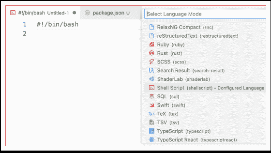

# Shell 脚本命令

图片由 [cocoandwifi](https://pixabay.com/users/cocoandwifi-4330980/?utm_source=link-attribution&utm_medium=referral&utm_campaign=image&utm_content=4996834) 提供自 [Pixabay](https://pixabay.com/?utm_source=link-attribution&utm_medium=referral&utm_campaign=image&utm_content=4996834)

Shell 脚本是任何想要在计算机上高效管理和自动化任务的人的基本技能。

让我们看看 Copilot 和 ChatGPT 在 shell 脚本中的表现。不久前，我写了一篇关于这些符号（~|&||&&$!`()?）在 bash（或类似）shell 中的含义以及如何使用它们的文章。

GitHub Copilot 和 ChatGPT 能否仅凭评论给我这些类型的命令？继续阅读以了解详情。

## #!/bin/bash

Copilot 只在代码编辑器的上下文中工作。它没有像 ChatGPT 那样的对话界面。因此，为了测试 Copilot，我做的第一件事是在 VS Code 中创建一个空白文件。在文件顶部，我添加了一个“shebang”行来指示文件包含 shell 脚本代码。

#!/bin/bash

接下来，我添加了以下注释，看看 Copilot 会为我写什么。

# 检查目录是否存在并打印消息

令我惊讶的是，它什么也没做。也许，我想，Copilot 不了解 shell 脚本，这个实验很快就会结束。然后我明白了。它没有从 shebang 中得到提示，而是可能从文件扩展名中得到的。我将文件保存为 copilot.sh 然后再试一次。

这次，Copilot 给了我一些代码。

如果 [ ! -d /home/username/Downloads ]; then

echo "目录/home/username/Downloads 不存在。"

fi

这不是我预期的，但它确实做了评论中说的事情。

### 文件扩展名？

正如我所提到的，Copilot 需要知道文件的类型才能为您编写代码。通过进一步的实验，我发现让 Copilot 理解文件类型的不是文件扩展名。相反，是 VS Code 本身。将文件保存为.sh 扩展名告诉 VS Code 这是一个 Shell 脚本文件。

文件扩展名不如 VS Code 认为的文件类型重要。在大多数情况下，VS Code 会自动正确识别。如果没有，您可以点击底部状态栏中的“纯文本”短语。页面顶部将出现一个菜单，允许您手动选择文件类型。

在我的情况下，将文件保存为.sh 就解决了问题。在另一种情况下，添加“Shebang”行就解决了问题。结果似乎不一致，所以请仔细检查类型。

记住的重要一点是，Copilot 只关心文件类型而不关心扩展名。

### 聊天 GPT 怎么样？

ChatGPT 似乎更适合这些事情，考虑到其更具对话性质。以下是它对相同提示的回应：

检查目录并在不存在时打印消息

您可以使用 test 命令（也称为 [ 或 [[）来检查目录是否存在，并使用 echo 命令在不存在时打印消息。以下是一个示例：

如果 test ! -d /path/to/directory; then

echo "目录不存在"

结束

或者，您可以使用 if [ ! -d "/path/to/directory" ]; then 命令并带有相同的 echo 消息。

另一个选项是使用 if [[ ! -d "/path/to/directory" ]]; then

两组输出之间的区别立即显而易见。ChatGPT 在回答中提供解释，而不仅仅给出代码。正如您将看到的，这可能是使用 ChatGPT 而不是 Copilot 的重要优势。

## 查找命令

我接下来尝试的是在我的主目录及其子目录中查找所有 PDF 文件。通常情况下，我会使用 find 命令。Copilot 会建议这样做吗？我输入了以下评论：

# 查找我主目录中的所有 PDF 文件并打印每个文件的路径

当我按下回车键时，什么都没有发生。我尝试了几次，但 Copilot 拒绝建议任何内容。然后我决定尝试给它一个提示。我在那个评论的下面单独一行输入了单词 find。Copilot 立即活跃起来，并建议以下完成：

find /home/username -name "*.pdf" -print

我有点失望。除非我的主目录碰巧是 /home/username，否则该命令将无法工作。然而，然后我开始考虑。Copilot 做了艰难的部分。它正确地得到了 find 命令的语法。我总是可以编辑它以修复我的主目录。

实际上，当我将提示更改为 find ~ 时，它会自行完成而无需进一步帮助。

如果您不知道，~ 是一个表示“我的帐户主目录”的 shell 快捷方式。

ChatGPT 给了我两个不同的选项。

查找我主目录中的所有 PDF 文件并打印每个文件的路径

您可以使用 find 命令搜索您的主目录中的所有 PDF 文件并打印每个文件的路径。这里是一个示例：

find ~ -name "*.pdf" -print

这将搜索您的主目录（~）中以 .pdf 结尾的所有文件，并打印每个文件的路径。

或者，您可以使用带有通配符的 ls 命令，

ls ~/ -R | grep .pdf$

这将递归列出您的主目录中的所有文件，并仅过滤具有 .pdf 扩展名的文件。

正如我预料的那样，ChatGPT 比 Copilot 做得更好。与以前一样，我欣赏它提供解释而不仅仅是命令。如果您想要学习，这将是更好的体验。

## 后台任务

我接下来想要做的一件事是确定 AI 是否知道如何使用一些经常使初学者困惑的符号。它们会知道大于号（>）用于重定向输出，和和符号（&）用于在后台运行命令吗？

我更改了我的评论如下，然后给了它同上面一样的提示。

# 在后台查找我的主文件夹下的所有 PDF 文件并将结果写入名为 pdfs.txt 的文件中。

find ~ -name "*.pdf" > pdfs.txt &

这完全正确，尽管我对它省略了-print 参数感到困惑。然后我记得查找命令的默认行为是输出。

跟以前一样，ChatGPT 给了我多个选项，并详细解释了每个选项。

在后台查找我主文件夹下的所有 PDF 文件并将结果写入名为 pdfs.txt 的文件中。

你可以使用 find 命令搜索你主文件夹下的所有 PDF 文件，并使用 tee 命令将结果写入名为 pdfs.txt 的文件中。以下是一个例子：

find ~ -name "*.pdf" -print | tee pdfs.txt &

这将搜索你的主目录及其子目录中所有以.pdf 结尾的文件，并打印每个文件的路径。输出将被传输到 tee 命令，该命令将其写入当前目录中名为 pdfs.txt 的文件中。最后的&符号将在后台运行该命令，因此你可以继续使用终端。

或者，你可以使用带通配符的 ls 命令，

ls ~/ -R | grep .pdf$ >> pdfs.txt &

这将递归列出你的主目录及其子目录中的所有文件，并只筛选出扩展名为.pdf 的文件，写入 pdfs.txt 文件中。最后的&符号也会在后台运行该命令。

我完全忘记了 tee 命令。我也对 ls 命令更加印象深刻，它使用 grep 和简单的正则表达式找到以.pdf 结尾的文件。它还假设我想要追加到 pdfs.txt 文件中如果它已经存在。虽然不完全是我要求的，但它实际上给了我更多。

## 输出管道

接下来，我想看看他们是否知道如何将一个命令的输出作为另一个命令的输入。我还很好奇他们是否知道刚才生成的前一个命令。他们会记得吗？

这里是我的 Copilot 评论和它生成的命令。

# 在后台计算我的主文件夹中的 PDF 文件数量，并输出结果。

find ~ -name "*.pdf" | wc -l &

我希望它会使用上一个命令创建的文件，但它没有这样做。不过，它确实记得我更倾向于使用 find ~。

ChatGPT 再次给了我多个选项。

在后台计算我的主文件夹中的 PDF 文件数量，并输出结果。

你可以使用 find 命令搜索主目录中的所有 PDF 文件，然后使用 wc 命令计算文件数量并输出结果。以下是一个例子：

find ~ -name "*.pdf" -print | wc -l > count.txt &

这将搜索您的主目录及其子目录中以 .pdf 结尾的所有文件，打印每个文件的路径，然后将输出传输到带有 -l 选项的 wc 命令中，该选项将计算行数并将输出重定向到当前目录中名为 count.txt 的文件。最后的 & 将在后台运行该命令，因此您可以继续使用终端。

或者，您可以使用带通配符的 ls 命令：

ls -R ~/ | grep .pdf$ | wc -l > count.txt &

这将递归列出您的主目录及其子目录中的所有文件，仅筛选出扩展名为 .pdf 的文件，将输出传输到带有 -l 选项的 wc 命令中，该选项将计算行数并将输出重定向到当前目录中名为 count.txt 的文件。最后的 & 将在后台运行该命令。

此时，我开始想知道是否有必要使用 Copilot 来进行命令行操作。我继续在这些测试中这样做。

## 重定向错误以忽略它们

大多数人知道如何使用 > 字符将命令的输出重定向到文件中。如果命令遇到任何错误，这些错误仍将显示在终端中，这在后台运行命令时可能会令人困惑。

我知道可以将错误重定向到一个名为 /dev/null 的特殊文件中，以便完全忽略它们。不幸的是，我永远记不住语法。我不知道为什么，因为它并不那么复杂。这可能是我的一个奇怪的盲点吧。

幸运的是，Copilot 知道如何做。我决定结合一些上述概念看看它会做什么。它第一次就做对了。

# 在后台查找所有位于我的主文件夹下的 PDF 文件，忽略错误，并将输出写入文件。

find ~ -name "*.pdf" > pdfs.txt 2> /dev/null &

### ChatGPT 记住了

ChatGPT 真正酷的地方在于它记住了你对话的早期部分。对于这个，我改变了提示，简单地要求它“重写最后一个命令以忽略任何错误”。解释几乎与它上面提供的相同，所以我就不重复了，只是展示它给我的命令。同样，它给了我两个选项。

### 选项 1 – 查找

find ~ -name "*.pdf" -print 2> /dev/null | wc -l > count.txt &

### 选项 2 – ls

ls -R ~/ 2> /dev/null | grep .pdf$ | wc -l > count.txt &

## *nix 系统管理

我开始想知道他们是否能帮助我处理一些常见的系统管理任务，比如创建用户、将用户添加到组等等。

### 添加一个新用户账户

我决定从简单的事情开始，所以我让 Copilot 为我创建一个新用户账户。

# 创建一个新用户账户

sudo adduser 用户名

这在 Mac 上不起作用。也许在 Linux 上可以。我决定再试一次，得到了这个结果。

# 在 macOS 上创建一个新用户账户

dscl . -create /Users/用户名

运行会给我一个权限错误。我再次尝试，在命令前面加上 sudo。可能这个命令有用；我不确定。文件夹/Users/username 不存在，当我打开用户控制面板时也没有出现这个名称的用户。也许我还是忽略了什么。

这是一个例子，Copilot 可能比帮助更令人沮丧。

ChatGPT 再次表现出色，提供了更多的细节和解释。

在 macos 上创建一个新的用户帐户

要在 macOS 上创建一个新的用户帐户，你可以使用 dscl（Directory Service 命令行实用程序）命令。下面是一个示例，如何创建一个名为“newuser”的新用户帐户和密码为“newpassword”：

sudo dscl . -create /Users/newuser

sudo dscl . -create /Users/newuser UserShell /bin/bash

sudo dscl . -create /Users/newuser RealName "New User"

sudo dscl . -create /Users/newuser UniqueID "501"

sudo dscl . -create /Users/newuser PrimaryGroupID 20

sudo dscl . -create /Users/newuser NFSHomeDirectory /Users/newuser

sudo dscl . -passwd /Users/newuser newpassword

这创建了帐户，将 shell 设置为/bin/bash，设置了 RealName、UniqueID、PrimaryGroupID 和 home 目录，并设置了密码。

或者，你可以使用 sysadminctl 命令来创建一个新的用户帐户并设置密码。下面是一个例子：

sudo sysadminctl -addUser newuser -fullName "New User" -password newpassword -admin

这将创建一个帐户，用户名为“newuser”，全名为“New User”，密码为“newpassword”，并具有管理员权限。

你也可以通过转到系统偏好设置 > 用户和群组 > 单击锁图标进行解锁 > 单击“+”符号添加新用户来使用图形界面。

请注意，这些命令需要管理员权限，并且应注意谨慎使用。

我在我的 Mac 上尝试了第二个命令，它毫无问题。ChatGPT 在这里绝对是赢家。

### 使现有用户成为管理员

接下来，我询问它们两个如何使现有用户成为管理员。

# 使用户'michael'成为本地管理员

sudo dseditgroup -o edit -a michael -t user admin

老实说我不确定那个命令是否有效，但它看起来正确。再次，Copilot 是在帮忙还是令人沮丧？

ChatGPT 再次给了我一系列选项，其中第二个与 Copilot 的建议相匹配。

使用户'michael'成为本地管理员

要将用户“michael”设置为 macOS 上的本地管理员，你可以使用 dscl（Directory Service 命令行实用程序）命令。下面是如何将用户“michael”设置为本地管理员的示例：

sudo dscl . -append /Groups/admin GroupMembership michael

这个命令将用户“michael”添加到“admin”组。 "admin"组的成员在系统上具有管理员权限。

或者，你可以使用 dseditgroup 命令将用户添加到“admin”组。下面是一个例子：

sudo dseditgroup -o edit -a michael -t user admin

这个命令将用户“michael”添加到“admin”组。

您还可以通过转到系统偏好设置 > 用户与组 > 单击锁图标以解锁 > 右键单击要更改的用户 > 选择“高级选项” > 将“帐户类型”更改为“管理员”来使用 GUI。

请注意，这些命令需要管理员权限，并应谨慎使用。

### 备份文件

您曾经使用 rsync 从一个系统备份文件到另一个系统吗？没有？当然没有。没有人这样做（好吧，也许有些人这样做）。很难记住语法。这就是为什么存在 Dropbox 和其他类似服务的原因。也许 Copilot 知道语法。

# 将我的主文件夹同步到远程服务器

rsync -avz—delete ~/ username@server:/home/username

它遭受了之前的路径名问题，但同样，这些问题很容易识别和修复。不那么容易辨认的是这些参数是否正确。我在我的 Mac 上做了一点研究，使用 man rsync 阅读命令的在线手册。看起来上面的命令正是您想要将源文件夹同步到目标机器的命令。

—delete 参数告诉命令删除目的地上不在源上的任何额外文件。如果您只想复制所有内容，保留在目的地上您可能已经删除的文件，可以省略此参数。

ChatGPT 给了我四个不同的建议，其中 rsync 是第一个。它还建议使用 scp，这是我打算接下来询问的。

将我的主文件夹同步到远程服务器

在 macOS 上同步您的主文件夹到远程服务器有几种方法。以下是一些选项：

rsync：这个命令行工具可用于在两个位置之间同步文件和目录。以下是如何使用 rsync 将您的主文件夹同步到远程服务器的示例：

rsync -avz -e ssh ~/ username@remote-server:/path/to/remote/folder/

此命令将同步主文件夹中的所有文件和目录到指定的远程服务器。-a 选项告诉 rsync 保留文件权限和所有权，-v 选项提供详细输出，-z 选项启用压缩以加快传输速度。-e 选项指定要使用的远程 shell，在本例中为 ssh。

scp：这个命令行工具可用于在本地计算机和远程服务器之间复制文件和目录。以下是如何使用 scp 将您的主文件夹同步到远程服务器的示例：

scp -r ~/ username@remote-server:/path/to/remote/folder/

此命令将复制主文件夹中的所有文件和目录到指定的远程服务器。-r 选项告诉 scp 递归复制目录。

Finder：您还可以使用 Finder 将您的主文件夹与远程服务器同步，方法是将远程文件夹挂载为本地卷，使用 SMB、NFS 或 FTP 协议，然后使用 Finder 复制文件和文件夹。

第三方软件：还有第三方软件如 ChronoSync、Carbon Copy Cloner 等，可用于将您的主文件夹同步到远程服务器。

请注意，这些命令需要设置具有适当权限和访问权限的远程服务器，并确保你有正确的登录凭据来访问远程服务器。

### 从服务器安全地复制到本地

也许你不想备份文件，而是想将远程服务器上的一些文件复制到本地。你可以使用这样的命令。

# 从服务器安全地复制到本地文件夹

scp -r username@server:/home/username/ ~/Downloads

是的，这个也是正确的。ChatGPT 已经建议了 scp 作为将文件同步到远程服务器的一种可能方法，我完全预料到它会轻松地完成这个任务。

从服务器安全地复制到本地文件夹

要在 macOS 上安全地从远程服务器复制文件到本地文件夹，你可以使用 scp 命令。scp 代表“安全复制”，它使用 SSH 协议传输文件。

这是一个使用 scp 将名为“file.txt”的文件从远程服务器“remote-server”复制到本地文件夹“~/Downloads”的示例：

scp username@remote-server:/path/to/file.txt ~/Downloads

这个命令将文件“file.txt”从远程服务器上指定路径复制到你的主目录中的“Downloads”文件夹。

你也可以通过添加-r 选项（表示“递归”）来复制一个目录及其内容

scp -r username@remote-server:/path/to/directory ~/Downloads

你也可以通过列出它们来复制多个文件和目录，例如：

scp username@remote-server:/path/to/file1.txt /path/to/file2.txt /path/to/directory1/ ~/Downloads

如果远程服务器使用非默认端口，你也可以使用-P 选项指定不同的端口号：

scp -P 22 username@remote-server:/path/to/file.txt ~/Downloads

请注意，这些命令需要设置具有适当权限和访问权限的远程服务器，并确保你有正确的登录凭据来访问远程服务器。此外，scp 命令在传输数据时对数据进行加密，提供了额外的安全层。

### 存档文件夹

有时我们想通过创建归档文件来备份一个文件夹。我们可能想通过电子邮件发送它或将其上传到公共服务器，或者只是简单地将其复制到闪存驱动器中。如果目标是保持文件在一起，那么归档是完美的。如果我能记住那个命令的语法就好了。

我给了他们相同的提示，首先是 Copilot。我要求他们分别给出归档和解压给定目录的命令。

# 使用 tar 和 gzip 对 src 目录进行归档

tar -cvzf src.tar.gz src

# 解压 tar.gz 文件

tar -xvzf src.tar.gz

这些命令是正确的，但再次，Copilot 提供的信息没有上下文。在源代码中，这是有很多意义的。但如果你不知道 tar 命令的作用，你可能还是会迷失。你肯定不会知道你可以安全地删除参数中的 v 并仍然得到想要的结果。

让我们看看 ChatGPT 的表现如何。

使用 tar 和 gzip 对 src 目录进行归档

要使用 tar 和 gzip 归档 src 目录，可以使用以下命令：

tar -czvf src.tar.gz src/

此命令创建一个名为 src.tar.gz 的新归档文件，其中包含 src 目录的内容。-c 选项告诉 tar 创建新的归档文件，-z 选项告诉它使用 gzip 压缩归档文件，并且-v 选项告诉它显示有关创建归档的详细信息。-f 选项指定了归档文件的名称和位置。

您还可以使用以下命令与 gzip 一起使用 tar

tar -zcvf src.tar.gz src/

它将产生相同的结果。

请注意，此命令将在当前目录中创建归档文件，可以指定不同的目录保存归档文件。另外，原始 src 目录不会被删除，如果要在归档后删除它，可以添加—remove-files 选项

tar -czvf src.tar.gz—remove-files src/

此命令将归档 src 目录并在归档后删除原始目录。

这是我第一次看到 ChatGPT 提供与其第一个建议相同的信息作为替代选项。请注意，前两个命令是相同的，排列参数的顺序是无关紧要的。它们实际上是完全相同的命令。

我确实很欣赏它给出的第三个选项。我不知道—remove-files 选项。

然后我要求它解压 tar 文件。我承认我没有做好准备来接受其生成的教程。

要解压.tar.gz 文件，可以使用以下命令：

tar -xzvf src.tar.gz

这个命令告诉 tar 解压 src.tar.gz 文件的内容，-x 选项告诉它解压归档文件，-z 选项告诉它使用 gzip 解压归档文件，并且-v 选项告诉它显示有关解压过程的详细信息。-f 选项指定了归档文件的名称和位置。

您还可以使用以下命令

tar -xvf src.tar.gz

此命令还会提取 src.tar.gz 文件的内容，但您需要通过添加-z 选项来指定文件已经经过 gzipped 压缩

tar -xvzf src.tar.gz

此命令将归档文件的内容提取到当前目录，如果要将文件提取到不同的目录，可以使用-C 选项

tar -xvzf src.tar.gz -C /path/to/directory

此命令将文件提取到目录/path/to/directory。

请注意，提取的文件将具有与原始文件相同的权限和所有权，如果要更改提取文件的权限或所有权，可以使用—no-same-permissions 和—no-same-owner 选项。

tar -xvzf src.tar.gz—no-same-permissions—no-same-owner

此命令将以当前用户的权限和所有权解压文件。

此外，在提取文件后，您可以通过添加-k 选项删除原始归档文件

tar -xvzf src.tar.gz -k

此命令将提取文件并保留原始归档文件。

值得注意的是，tar.gz 文件也被称为 tarballs，它们是 tar 存档和 gzip 压缩的组合，.tar 文件包含文件，.gz 文件是压缩的。重要的是使用 -x 和 -z 选项分别提取和解压文件。

再次，它混淆了，而且基本上给了我两个不同选项的相同命令。否则，我觉得它彻底地解释了事情。

### GitHub SSH 密钥

我不知道你们，但我总是不得不查找如何使用 git+ssh 协议为 GitHub 创建新的 SSH 密钥。也许我可以让 Copilot 为我做这件事。

# 创建并将新的 github ssh 密钥复制到剪贴板

ssh-keygen -t rsa -b 4096 -C "

" && cat ~/.ssh/id_rsa.pub | pbcopy

该命令是正确的，和我预期的完全一致，除了它给我的 -C " 提示语。实际上，Copilot 在该参数后停止了，好像它希望我输入一些内容。

每当 Copilot 以部分命令作为输出时，它要么等待您自己输入更多信息，要么希望您在下一行继续。

结果表明 -C 只是密钥的一个注释，所以我可以输入类似 github-key 等内容然后继续。当我按下 Return 键时，它给了我第二行。该行告诉 shell 使用 pbcopy 将我的家目录下的 .ssh 目录中的公钥复制到剪贴板。

在那一点上，计算机的剪贴板应该有我的公钥的副本，然后我可以将其粘贴到 GitHub 的公钥 UI 中。

ChatGPT 建议我使用我的电子邮件地址作为注释，并给了我一个完整的例子。它还将该过程分割成了两个命令而不是一个。

创建并将新的 github ssh 密钥复制到剪贴板

要在 macOS 上为 GitHub 使用创建和复制新的 SSH 密钥，您可以使用 ssh-keygen 和 pbcopy 命令。以下是创建新 SSH 密钥并将其复制到剪贴板的示例：

打开终端并生成一个新的 SSH 密钥：

ssh-keygen -t rsa -b 4096 -C "your_email@example.com"

该命令将使用 4096 位密钥大小创建一个新的 RSA 密钥，并将邮箱 "your_email@example.com" 与该密钥关联为注释。

在提示时，您可以按 Enter 接受密钥的默认位置和文件名，或输入新位置和文件名。

生成密钥后，您可以使用 pbcopy 命令将密钥复制到剪贴板：

pbcopy < ~/.ssh/id_rsa.pub

该命令将文件 "~/.ssh/id_rsa.pub" 的内容复制到剪贴板。

进入 GitHub 设置，在 SSH 和 GPG 密钥下，点击 "New SSH Key" 按钮。

给该密钥命名，并将密钥粘贴到 "Key" 栏，点击 "Add SSH key" 按钮。

您可以通过运行 ssh -T git@github.com 来测试连接。

请注意，pbcopy 命令仅在 macOS 上有效，并且用于将数据复制到剪贴板。在其他操作系统上，命令可能不同，您可能需要使用 xclip 或 xsel 将密钥复制到剪贴板。

我喜欢 ChatGPT 超越实际命令，提供示例、选项甚至注意事项。

## 专用于 macOS 的命令

到目前为止，我对 Copilot 和 ChatGPT 能够做到的印象深刻。有些命令我很难记住，特别是在 macOS 上操作媒体文件的命令。让我们看看它们在其中一些命令上的表现如何。

不幸的是，我似乎已经达到了 Copilot 能力的极限。我尝试的每个评论都没有产生有效的命令。这是第一个，要求 Copilot 将一个 JPEG 文件夹转换为 PNG 格式。

它给我的命令在我的 Mac 上不起作用，但看起来应该可以。

# 将当前目录中的所有 jpg 文件转换为 png 文件

for file in *.jpg; do

convert "$file" "${file%.jpg}.png"

完成

ChatGPT 自然地解释了原因。

将当前目录中的所有 jpg 文件转换为 png 文件

您可以使用 ImageMagick 的命令行工具 convert 将当前目录中的所有 JPG 文件转换为 PNG 文件。以下是如何使用 convert 将所有 JPG 文件转换为 PNG 文件的示例：

for file in *.jpg; do convert "$file" "${file%.jpg}.png"; done

这个命令将循环遍历当前目录中具有 .jpg 扩展名的所有文件，在每个文件上运行 convert 命令，并将输出保存到具有相同名称但扩展名为 .png 的新文件中。

或者，您可以使用 ImageMagick 的 find 和 mogrify 命令：

find . -name "*.jpg" -exec mogrify -format png {} +

这个命令将搜索当前目录及其子目录中的所有 .jpg 文件，并将它们的格式更改为 .png 并覆盖原始文件。

请注意，这将覆盖原始的 JPG 文件。如果您想保留原始文件，可以修改命令以将输出保存到不同位置或使用不同的文件名。

有趣的是，它的第一个建议与 Copilot 的完全相同。不同之处在于 ChatGPT 告诉我 convert 命令来自 ImageMagick。决定还不要放弃，我问它如何安装 ImageMagick。

这就是它告诉我的。

如何安装 ImageMagick？

要在 macOS 上安装 ImageMagick，您可以使用软件包管理器 Homebrew。以下是使用 Homebrew 安装 ImageMagick 的步骤：

如果您尚未安装 Homebrew，请在终端中运行以下命令来安装：

/bin/bash -c "$(curl -fsSL https://raw.githubusercontent.com/Homebrew/install/HEAD/install.sh)"

安装了 Homebrew 后，您可以使用它来通过在终端中运行以下命令来安装 ImageMagick：

brew install imagemagick

安装完成后，您可以通过运行以下命令来检查是否成功：

convert -version

这将显示您安装的 ImageMagick 版本。

在 macOS 上安装 ImageMagick 的另一种方法是从官方网站下载二进制包并手动安装。您可以在此处找到二进制包：[`imagemagick.org/script/download.php#macosx`](https://imagemagick.org/script/download.php#macosx)

请注意，您可能需要将 ImageMagick 二进制文件添加到系统的 PATH 中，以便终端识别 convert 和 mogrify 命令。

我遇到了其他命令的类似问题。这个命令对我也没用，但没有提示错误可能是什么。

# 从文件夹中提取所有 mp4 文件的音频

for file in *.mp4; do

ffmpeg -i "$file" -vn -acodec copy "${file%.mp4}.mp3"

完成

不出所料，ChatGPT 给了我更多的上下文，建议了一个很相似的命令，但也解释了我需要理解的内容。

从文件夹中提取所有 mp4 文件的音频

您可以使用命令行工具 ffmpeg 在 macOS 上从所有 MP4 文件中提取音频。以下是如何使用 ffmpeg 从当前目录中的所有 MP4 文件中提取音频并将其保存为 MP3 文件的示例：

for file in *.mp4; do ffmpeg -i "$file" -vn -acodec libmp3lame -ac 2 -q:a 4 -y "${file%.mp4}.mp3"; done

这个命令将循环遍历当前目录中具有.mp4 扩展名的所有文件，在每个文件上运行 ffmpeg 命令，并将音频输出保存到一个新文件中，文件名相同，但扩展名为.mp3。

该命令使用-i 选项指定输入文件，-vn 选项禁用视频流，-acodec 选项指定音频编解码器，-ac 2 指定音频通道数，-q:a 4 指定音频质量和-y 用于覆盖输出文件。

您可以通过更改 mp3 和 libmp3lame 来更改输出文件格式和编解码器。

请注意，如果系统中尚未安装 ffmpeg，您可能需要在系统中安装 ffmpeg。您可以通过在终端中运行以下命令来使用 Homebrew 安装 ffmpeg：

brew install ffmpeg

另外，请注意，该命令将覆盖同名现有文件。如果您想保留原始文件，可以修改命令将输出保存到不同位置或使用不同文件名。

ChatGPT 给我的命令更完整，但它的解释是误导的。-y 参数将自动覆盖输出上的任何现有文件，但该命令不会破坏输入文件。

我的最后一个测试是尝试使用 avconvert 在 macOS 上提取音频。Copilot 给了我一个单一命令。

# 使用 avconvert 从视频文件中提取音频

avconvert -i video.mp4 -vn -acodec copy audio.mp3

显然，这个命令已经不复存在了，ChatGPT 很高兴向我解释了这一点。

avconvert 是什么？

avconv 是一个类似于 ffmpeg 的命令行工具，可用于转换多媒体文件。在 macOS 上使用 avconv 提取视频文件的音频，您可以使用以下命令：

avconv -i inputfile.mp4 -vn -acodec libmp3lame -ac 2 -q:a 4 -y outputfile.mp3

此命令使用 -i 选项指定输入文件，-vn 选项禁用视频流，-acodec 选项将音频编解码器指定为 libmp3lame，-ac 2 选项指定音频通道数，-q:a 4 选项指定音频质量，-y 选项覆盖已存在的输出文件。

您可以根据需要更改输入和输出文件名和格式，也可以根据需要更改编解码器和质量选项。

请注意，如果系统尚未安装 avconv，则可能需要在系统中安装 avconv。您可以通过在终端中运行以下命令来安装 avconv：

brew install libav

请注意，avconv 和 ffmpeg 类似但并非完全相同，它们的语法和选项可能略有不同。有些在 ffmpeg 中有效的选项或编解码器可能在 avconv 中无效，反之亦然。此外，ffmpeg 的使用更为普遍，并且有更积极的开发，但两者都可以用于从视频文件中提取音频。

请注意，Copilot 没有回答我提出的问题，或者我是这样认为的。感到困惑和稍有好奇，我随后要求澄清。

avconv 和 avconvert 之间有什么区别？

avconv 和 avconvert 实际上是同一件事，avconv 是 libav 库的命令行工具，这是 ffmpeg 库的一个分支。avconv 曾是 libav 库的命令行工具，它相当于 ffmpeg 库的命令行工具，但 libav 项目在 2018 年停止了，现在 libav 开发者建议使用 ffmpeg 而不是 avconv。avconvert 是 avconv 的拼写错误，这两个命令都可以执行相同的任务。avconv 工具已被 ffmpeg 取代，但您可能会发现一些旧资源或脚本使用 avconv 或 avconvert。

总之，avconv 和 avconvert 是相同的命令行工具，但 libav 项目在 2018 年停止，现在建议使用 ffmpeg 而不是 avconv。

我从 Copilot 那里没有得到任何上下文。令我惊讶的是，我以为 avconvert 是当前和正确的命令。显然，在这两个方面我都错了。

## 结语

虽然使用 AI 工具可能节省时间和精力，但重要的是评估生成的命令的质量，并确保它们安全有效。ChatGPT 的输出优于 Copilot，但我对本章的目的有所期待。

ChatGPT 是一个高级人工智能模型，能够理解并回答更复杂和微妙的问题。Copilot 是一个专为开发人员设计的人工智能助手，用来帮助他们完成编码任务，但它不像 ChatGPT 那样先进。然而，重要的是，无论哪种工具都可以帮助你有效地完成任务。ChatGPT 和 Copilot 都可以准确可靠地回答你的问题，但 ChatGPT 的输出更详细和全面。最终，使用哪种工具取决于你的具体需求和偏好。

除了输出质量的差异外，另一个要考虑的方面是每个工具的专业领域。ChatGPT 是一个通用的语言模型，经过大量文本数据的训练，因此在主题可能不熟悉时，或者需要解释或澄清时，它是一个很好的选择。它擅长提供对主题的全面理解，可以用于广泛的任务，包括语言翻译、文本生成和问题回答。

另一方面，Copilot 是一个专为开发人员设计、在实际软件上进行过训练的人工智能助手。因此，它可能更擅长理解你代码的上下文，并提供与你具体需求相符的解决方案。

正如你将看到的，它可以通过建议代码片段、提供文档，甚至为你完成代码来帮助你处理编码任务。

如果你是一个开发人员，并且需要帮助解决你的代码问题，Copilot 是一个很好的选择。
