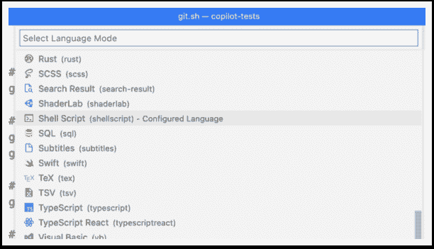

|  |  |  |
| --- | --- | --- |

# Git 命令

GitHub 提交图按作者

## GitHub Copilot 能帮助 Git 本身吗？

在我使用 shell 脚本的经验之后，我决定探索 Copilot 如何帮助学习 Git 命令。在本章中，我将详细介绍我的发现，并演示 Copilot 如何有效地辅助学习过程。

## 基本 Git 命令

就像我在 shell 脚本中所做的那样，我在 VS Code 中创建了一个空白文档，并将其类型设置为 Shell 脚本。接下来，我开始在文档中添加注释，看看 Copilot 会建议什么。在下面的每种情况中，我尽可能少地输入，以充分运用 Copilot。

我从简单开始，只是让它为我创建一个新的 git 仓库。

# 创建一个空的 git 仓库

git init

接下来，我想设置我的 git 用户名和邮箱，但我总是记不住确切的命令。然而，Copilot 可以。

# 设置我的 git 用户名和邮箱

git config user.name "Mike Callaghan"

git config user.email "michael@walkingriver.com"

不幸的是，但可以理解的是，Copilot 不知道我的姓名和邮箱地址。我自己添加了这些信息。它建议使用“John Doe”，这是一个简单的提示，我需要更改它。对于邮箱，它在开头引号处停止建议的文本，建议我自己完成这一行。

一个空的 git 仓库并不是很有用，所以我想创建一个新的分支，向其中添加一个文件，然后提交更改并推送该分支。以下是这些命令，都是根据 Copilot 从我的评论中建议的：

# 创建并切换到名为 develop 的新分支

git checkout -b develop

# 创建一个文件

echo "Hello World" > hello.txt

# 将所有新文件和更新的文件提交到这个分支

git add .

git commit -m "Initial commit"

# 推送此分支到远程仓库

git push -u origin develop

# 切换回主分支

git checkout main

# 将 develop 分支合并到主分支

git merge develop

# 将主分支重新定位到 develop 分支

git checkout develop

git rebase main

这些都是相当不错的猜测。到目前为止，我对 Copilot 对 git 的理解感到满意。

### 中级 Git 命令

在本章的其余部分，我在一个成熟的仓库上运行生成的命令，而不是上面创建的那个。这个仓库有多个分支、提交、标签等。

#### 提交日志

Git-log 可以让您以相反顺序查看仓库的提交的快速摘要，从最新到最旧。Copilot 帮助我学习了许多关于该命令的变体。

# 展示 develop 分支上最近的 10 次提交

git log—oneline -10 develop

# 展示所有分支上最近的 10 次提交

git log—oneline -10—all

# 展示所有分支上最近的 10 次提交并展示图形

git log—oneline -10—all—graph

# 显示所有分支上最近的 10 个提交，显示图形和作者

git log—oneline -10—all—graph—author="Mike Callaghan"

我不确定这个是否准确。我相信它会显示所有 Mike Callaghan 的提交，但不是所有提交和它们的作者。再次强调，小心接受 Copilot 提供的内容。它可以帮助，但如果不小心，也会伤害你。

#### 撤销错误的提交

我很难记住正确的 git 命令来撤销我不想提交的更改。Copilot 是否能让我不再参考那篇文章？这是我询问时得到的回答。

# 撤销最后一次提交

git reset—hard HEAD~1

# 回滚最后一次提交并保留更改

git reset—soft HEAD~1

# 从 ee670f5 到 9ad6740 回滚所有提交

git revert ee670f5..9ad6740

这些完全正确。

#### Cherry Pick

有时我们想从另一个分支选择单个先前提交并将其应用到当前分支。这称为 cherry picking，Copilot 也知道如何做。

# 将提交 9ad6740 cherry-pick 到 main

git checkout main

git cherry-pick 9ad6740

#### Git Diff

如果你想查看两个提交之间的变化，可以使用 git-diff 命令。

# 比较提交 ee670f5 和 9ad6740

git diff ee670f5 9ad6740

这样做是有效的，但不够直观。也许有更好的选择？

### DiffMerge

我以前用过一个叫 DiffMerge 的应用程序，它提供了一个更好的 UI 来比较差异。我想知道 Copilot 是否能帮我安装和配置它。

# 从 brew 安装 diffmerge

brew install—cask diffmerge

# 将 difftool 设置为 diffmerge

git config—global diff.tool diffmerge

git config—global difftool.diffmerge.cmd 'diffmerge "$LOCAL" "$REMOTE"'

git config—global difftool.prompt false

# 使用外部 diff 工具比较提交 ee670f5 和 9ad6740

git difftool ee670f5 9ad6740

请注意，尽管 DiffMerge 在 macOS 和 Windows 上都可以运行，但 brew 命令是特定于 macOS 的。我要求在 Windows 上安装，结果给了我这个：

# 在 Windows 上安装 diffmerge

choco install diffmerge

我没有 Windows 电脑来尝试，但看起来是合法的。上面的其余命令应该是一样的。

### 高级 Git 命令

我不自诩为 git 专家。我最多只能算是一个中级学生。尽管如此，我在 git 上做了一些更高级的活动，并在这里为您呈现。

#### 存档 Repo

你是否曾经需要向某人发送你的 git 存储库的副本，而不附带任何 git 内容？你可以在所需的提交处检出正确的分支，删除.git 文件夹，然后将其压缩。你知道 git 可以为你完成所有这些吗？

# 存档当前分支

git archive -o archive.zip HEAD

# 存档当前分支并排除.gitignore 文件

git archive -o archive.zip HEAD—. ':!*.gitignore'

# 存档提交 1319f65 并排除.gitignore 文件

git archive -o archive.zip 1319f65—. ':!*.gitignore'

#### 清理过时的分支和文件

完成拉取请求后，清理旧的功能分支通常是个好主意。GitHub 和 GitLab 可以自动配置这样做。问题是，在本地存储库中这样做并不那么容易。

# 删除所有已合并的分支

git branch—merged | grep -v "\*" | xargs -n 1 git branch -d

有时，你可能想要从本地存储库和远程存储库中删除一个单独的分支。

# 本地和远程删除 myfeature 分支

git branch -d myfeature

git push origin—delete myfeature

如果你在本地有未跟踪的文件，想要清理它们怎么办？

# 从当前工作树中删除未跟踪的本地文件

git clean -f

#### 浅克隆

你是否遇到过一个 Git 存储库占用了太多磁盘空间的情况？过了一段时间，你可能会决定不需要完整的历史记录，而且只克隆其中的一个部分会更容易。这叫做“浅克隆”，Copilot 知道如何做。

# 克隆存储库，只保留 2022 年 1 月 1 日之后的提交

git clone—shallow-since=2022-01-01

# 克隆存储库，只保留 2022 年 1 月 1 日之后和 2023 年 1 月 1 日之前的提交

git clone—shallow-since=2022-01-01—shallow-until=2023-01-01

# 克隆存储库，只保留 2022 年 1 月 1 日之后和 2023 年 1 月 1 日之前的提交且只有主分支

git clone—shallow-since=2022-01-01—shallow-until=2023-01-01—branch main

# 克隆存储库，只保留 2022 年 1 月 1 日之后和 2023 年 1 月 1 日之前的提交，只有主分支和只有最后 10 个提交。

git clone—shallow-since=2022-01-01—shallow-until=2023-01-01—branch main—depth 10

到目前为止，我觉得没必要记住这些命令。Copilot 会替我记住它们。

#### 永久删除一个文件

对于我的最后操作，假设你不小心将一个包含秘密（密码、私钥等）的文件提交到远程存储库。如果你只是从本地删除它，将文件添加到 .gitignore，并提交，这样做行不通。文件仍然可以恢复。以这种方式删除文件的唯一方法是重写历史。幸运的是，git 可以这样做，但事实上并不像说的那么容易，你会看到的。

当我要求 Copilot 删除一个包含秘密的文件时，这就是 Copilot 提供的。

# 意外提交到 git 的 secrets 文件

git filter-branch—force—index-filter 'git rm—cached—ignore-unmatch secrets.txt'—prune-empty—tag-name-filter cat——all

老实说，我不想测试这个命令，但我决定在一个不重要的存储库中试一试。我将 secrets.txt 替换为 package-lock.json，我觉得删除这个特定文件不会带来太大危险。

当我运行它时，git 给了我一个大警告：

git-filter-branch 有很多陷阱，生成了被搅乱的历史

重写。在继续之前按 Ctrl-C 中断，然后使用

其他过滤工具，如'git filter-repo'

(https://github.com/newren/git-filter-repo/) 链接查看`filter-branch`手册页了解更多详情；为了抑制这个警告

有关 filter-branch 的详细手册页，请参阅更多详细信息；要抑制此警告，

设置 FILTER_BRANCH_SQUELCH_WARNING=1。

我让它运行，想着“最坏的情况是什么？”结果是它移除了我整个项目中每个 package-lock.json 的实例。除此之外，本地和远程仓库分歧了大约 20 个提交，所以我从来没有弄清楚那是否是我想要的。

我让 Copilot 修复了我的分歧分支，它提供了这个选择：

# 修复分歧的分支

git fetch—all

git reset—hard origin/main

它有效了，现在我回到了最开始的地方。

现在，那个警告到底是什么意思？也许这是我们应该考虑的事情。我调研了 git-filter-repo，看起来是一个更好的解决方案。而且，事实证明，Copilot 似乎也知道那个。

# 使用 filter-repo 意外推送到远程的 secrets 文件。

git filter-repo—path-glob '!secrets.txt'

因为我没有安装它，所以命令没有生效。不过，我对它能提供正确的语法印象深刻（我推测）。

### 最后的话

除了最后一个请求和 git log 的一个小问题之外，Copilot 处理了我提出的一切。每当我不记得要使用哪个 git 命令时，我可能会继续使用它。

你可能想知道为什么我这里没有使用 ChatGPT。我预计它能够正确地执行这些相同的命令。我敦促你尝试一下作为练习。给我发封邮件，告诉我进展如何。
