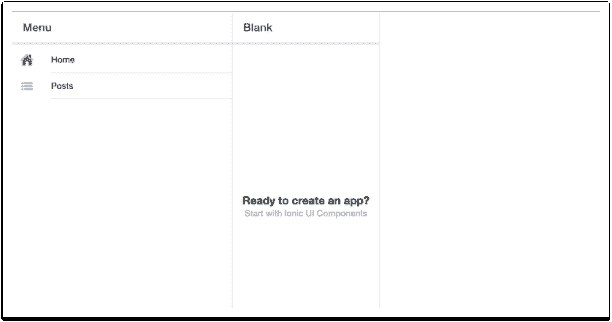
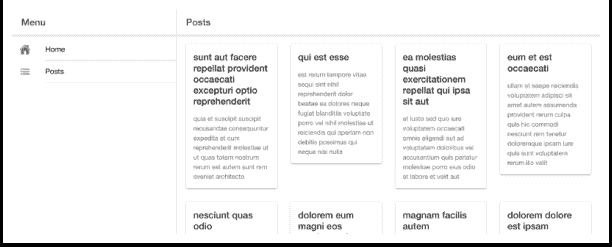
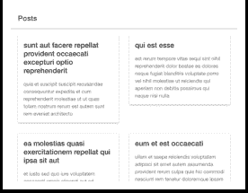

# 让我们构建一个应用程序！

图片由 [Gerd Altmann](https://pixabay.com/users/geralt-9301/?utm_source=link-attribution&utm_medium=referral&utm_campaign=image&utm_content=4025614) 提供，来自 [Pixabay](https://pixabay.com/?utm_source=link-attribution&utm_medium=referral&utm_campaign=image&utm_content=4025614)

在之前的章节中，我展示了 Copilot 和特别是 ChatGPT 的非常冗长的输出。我还展示了每个工具的输出，以展示它们对给定提示的表现如何。

对于这一章，我将使用 Copilot 作为我的配对编程伴侣来构建一个适度的应用程序。

我的技术栈将是一个使用 HTML、Angular 和 Ionic Framework 的 Web 应用程序。这些选择与使用 AI 作为我的伴侣的目的无关。这些是我每天使用的东西，所以我很快就能知道 AI 生成的代码是否准确。

这不会是一个复杂的应用程序，只是足够演示我如何使用这些工具。

希望你会跟着一起做。如果你这样做了，请告诉我进展如何。

## 一个 Ionic 应用

Ionic 是一个流行的 Web 框架，用于构建各种类型的应用程序，但传统上它被用来创建混合移动应用程序。也就是说，使用 Web 技术编写的移动应用程序。

## 新的空白 Ionic Angular 应用程序

为了准备这个项目，我确保我使用最新版本的 Ionic 和 npm i -g @ionic/cli。然后用 ionic start 创建了一个全新的空白 Ionic-Angular 应用程序。

项目创建后，我在 VS Code 中打开了它。然后我创建了一个空白文本文件，并告诉 VS Code 它是一个 Shell 脚本文件。如果你一直在阅读，你可能会怀疑我接下来要做什么。

## 添加一个新的 Ionic 页面

我记不得如何创建一个新页面（嗯，我记得，但我想看看 Copilot 是否也知道）。在我的新 Shell 脚本文件中，我输入了以下注释，并等待看看 Copilot 会给我提供什么。

# 创建一个名为 Posts 的新 Ionic 页面

ionic g page Posts

那个命令是创建页面的几种有效方式之一，所以我在 VS Code 的内置终端中运行了它。创建完成后，我打开了 app.component.html 文件，这样我就可以为我的新页面添加一个菜单。

## 侧边菜单和分栏

每当我创建一个新的 Ionic 应用程序时，我都从一个空白模板开始，即使我知道我将要想要一个侧边菜单和一个分栏布局。我不从侧边菜单模板开始，因为它会添加一堆我必须删除的东西。缺点是我真的永远记不住我需要做的一切来创建分栏和侧边菜单。不过我相信 Copilot 能处理好这个问题。

当我打开 HTML 文件时，它看起来是这样的：

<ion-app>

<ion-router-outlet></ion-router-outlet>

</ion-app>

没什么意外。我删除了 <ion-router-outlet> 行，用注释替换了它：

<!—添加一个侧边菜单和一个 ion 分割窗格—>

Copilot “思考”了一会儿，几乎让我担心它不起作用。然后，它给了我三个不同的选项。第一个选项包含了两个硬编码页面。第二和第三个选项从组件上的页面数组构建了一个菜单。两者之间唯一的区别是一些间距，所以我只是选择了一个。

这是 Copilot 给我的：

<ion-app>

<!—添加一个侧边菜单和一个 ion 分割窗格—>

<ion-split-pane>

<ion-menu side="start" contentId="main-content">

<ion-header>

<ion-toolbar>

<ion-title>菜单</ion-title>

</ion-toolbar>

</ion-header>

<ion-content>

<ion-list>

<ion-menu-toggle auto-hide="false" *ngFor="let p of appPages">

<ion-item [routerDirection]="'root'" [routerLink]="[p.url]">

<ion-icon slot="start" [name]="p.icon"></ion-icon>

<ion-label>

{{p.title}}

</ion-label>

</ion-item>

</ion-menu-toggle>

</ion-list>

</ion-content>

</ion-menu>

<ion-router-outlet id="main-content"></ion-router-outlet>

</ion-app>

如果你比我更敏锐，你会注意到 <ion-split-pane> 标签没有关闭。Copilot 等待我在关闭 </ion-app> 标签之前输入一个空行。一旦我这样做了，Copilot 通过添加 </ion-split-pane> 为我完成了。

我的组件还没有一个 appPages 数组，所以我需要让 Copilot 为我创建一个。在 app.component.ts 中，在类的顶部附近，我输入了 appPages 这个词作为提示，看看它会做什么。它逐一给我这些行，意味着我必须通过按 tab 键接受每个建议，然后按 return 键继续。

appPages = [

{

title: '主页',

url: '/home',

icon: 'home'

},

当我到达 url 时，我确实需要循环浏览选项。它最初建议 /inbox 作为 url。 /home 是它的第二个建议。你还可以看到在这一点上，它还没有完成数组。它在等待我允许它继续。

我仍然需要一个菜单到我的新 Posts 页面，所以我按 return 给了它权限。它给了我这个：

{

title: '列表',

我不想要那个标题，但没有其他选项。现在我知道我可以通过改变它的建议然后继续，来影响 Copilot，所以我将标题改为 Posts 并移到下一行。然后它添加了这些行：

url: '/posts',

icon: 'list'

},

现在我没有更多的页面了，但如果我让它，Copilot 会继续添加更多，所以我手动在下一行输入了 ]; 来关闭数组。

在这一点上，我实际上还没有检查这些代码是否有效，但记得我在打开项目后使用了 npm start。我切换到了我的浏览器，项目已经渲染出来，发现这个等着我：

大部分由 GitHub Copilot 编写的 Ionic 分割窗格应用

点击菜单可以切换到所选页面，所以它有效！

看看那个截图，你可能会看到 Copilot 错过的另一个细节。我最初也错过了它，但出于完整性考虑，我想把它包含进来。分栏布局的显示并不完全正确。该首页应该占据整个屏幕的宽度。

重新查看代码后，我意识到 Copilot 没有将必需的 contentId 属性添加到 <ion-split-pane> 中。希望它会提供这样做，我在关闭 > 前添加了一个空行... 等待... 然后什么都没有发生。

因此，我认为我最终困住了 Copilot。我手动更新了该行，然后它开始按预期工作。

<ion-split-pane contentId="main-content">

Copilot 正确地将 contentId 添加到 <ion-menu> 中，只是没有添加到 <ion-split-pane>。奇怪。

## 让我们获取一些数据！

如果您按照顺序一直在关注，您可能还记得我让 Copilot 使用 Angular HttpClient 为我写一些 RxJS。我将在这里使用其中的一些代码，因为它已经写好了。

我用这个命令创建了一个新的服务：

ionic g service ApiService—skip-tests

是的，我跳过了创建测试 —— 我稍后会处理 Copilot 和单元测试。

然后我将 RxJS 章节中的以下代码粘贴到新文件中。

import { Injectable } from '[@angular/core](http://twitter.com/angular/core "Twitter profile for @angular/core")';

import { HttpClient } from '[@angular/common](http://twitter.com/angular/common "Twitter profile for @angular/common")/http';

// 在根中提供服务

[@Injectable](http://twitter.com/Injectable "Twitter profile for @Injectable")({

providedIn: 'root'

}) export class ApiService {

constructor(private http: HttpClient) { }

// 从 API 获取所有帖子

getAllPosts() {

return this.http

.get('[`jsonplaceholder.typicode.com/posts'`](https://jsonplaceholder.typicode.com/posts%27));

}

}

还有更多的代码，但就我而言已经足够了。有了这段代码，我期望能完成我的简单应用程序。

## 从帖子组件加载博客帖子

服务创建好了，现在该把注意力转向帖子组件，并将这些帖子加载到其中。我打开了 posts.page.ts，并在类顶部加了一个提示。记住，我的目标是尽可能少写代码。

// 注入 ApiService

constructor(private apiService: ApiService) { }

Copilot 添加了构造函数，即使我已经有了一个。在这种情况下，删除现有的构造函数也很容易，但如果我已经有了其他服务的构造函数呢？我决定尝试使用现有的构造函数。因此，我从这里开始：

// 注入 ApiService

constructor(private http: HttpClient) {

}

我想给它一个带有参数的现有构造函数，希望它不会创建一个新的。我在 HttpClient 后面输入了逗号，然后是一个 [空格]。Copilot 正确地添加了第二个参数，留下了这样的代码：

constructor(private http: HttpClient, private apiService: ApiService) { }

服务名称是正确的，但正如我之前指出的，Copilot 不会自动导入服务。嗯，它会，但你必须在其中一个现有的导入上放置你的光标，然后让它从那里弄清楚，而它几乎总是会做正确，除了显然在这种情况下。它不会为我添加它，所以我让 VS Code 自己来做。

接下来，我需要获取那些帖子。在这种情况下，真正需要的是智能提示，但是，再次强调，我的目标是尽可能少写代码。

// 从 API 获取帖子作为可观察对象。

posts: any;

ngOnInit() {

this.apiService.getAllPosts().subscribe(data => {

this.posts = data;

});

}

尽管那不是我想要的，但我不能说它不起作用。我删除了那段代码，尝试了另一种方法。我留下了注释，然后添加了 posts$ =，然后让 Copilot 建议剩下的部分。这告诉 Copilot 我想要一个可观察的变量赋值给变量 posts$。

// 从 API 获取帖子作为可观察对象。

posts$ =

this.apiService.getAllPosts();

那就是我想要的，也是这个文件所需要的一切。

## 博客文章的响应式视图

我一直是 <ion-card> 的忠实粉丝，所以我想使用一堆它们来显示上面 API 调用的博客文章。我还希望 UI 具有响应性，这也是一个要求。

我切换到了 posts.page.html 的模板文件，并将光标放在 <ion-content> 内的空行上。

给定一个 HTML 注释，这就是我最终得到的。

<!—使用 ion-grid 创建一个响应式布局—>

<ion-grid>

<ion-row>

<ion-col size="12" size-md="6" size-lg="4" *ngFor="let post of posts">

<ion-card>

<ion-card-header>

<ion-card-title>{{post.title}}</ion-card-title>

</ion-card-header>

<ion-card-content>

{{post.body}}

</ion-card-content>

</ion-card>

</ion-col>

</ion-row>

</ion-grid>

我不知道它会提供 <ion-card>，但因为那是我想要的，所以我很满意。它唯一搞错的事情是 posts 变量，那个并不存在。我想知道是否它是另一种替代建议之一，所以我撤消了编辑，然后再试一次，准备循环浏览建议。虽然它的其他建议都没有解决这个问题，所以我尝试了另一个想法。

我将注释更改为引用 posts$ 的实际变量名称。然后 Copilot 给了我这个。我发现，如果你给 Copilot 提供足够的提示，它会解决问题。

<!—使用 ion-grid 创建帖子的响应式布局—>

<ion-grid>

<ion-row>

<ion-col size="12"

size-sm="6"

size-md="4"

size-lg="3"

*ngFor="let post of posts$ | async">

<ion-card>

<ion-card-header>

<ion-card-title>{{post.title}}</ion-card-title>

</ion-card-header>

<ion-card-content>

{{post.body}}

</ion-card-content>

</ion-card>

</ion-col>

</ion-row>

</ion-grid>

这就是我想要的！认为这可能是正确的，我决定切换到浏览器，检查一下我的（嗯，Copilot 的）杰作。

令我惊讶的是，它编译了但没有运行。你注意到问题了吗？也许如果我给你看一下控制台错误，问题就会变得明显。

错误：未捕获（在承诺中）：NullInjectorError：R3InjectorError（PostsPageModule）[HttpClient -> HttpClient -> HttpClient -> HttpClient]：

NullInjectorError: 未提供 HttpClient！

哦，对了！

我忘了在我的应用模块中添加 HttpClientModule。长话短说，我本来可以自己做，但觉得让 Copilot 根据我的注释来猜我想要什么会更好。在`app.module.ts`顶部，我添加了这个注释。Copilot 添加了剩下的部分。

// 导入 HttpClientModule

import { HttpClientModule } from '@angular/common/http';

然后在`imports`数组中：

// 在`imports`数组中添加 HttpClientModule

HttpClientModule,

现在终于是时候再次审查浏览器了。

由 GitHub Copilot 在 Ionic Framework 中几乎完全编写的博客文章应用

这甚至是响应式的。

响应式版本只有两列内容，没有侧栏菜单。

但你可能已经注意到了一个疏忽。屏幕较窄时，侧栏菜单恰当地消失了，但没有菜单按钮。是 Copilot 忘记了还是我？老实说，我不确定。

不过修复起来不难，我们很快就会看到的。

## 工具栏按钮

我想做的最后一件事是看看我是否能让 Copilot 帮我制作一些按钮。在文章页面，现有的页眉如下所示：

<ion-header>

<ion-toolbar>

<ion-title>文章</ion-title>

</ion-toolbar>

</ion-header>

现在，我碰巧知道按钮应该放在哪里，但让我们假设我不知道。如果我删除整个页眉然后看看 Copilot 会做些什么呢？我就是这么做的，用注释替换了页眉，之后 Copilot 为我提供了剩下的部分。

<!—标题和菜单按钮的页眉—>

<ion-header>

<ion-toolbar>

<ion-buttons slot="start">

<ion-menu-button></ion-menu-button>

</ion-buttons>

<ion-title>文章</ion-title>

</ion-toolbar>

</ion-header>

它没建议添加返回按钮，所以我在菜单按钮后立即添加了一个注释。

<!—返回按钮—>

<ion-back-button defaultHref="/home"></ion-back-button

这是第二个建议。第一个建议中，返回按钮被注释掉了，并且没有`defaultHref`，这是告诉 Ionic 在没有“返回到哪里”的情况下要导航到哪里的属性。

为了保持一致，我也需要对主页做同样的事情。但引起我注意的是，这次它记住了返回按钮并且自动添加了它。

Copilot 倾向于识别代码中的模式，并在合适的地方应用这些模式。

<!—标题和菜单按钮的页眉—>

<ion-header>

<ion-toolbar>

<ion-buttons slot="start">

<ion-menu-button></ion-menu-button>

<!—返回按钮—>

<ion-back-button defaultHref="/home"></ion-back-button>

</ion-buttons>

<ion-title>文章</ion-title>

</ion-toolbar>

</ion-header>

但不总是。它把页面标题搞错了，所以我手动修复了。

返回按钮是否对用户体验有意义是我们可以另作讨论的事情。

## ChatGPT 呢？

ChatGPT 能做得更好吗？我对在本章中使用 ChatGPT 的最初犹豫有两个原因：

1.  编码时需要来回切换。如果你不停地在编辑器和 ChatGPT 之间切换，会很快感到疲惫。

1.  ChatGPT 在 2021 年 9 月之后的内容并不了解。那时的 Angular 和 Ionic 版本是什么？我决定问问 ChatGPT 来找出。

你知道 Angular 和 Ionic Framework 的最新版本是什么？

在截止 2021 年 9 月的我的知识日期上，Angular 和 Ionic Framework 的最新版本分别是：

Angular: 那时最新的 Angular 版本是 13，发布于 2021 年 11 月 10 日。

Ionic Framework: 那时最新的 Ionic Framework 版本是 6，发布于 2021 年 2 月 11 日。

但请注意，软件版本是不断更新的，自截止我的知识日期以来可能已经发布了新版本。

我知道这些版本足够新，生成的代码应该没有问题，所以我决定写下我能想到的最全面的提示，看看它会给我什么。下面就是全部内容。

使用 Angular 和 Ionic Framework，创建一个完整的 web 应用程序，使用侧边菜单和默认主页的分割布局。它应该有一个 Angular 服务，从远程示例 API 加载博客文章。这些博客文章应该在名为 "Posts" 的页面上显示。"Posts" 页面应该是响应式的，在一个 <ion-card> 中显示博客文章的标题和内容。在处理 Observables 时，优先使用异步管道而不是订阅和取消订阅。确保提供 Ionic CLI 命令来创建应用程序以及创建应用程序所需的任何其他项目。

作为 AI 语言模型，我无法使用代码创建完整的 web 应用程序。但我可以为您提供完成所需任务所需的详细步骤和代码片段。

要使用 Angular 和 Ionic Framework 创建应用程序，按照以下步骤进行：

1.  运行以下命令安装 Ionic CLI：

npm install -g @ionic/cli

2.  使用以下命令创建一个新的 Ionic Angular 项目：

ionic start myapp—type=angular

3.  切换到新创建的项目目录：

cd myapp

4.  运行以下命令生成一个用于从远程示例 API 加载博客文章的服务：

ionic generate service services/post

5.  在生成的 post service 文件 (post.service.ts) 中，添加以下代码来引入 HttpClient 和 Observable：

import { HttpClient } from '@angular/common/http';

import { Observable } from 'rxjs';

6.  在帖子服务文件中添加以下代码，从远程 API 加载博客文章：

constructor(private http: HttpClient) {}

getPosts(): Observable<any> {

return this.http.get('https://jsonplaceholder.typicode.com/posts');

}

7.  运行以下命令生成一个名为 Posts 的新页面：

ionic generate page pages/posts

8.  在生成的帖子页面文件（posts.page.ts）中，添加以下代码导入帖子服务和 Observable：

import { PostService } from '../../services/post/post.service';

import { Observable } from 'rxjs';

9.  在帖子页面文件中添加以下代码，使用帖子服务加载博客文章：

posts$: Observable<any>;

constructor(private postService: PostService) {}

ngOnInit() {

this.posts$ = this.postService.getPosts();

}

10.  在帖子页面模板文件（posts.page.html）中，添加以下代码以在 <ion-card> 中显示博客文章的标题和内容：

<ion-content>

<ion-card *ngFor="let post of posts$ | async">

<ion-card-header>

{{ post.title }}

</ion-card-header>

<ion-card-content>

{{ post.body }}

</ion-card-content>

</ion-card>

</ion-content>

11.  修改 app-routing.module.ts 文件，添加主页和帖子页面的路由：

import { NgModule } from '@angular/core';

import { Routes, RouterModule } from '@angular/router';

import { HomePage } from './home/home.page';

import { PostsPage } from './pages/posts/posts.page';

const routes: Routes = [

{

path: '',

component: HomePage

},

{

path: 'posts',

component: PostsPage

}

];

@NgModule({

imports: [RouterModule.forRoot(routes)],

exports: [RouterModule]

})

export class AppRoutingModule {} 

12.  修改 app.component.html 文件，添加一个具有侧边菜单和默认主页的分栏布局：

<ion-split-pane>

<ion-menu>

<ion-header>

<ion-toolbar>

<ion-title>菜单</ion-title>

</ion-toolbar>

</ion-header>

<ion-content>

<ion-list>

<ion-item routerLink="/" routerDirection="root">

主页

</ion-item>

<ion-item routerLink="/posts" routerDirection="root">

帖子

</ion-item>

</ion-list>

</ion-content>

</ion-menu>

<ion-router-outlet></ion-router-outlet>

</ion-split-pane>

13.  运行以下命令在本地开发服务器上启动应用程序：

ionic serve

这将在您的默认 Web 浏览器中启动应用程序。

使用这些步骤，您应该可以使用 Angular 和 Ionic Framework 创建一个完整的 Web 应用程序，具有分栏布局和侧边菜单。主页是默认页面，而“帖子”页面显示博客文章的标题和内容在一个 <ion-card> 中。博客文章是使用 Angular 服务从远程示例 API 加载的，并且“帖子”页面使用异步管道进行响应式设计。

请注意，此处提供的代码片段仅为起点，可能需要修改或扩展以满足您的特定需求。

我必须说这是一个相当不错的开始。不过，你有没有注意到它错过了什么？我忘了要求它给我一个菜单和返回按钮，所以它没有。它还没有在文章页面给我一个标题栏，也没有为我的菜单提供任何图标。

谈到侧边菜单，它完全忽略了为<ion-split-pane>和<ion-menu>提供 contentId 值。我没有费心将所有这些输入到我的应用程序中，但我相当确定它不会原样运行。

这就是 Copilot 真正擅长的地方。Copilot 通常需要一些劝说，但它大多数情况下都能得到正确的代码。你可以轻松删除一行或一个函数，输入一个新的注释，然后快速获得你需要的代码。

使用 ChatGPT，你可以要求它优化它的回应，但它通常会再次生成所有内容。不仅如此，我发现它在后续处理中生成了完全不同的代码，改变了比你要求它更多的内容。

我不确定 ChatGPT 在这里能为我节省多少时间。我发现它更适合编写简单的函数和算法。

它还没有准备好编写完整的应用程序（尚未？）。
