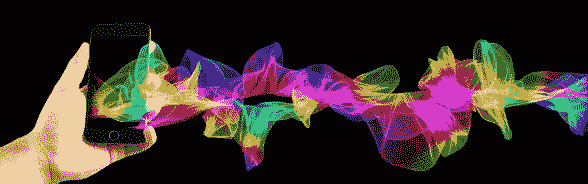

|  |  |  |
| --- | --- | --- |

# 致谢

图片由[Gerd Altmann](https://pixabay.com/users/geralt-9301/?utm_source=link-attribution&utm_medium=referral&utm_campaign=image&utm_content=1419275)提供，来自[Pixabay](https://pixabay.com/?utm_source=link-attribution&utm_medium=referral&utm_campaign=image&utm_content=1419275)

尽管我的名字出现在封面上，但这本书是大家的共同努力。我要感谢所有为让这本书变为现实而付出时间，有时甚至付出金钱的人。

## 内部圈子

Greg Marine 是我最早和最忠诚的支持者之一。他总是愿意分享经过深思熟虑的意见。他编辑并共同撰写了我的书《在工作中不要说那些话》，并且在写这本书的每一步都与我同在。没有他，我做不到这一切。在 Twitter 上关注 Greg 的@ByGregMarine，每天都会得到一些积极的智慧。

## 赞助者，创始人和大使

下面这些人不仅付出了时间，还贡献了他们辛苦赚来的钱，我感谢他们的信任和支持。

| Ron Jennings | Mark Goho |
| --- | --- |
