# ChatGPT 百万富翁的快速启动指南

> 原文：[A Quickstart Guide To Becoming A ChatGPT Millionaire](https://annas-archive.org/md5/c92c16816fc13bbb4c391cf17626af23)
> 
> 译者：[飞龙](https://github.com/wizardforcel)
> 
> 协议：[CC BY-NC-SA 4.0](https://creativecommons.org/licenses/by-nc-sa/4.0/)

#### 序言

你说 ChatGPT 百万富翁？是的！而这本 ChatGPT 书籍就是你解锁全球最强大的免费人工智能潜力的通行证。随着被动收入和在家工作机会的增加，网上赚钱从未如此简单，而且有了 ChatGPT，几乎是毫不费力的。你是不是也想轻松实现财务自由并在线赚钱？

在这本简短易读的 ChatGPT 书籍中，你将发现利用 ChatGPT 和其他前沿工具产生在线收入的成熟秘诀。无论你是想销售数字产品，投身联盟营销，提高社交媒体营销水平，还是开发赚钱的应用，这本 ChatGPT 书籍都会向你展示实用的战略和策略，让你建立一个蓬勃发展的在线业务。了解 ChatGPT 的无限能力，以及你如何利用它来产生被动收入和在家工作。了解在线收入机会，从电子邮件营销，引导生成，内容生产，SEO 服务，甚至建立自己的收入生成应用！

无论你是在寻找兼职来增加收入，还是梦想着实现财务自由，这本 ChatGPT 书籍都是你开始在线赚钱的入口。凭借最小的努力和最大的结果，你将很快实现轻松收入。阅读这本 ChatGPT 书籍，你将获得实现财务自由和发挥赚钱潜力所需的知识和工具。别再等待，开始你成为 ChatGPT 百万富翁的旅程！

那么，你还在等什么？从今天开始迈出通往财务未来的第一步，解锁 ChatGPT 的力量吧！

我很高兴与你分享所有这些信息！我一直在与朋友和家人测试这些想法，他们在接下来的页面中所读到的结果与你将要读到的类似。

#### 奖励：在线课程

此外，还可以查看这些关于如何使用 ChatGPT 的其他精彩课程！

ChatGPT 教育课程 - 这是一个出色的学习平台，旨在帮助您在各个领域成长和取得成功。当您注册时，还会获得更多附加价值！

当您加入任何这些出色的 ChatGPT 教育课程时，您还将获得独家奖励，如专家问答会话的访问权限、额外学习材料以及一个支持性的志同道合的学习者社区。这意味着您不仅会获得知识，还能有效应用它并与同行建立联系。

点击下面任何一张图片以了解更多信息：

注意：本书包含指向联盟产品和服务的链接。

#### 如何使用本书

本书分为三个部分：

第一部分 - 本部分侧重于理论，包括 ChatGPT 的工作原理以及它可以做什么。

第二部分 - 本部分侧重于实际应用，包括如何利用第一部分讨论的内容来赚钱，以及你可以赚取的潜在收入。

附录 - 你会找到一些额外的工具，帮助你增强与 ChatGPT 的体验。

我建议你按顺序阅读本书，但如果你只想跳到第二部分，直接深入实际的使用 ChatGPT 赚钱的方式也可以。阅读本书没有对错之分，但第一部分会为你提供很多背景知识，帮助你更有效地使用 ChatGPT。

除此之外，祝学习愉快，享受！

介绍

### 概述

我很懒。不是开玩笑，我宁愿环游世界，和家人朋友共度时光，享受美食和娱乐，而不愿意工作。如果你和我一样，那么请听好了…

在这本书中，我将向你展示一些经过验证的方法，通过主要使用 ChatGPT，我快速赚钱，而且付出的时间和精力很少。让我们开始吧！

### 什么是 ChatGPT？

ChatGPT 是一个疯狂的 AI 语言模型，任何人都可以免费使用。把它想象成一个可以与你交谈并理解你说话的机器人，但以一种超级聪明的方式。它是由 OpenAI 开发的，这是目前最大、最受尊敬的 AI 研究实验室之一。

基本上，这个 ChatGPT 就像是终极的聊天伙伴。你可以向它提问，获取信息，甚至与它进行全面的对话！最酷的是，它可以理解各种语言模式，包括俚语和幽默。所以，你可以像和你最好的朋友交谈一样给它发短信，它完全能理解你。

还有更多！ChatGPT 还可以做其他疯狂的事情，比如翻译语言，分析情绪，甚至总结长篇文章。就像拥有自己的个人 AI 助手，可以帮助你处理各种事情。

老实说，ChatGPT 的强大程度有点让人震惊。就好像未来已经来临一样。而且最棒的部分是，你可以用很多种方式来利用它赚钱。我是说，想想看，如果你能自动化任务并节省时间，那意味着你可以专注于做更多你喜欢的事情并赚更多钱。这本书将向你展示各种酷炫的方式，让你可以利用 ChatGPT 赚大钱，所以准备好提升你的游戏！

### 利用 ChatGPT 赚钱

好的，让我们谈谈 ChatGPT 的赚钱潜力。

无论您是个人还是企业，这款 AI 语言模型都可以帮助您赚取可观的现金。我将向您展示如何使用 ChatGPT 创建优质内容，自动化任务，甚至为企业开发 AI 聊天机器人。我甚至会提供一些商业创意，让您兴奋并立即开始！更多内容将在接下来的章节中介绍。

我们都知道，现在拥有一份兼职工作是正确的选择。您可以赚取额外的收入，提升您的技能，甚至如果您愿意，将其发展成全职工作。最好的部分是，您可以在家中（或任何您想要的地方）完成所有这些。

那么，您可以用 ChatGPT 创造哪些兼职工作呢？嗯，让我告诉您，可能性是无限的！您可以使用它来：

开设一家营销代理机构，提供直接邮件、品牌推广、社交媒体帖子、促销材料、SEO 服务等。

开设一家写作代理机构，提供定制文章、视频脚本、产品描述、网站内容、书籍大纲，甚至幽灵写作。

开设一家研究与数据分析代理机构，帮助企业发现新的市场机会，了解竞争对手等。

开设虚拟助理服务，帮助高管管理日程和他们必须完成的许多重复性任务。

开发 AI 驱动的应用程序，帮助企业接触和服务他们的目标受众，如健身和饮食应用程序、旅游指南应用程序、目录应用程序等。

这些只是一些例子！稍后，我将深入探讨其中的一些，为您提供简单易行的步骤指导，让您开始赚取丰厚的收入。

不再为您的业务想出主意而苦苦挣扎，也不再花费数小时进行研究。ChatGPT 甚至可以在一小部分时间内为您处理所有这些。这意味着您可以发布更多高质量内容，吸引更多客户（即：顾客、读者、观众、粉丝等），最终赚更多钱。

凭借其语言能力，您可以更有效地与客户沟通，制定更好的提案，甚至自动化部分工作。这意味着您可以接受更多客户，更快地完成项目，增加您的收入。

ChatGPT 可以彻底改变商业游戏规则。您可以将其用于客户服务、营销，甚至销售。例如，您可以使用 ChatGPT 为客户创建个性化消息，快速准确地回答他们的问题，甚至为您的业务生成潜在客户。这意味着您可以提供更好的客户体验，吸引更多潜在客户，最终增加您的收入。

这只是冰山一角。个人和企业可以利用 ChatGPT 赚钱的方式有很多。关键是要有创意，打破常规思维。

这本书将向您展示使用 ChatGPT 启动副业成功之路所需的工具和资源。您将学会如何在极短时间内创建高质量内容，如何自动化任务以节省时间，以及如何营销自己吸引客户。

相信我，一旦您开始在副业中使用 ChatGPT，您会想知道您以前是如何没有它的。这将改变您的财务状况和职业生涯。所以，让我们开始吧！

第一部分

ChatGPT 基础

#### 第一章：创建一个账户

第一步：访问 openai.com，点击页面顶部的“注册”按钮。

第二步：输入您的个人详细信息，如姓名、电子邮件地址，并为自己创建一个密码。

第三步：然后，您需要通过点击注册后发送给您的链接来验证您的电子邮件。

第四步：验证您的账户后，您现在可以使用提供的凭据登录 OpenAI，或者使用现有的 Google 账户或 GitHub 个人资料进行注册。

第五步：仔细阅读 OpenAI 的服务条款和隐私政策，确保您理解它们。

第六步：最后，点击“创建账户”按钮，您就完成了！现在您可以开始探索 OpenAI 的惊人功能。

就是这样！一旦您设置好您的账户，就可以开始创建内容了！以下是让您开始的基本步骤，但在接下来的章节中，我将提供一些示例，展示如何让 ChatGPT 生成更具体、更详细和更复杂的内容。

第一步：在提供的文本框中输入提示。例如，如果您想生成一篇关于机器人的博客文章，那么您的提示可以是“使用机器人有哪些好处？”。这将作为您生成内容的主题。

第二步：点击“生成”按钮，ChatGPT 将开始发挥其魔力。它利用人工智能和自然语言处理技术为您的提示提供潜在答案。然后，您可以选择您认为最适合您需求的答案。

第三步：一旦您选择了合适的答案，点击“保存”，然后您可以将其作为内容创建过程的一部分使用。

没开玩笑，使用 ChatGPT 就是这么简单。很容易，对吧？

#### 第二章：生成内容

为社交媒体或博客创作新鲜而引人入胜的内容可能会耗费时间和精力。但是通过 ChatGPT，您可以节省时间、金钱，并保持一致的质量。现在让我们深入了解 ChatGPT 是什么，以及为什么它是一个如此强大的工具，可以帮助您赚钱，以及更多其他方面。

如果您是 AI 和语言模型领域的新手，不用担心，我会帮助您。我将解释 ChatGPT 是什么，它是如何工作的，以及它与其他语言模型的不同之处。

因此，准备好提升您的水平，并开始通过 ChatGPT 赚取一些严肃的现金，让我们从使用 ChatGPT 创建内容的好处开始。

## 使用 ChatGPT 进行内容创作的好处

使用 ChatGPT 的主要好处之一是其节省时间的能力。客户往往很忙，经常没有时间从头开始创建内容。通过使用 ChatGPT，你可以轻松为这些客户提供高质量内容，而不会牺牲宝贵的时间。这就是可扩展性发挥作用的地方，使你能够处理比以往更多的客户。

此外，ChatGPT 还可以在长远来看节省金钱。在创办新业务时，大多数人没有很多资金投入自己的内容创作。ChatGPT 通过生成符合你品牌语调和风格的内容，提供了一种经济实惠的解决方案，而无需支付昂贵的内容创作服务费用。

使用 ChatGPT 的另一个好处是生成内容的一贯质量。当你自己创作内容时，很容易在语调、风格和质量上出现不一致。但是通过 ChatGPT，你可以保持一致的语调和风格，确保你自己和客户的品牌在各自的受众中更具辨识度和信任度。

此外，ChatGPT 还可以帮助你创建更多样化的内容。你始终希望保持内容新鲜和引人入胜。通过 ChatGPT，你可以生成不同类型的内容，如博客文章、社交媒体帖子，甚至视频剧本。这使得你的内容多样化且有趣，这对于吸引受众至关重要。

使用 ChatGPT 的另一个巨大好处是个性化你的内容。你知道与受众在个人层面建立联系有多重要。ChatGPT 允许你输入有关目标受众的信息，如他们的年龄、兴趣和位置。有了这些信息，ChatGPT 可以生成直接针对你受众兴趣的内容，使你的内容更具相关性和吸引力。

最后，ChatGPT 还可以帮助你创建优化 SEO 的内容。为了确保成功，目标是让你的内容在谷歌搜索结果的第一页排名。ChatGPT 可以帮助你生成针对 SEO 优化的内容，包括相关关键词、短语，甚至人们可能搜索的问题。

总之，使用 ChatGPT 进行内容创作有许多好处，可以让你作为企业家的生活更轻松。它可以节省时间、金钱，保持一致的质量，创建多样化的内容，个性化你的内容，并为 SEO 进行优化。没有什么比 ChatGPT 更能使你的内容创作过程更高效和有效了。

## 什么内容及如何创建它

内容类型

大纲 - ChatGPT 可以为文章等长篇内容创建大纲，甚至是书籍。

长篇内容 - 一旦你创建了大纲，你可以让 ChatGPT 写那些文章，甚至是你一直梦想出版的书籍。

网站内容 - 每个网站都需要内容，我不仅指文章等。有着落地页、关于部分、团队简介、隐私条款等。

产品描述 - 通过输入产品名称和特点，ChatGPT 将生成一个符合你品牌声音的描述。

社交媒体 - 通过输入提示或主题，ChatGPT 可以创建社交媒体内容创意列表、发布日历，甚至生成帖子，包括视频脚本（如果需要的话）。

电子邮件 - ChatGPT 是生成营销和跟进电子邮件的好工具。

提案和合同 - 通过提供关于客户需求的一些基本信息以及你提供的服务，ChatGPT 可以生成一个有销售力的提案。一旦你获得客户，它还可以生成具有法律约束力语言的合同。是的，它就是这么厉害！

脚本 - ChatGPT 非常适合为 YouTube、网络研讨会和广告创建视频脚本。你甚至可以让 ChatGPT 帮助你概述和撰写完整的在线课程！

内容创建基础知识

如果你需要在特定主题上创建文章或博客文章，你可以向 ChatGPT 输入一些基本信息，比如你想要涵盖的主要观点或你想传达的语气。然后，ChatGPT 可以利用其自然语言处理能力生成一篇写得很好、引人入胜的内容，深入探讨该主题。

同样，如果你需要创建社交媒体帖子，ChatGPT 可以生成针对不同平台（如 Twitter、Instagram 或 Facebook）优化的帖子。它可以生成标签、标记相关账户，并为每个平台使用适当的语言和语气。

ChatGPT 内容生成能力中最好的一点是它可以大规模创建内容。这意味着你可以使用它快速高效地生成大量文章或社交媒体帖子，而不会牺牲质量。这对需要定期创建大量内容的企业或个人非常有用。

注意：在开始使用 ChatGPT 进行内容创作之前，有一些事情需要记住。首先，你应该始终审查和编辑 ChatGPT 生成的内容。虽然 ChatGPT 可以生成高质量的文本，但它并不完美。你应该始终审查内容，确保准确并符合品牌形象。

其次，你还应该了解 ChatGPT 的局限性。虽然它是一个强大的工具，但它不能取代人类的创造力和专业知识。你应该始终努力为 ChatGPT 生成的内容添加你自己独特的观点和见解。

总的来说，ChatGPT 是一个用于内容创作的绝佳工具。它可以帮助你快速高效地生成高质量内容，节省大量时间和精力。只需记得要负责任地使用它，并始终审查它生成的内容。

所以，让我们从 ChatGPT 的起始页面开始：

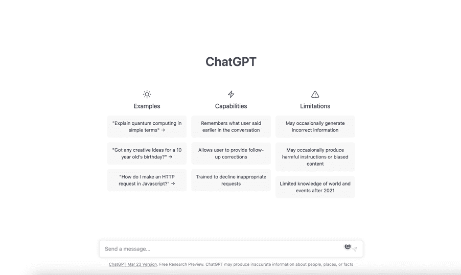

ChatGPT 的起始页面提供了一些示例供你尝试，以及其功能和限制的简要选择。如果你往下看，你会注意到一个输入框。这是你开始与 ChatGPT“对话”的地方。

创意生成

现在，如果你不知道写什么怎么办？如果你正在生成大量内容，有时可能很难想出新颖有趣的想法。更不用说我们都会遇到那些可怕的“脑屁”时刻，当时你想出的东西一点也不好。这就是 ChatGPT 可以成为如此有用工具的地方。ChatGPT 在几次按键中就能帮助消除写作障碍。

例如，使用 ChatGPT 进行创意生成的一种方式是输入你想探索的主题或主题。例如，如果你是一名博主，不知道写什么，你可以输入一个一般主题，比如“旅行”或“食物”。ChatGPT 可以生成与该主题相关的想法列表，供你作为下一篇博客文章的灵感。

这可能看起来是这样的：

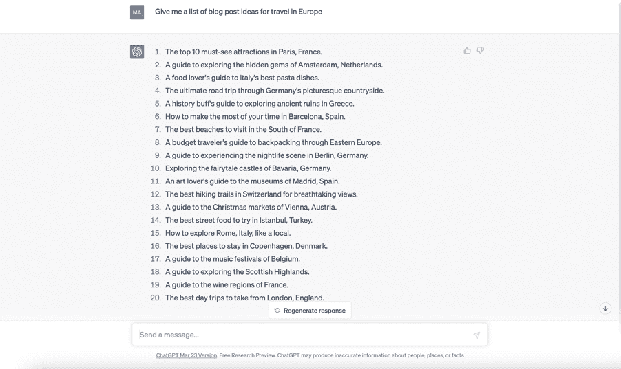

现在你有了二十个可以写文章的想法（当然要以 ChatGPT 为你的副驾驶）！

使用 ChatGPT 的另一种方式是输入你想回答的特定问题。例如，如果你是一名学生，需要帮助完成作业，你可以输入与作业相关的问题。ChatGPT 可以生成一系列潜在答案或想法，供你完成作业使用。

这里我问了 ChatGPT 关于罗马帝国最大成就的问题：

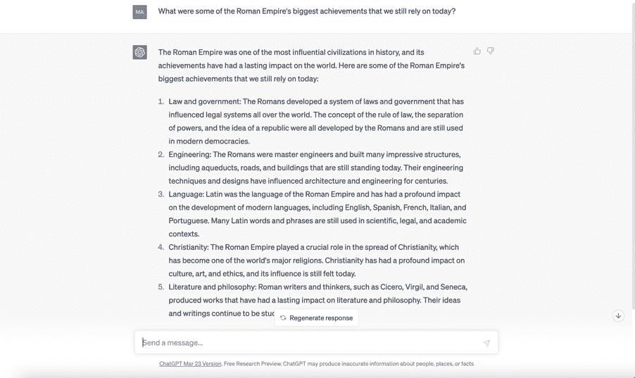

有了这些结果，学生可以选择关注列表中的所有或任何一项来撰写他们的文章或项目。简单吧？

ChatGPT 还有很多其他方式可以帮助你想出内容的创意。

例如，ChatGPT 还可以通过分析你现有的内容来帮助你生成想法。举例来说，如果你有一个包含大量内容的网站或博客，ChatGPT 可以分析该内容并生成与你已经发布的内容相关的新想法。

使用 ChatGPT 进行创意生成的另一种方式是利用其定制功能。例如，你可以输入你想在生成的想法中包含的特定关键词或短语。你还可以调整生成的想法的语气，使其更加严肃或轻松，取决于你想传达的信息。

使用 ChatGPT 进行创意生成是克服写作障碍、提出新颖激动人心想法的绝佳方式。您可以通过输入一个主题或主题、一个具体问题、分析您现有的内容，并利用其定制功能来实现这一目标。因此，如果您在构思想法方面遇到困难，请试一试！

#### 第三章：自动化任务

我可以告诉你，ChatGPT 是一个非常了不起的工具，可以自动化各种任务。我认为这个语言模型最令我印象深刻的一点是它能够理解和处理自然语言，这使得它能够执行许多通常需要人类干预的任务。

例如，ChatGPT 可以通过回答常见问题并通过聊天机器人为客户提供支持来自动化客户服务交互。它还可以通过处理大量数据并根据该数据提供见解和建议来帮助数据分析。

## 重复性任务

ChatGPT 在自动化行政任务方面非常有用，比如安排约会、发送提醒和组织电子邮件。它还可以通过跟踪任务、截止日期和进度更新来协助项目管理。

有时候你可能需要做一些重复乏味的任务，比如安排约会、回复电子邮件，甚至只是在网上查找信息？嗯，ChatGPT 可以帮助你自动化所有这些！

例如，你可以让 ChatGPT 在方便的时间安排会议，它会负责找到适合所有人的时间。或者如果你需要撰写报告或提案，你可以让 ChatGPT 帮助你研究主题并总结关键要点。

ChatGPT 还可以帮助你自动化社交媒体，根据你的喜好和受众生成帖子和标题。如果你需要转录音频或视频录音，你只需向 ChatGPT 提出请求！

## 数据分析

因此，想象一下你有一个包含数千行数据的大型电子表格，你需要在其中找到趋势和模式，以做出重要的业务决策。与其花费数小时手动筛选数据，不如使用 ChatGPT 来自动化这个过程。

首先，您可以将数据输入 ChatGPT，它将利用其自然语言处理能力来理解和解释数据。然后，ChatGPT 可以执行数据分析，包括统计分析、预测建模和聚类等。它可以识别数据中可能不会立即被人类分析师注意到的相关性和趋势。

一旦 ChatGPT 分析了数据，它可以根据其发现提供见解和建议。例如，它可能会识别一个特别畅销的产品，并建议您增加围绕该产品的营销工作。或者，它可能会识别客户行为中的趋势，表明您需要调整定价策略。

除了这些见解和建议，ChatGPT 还可以生成可视化和报告，帮助您更好地理解数据。这可能包括图表、图形和表格等内容，这些内容在向利益相关者展示数据和做出数据驱动决策方面非常有用。

以下是 ChatGPT 在现实世界中进行数据分析的众多方式之一：

主要零售公司已经使用 ChatGPT 来分析来自各种来源的客户反馈。大多数零售公司收集来自社交媒体、电子邮件和其他渠道的数千条评论、留言和消息，他们需要研究这些内容以更好地了解情感和反馈。

为了做到这一点，许多公司已经使用 ChatGPT 来处理和分析客户反馈数据。ChatGPT 能够阅读和理解客户反馈的自然语言，然后执行情感分析，以确定每条评论的整体情感（积极、消极或中性）。

除了情感分析外，ChatGPT 还可以执行主题建模，以识别客户反馈中正在讨论的关键主题和主题。这使公司能够了解客户最关注的业务方面，以及需要改进的地方。

使用 ChatGPT 提供的见解和建议，零售公司能够针对其产品、服务和客户支持进行有针对性的改进。他们还实施了更有效的社交媒体策略，以解决客户关注的问题并提供更好的客户服务。

## 内容处理

此外，ChatGPT 还可以帮助进行语言翻译、文本摘要，甚至创意写作。

语言翻译

ChatGPT 的自然语言处理能力使其成为一款出色的语言翻译工具。它可以阅读和理解一种语言的文本，然后将其翻译成另一种语言，同时保持文本的原始含义和语气。

例如，如果你有一份需要翻译成英文的法语文档，你可以将文本输入到 ChatGPT 中，并选择目标语言为英文。ChatGPT 将利用其语言翻译能力为你提供准确且自然的翻译。

除了文档翻译外，ChatGPT 还可以帮助进行实时语言翻译。这在需要与说不同语言的人交流的情况下特别有用。例如，如果你在外国旅行需要问路，你可以使用 ChatGPT 将你的问题翻译成当地语言，然后将回答翻译回你的语言。

ChatGPT 还可以帮助进行网站翻译。如果你有一个需要翻译成多种语言的网站，ChatGPT 可以自动化这一过程，节省时间和资源。它可以翻译网站上的所有文本，包括标题、内容，同时保持原始格式和设计。

文本摘要

ChatGPT 是一款强大的工具，可以帮助你快速高效地总结大量文本。它可以阅读长篇文章、报告或文档，然后提取关键要点和主要思想，以简洁易懂的摘要形式呈现。

例如，如果你有一篇长篇新闻文章没有时间完整阅读，你可以将文章输入到 ChatGPT 中，并要求它总结要点。ChatGPT 将生成一个突出最重要信息的摘要，如文章的谁、什么、何时、何地和为什么。

ChatGPT 还可用于学术用途，例如总结研究论文或科学文章。这对需要快速了解特定主题的学生或研究人员非常有用。

除了总结书面文本外，ChatGPT 还可以总结口头文本。例如，如果你有一段会议或讲座的录音，你可以将音频文件输入到 ChatGPT 中，它将生成讨论的主要要点的摘要。

#### 第四章：编写代码

ChatGPT 如此强大，它可以帮助你编写一些厉害的代码。我的意思是，我并不是什么技术大神，但有了 ChatGPT 的帮助，即使是我也能构建一些非常棒的东西！

注意：尽管 ChatGPT 可以生成出色的代码，但如果你想充分利用这一功能，一些基本的编程技能是有帮助的。

## 网站

我将深入探讨 ChatGPT 如何帮助你构建应用程序。与此同时，让我们看看你如何请求 ChatGPT 为你构建一个主页并自定义它。

这是我如何开始与 ChatGPT 进行对话的：

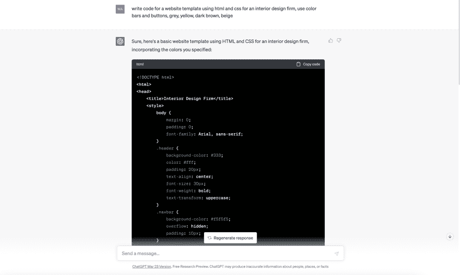

我将这段代码复制到了 Visual Studio（代码编辑软件）中，这是测试页面的样子：

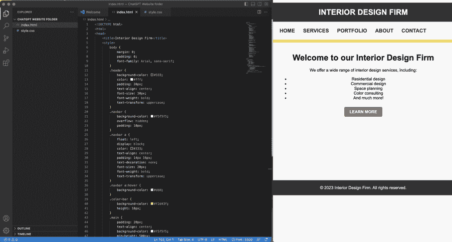

这里你可以看到左边的代码，右边是实时页面展示。很酷，对吧？目前布局相当简单，但你可以通过请求 ChatGPT 为你编写代码片段来改变布局、颜色、功能等。所以基本上，只要稍加耐心、独创性和创造力，你可以做任何事情！

## 应用程序

如上所述，我将详细介绍如何使用 ChatGPT 帮助您为自己和客户构建出色的应用程序。现在，这里是关于这个工作原理的一些一般信息。

记住，ChatGPT 可以帮助生成自然语言文本，比如聊天机器人的回复或通知，这对于任何需要与用户沟通的应用程序至关重要。它还可以帮助进行情感分析，这对于了解用户对应用程序的感受以及需要改进的方面非常有用。

但是 ChatGPT 真正闪耀的地方在于其分析大量数据并从中学习模式的能力。这可以帮助您构建可以进行预测的应用程序，比如天气或交通预测，或者根据用户行为推荐产品。此外，ChatGPT 还可以帮助进行数据可视化，这对于以易于理解的方式呈现信息非常重要。

别忘了 ChatGPT 的机器学习能力。借助它的帮助，您可以训练应用程序识别图像，分类数据，甚至翻译语言。这为您可以创建的应用程序类型开辟了全新的可能性。

### 第二部分

## 商业创意

在本节中，我将讨论 ChatGPT 如何帮助您为客户提供高质量的结果。市场上有许多企业需要帮助进行品牌塑造、市场研究、潜在客户生成，当然还有为其网站、社交媒体、博客等创建和更新内容这一耗时任务。所有这些项目可能需要大量的时间和精力（如果您不了解 ChatGPT 的秘诀）。大多数忙碌的企业家没有时间（有时甚至没有技能）来完成工作，因此他们会外包。

这是您为他们提供服务的机会！秘诀在于使用 ChatGPT，仅需几秒钟即可进行竞争研究，探索人口统计信息，提出可行的潜在客户，然后撰写文章、网站内容、电子邮件、产品描述等等！

不仅可以为客户提供价值，而且可以快速轻松地交付，因此您将能够处理比以往更多的客户，从而同时增加自己的收入！

在我们讨论如何帮助您启动自己的有利可图企业之前，请记住，这些任何一个小节都可以成为一个独立的业务。

注意：潜在客户生成和电子邮件营销部分首先出现，因为即使您不打算提供这些服务，您仍然需要它们来启动自己的业务。让我们开始吧！

#### 第一章：**潜在客户生成**

如果你想要开始一项业务，你可能已经熟悉潜在客户生成的概念。这是识别和培养潜在客户购买你的产品或服务的过程。

为客户生成潜在客户不仅仅是一种商业模式，你也需要熟悉这个过程以便为自己的业务做准备。有趣的是，随着你在为自己生成盈利潜在客户的能力变得更强，这也可以成为为客户提供附加价值的方式。到了这一步，你可以将其添加到你为客户提供的服务列表中，或者仅保留给自己的业务使用。

无论哪种方式，ChatGPT 都可以通过根据你输入的标准生成有针对性的潜在客户来帮助你。使用 ChatGPT 进行潜在客户生成可以节省你时间和精力，快速识别潜在客户并为你提供有效的推广策略。通过 ChatGPT 收集的信息，你可以专注于与潜在客户建立关系，并将他们转化为忠实客户。

## 收入潜力

根据 Leadshook.com 和其他网站的数据，以下是一些行业的平均每个线索价格：

贷款线索$20 – $70

电子邮件线索$100 – $600（每 1000 个电子邮件地址）

汽车保险线索$35 – $75

离婚线索$25 – $500

太阳能线索$20 – $200

抵押贷款线索$25 – $50

家居装修$20 – $60

酒后驾驶线索$50 – $500

理想情况下，你会希望为客户生成数百甚至数千个线索，这样你就可以想象到可能带来的潜在收入！

但请记住，线索生成不仅是客户愿意支付的东西，对你自己的业务也很重要。

## 如何

让我们谈谈 ChatGPT 如何帮助潜在客户生成。你可能已经猜到，许多企业（包括初创企业和现有企业）经常需要帮助解决以下问题：

商业和产品名称

标志

网站内容（关于页面，产品描述等）

广告脚本

测试和启动活动

要开始，让我们看看社交媒体平台在多少房地产经纪人使用它们方面的排名。我让 ChatGPT 考虑这一点来排名社交媒体平台，以下是结果：

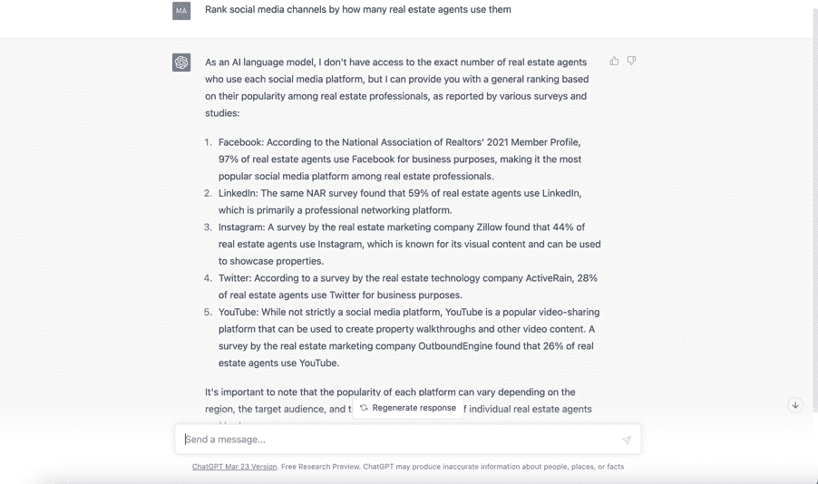

看起来 Facebook 是我们应该集中精力的平台，如果我们想要接触到房地产经纪人。

接下来，让我们请 ChatGPT 为我们编写一则广告脚本，以吸引房地产经纪人来到我们的潜在客户生成业务：

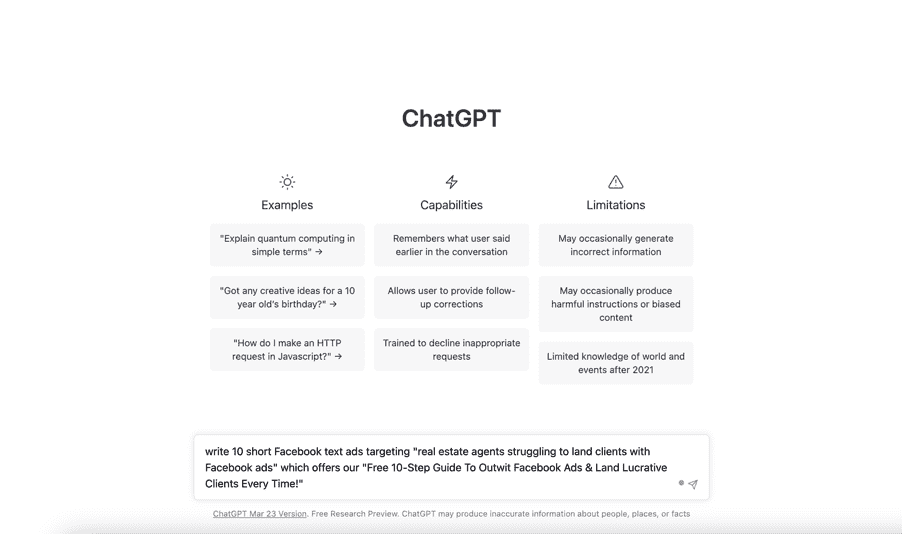

这是 ChatGPT 的回应：

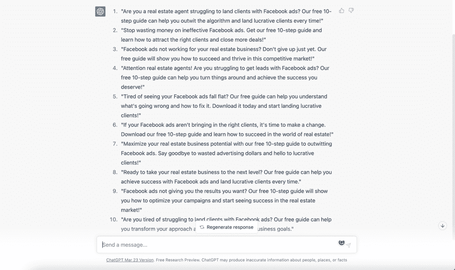

太棒了！现在我们有了一些脚本可以使用，我们可以开始进行 A/B 测试和启动广告活动来吸引我们的受众。在这种情况下，我们希望从这些广告中获得的潜在客户前往一个注册页面，在那里我们可以收集他们的电子邮件地址，并发送给他们我们承诺的免费指南的链接。顺便说一句，有很多工具可以帮助实现这一点（请参见附录）。

你可能还想更加复杂一点，推销一些网络研讨会或会员资格。当然，这需要建立一个销售渠道，这实际上是另一本书的话题，但现在我在本书的附录部分也包含了一些工具。

一旦你有了潜在客户并成功签约了一两个客户，你就能帮助他们解决各种品牌挑战。以下是一些示例：

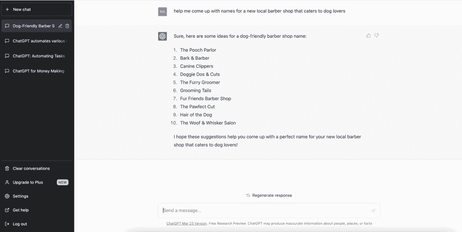

ChatGPT 还可以帮助构思一个新业务的标志：

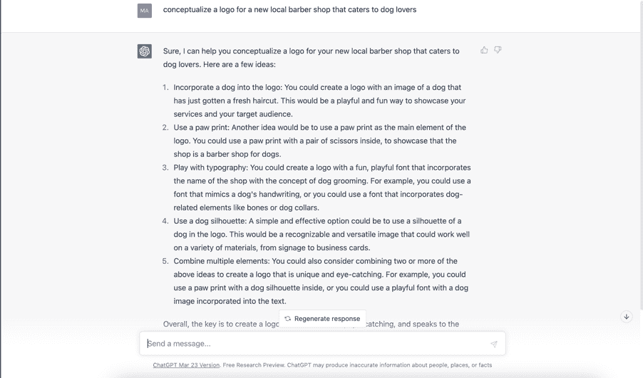

ChatGPT 可以为您的客户想出产品名称：

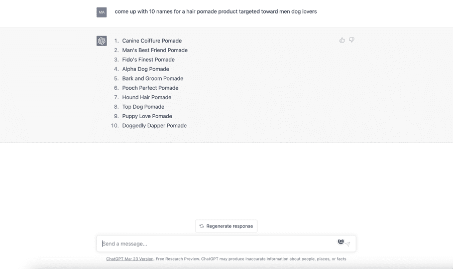

#### 第二章：电子邮件营销

电子邮件营销仍然是与新客户联系和与现有客户保持联系的最强大方式之一。所有企业都依赖电子邮件，这意味着如果这是您想要从事的工作类型，那么市场上有很多业务。现在有了 ChatGPT，这项工作变得更加容易，因此这也是赚取轻松钱财的另一个绝佳模式。让我们开始吧。

## 收入潜力

使用下面概述的模型（您也可以观看一个类似方法的视频），每个客户的收入为每月$800。 每个客户每周需要 2 封电子邮件，您需要大约 10 分钟来完成。 将这个业务扩展到 20 个客户将带来每月$16,000 的收入，并且每周运营大约需要 3 到 4 个小时。

## 如何

第 1 步 - 找到您想要定位的本地市场细分。让 ChatGPT 帮助您使用其出色的研究能力。ChatGPT 将列出一些类别，例如美发沙龙、咖啡店、餐厅、宠物店、健身房、花店、律师事务所、舞蹈学校、会计师事务所、室内设计公司等。一旦您决定了一个或多个类别，就可以继续进行第 2 步。

第 2 步 - 请 ChatGPT“撰写一封简短、有力、友好的电子邮件，推销您的电子邮件服务”，针对您特定的市场细分。让 ChatGPT 撰写 3 个版本的这封电子邮件，以便进行 A/B 测试。

第 3 步 - 使用 Google 在您所在地区找到一家或多家本地企业，属于以下一种或多种类别。

第 4 步 - 将 ChatGPT 为您撰写的邮件发送给这 500 家企业。起初，您希望轮流使用 ChatGPT 为您创建的三个原始模板，但一旦开始看到结果，就要加倍使用给您带来最佳结果的模板。确保每次发送邮件时都自定义邮件模板。根据具体行业、具体企业定制，甚至可能包括您为他们撰写的邮件样本。这需要时间，但一定会值得努力！

第 5 步 - 请 ChatGPT 帮助您列出一系列问题，以向潜在客户询问。例如，您可以说“我向当地花店提供电子邮件营销服务。帮助我列出一系列问题，以向新客户了解他们的业务。”

第 6 步 - 为新客户创建一个入职调查表。使用 Google 表格（完全免费），将所有这些问题插入其中，以创建一个新的入职表格供新客户填写。现在，您将把所有回复您销售邮件的潜在客户发送到这个表格，以便“评估他们的需求并为他们提供报价”。通过让潜在客户填写这种类型的表格，让他们参与到这个过程中，这样他们更有可能雇佣您。

第 7 步 - 向所有填写表格的人发送报价。请 ChatGPT 撰写一封推销您服务的电子邮件。例如，您可以说“撰写一封电子邮件，与名为“Florista”的当地花店分享电子邮件营销服务的报价。报价为每封$100，每月 8 封，总计每月$800。”

第 8 步 - 与客户签订合同。请 ChatGPT“为电子邮件营销服务撰写一份简单的合同，我可以与新客户使用。合同条款包括每月 8 封邮件，每月$800。”

第 9 步 - 每周跟进您的新客户，询问他们想要推广什么。您的一些客户会需要想法，当然 ChatGPT 也可以帮助您。请 ChatGPT 帮助您撰写这些邮件。

第 10 步 - 每月 1 日向您的客户开具发票，最迟于 5 日支付。如果需要，可以让 ChatGPT 帮助您撰写发票。

#### 第三章：研究

在这一部分，我想谈谈如何利用 ChatGPT 进行研究。为什么要研究？因为你和你的客户需要可靠的信息来探索市场机会，生成潜在客户，并最终创造出能够促成销售的绝佳内容。让我们开始吧。

## 收入潜力

以下是 MarketResearch.com 列出的您的新市场研究机构可以收取的平均费用：

顶级报告：

平均费用：$100 - $1,000

通常包含在这个价格范围内的报告倾向于涵盖关于一个行业的非常基本信息。它们将回答类似于这个行业有多大以及谁是主要参与者的问题，并提供一些关于为什么这个行业今天是什么样的基本见解。

全市场报告：

平均费用：$1,500 - $8,000（最常见为$3,500 - $4,000）

报告通常被那些需要全面了解一个行业的人购买。它们包括对市场及其子类别的全面解释，以及涵盖市场当前状态和未来发展预测的指标。这些报告还会涵盖当前的趋势和技术，并经常解释为什么市场在未来几年会以某种方式发展。

产品详细市场报告：

平均费用：$15,000 - $35,000

报告不仅涵盖市场及其子类别作为整体的表现，还涵盖特定产品/服务在特定地区或国家内的具体市场价值和趋势。例如，如果你是一家制药厂商，想了解针对某一特定疾病的不同药物在每个国家内的销售情况，那么产品详细市场报告是最佳选择。

## 如何操作

在这种情况下，你将向客户销售的产品是报告，其中将包括分析（对收集到的信息的专业解释），可能还包括市场建议。这些报告应该格式良好，并及时交付。你可能希望在客户会议上呈现调查结果，或者只是想单独发送报告，这取决于你。你可以在网上找到很好的教程，以帮助你制作精美的营销报告。

新客户机会

假设你有一个环保化妆品客户，希望将业务扩展到销售环保服装。你需要了解潜在客户对这个想法的看法，以及在涉及环保服装时的关注点和偏好。

使用 ChatGPT，你可以输入问题，比如“客户在涉及环保服装时的偏好是什么？”或者“客户对环保服装有哪些最常见的关注点？”ChatGPT 可以根据来自调查、在线论坛和社交媒体的数据生成潜在答案列表。

使用 ChatGPT 可以节省时间和金钱，因为它可以快速生成需要大量研究和分析的见解。通过从 ChatGPT 收集的信息，你可以就产品线和营销策略做出明智的决策。例如，你可以根据目标受众的偏好和关注点调整产品供应和信息传达方式。

竞争市场研究

现在，如果你想在竞争激烈的行业进行市场研究，ChatGPT 可以成为一个非常有用的工具，帮助你收集和分析数据，从而在竞争中占据优势。

首先，ChatGPT 可以帮助你确定竞争对手。通过分析你的行业和目标市场，它可以为你列出与你竞争的其他企业。这非常有帮助，因为它可以让你更好地了解你所面对的对手是谁以及面临的挑战是什么。

一旦你确定了竞争对手，ChatGPT 可以帮助你收集关于他们的信息。这可能包括他们的定价策略、营销活动、产品特点和客户服务实践。通过分析这些信息，你可以更好地了解你的竞争对手在哪些方面做得好以及哪些方面存在不足。

ChatGPT 还可以帮助你收集关于目标市场的信息。通过分析社交媒体趋势、搜索数据和客户评论，它可以让你更好地了解客户在寻找什么，以及他们对你的竞争对手有什么看法。这是非常宝贵的信息，可以帮助你调整自己的营销策略和产品供应，以更好地满足客户的需求。

目标研究

你可以使用 ChatGPT 生成客户画像。客户画像是你目标受众的虚构代表，包括年龄、职业、收入、兴趣等细节。通过输入问题，比如“购买环保服装的客户的共同特征是什么？”，ChatGPT 可以基于来自各种来源的数据生成客户画像。

ChatGPT 还可以帮助你收集关于你（和你的客户）现有客户的数据。通过分析诸如人口统计、购买历史和客户反馈等信息，它可以帮助你识别当前客户群体中的共同特征和行为。这可以帮助你创建准确代表你目标受众的客户画像。

一旦你有了客户画像，ChatGPT 也可以帮助你完善定位策略。通过分析搜索数据和社交媒体趋势，它可以让你更好地了解你的目标受众在网上花费时间的地方以及他们感兴趣的内容。这可以帮助你创建更有针对性的广告和营销活动，直接满足你受众的需求和兴趣。

ChatGPT 还可以帮助你了解目标受众行为的趋势和变化。通过随时间分析搜索和社交媒体数据，它可以帮助你识别受众兴趣和偏好的变化。这可以帮助你相应调整营销策略，保持相关性并吸引你的目标受众。

总的来说，ChatGPT 可以成为一个非常有帮助的工具，用于创建客户画像并完善你的定位策略。通过分析数据并提供见解，它可以帮助你保持领先地位，并以更有意义的方式与目标受众建立联系。因此，如果你希望改善定位并创建更有效的客户画像，请尝试一下！

事实核查

现在让我们看看 ChatGPT 如何帮助进行事实核查。你和你的客户都希望确保关于产品和服务的信息和声明是真实的。随着在线信息的丰富，也意味着存在许多误导性的信息，因此确保你发布的信息准确可靠非常重要。你和你的客户的声誉都受到考验。

ChatGPT 可以通过快速验证事实并提供可靠来源来协助这一过程。例如，如果你看到一篇文章声称某种产品与某种健康状况有关联，你可以将这一说法输入 ChatGPT 并要求提供支持的来源。ChatGPT 可以提供一系列可靠来源，如科学研究或权威新闻来源，来验证或反驳这一说法。

此外，ChatGPT 还可以帮助您在发布内容之前对其进行事实核查。通过输入问题，如“我的文章中是否存在任何事实错误？”或“我可以使用哪些来源来支持这个说法？”，ChatGPT 可以为您提供可靠的来源，以加强您的论点并确保内容的准确性。

使用 ChatGPT 进行事实核查可以节省时间，防止错误信息的传播。通过验证信息的准确性，您可以确保自己做出明智的决定，并与观众分享可靠的信息。

#### 第四章：内容生产

所有这些你可以用 ChatGPT 做的事情来帮助你启动和运营一个成功的营销业务本身就很强大，但 ChatGPT 真正的力量在于它能为你生成实际的内容。

现在，正如你现在已经知道的那样，它的工作方式是你可以输入一个提示或主题，ChatGPT 将为你生成高质量的文本。这是您的客户重视并愿意付钱的内容，包括：

产品描述 - 通过输入产品名称和特点，ChatGPT 将生成一个符合您品牌声音的描述。

社交媒体 - 通过输入提示或主题，ChatGPT 可以创建社交媒体内容创意列表，发布日历，甚至生成帖子，包括视频脚本（如果需要）。

编辑 - ChatGPT 可以根据您品牌的语调和风格建议对内容进行编辑和改进。这可以帮助您创建一致且符合品牌形象的内容。

大纲 - ChatGPT 可以为长篇内容（如文章，甚至书籍）创建大纲。

## 收入潜力

根据 HubSpot 的调查数据，39% 的营销人员表示他们将 31-50% 的营销预算用于内容营销。对于较大的公司，每月的内容营销成本可能高达 $80,000，在高端为 $200,000-$300,000。

以下数据来自 WebFX.com：

博客文章（2 千字）- $100 到 $2,000

网站内容 - 每月 $2,000 到 $10,000

社交媒体帖子 - 每月 $1000 到 $5000*

内容更新 - 每月 $2000 到 $10,000

* 取决于渠道数量、帖子频率、所需的监控/报告以及广告支出。

## 如何操作

利用 ChatGPT 创建符合品牌声音和风格的内容的一种方法是提供一些先前内容的示例。例如，如果您已经创建了与受众共鸣良好的内容，可以向 ChatGPT 提供其中一些示例。ChatGPT 可以分析您现有内容的风格和语调，并用它来生成风格和语调相似的新内容。

使用 ChatGPT 的另一种方式是输入关于品牌个性和价值观的信息。例如，如果您的品牌主打冒险和刺激，您可以输入与这些价值观相关的关键词和短语。ChatGPT 可以利用这些信息生成反映品牌个性和价值观的内容。

另外，ChatGPT 还可以通过分析您的社交媒体账户，帮助您创建符合品牌声音和风格的内容。如果您已经拥有一大批粉丝的社交媒体账户，ChatGPT 可以分析您先前发布的帖子的语调和风格，并用它来生成符合品牌声音和风格的新内容。

最后，为了使内容符合品牌声音和风格，您可以使用 ChatGPT 的定制功能。例如，您可以输入希望包含在内容中的特定词语或短语。您还可以调整生成内容的语调，使其更加随意、专业或具有说服力，具体取决于您想传达的信息。

利用 ChatGPT 创建符合品牌声音和风格的内容是使品牌更具辨识度和信任度的好方法。通过提供 ChatGPT 先前内容的示例，输入关于品牌个性和价值观的信息，分析品牌的社交媒体账户，并使用 ChatGPT 的定制功能，成功就在眼前。

#### 第五章：SEO

搜索引擎优化（SEO）是优化网站或在线内容以提高其在搜索引擎结果页面（SERP）中排名的过程。 ChatGPT 在这一过程中可以通过自动化几项关键的 SEO 任务来提供极大帮助。 SEO 服务市场竞争激烈，但仍然可以找到许多希望提高排名和收入潜力的客户。

## 收入潜力

根据 ahrefs.com 的数据，一些 SEO 服务的基本数字为：

每小时$75 至$150*

每月保留$500 至$2,000

每个项目$1,500 至$2,500

* 这假设需要与客户在现场一起完成工作。

## 如何

以下是您今天可以开始提供的一些 SEO 服务：

关键词研究

ChatGPT 在关键词研究方面表现出色。它可以生成一份相关关键词和短语的列表，您可以在内容中使用以提高搜索引擎排名。它还可以通过分析您的内容并提供改进建议来帮助进行页面优化，例如元描述、标题标签和内部链接。

反向链接

ChatGPT 还可以通过分析您的反向链接配置文件并提供建议来帮助进行页面外优化，以建立高质量的反向链接到您的网站。它甚至可以通过生成新内容的想法和优化现有内容以适应搜索引擎来帮助内容创作。

页面优化

ChatGPT 帮助 SEO 的最强大方式之一是通过其自然语言处理能力。通过理解语言和上下文的微妙之处，ChatGPT 可以帮助您创建不仅包含相关关键词，而且为读者提供价值的内容。这可以帮助提高参与度并减少跳出率，这是搜索引擎在排名内容时考虑的重要因素。页面优化可以应用于所有形式的内容，包括网站、产品描述、帖子、文章、视频脚本和摘要等。

#### 第六章：应用程序

是的，这是真的！ChatGPT 完全可以帮助您构建应用程序。但需要注意的是，这项任务需要一些技巧。也就是说，您需要深入了解 ChatGPT，以便让它生成代码来满足您为应用程序设定的功能要求。

换句话说，这可能需要一些时间，特别是如果您一开始没有任何编码技能。但不要让这阻止您！通过在 Google 上快速搜索，您会发现有许多关于这个主题的优秀免费视频教程，以满足您日益复杂的需求。因此，当您准备好并在这里掌握了一些基础知识后，将有大量的指导和灵感帮助您提高技能。

那么，如何通过构建应用程序赚钱呢？嗯，您可以为客户定制应用程序，然后向他们收费。或者，您可以创建仅为您自己带来广告收入的应用程序。

## 收入潜力

为他人构建应用程序

Businessofapps.com 提供以下应用程序开发基准：

简单应用程序开发价格标签 - $16,000 - $32,000

中等复杂度应用程序开发价格标签 - $32,000 - $48,000

复杂应用程序开发价格标签 - $72,000+

构建个人应用程序

根据 DomandTom.com 的说法，应用程序平均每天可以从广告中获得 10 美元至 200 美元不等的收入。此外，根据 Creative.onl 的说法，前 800 款应用程序每天带来 3500 美元的收入。

## 如何

在这一部分，我们将构建一个壁纸应用程序，这是开发最佳类型的收入生成应用程序之一。

我将从给 ChatGPT 一个非常简单直接的提示开始，就像这样：

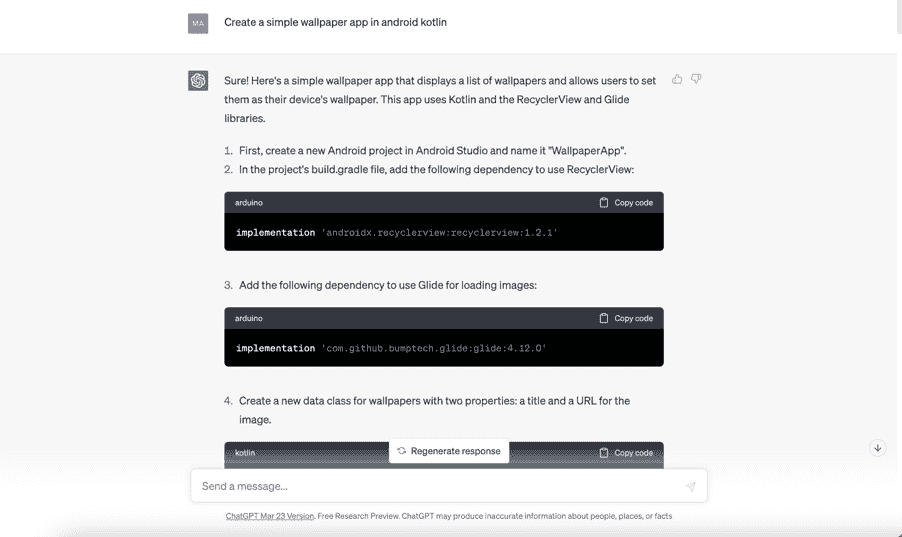

它将继续生成步骤和相应的代码，并且你可以通过复制代码并将其添加到你的开发环境中来跟随，本例中我们正在使用 Android Kotlin 开发这个应用程序。这是 ChatGPT 可能会提供的内容：

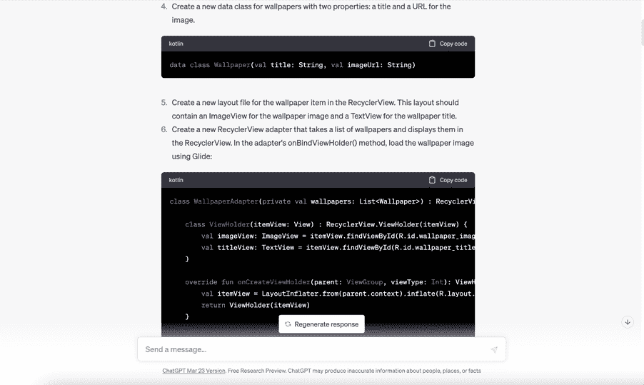

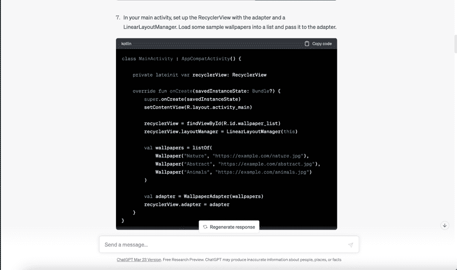

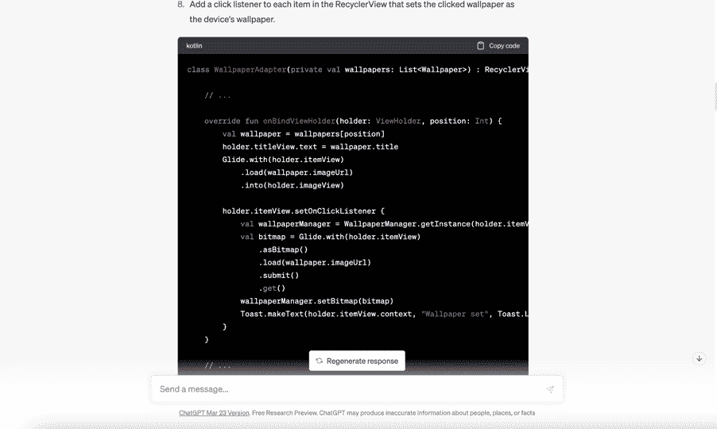

在某个时候，ChatGPT 会暂停或停止，就好像它已经给了你完整的指示。不要绝望，只需要求它“继续生成”，它将开始提供如何添加更多功能和功能的指示：

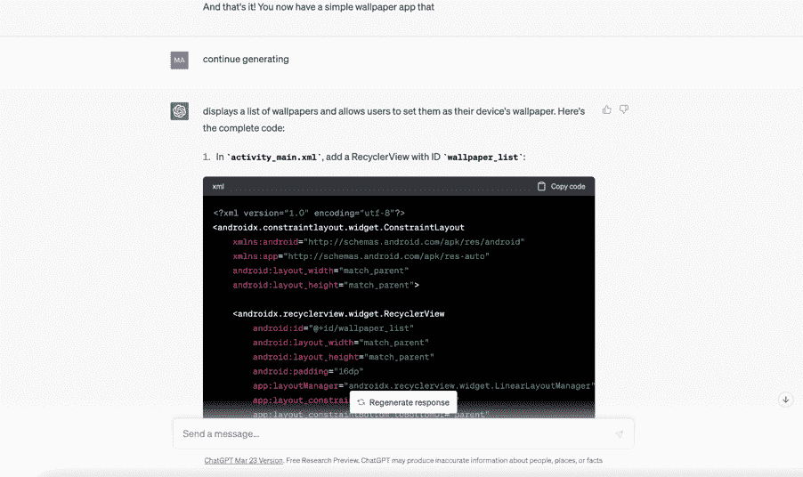

在这种情况下，ChatGPT 开始为我们提供展示壁纸的方法，以及在下载壁纸时显示进度条。ChatGPT 甚至继续建议可以增强应用程序功能的库和 API：

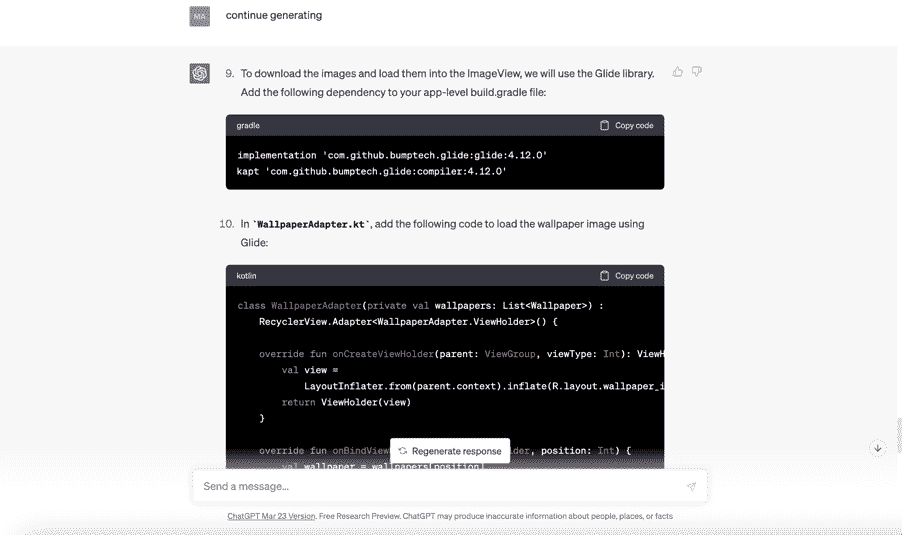

你可以继续这样下去，一步一步地挖掘更多的步骤和功能。记住，要求它继续生成只是让 ChatGPT 深入构建的一种方式。例如，尝试通过要求 ChatGPT 建议一些库或特定的 API 以及它们如何改进你的应用程序，选择一个并要求 ChatGPT 向你展示如何将其实现到你的构建中。很疯狂吧？

无论如何，正如你所看到的，只要具备一点技巧和编码知识，你就可以让 ChatGPT 来承担繁重的工作，同时构建能为你和你的客户带来丰厚收益的应用程序。

#### 结论

因此，如果您希望以各种方式赚钱，ChatGPT 是一个改变游戏规则的工具。无论您是博客作者、营销人员还是内容创作者，ChatGPT 都可以帮助您生成高质量的内容，提高参与度并增强您的在线存在感。

对于博客作者来说，ChatGPT 可以帮助在几秒钟内生成高质量的内容。您可以使用它提出博客文章的想法，生成标题，甚至撰写文章内容。您可以使用它撰写引人注目的广告文案，创建引人入胜的社交媒体帖子，甚至生成电子邮件营销活动。此外，凭借其先进的语言处理能力，ChatGPT 还可以协助编写产品描述和网站内容等任务。

对于营销人员来说，ChatGPT 是一个极其有价值的工具，涵盖整个营销生命周期，包括提高 SEO 和 SERP 排名，创建社交媒体帖子和其他营销材料，甚至安排这些材料进行发布。

由于 ChatGPT 的语言处理能力非常先进，您可以确信它生成的内容将是高质量且引人入胜的。随着 ChatGPT 分析您受众的喜好，您可以确信您创建的内容将与他们产生共鸣并推动参与度。

对于内容创作者来说，ChatGPT 可以帮助简化内容创作流程。无论您是在创建视频、播客还是博客文章，ChatGPT 都可以帮助您生成想法，撰写大纲，甚至起草整个脚本。由于 ChatGPT 的语言处理能力非常先进，您创建的内容将是高质量且引人入胜的，有助于建立忠实的追随者群体并提升您的在线存在感。

企业也可以利用 ChatGPT 提高客户服务水平，通过快速准确地回答客户查询等方式。总的来说，ChatGPT 在节省时间和精力的同时生成高质量内容的能力使其成为任何希望在网上赚钱的人的宝贵资产。

最后，ChatGPT 甚至可以被招募来编写网站代码并构建盈利应用程序。ChatGPT 帮助您增加收入的可能性似乎几乎无穷无尽。

无论您在创作什么，ChatGPT 都可以帮助您生成高质量的内容，提高参与度并增强您的在线存在感。最重要的是，它正在被证明是一个对于任何希望创建与其受众共鸣的引人入胜内容的人来说都是一个宝贵的资源。

### 附录 A

## ChatGPT 浏览器扩展

WebChatGPT - Chrome

由于 ChatGPT 的知识仅限于 2021 年的数据，此扩展程序会为您提供相关的网络结果。

#### ChatGPT for Google - Chrome, Firefox

在 Google 搜索结果旁边显示 ChatGPT 的响应

ChatGPT Writer - Chrome

将聊天机器人带到您的浏览器中，以创建用于任何网站的电子邮件和消息

Merlin – Chrome

适用于 Chrome 浏览器上的任何网站，帮助写作、编辑、格式化和搜索网页。

ChatSonic – Chrome

写即时文本片段，生成社交媒体文案和电子邮件，改写、扩展等。

TweetGPT – Chrome

生成推文和推文回复

Prometheus - Chrome

与 ChatGPT 对话而不是打字

YouTube 摘要与 ChatGPT – Chrome

在几秒钟内总结任何 YouTube 视频，并为您呈现视频的脚本

Summarize – Chrome

对您正在阅读的任何内容进行总结，包括新闻、文章、博客、研究报告等

ShareGPT – Chrome

一个一键式扩展程序，允许您分享 ChatGPT 对话

FancyGPT – Chrome

使您的 ChatGPT 对话看起来漂亮，并让您以酷炫的图像、可搜索的 PDF 和文本文件保存它们，以供将来参考或与同事分享。

WebChatGPT – Chrome

为 ChatGPT 的提示添加相关的网络结果，以进行更准确和最新的对话

Engage AI – Chrome

在 LinkedIn™ 上撰写富有洞察力的 AI 评论

Talk-to-ChatGPT – Chrome

类似于 Prometheus，但具有语音回应的附加功能

ChatGPT Prompt Genius – Chrome, Firefox

发现、分享、导入和使用 ChatGPT 的最佳提示，并在本地保存聊天记录（以前称为 ChatGPT 历史）

增强 ChatGPT – Chrome

为 ChatGPT 添加新功能，包括聊天导出和提示模板。其中一些提示工具包括触发器，用于在网上查找图像，获取旅行建议，生成翻译和使用 JavaScript 编程

WritingMate – Chrome

在 Gmail 中秒速起草或回复电子邮件或消息

生成博客文章、论文或其他个人内容

在 LinkedIn 中创建营销文案、新闻稿或其他工作内容

写作：修正语法，重写或即时翻译

研究：总结文本、头脑风暴或提出问题

超级 ChatGPT – Chrome, Firefox

该扩展程序具有不断更新的数百个提示库，使 ChatGPT 以不同的方式行动。它还提供历史记录、导出按钮、复制按钮、字数统计和时间戳等选项

AIPRM for ChatGPT – Chrome

为 ChatGPT 添加了一系列精心策划的提示模板，涵盖 SEO、SaaS 等领域

### 附录 B

## 其他有用的工具

本节列出的工具只是可用工具的一小部分。尝试在谷歌上搜索，找到适合自己的工具，真的有很多很棒的工具。我提供了一些经过时间考验和/或大量消费者测试的工具。

## SEO 工具

[SEMrush](https://www.semrush.com/sem/)

成本

专业版：$119.95/ 月

大师版：$229.95/ 月

商业版：$449.95/ 月

特点

建立链接：分析其他网站对您网站的入站链接。

关键词魔法工具：确定关键词，制定成功的 SEO 策略。

查看竞争对手的策略：查看竞争对手的付费关键词或广告中使用的文案。

接收建议：通过优化您的内容增加有机流量。

[Ahrefs](https://ahrefs.com/)

成本

免费七天试用

精简版：$7, $99/ 月

标准版：$179/ 月

高级版：$399/ 月

机构版：$999/ 月

特点

网站探测器：查看您网站上特定网页的表现。

内容探索器：搜索特定主题和关键词下表现优异的页面。

关键词探测器：查看特定关键词的每月搜索量和点击率。

网站审计：爬取您域内指定的垂直领域，揭示页面级别的各种技术问题。

[SEOptimer](https://www.seoptimer.com/)

成本

14 天免费试用

$19.99/ 月

特点

无限白标审计：创建定制的、白标的 SEO 审计。

可嵌入式审计工具：完全定制并嵌入一个站点审计表单到您的机构网站，以生成新的潜在客户。

SEO 爬虫：扫描网站的每个页面，识别阻碍网站排名的问题。

关键词研究工具：快速进行关键词研究，查看搜索量、竞争、流量和 CPC。

## 电子邮件工具

这里是根据福布斯的排名顶尖工具：

Mailchimp：最适合一体化营销

[Zoho Campaigns：最适合完全集成的商业套件](https://www.zoho.com/campaigns/)

Drip：最适合电子商务

MailerLite：最适合销售付费订阅

Campaigner：最适合有经验的营销人员

GetResponse：最适合中小型企业（SMEs）

Moosend：最适合传统公司

## 主机工具

这里是根据 Quicksprout.com 列出的顶级工具：

[Hostinger – 总体最佳](https://www.hostinger.com/)

[DreamHost – 最具性价比的共享主机](https://www.dreamhost.com/)

[SiteGround – 最适合提供额外速度和安全性的网站](https://www.siteground.com/)

[Bluehost – 最适合新的 WordPress 网站](http://bluehost.com)
