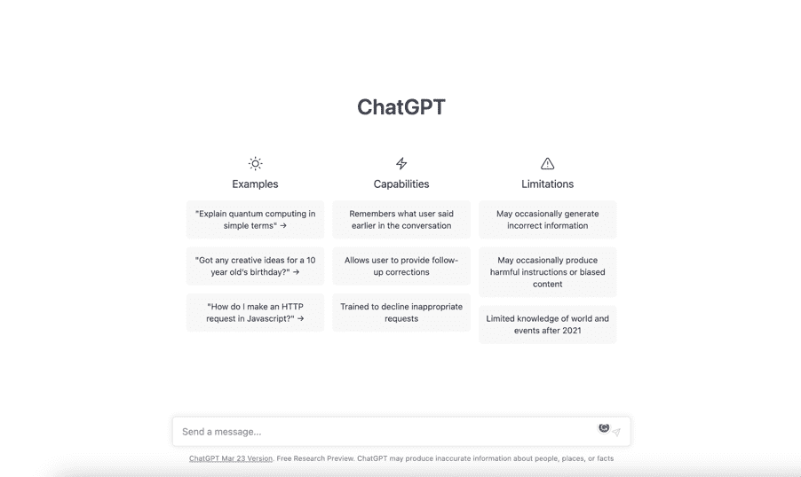
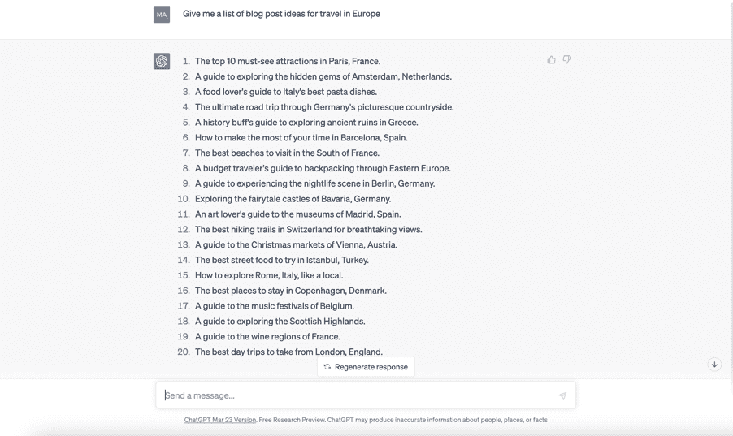
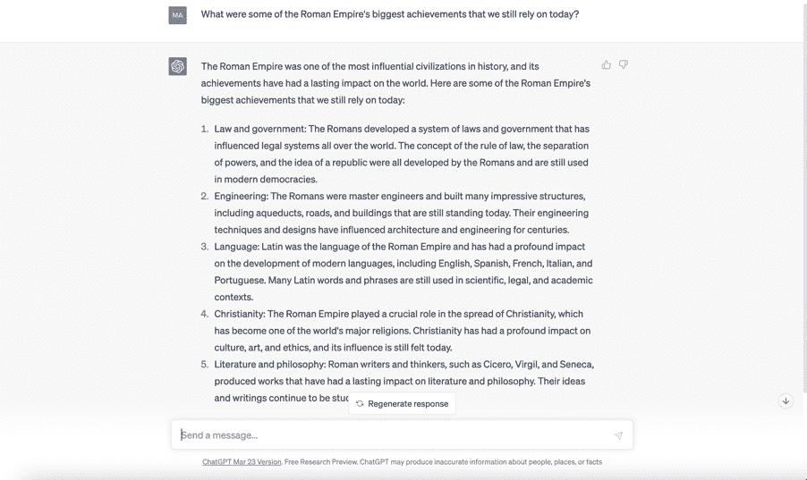

## 什么内容及如何创建它

内容类型

大纲 - ChatGPT 可以为文章等长篇内容创建大纲，甚至是书籍。

长篇内容 - 一旦你创建了大纲，你可以让 ChatGPT 写那些文章，甚至是你一直梦想出版的书籍。

网站内容 - 每个网站都需要内容，我不仅指文章等。有着落地页、关于部分、团队简介、隐私条款等。

产品描述 - 通过输入产品名称和特点，ChatGPT 将生成一个符合你品牌声音的描述。

社交媒体 - 通过输入提示或主题，ChatGPT 可以创建社交媒体内容创意列表、发布日历，甚至生成帖子，包括视频脚本（如果需要的话）。

电子邮件 - ChatGPT 是生成营销和跟进电子邮件的好工具。

提案和合同 - 通过提供关于客户需求的一些基本信息以及你提供的服务，ChatGPT 可以生成一个有销售力的提案。一旦你获得客户，它还可以生成具有法律约束力语言的合同。是的，它就是这么厉害！

脚本 - ChatGPT 非常适合为 YouTube、网络研讨会和广告创建视频脚本。你甚至可以让 ChatGPT 帮助你概述和撰写完整的在线课程！

内容创建基础知识

如果你需要在特定主题上创建文章或博客文章，你可以向 ChatGPT 输入一些基本信息，比如你想要涵盖的主要观点或你想传达的语气。然后，ChatGPT 可以利用其自然语言处理能力生成一篇写得很好、引人入胜的内容，深入探讨该主题。

同样，如果你需要创建社交媒体帖子，ChatGPT 可以生成针对不同平台（如 Twitter、Instagram 或 Facebook）优化的帖子。它可以生成标签、标记相关账户，并为每个平台使用适当的语言和语气。

ChatGPT 内容生成能力中最好的一点是它可以大规模创建内容。这意味着你可以使用它快速高效地生成大量文章或社交媒体帖子，而不会牺牲质量。这对需要定期创建大量内容的企业或个人非常有用。

注意：在开始使用 ChatGPT 进行内容创作之前，有一些事情需要记住。首先，你应该始终审查和编辑 ChatGPT 生成的内容。虽然 ChatGPT 可以生成高质量的文本，但它并不完美。你应该始终审查内容，确保准确并符合品牌形象。

其次，你还应该了解 ChatGPT 的局限性。虽然它是一个强大的工具，但它不能取代人类的创造力和专业知识。你应该始终努力为 ChatGPT 生成的内容添加你自己独特的观点和见解。

总的来说，ChatGPT 是一个用于内容创作的绝佳工具。它可以帮助你快速高效地生成高质量内容，节省大量时间和精力。只需记得要负责任地使用它，并始终审查它生成的内容。

所以，让我们从 ChatGPT 的起始页面开始：

ChatGPT 的起始页面提供了一些示例供你尝试，以及其功能和限制的简要选择。如果你往下看，你会注意到一个输入框。这是你开始与 ChatGPT“对话”的地方。

创意生成

现在，如果你不知道写什么怎么办？如果你正在生成大量内容，有时可能很难想出新颖有趣的想法。更不用说我们都会遇到那些可怕的“脑屁”时刻，当时你想出的东西一点也不好。这就是 ChatGPT 可以成为如此有用工具的地方。ChatGPT 在几次按键中就能帮助消除写作障碍。

例如，使用 ChatGPT 进行创意生成的一种方式是输入你想探索的主题或主题。例如，如果你是一名博主，不知道写什么，你可以输入一个一般主题，比如“旅行”或“食物”。ChatGPT 可以生成与该主题相关的想法列表，供你作为下一篇博客文章的灵感。

这可能看起来是这样的：

现在你有了二十个可以写文章的想法（当然要以 ChatGPT 为你的副驾驶）！

使用 ChatGPT 的另一种方式是输入你想回答的特定问题。例如，如果你是一名学生，需要帮助完成作业，你可以输入与作业相关的问题。ChatGPT 可以生成一系列潜在答案或想法，供你完成作业使用。

这里我问了 ChatGPT 关于罗马帝国最大成就的问题：

有了这些结果，学生可以选择关注列表中的所有或任何一项来撰写他们的文章或项目。简单吧？

ChatGPT 还有很多其他方式可以帮助你想出内容的创意。

例如，ChatGPT 还可以通过分析你现有的内容来帮助你生成想法。举例来说，如果你有一个包含大量内容的网站或博客，ChatGPT 可以分析该内容并生成与你已经发布的内容相关的新想法。

使用 ChatGPT 进行创意生成的另一种方式是利用其定制功能。例如，你可以输入你想在生成的想法中包含的特定关键词或短语。你还可以调整生成的想法的语气，使其更加严肃或轻松，取决于你想传达的信息。

使用 ChatGPT 进行创意生成是克服写作障碍、提出新颖激动人心想法的绝佳方式。您可以通过输入一个主题或主题、一个具体问题、分析您现有的内容，并利用其定制功能来实现这一目标。因此，如果您在构思想法方面遇到困难，请试一试！
