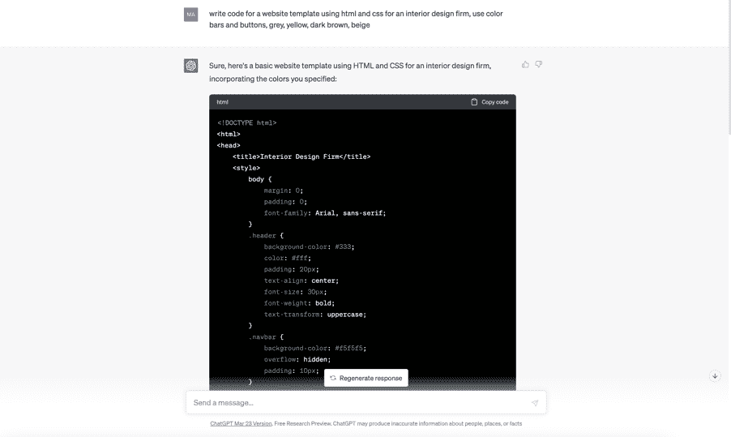
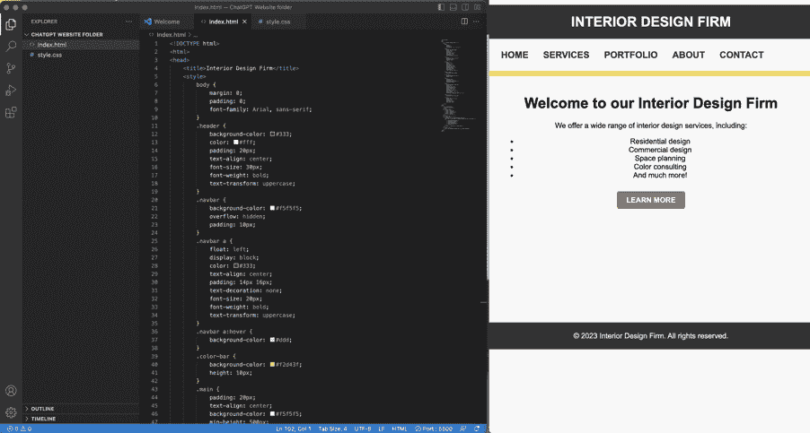

## 网站

我将深入探讨 ChatGPT 如何帮助你构建应用程序。与此同时，让我们看看你如何请求 ChatGPT 为你构建一个主页并自定义它。

这是我如何开始与 ChatGPT 进行对话的：

我将这段代码复制到了 Visual Studio（代码编辑软件）中，这是测试页面的样子：

这里你可以看到左边的代码，右边是实时页面展示。很酷，对吧？目前布局相当简单，但你可以通过请求 ChatGPT 为你编写代码片段来改变布局、颜色、功能等。所以基本上，只要稍加耐心、独创性和创造力，你可以做任何事情！
