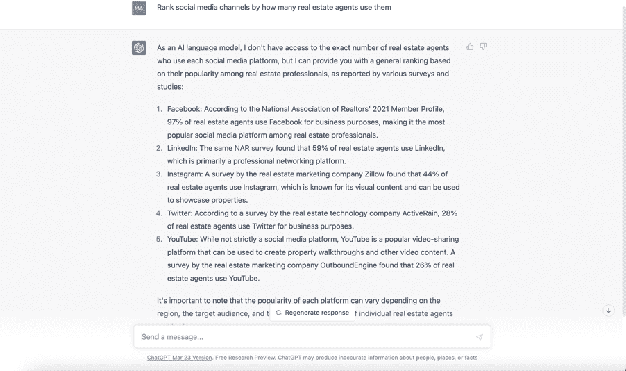
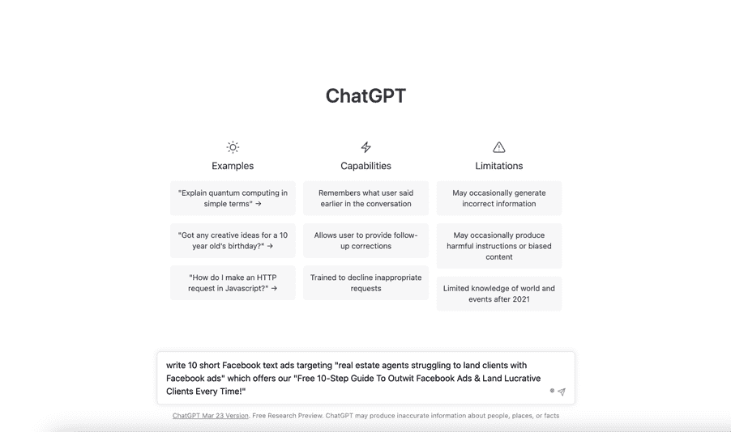
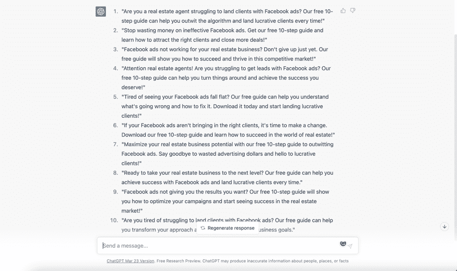
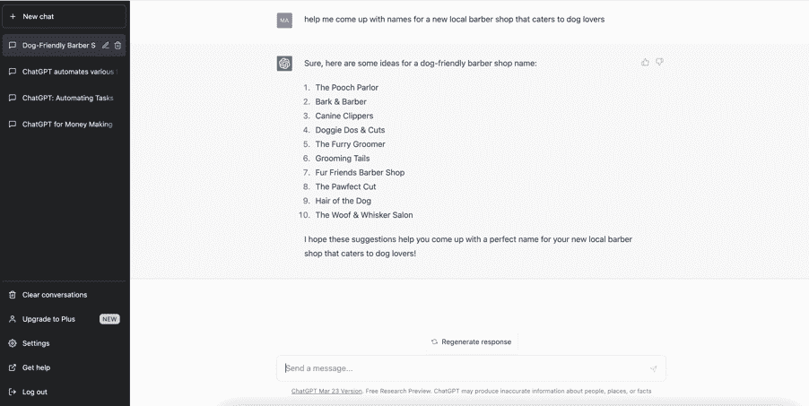
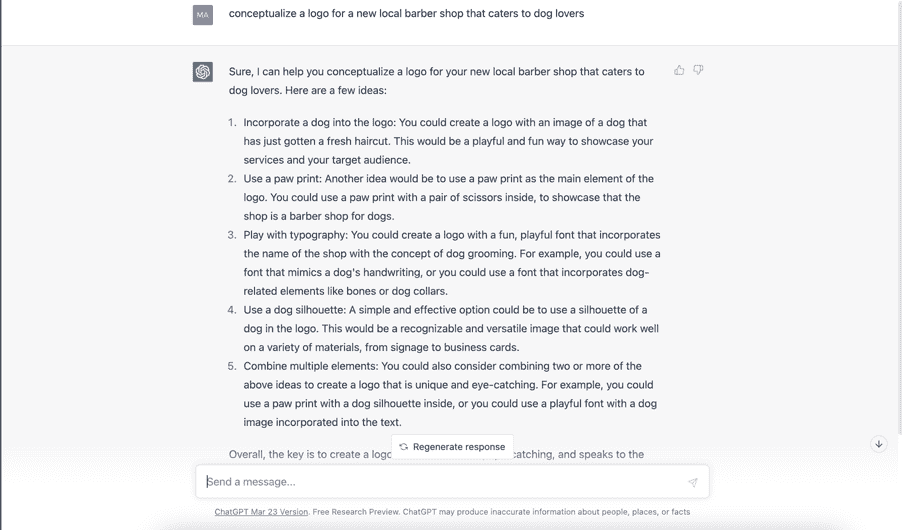

## 如何

让我们谈谈 ChatGPT 如何帮助潜在客户生成。你可能已经猜到，许多企业（包括初创企业和现有企业）经常需要帮助解决以下问题：

商业和产品名称

标志

网站内容（关于页面，产品描述等）

广告脚本

测试和启动活动

要开始，让我们看看社交媒体平台在多少房地产经纪人使用它们方面的排名。我让 ChatGPT 考虑这一点来排名社交媒体平台，以下是结果：

看起来 Facebook 是我们应该集中精力的平台，如果我们想要接触到房地产经纪人。

接下来，让我们请 ChatGPT 为我们编写一则广告脚本，以吸引房地产经纪人来到我们的潜在客户生成业务：

这是 ChatGPT 的回应：

太棒了！现在我们有了一些脚本可以使用，我们可以开始进行 A/B 测试和启动广告活动来吸引我们的受众。在这种情况下，我们希望从这些广告中获得的潜在客户前往一个注册页面，在那里我们可以收集他们的电子邮件地址，并发送给他们我们承诺的免费指南的链接。顺便说一句，有很多工具可以帮助实现这一点（请参见附录）。

你可能还想更加复杂一点，推销一些网络研讨会或会员资格。当然，这需要建立一个销售渠道，这实际上是另一本书的话题，但现在我在本书的附录部分也包含了一些工具。

一旦你有了潜在客户并成功签约了一两个客户，你就能帮助他们解决各种品牌挑战。以下是一些示例：

ChatGPT 还可以帮助构思一个新业务的标志：

ChatGPT 可以为您的客户想出产品名称：

