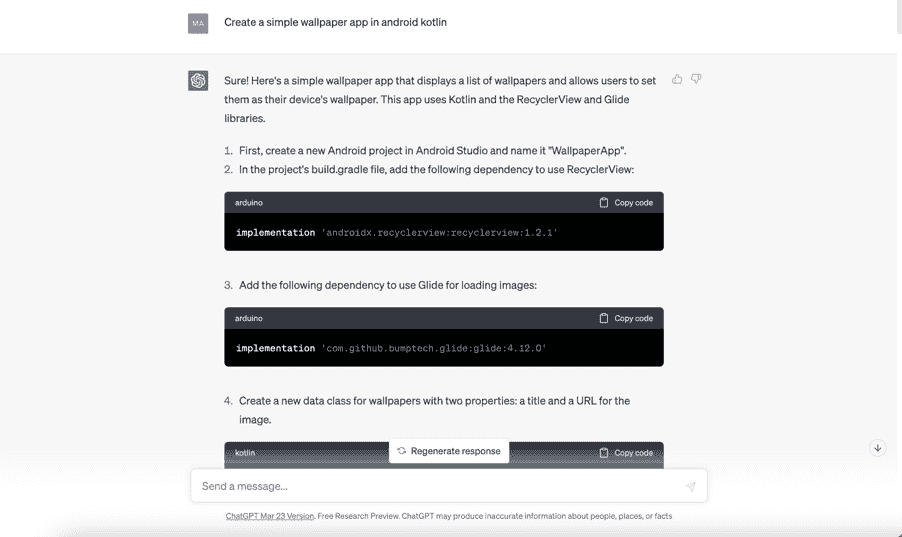
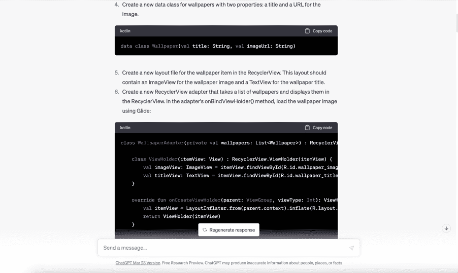
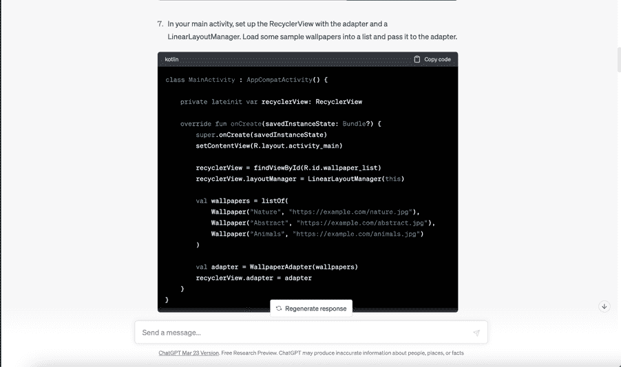
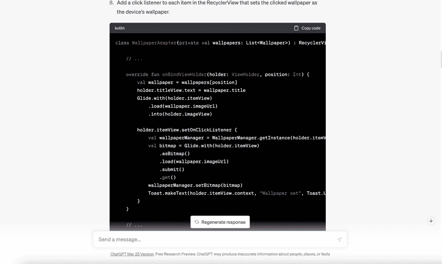
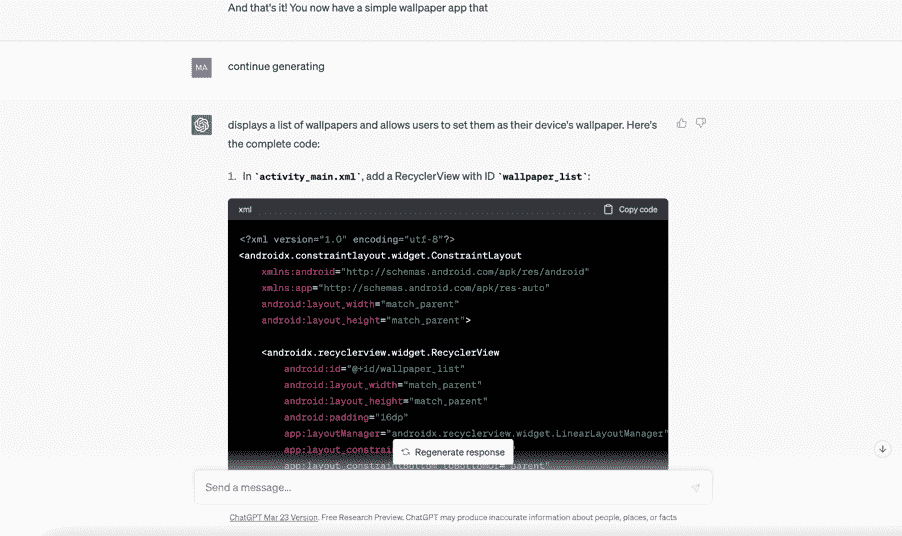
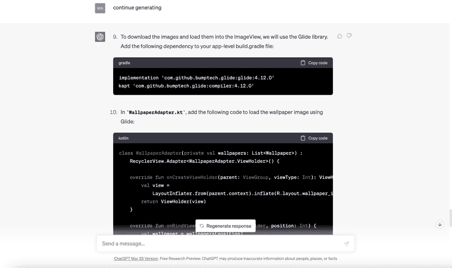

## 如何

在这一部分，我们将构建一个壁纸应用程序，这是开发最佳类型的收入生成应用程序之一。

我将从给 ChatGPT 一个非常简单直接的提示开始，就像这样：

它将继续生成步骤和相应的代码，并且你可以通过复制代码并将其添加到你的开发环境中来跟随，本例中我们正在使用 Android Kotlin 开发这个应用程序。这是 ChatGPT 可能会提供的内容：

在某个时候，ChatGPT 会暂停或停止，就好像它已经给了你完整的指示。不要绝望，只需要求它“继续生成”，它将开始提供如何添加更多功能和功能的指示：

在这种情况下，ChatGPT 开始为我们提供展示壁纸的方法，以及在下载壁纸时显示进度条。ChatGPT 甚至继续建议可以增强应用程序功能的库和 API：

你可以继续这样下去，一步一步地挖掘更多的步骤和功能。记住，要求它继续生成只是让 ChatGPT 深入构建的一种方式。例如，尝试通过要求 ChatGPT 建议一些库或特定的 API 以及它们如何改进你的应用程序，选择一个并要求 ChatGPT 向你展示如何将其实现到你的构建中。很疯狂吧？

无论如何，正如你所看到的，只要具备一点技巧和编码知识，你就可以让 ChatGPT 来承担繁重的工作，同时构建能为你和你的客户带来丰厚收益的应用程序。
