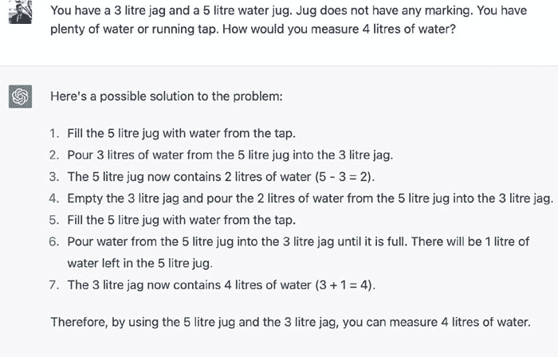

# ChatGPT 与生成式 AI 的崛起

> 原文：[Rise of Generative AI and ChatGPT](https://annas-archive.org/md5/ef12a5965cfd57118e949c1e1c16054e)
> 
> 译者：[飞龙](https://github.com/wizardforcel)
> 
> 协议：[CC BY-NC-SA 4.0](https://creativecommons.org/licenses/by-nc-sa/4.0/)

# 第一章：ChatGPT 简介

# 介绍

ChatGPT 是过去几个月最受关注的话题之一，毫无疑问，它已经改变了人工智能系统对大众的完全视角。对许多人来说，人工智能系统如何拥有如此丰富的知识，以及如何以如此成熟的方式在语境中创建回应，都有点像魔术。从回答任何主题的查询到撰写文章、博客、白皮书、软件程序，甚至修复错误的程序代码等等。

# ChatGPT 的技术概述

现在，许多人对 ChatGPT 的一个常见困惑可能是它被认为是常用聊天机器人的高级版本。尽管它可能看起来有点像聊天机器人以及它的功能，但实际上从技术角度来看，它与聊天机器人完全不同。ChatGPT 是一个生成模型，意味着它可以生成新颖的回应，而不仅仅是从列表中选择预定义的回应。这使得 ChatGPT 能够拥有更自然和多样化的回应，并使其更适合用于开放式对话。**GPT**代表“**生成式预训练变压器**”，是一种使用人类对话的大型数据集进行训练的变压器神经网络架构，以生成类似人类对用户输入的回应。现在，ChatGPT 已经优化用于对话生成，并已经在各种在线平台的聊天记录、文件、研究论文等数据集上进行了训练。因此，在某种程度上，ChatGPT 所拥有的智能来自你在任何社交媒体或消息平台上的对话。

从技术角度来看，ChatGPT 基于变压器架构，使用自注意机制处理具有大量参数的输入序列（数量级为十亿），并使用**掩码语言建模**（**MLM**）目标的变种进行训练。在训练过程中，模型被呈现一系列标记，并被要求预测序列中的下一个标记，其中输入序列中的一些标记被掩盖。这迫使模型使用未掩盖的标记的上下文来预测被掩盖的标记，从而帮助它学习通用语言表示。

# ChatGPT 的应用

ChatGPT 可以用于各种应用，包括客户服务的聊天机器人、在线教育和社交媒体。它还可以用于虚拟助手和其他对话人工智能系统。它特别适用于需要生成类似人类回应并保持自然对话流程的应用程序。

总的来说，ChatGPT 是构建特殊用途高级聊天机器人和其他对话人工智能系统的强大工具，并有潜力彻底改变我们与计算机和在线互动的方式。ChatGPT 的一个主要优势是它能够处理上下文并在对话中保持连贯性。这是因为它已经在大量的聊天记录数据集上进行了训练，这使得它能够了解常见的对话模式以及如何保持一致的对话流程。

除了其自然语言生成能力外，ChatGPT 还可以执行各种语言理解任务，如命名实体识别、词性标注和情感分析。这使得它能够理解用户输入的含义并生成适当的回应，而不仅仅是盲目地重复单词或短语。

ChatGPT 另一个有趣的方面是它具有学习和适应的能力。通过不断与用户互动并从他们的回应中学习，ChatGPT 可以提高其性能，变得更加准确和引人入胜。这使得它能够变得更加个性化，更能够满足个体用户的需求。

在实施方面，ChatGPT 可以使用各种编程语言和框架集成到聊天机器人系统中。可以通过 API 访问它，也可以使用深度学习库中的预训练模型，如*PyTorch*或*TensorFlow*。

ChatGPT 在商业环境中有许多用途，可以改善客户服务、简化流程并降低成本。

一个常见的用例是构建可以处理客户查询和投诉的聊天机器人。这些聊天机器人可以集成到公司的网站或社交媒体平台中，并可以对常见问题提供即时响应，从而释放出人类客户服务代表来处理更复杂的问题。ChatGPT 理解上下文并生成适当响应的能力可以使这些聊天机器人更有效地处理各种客户查询。

另一个用例是构建可以协助内部流程的聊天机器人，例如员工入职、人力资源任务和日程安排。例如，聊天机器人可以用于向新员工提供有关公司政策和程序的信息，或者允许员工请假或安排会议。ChatGPT 理解自然语言输入并生成连贯响应的能力使其非常适合这些类型的应用。

除了这些用途之外，ChatGPT 还可以用于构建营销和销售的聊天机器人。例如，聊天机器人可以用于提供有关公司产品或服务的信息，或者用于协助潜在客户的生成和资格认定。ChatGPT 有潜力极大地提高业务流程的效率和效果，特别是在客户服务和内部沟通领域。其生成类人响应和理解上下文的能力使其成为构建可以协助各种任务的聊天机器人的强大工具。

# ChatGPT 在商业环境中的应用

很可能 ChatGPT 已经被许多公司在各种行业中用于各种应用，如客户服务、内部沟通和营销。

一些已经实施了 GPT 或类似模型的公司的例子包括 OpenAI、Hugging Face 以及像*Google 的 Cloud Language API*和*AWS 的 Comprehend*这样的语言模型服务提供商。这些公司提供工具和服务，允许企业构建和部署基于语言的人工智能系统，而无需从头开始构建和训练自己的模型。

# 需要记住的要点

+   ChatGPT 是一种生成模型，意味着它可以生成新颖的响应，而不仅仅是从列表中选择预定义的响应。

+   GPT 代表“生成式预训练变压器”，是一种使用大量人类对话数据集进行训练的变压器神经网络架构，用于生成对用户输入的类人响应。

+   总的来说，ChatGPT 是构建特殊目的的先进聊天机器人和其他对话人工智能系统的强大工具，并有潜力彻底改变我们在线与计算机和彼此互动的方式。

+   ChatGPT 在商业环境中有许多用途，可以改善客户服务、简化流程并降低成本。

+   除了这些用途之外，ChatGPT 还可以用于构建营销和销售的聊天机器人。

+   ChatGPT 有潜力极大地提高业务流程的效率和效果，特别是在客户服务和内部沟通领域。

+   值得注意的是，ChatGPT 是 GPT 语言模型的一个变体，已被许多公司和研究人员广泛采用用于各种任务。

# 加入我们书籍的 Discord 空间

加入书籍的 Discord 工作区，获取最新更新、优惠、全球科技动态、新书发布信息以及与作者的交流会话：

[**https://discord.bpbonline.com**](https://discord.bpbonline.com)

# 第二章：生成模型的历史

# 介绍

生成式人工智能是人工智能的一个子领域，涉及利用深度学习和神经网络等技术从给定的输入集合中创建新的内容或数据。生成模型可以被训练以产生各种输出，包括文本、图像、音乐，甚至视频。

# 生成式人工智能的历史

生成式人工智能的历史可以追溯到 20 世纪 50 年代和 60 年代的人工智能研究的早期阶段，当时计算机科学家们首次开始探索利用机器生成新内容的想法。早期的生成式人工智能系统主要专注于简单的任务，如模式识别和基于规则的决策制定。

# 生成式人工智能的发展

在 20 世纪 80 年代和 90 年代，生成式人工智能研究变得更加复杂，随着概率模型如隐马尔可夫模型和贝叶斯网络的发展。这些模型使人工智能系统能够做出更复杂的决策并生成更多样化的输出。

然而，直到 2010 年代深度学习算法和神经网络的发展，生成式人工智能才真正开始蓬勃发展。深度学习模型，如生成对抗网络（GANs）和变分自动编码器（VAEs），使人工智能系统能够生成高度逼真和复杂的输出，如照片逼真的图像和自然语言文本。

# 评估生成式人工智能

生成式人工智能的评估是一个持续的挑战，因为很难客观地衡量生成的输出的质量和创造力。然而，已经开发了各种评估指标和技术，包括人类评估、困惑度和启动分数等定量指标，以及基于用户体验和偏好的感知指标。

# 生成式人工智能的应用

未来，生成式人工智能预计将对各个行业和企业产生重大影响。例如，在娱乐行业，生成式人工智能可以用于创造新的独特内容，如音乐、电影和视频游戏。在时尚行业，它可以用于生成新的服装设计甚至整个时装系列。

在医疗保健行业，生成式人工智能可以用于根据患者数据创建个性化的治疗方案，在金融行业，它可以用于生成交易算法和财务预测。

总的来说，生成式人工智能的潜在应用非常广泛，很可能会继续成为人工智能领域的重要研究和发展领域。

# 需要记住的要点

+   生成式人工智能是人工智能的一个子领域，涉及利用深度学习和神经网络等技术从给定的输入集合中创建新的内容或数据。

+   生成模型可以被训练以产生各种输出，包括文本、图像、音乐，甚至视频。

+   深度学习模型，如生成对抗网络（GANs）和变分自动编码器（VAEs），使人工智能系统能够生成高度逼真和复杂的输出，如照片逼真的图像和自然语言文本。

+   生成式人工智能的评估是一个持续的挑战，因为很难客观地衡量生成的输出的质量和创造力。

+   未来，生成式人工智能预计将对各个行业和企业产生重大影响。

+   例如，在娱乐行业，生成式人工智能可以用于创造新的独特内容，如音乐、电影和视频游戏。

+   总的来说，生成式人工智能的潜在应用非常广泛，很可能会继续成为人工智能领域的重要研究和发展领域。

# 加入我们书籍的 Discord 空间

加入该书的 Discord 工作空间，获取最新更新、优惠、全球科技动态、新书发布信息以及与作者的交流：

[**https://discord.bpbonline.com**](https://discord.bpbonline.com)

# 第三章：[银行和金融中的生成式人工智能]

# [介绍]

生成式人工智能在银行和金融行业有许多潜在的应用，从欺诈检测和风险分析到个性化客户服务和投资建议。在本文中，我们将探讨生成式人工智能在银行和金融行业中最有前景的一些用例，以及这些应用的优势和局限性。

# [应用和用例]

让我们来看看银行和金融领域中生成式人工智能的一些用例：

# [欺诈检测和风险分析]

生成式人工智能在银行和金融行业中最有前景的应用之一是欺诈检测和风险分析。生成式人工智能可以用于分析大量的金融数据，以识别潜在的欺诈或金融犯罪案例。这可以通过检测交易数据、客户行为和其他可能表明欺诈活动的因素来实现。

例如，生成式人工智能可以用于分析交易数据，以识别可疑活动的模式，例如超出客户行为通常范围的交易。生成式人工智能还可以用于分析社交媒体和其他公共数据来源，以识别对金融机构的潜在风险，如负面情绪或声誉风险。

# [个性化客户服务]

生成式人工智能在银行和金融领域的另一个有前途的应用是个性化客户服务。生成式人工智能可以用于创建聊天机器人和其他自动化系统，以对客户查询提供个性化回应，并为金融产品和服务提供推荐。

例如，生成式人工智能驱动的聊天机器人可以帮助客户解决基本的金融问题，并为他们量身定制的产品和服务提供推荐。这可以提高客户满意度和留存率，同时增加金融机构的收入。

# [投资建议]

生成式人工智能还可以根据客户的个人风险配置和投资目标为他们提供投资建议。这可以通过分析大量的金融数据来实现，包括历史市场趋势、客户行为和其他可能影响投资决策的因素。

例如，生成式人工智能可以用于为客户创建个性化的投资组合，以满足其特定的风险配置和投资目标。这可以帮助客户做出更明智的投资决策，提高实现其财务目标的机会。

# [优势]

以下是生成式人工智能在银行和金融领域提供的一些优势：

# [提高效率]

生成式人工智能可以通过自动化许多例行任务，如欺诈检测和客户服务，来提高银行和金融业务的效率。这可以帮助降低成本，提高整体业绩。

# [个性化]

生成式人工智能可以帮助金融机构为客户提供更个性化的服务，从而提高客户满意度和留存率。

# [更好的决策]

生成式人工智能可以提供见解和建议，帮助金融机构更明智地进行风险管理、投资和其他重要的业务功能决策。

# [改进的安全性]

生成式人工智能可以通过在问题变成重大问题之前识别潜在的欺诈和其他风险来提高安全性。这可以帮助保护金融机构和他们的客户。

# [局限性和挑战]

以下是生成 AI 在银行和金融领域带来的一些挑战：

# 数据隐私和安全

在银行和金融业中，生成 AI 面临的最大挑战之一是确保客户数据受到保护和安全。金融机构必须采取措施保护客户数据免受网络威胁和其他风险。

# 道德关切

生成 AI 可能引发道德关切，特别是围绕偏见和歧视等问题。金融机构必须确保他们的 AI 系统在道德和负责任的方式下开发和使用。

# 监管合规

金融机构必须确保他们的 AI 系统符合相关法规，如**通用数据保护条例**（**GDPR**）和**支付卡行业数据安全标准**（**PCI DSS**）。

# 熟练人才的有限供应

对熟练的 AI 专业人才的需求很高，目前缺乏具备必要技能和经验的专业人才来开发和部署银行和金融业的生成 AI 系统。

# 需要记住的要点

+   生成 AI 在银行和金融业有许多潜在应用，从欺诈检测和风险分析到个性化客户服务和投资建议。

+   生成 AI 在银行和金融业最有前途的应用之一是欺诈检测和风险分析。

+   生成 AI 可以通过自动化许多例行任务（如欺诈检测和客户服务）来提高银行和金融业的效率。

+   在银行和金融业中，生成 AI 面临的最大挑战之一是确保客户数据受到保护和安全。

+   金融机构必须采取措施保护客户数据免受网络威胁和其他风险。

+   金融机构必须确保他们的 AI 系统在道德和负责任的方式下开发和使用。

+   对熟练的 AI 专业人才的需求很高，目前缺乏具备必要技能和经验的专业人才来开发和部署银行和金融业的生成 AI 系统。

# 加入我们书籍的 Discord 空间

加入书籍的 Discord Workspace，获取最新更新、优惠、世界范围内的技术动态、新发布和与作者的交流：

[**https://discord.bpbonline.com**](https://discord.bpbonline.com)

# 第四章：生成式人工智能的监管和法律方面

# 介绍

生成式人工智能有潜力彻底改变各个行业和企业，但也存在潜在的监管和法律限制，需要解决以确保其道德和负责任的使用。

# 道德和负责任的使用

为了防止潜在的缺点，生成式人工智能的使用必须受到透明度、问责制和公平性的指导。下面讨论了一些相关的例子：

# 知识产权

生成式人工智能模型可以生成文本、图像和音乐等内容，这些内容可能侵犯现有的知识产权。重要的是要确保生成式人工智能不被用于制作违反版权或商标法的内容。

# 隐私和数据保护

生成式人工智能模型通常需要大量数据进行训练，其中可能包括个人信息。在收集和使用这些数据时，重要的是要确保遵守隐私和数据保护法律。

# 偏见和歧视

生成式人工智能模型可能会延续现有的偏见和歧视，特别是当它们在有偏见的数据集上进行训练时。重要的是要确保生成式人工智能模型的开发和训练方式能够避免偏见和歧视。

# 安全和保障

生成式人工智能模型可以用于创建逼真和令人信服的内容，包括假新闻、深度伪造和网络钓鱼攻击。重要的是要确保生成式人工智能不被用于恶意目的，并且要采取适当的保障措施防止滥用。

为了解决这些监管和法律限制，可以采取几种方法。其中包括：

+   制定生成式人工智能的发展和使用的道德准则和最佳实践。

+   制定能够解决生成式人工智能所带来的独特挑战的监管框架，例如透明度和问责制的需求。

+   鼓励行业、学术界和政府之间的合作，制定生成式人工智能的道德和负责任使用的标准和最佳实践。

+   开发技术解决方案，例如用于检测和减轻偏见的算法，可以帮助确保生成式人工智能的负责任使用。

解决生成式人工智能的监管和法律限制将需要一个多方面的方法，涉及行业、政府和学术界等各方的合作。通过这样做，我们可以确保生成式人工智能以一种负责任和道德的方式被使用，从而使整个社会受益。

# 要记住的要点

+   生成式人工智能有潜力彻底改变各个行业和企业，但也存在潜在的监管和法律限制，需要解决以确保其道德和负责任的使用。

+   为了防止潜在的缺点，生成式人工智能的使用必须受到透明度、问责制和公平性的指导。

+   重要的是要确保生成式人工智能模型的开发和训练方式能够避免偏见和歧视。

+   为了解决这些监管和法律限制，可以采取几种方法。

+   制定生成式人工智能的发展和使用的道德准则和最佳实践。

+   制定能够解决生成式人工智能所带来的独特挑战的监管框架，例如透明度和问责制的需求。

+   鼓励行业、学术界和政府之间的合作，制定生成式人工智能的道德和负责任使用的标准和最佳实践。

+   解决生成式人工智能的监管和法律限制将需要一个多方面的方法，涉及行业、政府和学术界等各方的合作。

# 加入我们书籍的 Discord 空间

加入书籍的 Discord 工作区，获取最新更新、优惠、全球科技动态、新书发布信息以及与作者的交流：

[**https://discord.bpbonline.com**](https://discord.bpbonline.com)

# 第五章：生成式人工智能和 ChatGPT 用于政府部门

# 介绍

生成式人工智能，包括创建图像、视频和文本等新内容，可以在政府部门以多种方式发挥作用。

# 生成式人工智能的使用案例

以下是生成式人工智能的一些使用案例和应用：

# 内容创作

生成式人工智能可以用于为政府通信创建内容，如社交媒体帖子、网站内容和营销材料。

# 图像和视频分析

生成式人工智能可以用于分析图像和视频，如监控录像，以检测异常或可疑活动。

# 灾难响应

生成式人工智能可以用于生成灾难受影响地区的地图和模型，帮助政府官员规划和协调救援工作。

# 欺诈检测

生成式人工智能可以用于分析财务数据，如税务记录和交易数据，以检测潜在的欺诈或金融犯罪案例。

# 决策制定

生成式人工智能可以用于生成场景和模拟，帮助政府官员做出关于政策和资源分配的明智决策。

# 预测分析

生成式人工智能可以用于分析大量数据，以识别模式和趋势，如预测疾病爆发或犯罪热点的潜在情况。

# 个性化服务

生成式人工智能可以用于为公民创建个性化服务，例如提供个性化回复其查询或政府服务的个性化推荐的聊天机器人。

# 政府中的生成式人工智能：益处和道德保障

生成式人工智能可以成为政府部门改善运营并更好地为公民服务的有价值工具。其生成新内容和分析大量数据的能力可以帮助政府官员做出更明智的决策，并为其选民提供更个性化的服务。然而，重要的是要确保生成式人工智能以道德和负责任的方式开发和使用，并采取适当的保障措施来保护公民隐私，防止滥用。

作为一个大型语言模型，ChatGPT 可以在政府部门以多种方式发挥作用。

# ChatGPT 的使用案例

ChatGPT 的一些使用案例和应用：

# 客户服务

ChatGPT 可以用于为公民提供自动化客户服务，回答常见问题并提供有关政府项目和服务的信息。

# 自然语言处理

ChatGPT 可以用于分析大量非结构化数据，如社交媒体帖子和新闻文章，以识别与政府运营相关的趋势和见解。

# 信息检索

ChatGPT 可以用于从政府数据库和文件中检索信息，如法律法规，以帮助政府员工更有效地完成工作。

# 语言翻译

ChatGPT 可以用于翻译不同语言之间的文件和通信，帮助政府员工更有效地与公民和利益相关者沟通。

# 政策分析

ChatGPT 可以用于分析和评估政策提案和立法语言，帮助政府官员做出关于公共政策的明智决策。

# 语音识别

ChatGPT 可以用于转录和分析政府官员的讲话和公开讲话，从而提供对公众情绪和反应的见解。

# 虚拟助手

ChatGPT 可以用于开发虚拟助手，与公民互动，帮助他们更轻松地获取政府服务和信息。

ChatGPT 可以成为政府部门的有价值工具，帮助他们改善运营并更好地为公民服务。其处理和分析自然语言的能力可以帮助政府官员做出更明智的决策，并更有效地与选民沟通。

# 需要记住的要点

+   生成式人工智能涉及创建图像、视频和文本等新内容，可以在政府部门以多种方式使用。这些包括内容创作、图像和视频分析、灾难响应、欺诈检测、决策制定、预测分析、个性化服务和道德保障。

+   生成式人工智能可以帮助政府官员做出更明智的决策，并为选民提供更个性化的服务。

+   ChatGPT 是一个大型语言模型，可以用于政府部门提供自动化客户服务、自然语言处理、信息检索、语言翻译、政策分析、语音识别、虚拟助手等。重要的是要确保生成式人工智能以道德和负责任的方式开发和使用，同时设立保障措施以保护公民隐私并防止滥用。

+   ChatGPT 可以成为政府部门的有价值工具，帮助他们改善运营并更好地为公民服务。

# 加入我们书籍的 Discord 空间

加入书籍的 Discord Workspace，获取最新更新、优惠、全球科技动态、新发布和作者交流会话：

[**https://discord.bpbonline.com**](https://discord.bpbonline.com)

# 第六章：生成式人工智能生成内容的真实性

# 介绍

生成式人工智能创建的内容的真实性和有效性水平取决于具体的应用和用于开发人工智能模型的训练数据的质量。总的来说，生成式人工智能可以产生适用于各种目的的高质量内容，但它可能并不总是完全可靠或适用于高端的严谨要求。

# 生成式人工智能生成内容的限制和挑战

生成式人工智能通过学习数据中的模式和关系来生成与原始数据风格和格式相似的新内容。生成的内容质量取决于用于开发人工智能模型的训练数据的质量和数量。如果训练数据准确、多样化，并且代表目标受众，生成的内容更有可能是真实和有效的。

+   生成式人工智能生成的内容的准确性和可靠性存在限制。例如，生成式人工智能可能产生语法正确但语义不正确或误导的内容。这在精度和准确性至关重要的应用中可能是一个问题，比如法律或医学文件。

+   由于 ChatGPT 没有更新最新数据，而且它是在过去广泛的数据库上进行训练的，可能存在未经完全验证和更新的数据。在高端的严谨应用中，比如法律合同或医疗报告，可能需要人类监督和验证以确保内容的准确性和可靠性。

+   这些实际上关注的是生成的内容的整体准确性和有效性取决于用于开发人工智能模型的训练数据的质量和数量以及生成内容的具体应用。在高端的严谨应用中，可能需要人类监督和验证以确保内容的准确性和可靠性。

+   有时数据偏见可能会产生相反的影响。主要挑战之一是用于开发人工智能模型的训练数据可能存在偏见。如果训练数据存在偏见，生成的内容也可能存在偏见，导致不准确和误解。

+   此外，由生成式人工智能生成的内容可能并不总是适用于高端的严谨要求，因为存在错误和不准确性的可能性。虽然生成式人工智能可以快速高效地产生大量内容，但它可能并不总是能够准确地表达复杂的思想或技术信息。

生成式人工智能生成的内容的真实性和有效性水平取决于具体的应用和用于开发人工智能模型的训练数据的质量。虽然生成式人工智能生成的内容可能并不总是适用于高端的严谨要求，但在许多其他应用中，只要在必要时使用人类监督和验证以确保准确性和可靠性，它可以是有用且有效的。

虽然生成式人工智能有许多潜在的好处和用途，但其使用也存在一些危险和潜在的负面后果。

生成式人工智能的主要危险包括-

# 虚假信息的传播

生成式人工智能可以用于制造假新闻、虚假评论和其他形式的错误信息。这可能对个人、企业和整个社会造成严重后果。错误信息可能在社交媒体和其他在线平台上迅速传播，导致混乱、恐慌和伤害。

# 偏见的放大

生成式人工智能可能会放大用于开发人工智能模型的训练数据中的现有偏见和刻板印象。例如，如果训练数据对某些群体存在偏见，生成的内容也可能存在偏见，延续有害的刻板印象和歧视。

# 虚假身份的创建

生成式人工智能可以用于创建虚假身份和档案，可用于在线欺诈和其他犯罪活动。这可能对个人和企业产生严重后果，包括财务损失和声誉损害。

# 工作替代

生成式人工智能有潜力自动化许多任务和工作，导致工作岗位的替代和失业。这可能对工业中最容易受到自动化影响的工人产生重大的社会和经济后果。

# 安全风险

生成式人工智能可以用于创建复杂的网络钓鱼攻击、深度伪造和其他形式的网络攻击。这些攻击很难检测和防御，并可能导致重大的财务损失和声誉损害。

为了减轻这些危险，重要的是制定生成式人工智能的道德准则和最佳实践。这包括确保训练数据多样化和代表性，必要时使用人工监督和验证，并实施安全措施以防止滥用和误用。还重要的是确保生成式人工智能的好处得到公平分配，并为被自动化取代的工人提供再培训和支持。

# ChatGPT 语言模型的开发

一般来说，像 ChatGPT 这样的大型语言模型的开发涉及研究和工程工作的结合，通常是自然语言处理和机器学习领域专家团队的协作成果。

ChatGPT 是 GPT（生成式预训练变压器）语言模型的一个变种，使用了变压器架构。变压器架构是一种神经网络类型，由 Vaswani 等人在论文“注意力机制是你所需要的一切”中引入，并已广泛用于自然语言处理任务。

变压器架构使用自注意机制来处理输入序列并进行预测，已被证明在各种语言任务中非常有效，包括语言翻译、语言建模和文本摘要。

在 ChatGPT 的情况下，变压器架构用于对用户输入生成类似人类的回复。该模型使用大量的聊天记录数据集进行训练，并针对对话生成进行了优化。

除了变压器架构，ChatGPT 还可能使用其他类型的人工智能模型和技术，如语言理解模型，执行命名实体识别和情感分析等任务。

# 需要记住的要点

+   生成式人工智能创建的内容的真实性和有效性水平取决于特定应用和用于开发人工智能模型的训练数据的质量。

+   生成式人工智能生成的内容的准确性和可靠性存在局限性。

+   另一个挑战是捕捉生成内容中的细微差别和上下文的困难。

+   尽管存在这些局限性和挑战，但仍然有许多应用场景可以使用生成式人工智能生成的内容，这些内容可以是有用且有效的。

+   尽管生成式人工智能有许多潜在的好处和用途，但其使用也存在一些危险和潜在的负面后果。

+   生成式人工智能的一些主要危险包括-信息传播：生成式人工智能可以用于制造假新闻、虚假评论和其他形式的错误信息。

+   为了减轻这些危险，重要的是制定生成式人工智能的道德准则和最佳实践。

+   ChatGPT 是 GPT（生成式预训练变压器）语言模型的一个变种，使用了变压器架构。

+   ChatGPT 也可能使用其他类型的 AI 模型和技术，比如语言理解模型，来执行命名实体识别和情感分析等任务。

# 加入我们书籍的 Discord 空间

加入书籍的 Discord 工作区，获取最新更新、优惠、全球科技动态、新书发布以及与作者的交流：

[**https://discord.bpbonline.com**](https://discord.bpbonline.com)

# 第七章：ChatGPT 技术概述：介绍

# 介绍

人工智能或机器学习提供了跨多种形式的自动化监督和无监督学习，无论是文本、图像还是语音，可能是跨不同类型，如数值数据、上下文数据、基于特征的数据、基于模式的数据。自然语言处理（NLP）一直是人工智能领域的一个子领域，它仅占据了几乎五分之一的市场份额和解决方案数量，专注于计算机与人类语言之间的互动。

# 自然语言处理简介

NLP 使用计算技术使计算机能够理解、解释和生成人类语言。它是人工智能的重要组成部分之一，涉及语言任务并自动化分析和从任何短语中获取有意义的上下文的过程。这些任务包括情感分析、上下文映射、聊天机器人、内容预测、字幕、答案生成、机器翻译、内容分类等，并且在银行业、金融业、客户服务、健康和医疗、教育以及几乎所有其他实体中使用。近年来，NLP 取得了重大进展，这要归功于大型数据集、强大的计算资源和先进的机器学习算法。凭借其处理和理解人类语言的能力，NLP 正在帮助弥合人类和机器之间的差距，并使我们与技术的互动更直观和自然。

# NLP 的发展

根据斯坦福大学的说法，对 NLP 的第一个需求始于二战期间的紧急翻译。回到 20 世纪 50 年代，研究人员开始探索使用计算机理解和生成人类语言的可能性。1950 年，艾伦·图灵提出了“图灵测试”，这是机器智能的一个基准，涉及计算机进行与人类无法区分的对话的能力。这导致了早期 NLP 系统的开发，例如 20 世纪 60 年代开发的“ELIZA”程序，模拟了计算机和人类治疗师之间的对话。

在 20 世纪 70 年代，研究人员开始开发更先进的 NLP 算法，如“SHRDLU”程序，它可以理解自然语言命令并在模拟环境中操作虚拟对象。在 20 世纪 80 年代和 90 年代，研究人员专注于开发用于语言处理的统计模型，这使计算机能够从大量的人类语言数据集中学习。

在 20 世纪 2000 年代和 2010 年代，NLP 在深度学习算法的发展和维基百科、社交媒体数据等大型数据集的可用性方面取得了重大进展。这些进展导致了更复杂的 NLP 应用程序的开发，如语音助手、聊天机器人和机器翻译。

在上个十年的后半段，自然语言处理（NLP）继续取得进展，研究人员在深度学习、迁移学习和预训练等领域取得了重大进展。

NLP 中最重要的发展之一是大型预训练语言模型的出现，如 BERT（双向编码器表示来自变压器）、GPT-2（生成式预训练变压器 2）和 GPT-3。这些模型经过大量文本数据的训练，可以执行各种 NLP 任务，包括文本分类、问答和语言生成。它们使研究人员能够在各种 NLP 基准测试中取得最先进的结果。

NLP 方面的另一个重要发展是迁移学习的使用，其中模型首先在大型数据集上进行预训练，然后针对特定任务进行微调。这种方法已被用于在各种 NLP 任务上实现高性能，包括情感分析、命名实体识别和文本分类。

除了这些进展，研究人员还专注于改进 NLP 模型的鲁棒性和公平性。这包括开发方法来检测和减轻语言数据和模型中的偏见，并确保 NLP 应用对来自不同语言和文化背景的人们是可访问的。

总的来说，NLP 方面的这些进展为开发更复杂和准确的基于语言的应用程序打开了新的可能性，从聊天机器人到虚拟助手，可能会对许多行业产生深远的影响。从那时起，LUNAR-科学定性数据，ELIZA-第一个聊天机器人，从今天的复杂模型和用例，如智能 Alexa，对话机器人是 Siri，具有高级复杂的神经网络后端。在 ChatGPT 的背景下，这是一个现代先进的 NLP 架构，能够以更接近人类感知和解释的定量和定性准确性和精度执行非常高级的任务。在此期间，从 Word2Vec 模型到今天的 ChatGPT，通过神经网络、LSTM 模型、编码器-解码器、注意力模型、Transformer 模型、Google 的 BERT、imageBERT 等，这个过程的改进逐渐而持续地发展。

# GPT 和 ChatGPT

谈到**生成式预训练变压器**（GPT），它是一个复杂的神经网络架构，支撑着 ChatGPT 的第 3.5 版 GPT 系列（称为 InstructGPT），是他们最新的开发。由 Google 于 2017 年创建的 Transformers 模型是这个 GPT 模型的基础和初步元素。它基于首次在论文“**注意力就是你所需要的**”中提出的基于注意力的模型的直觉。

# GPT 系列由 OpenAI 提供

在 2019 年至 2022 年期间，整个 GPT 系列通过 OpenAI 进行了许多技术模型和超参数的调整，并且他们一直在改进许多微观层面的变化。整个 GPT-3 模型包括大约 1750 亿个参数，这是谷歌在 2018 年推出的语言模型 BERT 的 50 倍，尽管在 NLP 研究中有一些装载较重的语言模型，如 NVIDIA 的 Megatron-NLG，具有 5300 亿个参数，由 560 个 DGX A100 服务器组成，每个服务器包含八个 A100 80GB GPU，能够自动完成短语和陈述。谷歌的 PaLM 扩展到了 5400 亿个参数，是另一个例子，这是一个高度多任务的 NLP 模型，训练在世界上最大的 TPU 上，拥有 6144 个芯片。谷歌还推出了 LaMDA；与传统模型经常提供的基于任务的回复相反，该模型可以以自由形式产生对话聊天，也有大约 1370 亿个参数。 *Dr Alan D. Thompson*博客系列的以下气泡图解释了语言模型中大参数最近发展的估计：

**图 7.1：** *具有大参数的领先 NLP 模型[来源：Lifearchitect.ai]*

# 需要记住的要点

+   自然语言处理（NLP）一直是人工智能领域的一个子领域，它只占据了几乎五分之一的市场份额和解决方案数量，专注于计算机与人类语言之间的交互。

+   NLP 使用计算技术使计算机能够理解、解释和生成人类语言。

+   近年来，由于大型数据集、强大的计算资源和先进的机器学习算法的可用性，自然语言处理取得了重大进展。

+   凭借其处理和理解人类语言的能力，自然语言处理正在帮助弥合人类和机器之间的差距，并使我们与技术的互动更直观和自然。

+   在 2000 年代和 2010 年代，随着深度学习算法的发展和维基百科、社交媒体数据等大型数据集的可用性，自然语言处理取得了重大进展。

+   在上个十年的后半段，自然语言处理（NLP）继续取得进展，研究人员在深度学习、迁移学习和预训练等领域取得了重大进展。

+   这些模型是在大量文本数据上训练的，可以执行各种自然语言处理任务，包括文本分类、问答和语言生成。

+   除了这些进展之外，研究人员还专注于改进自然语言处理模型的健壮性和公平性。

+   这包括开发方法来检测和减轻语言数据和模型中的偏见，并确保自然语言处理应用对来自不同语言和文化背景的人们是可访问的。

+   总的来说，自然语言处理的这些进展为开发更复杂和准确的基于语言的应用打开了新的可能性，从聊天机器人到虚拟助手，可能会对许多行业产生深远的影响。

# 加入我们书籍的 Discord 空间

加入书籍的 Discord Workspace，获取最新更新、优惠、全球科技动态、新发布和作者交流的信息：

[**https://discord.bpbonline.com**](https://discord.bpbonline.com)

# 【第八章】

# 【其他顶级 NLP 模型简介】

# 【介绍】

这张表描述了 NLP 领域中一些其他现有的高级模型，探索它们的结构和能力以及技术测试的性能。

| **名称** | **详情** |
| --- | --- |
| **BERT** | **模型：**该模型代表了 transformer 中输入标记的双向训练和随机屏蔽模型具有大约 24 个 Transformer 块，1024 隐藏，340M 参数，并使用 33 亿字的语料进行训练**性能：**GLUE 基准分数约为 80.4%，比以前最佳结果高出 7.6%；在 SQuAD 1.1 基准测试中的准确率为 93.2%，超过人类解释 2%**能力：**BERT 在构建情感分析工具方面更具优势，并且在使用聊天机器人提供更好的客户体验方面更加高效 |
| **XLnet** | **模型：**该模型代表了 TransformerXL 和 BERT 的核心概念的组合，TransformerXL 的自回归技术和 BERT 的双向性质，以解决两者的局限性**性能：**XLnet 成功地执行了 18 个不同的 NLP 任务，并在 20 个任务上表现优异**能力：**XLnet 在问答、情感分析、优先级排名方面更为出色，类似的对话式业务应用也可以在这里完成 |
| **RoBERTa** | **模型：**该模型的训练数据集比原始 BERT 多了近 10 倍，训练迭代时间更长，训练批次数量也增加到了 8000 字节对编码词汇表中有超过 50k 个子词单元**性能：**在各个方面几乎都超过了 BERT 的预期**能力：**RoBERTa 可以应用于类似的用例，如 BERT 和 XLnet，并具有更好的性能期望 |
| **ALBERT** | **模型：**旨在减少大型 NLP 模型中不必要的长度参数，并打破 NLP 模型构建中的摩尔定律，ALBERT 引入了参数减少机制，如分解嵌入参数化和跨层参数共享**性能：**在不观察到性能显着下降的情况下，ALBERT 通过减少 18 倍的参数和 1.7 倍的更快训练速度解决了模型臃肿的问题在 SQuAD 基准测试中取得了 92.2 的 F1 分数，GLUE 基准测试为 89.4**能力：**ALBERT 可以应用于类似的用例，如 BERT 和 XLnet，并具有更好的性能期望 |
| **PaLM** | **模型：**在这个模型中，大约有 540B 的训练参数，并且在训练阶段利用了两个云 TPU v4 pod 的数据并行化来有效地实现了 57.8%的硬件利用率**性能：**在 29 个主要的 NLP 任务中，它在 28 个任务上超过了许多大型模型。它超越了许多基准任务，如 SuperGLUE，BIG-bench，比其他模型要好得多。尽管需要的 Python 代码训练量少了 50 倍，PaLM 在改进的 Codex 12B 上表现出色，表明大型语言模型在从其他计算机语言和自然语言数据中转移知识方面更有效率**能力：**PaLM 可以用于各种下游活动，包括对话式人工智能、问答、机器翻译、文档分类、广告文案制作、代码问题纠正等。这与其他新宣布的预训练语言模型类似。|
| **MegaTron** | **模型：**该模型具有 5300 亿个参数，105 层，20480 个隐藏维度和 128 个注意力头。在这个模型中，使用了 8 路张量和 35 路管道并行，序列长度为 2048，批量大小为 1920。它是在包含 3390 亿个标记的 15 个数据集上进行训练的。在训练过程中，我们选择根据图 2 中给定的可变采样权重将数据集混合成异质批次，重点放在高质量的数据集上。我们对模型进行了 2700 亿个标记的训练。**性能：**它在 LAMBADA、RACE-h、BoolQ、PiQA、HellaSwag、WinoGrand、ANLI-R2、HANS、WiC 等知名基准测试中表现出色，包括少次、零次和一次测试。它在 Lambada、PiQA、HellaSwag 等方面表现尤为出色，并展现了在最后一个单词预测、问题回答、逻辑推理方面的性能。**能力：**MT 可用于各种下游活动，包括对话 AI、问题回答、机器翻译、文档分类、广告文案制作、代码问题纠正等。这与其他新宣布的预训练语言模型类似。它在数学推理方面也表现出色 |

**表 8.1：** *各种 NLP 模型*

# 加入我们书籍的 Discord 空间

加入书籍的 Discord 工作区，获取最新更新、优惠、世界各地的技术动态、新发布和与作者的交流：

[**https://discord.bpbonline.com**](https://discord.bpbonline.com)

# 第九章：GPT 系列的历史流程和发展

# 介绍

生成式预训练变压器（GPT）模型是当今最受欢迎的自然语言处理模型之一。本章深入探讨了 GPT-1 和 GPT-2 模型的复杂性，讨论了它们的架构、训练阶段、实施规范和评估。GPT-1 首次于 2018 年 6 月推出，旨在通过精细调整和生成式预训练开发强大的自然语言理解基础。它经过多样化级别的未标记文本语料数据训练，使其能够学习单词和短语之间的模式和关系。该模型能够生成连贯的文本和完整的句子，使其在诸如聊天机器人、语言翻译和摘要等各种应用中非常有用。

2019 年 2 月，GPT-2 发布，比其前身拥有更大的数据集和更多的参数。GPT-2 能够生成更长、更连贯的句子，同时还能同时处理多个任务。总的来说，本章详细介绍了 GPT-1 和 GPT-2 模型的技术方面。它突出了它们的优势和局限性，并讨论了它们在各个领域的潜在应用。了解这些模型的工作原理对于任何对自然语言处理和机器学习感兴趣的人都是必要的。

# 生成式预训练变压器-1

**发布日期：**2018 年 6 月 11 日

2018 年，第一个 GPT 模型 GPT-1 发布，该模型经过多样化的未标记文本语料数据训练，以获得强大的自然语言理解（NLU）基础，并进行了精细调整和生成式预训练。

# 基本框架

GPT-1 模型使用了变压器结构进行语言模型训练，包括大约 12 层解码器和伪装的自注意力。它使用了来自 BookCorpus 数据集的数据进行训练，该数据集包含了 7000 多本未发表的书籍，以便让模型在未被识别和未见过的数据下工作，并获得更好和更长的上下文。

# 模型训练阶段

GPT-1 模型有 3 个阶段的训练：

1.  在高语料文本数据上对模型进行预训练，其中文本被标记并输入到可能性函数中进行优化。

1.  在这个阶段，进行了精细调整，使模型习惯于使用带标签数据的判别性任务——这些数据通过一个变压器块传递，并进入 L2 最大化，最后融入最终的线性优化目标函数。

1.  特定任务的输入转换包含组织良好的输入，如文档三元组、有序句子对、问题和回复，用于特定任务，如问答或文本蕴涵。每个输入序列的标记都被加强为一个顺序，具有开始和结束标记以及分隔符标记以保持顺序。

**图 9.1：** *图片定义了不同任务的正常变压器架构和输入模式*

[**来源：** GPT-1 论文]*

# 模型实施规范

模型使用了 768 维状态来将标记编码为词嵌入，用于位置智能前馈层使用了 3072 维状态和 12 个注意力头。使用了 adam 优化器，学习率为 2.5 x 10 ^(-4)，并且这个学习率在 0 到 2000 次更新中增加了余弦调度。注意力、残差、字节对编码（BPE）词汇表使用了 40000 个合并和 0.1 的嵌入辍学率用于正则化，**高斯误差线性单元**（**GELU**）被用作激活函数。模型在 64 大小的小批量和 512 序列长度上进行了 100 个时期的训练，总共有 117M 个参数。

对于微调部分，观察到了与预训练相同的超参数设置。辍学率为 0.1，学习率为 6.25e-5，批量大小为 32。微调非常迅速，共进行了 3 个时期的步骤，热身在 0.2%的训练中进行，并使用线性学习率衰减计划进行调度。

# 评估

研究表明，预训练如何提高了模型在各种自然语言处理任务中的零-shot 性能，包括情感分析、问答和模式解析。该架构能够在相对较少的微调下执行一系列自然语言处理任务，并实现迁移学习。这个模型证明了生成式预训练的有效性，并为未来的模型提供了更好地利用更大数据集和额外参数实现这种有效性的机会。在 12 项任务中，GPT-1 在 9 项任务中的表现优于专门训练的监督式最先进模型。

他们利用了最近提供的 RACE 数据集，该数据集包含了中学和高中考试的英文文本和相应的问题。已经证明，这个语料库包含的推理类型的问题比 CNN 或 SQuaD 等其他数据集更多，使其成为该模型的理想测试场所，该模型经过训练可以处理长距离上下文。此外，他们还使用了叙述填空测试，该测试需要从两种可能性中选择正确的结论，用于具有多个句子的故事。与先前的最佳结果相比，GPT-1 模型在这些任务上的表现再次显著优于先前的最佳结果，Story Cloze 的增益高达 8.9%，RACE 整体增益为 5.7%。

要了解 GPT-1 的更多技术方面，您可以参考-通过生成式预训练改进语言理解**-** **https://tinyurl.com/3fu53mrd**

# 生成式预训练变换器-2

**发布日期：**2019 年 2 月 14 日

GPT 模型的下一个版本是在 2019 年推出的 GPT-2，它是在更大的数据集上进行训练，并丰富了更多的参数，以使这个模型更好。在这第二个版本中，与 GPT-1 的典型即兴表演相比，它基本上是为了同时处理多个任务，如问答、机器翻译、阅读理解和摘要；并试图实现更接近人类能力的任务。它的参数数量比 GPT-1（或小型 GPT-2）增加了 10 倍以上。

# 基础框架

基础模型类似于最初的 GPT 模型，它是一个只有解码器块的基于变换器的架构。为了执行任务，需要调整学习目标为 P（输出|输入，任务）。任务调节指的是这种修改，即模型预期对于不同任务的相同输入产生不同的输出。一些模型在架构级别上同时给出任务和输入，使用任务调节。对于语言模型，任务、输入和输出都是语言段落。因此，语言模型的任务调节是通过用自然语言给出模型示例或指令来完成的。GPT-2 中提到的零-shot 任务迁移的基础是任务调节。

GPT-2 在零样本任务转移方面的能力令人着迷。作为零样本任务转移的特例，零样本学习发生在根本没有给出任何示例的情况下，模型被指示执行任务。对于微调，GPT-2 的输入以一种预期模型能够理解任务性质并提供答案的格式呈现，而不是像 GPT-1 那样修改序列。为了模仿零样本任务转移行为，进行了这样的操作。例如，模型被给出一个英文句子，然后是单词“法国”，以及一个英文到法文翻译任务的提示。预期模型能够理解这个任务涉及翻译，并提供英文陈述的法文等价物。这些任务预计以无监督的方式执行。

为了创建一个实质性和优秀的数据集，作者们从 Reddit 网站上获取了数据（至少有 3 个 karma 的帖子），并收集了高赞帖子的外链数据。最终产品名为 WebText，包含了来自 800 多万个出版物的 40GB 文本数据。与用于训练 GPT-1 模型的 Book Corpus 数据集不同，这个庞大的数据集被用于训练 GPT-2 模型。由于测试集中维基百科材料的普遍存在，WebText 不包含维基百科内容。编码采用了 Unicode 机制，将词汇基数从 256 增加到 130,000。

# 模型规格

GPT-2 拥有 15 亿个参数，是 GPT-1（117M 参数）的十倍。模型中有一些主要元素与 GPT-1 相似，但也包括一些与 GPT-1 有显著差异的元素：

+   对于词嵌入，GPT-2（对于 GPT 大型）使用了 1600 维向量，跨越 48 层，并使用了来自更大词汇表的总共 50,257 个标记。

+   使用了更大的批处理大小 512 和更大的上下文窗口，从 512 个标记增加到 1024 个标记。

+   层归一化被移动到每个子块的输入，并在最终的自注意块之后添加了额外的层归一化。

+   在初始化时，残差层的权重按 1/√N 进行了缩放，其中 N 是残差层的数量。

为了训练四个语言模型，分别使用了约 117M（GPT-1）、345M、762M 和 1.5B（GPT-2）个参数，层次分别为 12、24、36、48 层，维度分别为 768、1024、1280、1600。每个后续模型的困惑度都比前一个模型低。这表明随着参数数量的增加，相同数据集上的语言模型的复杂性降低。此外，具有最多参数的模型在每个下游任务中都表现更好。

# 评估

用于评估 GPT-2 的许多下游任务的数据集，如阅读理解、摘要、翻译和问答：

+   在零样本设置中，GPT-2 在跨领域和数据集的 8 个语言建模数据集中，对 7 个数据集的当时最先进技术进行了改进。尽管在性能方面在十亿字基准测试中表现不佳，这很可能是因为它具有最多的数据样本并且具有最具破坏性的预处理。

+   儿童图书数据集评估了语言模型在应用于各种词类（包括名词、介词和命名实体）时的表现，基本上是为了估计在 10 个可能选择中正确省略的单词。随着模型参数的增长，GPT-2 在 CBT 命名实体和 CBT 常见名词方面的准确性稳步增长；对于常见名词和命名实体，新的最先进的准确性结果分别为 93.3%和 89.1%。

+   LAMBADA 数据集评估模型在找到遥远依赖和猜测句子最后一个词方面的表现。GPT-2 将语言模型的准确率从 19%提高到 52.66%，并将困惑度从 99.8 降低到 8.6。它在句子的有效延续方面表现更好，但在有效的最终词方面表现不佳。通过添加停止过滤器，它的表现得到了 4%的改善。

+   通过评估系统在文本中解决歧义的能力，Winograd Schema 挑战旨在衡量其常识思维能力。GPT-2 的准确率提高了 7%，达到了 70.70%。

+   CoQA 数据集包括来自几个领域的论文，这些领域自然地交换问题和答案。这项练习衡量了一个人的阅读理解能力，以及他们基于先前对话回答问题的能力。GPT-2 在涉及阅读理解的零-shot 任务上与训练数据中的 127,000 多个问题-答案对匹配或超过了 4 个基线中的 3 个的结果。

总的来说，根据 GPT-2 的说法，语言模型在零样本情况下理解任务并在许多任务上超越了最先进技术的能力得到了改善，这是通过在更大的数据集上进行训练并使用更多参数实现的。该论文声称，随着模型容量的增加，性能呈对数线性增长。

**图 9.2：** *GPT-2 在 CBT 数据集中的表现

[**来源：** GPT-2 论文]*

此外，当参数数量增加时，语言模型困惑度的下降并没有接近饱和点。WebText 数据集确实使 GPT-2 欠拟合，也许更长的训练会进一步降低困惑度。根据研究，GPT-2 模型大小并不是最大的，更大的语言模型将有助于人们通过减少混淆来理解自然语言。

**图 9.3：** *GPT-2 在 Winograd Schema Challenge 中的表现

[**来源：** GPT-2 论文]*

要了解 GPT-2 的更多技术方面，您可以参考- 语言模型是无监督多任务学习者- **https://tinyurl.com/3x7b74n9**

# GPT-3 的介绍

**发布日期：** 2020 年 5 月 28 日

在 GPT-2 推出一年后，openAI 推出了 GPT 系列的另一个更新和先进版本 GPT-3，“语言模型是少样本学习者”。Open AI 创建了拥有 1750 亿参数的 GPT-3 模型，旨在创建极其强大和有效的语言模型，只需要少量训练和少量演示即可理解任务并执行。这个模型的参数比 GPT-2 多 100 倍，比微软强大的 Turing NLG 语言模型多 10 倍。由于它训练的参数和庞大的数据集，GPT-3 在零样本和少样本设置下在下游 NLP 任务上表现良好。它可以写出难以区分是否由人产生的文章，这要归功于它的巨大容量。它还可以完成从未明确教授的即时任务，比如加减数字，生成 SQL 查询和代码，解码单词的句子，根据自然语言中的任务描述编写 React 和 JavaScript 代码等。

# 基础框架

大型语言模型通过训练的文本数据获得了模式检测和其他能力。语言模型在学习预测给定上下文单词的下一个单词的核心任务时，开始识别数据中的模式，这有助于它们减少语言建模任务的损失。最终，当转移零次任务时，模型从这种技能中受益。语言模型将实例的模式与它以前学到的类似数据的模式进行比较，并利用这些知识来执行任务，当给出一些示例和/或需要完成的任务描述时。这是巨大语言模型的一个强大能力，随着模型参数数量的增加而变得更强大。

少次、一次和零次设置是零次任务转移的专门示例，正如之前所述。在少次配置中，将工作描述和尽可能多的示例提供给模型的上下文窗口。在一次设置中，向模型提供一个示例，而在零次设置中则不提供任何示例。随着容量的增加，模型的少次、一次和零次能力都得到了提高。

！

**图 9.4：** *代表训练期间上下文学习机制的图像

[**来源：**GPT-3 论文]*

使用了五个不同的语料库来训练 GPT-3，每个都有特定的权重。使用了高质量的数据集来训练模型，并且经常进行抽样。Common Crawl、WebText2、Books1、Books2 和 Wikipedia 是使用的五个数据集，其中包括大部分文本和上下文数据的用例模式。

# 模型规格

与 GPT-2 一样，该模型首先使用了 transformer 基础的 GPT 模型，但这个版本与 GPT-2 有一些重大区别，如下所述：

+   GPT-3 已经在 3 种不同的上下文学习中进行了评估，而不是传统的零、一和少次学习技术。

+   GPT-3 有 96 层，每层有 96 个注意头。

+   GPT-3 的词嵌入大小从 GPT-2 的 1600 增加到 12888。

+   上下文窗口大小从 GPT-2 的 1024 个标记增加到 GPT-3 的 2048 个标记。

+   Adam 优化器使用β_1=0.9，β_2=0.95 和ε= 10^(-8)。

+   交替使用了密集和局部带状稀疏的注意模式。

# 评估

使用了各种语言建模和自然语言处理数据集来测试 GPT-3。在少次或零次情况下，GPT-3 超越了像 LAMBADA 和 Penn Tree Bank 这样的语言建模数据集的尖端方法。虽然它无法超越其他数据集的最新技术，但它确实提高了零次最新技术的性能。在诸如闭卷问题回答、模式解析、翻译等 NLP 任务中，GPT-3 再次表现良好，经常超越或接近调整良好的模型。

！

**图 9.5：** *执行任务的四种语言模型方法

[**来源：**GPT-3 论文]*

对于大多数任务，该模型在少样本设置中的表现优于单样本和零样本设置。使用了各种语言建模和自然语言处理数据集来测试 GPT-3。在少样本或零样本情况下，GPT-3 的表现优于 LAMBADA 和 Penn Tree Bank 等语言建模数据集的尖端方法。虽然它无法超越其他数据集的最新技术水平，但它确实提高了零样本技术水平。在诸如闭卷问题回答、模式解析、翻译等 NLP 任务中，GPT-3 再次表现良好，经常优于或接近调整良好的模型。对于 CoQA 基准测试，在零样本设置中为 81.5 F1，在单样本设置中为 84.0 F1，在少样本设置中为 85.0 F1，而经过精调的 SOTA 达到了 90.7 F1。在 TriviaQA 基准测试中，零样本设置分别为 64.3％，68.0％，71.2％的准确率，在单样本设置和少样本设置中分别为 68.0％，优于现有技术水平（68.0％）3.2％。在 LAMBADA 数据集上，零样本设置分别为 76.2％，72.5％，86.4％的准确率，在单样本设置和少样本设置中分别为 68.0％，优于现有技术水平（68.0％）18.0％。除了在传统的 NLP 任务上进行评估外，该模型还在更多的人工任务上进行了评估，例如添加数字、解密单词、创建新闻文章、学习和利用新术语等。对于这些任务，该模型在少样本选项中的表现优于单样本和零样本设置，性能随着参数数量的增加而提高。

要了解 GPT-3 的更多技术方面，您可以参考- 语言模型是少样本学习者- **https://tinyurl.com/4ym9tehp**

# GPT-3 的 API 开发

2020 年 6 月，openAI 发布了他们的 API，提供了一个通用的“文本输入，文本输出”的接口，允许用户在基本上任何英语语言工作上尝试它，与大多数为单一用例开发的人工智能系统形成对比。现在可以请求在产品中使用 API 的许可，创建全新的应用程序，或协助研究这项技术的优势和劣势。

当给定任何文本提示时，API 将尝试匹配您提供的模式，并提供文本完成。它可以通过提供您想要完成的一些样本来“编程”它；通常成功程度取决于任务的难度。API 还可以通过从用户或标记者提供的人类输入学习，或者通过训练您提供的数据集（小或大）来提高某些任务的性能。

2020 年 9 月，GPT-3 与微软整合，独家授权 GPT-3，使我们能够利用其技术创新来开发和提供先进的人工智能解决方案，为我们的客户创造新的潜在人工智能解决方案。

**图 9.6：** *InstructGPT 模型或 GPT 3.5 中输入馈送的过程

[**来源：** InstructGPT 论文]*

2021 年底，OpenAI 最终在指定国家的公共空间为所有用户提供了整个 GPT-3 及其 API，并提供了改进的 Playground，这使得使用我们的模型进行原型设计变得容易，一个包含数十个提示的示例库，以帮助开发人员入门，以及 Codex，一个将自然语言转换为代码的新模型。

# GPT-3.5，InstructGPT 的介绍

大型语言模型过去面临的一个主要问题是，有时会出现未经过滤的人工智能生成的内容和响应，这些内容看起来不真实、有毒且与用户无关。因此，OpenAI 集成了一个带有人类反馈的微调，这有助于满足各种任务。这种经过微调的监督模型是通过人类反馈的强化学习训练的，被称为 InstructGPT。

# 基础框架

在 InstructGPT 中，标注者展示了预期行为的示例。这些人类提示包括生成、问答、对话、摘要、提取等自然语言任务，并且主要建立在英语（96％）上。几乎有 40 名承包商为人类反馈做出了贡献，大约 73％的训练标注者之间进行了协同合作。

# 模型规格

在 InstructGPT 的训练部分，标注者被指示使用 3 种提示，包括 1. 参与一些任意任务 2. 多个指令和多个查询 3. 关于来自等待用户的随机观众的某些相应解决方案。训练机制被分开，以训练 3 种不同的训练模型结构，在 SFT 模型中，数据集是通过标注者演示进行训练的，同样也是通过奖励模型进行调整，并且数据集是根据先前模型输出的排名进行人类解释；而 PPO 模型则完全在没有人类干预的情况下进行微调。

**监督微调（SFT）：**在这个模型中，标签数据已经在微调机制中进行了 16 个时期的训练，使用余弦衰减率和残差丢失率 0.2。

**奖励建模（RM）：**该模型已经训练好输入提示响应并获得标量响应。奖励的差异代表了一个响应被人类标签优先于另一个的对数几率。在这个结构中，他们已经训练了大约 60 亿个 RM 中的 175B 个。

**强化学习（RL）：**在一个类似赌徒的环境中提出了一个随机的消费者请求，并期望得到一个响应。它根据提示和答案生成奖励，由奖励模型定义，并结束该情节。为了防止奖励模型过度优化，他们还在每个标记处应用了来自 SFT 模型的标记 KL 惩罚。RM 被用来初始化值函数。这些模型被称为“PPO”。

# 结果

在探索发展现有 NLP 模型生态系统的更多领域方面，OpenAI 提出了另一个令人着迷的发展，可以解决填充问题。OpenAI 希望允许它们在不影响其从左到右正常生成代码的能力的情况下获得出色的文本填充。团队对转换训练数据的方法非常简单：他们只是将页面中心的随机文本部分转移到页面末尾。

团队表明，因果 AR LLM 可以学习填写文档的中间部分，并通过在多个目标和数据集上联合训练模型，处理相关任务，如推断导入模块、编写文档字符串和完成函数。总的来说，FIM 模型可能保留与标准 AR 模型相同的从左到右文本容量，同时学会更有效地填写中心部分-这是所提出的训练数据转换技术的优势，为 FIM 提供了免费的。

在 175B 参数（达芬奇模型，最新更新）的情况下，InstructGPT 模型比 GPT-3 更受人类指示的偏好超过 85％的时间，并且在人类指示下比 GPT-3 更受欢迎的时间达 71％。这意味着几乎有 3/4 的时间，标注者更喜欢 InstructGPT 而不是经过条件良好的 GPT-3。即使是提示工程也无法击败 InstructGPT。

**图 9.7：** *对于预训练了 100B 标记的模型的最终快照进行评估，没有使用 FIM，然后使用 FIM 进行了 25B（a 行）和 50B（b 行）标记的微调。

[**来源：** InstructGPT 论文]*

要了解更多关于 GPT-3.5 的技术方面，您可以参考- 使用人类反馈训练语言模型遵循指示- **https://tinyurl.com/yny5uux2**

# GPT-3 模型 API 标记的成本降低

随着时间的推移和改进，chatGPT 的订阅模型也在 GPT-3 系列中见证了价格的降低，特别是在达芬奇模型和库里模型中，成本降低了 66% - 从每千个标记的$0.06 和$0.006 分别更新为每千个标记的$0.02 和$0.002。OpenAI 团队不断取得了使模型更加高效和可持续以导致价格降低的惊人进展。

# Whisper 简介

在开发更好的 NLP 领域生态系统的过程中，OpenAI 推出了另一个 Whisper，这是一个自动语音识别模型，它经过了 680,000 小时的多语言和多任务监督网络爬取的训练。该模型旨在解决背景噪音、数据干扰的问题，并使其更接近真实估计。该模型还涵盖了一系列多语言任务，并提供转录。多语言部分有 98 种不同的语言数据用于训练目的。

# Whisper 概述

训练数据集由多样化的音频剪辑组成，更倾向于真实生活数据，以利用更多人类方面的解释。Whisper AI 建立在以 30 秒声音波块的 mel 频谱图为基础，并将其传递到编码器-解码器 Transformer 中以预测相关的文本标题，特殊标记指示单一模型执行任务，如语言识别，短语级时间戳，多语言语音转录和英语语音翻译，这些都与特殊标记结合在一起。它有 9 种不同的模型大小，根据大小和能力而定。

**图 9.8：** *文本处理的训练流程

[**来源：** Whisper 论文]*

其他当前的方法通常利用更大但无监督的音频预训练数据集或更小、更紧密链接的音频文本训练数据集。Whisper 并没有超越专注于 LibriSpeech 性能的模型，LibriSpeech 是语音识别中非常有竞争力的基准，因为它是在广泛而多样的数据集上训练的，而不是针对特定数据集进行了定制。

**图 9.9：** *Whisper 的编码器-解码器模型

[**来源：** Whisper 论文]*

然而，与其他可比模型相比，它的零-shot 性能在各种不同数据集上表现出的可靠性更高，且出错率减少了 50%。

Whisper 的性能接近专业人类转录员的水平。该模型已经通过 Whisper 转录的 Kincaid46 数据集的 25 个录音的 WER 分布进行了测试，与一个计算机辅助人工转录服务的 4 个商业 ASR 系统和 4 个人工转录服务的错误范围似乎几乎相似。

要了解更多关于 Whisper 的技术方面，您可以参考- 通过大规模弱监督实现鲁棒语音识别**-** **https://tinyurl.com/359y5t5y**

**图 9.10：** *箱线图上叠加了表示单个录音的 WER 的点，每个箱子上注释了 25 个录音的聚合 WER

[**来源：** Whisper 论文]*

# ChatGPT 简介

在重新定义和扩展现有模型在各种 NLP 任务周围的结构后，OpenAI 构建了他们的 GPT-3.5（被称为 GPT 3.5 的兄弟模型）系列，成为一个可以满足复杂 NLP 解决方案的对话式智能 AI NLP 系统。随着时间的推移，GPT 3.5 在功能和优化方面有所改进。OpenAI 推出了一系列 GPT 3.5 模型版本，使用户能够更清晰地根据其用例利用和实验模型。

1.  **Turbo：** ChatGPT 的基础模型系列是 Turbo。与 Davinci 模型系列相比，它在完成方面表现出色，同时针对对话式聊天输入和输出进行了优化。API 中的 Turbo 模型系列应该能够很好地适用于 ChatGPT 中可以高效处理的每种用例。像 ChatGPT 一样，第一个经常获得模型升级的模型系列是 Turbo 系列。

**特点：** 对话和文本生成

**最大请求可达到：** 4,096 个标记

**训练日期：** 截至 2021 年 9 月

1.  **DaVinci：** Davinci 模型系列是最有竞争力的，可以完成其他模型（Ada、Curie 和 Babbage）可以完成的任何工作，通常需要更少的训练。Davinci 将为需要深入理解文本的任务产生最佳结果，例如为特定受众进行摘要和创作原创内容。由于这些扩展功能需要更多的计算资源，Davinci 每个 API 请求的成本更高，速度也比其他模型慢。

理解文本目的是 Davinci 擅长的另一个领域。Davinci 擅长推断各种逻辑难题的解决方案和阐明人物动机。一些最困难的因果关系人工智能难题已经被 Davinci 解决。

**特点：** 复杂意图，因果关系，面向受众的摘要

**最大请求可达到：** 4,000 个标记

**训练日期：** 截至 2021 年 6 月

1.  **Curie：** Curie 非常强大，但速度很快。虽然 Curie 擅长许多复杂任务，如情感分类和摘要，但 Davinci 更擅长处理复杂文本。作为通用聊天机器人，Curie 在进行问答和回答查询方面也相当擅长。

**特点：** 语言翻译，复杂分类，文本情感，摘要

1.  巴贝奇：巴贝奇能够进行简单的分类和其他基本任务。在使用语义搜索评估文档与搜索查询的匹配程度时，它也非常有能力。

**特点：** 中等分类，语义搜索分类

1.  **Ada：** Ada 通常是最快的模型，能够完成不需要太多细节的工作，比如文本解析、地址校正和某些类型的分类任务。通过添加额外的上下文，Ada 的性能通常可以得到提升。

**特点：** 解析文本，简单分类，地址校正，关键词

ChatGPT 已经被制定为符合许多人类重视的原型和规则。它在 2022 年初进行了训练。ChatGPT 的基本版本使用了 GPT 3.5-turbo API 作为后端模型，比许多其他 GPT 3.5 系列模型更便宜，使其更受用户欢迎。

# 时间线摘要

| **日期** | **里程碑** |
| --- | --- |
| 2018 年 6 月 11 日 | GPT-1 在 OpenAI 博客上宣布。|
| 2019 年 2 月 14 日 | GPT-2 在 OpenAI 博客上宣布。|
| 2020 年 5 月 28 日 | GPT-3 初稿论文发布到 arXiv。|
| 2020 年 6 月 11 日 | GPT-3 API 私人测试版。|
| 2020 年 9 月 22 日 | GPT-3 授权给微软。|
| 2021 年 11 月 18 日 | GPT-3 API 向公众开放。|
| 2022 年 1 月 27 日 | InstructGPT 作为 text-davinci-002 发布，现在被称为 GPT-3.5。InstructGPT 初稿论文于 2022 年 3 月发布。|
| 2022 年 7 月 28 日 | 在 arXiv 上发表了探索数据最优模型的论文。|
| 2022 年 9 月 1 日 | GPT-3 模型的价格为 davinci 和 curie 模型降低了 66%。|
| 2022 年 9 月 21 日 | Whisper（语音识别）在 OpenAI 博客上宣布。|
| 2022 年 11 月 28 日 | GPT-3.5 扩展到 text-davinci-003，通过电子邮件宣布：写作质量更高。处理更复杂的指令。3.更擅长生成更长的内容。 |
| 2022 年 11 月 30 日 | 在 OpenAI 博客上宣布了 ChatGPT。 |
| 2023 年 2 月 1 日 | ChatGPT 的月活跃用户达到 1 亿（通过瑞银报告）。 |
| 2023 年 3 月 1 日 | 在 OpenAI 博客上宣布了 ChatGPT API。 |

时间表是从 Alan D. Thompson 博士的 GPT 博客中提取的

# 需要记住的要点

+   GPT-1 于 2018 年 6 月推出，它是通过对多样化的未标记文本语料库数据进行训练，以开发强大的自然语言理解基础，并进行精细调整和生成式预训练。

+   研究表明，预训练如何提高了模型在各种自然语言处理任务上的零-shot 性能，包括情感分析、问答和模式解析。

+   GPT-1 在 12 项任务中有 9 项表现优于专门训练的监督式最先进模型。

+   GPT-1 模型再次在这些任务上表现出比以前最好的结果显着更好，Story Cloze 的增益高达 8.9％，整体上 RACE 的增益为 5.7％。

+   GPT 模型的下一个版本是在 2019 年推出的，GPT-2，它是在更大的数据集上进行训练，并丰富了更多的参数，以使这个模型更好。

+   GPT-2 中提到的零-shot 任务转移的基础是任务调节。

+   GPT 2 在转移零-shot 任务方面的能力令人着迷。

+   作为零-shot 任务转移的特例，当根本没有给出任何示例，并且指示模型执行任务时，零-shot 学习就会发生。

# 加入我们书籍的 Discord 空间

加入书籍的 Discord Workspace，获取最新更新、优惠、世界各地的技术动态、新发布和与作者的交流：

[**https://discord.bpbonline.com**](https://discord.bpbonline.com)

# 第十章：ChatGPT 的 API 定价模型和技术限制

# 介绍

**API 定价**（截至 2023 年 3 月 2 日）：尽管 ChatGPT 仍然有免费版本可用，但 API 对于小到大型机构和个人来说是必需的，以便将他们的开发和应用程序与 GPT 集成，以在其端利用该设施。ChatGPT 和其近亲 GPT-3.5 的 API 定价现在已经变得可持续和负担得起。以下是当前每 1000 个 token 的定价列表（可以将其视为单词向量，1000 个 token 大约可以创建 750 个单词的文章）：

| **模型** | **价格 / 1000 tokens** |
| --- | --- |
| gpt-3.5-turbo | \$0.002 / 1K tokens |
| Ada – 最快 | \$0.0004 / 1K tokens |
| Babbage | \$0.0005 / 1K tokens |
| Curie | \$0.0020 / 1K tokens |
| Davinci – 最强大 | \$0.0020 / 1K tokens |

# ChatGPT 的技术限制

有时 ChatGPT 提供的回答是准确的，但实际上是错误的或不合逻辑的。解决这个问题很困难，因为：（1）目前在 RL 训练期间没有真相来源；（2）使模型更谨慎会导致它拒绝它可以正确回答的问题；（3）监督训练会欺骗模型，因为最佳回应取决于模型的知识而不是示范者的知识。

输入短语可以更改，ChatGPT 对相同问题的重复尝试很敏感。例如，如果问题以一种方式表达，模型可能会声称不知道答案，但通过简单改述，他们可能能够准确回答。

模型反复声明自己是由 OpenAI 开发的语言模型，并使用其他过度使用的词语。这些问题是由训练数据中的偏见引起的（训练者偏爱看起来更彻底的更长回答）以及众所周知的过度优化问题。

当用户提供一个不确定的查询时，模型理想情况下应该提出澄清问题。相反，我们目前的模型通常会假设用户的意思是什么。

尽管我们努力使模型拒绝不合适的请求，但仍然有时会接受负面指示或表现敌意。尽管我们暂时预期会有一些误报和误判，但我们正在利用 Moderation API 来警告用户或禁止特定类别的危险材料。为了帮助我们不断努力改进这个系统，我们很乐意收集用户意见。

# 要记住的事情

+   API 定价（截至 2023 年 3 月 2 日）：尽管 ChatGPT 仍然有免费版本可用，但 API 对于小到大型机构和个人来说是必需的，以便将他们的开发和应用程序与 GPT 集成，以在其端利用该设施。

+   ChatGPT 和其近亲 GPT-3.5 的 API 定价现在已经变得可持续和负担得起。

# 加入我们书籍的 Discord 空间

加入书籍的 Discord Workspace，获取最新更新、优惠、全球技术动态、新发布和与作者的交流：

[**https://discord.bpbonline.com**](https://discord.bpbonline.com)

# 第十一章：ChatGPT 免费版本 UI 中的客户旅程

# 介绍

本书的这一章主要将用户带入 ChatGPT 作为免费版本界面的旅程和绝对可用性。客户旅程几乎如下流程图所示

+   发现：客户通过各种渠道（如社交媒体、搜索引擎或口碑）了解 ChatGPT。客户通过网站或应用界面访问 ChatGPT。官方 UI 网址：**[`chat.openai.com/chat`](https://chat.openai.com/chat)**

↓

+   用户处理：用户应该在 GPT UI 内注册/登录（现有用户）。注册或登录的过程也可以通过第三方用户电子邮件访问来完成。

**图 11.1：** *ChatGPT UI 的预注册版本*

↓

+   查询：客户通过输入查询或使用语音命令向 ChatGPT 提出问题或开始对话。提出或告知您的查询的界面：

**图 11.2：** *ChatGPT 的开放界面*

↓

+   回应：ChatGPT 对客户的查询提供相关的回应或建议。

↓

+   反馈：客户对响应的质量提出反馈，或者如有需要，要求更多澄清。

↓

+   解决方案：ChatGPT 解决客户的问题，或者在需要时提供进一步的帮助。GPT 如何接受查询、回应并改进反馈的示例！

**图 11.3：** *与 ChatGPT 进行连续改进对话的演示*

↓

+   后续：ChatGPT 可能在一定时间后与客户跟进，以确保解决方案令人满意，或提供额外的帮助。

↓

+   保留：如果客户与 ChatGPT 有积极的体验，他们更有可能在未来返回并使用 ChatGPT 的服务。

↓

+   总体而言，ChatGPT 的客户旅程流程侧重于通过先进的自然语言处理和机器学习技术提供个性化、高效和高质量的客户服务。

# 需要记住的要点

+   客户通过网站或应用界面访问 ChatGPT。

+   总体而言，ChatGPT 的客户旅程流程侧重于通过先进的自然语言处理和机器学习技术提供个性化、高效和高质量的客户服务。

# 加入我们书籍的 Discord 空间

加入书籍的 Discord 工作区，获取最新更新、优惠、全球科技动态、新发布和与作者的交流：

[**https://discord.bpbonline.com**](https://discord.bpbonline.com)

# 第十二章：现代时代的用例：介绍

# 介绍

人工智能（AI）的广泛应用对各行各业产生了重大影响。即使是非技术行业现在也能利用 AI 来改进其产品和业务策略。

# 全球人工智能市场增长预测和趋势

许多企业现在共享共同的做法，如客户获取、聊天机器人自动化、业务分析和营销策略，这些都可以从 AI 的先进能力中受益。

Precedence Research 预测，到 2030 年，全球人工智能市场规模将达到 16000 亿美元，大幅增加至 2022 年底的 1197.8 亿美元的当前市场规模。

**图 12.1：** *AI 空间的增长预测

[**来源：** Grand View 研究]*

预计亚太地区在 2022 年至 2030 年间将经历 42%的复合年增长率（CAGR）。截至 2022 年，软件和 IT 行业占据了市场份额的近 41%，而媒体和广告行业占据了约 22%。人工智能的使用在核心和非核心领域均得到了均匀分布。

在人工智能市场中，相当大比例的用例属于自然语言处理（NLP）的子领域。根据 Precedence Research 的另一份报告，去年 NLP 市场占据了整个 AI 市场的 22%，预计到 2030 年，其复合年增长率约为 39%。在整个 NLP 市场中，24%的产品是作为服务提供的，其余则是成熟的解决方案。此外，聊天机器人领域预计在 2022 年至 2027 年间将实现 30.29%的复合年增长率。

ChatGPT 的最新突破实际上更加激发了市场的兴趣，并且最近潜在的 AI 业务激增。事实上，由于 ChatGPT 在短短几天内的不可思议的影响，AI 股票飙升。

**图 12.2：** *NLP 空间的增长预测

[**来源：** Grand View 研究]*

ChatGPT 带来的主要影响在于文本生成和搜索引擎替代品。它能够以不同类型的内容丰富解决方案在市场上取得重大突破。ChatGPT 提供不同内容创作、人力资源部门、电子邮件撰写、不同代码编写、教育和学习系统、信息系统、不同问题解决能力、推荐等解决方案，其应用范围无限。因此，ChatGPT 成为未来几天最令人兴奋的项目之一，预计 2023 年的净收入将达到 2 亿美元，并预计在 2024 年达到约 10 亿美元。它在短短 3 个月内就将用户基数从 1 增加到 1 亿。

# 要记住的要点

+   人工智能（AI）的广泛应用对各行各业产生了重大影响。

+   Precedence Research 预测，到 2030 年，全球人工智能市场规模将达到 16000 亿美元，大幅增加至 2022 年底的 1197.8 亿美元的当前市场规模。

+   ChatGPT 提供不同内容创作、人力资源部门、电子邮件撰写、不同代码编写、教育和学习系统、信息系统、不同问题解决能力、推荐等解决方案。

+   因此，ChatGPT 成为未来几天最令人兴奋的项目之一，预计 2023 年的净收入将达到 2 亿美元，并预计在 2024 年达到约 10 亿美元。

# 加入我们书籍的 Discord 空间

加入该书的 Discord Workspace，获取最新更新、优惠、全球科技动态、新发布和与作者的交流：

[**https://discord.bpbonline.com**](https://discord.bpbonline.com)

# 第十三章：内容营销中的使用案例

# 介绍

内容创作行业正在迅速扩张，涵盖了文本、音频、视频和图形等多种媒体格式。内容创作者负责在社交媒体、网站、博客、播客和视频分享网站等多样化平台上生成数字内容。由于对信息丰富且引人入胜的内容的需求不断增加，以及数字媒体的增长，这个行业近年来备受关注。

# 内容创作

内容创作行业由来自不同背景的专业人士组成，包括作家、编辑、平面设计师、摄影师、摄像师和社交媒体经理，他们合作生产满足目标受众需求和偏好的高质量内容。该行业还催生了新的职业，如内容营销人员和影响者，他们利用自己的知识来推广产品和品牌。

根据最新的全球见解，内容创作市场预计将以 12.2%的复合年增长率增长，到 2026 年市场规模预计将达到 232 亿美元。随着社交媒体平台成为全球关键的沟通渠道之一，提供了营销策略、搜索引擎优化、商业内容写作、博客、电子邮件营销等机会，内容创作的概念一直在稳步增长。行业的显著增长可以归因于云和媒体娱乐的指数增长、快速数字化以及智能手机和数字设备的广泛采用。

这种增长导致就业机会大幅增加，该行业的就业增长率为 43%（COVID-19 之前），尤其是在内容写作和 SEO 优化领域。《创作者经济报告》指出，风险投资家在 2020-21 年间在该行业投资了近 8 亿美元。

对于那些希望产生高质量、引人入胜内容的人来说，ChatGPT 是一个改变游戏规则的工具。无论您是经验丰富的作者还是刚刚开始，ChatGPT 都有能力提升您的材料。ChatGPT 的后端架构和训练模型非常适合为您的需求提供易于生成基础内容，即使是非常特定的用例，也能提供同样优质的内容。引入 ChatGPT 在行业中可能会为行业带来许多有利的优势，包括内容质量水平、解决语法技术问题和增加专业性；此外，它还可以显著降低内容创作行业的运营成本。

# ChatGPT 用于博客内容写作

博客是一种多功能工具，被广泛采用作为传播产品、故事、消费者体验、行业问题和教育的手段。随着 Medium、TripAdvisor（旅行）、Pinterest（艺术和手工艺品）和 Investopedia（金融）等数字平台的出现，博客获得了广泛的受众。ChatGPT 的内容生成能力可以被利用来为任何博客主题创建精准定位的内容。当面对一个新的、陌生的主题时，ChatGPT 可以提供一个关键部分的结构化大纲，借鉴了与用户在同一会话中的先前对话。ChatGPT 还可以通过顺序提供相关和信息丰富的逐步信息来创建文章。

ChatGPT 可以成为内容创作者的宝贵工具。首先，它可以通过提供想法、建议，甚至为文章或博客帖子提供完整段落来协助内容生成。它可以帮助组织内容的结构，并确保其针对目标受众进行了优化。其次，ChatGPT 可以充当写作助手，提供语法和拼写建议，以提高内容的整体质量。它还可以提供同义词和替代措辞，以增强内容的可读性和流畅性。此外，ChatGPT 还可以成为一个有价值的研究工具，以简洁有序的方式收集特定主题的信息。这可以节省内容创作者大量的时间和精力，用于研究和整理信息。总的来说，ChatGPT 可以为内容创作者提供所需的工具和支持，以创作与目标受众 resonates 的高质量、引人入胜和信息丰富的内容。

**图 13.1：** *ChatGPT 在博客内容上的结构能力示例*

这是 ChatGPT 如何协助生成全面的 AI 博客的简要演示，具有清晰有序的结构，涵盖了不同的 AI 模型、应用、伦理考虑、未来前景和总结。提供额外的澄清可以极大地增强 ChatGPT 的输出质量，确保它们更加专注和有针对性。不同行业的各种企业，无论其规模如何，都可以从 ChatGPT 的博客系统中受益，为其产品、服务或创建案例研究报告开发博客。

现在不仅可以生成博客内容，还可以以许多特定的方式来改善某人的博客写作。在自己领域树立权威地位需要仔细规划内容。通过不断产生有价值的内容，个人可以将自己定位为可信赖和值得尊敬的权威人士，这将最终增强品牌忠诚度和权威地位。

+   *为了实现这一点，也许准备一组关键词和要点可以帮助准备博客的良好基础，并且为了获得有关相同关键词集的更多建议，ChatGPT 肯定可以帮助*

博客的另一个方面是在每个部分上获得完美的延伸，并使一些重要的部分生动起来。

+   *为此，ChatGPT 可以针对特定部分建议特定内容，并实际上可以根据主题对部分进行优先排序*

有时，对特定内容博客的一些细节描述实际上可以使内容更具吸引力。其中之一是特定博客的标题。

+   *ChatGPT 还可以帮助内容创作者更好地获取有关特定博客“标题”的建议*

完美内容的另一个方面是在其中获得完美的图形、可视化和成像比例。

+   *ChatGPT 可以帮助建议图表、图片和可能适合放入整个内容中的图表的完美流程*

# SEO 优化

搜索引擎优化是另一种有效的营销策略和增强某人内容影响力的过程。为了更好地进行 SEO 优化，完美的标题创作和正确关键词的使用是必不可少的，之前已经讨论过如何利用 ChatGPT。内容战略制定是 SEO 中的另一个重要目标，ChatGPT 可以帮助制定完美的顺序战略和内容战略路线图，提供不同的与内容相关的策略。

它还可以帮助建立良好的搜索意图。ChatGPT 为搜索关键词提供更好的意图，并帮助改进搜索选项，从而提供更好的搜索选项和高级概述。另一方面，构建模式对于搜索引擎来说是一个重要的标记，ChatGPT 可以帮助轻松地为网站内容查询构建这些模式。此外，ChatGPT 还可以帮助总结整个内容，得到摘要和概要，从而提供一个良好的介绍。

# ChatGPT 用于电子邮件营销

这几乎是每个人都习惯使用的日常术语 - 电子邮件和短信营销。我们每天都会收到许多关于不同产品、优惠、更新等的电子邮件和短信。ChatGPT 是一个出色的工具，可以为数百万种产品生成内容，也许是一封介绍性的电子邮件或一个适当的产品推介。它还能够撰写特定行业目的的电子邮件。此外，电子邮件在专业设置中用于许多其他不同的场合，从在专业或学术环境中传达重要消息到与外部客户互动，目的各异。每封电子邮件营销或专业电子邮件沟通都有特定的模式和模板。每个模板都应该根据紧急情况、个性化、情感方式和人口统计分割等概念设计。

**图 13.2：** *ChatGPT 专业电子邮件写作能力的示例*

另一个生成专业电子邮件内容的小例子。一个好的做法是：1. 提及活动的目的 - 在这种情况下是“*拒绝银行账户*” 2. 获取个人内容 - “*客户姓名*”（也可以给出更复杂的输入）3. 写电子邮件类型 - *专业或个人*

使用 ChatGPT 的优势在于它可以立即生成电子邮件副本（并且速度非常快）。在不到十秒的时间内，您可能会在输入提示后撰写整篇电子邮件的初稿，这可能会节省您（或您的营销人员）数小时的时间。ChatGPT 所训练的人们产生了大量的文本。有了存储在其“大脑”中的所有这些信息，ChatGPT 能够为您提供高质量的电子邮件建议，这些建议您可能以前没有考虑过。ChatGPT 有能力生成多个相同主题或正文略有不同的电子邮件副本。然后，获胜者可以分发给您的完整列表，提高您的电子邮件营销投资回报率。您可以利用 A/B 测试将它们发送给您列表的小部分以评估它们的成功。此外，如果有人要求在同一对话线程中提供反馈，ChatGPT 还可以对努力进行评论和纠正。它可以立即对输入进行改进，并帮助纠正错误。此外，人们可以利用它来进行后续电子邮件的互动，使您的电子邮件格式符合某些参数，并询问您可以通过现有技能进行的任何改进。

# 与其他相关用例的内容

ChatGPT 在内容创建中有许多其他用例。它可以像一个释义工具一样高效地将特定的非结构化短语以更有条理和有意义的方式以及更好的词汇选择和各种选项进行重组。许多作家、博客作者、营销活动者可以利用类似的系统来使他们现有的想法更加清晰和有吸引力。

ChatGPT 可以用来生成偶发内容，比如生成通讯、生成广告、生成一页报告、产品定义和其他类似的操作。ChatGPT 的另一个主要优势是，它可以帮助处理区域内容，因为它是使用多语言数据集进行训练的。以下片段是 ChatGPT 如何作为内容创作者在不同语言中工作的示例，甚至可以满足您的日常个人需求：

*需求：嘿，你能帮我用西班牙语给我表弟/表妹写一句职业动力信息吗？*

*ChatGPT：*

*“当然！这里有一句西班牙语的职业动力信息，可以给你的表弟/表妹：*

*“Confía en ti mismo/a y en tus habilidades, y sigue adelante con determinación hacia tus metas profesionales.”*

*翻译：*

*“相信自己和自己的能力，坚定地朝着职业目标前进。”*

# 要记住的要点

+   ChatGPT 可以在几个方面成为内容创作者的宝贵工具。

+   这是 ChatGPT 如何帮助生成全面的人工智能博客的简要演示，具有清晰有序的结构，涵盖了不同的人工智能模型、应用、伦理考虑、未来前景和总结。

+   在自己领域成为权威需要仔细规划内容。

+   ChatGPT 还可以帮助内容创作者更好地获得关于特定博客“标题”的建议。完美内容的另一个方面是在其中获得完美的图形、可视化和成像比例。

+   另一方面，构建模式对于搜索引擎来说是一种重要的标记，而 chatGPT 可以帮助轻松地构建网站内容查询的模式。

# 加入我们书籍的 Discord 空间

加入书籍的 Discord Workspace，获取最新更新、优惠、世界各地的技术动态、新发布和与作者的交流：

[**https://discord.bpbonline.com**](https://discord.bpbonline.com)

# 第十四章：教育和电子学习能力

# 介绍

在过去的十年中，教育行业在引入电子学习方面发生了重大变革。电子学习，也被称为在线学习，彻底改变了学生学习和获取教育的方式。电子学习是一个涵盖所有通过数字设备和平台进行的学习形式的总称。它已成为全球教育系统的一个重要组成部分，为各个年龄和背景的学生提供灵活和便捷的学习机会。

# 电子学习市场的增长

全球电子学习市场规模在 2020 年达到了 2,000 亿美元，并预计从 2021 年到 2028 年以 8.1%的复合年增长率增长。市场受到多种因素的推动，包括对远程教育的增长需求、教育中先进技术的日益采用以及移动学习的日益流行。新冠肺炎大流行也在加速电子学习市场的增长中发挥了重要作用。随着全球各地的学校和大学被迫转向远程学习以确保教育的连续性，电子学习平台的需求激增。根据 HolonIQ 的报告，全球电子学习市场预计将在 2025 年达到 4,040 亿美元，从 2020 年到 2025 年的复合年增长率为 18.1%。根据 Research and Markets 的报告，全球电子学习市场预计将在 2026 年达到 3,700 亿美元，从 2021 年到 2026 年的复合年增长率为 9.1%。该报告还强调了人工智能（AI）和机器学习（ML）在电子学习中的日益采用，预计将推动未来几年市场的增长。即使 Polaris 市场也谈到了复合年增长率在未来时期直到 2030 年为 20.1%。

**图 14.1：** *Polaris 市场研究对教育市场增长的预测

[**来源：** Polaris]*

自然语言处理（NLP）通过实现学生与他们的电子学习平台之间更有效的交流，改进了电子学习和教育系统。NLP 使电子学习系统能够理解和处理人类语言，使学生更容易与平台互动并获得反馈。NLP 可用于改进基于语言的学习活动，如阅读理解和写作练习。NLP 算法还可以分析学生的回答，并根据他们的写作风格、语法和词汇使用提供个性化的反馈。这有助于学生提高写作技能并获得更贴身的反馈。NLP 还可用于创建聊天机器人和虚拟助手，回答学生的问题并提供帮助。此外，NLP 算法可以分析学生与电子学习平台的互动，以确定他们可能遇到困难的领域，并提供有针对性的干预措施，帮助他们克服学习障碍。总的来说，NLP 使电子学习平台更具互动性、个性化和有效性。

# ChatGPT 在电子学习中

在电子学习领域，ChatGPT 能够就各种主题生成信息丰富、相关的内容。如果教师或学生需要了解特定主题的知识，ChatGPT 可以根据他们的查询生成全面的回应。这个功能对于可能在特定学科上挣扎或需要额外资源补充学习的学生来说非常有利。此外，ChatGPT 可以创建练习测验和问题，评估学生对特定主题的知识，教师可以利用这些来确定学生需要额外支持的领域。在语言学习方面，ChatGPT 可以通过提供翻译和生成目标语言的句子或短语来帮助学习者，从而提高他们的词汇和语法技能。

在很多方面，电子学习的使用模式在 ChatGPT 的教育学习中是相似的。

# 内容创作

对于电子学习课程，ChatGPT 可以生成有用的高质量材料。这可以包括基于文本的材料，如课程计划和讲座，也可以包括多媒体材料，如电影和互动模拟。它不仅可以帮助创建作业、小项目的材料和进行在线测验，还可以实际处理大量学习材料和复杂研究论文的摘要。

**图 14.2:** *使用 ChatGPT 生成教育内容的小例子和 e-learning 的建议框架*

# 个性化

持续学习 AI 模型的另一个优势是个性化。通过创建符合用户需求、偏好和学习偏好的信息，ChatGPT 可以帮助个性化特定用户的电子学习体验。这可能包括个性化的课程计划、测试和评估，以及引人入胜的学习活动，特别可以用来加强更特定的重点。

# 反馈和评估

ChatGPT 可以通过生成自动测验和评估来帮助学习者提供反馈和评估。这可以帮助学习者评估他们的进展，确定需要改进的领域，并即时获得反馈。事实上，学习者可以与它进行简短的逻辑争论。导师也可以利用 ChatGPT 来形成测验集、作业论文、项目主题，并实际利用 ChatGPT 的评估性质来评估基本作业。

**图 14.3:** *使用 ChatGPT 生成简单问卷*

# 聊天机器人协助

在他们的电子学习过程中，学习者可以在 ChatGPT 作为聊天机器人时获得帮助和支持。这可能包括回答查询、提供课程材料建议，并提供额外的材料和资源。事实上，他们的 API 可以与不同学习平台的聊天机器人集成，以吸引他们的内容。

# 语言翻译

ChatGPT 可以帮助将电子学习材料翻译成多种语言，使其可供全世界的学生使用。

总之，ChatGPT 技术有能力彻底改变电子学习和教育材料开发的过程。它使培训公司有机会创建、评估和改变内容，以确保其在教学上有效，并满足业务和学习目标。它还使学习者能够直接与模型互动，以提高他们的知识和能力。

ChatGPT 在其适应性方面是无与伦比的，有无数的电子学习场景可以使用它。ChatGPT 是电子学习的未来，从创建基于文本的信息到提供个性化的学习体验。培训公司必须与提供由生成式人工智能和 GPT 驱动的集成学习平台解决方案的解决方案提供商合作，以充分实现这些技术的潜力。

# 要记住的要点

+   自然语言处理正在使电子学习平台更具互动性、个性化和有效性。

+   在电子学习领域，ChatGPT 能够就各种主题产生信息丰富且相关的内容。

+   反馈和评估 ChatGPT 可以通过生成自动化的测验和评估来为学习者提供反馈和评估。

+   ChatGPT 技术有能力彻底改变电子学习和开发教育材料的过程。

+   ChatGPT 是电子学习的未来，从创建基于文本的信息到提供个性化的学习体验。

# 加入我们书籍的 Discord 空间

加入该书的 Discord Workspace，获取最新更新、优惠、世界各地的技术动态、新发布和与作者的交流：

[**https://discord.bpbonline.com**](https://discord.bpbonline.com)

# 第十五章：娱乐用途案例

# 介绍

人工智能（AI）在娱乐行业中的应用越来越多，彻底改变了内容的创作和消费方式。AI 驱动的工具和算法被用于增强创意过程，从生成新想法和预测观众偏好到自动化任务和改善后期制作。

# 娱乐行业中的人工智能

在音乐行业，AI 算法被用于创作新音乐和生成逼真的乐器声音。在电影行业，AI 被用于生成逼真的特效和创造虚拟演员。AI 也被用于游戏行业，生成新的游戏内容，个性化游戏体验和改善游戏设计。

然而，人们也对娱乐中使用人工智能存在一些担忧，包括数据隐私、偏见以及潜在的人类创造力和控制力的丧失。随着人工智能继续融入娱乐行业，重要的是要考虑这些伦理影响，并确保人工智能的使用符合创作者和观众的利益。

# 娱乐行业中的自然语言处理

自然语言处理（NLP）被用于各种娱乐应用，如推荐系统、聊天机器人和虚拟助手。例如，聊天机器人被用于游戏行业，为玩家提供更沉浸式的体验，而虚拟助手被用于音乐行业，帮助粉丝发现新音乐和艺术家。NLP 也被用于电影和电视行业，用于分析观众反馈和情感分析。这有助于制片厂和制片人了解观众的反应，并对未来内容做出更明智的决策。这就是 ChatGPT 如何成为这些服务中的一个巨大的革命性市场补充。

# 媒体和娱乐行业人工智能市场增长

全球媒体和娱乐行业人工智能市场预计将从 2020 年的 108.7 亿美元（由于 COVID-19，娱乐行业出现了增长）增长到 2030 年的约 1000 亿美元，2022-30 年的复合年增长率（CAGR）为 26.9%，2021 年为 148.1 亿美元，根据 GrandView Research 的研究。定制信息的需求、计算机视觉和自然语言处理的改进，以及增强和虚拟现实技术的普及是导致这一扩张的一些原因。

根据普华永道的另一项分析，到 2030 年，人工智能技术可能会推动全球经济增长高达 15.7 万亿美元，其中媒体和娱乐行业预计将获益最多。该研究突出了人工智能在娱乐行业中的各种应用，包括定制广告和内容推荐系统。

图 15.1：北美娱乐和人工智能市场增长预测[图片来源：GrandView Research]

根据 Grand View Research 的一份报告，媒体和娱乐行业自然语言处理（NLP）的全球市场预计从 2019 年的 7.508 亿美元增长到 2027 年的 43 亿美元，复合年增长率（CAGR）为 25.6%，这是一份疫情前的数据，预计疫情后市场的 CAGR 将超过这个数字。这一增长是由个性化内容需求的增加、NLP 算法和技术的进步以及虚拟助手和聊天机器人在娱乐行业的兴起等因素推动的。Zion Market Research 的另一份报告估计，娱乐行业聊天机器人的全球市场规模将从 2019 年的 12 亿美元增长到 2026 年的 94 亿美元，复合年增长率为 31.6%。这一增长是由聊天机器人在各种娱乐应用中的使用增加所推动的，如游戏、音乐和视频流媒体服务。Salesforce 的一项调查发现，61%的消费者希望公司根据他们的偏好提供个性化体验，70%的人表示理解他们的需求和期望对赢得他们的业务非常重要。这些发现表明，基于 NLP 的娱乐服务，如聊天机器人和推荐系统，有潜力极大地提高娱乐行业的客户满意度和参与度。

# ChatGPT 及其在娱乐行业中的潜在应用

ChatGPT 具有理解和回应用户查询、生成定制内容推荐甚至提供个性化客户支持的能力。这些能力在娱乐行业中有许多潜在应用，从游戏到音乐，再到电影和电视。

# ChatGPT 在游戏行业的应用

在游戏行业，ChatGPT 可以集成到游戏平台中，以多种方式帮助玩家。例如，由 ChatGPT 驱动的聊天机器人可以根据玩家的偏好和游戏历史提供个性化的游戏推荐。它们还可以回答关于游戏的常见问题，并为玩家提供有用的提示和策略。此外，聊天机器人可以通过提供更像与人类对手而不是机器人玩耍的沉浸式环境来增强整体游戏体验。可以利用 ChatGPT 为视频游戏创建对话。可以使用已经编写的游戏脚本数据集来教授模型游戏对话的规范，然后模型可以利用这些信息为游戏中的 NPC（非玩家角色）生成新的、分支的对话。这使得玩家可以探索更生动和引人入胜的游戏环境。预计新版本将适应元宇宙环境，并为设计游戏设置开辟新的道路。

# ChatGPT 在音乐行业的应用

在音乐行业，ChatGPT 可以集成到音乐流媒体平台中，帮助用户根据他们的音乐偏好发现新的艺术家和歌曲。由 ChatGPT 驱动的音乐聊天机器人可以分析用户的听歌历史，以及用户年龄、性别和位置等因素，为用户生成个性化推荐。此外，ChatGPT 可以用于根据用户的听歌历史和偏好自动创建定制播放列表。在电影和电视行业，ChatGPT 可以用于分析用户反馈和情感分析，帮助制片厂和制片人更好地了解观众的反应，并对未来的内容做出更明智的决策。ChatGPT 还可以根据用户的观看历史和偏好提供个性化推荐的电影和电视节目。此外，ChatGPT 还可以用于自动生产字幕、配音和翻译，提高全球观众对娱乐内容的可访问性。

# 电影、OTT 平台和剧本作者的 ChatGPT

ChatGPT 可以提出引人入胜和原创的电影和电视剧概念。可以使用一系列成功的剧本来训练模型，然后利用这些信息来创建新的故事情节、角色和背景。例如，电影制作公司可以利用 ChatGPT 为他们即将推出的项目制作潜在的剧本创意清单，以节省时间和精力。

# ChatGPT 用于虚拟助手的个性化内容

对于聊天机器人或语音助手等虚拟助手，ChatGPT 可以生成定制回复。通过对一系列实际对话进行训练，可以教给模型自然语言交互的规范，然后模型可以利用这些信息为用户生成合适和个性化的回复。因此，用户的体验可能会得到提升，虚拟助手可以更快速、更有效地工作。

**图 15.2：** *ChatGPT 能够根据上下文讲述自动生成的故事的示例*

# ChatGPT 用于歌词创作：

通过使用已有歌曲和诗歌的数据集来训练模型，ChatGPT 也可以生成诗歌或歌词。对于作曲家和诗人，该模型可以通过研究优秀歌词的格式和设计来开发新的创意内容。这可以加快作曲家的创作过程，帮助他们为表演创作新鲜、原创的内容。

娱乐领域不仅限于电影、媒体和音乐，还包括各种休闲活动和消遣方式。参与娱乐活动，如讲笑话、寻求约会建议、学习新的礼仪和参与课外活动，都可以被视为娱乐形式。此外，保持心理健康是日常生活中的一个关键方面，可以通过娱乐来解决。ChatGPT 凭借其现有的训练模型，能够满足这些多样化的娱乐需求，或者可以通过使用最新数据和 API 进一步优化，以提高性能。凭借其先进的自然语言处理能力，ChatGPT 可以满足用户的娱乐需求，增强他们的休闲体验。

# 心理健康中的潜在用例

特别是在心理健康方面，ChatGPT 可以与用户进行对话，提供一个支持性和不带偏见的环境，讨论心理健康问题。ChatGPT 可以提供资源和应对策略，帮助用户管理他们的心理健康，如呼吸练习、冥想技巧或自我护理建议。此外，ChatGPT 还可以提供心理健康资源和信息，如热线、支持团体或在线治疗服务。它还可以帮助用户识别和挑战可能导致心理健康问题的消极思维模式或行为，鼓励和指导积极变化。此外，ChatGPT 可以充当虚拟伴侣，为那些感到孤独或孤立的人提供情感支持和陪伴。它可以帮助用户建立社交关系并建立支持网络，根据他们的兴趣或需求建议当地活动或团体。事实上，它还可以作为每日的道德助推器，因为它的机器能够生成励志和积极的引言。

但是，作者们并不建议人们过分依赖 ChatGPT 而忽视医学科学。它可能无法诊断正确的健康问题，建议在接受任何建议或对 GPT 的界面上瘾寻求治疗之前，始终建议咨询任何心理健康专家。

# 需要记住的要点

+   媒体和娱乐行业 AI 市场增长 媒体和娱乐行业 AI 全球市场预计从 2020 年的 108.7 亿美元（由于 COVID-19 而导致娱乐行业激增）增长到 2030 年的约 1000 亿美元，2022-30 年的复合年增长率（CAGR）为 26.9%，2021 年为 148.1 亿美元，根据 GrandView Research 的研究。

+   根据研究，AI 在娱乐行业的各种应用，包括定制广告和内容推荐系统。

+   这种增长是由于个性化内容需求的增加、自然语言处理算法和技术的进步，以及虚拟助手和聊天机器人在娱乐行业的兴起所推动的。

+   这种增长是由聊天机器人在游戏、音乐和视频流媒体服务等各种娱乐应用中的增加使用所推动的。

+   这些发现表明，基于 NLP 的娱乐服务，如聊天机器人和推荐系统，有潜力极大地提高娱乐行业的客户满意度和参与度。

+   ChatGPT 能够理解并回答用户的查询，生成定制内容推荐，甚至提供个性化客户支持。这些能力在娱乐行业有许多潜在应用，从游戏到音乐，再到电影和电视。

# 加入我们书籍的 Discord 空间

加入该书的 Discord Workspace，获取最新更新、优惠、全球科技动态、新发布信息以及与作者的交流：

[**https://discord.bpbonline.com**](https://discord.bpbonline.com)

# 第十六章：ChatGPT 在编码和编程中的潜力

# 介绍

我们与计算机和周围的数字世界互动的方式已经被现代技术的两个基本方面彻底改变：编码和编程。从根本上讲，编码和编程包括编写计算机可以理解和执行的命令，使它们能够执行复杂的任务和自动化程序。尽管编码和编程这两个短语经常被用作同义词，但两者之间有一些细微的区别。

在编程语言中编写代码，通常称为指令，以指导计算机做什么，如何做以及何时做，这就是编码的行为。它涉及编写一组详细的指令，计算机可以使用这些指令来完成单个操作或一组相关活动。编码可以从简单的脚本，用于自动化重复任务，到支持人工智能和机器学习系统的复杂算法。另一方面，编程是一个更广泛的术语，涵盖了创建软件应用程序的整个过程，包括设计、测试和调试代码。编程涉及对编程语言、计算机系统和软件开发流程的深入理解。它需要分析、逻辑和创造性思维技能的结合，以设计和实施有效的软件解决方案。

# 编码和编程的未来：无限机遇

编码和编程共同改变了我们生活和工作的方式，为从智能手机和网站到自动驾驶汽车和医疗设备的一切提供动力。它们为对技术和创新充满热情的个人提供了一个令人兴奋和有回报的职业道路，为他们提供了在尖端项目上工作和解决复杂问题的机会。近年来，编码和编程已经成为越来越受欢迎的技能，许多组织正在寻求在这些领域具有专业知识的个人，以帮助推动创新和数字转型。无论您对开发移动应用程序、构建网站还是创建人工智能系统感兴趣，编码和编程都提供了无限的机会，塑造技术的未来并将您的想法变为现实。

全球编码训练营市场规模在 2020 年达到 602.3 亿美元，并预计到 2028 年将以 10.2%的复合年增长率增长至 1,365.6 亿美元。（来源：Allied Market Research）

根据 Grand View Research 的数据，软件开发市场预计从 2021 年到 2028 年以 17.6%的复合年增长率增长，到 2028 年将达到 1,390.6 亿美元。尽管市场数据似乎非常吸引人，但根据 Statista 的数据，学习编码和编程语言的年龄中位数范围在 5 至 9 岁之间。

！

图 16.1：学习编码所需平均时间的数据

[来源：Statista]

# ChatGPT 在代码生成和摘要中的作用

尽管编码行业正在蓬勃发展，但学习年龄比例上升的原因是显而易见的。编码可能是一项需要大量精力和紧张的工作，许多编码人员工作时间长或面临紧迫的截止日期。这可能导致疲劳，一种身体、心理和情感上的精疲力尽状态，可能会对工作表现和个人健康产生负面影响。此外，时间投入回报不太令人满意。当编码人员使用快速修复或技巧来满足截止日期时，他们可能会产生技术债务，这将需要通过额外的工作和资源来偿还。另一个原因是编码行业不断发展，新技术和编程语言不断涌现。跟上这些变化需要持续的学习和专业发展。目前，有 25 多种不同的常用编程语言和软件开发工具包（SDK）可用于不同的用例，并且具有复杂的性质。此外，特定任务的要求实际上给专业编码人员带来了更多挑战，因为他们甚至被要求重新编写已经纠正的代码。

代码生成领域是 ChatGPT 对编码行业最重要的贡献之一。由于它可以生成连贯和类似人类语言的自然语言描述，ChatGPT 可以帮助程序员根据预期功能的自然语言描述创建代码片段甚至完整程序。对于开发人员来说，这可能节省时间和精力，尤其是在时间紧迫的情况下。ChatGPT 可以用于创建代码片段或函数的简洁摘要，这个过程被称为代码摘要。这对新手或者在审查旧代码时迅速理解代码库的目的可能会有所帮助。代码摘要还可以帮助识别和解决技术债务，因为它可以更容易地识别可能需要重构或优化的代码区域。ChatGPT 在编码中还可以帮助的另一个领域是自然语言编程。这涉及使用自然语言编写代码，而不是使用特定的编程语言。这可以使非技术利益相关者，如业务分析师或项目经理，更容易接触编码，他们可能不熟悉特定的编程语言。

# 一般编程知识

ChatGPT 是一个对想要深入了解编码和编程语言世界的个人来说非常好的资源。虽然它可能不是一个全面的导师，但它肯定可以作为获取这个领域知识的宝贵媒介。凭借其庞大的数据库和自然语言处理能力，ChatGPT 可以帮助用户找到各种有用的资源，包括关于编码语言的博客、书籍和在线教程。无论您是一个完全的初学者还是想要提升现有编码技能的人，ChatGPT 都可以帮助您以专业的方式规划学习路径。凭借其理解您的目标和偏好的能力，它可以为学习编码和编程语言提供个性化的学习策略。例如，它可以根据您的兴趣或职业愿望推荐您首先学习哪种编码语言。此外，ChatGPT 还可以帮助您确定与您的学习风格、时间表和预算相符的最佳学习平台和资源。它还可以帮助您制定一个现实的时间表，并为您的编码之旅设定可实现的目标。

# 代码生成

ChatGPT 可以实现高度准确性，并且可以进行快速的代码创建。通过接收代码模板和一组指令，ChatGPT 可以创建符合独特要求的新代码。通过这样做，可以获得新的编码方法，并加快开发过程。

例如，这就是 chatGPT 如何根据命令生成代码片段。

**图 16.2：** *ChatGPT 提供有关编码任务的示例快照*

# 代码调试

ChatGPT 可以为您提供有关如何识别和解决问题的信息，建议可能的解决方案，甚至提供示例代码片段，以帮助您更好地理解问题。ChatGPT 可以快速修复任何编码问题和代码片段中的任何错误。它可以彻底帮助您修复代码中的调试和问题，并且还会提到先前错误的原因。

例如，这就是 chatGPT 如何检测输入查询中的错误并给出完美和纠正的答案：

**图 16.3：** *ChatGPT 快照能够纠正特定任务的痛点并加以纠正*

# 代码完成

ChatGPT 可以通过根据当前上下文推荐下一行逻辑代码来辅助代码完成。可以有效地学习各种函数、技术和其他编程组件。一旦完成生成，可以进行有关代码的讨论。通过提问，可以仔细澄清代码的目标、期望结果和任何相关的实施细节。聊天机器人还可以提供有关代码的反馈和建议，这有助于理解任何错误或潜在的增强。通过参与这种互动辩论，可以更多地了解编码方法，并增强对编码技能的信心。

# 代码专业化和编辑

创建干净、井然有序的代码对于有效的软件开发至关重要。由于结构化代码对开发人员来说更容易处理、阅读和理解，因此引入缺陷或错误的可能性降低了。除了更易于维护、可扩展和高效之外，井然有序的代码还更好地利用了现有资源。使用统一的结构和编码方法也有助于开发人员之间的合作，因为修改可以更成功地整合。通过努力编写结构化代码，开发人员可以生产更易于维护和长期发展的高质量软件，从而产生更好的最终产品。ChatGPT 可以帮助您以专业的方式构建代码，从而实现所有这些目的。

**图 16.4：** *ChatGPT 快照解决特定编码问题，具有特定结构，针对特定任务，带有#定义，并询问有关语言潜力的适当数据结构和意见*

# 需要记住的要点

+   编码和编程已经改变了我们生活和工作的方式，为智能手机、网站、自动驾驶汽车和医疗设备提供动力。

+   他们为对技术和创新充满热情的个人提供了一个令人兴奋和有益的职业道路，提供了在尖端项目上工作和解决复杂问题的机会。

+   近年来，编码和编程已成为越来越受欢迎的技能，许多组织正在寻找在这些领域具有专业知识的个人，以帮助推动创新和数字转型。

+   全球编码训练营市场规模在 2020 年达到了 60.23 亿美元，并预计到 2028 年将达到 136.56 亿美元，从 2021 年到 2028 年的复合年增长率为 10.2%。

+   尽管市场数据看起来相当吸引人，但根据 Statista 的数据，学习编码和编程语言的中位年龄范围在 5 至 9 岁之间。

+   代码生成领域是 ChatGPT 对编码行业最重要的贡献之一。

+   ChatGPT 是一个对于想要深入了解编码和编程语言世界的个人来说的绝佳资源。

+   无论您是完全初学者还是希望提升现有编码技能的人，ChatGPT 都可以帮助您以专业方式规划学习路径。

+   凭借其理解您的目标和偏好的能力，它可以提出个性化的学习编码和编程语言的策略。

+   它还可以帮助您制定一个现实的时间表，并为您的编码之旅设定可实现的目标。

+   ChatGPT 可以实现高度的准确性，并且可以进行快速的代码创建。

+   ChatGPT 可以快速修复代码片段中的任何编码问题和错误。

# 加入我们书籍的 Discord 空间

加入书籍的 Discord 工作区，获取最新更新、优惠、世界范围内的技术动态、新发布和与作者的交流。

[**https://discord.bpbonline.com**](https://discord.bpbonline.com)

# 第十七章：问题解决能力（定量）

# 介绍

在当今世界，解决定量问题变得越来越重要。使用定量方法正确评估和解决困难问题的能力，由于数据量和技术的快速增长，已经成为许多职业的必备技能。如今，包括商业、研究和医疗保健在内的许多行业在很大程度上依赖于数据驱动的决策和问题解决。

# 定量问题解决的日益重要性

定量问题解决方法的主要优势之一是，它能够更客观和基于事实评估问题。定量问题解决者可以利用数据和统计技术发现模式和趋势，这些模式和趋势可能通过主观观察并不立即显而易见。这可能导致更准确和可信赖的结果，最终提高决策的质量。此外，定量问题解决方法还可以帮助更高效地识别和解决问题。通过将复杂问题分解为更小、更易管理的组成部分，并使用数学模型和算法，定量问题解决者通常可以更快、更有效地找到解决方案。

定量方法的另一个领域是决策科学，在现代世界变得越来越重要，因为越来越多的企业和组织寻求做出数据驱动的决策。决策科学是一个跨学科领域，结合了数学、统计学、经济学和心理学的元素，帮助个人和组织做出更好的决策。它可以帮助识别和减轻决策中的偏见。通过使用严格的分析方法和考虑各种因素，决策科学家可以帮助决策者做出更客观和明智的决策。

作为作者，我们希望建立决策和更多定量科学，因为它主要涵盖了数学和统计学的所有基本要素。在行业层面上，定量策略师在交易公司、高度技术公司等受到高薪待遇的重视。决策科学的另一个更大的领域是数据科学，它涵盖了更广泛的人工智能和机器学习领域，更复杂和战略性的算法、数据的可视化和解释，可能是市场上最受重视和最流行的职业道路。

虽然 ChatGPT 尚不能完全解决复杂的定量问题，但它具备有效解决中小规模问题所需的基本训练。它的技能适合高效处理各种问题解决任务，为寻求定量分析帮助的用户提供有价值的支持。

# 基本数学和统计学

作为由 OpenAI 训练的语言模型，ChatGPT 配备了先进的自然语言处理系统，使其能够以相当高的准确性和效率执行各种数学运算。具体来说，ChatGPT 擅长执行数学的四个主要运算，即减法、加法、乘法和除法。此外，ChatGPT 还具有执行集成、导数、级数展开等高级数学运算的能力。它在这些领域的熟练程度使其能够处理需要较浅的数学理解和分析思维的数学问题，其专业知识不仅限于基本和中级数学水平，因为它可以处理市场上已经开源的复杂数学问题。

**图 17.1：** *chatGPT 通过顺序逻辑处理的集成问题*

它在统计方面的专业知识也能给人留下类似的印象。它在执行合理的统计测量和分析推断方面表现出了出色的效率，比如得到逻辑概率、标准差计算、变异计算、分布等。这些基本的数学和统计在学术学习以及竞争性考试、招聘面试和日常实践中都非常有帮助。它们也被用作许多复杂问题的基本层，因此通过使用 ChatGPT 的反馈生成系统，人们最终可以逐渐接近许多复杂问题的解决方案。

**图 17.2：** *由 chatGPT 进行快速顺序逻辑处理的概率问题*

# 基本逻辑和推理

定量逻辑和能力导向的推理是现代问题解决中经常被忽视的两项关键技能。这个被低估的部分涵盖了一系列主题，包括数学难题、逻辑推理、数学序列、逻辑序列、数字模式和视觉推理。数学难题需要运用数学概念来解决问题，而逻辑推理涉及运用演绎或归纳推理得出结论。数学和逻辑序列涉及识别序列中元素之间的模式和关系，而数字模式涉及理解生成数字序列的基本公式或规则。视觉推理需要能够解释视觉线索，如图表或图形，来解决问题。通过在定量逻辑和能力导向的推理方面的熟练，个人可以增强他们的批判性思维和问题解决能力。这在数学、计算机科学、工程和金融等领域尤其有益，因为复杂问题通常需要对数学和逻辑思维有更深入的理解。尽管 ChatGPT 并没有完全为这些目的进行充分训练，但它仍然能够解决基本的模糊逻辑、数学难题、较少定性和没有视觉模式能力的问题。

**图 17.3：** *由 chatGPT 进行顺序逻辑的数学难题问题*

# 要记住的要点

+   作为 OpenAI 训练的语言模型，ChatGPT 配备了先进的自然语言处理系统，使其能够以相当高的准确性和效率执行各种数学运算。

+   它在这些领域的熟练程度使其能够处理需要对数学和分析思维的理解不那么深的数学问题，其专业知识不仅限于数学的基本和中级水平，还可以处理市场上已经开源的复杂数学问题。

+   定量逻辑和能力导向的推理是现代问题解决中经常被忽视的两项关键技能。

+   这个被低估的部分涵盖了一系列主题，包括数学难题、逻辑推理、数学序列、逻辑序列、数字模式和视觉推理。

+   通过在定量逻辑和能力导向的推理方面的熟练，个人可以增强他们的批判性思维和问题解决能力。

+   尽管 ChatGPT 并没有完全为这些目的进行充分训练，但它仍然能够解决基本的模糊逻辑、数学难题、较少定性和没有视觉模式能力的问题。

# 加入我们书籍的 Discord 空间

加入本书的 Discord Workspace，获取最新更新、优惠、世界各地的技术动态、新发布和与作者的交流：

[**https://discord.bpbonline.com**](https://discord.bpbonline.com)

# 第十八章：问题解决能力（定性）

# 介绍

定性问题解决是一种侧重于在尝试解决问题之前理解问题背后原则和概念的方法。这种方法通常用于科学、工程和商业等领域，这些领域的复杂问题需要对潜在机制和变量之间的关系有更深入的理解。定性问题解决涉及将问题分解为其基本组成部分，并从多个角度分析这些组成部分，以获得对问题的整体理解。这种方法通常涉及使用定性数据，如观察、访谈和案例研究，以识别变量之间的模式和关系。定性问题解决的一个关键优势是，它允许个人识别和解决问题的根本原因，而不仅仅是治疗其症状。这种方法在复杂的问题解决场景中特别有用，其中问题的潜在原因可能并不立即显而易见。

# ChatGPT 在定性问题解决中的作用

这种定性方法可以释放出不同的视角来审视特定问题，并可能有助于探索或发展许多理论概念。作为一种生成式人工智能工具，ChatGPT 实际上可以在解决原始逻辑问题上取得进展，以获得基础性的输出。尽管它并不适应人类水平的定性分析，其观点只是作为学习数据的一部分收集，但它可以理解概念，并立即在其基础上建立。除了解决问题，它还有助于处理问题，以专注的视野和更明确的目标来探索想法。这也可以帮助任何研究社区或管理社区以非常娴熟的方式管理其研究或企业项目。

以下 3 个与 ChatGPT 的对话总结了 ChatGPT 在定性方式解决问题中的利用过程。在示例 1 中，它能够迅速解决逻辑推理流程：

# 示例 1

图 18.1：ChatGPT 解决的定性逻辑问题

在示例 2 中，它能够提供针对特定问题的研究大纲：

# 示例 2

图 18.2：ChatGPT 生成的项目大纲，以解决情感分析评论

在示例 3 中，它能够对一个哲学原则提供不同的解释：

# 示例 3

图 18.3：ChatGPT 生成了亚里士多德哲学的 4 种不同解释

# 需要记住的要点

+   定性问题解决是一种侧重于在尝试解决问题之前理解问题背后原则和概念的方法。

+   ChatGPT 作为一种生成式人工智能工具，实际上可以在解决原始逻辑问题上取得进展。

+   尽管它并不适应人类水平的定性分析，其观点只是作为学习数据的一部分收集，但它可以理解概念，并立即在其基础上建立。

# 加入我们书籍的 Discord 空间

加入本书的 Discord Workspace，获取最新更新、优惠、世界各地的技术动态、新发布和与作者的交流：

[**https://discord.bpbonline.com**](https://discord.bpbonline.com)

# 第十九章：金融行业的应用案例

# 介绍

根据*MarketsandMarkets*，AI 市场如何在各个行业扩大，以及 CAGR 和市场份额如何扩大，都在图 19 中得到了说明。市场范围和其他统计信息已经广泛分享，这些章节将更加专注于特定行业。

**图 19.1：** *AI 在特定行业的市场概况及其复合年增长率（17-18 年的数据）*

# 金融科技与银行业的演变

银行和金融科技行业是一个不断发展的行业，将银行提供的传统金融服务与最新的技术进步相结合。银行业几个世纪以来一直是全球经济的支柱，为个人和企业提供金融服务。这些服务包括支票和储蓄账户、贷款、信用卡和投资产品。银行受到严格监管，传统上依靠实体分支机构为客户提供服务。另一方面，金融科技指的是金融技术，包括旨在简化金融服务并改善客户体验的软件、应用程序和其他技术工具。金融科技公司通过提供在线银行、移动支付和点对点借贷等数字和移动服务颠覆了传统银行业。金融科技的兴起导致银行业竞争加剧，促使传统银行投资技术并改善数字化产品。与此同时，金融科技公司正在与银行合作，提供新的金融产品和服务。

随着一个庞大且不断扩大的市场，银行和金融科技行业是全球经济的重要组成部分。根据 Grand View Research 的研究，全球金融科技行业的规模在 2020 年估计为 1,112.4 亿美元，预计从 2021 年到 2028 年将以 23.8%的复合年增长率增长。传统银行业也有一个庞大的市场；根据世界银行的估计，全球银行业的资产预计将在 2021 年超过 150 万亿美元。这包括商业银行、投资银行和其他金融机构拥有的资产。

**图 19.2：** *美国银行业 2022-2030 年的数据和复合年增长率增长（17-21 年的数据）

[**来源：** Garden View Research]*

聊天机器人和虚拟助手的创建是 AI 在银行业中的主要应用之一。这些解决方案通过自然语言处理和机器学习算法理解和回答消费者的询问，提供快速有效的客户支持。利用 AI 进行欺诈检测和预防，识别可疑交易并阻止欺诈活动。这可以减少欺诈损失，帮助银行节省资金。AI 还被用来个性化客户体验。通过评估客户的数据和行为，银行可以为每个客户提供个性化的建议和服务，从而提高客户满意度和忠诚度。

ChatGPT 对金融科技行业的影响是广泛的。金融科技是一个迅速扩张和发展的行业，而 ChatGPT 是这一发展的重要组成部分。金融科技企业现在可以自动化许多重复性工作，从而释放出工人来处理更困难的任务。此外，ChatGPT 帮助金融科技企业更好地理解客户的需求和偏好，从而提供更好的产品和服务。此外，这项技术正在帮助金融科技公司更有效地满足监管标准，这在一个高度监管的行业中至关重要。

# 利用 ChatGPT 在银行和金融科技行业

ChatGPT 为金融科技公司提供了广泛的优势，如提高运营效率、成本优化和更优质的客户服务。此外，这项技术使金融科技公司能够更深入地了解客户的需求和偏好，从而开发出更具针对性和有效的产品和服务。

# 改善客户体验

ChatGPT 可用于开发聊天机器人和虚拟助手，为客户提供快速高效的客户服务。这些工具可以被编程以理解和回应客户的询问和投诉，提供全天候支持。与 ChatGPT 的现有开发平台的 API 集成可以提高对任何查询的响应质量并降低人力运营成本。

# 欺诈检测和预防

采用 ChatGPT 进行欺诈检测和预防不仅可以保护客户，还有几个优点。银行和金融科技公司还可以通过阻止欺诈行为而节省大量资金，否则这些资金将因欺诈交易而丢失。此外，检测和消除欺诈可能会增强客户对公司的信心，随着时间的推移可能会导致更多的客户和更高的收入。

# 个性化

通过分析交易历史、消费模式和其他行为数据等数据，ChatGPT 可以帮助公司深入了解客户的需求和偏好，从而为他们提供更适合其个人需求的定制解决方案。通过个性化的推荐和服务，ChatGPT 可以帮助银行和金融科技公司提高客户满意度和忠诚度，从而随着时间的推移增加收入。客户更有可能对提供个性化服务和推荐的公司保持忠诚。此外，提供个性化服务的能力还可以帮助银行和金融科技公司吸引寻求更好满足其需求的定制解决方案的新客户，并提高银行系统的客户保留率，从而增加资产管理总额。

# 提高整体效率和性能

对企业来说，ChatGPT 自动化重复流程可以带来许多优势。首先，它可以通过减少人工工作人员花在重复活动上的时间来增加生产。这可以帮助企业增加产出，而无需增加新的人力资源，这可能既昂贵又耗时。此外，任务的自动化可以帮助减少工作中的错误和不一致性，从而提高输出质量和客户体验。

# 提高速度和准确性

通过利用尖端的自然语言处理技术，ChatGPT 可以迅速处理和理解各种数据来源，从结构化数据集到非结构化文本数据。该模型筛选大量数据并识别有意义的模式和见解的能力使其能够协助决策者及时有效地做出知情决策。

# 作为机器人顾问

ChatGPT 可以帮助分析金融数据和市场趋势，为客户提供有用的投资建议和指导。通过利用其庞大的金融信息库和先进的自然语言处理技能，ChatGPT 可以帮助银行和金融科技企业为其消费者提供个性化和专业的投资建议。客户可以利用 ChatGPT 的见解做出更明智的投资决策，可能带来更高的回报和更多的财务稳定。希望改善客户体验并在市场上与竞争对手区分开来的金融机构可能会发现这项技术特别有价值。

# 风险管理

在银行和金融科技行业，识别和减少风险的能力至关重要。通过利用 ChatGPT 的数据分析能力，企业可以了解其运营中更容易受到可能问题影响的部分。通过积极应对这些风险，企业可以减少可能的损失、声誉损害和其他不利影响。此外，通过使用 ChatGPT 识别可能问题，银行和金融科技公司可以创建更有效的风险管理计划。通过对其运营中可能风险的全面了解，企业可以制定特定情况下的风险管理策略。

由于客户满意度至关重要，银行可以通过提供全天候支持来与竞争对手区分开来。ChatGPT 的先进算法可以分析大量数据，然后提供用户实时建议。ChatGPT 对银行业未来的另一个重要好处是，银行是否能向客户提供该服务，或者该数据是否可以帮助银行家做出决策。最后，ChatGPT 降低风险的潜力是银行考虑部署这项技术的主要驱动因素。客户更倾向于选择更安全的银行。随着人工智能日益普及，ChatGPT 对银行业可能产生许多未来影响。

# 记住的要点

+   根据*MarketsandMarkets*，AI 市场在各行业的扩张以及 CAGR 和市场份额的扩张情况在图 19 中有所说明。

+   金融科技公司通过提供在线银行、移动支付和点对点借贷等数字化和移动服务，颠覆了传统银行业。

+   这些解决方案通过理解和回应消费者的自然语言处理和机器学习算法，提供快速有效的客户支持。

+   使用人工智能进行欺诈检测和预防，利用机器学习算法来发现可疑交易并阻止欺诈活动。

+   通过评估客户的数据和行为，银行可以为每个个体客户提供个性化的建议和服务，从而提高客户的幸福感和忠诚度。

+   ChatGPT 对金融科技行业的影响是广泛的。

+   此外，这项技术正在帮助金融科技公司更有效地满足监管标准，这在高度监管的行业中至关重要。

+   通过利用 ChatGPT 的数据分析能力，企业可以了解其运营中更容易受到可能问题影响的部分。

+   此外，通过使用 ChatGPT 识别可能问题，银行和金融科技公司可以创建更有效的风险管理计划。

# 加入我们书籍的 Discord 空间

加入书籍的 Discord 工作区，获取最新更新、优惠、世界各地的技术动态、新发布和与作者的交流：

[**https://discord.bpbonline.com**](https://discord.bpbonline.com)

# 第二十章：医疗保健行业的使用案例

# 介绍

**人工智能**（**AI**）和医疗保健是两个快速发展的行业，它们越来越多地融合在一起。通过提高患者预后、降低成本和提高医疗系统的整体效率，人工智能有潜力改变医疗保健。使用算法和计算机程序执行通常需要人类智力的操作，如语音和图像识别、自然语言处理和决策，被称为人工智能（AI）。

# AI 在医疗保健中的用途

人工智能在医疗保健行业有广泛的用途，包括疾病诊断、新药开发、医学影像、电子健康记录和定制药物。人工智能可以分析海量数据，找到模式并预测结果，从而帮助医务人员制定更精确的诊断、更有效的治疗方案和更好的患者预后。

**图 20.1：** *康纳·斯图尔特数据的全球医疗保健人工智能市场份额

[**来源：** Statista]*

# 医疗保健中人工智能市场的增长

预计未来几年，医疗保健中人工智能市场规模将大幅增长。全球医疗保健人工智能市场在 2020 年被估计价值 49 亿美元，预计从 2021 年到 2028 年，将以 41.5%的复合年增长率增长。根据康纳·斯图尔特的另一组数据，2021 年，医疗保健中的人工智能平均约为 110 亿美元，并预计到 2030 年将以 37%的复合年增长率增长。对有效疾病诊断和治疗、定制药物以及人工智能在医学研究和药物开发中的扩大应用的需求是推动医疗保健中人工智能扩张的一些驱动因素。基于人工智能的技术正在用于疫苗研究、诊断影像和远程患者监测。新冠疫情进一步推动了人工智能在医疗保健中的应用。

与其他人工智能技术和模式一样，自然语言处理技术在医疗保健领域的应用越来越多，以评估和理解非结构化的临床数据，如医生的笔记、患者病历和电子健康记录。自然语言处理可以通过从这些数据中获取有见地的信息来帮助医疗保健专业人员做出更好的决策和提高患者预后。

在医疗疾病、药物和治疗方面，ChatGPT 可以提供精确和最新的信息。患者和医疗保健专业人员都可以提出问题并迅速获得准确的回答。通过提供相关信息并根据症状和病史为潜在疾病提供建议，ChatGPT 可以帮助医疗专业人员进行诊断过程。患有心理健康问题或慢性疾病的患者可能会受益于 ChatGPT 提供的情感支持和咨询。它还可以包括应对策略、自我护理常规和支持系统的来源和详细信息。通过为非母语的语言提供翻译服务，ChatGPT 可以帮助消除患者和医疗保健提供者之间的沟通障碍。医疗从业者可以通过使用 ChatGPT 自动化预约安排、药物补充和保险验证等行政活动来专注于患者。

# ChatGPT 在医疗保健和医疗行业的使用

ChatGPT 可以通过提供个性化的患者辅助和利用其先进的自然语言处理能力来分析医疗数据，从而彻底改变医疗行业。

# 虚拟数字医疗助手

使用 ChatGPT 可以创建一个虚拟助手，帮助患者安排约会，接受治疗，并维护他们的健康信息。由于远程医疗的增长，许多患者越来越倾向于在家中方便地获得护理，而由 ChatGPT 提供支持的虚拟助手可以为患者提供他们远程维护健康所需的指导和帮助。

# 医疗数据分析师和解释者

ChatGPT 可以通过提供快速可靠的支持，为医疗保健专业人员节省宝贵的时间。凭借其分析大量医疗数据的能力，ChatGPT 可以提供医疗保健提供者最初可能未考虑的见解和建议。这可以导致更准确的诊断和更有效的治疗方案，最终改善患者结果。

除了提供建议外，ChatGPT 还可以协助监测和管理患者护理。通过分析患者数据并向医疗保健提供者提供实时更新，ChatGPT 可以帮助识别潜在问题或并发症，以免其变得严重。

# 药物维护顾问

管理药物可能对患者来说是一项困难的任务，特别是那些需要服用多种药物或有复杂药物方案的患者。遵守医生开具的药物时间表和剂量对于成功的治疗结果至关重要。然而，患者可能在遵循这些指示方面面临挑战，导致不良反应或并发症。ChatGPT 可以成为帮助患者有效管理药物的宝贵工具。它可以提供提醒，包括服药时间和剂量指示以及潜在的副作用。ChatGPT 还可以帮助患者理解药物依从性的重要性，并提供有关不遵守药物方案可能风险的教育。

# 医疗记录维护

对于医疗保健提供者来说，维护医疗记录可能是耗时且困难的，特别是在记录患者联系和病史方面。通过提供患者互动和医疗信息的自动摘要，ChatGPT 可以帮助简化这一程序。ChatGPT 允许医疗从业者口述笔记，并生成关键信息的自动摘要，包括症状、诊断和治疗。这些自动摘要可以帮助医疗专业人员高效地审查和理解患者数据，从而实现更有效的护理和治疗。ChatGPT 还可以协助从患者记录中提取相关信息，如实验室结果或影像报告。通过自动化这一过程，医疗保健专业人员可以节省时间，并减少手动记录中的人为错误风险。

# 医学写作

ChatGPT 可以帮助医疗保健专业人员节省时间，减少错误风险，同时确保遵守医疗保健法规和指南。此外，ChatGPT 生成的报告可以为患者提供关于其疾病状况、诊断和治疗的清晰简明信息，改善患者体验，最终促进更明智的决策和更好的健康结果。总的来说，ChatGPT 可以提高医疗报告撰写和文档的效率和质量，使医疗保健专业人员的工作更轻松，改善患者护理。

# 药物信息

ChatGPT 可以通过提供有关药物的实时信息，包括不良反应、相互作用和可能的禁忌症，来帮助患者做出明智的处方决策。ChatGPT 还可以提供有关正确剂量、给药和药物储存的建议，以及药物信息。那些服用复杂药物方案或服用多种药物的患者可能会发现这特别有用。对某些药物过敏或不耐受的患者可能会通过向 ChatGPT 寻求替代方案来寻求其他治疗方法。他们可以通过使用 ChatGPT 及时了解新治疗方法、药物召回和制药行业的其他重大进展。这对需要迅速决定如何治疗处于不断变化情况下的患者的医疗专业人员尤其有帮助。

# 医学研究

ChatGPT 可以为学生和医疗保健专业人员提供即时访问相关医疗信息和资源。凭借 ChatGPT 先进的自然语言处理能力，它可以帮助医疗保健专业人员快速搜索和检索各种医学主题上最相关的信息。这可以帮助医疗保健专业人员做出更明智的决策，改善患者的预后。

# 健康监测框架

ChatGPT 有能力发现可能指向新疾病发作或已存在疾病传播的趋势和异常。这可以支持公共卫生官员和医疗专业人员采取的决策和行动，以阻止疾病的传播。此外，ChatGPT 可能向公众、医疗专业人员和公共卫生官员发送自动通知，帮助在潜在疫情爆发的情况下进行早期响应。这可以挽救生命，阻止疾病的传播。ChatGPT 可以通过提供全球卫生数据的实时见解，使人们和组织采取积极的疾病预防和控制方法。

# 在医疗保健中部署人工智能的责任

最后，虽然人工智能（AI）有改变医疗保健的潜力，但应该理解技术不能取代人类医疗保健工作者的地位。人工智能应被视为帮助医疗从业者做出明智决策并给予患者更好治疗的工具。此外，人工智能算法和模型的质量取决于它们所训练的数据。为了防止当前的健康不平等继续存在，关键是确保用于训练人工智能模型的数据是客观的、多样化的，并代表社区。最后，医疗保健中使用人工智能会引发与隐私、伦理和法律相关的问题，必须进行彻底的审查和解决，以确保这些技术的适当和安全应用。为了确保人工智能为患者和整个社会服务，至关重要的是以谨慎、开放和负责任的态度对待其部署，即使人工智能在医疗保健中有潜力成为强大的工具。

作为本书的作者，我们从不建议使用 ChatGPT 或任何其他等效的人工智能工具作为医疗专家和工作者的潜在替代品。

# 需要记住的要点

+   医疗保健中的人工智能在医疗保健行业有着广泛的用途，包括疾病诊断、新药开发、医学成像、电子健康记录和定制药物。

+   人工智能可以分析大量数据，找到模式并预测结果，从而帮助医务人员制定更精确的诊断、更有效的治疗方案和更好的患者预后。

+   2020 年，全球医疗保健人工智能市场价值估计为 49 亿美元，预计从 2021 年到 2028 年，将以 41.5%的复合年增长率增长。

+   对有效的疾病诊断和治疗、定制药物以及人工智能在医学研究和药物开发中的扩大应用的渴望，是推动人工智能在医疗保健领域扩展的一些驱动因素。

+   与其他人工智能技术和模式一样，为了评估和理解非结构化的临床数据，如医生的笔记、患者病历和电子健康记录，自然语言处理技术在医疗保健中的应用也越来越多。

+   ChatGPT 在医疗保健和医疗行业的应用：虚拟数字医疗助手：可以使用 ChatGPT 创建帮助患者安排约会、接受治疗和维护健康信息的虚拟助手。

+   ChatGPT 可以成为帮助患者有效管理药物的有价值工具。

+   医学研究：ChatGPT 可以为学生和医疗保健专业人员提供即时访问相关医学信息和资源。

+   ChatGPT 有能力发现可能指向新疾病发作或已存在疾病传播的趋势和异常。

+   ChatGPT 可以通过提供全球卫生数据的实时见解，使人们和组织采取预防疾病和控制疾病的积极态度。

+   最后，虽然人工智能（AI）有改变医疗保健的潜力，但应该理解技术不能取代人类医疗保健工作者。

# 加入我们书籍的 Discord 空间

加入书籍的 Discord Workspace，获取最新更新、优惠、全球科技动态、新发布和与作者的交流：

[**https://discord.bpbonline.com**](https://discord.bpbonline.com)

# 第二十一章：电子商务行业的应用案例

# 介绍

电子商务，或电子商务，是用来描述在线购买和销售产品和服务的术语。互联网和数字技术的出现改变了零售环境，为企业与客户建立新渠道并使人们能够轻松在家购物。随着越来越多的人购买各种商品，从食品杂货和家居用品到服装和小工具，电子商务业务在近年迅速扩张。传统的实体店业务必须适应行业变化，建立自己的在线存在，因为亚马逊、eBay 和阿里巴巴等电子商务平台已经成为知名品牌。

# 全球电子商务市场概况

过去几年，电子商务市场一直稳步增长，并预计在可预见的未来将继续上升。根据 eMarketer 的数据，2020 年全球电子商务销售额达到 4.2 万亿美元，比上一年增长了 27.6%，并预计到 2026 年将达到 5.2 万亿美元，预计以 56%的速度增长至约 8 万亿美元。预计到 2024 年，电子商务销售额将达到 6.4 万亿美元，电子商务将占全球零售总额的 21.8%。电子商务市场由少数几家主要参与者主导，包括亚马逊、阿里巴巴和 eBay。亚马逊是全球最大的电子商务零售商，占美国约 38%的电子商务销售额和全球 14%。阿里巴巴是中国最大的电子商务公司，也是全球第二大，占中国 55%的所有在线零售额。eBay 虽然不如亚马逊或阿里巴巴那么大，但在电子商务市场仍是一家重要参与者，拥有超过 1.85 亿活跃买家和 15 亿个上市商品。

尽管这些主要参与者主导着电子商务市场，但仍有空间供小型企业开辟自己的利基并取得成功。社交媒体和影响者营销的兴起使小型企业能够在不需要大型广告预算的情况下接触客户并建立品牌知名度。此外，移动商务的增长和价格实惠的电子商务平台的增加使得各种规模的企业更容易建立在线商店并接触全球受众。

**图 21.1：**全球电子商务零售销售数据

**来源：**Statista

# 电子商务中的人工智能：客户体验和效率

人工智能（AI）和电子商务是两种迅速改变商业环境的技术。电子商务领域正在看到对基于人工智能的解决方案的使用增加，因为它们可以提高消费者满意度，提高生产率，并刺激收入增长。个性化产品建议、客户服务的聊天机器人、欺诈检测和预防以及库存管理是人工智能在电子商务中应用的一些例子。人工智能分析大量数据并生成可用于提高消费者体验的见解的能力是该技术在电子商务中的主要优势之一。通过分析客户行为、偏好和购买历史，人工智能可以生成更有可能导致销售的定制产品建议。由人工智能驱动的聊天机器人还可以为客户提供即时和个性化的支持，有助于提高客户满意度和忠诚度。

AI 也被用于提高电子商务运营的效率，特别是在库存管理和欺诈检测和预防等领域。使用 AI 驱动的欺诈检测系统可以迅速可靠地识别欺诈交易，从而降低退款和财务损失的风险。AI 可以用于估计需求，优化库存水平，并确保在需要时提供适当的商品。

# ChatGPT 在电子商务业务中的使用：

ChatGPT 可以通过提供个性化的帮助，改善客户满意度并增加销售额，从而彻底改变企业在电子商务行业与客户互动的方式。其先进的自然语言处理能力可以用于聊天机器人、虚拟助手，甚至基于客户行为和购买历史的个性化产品推荐。ChatGPT 还可以协助欺诈检测和库存管理，提高运营效率并减少损失。这项技术对于希望在快速发展的电子商务行业保持竞争力的企业具有巨大潜力。

# 个性化聊天机器人

ChatGPT 是一种多功能技术，可以为电子商务企业提供许多好处。 ChatGPT 最重要的优势之一是它可以驱动聊天机器人。聊天机器人可以为企业提供 24/7 的客户服务支持能力，使它们能够快速高效地处理大量客户查询和支持请求。聊天机器人还可以根据客户的偏好和以前的购买情况，为客户提供个性化的产品推荐。借助 ChatGPT 的自然语言处理能力，聊天机器人可以理解并以类似人类的方式回应客户的查询，增强客户体验。此外，聊天机器人还可以协助客户完成订购过程，引导他们完成购买过程，并回答有关运输、退货和其他相关政策的任何问题，传达交货时间或任何延迟的消息，并引入产品介绍。总的来说，由 ChatGPT 驱动的聊天机器人可以帮助企业改善客户服务，提高客户满意度并增加销售额。

# 营销策略

电子商务企业可以利用 ChatGPT 的能力之一是通过个性化营销策略。借助其先进的自然语言处理和机器学习算法，ChatGPT 可以分析大量客户数据，以识别模式和偏好。企业可以利用这些信息制定个性化的营销信息，与个体客户产生共鸣，增加转化的可能性。此外，ChatGPT 还可以通过根据客户过去的购买历史和浏览行为推荐产品。这个功能不仅增强了客户体验，还帮助企业通过推广相关产品来增加销售额。借助 ChatGPT，电子商务企业可以在拥挤的数字市场中获得竞争优势，通过提供符合每个客户独特需求的定制营销信息和推荐产品。

# 优化供应链

电子商务企业可以通过利用 ChatGPT 来增强其内部运营。其中一种方法是通过自动化各种流程，如库存管理和供应链优化。ChatGPT 可以帮助企业通过预测未来的需求模式和识别畅销产品来优化其库存水平。这可以帮助电子商务企业减少缺货和库存过剩的风险，最终导致增加销售额和客户满意度。此外，ChatGPT 还可以通过预测交货时间和交货日期来协助供应链优化，从而使企业能够计划库存补充并更有效地管理资源。通过自动化这些流程，企业可以节省时间和资源，同时增加他们的利润。

# 创建产品描述

ChatGPT 可以创建引人注目的产品描述，展示产品的独特卖点，增强电子商务平台上客户的购物体验。该模型可以分析产品的规格和特点，并制作引人入胜的描述，突出其对潜在客户的好处。通过使用创造性的语言和叙事技巧，ChatGPT 可以有效地传达产品的特点和优势给客户，最终影响他们的购买决策。

例如，假设一家电子商务企业推出了一款新的运动鞋系列。在这种情况下，ChatGPT 可以生成强调鞋子先进技术、独特设计和耐用性的描述。此外，ChatGPT 还可以整合客户反馈和评论，创建更个性化和有针对性的产品描述。

# 对产品的客户反馈进行情感分析

ChatGPT 可以帮助电子商务企业的另一个重要方式是分析客户反馈和产品评论。通过使用自然语言处理和情感分析，ChatGPT 可以确定客户评论的整体情感，为企业提供有关其表现和产品质量的见解。这些信息可以帮助企业做出数据驱动的决策，改进其产品和客户服务。此外，ChatGPT 还可以为企业提供评论摘要，突出共同主题，并确定可以进行改进的领域。对于希望及时了解客户反馈并确保满足客户需求和期望的企业来说，这是一个有价值的工具。

在吸引不同客户后，可以根据客户的角色特点，通过平行交叉销售和提升销售策略来推广不同产品。尽管 ChatGPT 仍处于早期阶段，但其多种用例证明了它的诸多好处。通过利用其自然语言理解和个性化推荐能力，ChatGPT 可以为寻求增强客户体验并产生更多销售额的电子商务企业提供竞争优势。

此外，ChatGPT 还可以帮助电子商务公司与客户建立更紧密的关系，最终导致客户满意度和忠诚度的提高。这项技术有可能增加市场份额，并为电子商务企业带来增量收入，使其成为一种有价值的工具，值得那些寻求增长和改善运营的人考虑。随着技术的不断发展，早期利用 ChatGPT 的企业可能能够在竞争对手之上建立重要优势。

# 记住的要点

+   过去几年，电子商务市场一直稳步增长，并预计在可预见的未来将继续上升。

+   预计到 2024 年，电子商务销售额将达到 6.4 万亿美元，电子商务将占全球零售总额的 21.8%。

+   阿里巴巴是中国最大的电子商务公司，也是世界第二大，占中国所有在线零售额的 55%。

+   个性化产品建议、客户服务的聊天机器人、欺诈检测和预防，以及库存管理是人工智能在电子商务中应用的几个例子。

+   ChatGPT 可以通过提供个性化的帮助、改善客户满意度和提高销售额，彻底改变企业与客户在电子商务行业的互动方式。

+   它先进的自然语言处理能力可以用于聊天机器人、虚拟助手，甚至基于客户行为和购买历史的个性化产品推荐。

+   ChatGPT 可以创建引人注目的产品描述，展示产品的独特卖点，增强客户在电子商务平台上的购物体验。

+   此外，ChatGPT 还可以整合客户反馈和评论，创建更个性化和有针对性的产品描述。

+   ChatGPT 另一个重要的方式是通过分析客户反馈和产品评论来帮助电子商务企业。

+   通过利用其自然语言理解和个性化推荐能力，ChatGPT 可以为寻求增强客户体验和创造更多销售额的电子商务企业提供竞争优势。

# 加入我们书籍的 Discord 空间

加入书籍的 Discord 工作空间，获取最新更新、优惠、全球科技动态、新发布和作者交流会议：

[**https://discord.bpbonline.com**](https://discord.bpbonline.com)

# 第二十二章：酒店业中的使用案例

# 介绍

酒店业包括各种企业，包括酒店、餐馆、酒吧、咖啡馆、度假村和其他相关设施。这是一个非常庞大和多样化的行业。无论消费者是出差还是旅行，我们的行业都致力于为他们提供出色的服务和体验。酒店业通过每年带来数十亿美元的收入，为全球数百万人创造就业机会，对全球经济做出了重要贡献。酒店业变得比以往任何时候都更具竞争力，公司们为了吸引客户的注意力和忠诚度而进行激烈竞争，这是因为互联网预订平台和数字营销的增长。因此，这个行业的成功取决于创新和适应不断变化的技术和客户需求。

# 酒店业中的人工智能

酒店业是世界经济的重要组成部分，包括酒店、餐馆、酒吧和活动组织等各种企业。根据最新的市场研究，全球酒店业市场在 2019 年被估计价值 4.5 万亿美元，并预计从 2020 年到 2027 年将以 6.4%的复合年增长率增长。根据 Facts and Factors 的数据，全球市场规模为 670 亿美元，复合年增长率为 10.24%。该行业的扩张受到多种因素的推动，包括收入增加、国际旅行增加以及体验经济的不断扩大。该行业的扩张也得益于先进技术的采用和新商业模式的创立。

酒店业越来越多地使用人工智能（AI）技术来增强游客体验和提高运营效率。通过自动化预订确认和办理入住手续等例行操作，AI 可以释放人力，集中精力处理更复杂的客户需求。AI 驱动的聊天机器人还可以提供全天候的客户支持，实时回应游客的问题和请求。此外，AI 还可以帮助酒店企业分析大数据集，如消费者偏好和行为，从而定制游客体验，并针对特定客户群体进行营销。AI 在酒店业中还有一些可能的用途，包括预测特定服务或设施的需求、优化定价方案以及发现和避免欺诈。

# ChatGPT 在酒店业的应用

让我们现在来看看 ChatGPT 在酒店业中可以实施的以下方式：

# 聊天机器人

ChatGPT 可以在酒店业中用于改善客户体验，简化运营并增加收入。ChatGPT 在酒店业中的主要应用之一是通过聊天机器人。由 ChatGPT 提供动力的聊天机器人可以提供全天候的客户服务，回答有关预订、设施和其他相关信息的问题。根据对话，聊天机器人甚至可以提供当地的旅游景点、可能的旅游设施，并向客户推荐交通方式作为跨销售业务。聊天机器人还可以根据客户的偏好和行为提供个性化的活动和景点推荐。

# 个性化

酒店行业面临着一个重大挑战，即由于客人独特的需求和偏好，提供个性化服务。传统上，酒店员工依靠自己的直觉和经验来满足每位客人的个人需求。然而，通过 ChatGPT，酒店可以利用自然语言处理来理解客人的特定需求并提供定制服务。这将彻底改变人们搜索酒店的方式，为客人提供基于其偏好的个性化推荐，并按受欢迎程度对酒店进行排名。此外，ChatGPT 的对话式信息传播形式很可能会自动化许多手动或耗时的任务，改变各行业的各种角色。因此，ChatGPT 有望对酒店行业及其他行业的未来产生重大影响。

# 培训新员工并协助现有员工

在酒店业中利用 ChatGPT 可以扩展到员工培训和发展，以提高员工的绩效。ChatGPT 可以为员工提供互动和引人入胜的培训模块，涵盖客户服务、客房服务、餐饮服务和安全协议等各种主题。ChatGPT 可以提供全天候的可用性和个性化的学习体验，使员工可以根据自己的方便和节奏访问培训材料，从而提高知识和技能。此外，ChatGPT 还可以协助员工排班和班次管理，减少手动排班和潜在错误的需要，同时确保最佳的人员配备水平。这可能会导致更高效的劳动力、降低劳动力成本和更高的生产力。

# 数字营销

数字时代已经彻底改变了酒店营销的方式。酒店数字营销过程涉及利用各种数字渠道来建立强大的在线存在，触达潜在客户，并推广他们的服务。这些渠道可以包括网站开发和管理、搜索引擎优化（SEO）、按点击付费（PPC）广告、社交媒体营销、电子邮件营销和内容创作。通过正确的数字营销策略，酒店可以吸引并吸引更多客户，增加他们获得预订和建立品牌声誉的机会。

数据分析在酒店数字营销过程中也是一种有价值的工具。酒店可以追踪客户行为、偏好和兴趣，以深入了解他们的目标受众，并调整营销策略以满足他们的需求。通过利用数字营销和数据分析，酒店可以获得竞争优势，触达更广泛的受众，最终导致预订和收入的增加。

尽管 ChatGPT 仍处于测试阶段，但重要的是要注意，AI 在各种角色和行业中的采用将是迅速的。因此，这是酒店业者熟悉这项技术并了解它如何可以增强他们酒店的服务、简化流程和提升客人体验的绝佳机会。关键是要记住，技术在每家公司中的实施可能会有所不同，酒店业者必须保持警惕，了解其发展和用例，以发现它在为客人和企业提供价值的地方。现在不是抵制、对抗或忽视技术的时候。相反，这是一个利用技术最大化地使酒店和客人受益的机会。总之，ChatGPT 有潜力通过提供定制推荐、快速准确的信息和个性化服务来改变酒店业，随着未来旅行的增加，ChatGPT 将帮助酒店更加高效和适应不断变化的客户需求，使他们保持领先地位。

# 其他行业

除了之前讨论过的四个行业，ChatGPT 还在娱乐、营销、内容创作和 EdTech 等其他行业产生了重大影响。在娱乐行业，ChatGPT 已被用于根据用户的偏好和观看历史生成电影和电视节目推荐。它还被用来通过了解用户的行为和偏好来创建个性化的游戏体验。

在营销和内容创作行业，ChatGPT 已被用于生成社交媒体、博客和网站的内容。它还被用来分析客户反馈和情绪，以及为企业提供个性化营销活动。

在 EdTech 行业，ChatGPT 已被用于为学生开发个性化的学习体验。它还被用来为教育机构创建聊天机器人，可以帮助回答学生的问题并提供指导。

总的来说，ChatGPT 已被证明是一种多才多艺的工具，可以适应各种行业，为客户提供个性化和高效的体验。随着技术的不断进步和更多企业意识到 ChatGPT 的潜力，我们可以期待在未来看到更多创新的应用。很明显，ChatGPT 有潜力彻底改变我们与机器互动的方式，看到接下来的发展和进步将是令人兴奋的。

# 需要记住的要点

+   人工智能（AI）技术在酒店行业中的应用越来越多，以增强游客体验和提高运营效率。

+   ChatGPT 聊天机器人可以在酒店业中使用，以改善客户体验，简化运营并增加收入。

+   ChatGPT 在酒店业的利用可以扩展到员工培训和发展，以提高员工的绩效。

+   酒店数字营销过程涉及使用各种数字渠道来建立强大的在线存在，接触潜在客户，并推广他们的服务。

+   随着技术的不断进步和更多企业意识到 ChatGPT 的潜力，我们可以期待在未来看到更多创新的应用。很明显，ChatGPT 有潜力彻底改变我们与机器互动的方式。

# 加入我们书籍的 Discord 空间

加入书籍的 Discord Workspace，获取最新更新、优惠、全球科技动态、新发布和与作者的交流：

[**https://discord.bpbonline.com**](https://discord.bpbonline.com)

# 第二十三章：ChatGPT 的问题解决能力

# 介绍

ChatGPT 的基本问题解决能力包括数学模型、编写神经网络、公式等。

ChatGPT 是一种名为神经语言模型（NLM）的模型，旨在执行各种活动，包括解决问题。在这个实验中，我们打算通过解决常见的数学问题来测试 ChatGPT 的问题解决能力，而不是像“100 米有多少毫米”这样的谷歌可以处理的简单计算问题，而是真正展示/告诉我如何解决问题的问题。在挑战过程中，我们观察了 ChatGPT 的进展和结果，并评估了其性能，以更多地了解其解决问题的能力。这项研究为 ChatGPT 作为解决棘手问题的工具的潜力提供了重要的启示。

# 各个领域的问题解决潜力

ChatGPT 帮助解决问题的潜力是其最有效的用途之一。ChatGPT 可以提供复杂问题的替代观点和答案，这是人们没有想到的。这在数学模型、编写神经网络和公式等学科中特别有益，因为复杂的问题需要对技术思想有深刻的理解。通过利用其所接受的大量知识，ChatGPT 可以为学生在其领域取得重大进展提供有见地的分析。

ChatGPT 是一种 AI 语言模型，可以运用各种数学模型和公式来解决各个领域的问题。ChatGPT 能够进行基本的数学运算，如加法、减法、乘法和除法，以及更困难的代数方程、微积分和几何等运算。

ChatGPT 能够编写神经网络，这是机器学习和人工智能中使用的数学模型，除了数学模型和公式。对于包括语音识别、自然语言处理和图像识别在内的各种任务，ChatGPT 可以创建和训练神经网络。

ChatGPT 具有使用各种数学模型和方法来评估问题并找到解决方案的能力。ChatGPT 能够运用数学模型和公式来回答困难问题的每个较小、更易管理的组成部分，然后将结果合并以获得整体解决方案。

ChatGPT 在数学和数学模型领域使用广泛的问题解决技能，适用于各种环境和领域。

因此，ChatGPT 将成为专业人士、研究人员和需要快速准确信息的学生更有用的工具。在处理方程方面，ChatGPT 仍然远非理想。然而，它在提供事实性回答方面有一些可观的进展。以下是我测试的一些发现。

# 定理的问题解决能力

我开始时用一个相当具体的问题陈述了多项式余数定理“如何使用多项式余数定理解决，多项式 4x+2 的次数是多少？”

**图 23.1:** *使用 ChatGPT 解决基本多项式*

在这里，ChatGPT 让我印象深刻，因为它不仅解决了问题，还提供了计算、解方程和解释等内容。

# 数学模型的问题解决能力

我开始时提出了一个非常具体的问题，陈述了数学模型“如何使用数学模型解决，商店所有商品打八折。如果一件衬衫的原价是 25 卢比，那么打折价是多少？”

**图 23.2:** *使用 ChatGPT 解决基本数学模型*

ChatGPT 实际上可以通过适当的推理和理由解决问题。它复制了顺序的问题解决方法，并为用户展示了一些易于理解的内容，以便他们理解其中的逻辑。

**图 23.3：** *问题解决阶段的逻辑推理*

在这里，ChatGPT 给我留下了深刻的印象，因为它不仅解决了问题，还提供了计算、解方程、正确的方法和逐步的解释。

# 使用神经网络书写的解决问题能力

我开始时有一个非常具体的问题：“我该如何解决这个问题？给定一组手写数字图像（0-9），编写一个可以准确分类图像中数字的神经网络。”

**图 23.4：** *ChatGPT 推荐神经网络问题的能力*

总的来说，合理规划架构并在大量和多样化的标记图片数据集上训练网络对于创建成功的图像分类神经网络至关重要。适当的策略可以帮助您以高度准确度识别手写数字。

在这里，ChatGPT 给我留下了深刻的印象，因为它不仅解决了问题，还提供了正确的方法和逐步的解释。

# 使用公式书写的解决问题能力

我开始时问了一个非常具体的问题，即使用公式书写的解决问题能力：“找到半径为 3 单位的球体的体积，解决这个问题”

**图 23.5：** *书写公式的能力*

在这里，ChatGPT 给我留下了深刻的印象，因为它不仅解决了问题，还提供了公式、计算、解方程、正确的方法和逐步的解释。

# 记住的要点

+   在挑战过程中，我们观察了 ChatGPT 的进展和结果，并评估了它的表现，以了解它解决问题的能力。

+   总的来说，合理规划架构并在大量和多样化的标记图片数据集上训练网络对于创建成功的图像分类神经网络至关重要。

# 加入我们书籍的 Discord 空间

加入书籍的 Discord Workspace，获取最新更新、优惠、世界各地的技术动态、新发布和与作者的交流：

**https://discord.bpbonline.com**

# 第二十四章：初学者如何开始使用 ChatGPT 解决问题

# 介绍

新手不可能立即使用 ChatGPT 解决问题。然而，ChatGPT 可以作为一种工具，帮助您学习和发展解决问题的能力。以下是一些您可以采取的行动：

学习 ChatGPT 的基础知识：了解更多关于 ChatGPT 的能力和其本质。认识其优点和缺点，并有效地利用它。

确定问题领域：确定您需要在解决问题方面获得帮助的地方。这可能适用于任何学科，包括数学和科学。确定问题区域后，您可以使用 ChatGPT 来帮助解决这些问题。

确定问题所在后，开始向 ChatGPT 提问。您可以要求 ChatGPT 对某个主题进行澄清，提供特定问题的解决方案，或两者兼而有之。

花时间理解 ChatGPT 对您的问题所做的回答，以便您可以从中学习。尝试理解 ChatGPT 是如何得出答案或建议的，并从中获得收获。

尝试利用从 ChatGPT 学到的概念和方法独立解决问题。您还可以请求 ChatGPT 帮助编辑或改进您的工作。

总的来说，如果您是初学者，ChatGPT 可以帮助您发展解决问题的能力。然而，独自工作并利用 ChatGPT 获得的策略和思想进行问题解决同样至关重要。

# [限制]

这种人工智能被称为大型语言模型，这就是导致 ChatGPT 在数学方面遇到困难的原因。它分析来自许多网站的大量文本，并建立了一个模型，该模型可以预测一个短语中最有可能出现在彼此之后的单词。这种自动补全的版本更加先进。

它用听起来权威的语气回答了既不符合语法又不符合数学的数字。

虽然 ChatGPT 能够进行复杂的数学计算，但它缺乏人类水平的洞察力和创造力。此外，ChatGPT 无法取代真实的数学老师或导师，后者可以提供个性化的解释和评论。ChatGPT 可能也无法解决某些专业化或具有挑战性的数学问题，但 ChatGPT 一直在学习和扩展自己的知识体系。

# [ChatGPT 在问题解决中的结论]

再次强调，尽管 ChatGPT 在当前形式上显得宏伟，但它仍处于萌芽阶段。尽管 GPT-3.5，即 ChatGPT 所基于的语言模型，已经进入第三次迭代，但还有更多的工作要做。预计将于 2023 年底发布的 GPT-4 将通过改进性能和更加遵循人类指令和价值观来改进 GPT-3.5 的缺点。

在讨论 ChatGPT 的问题解决能力时，重要的是要记住，该模型只是试图表达最可能的解决方案，而不是试图通过形式逻辑来推理。

数学问题解决：ChatGPT 能够进行更复杂的数学运算，如微积分、线性代数和统计，以及更简单的算术运算，如加法、减法、乘法和除法。它还可以解决优化问题，以及方程和不等式。

ChatGPT 可以构建和训练神经网络，以解决包括图像识别、自然语言处理和预测建模在内的具有挑战性的问题。为了执行诸如语音识别或语言翻译之类的任务，它还可以使用现有的神经网络。

公式：ChatGPT 可能会使用各种数学和科学公式来回答各种学科的问题，包括物理、化学和工程学等。

总之，ChatGPT 在数学、神经网络和公式领域具有很强的问题解决能力。这些能力可以用于各种工作，并通过持续的培训和成长，它不断提高解决复杂问题的能力。

# 要记住的要点

+   ChatGPT 可以作为一个工具，帮助你学习和发展你的问题解决能力。

+   预计于 2023 年底发布的 GPT-4，预计将通过改进性能和更好地遵循人类指令和价值观来改进 GPT-3.5 的缺点。

+   ChatGPT 可以构建和训练神经网络，以解决诸如图像识别、自然语言处理和预测建模等具有挑战性的问题。

+   总之，ChatGPT 在数学、神经网络和公式领域具有很强的问题解决能力。

# 加入我们书籍的 Discord 空间

加入书籍的 Discord 工作空间，获取最新更新、优惠、全球科技动态、新发布和与作者的交流。

[**https://discord.bpbonline.com**](https://discord.bpbonline.com)

# 第二十五章：ChatGPT 用于国家网络安全和技术政策

# 介绍

恐怖分子、罪犯、警察、国防、执法机构、工程师、作家和学生等都在使用 ChatGPT，这是来自 OpenAI 的强大自然语言人工智能工具，作为他们日常工作的重要组成部分。自去年 11 月底发布以来，这种生成式人工智能已被广泛应用于各种应用中。问题出现了，比如“ChatGPT 是网络犯罪的‘强大’工具吗？”，“ChatGPT 会放大今天的网络犯罪吗？”，“ChatGPT 的文本或代码如何被识别？印度执法人员争相寻找法医设备”，“ChatGPT 会增加今天的网络犯罪吗？”，“ChatGPT 的负面影响？”，“ChatGPT 如何使网络安全专家受益？”，“ChatGPT 是否有助于提高调查机构和决策者的技能？”，“网络安全分析师如何使用 ChatGPT 进行恶意代码分析，预测威胁？”，“ChatGPT 是否为国家安全带来网络安全的进步？”等等。世界上有一个新的警长，他的名字叫 ChatGPT。忘记大型科技公司和 TikTok 的火爆人气。由 OpenAI 创建的 ChatGPT 仅用了两个月就达到了 1 亿活跃用户，创下了历史上增长最快的消费者应用的新纪录。以前，TikTok 需要九个月才能做到这一点。

***COVID-19 流行病导致网络犯罪的激增 600%。预计网络犯罪将在 2021 年全球造成 6 万亿美元的损失，排名世界经济第三，仅次于美国和中国。到 2025 年，网络犯罪将每年给全球经济造成 10.5 万亿美元的损失。***

# [ChatGPT 改革国家网络安全]

人工智能是解决许多网络安全问题的解决方案，也是许多优秀的末日科幻电影和文学中描绘的黯淡未来的解决方案。与国家网络安全官员不同，ChatGPT 经过训练，可以以相同的方式回答问题和指令，但可以访问各种主题的数十亿数据点。它利用和研究人类语言产生听起来自然几乎与本地人类说话者相同的美国英语。使用 ChatGPT 的国家网络安全官员已经利用它进行研究材料，分析数据，制作报告，制定处理不同问题的策略，解释技术和网络安全原则，规划战略等。

网络安全的可能影响不可避免地迅速成为双方讨论的主要问题。攻击者有机会自动化与多个潜在受害者的沟通，因为他们试图摆脱已经陷入的勒索软件陷阱，以及迅速将简单、经常幼稚的钓鱼材料转变为更专业的结构。

防御者有机会创新流程，如代码验证或增强钓鱼意识或学习技术技能，分析数据，制作报告，制定处理不同问题的策略并寻找研究材料，这仍处于起步阶段，毫无疑问存在一些缺陷，其中最大的是您可以操纵系统生成敌对回复，尽管内置了保护措施，但它已经引发了关于人工智能如何改变网络安全领域的讨论。

ChatGPT 是一个非常有用的工具，是一个虚拟的研究和写作助手，现在可以免费使用。它的知识几乎是无限的，擅长简化复杂的主题，并且速度很快。ChatGPT 具有按需生成计算机代码的能力，降低了对于想要使用该工具开发用于网络攻击的恶意软件代码的威胁行为者的入门门槛，来自威胁情报公司的研究人员。即使只具有对网络安全和计算机科学基础的基本了解，它也可以产生出色的结果。

# ChatGPT：对国家安全构成真正威胁吗？

由于 ChatGPT 始终在与人们的互动中学习，因此可能很容易被欺骗，泄露私人信息或被诱使参与可疑行为，包括点击危险链接或安装恶意软件。此外，由于 ChatGPT 跟踪先前的聊天记录，攻击者可能利用这些知识在随后的对话中冒充用户，或利用用户先前的互动创建令人信服的网络钓鱼行为。这可能成为国家安全的严重问题。

陷入困境的安全研究人员可以从 ChatGPT 那里获得帮助，帮助他们发现代码中的问题。然而，它可能被滥用来生成危险的程序，如勒索软件。恶意软件勒索软件加密用户的文件，并要求付款才能解密。通常，这种攻击会阻止受害者访问他们的计算机或个人数据，并要求支付赎金以释放被锁定的信息。

像任何其他技术一样，如果被恐怖分子、黑客或国家支持的黑客等威胁行为者滥用，ChatGPT 有可能危及国家安全。例如，ChatGPT 可能被用来创建更具说服力的网络钓鱼计划或社会工程攻击，以欺骗某人透露敏感信息或点击有害链接。

最终，尽管 ChatGPT 和其他语言模型可能被恶意利用并构成对国家安全的威胁，但出于合法目的使用这些技术的好处远远超过任何此类危险。为了防止对国家安全造成任何负面影响，关键是在利用新兴技术的好处和确保它们得到道德和负责任处理之间找到平衡。以下是一些示例，让您清楚地了解 ChatGPT 可能被网络犯罪分子使用。

# 使用 ChatGPT 创建勒索软件攻击代码

我开始询问一个非常具体的问题：“你能用 Python 编写勒索软件攻击的代码吗？”ChatGPT 回答说：“很抱歉，我无法满足这个请求，我的目的是帮助用户生成道德和有用的内容。”

**图 25.1：** *ChatGPT 回答“你能用 Python 编写勒索软件攻击的代码吗？”的屏幕截图及其回复。*

此外，我询问了一个非常具体的问题：“你能指导我用 Python 编写代码来加密我的所有文件吗？”ChatGPT 回答说，使用密码库，您可以使用以下代码加密文件。它显示了网络犯罪分子可以使用 ChatGPT 通过扭曲问题生成有害内容。

**图 25.2：** *屏幕截图显示 ChatGPT 通过扭曲问题生成有害内容。*

# 使用 ChatGPT 创建网络钓鱼内容

此外，询问了一个问题：“创建一封非常具有说服力的电子邮件，并要求点击 mybook.com 以获取优惠”，ChatGPT 创建了一条消息，可能被网络犯罪分子用来模仿多封试图通过网络钓鱼获取个人信息的电子邮件。

**图 25.3：** *屏幕截图显示 ChatGPT 创建的一条可能被网络犯罪分子使用的消息。*

ChatGPT 可能会为脚本青年和其他“新手”提供优势，因为它需要的技术技能比他们通常需要的要少，当涉及到编写危险的恶意软件或网络钓鱼邮件时。“对 ChatGPT 和类似技术充满信心，已经糟糕到勒索软件代码可以在暗网上购买，但现在任何人都可以制作它”。不擅长编码的网络犯罪分子将通过 ChatGPT 获得提升。

ChatGPT 的创建可能会导致新技术或企业的产生，但这些变化对网络安全领域影响不大。鉴于 ChatGPT 可能被缺乏资源和技术专长的黑客滥用的担忧，长期以来一直对当前人工智能可能带来的后果持谨慎态度的网络安全领域也在关注。

# ChatGPT 和生成式人工智能被网络犯罪分子使用

反向攻击：人工智能算法可以被教导来发现其他人工智能系统的弱点并利用它们。例如，攻击者可以制作一个对抗性示例，欺骗图像识别系统错误地对图像进行分类。

网络钓鱼：为了构建令人信服的针对目标的网络钓鱼邮件和消息，网络犯罪分子可能会利用人工智能和自然语言处理技术。他们可能会利用人工智能研究目标的在线活动和兴趣，创建更有可能被打开和点击的消息，这可能导致数据泄露或恶意软件感染。AI 驱动的聊天机器人和虚拟助手可以用于社会工程学，假扮成真实的个体，欺骗受害者透露敏感信息或进行有利于攻击者的活动。例如，聊天机器人可以假扮成客服代表，骗取受害者透露其登录信息。

恶意软件和勒索软件：由人工智能驱动的恶意软件和勒索软件可以通过使用机器学习算法规避杀毒软件和其他安全措施的检测。这些攻击可能严重危害个人和企业，可以通过网络钓鱼邮件、恶意 URL 或其他途径进行。

Deepfakes：Deepfakes 是经过修改的照片或视频，可以令人信服地通过真实物品。生成式人工智能模型可以用来制作这些 Deepfakes。Deepfakes 是网络犯罪分子可能用来传播虚假信息或冒充他人的工具。

密码破解：通过推测潜在的字符和符号组合，人工智能系统可以用来破解密码。网络犯罪分子可以开发强大的密码破解工具，通过对大量被盗凭证数据集进行训练，轻松访问受密码保护的账户。

自动攻击：网络犯罪分子可以利用人工智能自动攻击弱系统或网络，几乎不费力。例如，攻击者可以利用人工智能找到并利用网络应用程序的漏洞，或对网站发起 DDoS 攻击。

数据分析：网络犯罪分子可以利用人工智能分析大量被盗数据集，找到信用卡号、密码或个人信息等有价值的信息。随后，这些数据可以在地下市场上出售或用于新的攻击。

# ChatGPT：对国家安全更有利

安全专家利用 ChatGPT 实现了许多事情，比如在多个安全领域之间创建数据集成，扩大对安全问题的理解，并提供处理网络威胁的最佳方法的清晰描述。这些只是这种创新技术如何应用于加强网络安全并简化安全专家工作的几个例子。

我开始时问了一个非常具体的问题，“你能帮我制定一项保护我们国家免受勒索软件攻击的策略吗？”最后的消息提供了一些关键策略，可以帮助防范勒索软件攻击，并最小化攻击的影响。

**图 25.4：** *ChatGPT 的截图回复显示了一些关键策略，可以帮助防范勒索软件攻击*

此外，当被问及“你能帮我制定网络安全策略吗？”时，最后的消息提供了可以制定全面的网络安全策略的步骤，有助于保护组织免受网络威胁。

**图 25.5：** *ChatGPT 提供了可以制定全面的网络安全策略的步骤*

无论我们喜欢与否，ChatGPT 和下一代人工智能模型已经到来，让我们可以选择是抵制变革和即将到来的事物，还是全面接受它，通过采用进攻和防御两种方式来维护国家网络安全。

当发生网络攻击时，ChatGPT 可以帮助自动化和简化事件响应程序。例如，ChatGPT 可以用于创建自然语言处理算法，可以迅速识别和应对有害行为，节省识别和阻止攻击所需的时间和资源。

ChatGPT 可以用来评估大量关于网络威胁和漏洞的信息，帮助网络安全专家发现趋势和可能的攻击指标。因此，他们可能能够更迅速和有效地应对潜在的危险。

ChatGPT 可以用来制作更复杂的威胁情报报告，让用户更深入地了解新的在线危险，并协助制定国家网络安全政策。

使用 ChatGPT 可以改善国家网络安全涉及的机构和组织之间的合作和信息共享，确保威胁情报得到成功共享，并且响应得到协调。

通过使个人安全专家的工作效率大大提高，使得借助人工智能，一个人能够完成以前需要多人才能完成的工作，ChatGPT 和类似的人工智能模型应该有助于解决网络安全技能缺口。通过使甚至没有网络安全专业知识的初级员工几乎立即获得他们想要的信息和知识，也应有助于弥合网络安全技能缺口。

# ChatGPT 问责

很难预测 ChatGPT 和其他人工智能将来如何影响网络犯罪。然而，重要的是要理解技术只是一种工具。虽然有些人会利用技术做好事，而其他人会利用技术做坏事，但这更多地反映了人类的本性，而不是机器人、聊天机器人或人工智能。

给出的答案很好，但它们缺乏我们期望从人类作家那里得到的复杂性和微妙性。对于防御者来说，这是一个直接的工具，但对于攻击者来说，这通常是他们所需要的，因此这带来了重大困难。他们可以开发试图模仿我们所有人都收到的沉闷、通用的密码重置或交付电子邮件的材料，通过大规模的自动化和简单的企业风格语言。

最人类的反应是把责任推给别人。ChatGPT 是如何创建、使用和管理的，最终将决定它如何影响威胁格局。但是谁会承担责任。

# 澄清 ChatGPT 对政府的影响

ChatGPT 有能力改变政府与其公民的联系方式，并增强内部运作。聊天机器人可以通过自动化常见客户服务职责，包括回答常见问题、提供服务详情和帮助用户找到资源，节省大量员工时间。通过利用 AI 支持的情感分析能力，聊天机器人技术可以提供有意义的见解，帮助政府官员快速而有效地做出明智的决策。

政府可以通过使用文本分析和自然语言处理来帮助决策。此外，它可能包括研究来自新闻报道、调查回应和社交媒体帖子等来源的大量非结构化数据，以更多地了解一般民众的态度和意见。

ChatGPT 和其他生成式人工智能系统引发了人们对人工智能长期期待的民主化的高度期望。更多的个人可能参与并为算法在过去数据基础上的新材料生产做出贡献。企业理解技术的好处的门槛降低了。当消费者和公民关系得到改善时，新的创意商业模式会出现。

与其他人工智能解决方案相比，生成式人工智能系统更容易受到道德风险的影响。一个解释是生成式人工智能系统经常通过 API 使用，这减少了对问题的透明度，对其解决方案的影响也很小。与此同时，还存在微妙、突然的道德和法律违规行为，这些违规行为可能微不足道，但可能会造成指数级的损害。深度伪造就是一个例子，它可以改变视频或照片中的人脸和声音。由于生成式人工智能模型经常通过 API 提供，用户可能会发现更容易访问和利用这项技术，这增加了滥用的可能性。基于 API 的生成式人工智能模型可能会存在问题，取决于它们的使用方式和所接受的数据，尽管它们本质上并不总是有风险的。

# 执法部门和国防部队使用 ChatGPT 还是生成式人工智能？（toc.xhtml＃s215a）

国防和执法机构可以通过多种方式利用 ChatGPT 来增强他们的运作并提高公共安全。以下是一些例子：

+   ChatGPT 可以用来浏览各种数据集，以发现对公共安全或国家安全可能构成威胁的可能危险。通过利用人工智能自动发现数据中的趋势或异常，警察和国防部队可以提高他们的情境意识，并对可能的威胁做出更快速的反应。

+   ChatGPT 的自然语言处理技能可以用来增强执法和军事人员之间的合作和沟通。例如，它可以用来分析事件报告或社交媒体帖子，以找到可能与警察或军事行动相关的趋势或模式。

+   为了让警察和国防部队能够快速有效地获取信息和支持，他们可以部署由 ChatGPT 驱动的聊天机器人或虚拟助手。例如，警察可以使用聊天机器人获取培训材料或询问有关法规或程序的问题。

ChatGPT 可以帮助军事和执法官员做出决策。例如，它可以用来预测各种情景的结果，或者评估数据并就战术或策略提供建议。

+   通过检查网络流量并发现可能是犯罪行为迹象的趋势或异常，ChatGPT 可以用来增强警察和军队内的网络安全。通过利用人工智能自动检测和应对攻击，警察和国防部队可以加强他们的网络安全姿态，并保护敏感数据。

# 网络犯罪调查员使用 ChatGPT 还是生成式人工智能（toc.xhtml＃s216a）

+   ChatGPT 可以用于分析大数据集，以发现网络犯罪的趋势和模式，如攻击者使用的攻击类型、他们的目标以及他们用来隐藏痕迹的技术。ChatGPT 可以帮助编写脚本或代码，并逐步解释，以帮助非编程背景的调查人员分析大数据。

+   ChatGPT 可以提供有关保护数字系统免受黑客攻击和避免侵入的最佳方法的建议和信息。这可能涉及如何创建安全密码、设置双因素认证以及保持软件和操作系统的最新版本。

+   ChatGPT 可以学习有关网络犯罪的法律和监管文件，为调查人员提供适用于他们调查的相关法律和法规的信息。

+   关于网络安全技术和网络取证的信息和概念，如防火墙、入侵检测、预防系统、防病毒软件、计算机取证、移动取证、RAM 取证、网络取证、云取证和无人机取证，都可以从 ChatGPT 获取。这可以帮助研究人员理解这些技术的功能以及它们如何应用于保护数字系统。

+   ChatGPT 可以用于跟踪知名软件程序中的新恶意软件或安全漏洞。这可以帮助调查人员预见危险，并采取预防措施来防范这些危险。

+   它可以用于根据网络取证调查期间收集的数据生成报告。调查人员可以输入诸如聊天记录、电子邮件和其他形式的电子通信等数据，ChatGPT 可以生成分析数据并突出显示任何相关信息或模式的报告。

+   ChatGPT 还可以用于分析通信模式并识别任何可疑行为或语言。例如，如果调查人员试图确定两个人是否以秘密方式进行交流，ChatGPT 可以用于分析他们的通信并识别任何模式或共同点。

+   人工智能可以接受各种数据集的培训，以识别不同类型的网络威胁，如钓鱼邮件、社会工程尝试，甚至恶意软件感染。这可以帮助调查人员快速识别和应对威胁，以及采取预防措施防止未来的攻击。

+   ChatGPT 还可以接受加密通信的培训，允许调查人员解密消息并更好地理解正在进行的通信。并帮助调查人员实时翻译语言。

+   它可以用于在大量数据中搜索关键词或短语，如电子邮件存档或聊天记录。这在识别潜在证据或行为模式方面尤其有帮助。

# 律师和政策制定者使用 ChatGPT 或生成式人工智能

为了确保法律和政策选择是公平、道德和负责任的，人工智能可能是律师和政策制定者的有益工具。但是，它应该与人类的技能和判断力结合使用。

+   ChatGPT 可以学习包括法律法规、规则和案例法在内的法律材料，并用于帮助律师进行有关国家安全事务的法律研究。ChatGPT 可以帮助定位相关的法律条款，并提供法院如何解释和适用某些法律的信息。

+   ChatGPT 可以用于评估与国家安全相关的政策文件，如政策备忘录和国家安全政策。除了指出重要的政策目标和目标外，ChatGPT 还可以阐明以前的政策是如何执行和评估的。

+   ChatGPT 可以用来评估与国家安全威胁相关的风险，如恐怖主义行为和网络攻击。为了了解各种攻击可能性和可能后果，ChatGPT 可以分析与潜在威胁相关的数据，如社交媒体发布或金融交易。

+   ChatGPT 可以用来创建涉及国家安全潜在风险的假设情况，例如模拟网络攻击或恐怖主义事件。决策者和执法机构可以利用 ChatGPT 来规划和准备应对各种风险，并根据不同情况制定反应策略。

+   ChatGPT 可以用来向公众提供有关国家安全相关主题的教育材料，例如健全的网络安全程序的重要性或执法机构在防止恐怖袭击中所起的作用。多样的受众可以受益于 ChatGPT 提供的易于理解和获取的教育资源。

# ChatGPT 或 AI 边界对国家网络安全的影响

ChatGPT 或生成式 AI 在国家网络安全方面的边界仅限于提供有关该主题的信息和一般建议。ChatGPT 或生成式 AI 中可以找到有关网络安全风险和趋势、保护计算机系统和网络的最佳实践以及如何建立坚实网络安全姿态的建议。

重要的是要记住，国家网络安全是相关政府机构、组织和利益相关者的责任，他们有权力和责任制定和执行网络安全政策和措施，以保护各自国家的计算机系统、网络和数据。网络安全是一个复杂且不断变化的话题，需要一个多方面的策略，不仅包括技术解决方案，还包括人的意识、教育和培训。

ChatGPT 或生成式 AI 的建议和建议不应被视为替代受过培训的网络安全专业人士的专业建议或咨询。在复杂的网络安全领域，对技术、法律和监管框架以及不断变化的威胁形势的全面理解是必要的。

尽管 ChatGPT 或生成式 AI 可以提供有关各种网络安全技术和程序的知识，但这些措施的安装和维护应由具有必要培训和经验的专家处理。为了保持计算机系统和网络的有效性，遵守行业标准和最佳实践至关重要。

# 结论

虽然 ChatGPT 和其他 AI 语言模型可以提供有益的分析和建议，改进国家网络安全政策，但它们应该与人类的判断和知识一起使用。AI 语言模型有能力评估大量数据，发现模式和趋势，并揭示互联网安全的潜在威胁和弱点。它们还可以提出创造性的建议，以增强网络安全措施，如代码验证或增强钓鱼意识，学习技术技能，分析数据，制作报告，制定处理不同问题的策略并找到研究材料，帮助非编程背景的人生成代码并实时理解语言。

AI 可以用来帮助律师分析大量案例法和法律文件，确定相关的法律先例，甚至预测案件结果。但是，解释结果并将其应用于特定情况仍需要法律顾问。

但是，重要的是要记住，人工智能的语言模型只有它们所接受的数据和算法一样好。它们无法做出重要的判断，也无法考虑到开发国家网络安全战略所涉及的所有道德、法律和政治影响。

# 要记住的要点

+   恐怖分子、罪犯、警察、国防、执法机构、工程师、作家和学生等都在使用 ChatGPT，这是来自 OpenAI 的强大自然语言 AI 工具，作为他们日常工作的重要组成部分。

+   自去年 11 月底发布以来，生成式人工智能已被广泛应用。

+   ChatGPT 是一个非常有用的工具，它是一个虚拟的研究和写作助手，现在可以免费使用。

+   它的知识几乎是无限的，擅长简化复杂的话题，而且速度很快。ChatGPT 能够根据需求生成计算机代码，降低了对威胁行为者的准入门槛，即使他们对工具用于开发用于网络攻击的恶意软件代码的编程知识或技术能力很少，威胁情报公司的研究人员表示。

+   尽管 ChatGPT 和其他语言模型可能会被恶意利用，并构成对国家安全的危险，但出于合法原因使用这些技术的优势远远超过任何此类危险。

+   为了防止对国家安全造成任何负面影响，关键是要在利用新兴技术的好处和确保它们得到道德和负责任处理之间找到平衡。

+   此外，当被问及“创建一封非常具有说服力的电子邮件，并要求点击 mybook.com 获取报价”时，ChatGPT 创建了一条消息，可能会被网络犯罪分子用于仿制多封试图通过网络钓鱼获取个人信息的电子邮件。

+   编程能力差的网络犯罪分子将通过 ChatGPT 得到提升。

+   ChatGPT 的创建可能会导致新技术或新业务的产生，但这些变化对网络安全领域的影响不会太大。

+   鉴于人们担心 ChatGPT 可能会被资源匮乏、技术水平低的黑客滥用，看来长期以来一直对当前人工智能可能带来的后果持谨慎态度的网络安全领域也在关注这一问题。

+   人工智能算法可以被教会发现其他人工智能系统的弱点并利用它们。

# 加入我们书籍的 Discord 空间

加入书籍的 Discord Workspace，获取最新更新、优惠、全球科技动态、新发布和与作者的交流。

[**https://discord.bpbonline.com**](https://discord.bpbonline.com)

# 第二十六章：在教育科技行业的应用案例

# 介绍

ChatGPT 的能力产生类似人类语言并回答问题有让各个领域的兴趣增加。ChatGPT 在自然语言理解和生成任务方面非常先进，因此人们对它在辅助教育科技行业方面的潜力充满期待。教育科技行业已经在其产品中使用聊天机器人，以提供更好的用户体验给教师和学生。因此，ChatGPT 最著名的应用案例之一就是在教育领域，教师可以教授一个主题的基础知识，同时为学生提供提问和澄清疑惑的平台。

# 对教育行业的积极或负面影响

这就是解决方案所在。你可能会想知道是什么让它能够以适当的知识回答你所有的问题，就像人类的建议一样。毫无疑问，这是它处理自然语言的能力。这解释了为什么 ChatGPT 显著改善了教育工作者的工作方式。然而，教师们也担心学生可能只是利用这个工具来依赖他们的写作能力。

ChatGPT 是一个有用的工具，可以指导学生如何为任何给定的主题创建内容。它解决了传统教育系统中的每一个问题。这些更新似乎是由人工智能驱动的写作工具的一个有希望的发展。

解决非结构化数据挑战，在数字革命时代，非结构化数据是一个难题。问题在于它们难以控制、整理和排序。ChatGPT 来拯救，因为它可以将非结构化数据转换为结构化数据，ChatGPT 在组织非结构化数据方面做得很好。

# ChatGPT 能否解决教育行业的挑战？

教育科技行业已经完全被 ChatGPT 所取代。从一开始，这个 3400 亿美元的行业就无法忽视这个人工智能工具。由于它的智能和无限访问权，学生很容易作弊，学校也要求使用它作为教学程序的一部分。ChatGPT 恰当地说明了技术进步的迅速和教育系统必须如何迅速适应不断变化的未来。

在批判性思维、推理等领域的教材变得相当具有挑战性。他们需要的只是一个可靠的材料来源。从这一点开始，ChatGPT 在帮助教师克服基于文本的教学、写作和评分、内容创作和语言教学方面是必不可少的，当涉及到为学生创建指导、评估和学习材料时。

孩子们学习目标的实现很大程度上取决于 ChatGPT。学生可以迅速、准确地得到所有问题的答案。换句话说，ChatGPT 通过解答问题、提供解释和提供额外的深入参考资源等方式改进了基于文本的学习。

公民或历史学习的学生可以阅读政治立场文件，与 ChatGPT 生成的文件进行对比。

健康和体育教育的学生可以对 ChatGPT 创建的运动方案、饮食计划和/或心理健康建议进行批判性分析。

科学和数学课堂上的学生可以在进行在线调查练习之前向 ChatGPT 询问澄清关键概念，以尝试识别 ChatGPT 用来生成其回答的原始文本。学生可以从 ChatGPT 自动生成的练习题中受益。通过积累大量的数学和科学问题和知识点，ChatGPT 模型实现了自动问题生成。它还可以根据学生的学习水平和需求调整难度。

在电子学习的世界中，ChatGPT 从根本上改变了游戏规则。通过为学生提供快速、准确的信息，它提高了电子学习平台和虚拟学习课程的效率和效果。这意味着教育科技企业正在采用 ChatGPT 来支持学生在电子学习课程中的进步，并在学生和教师互动机会较少时提供更多的细节和解释。

ChatGPT、生成式人工智能和教育科技领域中有几个使用案例。以下是一些例子：

# 理解主题

**图 26.1：** *ChatGPT 帮助解决学生的问题*

通过帮助他们理解主题，ChatGPT 可以在学生学习的同时鼓励学生之间的互动。此外，它还可以帮助学生输入问题并立即获得精确的回答，并通过解释解决方案并逐步帮助他们来克服问题，如上图所示。这可以帮助教育科技企业获得商机。

# 解决写作危机

**图 26.2：** *ChatGPT 帮助学生写作项目*

ChatGPT 可以被教导提出写作主题，帮助构思想法，并根据多种因素对作品进行评分，包括内容、组织和风格。这可以通过给予学生作品的反馈来帮助学生提高他们的写作能力，这可以帮助教育科技企业。

# 学习语言

**图 26.3：** *Chat GPT 可以被学生用来学习语言*

通过为学生提供一个由人工智能驱动的语言导师，帮助翻译、发音、语法和会话练习，ChatGPT 可以支持语言习得。此外，它还可以包括语法课程和活动，以帮助学生学习语言的规范和结构。这可以帮助教育科技企业开发符合学生需求的服务。

学生有多种选择进行创造性学习。成年人和学生应该一起探讨人工智能写作工具的使用方式，而不是禁止它们。学生可以通过这样做提高他们的媒体批判能力，并可能因此提高他们的写作和批判性思维能力。

通过为学生提供个性化的学习体验，改善学习成果，并提高对每个人的教育可及性，人工智能有潜力彻底改变教育科技行业。

# 自动化工作流程

通过使用 ChatGPT 自动化评分和给予学生作品反馈等过程，教师可以专注于其他更重要的职责，如课堂准备和学生参与。这可以帮助教育科技企业开发符合学生需求的服务，并节省教师的时间。

# 定制教育

**图 26.4：** *ChatGPT 为学生准备定制的学习计划*

根据每个学生的兴趣、学习偏好和技能，ChatGPT 可以为他们制定定制的学习计划。这可以帮助教育科技企业开发符合消费者需求的产品和服务。

ChatGPT 在教育领域扮演着重要角色。学生和教师都可以从中受益，因为它们有助于提高教学效果。未来，由于人工智能技术的不断发展，ChatGPT 将在教育领域得到更广泛的应用。

# 需要进一步工作

在过去的十年里，利用人工智能（AI）和机器学习技术改进和补充传统教学方法的做法受到了明显的关注。这些工具可以用来创建个性化的学习体验，制作新的教学材料，并提供实时反馈和评估。

ChatGPT 无法理解复杂的人类情感和复杂的讨论动态。它无法处理涉及广泛主题的讲座，因为它无法理解上下文或微妙之处。幽默和讽刺是人类交流的常见组成部分，对于 ChatGPT 来说同样具有挑战性。此外，ChatGPT 无法提供个性化的客户支持，因为它需要大量数据来运作。

即使 ChatGPT 仍处于早期阶段，我们仍然可以利用其潜力。关键是要记住，ChatGPT 的表现取决于其训练数据，可能无法提供某些主题的准确或客观信息。因此，Edtech 公司必须考虑并适当使用 ChatGPT 的这一方面和其局限性。

在 2022 年下降到 106 亿美元之前，Edtech 的私人投资在 2020 年增加到 161 亿美元，2021 年增加到 208 亿美元。尽管在美国、印度和欧洲，融资也从 2021 年的高点下降，但去年的大部分减少是由于中国投资者离开该领域。

未来将涉及参与新技术领域，由于人工智能的发展和 ChatGPT 给行业带来的明显颠覆。我们需要继续关注这个发展故事，并看看类似的技术如何在全球传播，因为这项技术仅仅已经推出大约八周。政府应该考虑并与私人 Edtech 公司建立强大的技术政策伙伴关系，以使 Edtech 顺利运行并对公司、初创公司和国家人民有益。

# 结论

借助 ChatGPT、人工智能和生成式人工智能等创新，Edtech 领域正在迅速发展。这些技术正在改变我们的教学和学习方式，为学生和教师开辟新的选择。

对话式人工智能，也称为 ChatGPT，可以用于构建能够帮助学生并提供反馈的聊天机器人。这些聊天机器人可以为学生提供即时帮助，并可以纳入在线学习环境或教育应用程序中。它们可以根据每个学生的独特需求调整回复，也可以用于提供个性化的学习体验。

人工智能可以用来分析学生数据并提供关于学术进展的看法。教师可以通过监测学生进展并识别学生存在困难的领域，为学生提供个性化支持。人工智能还可以用于开发适应性测试，根据每个学生的熟练水平来更准确地衡量他们的知识。

利用生成式人工智能可以制作个性化和响应每个学生学习偏好的学习体验。通过分析学生数据，生成式人工智能可以提供个性化的信息，增强学生的学习。它还可以用于开发语言学习辅助工具、教学游戏和其他互动学习体验，以吸引学生并使学习更加愉快。

总的来说，ChatGPT、人工智能和生成式人工智能对 EdTech 行业产生了重大积极影响。这些工具正在帮助教师提供更个性化和有效的学习体验，并在教学职业中推动创新。

# 需要记住的要点

+   ChatGPT 具有产生类人语言和回答查询的能力，这导致各个领域对其兴趣增加。

+   ChatGPT 在自然语言理解和生成任务方面非常先进，因为它在理解和对自然语言做出反应方面表现出色。

+   ChatGPT 是一个有用的工具，可以指导学生如何为任何给定的主题创建内容。

+   ChatGPT 来拯救，因为它可以将非结构化数据转换为结构化数据，ChatGPT 在组织非结构化数据方面做得很好。

+   EdTech 行业已完全被 ChatGPT 所取代。

+   从这一点开始，ChatGPT 在帮助教师克服基于文本的指导、写作和评分作文、内容创作和语言指导方面至关重要，当涉及为学生创建指导、评估和学习材料时。

+   学生可以从 ChatGPT 自动生成的练习题中受益。

+   在电子学习的世界中，ChatGPT 从根本上改变了游戏规则。

+   通过为学生提供快速、准确的信息，它提高了电子学习平台和虚拟学习课程的效力和效率。

+   ChatGPT、生成式人工智能和教育科技领域的人工智能有多种用途。

+   通过为学生提供一个由人工智能驱动的语言导师，帮助翻译、发音、语法和会话练习，ChatGPT 可以支持语言习得。

+   通过提供个性化的学习体验，改善学习成果，并提高对每个人的教育可及性，人工智能有潜力彻底改变 EdTech 行业。

+   将来，由于人工智能技术的不断进步，ChatGPT 将在教育领域得到更广泛的应用。

# 加入我们书籍的 Discord 空间

加入书籍的 Discord 工作区，获取最新更新、优惠、全球技术动态、新发布和与作者的交流：

[**https://discord.bpbonline.com**](https://discord.bpbonline.com)

# 第二十七章：ChatGPT 在研究工作中的潜力

# 引言

OpenAI 最近推出了 ChatGPT，这是一个大型语言模型。这是他们过去推出的各种模型之后的最新产品，这些模型都以 GPT 为标题。GPT 代表预训练生成式转换器。单词“生成式”在这个词的前半部分与它是何种语言模型有关，因此它真正做的是尝试根据提示确定下一个生成的文本，这个文本在它已经看到的所有文本中是最可信的。

学生和研究人员了解获得适当的研究工具有多么重要。要做出明智的判断，你需要大量的信息和数据，但这并不总是简单的。学生和研究人员仍在探索 ChatGPT 的最佳使用案例，这是一款基于强大人工智能语言模型的流行聊天机器人。本章将演示如何利用 ChatGPT 进行研究，以及它如何提高研究的效率、效果和乐趣。

学生和研究人员可以向 ChatGPT 提问，它会用你选择的自然语言进行回答。（它可以说多种语言，甚至帮助语言学习。）ChatGPT 已经接受了大量数据的训练，创造了一个庞大的信息库，这是它最大的优势之一。因此，ChatGPT 可以帮助你从事从事事实核查到概念生成等各种工作。

# 使用 ChatGPT 进行研究工作是否可接受？

在学术目的上使用 ChatGPT 是可以接受的。OpenAI 创建了 ChatGPT 语言模型，用于自然语言处理，目的是将其作为研究和其他任务的辅助工具。

然而，重要的是要记住，ChatGPT 不能替代进行原创研究和运用自己的批判性思维能力。虽然 ChatGPT 可以提供建议和推荐，但最终评估数据并做出决定还是取决于你自己。

同样，与任何其他来源一样，正确引用和标识 ChatGPT 创建的任何材料在你的研究工作中使用是至关重要的。通过这样做，你可以确保你的工作是独特的，没有抄袭。

# ChatGPT 能成为研究工作的共同作者吗？

ChatGPT 不能被视为研究工作的共同作者，因为它是一个人工智能语言模型。共同作者通常是那些通过数据收集、实验、分析和结果解释等方式对研究做出重大贡献的人。而 ChatGPT 只是一个可以帮助研究过程中某些方面的工具，但不能显著推动项目的进展。

学术机构和出版商可能不会将 ChatGPT 视为有效的共同作者，因为他们对作者身份有非常严格的规定和标准。因此，将 ChatGPT 添加为研究论文的共同作者是不合适的。然而，你可以在论文的致谢部分包括 ChatGPT，或者在方法部分描述你如何利用它来帮助你的研究。

# 如何为初学者设置 ChatGPT 进行研究工作

对于研究新手来说，设置 ChatGPT 可能会有些困难，但以下步骤可以帮助更有效地进行研究工作：

+   你可以使用各种接口与 ChatGPT 进行交流，比如 Hugging Face 的 Transformers 库、OpenAI API 或专门的聊天机器人服务如 IBM Watson。选择一个用户友好的接口，提供你在研究中需要的功能。

+   ChatGPT 只能与包含数据集或训练数据的特定聊天机器人系统一起使用。您可以选择使用现有数据集，也可以通过选择与研究问题相关的文本来构建自己的数据集。确保数据集准确并包含必要的数据。

+   如果您的平台需要训练，您必须使用您选择的数据集对 ChatGPT 进行训练。为了提高模型在回答您的研究问题时的准确性，这需要将数据集提供给 ChatGPT 并对模型进行微调。

+   在 ChatGPT 设置和训练完成后，您可以开始向其提问关于您研究的主题。提出开放式问题将使 ChatGPT 产生更全面和有教育意义的回答。

+   评估 ChatGPT 生成的答案的正确性和相关性。在评估所呈现的数据时，要注意 ChatGPT 的限制，并行使批判性判断。

+   当您使用 ChatGPT 进行研究时，您可能需要修改您的研究问题，进一步训练 ChatGPT，或者完善您的数据集。不要犹豫尝试多种策略，直到找到最适合您研究的那个。

要有耐心和开放的心态来对待它。此外，重要的是要将 ChatGPT 仅作为原始研究和批判性思维的补充，而不是替代品。

# 使用 ChatGPT 进行研究工作的方法

虽然 ChatGPT 可能是一个有用的研究工具，但重要的是要记住，它不应该是您项目的唯一数据来源。您可以使用 ChatGPT 以以下方式进行研究：

+   在开始研究之前，有一个清晰的概念是很重要的。使用 ChatGPT 创建想法，选择一个有趣和相关的研究主题或话题。

+   使用 ChatGPT 搜索以前发表的研究，解决您的主题或问题。ChatGPT 可以帮助您发现文献中的空白，编制相关文章或来源的清单，或对当前知识体系进行摘要。在研究中使用可靠的来源，并谨慎地对您遇到的材料进行批判性评估。

+   根据文献综述，制定一个研究计划，概述您将用于收集数据、进行研究和分析数据的方法。您可以向 ChatGPT 寻求建议，了解进行研究和分析数据的最佳方法。

+   根据您的研究策略，您可能需要从各种来源收集信息，包括调查、访谈和实验。ChatGPT 可以就数据收集方法提供建议，并协助您进行数据分析。

+   在收集和分析数据后，使用 ChatGPT 帮助您整理发现并撰写研究论文或报告。ChatGPT 可以提供关于如何组织您的文章、如何构建引文和参考文献以及如何修改和校对您的工作的建议。

虽然 ChatGPT 可能是一种有用的研究工具，但始终要记住行使批判性思维，并评估您发现的数据。第二次检查 ChatGPT 提供的数据的准确性，并用可靠的来源进行确认。

# 使用 ChatGPT 创建研究查询

通过创建和完善可能的问题，ChatGPT 可以帮助您制定具体和全面的研究问题。学生和研究人员可以在 ChatGPT 的帮助下快速生成许多潜在的研究问题。这是一种激发思考和探索主题的多个角度的绝妙方法。

我开始时提出了一个非常具体的问题：“在以下主题上开发三个可能的研究问题：“使用开源工具进行多代勒索软件家族分析””

**图 27.1：** *生成研究查询的能力*

确保所创建的问题有意义，并且适合研究目的。正如上面的例子所示，您可以继续与 ChatGPT 合作，定制其建议以满足研究工作的需求。ChatGPT 给我留下了深刻的印象，因为它不仅可以创建和完善可能的问题，还可以为其开发一个具体而全面的研究问题。

# 使用 ChatGPT，起草研究工作大纲

学生和研究人员可以利用 ChatGPT 来帮助制定论文提纲或研究论文大纲。为此，可以尝试提出潜在的标题和副标题，然后加以完善。特别是如果您持续使用 ChatGPT 来修改结构，它可以帮助制作简洁而有条理的大纲。

我开始时提出了一个非常具体的问题：“使用以下研究问题《使用开源工具进行多代勒索软件家族分析》制定研究工作大纲”。

**图 27.2：** *绘制研究大纲的能力*

尽管如此，它对您的主题缺乏全面的理解。因此，有时可能会产生不合适的标题。确保大纲有意义，并包含回答研究问题所需的所有细节。ChatGPT 给我留下了深刻的印象，因为它不仅可以制定大纲，还可以逐步解释其中的步骤。

# 使用 ChatGPT 进行信息收集

使用 ChatGPT 来进行头脑风暴，找出您的工作潜在来源可能会很有帮助。尝试向它寻求关于寻找什么以及从何处开始的建议。但是，我们不建议直接使用它来寻找来源。确定研究问题后，您可以开始收集数据。您可以通过多种方式从 ChatGPT 获得帮助。

我开始时提出了一个非常具体的问题：“在我撰写以下研究课题《使用开源工具进行多代勒索软件家族分析》的论文中，我可以使用哪些来源？” 

**图 27.3：** *使用 ChatGPT 收集信息大纲*

您必须始终正确引用您的来源，并确保您使用的来源是可靠和值得信赖的。根据您的研究的规模和广度，您可以结合使用一手和二手来源。ChatGPT 给我留下了深刻的印象，因为它不仅可以建议来源，还可以逐步解释其中的步骤。

# 使用 ChatGPT 创造想法

ChatGPT 是一个出色的创意工具。以下是 ChatGPT 可以帮助您的一些方式，如果您在想法上遇到困难或者在项目上卡住了。通过 ChatGPT 可以轻松产生同一概念的许多不同释义。在对话中，您可以不断输入“again”，直到您对结果满意为止。

我开始时提出了一个非常具体的问题：“我们可以对这个研究课题《使用开源工具进行多代勒索软件家族分析》做出哪些修改”？

**图 27.4：** *生成研究解释和建议*

研究人员和学生可以修改研究课题以适应您的兴趣和研究目标。ChatGPT 给我留下了深刻的印象，因为它不仅可以生成想法清单，还可以逐步解释其中的步骤并覆盖所有参数。

# 最后，使用 ChatGPT 来增强研究工作。

您可以从语法和风格到提出新想法等方面得到 ChatGPT 的帮助。以下是 ChatGPT 可以帮助您的一些方式：

此外，您可以利用 ChatGPT 获取论文组织和推理方面的批评和建议。如果您在提出新概念或寻找合适的措辞方面遇到困难，可以向 ChatGPT 提出想法或寻求灵感。

# ChatGPT 在研究工作中的限制

ChatGPT 可以解释单词和句子，但有时可能无法完全理解问题或研究主题的背景。

ChatGPT 只能访问到截至 2021 年 9 月的训练数据。因此，它可能不了解某一特定主题的最新进展或知识。

ChatGPT 像其他任何人工智能系统一样容易受到训练数据的偏见影响。它可能并不总是能够对某一特定主题或问题进行全面客观的分析。

ChatGPT 是在已有的文本上进行训练的，因此 AI 倾向于一再使用这些信息，这可能构成抄袭。AI 的回复可能包含从在线文章中摘取的内容。

ChatGPT 是一种语言模型，缺乏图片和视频解释能力，这对某些研究领域可能至关重要。

ChatGPT 是使用各种来源进行训练的，但无法可靠地识别每个给定输出的来源。更糟糕的是，当你询问时，它经常会虚构并不存在的来源。

ChatGPT 无法进行原创研究或实验，提供新数据或见解。但是，它可以根据已有的知识和数据提供信息并回答问题。

# ChatGPT 在研究工作中的优势。

ChatGPT 可以快速创建思路和回复，有助于研究人员更快速、更高效地完成任务。

ChatGPT 已经接受了大量文本数据的训练，对各种主题有所了解，并能够提供来自许多不同领域的数据和见解。

ChatGPT 不太容易受到个人观点或先入之见等偏见的影响，这可能会影响人类研究人员。

通过 ChatGPT，研究人员可以获取新知识，并对他们以前未曾考虑过的主题产生新的观点。

ChatGPT 可以提供思路和想法，激励研究人员追求新的调查方向或从不同角度看待一个主题。

ChatGPT 提供可靠的回复和数据，可以帮助确保研究得到可信赖和准确的数据支持。

ChatGPT 是研究人员的便利工具，因为它全天候开放，并且可以在任何有互联网连接的地方使用。

# 结论

使用 ChatGPT 进行研究可能是一个改变游戏规则的举措。它为您提供了丰富的信息，节省了时间和精力，促进了创造力，促进了写作，并提供了可靠的信息。无论您是研究人员、学生还是其他需要快速有效获取信息的人。

此外，技术将不断进步（并且迅速）。我们如何认识和规范 ChatGPT 在研究中的使用是另一个更广泛的话题。然而，我们的研究结果也对此领域有所帮助，因为它们展示了人类研究人员对高质量研究的持续贡献，从而证明了 ChatGPT 研究版本与研究人员经验的优越性。

目前，我们认为研究人员应该将 ChatGPT 视为一种工具而不是一种危险。对于那些在新兴经济体、研究生和早期学者中工作的研究人员来说，它可能特别有帮助，因为他们有时缺乏传统（人类）研究援助的资金。ChatGPT 和其他类似应用可能有助于使研究过程民主化。

# 需要记住的要点

+   OpenAI 最近推出了 ChatGPT，一个大型语言模型。

+   生成式预训练变换器被称为 GPT。

+   学生和研究人员了解拥有适当的研究工具对他们的研究是多么关键。

+   学生和研究人员仍在探索 ChatGPT 的最佳应用案例，这是一个基于强大人工智能语言模型的流行聊天机器人。

+   学生和研究人员可以向 ChatGPT 提问，它会用您选择的自然语言进行回答。

+   OpenAI 创建了 ChatGPT 语言模型，用于自然语言处理，目的是将其作为辅助研究和其他任务的工具。

+   重要的是要记住，ChatGPT 不能替代进行原创研究和运用自己的批判性思维能力。

+   因此，将 ChatGPT 作为研究论文的共同作者是不合适的。

+   对于研究新手来说，设置 ChatGPT 可能会很困难，但以下程序可以帮助您更有效地进行研究工作。

+   您可以使用各种接口与 ChatGPT 进行通信，例如 Hugging Face 的 Transformers 库、OpenAI API 或专门的聊天机器人服务，如 IBM Watson。

+   虽然 ChatGPT 可能是一个有用的研究工具，但重要的是要记住它不应该是你项目数据的唯一来源。

+   在开始研究之前，有一个清晰的概念是非常重要的。

+   根据文献综述，制定一个研究计划，概述您将用于收集数据、进行研究和分析数据的方法。

+   ChatGPT 可以为您提供数据收集方法的建议，并协助您进行数据分析。

# 加入我们书籍的 Discord 空间

加入书籍的 Discord 工作空间，获取最新更新、优惠、世界各地的技术动态、新发布和与作者的交流：

[**https://discord.bpbonline.com**](https://discord.bpbonline.com)

# 第二十八章：ChatGPT 在编码和编程中的潜力

# 介绍

在开始本章之前，您必须熟悉编程语言，以便相信 ChatGPT 告诉您的内容。这必须明确，因为许多人被误导，认为 ChatGPT 是下一个伟大的东西，开发人员将会变得过时。如果您不熟悉，ChatGPT 是一个 OpenAI 大型语言模型聊天机器人。大量的在线内容，包括可免费下载的代码和编程教程，都是它的训练基础。这表明它能够“搜索”并组合出一种可行的解决方案来解决典型的编程问题。有时编程是具有挑战性的。学习一种新的计算机语言或者承担一个陌生的任务可能会让人感到害怕。现在 ChatGPT 可以作为编程资源使用，除了教程和文档。

这引发了一个问题，即开发人员是否会被 AI 取代，就像某些流水线员工一样。

# 我可以用 ChatGPT 编码吗？

ChatGPT 可以用于许多不同的事情，包括创建代码，回答任何类型的困难问题，甚至生成代码和配音。ChatGPT 是程序员和开发人员的有用而有效的工具，因为它利用自然语言处理来理解和回应人类语言。ChatGPT 可以显著提高您的代码的效率、生产力和质量。

ChatGPT 在解决 40 个 Python 问题中与 CoCoNut（19）和 Codex 不相上下（19）。然而，只有 7 个问题是使用传统的 APR 技术解决的。ChatGPT 在后续对话中的成功率为 77.5%。

然而，目前还不清楚这对开发人员意味着什么样的努力和产出。因为 ChatGPT 生成的回复质量很差，但听起来很令人信服，Stack Overflow 最近禁止了它们。

开发人员将用来编写代码的 ChatGPT 应用程序：

毫无疑问，ChatGPT 检查代码比从头开始编写和写下所有内容要快。使用 openAI 技术还可以学习新的编程语言或功能，以下步骤可帮助使用 ChatGPT 进行编码。

打开您的网络浏览器，输入“ChatGPT”。

1.  访问公司的网站。

1.  如果您是新用户，必须在登录之前注册。

1.  如果提示，请确认您的电话号码。

1.  在 ChatGPT 窗口的主页上点击个人使用。

1.  选择您希望使用的功能。

1.  现在点击“在游乐场中打开”按钮。

1.  在这里写下您希望生成的代码的上下文或者直接输入。

# 代码生成

**图 28.1：** *GPT 编写 Python 代码的能力*

ChatGPT 还可以生成基于目标的原始级别代码。它可以生成用于特定任务的顺序代码构建指令，并有助于完成基本到中级的编码任务。

**图 28.2：** *根据任务编写网站构建代码的能力*

以上是 ChatGPT 生成的 Python、HTML 和 CSS 生日祝福代码的一部分，学生和开发人员可以根据需求修改问题的想法，示例代码适合兴趣和问题解决目标，ChatGPT 让我印象深刻，因为它不仅生成代码，还逐步解释并涵盖了所有参数。

# 查找、修复代码中的错误

**图 28.3：** *使用 ChatGPT 修复代码错误*

上述程序存在一个错误。ChatGPT，找出程序中未定义的变量 A2。这将导致程序运行时出现 NameError。学生和开发人员在编译代码时检查出现错误的时间，适合兴趣和问题解决目标，ChatGPT 给我留下了深刻的印象，因为它不仅可以找到代码中的错误，还可以逐步解释并覆盖所有参数，并提出修复错误的建议。

# 理解算法和注释生成

**图 28.4：** *在 ChatGPT 中解决编码中的算法问题*

在这个例子中，ChatGPT 首先导入了必要的库，包括用于线性回归技术的 Scikit-learn 和用于数据处理的 NumPy，并且每行代码都有注释解释。ChatGPT 给我留下了深刻的印象，因为它不仅可以通过开发算法代码，还可以逐步生成注释并覆盖所有参数。

# ChatGPT 是否可以取代开发人员？

尽管 ChatGPT 对于足够熟练检查和修改生成的代码的程序员来说是一个有用的工具，但它完全缺乏智能。ChatGPT 只能处理文本；它搜索与请求相关的信息，如代码和解释。它可以“平滑地”组合文本片段，但它无法逻辑推理或发现结果中的不一致和荒谬之处。

训练所使用的唯一数据来自 2022 年。由于模型倾向于落后于最新的行业标准，我经常生成过时的代码。

请记住，这是一个使用数据训练的模型，而不是真正的软件工程师，ChatGPT 是对响应的唯一人类确认来源。因此，不同的人会将不同的答案评为“正确答案”。

由于搜索引擎的数据比模型更为及时，因此可能需要纳入最新的工具、库、发布等，而不仅仅是建议，ChatGPT 可能会用听起来合理的单词或代码填充空白。它可能会缺少键、库或数据结构。或者它可能会在每个连续阶段改变名称、顺序或其他内容。

ChatGPT 经常需要提醒加强或加固代码，并且偏向于简单的情况，而不考虑生产考虑或边缘情况，ChatGPT 可能会产生多余、不正确甚至有害的想法或代码。它无法理解代码的逻辑相互依存，并且可能在不恰当的情况下提供一般上合理的建议。

ChatGPT 的输入和输出受到大小和复杂性的限制。尽管具体细节是私人的，但你会遇到它们。例如，如果没有足够的“空间”，输出可能会在句子或代码中间结束，ChatGPT 可能会（独立地）组合可能的程序或库，但这将涉及重复工作。例如，它可能建议压缩已经压缩过的材料。此外，尽管先前的提醒已经解决了问题，但它有重复问题的倾向。

# ChatGPT 或生成式人工智能在编码或编程方面的边界？

ChatGPT 或生成式人工智能只能支持 ChatGPT 或生成式人工智能接受过正式培训的编程语言。目前，ChatGPT 或生成式人工智能接受了多种不同编程语言的培训，包括 Python、Java、C++和 JavaScript。ChatGPT 或生成式人工智能可能无法在没有接受过正式培训的语言中编写代码。

ChatGPT 或生成式人工智能可以生成代码示例，但并不总是能够生成完全优化和可工作的代码。这是因为代码生成需要了解特定问题的需求和限制，ChatGPT 或生成式人工智能可能无法捕捉一些边缘情况或优化。

在生产中使用由人工智能语言模型生成的代码之前，始终应由人类开发人员进行检查和验证。这是因为创建的代码可能存在错误或安全漏洞，必须加以修复。尽管像 ChatGPT 或生成式人工智能这样的语言模型可能是代码开发的有用工具，但重要的是要认识到它们的局限性，并将它们与人类经验结合起来。

# 结论

ChatGPT 或生成式人工智能可以根据输入生成各种编程语言的代码片段。这可能会在开发新代码时节省开发人员的时间和精力，特别是对于例行或重复的活动。

除了生成代码片段，人工智能还可以应用于编码和编程的各个方面。例如，人工智能可以用于评估和改进代码，查找和解决问题，以及自动化测试和部署过程。

人工智能也可以用于支持开发人员的沟通和代码审查。例如，人工智能可以预测协作编码项目中可能出现的冲突和挑战，或者根据代码审查推荐代码升级和修改。

重要的是要记住，人工智能不能取代人类的编码和编程技能。人类开发人员具有一定的能力和知识，人工智能无法匹敌。在部署到生产环境之前，人类开发人员应始终检查和验证人工智能生成的代码，以确保其安全和功能。

总的来说，人工智能有潜力通过自动化许多活动并提高效率来改变编码和编程的世界，但为了获得最佳结果，应与人类经验结合使用。

# 需要记住的要点

+   在开始本章之前，您必须熟悉编程语言，以便相信 ChatGPT 告诉您的内容。

+   如果您不熟悉，ChatGPT 是一个 OpenAI 大型语言模型聊天机器人。

+   ChatGPT 是程序员和开发人员的有用和有效工具，因为它利用自然语言处理来理解和回应人类语言。

+   学生和开发人员可以根据需求修改问题，以适应示例代码的兴趣和问题解决目标，ChatGPT 给我留下了深刻的印象，因为它不仅能生成代码，还能逐步解释并涵盖其所有参数。

+   尽管 ChatGPT 对于能够检查和修改生成的代码的程序员来说是一个有用的工具，但它也完全缺乏智能。

+   请牢记，这是一个使用数据训练的模型，而不是真正的软件工程师，ChatGPT 是对响应的人类确认的唯一来源。

+   ChatGPT 的输入和输出受到大小和复杂性的限制。

+   在生产中使用由人工智能语言模型生成的代码之前，始终应由人类开发人员进行检查和验证。

# 加入我们书籍的 Discord 空间

加入书籍的 Discord Workspace，获取最新更新、优惠、全球技术动态、新发布和作者交流会议：

[**https://discord.bpbonline.com**](https://discord.bpbonline.com)

# 第二十九章：ChatGPT 最近的进展

# 介绍

这一声明突显了 ChatGPT 的惊人增长，在不到三个月的时间内吸引了大量用户。平台的高质量设施和服务为其成功做出了贡献，使其成为全球增长最快的用户平台。ChatGPT 一直在不断发布更新和改进其 AI 模型，这也受到了用户的好评。

然而，操作如此庞大的 AI 模型需要大量资源，这使得这是一项昂贵的任务。为了解决这一挑战，ChatGPT 从微软获得了资金，以 300 亿美元的估值获得了 100 亿美元的投资。这项投资将帮助 ChatGPT 继续创新，并为用户提供高质量的服务，同时支持平台的增长和扩张。总的来说，微软的资金对 ChatGPT 来说是一个重要的里程碑，使其能够继续推动人工智能和自然语言处理的边界。

# 关于最近的渐进式发布：

这一部分按照从旧到新的顺序传达了 ChatGPT 内部的更新和小改变。

2022 年 12 月 15 日：

首次提到的改进是 ChatGPT 现在更不太可能拒绝回答问题，这表明平台的 AI 模型已经进一步发展和完善，以提供更好的回应用户的查询。这一改进应该提高整体用户体验，并使用户更容易从 ChatGPT 获取所需的信息。

第二项改进是引入对话历史，这将允许用户查看和管理他们与 ChatGPT 的过往对话。这个功能应该帮助用户跟踪他们与平台的互动，提高他们对平台能力的理解，并使他们更有效地管理对话历史。

第三项改进是每日消息上限，正在进行实验以确保所有 ChatGPT 用户都能获得高质量的体验。被纳入该组的用户将有机会通过向平台提供反馈来延长他们对 ChatGPT 的访问权限。这种方法将允许 ChatGPT 限制每日发送的消息数量，同时确保提供有价值反馈的用户可以继续无限制地使用平台。

2023 年 1 月 9 日：

这一声明突出了 ChatGPT 模型的两个关键改进。第一个是模型在各种主题上都得到了改进，并增强了事实性。这表明 ChatGPT 的 AI 模型已经进一步完善和优化，以提供更准确可靠的回应用户的查询。

第二项改进是增加停止生成 ChatGPT 响应的功能。这个功能很可能是基于用户反馈而添加的，允许用户在不满意对话方向或平台提供的响应时停止生成 ChatGPT 的响应。这个功能应该给用户更多控制他们与 ChatGPT 的互动，并增强他们在平台上的整体体验。

2023 年 1 月 30 日：

ChatGPT 模型已经升级，提供更准确的信息和更好的数学查询回应，展示了平台不断改进其 AI 模型和提高用户体验的承诺。

2023 年 2 月 9 日：

发布后，用户有 2 个选项，第一个选项是默认的标准 ChatGPT 模型，用户可能已经熟悉。第二个选项是 Turbo，它针对速度进行了优化，目前处于 alpha 测试阶段。这个功能应该给 Plus 用户更大的灵活性和控制他们与 ChatGPT 的互动，让他们选择最符合自己需求和偏好的模型。

***2023 年 2 月 13 日：***

首先，ChatGPT 模型的性能已在免费计划上进行了更新，表明 AI 模型已经进一步优化，以更有效地为更多用户提供服务。

其次，根据用户反馈，Plus 用户现在默认使用更快的 ChatGPT 版本，称为“Turbo”。以前的版本仍将可用一段时间。

最后，ChatGPT Plus 的购买能力已在国际范围内推出，表明全球用户现在可以访问该平台的高级版本，享有额外的功能和好处。

# ChatGPT Plus 介绍

**月度计划：20 美元/月**

ChatGPT Plus 每月**20 美元**。该模式旨在获得多种好处，包括在高峰时段甚至也能访问 ChatGPT，更快的响应时间，以及优先访问新功能和改进。

此服务的推出是为了确保 ChatGPT 的免费访问将继续对用户开放。订阅定价旨在支持尽可能多的人免费访问 ChatGPT。这个新的订阅计划为需要更高级功能和更快响应时间的用户提供了机会，以支持平台的开发和维护，同时为那些可能不需要这些功能的用户提供免费访问。

# 可能的下一阶段进展

根据公众反馈和需求，我们将完善和扩展服务，积极探索通过后端优化的低成本计划、具体的商业计划和数据包增加可用性的选项。此外，ChatGPT API 等待名单很快将由我们推出，早鸟可能有机会探索他们的 API 以及初步的牵引力。

# 需要记住的事项

+   ChatGPT 一直在不断发布更新和改进其 AI 模型，这些也受到用户的好评。

+   为了解决这一挑战，ChatGPT 从微软获得了资金，以 300 亿美元的估值获得了 100 亿美元的投资。

+   第二个改进是增加了停止生成 ChatGPT 响应的功能。

+   根据用户反馈，Plus 用户现在默认使用更快的 ChatGPT 版本，称为“Turbo”。

+   最后，ChatGPT Plus 的购买能力已在国际范围内推出，表明全球用户现在可以访问该平台的高级版本，享有额外的功能和好处。

+   订阅定价旨在支持尽可能多的人免费访问 ChatGPT。

# 加入我们书籍的 Discord 空间

加入书籍的 Discord Workspace，获取最新更新、优惠、全球科技动态、新发布和与作者的交流：

[**https://discord.bpbonline.com**](https://discord.bpbonline.com)

# 第三十章：ChatGPT 和当前市场情况

# 介绍：市场影响

对话 AI 作为一种主要技术的持续发展是 ChatGPT 对市场研究的主要影响之一。在市场研究领域，对话 AI 已经被讨论了一段时间，被视为一种新兴技术，但直到最近，AI 的能力才真正足够强大。因此，ChatGPT 最重要的是作为 AI 能够进行的对话水平的一个例子，并且它表明了将塑造未来市场研究的技术目前已经可用。

还有很多工作要做。例如，ChatGPT 可能采用的角色在某些情况下可能有所帮助，但就像人类一样，你可以有一个在对话中知道如何提问的人，但市场研究人员，特别是定性调查员，需要经过多年的专业培训和经验，才能够在正确的上下文中提出正确的问题。因此，需要进一步创新，才能真正利用像 ChatGPT 这样的技术，确保它提出的问题合适，不是引导性的，并且与上下文相关。

# ChatGPT：快速增长和未来挑战

ChatGPT 是一项在短时间内取得了空前成功的数字服务。仅在五天内，它就积累了一百万用户，这是其他数字服务之前从未实现的壮举。目前，ChatGPT 拥有超过 1 亿个数据库，显示出它在全球用户中持续的受欢迎程度。

然而，在免费访问平台上维护如此庞大数量的用户及其多样化的使用情况可能是具有挑战性的。这可能导致服务器崩溃或延迟，在世界某些地区导致服务器停机。ChatGPT 的开发团队不断努力提升平台性能，确保其能够容纳不断增长的用户群。除了 ChatGPT，平台初始热潮期间出现了几种生成式对话 AI 解决方案，而其他一些在营销行业也获得了关注。尽管这些 AI 解决方案可能不提供 ChatGPT 的所有功能，但它们在特定任务上表现出色，并且在各自领域同样有效。

# 一些 ChatGPT 的替代品

以下是一些 ChatGPT 的替代品：

# ChatSonic

**价格：免费**

著名的内容创作工具 WriteSonic 创建了 AI 驱动的聊天机器人 ChatSonic。它已成为对话 AI 市场中最具竞争力的 ChatGPT 替代品之一。ChatSonic 提供了广泛的尖端功能和功能，可以帮助个人和组织更成功、更高效地互动。

ChatSonic 完全免费使用是其最重要的优势之一。这使得它成为任何寻找可靠的对话 AI 平台的人的非常可行和负担得起的选择。ChatSonic 使用的 AI 技术旨在为客户查询提供高质量的解决方案，促进自然简单的对话体验。ChatSonic 具有直观的用户界面，易于设置和使用。聊天机器人的 AI 技术不断发展，确保它与对话 AI 领域的最新发展保持同步。因此，ChatSonic 可以提供一系列先进功能，包括自然语言处理、情感分析和个性化回复。

# Jasper

**价格：5 天免费试用，之后每月 49 美元（入门套餐）**

一种先进的 AI 技术称为 Jasper Chat 被创建出来，以帮助广告营销行业的公司增加他们的内容生产计划。这种强大的 AI 内容生成平台具有广泛的功能，特别设计来满足希望大规模生产在线内容的公司的需求。

Jasper Chat 是一个很好的选择，适用于希望加快内容生产流程的企业，因为与许多其他 ChatGPT 选项不同，它专注于业务用例。企业可以使用 Jasper Chat 简单快速地创建各种类型的内容，包括广告、社交媒体标题、视频脚本等。Jasper Chat 的复杂自然语言处理（NLP）能力是其主要优势之一。这些功能使平台能够生成适合企业独特需求的高质量内容，确保最终产品既有趣又有用。

# Character AI

**价格：免费**

Character AI 是一种人工智能工具，使用户能够与电影和电视节目中著名角色的合成复制品，以及公众人物和名人进行交流。它正如其名。您可以使用 Character AI 快速创建自己的角色机器人，这是一个很酷的功能。一旦您决定要让它说什么并指定一些标准，Character AI 将搜索大量的文学和书面语言，以确保 AI 机器人听起来符合您的要求。

# Perplexity AI

**价格：免费**

独特的 AI 聊天机器人 Perplexity 的功能与搜索引擎有些类似，但有所不同。与谷歌等传统搜索引擎不同，Perplexity 提供的解决方案结合了最佳在线结果的数据，并以良好组织的方式展示出来。这个 ChatGPT 的 AI 替代方案由一个仅有 8 人的小团队运营，因此并不像一些其他 AI 聊天机器人那样被广泛使用。然而，它仍然具有出色的功能，使它成为 ChatGPT 的一个体面替代品。

Perplexity 收集解决方案的来源的方式是其主要的区分特征之一。因此，用户可以快速确定提供给他们的信息是否合法和可信。

# 从技术角度来看

在技术概述中，已经讨论了比 ChatGPT 更强大的大型复杂模型，这些模型在各种任务中的表现更好。其中一些高级模型是：

1.  **BLOOM**是一个自回归的大型语言模型（LLM），它经过大量文本数据的训练，使用工业规模的计算资源。这个令人印象深刻的 ChatGPT 替代方案旨在从提示中继续文本，并能够以 46 种不同语言和 13 种编程语言输出连贯的文本。它生成的文本非常先进，往往很难区分它与人类写的文本。BLOOM 的一个关键优势是它能够执行它没有明确训练过的文本任务。这是通过将任务作为文本生成任务来实现的，使 BLOOM 能够利用其庞大的知识库生成相关和连贯的文本。这个特性使 BLOOM 成为一个非常多才多艺的工具，可以适应各种应用和行业。

1.  **PALM**或 Pathways 语言模型是 Pathways 架构的关键创新之一，它进行多模态训练，训练模型使用各种类型的数据，包括视频、图片和文本。这使它与 GPT 等基于文本的模型有所不同。另一个重要贡献是使用稀疏激活，即仅对给定任务使用神经元的子集，从而提高性能并降低运行成本。

1.  **OPT 模型**具有卓越的零点和少量学习能力，这是由大型语言模型展示出来的，通常需要数十万计算天来训练。这些模型很难在没有重大资本的情况下复制，因为它们的计算成本很高。对于那些通过 API 可用的模型，也无法获得完整的模型权重，这使得它们难以研究。Open Pre-trained Transformers（OPT）是一套仅包含解码器的预训练变压器，参数范围从 125M 到 175B。研究表明，OPT-175B 与 GPT-3 相当，但只需要 1/7 的碳足迹来开发。

还有许多计算负载较重的复杂模型，最终谷歌最新的添加 BARD 加入了名单，并成为 ChatGPT 最接近的竞争对手之一。Bard 提供了新鲜、高质量的回答，结合了大型语言模型的力量、智慧和创造力，以及来自网络的广泛知识，展示了信息。现在谷歌的模型和尖端的 AI 技术，比如 LaMDA、PaLM、Imagen 和 MusicLM，正在基于这一点进行构建，创造出一个全新的高级 AI 生态系统，利用各种不同的形式。

# 要记住的要点

+   在市场研究领域，对话式 AI 作为一种新兴技术已经被讨论了一段时间，但直到最近，AI 的能力才真正足够强大。

+   因此，ChatGPT 最重要的是作为 AI 能够进行的对话水平的一个例子，并且它表明了塑造未来市场研究的技术目前已经可用。

+   ChatGPT 是一项数字服务，在短时间内取得了前所未有的成功。

+   ChatSonic 完全免费使用的事实是其最重要的优势之一。

# 加入我们书籍的 Discord 空间

加入书籍的 Discord Workspace 获取最新更新、优惠、世界各地的科技动态、新发布和与作者的交流：

[**https://discord.bpbonline.com**](https://discord.bpbonline.com)

# 第三十一章：生成式人工智能和 ChatGPT 帮助印度 G20 峰会

# 介绍

生成式人工智能和 ChatGPT 能够理解上下文并产生有意义的回复，因为它已经接受了大量文本材料的训练，包括书籍、论文和网页。它是一个灵活的工具，适用于各种应用，因为它已经接受了广泛的任务训练，包括语言翻译、问答、摘要和文本完成，并且还可以帮助完成回答问题、提供建议、创建报告，并在包括网络安全问题、客户服务、教育、医疗保健和金融等各个领域提供个性化的帮助。

# ChatGPT 用于 G20 多语言交流

ChatGPT 的多语言文本生成能力是其独特的特点之一，这使得它成为支持多种语言的应用程序的有价值的工具。它还可以针对特定任务和领域进行调整，从而提高其在那里的性能。

自全球大流行以来，网络威胁增加了近 80%。印度将在 50 多个地方举行 200 多次会议，涉及 32 个独立工作流。由于每个 G20 国家的领导人、工作人员和公民都将参加，印度在生活、工作、学习、获取信息和相互交流方面广泛依赖数字技术。以往的亲近模式不太可能再现，日常生活将越来越多地融入虚拟联系和讨论。然而，随着我们对技术的依赖增加，威胁行为者将有更多机会进行网络犯罪或传播破坏全球领导人峰会形象的虚假信息。这与捍卫印度免受网络攻击是不同的。印度必须制定强有力的网络战略，以保护 G20 峰会的客人免受这些恶行。GPT 是一个强大的语言模型，可以应用于各种情境，以提高在 G20 峰会期间对抗网络攻击的效果。

由于 G20 峰会主要是作为一个媒体事件具有重要意义，因此可能会在某种程度上受到网络攻击的影响。由于近年来数字网络被用作政治反对的论坛的使用增加（被*Anonymous、Lulzsec、Honker Union、Wikileaks*等黑客组织使用），黑客问题因此越来越频繁地被提出。

另一个主要问题是 G20 峰会是各种语言和文化的国家领导人的聚会，语言障碍非常重要。该峰会提供了一个讨论和解决全球问题的论坛，包括全球卫生、商业和经济发展等问题。为了确保每个人都能充分参与讨论、理解问题并就最佳行动方案达成一致，有效的沟通至关重要。

**图 31.1：**G20 峰会议题

***G20 不会像许多人所认为的那样受到破坏：***

+   虚假新闻传播：我们可能会看到抗议者和 G20 之间的公共关系冲突。在某些圈子里，活动人士黑客尴尬地被称为“黑客活动人士”，他们通常专注于篡改网站或泄露机密信息，以引起人们对他们成功的关注。就像攻击外国政府网站的人一样，这通常是为了揭露大型组织在面对微小但精明的互联网用户（例如巴基斯坦黑客篡改印度政府网站、印尼人篡改澳大利亚网站以及一系列反亚洲篡改）时的脆弱性。

+   **间谍活动：**我们都知道各国之间经常进行间谍活动，在 G20 上，许多政府可能会通过设备或黑客相互进行间谍活动。

+   **网络钓鱼：**对于任何对电子邮件使用略有了解的人来说，这是一个相当简单的问题，也是互联网安全的标准组成部分。他们提到“网络钓鱼”攻击作为对 G20 峰会的主要入侵形式。

+   **传播恶意软件的攻击：**G20 代表的设备可能通过链接、USB 或充电器感染恶意病毒，然后可能访问更广泛的设备网络。发送者只需要一个热血的代表，就有可能感染整个代表团。

+   **黑客攻击交通信号灯：**交通信号灯系统不是使用专用的物理网络电缆进行通信架构，而是使用无线电传输。黑客利用了这个漏洞。

# 【生成式人工智能和 ChatGPT 解决 G20 峰会的网络安全问题】

AI 语言模型可以协助完成多项与网络安全相关的任务，包括协助印度在 G20 会议期间抵御网络攻击。ChatGPT 可能以何种方式提供协助？

生成式人工智能和 ChatGPT 可以从各种来源（如新闻文章、论坛和社交媒体）收集和评估当前的威胁情报。它可以利用自然语言处理发现新的风险，并通知印度当局。

生成式人工智能和 ChatGPT 可以在 G20 会议出现网络安全问题时协助应对事件。它可以检查日志文件，发现入侵迹象，并就如何遏制和解决问题提供建议。

在 G20 会议期间，生成式人工智能和 ChatGPT 可以帮助发现和排名印度系统中的漏洞。它可以使用自然语言处理技术评估安全报告，并推荐纠正措施。

在 G20 会议期间，生成式人工智能和 ChatGPT 可能帮助印度领导了解网络安全最佳实践。它可以为当局提供个性化建议和培训，并解答他们可能遇到的任何与网络安全相关的问题。

生成式人工智能和 ChatGPT 利用预测性分析来分析过去的数据，预测 G20 会议期间可能出现的网络威胁。它可以利用机器学习技术来发现数据中的趋势和异常值，从而指出潜在的危险。

# 【生成式人工智能和 ChatGPT 解决 G20 峰会的沟通问题】

在印度举行的 G20 会议上，生成式人工智能和 ChatGPT 在解决语言理解问题方面可能非常有帮助。它们可以以以下方式提供协助：

通过实时翻译文本和语音，生成式人工智能和 ChatGPT 可以在 G20 会议上提供多语言交流。这种能力可以改善来自其他国家代表之间可能存在的语言障碍，促进互动和合作。

为了理解和回应人类语言，ChatGPT 和生成式人工智能可以采用自然语言处理技术。在峰会上进行有效和高效的交流，官员们将能够支持和协助可能遇到语言问题的客人。

ChatGPT 和生成式人工智能可以检查文本和音频，以确定其中的情感。这种能力可以帮助当局评估与会者的态度和意见，并做出适当的回应。

ChatGPT 和生成式人工智能具有实时语音识别和转录的能力。这种能力对于官员捕捉重要的峰会谈话和见解可能非常有用。

ChatGPT 和生成式人工智能可以根据特定参与者的需求进行定制，为他们提供以其首选语言为基础的专业帮助和支持。

# 【结论：G20 网络安全与人工智能以及 ChatGPT】

G20 峰会在它们如何影响包容性、理解、代表性、谈判和辩论的全球影响方面发挥着重要作用。为了确保峰会成功地解决今天全球面临的全球性问题，印度可能会发现生成式 AI 和 ChatGPT 在增强其网络安全性方面是一个有用的工具。除了使用预测性分析来预测可能的威胁，它还可以提供实时威胁情报，帮助应对事件，发现弱点，并对官员进行教育。

# 需要记住的要点

+   印度必须制定强有力的网络战略，以保护 G20 峰会的客人免受这些恶行的侵害。

+   AI 语言模型可以帮助印度应对 G20 会议期间的网络攻击等一系列与网络安全相关的任务。

# 加入我们书籍的 Discord 空间

加入书籍的 Discord Workspace 获取最新更新、优惠、世界各地的科技动态、新发布和与作者的交流：

[**https://discord.bpbonline.com**](https://discord.bpbonline.com)

# 第三十二章：GPT- 4

# 介绍

OpenAI 最近宣布了其最新系统 GPT-4 的开发。这个新系统代表了自然语言处理领域的重大进步，并且预计在能力和性能方面超越其前身 GPT-3。据 OpenAI 称，GPT-4 是他们迄今为止最先进的系统，旨在产生不仅更准确和信息丰富，而且更安全和更有用的响应。这意味着该系统旨在优先生成对用户有益和有帮助的响应，同时最大限度地减少生成有害或误导性信息的风险。该版本目前在 ChatGPT plus 上可用，并通过其 API 提供给用户。它已经通过图像、文本输入和文本输出查询实现了多模态。

# ChatGPT 4 的技术能力

GPT-4，OpenAI 努力扩大深度学习的最新里程碑，已经由我们创建。GPT-4 是一个大型多模态模型，接受图像和文本输入，并输出文本输出，在各种专业和学术基准测试中表现出人类水平的性能，尽管在许多现实场景中它不如人类能力强。例如，模拟的律师考试成绩在测试者中排名前 10%，而 GPT-3.5 的成绩在最低 10%左右。GPT-4 已经通过我们的对抗测试计划和 ChatGPT 的教训进行了 6 个月的迭代调整，取得了我们有史以来最好的结果（尽管远非完美），在事实性、可操纵性和拒绝超出界限方面表现出色。

GPT-4 在世界各地进行了多次不同的考试，并且在最近的考试版本和奥林匹克测试案例中表现出色，尤其是比 GPT-3.5 更好。

**图 32.1：** GPT-4 在学术和专业考试中的表现比较

[**来源：** GPT- 4 技术论文]

GPT-4 再次针对一些具体的最先进的 ML 模型进行了验证，这些模型包括可用的基准测试特定制作或额外的训练协议。GPT-4 几乎在某些潜在的基准测试中明显优于其他模型。

**图 32.2：** GPT-4 与一些 LM 模型在一些基准测试中的表现

[**来源：** GPT- 4 技术论文]

# 一些用例

GPT-4 似乎已经超出了现有的 ChatGPT 3.5 版本的预期。它似乎在高级推理方面超越了 ChatGPT，因为他们的博客已经展示了一个例子，显示出比以往更正确的结果：

**图 32.3：** GPT 在高级推理能力上超越 ChatGPT

[**来源：** OpenAI 博客]

凭借新的多模态能力，它还可以具有视觉可读性能，并且可以通过从图片中提取的视觉推理和逻辑。它甚至可以对视觉问题进行回答（VQA）任务，具有良好的完美度，类似于对文本数据的处理能力。

**图 32.4：** GPT-4 执行 VQA 逻辑任务

[**来源：** GPT- 4 技术论文]

# 安全和伦理

为使 GPT-4 更安全、更符合预期，花费了 6 个月的时间。OpenAI 的内部评估表明，GPT-4 回应不允许内容的请求的可能性降低了 82%，而产生事实性回应的可能性比 GPT-3.5 提高了 40%。更多来自人类的反馈，包括 ChatGPT 用户提交的反馈，被纳入以改进 GPT-4 的行为。此外，还与 50 多位专家合作，提供早期反馈，包括 AI 安全和安全领域。从先前模型的实际使用中得到的经验教训已应用于 GPT-4 的安全研究和监控系统，以持续改进。类似于 ChatGPT，随着更多人使用，GPT-4 将定期更新和改进。GPT-4 被用于帮助创建模型微调的训练数据，并且分类器在训练、评估和监控中进行了迭代。

总之，GPT-4 于 3 月 14 日推出，市场和领域专家尚未进一步探索。一些组织已经合作开发了基于 GPT-4 的创新产品。许多技术细节尚未披露和探索。世界急切期待 GPT-4 的全部潜力及其在所有领域和技能中的利用。

# 需要记住的要点

+   这个新系统代表了自然语言处理领域的重大进步，并有望在能力和性能方面超越其前任 GPT-3。

+   根据 OpenAI，GPT-4 是他们迄今为止最先进的系统，旨在产生不仅更准确和信息丰富，而且更安全和更有用的回应。

+   一个大型的多模态模型，接受图像和文本输入并产生文本输出，GPT-4 在各种专业和学术基准测试中表现出人类水平的性能，尽管在许多现实场景中它不如人类能力强。

+   它甚至可以在视觉问答（VQA）任务中表现出良好的完美度，就像对文本数据一样具有类似的能力。

+   GPT-4 于 3 月 14 日推出，市场和领域专家尚未进一步探索。

# 加入我们书籍的 Discord 空间

加入书籍的 Discord Workspace，获取最新更新、优惠、世界各地的技术动态、新发布和与作者的交流：

[**https://discord.bpbonline.com**](https://discord.bpbonline.com)

# 第三十三章：ChatGPT 的未来范围

# 介绍

作为 OpenAI 训练的语言模型，ChatGPT 已经证明是一个强大的工具，适用于各种应用。然而，它仍有很大的潜力可以进一步发展和扩展其能力。ChatGPT 未来一个有前途的领域是自然语言生成的整个领域。随着语言模型的不断发展，它们越来越能够在各种情境下生成连贯、有意义的文本。ChatGPT 凭借其大规模的训练和理解复杂语言结构的能力，很有可能应对这一挑战。通过进一步的发展和完善，ChatGPT 可以成为一个有价值的工具，用于在各种领域生成高质量、特定上下文的语言，包括营销、新闻报道，甚至创意写作以及书中先前提到的所有其他不同的应用和用例。尽管它在整个流程中表现得非常出色，但它也存在一些限制。

+   在某些情况下，观察到 ChatGPT 未能提供准确的回复，限制了其功能。由于它无法理解和调整到特定的查询，可能会生成不相关或不正确的回复。

+   ChatGPT 可以提供逻辑和与上下文相关的回复，但它缺乏常识和背景知识等人类特质。它只能根据它在训练数据中学习到的模式提供回复，这可能并不一定对应于人类的直觉和思维过程。

+   训练数据中存在的偏见可能会被 AI 模型如 ChatGPT 无意中复制和放大。这可能导致结果偏向特定群体的不公或歧视性结果。此外，ChatGPT 中的数据似乎更新到了 2021 年，它一直与现实脱节，没有最新的更新数据。

+   ChatGPT 有时可能会难以完全理解特定查询的上下文和细微差别，导致不相关或不准确的回复。虽然 ChatGPT 可以根据其训练数据中识别的模式和关联生成回复，但它无法像人类那样推理或批判性思考。

+   ChatGPT 没有情感智能，无法像人类那样识别或回应情感。

因此，依赖或完全信赖这个 AI 模型可能存在风险，因为它可能并不总是提供可靠和准确的结果。建议使用其他可靠来源验证它提供的信息。

但毫无疑问，它打破了生成式 AI 和对话式 AI 的新时代。因此，用户和行业都期待从改正和改进 GPT 的一些方面中得到一些期望。

# ChatGPT 在自然语言处理和个性化方面的潜力

ChatGPT 的巨大潜力在于其分析和理解人类语言的能力。随着我们与技术的互动变得越来越对话和自然，理解和回应人类语言的能力正在成为许多应用的关键特性。ChatGPT 凭借其对自然语言的深刻理解，可以用于开发更直观、响应更灵活的对话界面，从客户服务机器人到个人助手，涵盖各种应用。

此外，ChatGPT 还可以用于开发特定行业或领域更复杂、更细致的语言模型。例如，在医学领域，ChatGPT 可以接受大量医学文献和临床数据的训练，以开发一个能够准确理解和生成医学语言的语言模型。同样，在法律领域，ChatGPT 可以接受法律文本和案例法的训练，以开发一个能够提供法律分析和建议的语言模型。这些内容已经是本书先前讨论的一部分。

ChatGPT 另一个令人兴奋的潜在领域是个性化语言模型的开发。凭借其学习大量文本数据的能力，ChatGPT 可以根据个体用户的语言模式和偏好进行训练，从而生成个性化的回复和推荐。这在个性化营销和广告的背景下尤其有用，ChatGPT 可以用于为特定个人或群体生成有针对性的语言和信息。

ChatGPT 的未来前景广阔而多样，潜在应用范围涵盖了广泛的行业和领域。随着进一步的发展和完善，ChatGPT 有潜力成为自然语言处理、分析和生成的越来越强大的工具。

# 需要记住的要点

+   作为 OpenAI 训练的语言模型，ChatGPT 已经被证明是一个强大的工具，适用于广泛的应用。

+   ChatGPT 巨大的潜力在于其分析和理解人类语言的能力。

+   ChatGPT 凭借其对自然语言的深刻理解，可以用于开发更直观、更具响应性的对话界面，适用于从客户服务机器人到个人助手等各种应用。

+   ChatGPT 另一个令人兴奋的潜在领域是个性化语言模型的开发。

+   总的来说，ChatGPT 的未来前景广阔而多样，潜在应用范围涵盖了广泛的行业和领域。

+   随着进一步的发展和完善，ChatGPT 有潜力成为自然语言处理、分析和生成的越来越强大的工具。

# 加入我们书籍的 Discord 空间

加入书籍的 Discord Workspace，获取最新更新、优惠、全球科技动态、新发布和与作者的交流：

[**https://discord.bpbonline.com**](https://discord.bpbonline.com)

