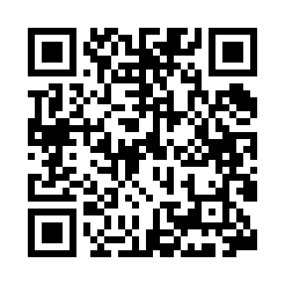
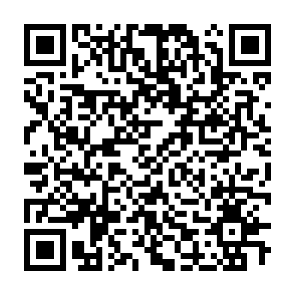

# 2000 个提示的大型 AI ChatGPT 书籍

> 原文：[The Big AI ChatGPT Book of 2000 Prompts](https://annas-archive.gl/md5/6c7c7928a9fed9a9988c306a7805d9c0)
> 
> 译者：[飞龙](https://github.com/wizardforcel)
> 
> 协议：[CC BY-NC-SA 4.0](https://creativecommons.org/licenses/by-nc-sa/4.0/)

### 使用 2000 个现成的提示解锁 AI 的无限潜能，适用于各行各业

## 加入我们的社区

## 加入 PJ Chavaux 书友会与读者社区！

感谢您选择这本书！如果您喜欢那些讲述真实生活、沟通和联系的故事，您并不孤单。我很乐意邀请您加入 PJ Chavaux 书友会——一个不断壮大的读者社区，我们在这里分享想法、留下评论，并提前获取新书发布。

无论您是想留下简短的评论、加入讨论还是想首先了解接下来会发生什么，这里就是您的去处。

👉 留下评论或加入俱乐部

👉 在 Facebook 上关注

📬 或者直接通过电子邮件联系作者 paul.chavaux@gmail.com

PJ Chavaux 书友会 [`tinyurl.com/pjchavaux`](https://tinyurl.com/pjchavaux)

Facebook 页面 [`tinyurl.com/fb-chatgpt-prompts`](https://tinyurl.com/fb-chatgpt-prompts)

网站 [`tinyurl.com/pjchavaux-2kprompts`](https://tinyurl.com/pjchavaux-2kprompts)

## 关于作者

PJ Chavaux 是一位经验丰富的作家、技术专家和终身学习者，他的旅程跨越了创新的边界和信仰的深层潮流。67 岁的 PJ 带来了一种罕见的学习和视角的混合，这源于他在软件工程、硬件集成和技术创新方面的近 40 年工作经验。他的职业生涯将他置于技术问题解决和以人为本的设计的十字路口，使他能够以与普通读者产生共鸣的方式观察和解释复杂系统。

PJ 以其八本已出版的书籍为名，他的作品反映了他的兴趣范围和洞察力的深度。在这些标题中，有两本书专门关注人工智能——不是为技术精英所写，而是为希望了解和负责任地参与他们周围由人工智能驱动的世界的普通消费者所写。作为人工智能的忠实学生，PJ 热衷于揭开技术的神秘面纱，弥合创新与可及性之间的差距，帮助读者感到赋权而不是感到不知所措。

他的学术背景和他的职业生涯一样多样化，包括软件工程、政治科学和教会管理的研究。这种独特的组合塑造了 PJ 从技术、社会和精神角度看待问题和解决方案的能力。2007 年，PJ 被任命为天主教执事，这个召唤继续以目的、谦卑和服务引导他的日常生活。

不论是撰写关于技术、信仰还是沟通的内容，PJ Chavaux 都不仅为读者提供信息，还给予鼓励。他的声音清晰、冷静，充满深思熟虑的反思——始终旨在提供信息、激发灵感和提升。随着每一本新书，他继续分享他在旅程中学到的知识，邀请读者成长、质疑并相信理性和信仰的力量。

您可以通过电子邮件联系他：paul.chavaux@gmail.com

## 另有 PJ Chavaux 的作品

+   [有影响力的女性：塑造今日美国的女性领导者](https://www.amazon.com/dp/B0DY5BBX49)

+   [领导力发展：来自今日最新领导者的领导力课程](https://www.amazon.com/dp/B0DYG1M8YK)

+   [适合所有人的 AI 手册：理解、使用和利用人工智能](https://www.amazon.com/dp/B0DXSH3Y4J)

+   [2000 个提示的大 AI ChatGPT 书籍](https://www.amazon.com/dp/B0DZD157NZ)

+   [适合所有人的幽默狗狗训练指南](https://www.amazon.com/Humorous-Guide-Dog-Training-Everyone-ebook/dp/B0DXDCTGN1/ref=sr_1_1?crid=2KIYTRI01S4VF&dib=eyJ2IjoiMSJ9.PmVxvzQcFSl3JikDE_YHhDe75lCB1lazFYIZmnbRCLQ6jUgN1JLM2JHkX8ynvEMjh8iwzQHXHdZpaA-9lE8v92VAovO5IsmKP3ufNdxF_o48DBsuzOOicjN7Ru9a5YM8x-5dMSN0zD_2hR0vbV2OftDeAY7o9QGnw6QCQJ-49exD9VKb_-GaKGMDUUXe9wEg_QWX-VqtClXAb4HrCf5bTg.JoRuE8c42fAelYwD3BwVgY6egHkEqkKkAYB5f_MCMrw&dib_tag=se&keywords=The+Humorous+Dog+Training+Guide+for+Everyone&qid=1742738918&s=books&sprefix=the+humorous+dog+training+guide+for+everyone%2Cstripbooks%2C80&sr=1-1)

+   [竞赛知识问答书籍（1950-1990）](https://www.amazon.com/dp/B0F1TYNGPX)

+   [竞赛知识问答书籍（1980-2025）](https://www.amazon.com/Competition-Trivia-Quiz-Book-Categories-ebook/dp/B0F28BPS9M)

+   [今天就可以停止饮酒！](https://www.amazon.com/dp/B0DWWD1XYD)

## 前言

本书分为两个部分，便于导航和即时使用。第一部分——《AI ChatGPT 提示参考书籍》提供了对 ChatGPT 的基础理解，突出了其在结构化响应、概述和问题解决方面的优势。如果您是 AI 辅助搜索的新手或想最大化 ChatGPT 的效率，本部分可作为快速指南。

对于只想寻找提示的人来说，请跳到第二本书——《2000 个 ChatGPT 提示，适用于各行各业》。在这里，您将找到涵盖日常任务、商业策略、创意头脑风暴等方面的分类提示。无需培训或教程——只需打开 ChatGPT，输入提示，即可获得即时、直观且井然有序的答案。

本书旨在提高效率和易用性，确保任何人——无论经验如何——都能立即有效地利用 ChatGPT 进行简单查询和复杂想法的发展。

## 前言

## 搜索的未来已到来

多年来，像 Google 和 Bing 这样的搜索引擎一直是网上查找信息的默认工具。无论是研究一个主题、解决问题，还是寻找逐步说明，这个过程通常涉及筛选多个网站、比较来源，并拼凑相关细节。虽然这种方法很强大，但往往耗时且效率低下。现在出现了 ChatGPT——在线搜索和信息检索领域的颠覆者。

与传统的搜索引擎不同，ChatGPT 提供直接、结构化和可操作的响应，无需用户导航无尽的链接或解读相互矛盾的信息。优势显而易见。与其打开多个标签手动提取见解，ChatGPT 以大纲格式呈现组织良好的答案，使快速扫描、理解和应用信息变得容易。

本书，《2000 个提示的大 AI ChatGPT 书》旨在帮助您充分利用 ChatGPT 的潜力，将其变成您的终极搜索伴侣。无论您需要复杂主题的快速总结、分步指南，还是新想法的头脑风暴会议，ChatGPT 可以在几秒钟内完成传统搜索引擎需要几分钟——甚至几小时才能完成的事情。

ChatGPT 最大的优势之一是结构化输出。当被提问时，ChatGPT 可以：

+   以易于遵循的格式提供详细的解释。

+   将复杂的思想分解为清晰、分级的大纲。

+   逻辑性地组织信息——这是搜索引擎零散结果的一个巨大优势。

+   为问题解决、决策和创造力生成可操作的步骤。

例如，想象一下在 Google 上搜索“如何开始创业”。你会找到各种文章、博客文章和视频——每个都需要额外的努力来提取和组织相关见解。在 ChatGPT 中提出同样的问题，你会立即收到全面、分步的路线图。无论是起草电子邮件、学习新技能、研究主题，还是解决日常挑战，ChatGPT 消除了猜测，简化了搜索过程。

本书包含数百个不同类别的提示，为您提供正确的问题，以便您能够解锁 AI 驱动搜索的全部功能。浏览无穷无尽的搜索结果的日子已经过去了——有了 ChatGPT，信息瞬间触手可及。

版权所有 © 2025 by PJ Chavaux

所有权利保留。

本书的任何部分未经出版商或作者书面许可，不得以任何形式复制，除非美国版权法允许。

## 第一部分：AI ChatGPT 提示参考书

### 概述

当我的 62 岁姐姐请求我帮助她找到在朋友家吃过的“那美味的柠檬蛋白饼”的食谱时，我知道我面临着一个挑战。由于她不太懂技术，我拿出智能手机并仔细地将她的请求输入到谷歌，结果被大量的结果淹没。感到沮丧并准备放弃时，我转向了我的新好朋友：ChatGPT。“嘿 ChatGPT，”我输入，“你能帮我找到一个简单易做的柠檬蛋白饼食谱，让我姐姐能做吗？”几秒钟内，AI 不仅提供了一份简单、一步步的食谱，还针对我奶奶的需求提出了成分替代和烘焙建议。这是一个启示——也是人类与 AI 之间美好友谊的开始。

在《2000 个提示的大 AI ChatGPT 书》中，我邀请您与我一同踏上探索 AI 在我们日常生活中变革力量的旅程。无论您是好奇的成年人、技术娴熟的资深人士，还是渴望学习的学子，这本书旨在帮助您轻松自信地穿梭于 AI 对话的精彩世界。

除了作为提升日常生产力、学习和创造力的指南之外，这本书还是求职者的不可或缺的工具。包含 2000 个提示，涵盖广泛的职业和行业，您可以使用 ChatGPT 来研究职业道路、改善面试准备、精炼简历，并为特定职位描述生成定制化的求职信。无论您是渴望成为企业家、寻求职业转换的资深专业人士，还是进入职场的应届毕业生，这本书都将帮助您利用 AI 为求职申请和职业发展创造高质量的定制化回应。

即使您找不到与您特定职业直接对齐的提示，您也可以使用这本书中的结构化示例来创建自己的。AI 是一个灵活的工具，通过稍微修改提供的提示，您可以生成针对特定工作的见解、技能提升计划和针对您需求的行业相关研究。

通过将这本书作为求职工具，您不仅能获得竞争优势，还能学习如何利用 AI 创造机会，这是传统求职方式所无法比拟的。无论您是在寻找职业指导、面试辅导，还是行业特定的提示，这本书都将帮助您开启 AI 驱动求职市场成功的力量。

与其他专注于理论或技术方面的 AI 提示书不同，“AI ChatGPT 提示书”完全关注现实世界的应用。我们将探讨 25 个基本的 ChatGPT、Ideogram 和 Midjourney 提示类别，这些提示可以帮助您应对日常任务，从撰写完美的电子邮件到规划下一次假期。到这本书结束时，您将手握一套强大的 AI 提示工具包，随时准备帮助您克服任何挑战。

当我们深入到每一章时，你会发现人工智能如何彻底改变你寻找信息和解决问题的方法。不再需要筛选无尽的谷歌搜索结果或迷失在无关信息的海洋中。通过本书中的提示，你将学会如何提出正确的问题，并快速高效地获得你需要的答案。

在我们的旅程中，我会分享自己作为一位热衷于帮助他人探索人工智能世界的个人经验和见解。凭借[你的相关专业知识]的背景，我亲眼见证了人工智能如何改变人们的生活，让不可能成为可能。我的目标是提供清晰、易于遵循的指导，无论你的年龄或技术专长如何，都能让你在人工智能对话中达到精通。

阅读本书时，你将获得的不仅仅是提示集合。你将更深入地理解人工智能增强个人和职业生活的潜力。你将学会如何利用人工智能来提升你的创造力，简化你的日常任务，并以你从未想过的方式扩展你的知识。

所以，无论你是想要保持领先于潮流的千禧一代，还是渴望拥抱新技术的资深人士，或者是一个想要在学业上出类拔萃的学生，“人工智能 ChatGPT 提示书”都是你解锁人工智能对话全部潜能的指南。准备好开始一段充满欢笑、学习和探索乐趣的冒险之旅吧。

让我们一起深入探索人工智能这个令人难以置信的世界吧！

第一章

## 人工智能与 ChatGPT 简介

有一天，当我试图向对科技避之不及的叔叔解释人工智能时，他打断了我，问了一个问题：“所以，这个人工智能东西就像养了一只非常聪明的会说话的鹦鹉，还是我只是在喂一个将要接管我的烤面包机的机器人？”我笑了，不仅因为问题的荒谬，也因为这个问题完美地捕捉了围绕人工智能的困惑和好奇。不是每天都会遇到认为自己的面包可能面临厨房电器恶意接管的人。这个幽默的交流让我开始思考人工智能被误解的频率，以及它如何成为日常生活的重要组成部分——这正是我们将在本章中探讨的内容。

## 揭秘人工智能：一本易于理解的指南

人工智能，或 AI，不是幕布后面某个神秘巫师。从本质上讲，AI 是一个能够执行通常需要人类智能的任务的系统，比如识别语音、做决策，甚至下棋。将 AI 视为数字世界的瑞士军刀，它能够学习和适应，就像你最喜欢的应用程序似乎总能准确地知道你接下来想看什么。与静态工具不同，AI 随着时间的推移而发展，提高其协助各种任务的能力，从平凡到复杂。它就像有一个从不睡觉、从不抱怨咖啡休息时间、也不需要休息日的个人助理。

在现实生活中，人工智能无处不在。它是你手机上的语音助手，提醒你牙医预约，或者是那个建议你在 Netflix 上观看新系列算法。这些都是窄人工智能的例子——为特定任务而设计。然后是通用人工智能，这主要还是理论上的，旨在在广泛的活动中复制人类的认知能力。但不用担心，你的烤面包机还是安全的；我们还没有达到厨房电器开始策划世界征服的境地。

人工智能的旅程始于 20 世纪中叶，当时像艾伦·图灵这样的先驱开始思考能够思考的机器。那时，人们认为未来将包括飞行汽车和机器人管家。1956 年的达特茅斯会议通常被认为是人工智能作为一个领域的诞生，引入了这个术语，并引发了一波研究热潮。早期的发展包括像 ELIZA 这样的项目，这是第一个聊天机器人，坦白说，它并不是一个很好的对话者，还有 Shakey 机器人，它在 60 年代的机器人圈子里基本上是摇滚明星。快进到 80 年代，你会遇到美国人工智能协会，它为持续的人工智能研究奠定了基础。尽管经历了一些挫折，比如“人工智能寒冬”，这与其说是一个雪景仙境，不如说是一个令人失望的寒冷时期，但人工智能已经取得了显著的发展。

今天，人工智能可以做些让图灵感到自豪的事情——比如在 1997 年，IBM 的 Deep Blue 击败了人类在国际象棋上的比赛，或者为 Siri 和 Alexa 这样的虚拟助手提供动力，帮助我们完成日常任务。然而，人工智能并非完美无缺或全能。它有局限性，有时会犯下令人捧腹的错误。例如，人工智能可能会在上下文中遇到困难，或者根据其训练数据表现出偏见。随着我们在科技进步和社会影响之间寻找微妙的平衡，道德考量继续是一个重大的关注点。

人们普遍担心人工智能可能会取代人类的工作。但更准确地说，它应该被视为你能力的延伸，而不是替代品。人工智能可以自动化重复性任务，使人类能够专注于更具创造性和复杂性的挑战。尽管人工智能系统可以以光速处理信息，但它们缺乏意识和自主性。它们更像是受过良好训练的狗——在捡球方面非常出色，但在决定是捡你的拖鞋还是邻居的吉娃娃方面就不那么出色了。

现在，让我们来消除一些误解。人工智能并不是要针对你，它也没有策划推翻人类的意图。它是一个工具——一个强大的工具，但毕竟还是一个工具。它没有欲望或意图。它不会梦想着电动羊，甚至不会梦想着形状像羊的烤面包机。尽管人工智能可能看起来像是魔法，但请记住，它是人类驱动的——我们的创造力、我们的好奇心，有时甚至是我们的判断错误。随着我们在这本书中的旅程，你将发现人工智能如何成为你日常生活中宝贵的盟友，将复杂问题转化为可管理的任务，将日常琐事自动化。

## ChatGPT 解释：背后的智能大脑

想象一下，你有一个永远不会疲倦的对话伙伴，总是倾听，不会评判你可疑的奶酪偏好。这就是 ChatGPT，由 OpenAI 开发的对话大师，旨在将类似人类的互动魔法带给你的数字设备。最初，ChatGPT 是作为创建一个能够理解和生成文本的模型的一部分而构思的，但它已经成为人工智能工具包中的必备工具。它就像有一个朋友，他读过每一本书，看过每一部电影，但仍然让你说大部分的话。OpenAI 是这个项目的幕后大脑，在人工智能研究中发挥了关键作用，推动了我们对机器理解能力的认知边界。基于透明度和道德人工智能发展的原则，OpenAI 利用像变压器模型和自然语言处理这样的尖端技术打造了 ChatGPT。这些术语听起来很复杂，但可以想象成是 ChatGPT 模仿人类对话细微差别的秘密调料——没有尴尬的沉默。

那么，ChatGPT 究竟是如何施展其魔法的呢？想象一下：你输入一个问题或评论，通过技术的奇妙，ChatGPT 处理你的输入，解释它，然后构建一个听起来像是来自一个知识渊博的人类者的回应。它不是通灵者；它只是非常擅长根据它所学习到的模式猜测接下来会发生什么。ChatGPT 使用一种称为输入和输出机制的方法。它分解你的文本，分析其含义，然后预测最可能的回应。这个过程在一瞬间就完成了，使得 ChatGPT 成为从客户服务到个人助理等各个领域的多功能工具。需要帮助起草一封礼貌的电子邮件给你的老板，或者为生日礼物想出点子？ChatGPT 随时准备讨论这一切。

然而，就像任何优秀的对话者一样，ChatGPT 也有其怪癖和局限性。它有时会过于热情，提供的答案比准确性更高。这种响应中的偏见有点像那个坚持认为他们知道城里最好的餐厅的朋友，结果却把你带到了一个菜单上写的是无人能懂的语言的地方。OpenAI 意识到了这些小插曲，并不断努力改进模型，确保它变得更加可靠和公平。另一个挑战在于在长时间对话中保持上下文。虽然 ChatGPT 在简短交流中表现出色，但它有时难以跟踪长时间的对话，就像你在对话中忘记你把钥匙放在哪里一样。

展望未来，ChatGPT 进化的潜力是巨大的。想象一下这样一个世界，ChatGPT 能够无缝集成到智能家居设备中，创造一个在你意识到之前就能预知你需求的生态系统。或者考虑将 ChatGPT 与虚拟现实结合的可能性，创造沉浸式的体验，在那里对话就像在现实世界中一样自然。持续学习是另一个令人兴奋的途径。通过反馈和互动，ChatGPT 可以改进其响应，每次交流都变得更加直观。未来为这种对话式人工智能提供了无限的机会，承诺让我们的生活更加轻松、高效，甚至可能更加有趣。

随着我们结束对 ChatGPT 的探索，请记住，虽然它是一项技术奇迹，但它也是人类创造力的证明。它反映了我们沟通、理解和弥合技术与日常生活之间差距的愿望。无论你是用 ChatGPT 来管理你的日历，还是就你最喜欢的科幻系列进行机智的闲聊，它都在那里，旨在增强你的数字互动。因此，拥抱这些可能性，享受 ChatGPT 不断进化、适应和重新定义与机器对话意义的旅程吧。

第二章

## 构建动态的 ChatGPT 提示

想象一下：你正在当地的咖啡馆，试图点一杯简单的拿铁。然而，不知何故，每次你提出请求，咖啡师都会给你一杯三倍浓缩的意式浓缩咖啡，旁边还附带着困惑。朋友们，这就是当你没有正确构建你的提示时会发生的事情。欢迎来到提示工程的艺术，在这里，点你的 AI 拿铁意味着得到你要求的一切，没有咖啡因的紧张。在人工智能的世界里，构建完美的提示就像给你的 GPS 设定目的地一样。没有它，你可能会迷失在某个地方，或者更糟糕的是，未经宣布就出现在岳父岳母家。但别担心，因为这一章节就是你的提示成功路线图。

提示工程基本上是创建那些引导 AI 系统如 ChatGPT 执行动作或生成内容的魔法词的过程。把它想象成让你进入 AI 洞察力和效率俱乐部的秘密握手。这是至关重要的，因为没有它，你将只剩下一个几乎和系着绳子的猫一样无用的数字助手。提示充当 AI 输出的引导之光，指导它关注特定的细节和细微差别。具体性在这里是关键；一个模糊的提示就像要求你的朋友去拿“一些食物”，结果却得到了一罐腌黄瓜和一条面包。通过制作定义明确的提示，你确保 AI 的回复既相关又有价值。

## 编写有效提示的步骤

1.  确保清晰度 - 使用精确的语言，避免不必要的冗余。清晰的沟通可以减少收到模糊或不相关回复的可能性。

1.  提供背景信息 - 给予足够的背景信息以引导 AI。你提供的信息越多，回复就越相关和有用。

1.  明确你的意图 - 清楚地说明你想要实现的目标。定义你的目标有助于 AI 保持专注，并提供准确和有针对性的回复。

通过遵循这些步骤，你可以构建出能够产生高质量 AI 生成答案的提示，节省时间并提高结果的相关性。🚀

精炼提示与艺术和科学一样重要，迭代是你的可靠工具。不要害怕尝试不同版本的提示，看看哪个能产生最佳结果。这有点像尝试找到完美的披萨配料组合——有时需要几次尝试才能做到恰到好处。反馈也极其宝贵。通过分析 AI 的回复，你可以调整你的提示以使其更有效。这就像与一个不断根据你的反应不断改进的人交谈。随着时间的推移，你将培养出制作能够引导深入、准确 AI 交互的提示的技巧。

为了说明，考虑一个客户服务场景：“生成一个对客户关于迟到交付的投诉的礼貌回复。”在这里，你对任务很清楚，提供了背景（投诉），并指明了意图（礼貌的回复）。或者考虑一个教育环境：“为高中项目提供气候变化原因和影响的总结。”这个提示设定了明确的期望，概述了必要的背景，并定义了预期的结果，确保 AI 为学生们提供一个连贯、有用的总结。这些例子展示了精心制作的提示如何显著提高 AI 生成答案的质量。

### 互动元素：亲自尝试

制作你的提示！想想你日常生活中 AI 可以提供帮助的场景。写一个包含清晰性、背景和意图的提示。例如，“解释如何使用我的智能手机在下周二安排与三位同事的会议。”记住，这是你实验和改进以达到预期结果的机会。试一试，你可能会发现你内心的提示工程大师。

从本质上讲，提示工程是关于与 AI 有效沟通。通过磨练这些技能，你将解锁 AI 为你工作的潜力，使其既富有生产力又充满乐趣。无论你是希望简化工作任务的成年人，渴望探索新爱好的高级人士，需要家庭作业帮助的学生，还是正在学术世界中探索的高中生，掌握提示工程是你的门票，进入一个 AI 不仅理解你，还能预测你的需求，使每一次数字互动都变得轻松的世界。所以，卷起袖子，开始制作那些提示吧。你的数字助手正在等待它的下一个命令，也许那个完美的拿铁订单就在一个提示之外。

## 为不同受众定制提示

想象一下试图向你的宠物金鱼解释人工智能的概念。现在，除非你是水生世界的爱因斯坦，否则很可能会被困惑的气泡所困。同样，在为 AI 制作提示时，关键是要根据受众的具体需求和理解水平来定制。把它想象成一次烹饪体验——有些人喜欢他们的汤辣一些，而有些人则更喜欢清淡。了解你的受众是确保你的提示既易于理解又有效的第一步。这涉及到一点受众分析，你本质上是在扮演侦探，以确定你是在对谁说话。他们是经验丰富的专业人士，好奇的学生，还是一群希望拥抱技术的老年人？每个群体都有自己的特点和偏好，承认这些有助于制作出引起共鸣的提示。关键是使提示相关且引人入胜，确保它们以有意义的方式与受众建立联系。毕竟，一个没有击中要点的提示就像一个巧克力茶壶一样无用。

现在，当谈到语言和复杂性时，并非所有情况都适用同一标准。编写提示就像写一部小说，每一章都针对不同的读者。对于老年人来说，简洁至上。想象一下，你正在向你的祖母解释电子邮件。你可能会避免使用技术术语，而是选择直接步骤，比如，“打开你的电脑，点击信封图标，然后输入你的信息。”目标是让技术感觉更像是一个友好的邻居来喝茶，而不是一门外语。然而，对于学生来说，你可能会想在其中加入一些乐趣。想象一下：不是用枯燥的科学术语描述光合作用，而是将其描绘成一个生动的故事，讲述植物如何成为自己的厨师，从阳光和空气中制作能量小吃。这一切都是为了激发好奇心，让学习成为一种冒险。

世界是一幅由文化和背景构成的地毯，你的提示应该像美食节一样多样化。文化和背景的敏感性涉及认识到，在一个环境中有效的东西可能在另一个环境中失败。避免假设是关键。仅仅因为一个提示在一个文化背景中有效，并不意味着它可以在其他地方无缝转换。这就像假设每个人都喜欢在披萨上放菠萝——一个可能会引发烹饪暴乱的假设。相反，以开放的心态对待提示，避免刻板印象，考虑可能影响解释的文化细微差别。

让我们深入一些案例研究，看看这些原则如何在现实生活中发挥作用。想象一下，你正在为商业专业人士编写一个提示。你可能会说，“为季度销售报告草拟一份简洁的执行摘要。”在这里，提示清晰具体，直接针对专业环境，侧重于简洁和清晰。另一方面，对于技术爱好者，你可能会选择类似这样的提示，“概述使用人工智能设置家庭自动化系统的过程。”这个提示触及了他们的好奇心和技术兴趣，鼓励探索和与技术的互动。这些例子说明了定制提示如何导致更相关和吸引人的结果，从而提高人工智能交互的整体有效性。

在更大的背景下，定制提示是关于满足人们的需求。这是在技术和人类经验之间建立桥梁，确保与人工智能的交互不仅有效，而且丰富。通过了解你的受众，调整语言和复杂性，以及保持文化敏感性，你可以编写出能够触及每个受众独特之处的提示。随着你磨练这些技能，你会发现编写提示与其说是指挥人工智能，不如说是在进行一场对话，每个人都能满意地离开餐桌，无论是专业人士、学生，还是第一次在数字世界中导航的人。

在掌握了制作有效和定制提示的新技能后，你准备好探索 AI 如何应用于生活的不同方面。从简化日常生活到提升教育，可能性是无限的。请继续关注，我们将深入探讨令人兴奋的日常 AI 应用世界，在那里你的提示将成为创新和发现的强大工具。

第三章

## 每日 AI 应用

想象一下：这是周一的早晨，你因为闹钟决定和你设定的“再睡五分钟”按钮玩捉迷藏而已经迟到。当你匆忙寻找钥匙时，你听到手机响起。是你的 AI 助手，温柔地提醒你，如果你不想在通勤中变成一个人类压力球，你只有五分钟的时间离开。在那个瞬间，你想，“感谢科技。”朋友们，这就是 AI 在我们日常生活中的变革魔法。它就像有一个总是准时、从不休息、不会评判你选择不搭调袜子搭配的个人助理。

## 用于简化日常生活的 AI

让我们从时间管理开始——这是一项常常感觉像在骑独轮车上同时玩着火焰剑的任务。AI 工具通过将你的日历变成一台运转良好的机器来拯救你。智能日历是生产力的隐形英雄，根据可用性自动安排会议，确保你的日子比涂了油的闪电还要顺畅。这些由 AI 驱动的应用程序不仅止于安排；它们预测交通延误，建议会议地点，甚至提醒你带上你的幸运笔。任务提醒也是一项救命稻草，以优雅的方式提醒你关于重要截止日期和预约，就像你的数字伙伴适时地轻轻一推。

当谈到个人财务管理时，AI 就像拥有一个不按小时收费的财务顾问。预算应用程序分析你的消费模式，并建议储蓄计划，确保你不会意外地在一次即兴的羊驼农场投资中花光预算。它们跟踪每一美元，提醒你，是的，今天的第四杯咖啡仍然是一种奢侈，而不是必需品。对于那些想要进入投资世界的人来说，AI 平台提供定制建议，感觉就像有你的华尔街大师在你耳边低语秘密。它们擅长预测财务决策，并引导你穿越股票、债券以及其他那些金融巫师所施展的迷宫。

人工智能也为健康和福祉提供了助力，使你更容易从沙发土豆状态转变为更像胡萝卜的状态。健身追踪器是你从未意识到需要的可穿戴啦啦队队长。它们监控身体活动，建议锻炼计划，甚至跟踪睡眠模式，这样你就可以最终解开为什么你醒来感觉像在梦中与龙战斗的谜团。个性化的餐单消除了营养方面的猜测。这些基于人工智能的应用程序考虑饮食偏好，并制作出既健康又美味的餐点建议，证明你不必在甘蓝和幸福之间做出选择。

对于那些喜欢保持信息更新而不想陷入每日新闻洪流的人来说，人工智能是你的后盾。新闻聚合器根据你的兴趣从各种来源收集故事，提供比你最喜欢的牛仔裤还要定制的个性化新闻源。无论你对政治、流行文化还是企鹅纪录片感兴趣，都有人工智能服务为你定制内容。而对于我们中的播客爱好者，人工智能驱动的平台会根据你的收听习惯推荐节目，确保你的下一个最喜欢的播客只需点击即可获得。

### 交互元素：亲自尝试

创建你的 AI 增强日程计划：花点时间思考人工智能如何帮助你简化日常例行公事。列出你希望变得更容易的任务，比如购物或锻炼计划，并考虑人工智能工具如何提供帮助。例如，“使用一个由人工智能驱动的应用程序，根据我的能量水平和课程可用性来安排我的锻炼。”这个练习将帮助你想象将人工智能整合到日常生活中带来的实际好处。

因此，无论你是管理时间、财务、健康，还是仅仅想要跟上最新的企鹅新闻，人工智能都在这里帮助你。它就像拥有一个永远不会请假的数字助手，始终支持你，也许正是将你日常的混乱转变为效率交响曲的秘密。有了人工智能的帮助，你可以自信地应对日常事务，从而有更多时间去做真正重要的事情——比如最终掌握完美煎饼翻动的艺术。

## 人工智能驱动的家庭任务解决方案

想象一下：经过漫长的一天，你走进家门，不再是摸索着开关灯，或是被猫绊倒，你的家就像一个未来派的管家一样迎接你。灯光会根据你的心情调整，恒温器自动设定到那个完美的金发碧眼温度——既不太热，也不太冷——而你最喜欢的播放列表则在背景中轻轻播放。这不是科幻电影的场景；这是人工智能将我们的家转变为智能环境的魔法，让生活不仅变得简单，而且直接令人愉悦。这种变革的核心是语音激活助手，如亚马逊 Echo 和谷歌 Home，它们已经变得像瑞士军刀一样必不可少。这些小玩意儿不仅播放你最喜欢的音乐；它们是你整个家的指挥中心。无论你是询问天气，为那些你“绝对不可能一次性吃完”的饼干设定定时器，还是控制你的智能设备，这些助手都让一切感觉像微风一样轻松。这就像有一个住在扬声器里的精灵，但没有三个愿望的限制。

但是等等，还有更多！智能恒温器在这里确保你的家气候始终恰到好处，既节省能源，又避免了视频通话中出汗的尴尬时刻。通过学习你的日程和温度偏好，这些人工智能驱动的恒温器会自动调整设置，确保你舒适的同时，将能源账单保持在尽可能低的水平。这就像拥有你自己的个人气候经理，他从不休假，也不要求加薪。

家庭安全也得到了高科技的改造，人工智能作为你的警惕看门人介入其中。人工智能驱动的监控系统是现代家庭的守护者，提供对异常活动的实时警报，确保你安心。这些系统不仅仅是被动地坐着；它们积极地学习你家里的正常情况，并提醒你任何不寻常的事情，无论是潜在的入侵者，还是特别顽皮的浣熊。与它们相伴的是自动锁，增加了额外的安全层，消除了钥匙喜欢藏在最不方便的地方的需要。有了人工智能智能锁，你可以通过简单的手机点击，甚至语音命令，来确保你的城堡安全无虞，无需中世纪的吊桥。

现在，让我们来谈谈清洁——这往往是任何家庭中最不受欢迎的家务活。人工智能增强的清洁解决方案，是家庭幸福的默默英雄。像微型 Roomba 战士一样的机器人吸尘器，以军事行动的精确度巡逻你的地板。它们绘制出你的家，确保每个角落和缝隙都无尘螨，让你有更多时间享受生活中更美好的事物，比如狂热地观看你最喜欢的电视剧。至于窗户清洁机器人？它们处理那些难以触及的地方，确保你的窗户如此干净，以至于鸟儿可能会误以为它们是开放的邀请。这些设备不知疲倦地工作，所以你不必这样做，从而改变了我们维护家庭的方式。

即使家庭维护和改善也加入了人工智能革命。预测性维护应用程序现在监控你的家庭系统，以预测在出现故障之前进行维修。想象一下，在你热水器实际上要放弃之前就知道它即将这样做，这样你就可以避免冷淋浴的惊喜。这种主动方法意味着更少的紧急情况，并且对家庭维护有更多的控制。对于 DIY 爱好者来说，人工智能驱动的应用程序提供了家庭改善项目的指导。无论你是安装一个新的架子，还是尝试全面翻新，这些应用程序都提供逐步协助，将最犹豫不决的 DIY 者变成自信的创造者。它们就像有一个知识渊博的朋友随时待命，随时准备在敲锤子时提供建议和鼓励。

随着人工智能继续编织进我们家庭的纹理，它带来了便利、效率和安全的承诺。我们的家正在变得更智能、更灵敏，在许多方面更像人类。通过自动化日常任务和提供智能解决方案，人工智能让我们能够专注于真正重要的事情——无论是与亲人共度时光，追求激情，还是简单地在家中享受一段放松的时光，这个家几乎可以自己照顾自己。随着我们向前迈进，技术和家庭生活之间的界限将越来越模糊，导致我们的家能够像我们适应它们一样无缝地适应我们。

随着日常任务变得越来越自动化，很容易看出人工智能正在重塑我们的生活方式。这里讨论的解决方案使家庭管理变得轻而易举，让我们能够重新获得时间和精力。随着我们结束这一章，请记住人工智能也有潜力改变生活的其他领域。接下来，我们将探讨人工智能在教育领域掀起的风潮，为所有年龄段的学生提供新的工具和方法，以增强学习体验。

第四章

## 教育中的 AI

记得那些日子，你坐在教室里，茫然地看着黑板上满是方程式的粉笔字，它们看起来更像古老的象形文字，而不是任何类似数学的东西吗？别担心，因为 AI 已经到来，准备拯救学生免受可怕的作业绝望深渊！想象一下 ChatGPT 是你的忠实伙伴，随时准备飞来帮助你轻松地穿梭于学术丛林。它就像口袋里的一位巫师，没有尖帽子也没有神秘的药水。ChatGPT 可以成为你解答作业疑问、提供实时问答支持和让复杂科目变得像你最喜欢的情景喜剧重播一样易于接近的必备资源。

想象一下，你正在解决一个让你的大脑感觉像在没有安全网的情况下做体操的数学问题。这时，ChatGPT 出现了，它是数学导师的数字化身，拥有无尽的耐心和零评判。你输入你的问题，然后，哇！ChatGPT 会一步步地分解问题，像一位经验丰富的导游在数字之国中引导你。从代数方程到微积分难题，ChatGPT 都在那里确保你不会陷入数学迷宫。如果你更擅长文字而不是数字，别担心！ChatGPT 同样擅长协助语言练习。无论是动词变位还是扩展词汇量，ChatGPT 都能将学习变成一场有趣的对话，让语言学习感觉更像是一次友好的咖啡聊天，而不是一项任务。

但这还不止于此。与 ChatGPT 互动可以加深你对复杂主题的理解，通过互动对话。以科学为例，牛顿定律可能看起来像是一个谜团，但有了 ChatGPT，它们变得像白天一样清晰。想象一下向 ChatGPT 解释重力的概念，突然间，你就在一个虚拟教室里，苹果从树上落下，行星在宇宙中导航，这一切都在简单的对话中发生。或者，也许你正在深入历史，探索久远的时代。ChatGPT 提供了对历史背景的见解，提供了一个让过去生动起来的叙述。它就像在你的指尖上有一个时光机，没有悖论和可疑的时尚选择。

对于那些开始进行研究和项目工作的学生来说，ChatGPT 是你的学术盟友。当你头脑风暴项目想法时，它作为创造力的催化剂，帮助你探索不同的角度并收集初步资源。它就像与一群学者进行头脑风暴会议，但没有为最后一个甜甜圈争吵。至于结构化论文，ChatGPT 提供关于创建提纲和论文陈述的指导，确保你的想法像一场精心编排的交响乐一样流畅。它是你未曾意识到的写作伙伴，随时准备帮助你创作杰作。

ChatGPT 在培养批判性思维和解决问题的技能中也发挥着关键作用。通过模拟现实世界场景，它鼓励你以创新和批判性的方式来解决问题。想象一下，你正在分析一个关于环境可持续性的案例研究。ChatGPT 扮演着你的导师角色，引导你通过评估数据、制定假设和提出解决方案的过程。这就像身边有一位经验丰富的侦探，帮助你解开世界的奥秘。至于辩论准备，ChatGPT 是你的对手。它提供反论点，帮助你预见到对立观点并完善你的立场。它就像一位友好的辩论教练，推动你磨砺论点，随机应变。

### 互动元素：亲自尝试

辩论挑战：选择一个你热衷的话题，比如可再生能源或教育改革。使用 ChatGPT 生成可能的反论点并练习你的回应。这个练习将增强你的批判性思维技能，并为你准备任何辩论做好准备，无论是在课堂上还是在餐桌旁。

在教育不断发展的世界中，ChatGPT 为学习的未来提供了一个窗口。它赋予学生控制自己教育的能力，将令人畏惧的任务转变为成长和探索的机会。所以，无论你是正在学术殿堂中导航的学生，是一位终身学习者，正在接受新的挑战，还是一位渴望探索的好奇心驱使的头脑，让 ChatGPT 成为你的向导。一起，你们将踏上发现之旅，每个问题都引导到新的见解，每个挑战都变成了一场冒险。

## 课堂中的 AI：互动式学习

想象一下，你走进一个教室，感觉更像是踏入了一个未来奇境。这里没有通常的桌椅排列和教师在前面讲课，而是充满了活力的空间，学生们全神贯注于他们的学习。得益于 AI，传统的教室正在转变为互动中心，促进积极参与和投入，使学习变得像你最喜欢的小说中的情节转折一样激动人心。这一变革的明星之一是 AI 驱动的测验，它们根据每个学生的表现进行调整。这些测验就像评估中的“金发女孩”——既不太难，也不太简单，恰到好处。它们根据你的表现调整难度，提供个性化的挑战，让你始终保持警惕。这就像有一位知道何时你准备好迈出更大步伐或需要更多练习的个人导师。至于虚拟现实体验，AI 将学习提升到了一个全新的维度——字面意义上的。想象一下戴上 VR 头盔，开始一次虚拟的罗马古城或深海探险之旅。有了 AI 增强这些模块，学习变成了一场沉浸式的冒险，历史和科学在你眼前栩栩如生。

人工智能不仅使学习更加互动，还能根据学生的多样化需求个性化教育。你知道有些人喜欢视觉学习，而有些人则喜欢听觉或动觉学习吗？人工智能工具可以识别你的学习风格，并相应地调整教育内容。这就像拥有一个知道你如何最好学习的老师，无论是通过图表、讨论还是动手活动。这种定制化确保了每个人都能公平地获得理解材料的机会，无论他们的首选学习风格如何。进度跟踪是人工智能的另一个功能，就像拥有一个个人生活教练，帮助你保持进度。人工智能监控你的进度，提供个性化的反馈，突出你的优势和需要改进的领域。这并不是指出错误，而是帮助你成长，就像一个友好的推动你走向正确方向。

在这个由人工智能增强的教室的新世界中，师生互动变得更加高效和有意义。教师可以专注于他们最擅长的事情——教学，而人工智能则处理日常任务。以点名为例。自动化的点名系统简化了流程，确保没有人因为教师不得不扮演侦探而遗漏。这就像拥有一个不需要休息时间的课堂助手。实时反馈是另一个变革者，允许教师为学生作业提供即时见解。这种即时反应有助于在问题恶化之前解决它们，确保学生不会陷入与尝试组装无说明书的平板家具相媲美的混乱状态。

人工智能也为创新课程设计和实施打开了大门。教育工作者现在可以制定将技术与现实世界应用相结合的课程计划，使学习变得相关且引人入胜。借助人工智能的互动课程计划，融入多媒体资源以适应不同的学习风格，并保持学生的参与度。想象一下，将一个简单的幻灯片演示变成一个连好莱坞导演都会为之自豪的多媒体盛宴。学习的游戏化是人工智能真正发光的地方，将课程转变为互动游戏，激发并吸引学生。想象一下，将解决数学问题作为拯救虚拟世界的一部分的探险，或者通过扮演侦探解决历史谜题来学习历史。借助人工智能促进这些基于游戏的学习体验，教育变得既有趣又有效，培养出终身热爱学习的心态。

随着本章的结束，显而易见的是人工智能正在改变教育，将教室转变为满足多样化需求并激发学习热情的动态学习环境。从个性化教育到创新课程设计，人工智能正在重塑我们学习和教学的方式。但这仅仅是一个开始。在下一章中，我们将探讨人工智能如何帮助学生和专业人士在职业发展中取得进步，开辟新的成功机会和途径。因此，准备好迎接下一章的激动人心的内容，我们将深入探讨人工智能和职业成长的世界，了解技术是如何帮助人们实现梦想的。

第五章

## 人工智能与职业发展

我们都经历过这样的时刻：刷新我们的邮箱，等待那封难以捉摸的“恭喜你，你被录用了！”的电子邮件，结果发现自己陷入了求职申请的泥潭。就业市场感觉像是一个迷宫，出口始终在移动，每个转弯都会带来另一个死胡同。但不要害怕，因为人工智能正在将你的求职过程转变为一场战略杰作，而不是一场永无止境的专业藏猫猫游戏。

## 利用人工智能进行求职申请

在求职的宇宙舞蹈中，你的简历是明星表演者，而人工智能工具则是编舞者。它们帮助你让简历以芭蕾舞女主角的优雅脱颖而出，而不是像中学的科学项目那样显得笨拙。像 Teal 和 Enhancv 这样的 AI 简历构建器就像为你的简历配备了一位个人造型师，建议在格式和内容上的改进，让招聘经理们不禁多看几眼。无论是让你的布局焕然一新，还是确保你的成就比迪斯科球更加耀眼，这些工具都是你的首选。对于那些把关键词看作是外语的人来说，AI 作为你的忠实翻译者介入，优化你的简历以吸引申请跟踪系统（ATS）。通过识别行业特定的热门词汇，AI 确保你的简历不会最终落入数字回收站。例如，Resume Worded 利用 LinkedIn 个人资料来评分和优化你的简历，确保你能够说出每一条你遇到的职位描述的语言。

当涉及到求职时，AI 可以在就业选择的暴风雨海洋中成为您的指南针，比您说出“职业转变”更快地引导您找到完美的匹配。像 Talentprise 这样的 AI 平台使用强大的算法根据技能和偏好将候选人与职位空缺相匹配，使这个过程感觉像是一个真正有效的约会应用。这些平台就像拥有一个比您更了解您的职业顾问，建议与您的职业抱负和个人特点相符的角色。同时，自动化的职位警报就像您的个人助理，每当您选择的领域出现新的机会时，都会轻拍您的肩膀。通过设置 AI 通知，您将不再错过任何职位发布，确保您的梦想工作不会在您忙于完善您的酸面包时从指缝中溜走。

面试准备可能像在众人面前尝试平行停车一样令人紧张。但有了 AI 工具，您可以将其转变为增强信心的练习。虚拟面试教练如 Interview Warmup 会提供从肢体语言到回答那些令人畏惧的“请告诉我关于你自己”问题的实时反馈。这些 AI 应用就像拥有一个个人表演教练，帮助您完善表现，直到您准备好走上舞台的中心。如果您正在寻找一场完整的彩排，AI 驱动的模拟面试会模拟常见问题并评估您的回答，确保您为未来雇主可能抛出的任何意外情况做好准备。使用 Interviewsby.ai 等工具，您可以练习您的回答并立即获得反馈，将最令人生畏的面试变成一场轻松的散步。

在网络领域，AI 就像一个精明的红娘，帮助您以优雅的方式扩大您的专业圈子。通过智能网络建议，AI 工具分析您的个人资料并建议可能成为有价值联系人的相关联系人。这就像在口袋里有一个社交蝴蝶，低声向潜在的导师和合作伙伴介绍。在联系方面，AI 是您的塞壬德·贝热拉克，制作个性化的信息，让您在人群中脱颖而出。例如，GPT Google Sheets 插件可以大规模生成个性化的网络信息，确保每一次接触都感觉像手写的便条一样真诚。

### 互动元素：AI 驱动的网络清单

1.  个人资料优化：利用 AI 精炼您的 LinkedIn 个人资料，突出关键技能和成就。

1.  目标接触：利用 AI 辅助识别潜在联系人并定制个性化信息。

1.  跟进策略：使用 AI 工具设置提醒，跟进新联系人并维持关系。

1.  参与度跟踪：监控互动和反馈，以优化您的网络策略。

人工智能不仅仅是一个工具；在追求职业发展的过程中，它是一个颠覆者。从制作完美的简历到通过面试和拓展人脉，人工智能是你在这个专业世界中的忠实伙伴。所以，做好准备，拥抱人工智能的帮助，看着你的职业抱负从梦想变为现实。

## ChatGPT 提升工作效率

想象一下，你的收件箱不再像混乱的丛林，你的日历也不再像无法解决的谜题。进入 ChatGPT，这个数字助手可以将最杂乱无章的工作日变成生产力的交响曲。我们谈论的是自动化那些让人失去工作日美好时光的繁琐任务。想象一下：你正全神贯注于一个需要你全部注意力的项目，但需要安排一个会议。你不必与同事玩电子邮件乒乓游戏来找到一个合适的时间，你只需对 ChatGPT 轻声说——当然，是比喻意义上的——它会协调整个事件。这就像拥有一个真正会倾听、发送日历邀请且不需要休息时间的个人助理。

现在，让我们来应对那个被称为你的电子邮件收件箱的日益增长的怪物。整理电子邮件的感觉就像是在干草堆里找针，而这根针是你的老板发来的重要信息。ChatGPT 像超级英雄一样飞来，根据紧急程度草拟回复并优先处理电子邮件。它明白哪些电子邮件需要立即关注，哪些可以等到你喝完第三杯咖啡后再处理。这种人工智能的魔法意味着你可以专注于有意义的任务，而 ChatGPT 则负责处理日常琐事。这就像拥有一个知道垃圾邮件和赚钱机会区别的电子邮件管家。

但 ChatGPT 的才能不仅限于组织。它还在团队协作领域架起了一座桥梁。在我们全球化的世界中，语言障碍就像是一场错误的电话游戏。进入 ChatGPT，这个实时翻译器确保每个人都在同一页上，即使那页是在不同的语言中。无论你是在东京还是廷巴克图与团队一起工作，ChatGPT 都能像经验丰富的外交官一样翻译信息，确保沟通流畅。会议结束后，ChatGPT 可以生成简洁的总结，以法庭速记员的精确度捕捉关键点和行动项目，而不需要敲击键盘。

在决策领域，ChatGPT 是您从未意识到需要的副驾驶。数据可能令人难以承受，就像试图从消防水龙头喝水一样，但有了 ChatGPT，解读复杂的数据集变得像吃馅饼一样简单。ChatGPT 分析数字，提取见解，并以甚至您的祖母都能理解的方式呈现。无论您是在评估季度销售数据还是客户反馈，ChatGPT 都能帮助将数据转化为可操作的见解。当您为未来制定战略时，ChatGPT 是您进行情景分析的必备工具。它可以模拟不同的商业场景，让您在没有实际商业灾难风险的情况下探索各种结果。这就像是在下棋，您能看到十步之远。

创造力和创新是 ChatGPT 真正闪耀的地方。想象一下，你的团队聚集在一起进行头脑风暴会议，面对着空白的白板，等待着灵感的闪现。这时，ChatGPT 介入，提供创意提示，比闪电更快地激发新想法。这就像拥有一个永不休息的缪斯，总是准备好提供新的视角。至于创新研讨会，ChatGPT 不仅参与其中，还促进会议。它提出新的方法和解决方案，甚至将最平凡的问题转化为突破性想法的机会。这就像在你的口袋里有一个智库，随时准备在关键时刻点燃创意火花。

以 ChatGPT 作为您的专业伙伴，工作效率不再仅仅是口号，它变成了现实。从自动化日常任务到增强协作和支持决策，ChatGPT 是更高效和创新工作环境的催化剂。它让您能够专注于高价值活动，改变您的工作方式和与团队互动的方式。随着我们结束这一章节，想象一个世界，在那里 AI 不仅仅是协助，而是提升您的工作体验，为充满潜力和可能性的未来铺平道路。有了 AI 作为盟友，明天的办公场所不仅仅是一个梦想——它正展现在我们眼前。

用你的评论帮助他人

## 你的话语比你想象的更重要

“你不需要披风就能成为英雄——只需要一颗善良的心。” —— 智者之言

嘿，亲爱的读者！👋

如果你已经阅读了《2000 个提示的大 AI ChatGPT 书》的这一部分，我想感谢你花时间阅读它。我希望它激发了灵感，帮助你以新的方式思考，或者甚至让你的日子过得更加轻松。

现在，我有一个小小的请求。这很简单，免费，而且只需不到一分钟。

### 如果帮助一个你认识的人不花你任何代价...而你又得不到任何回报，你会这样做吗？

这位神秘人物是谁？

他们就像你一样——好奇、渴望学习，也许对如何开始使用 AI 或向 ChatGPT 提出什么问题有些不确定。他们想学习。他们只是需要一点帮助找到合适的书籍。

这就是您的评论的作用所在。

当你留下评论时，你不仅是在表达你喜欢或不喜欢什么。你是在为别人打开一扇门。你是在说：

“嘿，这对我有帮助——也许对你也有帮助。”

### 你的评论可能会帮助...

+   小企业主写更好的电子邮件

+   一个老师想出有趣的课堂想法

+   一个作家克服了写作障碍

+   一个学生得到家庭作业帮助

+   一个梦想家开始新事物

留下评论非常简单，而且比你想象的要帮助得多。

🟢 在亚马逊上：

1.  前往书籍页面

1.  滚动到“撰写客户评论”

1.  这里是亚马逊评论[链接](http://www.amazon.com/review/createreview?asin=%20B0DZD157NZ) [`www.amazon.com/review/createreview?asin= B0DZD157NZ`](http://www.amazon.com/review/createreview?asin=ASIN)

1.  点击星星 ⭐⭐⭐⭐⭐

1.  用几句话或几个词说出你的想法

就这样！你已经做出了真正的贡献。

如果这听起来像你想要成为的那种人——那种不需要任何回报就帮助别人的人——那么我们就是同一类人。欢迎。 😊

我迫不及待地想与你分享更多想法、提示和工具，这些将帮助你做得更多、学得更快、想得更大。

感谢你成为这段旅程的一部分。

——你的最大粉丝，

PJ Chavaux

P.S. 把这本书分享给需要的人就像在黑暗中给他们一盏手电筒。如果你认识一个对 AI 好奇的人，就把他们带到这里来！

第六章

## AI 与创意表达

想象一下：你正盯着一张空白的页面，希望灵感能像晴空霹雳一样突然闪现。不幸的是，你的思绪就像那页纸一样空白。在这些时刻，你可能希望有一台神奇的打字机，只需按一下键就能产生想法。好吧，虽然我们还在努力打造那台魔法打字机，但我们确实有一些几乎一样好的东西——AI 生成的写作提示。把 AI 想象成你的创意缪斯，无需食物或睡眠。无论你是创作一个龙在做瑜伽的奇幻世界，还是在图书馆里写一个有自己秘密的神秘故事，AI 都能激发创造力，驱散那讨厌的写作障碍。

AI 生成提示的优点在于它们在各个体裁中的多功能性。想象一下，你想写一部奇幻史诗。AI 可以为你提供完美的提示，比如，“写一个故事，世界上最后一条龙是一位龙疗师。”或者也许你想要浪漫。AI 可以建议一个涉及“两位竞争糕点师在一场纸杯蛋糕比赛中相爱”的情节。这些提示就像是你创造力的启动器，轻轻地引导你进入故事讲述的世界，每个情节转折都只差一个键盘敲击。

当谈到角色发展时，AI 就像是一个随时准备头脑风暴的合著者。创作具有丰富背景的复杂角色可能会令人望而却步，但 AI 生成的提示可以给你的创作注入生命。想象一下，创造一个既是时间旅行历史学家又喜欢收集古茶壶的角色。或者，也许是一个白天是植物学家、晚上是超级英雄的主角，利用植物力量来打击犯罪。这些提示为你构建引人入胜的角色提供了基础，这些角色能从纸张上跳出来。它们提供了一个起点，让你可以充实个性、动机和使每个角色独特的怪癖。

在协作叙事的领域，AI 充当了一个创意伙伴——至少在创意方面。想象一下你自己写作，每次遇到瓶颈时，AI 都会提供情节转折，使叙事保持新鲜和吸引人。也许你的英雄在早餐谷物中发现了隐藏的宝藏地图，或者反派最终证明是英雄失散多年的兄弟。这些 AI 生成的转折和变化给你的故事增添了层次，让读者坐立不安。至于对话，AI 可以帮助构建既生动又逼真的对话。想象一下，由于 AI 的建议，角色之间的对话流畅自然。这就像有一个擅长机智对话且从不缺乏巧妙回应的写作伙伴。

至于编辑和润色作品，AI 工具扮演了你的警觉编辑的角色。通过语法和风格建议，它们确保你的写作像一双新擦亮的鞋一样光鲜。像 Grammarly 这样的 AI 工具不仅指出偶尔错位的逗号，还建议如何提升你的写作风格。它们提供清晰和连贯性，帮助你精确地表达思想。至于一致性检查，AI 确保你的角色的眼睛颜色在小说中不会神秘地改变，除非，当然，他们是变形者。这些工具充当了一个安全网，在读者之前捕捉到不一致性和情节漏洞。

AI 生成文学的领域提供了丰富的灵感。考虑一下 AI 创作的诗歌，它们探索从爱情到存在主义沉思的各种主题，每一行都像诗人的笔一样精确。或者深入到 AI 生成的短篇小说集，每个故事都提供了一个新的视角或意想不到的转折。这些作品展示了 AI 在激发和革新方面的潜力，推动着我们对于创意写作可能性的认知边界。它们邀请你探索新的风格和想法，鼓励你跳出思维定式，接受意料之外的事物。

### 互动元素：写作提示挑战

提示生成器：使用 ChatGPT 等 AI 工具生成写作提示。根据提示写一个短篇故事，重点关注角色发展和情节转折。与朋友或写作小组分享你的故事以获取反馈。

AI 在创意表达中的作用可以说是变革性的。从生成想法到润色散文，AI 支持并增强了创作过程，使得所有技能水平的作家都能轻松享受并感到愉悦。无论你是撰写你的第一部小说，还是探索新的流派，AI 都是那个永不休息的缪斯，随时准备点燃你的想象力，让你的故事栩栩如生。

## 视觉艺术与 AI：象形提示

想象一下站在一张空白的画布前，空气中弥漫着新鲜油漆的气味，你的脑海中充满了无限的可能性。但不是伸手拿起你信任的画笔，而是启动一个 AI 工具，它会召唤出一个艺术提示。突然间，你不仅仅是在画一幅风景画；你正在探索一种新的风格，就像一个数字毕加索或网络梵高。AI 生成的艺术提示可以激发艺术家探索未知领域，无论是尝试梦幻般的印象派笔触，还是拥抱超现实主义的夸张扭曲现实。这就像拥有一个源源不断的艺术教师，他们永远不会耗尽想法或耐心。

这些提示可以根据与艺术家产生共鸣的主题进行定制，无论是他们被自然的原始美所吸引，还是被技术的流畅线条所吸引，亦或是被人类情感的深度所吸引。想象一下，一个挑战你只用蓝色阴影来描绘森林宁静的提示，或者一个探讨人类与机器之间关系的主题，比如一个机械臂温柔地抱着人类的心脏。这样的提示推动你跳出传统的思维框架（或画布），探索你可能从未考虑过的概念。它们开辟了创意的新途径，即使天空也不是极限——毕竟，谁说天空不能是绿色的？

艺术家们也可以利用 AI 工具来完善他们的创作过程，创作出展现他们视野的独特艺术作品。借助 AI 建议的动态色彩调色板，你可以唤起特定的情绪或主题，比如在炽热的橙色中捕捉到日落时的温暖，或者在深邃的蓝色中感受到海洋的宁静。AI 分析色彩理论，并建议那些可能看似不明显但完美捕捉你作品精髓的组合。至于构图方面，AI 可以充当虚拟导师，帮助你创作出平衡且视觉上吸引人的作品。通过建议你艺术作品中元素的完美位置，AI 帮助你保持和谐，并将观众的视线引导到你希望的地方。

与 AI 协作进行艺术创作更进一步，让艺术家能够共同创作融合人类创造力和 AI 分析能力的作品。想象一下，从一张简单的草图开始，AI 对其进行细化，平滑边缘，并提出增强你原始愿景的改进建议。这就像有一个不批评而是温柔引导你走向完美的艺术评论家。Ideogram 生成是另一个令人着迷的方面，AI 帮助创建代表复杂想法的视觉符号，如和平、创新，甚至是抽象的时间概念。这些 Ideogram 可以用简洁和优雅的方式传达强有力的信息，在深层次上与观众产生共鸣。

从 AI 生成的艺术中汲取灵感可以拓展你的创意视野。虚拟展览在数字画廊中展示 AI 生成的作品，你可以漫步在色彩和形式的走廊中，探索熟悉主题的新诠释。这就像参观一个永不关闭的艺术博物馆，每次访问都带来新的东西。参与 AI 艺术挑战也可以推动你的创意界限，鼓励你进行实验和创新。这些挑战邀请你走出舒适区，探索一开始可能看似令人生畏的想法，但最终导致艺术上的突破。

### 互动元素：虚拟艺术提示挑战

探索像 Ideogram 这样的 AI 艺术工具来生成基于主题的提示。根据提示创建一个作品，专注于实验色彩和构图。将你的艺术品分享到在线社区或艺术团体以获取反馈。

AI 与视觉艺术的交汇是一个充满活力、动态的空间，创造力没有界限。在 AI 的引导下，灵感成为永恒的伴侣，每一次艺术尝试都是探索、实验和表达的机会。让你的想象力翱翔，创作融合传统与技术的作品，编织吸引和启发人的视觉故事。

随着章节的展开，我们将探讨 AI 如何增强你的个人成长，提供工具和技术以意想不到的方式丰富你的生活。无论是正念、健康还是建立自信，AI 都准备好伸出援手——至少是数字上的援手。

第七章

## AI 与个人成长

想象一下，如果你的智能手机可以充当你的个人导师，在你浏览互联网上的搞笑图片时引导你达到内心的平静。欢迎来到 AI 个人成长的世界，在这个世界里，你的设备不仅仅是耗尽你的电池和理智。它们可以帮助你引导你内在的禅宗大师，无需香薰或瑜伽垫。AI 不仅仅是帮助你找到去杂货店的最好路线；它还关乎在猫视频通知之间导航你心中的迷宫，帮助你找到平衡、清晰，甚至可能是生活的意义。

### AI 与正念和健康

在当今快节奏的世界里，即使我们的咖啡也是随身携带的，找到片刻的宁静可能感觉就像在你家后院发现一只独角兽一样。幸运的是，人工智能应用程序正在介入，提供适合我们繁忙生活的正念练习。这些应用程序引导用户进行正念练习，使减压变得像订购外卖一样简单。人工智能驱动的冥想指南正在改变我们寻找宁静的方式。这些应用程序不再依赖于单调的声音催促你“吸气，呼气”，而是根据你的反馈提供个性化的冥想课程。这就像拥有一个了解你古怪想法的冥想教练，温柔地引导你走向宁静，而不带评判的目光。无论你是正念新手还是经验丰富的冥想者，这些人工智能指南都会根据你的压力水平进行调整，确保你通往宁静的旅程像一杯煮得恰到好处的洋甘菊茶一样顺畅（来源 1）。

呼吸练习已经超越了仅仅吸入和呼出的范畴。现在，人工智能工具会追踪你的呼吸模式，并建议适合你独特节奏的平静技巧。如果你的呼吸听起来更像是一只打鼾的大象，别担心——人工智能在这里帮助你找到你内心的交响乐。这些工具可以检测到你的呼吸浅，并建议加深它们的练习，帮助你放松和放松。这就像拥有一个私人呼吸教练，他轻声提醒你深呼吸，而不需要承受给瑜伽士留下深刻印象的压力。随着你遵循他们的指导，你会发现自己在一次呼吸中航行在宁静的海洋上。

人工智能不仅仅止步于正念——它还打造了像你的袜子品味一样独特的健康计划。个性化的健康计划迎合个人的健康目标和偏好，使健身和营养像打开冰箱一样容易获取。人工智能应用程序根据你的健身水平和健康目标提供健身建议。无论你是为马拉松训练还是只是试图不呻吟地触摸脚趾，这些应用程序都提供符合你能力和愿望的锻炼计划。它们充当你的健身伙伴，激励你行动起来，确保你不会把举起咖啡杯误认为是举重。

来自人工智能驱动的饮食计划应用程序的营养指导就像拥有一个全天候可用且从不评判你深夜小吃选择的营养师。这些应用程序考虑饮食限制和健康目标，确保你的餐食既美味又营养。无论你是遵循无麸质、纯素食还是“我只是想吃得更健康”的饮食，人工智能都能提供满足你烹饪奇思妙想的食谱和餐食建议。这就像拥有一个比你自己的味蕾更了解你偏好的私人厨师，引导你走向让你满意且无罪恶感的均衡饮食。

当谈到心理健康时，AI 在通过数据分析和建议来监控和支持你的福祉方面发挥着关键作用。情绪跟踪工具分析你的情绪模式，并提出应对策略，帮助你以资深治疗师的风度驾驭情绪的过山车。这些工具充当你的情感指南针，引导你穿越生活的起伏，确保你拥有管理压力和焦虑的工具。当 AI 识别出触发因素并推荐适合你生活方式的放松技巧时，压力管理变得轻而易举，就像征服一个初级视频游戏中的大 boss 一样简单。

AI 也在提升睡眠质量方面伸出援手，将不安的夜晚转变为宁静的睡眠。睡眠周期分析工具监控你的睡眠模式，并优化它们以获得更好的休息。这些应用帮助你了解你何时处于深度睡眠，何时只是在数绵羊假装睡觉。在 AI 的帮助下，你将醒来感觉精神焕发，准备好迎接新的一天，而不是像寻找咖啡因的僵尸一样。

### 互动元素：你的个性化健康计划

1.  正念时刻：使用 AI 应用每天冥想五分钟，注意它如何影响你的情绪。

1.  健身追踪器：选择一个 AI 健身应用来设定每周的锻炼目标并跟踪你的进度。

1.  营养教练：使用 AI 餐饮规划应用计划每周一餐，注重平衡和多样性。

1.  睡眠日记：使用 AI 睡眠追踪器监控你的睡眠模式，并做出一项调整以改善你的休息。

在 AI 作为你的盟友的情况下，个人成长变成了一场愉快的冒险，充满了反思、灵感和赋权时刻。无论你是寻求正念、健康还是更好的睡眠，AI 都会在每一步引导你。 

## 用 AI 建立自信

在自我怀疑可以比惊喜的快速问答更快地出现在你身上的世界里，AI 成为你个人发展教练，准备给你急需的信心一击。想象一下有一个虚拟的拉拉队长，手持花球，永远不会厌倦提醒你自己的潜力。AI 工具旨在帮助你设定并实现个人发展目标，就像你的雄心壮志的 GPS。它们以精确的指导，确保你始终朝着目标前进，无论是掌握一门新语言还是最终学会制作不会塌陷的松饼。

这些人工智能工具不仅仅止步于目标设定；它们跟踪你的进度，并提供比高中体育馆里的励志海报更有鼓励性的反馈。随着你达到里程碑和取得小胜利，人工智能应用会向你倾注积极的强化，发送相当于数字击掌的激励信息。这股持续的鼓励有助于提升自尊，让你感觉自己可以征服世界——至少是那堆积如山的、整个星期都在盯着你的令人畏惧的衣物。

语音练习是人工智能发光发热的另一个领域，它支持有效沟通技能的发展，这对于建立自信至关重要。人工智能工具分析你的语音模式并提供建设性的反馈，帮助你改进表达和发音。无论你是为求职面试做准备，还是准备在表亲的婚礼上发表演讲，这些工具都能确保你的话语像一杯完美冲泡的咖啡一样流畅。在人工智能的指导下，你将自信且清晰地说话，甚至将最内向的人转变为魅力四射的交谈者。

对于那些像猫害怕洗澡一样害怕社交互动的人来说，人工智能应用模拟社交互动来练习对话技能。想象一下，与一个能以深受喜爱的情景喜剧角色般的温暖和机智回应你的虚拟聊天。这些模拟提供了一个低压力的环境来练习闲聊，应对复杂的社会情况，并培养轻松应对对话的信心。这就像为现实生活中的互动进行排练，但没有舞台恐惧。

克服自我怀疑并非易事，但人工智能工具可以帮助解决并克服那些令人烦恼的不安全感。通过利用认知行为疗法（CBT）的技术，人工智能应用挑战消极的思维模式，并鼓励积极的自我对话。想象一下，一个由人工智能驱动的治疗师会温柔地引导你远离自我批评，走向自我同情，帮助你重新构建思维，看到生活的光明面。这些工具作为心理健康盟友，提供建立更积极自我形象所需的支持。

由人工智能驱动的自信日记是培养自信的另一种资源。这些日记应用会提示你反思你的成就和优势，鼓励你专注于你的成功而不是你的挫折。通过定期记录你的成就，你将培养出庆祝胜利的习惯，无论胜利多么微小。随着时间的推移，这种做法会积累起自信的储备，你可以在自我怀疑再次出现时从中汲取力量。

人工智能也是学习新技能的绝佳助手，通过在新领域的胜任力来提升自信。人工智能应用评估你的当前技能，并提出改进的建议，为你提供个性化的技能发展路线图。无论你是学习编程、演奏乐器，还是烘焙完美的蛋糕，这些工具都能帮助你识别自己的优势以及可以成长的地方。它们就像你大脑的个人教练，推动你达到新的成就高度。

交互式学习模块提供了一种动态的技能获取方法，提供引人入胜的课程，让学习感觉像玩耍。这些由 AI 驱动的平台以既娱乐又教育的方式提供内容，确保你保持动力和参与度。随着你发展新技能，你的自信也在增长，让你能够以老手的风度和信心应对挑战。

人工智能在个人发展中的作用是变革性的，它提供了工具和技术，使个人能够建立自信、提高沟通技能并克服自我怀疑。通过将 AI 作为个人发展教练，你可以发掘你的全部潜力，拥抱成长和成功的机会。在我们探索下一章节时，我们将深入了解 AI 如何革命性地改变工作场所，提供提高生产力和协作的创新解决方案。

第八章

## 人工智能中的伦理考量

你是否有过这样的时刻，你的手机似乎在你之前就知道了你的计划？就像它建议你因为交通原因提前 30 分钟离开机场。这几乎就像你的手机有第六感——或者也许它只是个爱管闲事的 AI。虽然 AI 可能感觉像是个有用的伙伴，但它也可能有点爱管闲事，以你意想不到的方式窥探你的生活。在我们探索这个充满 AI 的勇敢新世界时，确保我们的数字助手不仅聪明，而且道德至关重要。毕竟，你不想让你的虚拟助手养成八卦你搜索历史记录的习惯。

在导航人工智能伦理方面有点像试图驱赶猫——这可能有点棘手，但却是必要的。最大的担忧之一是人工智能偏见，即人工智能系统反映了我们自身的人类偏见，使它们几乎和偏袒自己队伍的裁判一样不公正。偏见可能通过训练数据、有偏见的算法，甚至是我们自己的认知偏见渗透到人工智能系统中。例如，面部识别系统因不准确而臭名昭著，有时会将一个人误认为是另一个人，比如将你和你住在三个州以外的叔叔鲍勃混淆。这是因为用于训练这些系统的数据集可能不够多样化，导致可能产生重大后果的错误（来源 1）。改善人工智能算法的公平性涉及确保使用的数据具有代表性且没有历史偏见。这就像试图教鹦鹉模仿你的声音，却意外地学会了邻居对你草坪的抱怨。

隐私和数据安全是人工智能伦理中的其他热门话题。直到你意识到你的个人数据像海滩上的贝壳一样被收集，这一切都只是游戏和乐趣。人工智能系统通常收集大量数据，从你的购物习惯到深夜的披萨渴望，引发了对这些信息如何使用和保护的担忧。想象一下，你的数据就像你奶奶的饼干食谱一样珍贵的秘密，你不想未经你的同意就与他人分享。确保数据安全意味着保护个人信息免受未经授权的访问，就像雇佣一个数字保安来阻止不受欢迎的客人（来源 2）。数据保护策略包括加密和定期的安全审计，确保你的信息像数字堡垒一样安全。因为没有人想在下次家庭聚会上分享他们的浏览历史。

人工智能系统中的透明度和可解释性对于建立信任至关重要。这有点像想知道魔术师是如何从帽子里变出兔子的，只不过魔术师是你的 AI，兔子是它刚刚做出的决定。挑战在于黑盒困境，人工智能模型以与百慕大三角一样神秘的方式做出决策。可解释人工智能（XAI）旨在使这些系统更加透明，使用户能够理解人工智能决策背后的推理（来源 3）。促进透明度涉及创建能够阐述其决策过程的 AI 系统，就像厨师解释他们招牌菜的秘密酱料一样。这关乎确保 AI 不仅给你一个解决方案，还带你了解这一切的如何和为什么。

将伦理原则应用于个人和职业环境中 AI 的使用，就像为家庭聚会设定规则一样——你希望确保每个人都玩得开心，而事情不会失控。在个人生活中，道德上使用 AI 意味着考虑智能家居设备的影响。虽然有一个提醒你牛奶不足的冰箱很棒，但如果它还在记录你的深夜小吃，那就显得不那么酷了。在工作场所，道德上使用 AI 涉及考虑 AI 在招聘过程中的影响。招聘中使用的算法应该是公平和无偏见的，确保候选人根据他们的优点而不是使用流行词汇的能力来评判（来源 1）。这是关于创造一个公平的竞争环境，让 AI 成为一个有用的工具，而不是一个有自己想法的门卫。

### 案例研究：偏见与求职者的奇怪案例

想象一下，你已经申请了一份工作，AI 招聘工具偏爱使用“领导力”这一术语的应聘者。不幸的是，你的简历中谈论的是“团队合作”。在这种情况下，AI 可能会忽略你的申请，并不是因为你不够资格，而是因为它被训练去偏好某些语言模式。这个例子突出了在 AI 系统中解决偏见的重要性，以确保所有候选人都享有公平的机会。

人工智能的伦理不仅仅是让系统更聪明，更是让它们变得更好。通过解决像偏见、隐私、透明度和公平性等问题，我们可以确保 AI 为所有人服务，而不仅仅是少数人。

## 负责任的 AI：用户需要了解的内容

当涉及到 AI 时，一点责任感就能走得很远——有点像记得在植物变成蓬松的杂草之前给它们浇水。负责任的 AI 开发建立在几个关键原则之上，首先是以人为本的设计。想象一个优先考虑用户需求和福祉的 AI 系统，就像一个有完美礼仪的数字管家。这种方法确保 AI 支持人类事业，使生活变得更轻松，而不会让你成为科幻惊悚片中的次要角色。这是关于创造像你最喜欢的舒适袜子一样直观和友好的技术，确保它增强你的生活而不是使它复杂化。

责任感是伦理 AI 游戏中的下一个重要角色。这不仅仅关乎构建巧妙的设备；它还意味着当事情变得不顺利时，要准备好站出来。AI 开发中的责任措施意味着那些创建这些系统的人准备对自己的行为承担责任，就像一个承认吃了最后一片披萨的好朋友一样。这一责任方面的措施确保了透明度和信任，确保如果 AI 系统犯了一个错误，有人会准备好去解决它，而不是把责任推给最近的算法。

现在，让我们谈谈法规。它们可能不是派对的灵魂，但它们能防止事情失控。通用数据保护条例（GDPR）有点像学校舞会上的监护人——密切关注以确保每个人都表现得体。GDPR 通过设定严格的数据隐私指南影响人工智能，确保个人数据得到像法贝热蛋一样的精心处理。它赋予个人对其数据的控制权，确保人工智能系统尊重用户隐私并遵守伦理标准（来源 4）。随着人工智能的不断发展，未来可能会出现新的法规，旨在确保人工智能的发展始终走在正确的道路上，防止任何流氓机器人横行。

在全球舞台上，道德人工智能呈现出新的维度。文化和区域差异可能使人工智能伦理变成一种微妙的平衡行为，就像在骑独轮车的同时玩着火焰剑。跨文化伦理需要理解在一个地区有效的东西可能在另一个地区行不通。这是关于尊重不同的价值观和习俗，确保人工智能系统具有适应性和包容性。全球合作在这里发挥着关键作用，各国共同努力促进在道德人工智能发展方面的国际合作。这就像是一场全球拼盘聚会，每个人都带来他们最好的菜肴，确保人工智能的发展具有共同的责任感。

推广道德人工智能实践是我们作为用户可以站出来的地方。倡导和意识至关重要——就像为人工智能伦理担任社区守望者。在我们社区中鼓励围绕道德人工智能实践的讨论可以带来积极的变化，确保技术公平地服务于我们所有人。还有工具和资源可以帮助用户评估和推广道德人工智能的使用，就像为伦理爱好者提供的数字工具箱。这些资源赋权个人积极参与确保人工智能始终是善的力量，就像一个拥有真正酷炫披风的超级英雄。

### 互动元素：道德人工智能反思练习

考虑你经常使用的一个人工智能系统，比如虚拟助手或智能家居设备。反思它如何与伦理原则相符。它是否优先考虑你的需求？如果出现问题，是否有问责措施？写下你的想法，并考虑你如何在社区中倡导改进的伦理实践。

负责任的人工智能发展不仅仅是构建更智能的机器；它关乎构建一个更美好的未来。通过关注以人为本的设计、问责制和遵守法规，我们可以确保人工智能始终是一个值得信赖的盟友。随着我们结束这一章，请记住，推广道德人工智能实践是一项集体努力。我们一起努力，确保人工智能成为赋权与进步的工具。现在，让我们继续前进，准备探索人工智能如何改变我们生活的另一个方面。

第九章

## 人工智能为老年人服务

想象一下：你正在试图弄清楚电视遥控器的用法，但它似乎比你的孙子孙女们找借口不做作业的理由还要多。这足以让人感觉自己在解读罗塞塔石碑。现在想象一下，如果技术能像一杯好茶一样简单易懂会怎样。欢迎 AI，这位友好的数字邻居，总是乐于伸出援手，不会评判你那些新奇的袜子收藏。

AI 经常被误解为某种高科技的谜团，但让我们立刻揭穿这个神话。它不是计划接管你的编织小组的机器人霸主。相反，AI 被设计成用户友好，就像一部不需要博士学位就能操作的手机。把它想象成你的数字管家，随时准备帮助你处理琐碎和神奇的事情。从设置提醒到回答问题比你念出“维基百科”还要快，AI 工具被设计来让生活更简单，而不是更复杂。它们就像那个总是知道今晚电视上有什么节目的可靠朋友，而且不需要 12 步教程。

现在，让我们谈谈安全和隐私。担心有人窥探你的在线购物习惯或你对猫咪视频的隐秘迷恋吗？放心吧，因为 AI 平台比由龙守护的宝箱还要多锁和防护。这些系统使用加密技术来确保你的数据像松鼠藏的橡实一样安全。因此，你可以享受数字世界，无需担心你的个人信息会像公共艺术展览一样公之于众。这就像为你的在线生活请了一个保镖，挡住那些不三不四的人，确保你的隐私保持完整。

对于那些刚进入 AI 世界的人来说，逐步指南是你的最佳朋友。设置一个智能设备，比如播放你最喜欢的曲调或回答你问题的扬声器，不需要火箭科学学位。首先，插入设备，连接到 Wi-Fi，然后使用应用程序引导你完成设置。这就像泡一杯茶一样简单，只是没有茶包。如果你想要跟踪你的健康，下载一个 AI 应用程序也是轻而易举的事情。只需前往应用商店，搜索健康跟踪应用程序，然后点击下载。这些应用程序可以帮助监控从你的步数到你的睡眠的一切，确保你在健康游戏中保持领先。

在技术中建立信心可能感觉像攀登一座山，但支持网络就在这里帮助你。针对老年人的社区课程提供了动手经验，让你在一个支持性的环境中学习。这就像有一个技术达人朋友，总是乐于回答你的问题，不会翻白眼。在线论坛也是另一个极好的资源，你可以分享经验，提问，甚至可能在旅途中结识新朋友。这就像一个数字咖啡馆，对话像 Wi-Fi 一样自由流动。

我们不要忘记那些拥抱 AI 并将其变成心爱伴侣的老年人的感人故事。以玛丽为例，她使用 AI 与远在千里之外的家庭保持联系。通过视频通话和即时消息，她从不错过任何时刻，无论是她孙女的舞蹈表演还是她儿子最新的烹饪作品。或者考虑乔治，他通过 AI 驱动的编辑工具发现了对摄影的热爱。现在，他是一位自豪的在线画廊馆长，其作品可与任何艺术博物馆相媲美。这些成功故事突出了 AI 的变革力量，证明尝试新事物和令人兴奋的事情永远不会太晚。

### 互动元素：DIY 科技信心清单

1.  设定目标：选择一个与科技相关的目标，比如设置智能设备或加入在线论坛。把它写下来。

1.  搜集资源：找到符合你目标的教学教程或指南，并将它们加入书签以便于访问。

1.  采取行动：每周安排时间朝着你的目标努力，利用资源和支持网络进行指导。

1.  庆祝成功：一旦你实现了目标，就用一些奖励来庆祝，或者与朋友分享你的成功。

在 AI 友好的引导下，探索技术变成了一场愉快的冒险。因此，让我们欢迎 AI，并发现它能以何种令人愉悦的方式丰富你的生活。无论你是设置智能音箱还是探索新的爱好，AI 都在这里使旅程更加顺畅和愉快。

## 提升老年生活的 AI 工具

想象一下：你舒适地坐在你最喜欢的扶手椅上，无需动一根手指，你就能被虚拟地带到医生的办公室。不，这不是一种新的魔法形式；这是由 AI 驱动的远程医疗。这些平台允许你进行虚拟医生预约，并在家中监测你的健康状况。这就像拥有一个可以放在口袋里或至少放在客厅的医生办公室。通过视频咨询和健康监测应用，老年人可以轻松地跟踪他们的血压、血糖水平，甚至获得药物提醒。这是一场数字健康革命，意味着你唯一需要等待的地方就是你那温馨的小角落，那里杂志总是最新，咖啡也是你喜欢的味道。

AI 不仅关注身体健康，还在支持心理健康方面发挥其作用。认知训练应用就像你大脑的健身房，提供各种游戏和拼图，旨在保持你的思维敏锐和灵活。这些应用中充满了挑战，让数独看起来像热身练习。无论是匹配颜色、解决拼图还是导航虚拟迷宫，这些游戏既有趣又有益。它们就像神经的交叉训练，帮助你保持精神敏锐并防止认知衰退。因此，当你的身体享受应得的休息时，你的大脑可以在 AI 的一点点帮助下进行一场精神马拉松。

通过 AI 增强的视频通话技术，与亲人保持联系从未如此简单。这些工具让与家人和朋友保持联系变得像按一个按钮一样简单。无需理解复杂的指令或担心最新的应用更新。AI 确保你的视频通话流畅、清晰，尽可能接近现实生活中的互动。这就像在没有旅行麻烦或必须拍照的家族聚会上，无需担心有人眨眼。除了家庭聊天之外，AI 驱动的平台还举办虚拟社交俱乐部，让老年人可以与其他有共同兴趣的人见面。无论是读书俱乐部、编织圈还是电影讨论小组，这些虚拟聚会将社交的热潮直接带到你的客厅，无需穿上鞋子。

独立是一种珍贵的礼物，AI 帮助老年人保持这种独立。有了杂货配送应用，你只需在屏幕上轻点几下，就能订购你每周的购物清单，确保你的储藏室总是满的，无需冒险穿越熙熙攘攘的货架。这些 AI 服务会记住你之前的购买记录，建议你可能喜欢的新商品，甚至在你最喜欢的饼干打折时提醒你。语音激活助手也在日常生活中扮演着关键角色，帮助你设置提醒、设定闹钟，甚至播放你最喜欢的歌曲。想象一下一个专注倾听而不打扰的设备——这不像你那爱聊天的邻居，他总是在你最不方便的时候突然来访。

对于那些寻求休闲和娱乐的时刻，AI 再次介入，提供个性化的选项，满足你的口味。流媒体服务使用 AI 根据你的观看习惯推荐电影或电视剧。这就像有一个了解你更喜欢喜剧而不是关于蜗牛交配习惯的纪录片的个人电影评论家。同样，AI 应用创建定制的音乐播放列表，根据你的偏好调整，确保你的背景音乐总是恰到好处，无论是做饭还是与一本好书放松。这些 AI 定制体验将休闲时间转变为个性化的逃避，在这里，每一个选择都感觉像是为你量身定做的。

当我们结束这一章时，很明显，AI 不仅仅是一个有用的工具——它是为老年人开启更丰富、更紧密生活的大门。从健康和社交到独立和娱乐，AI 为改善日常生活提供了大量机会。这些工具使老年人能够过上充满活力、充实的生活，证明技术不仅仅是年轻人的专利；它也是年轻心灵的选择。现在，随着我们向前迈进，我们将探讨 AI 如何改变教育，为学习和成长提供新的可能性。

第十章

## 高中生 AI 应用

想象一下你正在高中，坐在一个感觉比家庭聚会还要长的科学课上，而阿姨伊德娜坚持要分享她的泡菜食谱——又一次。老师单调地讲解着摆锤或光合作用，而你却在幻想其他任何事情，比如下一顿零食什么时候来。这时，AI，现代教室中的超级英雄，带着将最平凡的作业变成引人入胜的发现冒险的承诺飞了进来。AI 不仅仅是一个技术专家们挂在嘴边的时髦词，它是一个强大的工具，可以将你的学术生活从“一般般”转变为“哇哦！”将 AI 想象成你的数字伙伴，准备好以小狗追逐球一样的热情去应对项目和作业。

## 学校成功的 AI 项目

将 AI 融入科学项目中可以将你的作品从优秀提升到天才级别，就像将一个简单的纸飞机变成航天飞机一样。想象一下使用 AI 工具来分析你的实验数据。这些工具可以将原始数据转换成可理解的图表和图形，让你的结果看起来如此令人印象深刻，甚至你的科学老师都可能惊讶地多看一眼。AI 快速处理大量数据的能力可以让你摆脱手动在图上绘制点的繁琐，让你能够专注于真正重要的事情——比如证明植物在每天播放重金属音乐的剂量下生长得更快。像 Google 的 TensorFlow 这样的程序可以帮助可视化结果，显示出肉眼可能看不到的趋势和模式。

但是，为什么只停留在数据分析呢？当 AI 能够通过模拟将你的科学项目提升到下一个层次时，为什么还要停止呢？也许你一直梦想着测试不同的大气条件如何影响植物生长，但你的后院并不适合进行这样的实验。AI 模拟允许你在数字领域中创建虚拟环境来测试你的假设。这就像在你的指尖上拥有一个迷你宇宙，你可以控制变量，而不需要实验室外套或博士学位。像 Simul8 或 AnyLogic 这样的工具可以帮助重现那些难以在物理上进行的场景，让你的科学项目既创新又实用。

AI 不仅仅是科学家的专属；它也是创意学校作业的变革者。在艺术和设计领域，AI 可以成为你的虚拟缪斯，提供建议并生成你从未想到过的想法。想象一下在 AI 的帮助下创作数字艺术作品，使用 DeepArt 等工具将你的照片变成梵高或毕加索式的杰作。这不仅仅是给自拍贴上滤镜；这是探索新的创造性和表达领域。在文学和写作中，AI 可以帮助学生分析文本或生成创意写作提示，在写作瓶颈时激发灵感。像 Grammarly 这样的程序不仅提供语法检查，还提供风格建议，而像 ChatGPT 这样的 AI 驱动平台可以生成故事想法，让你的故事从可预测变为扣人心弦。

协同 AI 项目是团队合作和技术结合得像花生酱和果酱一样的地方。在 AI 驱动的科研团队中，学生们可以合作解决现实世界的问题，例如环境影响评估。AI 工具可以分析来自各种来源的数据，提供帮助团队制定可执行解决方案的见解。想象一下一个结合科学和人文学科的小组项目，学生们使用 AI 可视化历史数据，让过去栩栩如生。这些跨学科项目不仅教授技术技能，还培养批判性思维和创造力。当学生们一起工作时，他们学会在 AI 的复杂性中导航，将挑战转化为创新的机会。

最后，在比赛中展示 AI 技能可能是你学术甜点的点睛之笔。机器人竞赛为学生提供了构建和编程 AI 机器人的机会，与同龄人竞争，看谁的作品表现最佳。这就像是一场机器人之间的战斗，创意和工程实力成为焦点。科学展同样为学生提供了一个展示 AI 项目的平台。无论是预测天气模式的 AI，还是创作交响乐的 AI，这些项目都有可能让评委和同龄人都为之惊叹。像国会应用挑战赛或最佳机器人竞赛这样的比赛，提供了在支持性环境中获得认可和磨练技能的机会。

### 互动元素：AI 项目头脑风暴

拿一本笔记本或打开一个数字文档。写下三个你可以整合 AI 的项目想法。考虑你感兴趣的区域，如环境科学、艺术或技术。对于每个想法，列出你可能使用的潜在 AI 工具或软件。这个练习将帮助你可视化和规划你的 AI 驱动项目。

以 AI 作为你的学术盟友，创新和创造的可能性是无限的。无论你是深入数据分析，还是精心打造数字杰作，AI 都能让你将梦想转化为令人印象深刻并激发灵感的项目。

## 学习 AI：从好奇心到能力

想象一下自己站在一个广阔、数字游乐场边缘，这里的唯一限制是你的想象力。这个游乐场就是 AI，它不仅属于技术高手或数学天才。它属于任何有一点点好奇心和愿意学习的人。让我们从理解一些基本的 AI 术语开始。将机器学习想象成那个擅长通过试错来解决问题的朋友。这是计算机程序通过经验自动改进的过程。然后是神经网络，它们就像虚拟大脑——尽管不需要咖啡就能工作。这些网络模仿人类大脑的工作方式，使计算机能够识别模式，比如识别那模糊的照片是猫还是面包。AI 的美丽之处在于它不仅限于实验室和技术公司。你每天都在遇到它，往往没有意识到。以社交媒体平台为例。你是否注意到广告似乎能精确地知道你想要什么？那是 AI 在分析你的点赞、分享，甚至是深夜搜索巧克力食谱的行为。

对于渴望深入 AI 世界的那些人来说，互联网是你的珍珠。一系列在线平台提供了针对初学者的课程，确保你不需要拥有机器人学博士学位就可以开始。像 Coursera 和 Khan Academy 这样的网站充当数字教室，提供适合初学者的课程，介绍 AI 的基础知识。这些课程旨在将复杂的概念分解成小课程，即使是你的宠物金鱼也能理解。同时，交互式学习工具使学习过程变得有趣且实用。像 Codecademy 这样的网站提供了玩代码的机会，让你有机会构建简单的 AI 程序，同时提供一种完成巨大拼图时的成就感。这些平台将学习变成了一场冒险，每一课都建立在上一课的基础上，引导你从基础知识到更复杂的概念。

好奇心是点燃学习之火的火花，AI 也不例外。鼓励探索可以将一时的兴趣转变为终身的热情。像 Thimble 提供的 AI 实验套件这样的工具，允许学生构建和编程简单的 AI 模型。想象一下构建一个能跟随指令的迷你 AI 机器人或一个能响应你每一个愿望的数字助手——好吧，几乎是这样。这些套件提供了一种与 AI 互动的切实方式，将抽象的概念转化为真实、动手的体验。此外，创意 AI 挑战可以激发 AI 的创新应用。无论是创建 AI 生成的艺术作品还是开发新的聊天机器人，这些挑战都推动你跳出思维定式，加深对 AI 潜力的理解。把它们看作是数字寻宝游戏，其中宝藏是新发现的知识和技能。

在探索过程中，掌握实用的 AI 技能变得至关重要。学习像 Python 这样的编程语言就像获得进入王国的钥匙。Python 以其友好的语法和广泛的应用范围，是 AI 开发的首选语言。它就像学习骑自行车——一旦你掌握了技巧，可能性就无穷无尽。理解 Python 为你打开创建 AI 模型、分析数据和甚至开发你自己的应用程序的大门。用 AI 解决问题是另一种可以提升你批判性思维能力的技能。通过使用 AI 来处理复杂问题，你将培养将挑战分解为可管理部分并制定创新解决方案的技巧。这就像变成一个数字侦探，其中逻辑和创造力引领方向。这些技能不仅提高了学术表现，还为在人工智能不断发展的世界中为未来的职业机会奠定了基础。

在教育的宏伟画卷中，人工智能呈现为一个动态的线索，将新的可能性编织到学习的织布中。随着我们继续探索人工智能的巨大潜力，请记住，它不仅仅是技术——它是创造、解决问题和创新的工具。有了人工智能，你能够以曾经是科幻小说中东西的方式塑造未来。当我们过渡到下一章，准备好发现人工智能如何重塑行业和职业，为那些勇敢地踏入数字前沿的人提供新的机会和挑战。

### 用你的评论做出改变

帮助像你这样的人

“你不需要斗篷就能成为英雄——只需要一颗善良的心。” —— 智者之言

嘿，了不起的读者！👋

如果你已经阅读了《大 AI ChatGPT 2000 个提示书》的这一部分，我想感谢你花时间阅读。我希望它激发了想法，帮助你以新的方式思考，或者也许甚至让你的日子过得轻松一些。

现在，我有一个小小的请求。这很简单，免费，而且只需不到一分钟。

### 如果你什么都不损失，你会帮助一个你不知道的人吗...而且你得不到任何回报？

这位神秘人物是谁？

他们就像你一样——好奇、准备好学习，也许对如何开始使用 AI 或向 ChatGPT 提出什么问题有些不确定。他们想学习。他们只是需要一点帮助找到正确的书籍。

这就是你的评论发挥作用的地方。

当你留下评论时，你不仅是在表达你喜欢或不喜欢什么。你是在为别人打开一扇门。你是在说：

“嘿，这对我有帮助——也许对你也有帮助。”

### 你的评论可能会帮助...

+   小企业主写出更好的电子邮件

+   教师想出有趣的课堂想法

+   作家克服写作障碍

+   学生获得作业帮助

+   梦想家开始新事物

留下评论非常简单，而且比你想象的要帮助得多。

🟢 在亚马逊上：

1.  前往书籍页面

1.  滚动到“撰写客户评论”

1.  这里是亚马逊评论[链接](http://www.amazon.com/review/createreview?asin=%20B0DZD157NZ) [`www.amazon.com/review/createreview?asin= B0DZD157NZ`](http://www.amazon.com/review/createreview?asin=ASIN)

1.  点击星星 ⭐⭐⭐⭐⭐

1.  用几句话或几个词说出你的想法

就这样！你已经做出了真正的不同。

如果这听起来像你想要成为的那种人——一个不需要任何回报就帮助他人的人——那么我们就是同一种人。欢迎。 😊

我迫不及待地想与你分享更多想法、提示和工具，这些将帮助你做得更多、学得更快、想得更大。

感谢你成为这段旅程的一部分。

—你的最大粉丝，

PJ Chavaux

P.S. 把这本书分享给需要的人就像在黑暗中给他们一盏手电筒。如果你认识对 AI 感兴趣的人，就把他们引到这边来！

第十一章

## 人工智能与小型企业

想象一下经营一家小企业，你的电话响个不停，邮件像洪水一样涌入你的邮箱，你的待办事项列表看起来像是被喝了咖啡的章鱼起草的。这时，AI，这位数字超级英雄承诺将你的混乱运营转变为一个运转良好的机器。你不需要斗篷或秘密基地——只需要一点 AI 魔法来给你的创业冒险带来秩序。在本章中，我们将探讨 ChatGPT 如何彻底改变你的客户服务，将狂乱的询问转变为流畅、无缝的互动，让你的客户怀疑他们是否刚刚与最喜欢的咖啡店中最迷人的咖啡师聊过天。

## ChatGPT 用于客户服务改进

在客户服务的狂野世界中，ChatGPT 就像一个超级高效的图书管理员，他知道图书馆里的每一本书，并能带着眨眼和微笑引导你到正确的区域。它的本领在于自动化对常见客户咨询的响应，让你的员工有更多时间处理更复杂的问题——比如当客户需要在两种同样诱人的手工果酱之间做出选择时。想象一下，设置 ChatGPT 来处理关于你的产品或服务的常见问题。把它看作是一个知道所有答案的数字先知，从营业时间到退货政策，而且比你说“客户满意度”还要快。有了 AI 的引领，你的支持团队将能够专注于需要人文关怀的微妙、高风险问题，比如菠萝是否真的应该出现在披萨上。

当高峰营业时间到来，你的团队感觉像是在询问的海洋中挣扎时，ChatGPT 就像一艘救生艇一样介入。它提供即时支持，以同步游泳者的优雅处理涌入的问题，确保没有客户被留下等待。实时支持意味着你的客户能迅速得到答案，避免了“请稍等”的讨厌音乐不断循环。这就像有一个额外的团队成员，他从不请病假，也不需要咖啡休息——尽管如果他能够品尝浓缩咖啡，可能会感激这个举动。

ChatGPT 不仅回答问题，它还提升了整个客户体验。凭借其对话能力，它构建了感觉个性化的互动，就像与一个总是有街区最好八卦的友好邻居聊天。通过利用客户偏好和购买历史，ChatGPT 可以建议符合个人口味的商品或服务。这就像有一个个人购物者，在你之前就知道你需要什么。在处理投诉时，ChatGPT 以外交和同理心应对，提供将沮丧客户转变为忠实粉丝的解决方案。这种服务让人们在晚宴上对您的业务赞不绝口。

将 ChatGPT 集成到现有系统中就像做派一样简单——假设你曾经做过一个没有变成地质灾难的派。通过将 ChatGPT 与你的客户关系管理（CRM）系统配对，你可以简化数据收集并提高运营效率。想象一下，一个 CRM 系统不仅能跟踪客户互动，还能从中学习，每次交易都会变得更聪明。ChatGPT 作为一个全渠道支持中心，无缝地在多个平台上运行，无论是社交媒体、电子邮件还是聊天。它就像有一个多语言礼宾部，能够轻松优雅地引导客户通过任何渠道。

为了确保 ChatGPT 发挥最佳性能，你需要密切关注其指标。分析聊天日志有助于识别模式和改进领域，让你能像指挥家指挥交响乐一样微调系统。反馈循环对于持续改进至关重要，因此建立系统收集客户对 AI 交互的反馈是关键。这有助于确保你的数字助手始终保持最佳状态，让客户感到满意，并吸引他们再次光临。

交互元素：ChatGPT 性能检查清单

1.  分析聊天日志：定期审查日志以识别趋势和常见问题。

1.  收集客户反馈：实施调查以衡量满意度和改进领域。

1.  优化响应模板：根据反馈和性能指标更新和改进模板。

1.  监控响应时间：确保 ChatGPT 提供及时的支持，并根据需要调整设置。

1.  进行持续培训：确保 ChatGPT 更新最新的公司信息和产品供应。

以 ChatGPT 作为您的客户服务盟友，您可以将您的业务转变为以客户为中心的强大力量，提供卓越的服务，使顾客不断回头。无论您是小型企业主、经理还是新兴企业家，AI 都提供了提升运营和超越客户期望的工具。

## 商业营销的 AI 策略

在当今世界，市场营销就像是在一个每个人都穿着相同服装的游行中试图脱颖而出。但不必担心，因为人工智能（AI）已经到来，为您的企业提供所需的独特风格，以吸引人们的注意。想象一下拥有一个能够筛选大量客户数据、揭示洞察力金块的工具，这些洞察力有助于定制营销活动以与特定群体产生共鸣。AI 可以根据行为、人口统计和兴趣等因素将您的客户群划分为不同的细分市场，就像一个数字占卜师一样。您可以将它视为一种配对服务，确保每条信息都能像丘比特之箭一样精准地送达。通过使用 AI，您的营销努力变得高度精准，跳过了散弹枪式的做法，转而采用一种感觉更加个性化和直接的方法。

一旦您已经整理好了目标受众细分市场，下一步就是制作个性化的内容，这些内容能够直接与他们对话。AI 帮助创建的营销信息不仅仅是向虚无发送的通用轰炸，而是感觉像老朋友之间的对话。无论是向自然爱好者提供徒步装备特别折扣的电子邮件，还是庆祝一项新的本地合作伙伴关系的社交媒体帖子，AI 确保每一篇内容都能引起共鸣。这就像拥有一个了解每位客户生日、最喜欢的颜色，并且知道他们更喜欢狗而不是猫的营销团队。这种程度的个性化提高了参与度，将偶然浏览者转变为忠实客户。

在社交媒体的混乱世界中，AI 工具就像忙碌的蜜蜂，优化您的营销嗡嗡声。它们自动化社交媒体帖子并分析最佳发布时间，确保您的内容在人们最有可能参与时送达。把它当作您的个人社交媒体策略师，不知疲倦地工作以确保您的帖子在受众最有可能滚动时出现。并且凭借 AI 进行情感分析的能力，您可以衡量人们对您品牌的感受。这就像拥有一个衡量您业务情绪的晴雨表，让您能够像船长在暴风雨中航行一样调整策略。这样，您可以保持社交媒体工作的方向，确保您的品牌始终受到其受众的青睐。

当涉及到广告时，AI 是你未曾意识到的预算精明的会计师。它通过分析性能数据并在实时调整广告支出，优化你的广告支出。想象一下，你可以随时调整预算的营销活动，确保每一美元都像你一样努力工作。AI 承担了 A/B 测试的重担，自动化这个过程以查看哪些广告创意和策略表现最佳。这就像有一个不断进化的广告实验室，进行实验以找到成功的秘诀。ROI 跟踪变得轻而易举，提供有助于你完善未来活动的见解，确保你不是在盲目地浪费金钱。

AI 的强大能力扩展到市场研究，在这里它变成了侦探，拼凑着关于行业趋势和消费者行为的线索。趋势分析是 AI 的强项，它通过分析历史数据来识别模式和预测变化，就像拥有一个能洞察未来的水晶球，让你在变化发生之前做好准备。竞争对手分析变成了一场棋局，AI 帮助你预测竞争对手的下一步，并识别出超越他们的机会。通过了解他人的行为，你可以战略性地定位你的业务，确保你在竞争环境中始终领先一步。

在 AI 策略的运用下，商业营销从一场猜谜游戏转变为一门科学。它提供了精确性、个性化和洞察力，将每一次营销活动都转化为成长的机会。从目标营销和社交媒体优化到广告效率和市场需求研究，AI 是无形的力量，推动着你的企业向前发展。在我们结束对小型企业中 AI 的探索之后，考虑一下这些工具如何提升你的营销水平，确保你的信息每次都能击中目标。现在，让我们过渡到下一章，我们将探讨 AI 在研究和探索中的作用，看看它如何塑造发现的未来。

第十二章

## 研究与探索中的 AI

想象一下，你是一位 19 世纪的科学家，周围是尘土飞扬的书籍和烛光，翻阅着无尽的学术文献。快进到今天，AI 就像一位数字超级英雄一样飞来，将这个繁重的过程变得轻松。欢迎来到这样一个时代，研究不再只是眯着眼睛看小字，而是让智能算法承担重活。准备好学习 AI 如何让研究感觉像是在技术增强的公园里散步，还有虚拟松鼠陪伴吗？

## 利用 AI 工具增强研究

让我们从每个研究人员存在的噩梦——文献综述开始。传统上，这些综述就像在干草堆里找针，同时还要避免花粉热攻击。现在出现了像 Semantic Scholar 和 OpenRead（来源 1）这样的 AI 搜索引擎，它们是数字时代的图书管理员，拥有筛选大量数据库以快速定位相关文章和论文的能力，这比你说“学术负担过重”还要快。这些工具不仅限于简单的关键词搜索；它们分析上下文和意义，确保你找到的不仅是任何文章，而是正确的文章。想象一下，在你喝完早咖啡之前，你的研究助理就已经知道该拿哪些书籍了。

一旦你收集了一大堆论文，你最不想做的就是逐字逐句地阅读每一篇。幸运的是，摘要工具就在这里来拯救你的理智。这些 AI 应用将来自多个来源的关键发现压缩成易于消化的洞见，将《战争与和平》那样篇幅的稿件变成 TL;DR 版本。这就像拥有一个私人助理，他读完了整本字典，然后只给你一张贴有你需要单词的便利贴。有了这些工具，你可以专注于核心信息，而不会淹没在冗长的文字海洋中。

现在，让我们谈谈假设生成的艺术——这通常像尝试预测猫视频大赛的获胜者一样令人畏惧。AI 擅长在数据中找到模式，即使是经验最丰富的研究人员也可能错过。通过模式识别算法，AI 以侦探在悬疑小说中的精确度扫描数据，识别出激发新研究问题的相关性连接（来源 2）。这些算法不知疲倦地工作，将信息碎片拼凑成连贯的叙述，为突破性的假设铺平道路。

但制定假设只是开始。传统上测试它们需要细致的实验和大量的试错。现在出现了自动假设测试，AI 以闪电般的速度模拟实验，用熟练的扑克玩家欺骗对手的方式检验假设。这种快速测试能力意味着研究人员可以从假设直接过渡到结果，而无需等待下一个冰河时代，加速从问题到发现的过程。

协作和沟通是成功研究的心跳，而 AI 则是保持其稳定的节奏。虚拟研究助理，就像他们的人类同行一样，在项目管理和技术协调（来源 3）方面表现出色。他们确保每个人都能跟上进度，确保截止日期和数据路径像山溪一样清晰。无论是协调多地点研究还是试图让每个人都同意会议时间，这些 AI 工具都是你无缝协作的首选。

在我们这个全球互联的世界里，语言障碍就像在另一个大陆上玩捉迷藏。这时，人工智能的实时翻译能力就派上用场了，它打破了语言障碍，使得多语言团队能够在无需疯狂的手势或双语词典的情况下协作。这就像拥有一个联合国翻译官，他不仅会说每一种语言，还能理解学术术语的细微差别。

人工智能不仅是研究中的参与者，它是科学突破的催化剂。以药物发现为例。传统上，识别潜在的药物候选者就像在蒙着眼睛用筷子在干草堆里找针一样。然而，人工智能却以指数级速度加快了这个过程，通过分析生化数据，比传统方法更有效地确定有希望的候选者。这就像拥有一支微观科学家团队，他们不知疲倦地以精确和快速的速度分析每一个分子。

气候建模是另一个人工智能比夏日阳光更耀眼的应用领域。通过提高气候预测模型的准确性，人工智能帮助科学家以前所未有的精确度理解和预测气候变化（来源 4）。这就像人工智能戴上了气象学家的帽子，利用机器学习来模拟复杂的系统，如云的形成，做出的预测就像你祖母的天气预报一样可靠。通过这些进步，人工智能不仅帮助我们理解我们的星球，还在制定应对气候变化的政策和战略中发挥着至关重要的作用。

## 人工智能数据分析与洞察

想象一下，你被分配了一个任务，需要整理堆积如山、高达珠穆朗玛峰的文件，而其中某处藏着你真正需要的文件。这时，人工智能就派上用场了，它挥舞着象征性的魔杖，自动化数据收集和清洗。数据抓取工具就像数字吸尘器，以图书馆员喝咖啡后的效率，从各种来源中吸取相关信息。它们深入互联网的深处，提取那些可能需要你花费数周时间才能收集到的数据。无论你是从社交媒体网站、学术期刊还是政府数据库中提取数据，这些工具都能确保你拥有尽可能全面的数据集，而无需无尽地喝咖啡。

但收集数据只是第一步。真正的挑战是确保你所收集的数据没有错误，就像凌晨 3 点写的文章一样。人工智能通过异常检测来解决这个问题，就像有一个鹰眼编辑能比你更快地发现不一致之处。无论是纠正一个失控的小数点还是识别重复的条目，人工智能都能确保你的数据像在晴朗的日子里洗过的崭新汽车一样纯净。这意味着当分析的时候，你是在一个没有干扰、没有可能扭曲结果的错误数据上工作的。

现在，手握干净利落的 dataset，你可能会想知道 AI 接下来能施展什么魔法。进入高级数据分析技术，在这里 AI 变成了数字福尔摩斯，揭示那些显而易见却隐藏的洞察。机器学习模型是这个过程中的核心。这些模型，就像占卜师一样，以令人印象深刻的准确性预测趋势和预测结果。它们分析历史数据，识别出帮助企业预测未来需求的模式，无论是预测下一个大时尚趋势，还是确定哪些产品在假日季节会迅速售罄。

但 AI 不仅仅停留在数字上。自然语言处理（NLP）就像一个 AI 语言学家，深入文本数据以提取有意义的洞察。无论是客户评价、社交媒体帖子还是新闻文章，NLP 都会筛选语言混乱，找到那些能够指导战略决策的信息宝藏。这就像拥有一个理解人类语言细微差别的翻译者，捕捉那些可能决定营销活动成败的微妙暗示和语调。

数据分析不仅仅止于洞察；它关乎使这些洞察易于获取和理解。用 AI 可视化数据就像将复杂的科学公式转化为色彩缤纷、互动式的信息图表，即使你的祖母也会觉得它很有趣。交互式仪表板就像动态的控制面板，实时更新以反映最新数据。想象一下一个仪表板，不仅能显示销售数据，还能突出趋势、预测未来表现，并允许你通过简单的点击深入了解具体细节。这就像拥有一个连接到互联网的水晶球，提供你业务健康状况的实时直播。

对于那些喜欢数据呈现得更加三维化的人来说，AI 可以创建 3D 数据表示，提供新的视角。想象一下旋转一个数字地球来查看地理销售趋势，或者放大一个 3D 图表来检查客户行为。这些可视化将抽象数据转化为具体、可理解的洞察，以精确指导决策。

但如果这些洞察不能转化为可操作的结果，那它们又有什么意义呢？AI 在将原始数据转化为可操作洞察以推动战略规划方面发挥着关键作用。以情感分析为例。通过分析客户反馈，AI 可以衡量人们对产品或服务的感受，引导企业优化其产品或调整其营销策略。这就像拥有一个情绪温度计，能够读取房间的情绪，确保你始终与受众的需求保持一致。

竞争情报是另一个人工智能发光发热的领域。通过监控竞争对手的活动和市场趋势，人工智能让你领先一步。这就像有一个秘密线人，在你耳边低语最新的市场八卦，帮助你做出超越竞争对手的明智决策。无论是调整定价策略、推出新产品，还是简单地保持对行业变化的警觉，人工智能提供了在商业领域中自信导航所需的洞察。

当我们结束这一章时，很明显人工智能在数据分析和信息洞察领域是一个强大的工具。从自动化数据收集到将洞察转化为行动，人工智能是那种将数据转化为战略优势的秘密武器。准备好在下一章中探索人工智能如何继续创新，我们将深入探讨它对技术爱好者以及更广泛的数字景观的影响。

第十三章

## 克服人工智能学习障碍

想象一下：你在一个家庭聚会上，你的技术达人侄女正充满热情地解释人工智能，就像刚发现视频游戏新关卡的人一样。当她抛出诸如“神经网络”和“机器学习”这样的术语时，你点头附和，假装理解，同时心里列着你的秘密千层面食谱的配料。如果你曾经发现自己处于这种情况，你并不孤单。人工智能的术语可能感觉像是试图解码一种秘密语言，但别担心，因为我们在这里简化看似复杂的人工智能概念，让你可以自信地加入对话——或者至少给你的侄女留下深刻印象。

## 简化人工智能：分解复杂概念

让我们从基础知识开始：人工智能术语。想象一下人工智能就像一个繁忙的城市，机器学习就像地铁系统，让一切运行顺畅。机器学习本质上是一个过程，即教会计算机从数据中学习，就像你可能教你的宠物鹦鹉模仿莎士比亚最喜欢的引语一样。这涉及到向计算机提供大量数据，让它能够识别模式并做出预测。把它想象成一个通过观察和实践任务来学习的数字学徒，直到它变得熟练。与坚持穿袜子配凉鞋的侄子不同，机器学习实际上会随着时间的推移而改进，每次迭代都会变得更好。

然后是神秘的“神经网络”。将神经网络想象成一个数字大脑，由相互连接的节点组成，这些节点处理和传输信息。这些网络模仿人类大脑的工作方式，尽管不需要咖啡或睡眠。就像我们大脑中的神经元通过发送信号来执行任务一样，神经网络处理数据以识别模式、分类信息，甚至做出决策。这就像在你的电脑中拥有一个由微型侦探组成的小团队，他们拼凑线索来解决复杂问题。神经网络是人工智能识别图像、理解语音甚至预测天气的核心——尽管它们可能无法解释为什么你的吐司总是略微烤焦。

为了使这些概念更加贴近生活，让我们使用一些类比。将人工智能想象成一个数字学徒，从它的师傅：数据那里学习。就像学徒通过观察和复制师傅的技术来学习一样，人工智能系统通过分析大量数据，每次新经验都使它们的技能得到改进。同时，将数据视为人工智能引擎的燃料。就像汽车需要燃料来驱动它的旅程一样，人工智能需要数据才能有效运作。它拥有的数据越多，就越准确、越高效，就像一辆满油箱的汽车比在燃油耗尽时表现更好一样。

视觉辅助工具在理解人工智能方面可以带来颠覆性的改变。想象一下一张流程图，它展示了人工智能如何做出决策，就像一位友好的导游在算法的世界中一步步引导你。每个决策点都清晰地标出，你将看到人工智能如何评估选项并选择最佳的行动方案——这就像挑选一套合适的夜外出装，只不过没有在衣柜前存在的存在主义危机。数据流图也可以阐明数据在人工智能系统中移动的路径，从输入到输出，突出将原始信息转化为可操作见解的复杂舞蹈。

拆解人工智能算法就像解释简单棋盘游戏的规则。我们不是陷入技术细节，而是关注这些算法的目的和基本功能。以回归分析为例。它就像一个数据占卜师，根据过去的模式预测未来的趋势。通过检查历史数据，回归分析识别变量之间的关系，帮助商家预测销售或气象学家预测天气模式。它是数字时代的水晶球，没有香薰和神秘的音乐。

为了说明算法的实际应用，让我们用一些现实世界的例子来说明。想象一下，你是一家零售店的负责人，你想预测哪些产品将在下一个季节受欢迎。通过应用回归分析，你可以分析过去的销售数据，以识别趋势，并就库存做出明智的决策。或者考虑一家医院使用 AI 根据历史数据预测患者入院率，使他们能够更有效地分配资源并提高患者护理。这些例子展示了 AI 算法如何将数据转化为有价值的见解，指导各个行业的决策。

当我们探索充满活力且有时令人困惑的 AI 领域时，请记住，理解这些概念并不需要火箭科学学位。一点幽默和一些恰当的类比，AI 就不再是谜团，而是我们技术发展世界中的一位盟友。所以下次当你参加家庭聚会，话题转到 AI 时，你可以自信地加入讨论，甚至可能加入一些神经网络的相关引用，同时还能安全地将你的千层面食谱收好。

## 节省时间的 AI 学习技巧

在这个快节奏的世界里，时间似乎比猫在光滑的地板上滑行还要快，找到高效学习的方法至关重要。幸运的是，AI 学习平台正在挺身而出拯救这一天，提供紧凑的模块，完美地融入你忙碌的日程中。这些平台就像是教育世界的快餐店；它们提供快速、小巧的课程，仍然能为你的大脑提供营养。微学习模块正风靡一时，提供简短、专注的课程，让你能够掌握特定的 AI 主题，而不需要承诺完整的课程。想象一下，在咖啡冲泡的时间里学习关于神经网络的知识。这些模块旨在让你保持参与和了解，而不会因信息过多而感到压倒，这使得它们非常适合你只有十分钟空闲时间，又想满足好奇心的时候。

对于那些更喜欢灵活方法的人来说，按需学习平台是答案。这些平台就像是教育的 Netflix，允许你随时随地、在任何设备上访问内容。无论你是早起的鸟儿还是夜猫子，这些平台都会适应你的可用性，让你根据自己的节奏学习。你可以在午餐时间开始一节课，或者在悠闲的周日午后进行狂热学习。随时随地进行学习的自由意味着教育不再需要与你的最爱电视剧或你一整天都在计划的即兴小憩相冲突。

为了使你的学习尽可能高效，AI 驱动的学习辅助工具可以成为你的新最佳伙伴。这些工具提供个性化的学习计划，能够根据你的进度和节奏进行调整，就像为你大脑提供个人训练师一样。自适应学习路径尤其聪明；它们分析你掌握材料的程度，并相应地调整你的学习计划。如果你轻松地掌握了一个主题，它可能会加入一些高级材料来保持你的挑战性。另一方面，如果你在某个概念上遇到困难，它会放慢速度并提供额外的资源来帮助你理解。这就像有一个知道你确切需要的导师，没有尴尬的闲聊和茶水招待。

此外，基于 AI 的测验生成器旨在确保你保留所有新获得的知识。这些生成器创建个性化的测验，以巩固你所学的内容，帮助你将信息记入脑海。通过定期自我测试，你可以跟踪你的进度并确定可能需要额外关注的地方。这就像有一个总是领先于你遗忘的闪卡系统，确保知识比你的上一个新年决心持续得更久。

将 AI 融入你的日常习惯是另一种最大化学习而不感觉像是在你的待办事项列表中增加另一项任务的绝佳方式。考虑在通勤时收听 AI 播客或有声读物。它将高峰时段的交通变成了一个移动教室，你可以在前往工作的路上获得对 AI 的见解。或者，如果你更倾向于步行，戴上耳机，让 AI 专家陪伴你进行晨跑。这是最高级的分心法，将教育与运动相结合，确保你的大脑像你的双腿一样活跃。

AI 还可以在日常问题解决中成为强大的盟友。将 AI 概念应用于现实生活不仅巩固了你的学习，还展示了 AI 的实际价值。无论是用 AI 应用优化你的购物清单，还是使用机器学习来预测你的周末计划中的天气，这些小规模的日常整合有助于巩固你的理解，并展示 AI 的多样性。

当然，与他人分享学习可以使学习更加愉快。建立一个支持性的学习社区可以极大地提升你的 AI 教育。在线 AI 论坛是提问和分享见解的绝佳场所，将你与全球的同行学习者以及专家联系起来。考虑加入当地的 AI 聚会或研讨会，在那里你可以在更私人的环境中与志同道合的人交流知识和经验。这些社区提供了一个支持网络和动力，确保你在学习之旅中不会孤单。

通过利用 AI 学习平台，使用学习辅助工具，将 AI 融入日常生活，并加入学习社区，你可以自信地克服 AI 学习障碍。这些技术不仅节省时间，还使学习变得有趣和实用。当你探索 AI 的无限可能性时，记得以好奇心和幽默感拥抱这段旅程。有了 AI 的陪伴，学习世界就在你的指尖，随时准备引导你走向未来。在下一章中，我们将探讨 AI 如何优化你的时间管理，使每一分钟在学习和生活上都变得有价值。

第十四章

## 时间管理中的 AI

想象一下，如果时间就像一只顽皮的猫，总是在你最需要它的时候从你指尖溜走。一分钟你还在品尝你的早晨咖啡，下一分钟你就穿着背面的衬衫，手里拿着一片吐司冲出门。这时，AI 出现了，准备驯服时间管理这个难以捉摸的野兽，将你混乱的日程转变为效率杰作。无论你是忙碌于工作和家庭的成年人，还是日程满满的社会活动的高级人士，或者是在学习和课外活动之间寻求平衡的学生，AI 都有工具帮助你重新夺回你的日子。

## 使用 AI 进行有效的时间管理

首先，我们都有过沉溺于浪费时间活动的历史，这些活动除了短暂的拖延满足感之外，几乎没有其他价值。但别担心，AI 就在这里帮助我们摆脱自己。这些巧妙的应用程序分析你的日常习惯，识别那些偷偷消耗你生产力的时间黑洞。就像一个对效率有偏好的侦探，AI 时间追踪器监控你的活动，将低效率突出显示，就像霓虹灯牌在尖叫“时间黑洞在这里！”通过提供你时间去向的详细分解，这些工具赋予你做出明智决策的能力，决定哪些值得你的关注，哪些应该被归类为“以后，可能永远不会”。

一旦你确定了生活中时间窃贼的罪魁祸首，AI 就会通过生产力分析来提升其游戏水平。想象一下，你有一个个人教练，他不会因为你吃甜甜圈而对你大喊大叫，而是会建议你如何优化你的日常安排。AI 会评估任务所需的时间，并提供如何简化的见解。也许你花太多时间决定午餐时间要看哪个猫咪视频。AI 可能会温和地建议设置一个计时器，确保你的午餐时间是一个休息而不是掉入兔子洞。通过分析任务完成时间，AI 鼓励你微调你的工作流程，在不牺牲你对猫咪行为的热爱的情况下，最大化效率。

现在你已经解决了浪费时间的行为，是时候像专业人士一样进行优先级排序了。AI 擅长帮助你根据紧迫性和重要性对任务进行排序，确保你的待办事项列表不会像一堆混乱的便利贴。任务排名算法就像勤奋的助手，会筛选你的责任，突出什么是关键的，什么是可以等待的。它们考虑的因素包括截止日期和战略重要性，让你能够专注于高影响的活动。在 AI 的指导下，你将不再浪费宝贵的时间决定是否要处理那个即将到来的项目，或者最终整理你的袜子抽屉。

动态待办事项列表是 AI 武器库中的另一支箭。与那些随着你优先级的变化而积满灰尘的传统列表不同，AI 生成的列表会实时适应不断变化的情况。这就像拥有一个知道何时调整任务的个人助理，确保你的日子能够无缝流动。无论你是忙碌的专业人士还是对突然的论文截止日期有偏好的学生，这些列表都能帮助你保持正轨，最小化压力并最大化生产力。

但对于那些能比糖果兴奋的幼儿更快地让你分心的讨厌的干扰因素怎么办呢？旨在增强专注力的 AI 工具将成为你的新最佳朋友。专注模式功能在工作时间阻止干扰网站和应用程序，将你的工作空间转变为一个禅意般的专注绿洲。你将不再发现自己应该在撰写报告时浏览社交媒体。相反，人工智能会温和地引导你回到正轨，确保你的注意力始终集中在手头的任务上。

我们还不要忘记休息的重要性。即使是最专注的工人也需要时不时地休息一下。由 AI 驱动的休息提醒就像你的个人健康教练，建议最佳休息时间以防止过度劳累并保持生产力。这些提醒鼓励你远离屏幕，伸展双腿，享受一段正念的时光。通过将定期的休息纳入你的常规，你会发现自己在充满活力和专注的状态下回到工作中。

平衡职业和个人承诺是一项连最熟练的杂技演员都会羡慕的高难度表演。幸运的是，人工智能现在可以帮助你实现我们所有人梦寐以求的难以捉摸的工作与生活平衡。个性化的平衡计划提供量身定制的策略，以无缝整合工作和生活。无论是设定工作时间界限还是安排定期的家庭时间，人工智能都能提供见解，帮助你保持和谐。家庭协调应用更进一步，通过同步日程，减少冲突和重叠。有了人工智能作为你的盟友，你将像一位经验丰富的杂技演员一样优雅地应对现代生活的复杂性，轻松地保持所有球类在空中而不费吹灰之力。

### 互动元素：时间审计练习

使用像 RescueTime 或 Clockify 这样的 AI 时间追踪器跟踪你的一天活动。在一天结束时，回顾这些洞察力，以识别浪费时间的行为和改进领域。使用这些信息来创建优先级待办事项列表，为第二天优化你的日常安排，并纳入 AI 生成的建议。

## AI 工具用于调度和生产率

如果你曾经尝试过协调多人的会议，你就会知道这感觉就像牧猫——如果这些猫还在试图躲避 Zoom 邀请的话。这时，AI，调度中的超级英雄，登场了。有了智能调度助手，AI 接管了方向盘，根据参与者的可用性和偏好提出会议时间。这就像有一个个人助理，比他们自己更了解每个人的日程。这些工具扫描日历，识别重叠部分，并建议最佳会议时段，确保没有人会双重预订或完全错过会议，因为他们忘记检查电子邮件。如果你曾经处理过多个日历平台，你就会知道随之而来的混乱。AI 就像一位大师级指挥家，跨平台同步，创建和谐的日程。无论你使用的是 Google Calendar、Outlook 还是其他工具，AI 都确保一切无缝集成，所以你永远不必担心错过约会或出现在错误的时间区域。

现在，让我们来谈谈项目管理，这是一个 AI 真正大放异彩的领域。想象一下，管理一个团队而不必玩猜测游戏，不知道谁应该做什么以及何时做。AI 驱动的任务分配会考虑团队成员的技能、可用性和工作量，像一位具有超凡效率感的数字项目经理一样分配任务。这种方法不仅确保任务分配给正确的人，还能通过平衡工作量来防止过度劳累。AI 不会止步于此；它使用历史数据来预测项目时间表，提供现实的完成估计。这就像拥有一个水晶球，可以显示项目何时结束，让你能够规划资源和管理期望，而不必依赖美好的愿望。

会议，商业世界中的必要之恶，只需一点 AI 魔法，就可以从时间黑洞转变为生产力强大的工具。想象一下，走进一个由 AI 生成的结构化议程的会议，保持讨论的专注和有序。这些议程生成器制定详细的计划，确保每个人都知道正在讨论的内容以及原因。不再有关于昨晚电视节目的偏题会议。一旦会议结束，AI 应用就会介入，转录和总结讨论。这些自动化的会议摘要提供了简洁的概述，捕捉关键点、决策和行动项目。这就像有一个个人书记官，从不错过一个字，让每个人都能清楚地了解会议达成了什么成果以及接下来要做什么。

人工智能不是一招鲜的独角兽；它持续进化，以在时间上提升生产力。通过收集生产力指标数据，人工智能促进了反馈循环，突出了改进的区域。这就像有一个教练指出你可以节省几秒钟的地方，确保你跑得更快、更有效率。这些见解使团队能够适应和改进他们的工作流程，将良好的流程转变为优秀的流程。随着绩效的提高，人工智能系统根据反馈调整工作流程，创造与团队共同成长的自适应环境。无论你是忙于作业的学生，还是领导团队的经理，这些自适应的工作流程都能确保你始终拥有所需的工具和策略。

人工智能在时间管理中的作用不仅限于简单地让你按时完成任务；它关乎提高你的整体生产力。通过自动化常规任务、优化日历和提供可操作的见解，人工智能使你能够专注于真正重要的事情。无论你是忙碌职业的成年人、想要简化日常生活的老年人，还是管理繁忙学术日程的学生，人工智能都会支持你。它确保你花更少的时间协调，更多的时间创造、学习和生活。随着我们向前发展，我们将探讨人工智能如何继续改变我们生活的其他方面，为我们提供新的增长和创新机会。

第十五章

## 人工智能与问题解决

想象一下：你站在厨房的柜台前，专注地看着手中的洋葱，手里拿着刀，思考着古老的疑问——洋葱真的会让你流泪，还是这只是宇宙提醒你你不是机器人的方式？现在，如果我说，有了人工智能的力量，甚至切洋葱这样的简单行为也能变成一个数据驱动的烹饪之旅？好吧，也许我们还没有达到那个地步，但人工智能确实擅长解决那些让我们挠头的问题。无论是诊断疾病还是优化城市交通，人工智能都是我们从未意识到的忠实伙伴。

理解人工智能在问题解决中的作用就像口袋里有一把瑞士军刀，随时准备应对任何挑战。在核心上，人工智能是关于使用数据驱动的见解和自动化来识别、分析和解决问题。这就像拥有一个不需要咖啡休息的超级计算机大脑。人工智能可以筛选大量数据，识别甚至最敏锐的人类也可能忽视的模式。想象一下，一个侦探能够发现隐藏在明显之处的线索，拥有比你更快处理信息的能力，甚至比说“福尔摩斯”还快。通过分析这些模式，人工智能可以提供简化决策的建议，让你免受犹豫不决的痛苦。

以医疗诊断为例。人工智能就像一位医学侦探，以经验丰富的医生的精确度分析患者数据。它可以评估医学图像，解读测试结果，甚至预测潜在的健康问题，就像一位拥有医学博士头衔的占卜师。通过整合多模态数据——比如病历、实验室结果，甚至你的 Fitbit 统计数据——人工智能为你创建一个全面的健康状况图景，提高诊断的准确性。根据《人工智能在医疗诊断中的应用》一文中的研究，人工智能算法在提高预测准确性、速度和效率方面表现出色，使医疗保健更加主动而非被动（来源 2）。

然后是城市规划，在这里，人工智能是幕后默默无闻的英雄，指挥着城市生活的交响曲。想象一位确保每辆车、每辆公交车和每个行人都能和谐移动的指挥家，避免高峰时段的混乱喧嚣。人工智能分析交通模式，优化公共交通系统，甚至就城市发展项目提供建议，将交通拥堵转变为顺畅行驶。UrbanSim 这个利用人工智能进行可持续发展的平台，展示了技术如何通过整合土地利用、交通和环境相互作用来塑造城市（来源 3）。

在金融领域，人工智能扮演着精明的投资者的角色，预测市场趋势，发现投资机会的速度比股票行情快得多。这就像拥有一个不需要神秘光环或香料的水晶球。人工智能模型分析历史数据、当前市场状况和经济指标，提供指导投资决策的见解。通过识别模式和异常，人工智能帮助投资者做出明智的选择，降低风险并最大化回报。

但尽管人工智能是一个强大的工具，它并不是一个单独的行为。人类的直觉和专业知识在将人工智能洞察转化为可操作解决方案中至关重要。想象一场舞蹈，人工智能提供节奏，而人类则带来风采和创造力。在人工智能提供数据洞察的场景中，人类运用他们的情境知识来解释结果并做出决策。《人类-人工智能协作的实际情况研究》一文强调，成功的协作涉及人类将人工智能作为合作伙伴，利用技术来增强决策和创造力（来源 4）。

开发一个人工智能问题解决框架就像建造一座坚固的桥梁，将数据与解决方案连接起来。首先，定义问题和期望的结果。明确的问题识别确保人工智能工具专注于相关数据，避免对无关信息的盲目追寻。接下来，根据问题背景和需求选择合适的 AI 工具。这就像从你的工具箱中选择正确的工具——用锤子敲钉子，而不是螺丝。最后，评估人工智能驱动解决方案的有效性并进行必要的调整。持续学习和适应性是关键，确保随着数据的发展，解决方案也随之进步。

### 案例研究：人工智能在医疗诊断中的应用

想象一下一家实施了人工智能以提高诊断准确性的医院。通过分析患者数据和医学图像，人工智能识别出导致疾病早期发现的模式。医生与人工智能协作，利用其洞察力来定制治疗方案，从而缩短恢复时间并改善患者预后。这个案例突显了人工智能的分析能力和人类专业知识之间的协同作用，展示了变革性医疗解决方案的潜力。

人工智能是一个多才多艺的问题解决工具，适用于从医疗保健到城市规划和金融等多个领域。通过结合数据驱动的洞察力和人类直觉，我们开启了一个充满可能性的世界，在这里，挑战变成了创新的机会。

## 用于技能提升的交互式人工智能挑战

想象一下你身处一个熙熙攘攘的市场，但不是在讨价还价西红柿，而是在用人工智能交换解决复杂问题的想法和策略。欢迎来到交互式人工智能挑战的世界，在这里，我们用充满创新和创造力的游乐场取代了传统的课堂环境。这些练习不仅仅是锻炼你的大脑肌肉；它们旨在以像《神秘谋杀》游戏一样吸引人的方式培养批判性思维和解决问题的技能，只是没有谋杀之谜。

情景模拟就像是人工智能驱动决策的“训练轮”。想象一下被投入到一个现实世界的情况中——比如管理一个虚拟城市或应对商业危机。你的任务？使用人工智能工具在混乱中导航并取得胜利。这些练习让你在一个无风险的环境中练习决策，是建立信心而不必担心现实世界后果的完美方式。这就像是在飞行模拟器中担任飞行员，你可以安全地坠毁，而不必担心真正的飞机。

黑客马拉松和竞赛就像是人工智能世界的奥运会。这些活动聚集了最优秀和最聪明的大脑，共同合作和竞争解决从平凡到令人惊叹的挑战。时间在流逝，赌注很高，肾上腺素在飙升。但不仅仅是关于谁先冲过终点线。这是关于培养创新、团队合作和推动边界进一步发展的动力。在这些高压环境中，参与者学会随机应变，适应新情况，并提出可能颠覆行业的创新解决方案。

协作是提升问题解决练习到新高度的秘诀。基于团队的挑战将拥有不同技能和视角的人们聚集在一起，创造了一个思想的熔炉，可以带来突破性的解决方案。想象一下房间里充满了每个人，他们各自拥有独特的拼图碎片，聚集在一起创作杰作。这些挑战鼓励参与者沟通、协商并相互学习，最终增强学习体验并带来更好的结果。

跨学科项目通过弥合不同领域之间的差距，将协作提升到了新的水平。想象一下一群工程师、艺术家和商科学生共同参与一个结合他们专业知识的项目。他们不仅仅是解决问题；他们正在编织一幅跨越多个学科的知识锦缎。这些项目鼓励创新的问题解决方法，并推动参与者跳出思维定式，从而产生既创新又有效的解决方案。

游戏化是互动人工智能挑战的锦上添花。通过将游戏元素融入练习中，我们可以提高参与度和动力，使学习感觉不再像是一项任务，而更像是一场探险。排行榜将友好的竞争转化为推动力，鼓励参与者全力以赴。奖励，无论是数字徽章还是现实世界的奖品，都提供了有形的激励，让参与者不断回归。

互动学习平台是这些游戏化挑战得以实现的地方。这些平台提供适应性挑战，根据参与者的技能水平和进度进行调整，确保没有人被落下。想象一下一款与你一起升级的视频游戏，在你进步的同时提供新的挑战和奖励。这些平台提供量身定制的动态学习体验，使教育感觉就像定制西装一样个性化。

评估和反思挑战结果是拼图中的最后一部分。通过评估 AI 挑战的结果，我们可以确定学习成果和改进领域，确保参与者继续成长和发展他们的技能。性能指标是我们衡量成功的标准，提供了关于什么有效什么无效的见解。反思和反馈，就像赛后分析一样，突出了学到的教训，并为未来的成长铺平了道路。

### 互动元素：反思部分

抽取一点时间反思一下你最近面临的挑战，无论是基于 AI 的练习还是现实世界的问题。考虑你使用了哪些策略，你学到了什么，以及你未来如何应对类似的挑战。写下你的想法，并利用它们指导你的下一步行动。

在学习的宏伟画卷中，互动式 AI 挑战是编织知识、创造力和协作的线。它们将教育变成一场冒险，参与者成为自己故事中的英雄，拥有征服任何挑战的工具和技能。随着我们向前迈进，让我们带着这些教训，拥抱前方的一切可能性。

第十六章

## AI 与数字通信

想象一下，你正坐在你最喜欢的咖啡馆里，啜饮着一杯顶部有完美奶泡艺术的拿铁，突然旁边的人开始用一种听起来像是克林贡语和古苏美尔语混合的语言说话。你礼貌地点头，假装理解，内心却在质疑自己是不是不小心走进了一个星际会议。别担心，因为 AI 就在这里帮助你跨越这种普遍的语言障碍。有了 AI 驱动的翻译工具，你现在可以像语言大会上的多语言者一样自信地加入对话。这些技术奇迹利用机器学习和自然语言处理来解析甚至最复杂的方言，使沟通如同你早晨的浓缩咖啡一样顺畅。

在这场语言戏剧中的一位伟大英雄是 Google Translate，它支持超过 100 种语言。无论你是解读巴黎的菜单，还是翻译东京一位神秘仰慕者的情书，Google Translate 都是你可靠的伙伴。这种实时翻译应用确保你永远不会怀疑自己是不是点了一份美味的甜点，还是一份由可疑成分制成的菜肴。DeepL，另一个勇敢的竞争者，提供企业级的安全性和定制选项，使其成为那些高风险国际商务会议的理想选择，在这些会议中，每个词都很重要。有了这些工具，你可以自信地应对跨文化交流，确保你的话语像晴朗天空一样清晰。

但是等等，还有更多！认识多语言聊天机器人，他们是客户服务的数字外交官。这些聪明的对话者可以比你说“bonjour”还要快地切换语言，用用户偏好的语言提供支持。想象一下与一个机器人聊天，它不仅能理解你的请求，还能用你的母语回答，甚至包括当地人的细微差别。这就像拥有一个不需要休息或迷失在翻译中的个人翻译员。企业正在利用这些聊天机器人来增强互动，提供个性化的互动，以满足个人偏好。他们分析用户数据来定制回复，使每次对话都像暴风雪中的雪花一样独特。

AI 聊天机器人在客户支持中的作用就像是一个不知疲倦的客户服务代表，永远不睡觉，提供动态的、24/7 的服务。不再需要等待，听着似乎永远循环的电梯音乐。有了 AI 聊天机器人，客户可以立即收到回复，确保他们的担忧得到及时和准确的解决。这种全天候服务建立了信任和可靠性，使人力资源团队能够专注于更复杂的问题。通过自动化常规查询，聊天机器人降低了运营成本并提高了客户满意度，使它们成为现代商业环境中不可或缺的资产。

你是否曾经发送过被误解的消息，导致尴尬的解释，甚至可能是一束道歉的花束？AI 工具正在提高数字对话的语气和清晰度，确保你的意图像水晶一样清晰。这些应用程序分析你的消息并建议语气调整，无论是你需要为商业提案写正式的语气，还是保持轻松的语气进行友好聊天。这就像有一个知道何时加入一点魅力或降低热情程度的个人编辑。AI 还可以重写复杂的句子以提高可读性，将你的冗长文字变成简洁的精彩。

在数字通信领域，情商就像黄金一样宝贵。AI 工具现在可以检测消息中的情绪线索，从而实现更具同理心的互动。情感分析工具可以捕捉到情绪基调，帮助企业和个人相应地调整他们的回复。无论是识别客户的挫败感还是员工的兴奋，AI 都有助于制定承认和解决这些情绪的回复。以同理心为驱动的回复是点睛之笔，确保你的数字对话不仅清晰，而且温暖和富有理解力。

### 交互元素：音调和清晰度检查清单

+   审查你的消息：在发送之前，检查语气和清晰度。

+   根据需要调整语气：使用 AI 来建议是否应该正式或轻松。

+   简化复杂句子：确保你的信息简洁易懂。

+   考虑情绪线索：使用情感分析来定制你的回复。

通过在数字通信中培养情商，人工智能弥合了技术与人类互动之间的差距，创造了既有效又富有意义的对话。

## ChatGPT：高效电子邮件撰写工具

在当今的数字时代，电子邮件如同游行中的五彩纸屑般飞入我们的收件箱，管理它们的感觉就像试图用一只手捕捉每一片纸屑。但别担心！ChatGPT 就在这里，将你的电子邮件体验从混乱转变为无缝。想象一下，拥有一个数字助手来处理那些常规的电子邮件任务，让你有更多时间专注于真正重要的事情，比如终于整理你的衣柜或学习弹尤克里里。ChatGPT 可以比你说“复制粘贴”还要快地起草常见的查询电子邮件模板。无论是客户服务咨询还是信息请求，ChatGPT 都能创建出专业、标准化的回复，确保所有沟通的一致性。这就像拥有一个永远不会疲倦的个人助理，总是以高效的方式迅速生成回复。

但这还不是全部，朋友们！安排电子邮件是另一个 ChatGPT 大放异彩的领域。你知道那些你在凌晨 3 点醒来，满头大汗，突然想起忘记发送的电子邮件的时刻吗？有了 ChatGPT，你可以在灵感迸发时起草电子邮件，并安排在最佳时间发送，以便收件人能够参与。这样，你的电子邮件就能在完美的时刻进入收件箱，而不是加入早晨的数字狂欢。这就像拥有一个知道何时投递信息的个人邮递员，以确保你的信息能够产生最大影响。

当涉及到撰写具有说服力和给人留下深刻印象的电子邮件时，ChatGPT 是你的秘密武器。想象一下，写一封营销电子邮件，不仅会被打开，还能激发兴趣和行动。ChatGPT 可以生成具有说服力的行动号召，让收件人坐直身体并注意起来。无论你是推广新产品还是邀请某人参加活动，ChatGPT 的语言建议将普通的电子邮件转变为引人注目的信息，脱颖而出。但当你需要找到专业性的正确音调时，ChatGPT 可以调整你电子邮件的语气，确保它们适合场合——无论是正式的商业提案还是友好的后续跟进。这就像拥有一个为你文字着装的设计师，确保你的电子邮件给人留下深刻印象。

个性化是有效沟通的关键，而 ChatGPT 在这方面表现出色。通过结合收件人特定的信息和细微差别，ChatGPT 帮助你创建感觉为每个收件人量身定制的电子邮件。个性化的主题行吸引注意力，使电子邮件难以抗拒打开。这就像撰写一个尖叫着“读我，我很重要！”的标题。一旦打开，电子邮件的定制内容与读者产生共鸣，精确地满足他们的需求和偏好。这就像为某人找到完美的礼物，表明你在信息中投入了思考和关怀。

确保你的电子邮件清晰简洁至关重要，以避免可能导致尴尬澄清或更糟的是，无意中引发的笑话的误解。ChatGPT 可以将长篇电子邮件总结为要点，使其易于消化。当你处理一个喜欢写长电子邮件的冗长同事时，这一点尤其有用。ChatGPT 的清晰度检查还会建议编辑，以删除行话或冗余信息，将你的信息转化为简洁精确的典范。这就像编辑电影，只保留最佳场景，其余的则留在剪辑室的地板上。

在我们结束这一章之前，考虑一下 AI 如何增强你的数字沟通。ChatGPT 不仅仅是一个工具；它是一个数字盟友，帮助你轻松地航行在浩瀚的电子邮件海洋中。从自动化任务到撰写引人入胜的信息，它简化了你的工作流程，提升了你的沟通技巧。但当我们展望未来，还有更多值得探索。接下来，我们将深入了解 AI 如何重塑娱乐，提供新的参与和愉悦方式。敬请期待一场 AI 与创造力相遇的旅程，其中可能性无限。

第十七章

## 技术爱好者 AI

想象一下：你正与无所不知的表哥进行一场激烈的国际象棋比赛，就在你即将获胜之际，对手的面孔突然变成了一个数字屏幕，揭示了一个狡猾的 AI 正在无声地嘲笑你的走法。欢迎来到技术爱好者的 AI 世界，在这里，即使是友好的象棋游戏也能变成人类与机器的战场。这一章将为你提供了解 AI 高级功能的幕后通行证，在这里，神经网络是摇滚明星，算法是无名英雄。

深度学习是许多人工智能胜利背后的秘密调料，比如教计算机在 YouTube 视频中识别猫咪——当然，这是一项至关重要的技能。深度学习的核心是神经网络，它们旨在模仿大脑的结构，尽管偶尔会忘记一些东西。卷积神经网络（CNNs）是图像处理的专家，不知疲倦地分析像素以识别模式。想象它们就像数字艺术评论家，用指挥家指挥乐队的精确度筛选视觉数据。这些网络可以识别图像是猫还是狗，即使它戴着一顶小小的帽子。这就像拥有一种不需要披风的超级力量，只需要大量的计算能力。与此同时，循环神经网络（RNNs）像专业人士一样处理序列数据，理解语言和时间序列数据。它们是语言侦探，将句子拼凑起来预测接下来会发生什么，就像解开神秘小说的结局一样，但更少悬念，更多逻辑。

相反，迁移学习是终极人工智能回收计划。它使用预训练的模型并将它们用于新的任务，比如教一个知道如何识别猫咪的人工智能去识别老虎。这项技术节省了时间和资源，就像将你的旧高中关于企鹅的论文变成关于南极洲生态系统的大学论文。它既高效又有效，而且有点聪明。在人工智能的广阔领域中，强化学习通过教会机器从环境中学习而脱颖而出，就像你第一次痛苦地接触到热炉子后学会不要触摸它一样。通过试错，人工智能系统通过 Q 学习等算法优化他们的策略。这些算法是游戏巫师，为人工智能系统提供力量，它们以老练大师的狡猾下棋。它们负责在虚拟竞技场中的胜利，用战略智慧战胜人类玩家。机器人和自动化在很大程度上归功于强化学习，自主机器人在迷宫和工厂中导航，就像它们生来就是为了这样做。这些机器人学会避开障碍并在飞行中做出决定，使它们成为数字世界的无畏探险者。

现在，让我们深入探讨人工智能的艺术方面，即生成对抗网络（GANs）。这些网络是人工智能生成艺术、音乐甚至深度伪造视频背后的创意天才。想象两个 AI 模型在一个友好但竞争的舞蹈中：一个生成新的数据，而另一个评估其真实性。这对动态搭档相互推动，创造出越来越逼真的版本，从虚构人物的逼真图像到由算法创作的交响乐。这就像有一个 AI 毕加索和梵高在创意对决中，而不需要画笔或画布。GANs 将低分辨率图像转化为高清杰作，成为数字艺术世界的魔术师。它们还负责生成像你最喜欢的流行歌曲一样吸引人的 AI 音乐，而没有恼人的旋律。

最后，让我们探索边缘人工智能和物联网（IoT）的前沿。这种组合就像花生酱和果酱一样，是一种经典的搭配，非常有道理。边缘人工智能在设备上本地处理数据，消除了将信息发送到遥远服务器的需求。这意味着更快的响应和改进的安全性，就像有一个不需要在回答问题前咨询委员会的个人助理一样。在智能家居中，边缘人工智能使设备能够自信地控制照明、温度和安全系统。你的恒温器会学习你的偏好，调整气候，就像一个熟练的气象学家一样。可穿戴技术也因人工智能而受益，健康监测器跟踪生命体征，并提供即时的见解。这些设备成为个人教练，指导你达到最佳表现，而无需健身房会员资格。边缘人工智能和物联网的结合创造了一个无缝的数字生态系统，其中设备相互通信，以增强日常生活。

## 参与人工智能开发社区

想象一下站在一个熙熙攘攘的数字市场中，这里的货币不是钱，而是代码和创造力。这是开源人工智能项目的世界，一个充满活力的社区，你这样的爱好者可以全身心投入到构建和改进人工智能技术的协作过程中。参与这些项目就像加入一个乐队，每个人都在扮演着至关重要的角色，无论你是经验丰富的程序员还是好奇的新手。GitHub 是你的舞台，这些项目在这里变得生动起来。要贡献，你只需 fork 仓库——把它想象成为你的个人实验制作项目副本——然后进行你的更改。当你准备好分享你的才华时，你提交一个 pull request，提出你对原始项目的更新。这就像向一首歌提出新的副歌，希望它能触动所有的正确音符。

但 GitHub 并非个人独奏。像 Slack 和 Discord 这样的协作工具是团队成员们进行头脑风暴、解决问题，有时甚至辩论如何解决那些顽固的 bug 的最佳方式的后台通行证。这些平台就像数字休息室，充满了能量和想法，你可以与全球的 AI 爱好者进行虚拟的交流。每一次对话都可能成为创新的火花，将简单的一行代码变成开启新可能性的钥匙。

对于渴望深入了解人工智能最新发展的人来说，参加人工智能会议和研讨会是必不可少的。这些活动是思想的终极聚会，你可以了解前沿的研究，与专业人士建立联系，甚至可能获得几个免费的购物袋。像 NeurIPS 和 ICML 这样的活动是人工智能的超级碗，吸引了渴望分享他们的发现和见解的研究人员和从业者。无论现场还是虚拟，这些会议都提供了近距离观察人工智能未来的前排座位。不要忽视网络研讨会和在线研讨会，你可以在沙发上舒适地吸收知识——无需争夺会议咖啡的最后一杯。

在线论坛和社区是人工智能世界的温馨社区咖啡馆，是爱好者聚集分享知识、提问和合作项目的场所。像 r/MachineLearning 和 r/ArtificialIntelligence 这样的 Reddit 社区就像繁忙的数字城镇广场，充满了热烈的讨论和辩论。它们是了解最新人工智能趋势和获取你自己的项目反馈的完美场所。像 AI Stack Exchange 这样的专业平台为更技术性的讨论提供了空间，你可以提出问题并从专家那里获得答案。这些论坛是信息的宝库，提供了从入门技巧到高级策略的一切。

当你沉浸在这些社区中时，考虑为人工智能教育和倡导做出贡献。撰写教育博客文章是向更广泛的受众揭示复杂人工智能主题的绝佳方式。你独特的视角可以帮助他人导航人工智能错综复杂的领域，就像为跟在后面的人留下了一串面包屑。参与人工智能伦理讨论同样重要，因为它确保了我们今天开发的技术明天对每个人都是公平和有益的。你可以加入关注解决伦理问题的团体，为关于人工智能偏见、隐私和透明度的辩论贡献你的声音。

通过参与这些社区，你不仅在学习，而且正在积极塑造人工智能的未来。你是推动边界、解决问题和以几年前无法想象的方式创新集体努力的一部分。这是一个令人兴奋的参与时刻，谁知道呢——你的贡献可能是人工智能的下一个重大突破。

第十八章

## 娱乐中的 AI

想象一下戴上虚拟现实头盔，发现自己置身于一个龙自由翱翔的世界，而你正是唯一阻止它们吃到你无意中留下的新鲜烤棉花糖的人。欢迎来到游戏中的 AI 世界，在这里，技术将普通游戏转变为非凡的冒险。我们探索的数字领域不再是静态的背景或重复的任务。相反，它们是充满活力、动态的生态系统，对你的每一个动作都会做出反应。在本章中，我们将深入了解 AI 不仅增强了游戏体验，而且正在重新定义游戏体验，使其像与一群健谈的海豚一起深海潜水一样沉浸。

## 游戏中的 AI：创造沉浸式体验

游戏中的 AI 就像那个总是知道如何让派对更加有趣的朋友。它调整游戏机制，使它们像婚礼上的舞蹈对决一样动态和吸引人。自适应难度级别是这些 AI 系统的典型例子。这些 AI 系统就像扑克玩家在决定是打牌还是弃牌。随着游戏的进行，游戏会分析你的技能，调整挑战难度以保持你的紧张感。这就像有一个私人教练，他知道何时需要轻轻一推，何时需要激励的呐喊，以帮助你完成最后一组深蹲。不再有像在公园散步一样轻松通过关卡，或者遇到让你想将控制器扔向最近窗户的墙壁。

然后是程序化内容生成，它是那些看似绵延数英里的庞大游戏世界背后的无名英雄。AI 扮演着数字版的鲍勃·罗斯，在你不曾预料到的地方绘制快乐的小树和雄伟的山脉。它创造了独特的游戏环境和场景，确保每一次游玩体验都独一无二。这种方法让体验保持新鲜，就像厨师每天更换菜单，以吸引食客不断回来品尝更多美食。AI 生成的内容会根据你的选择进行调整，使得每位玩家的旅程都像他们的指纹一样独特。

非玩家角色（NPC）不再是过去那些僵硬、机械的形象。多亏了 AI，NPC 现在拥有了你最喜欢的情景喜剧角色的深度和个性。他们不再只是填补空间；他们是故事的重要组成部分，会实时对你的行动做出反应。行为树，一种 AI 架构，允许 NPC 做出复杂的决策，就像国际象棋大师预测每一个可能的走法。这使得他们的互动和决策显得真实且不可预测，为游戏的故事情节提供了真实感，让你更深入地沉浸其中。一些 NPC 甚至模拟情感，对你的行动做出一系列表情，甚至让你的最戏剧化的朋友都感到自豪。

AI 驱动的叙事是让游戏变成互动小说的秘密成分，在这个小说中，你就是主角。动态情节生成允许故事根据你的决定而曲折变化，提供一种感觉生动的个性化叙述。想象一下，故事情节会因为你的选择而改变，比如你选择从树上救下一只猫而不是追逐反派。游戏会适应，为你选择一条新的路径，就像一本增强版的“选择你的冒险”书籍。像“巫师 3”和“荒野大镖客 2”这样的游戏使用 AI 创建分支情节，感觉就像《纽约时报》的畅销书一样复杂和丰富，让每一个决定都至关重要。

在 VR 领域，AI 将沉浸感提升到了全新的水平，使数字体验变得与真实世界一样真实。实时环境适应意味着虚拟世界会根据你的互动而改变。想象一下在 VR 中穿过森林，AI 会调整光照以反映一天中的时间，当虚拟太阳落山时投射出长长的影子。这就像你既是在电影中的导演又是明星。同时，AI 驱动的触觉反馈增强了感官体验，让你能够感觉到数字物体的质感或虚拟风暴中的雷鸣声。这项技术增加了一层现实主义，让你忘记自己戴着头戴式设备。

以 AI 为动力，游戏不再仅仅是消遣；它是一种随着你成长、挑战你、并以你从未想过的方式让你沉浸其中的体验。无论你是拯救公主、与神话中的怪兽战斗，还是简单地探索新世界，AI 都能确保每一次冒险都像你一样独一无二。所以准备好，拿起你的控制器，准备好探索 AI 增强游戏的无尽可能性。

## 内容创作和编辑的 AI

在内容为王的世界里，AI 作为忠诚的侍从，从始至终简化了创作过程。想象一下一位永远不睡觉、不吃饭，总是准备好创作旋律的作曲家。那就是 AI，将音乐创作变成了一种 24/7 的操作。AI 生成的音乐现在正出现在电影配乐和电子游戏中，提供完美的情感冲击，而不必处理一个喜怒无常的指挥家。AI 作曲家可以创作从史诗交响乐到古怪电子节奏的一切，确保每个场景都有其理想的配乐。这就像拥有一个快速拨号的莫扎特，没有假发和古钢琴。

视频编辑，曾经是耐心之人的领域，他们可以坐上几个小时筛选素材，现在也迎来了 AI 的浪潮。自动视频编辑工具将原始素材快速转换为精良的内容，比你说“cut！”还要快。这些程序分析剪辑，选择最佳时刻，甚至根据预定义的标准应用过滤器、转场和效果。这就像拥有一个个人史蒂文·斯皮尔伯格，他永远不会要求午餐休息或抱怨灯光。无论你是博主、电影制作人，还是只是想要让你的猫咪视频更具电影感的人，AI 都可以让您以最小的努力制作出专业级别的作品。

当谈到个性化媒体推荐时，AI 就像那个总是知道你想要看或听什么的朋友——甚至在你之前。像 Netflix 这样的流媒体平台使用复杂的算法来推荐符合你观看习惯的节目和电影。AI 分析从你喜欢的类型到你喜欢的观看时间的一切，确保你永远不会耗尽选择，为你的下一场马拉松提供选项。同时，像 Spotify 这样的音乐服务会为你定制个性化的播放列表，感觉就像是由一个比你母亲更了解你的 DJ 精心制作的。无论你是想要一些欢快的音乐来帮助你完成锻炼，还是想要一些轻松的音乐来放松一下晚上，AI 都会为你提供适合你生活的完美配乐。

AI 还在创作过程中扮演着合作伙伴的角色，提供新的工具和视角，以增强艺术表现。作家可以使用 AI 辅助工具来探索情节发展或角色弧线，提供他们可能未曾想到的建议。这些工具就像有一个永远不会为情节转折争论，并且总是按时交付的合著者。对于艺术家来说，协作平台允许创作出 AI 和人类创造力无缝融合的独特艺术品。想象一下在画布上绘画，AI 添加了意想不到的元素，将你的作品变成了一件真正原创的作品。这就像有一个永远不会耗尽想法的数字缪斯。

在数字艺术和媒体领域，AI 扮演着终极策展人的角色，整理大量收藏品，使它们更加易于获取和互动。虚拟艺术画廊展示了 AI 策展的展览，将艺术带给那些可能无法访问传统画廊的观众。这些在线展览由经验丰富的艺术评论家精心策展，确保每一件作品都能以最佳状态呈现。AI 还在存档、分类和保护数字媒体方面发挥着至关重要的作用。它确保重要的作品不仅被存储，而且易于检索和查看，从而保护我们的文化遗产，为后代世代保存。这就像有一个永远不让你安静，并且总是知道如何找到你模糊记得曾经看过的那个冷门独立电影的图书管理员。

随着本章的结束，很明显，人工智能是娱乐行业的一个颠覆者，它为古老的挑战提供了创新的解决方案。从自动化内容创作到个性化媒体体验，人工智能不仅提升了创造力，还让每个人都能更轻松地接触到它。但这只是冰山一角。随着我们继续前进，我们将探讨人工智能如何改变其他领域，推动可能性的边界，并为创新和发现打开新的大门。所以，请继续关注，我们将继续探索令人着迷的人工智能世界——及其对我们生活、工作和娱乐方式的影响。

第十九章

## 人工智能与健康

因此，你已经决定翻开新的一页，拥抱更健康的生活方式。恭喜你！但在你扔掉你的巧克力秘密藏匿处或报名参加马拉松之前，让我们谈谈你在健康之旅中一个更易管理的盟友：人工智能。想象一下，人工智能就是你的专属健康精灵，为你实现更健康、更健壮的愿望——没有魔灯和魔法地毯。这是关于利用技术做出明智的选择，而这项技术不会因为你为了看最喜欢的剧集而跳过健身房而评判你。人工智能就像一只热情的拉布拉多犬，用瑞士手表的精确度和热情来支持你的健康目标。

让我们从人工智能驱动的健身计划开始。那些让你疑惑为什么看不到结果的通用锻炼程序已经过去了。今天的 AI 应用就像你的数字私人教练，根据你的具体需求和目标量身定制。这些应用分析你的健康数据——想象一下，这是一个以你为谜题的人工智能侦探任务。可穿戴健身追踪器是你的华生，从你的日常活动中收集数据。像 Fitbit 这样的设备收集你的步数、心率，甚至你走到冰箱的次数。然后，这些数据由 AI 处理，以提出符合你的健身目标和能力的个性化锻炼方案。这就像有一个教练知道你是否在撒谎关于那些“休息日”，并据此调整你的锻炼。这些动态调整确保随着你的进步，你的常规也会演变，让你保持动力和挑战，而无需昂贵的健身房会员资格。

现在，让我们谈谈食物——因为任何健身之旅如果不考虑你盘中的食物，怎么能算完整呢？在营养领域的 AI 就像拥有一个比你更了解你味蕾的烹饪顾问。例如，MyFitnessPal 或 SnapCalorie 这样的营养分析应用程序使用人工智能来评估你的食物摄入量，并提供考虑你的营养需求和偏好的饮食计划。这里的魔法在于人工智能能够识别食物项目，甚至估计份量大小——不再需要猜测那堆意大利面是“中份”还是“大份”。对于那些有饮食限制的人来说，AI 应用程序提供替代成分建议，确保你的餐点不仅健康，而且令人愉悦。这就像有一个厨师知道你对乳糖不耐受，并在不耽误任何事的情况下将奶油换成杏仁奶。

当然，没有人愿意去想潜在的健康问题，但知道你有一个在后台工作的早期预警系统，这难道不是一种安慰吗？利用人工智能进行预测性健康监测就像拥有一个为你福祉的水晶球。通过分析你的健康数据模式，人工智能可以预测诸如高血压或糖尿病风险等状况。这不是魔法；这是带有预见性的科学。这些系统提供早期警报，让你在风险成为现实之前采取主动措施。远程健康监测作为远程医疗系统的一部分，持续跟踪你的生命体征，提供洞察和干预，无需频繁的医生访问。这就像有一个数字守护天使在你事情变得严重之前提醒你照顾好自己。

人工智能不仅仅提供信息；它积极地参与你的健康之旅。由人工智能驱动的虚拟健康教练通过提醒和鼓励信息来激励你。想象一下，有一个友好的声音在你去健身房或只是记得补充水分时为你加油。交互式健康仪表盘实时呈现你的进展洞察，为你提供成就和改进领域的可视化路线图。这些平台使你的健康数据易于消化和操作，将其从令人畏惧的电子表格转变为用户友好的界面。这就像有一个个人健康助理，帮你组织目标，跟踪进度，并与你一起庆祝你的胜利。

将人工智能融入你的健康习惯，与其说是关于剧烈的改变，不如说是关于智能、可持续的步骤，这些步骤适合你的生活。无论是定制锻炼、规划饮食还是监测你的健康，人工智能都提供了工具和支持，让健康生活不再是负担，而是一种生活方式。拥抱健康的科技智慧，让 AI 成为你追求健康旅程中的助手。

## ChatGPT 用于心理健康支持

想象一下，与一个无论何时都在那里、永远不会因为你三点钟穿着睡衣而评判你的人友好地聊天。那就是 ChatGPT——一个以 AI 驱动的心理健康聊天机器人的数字知己。它就像你最喜欢的治疗师，没有沙发，也没有每小时费用。这项技术奇迹为那些应对压力或焦虑的人提供即时帮助，当事情变得艰难时，提供可以依靠的虚拟肩膀。在困难时刻，ChatGPT 会与用户进行同理心对话，创造一个他们可以表达担忧并获得支持性回应的空间。它就像与一个总是知道该说什么的明智朋友聊天，通过深思熟虑的对话帮助减轻情感负担。

ChatGPT 不仅仅是关于闲聊。它还有超级英雄的一面，在危机时刻介入，识别出可能有问题的一些迹象。如果你正站在心理健康危机的边缘，ChatGPT 会识别出某些线索和短语，建议资源或联系可以提供进一步的帮助。想想看，就像有一个数字安全网，它警觉且随时准备引导你走向所需的帮助。这种能力使 ChatGPT 成为危机干预的有价值盟友，在应对动荡的情感水域中提供第一道防线。

除了即时支持之外，像 ChatGPT 这样的 AI 应用通过鼓励积极的心理健康实践来促进情绪健康。它们就像你在办公室休息室看到的那些励志海报，但更有实质内容。AI 工具提供情绪跟踪功能，使用户能够记录他们的情绪状态随时间的变化并分析模式。这就像有一个个人情绪侦探，帮助你揭示什么触发了你的起伏。通过理解这些模式，用户可以更好地管理他们的情绪，就他们的心理健康做出明智的决定。此外，ChatGPT 还建议正念和放松技巧，如引导冥想或呼吸练习。它就像有一个你自己的口袋大小的导师，只需点击几下就能引导你达到内心的平静。

对于许多人来说，围绕心理健康存在的耻辱感可能是一个难以逾越的寻求帮助的障碍。这正是 AI 大放异彩的地方，通过提供匿名支持系统来减少这些障碍。像 ChatGPT 这样的平台提供了一个保密的空间，用户可以讨论他们的心理健康，而不必担心受到评判。这就像在你倾诉心声时穿着隐形斗篷，知道你的隐私得到了尊重。此外，AI 提供了成本效益高的心理健康资源，使那些可能觉得传统治疗在经济上令人畏惧的人能够获得支持。有了 AI，获得心理健康支持可以更加经济，就像在你最喜欢的商店找到清仓大甩卖一样。

ChatGPT 在心理健康领域并非单独工作。它作为辅助工具而不是替代品，补充了专业心理健康服务。在治疗会议之前，ChatGPT 可以帮助客户通过识别关键问题和与治疗师讨论的问题来准备。这就像有一个赛前策略会议，确保你充分利用治疗时间。在会议之后，ChatGPT 继续扮演支持角色，通过强化治疗进展来发挥作用。它提供后续提示和活动，帮助用户将治疗中的洞察力融入日常生活。把它想象成那个提醒你遵循建议的支持性朋友，帮助你朝着心理健康的目标前进。

在我们结束本章之际，很明显，通过像 ChatGPT 这样的工具，人工智能为心理健康支持提供了多方面的方法。从提供对话辅助到促进情绪健康，人工智能不仅仅是一个数字新玩意儿——它是心理健康领域的一个关键参与者。展望未来，人工智能丰富我们生活的潜力远远超出了健康和福祉。在下一章中，我们将探讨人工智能如何重塑我们的世界未来，从工作场所到创新中心，以及更远的地方。

第二十章

## 人工智能的未来与 ChatGPT

想象一下这样一个世界：你的早晨咖啡是由一个了解你喜好的机器人调酒师准备的，你的通勤途中有一辆自动驾驶汽车播放你最喜欢的音乐，你的工作日中包含着人工智能助手来处理那些无聊的事情，而你则专注于创造性工作。欢迎来到人工智能的未来，在这里，技术不仅与人类需求同步，甚至有时比你在周日拜访的母亲还要能预知。在本章中，我们将探讨即将使我们的生活更加迷人、高效，甚至可能略带科幻电影风格的尖端人工智能趋势。

让我们从人工智能硬件的进步开始，科技公司在不懈努力，使他们的设备更快、更智能，总体上更加令人印象深刻。人工智能芯片的演变就像是从三轮车升级到超音速喷气机。英特尔的高迪 3 号和微软的玛雅 100 号芯片正在引领这一潮流，提供了处理日益复杂任务所需的原始动力。这些芯片不仅仅是关于蛮力；它们也关乎效率。IBM 最新的处理器专注于能源效率，这意味着在人工智能试图学会如何在下棋中击败你时，浪费的电力更少。但真正的变革者是量子计算，在这里，传统的比特被量子比特所取代，这些微小的单元可以同时存在于多种状态。这使得量子计算机能够比一个蹒跚学步的孩子用意大利面弄乱房间更快地解决复杂问题。想象一下，数据处理如此迅速，你最大的担忧是跟上它产生的洞察力。

我们还将看到 AI 在自主系统领域的浪潮，从道路到工厂，颠覆一切。自动驾驶汽车不再是未来电影的专属。有了 AI，这些汽车现在可以预测潜在风险并相应调整，这对于任何经历过在街头突然窜出松鼠时的惊心动魄的人来说是个好消息。在道路之外，AI 正在彻底改变工业自动化。曾经机器轰鸣的工厂现在以 AI 系统管理的生产线带来的安静高效而闻名。这些系统简化了工作流程，减少了错误，并优化了资源使用，成为现代制造业的隐形英雄。

当谈到增强现实（AR）时，AI 与 AR 技术的融合正在创造既沉浸又互动的体验。想象一下，你身处一个历史人物栩栩如生的教室，或者在一个你可以不用换衣间麻烦就能试穿衣服的商店。AI 通过个性化这些体验，使学习更加吸引人，购物更加有趣。在教育领域，AI 驱动的 AR 应用为学生提供了深入探索学科的机会，将课程转变为引人入胜的冒险。同时，零售商利用 AR 提供虚拟试穿，让顾客能够看到沙发如何融入他们的客厅，或者一双运动鞋与他们的最爱服装搭配看起来如何。

我们也不要忘记 AI 的伦理问题，这是一个如同向奶奶解释互联网一样复杂的话题。随着 AI 技术的进步，确保它们以道德和透明的方式使用也变得同样重要。像联合国教科文组织这样的组织正在引领这一潮流，制定全球标准以指导 AI 的发展。这些举措侧重于保护人权、促进多样性和确保 AI 系统公平透明地运行。最近的法律和政策旨在保护用户权利的同时促进创新，在进步的需求与道德治理的必要性之间取得平衡。

### 互动元素：AI 伦理反思

考虑一个场景，即使用 AI 进行招聘决策。反思 AI 可能无意中引入的偏见，并思考你将采取哪些步骤来确保这一过程的公平性。你会问开发者哪些问题？你将如何确保多样性和包容性得到考虑？写下你的想法，并与朋友或同事讨论，以探索不同的观点。

在这个充满潜力的未来，AI 将重塑行业并重新定义可能性。从计算能力的飞跃到可能让出租车司机失业的自动驾驶汽车，前景令人眼花缭乱。当我们站在这些创新的门槛上时，挑战不在于 AI 能做什么，而在于我们如何创造性地将其应用于解决世界上最为紧迫的问题。

## 准备迎接未来 AI 创新

想象一下，有一天早上醒来，发现自己生活的方方面面都被人工智能无声地渗透了，从牙刷给你提供牙科建议到冰箱批评你的饮食选择。虽然听起来很有趣，但人工智能日益增长的存在意味着我们必须认真对待人工智能素养。就像我们曾经学会在互联网上导航而不会意外下载病毒一样，我们现在必须装备自己，以参与人工智能技术。人工智能教育项目如雨后春笋般涌现，为从好奇的高中生到经验丰富的老年人提供课程，旨在为所有人揭开人工智能的神秘面纱。这些项目旨在弥合复杂算法和日常应用之间的差距，确保每个人都能轻松利用人工智能的潜力，而无需费劲或损坏他们的电脑。

同时，公众意识运动正在努力让你了解人工智能的潜在好处及其少数怪癖。这些运动就像科技世界的友好邻里守望队，确保你了解人工智能的能力和潜在陷阱。无论是你最喜欢的广播电台上的朗朗上口的旋律，还是社交媒体上的信息图表，这些努力帮助你了解人工智能如何提升你的生活，以及需要注意什么，就像我们小时候的“陌生人危险”谈话一样。

但理解人工智能只是第一步。要在技术驱动的未来真正繁荣，培养创新文化至关重要。把它想象成创造一个环境，就像在家庭聚会中，你阿姨的未经请求的建议一样，想法可以自由流动。创新实验室在这个过程中至关重要，它们是那些渴望尝试尖端人工智能应用的游乐场。它们提供了一个空间，你可以测试新想法而无需担心失败，就像在浴室镜子里尝试新发型，然后再向世界展示。

这些实验室通常与学术界、工业界和政府合作，形成推动人工智能研究和发展的伙伴关系。这有点像一场拼盘晚餐，每个人都带来了他们最好的菜肴，结果是创新盛宴。这样的合作确保了人工智能解决方案不仅富有创意，而且实用且具有影响力，以风趣和有效的方式解决现实世界的问题。

随着人工智能的不断发展，预测其对就业的影响至关重要。正如互联网革命了就业市场一样，人工智能也准备做同样的事情，自动化常规任务并创造新的职业机会。职业再培训项目如旅行中的有用指南般涌现，为转向与人工智能相关角色的工人提供培训。这些项目旨在为你提供在人工智能无处不在的世界中所需的技能。

未来的人力资源规划是另一个关键方面，因为组织在为 AI 引起的人力资源动态变化做准备。这就像下棋一样，预测下一步是成功的关键。企业通过制定战略将 AI 整合到他们的运营中，确保人类创造力和 AI 效率像花生酱和果冻一样相得益彰。

但是，权力越大，责任越大，鼓励道德的 AI 发展至关重要。将道德考量融入 AI 创新过程中确保了技术的负责任开发，就像在家庭聚会上制定规则以防止混乱一样。利益相关者的参与在这一过程中发挥着重要作用，因为涉及不同观点有助于解决道德和社会问题。这有点像举办一个野餐，考虑到了每个人的饮食偏好，确保每个人都满意。

透明的 AI 实践对于与用户和社区建立信任也是至关重要的。就像你不会在没有了解引擎盖下是什么的情况下购买一辆车一样，你不应该在不了解 AI 技术如何工作的情况下与之互动。AI 开发和部署中的透明度使用户能够做出明智的决定，确保 AI 是一种赋权工具而不是剥削工具。

在这个不断演变的领域中，为未来的 AI 创新做准备意味着以好奇心和一丝幽默感拥抱变化。这关乎理解技术、培养创新、预测就业市场的变化，并确保道德发展。站在这些技术进步的门槛上，我们不仅是旁观者，而是积极参与者，准备塑造一个 AI 成为我们日常生活伙伴的未来。展望未来，可能性如同人类想象力一样无限。

第二十一章

## 结论

好吧，朋友们，我们的 AI 冒险之旅已经结束，这是一段多么刺激的旅程！我们笑过，我们学过，我们发现 AI 就像戴着高顶帽的小猫一样，并不令人畏惧。在这本书中，我们探索了 AI 提示的迷人世界以及它们如何将日常任务从平凡转变为非凡。

记得我们开始这段旅程的时候吗？我们着手创作一本让 AI 对每个人（从千禧一代到老年人，以及所有人）都变得触手可及的书。我们希望向你展示，AI 不仅仅是技术专家和科幻作家的专属；它是任何希望让生活变得更轻松、更有趣的人都可以使用的。

在这些页面中，我们涵盖了大量的内容，从制作有效的提示到使用 AI 进行创意表达。我们探讨了 AI 如何帮助从作业到求职申请的各个方面，甚至深入探讨了围绕这项强大技术的伦理考量。在这个过程中，我们发现 AI 就像是心灵的瑞士军刀——它多功能、适应性强，并能帮助你以风格和技巧应对任何挑战。

加入 AI 革命。最重要的是，继续学习和探索。AI 不断进化，总有新事物和令人兴奋的发现。

当我们结束这段 AI 之旅的章节时，我想感谢你成为其中的一员。你的好奇心、热情和学习的意愿使这本书的写作变得愉快。我希望你阅读这本书的乐趣和我创造它的乐趣一样，我迫不及待地想看看你的 AI 冒险将带你去往何方。

记住，AI 就像舞伴——不是让它领舞，而是学会和谐共舞。所以，穿上你的舞鞋，拿起你最喜欢的 AI 提示，让我们向世界展示我们能做什么！

到下次见面时，快乐地提示！

用你的评论帮助他人

## 你的话语比你想象的更重要

“你不需要斗篷就能成为英雄——只需要一颗善良的心。” —— 智者之言

嘿，亲爱的读者！👋

如果你已经阅读了《2000 个提示的大 AI ChatGPT 书籍》，我想感谢你花时间阅读它。我希望它激发了想法，帮助你以新的方式思考，或者甚至让你的日子变得轻松一些。

现在，我有一个小小的请求。这很简单，免费，只需不到一分钟。

### 如果你不需要付出任何代价，你会帮助一个你认识的人吗...而且你不会得到任何回报？

这位神秘的人是谁？

他们就像你一样——好奇、准备好学习，也许对如何开始使用 AI 或向 ChatGPT 提问有些不确定。他们想学习。他们只是需要一点帮助找到正确的书籍。

那就是你的评论发挥作用的地方。

当你留下评论时，你不仅仅是表达你喜欢或不喜欢什么。你是在为他人打开一扇门。你是在说：

“嘿，这对我有帮助——也许对你也有帮助。”

### 你的评论可以帮助...

+   小企业主写更好的电子邮件

+   老师想出有趣的课堂想法

+   作家克服写作障碍

+   学生获得作业帮助

+   梦想家开始新事物

留下评论非常简单，而且比你想象的更有帮助。

🟢 在亚马逊上：

1.  前往书籍页面

1.  滚动到“撰写客户评论”

1.  这里是亚马逊评论[链接](http://www.amazon.com/review/createreview?asin=%20B0DZD157NZ) [`www.amazon.com/review/createreview?asin= B0DZD157NZ`](http://www.amazon.com/review/createreview?asin=ASIN)

1.  点击星星 ⭐⭐⭐⭐⭐

1.  用几句话表达你的想法

就这样！你已经做出了真正的贡献。

如果这听起来像是你想要成为的那种人——一个不需要任何回报就帮助他人的人——那么我们就是同一种人。欢迎。 😊

我迫不及待地想和你分享更多想法、提示和工具，帮助你做得更多、学得更快、想得更大。

感谢您成为这段旅程的一部分。

——您最忠实的粉丝，

PJ Chavaux

P.S. 将这本书分享给需要的人就像在黑暗中给他们一盏手电筒。如果你认识对 AI 好奇的人，就把他们引到这边来！

第二十二章

## 参考文献

+   人工智能的历史：人工智能时间线 https://www.coursera.org/articles/history-of-ai

+   ChatGPT 和我们的基础模型是如何开发的 https://help.openai.com/en/articles/7842364-how-chatgpt-and-our-foundation-models-are-developed#:~:text=OpenAI 的基

+   ChatGPT 的限制和伦理考量 https://direct.mit.edu/dint/article/6/1/201/118839/The-Limitations-and-Ethical-Considerations-of

+   10 个令人惊叹的 AI 在 2023 年如何改变公司的真实世界例子 https://www.forbes.com/sites/bernardmarr/2023/05/30/10-amazing-real-world-examples-of-how-companies-are-using-chatgpt-in-2023/

+   Prompt Engineering Techniques: Top 5 for 2025 https://www.k2view.com/blog/prompt-engineering-techniques/

+   生成 AI 提示的最佳实践 https://www.atlassian.com/blog/announcements/best-practices-for-generating-ai-prompts

+   11 个学生必须知道的 ChatGPT 提示 https://promptadvance.club/blog/chat-gpt-prompts-for-students

+   How to Write Culturally Intelligent AI Prompts - David Livermore https://davidlivermore.com/2025/01/02/how-to-write-culturally-intelligent-ai-prompts/

+   AI 任务管理器：我测试了 20 多个任务管理器。这是我的... https://www.usemotion.com/blog/ai-task-manager

+   How AI is Supercharging Money Management https://intive.com/insights/how-ai-is-supercharging-money-management

+   8 Wearable Health Tech Devices Revolutionizing Healthcare https://www.jorie.ai/post/8-wearable-health-tech-devices-revolutionizing-healthcare

+   AI 集成：智能家居技术的主要趋势 https://www.bytesnap.com/news-blog/ai-integration-6-key-advancements-in-smart-home-technology/

+   在使用 ChatGPT 帮助做作业之前要三思 https://www.snexplores.org/article/chatgpt-homework-school-help-learning-ai-bot-mistakes

+   使用 AI 的课堂工具 | 常识教育 https://www.commonsense.org/education/lists/classroom-tools-that-use-ai

+   AI 创建的测验可以节省教师时间，同时提高学生成绩 https://www.the74million.org/article/ai-created-quizzes-can-save-teachers-time-while-boosting-student-achievement/

+   使用 AI 进行批判性思维：3 种方法 https://tlconestoga.ca/critical-thinking-with-ai-3-approaches/

+   5 个最佳的 AI 简历构建器 https://zapier.com/blog/best-resume-builder/

+   AI job search tips: 10 AI tools to help you land your next job https://zapier.com/blog/ai-job-search/

+   6 款最佳人工智能面试练习工具 - Himalayas.app https://himalayas.app/advice/best-ai-interview-practice-tools

+   生成式人工智能（ChatGPT）的生产力影响 https://exec.mit.edu/s/blog-post/the-productivity-effects-of-generative-ai-chatgpt-MCBHVNDCBTJNG3FHXHXUWIJ37YPQ

+   2023 年最佳人工智能内容写作工具是什么？ https://brainpod.ai/unlocking-the-secrets-what-are-the-best-ai-content-writing-tools-for-2023/

+   生成式人工智能、人类创造力和艺术 https://academic.oup.com/pnasnexus/article/3/3/pgae052/7618478

+   由人工智能创作的书籍：一份清单 - 所有优秀作品 https://allgoodgreat.com/list-of-books-written-by-artificial-intelligence/

+   Ideogram：在图像内生成准确文本 https://www.aiartkingdom.com/post/ideogram-generate-accurate-text-inside-images

+   人工智能驱动正念应用如何改变工作场所 https://www.unispace.com/news/aipoweredmindfulnessappstransformingtheworkplace

+   使用 ChatGPT 进行自我提升 https://stevepavlina.com/blog/2023/03/using-chatgpt-for-self-development/

+   人工智能在积极心理健康中的作用：叙事综述 https://pmc.ncbi.nlm.nih.gov/articles/PMC10982476/#:~:text=AI%20can%20also%20monitor%20online,escalation%20of%20mental%20health%20issues.

+   使用人工智能开发沟通技巧 https://www.rocky.ai/communication-coach

+   通过真实世界案例揭示人工智能偏见 https://www.ibm.com/think/topics/shedding-light-on-ai-bias-with-real-world-examples

+   探索人工智能时代隐私问题 - IBM https://www.ibm.com/think/insights/ai-privacy#:~:text=We%20can%20often%20trace%20AI,Collection%20of%20data%20without%20consent

+   解释黑盒模型：关于可解释性的综述 ... https://link.springer.com/article/10.1007/s12559-023-10179-8

+   欧洲通用数据保护条例（GDPR）对人工智能的影响 https://securiti.ai/impact-of-the-gdpr-on-artificial-intelligence/

+   最佳养老护理人工智能工具：全面指南 https://buddyxtheme.com/best-ai-tools-for-elderly-care/

+   克服技术焦虑：老年人的指南 https://www.skillsyouneed.com/rhubarb/overcoming-technology-anxiety.html

+   最大化远程医疗对老年患者的应用 https://www.updox.com/blog/maximizing-telehealth-for-elderly-patients-strategies-and-best-practices-for-engaging-senior-patients-through-telehealth-platforms/

+   三款适合老年人的 AI 治疗应用 https://www.seniorsguide.com/senior-health/three-ai-therapy-apps-for-seniors/#:~:text=with%20a%20therapist.-,Woebot,and%20other%20mental%20health%20issues.

+   10 个适合高中生的人工智能（AI）项目想法 https://www.polygence.org/blog/artificial-intelligence-research-passion-project-ideas-for-high-school-students

+   使用人工智能的课堂工具 | 常识教育 https://www.commonsense.org/education/lists/classroom-tools-that-use-ai

+   掌握人工智能：您的人工智能入门必备指南 https://www.codingtemple.com/blog/mastering-ai-your-essential-beginners-guide-to-artificial-intelligence/

+   2022-23 年度高中生前 20 名竞赛 https://www.inspiritai.com/blogs/ai-blog/competitions-for-high-school-students

+   客户服务和支持中的 5 个 AI 案例研究 https://www.vktr.com/ai-disruption/5-ai-case-studies-in-customer-service-and-support/

+   如何使用 AI 进行小企业营销（附示例） https://www.mailmodo.com/guides/ai-for-small-business-marketing/

+   如何将 ChatGPT 集成到您的 CRM 软件中 https://webbiquity.com/ai-in-marketing/how-to-integrate-chatgpt-with-your-crm-software/

+   最大化参与度：人工智能在社交媒体中的影响 https://appinventiv.com/blog/ai-in-social-media/

+   基于 AI 的文献综述工具 - 图书馆指南 - LibGuides https://tamu.libguides.com/c.php?g=1289555

+   人工智能提出的假设可能发现研究中的“盲点” https://www.nature.com/articles/d41586-023-03596-0

+   虚拟研究助手——提升研究能力 https://ossisto.com/blog/virtual-research-assistant/

+   人工智能如何改善气候预测 https://www.nature.com/articles/d41586-024-00780-8

+   人工智能入门教程 https://www.simplilearn.com/tutorials/artificial-intelligence-tutorial

+   2025 年十大 AI 学习平台 https://360learning.com/blog/ai-learning-platforms/

+   个性化学习和 AI：教育领域的革命 https://www.forbes.com/councils/forbestechcouncil/2024/07/22/personalized-learning-and-ai-revolutionizing-education/

+   在线最佳的 AI 社区 https://aiproducthive.com/index.php/2024/05/27/the-best-ai-communities-online/

+   23 个革命性的 AI 生产力工具，让你的工作流程焕然一新 https://www.digitalocean.com/resources/articles/ai-productivity-tools

+   2025 年最佳的 8 个 AI 日程安排助手 https://zapier.com/blog/best-ai-scheduling/

+   使用人工智能进行项目管理 https://www.planview.com/resources/articles/using-artificial-intelligence-for-project-management/

+   2025 年最佳的 AI 生产力工具 https://zapier.com/blog/best-ai-productivity-tools/

+   人工智能中的问题解决 https://www.geeksforgeeks.org/problem-solving-in-artificial-intelligence/

+   医学诊断的人工智能——现有和未来 https://pmc.ncbi.nlm.nih.gov/articles/PMC9955430/

+   UrbanSim 人工智能，助力可持续发展 https://www.urbansim.com/

+   人类-人工智能协作的实战案例研究 https://smythos.com/ai-agents/agent-architectures/human-ai-collaboration-case-studies/

+   全球沟通的十大 AI 翻译工具 https://www.digitalocean.com/resources/articles/ai-translation-tools

+   AI 驱动的聊天机器人如何颠覆企业的客户互动 https://www.animink.com/how-ai-powered-chatbots-are-revolutionizing-customer-engagement-for-businesses/

+   6 个 AI 工具，助力内部沟通者 https://brilliantink.com/brilliant-blog/ai-tools-internal-communicators

+   AI 和情感分析：关键应用 https://insight7.io/ai-and-sentiment-analysis-key-applications/

+   深度学习的定义、应用与示例 https://cloud.google.com/discover/what-is-deep-learning

+   机器学习中的卷积神经网络（CNN） https://www.geeksforgeeks.org/convolutional-neural-network-cnn-in-machine-learning/

+   GAN 计算机生成艺术？关于视觉的调研... https://www.sciencedirect.com/science/article/abs/pii/S0141938222000658

+   边缘 AI 与 AIoT 之间的关系 https://www.iot-now.com/2023/06/15/131562-the-relationship-between-edge-ai-and-aiot/

+   人工智能工具如何改变视频游戏叙事... https://www.gamespace.com/all-articles/news/how-ai-tools-are-transforming-video-game-storytelling-and-visuals/

+   10 个提升内容创作的 AI 视频工具 https://www.digitalocean.com/resources/articles/ai-video-tools

+   虚拟现实和游戏中的算法 https://algocademy.com/blog/algorithms-in-virtual-reality-and-gaming-powering-immersive-experiences/

+   AI 驱动的 NPC：在游戏中使角色栩栩如生 https://data40.com/articles/ai-powered-npcs-bringing-characters-to-life-in-gaming/

+   2025 年顶级 AI 健身应用：用智能重新定义健康... https://kodytechnolab.com/blog/best-ai-fitness-apps/

+   人工智能对营养学的影响 https://dietitiansuccesscenter.com/the-impact-of-ai-powered-nutrition-apps-on-dietetics/

+   ChatGPT 在提供心理健康支持方面的有效性... https://www.dovepress.com/assessing-the-effectiveness-of-chatgpt-in-delivering-mental-health-sup-peer-reviewed-fulltext-article-JMDH

+   人工智能在远程患者监测中的应用：2024 年的前四大用例... https://healthsnap.io/ai-in-remote-patient-monitoring-the-top-4-use-cases-in-2024/

+   2023 年第四季度 AI 芯片的 9 大关键进展 https://prateekjoshi.substack.com/p/9-key-developments-in-ai-chips-during

+   量子人工智能将如何重塑我们的世界 https://www.forbes.com/sites/bernardmarr/2024/10/08/the-next-breakthrough-in-artificial-intelligence-how-quantum-ai-will-reshape-our-world/

+   人工智能在车辆安全中的崛起 - Ravin AI https://www.ravin.ai/blog/the-rise-of-ai-in-vehicle-safety#:~:text=These%20sensors%20collect%20real%2Dtime,before%20they%20become%20imminent%20threats.

+   人工智能的伦理 https://www.unesco.org/en/artificial-intelligence/recommendation-ethics

## 第二卷 – 2000 个提示的 AI ChatGPT 书籍

第二十三章

## 教育者和培训师 100 个 ChatGPT 提示

## 1. 课程规划与课程开发

+   "为五年级学生制定一份详细的分数教学计划。"

+   "建议一种引人入胜的方式介绍光合作用的概念。"

+   "概述一门针对初学者的公共演讲课程为期四周的课程大纲。"

+   "为领导力技能课程提供 10 个讨论问题。"

+   "设计一个学习活动，教授学生解决问题的技能。"

+   "有哪些创造性的方法可以评估学生对莎士比亚的理解？"

+   "为高中历史课生成一个互动测验。"

+   "我如何构建一个为期一个学期的培训计划，为新员工提供结构？"

+   "建议三种有效教授高中生时间管理的方法。"

+   "提供一项基于项目的学习任务，以教授金融素养。"

## 2. 课堂参与与互动学习

+   "建议五个用于教授几何的互动课堂活动。"

+   "为第一天上课提供一些有趣的破冰活动。"

+   "我如何使我的在线培训课程更具互动性？"

+   "列出 10 个用于教授历史的动手学习活动。"

+   "我如何鼓励学生在课堂讨论中参与？"

+   "为科学课提供一个引人入胜的小组项目想法。"

+   "我如何将讲故事融入我的课程中？"

+   "有哪些成人学习的游戏化策略？"

+   "给我一个关于气候变化课堂辩论的逐步指南。"

+   "建议三个冲突解决培训的角色扮演练习。"

## 3. 教育技术与 AI 教学

+   "创建引人入胜的课程计划的最佳 AI 工具是什么？"

+   "我如何使用 ChatGPT 自动化评分和反馈？"

+   "有哪些有效将 AI 集成到在线学习中的方法？"

+   "列出五个增强课堂协作的技术工具。"

+   "我如何将虚拟现实用于历史课程？"

+   "使用自适应学习软件有哪些好处？"

+   "建议用于语言学习的 AI 驱动应用程序。"

+   "我如何使用 ChatGPT 生成个性化的学习计划？"

+   "向学生教授数字素养的最佳方法是什么？"

+   "培训师如何利用 AI 进行企业技能培训？"

## 4. 评估与反馈策略

+   "为创意写作作业创建评分标准。"

+   "有哪些有效给予学生建设性反馈的方法？"

+   "建议除了考试和测验之外的替代评估方法。"

+   "我如何在课堂中设计同伴评审系统？"

+   "为学生提供 5 种自我评估技巧。"

+   "我如何使形成性评估更具吸引力？"

+   "给我一些基于能力的评估方法的例子。"

+   "我如何为我的学生创建数字反馈表？"

+   "建议评估学生批判性思维技能的方法。"

+   "有哪些有效跟踪学生进步的方法？"

## 5. 课堂管理与行为策略

+   "如何处理捣乱的学生而不影响课堂？"

+   "建议促进积极学习环境的课堂规则。"

+   "我如何培养学生的成长心态？"

+   "提供有效管理大班课程的战略。"

+   "为年轻学习者提供一些行为强化技巧。"

+   "我如何处理经常提交迟交作业的学生？"

+   "建议建立强大的师生关系的方法。"

+   "我如何在课堂上解决欺凌问题？"

+   "提供减少学生考试焦虑的策略。"

+   "为缺乏兴趣的学生提供一些有效的激励方法。"

## 6. 专业发展与教师培训

+   "为教师提供前五本专业发展书籍。"

+   "作为教育工作者，我如何提高我的公共演讲技巧？"

+   "有哪些方法可以避免教师倦怠？"

+   "我如何为学校员工设计领导力培训计划？"

+   "请给我一个关于课堂管理策略的工作坊大纲。"

+   "教师如何有效地与家长合作？"

+   "建议正念技巧帮助教师管理压力。"

+   "我如何跟上最新的教育趋势？"

+   "有哪些策略可以帮助新教师建立信心？"

+   "提供平衡教学责任和个人生活的建议。"

## 7. 特殊教育与融合教学

+   "我如何为有残疾的学生创建一个包容性的课堂？"

+   "有哪些最佳策略来教授有 ADHD 的学生？"

+   "为阅读作业中的阅读障碍学生提供便利措施。"

+   "我如何调整课程计划以适应不同的学习需求？"

+   "有哪些有效的教学方法适用于自闭症学生？"

+   "我如何支持课堂上焦虑的学生？"

+   "为自闭症学生建议感官友好的课堂调整。"

+   "有哪些辅助技术适用于有学习障碍的学生？"

+   "我如何与特殊需求学生的家长进行有效沟通？"

+   "请给我一些在混合能力教室中进行差异化教学的策略。"

## 8. 培训与公司学习

+   "一个有效的企业培训计划的关键组成部分是什么？"

+   "建议为员工提供互动的团队建设活动。"

+   "我如何使合规培训更具吸引力？"

+   "创建一个改善职场沟通的工作坊议程。"

+   "有哪些最好的方法来培训远程员工？"

+   "我如何评估企业培训课程的有效性？"

+   "提供一个有效入职新员工的策略。"

+   "有哪些创新的方法来教授领导技能？"

+   "建议五种保持员工参与虚拟培训的方法。"

+   "我如何为职场培训创建微学习模块？"

## 9. 学生动机与学习策略

+   "有哪些方法可以激励缺乏自信的学生？"

+   "我如何帮助学生养成更好的学习习惯？"

+   "有哪些增强记忆的技术对学习者有帮助？"

+   "建议为准备期末考试的学生制定学习计划。"

+   "我如何教授学生有效地管理时间？"

+   "有哪些鼓励自主学习的好方法？"

+   "我如何教授学生设定和实现学术目标？"

+   "建议将正念融入学习常规的方法。"

+   "我如何帮助学生克服拖延症？"

+   "有哪些策略可以使家庭作业更具吸引力？"

## 10. 家长-教师合作

+   "我如何与家长建立积极的关系？"

+   "有哪些有效的方法向家长传达学生进度？"

+   "建议处理困难家长-教师对话的策略。"

+   "我如何鼓励家长参与孩子的教育？"

+   "提供一个更新学生表现的电子邮件模板。"

+   "我如何与家长合作以支持学习有困难的学生？"

+   "建议五种使家长教师会议更高效的方法。"

+   "我如何专业地处理与家长的分歧？"

+   "有哪些有效的方法来创建家长教师伙伴关系？"

+   "提供保持家长在远程学习环境中参与的建议。"

第二十四章

## 100 个针对销售人员的 ChatGPT 提示

## 1. 线索生成与挖掘

1.  "识别高质量线索的最佳策略是什么？"

1.  "我如何使用 LinkedIn 生成销售线索？"

1.  "在销售电话之前，有哪些有效的方法来研究潜在客户？"

1.  "我如何对线索进行筛选，以关注最佳机会？"

1.  "提供一份 B2B 销售的冷 outreach 邮件模板。"

1.  "自动化线索生成的最佳工具是什么？"

1.  "我如何从网络活动中建立一个强大的潜在客户名单？"

1.  "有哪些方法可以使用 AI 进行销售线索挖掘？"

1.  "我如何利用推荐来扩大我的客户群？"

1.  "跟进热线索的最佳策略是什么？"

## 2. 销售演讲与演示技巧

1.  "有说服力的销售演讲的关键要素是什么？"

1.  "我如何为我的产品创建一个 30 秒的电梯演讲？"

1.  "提供一份向潜在客户进行冷电话的推销脚本。"

1.  "处理销售异议的最佳技巧是什么？"

1.  "我如何针对不同类型的客户调整我的推销？"

1.  "给我五种讲故事技巧，使我的销售演示更具吸引力。"

1.  "在销售演示中使用视觉的最佳方式是什么？"

1.  "我如何构建一个具有最大影响力的产品演示？"

1.  "提供向企业客户推销高价值产品的框架。"

1.  "我如何提高我的销售演示交付，使其听起来更有信心？"

## 3. 销售关闭与谈判策略

1.  "有效关闭交易的最佳策略是什么？"

1.  "我如何从潜在客户那里识别购买信号？"

1.  "提供三种针对犹豫不决买家的有效关闭技巧。"

1.  "在销售对话中处理价格异议的最佳方式是什么？"

1.  "我如何在不降低价格的情况下谈判交易？"

1.  "在销售结束时使用哪些最佳强力短语？"

1.  "我如何在不显得过于紧迫的情况下创造紧迫感？"

1.  "提升销售和交叉销售的最佳策略是什么？"

1.  "在销售会议后提供一封有说服力的跟进电子邮件示例。"

1.  "我如何在销售谈判中将‘可能’转变为‘是’？"

## 4. 客户关系管理与保留

1.  "与客户建立长期关系的最佳方式是什么？"

1.  "我如何在第一次购买后跟进客户？"

1.  "提供与过去客户联系检查的脚本。"

1.  "与客户个性化沟通的最佳方式是什么？"

1.  "我如何使用 CRM 工具来改善客户关系？"

1.  "处理客户投诉的最佳策略是什么？"

1.  "我如何创建一个增加重复销售的忠诚度计划？"

1.  "有哪些有效的方法来请求客户推荐？"

1.  "我如何在竞争激烈的行业中防止客户流失？"

1.  "提供一份进行客户反馈调查的框架。"

## 5. 冷电话与电子邮件接触

1.  "有哪些最佳策略可以使冷电话不那么令人畏惧？"

1.  "提供一份介绍新产品的冷电话脚本。"

1.  "在销售电话中吸引注意力的最佳开场白是什么？"

1.  "我如何留下一个有效的语音邮件，以便对方回电？"

1.  "冷销售电子邮件的最佳主题行是什么？"

1.  "在销售电话后提供一份跟进电子邮件模板。"

1.  "在联系他们之前，我如何预热冷潜在客户？"

1.  "有哪些最佳方法可以个性化冷电子邮件以提高回复率？"

1.  "我如何在冷电话中处理拒绝并保持动力？"

1.  "有哪些最佳电子邮件序列可以培养冷潜在客户？"

## 6. 社交销售与数字营销

1.  "我如何使用社交媒体吸引潜在买家？"

1.  "销售专业人士的最佳 LinkedIn 策略是什么？"

1.  "我如何创建吸引销售驱动的社交媒体内容？"

1.  "有哪些最佳方法可以从 Facebook 群组中生成潜在客户？"

1.  "我如何使用 Twitter 与潜在客户建立联系？"

1.  "对于销售，最有效的 Instagram 策略是什么？"

1.  "提供一份使用 TikTok 销售产品的逐步指南。"

1.  "我如何为直接销售营销建立电子邮件列表？"

1.  "有哪些最佳方法可以自动化社交销售？"

1.  "我如何跟踪和衡量我的社交销售努力的 ROI？"

## 7. 销售生产力与时间管理

1.  "高性能销售人员有哪些最佳日常习惯？"

1.  "我如何优先处理我的潜在客户和销售任务以实现最大效率？"

1.  "销售专业人士有哪些最佳时间管理技巧？"

1.  "我如何自动化销售中的重复性任务以节省时间？"

1.  "提供一份销售成功所需的早晨常规。"

1.  "我如何安排我的工作日以实现销售目标？"

1.  "销售人员的最佳生产力应用是什么？"

1.  "我如何跟踪我的销售进度并提高表现？"

1.  "有哪些最佳方法可以在竞争激烈的销售角色中保持动力？"

1.  "我如何在销售工作中避免燃尽？"

## 8. 不同行业的销售策略

1.  "有哪些最佳销售技巧适用于 SaaS 产品？"

1.  "我如何有效地销售房地产？"

1.  "提供高端奢侈品销售策略。"

1.  "我如何向高净值客户销售金融服务？"

1.  "在经销商处销售汽车的最佳技巧是什么？"

1.  "我如何有效地销售医疗或制药产品？"

1.  "制造公司的最佳 B2B 销售策略是什么？"

1.  "提供向企业销售数字营销服务的策略。"

1.  "有哪些最佳方法可以销售咨询服务？"

1.  "我如何有效地销售广告空间？"

## 9. 销售心理学与买家行为

1.  "我如何使用心理学来影响购买决策？"

1.  "有哪些最佳方法可以与潜在客户建立信任？"

1.  "我该如何识别不同的顾客性格并调整我的方法？"

1.  "有哪些最佳的说服性销售故事讲述技巧？"

1.  "我该如何在不显得过于推销的情况下使用稀缺感和紧迫感？"

1.  "是什么心理触发因素让人们购买？"

1.  "我该如何克服客户在销售中的承诺恐惧？"

1.  "有哪些最佳方法可以处理犹豫不决的买家？"

1.  "我该如何使我的销售提案更具情感吸引力？"

1.  "在销售中，有哪些最佳方法可以创造强烈的第一次印象？"

## 10. 销售培训与团队领导

1.  "有哪些最佳方法可以有效地培训新销售代表？"

1.  "我该如何建立一个高绩效的销售团队？"

1.  "有哪些最佳的销售指导技巧？"

1.  "我该如何为我的团队创建一个有效的销售剧本？"

1.  "请提供一个进行角色扮演销售培训课程的框架。"

1.  "我该如何保持我的销售团队的动力和参与度？"

1.  "在销售团队中，有哪些最佳的性能指标需要跟踪？"

1.  "我该如何处理表现不佳的销售团队成员？"

1.  "对于销售经理来说，有哪些最佳领导策略？"

1.  "我该如何在我的组织中培养胜利的销售文化？"

第二十五章

## 100 个针对酒保和服务员的问题

## 1. 酒保与调酒技巧

1.  "每位酒保都应该知道的必备调酒技巧是什么？"

1.  "请提供如何正确摇匀和搅拌鸡尾酒的步骤指南。"

1.  "我该如何制作外观吸引人的鸡尾酒？"

1.  "每位酒保都应该掌握的五款经典鸡尾酒是什么？"

1.  "我该如何制作自制的鸡尾酒糖浆和浸泡物？"

1.  "请提供搭配不同类型食物的鸡尾酒指南。"

1.  "有哪些最佳的无酒精鸡尾酒适合指定司机？"

1.  "我该如何创造独特的标志性鸡尾酒？"

1.  "威士忌、波本威士忌和苏格兰威士忌之间的关键区别是什么？"

1.  "请提供正确装饰和展示鸡尾酒的技巧。"

## 2. 客户服务与款待

1.  "有哪些最佳方法可以让顾客在酒吧或餐厅感到受欢迎？"

1.  "酒保和服务员如何提高他们的沟通技巧？"

1.  "有哪些最佳方法可以专业地处理难缠的客户？"

1.  "我该如何在不显得过于推销的情况下提升饮料和食品的销售额？"

1.  "有哪些最佳技巧可以记住顾客的名字和饮料订单？"

1.  "我该如何负责任地处理醉酒的客户？"

1.  "请提供一个处理不满意的顾客投诉的脚本。"

1.  "我该如何与常客保持友好但专业的交往？"

1.  "有哪些最佳方法可以在酒吧创造一个有趣和吸引人的氛围？"

1.  "我该如何处理顾客对员工或其他客人无礼的情况？"

## 3. 酒吧后的速度与效率

1.  "有哪些最佳方法可以快速服务饮料而不牺牲质量？"

1.  "我该如何作为酒保提高我的多任务处理技能？"

1.  "请提供快速倒酒和准确测量的技巧。"

1.  "有哪些最佳方法可以使我的酒吧台保持整洁以提高效率？"

1.  "我该如何在繁忙时段同时处理多个饮料订单？"

1.  "有哪些最好的方法来高效地补充酒吧库存？"

1.  "我该如何减少浪费的原料并提高饮料的稳定性？"

1.  "有哪些最好的方法来处理酒吧前长队顾客的情况？"

1.  "提供一些快速倒酒而不溢出的技巧。"

1.  "我该如何快速记住常见鸡尾酒的配方？"

## 4. 啤酒、葡萄酒和烈酒知识

1.  "拉格、艾尔和世涛之间有哪些主要区别？"

1.  "我该如何推荐与不同菜肴搭配的合适葡萄酒？"

1.  "提供一份了解不同类型龙舌兰的基本指南。"

1.  "我该如何识别威士忌和波本的品鉴笔记？"

1.  "不同类型的啤酒的正确服务温度是什么？"

1.  "我该如何为顾客正确地倒酒和上酒？"

1.  "提供一份必须了解的啤酒品牌及其风味特点的清单。"

1.  "手工啤酒和大规模生产的啤酒之间有什么区别？"

1.  "我该如何教育顾客关于不同类型鸡尾酒的知识而不显得自负？"

1.  "有哪些最好的方法来向上推销高档烈酒给顾客？"

## 5. 鸡尾酒菜单开发

1.  "我该如何创建一个平衡且有利可图的鸡尾酒菜单？"

1.  "有哪些最好的策略来定价饮料以最大化利润？"

1.  "我该如何开发一款代表我酒吧的标志性鸡尾酒？"

1.  "哪些是最受欢迎的季节性鸡尾酒趋势？"

1.  "我该如何在我的酒吧举办主题鸡尾酒之夜？"

1.  "请提供一份为大型活动批量准备鸡尾酒的步骤指南。"

1.  "有哪些最好的方法来测试和改进新的鸡尾酒配方？"

1.  "我该如何设计一个吸引广泛受众的鸡尾酒菜单？"

1.  "有哪些最好的非酒精饮料选项可以添加到鸡尾酒菜单中？"

1.  "我该如何将当地食材融入我的鸡尾酒菜单？"

## 6. 升级销售与最大化小费

1.  "作为酒保，有哪些最好的策略来增加小费？"

1.  "我该如何巧妙地向上推销高档酒水给顾客？"

1.  "提供三种提高酒吧或餐厅平均账单的方法。"

1.  "我该如何推荐与饮料搭配的食物以增加销售额？"

1.  "有哪些最好的开场白来吸引顾客？"

1.  "我该如何利用肢体语言在吧台后增加销售额？"

1.  "有哪些最好的技巧来在夜总会中推销瓶装服务？"

1.  "我该如何处理那些犹豫尝试新饮料的顾客？"

1.  "有哪些最有效的方法来推广 happy hour 特价活动？"

1.  "我该如何通过优质服务鼓励回头客？"

## 7. 负责任的酒精服务与安全

1.  "我该如何识别顾客醉酒的迹象？"

1.  "酒保在服务酒精时有哪些法律责任？"

1.  "提供一份在不引起骚动的指导下如何打断顾客的指南。"

1.  "有哪些最好的降级技巧来处理攻击性顾客？"

1.  "我该如何处理顾客在醉酒状态下试图离开的情况？"

1.  "有哪些最好的方法来验证身份证件并预防未成年人饮酒？"

1.  "我如何确保我的酒吧遵守酒类法律法规？"

1.  "提供处理拒绝离开的醉酒顾客的技巧。"

1.  "有哪些最佳方式可以培训新酒吧服务员进行负责任的酒精服务？"

1.  "我如何正确报告涉及醉酒顾客的事件？"

## 8. 餐厅与酒吧团队合作

1.  "有哪些最佳方式可以改善酒吧服务员和酒保之间的团队合作？"

1.  "在繁忙的班次中，我如何与厨房员工有效沟通？"

1.  "提供缓解前后台员工之间紧张关系的策略。"

1.  "有哪些最佳方式可以在繁忙的服务期间支持同事？"

1.  "酒吧服务员和酒保如何合作以改善客户体验？"

1.  "有哪些最佳方式可以专业地处理同事之间的纠纷？"

1.  "我如何训练新团队成员快速适应快节奏的环境？"

1.  "在压力大的班次中，提供保持积极态度的技巧。"

1.  "我如何在不引起冲突的情况下给予同事建设性的反馈？"

1.  "有哪些最佳方式可以提振餐厅和酒吧员工的士气？"

## 9. 高流量与活动酒吧服务

1.  "作为酒吧服务员，我如何为高流量活动做准备？"

1.  "有哪些最佳方式可以高效管理拥挤的酒吧？"

1.  "提供快速制作大量鸡尾酒的策略。"

1.  "在繁忙的夜晚，我如何跟踪多个订单？"

1.  "有哪些最佳方式可以加快服务速度而不牺牲质量？"

1.  "酒吧拥挤时，我如何处理顾客投诉？"

1.  "在人流密集的场所，有哪些最佳的酒吧布局可以最大化效率？"

1.  "提供准备大型宴会清单。"

1.  "我如何在长时间班次中保持精力充沛？"

1.  "在活动中处理 VIP 客户有哪些最佳技巧？"

## 10. 酒吧服务员的职业成长与晋升

1.  "我如何从酒吧服务员晋升到酒吧经理职位？"

1.  "有哪些最佳方式可以建立酒吧服务员的个人品牌？"

1.  "我如何在酒店业中建立人脉以寻找更好的工作机会？"

1.  "酒吧主管或酒吧领班的主要职责是什么？"

1.  "我如何从酒吧服务员过渡到餐厅业主？"

1.  "在酒吧服务员面试中，有哪些最佳方式可以脱颖而出？"

1.  "我如何作为酒吧服务员谈判更好的薪酬？"

1.  "提供创建专业酒吧服务员简历的指南。"

1.  "在酒吧服务员的职业成长中，有哪些最佳认证？"

1.  "我如何开始自己的移动酒吧服务业务？"

第二十六章

## 100 个面向承包商和安装工的 ChatGPT 提示

## 1. 业务增长与潜在客户生成

1.  "承包商有哪些最佳方式可以生成潜在客户？"

1.  "我如何创建吸引客户的承包商网站？"

1.  "承包商有哪些最佳社交媒体策略？"

1.  "我如何请求满意的顾客进行推荐和评价？"

1.  "提供在线宣传承包业务的分步指南。"

1.  "寻找新的承包工作，有哪些最佳的社交策略？"

1.  "我该如何设置 Google My Business 以吸引当地客户？"

1.  "推广安装服务的最有效方法是什么？"

1.  "作为承包商，我该如何吸引更多高付费客户？"

1.  "撰写有效的项目投标提案的最佳方法是什么？"

## 2. 估算与定价工作

1.  "我该如何计算项目的劳动力和材料成本？"

1.  "提供专业承包商估算模板。"

1.  "向客户解释项目定价的最佳方法是什么？"

1.  "我该如何避免报价过低或过高？"

1.  "准确估算建筑成本的最佳工具是什么？"

1.  "我该如何为我的服务创建价格表？"

1.  "提高工作利润率的最佳策略是什么？"

1.  "我该如何处理想要协商价格的客户？"

1.  "提供准备项目投标提案的清单。"

1.  "承包商最常见的定价错误有哪些？"

## 3. 项目管理与调度

1.  "同时管理多个建筑项目的最佳方法是什么？"

1.  "我该如何创建一个使工作按计划进行的项目时间表？"

1.  "提供高效安排分包商的指南。"

1.  "管理建筑项目的最佳软件工具是什么？"

1.  "我该如何确保我的团队能够按时完成项目？"

1.  "处理由天气或供应短缺造成的延误的最佳方法是什么？"

1.  "我该如何改善与客户关于项目时间表的沟通？"

1.  "作为承包商，我该如何组织我的日常日程？"

1.  "我该如何管理客户对项目完成的期望？"

1.  "提供减少项目间停工时间的策略。"

## 4. 客户关系与服务卓越

1.  "我该如何专业地处理难以相处的客户？"

1.  "提供解释意外项目成本的脚本。"

1.  "与客户沟通项目更新的最佳方法是什么？"

1.  "我该如何管理客户对工作质量的投诉？"

1.  "与客户设定明确期望的最佳方法是什么？"

1.  "我该如何应对不断更改项目需求的客户？"

1.  "提供维护与老客户良好关系的技巧。"

1.  "我该如何为我的业务创建客户满意度调查？"

1.  "与客户建立长期信任的最佳方法是什么？"

1.  "我该如何教育客户关于实际的项目时间表和预算？"

## 5. 工具、材料和安装技术

1.  "每位承包商必备的工具有哪些？"

1.  "我该如何为不同类型的工作选择合适的材料？"

1.  "提供安装石膏板的逐步指南。"

1.  "地板安装的最佳实践是什么？"

1.  "我该如何确保我的电气安装符合安全标准？"

1.  "切割瓷砖并确保精度的最佳工具是什么？"

1.  "我该如何正确安装隔热材料以最大化能源效率？"

1.  "提供解决常见 HVAC 安装问题的故障排除技巧。"

1.  "有哪些最佳方法来预防管道安装期间的水损害？"

1.  "我如何确保我的屋顶安装符合当地建筑规范？"

## 6. 安全与合规

1.  "每个承包商都应该遵循哪些顶级安全协议？"

1.  "我如何确保我的团队在工地遵循 OSHA 规定？"

1.  "提供一份进行工作场所安全检查的清单。"

1.  "什么是安全处理危险材料的最佳实践？"

1.  "我如何为我的员工创建一个安全培训计划？"

1.  "有哪些最佳方法来预防建筑工地上的工作场所伤害？"

1.  "我如何正确固定梯子和脚手架以防止坠落？"

1.  "有哪些最适合承包商的保护装备选项？"

1.  "我如何确保我的电气工作符合规范？"

1.  "请提供减少工地事故的策略。"

## 7. 招聘与管理工人

1.  "我如何找到可靠的分包商为我的项目服务？"

1.  "在招聘团队时，有哪些最佳面试问题可以问？"

1.  "请提供在工地保持员工积极性的策略。"

1.  "我如何为我的工人设定明确的期望？"

1.  "有哪些最佳方法来处理团队成员之间的冲突？"

1.  "我如何防止我的承包业务中出现员工流失？"

1.  "有哪些最佳方法来有效地委派任务？"

1.  "我如何培训新员工以保持高质量的工作？"

1.  "请提供确保我的工人按时完成工作的策略。"

1.  "有哪些最佳方法来处理工资和员工支付？"

## 8. 商业金融与预算

1.  "有哪些最佳财务管理策略适用于承包商？"

1.  "我如何高效地跟踪工作成本和费用？"

1.  "有哪些最佳会计软件选项适用于承包商？"

1.  "我如何为我的业务设置适当的发票系统？"

1.  "有哪些最佳方法来确保持续的现金流？"

1.  "提供一份作为承包商设置业务预算的指南。"

1.  "我该如何处理那些付款缓慢的客户？"

1.  "有哪些最佳财务策略来应对季节性放缓？"

1.  "我如何在不过度牺牲质量的情况下节省材料和供应品？"

1.  "有哪些最佳方法来设定公平但有利可图的定价？"

## 9. 扩大与扩展承包业务

1.  "有哪些最佳方法来扩大我的承包业务？"

1.  "我如何扩大我的服务以吸引更多客户？"

1.  "有哪些最佳策略来开设第二家分店？"

1.  "我如何从独立工作过渡到管理一个完整的团队？"

1.  "有哪些最佳方法将利润重新投资回我的业务？"

1.  "作为承包商，我如何获得更大的商业合同？"

1.  "有哪些最佳方法来确保商业资金或贷款？"

1.  "提供一份关于特许经营承包业务的指南。"

1.  "我如何提高我的承包公司的品牌知名度？"

1.  "在扩展业务时，有哪些最大的错误需要避免？"

## 10. 承包商的法律与许可

1.  "承包商最需要的重要许可证有哪些？"

1.  "我如何合法注册我的承包业务？"

1.  "保护我的业务免受诉讼的最佳方法是什么？"

1.  "我如何撰写既能保护我也能保护我的客户的合同？"

1.  "承包商常见的法律错误有哪些？"

1.  "我如何以专业的方式处理与客户的纠纷？"

1.  "确保遵守当地建筑规范的最好方法是什么？"

1.  "提供获取建筑项目许可证的清单。"

1.  "我如何为我的业务创建责任豁免书？"

1.  "承包商应该了解哪些税收策略？"

第二十七章

## 100 个针对牧师和神职人员的 ChatGPT 提示

### 1. 讲道准备与讲道

1.  "我如何构建一个强大而引人入胜的讲道？"

1.  "将圣经教导与日常生活联系起来的最佳方法是什么？"

1.  "提供关于在困难时期信仰重要性的讲道大纲。"

1.  "我如何利用讲故事使我的讲道更具相关性？"

1.  "如何有效地准备临时讲道？"

1.  "我如何为我的会众制定一年的讲道计划？"

1.  "提供五个解决现代挑战的讲道主题。"

1.  "吸引年轻成员参与讲道的最佳方法是什么？"

1.  "我如何在讲道中平衡圣经的准确性与实践应用？"

1.  "提高我的讲道技巧的最佳资源是什么？"

## 2. 牧养关怀与咨询

1.  "我如何向哀悼的教堂成员提供情感支持？"

1.  "辅导经历信仰危机的人的最佳方法是什么？"

1.  "提供指导，帮助在婚姻中挣扎的夫妇。"

1.  "如何在保持牧师角色的情况下支持与抑郁症作斗争的人？"

1.  "为成瘾康复提供精神咨询的最佳方法是什么？"

1.  "我如何以道德的方式处理机密咨询情况？"

1.  "为我的会众制定牧养关怀计划的框架。"

1.  "为面临经济困难的教堂成员提供指导的最佳方法是什么？"

1.  "我如何安慰在悲剧事件中失去亲人的人？"

1.  "在医院或养老院提供牧养关怀的最佳方法是什么？"

## 3. 教堂领导与管理

1.  "什么是成功牧师的最佳领导品质？"

1.  "我如何在教堂内有效地委派责任？"

1.  "处理教堂领导团队内部冲突的最佳方法是什么？"

1.  "提供提高教堂活动参与度的策略。"

1.  "我如何平衡牧养责任与个人生活？"

1.  "在教堂内培养未来领导者的最佳方法是什么？"

1.  "我如何以恩典和智慧处理难以相处的教堂成员？"

1.  "提供组织有效教堂董事会会议的指南。"

1.  "为新访客创造欢迎环境的最佳方法是什么？"

1.  "我如何处理作为牧师的倦怠并保持精神力量？"

## 4. 传教与外展

1.  "在现代社会分享福音的最佳策略是什么？"

1.  "我如何组织一次成功的社区外展活动？"

1.  "启动街头事工的逐步计划。"

1.  "使用社交媒体进行福音传播的最佳方式是什么？"

1.  "我如何使福音对教会成员更易于接受？"

1.  "为来自不同背景的人提供分享信仰的想法。"

1.  "我如何在社区中开始监狱事工？"

1.  "为年轻人提供使福音更有效的想法。"

1.  "有哪些最佳方式培训教会成员进行个人福音传播？"

1.  "在分享福音时，我该如何处理拒绝？"

## 5. 圣经学习与神学教育

1.  "领导引人入胜的圣经学习小组的最佳策略是什么？"

1.  "我如何用简单的话解释复杂神学概念？"

1.  "提供理解启示录的辅导指南。"

1.  "有哪些最佳方式鼓励教会成员每天阅读圣经？"

1.  "我如何以与现代观众建立联系的方式教授圣经？"

1.  "为新信徒提供圣经学习计划。"

1.  "有哪些最佳方式回答教会成员提出的困难神学问题？"

1.  "我如何使旧约教导与当今世界相关？"

1.  "各种圣经翻译之间的关键区别是什么？"

1.  "我如何有效地将圣经历史融入我的教学中？"

## 6. 教会增长与成员参与

1.  "增长教会出席率的最佳策略是什么？"

1.  "我如何参与不活跃的成员并鼓励他们回归？"

1.  "为使崇拜服务对所有年龄段的人更具吸引力提供想法。"

1.  "有哪些最佳方式欢迎和融入新成员？"

1.  "我如何在教会内创建一个导师计划？"

1.  "有哪些最佳方式来提高小组成员的参与度？"

1.  "我如何鼓励年轻家庭更多地参与教会？"

1.  "提供使教会活动对青少年更具吸引力的策略。"

1.  "有哪些最佳方式在会众中培养归属感？"

1.  "我如何为首次访客创建一个跟进系统？"

### 7

### . 崇拜与音乐事工

1.  "组织有效的崇拜团队的最佳方式是什么？"

1.  "我如何创建一个吸引所有世代的崇拜服务？"

1.  "为将不同音乐风格融入教会服务提供想法。"

1.  "培训和发展崇拜领袖的最佳方式是什么？"

1.  "我如何选择与讲道信息相符的歌曲？"

1.  "提供组织特殊崇拜之夜或复兴服务的指南。"

1.  "有哪些最佳方式让青少年参与音乐事工？"

1.  "我该如何处理崇拜团队内部的冲突？"

1.  "平衡传统和当代崇拜风格的最佳方式是什么？"

1.  "我如何构建圣诞节或复活节崇拜服务？"

## 8. 筹款与教会财务

1.  "有哪些最佳方式增加奉献和教会捐款？"

1.  "我如何组织成功的教会筹款活动？"

1.  "启动建筑基金活动的逐步计划。"

1.  "管理教会财务的最佳方式是什么？"

1.  "我如何谈论捐赠，而不让教会成员感到不舒服？"

1.  "如何最好地申请教会项目的补助金？"

1.  "我如何鼓励成员在周日奉献之外进行捐赠？"

1.  "提供一份管理教会开支和有效预算的指南。"

1.  "如何最好地使用在线捐赠平台进行筹款？"

1.  "我如何提高教会内部的财务透明度？"

## 9. 生活事件咨询

1.  "我如何有效地主持婚礼仪式？"

1.  "如何最好地辅导即将结婚的夫妇？"

1.  "提供一篇安慰悲伤家庭的葬礼布道词。"

1.  "我如何引导教会成员做出重大生活决定？"

1.  "如何最好地辅导信仰上有困扰的人？"

1.  "我如何为临终的人提供精神支持？"

1.  "如何最好地鼓励在信仰中养育孩子的父母？"

1.  "我如何通过圣经原则帮助焦虑的人？"

1.  "提供一份计划婴儿奉献服务的逐步指南。"

1.  "如何最好地辅导有毒品依赖的人？"

## 10. 牧师的自我照顾与灵性成长

1.  "如何最好地预防牧灵中的倦怠？"

1.  "我如何在带领他人的同时保持强大的个人祈祷生活？"

1.  "提供一份发展个人圣经学习常规的指南。"

1.  "如何最好地在牧灵与个人生活之间设定界限？"

1.  "我在灵性干旱的季节如何找到鼓励？"

1.  "作为牧师，处理批评的最佳方式是什么？"

1.  "我如何在服务他人和自我照顾之间保持健康平衡？"

1.  "尽管有挑战，如何保持牧灵中的快乐？"

1.  "在日常牧灵中，如何最好地实践感恩？"

1.  "我如何让我的牧灵激情在长期内保持活力？"

第二十八章

## 100 个面向普通人的法律文件 ChatGPT 提示

## 1. 个人身份与生命记录

1.  "每个成年人应该拥有的基本法律文件是什么？"

1.  "我如何获得出生证明的认证副本？"

1.  "合法更改我的名字的程序是什么？"

1.  "我如何请求社会保障卡的更换？"

1.  "获得国际旅行护照的步骤是什么？"

1.  "我如何在结婚后更新我的法律文件？"

1.  "如何获得副本驾照的过程是什么？"

1.  "我如何为我孩子申请法律上的名字更改？"

1.  "需要哪些法律文件来证明居住资格？"

1.  "我如何为已故家庭成员获取死亡证明？"

## 2. 房产规划与临终文件

1.  "遗嘱和 testament 是什么，为什么我需要一个？"

1.  "我如何创建一份具有法律约束力的生前遗嘱？"

1.  "遗嘱和信托之间的区别是什么？"

1.  "我如何指定医疗决定的全权委托人？"

1.  "委托代理权的核心要素是什么？"

1.  "我如何设立信托来保护我的资产？"

1.  "选择我的遗产执行人的步骤是什么？"

1.  "我如何撰写一份预先医疗指示？"

1.  "哪些法律文件可以确保我的愿望在死后得到遵守？"

1.  "我如何确保我的数字资产包含在我的遗产计划中？"

## 3. 金融与银行文件

1.  "我需要哪些法律文件来开设银行账户？"

1.  "我如何创建财务代理权？"

1.  "贷款协议中应包含哪些关键条款？"

1.  "我如何起草一份借款借据？"

1.  "我需要哪些法律文件来争议信用报告中的错误？"

1.  "我如何写一封信授权某人管理我的财务？"

1.  "设立联名账户的法律要求是什么？"

1.  "我如何撤销财务代理权？"

1.  "个人贷款合同中应包含哪些内容？"

1.  "我如何设置直接存款并合法授权支付？"

## 4. 就业与工作相关文件

1.  "我开始新工作时需要哪些法律文件？"

1.  "我如何谈判和审查雇佣合同？"

1.  "独立承包商协议中应包含哪些内容？"

1.  "我如何请求一份正式的就业验证信？"

1.  "在签署竞业禁止协议时，我的法律权利是什么？"

1.  "我如何撰写一份保护我权利的辞职信？"

1.  "我在工作场所骚扰投诉信中应包含哪些内容？"

1.  "我如何提起不当解雇索赔？"

1.  "我需要哪些法律文件来开始一项自由职业业务？"

1.  "我如何合法地处理未付工资的争议？"

## 5. 住房与房地产文件

1.  "租房时我需要哪些法律文件？"

1.  "我如何审查和谈判租赁协议？"

1.  "室友协议中应包含哪些内容？"

1.  "我如何合法地解除租赁协议而不受罚？"

1.  "房屋购买合同的关键要素是什么？"

1.  "我如何创建一份租赁购买协议？"

1.  "转移财产所有权的法律步骤是什么？"

1.  "我如何向县提交房产证？"

1.  "当面临驱逐时，租户有哪些法律保护？"

1.  "我如何争议不公平的押金扣除？"

## 6. 家庭与关系法律文件

1.  "结婚需要哪些法律文件？"

1.  "我如何创建一份婚前协议？"

1.  "提出离婚的法律步骤是什么？"

1.  "我如何建立监护权和探视权协议？"

1.  "抚养协议中应包含哪些内容？"

1.  "我如何合法地收养一个孩子？"

1.  "法律分居需要哪些法律文件？"

1.  "我如何撰写一份同居协议？"

1.  "未婚伴侣的法律权利是什么？"

1.  "我如何合法地终止父母的权利？"

## 7. 消费者权利与争议文件

1.  "我如何撰写一封正式的投诉信给企业？"

1.  "我退回有缺陷的产品时有哪些法律权利？"

1.  "我如何合法地争议信用卡上的费用？"

1.  "我需要哪些法律文件在小额诉讼法庭起诉某人？"

1.  "我如何撰写一份针对骚扰的停止和禁止信？"

1.  "在退款索赔书中，我应该包含哪些内容？"

1.  "我如何合法地回应债务追收通知？"

1.  "如果我在网上被骗，我的法律权利是什么？"

1.  "我如何向更好的商业局提出投诉？"

1.  "如果一家企业拒绝履行保修，我可以采取哪些法律步骤？"

## 8. 车辆与交通法律文件

1.  "我购买或出售汽车需要哪些法律文件？"

1.  "我如何合法转让车辆所有权？"

1.  "将汽车赠送给家庭成员的法律步骤是什么？"

1.  "我如何获得车辆登记副本？"

1.  "汽车销售合同中应包含哪些内容？"

1.  "我如何合法地争议停车罚单？"

1.  "获得驾照的法律要求是什么？"

1.  "我如何合法处理车祸？"

1.  "如果我的车被不公平地拖走，我应该做什么？"

1.  "我如何获得被收回的车辆释放？"

## 9. 商业和自雇法律文件

1.  "我如何合法注册一家公司？"

1.  "有限责任公司运营协议的关键要素是什么？"

1.  "我如何为新业务起草合伙协议？"

1.  "我需要哪些法律文件来开设在线业务？"

1.  "我如何获得营业执照？"

1.  "商业合同中应包含哪些内容？"

1.  "我如何创建保密协议（NDA）？"

1.  "我如何将我的商业名称注册为商标？"

1.  "我如何合法终止商业伙伴关系？"

1.  "我需要哪些法律文件来雇佣员工？"

## 10. 应急和意外事件的法律文件

1.  "在医疗紧急情况下，我应该有哪些法律文件？"

1.  "我如何创建紧急联系人医疗授权表？"

1.  "在法律灾难准备计划中，我应该包含哪些内容？"

1.  "在无力的情况下，我如何授予某人代理权？"

1.  "紧急儿童监护计划的法律要求是什么？"

1.  "我如何创建一份文件，允许朋友照顾我的孩子？"

1.  "如果我丢失钱包和身份证，我应该采取哪些法律步骤？"

1.  "如果我被捕，我如何获得紧急法律援助？"

1.  "在国际旅行紧急情况下，我应该有哪些法律文件？"

1.  "在紧急情况下，我如何确保我的医疗意愿得到遵守？"

第二十九章

## 100 个适用于执法专业人员的 ChatGPT 提示

## 1. 巡逻与交通执法

1.  "进行安全有效的交通检查的最佳技巧是什么？"

1.  "在常规检查中，我如何识别和处理可能危险的可疑分子？"

1.  "在交通检查中搜索车辆的法律要求是什么？"

1.  "在交通检查中，我如何在夜间安全接近一辆车辆？"

1.  "处理攻击性司机的最佳降级技巧是什么？"

1.  "我如何正确地发出传票并向司机解释法律后果？"

1.  "识别驾驶能力受损迹象的最佳方法是什么？"

1.  "我如何处理拒绝提供身份证明的司机？"

1.  "扣押车辆的法律程序是什么？"

1.  "我如何记录和报告交通事故调查？"

## 2. 逮捕与使用武力程序

1.  "进行逮捕的法律指南是什么？"

1.  "我如何正确宣读米兰达权利并记录合规性？"

1.  "安全地约束反抗嫌疑人的最佳策略是什么？"

1.  "我如何在特定情况下确定适当的武力级别？"

1.  "在逮捕中使用过度武力的法律后果是什么？"

1.  "我如何安全地运输嫌疑人，同时确保自己和他人安全？"

1.  "处理受毒品或酒精影响嫌疑人的最佳实践是什么？"

1.  "我如何在报告中记录使用武力事件？"

1.  "处理不合作但非暴力嫌疑人的最佳技术是什么？"

1.  "我如何在逮捕期间识别和处理位置性窒息风险？"

## 3. 刑事调查与证据收集

1.  "正确保护犯罪现场的关键步骤是什么？"

1.  "我如何在犯罪现场收集和记录物理证据？"

1.  "最佳方式来保存和包装法医证据是什么？"

1.  "我如何正确地审问目击者以收集准确信息？"

1.  "获得搜查令的法律要求是什么？"

1.  "我如何进行合法的搜查和扣押行动？"

1.  "在刑事调查中，最佳方法来识别嫌疑人是什么？"

1.  "我如何区分间接证据和直接证据？"

1.  "与犯罪现场调查员合作的最佳实践是什么？"

1.  "我如何在法庭上展示证据以确保其可采性？"

## 4. 社区警务与公共关系

1.  "最佳方式来在执法机构和社区之间建立信任是什么？"

1.  "我如何与社区领袖有效沟通？"

1.  "通过社区参与减少犯罪的最佳策略是什么？"

1.  "我如何专业地处理公众的投诉？"

1.  "最佳方式来教育公众关于执法政策是什么？"

1.  "我如何在高犯罪地区降低紧张局势？"

1.  "最佳方式来让社区成员参与犯罪预防是什么？"

1.  "我如何处理部门内关于警察不当行为的担忧？"

1.  "执法官员的最佳公开演讲技巧是什么？"

1.  "我如何有效地利用社交媒体进行社区外展？"

## 5. 警官安全与情境意识

1.  "在巡逻中，最佳技术来保持情境意识是什么？"

1.  "我如何识别潜在的伏击情况？"

1.  "执法官员的最佳防御战术是什么？"

1.  "我如何在确保自己安全的同时，正确搜查嫌疑人？"

1.  "嫌疑人可能准备逃跑或反抗逮捕的警告迹象是什么？"

1.  "在紧急威胁情况下，我如何安全地清空建筑物？"

1.  "在高压情况下，最佳方式来避免隧道视野是什么？"

1.  "我如何为不同场景制定警官安全的心智清单？"

1.  "在危险遭遇中，战术沟通的最佳技巧是什么？"

1.  "我如何保持身体和心理上的准备，以应对高风险遭遇？"

## 6. 危机干预与心理健康求助

1.  "应对心理健康危机的最佳方式是什么？"

1.  "我如何识别嫌疑人或平民的心理疾病迹象？"

1.  "处理情绪失调个体的最佳降级技巧是什么？"

1.  "我如何安全地接近并与正在经历精神错乱的人沟通？"

1.  "非自愿心理健康拘留的法律要求是什么？"

1.  "我如何有效地与社工和危机团队合作？"

1.  "处理自杀者的最佳实践是什么？"

1.  "在处理心理健康求助时，如何平衡公共安全和同情心？"

1.  "训练警官应对心理健康事件的最佳方式是什么？"

1.  "我如何在报告中记录心理健康相关的求助？"

## 7. 家庭暴力和家庭纠纷

1.  "处理家庭暴力求助的最佳程序是什么？"

1.  "在家庭暴力情况下，如何评估风险等级？"

1.  "有哪些法律保护措施适用于家庭暴力受害者？"

1.  "在家庭暴力案件中，如何处理不合作的受害者？"

1.  "在家庭纠纷中，将双方分开并采访的最佳方式是什么？"

1.  "我如何识别强迫控制和情感虐待的迹象？"

1.  "发布紧急保护令的步骤是什么？"

1.  "在家庭暴力调查期间，我如何与儿童保护服务合作？"

1.  "在家庭暴力案件中，记录伤害和证据的最佳方式是什么？"

1.  "我如何为家庭暴力幸存者提供资源和支持？"

## 8. 法律与宪法权利

1.  "拦截和搜查程序的法律限制是什么？"

1.  "我如何在逮捕过程中确保维护宪法权利？"

1.  "处理第一修正案审计的最佳方式是什么？"

1.  "在第四修正案下，如何合法地进行搜查和扣押？"

1.  "米兰达权利是什么，何时必须宣读？"

1.  "我如何与主权公民互动？"

1.  "影响执法程序的关键最高法院案例有哪些？"

1.  "我如何在逮捕过程中避免侵犯公民权利？"

1.  "使用武力对抗逃跑嫌疑人的法律标准是什么？"

1.  "我如何了解影响执法的法律变化？"

## 9. 报告撰写与法庭作证

1.  "撰写清晰简洁的警察报告的最佳实践是什么？"

1.  "我如何在报告中正确记录证人的陈述？"

1.  "在警察报告中，应该始终包含哪些关键要素？"

1.  "我如何为在法庭上作证做准备？"

1.  "在交叉审问下，如何保持专业？"

1.  "我如何确保我的报告在法律上合理且无偏见？"

1.  "警官在报告撰写中最常见的错误是什么？"

1.  "我如何准确记录使用武力事件？"

1.  "作为执法官员，如何为出庭作证做准备？"

1.  "我在法庭上如何回应辩护律师对我的报告的质疑？"

## 10. 官员心理健康与福祉

1.  "作为执法官员，管理压力的最佳方法是什么？"

1.  "我如何识别自己和同事身上的 PTSD 迹象？"

1.  "维持健康的工作与生活平衡的最佳策略是什么？"

1.  "我如何应对创伤事件的情感负担？"

1.  "对于处理压力的军官来说，最佳的正念技巧是什么？"

1.  "我如何在保持保密性的同时寻求心理健康支持？"

1.  "提高执法人员的韧性的最佳方法是什么？"

1.  "我如何在高压力的执法生涯中预防倦怠？"

1.  "最佳的警官同伴支持项目是什么？"

1.  "我如何帮助一位在心理健康问题上挣扎的同事？"

第三十章

## 100 个针对军事人员的 ChatGPT 提示

### 1. 基础训练与军事准备

1.  "为基本训练进行身体准备的最佳方法是什么？"

1.  "我该如何在心理上为军事训练营做准备？"

1.  "军事纪律和团队协作的关键要素是什么？"

1.  "我如何提高军事体能测试的耐力？"

1.  "记忆军事等级和结构最佳策略是什么？"

1.  "我如何正确维护和清洁我的军事装备？"

1.  "为步枪资格测试准备的最有效方法是什么？"

1.  "我如何在训练期间处理高压情况？"

1.  "掌握陆地导航和地图阅读的最佳方法是什么？"

1.  "我如何确保我完全准备好参加 ASVAB 测试？"

### 2. 领导与指挥技能

1.  "军事官员必备的领导品质有哪些？"

1.  "我如何在高压环境下有效地领导团队？"

1.  "处理我单位内部冲突的最佳方法是什么？"

1.  "在压力下，我如何培养强大的决策能力？"

1.  "在艰难任务中激励我的团队的最佳策略是什么？"

1.  "我如何向初级士兵提供有效的反馈？"

1.  "指导和新兵的最佳方法是什么？"

1.  "我如何作为军事领导者建立信任和尊重？"

1.  "军事领导者最佳沟通策略是什么？"

1.  "在领导职位上，我如何处理道德困境？"

### 3. 战斗与战术行动

1.  "战斗中小单位战术的基本原则是什么？"

1.  "我如何在战斗场景中提高我的情境意识？"

1.  "城市作战行动的最佳策略是什么？"

1.  "我如何在战斗中有效地使用掩护和隐蔽？"

1.  "对于军事人员来说，最佳的近距离战斗技巧是什么？"

1.  "在战场条件下，我如何提高我的射击技巧？"

1.  "制定和执行伏击战术的最佳方法是什么？"

1.  "在高风险环境中，我如何正确清空建筑物？"

1.  "最有效的反叛乱战略是什么？"

1.  "在敌火下，我如何保持镇定？"

### 4. 军事体能与体能训练

1.  "提高整体军事健身的最佳锻炼是什么？"

1.  "我如何提高体能测试的跑步时间？"

1.  "为了增强背负背包的能力，有哪些最佳方法来增强力量和耐力？"

1.  "我如何在紧张的军事训练中预防受伤？"

1.  "训练后缓解肌肉酸痛的最佳恢复技术是什么？"

1.  "我如何制定符合军事健身标准的锻炼计划？"

1.  "为障碍赛挑战训练的最佳方法是什么？"

1.  "我如何在部署期间保持最佳的身体素质？"

1.  "各军种最常见的军事体能测试要求是什么？"

1.  "我如何提高俯卧撑、仰卧起坐和引体向上的表现？"

### 5. 军事法律与条例

1.  "军事人员的关键法律权利和责任是什么？"

1.  "我如何处理第 15 条或军事纪律处分？"

1.  "确保遵守《军事司法统一法典》（UCMJ）的最佳方法是什么？"

1.  "我如何报告指挥链中的不当行为或违规行为？"

1.  "在军事法律下，保护我的权利的最佳方法是什么？"

1.  "我如何在服役期间处理不当行为的指控？"

1.  "提交正式军事投诉的法律要求是什么？"

1.  "如果我面临指控，如何应对军事法律程序？"

1.  "在军事法律下，服务人员的权利是什么？"

1.  "我如何在军队内部寻求法律援助？"

### 6. 部署与作战准备

1.  "为海外部署做哪些最佳准备？"

1.  "我如何创建一个部署清单以确保准备就绪？"

1.  "在部署期间，保持心理韧性的最佳方法是什么？"

1.  "我如何在海外与家人有效沟通？"

1.  "在部署期间，处理思乡之情的最佳策略是什么？"

1.  "我如何在部署前和部署期间管理我的财务？"

1.  "在部署前，应该了解哪些最佳生存技能？"

1.  "我如何在长时间的部署期间保持身体和心理的健康？"

1.  "部署时最必要的物品有哪些？"

1.  "我如何在部署后过渡回平民生活？"

### 7. 军事情报与网络安全

1.  "军事情报收集的基本原则是什么？"

1.  "我如何有效地分析情报报告？"

1.  "在军事行动中，防止安全漏洞的最佳方法是什么？"

1.  "我如何在军事任务期间确保安全通信？"

1.  "军事人员的最佳网络安全实践是什么？"

1.  "我如何识别和对抗敌人的虚假信息？"

1.  "电子战的关键原则是什么？"

1.  "我如何在部署期间保护机密信息？"

1.  "在现代战争中，对抗网络威胁的最佳方法是什么？"

1.  "我如何进行安全的侦察行动？"

### 8. 军事过渡与平民生活

1.  "退役军人在军事服务后的最佳职业选择是什么？"

1.  "我如何将我的军事技能转化为平民简历？"

1.  "有哪些最佳的资源可以用于转职的军事人员？"

1.  "我如何申请离开军队后的 VA 福利？"

1.  "我如何适应民用工作文化？"

1.  "我在服兵役后如何开始创业？"

1.  "退伍军人可以获得哪些最佳教育福利？"

1.  "我如何有效地建立人脉以获取民用工作机会？"

1.  "退伍军人转职时面临的最常见挑战有哪些？"

1.  "我如何找到重返平民生活的退伍军人的支持小组？"

### 9. 心理健康与韧性

1.  "在军事中管理压力的最佳策略是什么？"

1.  "我如何识别和应对创伤后应激障碍（PTSD）症状？"

1.  "军事人员可以采用哪些最佳的心理韧性技巧？"

1.  "我如何在服兵役期间寻求焦虑或抑郁的帮助？"

1.  "在战斗情况下，最好的建立情绪韧性的方法是什么？"

1.  "我如何平衡军事服务与个人关系？"

1.  "有哪些最佳的支持资源可以用于军事心理健康？"

1.  "我如何与我的指挥链谈论心理健康问题？"

1.  "哪些是可能需要帮助的战友的警示信号？"

1.  "我如何在高压任务中保持心理韧性？"

### 10. 军事福利与财务规划

1.  "军事人员可以享受哪些最佳财务福利？"

1.  "我如何最大化我的储蓄计划（TSP）投资？"

1.  "管理军事工资和津贴的最佳策略是什么？"

1.  "我如何申请军事住房援助？"

1.  "我如何利用 GI 法案进行教育？"

1.  "我在服兵役期间如何规划退休？"

1.  "最常见的军事财务骗局有哪些需要避免？"

1.  "我如何在部署前制定家庭财务计划？"

1.  "拥有军事生命保险有哪些好处？"

1.  "我如何获得军事家庭的财务援助？"

第三十一章

## 100 个针对孕妇的 ChatGPT 提示

## 1. 孕期健康与营养

1.  "怀孕期间为了健康的宝宝，应该吃哪些最佳食物？"

1.  "我如何确保我在怀孕期间获得足够的营养？"

1.  "怀孕期间最安全的锻炼方式是什么？"

1.  "我如何自然地管理晨吐？"

1.  "怀孕期间我应该避免哪些食物？"

1.  "我如何在怀孕期间保持水分并防止肿胀？"

1.  "怀孕期间最佳的营养素和补充剂是什么？"

1.  "我如何在保持均衡饮食的同时处理怀孕期间的食欲？"

1.  "怀孕期间素食者最佳的蛋白质来源是什么？"

1.  "我如何在怀孕期间安全地增加适量的体重？"

## 2. 孕早期建议与挑战

1.  "怀孕的早期迹象是什么，我应该何时看医生？"

1.  "我如何在孕早期处理疲劳和低能量？"

1.  "我如何应对恶心和食物厌恶？"

1.  "我如何调整我的日常作息以适应早孕症状？"

1.  "最常见的孕早期担忧有哪些，我该如何应对它们？"

1.  "我该如何安全地宣布我的怀孕给家人和朋友？"

1.  "在第一孕期，减轻压力的最佳方法是什么？"

1.  "我该如何为我的第一次产前检查做准备？"

1.  "流产的风险有哪些？我该如何最小化这些风险？"

1.  "我该如何管理早期孕期的情绪波动和情绪波动？"

## 3. 第二孕期的指导

1.  "在第二孕期，我预期我的身体会有哪些变化？"

1.  "随着腹部的增长，我该如何保持舒适的睡眠习惯？"

1.  "为了舒适和支撑，最佳的孕产服装选择有哪些？"

1.  "我该如何为 20 周超声检查做准备？"

1.  "最常见的孕期渴望及其含义是什么？"

1.  "我该如何在第二孕期开始与宝宝建立联系？"

1.  "在孕期，缓解背痛的最佳方法是什么？"

1.  "我该如何处理增加的食欲而不暴饮暴食？"

1.  "哪些产前锻炼最适合加强我的核心和背部？"

1.  "我该如何在第二孕期追踪宝宝的胎动？"

## 4. 孕晚期准备

1.  "分娩前最重要的几件事是什么？"

1.  "我该如何缓解常见的孕晚期不适，如肿胀和烧心？"

1.  "我该如何为宝宝的到来准备家？"

1.  "我该如何为我的怀孕选择最佳的分娩计划？"

1.  "分娩即将到来的迹象是什么？"

1.  "我该如何练习分娩和分娩的呼吸技巧？"

1.  "我的医院包清单中应该包括什么？"

1.  "我该如何为我的大孩子准备迎接新宝宝？"

1.  "应对孕晚期压力的最佳放松技巧是什么？"

1.  "我何时应该打电话给我的医生关于不寻常的孕期症状？"

## 5. 分娩与分娩准备

1.  "分娩的不同阶段是什么？我预期会有什么？"

1.  "我该如何制定符合我需求的分娩计划？"

1.  "分娩时，最佳疼痛管理技巧是什么？"

1.  "我该如何知道是时候去医院或分娩中心了？"

1.  "分娩时硬膜外麻醉的好处和风险是什么？"

1.  "我该如何练习分娩时的推力技巧以实现更轻松的分娩？"

1.  "如果我需要剖腹产，我预期会发生什么？"

1.  "我该如何让我的伴侣成为一个优秀的分娩支持者？"

1.  "管理分娩恐惧和焦虑的最佳方法是什么？"

1.  "我如何在分娩后快速恢复？"

## 6. 产后恢复与康复

1.  "分娩后，我该如何照顾自己？"

1.  "我该如何管理产后出血和疼痛？"

1.  "阴道分娩后，加速愈合的最佳方法是什么？"

1.  "我该如何正确护理剖腹产的切口？"

1.  "产后抑郁症的迹象是什么？我该如何寻求帮助？"

1.  "我如何在哺乳的同时安全减肥？"

1.  "分娩后，如何加强盆底肌的最佳方法是什么？"

1.  "我该如何处理产后出汗和激素变化？"

1.  "有新生儿时，管理睡眠剥夺的最佳方法是什么？"

1.  "我该如何在照顾自己的同时适应新生儿的生活？"

## 7. 哺乳与婴儿营养

1.  "确保充足的奶量的最佳方法是什么？"

1.  "我如何在哺乳时让宝宝正确地吸吮？"

1.  "最常见的哺乳挑战有哪些？我如何解决它们？"

1.  "我如何安全地储存和泵奶？"

1.  "最舒适的哺乳姿势有哪些？"

1.  "我如何知道我的宝宝是否得到了足够的奶？"

1.  "母乳喂养与配方奶喂养相比有哪些好处？"

1.  "我如何处理乳头疼痛和充盈？"

1.  "有哪些最佳的催乳食品，可以增加奶量？"

1.  "我如何将宝宝从母乳喂养过渡到瓶喂？"

## 8. 准备成为母亲

1.  "作为新手妈妈，我应该准备哪些最大的生活方式改变？"

1.  "我如何为宝宝出生后建立支持系统？"

1.  "在宝宝到来之前，我如何加强与伴侣的关系？"

1.  "作为新手妈妈，我如何管理期望与现实？"

1.  "在分娩前，我需要哪些必备的婴儿用品？"

1.  "我如何为有宝宝做准备？"

1.  "对新妈妈来说，最佳的时间管理技巧是什么？"

1.  "我如何处理来自家人和朋友的未经请求的育儿建议？"

1.  "作为新手妈妈，我如何保持心理健康？"

1.  "成为妈妈后，我如何为自我护理腾出时间？"

## 9. 宝宝护理与发展

1.  "每位父母都应该知道的新生儿护理基本知识是什么？"

1.  "我如何正确包裹我的宝宝？"

1.  "我如何为我的新生儿建立良好的睡眠习惯？"

1.  "我如何安全地为宝宝第一次洗澡？"

1.  "绞痛的迹象是什么？我如何安抚烦躁不安的宝宝？"

1.  "我如何识别我宝宝发育里程碑的迹象？"

1.  "出生后，我如何与宝宝建立良好的亲子关系？"

1.  "我如何安全地引入俯卧时间？"

1.  "预防尿布疹的最佳方法是什么？"

1.  "我如何安全地带我的新生儿第一次外出？"

## 10. 育儿与家庭调整

1.  "我如何帮助我的伴侣在怀孕和育儿中感到参与其中？"

1.  "分娩后，如何处理访客？"

1.  "我如何管理与伴侣的育儿分歧？"

1.  "有哪些最佳策略可以帮助年长的兄弟姐妹为新宝宝的到来做好准备？"

1.  "我如何成功平衡工作和母亲身份？"

1.  "作为新手父母，如何应对睡眠不足的最佳方法是什么？"

1.  "宝宝出生后，我如何与家人设定健康的界限？"

1.  "有宝宝后，如何保持浪漫？"

1.  "我如何作为新手妈妈建立自信？"

1.  "作为全职妈妈，我如何为生活做准备？"

第三十二章

## 100 条针对护理人员和家庭健康工作者的 ChatGPT 提示

## 1. 必要的护理技能

1.  "每位护理者都应该具备哪些重要技能？"

1.  "我如何安全地将病人从床上转移到轮椅上？"

1.  "如何协助卧床不起的病人进行个人卫生？"

1.  "我应该如何正确更换成人纸尿布并维护患者的尊严？"

1.  "预防长期卧床患者压疮的最佳技巧有哪些？"

1.  "我如何处理拒绝服药的患者？"

1.  "帮助老年患者穿衣和整理的最佳方法有哪些？"

1.  "我如何正确记录护理并监测患者状况的变化？"

1.  "与非言语患者合作的最佳沟通策略有哪些？"

1.  "我如何与患者家庭有效合作，提供最佳护理？"

## 2. 管理医疗需求

1.  "作为护理人员，我如何正确给药？"

1.  "在家监测患者生命体征的最佳方法有哪些？"

1.  "我如何协助居家患者的氧疗？"

1.  "老年患者医疗紧急情况的迹象有哪些？"

1.  "我如何识别和应对中风或心脏病发作的症状？"

1.  "协助物理治疗练习的最佳方法有哪些？"

1.  "我如何安全地为吞咽困难的患者喂食？"

1.  "在家环境中进行导尿管护理的最佳技巧有哪些？"

1.  "我如何确保适当的伤口护理并预防感染？"

1.  "家庭健康工作者的法律和伦理责任有哪些？"

## 3. 照顾痴呆症和阿尔茨海默病患者

1.  "与阿尔茨海默病患者沟通的最佳方法有哪些？"

1.  "我如何处理痴呆症患者的攻击性或激动情绪？"

1.  "在家创造一个适合痴呆症患者的最佳环境有哪些方法？"

1.  "我如何为阿尔茨海默病患者建立日常作息？"

1.  "晚期痴呆症的迹象有哪些，我如何提供安慰？"

1.  "我如何使痴呆症患者保持参与和心智活跃？"

1.  "处理游荡行为有哪些最佳技巧？"

1.  "我如何帮助痴呆症患者克服个人卫生挑战？"

1.  "如何应对痴呆症患者反复提出的问题的最佳方法有哪些？"

1.  "我如何识别和管理日落综合症？"

## 4. 移动性和跌倒预防

1.  "预防老年患者跌倒的最佳方法有哪些？"

1.  "我如何正确使用步带进行患者转移？"

1.  "帮助患者从跌倒中安全起来的最安全方法有哪些？"

1.  "我如何鼓励拒绝锻炼的患者进行活动？"

1.  "不同活动能力水平的最佳步行辅助工具有哪些？"

1.  "我如何改造家庭环境，使其对老年患者更安全？"

1.  "老年人最佳的非滑倒鞋类选择有哪些？"

1.  "我如何确保轮椅正确安装并安全使用？"

1.  "帮助患者安全上下楼梯的最佳方法有哪些？"

1.  "我如何教导患者正确使用助行器或拐杖？"

## 5. 情感支持和心理健康护理

1.  "我如何为经历抑郁的患者提供情感支持？"

1.  "帮助居家患者减少孤独感的最佳方法有哪些？"

1.  "在照顾终末期患者时，我如何管理自己的情绪？"

1.  "护理人员的疲惫迹象有哪些，我该如何预防它？"

1.  "我如何安慰经历悲伤或失落的患者？"

1.  "帮助患有焦虑症或 PTSD 的患者最佳方式是什么？"

1.  "我如何支持拒绝接受其医疗状况的患者？"

1.  "对于护理人员和患者来说，最好的放松技巧是什么？"

1.  "我如何与拒绝接受护理的新患者建立信任？"

1.  "鼓励老年患者进行社交互动的最佳方式是什么？"

## 6. 营养与餐食准备

1.  "为老年患者制定软食的最佳食物有哪些？"

1.  "我如何为有饮食限制的患者安全准备餐食？"

1.  "预防老年患者脱水的最佳方式是什么？"

1.  "我如何为糖尿病患者制定平衡的餐食计划？"

1.  "为行动受限的患者喂食的最佳方式是什么？"

1.  "我如何识别居家患者的营养不良迹象？"

1.  "对老年人来说，哪些是易于食用、高蛋白的食物？"

1.  "我如何鼓励没有食欲的患者规律进食？"

1.  "帮助中风幸存者进食的最安全方式是什么？"

1.  "我如何为吞咽困难的患者安全地制作食物泥？"

## 7. 与家庭和医疗团队合作

1.  "我如何与患者的家庭成员进行有效沟通？"

1.  "如何处理与家庭护理人员的冲突？"

1.  "我如何与患者家属建立专业界限？"

1.  "记录和报告患者护理更新的最佳方式是什么？"

1.  "我如何与患者的医生或护士协调护理？"

1.  "与家庭合作时，有哪些法律和伦理方面的考虑？"

1.  "我如何向医疗专业人员倡导患者的需求？"

1.  "与家庭成员进行临终讨论的最佳方式是什么？"

1.  "我如何在与其他护理人员轮班工作时确保护理的连续性？"

1.  "与家庭保持信任和透明度的最佳方式是什么？"

## 8. 临终与临终关怀

1.  "我如何为晚期患者提供有同情心的临终关怀？"

1.  "在临终关怀中管理疼痛的最佳方式是什么？"

1.  "我如何支持处理预期性悲伤的家庭？"

1.  "死亡临近最常见的迹象是什么？"

1.  "我如何为临终患者创造一个平和舒适的环境？"

1.  "为临终关怀患者提供精神支持的最佳方式是什么？"

1.  "我如何处理在临终关怀工作中产生的情绪压力？"

1.  "进行临终关怀和临终规划需要哪些法律文件？"

1.  "我如何帮助患者撰写他们的最后愿望？"

1.  "患者去世后，如何帮助哀悼的家庭？"

## 9. 护理人员的自我护理与倦怠预防

1.  "护理人员的倦怠迹象有哪些，我该如何管理它们？"

1.  "作为家庭健康工作者，我如何设定健康的界限？"

1.  "在护理过程中管理压力的最佳方式是什么？"

1.  "我如何制定适合我护理日程的自我护理常规？"

1.  "作为护理者，有哪些最佳方式来维持情绪韧性？"

1.  "在长期护理情况下，我如何处理同情疲劳？"

1.  "管理繁重工作量的最佳策略是什么？"

1.  "当我感到在护理角色中不堪重负时，我如何寻求帮助？"

1.  "护理者在长时间工作后有哪些最佳的放松技巧？"

1.  "作为全职护理者，我如何平衡工作和个人生活？"

## 10. 护理者的法律与道德责任

1.  "什么是家庭健康工作者的法律权利和责任？"

1.  "我如何在与病人合作时确保 HIPAA 合规性？"

1.  "有哪些最佳方式来处理疑似虐待老人？"

1.  "我如何在家护理中正确记录事件或伤害？"

1.  "在处理病人财务时，有哪些道德考量？"

1.  "我如何向适当的当局报告不安全的居住条件？"

1.  "在家健康护理中处理知情同意的最佳实践是什么？"

1.  "我如何在家庭护理环境中为病人的权利辩护？"

1.  "在家护理中药物错误的法定后果是什么？"

1.  "我如何处理病人拒绝必要医疗护理的情况？"

第三十三章

## 100 个针对店员和管理者的 ChatGPT 提示

## 1. 客户服务与销售技巧

1.  "在零售店中，有哪些最佳方式来问候和吸引顾客？"

1.  "我如何专业地处理难缠或愤怒的客户？"

1.  "有哪些最佳方式来促销和交叉销售产品？"

1.  "我如何与客户建立联系以增加销售？"

1.  "在成交时，使用哪些最佳用语？"

1.  "我如何在客户互动中提高我的主动倾听技巧？"

1.  "有哪些最佳方式来处理客户对价格的异议？"

1.  "我如何识别和适应不同的客户个性？"

1.  "在压力下提供优质客户服务的最佳方式是什么？"

1.  "我如何鼓励重复业务和客户忠诚度？"

## 2. 现金处理与销售点（POS）系统

1.  "处理现金交易的最佳实践是什么？"

1.  "我如何在下班时正确地清点和平衡收银机？"

1.  "在处理支付时，有哪些常见错误需要避免？"

1.  "我如何处理客户卡片被拒绝的情况？"

1.  "有哪些最佳方式来预防收银机差异？"

1.  "我如何正确地发放退款和店铺信用？"

1.  "有哪些最佳方式来加速结账过程而不出错？"

1.  "我如何识别假钞和欺诈交易？"

1.  "有哪些最佳方式来处理客户对账单错误的投诉？"

1.  "我如何处理在线和店内交易的顺畅进行？"

## 3

## . 零售店运营与维护

1.  "零售店店员的日常职责是什么？"

1.  "我如何确保销售区始终保持干净和整洁？"

1.  "有哪些最佳方式来设置吸引人的产品展示？"

1.  "我如何在保持店铺整洁的同时高效地补货？"

1.  "我如何预防库存短缺和过剩库存？"

1.  "我如何处理损坏或瑕疵商品？"

1.  "保持试衣间整洁并便于顾客使用的最佳方法是什么？"

1.  "我如何正确处理 incoming 货运和库存？"

1.  "清洁和维护零售店的最有效方式是什么？"

1.  "我如何确保安全和遵守商店政策？"

## 4. 库存管理与防损

1.  "在零售业中，跟踪和管理库存的最佳方法是什么？"

1.  "我如何准确地进行实物库存盘点？"

1.  "预防零售盗窃和扒窃的最佳方法是什么？"

1.  "我如何识别顾客的可疑行为？"

1.  "处理疑似员工盗窃的最佳方法是什么？"

1.  "我如何正确处理退货和换货以避免欺诈？"

1.  "在零售店中，减少损耗的最佳方法是什么？"

1.  "当我发现有人偷窃时，我该如何处理这种情况？"

1.  "我如何使用技术跟踪库存？"

1.  "我如何识别和防止系统中出现定价错误？"

## 5. 顾客投诉与冲突解决

1.  "我如何以最佳方式平息愤怒的顾客？"

1.  "我如何回应对购买不满意的顾客？"

1.  "我如何以最佳方式处理退款和退货争议？"

1.  "我如何专业地处理顾客指控商店虚假宣传的情况？"

1.  "我如何以最佳方式安抚一个沮丧的顾客？"

1.  "我如何处理结账时长时间等待的投诉？"

1.  "在不承认错误的情况下向顾客道歉的最佳方法是什么？"

1.  "我如何处理骚扰员工或其他顾客的顾客？"

1.  "我如何以最佳方式回应在线顾客投诉和评论？"

1.  "我如何将消极的购物体验转变为积极的体验？"

## 6. 领导力与零售管理

1.  "零售店经理的关键职责是什么？"

1.  "我如何有效地管理和激励我的零售团队？"

1.  "处理工作场所中的员工冲突的最佳方法是什么？"

1.  "我如何为零售员工制定高效的工作时间表？"

1.  "我如何向员工提供建设性的反馈？"

1.  "我如何设定销售目标并激励我的团队实现它们？"

1.  "成功的零售经理应具备哪些最佳领导品质？"

1.  "我如何确保我的团队遵循公司政策和程序？"

1.  "什么是培养和训练新入职零售员工的最佳方法？"

1.  "我如何处理对我的零售员工的绩效评估？"

## 7. 季节性销售与促销

1.  "我如何为假日购物高峰期做好准备？"

1.  "我如何创建吸引人的店内促销活动以提升销售？"

1.  "在销售活动期间，管理增加的客户流量的最佳方法是什么？"

1.  "我如何为黑色星期五和其他销售高峰日准备我的团队？"

1.  "处理临时季节性员工的最佳方法是什么？"

1.  "我如何在促销活动期间增加客户参与度？"

1.  "在季节性销售中，最佳的促销升级方式是什么？"

1.  "在繁忙的购物期间，我如何确保结账流程顺利？"

1.  "在大型销售活动后，最好的处理退货的方式是什么？"

1.  "我如何衡量店铺促销或销售活动的成功？"

## 8. 工作场所安全与紧急程序

1.  "零售员工的最佳安全协议是什么？"

1.  "我如何在零售店处理医疗紧急情况？"

1.  "如何应对正在进行的商店盗窃事件？"

1.  "我如何在零售环境中安全地处理火灾或其他紧急情况？"

1.  "在零售店中，最佳的预防工作场所伤害的方式是什么？"

1.  "我如何回应暴力或威胁性的顾客？"

1.  "零售店的最佳疏散程序是什么？"

1.  "在商店环境中，我如何正确处理危险材料？"

1.  "在零售中，最佳的预防滑倒事故的方式是什么？"

1.  "我如何确保紧急出口始终可访问且正确标记？"

## 9. 零售技术与数字工具

1.  "小型零售店最佳的 POS 系统是什么？"

1.  "我如何有效地使用条形码扫描仪和库存管理软件？"

1.  "使用社交媒体推广零售店的最佳方式是什么？"

1.  "我如何建立一个在线商店来补充店内销售？"

1.  "通过电子邮件和聊天处理客户咨询的最佳方式是什么？"

1.  "我如何将客户忠诚度计划与我的 POS 系统集成？"

1.  "零售业中最佳的移动支付解决方案是什么？"

1.  "我如何为顾客便利地设置自助结账站？"

1.  "使用技术跟踪客户购买趋势的最佳方式是什么？"

1.  "我如何使用人工智能工具来提升零售购物体验？"

## 10. 零售业的职业成长与专业发展

1.  "零售业中最佳的职业生涯道路是什么？"

1.  "我如何从零售助理晋升为店长？"

1.  "在零售中谈判加薪的最佳策略是什么？"

1.  "我在零售工作中如何培养我的领导力技能？"

1.  "在零售中，最佳的晋升突出方式是什么？"

1.  "我如何从零售过渡到企业职位？"

1.  "零售专业人士的最佳网络机会是什么？"

1.  "我如何提高我的公共演讲和销售演示技巧？"

1.  "最好的学习零售分析和商业策略的方式是什么？"

1.  "在要求严格的零售工作中，我如何平衡工作与生活的责任？"

第三十四章

## 100 个针对 Uber、DoorDash 和零工经济工人的 ChatGPT 提示

## 1. 最大化收入与效率

1.  "作为 Uber 或 DoorDash 司机，最大化我收入的最佳策略是什么？"

1.  "我如何找到高收入打车和配送的最佳热点？"

1.  "一天中什么时间开车为 Uber、Lyft 或 DoorDash 赚钱最好？"

1.  "我如何利用高峰定价和高峰工资机会？"

1.  "我如何增加乘客和顾客的小费？"

1.  "我如何减少打车请求或配送订单之间的停机时间？"

1.  "对于共享经济司机来说，哪些城市和地区最有利可图？"

1.  "我该如何高效地规划 Uber、Lyft 和 DoorDash 的多应用驾驶？"

1.  "对于长途驾驶，有哪些最佳策略？"

1.  "我该如何在减少车辆磨损的同时最大化收入？"

## 2. 客户服务与乘客体验

1.  "我作为网约车司机，有哪些提供优质客户服务的最佳方式？"

1.  "我该如何专业地处理粗鲁或难缠的乘客？"

1.  "我该如何采取最佳措施让乘客感到安全和舒适？"

1.  "我该如何提供优质服务以提高获得五星评价的机会？"

1.  "我该如何处理来自顾客的投诉？"

1.  "如果乘客在我的车里落下东西，我该如何回应？"

1.  "我该如何与（或对）沉默的乘客进行最佳对话开场？"

1.  "我该如何在车内为乘客营造愉快的氛围？"

1.  "我该如何礼貌地拒绝接单或配送？"

1.  "我该如何处理乘客在行程中更改目的地的情况？"

## 3. 道路上的安全与保障

1.  "我该如何在为 Uber 或 DoorDash 驾驶时保持安全？"

1.  "我该如何处理醉酒或攻击性的乘客？"

1.  "我该如何制定避免抢劫或危险情况的最佳策略？"

1.  "我该如何正确报告不安全或威胁性的顾客？"

1.  "我作为司机，有哪些使用行车记录仪进行保护的最佳策略？"

1.  "我该如何识别并避免来自乘客的潜在骗局？"

1.  "夜间驾驶的最佳安全预防措施是什么？"

1.  "我该如何处理道路愤怒事件或攻击性司机？"

1.  "我该如何保持警觉并避免司机疲劳？"

1.  "我如何在为共享经济应用驾驶时为紧急情况做好准备？"

## 4. 车辆维护与燃油效率

1.  "对于网约车和配送驾驶，有哪些最佳车型？"

1.  "我该如何提高汽车的燃油效率以节省金钱？"

1.  "对于高里程司机，有哪些最佳的维护建议？"

1.  "我该如何正确跟踪我的车辆维护日程？"

1.  "我该如何采取最佳措施防止我的车辆磨损和损耗？"

1.  "我如何在驾驶 Uber 或 DoorDash 时找到最便宜的汽油价格？"

1.  "对于经常进行网约车或配送的司机来说，有哪些最佳轮胎选择？"

1.  "我该如何保持我的车辆干净并让乘客感到清新？"

1.  "作为网约车司机，我该如何延长刹车使用寿命？"

1.  "我该如何在极端天气条件下保持我的车辆正常运行？"

## 5. 导航与路线优化

1.  "对于 Uber、Lyft 和配送司机来说，有哪些最佳的 GPS 应用？"

1.  "我该如何避免交通拥堵并找到最快的配送路线？"

1.  "我该如何处理不正确或令人困惑的配送地址？"

1.  "我该如何高效地导航城市街道和高速公路？"

1.  "对于多站配送，有哪些最佳策略？"

1.  "我该如何根据天气条件调整我的驾驶策略？"

1.  "当道路关闭时，我该如何寻找替代路线？"

1.  "当 GPS 导航错误时，我该如何处理这种情况？"

1.  "在配送时，如何节省停车时间？"

1.  "驾驶过程中，我该如何应对绕道和意外障碍？"

## 6. 管理费用与税收

1.  "作为网约车司机，跟踪我的收入和支出的最佳方法是什么？"

1.  "作为独立承包商，我该如何计算和预留税款？"

1.  "Uber、Lyft 和 DoorDash 司机可以申报哪些税收减免？"

1.  "我该如何为税务目的保持准确的里程记录？"

1.  "作为司机，跟踪我的业务费用的最佳应用是什么？"

1.  "作为拼车或配送司机，我该如何理解我的 1099 税表？"

1.  "如何为车辆维护成本制定最佳预算方案？"

1.  "在驾驶网约车应用时，我该如何处理意外支出？"

1.  "将网约车驾驶作为全职工作的最佳财务策略是什么？"

1.  "作为独立司机，我该如何规划退休？"

## 7. 多应用驾驶与副业

1.  "同时为 Uber、Lyft 和 DoorDash 驾驶的最佳策略是什么？"

1.  "我该如何根据我的地区决定为哪个网约应用工作？"

1.  "对于网约经济司机来说，最好的副业是什么？"

1.  "我如何高效地在拼车和配送服务之间切换？"

1.  "与 Uber 和 DoorDash 结合以获得额外收入的最佳应用是什么？"

1.  "当为多个平台工作时，我该如何处理调度问题？"

1.  "避免从网约经济应用中停用的最佳方法是什么？"

1.  "我如何最大化不同网约经济应用的推荐奖金？"

1.  "对于拼车和配送司机来说，最佳被动收入想法是什么？"

1.  "我该如何根据需求和奖金决定何时驾驶？"

## 8. 处理困难配送

1.  "我该如何处理食物洒落或配送物品损坏的情况？"

1.  "我该如何确保快速且准确的食品配送？"

1.  "我该如何处理不开门的客户？"

1.  "在配送过程中，保持食物温暖或冷藏的最佳方法是什么？"

1.  "我该如何处理错误的或缺失的食品订单？"

1.  "将公寓楼作为配送的最佳策略是什么？"

1.  "我该如何避免在取订单时在餐厅等待时间过长？"

1.  "合法且安全地配送酒精订单的最佳方法是什么？"

1.  "我该如何处理声称未收到订单的客户？"

1.  "组织批量配送的多项订单的最佳方法是什么？"

## 9. 应用政策与司机权利

1.  "作为 Uber、Lyft 或 DoorDash 司机，我的权利是什么？"

1.  "我该如何对不公平的停用进行申诉？"

1.  "我该如何保护自己免受虚假客户投诉？"

1.  "我该如何报告 Uber 或 DoorDash 订单的问题？"

1.  "如何处理不公平的低评分？"

1.  "我该如何联系支持解决我的司机账户问题？"

1.  "每位网约车司机都应该了解哪些关键政策？"

1.  "我该如何与 Uber 或 DoorDash 就支付差异进行争议？"

1.  "了解政策变化的最佳方法是什么？"

1.  "我如何保护我的账户免受欺诈或黑客攻击？"

## 10. 工作与生活平衡与心理健康

1.  "驾驶时如何管理压力？"

1.  "作为零工司机，我如何保持健康的工作与生活平衡？"

1.  "驾驶员的最佳拉伸和锻炼方法是什么？"

1.  "如何避免全职驾驶时的倦怠？"

1.  "在长时间班次中保持娱乐的最佳方法是什么？"

1.  "作为拼车司机工作时如何应对孤独感？"

1.  "在驾驶时保持精神敏锐的最佳方法是什么？"

1.  "我如何制定一个既能赚钱又不过度工作的日程表？"

1.  "在路上保持水分和健康饮食的最佳方法是什么？"

1.  "长时间驾驶后如何管理疲劳？"

第三十五章

## 100 个针对医疗技术人员和护士的 ChatGPT 提示

## 1. 患者护理与床边技巧

1.  "作为护士，提高患者沟通的最佳方法是什么？"

1.  "我如何帮助患者在医疗程序中感到舒适？"

1.  "处理焦虑或恐惧患者的最佳策略是什么？"

1.  "如何应对拒绝治疗的患者？"

1.  "为临终患者提供情感支持的最佳方法是什么？"

1.  "我如何用简单的话向患者解释医疗程序？"

1.  "与患者及其家庭建立信任的最佳方法是什么？"

1.  "我如何管理患者对治疗结果的期望？"

1.  "如何应对要求高或难缠的患者？"

1.  "在提供同情性护理的同时如何保持专业？"

## 2. 医疗程序和临床技能

1.  "安全且无痛地抽取血液的最佳技术是什么？"

1.  "我如何正确给药以最大限度地减少患者不适？"

1.  "插入和维护静脉输液的最佳实践是什么？"

1.  "如何在医院环境中进行心肺复苏和使用自动体外除颤器？"

1.  "正确处理和护理伤口的关键步骤是什么？"

1.  "我如何高效地进行基本患者评估？"

1.  "最佳管理导尿管和引流管的办法是什么？"

1.  "如何安全转移患者以防止受伤？"

1.  "什么是测量生命体征的最佳方法？"

1.  "在患者护理期间如何处理医疗设备故障？"

## 3. 药物给药与安全

1.  "在护理中减少药物错误的最佳策略是什么？"

1.  "我如何正确计算儿童患者的药物剂量？"

1.  "在给药前，最佳验证药物处方的做法是什么？"

1.  "如何安全地给药高风险药物，如抗凝剂？"

1.  "最佳教育患者了解其处方药物的方法是什么？"

1.  "我如何识别和应对不良反应？"

1.  "为老年患者给药的最佳实践是什么？"

1.  "我如何确保药物给药的适当记录？"

1.  "在医院中处理管制药品的最佳方式是什么？"

1.  "我如何教育患者了解药物依从性？"

### 4

### . 感染控制与安全协议

1.  "预防医院获得性感染的最佳卫生习惯是什么？"

1.  "我如何在医疗环境中正确使用个人防护装备（PPE）？"

1.  "在临床环境中预防交叉污染的最佳方法是什么？"

1.  "我如何根据 CDC 指南正确执行手卫生？"

1.  "消毒医疗仪器的最佳实践是什么？"

1.  "我如何安全地处理和处置生物危害废物？"

1.  "预防针刺伤的最佳方案是什么？"

1.  "我如何在医疗设施中识别和管理传染病爆发？"

1.  "预防呼吸机相关肺炎（VAP）的最佳方法是什么？"

1.  "我如何教育患者在家预防感染？"

## 5. 紧急与重症护理

1.  "紧急患者情况中的关键评估步骤是什么？"

1.  "我如何识别和应对患者败血症的迹象？"

1.  "在医生到达之前，如何稳定创伤患者？"

1.  "我如何处理经历过敏性休克的病人？"

1.  "快速反应团队激活的最佳程序是什么？"

1.  "如何在高流量紧急情况下进行有效的分类？"

1.  "在心脏骤停情况下协助的最佳方法是什么？"

1.  "我如何安全地在科室之间运送危重病人？"

1.  "处理紧急情况（代码蓝色）的最佳策略是什么？"

1.  "我如何正确使用急救车和紧急药物？"

## 6. 专门护理与医疗技术人员角色

1.  "协助透析治疗的最佳技术是什么？"

1.  "我如何正确地为 X 射线或 MRI 扫描定位患者？"

1.  "手术室护士的关键职责是什么？"

1.  "我如何安全地处理输血？"

1.  "为手术准备患者的最佳方法是什么？"

1.  "我如何执行心电图监测并识别异常心律？"

1.  "在分娩和分娩环境中协助的最佳方法是什么？"

1.  "我如何监测和照顾使用呼吸机的患者？"

1.  "协助化疗给药的最佳方法是什么？"

1.  "我如何区别对待儿科患者和成人患者？"

## 7. 护士与技术员工作挑战

1.  "作为护士或医疗技术人员，我如何管理压力和倦怠？"

1.  "处理繁忙班次的最佳时间管理策略是什么？"

1.  "我如何专业地处理与同事的冲突？"

1.  "如何为更好的工作条件进行辩护的最佳方法是什么？"

1.  "我如何正确记录工作场所事件和错误？"

1.  "管理重患者负荷的最佳策略是什么？"

1.  "我如何在长时间工作班次中保持工作与生活的平衡？"

1.  "在患者去世后如何处理情绪压力的最佳方法是什么？"

1.  "我如何与医生和其他医疗专业人员有效沟通？"

1.  "如何了解新的医疗程序的最佳方法是什么？"

## 8. 患者与家庭教育

1.  "教授病人关于出院后护理的最佳方式是什么？"

1.  "我如何向病人和家庭解释慢性病管理？"

1.  "教育病人关于糖尿病护理的最佳方式是什么？"

1.  "我如何教一个家庭如何在家照顾病人？"

1.  "帮助病人理解他们的检查结果的最佳方式是什么？"

1.  "我如何解释生活方式的改变以改善病人健康？"

1.  "为病人提供营养建议的最佳方式是什么？"

1.  "我如何确保病人理解他们的出院指导？"

1.  "在老年病人中预防跌倒的最佳方式是什么？"

1.  "我如何帮助病人和家庭应对临终关怀？"

## 9. 技术与电子健康记录（EHR）

1.  "高效使用电子健康记录（EHR）的最佳方式是什么？"

1.  "我如何在快节奏的环境中确保准确和详尽的病历记录？"

1.  "我如何最大限度地减少电子文档中的错误？"

1.  "我如何在 EHR 系统中正确更新药物记录？"

1.  "在使用数字系统时，保护病人信息的最佳方式是什么？"

1.  "我如何提高我的医疗文档打字速度和准确性？"

1.  "在 EHR 中快速查找病人数据的最佳策略是什么？"

1.  "我如何确保电子病历中遵守 HIPAA 法律？"

1.  "使用 EHR 系统时，应避免的最常见错误是什么？"

1.  "我如何利用技术改善病人护理和效率？"

## 10. 职业成长与专业发展

1.  "我如何提升我的护理或医疗技术人员职业的最佳方式？"

1.  "我如何准备护理或医疗认证考试？"

1.  "在医疗保健领域建立人脉的最佳方式是什么？"

1.  "我如何从医疗技术人员过渡到注册护士？"

1.  "对医疗保健工作者来说，最佳的继续教育课程是什么？"

1.  "我如何为医疗领域的职位面试做准备？"

1.  "为护理工作构建强大简历的最佳方式是什么？"

1.  "我作为护士或医疗技术人员如何谈判更好的薪酬？"

1.  "为了护理管理角色，我需要培养哪些最佳领导技能？"

1.  "我如何选择最适合我的护理职业的最佳专业？"

第三十六章

## 100 个针对医生和外科医生的 ChatGPT 提示

## 1. 病人沟通与床边技巧

1.  "与病人建立信任的最佳方式是什么？"

1.  "我如何用简单的话解释复杂的医疗状况？"

1.  "向病人传达坏消息的最佳策略是什么？"

1.  "我如何处理难缠或不遵守规定的病人？"

1.  "我如何与新病人建立良好的关系？"

1.  "我如何与儿科病人及其父母进行有效沟通？"

1.  "与病人讨论生活方式改变的最佳技巧是什么？"

1.  "我如何管理病人对治疗结果的期望？"

1.  "如何处理情绪化的家庭成员？"

1.  "我如何确保知情同意谈话既全面又富有同情心？"

## 2. 临床诊断与患者评估

1.  "进行彻底的患者病史的最佳策略是什么？"

1.  "我如何进行高效而全面的体格检查？"

1.  "如何识别严重疾病的微妙迹象？"

1.  "我如何快速区分常见症状和危及生命的症状？"

1.  "如何最大限度地减少诊断错误？"

1.  "我如何准确高效地解读实验室结果？"

1.  "诊断罕见或复杂疾病的最佳方法是什么？"

1.  "我如何在临床实践中提高我的模式识别技能？"

1.  "如何利用技术辅助诊断的最佳方法？"

1.  "我如何提高我的临床直觉和诊断敏锐度？"

## 3. 外科技术及最佳实践

1.  "在手术中，提高精确度和灵巧度的最佳方法是什么？"

1.  "我如何有效地处理手术中的并发症？"

1.  "在手术中，减少失血的最佳技术是什么？"

1.  "我如何提高不同手术程序中的缝合技能？"

1.  "什么是确保术后伤口正确愈合的最佳方法？"

1.  "我如何管理手术中的紧急情况，如出血？"

1.  "减少术后感染的最佳方法是什么？"

1.  "我如何在长时间手术中保持专注和镇定？"

1.  "预防外科疲劳的最佳人体工程学实践是什么？"

1.  "我如何提高我的腹腔镜和机器人手术技能？"

## 4. 紧急情况与重症护理

1.  "在紧急情况下，评估患者的最佳方法是什么？"

1.  "在压力下如何做出瞬间决策？"

1.  "管理心脏骤停的最佳方案是什么？"

1.  "我如何有效地处理脓毒症休克患者？"

1.  "在群体伤亡事件中，优先治疗的最佳方法是什么？"

1.  "我如何在急诊室中稳定多发性创伤患者？"

1.  "在紧急情况下，确保气道通畅的最佳技术是什么？"

1.  "我如何识别即将发生的临床恶化的早期预警信号？"

1.  "在紧急情况下，减少认知过载的最佳策略是什么？"

1.  "我如何快速判断患者是否需要立即手术？"

## 5. 高级医疗程序与创新

1.  "微创手术的最新进展是什么？"

1.  "我如何在我的实践中有效实施机器人辅助手术？"

1.  "将人工智能整合到医疗诊断中的最佳方法是什么？"

1.  "我如何保持对专业领域最新进展的了解？"

1.  "进行复杂重建手术的最佳技术是什么？"

1.  "我如何为罕见但高风险的医疗程序做好准备？"

1.  "再生医学中最有希望的创新是什么？"

1.  "我如何安全地将新程序引入我的实践中？"

1.  "在手术规划中，使用 3D 打印的最佳方法是什么？"

1.  "我如何平衡使用技术与保持强大的临床判断力？"

## 6. 医学伦理与职业素养

1.  "在医疗实践中，处理伦理困境的最佳方法是什么？"

1.  "我如何在医学中处理利益冲突？"

1.  "有哪些最佳策略来与患者保持专业界限？"

1.  "我如何与患者和家庭讨论临终关怀问题？"

1.  "有哪些最佳方法来解决医疗保健获取方面的差异？"

1.  "我如何处理与同事在病人护理上的分歧？"

1.  "有哪些最佳方法在推荐最佳护理的同时确保病人自主权？"

1.  "我如何在医疗记录和报告中保持诚信？"

1.  "处理医疗错误并披露它们的最佳方法是什么？"

1.  "我如何平衡伦理考虑与机构政策？"

## 7. 预防医学与病人教育

1.  "有哪些最佳方法来鼓励患者采纳更健康的生活方式？"

1.  "我如何有效地教育患者关于疾病预防？"

1.  "有哪些最佳方法将预防筛查整合到常规护理中？"

1.  "我如何向犹豫不决的患者解释疫苗接种的风险和益处？"

1.  "在医学讨论中，有哪些最佳方法来应对错误信息？"

1.  "我如何激励患者坚持长期治疗方案？"

1.  "有哪些最佳策略进行戒烟咨询？"

1.  "我如何指导患者进行慢性病预防的正确营养？"

1.  "有哪些最佳方法来教育患者关于药物依从性？"

1.  "我如何使用数字工具来增强病人教育和参与度？"

## 8. 医学研究与继续教育

1.  "有哪些最佳方法来保持与最新医学研究同步？"

1.  "我如何批判性地评估新的临床研究和试验？"

1.  "有哪些最佳方法在实践的同时为医学研究做出贡献？"

1.  "我如何撰写和发表医学研究论文？"

1.  "在临床实践中，有哪些最佳方法来应用循证医学？"

1.  "我如何有效地在医学会议上展示研究？"

1.  "有哪些最佳方法来平衡临床工作和学术研究？"

1.  "我如何评估新医疗治疗的可靠性？"

1.  "有哪些最佳在线资源用于持续医学教育？"

1.  "我如何道德且有效地设计和实施临床试验？"

## 9. 时间管理与倦怠预防

1.  "在繁忙的实践中，有哪些最佳策略来有效管理时间？"

1.  "我如何防止倦怠同时保持高质量的病人护理？"

1.  "有哪些最佳方法来高效处理行政任务？"

1.  "我如何平衡临床工作、研究和个人生活？"

1.  "有哪些最佳技巧来在高压力环境中减少压力？"

1.  "我如何管理困难的工作时间表，包括夜班？"

1.  "对于医生和外科医生来说，有哪些最佳的自我照顾策略？"

1.  "我如何在长时间班或手术中保持专注和精力？"

1.  "在医院或诊所中，有哪些最佳方法来委派任务？"

1.  "我如何培养应对高压力医疗案例的韧性？"

## 10. 领导力与医疗保健管理

1.  "医生和外科医生的最佳领导品质是什么？"

1.  "我该如何有效地管理一个医疗团队？"

1.  "在医疗环境中解决冲突的最佳方法是什么？"

1.  "我该如何处理与同事或员工的困难对话？"

1.  "在诊所中提高工作效率的最佳方法是什么？"

1.  "我该如何从临床实践过渡到医院管理？"

1.  "指导医学学生和住院医生的最好策略是什么？"

1.  "我该如何有效地领导一个多学科医疗团队？"

1.  "在医院中实施新医疗政策的最佳方法是什么？"

1.  "我该如何应对管理私人医疗实践所面临的挑战？"

第三十七章

## 100 个针对作者和作家的 ChatGPT 提示

## 1. 写作技巧与故事发展

1.  "发展一个引人入胜的主角的最佳方法是什么？"

1.  "我该如何写出听起来自然的吸引人的对话？"

1.  "在故事中建立悬念的最佳技巧是什么？"

1.  "我该如何创造全面且可信的反派角色？"

1.  "有哪些最佳方法可以提高我的描述性写作技巧？"

1.  "我该如何在我的写作中展示而非讲述？"

1.  "有哪些最佳策略可以写出令人难忘的开场场景？"

1.  "我该如何写出深刻而有意义的角色弧线？"

1.  "在小说中处理多个视角的最佳方法是什么？"

1.  "我该如何为我的故事创作一个情感震撼的结尾？"

## 2. 编排与故事结构

1.  "概述一部小说的最佳方法是什么？"

1.  "我该如何使用三幕结构来构建一个强大的故事？"

1.  "创造有效剧情转折的最佳方法是什么？"

1.  "我该如何平衡副线与主线故事？"

1.  "在小说中写出一个引人入胜的中段的最佳策略是什么？"

1.  "我该如何构建一个短篇故事以获得最大影响？"

1.  "在小说中保持读者兴趣的最佳策略是什么？"

1.  "我该如何修复故事中的漏洞？"

1.  "写出不可预测结局的最佳方法是什么？"

1.  "我该如何创建一个允许创意自由的空间性提纲？"

## 3. 类型特定写作技巧

1.  "写一部优秀的悬疑小说的关键要素是什么？"

1.  "我该如何创造一个可信且沉浸式的奇幻世界？"

1.  "在惊悚片中建立紧张感的最佳方法是什么？"

1.  "我该如何写出真实且吸引人的浪漫场景？"

1.  "研究历史小说的最佳方法是什么？"

1.  "我该如何写出情感强烈的戏剧？"

1.  "写硬科幻的最佳建议是什么？"

1.  "我该如何写出真正令读者感到恐惧的恐怖故事？"

1.  "成长小说的关键要素是什么？"

1.  "我该如何有效地混合不同类型以创造独特的东西？"

## 4. 写作生产力与克服写作障碍

1.  "建立一致写作习惯的最佳方法是什么？"

1.  "我该如何克服写作障碍并重新开始写作？"

1.  "有哪些最佳策略可以快速写作而不牺牲质量？"

1.  "我该如何保持完成小说的动力？"

1.  "在休息后，有哪些最好的技巧可以重新开始写作？"

1.  "我如何克服完美主义，只管写作？"

1.  "有哪些最好的方法来跟踪我的写作进度？"

1.  "在写书的同时，我如何有效地管理我的时间？"

1.  "在感到疲惫时，有哪些最好的策略来保持创造力？"

1.  "我如何平衡写作与我的个人和职业生活？"

## 5. 编辑与修订稿件

1.  "有哪些最好的策略来自我编辑我的稿件？"

1.  "我如何提高我的写作中的句子流畅性和可读性？"

1.  "有哪些最好的方法来从我的稿件中删除不必要的词语？"

1.  "我如何确保我的书籍节奏在整个书中保持一致？"

1.  "有哪些最好的方法来发现和修正我的写作中的被动语态？"

1.  "我如何构建我的复习过程以使其更有效？"

1.  "有哪些最好的工具来编辑和校对我的作品？"

1.  "我如何知道我的稿件何时准备好提交或出版？"

1.  "有哪些最好的方法来整合测试读者的反馈？"

1.  "我如何与编辑合作并充分利用他们的建议？"

## 6. 出版与传统出版与自出版

1.  "在准备自出版书籍时，有哪些最好的步骤？"

1.  "我如何格式化我的书籍以适应 Kindle Direct Publishing (KDP)？"

1.  "自出版与传统出版的优缺点是什么？"

1.  "我如何写一封吸引文学代理人的引人入胜的查询信？"

1.  "有哪些最好的方法来找到一个值得信赖的文学代理人？"

1.  "我如何将我的稿件提交给出版社？"

1.  "目前有哪些最好的自出版平台？"

1.  "在签署出版合同时，我如何保护我的书籍权利？"

1.  "有哪些最好的方法来处理文学代理人和出版商的拒绝？"

1.  "我如何决定是否使用笔名出版？"

## 7. 书籍营销与推广

1.  "作为自出版作者，有哪些最好的方法来营销我的书籍？"

1.  "我如何建立一个电子邮件列表来推广我的写作？"

1.  "有哪些最好的社交媒体策略适用于作家？"

1.  "我如何将我的书籍带入书店和图书馆？"

1.  "有哪些最好的方法来举办一次成功的书籍发布会？"

1.  "我如何获得书评以提升销量和信誉？"

1.  "有哪些最好的 Amazon KDP 策略可以增加书籍的可见性？"

1.  "我如何使用内容营销来吸引更多读者？"

1.  "有哪些最好的方法来在书评博客和播客中获得特色推荐？"

1.  "我如何有效地使用付费广告来推广我的书籍？"

## 8. 作者品牌与网络

1.  "有哪些最好的方法来建立我的作者品牌？"

1.  "我如何创建一个吸引人的作者网站？"

1.  "有哪些最好的作家网络机会？"

1.  "我如何在社交媒体上创建一个强大的个人品牌？"

1.  "有哪些最好的方法来与其他作家建立联系？"

1.  "我如何最大限度地利用作家会议和研讨会？"

1.  "有哪些最好的方法来在线与我的读者互动？"

1.  "我如何与其他作家合作以扩大我的受众？"

1.  "有哪些最好的方法来吸引文学追随者？"

1.  "我如何平衡写作和营销，而不感到不知所措？"

## 9. 超越书籍的写作货币化

1.  "有哪些最好的方式作为自由撰稿人赚钱？"

1.  "我如何为盈利写作和销售短篇小说？"

1.  "有哪些最好的方式来进入文案写作？"

1.  "我如何创建和销售在线写作课程？"

1.  "有哪些最好的方式来为撰写文章和博客文章获得报酬？"

1.  "我如何通过代笔书籍和文章来赚钱？"

1.  "有哪些最好的方式将我的书籍转化为有声书？"

1.  "我该如何获得我的写作赞助或广告？"

1.  "有哪些最好的方式来货币化与写作相关的 YouTube 频道？"

1.  "我如何为我的写作设置 Patreon 或众筹活动？"

## 10. 作为作者的职业成长与长期成功

1.  "有哪些最好的方式将写作变成全职职业？"

1.  "我如何规划一个包含多本书的长久写作生涯？"

1.  "有哪些最好的策略来保持我的写作新鲜有趣？"

1.  "我如何平衡同时进行多个项目？"

1.  "有哪些最好的方式来保持多年的创造力？"

1.  "我如何发展一个独特的、引人注目的写作声音？"

1.  "有哪些最好的方式来适应不同市场的写作？"

1.  "我如何创建一个销售稳定的强大书库？"

1.  "有哪些最好的方式来保持长期写作生涯的动力？"

1.  "我如何建立作为作家的遗产？"

第三十八章

## 100 个针对政府工作人员的 ChatGPT 提示

## 1. 公共服务与公民参与

1.  "有哪些最好的方式来与公众进行有效沟通？"

1.  "我如何专业且高效地处理公民投诉？"

1.  "有哪些最好的策略来增加公众对政府机构的信任？"

1.  "我如何以清晰易懂的方式解释政府政策？"

1.  "有哪些最好的方式来鼓励公民参与和社区参与？"

1.  "我如何处理公众中的困难或敌对成员？"

1.  "有哪些最好的方式来利用社交媒体进行政府沟通？"

1.  "我该如何应对有关政府项目的错误信息？"

1.  "有哪些最好的方式来提高政府办公室的客户服务？"

1.  "我如何有效地回应公众对政府服务的询问？"

## 2. 政策发展与实施

1.  "有哪些最好的策略来撰写有效的政府政策？"

1.  "我如何分析政策变化的潜在影响？"

1.  "有哪些最好的方式来平衡政策制定中的利益相关者利益？"

1.  "我如何确保政策发展符合法律和道德标准？"

1.  "有哪些最好的政策研究方法？"

1.  "我如何制定一个有效的政策实施计划？"

1.  "有哪些最好的方式来评估政府政策成功？"

1.  "我如何处理对政策决策的公众批评？"

1.  "有哪些最好的方式来适应不断变化的社会需求？"

1.  "我如何与不同的政府机构合作进行政策发展？"

## 3. 政府行政与办公室管理

1.  "提高政府办公室效率的最佳方法是什么？"

1.  "我如何按照法规管理文件和文档？"

1.  "政府记录保存和归档的最佳实践是什么？"

1.  "我如何在高需求政府角色中处理调度和时间管理？"

1.  "简化官僚程序的最佳方法是什么？"

1.  "我如何有效地管理公共部门会议？"

1.  "处理部门间协作的最佳方法是什么？"

1.  "我如何在政府工作场所中应对办公室政治？"

1.  "确保符合采购和预算规则的最佳策略是什么？"

1.  "我如何培训政府行政程序中的新员工？"

## 4. 公共安全与应急管理

1.  "在政府角色中为自然灾害做准备的最佳方法是什么？"

1.  "我如何与其他机构协调应急响应工作？"

1.  "在危机期间与公众沟通的最佳策略是什么？"

1.  "我如何确保政府设施为紧急情况做好准备？"

1.  "进行紧急演习和培训的最佳方法是什么？"

1.  "我如何制定有效的危机应对计划？"

1.  "在紧急情况下与一线响应人员合作的最佳方法是什么？"

1.  "在政府紧急响应期间如何处理媒体询问？"

1.  "在灾难期间管理公共避难所的最佳方法是什么？"

1.  "在重大危机后，我如何支持社区恢复工作？"

## 5. 政府工作中的道德与合规

1.  "确保政府中道德决策的最佳方法是什么？"

1.  "我如何识别和预防我在这个角色中的利益冲突？"

1.  "在政府环境中举报的最佳实践是什么？"

1.  "我如何处理涉及政府腐败或欺诈的情况？"

1.  "执行政府法规遵守的最佳方法是什么？"

1.  "我如何确保政府交易中的透明度？"

1.  "处理政府保密规则的最佳方法是什么？"

1.  "我如何在政府办公室中妥善报告不道德行为？"

1.  "维护公共服务诚信的最佳策略是什么？"

1.  "我如何在决策中平衡法律义务与公众利益？"

## 6. 政府预算与财务管理

1.  "管理政府部门的预算的最佳方法是什么？"

1.  "我如何确保符合公共部门财务法规？"

1.  "预防政府项目中财务浪费的最佳方法是什么？"

1.  "我如何处理补助金申请和资金分配？"

1.  "创建透明财务报告系统的最佳方法是什么？"

1.  "我如何在政府机构中开展财务审计？"

1.  "为不同的政府项目优先分配资金的最佳方法是什么？"

1.  "我如何管理政府员工的工资和福利？"

1.  "减少政府支出低效率的最佳策略是什么？"

1.  "我如何确保政府合同中的采购过程公平合法？"

## 7. 政府中的领导力与职业发展

1.  "政府员工应具备哪些最佳的领导素质？"

1.  "我如何为政府中的领导角色发展管理技能？"

1.  "在政府办公室中处理团队冲突的最佳策略是什么？"

1.  "我如何在政府机构中获得晋升？"

1.  "有哪些最佳方式来指导初级政府员工？"

1.  "我如何在政府中平衡官僚主义与创新领导力？"

1.  "有哪些最佳方式为高级政府职位做准备？"

1.  "我如何在公共部门中有效地建立人脉？"

1.  "有哪些最佳方式来领导多元化的政府工作团队？"

1.  "我如何保持长期政府服务的动力和参与度？"

## 8. 公共关系与政府沟通

1.  "有哪些最佳方式来撰写有效的政府新闻稿？"

1.  "我如何处理政府机构的公众批评？"

1.  "作为政府发言人，与媒体互动的最佳策略是什么？"

1.  "我如何管理政府机构的社会媒体沟通？"

1.  "有哪些最佳方式来撰写清晰易读的政府报告？"

1.  "我如何回应有关政府政策的错误信息或谣言？"

1.  "有哪些最佳方式来提高政府沟通的透明度？"

1.  "作为政府代表，我如何处理与记者的采访？"

1.  "有哪些最佳方式来为公职人员撰写有说服力的演讲稿？"

1.  "我如何创建信息丰富且引人入胜的政府通讯？"

## 9. 社区发展与社会福利

1.  "有哪些最佳方式来改善地方政府社区项目？"

1.  "我如何评估弱势群体的需求？"

1.  "有哪些最佳方式来发展经济适用的住房倡议？"

1.  "我如何建立政府机构和非营利组织之间的伙伴关系？"

1.  "有哪些最佳策略通过政府服务减少无家可归者？"

1.  "我如何为我的社区创建有效的职业培训计划？"

1.  "有哪些最佳方式使政府服务更具可访问性？"

1.  "我如何解决公共服务中的种族和经济不平等问题？"

1.  "有哪些最佳方式来衡量社会项目的影响？"

1.  "我如何确保政府项目具有包容性和公平性？"

## 10. 政府中的技术与数字化转型

1.  "有哪些最佳方式来现代化政府技术系统？"

1.  "我如何确保政府数据库的网络安全？"

1.  "有哪些最佳方式来实施电子治理解决方案？"

1.  "我如何提高政府服务的数字可访问性？"

1.  "有哪些最佳方式来预防政府 IT 系统中的数据泄露？"

1.  "我如何管理公共服务在线政府门户？"

1.  "有哪些最佳策略来数字化政府档案？"

1.  "我如何培训政府员工使用新技术系统？"

1.  "有哪些最佳方式将人工智能和自动化整合到政府工作中？"

1.  "我如何平衡隐私关注与数据驱动的政府倡议？"

第三十九章

## 100 个针对机械师和汽车技术员的 ChatGPT 提示

## 1. 车辆诊断与故障排除

1.  "识别发动机失火的最佳诊断步骤是什么？"

1.  "我如何排除现代车辆中的电气问题？"

1.  "最常见的发动机故障灯原因是什么？"

1.  "我如何诊断一辆无法启动但有电的汽车？"

1.  "检测和修复变速器问题的最佳方法是什么？"

1.  "我如何进行间歇性汽车问题的系统诊断方法？"

1.  "发电机故障的常见迹象是什么？"

1.  "我如何确定车辆是否存在真空泄漏？"

1.  "识别和修复过热问题的最佳方法是什么？"

1.  "我如何根据噪音和振动准确诊断刹车问题？"

## 2. 常规维护与预防性保养

1.  "更换机油的最佳实践是什么？"

1.  "我如何正确旋转和平衡轮胎？"

1.  "最重要的检查和更换的液体是什么？"

1.  "我如何维护汽车电池以延长其使用寿命？"

1.  "清洁和维护燃油系统的最佳方法是什么？"

1.  "我如何检查和更换空气和车内过滤器？"

1.  "维护车辆悬挂系统的最佳方法是什么？"

1.  "我如何正确检查和更换皮带？"

1.  "检查磨损刹车片和刹车盘的最佳方法是什么？"

1.  "我如何为高里程车辆制定预防性维护计划？"

## 3. 发动机与性能优化

1.  "提高发动机效率和燃油经济的最佳方法是什么？"

1.  "我如何调整车辆以获得更好的性能？"

1.  "增加马力的最佳升级是什么？"

1.  "我如何诊断和修复粗糙怠速的发动机？"

1.  "提高车辆加速的最佳方法是什么？"

1.  "我如何正确调整化油器以获得最佳性能？"

1.  "减少发动机敲击的最佳方法是什么？"

1.  "我如何改善空气流动以获得更好的发动机性能？"

1.  "调整涡轮增压发动机的最佳方法是什么？"

1.  "我如何优化燃油喷射系统以实现最佳性能？"

## 4. 刹车系统与安全部件

1.  "诊断和修复吱吱作响刹车的最佳方法是什么？"

1.  "我如何正确放空刹车系统？"

1.  "诊断 ABS（防抱死制动系统）问题的最佳方法是什么？"

1.  "我如何正确更换刹车片和刹车盘？"

1.  "主缸故障的迹象是什么？"

1.  "我如何正确测试和更换刹车管路？"

1.  "检查刹车系统中的空气的最佳方法是什么？"

1.  "我如何排除软或海绵状的刹车踏板故障？"

1.  "维护和调整鼓刹的最佳方法是什么？"

1.  "我如何正确测试车辆的紧急制动系统？"

## 5. 悬挂、转向与定位

1.  "磨损减震器和避震器的迹象是什么？"

1.  "我如何正确进行车轮定位？"

1.  "诊断转向助力问题的最佳方法是什么？"

1.  "我如何识别和更换故障的拉杆？"

1.  "检查球节故障的最佳方法是什么？"

1.  "我如何正确调整车辆的行驶高度？"

1.  "解决方向盘振动的最佳方法是什么？"

1.  "我如何诊断和修复松散的方向盘系统？"

1.  "检查和更换控制臂衬套的最佳方法是什么？"

1.  "我如何确定一辆车是否需要悬挂重建？"

## 6. 电气系统和线路维修

1.  "测试和更换汽车电池的最佳方法是什么？"

1.  "我如何排除和修复正在失效的交流发电机的故障？"

1.  "诊断车辆中电线短路的最佳技术是什么？"

1.  "我如何正确使用万用表进行汽车诊断？"

1.  "测试和更换保险丝和继电器的最佳方法是什么？"

1.  "我如何排除汽车照明系统的故障？"

1.  "修复腐蚀的电线连接的最佳方法是什么？"

1.  "我如何诊断和修复自动车窗和锁的问题？"

1.  "什么是解决车辆电气漏电问题的最佳方法？"

1.  "我如何诊断和修复故障的点火开关？"

## 7. 供暖、通风和空调（HVAC）

1.  "诊断和修复故障汽车空调的最佳方法是什么？"

1.  "我如何正确地为空调系统加注制冷剂？"

1.  "测试和更换车辆吹风机的最佳方法是什么？"

1.  "我如何排除加热器芯的问题？"

1.  "检查制冷剂泄漏的最佳方法是什么？"

1.  "我如何修复汽车空调出风口的弱气流？"

1.  "冲洗和更换冷却液的最佳方法是什么？"

1.  "我如何正确更换空调压缩机？"

1.  "防止汽车空调系统中出现霉菌和恶臭的最佳方法是什么？"

1.  "我如何测试和更换空调膨胀阀？"

## 8. 变速箱和传动系统维修

1.  "诊断变速器打滑的最佳方法是什么？"

1.  "我如何进行完整的变速箱油更换？"

1.  "解决离合器问题的最佳方法是什么？"

1.  "我如何正确调整手动变速器的离合器？"

1.  "更换车辆传动轴的最佳方法是什么？"

1.  "我如何诊断和修复故障的扭矩转换器？"

1.  "检查变速箱泄漏的最佳方法是什么？"

1.  "我如何确定车辆是否需要变速箱重建？"

1.  "测试和更换差速器的最佳方法是什么？"

1.  "我如何修复车辆的全轮驱动或四轮驱动系统的问题？"

## 9. 汽车车身修理与喷漆

1.  "修复汽车上轻微凹痕和划痕的最佳方法是什么？"

1.  "我如何正确打磨和重新喷漆车辆面板？"

1.  "混合汽车漆的最佳技术是什么？"

1.  "我如何修复汽车车身上的锈斑？"

1.  "涂抹清漆以获得光泽表面的最佳方法是什么？"

1.  "我如何正确安装和校准新的车身面板？"

1.  "修复破裂保险杠的最佳方法是什么？"

1.  "我如何去除氧化并恢复褪色的汽车漆？"

1.  "防止车辆生锈的最佳方法是什么？"

1.  "我如何为全车喷漆正确准备汽车？"

## 10. 职业发展与汽车修理店管理

1.  "如何开设自己的汽车修理业务？"

1.  "我如何吸引和留住汽车修理店的顾客？"

1.  "提高汽车修理店效率的最佳方法是什么？"

1.  "我如何有竞争力地定价汽车修理服务？"

1.  "如何有针对性地营销汽车修理业务？"

1.  "我如何了解新的汽车技术？"

1.  "如何培训和指导学徒机械师？"

1.  "我如何管理汽车修理店的库存和供应？"

1.  "在汽车修理中提供优质客户服务的最佳方法是什么？"

1.  "我如何成功转型为店主？"

第四十章

## 100 个针对厨师和餐厅工作人员的 ChatGPT 提示

## 1. 烹饪技巧与食品准备

1.  "每位厨师都应该掌握的最佳刀工技巧是什么？"

1.  "我如何正确去鳞不同类型的鱼？"

1.  "制作完美松饼的最佳技巧是什么？"

1.  "我如何正确焦糖化洋葱以获得最大风味？"

1.  "如何在不破坏营养的前提下准备蔬菜？"

1.  "如何在不牺牲风味的情况下使肉质变嫩？"

1.  "烹饪鸡蛋的最佳技巧是什么？"

1.  "我如何掌握煎肉和海鲜的完美煎制技巧？"

1.  "制作完美意大利烩饭的关键步骤是什么？"

1.  "如何为任何菜肴创建平衡的风味轮廓？"

## 2. 菜单开发与食谱创作

1.  "设计成功的餐厅菜单的关键要素有哪些？"

1.  "我如何创建一个吸引顾客的季节性菜单？"

1.  "为餐厅开发特色菜的最佳方法是什么？"

1.  "我如何计算食谱成本以确保盈利性？"

1.  "搭配风味和原料的最佳策略是什么？"

1.  "我如何创建一个平衡的多道菜品尝菜单？"

1.  "如何适应现代口味调整传统食谱？"

1.  "我如何确保多厨师之间的食品准备一致性？"

1.  "开发无麸质或纯素食菜肴的最佳方法是什么？"

1.  "我如何调整份量大小以控制成本而不让顾客失望？"

## 3. 食品安全与卫生

1.  "预防食物污染的最佳食品处理实践是什么？"

1.  "我如何正确储存不同类型的易腐原料？"

1.  "如何防止繁忙厨房中的交叉污染？"

1.  "我如何确保符合食品安全法规？"

1.  "保持厨房清洁的最佳卫生实践是什么？"

1.  "如何在餐厅环境中预防和处理食源性疾病？"

1.  "安全储存生肉和海鲜的最佳方法是什么？"

1.  "我如何正确消毒砧板和厨具？"

1.  "如何识别和处理过期原料？"

1.  "我如何确保我的餐厅通过健康检查？"

## 4. 餐厅厨房管理

1.  "如何在繁忙的餐厅厨房中保持效率？"

1.  "我如何组织厨房工作站以实现最大生产力？"

1.  "培训新线厨师的最佳方法是什么？"

1.  "我如何管理食品库存以最小化浪费和控制成本？"

1.  "减少食品准备时间的最佳策略是什么？"

1.  "我如何处理厨房紧急情况，如设备故障？"

1.  "保持厨房团队高士气和高动力的最佳方法是什么？"

1.  "我如何创建防止瓶颈的厨房工作流程？"

1.  "如何预防餐厅工作人员的倦怠？"

1.  "我如何确保厨房不同班次之间的平稳过渡？"

## 5. 摆盘与展示

1.  "增强食物吸引力的最佳摆盘技术是什么？"

1.  "我如何使用色彩和质地创造视觉上令人惊叹的菜肴？"

1.  "不同菜系的最佳盘式和形状是什么？"

1.  "我如何在专注于展示的同时确保食物保持温暖？"

1.  "创造艺术性的浇汁和装饰的最佳方法是什么？"

1.  "我如何使用可食用的花卉和香草来增强摆盘？"

1.  "高级餐饮的最简摆盘技术是什么？"

1.  "我如何以美观的方式安排菜肴的多个组成部分？"

1.  "如何将甜点摆盘得最好以产生最大影响？"

1.  "如何平衡份量大小与艺术展示？"

## 6. 高压烹饪与时间管理

1.  "处理高峰时段高客流量最佳策略是什么？"

1.  "我如何优化准备工作以在高峰时段减少压力？"

1.  "同时烹饪多道菜时，如何保持质量？"

1.  "我如何高效处理多个订单而不会出错？"

1.  "在快节奏的厨房中保持速度的最佳技术是什么？"

1.  "在高压烹饪情况下，如何优先处理任务？"

1.  "不降低质量的情况下，如何减少准备和烹饪时间？"

1.  "我如何快速适应客户订单的变化？"

1.  "在服务期间，如何从厨房事故中恢复的最佳方法是什么？"

1.  "如何在压力大的厨房班次中保持冷静和专注？"

## 7. 国际美食与烹饪多样性

1.  "正宗印度烹饪中的关键香料和技术是什么？"

1.  "我如何掌握经典法式酱汁及其应用？"

1.  "烹饪传统日本寿司的最佳方法是什么？"

1.  "我从头开始制作正宗意大利面食的最佳方法是什么？"

1.  "地区烧烤风格之间的关键区别是什么？"

1.  "我如何使用传统香料烹饪正宗的中东美食？"

1.  "重现传统墨西哥街头食品的最佳方法是什么？"

1.  "我如何在亚洲菜肴中创造平衡的鲜味？"

1.  "将非洲风味融入现代美食的最佳方法是什么？"

1.  "如何在融合烹饪中融合不同文化的烹饪技术？"

## 8. 餐厅客户服务与宾客体验

1.  "作为开放式厨房厨师，与宾客互动的最佳方法是什么？"

1.  "我如何专业处理关于食品的客户投诉？"

1.  "如何满足特殊的饮食要求？"

1.  "我如何为回头客创造个性化的餐饮体验？"

1.  "处理负面在线餐厅评论的最佳策略是什么？"

1.  "我如何与服务员有效沟通以确保服务顺畅？"

1.  "如何在不具推销性的情况下提升菜单项目？"

1.  "我如何设计厨师餐桌或专属品鉴体验？"

1.  "确保前厅和后厅运营无缝衔接的最佳策略是什么？"

1.  "我如何处理餐厅中意想不到的 VIP 客人？"

## 9. 经营餐厅的商业与财务方面

1.  "在餐厅中降低食品成本的最佳策略是什么？"

1.  "我如何管理供应商关系以获得最佳定价？"

1.  "如何为盈利性设置菜单价格？"

1.  "我如何减少食物浪费并最大化原料使用？"

1.  "在不牺牲质量的情况下提高利润率的最佳方法是什么？"

1.  "我如何创建具有成本效益的葡萄酒和鸡尾酒搭配菜单？"

1.  "吸引和留住忠实顾客的最佳方法是什么？"

1.  "我如何有效地营销餐厅以增加客流量？"

1.  "谈判租赁和运营成本的最佳方法是什么？"

1.  "我如何高效地管理餐厅的人力成本？"

## 10. 食品行业职业成长与晋升

1.  "成为主厨的最佳方法是什么？"

1.  "我如何从餐厅厨师过渡到餐厅业主？"

1.  "对于专业厨师来说，最佳的网络策略是什么？"

1.  "我如何获得米其林星级餐厅的工作？"

1.  "在烹饪领域取得进步的最佳认证是什么？"

1.  "我如何成为高端客户的私人厨师？"

1.  "如何过渡到食品媒体和电视行业？"

1.  "我如何建立作为一名厨师的个人品牌？"

1.  "什么是教授烹饪课程或指导年轻厨师的最佳方法？"

1.  "经营餐厅时如何平衡创造力和商业？"

第四十一章

## 100 个针对社会工作者和顾问的 ChatGPT 提示

## 1. 客户评估与案例管理

1.  "进行初步客户评估的最佳技术是什么？"

1.  "我如何创建全面的案例管理计划？"

1.  "在客户案例中识别潜在问题的最佳方法是什么？"

1.  "我如何为合法和道德合规正确记录案例笔记？"

1.  "评估客户自我伤害风险的最佳方法是什么？"

1.  "我如何评估客户的支持系统和资源？"

1.  "与其它服务提供者协调的最佳方法是什么？"

1.  "我如何跟踪进度并相应调整治疗方案？"

1.  "如何处理高工作量而不出现倦怠？"

1.  "我如何对客户进行基于优势的评估？"

## 2. 应急干预与紧急响应

1.  "应对危机情况的最佳策略是什么？"

1.  "我如何评估心理健康危机的紧急程度？"

1.  "支持有自杀想法的客户的最佳方法是什么？"

1.  "在危机情况下，如何处理家庭暴力案件？"

1.  "应对虐待和忽视报告的最佳方法是什么？"

1.  "在紧急干预期间，如何与执法部门合作？"

1.  "帮助客户应对创伤的最佳策略是什么？"

1.  "如何为客户处于即时危险时制定安全计划？"

1.  "在危机情况下，管理自己情绪的最佳方法是什么？"

1.  "如何确保危机干预中的道德和法律合规性？"

## 3. 精神健康与治疗技巧

1.  "社会工作者最佳的证据基础治疗技巧是什么？"

1.  "如何在咨询中使用认知行为疗法（CBT）？"

1.  "帮助焦虑客户的最佳正念技巧是什么？"

1.  "如何引导客户通过创伤知情护理？"

1.  "帮助有抑郁症状的客户的最佳方法是什么？"

1.  "如何将以解决问题为导向的治疗融入我的会话中？"

1.  "帮助客户建立情绪弹性的最佳方法是什么？"

1.  "如何接近患有 PTSD 的客户的疗法？"

1.  "帮助有物质滥用问题的客户的最佳方法是什么？"

1.  "如何为儿童和青少年提供有效的治疗？"

## 4. 家庭与儿童福利服务

1.  "支持寄养儿童的最佳方法是什么？"

1.  "如何对儿童福利案件进行家庭访问？"

1.  "如何与涉及监护权纠纷的父母合作？"

1.  "如何处理儿童忽视案件并推荐干预措施？"

1.  "支持面临经济困难的家庭的最佳方法是什么？"

1.  "如何为儿童福利案件中的家庭团聚制定计划？"

1.  "为经历创伤的儿童提供咨询的最佳方法是什么？"

1.  "如何评估儿童是否处于安全的居住环境？"

1.  "为法庭上的儿童辩护的最佳策略是什么？"

1.  "如何教育家长关于正面纪律和育儿技巧？"

## 5. 社会工作中的倡导与社会正义

1.  "为影响客户的政策变化辩护的最佳方法是什么？"

1.  "作为社会工作者，如何在社区内为社会正义而战？"

1.  "解决社会工作中的系统性不平等的最佳方法是什么？"

1.  "如何帮助客户获取政府援助和社会服务？"

1.  "支持边缘化和受忽视人群的最佳方法是什么？"

1.  "如何为面临歧视的客户辩护？"

1.  "向客户教育其法律权利的最佳方法是什么？"

1.  "如何与社区领袖合作实施社会变革？"

1.  "提供文化胜任力社会工作的最佳方法是什么？"

1.  "如何记录和报告社会服务中的系统性不公正案件？"

## 6. 老龄人与老年人支持服务

1.  "评估老年客户需求的最佳方法是什么？"

1.  "如何帮助老年人过渡到辅助生活？"

1.  "支持老年客户家庭护理者的最佳方式是什么？"

1.  "我如何为遭受虐待的老年客户辩护？"

1.  "应对老年人孤独和孤立的最佳方式是什么？"

1.  "我如何帮助老年客户进行财务规划和福利？"

1.  "如何将老年客户与社区资源联系起来？"

1.  "我如何帮助老年人进行临终规划和决策？"

1.  "如何协助处理认知能力下降的老年客户？"

1.  "我如何处理失去亲人的老年人悲伤咨询？"

## 7. 学校社会工作与学生支持

1.  "如何应对学校中的欺凌行为？"

1.  "我如何支持处理家庭危机的学生？"

1.  "为有困难的学生制定干预计划的最佳方式是什么？"

1.  "我如何与教师合作以支持学生心理健康？"

1.  "帮助有特殊需求学生的最佳策略是什么？"

1.  "我如何处理学校报告的儿童虐待或疏忽案件？"

1.  "如何为学生提供心理健康支持的最佳方式是什么？"

1.  "我如何咨询处理自尊问题学生？"

1.  "促进学生在社会交往中积极技能的最佳方式是什么？"

1.  "我如何创建预防物质滥用的学校项目？"

## 8. 物质滥用与成瘾支持

1.  "如何为与毒品成瘾作斗争的客户提供最佳咨询服务？"

1.  "我如何为康复中的客户制定复吸预防计划？"

1.  "支持有物质使用障碍个体家庭的最佳方式是什么？"

1.  "我如何识别物质滥用的早期预警信号？"

1.  "在物质滥用案件中，最佳减害策略是什么？"

1.  "我如何帮助客户获取康复项目？"

1.  "在成瘾咨询中，动机访谈的最佳技巧是什么？"

1.  "我如何处理在戒毒康复过程中客户的抵触情绪？"

1.  "如何协调患有共病客户的护理？"

1.  "我如何创建预防物质滥用的社区外展项目？"

## 9. 社会工作职业发展与专业提升

1.  "社会工作中如何预防职业倦怠的最佳方式是什么？"

1.  "我如何作为社会工作者发展领导技能？"

1.  "如何过渡到社会工作中的管理角色？"

1.  "我如何在社会工作社区中有效地建立人脉？"

1.  "社会工作者最佳继续教育项目是什么？"

1.  "我如何成为一名合格的临床社会工作者（LCSW）？"

1.  "社会工作中提高薪酬的最佳方式是什么？"

1.  "我如何在社会工作领域内发展专业特长？"

1.  "什么是指导新社会工作者最佳策略？"

1.  "我如何平衡对客户的情感投入与专业界限？"

## 10. 社会工作中的伦理与法律考量

1.  "如何与客户保持最佳伦理界限？"

1.  "如何在与高风险客户合作时确保保密性？"

1.  "在处理社会工作中的双重关系时，有哪些最佳策略？"

1.  "如何在保护客户信任的同时，道德地报告疑似虐待？"

1.  "有哪些最佳方法可以遵守社会工作中的 HIPAA 规定？"

1.  "如何在社会工作实践中处理利益冲突？"

1.  "与未成年人合作时，有哪些最佳法律考虑因素？"

1.  "如何在与客户合作时确保知情同意？"

1.  "有哪些最佳方法来合法和道德地记录案例？"

1.  "在处理高风险案例时，如何保护自己免受法律风险？"

第四十二章

## 100 个针对个人教练和健身教练的 ChatGPT 提示

## 1. 力量训练与肌肉增长

1.  "有哪些最佳的力量训练练习适合初学者？"

1.  "如何为不同健身水平创建肌肉增长锻炼计划？"

1.  "有哪些最佳方法可以防止力量训练中的平台期？"

1.  "如何设计一个长期肌肉增长的周期化计划？"

1.  "提高举重姿势和技巧的最佳方法是什么？"

1.  "如何将渐进超负荷融入客户的常规训练中？"

1.  "有哪些最佳方法来在运动员中建立爆发力？"

1.  "如何创建一个防止受伤的平衡力量训练计划？"

1.  "针对老年人的最佳力量训练是什么？"

1.  "如何针对不同体型定制力量训练锻炼？"

## 2. 减肥与燃脂策略

1.  "有哪些最佳有氧运动可以减肥？"

1.  "如何帮助客户设定现实的减肥目标？"

1.  "有哪些最佳饮食和运动组合可以实现可持续减肥？"

1.  "如何有效地跟踪客户的脂肪减少进度？"

1.  "有哪些最佳高强度间歇训练（HIIT）锻炼方案可以减肥？"

1.  "如何帮助客户在达到目标后维持体重减少？"

1.  "有哪些最佳方法可以在减脂时防止肌肉流失？"

1.  "如何为不同客户创建定制的燃脂计划？"

1.  "有哪些最佳方法来教育客户了解卡路里赤字和代谢？"

1.  "如何帮助客户突破减肥平台期？"

## 3. 功能性训练与移动性

1.  "有哪些最佳灵活性提高的移动性练习？"

1.  "如何设计一个适用于日常运动的实用性训练计划？"

1.  "有哪些最佳方法可以通过锻炼改善姿势？"

1.  "如何帮助行动受限的客户恢复运动？"

1.  "有哪些最佳动态热身方法可以降低受伤风险？"

1.  "如何创建一个包含移动性工作的平衡训练计划？"

1.  "提高功能性动作的最佳力量训练是什么？"

1.  "如何将稳定性和平衡训练融入锻炼中？"

1.  "有哪些最佳矫正练习可以改善姿势不平衡？"

1.  "如何评估客户的移动性和运动限制？"

## 4. 营养指导与餐食计划

1.  "针对不同健身目标，有哪些最佳宏量营养素比例？"

1.  "我如何帮助客户养成健康的饮食习惯？"

1.  "有哪些最佳的锻炼前和锻炼后营养策略？"

1.  "我如何为有特定饮食需求的客户制定餐单？"

1.  "有哪些最佳方法来教育客户关于分量控制的知识？"

1.  "我如何帮助客户理解好脂肪和坏脂肪之间的区别？"

1.  "有哪些最佳的高蛋白餐食有助于肌肉增长？"

1.  "我如何指导客户进行忙碌生活方式的餐前准备？"

1.  "有哪些最佳的方法平衡饮食以提供能量和表现？"

1.  "我如何帮助有情绪饮食和食物渴望的客户？"

## 5. 耐力训练与运动条件

1.  "有哪些最佳的耐力提升训练计划？"

1.  "我如何帮助客户为长距离跑步建立耐力？"

1.  "有哪些最佳方法可以预防耐力运动员的燃尽？"

1.  "我如何设计马拉松准备训练计划？"

1.  "有哪些最佳的锻炼方法可以增加心血管容量？"

1.  "我如何将力量训练融入耐力计划中？"

1.  "有哪些最佳的耐力运动员热身和恢复策略？"

1.  "我如何帮助客户从休闲跑步者过渡到竞技运动员？"

1.  "有哪些最佳方法可以提高最大摄氧量以实现最佳表现？"

1.  "我如何训练客户参加多运动项目，如铁人三项？"

## 6. 预防与恢复

1.  "有哪些最佳的预防运动员受伤的锻炼？"

1.  "我如何帮助客户从常见的健身伤害中恢复？"

1.  "有哪些最佳方法可以识别导致受伤的运动不平衡？"

1.  "我如何修改受伤客户的训练计划？"

1.  "有哪些最佳的膝关节疼痛康复练习？"

1.  "我如何为有慢性疼痛的客户开发安全的训练计划？"

1.  "有哪些最佳方法可以使用泡沫轴进行恢复？"

1.  "我如何帮助客户在高强度训练中预防过度使用伤害？"

1.  "有哪些最佳的锻炼后恢复技巧？"

1.  "我如何教育客户关于休息和恢复的重要性？"

## 7. 培训特殊人群

1.  "有哪些最佳的孕妇锻炼调整方法？"

1.  "我如何训练患有糖尿病或其他慢性病的客户？"

1.  "有哪些最佳的方法为老年人创建安全的锻炼？"

1.  "我如何为初学者设计力量训练计划？"

1.  "有哪些最佳的方法训练从手术中恢复的客户？"

1.  "我如何为有残疾的客户开发健身计划？"

1.  "有哪些最佳方法可以安全地训练年轻运动员？"

1.  "我如何适应患有关节炎或关节疼痛的客户的锻炼？"

1.  "对于老年人，有哪些最佳的阻力训练技巧？"

1.  "我如何激励那些有身体限制的客户？"

## 8. 个人训练师的商业与营销

1.  "有哪些最佳方法可以吸引新的个人训练客户？"

1.  "我如何有效地营销我的健身教练服务？"

1.  "有哪些最佳方法可以使用社交媒体来扩大我的健身品牌？"

1.  "我如何定价个人训练课程以实现最大利润？"

1.  "创建在线健身辅导业务的最佳方式是什么？"

1.  "我如何为健身博客撰写吸引人的内容？"

1.  "与健身房老板和健身专业人士建立联系的最佳方式是什么？"

1.  "我如何保留长期客户并建立忠诚的客户群？"

1.  "在线销售健身计划的最佳策略是什么？"

1.  "我如何在社区中建立强大的个人健身教练声誉？"

## 9. 激励性辅导与客户心理学

1.  "保持客户在健身旅程中积极性的最佳方式是什么？"

1.  "我如何帮助客户克服锻炼的心理障碍？"

1.  "为客户设定可实现健身目标的最佳方式是什么？"

1.  "我如何使用正面强化来鼓励一致性？"

1.  "帮助感到气馁的客户的最佳策略是什么？"

1.  "如何与在自尊和身体形象方面有困难客户合作？"

1.  "在实现结果时，向客户传授耐心的最佳方式是什么？"

1.  "我如何帮助客户过渡到长期健身生活方式？"

1.  "创建一个支持性的健身社区的最佳方式是什么？"

1.  "如何在不过度压倒客户的情况下推动他们达到极限？"

## 10. 健身房环境中的团体健身与辅导

1.  "领导引人入胜的团体健身课程的最佳方式是什么？"

1.  "我如何设计一个有趣且有效的训练营锻炼？"

1.  "保持大型团体积极性的最佳技巧是什么？"

1.  "我如何在团体训练课程中管理不同的健身水平？"

1.  "团体课程的最佳热身练习是什么？"

1.  "我如何在健身房环境中建立强大的客户关系？"

1.  "确保团体健身锻炼安全性的最佳方式是什么？"

1.  "我如何利用音乐和能量来增强团体锻炼体验？"

1.  "结构高强度团体训练的最佳方式是什么？"

1.  "我如何在团体健身项目中鼓励团队建设？"

第四十三章

## 100 个针对房地产经纪人和物业经理的 ChatGPT 提示

## 1. 线索生成与客户获取

1.  "作为房地产经纪人，生成线索的最佳策略是什么？"

1.  "我如何为我的房地产业务建立强大的推荐网络？"

1.  "将在线线索转化为客户的最佳方式是什么？"

1.  "我如何为房地产潜在客户创建有效的冷打电话脚本？"

1.  "如何利用开放日吸引买家和卖家？"

1.  "我如何通过社交媒体营销生成线索？"

1.  "与当地企业建立联系以获取房地产推荐的最佳方式是什么？"

1.  "我如何利用电子邮件营销培养房地产线索？"

1.  "使用付费广告吸引买家和卖家的最佳策略是什么？"

1.  "我如何作为房地产专业人士建立强大的个人品牌？"

## 2. 房地产销售与营销

1.  "快速出售房屋的最佳方式是什么？"

1.  "我如何撰写吸引买家的引人入胜的列表描述？"

1.  "定价房屋的最佳策略是什么？"

1.  "我如何创建高转化率的房地产营销计划？"

1.  "使用专业摄影增强列表的最佳方式是什么？"

1.  "我如何将豪华物业与标准住宅区别开来营销？"

1.  "举办成功的开放日最佳策略是什么？"

1.  "我如何创建引人注目的房地产传单和小册子？"

1.  "使用视频营销出售房屋的最佳方式是什么？"

1.  "如何优化房地产列表以适应搜索引擎和在线可见性？"

## 3. 谈判与成交

1.  "房地产代理的最佳谈判策略是什么？"

1.  "如何处理买家的低价出价？"

1.  "帮助卖家设定现实期望的最佳方式是什么？"

1.  "在多个出价情况下，如何为我客户谈判有利条款？"

1.  "如何引导首次购房者通过成交过程？"

1.  "我如何处理买家或卖家最后时刻的反对意见？"

1.  "管理反要约并保持交易活跃的最佳方式是什么？"

1.  "我如何向买家和卖家解释成交费用和费用？"

1.  "从出价到成交确保交易顺利的最佳方式是什么？"

1.  "我如何与客户建立信任，以获得重复业务和推荐？"

## 4. 与买家合作

1.  "帮助买家定义他们的房屋搜索标准的最佳方式是什么？"

1.  "我如何教育首次购房者关于购买过程？"

1.  "在房屋参观期间识别红旗的最佳方式是什么？"

1.  "我如何引导买家通过抵押贷款预批准流程？"

1.  "帮助买家做出有竞争力的出价的最佳策略是什么？"

1.  "我如何处理犹豫不决或犹豫的买家？"

1.  "帮助买家理解房屋检查的最佳方式是什么？"

1.  "在竞争激烈的房地产市场中，我如何管理客户期望？"

1.  "与买家建立长期关系的最佳方式是什么？"

1.  "我如何帮助买家找到非市场或隐藏的房地产机会？"

## 5. 与卖家合作

1.  "准备卖家上市房屋的最佳方式是什么？"

1.  "我如何帮助卖家设定正确的要价？"

1.  "在市场低迷时，快速出售房屋的最佳策略是什么？"

1.  "当房子卖不出去时，我如何处理降价？"

1.  "在销售过程中，管理客户期望的最佳方式是什么？"

1.  "我如何教育卖家关于增加价值的房屋改进？"

1.  "处理难以相处或非现实的卖家最佳方式是什么？"

1.  "如何在不显得过于激进的情况下为买家创造紧迫感？"

1.  "向外地买家营销房屋的最佳方式是什么？"

1.  "我如何帮助卖家应对多个出价？"

## 6. 房地产投资与租赁物业

1.  "评估投资潜力的最佳方式是什么？"

1.  "我如何计算租赁物业的现金流和投资回报率？"

1.  "房地产投资者最佳融资选项是什么？"

1.  "我如何找到非市场投资物业？"

1.  "筛选潜在租户的最佳方式是什么？"

1.  "我如何为房地产投资者谈判交易？"

1.  "管理多个出租物业的最佳方式是什么？"

1.  "我如何识别适合投资的潜力社区？"

1.  "处理难缠租户和租赁违规的最佳方式是什么？"

1.  "我如何成功扩大房地产投资组合？"

## 7. 物业管理与租户关系

1.  "什么是处理租户维修请求的最佳方式？"

1.  "我如何创建高效的租户筛选流程？"

1.  "管理出租物业现金流的最佳方式是什么？"

1.  "我如何合法处理驱逐和租赁终止？"

1.  "与租户保持积极关系的最佳方式是什么？"

1.  "我如何确保遵守当地房东与租户法律？"

1.  "营销出租物业的最佳策略是什么？"

1.  "我如何设置自动收租系统？"

1.  "保持出租物业良好状况的最佳方式是什么？"

1.  "我如何高效管理租赁周转？"

## 8. 市场趋势与房地产数据分析

1.  "分析房地产市场趋势的最佳方式是什么？"

1.  "我如何使用住房市场数据向买家和卖家提供建议？"

1.  "跟踪不同地区房产价值的最佳工具是什么？"

1.  "如何在住房市场变化发生之前预测市场变化？"

1.  "研究社区发展计划的最佳方式是什么？"

1.  "如何根据数据确定最佳的房地产投资？"

1.  "分析竞争性房地产市场的最佳方式是什么？"

1.  "我如何使用经济指标来预测房地产需求？"

1.  "理解房产增值率的最佳方式是什么？"

1.  "我如何有效地向客户展示房地产市场数据？"

## 9. 房地产数字营销与社交媒体

1.  "在社交媒体上营销房地产列表的最佳方式是什么？"

1.  "我如何创建吸引买家和卖家的吸引内容？"

1.  "使用 Instagram 展示房产的最佳策略是什么？"

1.  "我如何使用视频营销更有效地销售房屋？"

1.  "作为房地产经纪人，从 LinkedIn 生成潜在客户的最佳方式是什么？"

1.  "我如何运行针对房地产营销的定向 Facebook 广告？"

1.  "房地产专业人士的最佳博客策略是什么？"

1.  "我如何创建 YouTube 频道来展示我的房地产专业知识？"

1.  "管理房地产电子邮件营销活动的最佳策略是什么？"

1.  "我如何使用自动化工具简化我的在线营销工作？"

## 10. 房地产职业成长与专业发展

1.  "作为房地产经纪人，我如何提升我的职业生涯？"

1.  "我如何从兼职转向全职房地产？"

1.  "在房地产中建立强大个人品牌的最佳方式是什么？"

1.  "我如何获得房地产执照并开始我的职业生涯？"

1.  "房地产专业人士的最佳继续教育课程是什么？"

1.  "我该如何在房地产行业找到导师？"

1.  "有哪些最佳方法来谈判更高的佣金？"

1.  "我该如何成为一名顶尖的房地产经纪人？"

1.  "在房地产领域，有哪些最佳方法来平衡工作和个人生活？"

1.  "我该如何过渡到房地产经纪所有权？"

第四十四章

## 100 个针对 IT 专业人士和网络安全专家的 ChatGPT 提示

## 1. 网络与系统管理

1.  "设置安全企业网络的最佳实践是什么？"

1.  "我该如何解决常见的网络连接问题？"

1.  "配置和管理防火墙的最佳方法是什么？"

1.  "我该如何在高流量环境中优化网络性能？"

1.  "有哪些最佳方法来保护 Wi-Fi 网络免受攻击？"

1.  "我该如何实施 VLAN 以改善网络安全和效率？"

1.  "有哪些最佳方法来监控网络流量以检测可疑活动？"

1.  "我该如何为远程员工安全地设置 VPN？"

1.  "管理企业级云网络的最佳实践是什么？"

1.  "我该如何配置网络冗余以实现高可用性？"

## 2. 网络安全与道德黑客

1.  "识别系统漏洞的最佳技术是什么？"

1.  "我该如何对企业网络进行渗透测试？"

1.  "保护系统免受勒索软件攻击的最佳方法是什么？"

1.  "我该如何正确配置多因素认证（MFA）以增强安全性？"

1.  "进行网络安全审计的最佳工具是什么？"

1.  "我该如何在组织中识别和预防钓鱼攻击？"

1.  "实施零信任安全策略的最佳策略是什么？"

1.  "我该如何使用 Kali Linux 进行道德黑客和渗透测试？"

1.  "有哪些最佳方法来确保符合网络安全法规？"

1.  "我该如何为网络威胁创建一个事件响应计划？"

## 3. 云计算与虚拟化

1.  "将业务运营迁移到云的最佳实践是什么？"

1.  "我该如何配置 AWS IAM 角色以实现安全访问控制？"

1.  "优化云存储性能的最佳方法是什么？"

1.  "我该如何在云环境中实施灾难恢复解决方案？"

1.  "监控基于云的基础设施的最佳工具是什么？"

1.  "我该如何设置一个安全的混合云环境？"

1.  "使用 Kubernetes 管理容器化应用的最佳方法是什么？"

1.  "我该如何为基于云的应用程序配置自动扩展？"

1.  "Microsoft Azure 和 AWS 的最佳安全实践是什么？"

1.  "我该如何在云环境中解决连接问题？"

## 4. IT 支持与帮助台解决方案

1.  "解决常见 Windows 和 macOS 问题的最佳故障排除步骤是什么？"

1.  "我该如何为员工设置远程桌面访问？"

1.  "处理大量 IT 支持工单的最佳方法是什么？"

1.  "我该如何使用 PowerShell 或 Python 自动化 IT 支持任务？"

1.  "有哪些最佳方法来培训员工提高网络安全意识？"

1.  "我该如何高效地管理软件更新和补丁？"

1.  "诊断硬件故障的最佳方法是什么？"

1.  "我如何在 IT 支持中处理客户服务投诉？"

1.  "什么是为员工实施自助 IT 解决方案的最佳方法？"

1.  "我如何为 IT 支持团队创建知识库？"

## 5. 编程与软件开发

1.  "编写高效软件的最佳编码实践是什么？"

1.  "我如何为特定项目选择最佳的编程语言？"

1.  "调试复杂软件问题的最佳方法是什么？"

1.  "我如何提高 Web 应用程序的性能？"

1.  "确保代码安全并防止利用的最佳方法是什么？"

1.  "我如何优化 SQL 查询以提高数据库性能？"

1.  "使用 Git 进行版本控制的最佳方法是什么？"

1.  "我如何为软件项目实施自动化测试？"

1.  "API 开发和集成的最佳实践是什么？"

1.  "我如何构建可扩展的微服务架构？"

## 6. 数据库管理与数据安全

1.  "优化关系型数据库以获得最佳性能的最佳方法是什么？"

1.  "我如何保护数据库免受 SQL 注入攻击？"

1.  "数据库备份和恢复的最佳实践是什么？"

1.  "我如何对数据库进行归一化以减少冗余？"

1.  "处理大规模数据存储的最佳方法是什么？"

1.  "我如何使用索引来加速查询执行？"

1.  "管理数据库访问控制的最佳技术是什么？"

1.  "如何在数据库管理中配置高可用性？"

1.  "监控数据库性能的最佳工具是什么？"

1.  "我如何将数据库从本地迁移到云端？"

## 7. IT 项目管理与 DevOps

1.  "管理大型 IT 项目的最佳实践是什么？"

1.  "我如何在软件开发中实施敏捷方法？"

1.  "使用 CI/CD 自动化软件部署的最佳方法是什么？"

1.  "我如何提高开发和运维团队之间的协作？"

1.  "管理 IT 基础设施作为代码的最佳策略是什么？"

1.  "我如何使用 Docker 和 Kubernetes 进行应用程序部署？"

1.  "优化 IT 项目时间表和预算的最佳方法是什么？"

1.  "我如何将安全最佳实践集成到 DevOps 工作流程中？"

1.  "在 IT 项目管理中管理风险的最佳方法是什么？"

1.  "我如何在 IT 项目管理中使用 AI 驱动的自动化？"

## 8. IT 合规性与监管标准

1.  "确保符合 GDPR 和 CCPA 的最佳方法是什么？"

1.  "我如何为医疗保健 IT 实施 HIPAA 安全措施？"

1.  "进行 IT 合规性审计的最佳方法是什么？"

1.  "我如何确保金融机构符合 PCI-DSS 规定？"

1.  "处理 IT 数据隐私问题的最佳实践是什么？"

1.  "我如何创建符合行业规定的 IT 政策？"

1.  "保护客户数据免受泄露的最佳方法是什么？"

1.  "我如何为监管审计记录 IT 安全政策？"

1.  "跟上不断发展的网络安全法规的最佳方法是什么？"

1.  "我如何确保公司的 IT 基础设施符合 ISO 27001 标准？"

## 9. 人工智能、机器学习与新兴技术

1.  "有哪些最佳方法可以将 AI 整合到商业运营中？"

1.  "我如何训练机器学习模型以应用于现实世界？"

1.  "有哪些最佳工具可以用于使用 AI 自动化 IT 流程？"

1.  "我如何开发一个用于客户服务的 AI 聊天机器人？"

1.  "有哪些最佳方法可以使用深度学习进行网络安全威胁检测？"

1.  "我如何确保 AI 开发的道德性和偏见预防？"

1.  "有哪些最佳编程语言适用于 AI 和机器学习？"

1.  "我如何在云环境中部署机器学习模型？"

1.  "有哪些最佳策略可以将区块链集成到网络安全中？"

1.  "我如何跟上 IT 领域的新兴技术趋势？"

## 10. IT 领域的职业成长与专业发展

1.  "有哪些最佳 IT 认证可以提升我的职业生涯？"

1.  "我如何从初级 IT 职位过渡到高级职位？"

1.  "有哪些最佳网络策略适用于 IT 专业人士？"

1.  "我如何准备 IT 职位的面试和技术评估？"

1.  "有哪些最佳方法可以在 IT 领域谈判更高的薪水？"

1.  "我如何成为一名成功的自由 IT 顾问？"

1.  "有哪些最佳方法可以高效地平衡多个 IT 项目？"

1.  "我如何在没有任何经验的情况下开始网络安全职业生涯？"

1.  "有哪些最佳方法可以避免 IT 职业生涯中的倦怠？"

1.  "作为一名 IT 专业人士，我如何培养强大的领导力技能？"

第四十五章

## 100 个针对活动策划师和婚礼协调员的 ChatGPT 提示

## 1. 活动策划基础与后勤

1.  "在从开始到结束策划活动时，有哪些最佳步骤可以遵循？"

1.  "我如何创建详细的活动时间表以确保一切按计划进行？"

1.  "有哪些最佳方法可以为活动制定预算而不会超支？"

1.  "我如何为不同类型的活动选择完美的场地？"

1.  "有哪些最佳策略可以管理多个供应商？"

1.  "我如何为意外事件问题制定应急计划？"

1.  "有哪些最佳方法可以高效地协调活动搭建和拆除？"

1.  "我如何确保活动工作人员和供应商之间的沟通顺畅？"

1.  "有哪些最佳方法可以获得活动的许可证和执照？"

1.  "我如何处理最后一刻的更改或取消？"

## 2. 婚礼策划与协调

1.  "有哪些最佳方法可以帮助情侣选择婚礼主题？"

1.  "我如何创建一个确保无忧无虑的婚礼日的时间表？"

1.  "有哪些最佳方法可以帮助新娘和新郎保持在预算内？"

1.  "我如何有效地与多个婚礼供应商协调？"

1.  "有哪些最佳方法来处理婚礼日的紧急情况？"

1.  "我如何为每一对情侣创造个性化的体验？"

1.  "有哪些最佳方法来组织婚礼的座位安排？"

1.  "我如何在婚礼策划期间管理复杂的家庭关系？"

1.  "有哪些最佳方法可以确保婚礼活动之间的平稳过渡？"

1.  "我该如何帮助情侣策划目的地婚礼？"

## 3. 商业活动策划与管理

1.  "组织成功的商业 retreat 的最佳方式有哪些？"

1.  "我该如何策划无缝的虚拟或混合企业活动？"

1.  "增加活动出席率的最佳策略有哪些？"

1.  "我该如何为商业活动争取赞助？"

1.  "创造吸引人的社交机会的最佳方式有哪些？"

1.  "我该如何策划一次成功的产品发布会活动？"

1.  "设计能够保持参与者参与度的会议议程的最佳方式有哪些？"

1.  "我该如何管理大型企业活动的现场物流？"

1.  "衡量企业活动成功率的最佳方式有哪些？"

1.  "我该如何处理高调的参与者或 VIP 演讲者？"

## 4. 活动设计与主题开发

1.  "发展一致活动主题的最佳方式有哪些？"

1.  "我该如何为活动选择合适的色彩方案？"

1.  "将品牌融入活动设计的最佳方式有哪些？"

1.  "我该如何为活动概念创建情绪板？"

1.  "如何使用照明来增强活动空间？"

1.  "我该如何选择完美的花卉布置来举办活动？"

1.  "设计 Instagram 上值得分享的活动布置的最佳方式有哪些？"

1.  "在活动设计中如何平衡美观和实用性？"

1.  "为参与者创造互动体验的最佳方式有哪些？"

1.  "我该如何为不同类型的活动选择合适的装饰元素？"

## 5. 餐饮与菜单规划

1.  "为活动选择餐饮服务的最佳方式有哪些？"

1.  "如何创建一个能够满足饮食限制的多样化菜单？

1.  "在大型活动中确保食物质量的最佳方式有哪些？"

1.  "我该如何确定不同宾客人数的适当份量？"

1.  "为活动搭配食物和饮料的最佳方式有哪些？"

1.  "我该如何高效地设置自助餐和分餐服务？"

1.  "处理最后一刻餐饮变化的最佳方式有哪些？"

1.  "我该如何为活动创造一款难忘的特色鸡尾酒？"

1.  "为活动与食物车合作的最佳方式有哪些？"

1.  "如何确保餐饮活动的食品安全和卫生？"

## 6. 活动预算与财务规划

1.  "分解活动预算的最佳方式有哪些？"

1.  "我该如何谈判供应商合同以降低成本？"

1.  "在不牺牲活动质量的情况下降低成本的最佳方式有哪些？"

1.  "我该如何为活动策划创建准确的成本估算？"

1.  "跟踪和管理活动支出的最佳方式有哪些？"

1.  "我该如何为客户制定付款计划？"

1.  "最大化活动策划服务利润率的最佳方式有哪些？"

1.  "我该如何确保所有供应商的付款按时完成？"

1.  "为活动策划服务定价的最佳策略有哪些？"

1.  "我该如何确定企业和售票活动的投资回报率？"

## 7. 活动营销与推广

1.  "使用社交媒体推广活动的最佳方式有哪些？"

1.  "我该如何创建有效的活动营销活动？"

1.  "如何使用影响者营销来推广活动的最佳方法是什么？"

1.  "我如何增加公共活动的票务销售？"

1.  "如何设计一个能够推动注册的活动网站？"

1.  "我如何使用电子邮件营销来提高活动出席率？"

1.  "在活动前后如何吸引参会者的最佳方法是什么？"

1.  "我如何创建视觉吸引人的活动传单和海报？"

1.  "为活动获得媒体关注的最佳策略是什么？"

1.  "我如何使用付费广告来推广活动？"

## 8. 活动技术与数字解决方案

1.  "对于策划者来说，最佳的活动管理软件工具是什么？"

1.  "我如何使用活动应用来提高参会者的参与度？"

1.  "如何管理虚拟活动的后勤？"

1.  "我如何将现场直播整合到现场活动中？"

1.  "什么是使用二维码进行活动签到最佳的方法？"

1.  "我如何使用数据分析来改善未来的活动？"

1.  "最佳的事件注册和票务自动化的方法是什么？"

1.  "我如何将增强现实（AR）和虚拟现实（VR）融入活动中？"

1.  "如何以数字方式收集参会者反馈的最佳方法是什么？"

1.  "我如何管理在线票务并防止欺诈？"

## 9. 危机管理与活动故障排除

1.  "如何处理活动取消和退款的最佳方法是什么？"

1.  "我如何为活动制定危机应对计划？"

1.  "如何管理现场活动中的技术问题？"

1.  "如何处理最后时刻的供应商取消？"

1.  "如何处理无礼或破坏性的客人？"

1.  "我如何为户外活动中的天气相关问题做好准备？"

1.  "确保活动安全和嘉宾安全的最佳方法是什么？"

1.  "如何管理围绕活动的负面宣传？"

1.  "从重大活动失误中恢复的最佳方法是什么？"

1.  "我如何确保与紧急服务协调顺畅？"

## 10. 事件策划中的职业成长与专业发展

1.  "最佳的事件策划业务启动方法是什么？"

1.  "我如何建立一个强大的作品集来吸引高端客户？"

1.  "活动策划者最佳的网络策略是什么？"

1.  "如何从小型活动过渡到大规模制作？"

1.  "如何找到高薪的企业客户？"

1.  "我如何建立一个成功的婚礼策划业务？"

1.  "最佳的事件策划认证是什么，可以提升可信度？"

1.  "我如何建立战略伙伴关系来扩大我的活动策划业务？"

1.  "如何培养活动行业中的领导技能？"

1.  "我如何平衡多个活动并避免疲劳？"

第四十六章

## 100 个为摄影师和视频制作人的 ChatGPT 提示

## 1. 摄像设备与技术精通

1.  "专业摄影和视频制作的最佳相机是什么？"

1.  "我如何为不同类型的镜头选择合适的镜头？"

1.  "如何掌握不同光照条件下摄像机的设置？"

1.  "我如何正确使用快门速度、光圈和 ISO？"

1.  "在每一张照片中实现锐利焦点的最佳技巧是什么？"

1.  "我该如何使用不同的焦距来增强视频中的叙事？"

1.  "维护和清洁相机设备的最佳方法是什么？"

1.  "我如何在视频中实现电影般的景深？"

1.  "在低光条件下拍摄高质量视频的最佳设置是什么？"

1.  "我该如何正确校准和使用外接显示器进行拍摄？"

## 2. 构图与视觉叙事

1.  "最具吸引力的摄影构图技巧是什么？"

1.  "我该如何在摄影和视频制作中有效地使用三分法规则？"

1.  "如何引导观众的视线通过图像？"

1.  "我该如何使用构图和视角来创建动态镜头？"

1.  "在肖像摄影中捕捉情感的最佳方法是什么？"

1.  "我该如何使用前景和背景元素来增强深度？"

1.  "如何在静态照片中创造运动和能量？"

1.  "如何在短视频或照片系列中视觉叙事？"

1.  "在构图中使用对称和平衡的最佳方法是什么？"

1.  "我该如何使用引导线和分层来创建电影般的镜头？"

## 3. 照明技巧与设置

1.  "使用自然光进行令人惊叹的摄影的最佳方法是什么？"

1.  "我该如何设置专业照明设备以进行视频拍摄？"

1.  "有效使用单一光源的最佳技巧是什么？"

1.  "我如何在拍摄中平衡人工光和自然光？"

1.  "在摄影中创建戏剧性光线的最佳方法是什么？"

1.  "我该如何使用反光板和柔光板来控制光线？"

1.  "如何以柔和和吸引人的方式照明主题？"

1.  "我该如何设置用于访谈和视频的三点照明？"

1.  "在创意摄影中，如何使用彩色凝胶的最佳方法是什么？"

1.  "我该如何使用边缘光将主体与背景区分开来？"

## 4. 编辑 &

## 后期制作

1.  "用于照片和视频编辑的最佳软件工具是什么？"

1.  "我该如何对视频进行色彩分级以获得电影般的视觉效果？"

1.  "如何编辑 RAW 照片以获得最大细节？"

1.  "我该如何在 Photoshop 中移除干扰和不完美之处？"

1.  "在肖像摄影中增强肤色色调的最佳方法是什么？"

1.  "我该如何使用 LUTs 来创建一致的视频外观？"

1.  "组织和管理我的媒体文件的最佳方法是什么？"

1.  "我该如何在视频剪辑之间创建平滑过渡？"

1.  "如何编辑无人机视频以获得专业效果？"

1.  "我该如何锐化图像而不添加噪声或伪影？"

## 5. 人像与婚礼摄影

1.  "自然和吸引人的肖像的最佳姿势是什么？"

1.  "我该如何在拍摄过程中让客户感到舒适？"

1.  "在婚礼中，如何捕捉最佳的情感？"

1.  "我该如何在户外婚礼摄影中管理照明挑战？"

1.  "处理大型团体照片的最佳策略是什么？"

1.  "我该如何拍摄令人惊叹的订婚照片？"

1.  "如何以创意方式记录婚礼仪式？"

1.  "我如何创作美丽的婚纱照？"

1.  "什么是拍摄低光婚礼酒会的最佳方法？"

1.  "我如何快速交付婚礼照片而不牺牲质量？"

## 6. 商业与产品摄影

1.  "拍摄专业产品摄影的最佳技术是什么？"

1.  "我如何设置无缝的白色背景用于电子商务照片？"

1.  "什么是捕捉产品细节的最佳照明设置？"

1.  "我如何创作吸引人的餐厅美食摄影？"

1.  "什么是拍摄品牌企业肖像的最佳方法？"

1.  "我如何与模特合作创作引人注目的时尚摄影？"

1.  "什么是拍摄建筑和室内摄影的最佳方法？"

1.  "我如何创作能销售的生活方式产品摄影？"

1.  "作为摄影师，与品牌和代理机构合作的最佳方法是什么？"

1.  "我如何定价和交付商业摄影项目？"

## 7. 摄影与电影制作

1.  "什么是计划和拍摄短片的最佳方法？"

1.  "我如何为叙事创作电影级的 B-roll 镜头？"

1.  "什么是稳定手持镜头的最佳方法？"

1.  "我如何在视频制作中正确使用稳定器？"

1.  "不同类型的视频拍摄的最佳帧率是什么？"

1.  "我如何设置多摄像头拍摄现场活动？"

1.  "什么是为视频捕获高质量音频的最佳方法？"

1.  "我如何有效地指导人才进行视频制作？"

1.  "什么是时间流逝和慢动作拍摄的最佳技术？"

1.  "我如何有效地编写故事板和计划视频拍摄？"

## 8. 无人机摄影与空中摄像

1.  "什么是专业摄影和视频制作的最佳无人机？"

1.  "我如何合法地驾驶无人机进行商业摄影？"

1.  "什么是捕获电影级无人机镜头的最佳方法？"

1.  "我如何编辑无人机镜头以获得专业外观？"

1.  "什么是拍摄房地产无人机摄影的最佳方法？"

1.  "我如何使用 ND 滤镜获得更平滑的空中镜头？"

1.  "什么是创建无人机延时摄影视频的最佳方法？"

1.  "我如何维护无人机以确保安全和可靠的飞行？"

1.  "什么是确保电影镜头中无人机平稳移动的最佳方法？"

1.  "我如何将无人机镜头整合到完整的制作流程中？"

## 9. 摄影师与摄像师的商业与营销

1.  "我如何推广我的摄影业务？"

1.  "我如何创建吸引客户的强大在线作品集？"

1.  "什么是使用社交媒体增长我的摄影品牌的最佳方法？"

1.  "作为摄影师，我如何获得高收入客户？"

1.  "什么是定价摄影和视频制作服务的最佳策略？"

1.  "我如何与品牌和代理机构建立工作联系？"

1.  "什么是从摄影中创造被动收入的最佳方法？"

1.  "我如何将我的摄影爱好转变为全职业务？"

1.  "什么是向客户推销额外服务的最佳策略？"

1.  "我如何将我的作品发表在杂志和媒体机构上？"

## 10. 摄影与视频制作中的职业成长与专业发展

1.  "有哪些最好的方法来寻找摄影领域的导师机会？"

1.  "我如何从自由职业摄影过渡到拥有工作室？"

1.  "有哪些最好的摄影认证可以提升我的技能？"

1.  "我如何将我的视频制作技能扩展到纪录片制作？"

1.  "有哪些最好的方法来建立摄影师的个人品牌？"

1.  "我如何向潜在客户和出版物推销我的作品？"

1.  "作为视频制作者，我如何增长 YouTube 频道？"

1.  "我如何平衡创造性与商业盈利？"

1.  "有哪些最好的方法随着时间的推移不断提高我的摄影技能？"

1.  "我如何在摄影或视频制作中制定长期职业规划？"

第四十七章

## 100 个针对乘务员和航空机组人员的 ChatGPT 提示

## 1. 乘客服务与客户体验

1.  "作为乘务员，提供卓越客户服务的最佳方法是什么？"

1.  "我如何专业地处理难缠或破坏性的乘客？"

1.  "有哪些最好的方法来帮助紧张或首次乘机的乘客？"

1.  "我如何在航班延误期间管理乘客的期望？"

1.  "在头等舱中提供个性化服务的最佳方法是什么？"

1.  "我如何巧妙地执行航空政策而不惹恼乘客？"

1.  "有哪些最好的方法可以缓和乘客之间的冲突？"

1.  "我如何回应乘客关于座位分配或住宿的投诉？"

1.  "有哪些最好的方法在压力情况下保持冷静友好的态度？"

1.  "我如何处理 VIP 和常旅客的特殊请求？"

## 2. 紧急程序与航班安全

1.  "每位乘务员都应该知道的最好的安全程序是什么？"

1.  "我如何在航班上处理医疗紧急情况？"

1.  "有哪些最好的方法来帮助乘客在紧急降落时？"

1.  "我如何清楚地与乘客沟通安全程序？"

1.  "有哪些最好的方法来处理机上的火灾紧急情况？"

1.  "我如何在紧急情况下管理疏散？"

1.  "有哪些最好的方法来识别和应对人口贩卖的迹象？"

1.  "我如何在紧急情况下协助有残疾的乘客？"

1.  "处理与湍流相关的伤害的最佳策略是什么？"

1.  "我如何处理构成安全风险的粗鲁乘客？"

## 3. 航班食品与饮料服务

1.  "在拥挤的客舱中高效提供餐点的最佳方法是什么？"

1.  "我如何为有食物过敏或饮食限制的乘客提供便利？"

1.  "有哪些最好的方法来为长途航班组织餐饮和饮料服务？"

1.  "我如何处理要求额外餐点或饮料的乘客？"

1.  "在服务期间确保准确的饮料订单的最佳方法是什么？"

1.  "我如何在有湍流的航班上管理餐饮服务？"

1.  "在服务乘客时，保持食物温暖的最佳方法是什么？"

1.  "我如何在服务酒精饮料时保持专业？"

1.  "有哪些最佳方法在餐食服务期间防止溢出和混乱？"

1.  "我如何礼貌地拒绝超出服务政策的乘客请求？"

## 4. 飞行前与飞行后职责

1.  "有哪些最佳方法进行彻底的飞行前客舱检查？"

1.  "我如何确保在起飞前所有安全设备都到位？"

1.  "有哪些最佳方法在登机和下机期间协助乘客？"

1.  "我如何高效地执行飞行后检查？"

1.  "在飞行前，我如何与机舱机组人员沟通？"

1.  "我如何处理乘客遗留的失物招领物品？"

1.  "在航班之间，有哪些最佳方法快速重置客舱？"

1.  "我如何与清洁队伍协调以实现快速周转？"

1.  "在起飞前，有哪些最佳方法确保行李舱安全关闭？"

1.  "我如何管理在机上的乘客中出现的意外飞行延误？"

## 5. 航空公司政策与规定

1.  "有哪些最佳方法来保持对航空公司安全法规的更新？"

1.  "我如何在不发生冲突的情况下执行随身行李规则？"

1.  "什么是向乘客解释安全程序的最佳方法？"

1.  "我如何处理拒绝遵守航空公司政策的乘客？"

1.  "有哪些最佳方法在航班上传达禁烟政策？"

1.  "我如何协助因舒适或安全原因需要更换座位的乘客？"

1.  "有哪些最佳方法处理试图携带额外行李的乘客？"

1.  "我如何清楚地向旅客解释 FAA 和航空公司规定？"

1.  "有哪些最佳方法记录涉及乘客不当行为的意外事件？"

1.  "我如何管理政策执行中的文化差异？"

## 6. 客舱机组人员的团队合作与沟通

1.  "有哪些最佳方法与我的机组人员保持有效的沟通？"

1.  "我如何专业地处理乘务员之间的冲突？"

1.  "有哪些最佳方法确保与机长和副驾驶的协调顺畅？"

1.  "我如何高效地在机组人员中分配飞行任务？"

1.  "有哪些最佳方法在长途飞行中保持士气高昂？"

1.  "我如何与新的机组人员建立强大的团队合作技能？"

1.  "有哪些最佳方法处理机组人员最后时刻的日程变动？"

1.  "我如何在飞行紧急情况下确保清晰简洁的沟通？"

1.  "有哪些最佳方法支持经历压力情况的同事？"

1.  "我如何平衡专业性和对机组人员的友好？"

## 7. 处理特殊乘客需求

1.  "有哪些最佳方法协助行动不便的乘客？"

1.  "我如何确保孕妇的飞行舒适？"

1.  "有哪些最佳方法支持携带婴儿旅行的家庭？"

1.  "我如何为老年乘客提供帮助？"

1.  "有哪些最佳方法为听力或视力受损的乘客提供便利？"

1.  "我如何处理需要氧气或特殊设备的乘客的医疗请求？"

1.  "有哪些最佳方法安抚焦虑的乘客？"

1.  "我如何协助航班上的无陪伴儿童？"

1.  "我应该如何为 VIP 旅客提供欢迎体验？"

1.  "我如何处理经历恐慌发作的乘客？"

## 8. 文化意识与国际旅行礼仪

1.  "在国际航班上，我应该如何提供具有文化敏感性的服务？"

1.  "我如何学习不同语言的基本问候语以更好地与客户互动？"

1.  "在餐服务期间，我应该如何尊重不同的饮食习惯？"

1.  "我如何处理有不同宗教或文化需求的乘客？"

1.  "我应该如何解决航班上的语言障碍？"

1.  "我如何根据不同的旅行习俗调整我的服务方法？"

1.  "我应该如何帮助那些不会说英语的乘客？"

1.  "我如何理解和尊重国际旅行中的不同小费习俗？"

1.  "我应该如何预防与乘客之间的文化误解？"

1.  "我如何在航班上满足宗教祈祷请求？"

## 9. 航空业的职业成长与专业发展

1.  "我应该如何为乘务员面试做好准备？"

1.  "我如何构建一份适合航空业酒店业的强大简历？"

1.  "我应该如何从乘务员晋升为领班乘务员？"

1.  "我如何从地区航空公司过渡到国际航空公司？"

1.  "我应该如何选择最佳的培训项目来提升我的航空职业生涯？"

1.  "我如何在漫长的职业生涯中保持专业和热情？"

1.  "我应该如何在航空业中平衡工作和个人生活？"

1.  "我如何管理频繁长途飞行带来的时差和疲劳？"

1.  "对于航空机组人员，最佳的社交网络机会有哪些？"

1.  "我如何从乘务员角色过渡到航空公司管理？"

## 10. 飞行员的健康与福祉

1.  "我应该如何在频繁旅行中保持健康？"

1.  "我如何在长途飞行中管理水分和营养？"

1.  "作为乘务员，我应该如何保持健康？"

1.  "我如何应对时区变化导致的睡眠不规律？"

1.  "我应该如何在工作场所管理压力和心理健康？"

1.  "我如何在连续的航班中保持能量和专注？"

1.  "我应该如何处理乘客的细菌并保持健康？"

1.  "我如何在长途飞行中制定护肤程序？"

1.  "我应该如何在整个班次中保持专业的形象？"

1.  "我应该如何为旅行日准备健康餐点和零食？"

第四十八章

## 100 个适合日内交易者的 ChatGPT 提示

## 1. 技术分析与图表阅读

1.  "我应该如何在日内交易中使用最佳的技术指标？"

1.  "我如何解读蜡烛图模式以获得更好的交易入场点？"

1.  "我应该如何使用移动平均线来确认趋势？"

1.  "我如何在图表上识别关键支撑和阻力水平？"

1.  "在波动市场中使用布林带的最佳策略是什么？"

1.  "我如何有效地使用相对强弱指数（RSI）进行动量交易？"

1.  "识别突破和跌破模式的最佳方法是什么？"

1.  "在入场交易前，我如何确认趋势反转？"

1.  "将成交量分析纳入我的交易策略的最佳方法是什么？"

1.  "我如何使用斐波那契回撤来寻找潜在的入场和退出点？"

## 2. 交易策略与风险管理

1.  "对于初学者来说，最佳日内交易策略是什么？"

1.  "我如何设置适当的止损和止盈水平？"

1.  "在交易高波动性股票时，最佳的风险管理方法是什么？"

1.  "我如何为我的交易创建一个稳健的风险回报比？

1.  "日内交易中，最佳的冲高策略是什么？"

1.  "我如何使用仓位大小来保护我的交易资金？"

1.  "对于快速移动的市场，最佳的动量交易策略是什么？"

1.  "在不确定的市场条件下交易时，我如何最小化损失？"

1.  "作为日内交易者，如何最佳地规避市场下跌的风险？"

1.  "我如何使用回测来改进我的交易策略？"

## 3. 交易心理与情绪纪律

1.  "在交易中控制情绪的最佳方法是什么？"

1.  "我如何克服在放置交易时的恐惧和犹豫？"

1.  "在交易时段保持专注的最佳策略是什么？"

1.  "我如何培养自律的交易心态？"

1.  "在亏损后，避免报复性交易的最佳方法是什么？"

1.  "我如何防止过度交易并坚持我的策略？"

1.  "处理交易压力和焦虑的最佳方法是什么？"

1.  "我如何在交易中培养耐心和信心？"

1.  "如何处理连续亏损而不失去动力？"

1.  "我如何保持交易计划的连贯性并避免冲动决策？"

## 4. 市场分析与新闻交易

1.  "如何解释经济报告以做出交易决策？"

1.  "我如何围绕美联储利率决定进行交易？"

1.  "交易收益报告的最佳策略是什么？"

1.  "我如何分析影响金融市场地缘政治事件？"

1.  "基于市场情绪进行交易的最佳方法是什么？"

1.  "我如何识别对突发新闻反应强烈的股票？"

1.  "使用金融新闻网站获取交易洞察的最佳方法是什么？"

1.  "在经济衰退或下滑期间，我如何进行交易？"

1.  "使用盘前和盘后交易数据的最佳方法是什么？"

1.  "我如何利用重大经济公告中的波动性？"

## 5. 交易工具与平台

1.  "对于日内交易者来说，最佳的交易平台是什么？"

1.  "我如何设置一个高效的交易工作站？"

1.  "使用热键加快交易执行的最佳方法是什么？"

1.  "我如何定制我的交易图表以进行更好的分析？"

1.  "寻找最盈利股票的最佳扫描器是什么？"

1.  "我如何使用二级市场数据来优化交易入场点？"

1.  "用于自动化策略的最佳交易算法和机器人是什么？"

1.  "我如何有效地在交易中使用期权流数据？"

1.  "设置关键交易设置警报和通知的最佳方法是什么？"

1.  "我如何整合多个交易平台以获得更好的市场洞察力？"

## 6. 期货、外汇和加密货币交易

1.  "交易股票指数期货的最佳策略是什么？"

1.  "我如何制定外汇交易策略以获得短期收益？"

1.  "交易比特币和其他加密货币的最佳方法是什么？"

1.  "我如何在期货和外汇交易中安全地使用杠杆？"

1.  "交易黄金和石油等商品的最佳策略是什么？"

1.  "我如何分析外汇对以进行短期交易？"

1.  "使用货币相关性进行外汇交易的最佳对冲方法是什么？"

1.  "在波动性高的加密货币交易中如何管理风险？"

1.  "将外汇和股票交易策略结合的最佳方法是什么？"

1.  "我如何识别新兴市场中的最佳交易机会？"

## 7. 订单类型与交易执行

1.  "日内交易的最佳订单类型是什么？"

1.  "我如何有效地使用限价订单以获得更好的交易入场？"

1.  "如何执行市场订单而不会出现滑点？"

1.  "我如何设置止损订单以最小化风险？"

1.  "使用跟踪止损订单的最佳策略是什么？"

1.  "我如何使用括号订单来自动化盈利和风险管理？"

1.  "使用订单流分析进行入场和退出的最佳方法是什么？"

1.  "在快速移动的市场中如何高效地管理我的交易？"

1.  "避免过早被止损的最佳方法是什么？"

1.  "在高频交易环境中如何快速执行交易？"

## 8. 交易日记与绩效跟踪

1.  "跟踪我的交易以改进绩效的最佳方法是什么？"

1.  "我如何创建一个有助于分析我的策略的交易日记？"

1.  "跟踪持续盈利性的最佳指标是什么？"

1.  "我如何审查我的交易以识别优势和劣势？"

1.  "根据过去的结果，调整我的交易计划的最佳方法是什么？"

1.  "我如何养成记录每次交易的日记习惯？"

1.  "比较每月交易绩效的最佳方法是什么？"

1.  "我如何使用数据来完善我的风险管理策略？"

1.  "自动化交易跟踪和分析的最佳工具是什么？"

1.  "我如何根据我的交易历史设定现实的利润目标？"

## 9. 作为交易者的扩展与成长

1.  "随着时间的推移，扩大我的交易账户的最佳方法是什么？"

1.  "我如何从小型交易账户过渡到全职交易？"

1.  "在交易中复利利润的最佳策略是什么？"

1.  "我如何在管理风险的同时增加头寸大小？"

1.  "作为自营交易员，找到资金的最佳方法是什么？"

1.  "我如何建立与交易相关的多个收入来源？"

1.  "如何使用交易利润进行长期投资的最佳方法是什么？"

1.  "我如何处理从兼职到全职交易的心理转变？"

1.  "寻找导师或加入交易社区的最好方法是什么？"

1.  "我如何制定多元化的策略以实现可持续的交易成功？"

## 10. 交易法规与法律考量

1.  "保持与 SEC 和 FINRA 法规的合规性的最佳方法是什么？"

1.  "我如何理解 PDT（模式日交易者）规则以及它对我有什么影响？"

1.  "合法避免交易收入过度征税的最佳方法是什么？"

1.  "我如何设立交易有限责任公司或企业以获得税收优势？"

1.  "在股票交易中管理洗售规则的最佳策略是什么？"

1.  "我如何确保在多个经纪人之间交易时的合规性？"

1.  "如何避免内幕交易违规的最佳方法是什么？"

1.  "我如何在全球市场中交易时处理国际税收影响？"

1.  "合法进行保证金交易而不承担过度风险的最好方法是什么？"

1.  "我如何保护我的交易资金免受法律风险和诉讼的影响？"
