# CHATGPT 作者的人工智能艺术优势

> 原文：[The ChatGPT AI Art Advantage for Authors:](https://annas-archive.gl/md5/67fcec0fe2a52845f162f2ac71620861)
> 
> 译者：[飞龙](https://github.com/wizardforcel)
> 
> 协议：[CC BY-NC-SA 4.0](https://creativecommons.org/licenses/by-nc-sa/4.0/)

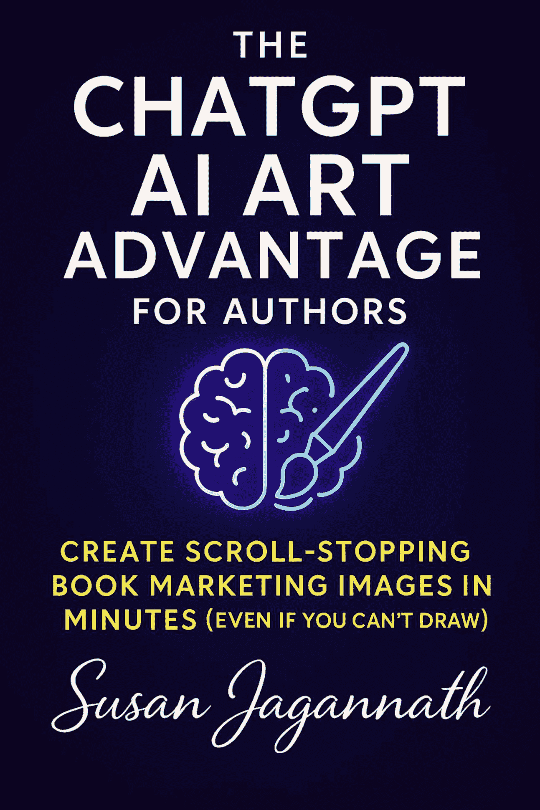

## 几分钟内创建令人停下的书籍营销图像（即使您不会画画）

# 前言

作为作者，我们倾注心血和灵魂，创作出鼓舞人心、娱乐和启迪读者的故事。但说真的——写一本杰出的书只是第一步。要真正销售我们的杰作，我们需要成为精明的营销人员和插图画家。如果你和我一样，那可能会感到压力山大，因为坦白说，这些是完全不同的技能集。

传统上，许多新作者梦想着签订出版合同，被专业人士处理所有营销和插画工作的承诺所吸引。想象一下，只需写作，而有人神奇地将你的文字转化为一个美丽包装的产品，几乎可以自行销售。听起来很梦幻，对吧？但在现实中，获得传统出版合同可能比写作本身更难，尤其是对于新兴作者或不太知名的专家来说。这就是为什么我们中的许多人已经进入了充满野性和奇妙的自出版世界。这是解放的，令人兴奋的——让我们承认，有时也有些令人恐惧。

当然，编辑和反馈通常很容易从我们的家人和朋友的支持网络（或者偶尔的直言不讳的评论者）中获得。但专业质量的图形？这完全是另一回事。熟练的插画师非常出色，但他们的费用很快就会耗尽我们的咖啡预算（我们作者都很喜欢咖啡）。

幸运的是，创意领域正在朝着有利于我们的方向发展。ChatGPT 等人工智能技术的出现。突然之间，那些图形设计能力有限的作者（是的，我在这里举手）只需编写清晰、富有创意的提示，就能制作出令人惊叹的视觉效果。诚然，人类插画师仍然无可匹敌，但人工智能为独立作者提供了一种实用、经济的方式，使他们能够持续地生成引人注目的视觉元素，帮助我们的书籍在竞争激烈的市场中脱颖而出。

欢迎来到这个激动人心的新时代，我的同行作家们，在这个时代，即使是那些几乎画不出人物轮廓的作者——我就在这里举手——也能成为视觉叙述者，通过图像的魔力增强我们的书籍并吸引读者的注意。

1

# 为什么人工智能艺术是您书籍的最佳伴侣

作者可以写出优秀的书籍，但要真正销售它们，作者还需要成为营销人员和插画师，这可能会成为一个问题，因为这些是不同的技能集。

正因如此，许多新作者认为他们需要签订传统出版合同，由出版商负责所有营销杂项——听起来不错——我只需要写作，出版商就负责将你的文字转化为有形产品的所有细节——一本可以销售的书籍。不幸的是，由于对于新作者或不太知名的专家来说，获得传统出版商很困难，我们中的许多人已经成功地尝试并成功地从事自出版。

然而，虽然你可以让朋友帮忙编辑和反馈，但你仍然需要一个能够创建引人入胜的图形的专家，由于图形在将你的书转化为产品时带来的巨大价值，他们非常昂贵。直到现在——像我这样的图形挑战者作者对 AI 提示感到非常高兴，这使得编写指令并让艺术家遵循它成为可能。虽然人类插图画家一直是最佳选择，但他们往往很昂贵，对于大多数独立作者来说难以触及，尤其是当我们需要大量视觉元素来营销我们的书时。没有营销，我们的书将难以找到那些会喜欢这本书的读者。

当 ChatGPT 引入 DALL-E 时，作者和其他人都很兴奋，直到他们遇到了使用这个工具生成图像时遇到的许多障碍。我知道我为此购买了信用额度，这些额度仍然躺在互联网的黑暗深渊中，或者我的硬盘里。提示 DALL-E 非常困难，很难得到你希望得到的任何东西。不仅它无法掌握任何类型的文本添加到图像中，而且更令人沮丧的是，你不能迭代和调整图像以使其更好，而不会将其完全改变成全新的图像。

现在，OpenAI 已经从 DALL-E 转变为 ChatGPT 4o 的本地图像生成，这不再是一个随机命中或失败的功能。这意味着你可以停止为你的在线营销需求支付额外的 AI 图像工具费用。虽然免费账户每天可以生成的图像数量有限，但你现在可以访问一个响应式的图像创建者，它可以与你进行对话，而不是强迫你每次都从头开始进行每一次的修改。

这使得图像处理过程更快，更符合你细分市场的需求，无论你计划在哪个平台上发布图形。我们将深入探讨如何使用这个新更新来为你的内容添加辅助材料。由于这是一个相对较新的功能，所以你可能遇到一些怪癖。但好消息是，它更容易精炼和纠正任何类型的小错误，就像你可以在其他一些更高级的图像生成 AI 工具中做的那样。

此外，想想你可以节省的时间，而不是学习新的图形工具、测试、重新测试和重新生成，你可以用这段时间来写你的下一本书。

它能指数级地加快你的上市时间。

[您可以在这里获取工作簿。](https://alsoby.me/r/amazon/B0FB161D8Q?fc=au&ds=1)

2

# 在 ChatGPT 4 中开始使用图像生成

免费层级的用户每天可以生成三张图像，如果你是 Plus 版本或团队订阅者，则可以生成更多。你还需要有一个与 ChatGPT 兼容的浏览器——或者使用 ChatGPT 移动应用。

## 为成功设置：图像生成基础知识

理想情况下，如果您试图创建图像，请使用更大的屏幕，因此您需要一个桌面而不是在您的移动设备上制作它们。作为一个作者，当我在家时，我总是使用显示器，而不是笔记本电脑屏幕。后者我保留用于旅行。

要开始，打开一个新的 ChatGPT 聊天并选择 4o 模型。

就您需要的图像进行简单对话。

例如，如果您是一位与资深人士合作写作书籍的作者，您可能会提示如下：

提示：

*“创建一张图片，展示一位资深女性作者在喜马拉雅山脉阳光明媚的家庭办公室里快乐地敲击笔记本电脑。包括舒适的装饰和她的<桌子>上的咖啡杯。”*

当您这样做时，您可能会得到以下结果作为起点来工作：

注意它如何正确地处理了一些事情，比如手和具体要求在桌子上要有喜马拉雅山脉和咖啡杯。

提示：您可以自己尝试，或者和我一起尝试。跟随挑战——[`<wbr> susanjagannath.<wbr> gumroad.<wbr> com/<wbr> l/<wbr> TCA-1`](https://susanjagannath.gumroad.com/l/TCA-1)

3

# 精通图像提示

对于我们这些作者来说，与 AI 清晰沟通应该是容易的，毕竟我们是文字、故事讲述和指导的大师——我们唯一需要学习的是如何运用我们的文字来创造具体的视觉图像。如果我们这些作者可以通过我们的书籍创造世界、人物、情节和激情，为什么不能通过 AI 来做呢？

这就是如何将 AI 扭转为我们天才的方法。

让我们看看提示的基本结构。

## 基本提示

*创建一张图片，<一位资深女性作者> <快乐地> <在笔记本电脑上敲击>，在一个<喜马拉雅山脉阳光明媚的家庭办公室>。包括<舒适的装饰>和<一个咖啡杯>在她的<桌子上>。*

方括号内的所有内容都可以更改——从左到右，这些指定了：

+   人物

+   情感

+   动作

+   环境

注意：在您的提示中不要包含<>。

现在，让我们让 Chat 改进或更改这张图片。

也许她有点太资深了，您想要一张适用于更广泛年龄段的图片：

提示

*让她看起来年轻一些，头发带有盐和胡椒色*

您将等待几秒钟，让结果进行处理，然后您可以接受更改或要求进行一些调整。

您决定您想要使用这张图片来推广喜马拉雅山脉的写作 retreat。

因此，您提示 Chat：

*包含浮动文字 - 来喜马拉雅山脉的写作 retreat。*

您可以通过与图像界面的简单对话来获得您想要的结果。您不需要学习编码或雇佣专家！

注意 AI 如何保持了角色和大多数其他元素不变，而不是从头开始？

您还可以更改许多不同的事情，例如告诉它将其从资深女性更改为资深男性，或者让他们在环绕阳台外而不是室内家庭办公室的笔记本电脑上工作。

你也可以改变情绪。你几乎可以用这个提示来获取无限不同的图片。

如前例所示，ChatGPT 4o 比一些更复杂的图像生成工具要简单得多。但你还必须知道如何提示你所需要和想要的。你是一位作家——所以从具体和视觉角度以及战略角度开始思考你的营销工作。

获取最佳提示的方法是想象有一个人类图形设计师坐在你面前，你必须告诉他们你需要什么。你永远不会简单地告诉某人“制作一张强大的营销图片。”这不足以让它继续下去。

你想要指定：

+   图片应该传达的情绪，

+   你可能想要的任何摄像机角度，

+   图片中的光线，

+   你想要的背景或不需要背景（如果你想要透明背景），要使用的色彩调色板，

+   你想在图片中包含的任何特定物体，

+   风格。

## 博客和社交媒体图片：瞬间吸引人的视觉内容

例如，如果你正在写一本减肥书，你需要为你的减肥博客文章提供一张图片，你提供的信息越详细，你的输出就会越准确。如果你需要为特定的社交媒体平台提供内容，你也可以添加一些关于你图片的大小和形状的信息，比如一个方形的图片，或者如果你想为 Facebook 的头像做些东西，例如，你会指定大小。

让我们提示一些类似的内容：

提示

*创建一张 30 多岁女性穿着运动服，面带微笑，在人行道上晨走的图片。背景显示澳大利亚一个阳光明媚、蓝天白云的树篱郊区街道。她拿着水瓶，看起来非常自信*

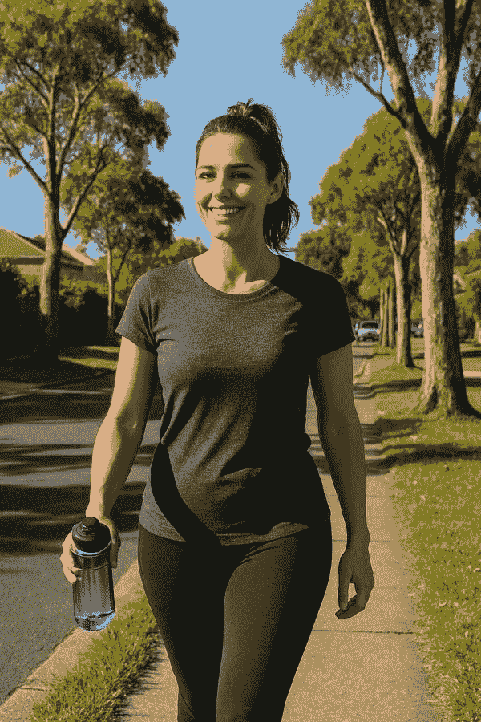

使用这个新的图像生成功能的一个好处是，你可以添加将（大部分）准确的文字。

例如，你可以要求它在图片中添加一些浮动文字，上面写着：“步行减肥——今天走一万步！”。

提示：

*在图片中添加浮动文字“步行减肥——今天走一万步！”*

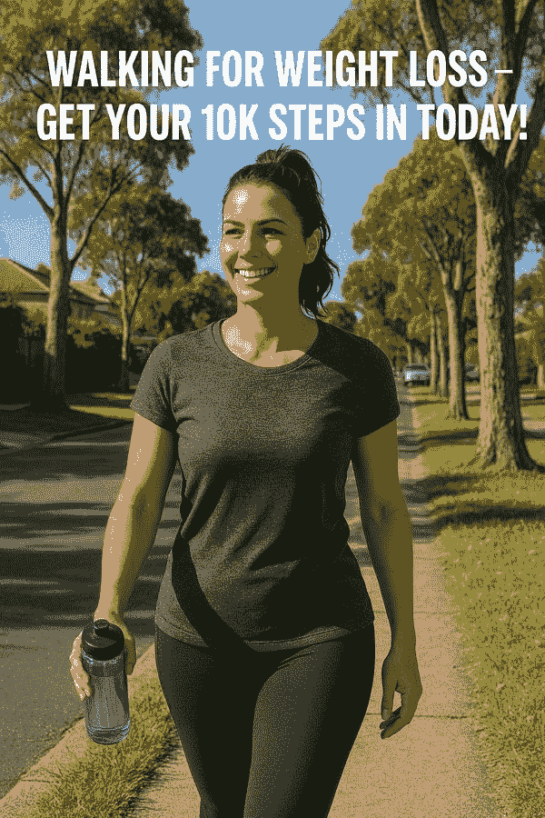

你不再需要手动购买库存图片，然后去另一个工具添加文字。ChatGPT 的 4o 可以为你完成这一切。

这是在几秒钟内完成的。不需要复杂的工具，这些工具会耗尽你的预算和宝贵的写作时间。

提示：你可以自己尝试，或者和我一起尝试。跟随挑战——[`<wbr> susanjagannath.<wbr> gumroad.<wbr> com/<wbr> l/<wbr> TCA-1`](https://susanjagannath.gumroad.com/l/TCA-1)

4

# 书籍封面和产品图形：无需设计师也能创建令人惊叹的封面

作为作者，占用你时间的事情还有封面，无论是书籍、赠品还是博客。

这就是我经常为想法、时间或预算而挣扎的地方。

要使用 ChatGPT 创建一个信息产品封面，你想要包括其他细节，例如

+   你正在销售的产品

+   你所在的细分市场，

+   你试图传达的情感基调。

你还将指定：

+   标题应该是什么，以及

+   它应该放置的位置或你想要的字体类型。

+   应该使用的背景图片。

例如，你可能会这样说，告诉 Chat 你确切想要什么。

提示

*为名为“不会画画的作者简易图像”的书籍创建一个全尺寸的电子书封面。*

+   *为顶部的标题使用**干净、现代的无衬线字体**。*

+   *在中间，放置一个**糟糕的涂鸦**，画有太阳、歪斜的房子和棍状树。*

+   *让涂鸦看起来像**漂浮的贴纸或全息图**，带有细微的阴影或光晕。*

+   *使用**浅蓝色纹理背景**（不要白色）。*

+   *在底部，用**精致的脚本字体**放置“你的名字”。***

+   *确保专业布局、间距和比例（6x9 宽高比）。*

这就是结果——你可以直接使用它，或者你可以把它给封面设计师。仅此一项就能为你节省大量的时间和金钱，因为大多数设计师在需要你支付更多费用之前，只会对你的封面进行有限的修改次数。

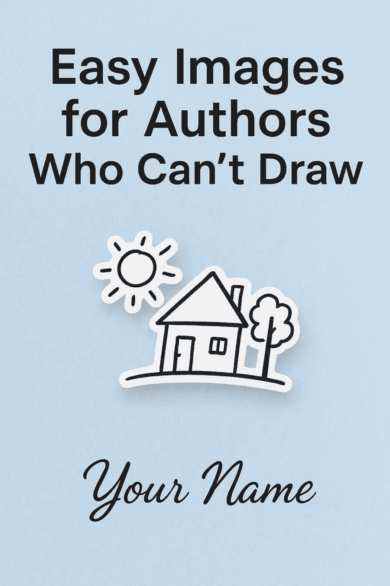

你可以随意调整，以获得你想要的效果，无论是不同的字体、布局还是图形。

你也可以要求 Chat 分享它创建的用于生成图像的提示。是的，我知道，你给出了一个简单的提示，但 Chat 会创建自己的提示然后生成图像。

所以现在让我们用这个来添加一个副标题：

提示

*为名为“不会画画的作者简易图像”的书籍创建一个全尺寸的垂直电子书封面。*

*使用以下设计元素：*

+   ***标题**在顶部，使用**干净、现代的无衬线字体**，加粗并居中对齐***

+   *标题下方用较小的无衬线字体添加**副标题**：*

+   *“为更喜欢写作的作家创建视觉内容”*

+   *在中间，一个**糟糕的涂鸦**，画有太阳、歪斜的房子和棍状树。*

+   *让涂鸦看起来**轻微漂浮**，带有细微的光晕或阴影。*

+   *使用**浅蓝色水彩纹理背景**——不要纯白色。*

+   *在底部，用**优雅的脚本字体**放置**“你的名字”**。***

+   *确保布局整洁、空白平衡和专业比例。*

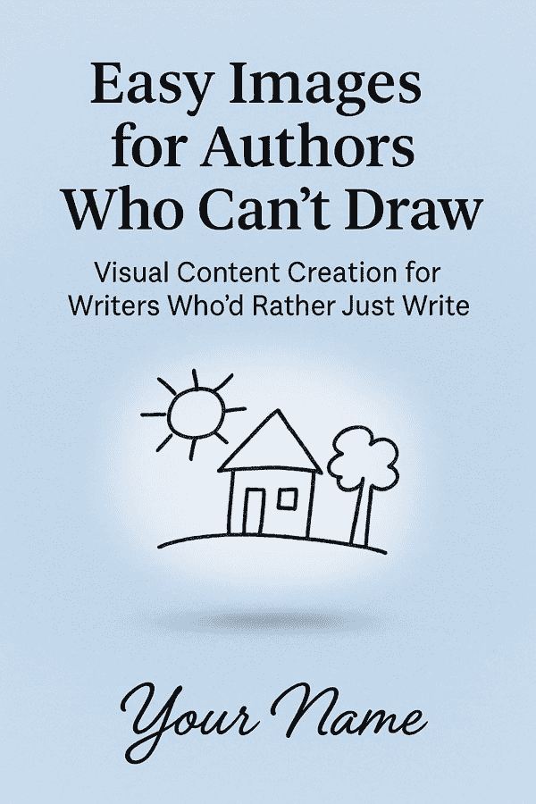

现在你可以下载图片并发送给你的封面设计师。

+   或者继续创作。（但不要花太多时间！）

+   或者直接用于你的产品图形营销。

+   或者生成推广图片

+   或者为相关书籍创建图像，例如你尚未创建但希望放在书末以便用户购买的书系列封面。

或者我们可以用这个来创建相关图书产品的封面，比如基于这本书的工作簿：

提示

*创建一个全 6x9 垂直的电子书/工作簿封面，标题为：**“不会画画的作者简易图像”***

*在标题下方添加一个**副标题**：*

"Workbook: Practice Prompts, AI Hacks & Visual Planning Pages"

*使用以下布局和设计：*

+   ***深蓝色水彩背景**，带有柔和的艺术纹理。

+   *标题使用**干净、现代的无衬线字体**，加粗并居中在顶部。*

+   *标题下方使用**较小的无衬线字体**。*

+   *在中心附近漂浮一个**儿童般的涂鸦**，以黑色线条艺术（太阳、房子、树）。*

+   *在底部放置作者的名字：**Susan Jagannath**，使用**优雅的书法字体**。*

+   *确保为电子书平台如亚马逊提供良好的间距、布局和谐和视觉清晰度。*

结果的图片可能是这样的：

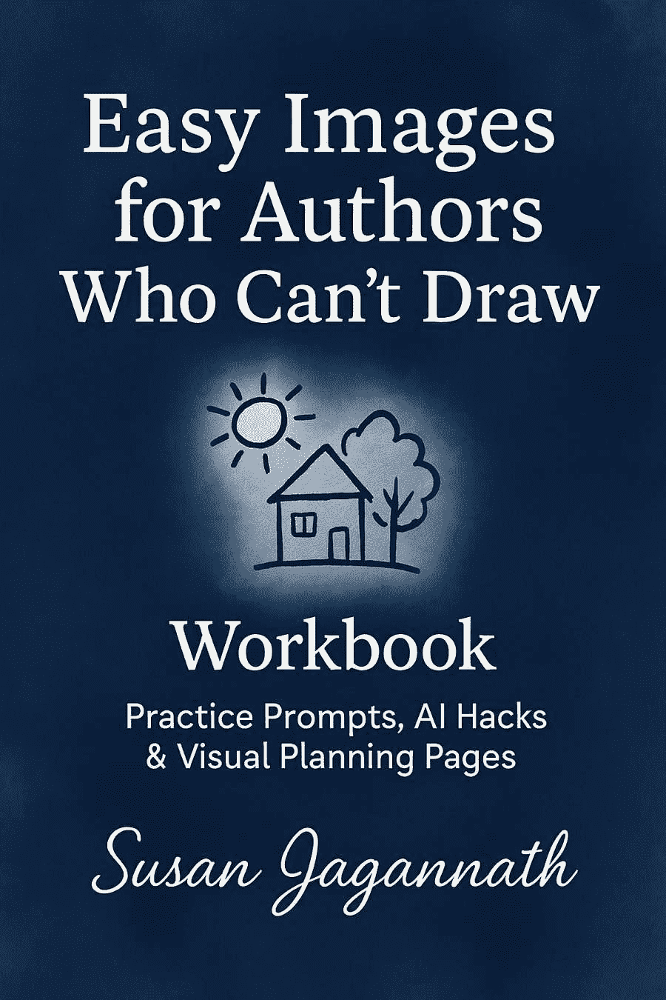

提示：你可以自己尝试，或者和我一起。跟随挑战 - [`<wbr> susanjagannath.<wbr> gumroad.<wbr> com/<wbr> l/<wbr> TCA-1`](https://susanjagannath.gumroad.com/l/TCA-1)

5

# 营销广告和信息图表：用引人入胜的图形吸引你的观众

你也可以使用 ChatGPT 4o 为付费广告活动图形、一系列帖子。是的，我知道，大多数作者对“广告”这个词感到退缩，但我们确实需要它们，现在我们不需要害怕它们了！

**让我们创建一些广告**

例如，你可以用以下内容来创建广告：

提示

*创建一个以 30 多岁或 40 多岁的**沮丧女性作者**为特色的 Facebook 风格广告，她坐在一个杂乱的桌子前，桌上放着纸张、笔记本和笔记本电脑。她**直视观众**，表情疲惫、不堪重负。*

*在顶部添加**粗体红色文字**：*

***"逃离图书营销噩梦"***

*在下方添加**较小的黑色或灰色文字**：*

*"用惊人的图像吸引更多读者"*

*在底部，包含一个**大绿色按钮**，上面清楚地写着：*

***"加入挑战"***

![创建一个以 30 多岁或 40 多岁的沮丧女性作者为特色的 Facebook 风格广告，她坐在一个杂乱的桌子前，桌上放着纸张、笔记本和笔记本电脑。她直视观众，表情疲惫、不堪重负。顶部添加粗体红色文字：“逃离图书营销噩梦”，下方添加较小的黑色或灰色文字：“用惊人的图像吸引更多读者”。底部包含一个清晰的大绿色按钮：“加入挑战”(Image00009.jpg)它最初给出的图片可以是你的起点，或者正好是你想要的。注意到绿色的按钮 CTA（Call to Action）被裁剪了。让我们来修复这个问题。提示：*确保按钮**完全可见***

就这样！

使用 ChatGPT 4o，你现在可以迭代提示并进行对话，以获得你想要的图像。但请注意文本和拼写与我们要求的一模一样。如果你想改变这张图片，把她放在一个繁忙的办公室里，与高楼大厦中的同事在一起，你可以做到。

**信息图表**

信息图表是一种几乎瞬间就能传达信息的视觉方式。

它们在社交媒体营销和作为博客中嵌入的图片中都很有效。你也可以让 ChatGPT 为你创建信息图表——创建图像甚至内容，以便于制作易于理解的图像。

例如，你可以这样提示：

提示

*为 Pinterest 创建一个垂直信息图表，展示五个书籍营销技巧。使用粗体标题，每个技巧的图标，以及当年的复杂色彩。在顶部包含一个标题，用专业字体写着：“书籍营销技巧”*。

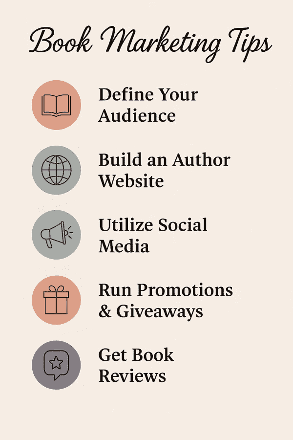

在这种情况下，我们甚至没有给 AI 提供具体提示或图标来包含，但我们完全可以做到。这是另一个节省时间的技巧，你可以用它来获取你在线营销业务所需的图形，而无需额外努力去收集信息。

在可能的情况下，确保你告诉 AI 你想要的风格、颜色和构图类型。如果你想看起来非常简约，你必须说清楚。如果你想看起来时尚现代，你必须说清楚。

## YouTube 品牌化：吸引注意力的缩略图

所以，你决定创建视频比担心所有用于营销书籍的视觉元素要容易，然后你意识到你需要好的缩略图！

不要担心，Chat 可以帮助你，创建一个将你的头像和标题合并成引人注目图像的个性化缩略图。

不要只是给 AI 一个通用的提示，比如，“制作一个 YouTube 缩略图。”

如果你希望输出令人印象深刻，你必须提示它，并包括具体细节。

**创建缩略图**

这个听起来简单的词，如果你不知道如何融合文字、字体、图像和情感，可能会陷入困境。幸运的是，我们可以通过一些提示来完成这个任务。

提示

*创建一个**YouTube 缩略图（16:9 宽高比**），展示一个**震惊或沮丧的作者**——男性或女性——**拿着一本书**，看起来困惑或沮丧*。

*使用**模糊的城市背景**来创造隔离感或压倒感，并应用**高对比度照明**以增强情感强度*。

*添加**粗体大写红色文字**，写着：*

***“为什么没有人买我的书？”***

*可选地，在底部角落包含一个**脚本式字幕**，内容为：“作者忏悔”*

*图像应传达自我怀疑和缺乏销售带来的情感痛苦——非常适合那些在可见性或营销方面挣扎的作者。*

结果可能如下所示：

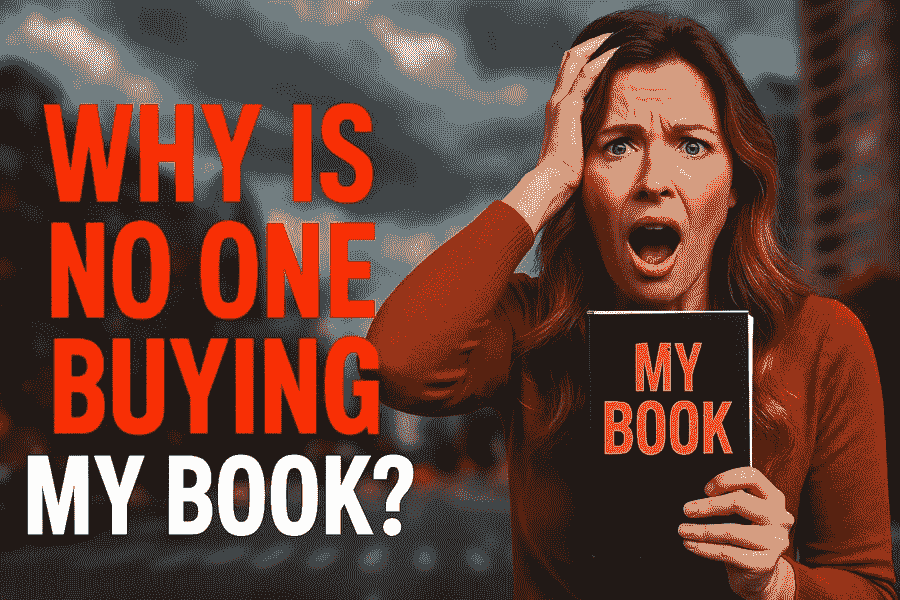

你还可以要求 ChatGPT 4o 的新 AI 功能为你创建像标志、横幅和其他视觉品牌图形这样的东西。

只需明确你想要什么，具体说明。如果你需要帮助，你可以给 AI 一个你想要的风格类型的例子，并要求它帮助你创建正确的提示语来满足你的需求。

## 提示语的连续性

如你所见，它并不总是第一次就能做到完美。没有哪个图像生成器总是能这么做，因为它无法读取你的思想。但通过几个小的调整提示，你可以得到你想要的东西。

没有人想从头开始，现在你不必这么做。就像对人类设计师进行修订一样，输入你的指令，无论是使用后续提示进行小的还是大的调整。如果你想保留大部分图像但只改变某些事物或一个元素，请非常直接地告诉它：“保留这张图像的每一部分，但将[项目]改为[偏好]。”

ChatGPT 现在能理解你在引用之前的图像，这是 DALL-E 无法掌握的。你不必重新输入整个原始提示或重新描述任何内容。

你可以具体说明是否想要放大或缩小图片，添加更多空白空间，纠正可能手指过多或面部表情奇怪的手，等等。

有时，你可能想让 AI 从头开始。如果是这种情况，清理你的提示语而不是试图修补原始输出。你甚至可以要求 AI 帮助你修改提示语，以便它能给你更多你想要的东西。

提示：

*创建一张 30 多岁、肩部长发波浪状棕发的焦虑女性的数字图像，她站在城市环境中。她手持一本名为“我的产品”的书，整本书名清晰可见（无裁剪）。她的表情应表现出挫败或困惑——睁大的眼睛，皱眉，嘴唇分开。使用模糊的城市背景和醒目的红色文字，内容为：“为什么没有人买我的产品？”书名必须完全可辨认且无裁剪。*

生成的图像：

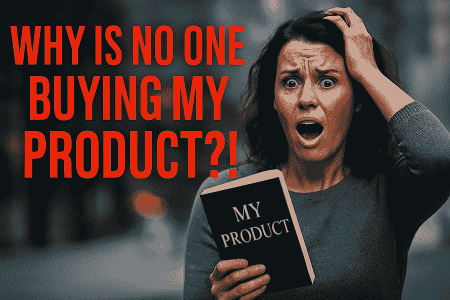

对于营销人员来说，另一个好处是 ChatGPT 4o 图像生成器内置了升级功能。这意味着你可以要求更高分辨率的版本，或者让它锐化图像，以便以多种方式使用。

就像你在 ChatGPT 中的文本内容一样，你还可以要求进行分割测试变体。例如，你可以这样提示：

提示

*给我这个图像广告的 4 种不同背景颜色的变体，”或者“用同一模型展示 5 个不同的姿势。*

结果产生了 4 张同一作者的不同姿势的图片。

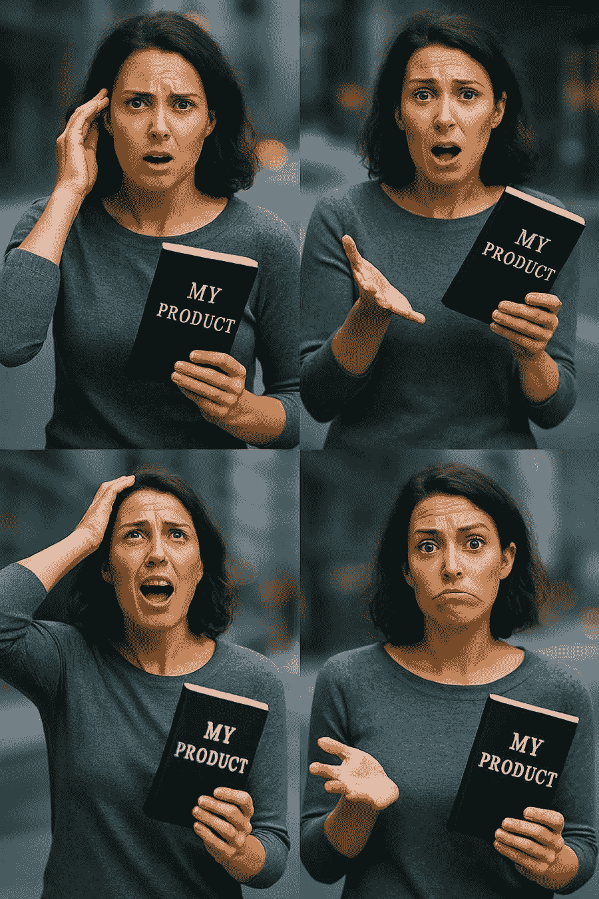

这样，你可以测试各种吸引注意力的元素，甚至消费者的心理学，而无需每次都重建整个图像。

提示：你可以自己尝试，或者和我一起。跟随挑战——[`<wbr> susanjagannath.<wbr> gumroad.<wbr> com/<wbr> l/<wbr> TCA-1`](https://susanjagannath.gumroad.com/l/TCA-1)

6

# 创建讲述品牌故事的照片

到现在为止，你可能已经掌握了使用 ChatGPT 4o 满足你的在线图像需求的基础。接下来，你可以开始利用一些更高级的概念来发挥你的在线创造力。

## 故事讲述：用图片讲述你的品牌故事

例如，你可能想要一些故事讲述序列图像，而不是单一图像，后者将读者的内容通过视觉进展带入旅程。例如，你可能想在 Facebook 上发布一个轮播帖子，你希望第一张图像显示一个在办公桌前看起来压力很大的作者。第二张图像可以显示他们在喜马拉雅山脉的作家 retreat。第三张可以显示他们自信地在家或海滩上的笔记本电脑前工作。

这是我在这里使用的提示：

提示

*嗨 Chat，我想要一些故事讲述序列图像，而不是单一图像，后者将读者的内容通过视觉进展带入旅程。创建一个 Facebook 的轮播帖子，我想要第一张图像显示一个在办公桌前看起来压力很大的作者。第二张图像可以显示他们在喜马拉雅山脉的作家 retreat。第三张可以显示他们自信地拿着一本完成的书籍。你需要从我这里得到更多信息吗？*

Chat 随后问我需要什么尺寸、性别、书名。我回答：

提示

*将其制作成一个中年女性的形象，封面为通用的“我的书”，尺寸为 1:1。”是的，为每个都添加一个标题*

AI 可以为你提供所有 3 张图片供你使用，这样你的故事讲述就能在图片中创造一个弧线，而不仅仅是文字。这能让观众更加沉浸，在更深层的基础上抓住（并保持）他们的注意力。这是我第一次得到的结果，而且完全正确：

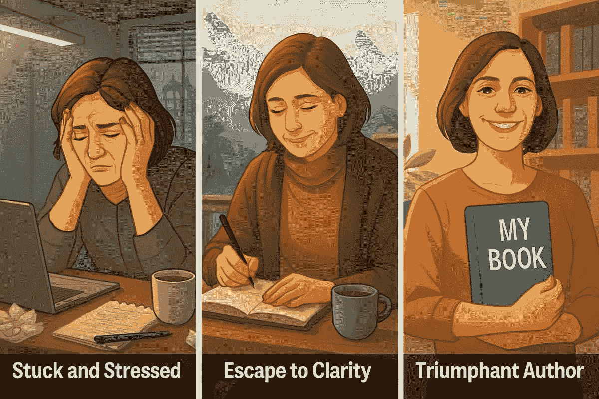

这里有一个秘密——我随后要求 Chat 分享它创建的提示。

这是 ChatGPT 为自己创建的提示：

*创建一个**1:1 比例的三联画**，展示三个连贯、半现实主义的数字插画，展示**中年女作家**的转变。*

***第一部分 – ‘陷入困境和压力’**： 她坐在一个杂乱的办公桌前，看起来沮丧或不知所措。散落着纸张、咖啡杯、闪烁的笔记本电脑屏幕，室内光线昏暗。她穿着办公室服装。氛围紧张。

***第二部分 – ‘逃向清晰’**： 同样的女人，现在放松且充满灵感，坐在一张木桌上，手里拿着笔记本或日记本，平静地写着。背景是喜马拉雅山避难所——背景中是雾蒙蒙的山峦，自然木结构，郁郁葱葱的绿色植被，温暖的自然光线。她穿着休闲舒适的户外服装。

***第三部分 – ‘胜利的作家’**： 同样的女人，自信地微笑着，自豪地拿着一本名为《我的书》的完成书籍。她站在一个明亮、欢迎的空间里，像一个小书店或家庭图书馆。她的书在背后展示。氛围庆祝且平和。

*在所有三个画板中保持角色的一致性（相同的面孔、发型、服装变化）。使用温暖、自然的色彩调色板。风格应该是半现实主义的、柔和的、以叙事为驱动。在每个画板中添加一个微弱的标题字幕：‘陷入困境和压力’，‘逃向清晰’，和‘胜利的作家’。*

这里有一个个性化的例子：等等看——ChatGPT 建议的！它问我是否想要一个个性化的提示！

Chat 的最新版本记得我之前上传过图片的聊天，并且记得我写过关于圣地亚哥朝圣之路的书。

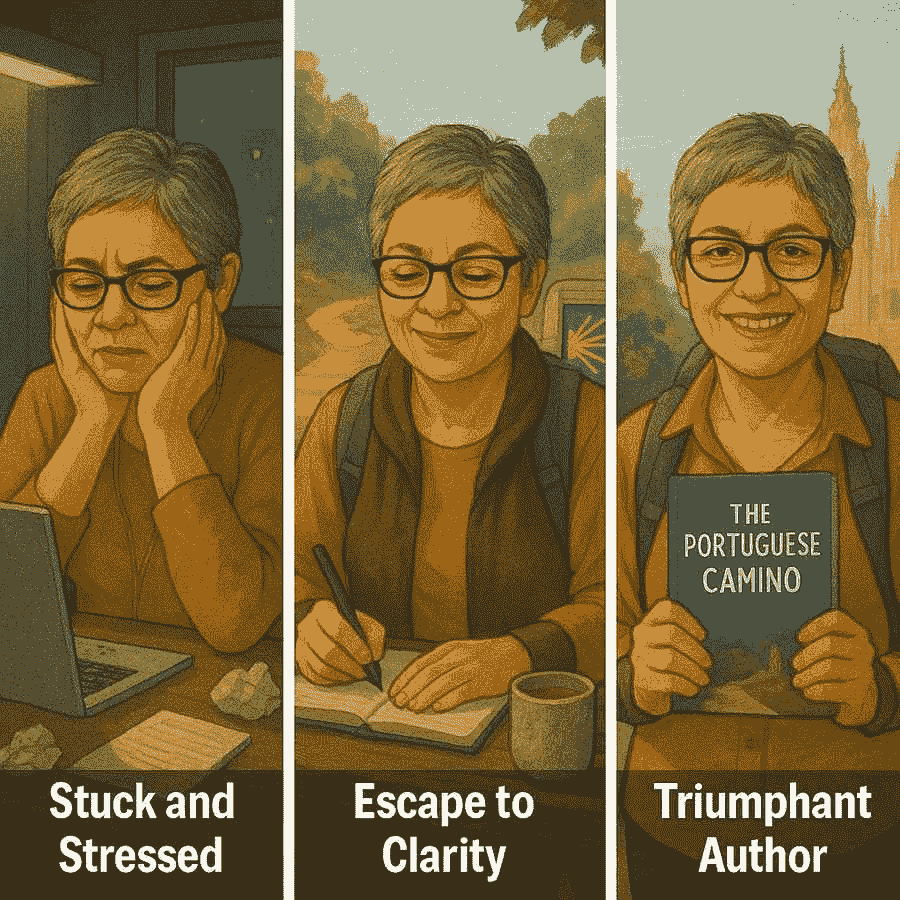

## 隐喻：轻松制作强大的视觉隐喻

在网络营销界有许多图像展示了某种隐喻。你可以使用 AI 创建代表诸如作者最终完成他的书之类的图像。你可能会有这样的提示：

提示

*展示一个人穿过混凝土墙进入一个美丽、明亮的空间的隐喻图像，展示他们的突破。*

ChatGPT 4o 可以将情感或隐喻概念转化为普通股票照片无法为你做到的视觉图像。或者你可能需要长时间且艰苦地寻找。

在这种情况下，因为我一直在为作者生成图像，Chat 在图像中添加了“写作障碍”。

这非常适合你的社交媒体内容、电子邮件、吸引潜在客户的工具和其他物品。

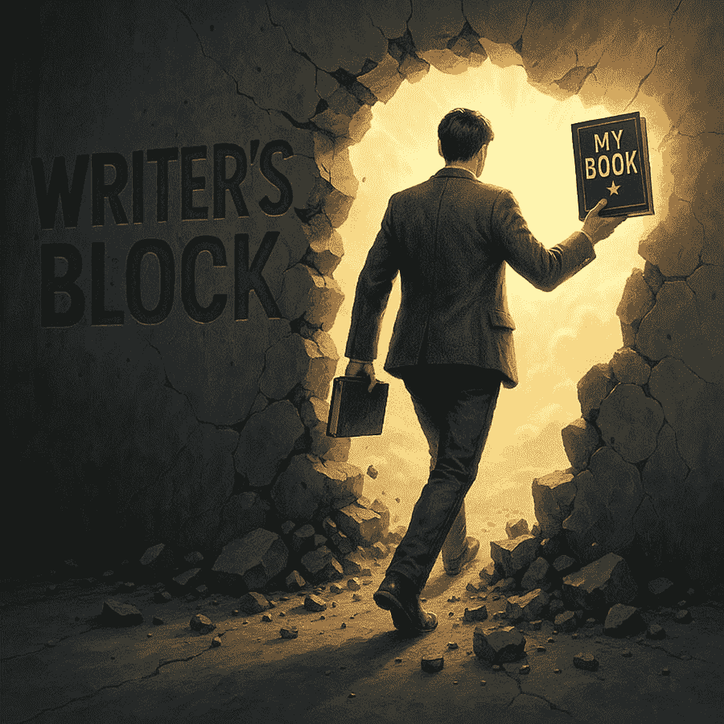

## 演示文稿或在线课程

如果你像我一样，你可能因为需要图片而避免像网络研讨会或在线课程这样的东西。幻灯片、缩略图、背景——这可能感觉像是一个即将到来的设计头痛。但事实是：**你不再需要是一名设计师**。现在，AI 工具可以生成遵循一致主题的幻灯片视觉、视频背景和课程图形——匹配你的主题、语气，甚至是你书的审美。

提示

*创建一个**16:9 的风景**羊皮纸背景，具有温暖的金色纹理和从左上角发出的柔和光线。*

*将一张**微型、简约的线条绘图**的**复古打字机**放置在**底部正中央**，**无阴影**和**无厚重现实主义**——只有简单、优雅的墨水风格线条。*

这种创建视觉资产的支持可以为你节省数小时，尤其是如果你正在制作课程、推销你的书或进行演讲。它快速、经济实惠，并且完全可定制。

想要更进一步吗？使用 AI 来满足你受众的需求。例如：

+   一本关于心理健康的书籍可能需要感觉平静、值得信赖和财务上令人放心的视觉元素。

+   一本针对 Z 世代创业者的书籍可能需要色彩、能量和自由的感觉。

例如：

**提示**

*为关于心理健康的一本书创建一个幻灯片，需要感觉平静、值得信赖和财务上令人放心的视觉元素*

注意：我在提示中犯了一个拼写错误，但 Chat 生成了正确的结果！

**提示**

*现在为针对 Z 世代创业者的书籍创建一个幻灯片，可能需要色彩、能量和自由的感觉*

提示：你可以自己尝试，或者和我一起。跟随挑战——[`<wbr> susanjagannath.<wbr> gumroad.<wbr> com/<wbr> l/<wbr> TCA-1`](https://susanjagannath.gumroad.com/l/TCA-1)

7

# 定制：你的图片，你的品牌

这就是你和你的天才与 AI 一起工作的地方，为 Chat 提供一个起始图像来使用。有时，你可能会找到一个你真的很喜欢的库存图片，但你需要对其进行调整。

然后，你可以使用 ChatGPT 4o 编辑那张库存照片，并将其作为你自己的图形的基础。

## 定制库存图片

它帮助你为你的品牌个性化图片。例如，你可能会找到一个女人拿着一本普通蓝色书的库存图片。使用+按钮将其上传到 ChatGPT。

这是一张带有自然光和模糊背景的出色库存图片。但也许你希望她拿着你的书？

而不必去 Photoshop 或雇佣自由图形设计师，你可以上传这两张图片——库存照片和你的书封面图形——并像这样提示 AI：

上传你的书封面，例如：

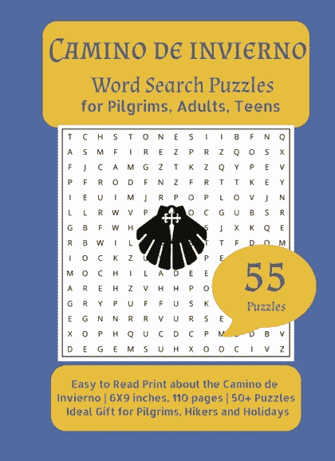

提示：

*使用同一张女人拿着书的图片，替换我的书封面（也附上了）让她拿着书而不是其他东西。*

从那个点开始，你可以调整任何你喜欢的，你会注意到它非常轻微地改变了，包括隐藏她脸部的一小部分和改变她的指甲。

要改变她的发色，我给出了以下提示：

提示

*让她头发变棕色*

如果你需要的是方形而不是垂直比例的图片，你可以修改提示，让它修正它所做的，而不是从头开始。

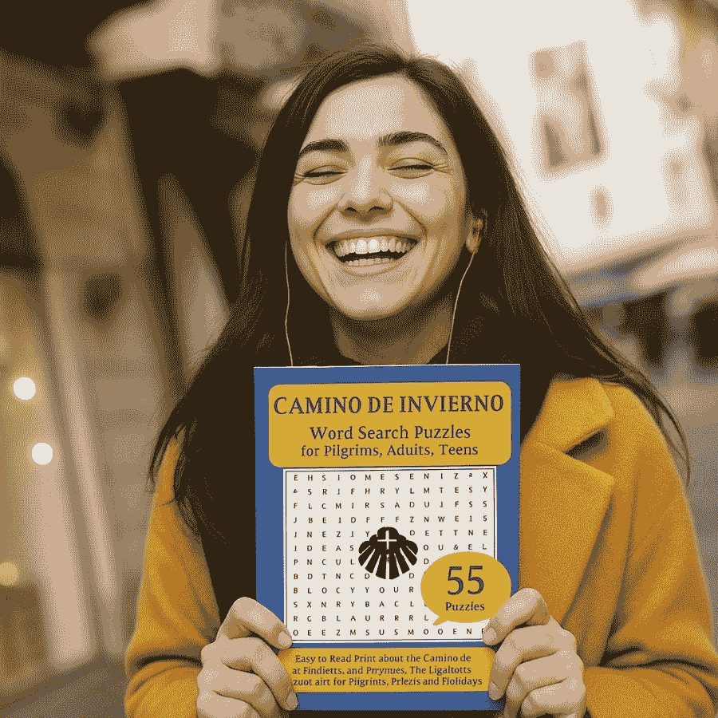

你可以用这个做很多事。

如果你有一个联盟营销业务，并且你想使用带有产品放置的库存照片来推广不同的商品，你可以有效地使用这种混合提示。

## 生成个性化的 YouTube 图片

作为一名作者，你希望与你的读者建立联系。所以除了酷炫的图片，更好的是个性化你的营销图片。上传一张你自己的照片——或者一个产品照片——并让 AI 增强它：改变背景，添加视觉主题，或突出某个物体。你在工具做重活的同时保持控制。

上传一张这样的草图和你的照片：

**这是布局**

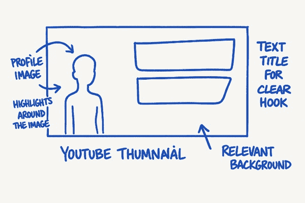

我只是画了这张，手写了文字，然后用手机拍照并使用+按钮上传。也许这就是 Chat 出现一些拼写错误的原因。

现在是照片环节——我选择了最简单的方法。不要评判我！

**照片**

我走到外面寻找好的光线，拍了一张自拍并上传到 Chat。 (使用+按钮)。

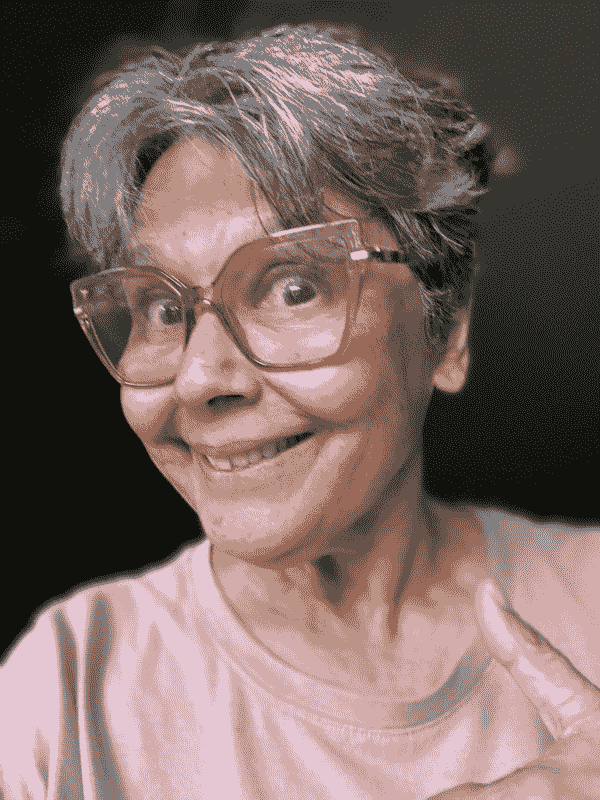

提示：

*使用我提供的输入图像的方向和布局，为名为“传统出版与独立出版：没有人告诉你的 200 美元秘密”的视频创建一个 YouTube 缩略图。使用合适的背景*

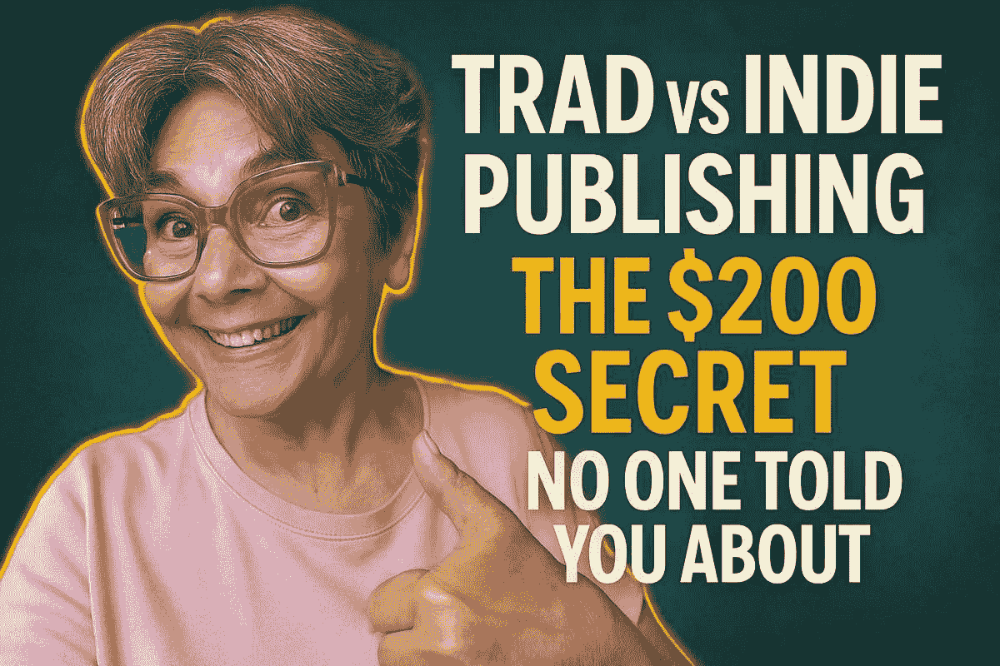

如果你希望改变风格：

提示：

*请以魔法书风格*

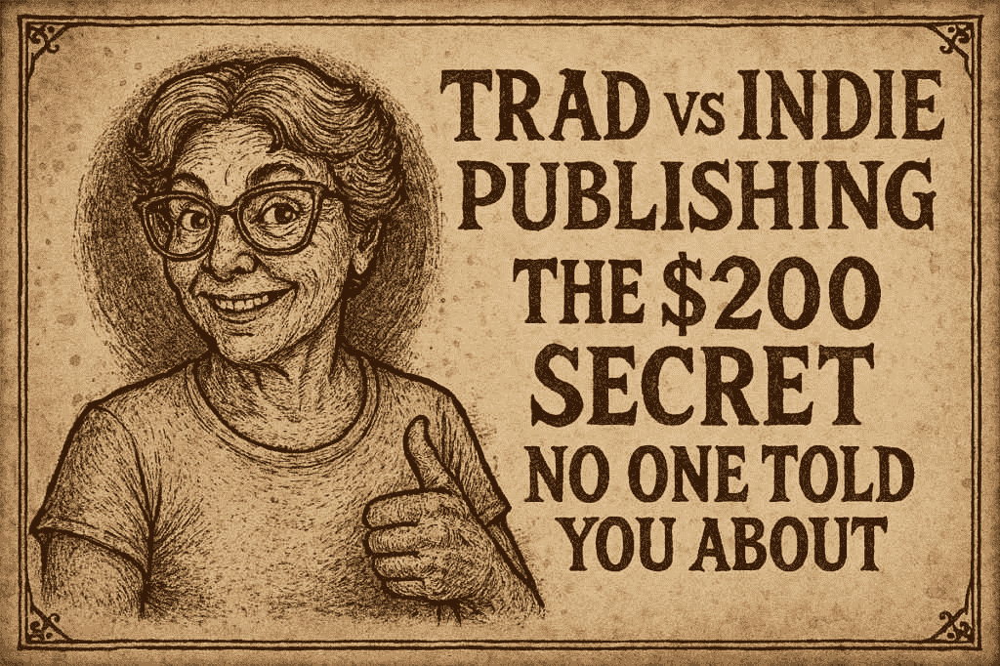

是的，保持礼貌是好的。

现在，你可以使用这些图像提示为你的不同产品生成大量的图片。

提示：你可以自己尝试，或者和我一起。跟随挑战进行 - [`<wbr> susanjagannath.<wbr> gumroad.<wbr> com/<wbr> l/<wbr> TCA-1`](https://susanjagannath.gumroad.com/l/TCA-1)

8

# 批量和一致性

需要为博客系列或发布活动准备一批图片吗？使用提示堆叠来创建相关图片。在这个例子中，让我们为关于我关于徒步朝圣的书籍的博客创建三张标题图片：朝圣之路的黎明、大教堂到达、小径地图和朝圣者必备物品。

在这个例子中，我们将要求 ChatGPT 为关于徒步朝圣的博客创建三张图片，这是我的几本书的主题。

提示：

*为关于徒步朝圣的博客创建三张不同的标题图片。其中一张应包含朝圣者必备物品，如背包、徒步杖、水瓶、扇贝壳空白凭证。另一张应展示朝圣者在安静的小路上行走，路边有一个朝圣之路的市场。另一张应展示朝圣者快乐地到达圣地亚哥大教堂。无文字。*

发生的事情是 ChatGPT 会一次生成一张。我利用这个机会调整了图片。

**博客文章 1**

**博客文章 2**

我就这件事进行了一些讨论，因为我拼错了一个单词 -

注意 - “其中一张应展示朝圣者在安静的小路上行走，路边有一个朝圣之路的市场。”

看看我是如何把“market”写成“marker”的？所以，Chat 给了我这个。我没有要求页脚。

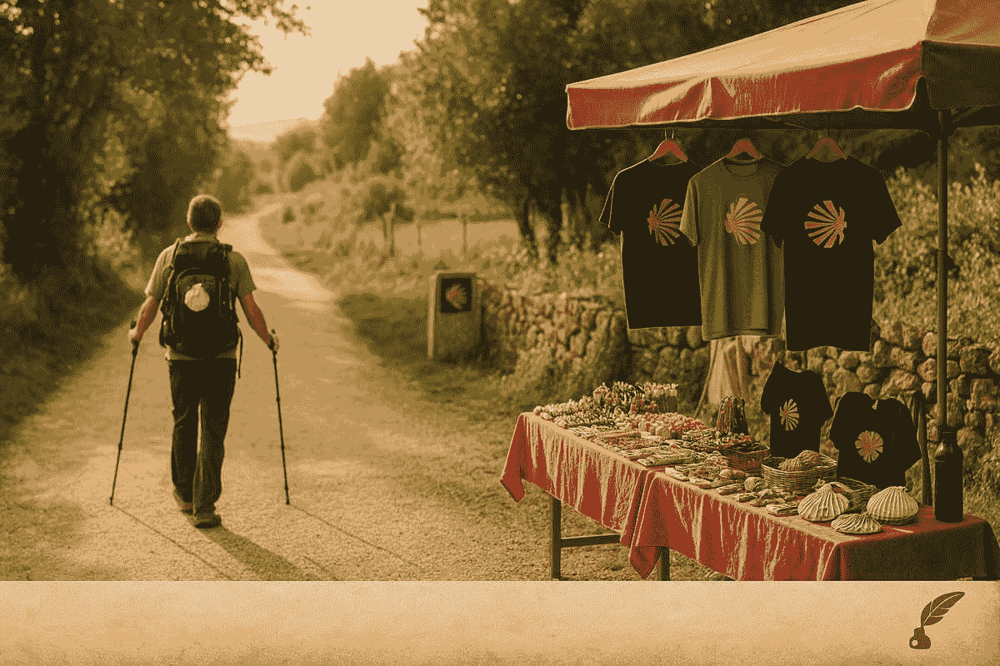

*所以我不得不再次提示*

提示 -

*请移除摊位但保留标记。*

这太棒了！

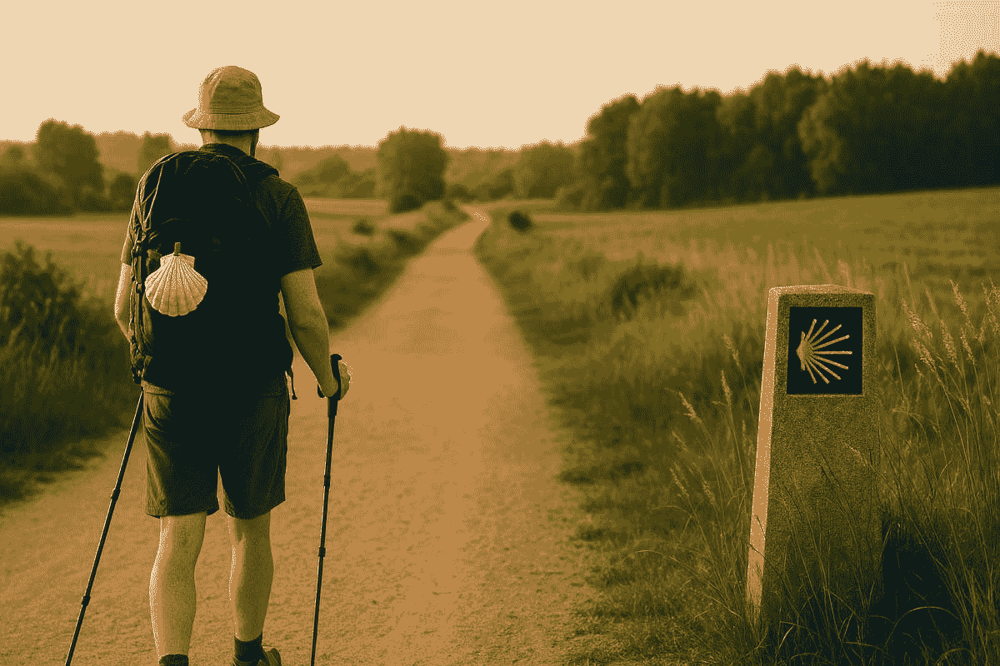

博客文章 3

这效果很好，我忍住了不再生成另一张！知道何时停止是好的！

这是修正后的提示（没有我的错误）

*为关于徒步穿越圣地亚哥之路的博客创建三张不同的标题图像。一张应该包含朝圣者的必需品，如背包、徒步杖、水瓶、扇贝壳空白凭证。另一张应该显示朝圣者在一条安静的小路上行走，路边有一个圣地亚哥之路的标记。第三张应该显示朝圣者快乐地到达圣地亚哥大教堂。不要添加文字。*

## 保持品牌视觉身份的一致性

从市场营销的角度来看，你希望在所有平台上保持图形的一致性。这可能意味着在颜色调色板方面保持一致。你必须在与 ChatGPT 4o 进行此操作时非常具体。

你可能已经知道不要说像“让它变得多彩”这样的话。这给了 AI 将任何颜色都拉入你的图像的能力，这可能不是你想要的。但如果需要使用特定的颜色调色板，仅仅说“使用绿色和蓝色”还不够。

如果你想使用森林绿色，告诉它使用十六进制#228B22。如果你想使用深蓝色，你可能告诉它使用十六进制#1B2D48。这些具体信息会给你你想要的确切颜色，并确保图形始终保持一致。

在某些情况下，你可能甚至有一个需要一致使用的角色或某种卡通图像。这是 AI 可能会偏离方向的地方。有时，你可以告诉它使用图像中的同一个人，它将保持该角色的确切外观。

但如果它改变了某些东西，你总是可以上传你想要复制的图像作为你的提示的一部分，这样它就能确切知道你指的是哪个角色。

可能有助于你保持一个这些具体提示和图像的库或清单，这样你就可以随时调出它们，并在需要以一致方式维护某些内容时快速将它们输入到 ChatGPT 4o 中。

让我们看看我为这本书创建的封面。

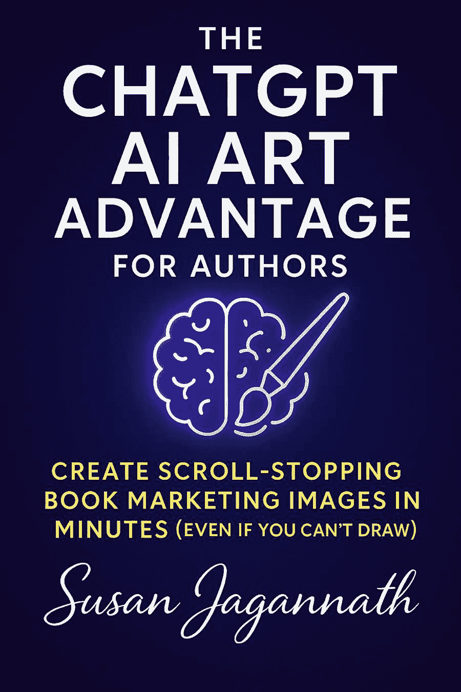

我想提取这张图像中使用的颜色列表。有了颜色列表，我可以在所有我的营销材料中使用相同的颜色，创建品牌模板等等。

上传你为你的书生成的封面。使用+按钮上传封面。

提示：

*只给我这本书的颜色调色板*

结果：

这里是从你上传的封面中提取的颜色调色板：

** 主导颜色调色板（十六进制代码）**

1.  **#171849** – 深海军蓝（背景）

1.  **#8d90fc** – 柔和电光蓝（标题发光）

1.  **#fafaf9** – 淡白色（文本高亮）

1.  **#f7e952** – 生动黄色（副标题强调）

1.  **#fbaae3** – 霓虹粉-洋红色（大脑发光）

1.  **#38e3f5** – 明亮青-蓝（画笔发光）

提示

*请生成色卡板。*

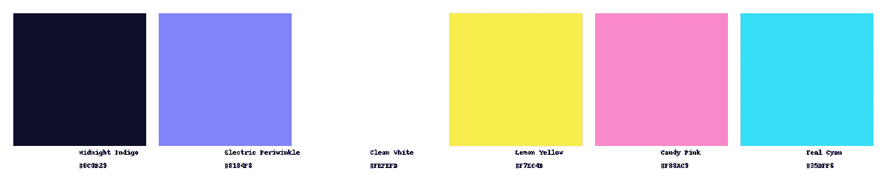

[这里列出了这本书中使用的所有提示，以及示例图像。](https://susanjagannath.com/tcaaaa-bonus/)

提示：您可以自己尝试，或者和我一起尝试。跟随挑战 - [`<wbr> susanjagannath.<wbr> gumroad.<wbr> com/<wbr> l/<wbr> TCA-1`](https://susanjagannath.gumroad.com/l/TCA-1)

9

# 热爱文字

在所有这些图像之后，让我们回到文字。是的，让我们用文字作为图形的来源。

小贴士：您也可以将其用作标志设计的起点

是的，我们作者热爱文字，我们的读者也是如此。他们喜欢引言和格言，尤其是当它们看起来很棒的时候。

假设你是一位热爱山川的旅行作家，让我们用 Chat 生成一些名言。

提示

*受山灵启发的 10 条励志名言，保持字数在 6 个字以内*

结果可能是：

爬得越高。呼吸更深。生活更充实。

山移心志，不止脚步。

突破局限。永远攀登。

每座山峰都是从脚步开始的。

暴风雨过去。顶峰依然。继续攀登。

每一次向上的奋斗都会变得更强大。

找到自己在云层之上的感觉。

高度考验，小径教导，顶峰回报。

看到的风景证明了攀登的价值。

在山谷中扎根。在山顶翱翔。

让我们挑选一个，比如说“山移心志”，我决定跳过引言的最后部分。

提示

*为“山移心志”这句话设计一个现代书法风格的标志。使其为黑白两色，看起来像是手绘的，包括一些螺旋图案*

结果

这给了我另一个想法，我可以为我的山间小屋设计一个标志。

提示

*为“喜马拉雅写作 retreat”这些词设计一个现代书法风格的标志。使其为黑白两色，看起来像是手绘的，包括一些螺旋图案*

结果

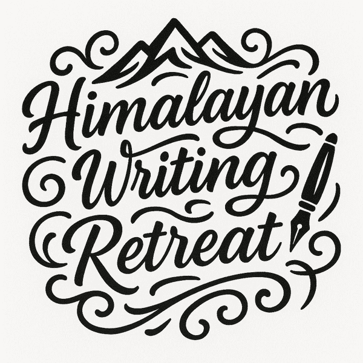

但是，请注意，为了创建实际可打印的图像，您需要将图像放大到至少 300 dpi，并将其转换为 svg 格式。

提示：您可以自己尝试，或者和我一起尝试。跟随挑战 - [`<wbr> susanjagannath.<wbr> gumroad.<wbr> com/<wbr> l/<wbr> TCA-1`](https://susanjagannath.gumroad.com/l/TCA-1)

10

# 道德考量

让我们明确一点：仅仅因为 AI*可以*做某事，并不意味着它对您的业务是聪明或道德的。

你可能会看到在线群组中的人炫耀 ChatGPT-4o 可以生成名人令人惊叹的图像，这些图像“甚至看起来不是 AI 生成的”。但事实是：**在您的营销、广告或产品视觉中使用名人形象是一个法律和道德的雷区**。

即使它“仅仅是一个图像”，如果你暗示名人支持你的品牌——或者如果他们的脸出现在你的销售漏斗附近——你可能会被追究责任。你不希望有人未经你的许可就使用你的名字或面孔来销售他们的产品。所以不要对别人这么做。

如果您在一个受监管的领域工作，比如**健康、金融或教育**，这一点尤其重要。您必须确保您使用的视觉元素不会误导您的受众或引发合规问题。AI 生成的图像可以是*令人信服的*，但这并不意味着它们是安全的。这取决于您的人性伦理和判断。

**标志**

如果图像生成器从现有标志中汲取灵感——即使是很微妙的——你可能会得到一个意外抄袭商标的设计。这不仅缺乏原创性；这还是一个即将发生的诉讼。

因此，在你取消 Photoshop 或 Midjourney 订阅，转而使用 ChatGPT 的新原生图像工具之前，花时间**负责任地测试和探索**。使用你的 ChatGPT Plus 访问权限来构建反映你的声音、你的品牌和你的价值观的**提示库**。

GPT-4o 中的图像工具快速、灵活，令人惊讶地好——但它们并不是跳过最佳实践的捷径。把它们看作是一个**创意副驾驶**，而不是法律上的免责通行证。

真正的胜利？你可以在**同一个空间内构建和改进你的视觉**。这意味着更少的等待，更少的工具要处理，以及满足所有营销需求的更快反馈循环。

使用 AI 来支持你的策略——而不是取代你的判断。以下是一个简单的清单。 - [`<wbr> susanjagannath.<wbr> com/<wbr> tcaaaa-<wbr> bonus/`](https://susanjagannath.com/tcaaaa-bonus/)

11

# 相关材料

清单

使用 AI 来支持你的策略——而不是取代你的判断。以下是一个简单的清单 - https://susanjagannath.com/tcaaaa-bonus/

提示列表

这里列出了本书中使用的所有提示，以及示例图像。

[**https://<wbr> susanjagannath.<wbr> com/<wbr> tcaaaa-<wbr> bonus/**](https://susanjagannath.com/tcaaaa-bonus/)

想要加入挑战，完成提示？还有更多？

[**https://<wbr> susanjagannath.<wbr> gumroad.<wbr> com/<wbr> l/<wbr> TCA-1**](https://susanjagannath.gumroad.com/l/TCA-1)

想要这本书的工作手册吗？

[配套工作手册 - 作者的 ChatGPT AI 艺术优势](https://alsoby.me/r/amazon/B0FB161D8Q?fc=au&ds=1)

即将推出

[**https://<wbr> linktr.<wbr> ee/<wbr> susanjagannath**](https://linktr.ee/susanjagannath)

# 后记

**准备，设置，创作：释放你的 AI 艺术优势**

你现在拥有了将你的想法转化为令人惊叹的视觉现实所需的基本知识和工具。有了 ChatGPT 4o，那些与复杂的图形设计软件作斗争、在自由职业者身上耗尽预算，或者满足于与你的写作不相匹配的视觉的日子已经过去了。

作为一名作家，你的创意优势在于讲故事和文字——现在你的视觉可以公正地对待你的写作，而无需压力或重大开支。请记住保持一致性，始终在提示中清晰沟通，并尊重道德规范以保护你的品牌。

你的下一步：

+   **创建提示库**：保留你成功提示的列表，以便快速重用。

+   **测试和迭代**：不要犹豫去实验。使用反馈循环来改进你的视觉。

+   **利用你的新技能**：将这些视觉内容创作技巧应用到你的博客、社交媒体、营销活动、书籍封面和品牌材料中。

现在，去探索并开始使用 ChatGPT 4o 的全部力量——比以往任何时候都更快地创建引人入胜、专业质量的视觉内容。

您的读者和您的品牌都会感谢您。

这里列出了本书中使用的所有提示，以及相应的示例图像。[`<wbr> susanjagannath.<wbr> com/<wbr> tcaaaa-<wbr> bonus/`](https://susanjagannath.com/tcaaaa-bonus/)

# 关于作者

苏珊·贾甘纳特成功地将阅读的热情、写作的热爱和对技术的着迷结合起来，在她决定转向写作她想要写的书籍之前，她已经在技术写作领域创造了自己的职业生涯。拥有超过 50 本技术手册（不是），是时候做一些不同的事情了，踏上冒险之旅，帮助他人去冒险，并以她自己的名字写书。

作为一名军人的孩子，她的童年包括了七所不同的学校、三所大学，以及从冲突区域进行的几次紧急疏散。旅行和冒险是常态。她相信要抓住每一个机会去体验新的冒险。无论是澳大利亚的海滩露营、喜马拉雅山脉徒步、昆士兰州皮划艇、恒河白水漂流，还是在西班牙徒步穿越圣地亚哥之路，她的哲学是将这些经历压缩在一两周内，为一生创造记忆，最好是和家人朋友一起。

苏珊现在正在她的下一次冒险中；写那些不是技术手册的书籍，帮助他人写作和出版，并计划她的下一次冒险，永远如此。

如果您想了解更多关于苏珊·贾甘纳特书籍的信息，请给她发送电子邮件至 susan@xpresswords.com

[`<wbr> linktr.<wbr> ee/<wbr> susanjagannath`](https://linktr.ee/susanjagannath)

[Facebook](https://www.facebook.com/susanjagannath)

[Instagram](http://Instagram.com/susanjagannath)

# 苏珊·贾甘纳特的其他作品

[`<wbr> linktr.<wbr> ee/<wbr> susanjagannath`](https://linktr.ee/susanjagannath)
