# 面向企业的 ChatGPT 究极手册（一）

> 原文：[Ultimate ChatGPT Handbook for Enterprises](https://annas-archive.org/md5/c14c4c4627121325ad8f5b8397501d65)
> 
> 译者：[飞龙](https://github.com/wizardforcel)
> 
> 协议：[CC BY-NC-SA 4.0](https://creativecommons.org/licenses/by-nc-sa/4.0/)

# 第一章：从 GPT-1 到 ChatGPT-4：朝向生成式 AI 的演进

# 介绍

在本章中，我们追溯了生成式预训练变压器（GPT）的发展，从 GPT-1 和 GPT-2 的开始，到最近的版本，如 ChatGPT 和 GPT-4。

我们从 2018/19 年的早期 GPT 模型开始，为 GPT-3 奠定了基础，这使得它在 2020 年首次生成了类似人类的文本，得益于其规模和能力。

然后，我们讨论了 InstructGPT，该产品于 2022 年初推出。这是 GPT-3 的一个变种，经过大型指令数据集的微调，扩展了 GPT 领域中各种基于文本的任务的执行。然后我们继续讨论 ChatGPT，这是对话 AI 领域的突破，于 2022 年 11 月推出时立即成为最成功的 AI 应用程序。

我们随后关注 GPT-4 及其聊天对应物 ChatGPT-4。该模型展示了一定程度的人工通用智能（AGI）能力，如学习和适应、高级推理、创造力和创新。2022 年 3 月，随着 GPT-4 的发布，一套初始插件被引入以增强其功能。在随后的几个月里，新的插件被添加，扩展了其生成式 AI 能力的范围。到同年 6 月，该模型的潜力通过访问外部应用程序（工具）进一步扩展。随后，这些模型被整合到企业软件中，强调了它们对业务应用的变革性影响。

我们通过首先深入探讨 ChatGPT 企业来结束本章，该产品于 2023 年 8 月推出，是 OpenAI 专为满足企业部门的特定需求和关注点而设计的。随后，我们将审查 ChatGPT 在 2023 年 9 月引入的本地语音和图像处理能力，这是一项重大进步，丰富了用户交互，并突显了其作为综合生成式 AI 工具的多功能性。最后，我们将重点介绍 GPT-4 Turbo 于 2023 年 11 月的显著进展，以及 AI 助手和可定制的 GPT 的出现，它们正在重塑 AI 应用和企业解决方案的格局。

*图 1.1* 提供了迄今为止 GPT 模型的简要概述：

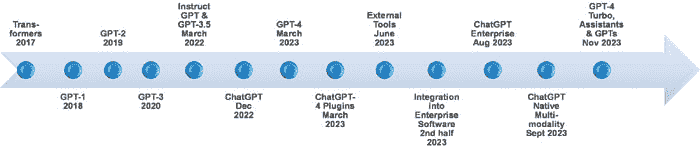

**图 1.1：** GPT 模型的演变

# 结构

在本章中，将涵盖以下主题：

+   GPT 的早期版本

+   GPT-3

+   InstructGPT

+   ChatGPT

+   GPT-4

+   ChatGPT-4 插件

+   访问外部工具

+   整合到企业软件中

+   ChatGPT 企业

+   ChatGPT 本地多模态

+   GPT-4 Turbo，助手和 GPTs

# GPT 的早期版本：AI 语言处理的发展历程

语言模型是人工智能（AI）中的一项突破性创新。它们是设计用于理解、生成和与人类语言交互的 AI 系统，其实力根植于一种称为变压器的特殊深度学习¹架构，该架构于 2017 年引入。变压器采用独特的注意机制，使其能够在生成输出句子时辨别输入句子中单词的相关性。

借助这一开创性方法，OpenAI 最初作为美国的非营利人工智能研究实验室²成立，于 2018 年推出了第一个拥有 1.17 亿参数的生成式预训练变压器（GPT-1）³。GPT-1 模型采用了变压器架构的简化左到右版本，使其能够根据前面单词的上下文生成文本序列中的下一个单词。

在整个训练过程中，该模型致力于预测句子中的下一个单词，给定先前单词的特定回顾窗口和它们对新单词的重要程度。它将这一预测与其数据集中 7000 本书（BooksCorpus）的参考文本中的实际下一个单词进行比较，每当发现差异时就会对其内部机制进行调整。当预测准确时，就不需要进行调整。选择 BooksCorpus 部分是因为连续文本的长段落有助于模型学习处理长距离依赖关系。

GPT-1 在文本分类、自然语言推理、问题回答、常识推理和语义相似性等任务方面取得了显著的改进。

在 GPT-1 取得成功之后，OpenAI 通过在 2019 年推出 GPT-2 来建立其成就。这第二次迭代在参数数量上实现了显著的提升，从 GPT-1 的 1.17 亿增加到 15 亿。此外，GPT-2 利用了 800 万个网页或 40GB 的文本的更大训练数据集，比 GPT-1 的训练数据集大了十多倍。

GPT-2 在零-shot 学习和文本生成方面相对于 GPT-1 引入了显著的改进。该模型可以基于任何给定的输入创建高质量的合成文本，无缝地适应风格和内容，允许用户选择的主题上进行连贯和逼真的文本延续。GPT-2 在翻译和摘要等其他文本生成任务以及问题回答和阅读理解等文本理解任务方面也优于 GPT-1。

# GPT-3：AI 中先进的自然语言处理的开拓者

GPT-3 是由 OpenAI 于 2020 年推出的生成式预训练变压器的第三次迭代，展示了模型规模的巨大增加，最大变体拥有 1750 亿个参数。这使其成为当时最大的语言模型。

值得注意的是，GPT-3 是在 3000 亿个标记或 570GB 的文本上进行训练的，包括大约 60 亿个爬取的网络文档的 CommonCrawl，大约 4500 万个网页的 WebText2，维基百科和大量的公共领域书籍。这一重大规模扩展导致捕捉到更复杂的语言模式，并赋予 GPT-3 更优越的文本生成和理解能力，使其成为 GPT-2 的一个进化飞跃。

GPT-3 以其先进的 few-shot 和 one-shot 学习能力脱颖而出。因此，GPT-3 能够基于有限的示例，在只有少数或甚至只有一个输入-输出示例的情况下，在新任务上表现良好，而无需在大型领域特定数据集上进行明确的重新训练或微调。

由于其尖端能力，GPT-3 可以处理比 GPT-2 更广泛的任务，从起草电子邮件和编写代码到创作诗歌和回答微妙的问题。

另一个重要的改进领域是 GPT-3 生成更连贯和上下文相关的文本的能力。它减少了产生荒谬或无关的回应的可能性，这是对 GPT-2 的显著改进，增强了可用性和整体用户体验。

OpenAI 通过引入应用程序编程接口（API）进一步扩大了 GPT-3 的影响，使开发人员更容易将该模型集成到其应用程序中。

# InstructGPT：迈向面向任务的 AI 的垫脚石

InstructGPT 是 GPT-3 的一个经过精细调整的版本，作为 OpenAI 研究成果的一个重大进化，于 2022 年初推出，因其在解释用户指令和大部分避免不需要的内容方面的熟练程度而受到特别认可。

InstructGPT 的训练旨在紧密对齐语言模型与用户的显性和隐性意图。其目标是开发一个能够有效协助完成用户任务的模型，同时还要接受真实性和安全性原则的训练，避免传播虚假或有害内容。

该模型是通过人类反馈的强化学习（RLHF）进行训练的。这个全面的过程包括五个阶段：

1.  数据标记：第一阶段涉及招募一个承包商团队，他们是根据在筛选测试中的表现而被选择的，来对数据进行标记。

1.  初始监督学习：创建了一个大型的指令-回应数据集，部分由承包商手动创建，部分通过使用 GPT-3 API 自动创建并审查其结果。然后，使用这个数据集对现有的 GPT-3 模型进行微调。

1.  创建比较数据集：组装了一个单独的数据集，承包商们对先前训练模型对大量指令的回应进行了排名。

1.  训练偏好模型：然后使用比较数据集来训练一个偏好模型，旨在“猜测”承包商最喜欢哪个模型的答案。

1.  从第 2 阶段对监督模型进行微调：以偏好模型作为奖励函数，进一步微调初始监督模型，以“最大化其奖励”，即其产生优选答案的可能性。

其结果是更符合用户意图且不太可能产生意外或有害输出的模型，标志着大型语言模型发展的重要里程碑。它强调了改进的指令遵循、任务特定训练、响应的相关性和安全性，树立了一个新的标准。

# ChatGPT：对话人工智能的革命

ChatGPT 是生成式预训练变压器模型的后继代表，代表了对话人工智能的突破。它于 2022 年 11 月推出，标志着人工智能在进行类似人类对话和交互式文本生成方面迈出了重要的一步。

它旨在理解上下文，提供有价值的见解，并执行嵌入对话中的详细指令，显著提高了传统聊天机器人对话体验的质量。此外，对安全性的进一步强调减少了生成有害或偏见内容的可能性。

要真正欣赏 ChatGPT 的发展，深入了解其训练过程至关重要，这是基于其前身 InstructGPT 的训练所获得的见解。在接下来的分解中，我们将探讨 ChatGPT 发展的四个关键步骤。每个步骤都将介绍一个中间或最终模型，并详细说明其：

+   **起源**：了解模型的谱系和根源。

+   **训练数据**：塑造和形成模型知识的数据来源。

+   **目的**：为模型设定的主要目标和目标。

+   **训练方法**：用于训练模型的技术和方法。

以下是四个步骤：

**1. 训练模型：** **code-davinci-002**

+   **起源**：GPT-3 davinci（175B 参数）。

+   **训练数据**：来自 GitHub 的数十亿行公共代码。

+   **目的**：主要专注于代码补全任务，擅长理解和生成代码片段。

+   **训练方法**：自监督的下一个词预测。

**2. 训练模型：** **text-davinci-002**

+   **起源**：code-davinci-002。

+   **训练数据**：人类撰写的示范和由人类标注者评定为整体质量最佳的模型样本的组合。

+   **目的**：学会遵循各种各样的指令。

+   **训练方法**：监督指令微调。

**3. 训练模型：** **text-davinci-003**

+   **起源**：text-davinci-002。

+   **训练数据**：来自人类的比较。

+   **目的**：旨在在遵循指令过程中产生更准确和类似人类的文本。

+   **训练方法**：从人类反馈中进行强化学习（RLHF）。

**4. 训练模型：** **ChatGPT（gpt-3.5-turbo-0301）**

+   **来源：**text-davinci-003。

+   **训练数据**：人工智能训练者提供了他们扮演用户和 AI 助手双方的对话，InstructGPT 数据集（转换为对话格式），以及由人类排名质量的两个或更多模型响应的比较数据。

+   **目的：**专门为基于聊天的互动进行了优化。

+   **训练方法**：从人类反馈中进行强化学习（RLHF）

根据这个训练过程，也可以假设 ChatGPT 与其前身模型 GPT-3 一样拥有 1750 亿个参数。

OpenAI 通过推出两个不同的 API 版本，以满足各种用户需求和互动场景。

首先，在 2023 年 3 月，GPT-3.5 Turbo 推出了。这个版本强调增强的可操纵性，允许开发人员通过系统消息有效地引导模型的行为，并定义负责任的使用参数。

随后，一个后续版本 GPT-3.5 Turbo-16k 在 2023 年 6 月推出。作为升级版，它可以处理多达 12000 个单词，并为输入和输出提供了四倍于标准版本的数据窗口。这种增强特别适用于需要扩展对话或使用全面参考文档的场景，因为它使模型在生成响应时能够考虑更多的信息量。

ChatGPT 在社会上有着广泛的接受和影响。在其诞生仅两个月内，ChatGPT 在全球获得了 1 亿活跃用户-这是以前所未有的速度实现的里程碑，第一周就有 100 万用户加入[1]。

ChatGPT 的用户分布在 161 个国家，使其成为一个真正的全球现象，美国和印度是其最大的用户群。该模型支持并理解除英语之外的 95 种自然语言，扩大了其对国际受众的可访问性。然而，有七个国家，包括中国和俄罗斯，ChatGPT 是无法访问的。

除了自然语言，ChatGPT 还能够理解和编码多种编程语言，如 Python、JavaScript、C++、Java 和 SQL，这提高了其对开发人员的实用性和吸引力。

该平台的用户涵盖了广泛的人口统计范围，大约 40%的美国成年人知道该平台；64.53%的用户属于 18-34 岁的年轻成年人类别，性别分布相当平衡，男性用户占 59.67%，女性用户占 40.33%。至于流量，超过 88%是直接访问，而仅有 4.22%来自社交媒体平台的引导。

展望未来，预计 ChatGPT 将在 2023 年底前创造 2 亿美元的收入，并预计到 2024 年将达到 10 亿美元。其影响在就业市场上明显可观，大约 80%的美国劳动力由于 GPT 模型的影响而经历了至少 10%的工作任务变化，大约 19%的人可能会看到至少 50%的任务受到影响。这种影响涵盖了所有工资水平，而不仅仅是那些最近生产力增长较高的行业。由于这些 GPT 模型表现出通用技术的特征，它们可能具有显著的经济、社会和政策影响[2]。

总之，ChatGPT 的影响不仅限于重塑数字互动。其非凡的全球采用率、高度的参与水平以及对一系列任务的深远影响突显了其成功和未来转变企业应用的潜力。

# GPT-4：导航人工智能的初始路径

GPT-4，迄今为止最先进的转换模型，代表了人工智能能力的进一步重大飞跃。尽管具体细节尚未公开，但据估计，GPT-4 的参数约为 1.8 万亿个，是 GPT-3 的 10 倍，推动了 AI 模型可以实现的边界。它使用了一个具有 16 个专家的专家混合（MoE）模型，每个专家约有 1110 亿个参数，并且是在大约来自各种来源的 1300 亿个标记上进行训练的，包括互联网数据、书籍和研究论文。

最初作为聊天机器人版本 ChatGPT Plus 或 ChatGPT-4 于 2023 年 3 月发布，它迅速因其出色的理解和生成人类文本的能力而获得认可。在取得成功后，API 版本于 2023 年 7 月推出，增强了其任务和应用范围。

虽然其基本版本 GPT-4-8k 能够处理多达 6000 个单词，但更先进的版本 GPT-4-32k 能够处理多达 25000 个单词或相当于 50 页的内容。

GPT-4 在减少幻觉（生成不准确或无关信息的情况）方面取得了实质性进展，提高了互动质量和用户对模型的信任。在安全方面，GPT-4 提供了改进的处理和过滤不当输入的能力，确保更安全、更负责任的互动。

GPT-4 代表了人工通用智能（AGI）追求中的重大进展，并且超越了在复杂对话场景中提供微妙和精确回应的能力。它展示了更接近人类认知能力的能力。在这次全面评估中，我们将涵盖 GPT-4 在 10 个关键 AGI 能力方面的表现。这些包括学习和适应、迁移学习、高级推理、创造力和创新、自然语言理解和生成、感知和理解、直觉理解情感、自主目标设定和规划、合作与协作，以及道德和伦理推理（见*图 1.2*）。

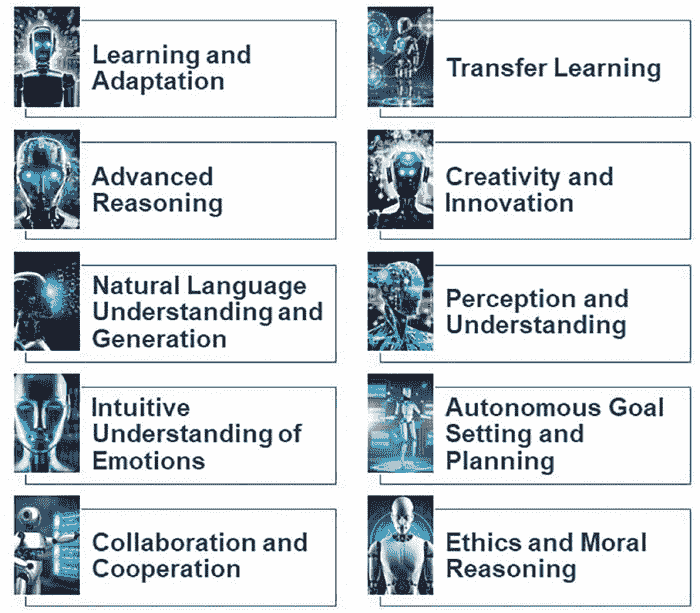

**图 1.2:** AGI-能力概述

对于这 10 个能力中的每一个，我们将：

1.  在 AGI 的背景下定义这一能力。

1.  讨论它在企业环境中的重要性。

1.  评估 GPT-4 实现这一能力的程度。

1.  提供 GPT-4 在企业环境中利用这一能力的例子。

1.  探讨 GPT-4 在应用这一能力时的局限性或挑战。

现在，让我们开始这次探索之旅，从第一个 AGI 能力开始：

+   **学习和适应**

**图 1.3:** 学习和适应

+   **定义：** AGI 能够从各种信息和经验中学习，适应其知识和技能到新的和不断变化的环境中。这包括吸收新信息的能力，根据反馈演变响应的能力，以及随时间不断更新理解的能力，反映了企业和市场的动态性质。

+   **重要性：** 学习和适应的能力是成功企业运营在快速变化的世界中的基石。它促进了流程、策略和互动的不断改进，使组织能够保持竞争力、创新性，并对新兴趋势和挑战做出响应。

+   **实现：** GPT-4 展示了这一 AGI 能力，具有从演示、外部来源和用户反馈中获取知识的能力，并将这种学习应用于未来的互动中。它能够根据前文理解对话的上下文，并调整其回应以匹配用户输入的语气或风格。

+   **例子**：GPT-4 可以通过综合来自各种来源的知识动态地解决商业查询，比如向制药公司提供关于药物进展的见解，或向金融团队提供监管合规策略。它根据特定行业需求调整建议，比如为特定人口统计推荐电子商务实践，或为人力资源部门设计远程工作策略。通过分析历史数据和当代趋势，GPT-4 可以帮助企业应对与供应链挑战、新市场人口统计或电动汽车等行业转变相关的颠覆。

+   **限制**：尽管具有这些能力，GPT-4 在学习与其预训练知识基础显著偏离的概念时可能会面临挑战，比如反常识学习或理解新的商业模式。它也可能在实时适应快速发展的情况或超出其训练数据范围的主题时遇到困难。

+   **迁移学习**

**图 1.4**：迁移学习

+   **定义**：AGI 具有将在一个领域获得的知识和技能应用到另一个领域的能力，而不需要进行大量的重新训练。在企业中，这采取了跨学科整合的形式，涉及利用不同学科的知识和见解来解决复杂问题。

+   **重要性**：迁移学习使得 AGI 能够适应多样的背景并参与广泛话题的讨论。在企业环境中，跨学科整合可以促进综合解决方案的开发，并通过整合多元化的观点和功能来促进创新。

+   **实现**：作为 AGI 的能力，GPT-4 可以在不需要明确重新训练的情况下在不同领域之间转移知识，增强了其在多个学科中的应用。这使得 GPT-4 能够在跨学科知识基础上提供深入见解。

+   **例子**：GPT-4 可以在生态学对话中运用其关于动物及其特征的知识，或者在讨论体育分析时应用对统计学的理解。在商业环境中，它可以利用心理学和数据科学的见解提出解决营销挑战的方案，通过整合工程、美学和用户体验的原则来策划产品设计，或者利用人力资源、组织心理学和传播学的见解提供改善公司文化的全面方法。

+   **限制**：在不同领域之间转移知识并保持准确性可能对 GPT-4 构成挑战，可能导致潜在的不准确或无关的信息生成。同样，虽然它可以整合不同领域的知识，但在专业领域的理解深度可能会受到限制。

+   **高级推理**

**图 1.5**：高级推理

+   **定义**：在 AGI 的背景下，高级推理指的是展示和结合多种形式的人类和机器级别思维的能力。

+   **演绎推理**是生成最佳解释特定观察结果的假设的方法，经常用于根本原因分析等情况。

+   **演绎推理**从一般陈述或前提中得出具体结论。

+   **归纳推理**从具体观察中得出广泛的概括。

+   **类比推理**通过比较一个情况（源）与另一个通常不相关的情况（目标）的相似之处来得出见解。

+   **常识推理**使得能够理解和推断基本的共享知识，这是普通人会隐含知道的。

+   算法推理涉及“像计算机一样思考”来解决问题，利用明确定义的迭代过程和条件逻辑来得出解决方案。

+   重要性：在商业中，高级推理是必不可少的。无论我们是在追求效率还是实现收入目标，都会使用这种能力。在日常工作中，它在与同事、客户和供应商的沟通中起着作用，有助于建立理解和信任。在项目管理中，推理有助于应对挑战，找到解决方案，并与利益相关者协调。总的来说，无论是在战略还是日常任务中，各种形式的高级推理都是企业环境中的常驻存在。

+   实现：GPT-4 在各种推理形式上的熟练程度源自其广泛的训练方法。它接受的下一个单词预测任务锻炼了其推测推理能力，有助于从观察到的上下文中形成合理的假设。它对演绎推理的扎根来自于对逻辑文本的接触，增强了其制定逻辑一致的推断的能力。它在归纳推理方面的熟练程度是通过对大规模数据集的统计模式识别得出的，使其能够从具体观察中进行概括。此外，它的类推和常识推理是通过广泛的训练数据培养出来的，其中包括大量的比较、日常场景和关系结构。最后，它在算法推理方面的显著程度归因于对数百万代码示例的训练，并通过最近的终端用户编程插件得到进一步改进。

+   例子：

+   推测性推理：注意到电子商务网站用户活动突然下降 30％，可以使用推测性推理来假设最近的网站更新引入了破坏性的错误。类似地，特定产品销量的急剧下降可能指向因素，如竞争对手的产品推出或最近的差评。季度间 KPI 下降 15％可能与政策变化或市场波动有关。

+   演绎推理：引入在发货前进行额外质量检查的政策可能会减少客户投诉，但会延长交货时间，这是根据演绎推理得出的结论。如果零售商的目标是将在线销售提高 20％，那么专注于实体店广告可能不是最佳策略。同样，一个已经消耗了 70％预算的中途建设项目明显表明在没有额外资金的情况下可能会出现超支。

+   归纳推理：分析五年的销售数据，显示 11 月和 12 月的销售额激增，表明明年也可能会有增长，这是通过归纳推理得出的结论。这种方法还可以发现消费者行为的模式，为促销机会和分析重复执行模式来简化业务流程。

+   类推推理：零售公司可能会推断出类似竞争对手的忠诚计划可能会成功，类似地，科技公司可能会看到订阅模式的好处，并与流媒体服务进行类比。从汽车行业学习，食品公司可能会采用减少浪费的策略，预期获得类似的效率提升。

+   常识推理：常识告诉我们，在寒冷气候的地方，推迟推出新的冰淇淋口味是明智的。它可以将 7 月份客户咨询的增加归因于夏季活动，并权衡沿海工厂搬迁的利弊，考虑到运输成本和房地产价值。

+   算法推理：在软件开发中，算法推理有助于打造高效的系统和简化 IT 支持。它还有助于在商业场景中进行临时问题解决，帮助精确计算成本和项目规划，并协助从大型数据集中获取洞察进行战略规划，尽管需要谨慎管理以避免数据安全和偏见问题。

+   限制：尽管 GPT-4 具有令人印象深刻的推理能力，但它确实存在显著的限制：

+   演绎推理：GPT-4 可能过于依赖其训练数据，导致偏见和潜在的不正确的假设，因为它有时会混淆相关性和因果关系。此外，它缺乏对现实世界因果关系的深刻理解，从而阻碍了其在物理学和工程学等领域进行深刻推理的能力。

+   演绎推理：GPT-4 在复杂情景中，尤其是数学背景下，可能会面临挑战，有时会导致逻辑错误或错误的方法。

+   归纳推理：当面对稀疏或模糊的数据时，模型可能会产生过于泛化的理论，从而限制了归纳的准确性。

+   类比推理：在将不同情况进行类比时，GPT-4 可能存在过于简化的风险，可能导致过于泛化或不准确的建议。

+   常识推理：在复杂或高度特定的场景中，GPT-4 可能并不总是能够有效地应用常识推理，导致缺乏深度或现实世界背景的回应。

+   算法推理：尽管经过训练，GPT-4 有时会产生不正确或低效的算法，特别是对于复杂的、未知的问题，这表明它在超出训练参数的创新能力受到限制。

+   创造力和创新！

图 1.6：创造力和创新

+   定义：AGI 具有通过结合和重组现有知识来生成新的想法、概念和解决方案的能力，从而展现出创造力和创新。在商业环境中，这种能力通常包括生成独特的解决方案或概念，以及具有超前思维的能力。

+   重要性：创造力推动创新，推动业务增长，并在竞争激烈的市场中使公司区别于他人。

+   实现：作为 AGI 能力的展示，GPT-4 可以生成创造性和创新性的内容和文本，有效地为各种讨论引入新的视角。

+   例子：GPT-4 生成故事、诗歌或创新产品描述的能力是其创造力的一个例子。此外，在企业环境中，GPT-4 可以根据公司现有的产品组合和市场趋势，提出新颖的产品特性。它可以提出从不同行业成功营销活动中汲取灵感的独特营销策略，并提出创新的解决方案来改善员工参与度或简化工作流程。GPT-4 还可以为用户提出非常规的问题解决方案。

+   限制：GPT-4 的创造力受到其训练数据的限制，限制了其“跳出框框”的能力。它在处理与过去经验几乎没有共同点的全新情况时会遇到困难。

+   自然语言理解和生成！

图 1.7：自然语言理解和生成

+   定义：AGI 能够理解和生成多种人类语言的文本，从而实现无缝沟通和理解复杂、微妙的思想。这不仅包括对语言的字面理解，还包括推断意图、识别语境以及处理讽刺、模棱两可和文化特定引用等微妙之处的能力。

+   **重要性**：在商业世界中，有效的沟通至关重要。理解和生成自然语言的能力使 AGI 能够与用户无缝互动，理解复杂的查询，产生易于理解的输出，并有效地参与讨论，使其成为各种业务功能中不可或缺的工具。

+   **实现**：GPT-4 展示了这种 AGI 能力，表现出对自然语言的复杂理解和生成的能力。这使它能够理解复杂概念，进行有意义的互动，并产生类似人类的回应，增强了它在各种应用中的多功能性。

+   **例子**：GPT-4 可以理解和生成对各种语言的复杂查询的回应，有效地模拟人类对话。例如，它可以帮助起草商业沟通、提供客户查询的详细回应、分析和总结长篇报告，或者通过生成创意想法参与头脑风暴会议。它还可以产生连贯的长篇文本，比如起草文章或博客帖子。

+   **限制**：尽管 GPT-4 在语言理解方面表现出色，但在面对模糊、口头或文化特定的语言时，它偶尔会出现失误。它也可能在需要对世界有深刻理解的语境中，理解和生成语言时遇到困难，因为它的训练数据之外的世界。此外，虽然它可以模拟对话，但它并不真正像人类那样理解语言，它的回应是基于训练数据中识别的模式而非真正的理解。

+   **感知和理解**

**图 1.8**：感知和理解

+   **定义**：AGI 具有处理和解释来自环境的感官信息的能力，如视觉、听觉和触觉数据。它将理解和解释不同类型的数据，从非结构化文本到结构化数据库和图像，从而以类似人类的方式理解世界。

+   **重要性**：在商业环境中，感知和理解能力使 AGI 能够解析大量数据，过滤噪音，识别模式，并得出见解。这对于分析客户反馈、解释市场趋势、检测数据中的异常或基于复杂数据集做出明智决策至关重要。

+   **实现**：展示了 AGI 能力，GPT-4 可以感知和理解基于文本、代码、图像和音频的数据。借助插件¹²的帮助，它的能力进一步扩展到其他形式，如视频和网络内容。

+   **例子**：GPT-4 可以解释和生成代码片段，从而帮助软件开发。它可以理解复杂的科学论文，从而协助研究任务。它可以理解文本中描述的抽象概念，这使得它在战略制定和决策方面非常有用。此外，GPT-4 可以从图像中提取信息，生成产品描述，回答客户问题或找到匹配的物品。对于基于音频的任务，GPT-4 可以处理和转录记录的商务会议，高效地总结要点和行动项。

+   **限制**：虽然 GPT-4 擅长处理文本、代码、图像和音频输入，但它的能力并非天生适用于处理视频和触觉数据。这意味着，没有额外的插件或专门工具，GPT-4 在理解和分析视频序列、肢体语言或物理互动方面会面临挑战。此外，它可能会在处理它在训练数据中可能没有见过的异常或矛盾感知时遇到困难。

+   **情感的直观理解**

**图 1.9**：情感的直观理解

+   **定义**: AGI 能够识别和回应人类情绪，从而改善人机交互和同情心。这涉及解释文本和语境线索，以识别和理解各种人际情况中潜在的情绪。

+   **重要性**: 对情绪的直观理解是任何商业环境中成功沟通和建立关系的关键方面。它能够促进有效的客户互动，促进团队动态，并促进积极的工作环境。

+   **实现**: GPT-4 通过识别文本线索中的基本情绪，展示了这种 AGI 能力，表现出解释和适当回应用户输入情绪的能力。它利用这种能力来定制其回应，在人类般的互动中模仿同情心。

+   **例子**: GPT-4 可以在用户消息中检测情绪，并根据感知到的情绪调整其回应。例如，它可以对表达痛苦或沮丧的消息做出同情或支持性的回应。它还可以根据用户的情绪调整其沟通风格，例如对友好消息采取更随意的语气，或者在专业环境中采取更正式的语气。此外，理论上，GPT-4 可以在客户服务场景中发挥作用，识别客户反馈中的不满，并建议采取补救措施以提升客户体验。

+   **限制**: 虽然 GPT-4 可以根据文本线索识别和回应情绪，但其理解不如人类那样微妙或准确。它缺乏深度理解情绪的情商。它也可能在复杂的情绪状态或需要高情商的情况下遇到困难，因为它并不真正经历情绪。

+   **自主目标设定和规划**

**图 1.10**: 自主目标设定和规划

+   **定义**: AGI 能够设定自己的目标并制定计划实现这些目标，展示出自我激励和自我导向。这种自主制定策略并实施有目的计划的能力是自我调节的一个重要组成部分。

+   **重要性**: 自主目标设定和规划使系统能够独立工作，预见潜在挑战并制定解决方案。这种能力可以通过减少人为干预和加速决策过程来提高生产力，特别是在项目管理、战略规划和实现复杂的长期目标等任务中。

+   **实现**: 虽然 GPT-4 并未完全展示出这种 AGI 能力，但它在目标导向规划方面取得了进展，能够根据用户提供的目标和计划执行的中间状态生成行动计划。

+   在商业世界中，GPT-4 可以成为目标驱动任务的宝贵盟友。例如，如果一家公司的目标是扩大市场份额，GPT-4 可以起草涉及竞争对手分析、发现未开发市场以及产品差异化策略的计划。同样，当面临简化内部流程的目标时，GPT-4 可以提出包括自动化重复任务、优化工作流程以及提出增强团队协作的工具的任务顺序。此外，为了提高客户满意度的目标，GPT-4 可以制定涉及分析客户反馈、提出服务协议改进以及制定新的客户参与策略的计划。

+   **限制**: GPT-4 的能力受其编程和缺乏自我激励和自我导向的限制，这可能限制其自主功能。虽然它可以对实现用户定义目标做出重大贡献，但 GPT-4 不能（也不应该）独立制定自己的目标或根据变化的情况修改目标。

+   **合作与协作**

**图 1.11**：合作与协作

+   **定义**：AGI 具有与人类和其他 AGI 系统共同工作的能力，实现协作解决问题和团队合作。这种能力，特别是在企业环境中，涉及理解、解释和预测群体或社区内的社交暗示、行为和互动，这对于管理团队、处理客户互动或应对涉及人际关系的任何情况至关重要。

+   **重要性**：有效的合作和协作，以及熟练的社交理解，对于良好的商业环境至关重要。

+   **履行**: GPT-4 通过在单用户环境中提供帮助和生成回应来展示这种 AGI 能力。它还表现出在社交理解方面的高水平，使其能够在各种社交和商业环境中以人类般的理解和回应进行交流。

+   **例子**: GPT-4 可以在头脑风暴会议中协助用户，为解决难题做出贡献，或对书面内容提供建设性反馈。此外，它可以根据社交和文化趋势预测客户对新营销活动的反应，并根据对员工反馈的分析提供建议，改善公司文化。

+   **限制**：GPT-4 对多用户环境和人际动态的理解有限，降低了其在复杂协作情况下的效果。尽管它在社交理解方面表现出色，但可能无法完全捕捉人际互动的微妙之处，这些互动可能是微妙且高度依赖于情境的。

+   **道德和道德推理**

**图 1.12**：道德和道德推理

+   **定义**：AGI 理想上应设计为融入道德原则和道德推理，使其能够根据人类价值观和社会规范做出决策和行动。在商业环境中，这涉及在做出决策时理解和应用道德原则，这对于维护组织的完整性、企业社会责任和公众信任至关重要。

+   **重要性**：道德决策贯穿公司行为的各个方面，直接影响着公众对公司的看法。这是维持“社会经营许可”的重要组成部分。

+   **履行**: GPT-4 展示了这种 AGI 能力，能够根据其训练数据中遇到的情景进行基本的道德推理。虽然 GPT-4 理解道德原则，但其对这些原则的应用受其编程和提供给它的道德框架的限制。

+   **例子**：GPT-4 可以识别有害或冒犯性内容，在敏感话题上提供平衡的观点，甚至在特定情况下提出道德上可接受的替代方案。在商业环境中，它可以评估商业决策的潜在道德影响，比如实施新的数据收集政策。它可以帮助起草与公司价值观和承诺一致的企业社会责任声明。GPT-4 还可以评估公司运营中潜在的道德问题，比如利益冲突或信任违反。

+   **限制**：GPT-4 对复杂道德困境的理解和应用可能有限，可能缺乏对人类价值观和情感的深刻理解。它的道德指导也受其训练数据和编程框架的影响，这可能无法捕捉人类道德的全部复杂性和微妙之处。

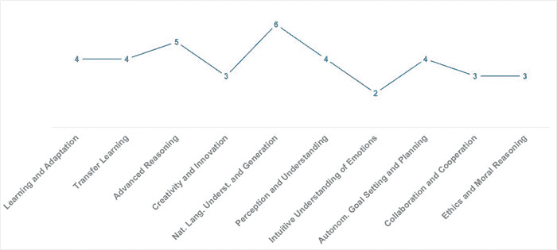

**图 1.13**：GPT-4 的 AGI 能力评估

总之，GPT-4 在自然语言理解和生成（6/6）和高级推理（5/6）方面表现出了显著的熟练度。它在学习和适应、迁移学习、感知和理解以及自主目标设定和规划方面也表现出色（4/6）。GPT-4 在创造力和创新、合作与合作以及道德和道德推理方面的能力令人满意（3/6），而它在情感直觉理解方面的表现则过于基础（2/6）。有关这些分数的视觉表示，请参阅*图 1.13*。

# ChatGPT-4 插件

2023 年 3 月，OpenAI 发布了一套基于 API 的集成插件，以增强 ChatGPT-4 的功能，这是 GPT-4 的聊天机器人版本。在随后的几个月里，OpenAI 和外部提供商继续推出额外的插件，进一步增强了模型的多功能性。

OpenAI 为新的 ChatGPT-4 插件提供在线注册流程，确保质量和功能。这些插件目前是免费的，并成为 ChatGPT-4 系统的一部分，消除了单独许可协议的需要。与任何软件工具一样，它们应该根据特定企业环境的功能、可用性和潜在好处进行评估。

接下来的章节将深入探讨对企业特别重要的插件类别，涵盖了从最终用户编程和内容理解到内容创建和软件开发的各个方面。虽然有大量针对个人消费者量身定制的插件，涵盖了购物、职业发展、旅行和娱乐等领域，但这里的重点是那些提升业务效率、促进数据驱动决策，并在企业环境中倡导智能自动化的插件。

以下是 OpenAI 为企业特别有利的 ChatGPT-4 插件类别的精选列表：

+   **最终用户编程**：这些插件旨在为最终用户提供探索性数据分析、可视化、数据库查询、网站创建、机器学习和临时问题解决，即使他们缺乏计算背景：

+   **基本探索性数据分析**

+   **基于电子表格的数据分析**

+   **电子表格助手和电子表格 AI**：与电子表格互动，允许用户进行数据分析、过滤和可视化。简化了与电子表格数据交互的过程，并提供了更好的体验。

+   **数据表聊天和与 Excel 聊天**：提供一个与电子表格交流的交互平台。设计给那些希望以更直观的方式与他们的数据表交互的人。

+   **数据可视化**

+   **daigr.am**：使用户能够在聊天界面内直接制作数据的视觉表示。适用于那些希望以视觉上引人注目的方式分析、跟踪或呈现数据的人。

+   **可视化您的数据**：将原始数据即时转化为清晰的视觉和图表。专为需要快速简单地以视觉方式表示其数据的用户量身定制。

+   **图形构造器**：帮助生成提供的数据集的蜘蛛图和条形图。设计给那些想要快速获得特定类型的视觉数据表示的用户。

+   **OpenAI 的高级数据分析**：这个工具，之前被称为代码解释器，适用于初学者和有经验的用户，可以将高级描述转化为功能性代码。以下是它的特点：

+   **复杂的探索性数据分析**

+   **问答**：使用户能够获取有关给定数据集的问题的答案。

+   **可视化**：制作查询结果的视觉表示，使复杂信息更易理解。

+   **统计操作**：配备了各种工具，执行灵活的统计分析。

+   **简单文本分析**：便于文本处理和评估。

+   **机器学习**

+   模型创建和执行：简化了构建和运行简单机器学习模型的流程。

+   可视化：将机器学习模型的结果转化为可视化格式。

+   临时问题解决：该插件还可用于算法解决一次性问题，类似于 NoCode 方法，同时避免了软件开发生命周期。例如：

+   数据映射：可以根据映射逻辑的口头描述，将任何输入格式的文件转换为请求的输出格式。

+   供应链优化：根据约束条件的描述（例如，有限的库存或资源）和优化目标（例如，最小化成本或交货时间），系统地创建解决方案候选，并为每个检查过滤条件。然后，它根据其实现目标对候选进行排名。

+   成本计算：提供自然语言的计算逻辑和原始数据作为输入文件，可以在早期销售或购买情景中进行结果成本的临时计算。

+   基于情景的规划：根据规划情景的描述（例如，一个项目或一系列研讨会）以及已知的约束条件，可以在聊天对话框中或作为输出文件计算出一个指示性的时间表。

尽管 OpenAI 的高级数据分析功能全面，但也存在一些局限性。这些包括有限的 Python 库数量，受限的计算资源，缺乏持久存储，以及无法处理图形用户界面和实时交互。

+   其他高级分析插件

+   Noteable：为专业开发人员和数据科学新手设计，Noteable 提供了类似于 OpenAI 高级数据分析的功能。它简化了数据探索、可视化和转换，促进团队之间的协作努力。借助其深度学习能力和无缝的互联网集成，用户可以创建高级模型并利用在线资源。

+   AI 数据分析师：AI 数据分析师提供了一个用户友好的界面，可以在不编写代码或复杂查询的情况下深入数据。它管理数据清洗任务，包括处理缺失值和重复项，并支持归一化等转换。此外，它还提供了统计分析、多样化的可视化选项，以及回归和分类的预测建模。

+   数据解释器：数据解释器利用安全的 Python 代码解释器进行数据分析。用户可以上传数据集，用简单的英语提问，或直接输入 Python 代码进行复杂的分析。该平台支持从查询数据库到可视化结果的广泛数据任务，并允许导出洞察力以供进一步利用或报告。

+   数据库查询

+   AI2sql：将用户友好的语言转换为数据库命令。专为那些需要访问数据库但不熟悉技术查询语言的人设计。

+   AskYourDatabase：将用户问题转换为数据库查询，并以简单语言提供结果。旨在使数据库对普通用户更加可访问。

+   与您的数据交谈：将知识图谱与对话界面相结合，使用户可以无缝地与其数据进行交互。使用户能够用自然语言与其数据交谈。

+   简单的网站构建

+   ABC 网站制作：接受用户聊天提示并生成相应的网站代码。简化了将想法转化为 Web 应用程序的过程。

+   A A A 网站制作：帮助创建 Web 应用程序和定制网站。专为寻求简单 Web 开发工具的用户量身定制。

+   WebDev：提供一个环境，可以直接从聊天交互中构建、预览和测试网站。适用于那些希望快速原型设计网站的人。

+   **B12 AI 网站**：使用自然语言描述来制作网站。适用于那些想要网站而不想涉足网页设计技术的用户。

+   **通用应用开发**

+   **Back4App**：使用自然语言促进应用程序的创建、部署和扩展。适用于想要管理应用程序和相关资源而不深入技术细节的用户。

+   **内容理解**：此类别包括旨在增强用户在管理和与各种内容类型交互的体验的插件，从基于文本的文档到图像和视频：

+   **文档交互和问答**

+   **文档 AI 和 Talk with Docs**：与各种文档格式（包括 PDF、文本文件和 PowerPoint 演示文稿）进行交互，回答问题并提供见解。适用于需要从其文档中快速获取答案的用户。

+   **AI PDF 和 AskYourPDF（专业版）**：增强文档导航、内容可访问性和与 PDF 内容的互动。这些工具专为高效信息提取而设计，尤其是在商业文档中，并通过引用页码提供准确的事实核查。

+   **ChatWithPDF 和 MixerBox ChatPDF**：实现与 PDF 的实时交互，提供强大的搜索功能和简化的链接共享。这些插件适用于需要高效信息提取和与 PDF 书籍和其他文档的协作的用户。

+   **Ai Drive**：提供一个有组织的个人驱动器，用户可以与其 PDF 文件聊天、获取摘要并得到问题的答案。适合那些想要保持其 PDF 交互有序和集中的用户。

+   **网站理解**

+   **ChatWithWebsite**：利用 magicform.ai 的功能与网站互动以回答问题。适用于需要直接从网页内容获取见解的用户。

+   **网页摘要生成器**：输入网站链接，接收简洁的摘要。适用于那些想要快速概览网页内容而不想进行详细阅读的用户。

+   **图像理解**

+   **ChatOCR**：使用 OCR 技术将印刷或手写文档转换为数字文本。适用于想要从实体文档中数字化并轻松获取信息的用户。

+   **SceneXplain**：分析视觉内容，提供对图像的全面解释。适用于寻求对图像的艺术风格、情感、场景和历史背景的见解的用户。

+   **Pixellow**：从图像中提供见解并生成详细的标题和描述。适用于那些想要更深入理解视觉内容的用户。

+   **视频理解**

+   **视频见解和 AI 视频摘要生成器**：分析 YouTube 视频，提供摘要并回答有关内容的问题。适用于想要快速概览或对视频有特定查询的用户。

+   **MixerBox ChatVideo、视频摘要和 YT 摘要生成器**：提供 YouTube 视频的简洁摘要。适用于寻找视频的主要亮点或关键点的用户。

+   **视频字幕**：将 YouTube 视频转录成文本，使用户能够提问、创建章节并获取摘要内容。适用于那些更喜欢阅读或需要视频的书面记录的用户。

+   **vidIQ - 发现和 YouTube 摘要**：为 YouTube 视频提供见解和摘要。旨在满足想要快速发现和理解视频内容的用户需求。

+   **异构内容**

+   **SummarizeAnything.ai**：将来自各种来源的广泛内容转换为简洁摘要。适用于从 YouTube、网页和 PDF 中快速获取见解的用户。

+   **OpenAI 的高级数据分析中的 OCR 和媒体处理**：处理光学字符识别（OCR）任务、音频处理和其他媒体中心操作。适用于从图像中提取简单文本和基本媒体处理。

+   **信息检索和理解**：这套插件旨在简化从多种来源检索和理解信息。它们包括网络搜索、网站抓取、问答和知识管理，确保用户能够高效地找到、消化和利用内容：

+   **网络搜索**

+   **OpenAI Browse with Bing**：使用必应 AI 浏览互联网，获取相关的最新信息并引用来源。它曾经停用了几个月，现在允许网站控制它们与 ChatGPT 的交互方式。

+   **网络请求**：在聊天界面内直接访问谷歌和维基百科等平台。根据用户查询获取并呈现相关信息。

+   **WebPilot**：提供全面的网络辅助，从搜索和提取信息到翻译和简化内容。还提供特定网络互动和从 URL 创建内容的导航工具。

+   **KeyMate.AI Search**：利用 AI 驱动的网络爬虫进行增强搜索结果。提供用户友好的聊天界面和自定义选项。

+   **BrowserOp**：在单个查询中实现多网页浏览，允许用户指定他们的信息需求，无论是来自特定网站还是更广泛的主题。

+   **MixerBox WebSearchG**：利用由谷歌搜索 API 提供的定制搜索引擎进行全面的互联网搜索，详细的网页摘要和对网页内容的具体问题的直接答案。

+   **BrowserPilot**：在多个 URL 上提供实时搜索结果。

+   **TotalQuery Search**：利用 70 多个搜索引擎进行全面的网络发现。

+   **MindfulDataAI**：利用谷歌进行最近的搜索。旨在为用户提供关于当前话题的最新信息。

+   **网站抓取**

+   **Aaron Browser**：使用实时谷歌搜索结果从多个网站中提取数据。旨在进行全面的互联网爬行、内容聚合、监控和提取。

+   **Scrapee 和 Scraper**：通过提供网站链接从任何网站提取内容。简化了网络内容检索过程，实现高效的信息收集。

+   **网络问答**

+   **维基百科**：提供有关一般知识、时事和突发新闻的答案。直接从维基百科获取最新信息，以提供可靠的见解。

+   **Wolfram ChatGPT**：提供跨越各个领域的策划知识、实时数据和可视化。支持计算、数学问题解决，并从科学到股票市场信息提供数据可视化。

+   **知识管理**

+   **自定义知识**：允许用户搜索内部公司文件、Google 文档和 Confluence 页面。通过访问一系列链接的文档，提供个性化答案。

+   **FileChat**：专注于文件管理、深度分析和快速信息检索。作为个人 AI 助手，使用用户特定数据回答查询。

+   **AskYourKG**：帮助用户组织和与他们的知识（图[14]）进行交互。通过与上传到特定网站的文档进行基于聊天的交互，促进交互式文档理解。

+   **内容创建**：这些插件集合为用户提供了生成各种内容类型的简单解决方案，从图表到视频。这些工具涵盖了一系列内容需求：

+   **图表创建**

+   **Show Me**：将原始数据和概念转化为可视化，从关系图到时间表。让用户理解复杂信息，可视化流程，并在线编辑图表，满足多样化的可视化需求。

+   **Whimsical、MixerBox 和 Scrive Diagrams**：专门制作和展示各种图表，包括流程图和思维导图。这些工具增强了头脑风暴会议和流程详细说明，适应多样化的可视化需求。

+   图表、橡皮擦和绘图：提供一系列功能，从与可视化平台集成到从代码和自然语言生成图表。它们面向广泛的受众，从编码人员到视觉爱好者。

+   WizeCharts：专注于通过可定制的图表提供深入的数据可视化，使用户能够创建、编辑和分享见解。

+   文档创建

+   Doc Maker 和 Doc Maker A+：专注于快速文档生成，从简历和求职信到提案。这些工具支持包括 PDF、DOCX、XLSX、CSV 和 HTML 在内的各种格式，重点是使用 A+变体生成更高质量的文档。

+   Doc Editor：专注于快速文档创建和强大的编辑功能，简化了制作和完善文档的过程。

+   WriteEasy 和 AISEO 文章写作：通过生成基于提供的主题、链接或数据的文章来满足内容创作需求。WriteEasy 提供一般文章创作，而 AISEO 文章写作强调迅速生成基于搜索引擎结果页面的、自然语言处理友好的内容。

+   演示文稿制作

+   Smart Slides 和 Present it：专注于快速 PowerPoint 演示文稿生成。通过简单输入要求，这些工具制作全面且可下载的 PPT。

+   MagicSlides.app：将想法转化为演示文稿，简化了从构思到可视化的过程。

+   Canva：一款多功能设计工具，允许用户轻松创建各种视觉，从演示文稿和标志到社交媒体帖子等。

+   图像生成

+   MixerBox ImageGen：使用 DALL·E 2 技术从文本描述生成图像，将自然语言理解与计算机视觉相结合。具有可定制格式、文本叠加和独特提示建议等功能，适用于为各种项目制作图像，从博客到网站。

+   Argil AI：简化图像生成过程，消除了复杂提示的需求。它专为寻求快速视觉创作的用户设计。

+   Michelangelo：利用 DALL-E 2 生成受各种艺术风格启发的图像。它专为那些希望在视觉中融入艺术气息的人设计。

+   Placid.app：作为设计助手，将模板转化为营销视觉。它专为希望通过高级图形提升营销材料的用户量身定制。

+   故事创作

+   Stories：使用户能够制作视觉丰富的故事，并配以文本生成的图像。具有字体定制、动画和直接社交媒体分享等功能，旨在提高在搜索引擎上的可发现性，扩大故事的全球受众范围。

+   视频生成

+   Visla：利用人工智能将用户提供的主题转化为利用现成素材制作的吸引人的短视频。通过分析输入文本的关键主题，选择合适的视频片段、图像和音频。除了内容创作，Visla 还通过元标签、描述和关键字丰富的字幕优化搜索引擎可见性。

+   CapCut：通过允许人工智能起草剧本、寻找合适的素材并将元素组合成精致视频，将视频概念变为现实。它专为寻求直观视频创作体验的用户设计。

+   流程自动化：这些插件为用户提供了简化和自动化各种任务和交互的人工智能解决方案。从使用 AI 代理管理复杂任务到与数千个应用程序集成，旨在提高效率和生产力：

+   AI 代理：在 ChatGPT 中模拟智能代理，一旦接收到目标提示，就会制定和执行增加生产力的战略计划。

+   **Zapier**：在 ChatGPT 界面内直接与 5000 多个应用程序进行交互。通过在这些平台上自动化任务，简化操作和管理多个平台。

+   **FakeAGI**：使用 AI 代理自动化目标，处理任务并记录结果在 Google 电子表格中。它专为寻求任务管理支持和文档化的用户设计。

+   **软件开发**：这些插件专为软件开发和基于程序的数据分析而设计。从探索 GitHub 存储库和在多种编程语言中运行代码到简化数据处理，这些工具旨在增强编码体验并促进更深入的理解和协作：

+   **AskTheCode 和 ChatWithCode**：允许用户深入 GitHub 存储库，可以通过提供特定 URL 来查询代码方面的内容，也可以根据查询进行搜索。这些工具在聊天界面内直接弥合了代码探索和理解之间的差距。

+   **CoderPad 和 CodeRunner**：提供一个编码环境，用户可以在 30 多种编程语言中运行代码，并进行自动设置、编译、保存，甚至创建图表和图形可视化。它们满足了编码和数据可视化的需求。

+   **值得注意的是**：简化数据探索、可视化、清洗和转换，增强团队协作。具有深度学习能力和访问在线库的能力，帮助用户构建高级模型并有效利用代码更新。

通过插件的集成，ChatGPT-4 超越了其作为文本/代码为基础的语言模型的基础角色，成为了一个强大的生成式人工智能工具，擅长处理网页内容、图像和视频等其他关键形式。我们将在最后一个关于本地多模态的小节中更详细地介绍这一重要方面。插件增加的其他关键功能包括最终用户编程、信息检索和流程自动化。

# 将交互与操作结合：GPT 模型中对外部工具的访问

OpenAI 的 GPT 模型，特别是 GPT-3.5-Turbo 和 GPT-4，在 2023 年 6 月进行了重大升级，使它们能够通过生成 API 函数调用与外部工具进行交互。在深入讨论之前，有必要清楚地区分插件和这个新功能。之前的小节广泛讨论了插件，这些是需要正式注册到 OpenAI 的特定增强功能。一旦注册，这些插件就成为 ChatGPT-4 的扩展，可供 ChatGPT 用户社区使用。

相比之下，集成外部工具提供了一种更灵活的机制，可以使 GPT 模型与任何企业应用进行合作。例如，ERP（企业资源规划）、CRM（客户关系管理）和 SCM（供应链管理）系统。扩展其影响范围，GPT 模型还可以与企业特定的搜索引擎、内部网站、数据库和专门的 ML 模型进行接口，确保与组织 IT 生态系统的无缝融合。

开发人员可以指示像 gpt-4-0613 和 gpt-3.5-turbo-0613 这样的 GPT 模型在满足特定条件时生成特定的函数调用，而不是自然语言。这些模型能够在每个用户输入上检查这些条件，并在满足条件时创建符合预期格式的相应函数调用。主程序只需执行函数调用并处理其结果，这可能涉及另一个提示给 GPT 模型以提供自然语言的摘要，然后可以显示给用户。

本质上，这种增强将 GPT 模型转变为企业应用的动态集成器，将人工智能的视野扩展到了超越语言处理的范畴。

# 集成到企业软件中

标准化的企业软件在推动效率和协作方面发挥着关键作用，特别是在大型企业中。由于其广泛的功能、健壮性、可扩展性和安全性，这些综合软件包得到了广泛的利用。

随着生成式人工智能的不断进步，这些软件系统有机会进一步增强其能力和价值。微软、ServiceNow、SAP 和 Atlassian 等开发这些软件产品的公司正在探索将 GPT 模型整合到其产品中的方式。在这里，我们描述了这些努力以及它们如何促进企业软件解决方案的转型。

自 2019 年以来，微软和 OpenAI 的合作是 GPT-4 能力如何被现有的企业常用生产力软件套件所利用的主要例子。2022 年标志着 OpenAI 的 GPT 模型被整合到微软企业产品中的开始，这一过程在 2023 年获得了重要的动力。以下是这一合作的当前主要成果：

+   首先，微软在其 Azure 云服务中提供了 OpenAI 产品：

+   Microsoft Azure ChatGPT 通过与其他 Azure 服务和企业特定数据源集成的插件支持，为用户提供隔离 OpenAI 运营的隐私保护。

+   Azure OpenAI Service 集成了 OpenAI 的预训练 AI 模型，并扩展了现有的 Azure AI 能力，包括自然语言处理和计算机视觉。该服务提供了 Chat Playground，具有 GPT-3.5-Turbo 和 GPT-4 支持，Legacy Playground，具有 GPT-3、GPT-3.5 和 Codex 模型，以及 DALL-E Playground。此外，还有一个“Bring Your Own Data”区域，用于将 GPT 模型与企业数据进行关联。该平台还提供部署管理工具和内容过滤设置。

+   然后，微软的 Bing Chat Enterprise 提供了与 ChatGPT-4 类似的用户体验，同时确保完整的组织数据保护并同时访问 DALLE-E。典型的使用案例包括：

+   内容创建和修改：

+   从用户提示中生成各种业务内容，如电子邮件、报告或流程描述。

+   调整文本的语气或风格，包括乐观、专业或各种写作格式。

+   通过添加简洁、正式和创造性等元素来改进现有的写作。

+   图像生成和定制：

+   直接从用户提示中创建和修改图像。

+   探索各种创作主题，包括安全、环保意识和数字前景。

+   通过更改颜色方案、样式或背景细节修改生成的图像。

+   直观互动和个性化响应：

+   使用自然、对话式语言进行搜索和交互，适应简短和详细的输入。

+   提出复杂问题并获得相关答案，系统保持上下文以进行后续查询。

+   使用提示自定义 Bing 的响应格式，例如请求项目符号、表格或简化语言。

+   比较、摘要和实时信息：

+   进行详细的比较，并接收企业、技术、市场等的简洁摘要。

+   获取最新商业事件或突发财经新闻的几乎实时结果。

+   查看和重新访问先前创建的内容和图像。

+   其他微软产品通过 Copilot 计划进行了 AI 增强。以下是概述：

+   Microsoft 365 的 Copilot 完全集成到所有办公应用程序中，具有基于 GPT 的功能，可以在 Word 中自动创建文本，在 Excel 中进行探索性数据分析，在 PowerPoint 中进行演示自动化。Copilot 通过管理电子邮件、总结主题、制定回复并协助会议组织，提高了 Outlook 和 Teams 中的沟通效率。

+   **Windows**还集成了**Copilot**，可以简化跨各种应用的任务，同时在 Paint 和 Photos 应用中的 AI 增强功能引入了创新功能和高效的媒体管理。Snipping Tool 的多样内容捕捉和 Clipchamp 的自动视频创建功能提供了丰富的用户互动和高级内容创建。

+   **Viva Engage 中的 Copilot**提供了基于热门话题的对话启动器，并通过改进问题和回答来增强答案体验。

+   **Power BI, Copilot**集成了数据交互功能，通过探索性和临时分析支持数据交互，提供可视化、协作报告和数据叙事。

+   **Power Automate 中的 Copilot**通过自然语言实现自动化创建。它能理解用户意图，创建和修改流程，配置连接和参数，并回答与产品或流程相关的问题。

+   **‘Power Apps 中的 Copilots**指导应用程序或机器人的创建。这个过程包括创建和导入数据表，生成应用程序屏幕和用户事件处理程序，总结用户输入，回答问题，以及管理应用程序或机器人的发布。

+   **Microsoft Teams Phone 中的 Copilot**与 Teams Phone 系统集成，使用 GPT 模型自动总结电话对话，突出关键细节，并建议后续行动。

+   **Teams Chat 中的 Copilot**通过利用 GPT 增强了 Teams 中的沟通，提供了对聊天线程的快速摘要，让用户能够从讨论中提取关键决策和见解。

+   **Microsoft Sales Copilot**专为销售人员设计，利用 GPT 技术简化 CRM 任务，识别顶级销售机会，减少手动工作，实现更有效的销售策略。

除了微软之外，企业软件市场中的其他知名参与者也已经开始通过与 OpenAI 的合作来利用 AI 的力量。作为代表性的例子，ServiceNow、SAP 和 Atlassian 已经开始将 AI 功能嵌入其平台：

+   **ServiceNow**通过 Microsoft 的 Azure OpenAI Service 将 OpenAI 的生成式 AI 控制器和 Now Assist for Search 集成到其平台中。这些增强功能提升了工作流自动化和用户体验，为未来的生产力和创新改进铺平了道路，包括聊天响应生成和事件优先级排序。

+   与微软合作，**SAP**正在将微软的 AI 功能嵌入其产品中，最初集中于将 SAP SuccessFactors 解决方案与包括 Azure OpenAI 在内的多个微软服务进行整合。这一合作已经在 SAP 社区内引发了创新的 PoC，比如自动客户邮件回复和改进的工单管理。

+   **Atlassian**推出了 Atlassian Intelligence，这是一个利用 OpenAI 的大型语言模型和其 AI 模型的**虚拟队友**。这个工具提供了诸如 AI 支持的摘要和类似 ChatGPT 的聊天机器人等功能，旨在增强对工作模式的理解，并促进团队协作。

总之，将 OpenAI 的 GPT 模型集成到企业软件中证明了 AI 的变革潜力。这一举措表明，随着更多企业采用这些增强型解决方案，我们可以期待他们在运营中使用 AI 的方式发生重大变化。

# ChatGPT 企业

历来，企业对于采用新的基于云的技术持谨慎态度，特别是那些处理大量数据的技术，比如 ChatGPT，主要是出于对数据隐私、安全和与现有基础设施集成的担忧。2023 年 8 月，OpenAI 推出了 ChatGPT Enterprise，旨在解决这些挑战：

+   **加强安全与隐私**

+   **数据控制**：企业对其数据拥有完全的控制权。企业数据不用于模型训练。

+   **强大的加密**：利用行业领先的加密技术，使用 TLS 1.2+进行数据传输的数据得到保护，这是一种确保安全数据传输的安全协议。对于静态数据，应用 AES-256 加密，这是一种对称加密标准，因其高安全性而受到推崇。

+   **遵守标准**：ChatGPT Enterprise 符合 SOC 2 Type 1 标准，该标准评估服务提供商的政策、程序和控制措施。此外，正在准备符合 Type 2 标准，这需要更严格和定期的审计。

+   **域验证**：提供了额外的安全层，用于验证和认证企业的域，防止未经授权的使用。

+   **促进集成与协作**

+   **数据协同**：ChatGPT Enterprise 宣布将提供功能，使其能够与典型的企业应用程序进行平稳交互。

+   **共享工作流程**：团队可以通过共享的聊天模板创建和分发工作流程。

+   **API 访问**：公司可以获得 API 积分，以制定企业特定的解决方案，从而实现定制的人工智能操作。

+   **单点登录（SSO）**：此功能简化了用户访问，并提供了额外的安全性。

+   **高级数据分析解决方案（另请参阅*ChatGPT-4 插件*子章节中的详细信息）**

+   **核心功能**：它支持广泛的任务，包括探索性数据分析、可视化、统计操作和文本分析。

+   **临时问题解决**：该工具还擅长处理特定的算法挑战，如数据映射、成本计算和基于场景的规划。

+   **改进的** **性能和部署**

+   **利用 GPT-4 提高效率**：企业版利用 GPT-4 模型，速度加倍，互动次数没有限制。

+   **扩展交互**：由于 32k 令牌上下文窗口，ChatGPT Enterprise 可以处理扩展对话，并容纳更大的文档进行深入讨论。

+   **部署工具**

+   **管理控制台**：专门的控制台，用于无缝批量成员管理。

+   **分析仪表板**：用于实时使用洞察，帮助公司了解系统的利用情况。

+   **展望未来**

+   **自助服务**：ChatGPT Business 模式的计划正在进行中，旨在满足较小团队的需求。

+   **强大工具**：未来的版本承诺提供更强大的高级数据分析工具和专门针对工作环境优化的浏览功能。

+   **特定角色的解决方案**：路线图包括专门为数据分析师、营销人员和客户支持人员量身定制的工具，确保更个性化的体验。

通过*ChatGPT Enterprise*提供，OpenAI 已开始将其人工智能能力与企业需求相匹配，设想实现安全性、灵活性和性能的平衡。

# ChatGPT 本地多模态

ChatGPT 于 2023 年 10 月推出了本地多模态功能，包括语音和图像交互，使用户能够进行对话和讨论视觉内容，无需插件。

用户可以进行语音对话，系统采用先进的文本转语音模型和 Whisper，OpenAI 的语音识别系统，以促进交互式对话。语音功能提供了五种不同的语音选项，与专业配音演员合作开发，并在 iOS 和 Android 平台上提供。

此外，ChatGPT 可以解释和分析图像，用户可以直接通过平台上传图像。这一功能由新的多模态 GPT-4 模型 GPT-4V（Vision）提供，可用于各种应用，包括视觉诊断、问题回答、代码生成和分析。可以将多个文本元素、图像和带有标记的图像混合在单个用户输入中，以便进行比较或类比。

除了这些，OpenAI 的图像生成器 DALL·E 3 现在与 ChatGPT 本地集成，允许用户生成定制的详细提示，通过图像将想法变为现实。DALL·E 3 功能适用于 ChatGPT Plus 和企业客户，重点关注安全性，防止生成有害内容。

OpenAI 在遵守安全和负责任使用标准的同时部署了这些新功能。OpenAI 还采取措施尊重个人隐私，并限制了 ChatGPT 分析和直接对人进行陈述的能力。此外，OpenAI 使创作者可以选择将他们的图像排除在未来模型的训练之外。

在探索 ChatGPT 的新多模态功能并考虑插件子章节中讨论的进展的基础上，以下表格提供了 ChatGPT 生成 AI 功能的概述。它显示了模型在各种模态下的本地功能和插件增强功能，展示了模型在从文本和代码理解到高级图像和语音交互的任务中的适应性和全面功能。

| **模态** | **理解** | **生成** |
| --- | --- | --- |
| 文本 | 本地和插件：对文本数据进行高级理解和解释。 | 本地和插件：生成连贯、上下文相关的文本、响应和摘要。 |
| 结构化数据 | 理解表格或代码格式的数据 | 生成表格或代码格式的数据 |
| 图像 | 本地和插件：使用 GPT-4V 和插件熟练理解各种图像 | 本地和插件：与 DALL·E 3 的本地集成，用于创意视觉，以及支持插件的视觉内容生成。 |
| 视频 | 插件：增强与视频内容的交互和分析。 | 插件：便利生成和操作视频内容。 |
| 代码 | 本地和插件：理解多种编程语言和 GitHub 存储库。 | 本地和插件：生成和执行代码片段，数据库查询，数据分析和可视化代码 |
| 网页内容 | 插件：解释网络搜索结果和抓取的网页内容。 | 插件：生成基本的网站设计和应用。 |
| 音频 | 本地：使用 Whisper，OpenAI 的语音转文本工具，将口语转录成文本。 | 本地：使用合成语音生成类似人类的音频。 |

**表 1.1：** ChatGPT-4 的多模态

# GPT-4 Turbo，助手和 GPTs

2023 年 11 月，OpenAI 推出了 GPT-4 Turbo，这是对原始 GPT-4 模型的一项进步。这个新版本以其广泛的 128k 上下文窗口脱颖而出，使其能够一次处理相当于超过 300 页文本的信息。它已更新到 2023 年 4 月的世界事件知识，并且已经针对成本进行了优化，输入和输出令牌的成本明显低于其前身。在功能方面，GPT-4 Turbo 使得可以从单个提示执行多个功能，并声称在遵循指令方面进一步提高了准确性，这对需要结构化输出（如 JSON）的开发人员特别有益。另一个功能是生成一致的响应，这在较长的对话或重复使用相同提示与不同输入数据时特别有用。

除了 GPT-4 Turbo，OpenAI 还发布了更新版本的 GPT-3.5 Turbo，具有扩展的 16K 令牌上下文窗口和改进的任务性能。一个新的里程碑是助手 API，它促进了具有类似代理的 AI 应用程序的开发，利用了高级数据分析和网络浏览等插件，以及高级函数调用。此外，DALL·E 3 的集成和新的文本到语音 API 允许开发人员增强其平台的功能，具有先进的图像生成和类人语音合成能力。

GPTs 的另一个创新是可定制的基于提示的应用程序，赋予提示工程师创建 ChatGPT 的专业版本的能力，以实现特定任务功能，如一级 IT 支持、谈判协助或报告创建。提示工程师可以使用 GPT Builder 上传自定义图像，定义 GPT 的行为，设置欢迎消息以建立初始互动语气，并提供特定任务的提示启动器以引导用户参与。

此外，他们可以通过上传相关的企业内容，例如产品、市场和政策，丰富 GPT 的知识库。先前提到的高级数据分析、网络浏览和 DALL·E 图像生成等功能也扩大了 GPT 的操作范围。定制操作允许与第三方 API 的集成，使 GPT 能够利用外部服务和数据，非常类似于标准 GPT 模型与外部工具的集成。

即将推出的 GPT Store 将作为这些创新应用的中心，鼓励提示工程师分享他们的创作，并有可能获得收入。OpenAI 非常重视隐私和安全，制定了严格的政策来保护这些 GPT 内的用户数据。

最后，OpenAI 提供了 GPT-4 的精细调整，以改进个性化模型，设有专门的大规模定制计划。定制模型计划允许组织共同开发定制的 GPT-4 模型，确保数据隐私和特定于其运营需求。

# [结论]

本章追溯了生成式预训练变压器的演变，从最初的 GPT-1 和 GPT-2 到创新的 ChatGPT 和具有 AGI 功能的先进 GPT-4。我们探讨了它们的变革性影响，通过插件、外部工具和集成到企业软件的功能扩展。引入本地多模态功能和与 DALL·E 3 和 Whisper 的集成丰富了用户互动，并扩展了模型的多功能性，实现了全面的生成式 AI 能力。

在下一章中，我们将介绍一个全面的 AI 能力框架 CapabilityGPT，以促进在企业环境中系统地利用 GPT 模型。

# [要点]

1.  早期的 GPT 模型 GPT-1 和 GPT-2 利用了变压器模型在自然语言处理中的潜力，为该领域的后续进展铺平了道路。

1.  GPT-3 以其庞大的模型规模和增强的能力标志着重大的飞跃，包括其在从少量示例中学习并将这些知识应用于各种任务方面的熟练程度。

1.  InstructGPT 是一项重要的进步，增强了面向任务和基于指令的响应，为 ChatGPT 奠定了基础。

1.  ChatGPT 通过其生成连贯且上下文适当的回应能力以及先进的遵循指令能力，彻底改变了 AI 与人类的互动，使我们更接近更自然和有意义的 AI 与人类互动。

1.  GPT-4 代表了通向人工通用智能的重要里程碑，具有创造、迁移学习、高级推理和规划的能力。

1.  像高级数据分析、网络搜索或图像理解这样的插件的引入显著增强了 ChatGPT-4 的生成式 AI 能力。

1.  GPT 模型访问外部工具的创新能力扩大了 AI 应用的范围和影响，特别是在企业应用领域。

1.  GPT-4 不断集成到企业软件平台中，特别是来自 OpenAI 战略合作伙伴微软，进一步扩大了 AI 能力的用户群。

1.  OpenAI 推出的 ChatGPT Enterprise 试图直接解决企业对数据安全和集成的顾虑。

1.  ChatGPT-4 的本地语音和图像处理功能代表了其生成式人工智能能力的进一步提升，扩展了模型在各种任务中的多功能性。

1.  GPT-4 Turbo 通过一个非常大的 128k 标记上下文窗口推进了 GPT 系列，能够在单个提示中处理相当于 300 页文本的信息，并提高了指令遵循的准确性。

1.  作为可定制的基于提示的应用程序，GPT 允许提示工程师定制 ChatGPT 以具有特定任务的功能，促进了共享和变现的动态生态系统。

____________________

¹ 深度学习是机器学习的一个分支，它使用多层神经网络来学习转换函数和模式，以从输入数据中产生期望的输出。

² 2019 年，OpenAI 推出了其营利性业务。

³ 神经网络参数就像大脑对所学知识的记忆。它们是网络在从输入-输出训练数据中学习时调整的值。

⁴ 自然语言推理（NLI）是确定两个句子之间关系的任务。例如，给定一个陈述“所有狗都会叫”和另一个陈述“一些动物会发出声音”，我们推断第二个陈述是对第一个的概括。在 NLI 中，我们将这些句子对之间的关系分类为“蕴涵”（一个句子逻辑上推出另一个句子）、“矛盾”（句子相互对立）或“中性”（句子无关）。

⁵ 语义相似性是衡量两个句子或单词共享相同含义程度的方法。例如，“big”和“large”具有很高的语义相似性，因为它们都描述大小。

⁶ 零样本学习是指一种机器学习方法，其中模型能够执行其未经明确训练的任务。模型不依赖于每个任务的特定训练数据，而是利用其现有知识，通常是从相关任务中获得的，来推断或推广到新的、未见过的任务。

⁷ 在语言模型中，“标记”可以表示单个字符、单词的一部分或整个单词。例如，“sunny day”可以被标记为[“sun”, “ny”, “ day”]或简单地为[“sunny”, “day”]。标记有助于模型处理和生成文本，文本的标记方式可以影响其性能和功能。

⁸ 在机器学习的背景下，少样本学习指的是系统从少量示例（通常少于五个）中推广的能力。

⁹ 一样本学习是少样本学习的特殊情况，系统仅从一个示例中学习。

¹⁰ 专家混合模型是一种机器学习架构，其中多个专门的子模型（专家）被训练来处理特定区域或类型的数据，而集成模型确定每个专家对于给定输入的权重或贡献，从而实现自适应和上下文感知的决策制定。

¹¹ ChatGPT-4 的终端用户编程插件将在下一小节中讨论。

¹² ChatGPT-4 多模态内容理解插件将在下一小节中讨论。

¹³ 无代码指的是创建数字产品（如网站、应用程序或自动化工作流程）而无需编写传统的计算机代码。

¹⁴ 知识图（KG）是互相关联信息的结构化表示，其中节点表示实体，边表示它们的关系。它捕获了语义含义，使人类和机器能够更好地理解和导航复杂数据集。

# 第二章：CapabilityGPT-ChatGPT 的企业 AI 能力框架

# 介绍

在这次全面的探索中，我们深入探讨了 CapabilityGPT——一个旨在最大限度地发挥 ChatGPT 和其他 GPT 模型在企业环境中的变革力量的先进 AI 能力框架¹。

我们从 CapabilityGPT 的概述开始，概述了框架的主要组成部分和功能，为随后的讨论奠定了坚实的基础。

接下来，我们解释 CapabilityGPT 的目的，展示这个 AI 能力的综合存储库如何作为各种 AI 解决方案的设计构建模块，从单一 AI 用例到增强 AI 产品。

然后我们描述其好处，强调其全面性、用户中心设计和适应性，然后将其整体方法与更加技术中心的传统框架进行比较。

随着我们进一步深入讨论，我们详细讨论了 18 种 AI 能力及其相应的用例。我们优先讨论提供最高价值和最短实施时间的用例，以及其他虽然不完全符合这些类别，但仍展示出相当大潜力的用例。

在本章中，ChatGPT 将指所有对话式 OpenAI 模型，包括 ChatGPT-3.5，ChatGPT-4 以及它们带有插件和外部工具集成的各自版本，如*第一章*中所述。

# 结构

在本章中，将涵盖以下主题：

+   CapabilityGPT 的概述

+   CapabilityGPT 的目的

+   CapabilityGPT 的好处

+   CapabilityGPT 相对于技术 AI 框架的优势

+   每种 AI 能力的详细描述

# CapabilityGPT 的概述

CapabilityGPT 框架体现了 ChatGPT 的 18 个关键能力，每个能力都植根于其基础的 AGI 能力。值得注意的是，这些能力的设计主要侧重于处理文本或代码格式的数据，结构化或顺序数据可以轻松转换为这些格式。

CapabilityGPT 框架下的 18 种能力如下（见*图 2.1*）：

1.  **评估：**评估员工绩效、供应链效率或营销投资回报等实体，从而支持明智的决策。

1.  **因果分析：**从文本数据中识别和评估可能的因果关系，帮助理解各种决策和战略的影响。

1.  **分类：**根据其属性将数据分类为预定义的组，支持产品分类、异常检测或内容分类等过程。

1.  **沟通：**与用户和企业应用进行全面互动，增强任务自动化、信息交流，并协助各种业务功能。

1.  **创造：**产生新颖的输出，从战略计划到生成代码片段或设计销售话术。

1.  **数据挖掘：**从结构化数据集中提取模式、关系和见解，支持市场研究、流程优化或绩效分析。

1.  **信息提取和分析：**从文本数据或文档中提取相关细节，帮助财务报告分析或情感分析等任务。

1.  **撮合：**利用模式识别来根据其描述最佳地配对实体，适用于技能与项目匹配或导师与学员的对齐等场景。

1.  **规划：**将复杂目标分解为子目标和任务序列，帮助解决战略和运营问题

1.  **预测：**根据过去和当前事件的描述预测未来的业务结果，协助库存管理或财务趋势分析等任务。

1.  **问答：**理解、处理并准确回答查询，服务领域包括客户支持或人力资源服务。

1.  **排名：**根据其描述的比较分析，优先考虑战略举措或销售机会等项目。

1.  **推荐：**建议相关选项或行动，有助于培训计划、营销策略或采购决策。

1.  **语义搜索：**加速搜索密集型任务，如知识管理、市场研究或代码检索。

1.  **顺序决策制定：**优化多步骤的决策过程，在战略规划、投资选择或谈判中非常有用。

1.  **模拟：**模拟行动和决策的影响，分析现实行为，有助于风险或战略评估。

1.  **摘要：**从较大的文本数据集或文档中提取关键细节，有助于报告概括或市场研究分析等任务。

1.  **转换：**将文本数据或内容转换为其他形式，可用于文档翻译、内容重塑或可视化等任务。

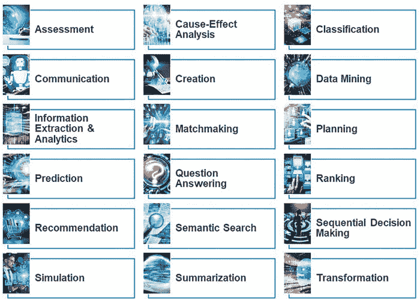

**图 2.1：**CapabilityGPT：AI 能力框架

通过利用和组合这些能力，企业可以在各种高级用例中释放 AI 的潜力，提高其运营效率、决策过程和员工满意度。

# CapabilityGPT 的目的

CapabilityGPT 框架作为 AI 能力的综合存储库，可以以各种方式选择和组合，设计不同类型的 AI 解决方案。以下是简要概述（见*图 2.2*）：

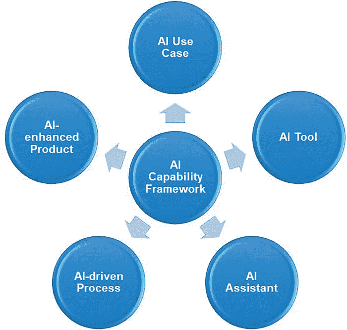

**图 2.2：**CapabilityGPT 实现 AI 解决方案的设计

+   **AI 用例：**将单个 AI 能力应用于执行特定任务或解决问题。例如，“评估”能力的用例可能是风险评估，其中 AI 解决方案利用其数据解释和分析技能评估借款人的财务历史的各个方面，从而支持明智的决策。本章将提供每个 AI 能力用例的详细示例。

+   **AI 工具：**使用一个或多个 AI 用例执行特定任务或解决复杂问题的 AI 解决方案。例如，AI 工具可能利用“评估”用例进行风险评估，“分类”用例进行风险分类，“预测”用例预测未来风险趋势。

+   **AI 助手：**AI 助手是一种具有多种 AI 能力和访问外部工具或插件的高级 AI 应用程序。根据助手设计的任务，CapabilityGPT 框架中的相关能力被纳入。例如，“AI 个人秘书”可能使用能力，如创作、沟通、规划、问答、语义搜索和摘要。*第三章*将提供基于角色的 AI 助手示例，而*第六章*将涵盖功能性和协作型 AI 助手。

+   **AI 驱动流程：**AI 驱动流程是一系列任务（或具有任务的子流程），每个任务由一个或多个 AI 能力支持。例如，在“AI 驱动的销售流程”中，可以应用顺序决策制定（用于销售策略制定）、撮合（用于销售代表与客户分配）和沟通（用于客户互动）等能力。本附录 B 将提供四个详细的 AI 流程描述案例研究。

+   **增强型人工智能产品：** 这是通过添加一个或多个人工智能能力来改进的现有软件或实体产品。例如，“智能冰箱”可能会整合分类（识别物品）、预测（估计物品何时用完）和推荐（建议购物清单）。在*第一章*中提供了企业软件通过人工智能的增强示例。

总之，CapabilityGPT 框架提供了一套多功能的人工智能能力，可以用于设计和构建各种针对特定需求和目标的人工智能解决方案。

# CapabilityGPT 的优势

CapabilityGPT 框架提供了显著的优势，加强了它作为有效整合和实施各种组织背景下人工智能能力的综合工具的价值。以下是它的一些关键优势：

+   **全面性：** CapabilityGPT 框架包括 18 种不同的人工智能能力，确保它能满足多样化的业务需求。这种能力的广度使企业能够以多种创新的方式利用人工智能。

+   **易于理解：** 该框架通过将复杂的人工智能世界分解为可管理、可理解的能力，简化了人工智能。这使得即使非技术利益相关者也能理解人工智能如何增强他们的业务。

+   **设计的便利性：** CapabilityGPT 框架通过将人工智能能力作为标准化的构建模块，简化了设计过程。企业可以以更高效的方式构建人工智能工具、助手、流程或产品。这种方法加速了设计过程，并提高了随后人工智能实施的质量。

+   **促进创新：** 框架内能力的清晰界定促进了创造力和创新。它使利益相关者能够设想新的能力组合，从而产生新颖的人工智能应用。

+   **可扩展性：** 框架的模块化特性使得易于扩展。企业可以从少数能力开始，逐渐整合更多能力，使其成为一种灵活的增长工具。

+   **提示能力：** CapabilityGPT 的独特特性“提示能力”允许每个人工智能能力直接表达为对 ChatGPT 的提示指令。这标准化了提示工程，导致更一致、可预测的结果和改进的系统可靠性。

在了解了 CapabilityGPT 的多方面优势之后，我们接下来评估它与传统人工智能框架的对比情况。这种比较分析将进一步突出 CapabilityGPT 的优势，为我们深入探讨 18 种不同能力及其应用做好铺垫。

# CapabilityGPT 相对于技术人工智能框架的优势

CapabilityGPT 相对于传统的以技术为导向的人工智能框架具有显著优势。让我们逐一来介绍它们：

+   以用户为中心 vs. 以技术为中心：CapabilityGPT 采用以用户为中心的方法设计，专注于企业使用案例和业务需求，并将其映射到相关的人工智能能力。相比之下，传统的人工智能框架是以技术为中心的，集中于人工智能技术，如知识图谱或深度学习。这种以技术为中心的方法需要相当的技术专业知识，并且不直接与特定的企业使用案例或业务需求相一致。

+   **抽象 vs. 具体：** CapabilityGPT 提供了更高层次、更抽象的人工智能能力视图。这种视图对非技术利益相关者更易接触，并有助于概念理解。然而，传统的人工智能功能框架涉及更具体、技术性的组件，并要求对人工智能方法和算法有深入的理解。

+   **问题导向 vs. 工具导向：**由于其专注于解决广泛的业务挑战，CapabilityGPT 本质上是问题导向的。相比之下，传统的 AI 框架往往更加工具导向，应用特定的 AI 技术，这限制了它们适用于这些类型的问题的范围，这些问题适用于这些技术。

+   **整体 vs. 组件化：**CapabilityGPT 提供了企业可用的 AI 能力的整体视图，提供了更完整的 AI 利用方式。传统的 AI 框架通常提供基于组件的视图，侧重于特定技术及其潜在用途，缺乏全面的视野。

实质上，传统的 AI 框架为 AI 开发奠定了技术基础，而 CapabilityGPT 提供了一种更具适应性和业务导向的 AI 实施方法。通过将 AI 能力与企业用例对齐，它能够更有效和战略地应用 AI 于整个企业。

在审查了 CapabilityGPT 相对于传统 AI 框架的相对优势之后，我们可以分析其 18 项能力。通过了解它们的具体功能和用例，读者可以将它们应用到他们的具体业务环境中。

# 具有用例的详细 AI 能力描述

在本节中，我们深入探讨了构成 CapabilityGPT AI 框架核心的 18 项能力。每个能力都有详细描述，然后列出了代表性用例的全面清单，展示了它如何应用于解决各种现实世界的问题。这些用例突出了能力的多功能性和适用性，强调了 CapabilityGPT 解决广泛企业需求的潜力。

为了确保我们的介绍清晰和一致，每个用例都遵循了标准化的格式：

+   **数据要求：**指定 AI 能力在该用例中运行所需的文本或代码格式的数据类型。

+   **功能：**突出了 AI 能力在用例背景下承担的主要任务。

+   **利益相关者：**列出了参与或受到用例影响的主要行为者或受益者。

+   **利益：**描述了在描述的背景下应用 AI 能力所带来的潜在优势或改进。

为了进一步指导您的探索和理解，我们已将每个能力的用例分类如下：

+   **高价值用例：**这些代表了部署 AI 能力可能产生深刻业务影响的场景，如成本节约、收入增加、客户满意度或其他战略利益。

+   **快速实施用例：**强调灵活性，这些用例可以迅速实现。这些用例的理想条件是：

+   数据可以直接由 ChatGPT（文本、代码）处理，或者可以轻松转换（例如，结构化/顺序数据）。

+   提供参考示例。

+   提示很简单。

+   ChatGPT 没有推理限制。

+   没有负责任的 AI 挑战。

+   没有外部用户（例如客户、供应商）。

+   **其他用例：**这个类别涵盖了那些不完全符合上述分类但在展示 AI 框架的能力方面仍然重要的用例。

# 评估

作为由 ChatGPT 提供支持的 AI 能力，评估是指对与实体相关的各个方面进行系统评估或分析。这可以包括风险、绩效、质量、效率、合规性、用户体验、准备性和影响。

**图 2.3：**评估

现在，让我们深入探讨这种 AI 能力的潜力，并探索代表性的用例：

+   **高价值用例：**

+   **风险评估：**

+   功能性：深入分析各种数据集，评估和预测风险因素和潜在漏洞。

+   数据需求：借款人的财务记录、患者病史、供应链交易日志和其他指示风险的相关数据。

+   利益相关者：风险分析师、财务规划师、医疗专业人员、供应链经理和企业高层领导。

+   好处：在财务决策中提高远见，早期发现和缓解医疗风险，简化供应链流程和积极的战略制定。

+   绩效评估：

+   功能性：全面评估供应商和员工的绩效指标，同时分析流程日志以找出低效之处。

+   数据需求：供应商交付日志、产品质量指标、合同细节、员工绩效评估和运营日志文件。

+   利益相关者：人力资源经理、运营总监、质量保证团队和采购负责人。

+   好处：增强供应商和员工关系，识别流程低效，优化工作流程和量身定制的培训计划。

+   监管合规评估：

+   功能性：对运营数据进行严格分析，以确保符合监管标准并识别潜在违规行为。

+   数据需求：交易记录、GDPR 遵从日志、环境影响数据和其他相关合规文件。

+   利益相关者：合规官员、法律团队、数据保护机构和环境安全监管机构。

+   好处：防范监管处罚，加强数据隐私，维护生态标准，增强与利益相关者的信任。

+   快速实施的用例：

+   用户体验评估：

+   功能性：分析用户情绪和反馈，以评估整体用户满意度和改进领域。

+   数据需求：客户评价、使用模式、反馈表和行为数据。

+   利益相关者：产品经理、用户体验设计师、客户服务团队和营销团队。

+   好处：直接改善用户体验，产品增强和有针对性的客户服务干预。

+   市场分析：

+   功能性：全面分析市场动态、竞争对手行动和客户偏好，提供市场变化和机会的宏观和微观视图。

+   数据需求：市场趋势的文本存储库、竞争对手新闻稿、客户调查和行业报告。

+   利益相关者：营销策略师、业务发展团队、产品经理、研发团队。

+   好处：更快适应市场动态，知情产品和服务开发，优化定价策略和增强竞争地位。

+   质量保证：

+   功能性：质量监控和分析，以识别潜在缺陷、低效和改进领域。

+   数据需求：产品性能的文本日志或报告、服务交付指标、反馈表和错误日志。

+   利益相关者：质量保证团队、产品经理、生产主管和服务交付团队。

+   好处：快速识别质量问题，洞察产品开发，积极化解缺陷，增强客户满意度。

+   其他用例：

+   环境和可持续性评估：

+   功能性：对环境影响进行详细分析和可持续发展战略评估，包括碳足迹测量、废物管理、节水和绿色倡议等方面。

+   数据需求：碳排放数据、废物处理记录、水资源使用统计、供应链数据、可再生能源采用率和企业社会责任倡议记录。

+   **利益相关者**：环境安全监管机构，企业可持续发展团队，供应链经理和企业领导层。

+   **好处**：增强生态责任感，提高利益相关者的信任，识别环保倡议，并通过可持续实践节约成本。

+   **准备评估：**

+   **功能**：全面评估组织对变化、转型或紧急情况的准备情况，涵盖数字基础设施、技能集和紧急准备等领域。

+   **数据要求**：数字基础设施日志，员工技能数据集，应急响应计划，基础设施蓝图，供应链准备记录和电动汽车过渡计划。

+   **利益相关者**：制造业的运营负责人，公用事业部门经理，人力资源和培训团队，应急响应单位和汽车行业领导者。

+   **好处**：及早发现准备不足的差距，为变革项目做出明智决策，增强应急响应，并顺利过渡到新的行业标准。

+   **流程优化评估：**

+   **功能**：对工作流程和运营数据进行详细检查，以识别低效、瓶颈和需要改进的领域。

+   **数据要求**：工作流程图，操作日志，制造过程记录和能源分配数据。

+   **利益相关者**：工业/制造业的流程经理，公用事业部门的运营负责人，质量保证团队和战略规划者。

+   **好处**：提高运营效率，降低流程成本，提高产品质量，实现可持续能源分配。

总之，评估是一项关键的人工智能能力，使各行各业的组织能够深入了解其当前情况。有了这些见解，他们可以积极解决问题，抓住机遇，并采取措施来最小化风险。

要有效地使用 AI 辅助评估，需要收集多样化和高质量的数据，实施强大的偏见检测和消除方法，并采取人机协同的方法变得至关重要。

# 【因果分析】

因果分析系统地识别和评估导致特定结果或系统、流程或绩效变化的因果关系。

**图 2.4：** 因果分析

这种能力的应用可以为各个行业制定出详细的计划，突显其变革潜力的广度和深度：

+   **高价值使用案例：**

+   **根本原因分析：**

+   **功能**：诊断顺序数据，以准确定位系统或流程故障的根本原因，增强预防策略和系统可靠性。

+   **数据要求**：机械数据日志，IT 系统日志，患者记录，事故报告等。

+   **利益相关者**：制造维护团队，IT 系统管理员，医疗专业人员和运营负责人。

+   **好处**：改进的预防性维护策略，减少设备故障，提高 IT 系统的正常运行时间，增强患者安全和护理质量。

+   **营销和销售影响分析：**

+   **功能**：分析促销数据，确定营销活动对销售、忠诚度和客户接待的影响。

+   **数据要求**：广告活动表现数据，销售指标，客户忠诚度指标和新客户接待统计数据。

+   **利益相关者**：营销团队，销售团队，战略规划者和预算分配者。

+   **好处**：优化促销策略，优化营销预算，提高投资回报率。

+   **质量控制分析：**

+   **功能**：对顺序数据进行分析，以检测影响质量标准遵从的因素，促使改进。

+   **数据要求**：生产数据日志，质量标准指标，偏差报告等。

+   利益相关者：质量控制团队、生产负责人、流程经理和运营主管。

+   好处：提高产品质量，增强流程合规性，减少与质量标准的偏差。

+   快速实施用例：

+   绩效降低分析：

+   功能：分析连续数据，找出各种情境中绩效下降的根本原因。

+   数据需求：销售数据、体育表现指标、学术表现记录。

+   利益相关者：销售经理、体育教练和学术管理员。

+   好处：快速识别绩效瓶颈，灵活调整策略，及时干预以扭转负面趋势。

+   项目变更影响评估：

+   功能：评估项目范围、时间表或资源变化的潜在后果，从而实现有效的变更管理。

+   数据需求：项目规格、当前项目时间表、资源分配细节。

+   利益相关者：项目经理、软件开发人员和施工监督员。

+   好处：立即了解项目变更的连锁效应，优化决策，增强项目结果的可预测性。

+   政策变更影响分析：

+   功能：模拟和检查拟议政策调整对不同业务或公共领域的潜在影响。

+   数据需求：当前政策文件、拟议的政策变更以及相关的绩效指标（如员工满意度或公共健康结果）。

+   利益相关者：人力资源经理、政府官员和医疗保健管理员。

+   好处：快速了解政策变更的后果，迅速优化政策，更好地与期望的结果对齐。

+   其他用例：

+   供应链连续性评估：

+   功能：深入分析物流数据，以了解供应链环节中的中断后果。

+   数据需求：供应链日志、库存记录、合作伙伴谈判数据等。

+   利益相关者：供应链经理、零售和制造业的运营负责人、库存经理和物流协调员。

+   好处：更好的应急计划，改进的库存管理，优化的合作伙伴谈判，增强的业务连续性。

+   预测性生态影响分析：

+   功能：预测未来业务活动的潜在环境影响以及可能环境影响的直接原因。

+   数据需求：环境评估报告、运营数据、排放记录等。

+   利益相关者：环境安全监管机构、企业可持续发展团队、业务战略家和企业领导层。

+   好处：预防性解决环境挑战，调整生态友好策略，走向更可持续的业务轨迹。

+   组织变革影响评估：

+   功能：预测重大组织变化对运营效率、客户满意度和服务质量等方面的影响。

+   数据需求：以往的变更影响报告、客户满意度调查、运营效率数据等。

+   利益相关者：企业战略家、人力资源团队、技术实施团队、运营负责人和客户服务经理。

+   好处：在变革过程中做出明智决策，最小化中断，并与业务目标更好地对齐。

总之，作为一种人工智能能力，因果分析是各行各业组织理解其运营中因果关系的关键工具。有了这些见解，他们可以更好地预测结果，解决问题，并将他们的战略与目标对齐。

使用 ChatGPT 进行因果分析的挑战，如将相关性误解为因果关系以及处理影响原因和效果的混杂因素，可以通过额外的因果分析工具和确保在关键决策中进行人工监督来加以解决。

# 分类

分类系统地将数据、行为、流程或资源根据其属性、特征或结果划分为预定义的组。

**图 2.5**：分类

在这里，我们将深入探讨代表性用例，展示分类可以产生重大影响的多样应用：

+   **高价值用例**：

+   **产品分类**：

+   **功能**：使用 AI 技术对产品进行分类，根据特性、用户评论或描述将其归为不同组。

+   **数据要求**：产品特性、用户评论、产品描述和相关元数据。

+   **利益相关者**：库存经理、电子商务平台开发人员、零售策略师和营销团队。

+   **好处**：增强库存管理，改善用户浏览体验，增加产品发现，并潜在增加销售额。

+   **异常检测**：

+   **功能**：识别序列数据中的异常模式或不一致，以便早期检测和响应。

+   **数据要求**：交易日志、患者数据、电子商务购物模式等。

+   **利益相关者**：银行欺诈检测团队、医疗保健数据分析师和电子商务安全团队。

+   **好处**：积极识别和减轻欺诈活动、异常数据模式和可疑行为。

+   **用户行为分类**：

+   **功能**：分析顺序用户数据，以获取有关行为、偏好和喜好的见解。

+   **数据要求**：用户活动日志、浏览模式、购买历史和平台互动数据。

+   **利益相关者**：电子商务策略师、在线娱乐提供商和教育科技平台设计师。

+   **好处**：个性化产品推荐，定制用户体验和优化内容传递。

+   **快速实施用例**：

+   **情感分析**：

+   **功能**：解码和分类文本输入中的情感细微差别，以评估情绪。

+   **数据要求**：患者反馈记录、读者评论和客户评论。

+   **利益相关者**：医疗专业人员、媒体分析师和零售经理。

+   **好处**：立即了解普遍情绪，识别需要关注的潜在领域，并根据反馈塑造干预或响应。

+   **客户细分**：

+   **功能**：分析客户数据，根据行为、偏好或人口统计特征将其分成不同组。

+   **数据要求**：客户购买历史、偏好调查和人口统计详情。

+   **利益相关者**：电信营销经理、零售高管和金融分析师。

+   **好处**：增强的定向营销，个性化客户服务，并根据客户细分进行更好的资源分配。

+   **过程分类**：

+   **功能**：根据流程、资源需求和结果等属性对业务流程进行分类。

+   **数据要求**：业务流程图、资源分配记录和结果报告。

+   **利益相关者**：IT 服务经理、供应链负责人和医疗管理人员。

+   **好处**：快速识别过程类别，找出瓶颈，并根据分类见解优化流程。

+   **其他用例**：

+   **资源分类**：

+   **功能**：根据独特特征对资源进行分类，如员工、供应商或实物资产。

+   **数据要求**：供应商档案，员工数据，实物资产记录，交货时间，产品质量报告和定价/成本数据。

+   **利益相关者**：物流，零售和制造业的供应链经理，采购团队，人力资源经理和运营负责人。

+   **好处**：增强资源分配，更好的供应商和资产管理，以及简化的运营流程。

+   **内容过滤：**

+   **功能**：根据相关性和适当性的标准对传入的数字内容进行过滤。

+   **数据要求**：电子邮件，社交媒体帖子，内容元数据和用户生成的内容。

+   **利益相关者**：IT 管理员，客户服务代表，媒体和 IT 组织的内容管理人员。

+   **好处**：提高生产率，增强信息安全性，增强用户体验。

+   **风险分类：**

+   **功能**：使用详细的数据分析将客户或投资分类为预定义的风险类别。

+   **数据要求**：财务历史，行为模式，市场趋势和其他相关风险因素。

+   **利益相关者**：保险风险管理团队，金融分析师和投资组合经理。

+   **好处**：更明智的决策，量身定制的产品提供，最佳资源分配以及平衡的盈利能力和客户满意度。

通过利用 ChatGPT 在分类方面的能力，各个行业的企业都能更好地了解其环境并做出更明智的决策。常规决策可以通过简单的业务规则与分类结果相关联。

为了有效部署 ChatGPT 驱动的分类，使用具有代表性的数据以避免偏斜结果，并建立定期审计和人工监督系统以防止固有的模型偏见至关重要。

# 通讯

作为一种人工智能能力，通讯包括与人类用户和诸如交易系统、客户关系应用程序或搜索引擎等外部应用程序的交互。这种双模式交互使 ChatGPT 能够促进信息交流、问题解决和任务完成。

**图 2.6：** 通讯

我们通过描述其应用程序来展示这一能力的潜力：

+   **高价值的用例：**

+   **数据收集和录入：**

+   **功能**：自动化数据收集，验证和记录，例如客户反馈，预订或库存管理等任务。

+   **数据要求**：反馈表格，预订记录，库存和患者数据。

+   **利益相关者**：数据录入人员，医疗保健管理员和库存管理人员。

+   **好处**：减少手动工作量，提高数据准确性，简化跨行业流程，并增强运营效率。

+   **信息和协助服务：**

+   **功能**：提供个性化产品信息，故障排除支持，公司新闻，政策指导和其他相关更新。

+   **数据要求**：产品详细信息，公司新闻公告，政策文件和健康指南。

+   **利益相关者**：客户服务代表，内部沟通团队和医疗保健提供者。

+   **好处**：增强客户服务，改善内部沟通，改变用户体验，提高满意度水平。

+   **客户服务：**

+   **功能**：通过处理常见查询，提供个性化建议和升级复杂问题来简化客户互动。

+   **数据要求**：客户互动日志，产品/服务详细信息，客户反馈和升级标准。

+   **利益相关者**：客户服务代理，产品经理和电信服务提供商。

+   **好处**：高效处理客户查询，改善服务交付，增强客户体验，提高运营效率。

+   **快速实施的用例：**

+   培训和发展：

+   功能：动态呈现培训内容，促进电子学习模块和技能增强。

+   数据需求：培训模块，电子学习课程内容，员工反馈和绩效指标。

+   利益相关者：人力资源经理，公用事业培训师，消费品产品经理和电信技术培训师。

+   好处：促进持续的专业发展，确保基本培训的一致交付，并增强不同行业的员工能力。

+   项目管理沟通：

+   功能：在项目管理工具和团队成员之间架起沟通桥梁，进行实时更新和通知。

+   数据需求：项目时间表，任务列表，团队成员角色和项目里程碑。

+   利益相关者：IT 项目经理，施工现场监督员和营销活动负责人。

+   好处：提高团队沟通的透明度，增强对项目状态的认识，改善团队同步和及时执行项目。

+   研讨会协助：

+   功能：协助研讨会规划，即时检索数据以进行讨论，并进行研讨会后续跟进。

+   数据需求：研讨会议程，参与者名单，相关数据库或知识库和研讨会反馈。

+   利益相关者：培训师，产品开发负责人和研究负责人。

+   好处：无缝的研讨会组织，通过快速数据检索丰富的讨论以及系统的研讨会后续跟进，确保最大的生产力。

+   其他用例：

+   供应链沟通：

+   功能：通过跟踪库存需求，与供应商协调和自动化交付相关通知，增强供应链流程内的沟通。

+   数据需求：库存日志，供应商沟通记录，交付时间表和产品需求数据。

+   利益相关者：供应链经理，库存经理，供应商和交付团队。

+   好处：更好的库存管理，改善供应商协调，优化服务交付和更明智的决策过程。

+   反馈循环增强：

+   功能：系统收集，分类和传递客户反馈给相关部门。

+   数据需求：客户反馈表格，产品/服务评论和客户互动日志。

+   利益相关者：客户服务代表，产品经理和质量保证团队。

+   好处：从客户反馈中获得可操作的见解，培养响应文化，持续改进和增加客户忠诚度。

+   紧急通信协调：

+   功能：及时传递紧急通知并协调团队或部门之间的及时沟通。

+   数据需求：紧急警报，团队沟通日志，部门指南和紧急响应程序。

+   利益相关者：公共安全官员，医疗保健提供者和公用事业服务经理。

+   好处：协调和有效的紧急响应，保护资产和潜在的挽救生命。

通过有效的沟通，ChatGPT 成为促进各个行业和应用之间的互动，协作和信息交流的有价值工具。

实施 ChatGPT 启用的沟通需要在需要同情心的情况下平衡人工智能和人类互动。确保严格的数据安全措施和严格遵守道德数据使用准则至关重要。

# 创建

启用 AI 创建涉及理解复杂要求，解释上下文和生成满足特定目标的多样化，创新类型的内容。这可以涵盖文本内容和设计元素，也可以是复杂的工件，如商业模型或软件代码。

**图 2.7：** 创建

让我们看一些代表性的用例，每个用例都突显了 ChatGPT 在各个行业中的创造潜力：

+   **高价值用例**：

+   **生成设计**：

+   **功能**：使用人工智能创建创新的用户界面设计，新颖的产品开发和引人入胜的网站设计。

+   **数据要求**：用户偏好，网站分析，产品特性要求和设计基准。

+   **利益相关者**：UX/UI 设计师，产品经理，网站开发人员和营销团队。

+   **好处**：改善用户互动和参与度，多样化产品供应，提高客户满意度。

+   **产品信息管理**：

+   **功能**：生成引人入胜的产品描述和制定库存管理策略。

+   **数据要求**：产品规格，库存日志，客户反馈和购买模式。

+   **利益相关者**：电子商务经理，库存主管，营销团队和产品经理。

+   **好处**：增强客户满意度，优化库存水平，简化库存管理。

+   **自动程序合成**：

+   **功能**：协助自动生成软件程序，模型或脚本。

+   **数据要求**：软件需求，现有代码库和系统规格。

+   **利益相关者**：软件开发人员，IT 经理，财务分析师和电信工程师。

+   **好处**：减少手动编码时间，提高流程效率，及时准确的程序生成。

+   **快速实施用例**：

+   **功能性文件和内容生成**：

+   **功能**：自动创建各种内容类型，包括报告，法律文件，营销材料和教育内容。

+   **数据要求**：现有模板，主题简介，目标受众人口统计数据和指定文件结构。

+   **利益相关者**：法律顾问，营销经理，教育者和内容创作者。

+   **好处**：内容生成效率提高，人为错误减少，输出更一致，为员工节省宝贵时间，让他们专注于更复杂的任务。

+   流程和工作流创建：

+   **功能**：设计全面的业务流程模型，标准操作程序和专业路径，如患者护理或教育轨迹。

+   **数据要求**：现有流程描述，组织目标，利益相关者反馈，以及行业特定的基准或最佳实践。

+   **利益相关者**：医院管理员，制造经理，教育者和流程优化团队。

+   **好处**：提高流程效率，改善患者或用户结果，更高效的生产，与最佳实践一致的个性化学习或护理路径。

+   **概念构思协助**：

+   **功能**：通过创新建议和观点增强头脑风暴会议，用于产品开发，广告活动和营销策略。

+   **数据要求**：市场趋势，目标受众洞察，历史活动数据和产品规格或需求。

+   **利益相关者**：创意总监，产品开发人员，营销策略师和品牌经理。

+   **好处**：更快的构思过程，更丰富多样的头脑风暴结果，创建与市场需求密切相关的活动或产品，以及与目标受众的共鸣增加。

+   **其他用例**：

+   **培训和学习内容生成**：

+   **功能**：生成定制培训材料，入职指南和个性化学习路径。

+   **数据要求**：员工技能，培训基准，行业标准和工作角色。

+   **利益相关者**：人力资源经理，培训师，部门负责人和安全官员。

+   **好处**：增强员工发展、提高员工知识、加强安全协议和提高生产力。

+   **自动化系统配置：**

+   **功能**：协助配置诸如笔记本电脑、机器或车辆系统等技术对象。

+   **数据需求**：技术规格、用户偏好、设备手册和系统基准。

+   **利益相关者**：IT 管理员、电信工程师和汽车技术人员。

+   **好处**：提高设置速度、最小化潜在错误、优化系统性能、增强用户满意度。

+   **项目文件自动化：**

+   **功能**：自动创建和管理项目文件，如计划、任务分配和进展报告。

+   **数据需求**：项目需求、任务列表、时间表和利益相关者角色。

+   **利益相关者**：项目经理、IT 协调员、顾问和施工监督员。

+   **好处**：增强项目管理效率、提高透明度、简化项目执行和改善客户沟通。

这些例子突显了 ChatGPT 如何利用其计算能力在不同的环境中生成大量多样化的内容。这标志着从传统的例行自动化向更复杂、创造性的问题解决方式的重大转变。

为了最大限度地利用 ChatGPT 进行创造性任务，保持人类监督和设计相关提示是必要的。内容过滤和偏见缓解策略应成为 AI 治理的组成部分，以防止无意中生成有偏见或有害内容。

# 数据挖掘

数据挖掘涉及探索、提取和揭示大量结构化和非结构化数据中隐藏的模式、关系和见解。然而，可处理数据集的大小受到所使用的 GPT 模型的上下文窗口的限制。更大的数据集需要预处理，将其分割成可管理的部分。或者，当 ChatGPT-4 与高级数据分析插件配对时，可以协作进行探索性数据挖掘。

**图 2.8：** 数据挖掘

以下是数据挖掘的代表性使用案例列表：

+   **高价值使用案例：**

+   **趋势分析：**

+   **功能**：解释时间数据以发现销售趋势、市场变化或不断变化的客户行为。

+   **数据需求**：销售数据、市场报告、客户反馈和历史数据集。

+   **利益相关者**：零售经理、金融分析师、营销策略师和旅行规划者。

+   **好处**：数据驱动的战略规划、及时的策略调整、利用新兴机会、减轻潜在风险。

+   **异常检测：**

+   **功能**：识别连续数据集中的异常模式或不一致性。

+   **数据需求**：财务交易日志、网络安全违规报告和设备性能数据。

+   **利益相关者**：银行经理、网络安全专业人员和能源部门监督员。

+   **好处**：增强安全性和可靠性、预防财务损失、保护敏感数据和及时识别潜在威胁。

+   **序列模式发现：**

+   **功能**：挖掘串行数据中常见的序列或模式。

+   **数据需求**：用户活动日志、机械性能记录和运输时间表。

+   **利益相关者**：电子商务经理、制造监督员和物流协调员。

+   **好处**：深入的用户行为分析、积极的维护安排、流程优化、最小化停机时间和提高运营效率。

+   **快速实施使用案例：**

+   **数据聚类：**

+   **功能**：识别和分类文本数据中的同质群组或簇，实现更深入的洞察和数据驱动的决策。

+   **数据要求**：来自客户评论、医疗记录、财务交易等非结构化文本数据的文本描述。

+   **利益相关者**：营销策略师、医疗保健分析师、金融顾问和数据科学家。

+   **利益**：实施有针对性的营销策略、量身定制的医疗干预、快速识别异常值或异常情况以及改进决策过程。

+   **关联规则挖掘：**

+   **功能**：发现交易序列中项目或行为集之间的关系和相关性。

+   **数据要求**：购物车、购买历史、在线行为、媒体消费记录等交易数据。

+   **利益相关者**：零售经理、电子商务战略家、杂货店老板、媒体制作人和数据分析师。

+   **利益**：增强的推荐系统、更好地理解消费者行为、创建更有效的营销活动以及提供高度个性化的客户体验。

+   **文本模式识别：**

+   **功能**：检测大量文本数据中的重复主题、情绪或话题，实现更深入的分析和可操作的见解。

+   **数据要求**：客户反馈、评论、社交媒体评论、员工反馈和其他形式的文本数据。

+   **利益相关者**：客户服务经理、营销团队、人力资源专业人员和社交媒体分析师。

+   **利益**：为客户服务改进制定明智策略、量身定制营销活动、有效监控社交媒体以及加强对员工参与和情绪的理解。

+   **其他用例：**

+   **网络模式识别：**

+   **功能**：识别和理解网络活动数据中的模式。

+   **数据要求**：用户连接日志、服务器活动数据和电信流量报告。

+   **利益相关者**：社交媒体平台开发人员、IT 经理和电信工程师。

+   **利益**：改善网络性能、早期威胁检测、丰富理解用户互动以及对未来网络状态的预测见解。

+   **情绪时间线分析：**

+   **功能**：分析跨时间序列的文本反馈或评论，以评估情绪演变。

+   **数据要求**：客户评论、反馈、社交媒体评论、活动或活动时间表。

+   **利益相关者**：媒体分析师、娱乐制作人、品牌经理和公共关系协调员。

+   **利益**：随时间的公众反应深入见解、为战略调整做出明智决策、加强利益相关者参与度以及对情绪变化做出有效回应。

这些用例强调了 ChatGPT 从传统数据分析转变为智能、数据驱动的决策制定，能够从大型复杂数据集中获得重要价值的能力。

然而，有效的数据挖掘需要严格遵守数据保护法规，并承诺进行公正和代表性的数据收集和处理，以确保用户的机密性和派生见解的质量。

# 信息提取和分析

信息提取和分析代表了自动识别、提取和分析原始数据或复杂文档中相关信息的能力。这种转变性能在解码复杂文档、生成可操作见解以及在不同组织领域实现流程自动化中发挥着关键作用。

**图 2.9：** 信息提取和分析

以下是信息提取和分析的用例概述：

+   **高价值用例：**

+   **交易文档处理：**

+   **功能**：转换和分析发票、收据和采购订单等交易文档，以简化后续处理。

+   **数据需求**：各种格式的发票、收据和采购订单，如 PDF 和 HTML，需要预处理成文本。

+   **利益相关者**：零售经理、银行专业人员和电子商务业主。

+   **好处**：简化交易验证，减少差异，缩短处理时间，提高准确性，加快交易结算。

+   **基于协议的产品应用分析：**

+   **功能性**：从与产品申请相关的记录中提取和分析数据，确保遵守协议。

+   **数据需求**：临床记录、农药施用数据和膳食产品使用细节。

+   **利益相关者**：医疗专业人员、农业专家和健康与营养专家。

+   **好处**：了解产品效率，评估依从性，检测副作用或结果，协议调整建议和产品改进建议。

+   **快速实施的用例：**

+   **法律文件分析和提取：**

+   **功能性**：从大量法律文件中彻底审查和提取关键条款和义务，确保全面和高效的分析。

+   **数据需求**：合同、协议、契约、租赁文件、并购文件和其他类型的法律文件。

+   **利益相关者**：法律顾问、合规官员、企业领导、财务分析师和房地产经理。

+   **好处**：快速审查流程，提高法律操作的准确性，降低忽视条款或不合规带来的风险，减少运营开支。

+   **新闻分析：**

+   **功能性**：从全球新闻、监管更新和行业变化中提取信息，以预测市场动态，并确保遵守不断变化的法规。

+   **数据需求**：新闻文章、新闻稿、监管公告、行业报告和其他新闻来源。

+   **利益相关者**：市场研究人员、合规官员、业务分析师和战略规划者。

+   **好处**：积极的市场策略，遵守不断变化的法规，及早识别潜在风险或机遇，并在知情决策中获得优势。

+   **竞争分析：**

+   **功能性**：从外部数据源中提取有价值的见解，以了解竞争对手的战略、产品表现和知识产权定位。

+   **数据需求**：竞争对手报告、市场分析、产品评论、专利文件和其他与行业竞争对手相关的资源。

+   **利益相关者**：业务战略家、营销专业人员、研发团队和企业情报部门。

+   **好处**：增强商业智能，改善战略定位，知情产品开发，并在市场上获得竞争优势。

+   **其他用例：**

+   **合规验证：**

+   **功能性**：从文件中提取重要数据，以确保严格遵守各种法规、标准或政策。

+   **数据需求**：监管文件、健康和安全报告、财务记录和税务文件。

+   **利益相关者**：财务分析师、医疗管理人员和制造监督员。

+   **好处**：加强监管合规性，降低法律风险，节省时间，减少不合规罚款的风险。

+   **研发数据管理：**

+   **功能性**：从研究资源中提取数据，支持研究活动和创新。

+   **数据需求**：临床试验数据、学术文献和产品开发反馈。

+   **利益相关者**：制药研究人员、学术专业人员和科技创新者。

+   **好处**：提高研发效率，创新见解，加快产品或解决方案的开发。

+   **库存管理：**

+   **功能**：提取和分析与库存记录、销售预测和供应链指标相关的数据，以优化库存水平。

+   **数据需求**：库存记录、销售预测和供应链数据。

+   **利益相关者**：零售业主、制造经理和物流协调员。

+   **好处**：避免缺货或库存过剩情况，降低库存携带成本，提高运营效率，提高客户满意度。

这些用例突显了 ChatGPT 从原始和复杂数据中提取有意义的见解，推动了知情决策和流程自动化的转变影响。

为了在信息提取和分析中有效应用，遵守数据保护法规，并且对提取和分析提示进行细致的验证是解决其挑战的关键。

# 撮合

ChatGPT 在撮合方面的能力涉及根据预定义的标准或模式配对实体、任务、资源或需求，以优化结果。AI 驱动的撮合可以简化跨多个领域的决策，增强生产力和运营效率。

**图 2.10**：撮合

现在让我们探讨一些撮合的用例：

+   **高价值用例：**

+   **资源分配到任务：**

+   **功能**：根据技能、能力或功能等描述性属性，将资源最优地分配到特定任务或操作。

+   **数据需求**：资源可用性、技能描述和任务要求。

+   **利益相关者**：项目经理、制造主管和物流协调员。

+   **好处**：提高生产力，降低成本，更有效地利用可用资源。

+   **风险与缓解策略对齐：**

+   **功能**：识别潜在威胁或风险，并将其与适当的预防或补救策略相匹配。

+   **数据需求**：风险评估和可用的预防/纠正策略。

+   **利益相关者**：金融分析师、网络安全专业人员和生命科学研究人员。

+   **好处**：加强风险管理，增加业务韧性，预防潜在损失。

+   **需求与供应匹配：**

+   **功能**：预测并将供应与市场需求对齐，考虑各种产品描述、单位转换和分销商库存水平。

+   **数据需求**：库存水平、需求预测、分销商库存和产品描述。

+   **利益相关者**：零售业主、制造经理和物流专家。

+   **好处**：增强运营效率，提高客户满意度，优化库存水平。

+   **快速实施的用例：**

+   **个人分配到团队：**

+   **功能**：根据兼容性、技能和目标有效地将个人分配到各自的团队或小组，以促进团队动态和优化绩效。

+   **数据需求**：个人资料、技能评估、个人偏好、团队需求和过去的绩效指标。

+   **利益相关者**：人力资源经理、教育工作者、培训协调员、项目经理和团队负责人。

+   **好处**：改善团队凝聚力，提高绩效结果，最优资源利用，创建平衡的团队。

+   **导师和教练对齐：**

+   **功能**：智能地将员工与合适的导师、教练或 SME 配对，以确保学习需求、职业目标和技能发展的对齐。

+   **数据需求**：员工档案、学习需求评估、导师/教练/SME 档案、反馈表和专业发展目标。

+   **利益相关者**：人力资源经理、培训和发展团队、高级管理人员、中小企业主和部门负责人。

+   **好处**：加速员工成长，提高士气，高效的技能获取，丰富的组织生产力。

+   **合规匹配：**

+   **功能**：确保实践或程序与相关的监管框架保持一致。

+   **数据要求**：业务实践、软件功能、程序细节和监管要求。

+   **利益相关者**：金融顾问、医疗保健管理员和制造监督员。

+   **好处**：最小化法律和运营风险，预防罚款和法律纠纷，保持业务运营不中断。

+   **其他使用案例：**

+   **实体对实体匹配用于数据管理：**

+   **功能**：执行强大的实体对实体匹配技术，以增强数据去重、模式匹配、本体匹配和其他数据对齐功能。

+   **数据要求**：需要对齐的数据集、数据库模式、本体论、元数据和相关数据完整性指标。

+   **利益相关者**：数据科学家、IT 经理、数据库管理员、营销分析师和数据质量团队。

+   **好处**：增强数据完整性，提高数据可用性，高效的数据管理流程和优越的数据驱动决策。

+   **需求到解决方案的映射：**

+   **功能**：将特定要求与适当的解决方案或策略匹配。

+   **数据要求**：业务、技术或功能要求；可用解决方案。

+   **利益相关者**：IT 经理、业务顾问和客户服务主管。

+   **好处**：高效的问题解决，优化的战略规划，提供定制解决方案。

+   **专业技能匹配：**

+   **功能**：根据项目或挑战要求将员工与合适的专业知识专家（SMEs）配对。

+   **数据要求**：员工档案、中小企业专业领域和项目要求。

+   **利益相关者**：人力资源专业人员、项目经理和企业团队负责人。

+   **好处**：高效的问题解决，最佳的项目结果，最大化内部专业知识的利用。

这些使用案例突显了 ChatGPT 如何可以增强匹配过程，确保各种实体、任务、资源和要求之间的最佳对齐，从而实现改善结果和效率。

ChatGPT 的有效实施取决于数据的质量和准确性，以及对匹配中涉及的多样化和复杂因素的慎重考虑。这包括减轻可能对 AI 系统构成挑战的某些任务的潜在复杂性和多样性。例如，在个体到群体分配的情况下，群体动态和个体个性等各种主观因素起着重要作用。这些因素可能对 ChatGPT 等 AI 系统准确考虑构成困难，因此应特别关注这些元素，以确保最有效和准确的匹配结果。

# 规划

AI 规划包括两个部分的能力：将复杂目标（或任务）分解为子目标（或子任务），并生成一个任务序列，以在给定约束条件下从初始状态过渡到目标状态。计划可以根据中间执行结果的调整或者初始假设的改变而动态调整。

**图 2.11：**规划

以下是 ChatGPT 如何在不同行业中用于规划的概述：

+   **高价值使用案例：**

+   **运营规划：**

+   **功能**：提供全面的规划输出，从任务列表创建、供应链优化到设计有效的营销活动。

+   **数据要求**：任务要求、供应链数据、受众人口统计和服务交付约束。

+   **利益相关者**：公用事业、零售、电信和制造业经理。

+   好处：简化后勤，最大限度地提高营销影响，提高客户满意度和运营卓越。

+   战略规划：

+   功能：协助制定长期目标，确定所需资源，并规划必要的行动。

+   数据要求：市场趋势、历史数据和公司目标。

+   利益相关者：金融服务、电信和汽车行业的高管。

+   好处：在竞争环境中引导朝向期望的结果，明确方向，有效资源分配。

+   项目管理规划：

+   功能：协助项目经理拆分大型项目、排序任务，并确保最佳资源分配。

+   数据要求：项目规格、可用资源和任务依赖关系。

+   利益相关者：建筑、IT 和设计领域的项目经理。

+   好处：项目按计划完成，符合预算，符合要求。

+   快速实施用例：

+   风险和事件管理：

+   功能：为面临重大运营或市场风险的行业提供强大的缓解和解决方案，从而促进组织的韧性和安全。

+   数据要求：历史事件报告、风险评估输出、运营数据、市场趋势和安全参数。

+   利益相关者：风险管理团队、安全官员、运营负责人和高层管理人员。

+   好处：增强组织的韧性，改善安全措施，有效缓解潜在风险，并积极预防重大事件。

+   变更管理规划：

+   功能：协助规划和执行组织变革和流程改进，以最小化中断并增强运营流程。

+   数据要求：当前运营数据、利益相关者的反馈、拟议变更的细节、过去的变更管理报告和影响评估。

+   利益相关者：人力资源经理、业务流程分析师、运营负责人和变更管理团队。

+   好处：简化组织变革，减少中断，增强利益相关者的支持，并提高运营效率。

+   活动策划：

+   功能：有效协助规划和执行活动，从场地选择到应急计划，确保无缝执行和卓越的客人体验。

+   数据要求：以往活动数据、场地详情、资源可用性、客人偏好和预算限制。

+   利益相关者：活动策划人员、酒店管理人员、物流团队和营销部门。

+   好处：活动的顺利执行，客人满意度提高，资源分配改善，行业声誉增强。

+   其他用例：

+   沟通和参与规划：

+   功能：帮助制定有效的内部和外部沟通策略，以最大化利益相关者参与度并改善公共关系。

+   数据要求：利益相关者人口统计数据、沟通渠道和参与度指标。

+   利益相关者：电信、教育和零售行业的公关团队。

+   好处：增强利益相关者参与、积极的公众印象和组织成功。

+   创新和发展规划：

+   功能：协助起草研究、产品开发和培训的详细计划。

+   数据要求：当前的研发数据、市场需求和培训需求。

+   利益相关者：医疗/生命科学、消费品和教育行业的研发团队。

+   好处：培养持续学习和适应的文化，实现可持续增长和长期成功。

这些用例突出了 ChatGPT 如何优化规划流程，将复杂目标无缝地转化为可管理的子任务，并编排高效的执行顺序。

在企业环境中实施它需要采用人工智能结合的方法，考虑到对规划问题的全面规范和对人类和 ChatGPT 角色和责任的清晰定义。

# 预测

在人工智能中，预测是利用历史数据和模式来预测未来结果、趋势、行为或事件的能力。这个过程有助于组织内各个部门的知情决策和风险管理。

**图 2.12：**预测

以下是 ChatGPT 如何在各个行业利用预测的力量：

+   **高价值使用案例：**

+   **绩效预测：**

+   **功能：**利用历史和实时数据来预测未来表现。

+   **数据要求：**历史绩效数据，当前运营指标和行业趋势。

+   **利益相关者：**金融服务、工业/制造和电信部门的高管。

+   **好处：**主动管理，知情的战略规划，发现机会，以及应对挑战的准备。

+   **需求和供应预测：**

+   **功能：**使用时间序列数据预测需求和供应平衡。

+   **数据要求：**历史需求和供应数据，市场趋势和特定行业事件。

+   **利益相关者：**公用事业、汽车和医疗/生命科学部门的决策者。

+   **好处：**预防缺货和库存过剩情况，提高运营效率，优化财务表现。

+   **结果预测：**

+   **功能：**预测不同举措或行动的潜在结果。

+   **数据要求：**类似举措的历史数据，当前项目参数和外部影响因素。

+   **利益相关者：**能源、医疗/生命科学和教育部门的战略家。

+   **好处：**改进资源配置，风险缓解和提高整体绩效。

+   **快速实施使用案例：**

+   **趋势预测：**

+   **功能：**解码复杂的数据模式以预测未来趋势，使企业能够主动适应消费者或社会需求的变化。

+   **数据要求：**历史销售数据，客户反馈，市场研究报告和反映过去趋势的其他相关行业数据。

+   **利益相关者：**产品经理、营销策略师、教育者、课程设计师和库存管理人员。

+   **好处：**增强对市场变化的适应能力，改进产品演变，高效的库存管理，渐进式课程设计，以及优化业务结果的教学技巧。

+   **行为预测：**

+   **功能：**预测各种利益相关者的行为模式，从客户到竞争对手，提供可操作的见解，以推动有效的业务策略。

+   **数据要求：**过去的交易数据，客户互动，反馈和行为日志，以及竞争对手活动和市场情报。

+   **利益相关者：**营销团队、客户服务经理、业务战略师和产品开发人员。

+   **好处：**更好地预测客户需求，创造定制体验，领先市场动态，增强客户忠诚度和竞争地位。

+   **质量和缺陷预测：**

+   **功能：**主动识别潜在的质量问题或缺陷，及时干预并确保产品完整性。

+   **数据要求：**历史质量控制数据，产品质量的客户反馈，缺陷日志和生产过程细节。

+   **利益相关者：**质量保证团队、产品经理、制造负责人和客户服务代表。

+   **好处：**减少召回或返工相关的成本，提高客户满意度，增强品牌声誉，最小化潜在的商业风险。

+   **其他使用案例：**

+   **资源利用预测：**

+   **功能**：预测对可持续性和盈利能力至关重要的资源利用。

+   **数据要求**：过去的资源利用数据，当前的运营数据和未来需求的预测。

+   **利益相关者**：工业/制造、公用事业和汽车行业的运营经理。

+   **好处**：知情的运营计划，优化的维护计划和对可持续发展倡议的支持。

+   **事件概率预测：**

+   **功能**：根据历史数据估计特定事件发生的可能性。

+   **数据要求**：类似事件的历史数据，当前环境因素和行业趋势。

+   **利益相关者**：金融服务、医疗/生命科学和能源行业的风险管理人员。

+   **好处**：实现积极的风险管理，知情的应急计划和防范潜在负面影响。

这些应用案例说明了 ChatGPT 预测能力的广泛应用，显著促进了组织在各个行业中的战略规划、决策和风险管理。

为了在企业环境中最大限度地利用它，确保高质量、多样化的数据收集，促进协作决策过程，实施有效的反馈机制至关重要。

# 问答

人工智能问答涉及理解、处理和准确回答自然语言提出的查询的能力。这一功能增强了组织内的互动过程，确保对各种问题进行即时、准确和具有上下文意识的回应。

**图 2.13：** 问答

ChatGPT 如何利用其问答能力在各个行业中：

+   **高价值应用案例：**

+   **运营流程指导：**

+   **功能**：对运营问题提供即时和准确的回应。

+   **数据要求**：标准操作程序，安全协议和历史查询数据。

+   **利益相关者**：工业/制造、公用事业和医疗/生命科学行业的运营人员。

+   **好处**：提升运营效率，确保遵守安全标准，防止可能导致财务或健康后果的错误。

+   **知识库互动：**

+   **功能**：实现存储知识的快速和具有上下文意识的准确检索。

+   **数据要求**：全面的知识库、常见问题解答和行业特定指南。

+   **利益相关者**：教育、电信和金融服务行业的专业人员。

+   **好处**：增强问题解决能力，丰富学习，确保符合行业标准。

+   **客户支持：**

+   **功能**：促进对各种客户查询的即时回应。

+   **数据要求**：产品/服务信息，故障排除指南和客户反馈历史。

+   **利益相关者**：零售、电信和汽车行业的支持团队。

+   **好处**：增强客户满意度和忠诚度，提高留存率和业务增长。

+   **快速实施的应用案例：**

+   **IT 和企业软件支持：**

+   **功能**：为软件工具和 IT 基础设施提供及时帮助，确保技术驱动的流程不受阻碍。

+   **数据要求**：IT 知识库，软件手册，用户反馈和过去的 IT 事件或解决方案日志。

+   **利益相关者**：IT 支持团队、软件用户、教育工作者、公用事业运营商和依赖技术的专业人士。

+   **好处**：减少停机时间，提高生产率，改善用户体验，并通过减少 IT 支持人员需求节省成本。

+   **合规和监管指导：**

+   **功能**：提供关于合规要求的准确答案和指导，确保企业与强制性法规和最佳实践保持一致。

+   **数据要求**：监管文件、政策手册、过去的合规事件和行业特定法规的更新。

+   **利益相关者**：合规官员、业务战略家、运营经理和监管事务专业人员。

+   **利益**：有效的风险管理，确保业务连续性，避免巨额罚款或潜在的业务关闭，并增强业务声誉。

+   **入职培训**：

+   **功能**：协助简化入职流程和持续员工培训。

+   **数据要求**：培训材料、常见员工查询、公司政策和程序。

+   **利益相关者**：零售、消费品和汽车行业的人力资源和培训部门。

+   **利益**：确保一致的服务质量，赋予员工权力，并优化运营效率。

+   **其他使用案例**：

+   内部和外部沟通支持：

+   **功能**：有效管理内部和外部沟通。

+   **数据要求**：沟通协议、品牌信息和利益相关者数据库。

+   **利益相关者**：汽车、消费品和零售行业的沟通团队。

+   **利益**：促进积极的品牌形象，并确保跨渠道的无缝沟通。

+   **集成多模式辅助**：

+   **功能**：整合文本、语音和视觉问答（VQA）以构建全面的辅助系统。

+   **数据要求**：包括与该领域相关的文本、听觉和视觉信息的多样数据集。

+   **利益相关者**：医疗保健/生命科学、零售、公用事业、汽车、工业/制造和教育领域的专业人士。

+   **利益**：提供全面的用户体验，支持实时故障排除和指导，并将视觉与即时的知识性回答相结合。

这些使用案例反映了 ChatGPT 问答能力在组织运营的各个方面的广泛应用。它有效地回应了各个领域的查询，显著增强了各行业的组织效率、服务交付和客户体验。

最大化 ChatGPT 的问答能力的潜力需要维护输入数据和知识库的质量，并实施严格的数据治理措施，以确保信息的隐私、安全和合法使用。

# 排名

在 AI 中，排名表示根据指定的标准对一组项目或实体进行优先排序。这确保了根据它们的相关性、价值或重要性进行有序排列，这在各种决策场景中至关重要。

**图 2.14：** 排名

现在，让我们深入探讨排名的代表性使用案例：

+   **高价值使用案例**：

+   **绩效比较**：

+   **功能**：根据多样化的指标排名绩效，提供关键的分析见解。

+   **数据要求**：学生考试成绩、治疗结果和财务投资组合数据。

+   **利益相关者**：教育工作者、医疗保健专业人员和金融顾问。

+   **利益**：在教育中实现个性化反馈，促进医疗保健的持续改进，并优化金融投资组合管理。

+   **外部实体的绩效排名**：

+   **功能**：根据历史绩效数据对外部实体进行排名。

+   **数据要求**：供应商交付记录、合作伙伴成果数据和客户信用历史。

+   **利益相关者**：零售经理、电信运营商和金融机构。

+   **利益**：增强供应商选择、合作伙伴关系形成和信贷放款的决策，提高效率和风险管理。

+   **资源分配**：

+   **功能**：根据多方面的标准对资源进行优先考虑和分配。

+   **数据需求**：能源投资回报数据，环境影响评估，患者健康指标和汽车研发数据。

+   **利益相关者**：能源公司，医疗机构和汽车制造商。

+   **好处**：有效平衡竞争需求，确保在保持环境可持续性和患者福祉等核心价值观的同时获得最佳回报。

+   **快速实施的用例：**

+   **产品开发优先级：**

+   **功能**：根据预期的市场需求、可行性、成本和满足客户需求的潜力对产品特性或整个新产品进行排名。

+   **数据需求**：市场调研数据，客户反馈，竞争格局，历史销售和产品绩效数据以及成本评估。

+   **利益相关者**：产品经理，研发团队，营销人员，业务战略家和设计团队。

+   **好处**：加速高影响产品的上市时间，提高客户满意度，更好地分配研发资金，增加市场份额。

+   **流程改进优先级：**

+   **功能**：根据效率、成本效益和对质量潜在影响等指标评估和排名生产过程或维护任务。

+   **数据需求**：生产日志，维护记录，生产人员反馈，历史过程性能数据和成本评估。

+   **利益相关者**：流程经理，质量保证团队，一线工人和运营战略家。

+   **好处**：提高产品质量，增强运营效率，降低成本，提高整体组织生产力。

+   **其他用例：**

+   **生态投资优先级：**

+   **功能**：根据生态影响指标对投资机会进行排名。

+   **数据需求**：碳足迹数据，水资源利用情况，森林砍伐影响和财务回报。

+   **利益相关者**：投资银行，全球基金和风险投资家。

+   **好处**：将生态责任与财务决策相结合，促进符合盈利能力和全球可持续发展目标的投资。

+   **战略发展：**

+   **功能**：根据其潜在影响优先考虑战略举措。

+   **数据需求**：市场趋势，投资回报预测，环境影响数据和竞争格局信息。

+   **利益相关者**：制造企业，能源供应商和零售高管。

+   **好处**：优化战略规划，将重点放在有影响力的业务增长战略、环境保护和保持竞争优势上。

ChatGPT 有效地提高了跨行业的战略决策、资源分配和绩效评估的能力。

其有效使用需要严格验证以确保准确性，决策过程的透明度以解决信任问题，并积极的偏见缓解策略以避免不公平的排名和资源错误分配。

# 推荐

在人工智能中，推荐是指根据可用数据（如用户行为、历史模式或特定标准）建议相关选项或行动。这种能力指导决策，优化流程并个性化体验。

**图 2.15：** 推荐

以下是 ChatGPT 在多个行业中的推荐能力的描述：

+   **高价值的用例：**

+   **个性化学习和技能增强：**

+   **功能**：根据个人的技能档案和过去的活动推荐定制的学习资源。

+   **数据需求**：用户档案，学习历史，行业趋势，课程提供和反馈数据。

+   **利益相关者**：教育工作者，人力资源经理，医疗保健专业人员，员工和学生。

+   好处：增强学习成果，确保与当前行业要求保持一致，并促进职业发展。

+   流程优化：

+   功能性：分析并推荐组织工作流程的改进。

+   数据需求：组织工作流数据、交易记录、库存数据和客户反馈。

+   利益相关者：零售经理、金融服务提供商和医疗保健管理员。

+   好处：提高运营效率，减少库存相关问题，并增强客户和患者服务。

+   个性化推荐和自助服务：

+   功能性：根据客户的消费历史提供定制的营销或产品建议。

+   数据需求：客户购买历史、观看记录、反馈和个人偏好。

+   利益相关者：零售商、媒体公司、酒店经营者和航空公司。

+   好处：增强客户体验，推动销售，促进客户忠诚度，并推动业务增长。

+   快速实施的用例：

+   下一步操作选择：

+   功能性：根据先前行动的顺序或正在进行的过程的当前状态，推荐下一步行动。

+   数据需求：历史互动数据、客户反馈、项目状态更新、临床指南（用于医疗保健）和其他相关行动日志。

+   利益相关者：客户服务代表、项目经理、临床医生和其他负责顺序决策的专业人士。

+   好处：提高了解决客户关注的效率，改善了项目任务排序以获得最佳结果，通过及时和适当的干预增强了患者护理，并减少了决策时间。

+   技术选择：

+   功能性：根据一组要求或项目规格，提出从软件到硬件的技术解决方案。

+   数据需求：技术规格、用户评价、性能基准、项目要求、预算限制和兼容性信息。

+   利益相关者：IT 顾问、营销策略师、建筑项目经理、技术采购团队和其他参与技术工具或平台选择的专业人士。

+   好处：优化的技术选择导致增强的项目结果，减少资源浪费，技术投资获得更好的投资回报率，并在技术采购决策中更快速。

+   其他用例：

+   业务增长和创新规划：

+   功能性：使用顺序数据分析市场趋势，以指导市场策略和创新。

+   数据需求：市场趋势数据、消费者反馈、竞争分析和历史销售数据。

+   利益相关者：初创企业、零售高管和科技公司领导者。

+   好处：促进战略业务增长，指导产品开发，并增强竞争定位。

+   利益相关者参与：

+   功能性：为利益相关者推荐有效的沟通策略和参与模式。

+   数据需求：利益相关者档案、历史参与数据和行业沟通标准。

+   利益相关者：营销主管、企业传播团队和政府官员。

+   好处：提高利益相关者满意度，促进投资，并完善公共政策沟通和参与。

ChatGPT 的推荐能力在各种用例中的应用，实现了持续学习、适应、自动化和增长，从而推动了组织的成功。

为了优化其使用，关键是纠正任何潜在偏见，促进超越历史数据范围的创新建议，并增加推荐过程的透明度和可解释性。

# 语义搜索

AI 中的语义搜索涉及理解和响应复杂的搜索查询，考虑上下文，意图和语义含义，而不仅仅依赖关键词。这种能力增强了搜索结果的精确性和相关性。

图 2.16：语义搜索

ChatGPT 在其核心设计中并不原生支持语义搜索功能，但它确实支持一个开源检索插件，以便实现这种功能（有关更多详细信息，请参阅第一章）。GPT-3，作为前身模型，天生具备嵌入功能，使得实现语义搜索成为可能。

这种嵌入功能指的是 GPT-3 能够将输入文本转换为数值表示，或嵌入。这些嵌入作为高维空间中的向量，捕捉并编码文本的语义或基于含义的信息。这种能力对于语义搜索至关重要。查询和搜索索引中的潜在答案都表示为嵌入，模型将这些嵌入进行比较以找到最佳匹配。这种方法使搜索不仅限于精确措辞，还能实现更深层次的基于含义的匹配，更符合查询意图。

现在，让我们深入探讨语义搜索的代表性用例：

+   高价值的用例：

+   语义文档搜索：

+   功能：通过理解语义关系和上下文，准确地从庞大数据集中检索特定信息。

+   数据要求：法律文件，学术文章，公司记录等索引数据库。

+   利益相关者：法律专业人士，学术研究人员，企业经理。

+   好处：快速准确地访问重要文件，减少数据搜索时间，增强决策支持。

+   相似性搜索：

+   功能：识别与给定样本具有深层语义相似性的项目。

+   数据要求：电子商务产品数据库，制药中的化合物库，专利数据库。

+   利益相关者：电子商务零售商，制药研究人员，知识产权律师。

+   好处：个性化产品推荐，简化专利搜索，高效发现相似化合物。

+   流程和资源优化：

+   功能：搜索特定的业务流程，资源细节或物流数据。

+   数据要求：业务流程文件，资源分配记录，物流数据。

+   利益相关者：物流经理，制造监督员，IT 管理员。

+   好处：简化运营，改善资源管理，提高效率。

+   快速实施的用例：

+   内容和媒体管理：

+   功能：促进内容，媒体或评论的语义搜索，以增强理解。

+   数据要求：媒体档案，客户评论，观众参与数据。

+   利益相关者：媒体制作人员，营销策略师，出版商。

+   好处：改善内容策略，更好地针对受众，优化广告活动。

+   客户体验管理：

+   功能：语义搜索和分析客户互动，反馈和成功案例，以获得洞见。

+   数据要求：客户反馈，在线评论，通话记录，聊天记录，社交媒体提及以及其他形式的客户生成内容。

+   利益相关者：客户关系经理，营销团队，产品开发人员以及其他负责理解和改善客户体验的专业人员。

+   好处：更深入地了解客户情绪和偏好，从而提供量身定制的产品和服务，增强客户忠诚度，提高市场声誉。

+   其他用例：

+   安全和风险管理：

+   **功能**：通过理解数据模式进行语义搜索，以识别潜在威胁或事件。

+   **数据需求**：网络安全威胁日志，金融交易数据，以及医疗患者记录。

+   **利益相关者**：网络安全专业人员，金融分析师，以及医疗管理员。

+   **好处**：改进的风险识别，增强的安全性，以及积极的威胁缓解。

+   **历史数据分析：**

+   **功能**：分析和解释历史数据集，以获得更深入的见解。

+   **数据需求**：金融交易历史，过去的销售数据，以及历史市场趋势。

+   **利益相关者**：财务规划师，零售经理，以及房地产分析师。

+   **好处**：明智的未来战略，更好地理解过去的行为，以及巩固的市场地位。

GPT-3 的语义搜索能力的广泛适用性显著增强了搜索密集型企业任务的生产力和效率，推动了不同行业景观的实质性改进。

其最佳应用取决于嵌入文档和查询的熟练程度，并培养透明度，以增强对搜索结果的信任。

# 顺序决策

人工智能中的顺序决策涉及做出一系列相互关联的决策，其中每个决策的结果都会影响后续的决策。这种能力通过考虑决策随时间累积的影响，增强了战略和流程的有效性。

**图 2.17：** 顺序决策

ChatGPT 如何可以利用其在各个行业中的顺序决策能力：

+   **高价值应用案例：**

+   **战略制定和执行：**

+   **功能**：利用过去决策的见解，指导跨行业的未来战略规划。

+   **数据需求**：以往的投资组合和绩效数据；以前的研究领域，临床试验设计；过去的产品组合和销售数据。

+   **利益相关者**：投资策略师，医疗研究人员和零售经理。

+   **好处**：优化的投资策略，增强的研发重点，改进的产品选择，以及零售促销策略。

+   **谈判管理：**

+   **功能**：利用过去的谈判结果指导未来的谈判策略。

+   **数据需求**：以往的供应商谈判细节，过去的零售供应商合同，以及历史学术合作协议。

+   **利益相关者**：制造采购团队，零售采购经理，以及学术机构合作官员。

+   **好处**：加强的谈判立场，改善供应商合同条款，以及增强的学术合作。

+   **流程改进：**

+   **功能**：通过分析以前决策的影响，增强流程效率和结果。

+   **数据需求**：历史能源分配计划，过去的制造过程和结果，以往的电信服务推出，以及网络升级。

+   **利益相关者**：公用事业规划师，制造经理，以及电信网络管理员。

+   **好处**：优化的能源分配策略，优化的制造程序，以及增强的电信网络管理。

+   **快速实施的应用案例：**

+   **产品或服务生命周期管理：**

+   **功能**：分析过去的产品或服务生命周期，以指导新产品的设计、开发和营销。

+   **数据需求**：历史产品性能数据，市场反馈，销售数据，客户评价，以及其他相关指标。

+   **利益相关者**：产品经理，设计团队，营销策略师，以及其他参与产品或服务创建和销售的专业人士。

+   **好处**：关于产品设计、服务增强和营销策略的明智决策，导致产品性能提升，市场份额增加，资源浪费减少。

+   **适应性调查**：

+   **功能**：根据参与者的回应动态调整调查的流程和内容，以确保相关性和深度。

+   **数据要求**：参与者回应，历史调查数据，市场研究，预定义调查逻辑规则。

+   **利益相关者**：市场研究人员，产品开发者，公共关系专业人员，以及其他参与收集和分析公众或客户反馈的利益相关者。

+   **好处**：改善受访者参与度，更精确和可操作的数据收集，以及对客户偏好的精细洞察，从而做出更好的决策，改进产品或活动设计。

+   **其他用例**：

+   **危机管理和业务连续性**：

+   **功能**：利用过去危机管理的历史数据，以指导和改进未来的危机应对。

+   **数据要求**：能源网格故障期间的行动记录，远程医疗实施记录，经济衰退期间的风险缓解策略。

+   **利益相关者**：能源部门高管，医疗保健管理员，金融服务战略家。

+   **好处**：对能源危机做出流畅的应对，改善紧急情况下的医疗保健服务，增强财务韧性。

+   **利益相关者关系管理**：

+   **功能**：分析历史利益相关者互动，以完善和增强未来的关系策略。

+   **数据要求**：以往客户忠诚计划结果的数据，过去的合规事故记录，历史供应商合作伙伴评估。

+   **利益相关者**：消费品战略家，能源部门合规官员，汽车采购经理。

+   **好处**：增强客户保留和忠诚度，减少合规问题和相关风险，加强供应商关系，从而提高运营效率。

ChatGPT 有效地利用顺序决策来改进流程，发展战略，进行沟通和数据收集。

要在企业中实施这种能力，需要提高对长期影响的预测准确性，保证数据可靠性，并促进 AI 决策过程的透明度，辅以人在决策过程中的参与。

# 模拟

AI 中的模拟涉及创建真实系统、流程或情景的“数字孪生”，以评估它们在不同条件下的行为和表现。这种能力有助于预测潜在结果，从而指导战略和运营决策。

**图 2.18：** 模拟

这是模拟的典型用例概述：

+   **高价值用例**：

+   **业务流程模拟**：

+   **功能**：根据具体规格分析、模拟和优化业务流程。

+   **数据要求**：业务流程规格，历史流程性能数据，效率指标。

+   **利益相关者**：制造业运营经理，医疗保健管理员，零售店经理。

+   **好处**：增强装配线效率，优化患者护理路径，改善商店管理结果。

+   **资源分配模拟**：

+   **功能**：模拟和评估不同资源分配策略的结果。

+   **数据要求**：历史资源分配数据，拟定分配规格，结果指标。

+   **利益相关者**：金融投资组合经理，公用事业分配规划者，教育管理员。

+   **好处**：改善投资回报，优化公用事业分配，增强教育成果。

+   环境影响模拟：

+   **功能**：评估和预测指定行动或策略的环境后果。

+   **数据需求**：实践或创新的规格，历史环境影响数据和可持续性指标。

+   **利益相关者**：农业规划者、能源部门战略家和交通政策制定者。

+   **利益**：知情的可持续选择，指导朝着更环保的能源来源，以及环保的交通改进。

+   **快速实施用例：**

+   **风险管理模拟：**

+   **功能**：模拟潜在风险，并评估相应的缓解策略，以做出更好的决策。

+   **数据需求**：历史风险数据，当前市场指标，过去缓解策略的表现，监管信息和预测模型。

+   **利益相关者**：风险管理专业人员、金融分析师、卫生专业人员和运营经理。

+   **利益**：积极的风险识别和管理，在医疗保健领域实现更好的健康干预，在金融服务领域实现财务稳定，在能源和其他领域确保运营韧性。

+   **客户行为模拟：**

+   **功能**：基于过去的交易、偏好和市场趋势，预测和模拟客户行为。

+   **数据需求**：客户交易历史、人口统计数据、过去营销活动指标、产品绩效数据和客户反馈。

+   **利益相关者**：营销专业人员、销售团队、产品经理和客户关系经理。

+   **利益**：基于预测的客户行为，增强销售策略，通过量身定制的产品提供改善客户满意度，通过预测消费者偏好成功渗透市场。

+   **竞争对手反应模拟：**

+   **功能**：利用可用市场数据模拟潜在竞争对手对业务战略或决策的反应。

+   **数据需求**：历史市场表现，当前市场趋势，过去竞争对手的反应，产品/服务基准。

+   **利益相关者**：战略规划者、业务分析师、营销专业人员和产品开发人员。

+   **利益**：通过预测竞争对手的举动，优化产品推出或营销活动以应对竞争对手的策略，以及通过领先竞争来增加市场份额，做出更明智的战略决策。

+   **其他用例：**

+   **人力资源和人才管理模拟：**

+   **功能**：模拟人力资源决策的结果，以完善人才招聘、发展和留任。

+   **数据需求**：历史人力资源决策及其结果，拟定人力资源战略的规格。

+   **利益相关者**：人力资源经理、人才招聘专家和组织发展专业人员。

+   **利益**：提高员工生产力，改善工作满意度，提高留任率。

+   **产品和服务影响模拟：**

+   **功能**：预测产品或服务对市场指标的潜在影响。

+   **数据需求**：产品或服务规格，历史销售和客户满意度数据，市场定位见解。

+   **利益相关者**：消费品产品经理、汽车工程师和教育项目设计师。

+   **利益**：知情的产品开发，有效的市场战略设计和优化的产品推出计划。

+   **战略规划模拟：**

+   **功能**：预测战略举措的结果，以优化规划。

+   **数据需求**：过去的战略决策及其结果，以及未来战略举措的规格。

+   **利益相关者**：能源部门规划者、电信战略团队和零售市场策略师。

+   **利益**：优化能源分配策略，成功的服务推出，改善电子商务结果。

通过其先进的模拟能力，ChatGPT 可以批判性地评估各种战略和运营业务场景中行动和决策的影响。

ChatGPT 的模拟能力的有效部署需要人类和/或其他模拟工具对其结果进行严格验证，并严格遵守模拟过程中的道德和隐私准则。

# 总结

在 AI 中，总结是指从更大的数据集或内容中自动提取关键信息，并以简洁易懂的形式呈现。它通过减少处理大量数据或漫长文本的需求来提高理解能力，简化决策过程，并节省时间。

**图 2.19：** 总结

在这里，我们将深入探讨代表性的使用案例，展示总结可以产生重大影响的多样应用场景：

+   **高价值使用案例：**

+   **文档和内容摘要：**

+   **功能**：将漫长而复杂的书面文件压缩成适合快速审查和决策的简短易懂的格式。

+   **数据要求**：大量的法律文件，复杂的研究论文和全面的医疗记录。

+   **利益相关者**：法律专业人员，学术研究人员，医疗从业者和行政人员。

+   **好处**：迅速的决策过程，对大量内容的高效理解，以及在审查过程中节省时间。

+   **数据分析摘要：**

+   **功能**：总结和压缩复杂的数据集，将其转化为可操作的见解。

+   **数据要求**：财务数据集，复杂的制造日志和广泛的零售销售数据。

+   **利益相关者**：金融策略师，制造监督员和零售分析师。

+   **好处**：快速理解庞大数据集，知情决策和精准的营销定位。

+   **研究和开发摘要：**

+   **功能**：将大量的研发数据和发现转化为简洁的可操作见解和摘要。

+   **数据要求**：全面的研究数据，实验结果和监管文件。

+   **利益相关者**：制药研究人员，科技创新者和汽车产品开发人员。

+   **好处**：增强部门间沟通，更快的上市策略和监管对齐。

+   **快速实施使用案例：**

+   **沟通摘要：**

+   **功能**：总结业务沟通，使主要观点更容易消化和理解。

+   **数据要求**：电子邮件线程，聊天记录，内部沟通，团队更新和相关元数据。

+   **利益相关者**：项目经理，人力资源专业人员，营销团队和沟通专家。

+   **好处**：简化沟通，减少在漫长的电子邮件链或聊天记录中花费的时间，更好的知识管理，以及迅速评估情绪，调整策略或解决问题的能力。

+   **文本摘要：**

+   **功能**：提供口头内容的简化版本，将漫长的口头记录转化为简洁易懂的书面格式。

+   **数据要求**：音频记录，通话记录，讲座录音，客户反馈电话和相关元数据。

+   **利益相关者**：客户服务代表，教育工作者，学生和零售专业人员。

+   **好处**：对口头内容的增强理解，通过识别通话摘要中的常见痛点来改善客户服务，通过总结讲座笔记来提高学生的保留和理解能力，以及为需要理解漫长讨论或反馈的专业人士节省时间。

+   **社交媒体趋势摘要：**

+   **功能**：监视，分析并将社交媒体上的流行趋势浓缩成易于理解的报告。

+   **数据要求**：社交媒体动态、主题数据、用户参与指标（点赞、分享、评论）和热门话题分析。

+   **利益相关者**：数字营销人员、品牌经理、内容创作者、娱乐专业人员和时尚行业专家。

+   **好处**：快速掌握当前市场情绪，适应不断变化的消费者偏好，优化营销活动，增强产品设计或内容以与当前趋势 resonant，以及与受众期望和兴趣整体更好地对齐。

+   **其他使用案例：**

+   **提案摘要：**

+   **功能**：提供简明的概述和各种提案的摘要，有助于评估过程。

+   **数据要求**：详细的投资提案、政策草案和学术研究提案。

+   **利益相关者**：风险投资家、政策评估者和学术委员会。

+   **好处**：有效评估提案，简化决策过程，以及提案意图的清晰度。

+   **流程和计划摘要：**

+   **功能**：将复杂的运营蓝图和战略压缩成易于理解的摘要。

+   **数据要求**：生产计划、公用事业维护计划和零售布局设计。

+   **利益相关者**：运营经理、公用事业规划者和店铺监督员。

+   **好处**：计划的高效执行，清晰的沟通渠道，以及改善运营透明度。

+   **事件摘要生成：**

+   **功能**：将活动的关键细节综合成对利益相关者的简要摘要。

+   **数据要求**：活动日程、参与者名单和关键结果指标。

+   **利益相关者**：营销团队、教育研讨会策划者和企业活动协调员。

+   **好处**：增强未来规划，改善信息传播，以及全面了解活动结果。

ChatGPT 的先进摘要能力通过压缩冗长的文档、通信和数据集，简化了各个行业的理解和决策过程。

优化 ChatGPT 的摘要使用需要致力于高质量的输入数据，仔细验证输出质量，并采取严格的安全措施，在摘要过程中保护敏感数据。

# 转换

AI 能力“转换”指的是 AI 系统对数据或内容从一种形式、格式或语言转换为另一种形式的动态适应能力。它可以促进更高效的沟通、数据解释、用户互动和编码实践。

**图 2.20：** 转换

ChatGPT 如何利用其转换能力跨越各个行业：

+   **高价值使用案例：**

+   **数据到可视化：**

+   **功能**：使用插件（如 Code Interpreter 或 Noteable）将原始数据转换为可视化表示。

+   **数据要求**：患者记录、财务数据集和制造日志。

+   **利益相关者**：医疗分析师、金融专家和制造监督员。

+   **好处**：简化的数据解释，知情决策，以及快速发现趋势。

+   **数据到叙述转换：**

+   **功能**：将结构化数据转换为全面的叙述格式。

+   **数据要求**：市场数据、临床试验结果和能源生产日志。

+   **利益相关者**：金融分析师、医疗研究人员和能源部门战略家。

+   **好处**：促进决策，增加透明度，以及简化战略规划。

+   **代码到文本转换：**

+   **功能**：解密并将传统代码转换为详细的文本文档。

+   **数据要求**：旧的和文档不完善的代码库。

+   **利益相关者**：IT 专业人员、财务系统管理员和工业软件工程师。

+   **好处**：增强系统维护，风险管理，以及传统系统和现代 IT 之间的桥梁。

+   快速实施用例：

+   文本到文本转换：

+   功能：将文本从一种形式或语言转换为另一种形式，帮助翻译、标准化和简化等任务。

+   数据要求：产品描述、客户反馈、学术资料等文本内容以及相关的元数据。

+   利益相关者：零售专业人员、客户服务代表、教育工作者、翻译人员和内容创作者。

+   好处：通过多语言支持增强客户体验，标准化数据分析，以及通过简化文本提高学生理解能力。

+   数据到文本转换：

+   功能：将原始数据转换为可理解的文本，从数据点中获取见解和叙述。

+   数据要求：数字或结构化数据，如公用事业消耗数据、客户购买数据、车辆遥测数据以及相关的元数据。

+   利益相关者：公用事业提供商、零售营销人员、汽车服务专业人员和数据分析师。

+   好处：通过将数字数据转换为可理解的文本，基于行为数据的个性化营销信息，以及通过清晰的车辆报告进行预防性维护，实现清晰的客户沟通。

+   数据到数据转换：

+   功能：将数据从一种格式或结构转换为另一种，优化用于分析、隐私或系统兼容性等各种目的。

+   数据要求：结构化数据集，如患者记录、财务交易日志、销售数据以及任何相关的元数据。

+   利益相关者：IT 专业人员、系统工程师、数据科学家、业务分析师和数据保护官员。

+   好处：高效的数据交换，无缝的金融系统升级，以及简化的符合数据结构的趋势分析。

+   其他用例：

+   文本到交互内容转换：

+   功能：将静态文本内容转换为引人入胜的交互格式。

+   数据要求：教育材料、产品手册和汽车维修指南。

+   利益相关者：教育工作者、产品经理和汽车技术人员。

+   好处：提升学习体验，改善客户理解，简化维修任务。

+   代码到代码转换：

+   功能：将代码从一种编程语言或格式转换为另一种。

+   数据要求：原始语言的源代码和目标语言的规范。

+   利益相关者：软件开发人员、系统工程师和网络管理员。

+   好处：最佳的编码实践，无缝的系统集成，以及先进的网络维护。

ChatGPT 的转换能力为许多领域提供了实质性的价值。它能够在格式、语言、可视化和叙述之间转换文本、数据和代码，广泛提高沟通和理解能力。

要有效实施转换能力，必须专注于确保转换的准确性，保留原始细微差别，并遵守严格的隐私和安全协议。

现在我们已经探讨了每种 AI 能力的具体内容，我们可以在 AI 优先的企业环境中广泛采用 CapabilityGPT，并真正利用 ChatGPT 的潜在变革技术。

# 【结论】(toc.xhtml#s41a)

CapabilityGPT 是一种高效的 AI 采用方法，简化了转换过程，并提供了可扩展性和效率。

随着本章的结束，我们深入探讨了由 ChatGPT 驱动的 CapabilityGPT 的原则和潜力。下一章将重点介绍 ChatGPT 在典型企业角色中的实际应用和变革效果，为 AI 整合工作环境提供了洞察。

在探讨了 ChatGPT 对个体角色的影响之后，我们将扩展我们的视角，并在附录 B 中涵盖整个企业案例研究。

# 【要点】(toc.xhtml#s42a)

1.  CapabilityGPT 利用 GPT 模型的力量，协助企业成为 AI 优先组织，旨在改变业务运营和战略。

1.  该框架包括 18 个基本的 AI 能力，每个能力代表着 AI 变革潜力的独特方面。对于这些能力，提供了详细的描述和真实世界的用例，展示了框架在实现各种功能和应用方面的灵活性和广泛适用性。

1.  CapabilityGPT 的主要目的是作为 AI 能力的综合存储库，可用作各种 AI 实施的构建模块，从 AI 用例和 AI 工具到 AI 驱动的流程、AI 增强产品和 AI 助手。这些实体中的每一个都利用 CapabilityGPT 框架中的一个或多个能力来满足特定要求，创建定制的 AI 解决方案。

1.  与侧重于技术基础的传统 AI 框架不同，CapabilityGPT 提供了一种更易接近、更适应和以业务为导向的方法，确保人工智能的好处在整个企业范围内得到广泛的应用。

1.  通过利用 CapabilityGPT，企业可以实现简化的运营、创新的解决方案和改进的决策，从而在快速发展的以人工智能为中心的商业环境中获得重要优势。

____________________

¹ 作为一个 AI 能力框架，CapabilityGPT 不仅限于 OpenAI 模型，还可以与其他大型语言模型一起使用，如 Anthropic 的 Claude，A21labs 的 Jurassic 或 Google 的 Bard。

² 使用 AI 能力框架的高级提示工程技术将在*第五章，高级 GPT 提示工程技术*中介绍。

³ 负责任的人工智能是道德的、透明的、负责任的人工智能系统的创建和管理，强调公平、安全和偏见的减少。它寻求一个未来，人工智能尊重人权，发挥潜力而不造成伤害。

⁴ GDPR 代表通用数据保护条例。这是一项全面的数据保护法律，于 2018 年 5 月 25 日生效，并适用于欧洲联盟（EU）的所有成员国。

# 第三章：ChatGPT 对企业的影响

# 介绍

在前一章关于 CapabilityGPT 的见解基础上，本章将更深入地探讨这些基础人工智能能力的现实影响。虽然我们之前强调了 18 种人工智能能力可以帮助企业转变为以人工智能为先的组织，但在这里，我们将探讨这些能力如何作为构建模块使用时，可以重塑特定企业角色的工作周。

我们关注六个主要的商业角色：专业人员、IT 专家、内容创作者、客户关系专家、知识工作者和商业领袖（参见*图 3.1*）。

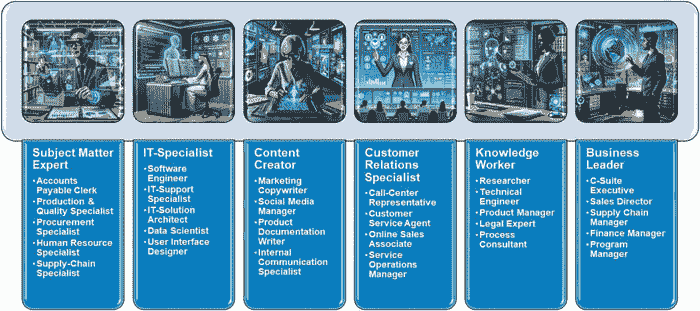

**图 3.1:** 企业角色概述

这些角色中的每一个都可以利用 CapabilityGPT 框架中的 18 种人工智能能力之一或多个来增强他们的日常任务，在其领域进行创新，并做出更明智的决策。例如：

+   专业人员可以利用定制的特定人工智能能力自动化任务和例行决策。

+   IT 专家可以利用 ChatGPT 的能力来增强系统设计、数据分析，并促进创新解决方案。

+   内容创作者可以利用人工智能能力来激发并产生高质量内容。

+   客户关系专家可以借助人工智能框架提升其客户服务标准。

+   知识工作者可以利用特定能力进行高级知识管理和推理，从而提高生产力和质量。

+   商业领袖，配备定制的人工智能能力，可以收集更多数据，并更快速、全面地进行分析。

随着 CapabilityGPT 的引入，人工智能的好处可以在企业中各种角色中得到获取和适应。在本章中，我们将阐明如何通过 ChatGPT 集成这些人工智能能力，为每个企业角色的增加生产力、创新和增长提供巨大机遇。

# 结构

在本章中，将涵盖以下主题：

+   专业人员的未来

+   IT 专家的未来

+   内容创作者的未来

+   客户关系专家的未来

+   知识工作者的未来

+   商业领袖的未来

# 专业人员的未来

在诸如应付账款和供应链管理之类的功能中，人工智能工具正在成为专业人士的有益伙伴。本节讨论了人工智能辅助如何有益于各种角色的日常任务。我们将重点关注以下中小企业角色：应付账款文员、生产和质量专家、采购专家、人力资源专家和供应链专家，揭示他们典型工作周中可能发生的变化。

# 应付账款文员

介绍泰勒，一名应付账款文员，他与他的人工智能同事财务分析智能代表（FAID）通力合作，优化应付账款业务。

**图 3.2:** 应付账款文员

# 星期一-复杂发票处理和差异处理

泰勒和 FAID 通过精心处理多个复杂发票来开始这一周，深入细节以确保精确性和准确性。在处理大量发票的同时，我们重点关注三个具体实例，以说明他们在日常运营中遇到的反复挑战。

首先，FAID 利用其基于 OCR 的**信息提取和分析**能力，从发票中精确扫描和提取必要数据。随后，**沟通**和**撮合**能力发挥作用，它将提取的细节与交易系统中的相应采购订单和交货收据进行交叉参照，旨在找出任何差异。

在第一张发票中，关于记录的交付数量存在差异。泰勒提出假设：“这与交付收据不符。这可能是我们录入数据时出现的错误吗？”为了验证这一点，FAID 启动了基于聊天的对齐，与仓库工作人员进行沟通，利用其**沟通**功能验证细节。仓库工作人员确认了错误，并在 FAID 的帮助下，他们迅速在系统中纠正了错误，更新了交付收据以反映准确的细节。

在第二张发票上，价格方面存在偏差。泰勒指出：“看起来供应商根据他们最近的涨价向我们开出了账单，而这并没有反映在最初的采购订单中。”在这里，FAID 通过其**评估**功能进行合同分析，发现系统中没有正确设置的规定价格容差。FAID 立即通过其**沟通**功能触发了交易系统的系统配置更新，以符合合同规定的容差，从而无缝地纠正了问题。

检查第三张发票时，他们发现应用的税率与采购订单中规定的不符。泰勒指示：“FAID，看起来供应商没有按照我们在采购订单中约定的税率来申请税率，我们能否与他们联系澄清并重新核实？”再次利用其**沟通**能力，FAID 向供应商发送通知，要求根据采购订单中预先约定的条款纠正应用的税率，同时暂时阻止这张发票以避免任何复杂情况。

# 星期二 - 供应商澄清管理和批准启动

星期二专注于复杂的服务发票处理任务。泰勒和 FAID 致力于解决与采购订单（POs）、服务入口表和发票中多层规格对齐所带来的复杂性。

利用其敏锐的**撮合**和**沟通**能力，FAID 在这个过程中发挥了关键作用。它系统地交叉验证这些文件中的数据，确保每个细节都完美对齐，避免任何未来的冲突或差异。例如，在其中一张发票中，发现了有关入口表上记录的服务持续时间和发票不符的差异。为了解决这个问题，FAID 促成了泰勒与服务提供商之间的对话，以准确确定细节，并相应调整发票，确保准确反映提供的服务。

随着一天的进展，泰勒利用 FAID 的**分类**功能，灵活地根据项目对齐、成本范围和紧急程度对修订后的发票进行分类。然后，通过 FAID 的**沟通**功能将发票引入批准工作流程，这是最终结算的关键一步。

# 星期三 - 最终发票调整和批准完成

在星期三，泰勒和 FAID 就发票调整进行了积极讨论。FAID 利用其**沟通**能力，将供应商澄清整合到发票中，同时讨论处理每个案例的最佳方法。

泰勒可能会问：“FAID，你能否**总结**一下目前批准的状态？”对此，FAID 以简洁的概述回应，帮助泰勒做出明智的决策，并在必要时进行干预，保持流程透明和协作。

# 星期四 - 详细对账

泰勒和 FAID 团队在星期四合作，对应付账款分类账进行了细致的对账。泰勒说：“我们有一项艰巨的任务，要将未付款项与银行对账单进行匹配。让我们确保一切都完美对齐。”

FAID 立即开始使用其**撮合**和**沟通**能力整理必要的数据，提出泰勒需要关注的潜在不匹配。在这个过程中，它标记了一笔异常交易，促使泰勒询问，“FAID，标记这笔特定交易的原因是什么？”

凭借详细的见解，FAID 分享道，“与这个供应商的交易金额明显高于他们的平均发票金额，而且这是他们本月的第三张发票，而他们通常是两个月发一次发票。”

泰勒承认了详细的分析，决定与供应商进一步调查，赞赏 FAID 在识别这类异常时的敏锐眼光和分析能力。

在结束一天之前，泰勒与 FAID 讨论了即将到来的付款计划，通过使用其**排名**能力来优化地安排付款，避免任何滞纳金，同时保持健康的现金流。泰勒说道，“FAID，让我们利用我们的见解来巧妙地安排付款，关注到期日和预算可用性。”FAID 应用其**规划**功能。

# 星期五 – 报告和绩效审查

在星期五，泰勒与 FAID 分享议程，“让我们用一份全面的报告总结本周的关键活动，并确定我们下周可以改进的领域。”

通过其**创建**功能，FAID 编制了一份富有见地的报告，将大量数据综合成本周财务动态的快照，促进泰勒和 FAID 就未来战略进行建设性讨论。

在结束之前，泰勒提出了学习方面，“本周我们看到了一些 OCR 错误。如果我们能从中学到教训，避免将来出现类似问题，那将是很好的。”

FAID 认识到，通过从本周遇到的错误中学习，调整其能力以更好地协助即将到来的任务，专注于通过自我改进来提高。

通过与 FAID 合作，泰勒成功地准确高效地处理了大量复杂的发票，保持了良好的供应商关系，确保了合规性，并不断改进了应付账款流程。他们的协同作用导致了运营的优化和生产力的提高，极大地促进了组织的财务管理。

# 生产和质量专家

设想一下玛丽的一周生活，她是一名生产和质量专家，与她的人工智能伙伴生产质量智能系统（PQIS）和谐地合作。

**图 3.3:** 生产和质量专家

# 星期一 – 生产监控和安全检查

玛丽开始她的一周，询问道，“PQIS，你能给我一个生产速度的更新吗？”利用其**评估**能力，PQIS 回答道，“当前的生产速度是最佳速度的 80%。由于今天早些时候进行了维护工作，装配线 3 的速度有所减缓。”玛丽对这一见解表示赞赏，并问道，“安全标准呢？”PQIS 迅速指出潜在的风险区域，建议玛丽特别注意生产车间的一个最近发生过溢出的地方，以防止事故发生。

# 星期二 – 流程调整和质量保证

星期二，玛丽想深入了解最近的生产问题，问道，“PQIS，我们最近有没有发现导致生产效率低下的模式？”通过其**数据挖掘**功能，PQIS 指出，“是的，最近在 2 号线频繁出现短暂停止，可能是由于老化的传送带出现磨损迹象。”玛丽根据这一信息采取行动，决定为传送带安排维护检查。整天，PQIS 在监控生产质量方面协助玛丽（同时利用其**评估**和**建议**能力），建议对机器设置进行微小调整以提高产品质量。

# 星期三 – 库存管理和部门间协作

玛丽在星期三开始关注库存和部门间协作，利用 PQIS 的**沟通**和**预测**能力。她向 PQIS 咨询，“我们能查看零件 X 的库存状态吗？” PQIS 与 ERP 系统接口，通知道，“零件 X 的当前库存对本周来说是足够的，但建议重新订购以避免下周的中断。”后来，她利用 PQIS 建立的虚拟协作空间与销售部门协调，以使生产与即将到来的销售促销活动保持一致。

# 星期四 – 文档编制、问题解决和质量控制

星期四，玛丽记录了生产过程、安全协议和质量标准的细节。她利用 PQIS 的**总结**能力将复杂的生产数据压缩成可管理的摘要，提供了对生产情况更清晰的视图。利用 PQIS 的**转换**能力，玛丽将这些摘要数据转换成易于理解的可视化形式。

在记录过程中，玛丽注意到 PQIS 呈现的质量控制数据中有一个异常。在询问后，PQIS 详细说明了质量偏差的原因，包括测量不一致、固化过程中的温度飙升以及原材料混合比例的差异。凭借这些详细的反馈，玛丽计划纠正问题并确保其不再发生。

PQIS 的**评估**能力使她能够进行绩效分析，并对生产过程进行必要的调整以获得更好的产出。最后，利用 PQIS 的**预测**能力，玛丽收到有关在制品中任何潜在质量偏差的警报，从而能够立即进行纠正。

# 星期五 – 培训、绩效评估和未来规划

玛丽在周末结束时专注于培训和未来规划。她寻求 PQIS 的帮助来制定培训内容，问道，“PQIS，我们能根据本周遇到的问题定制培训模块吗？”利用其**创作**能力，PQIS 帮助制定了针对特定问题领域的个性化培训课程。下午，玛丽坐下来审查本周的绩效，并为下周做计划。利用 PQIS 的**创作**和**推荐**能力，她分析了详细报告，突出了成就和需要改进的领域，为下周的挑战采取积极主动的态度做好了准备。

遵循预测制造的原则，玛丽与 PQIS 积极合作，确保几乎无缝的生产过程和高质量的产出。PQIS 不断更新车间情况和前瞻性见解，使玛丽的工作在操作上更加有效和积极主动，有助于建立健壮的生产流程并交付高质量的产品。

# 采购专员

让我们来认识一下努尔，一个精明的采购专员，她得到了她的人工智能助手 ProcurAce 的密切支持，这是一个旨在协助采购流程各个方面的系统。以下是他们典型工作周的一瞥。

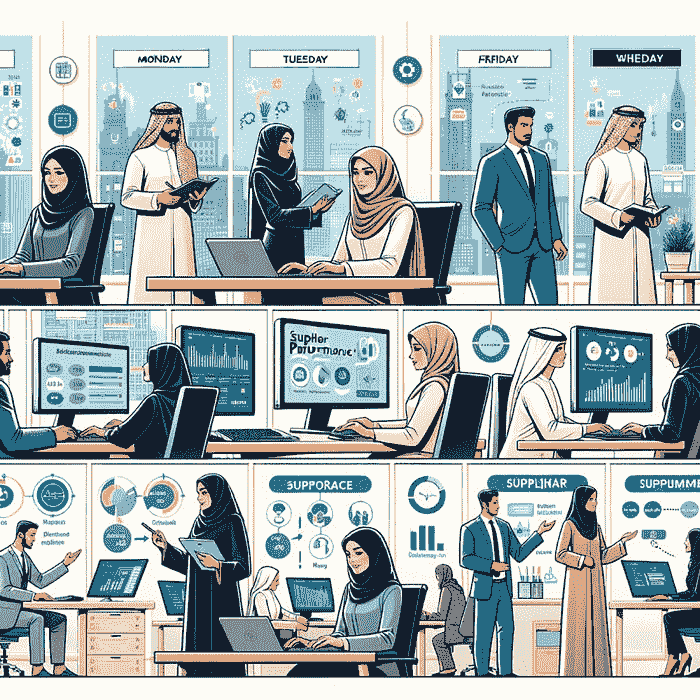

**图 3.4:** 采购专员

# 星期一 – 供应商绩效评估和反馈

当努尔审查绩效指标时，她问 ProcurAce，“上个季度供应商 B 在符合规格方面表现如何？” ProcurAce 利用其**评估**能力回答说，“供应商 B 的符合率为 95%，比上个季度提高了 5%。”

随后，在起草反馈邮件时，努尔询问：“你能建议一种礼貌的方式来解决与 C 供应商重复的包装问题吗？” ProcurAce 利用其**沟通**技能提出建议：“您可以说，‘我们重视我们的合作伙伴关系，并相信解决这个反复出现的包装问题可以促进未来更顺畅的合作’。”

# 周二-请求提案（RfP）创建、供应商预选和派遣

在创建 RfP 时，努尔问 ProcurAce：“我们可以在项目范围中强调环境标准的遵守吗？” ProcurAce 利用其**创建**能力建议：“当然，我们可以强调必须遵守特定的环境规范，展示我们对可持续实践的承诺。”

随后，在确定 RfP 派遣的供应商时，努尔咨询 ProcurAce：“根据过去的表现，哪些供应商最适合这个项目？” ProcurAce 利用其**排名**能力建议：“鉴于他们在类似项目中的出色业绩，D 供应商和 F 供应商是您最好的选择。”

# 周三-RfP 查询和响应管理

到了周三，努尔开始收到与她前一天发送的 RFP 相关的查询。首要任务是对这些查询进行分类，以便进行高效的响应管理。ProcurAce 利用其**分类**能力，将收到的查询分为“定价”、“时间表”、“规格”和“模糊”等类别。

ProcurAce 标记了来自“X 供应商”的特定查询为“模糊”。索菲向 ProcurAce 寻求澄清。系统解释了由于查询的模糊术语、可能有多重解释的潜力以及与“X 供应商”过去类似模糊的互动，导致了标记。在了解这一点后，努尔决定直接处理这个查询，以避免误解。

对于剩下的问题，她利用 ProcurAce 的**沟通**和**问答**能力。系统根据预设的指导方针起草回复，然后由努尔审查后发送。

# 周四-应急管理和成本控制

面对供应中断，努尔求助于 ProcurAce：“我们能否在短时间内确定替代供应商？” ProcurAce 利用其**撮合**能力迅速行动，回答道：“是的，G 和 H 供应商可能满足您的需求；您想联系他们吗？”

下午，努尔问道：“我们可以考虑哪些潜在的谈判要点来控制成本呢？” ProcurAce 利用其**推荐**功能建议：“您可以考虑谈判付款条件或探讨量价折扣来控制成本。”

# 周五-供应商合作、预测和报告

在审查 RfP 回复时，努尔咨询 ProcurAce：“你能帮我从 I 供应商的提案中提取关键卖点吗？” ProcurAce 利用其**信息提取和分析**能力，概述道：“当然，他们强调了他们的创新方法和对可持续发展的承诺。”

在他们最终确定选择的时候，努尔问道：“我们应该如何向供应商传达我们的决定呢？” ProcurAce 利用其**沟通**技能提出建议：“让我们热烈祝贺被选中的供应商，并通过承认他们提案的优势来鼓励其他供应商。”

通过利用 ProcurAce，努尔确保了精确的供应商评估和高效的 RfP 管理。她还加强了与供应商的合作关系，更准确地预测，并为组织的采购卓越做出了重大贡献。努尔与 ProcurAce 之间的这种协同作用，为优化采购运营和实现战略目标的人工智能的变革力量奠定了基础。

# 人力资源专家

踏入经验丰富的人力资源专家布莱恩的鞋子，他与他的人工智能助手 HR Helper 手牵手在人力资源领域中穿行。以下是他们高效工作周的一瞥：

**图 3.5：** 人力资源专家

# 星期一 - 绩效洞察和冲突模拟

布莱恩开始他的一周思考：“HR Helper，根据上周的绩效数据，我们的团队情况如何？” HR Helper 利用其评估能力，筛选各种数据，提供细致的见解。

在识别关注领域时，布莱恩问道：“我们能够确定表现不佳的可能根本原因吗？” HR Helper 利用其因果分析能力来确定问题，例如工作量不均和技能差距。

预料到前方的困难对话，他想知道：“我们能为潜在冲突制定战略吗？” HR Helper 发挥其模拟能力，帮助构思有效的干预策略。

# 星期二 - 候选人排名和健康调查

手头有一份潜在雇员名单，布莱恩询问：“我们如何有效地对这些简历进行分类？” HR Helper 通过部署其分类和排名能力来简化候选人选择过程。

随后，布莱恩希望了解员工的情绪，他问道：“我们能够关注一下团队的幸福感吗？” HR Helper 利用其沟通能力发送了一份调查，并利用其评估能力评估了回应，提供了当前士气的快照。

# 星期三 - 内容制作和多样性挖掘

星期三，布莱恩表达了通过培训弥合已识别的技能差距的需求，问道：“我们能够创建引人入胜的培训材料吗？” HR Helper 利用其创作能力来帮助设计丰富的内容。

为了保持多样化的工作场所，他问道：“我们的多样性格局是什么样的？” HR Helper 利用其数据挖掘能力深入挖掘广泛的数据，突出需要关注的领域。

# 星期四 - 政策评估和团队搭配

布莱恩从合规性检查开始星期四，想知道：“我们的政策是否符合当前法规？” HR Helper 通过其评估能力仔细审查政策，指出了布莱恩需要解决的潜在不合规问题。

随后，在讨论团队动态时，布莱恩建议：“让我们为即将到来的项目找到最佳的团队搭配。”在这里，HR Helper 利用其搭配能力介入，提出能够促进生产力和和谐的组合。

# 星期五 - 流失预测和报告编制

随着一周的结束，布莱恩寻求预测，询问：“下个季度员工流失率是多少？” HR Helper 利用其预测能力，提供了一个明智的预测。

在结束之前，布莱恩请求：“我们能否得到本周人力资源动态的全面报告？” HR Helper 利用其信息提取和分析以及转化能力，编制了一份详尽的报告，为即将到来的一周提供了可操作的见解。

在整个周中，布莱恩和 HR Helper 之间的联盟体现了人力资源中人工智能的潜力 - 无论是简化任务、确保合规性还是增强团队动态 - 都对人力资源功能的效力做出了实质性的贡献。

# 供应链专家

想象一下诺亚的一周生活，他是一名供应链专家，无缝地将他的任务与他的人工智能驱动的供应链控制塔（SCCT）整合在一起。

**图 3.6：** 供应链专家

# 星期一 - 强大的需求和供应规划

在周初，诺亚问道：“我们如何准确预测本季度的产品需求？”SCCT 通过利用其**预测能力**来分析历史销售数据、季节性趋势、市场动态和供应商能力，提供了全面的预测，以帮助需求和供应规划。

随后，诺亚想知道：“有没有办法自动化与供应商的沟通，以简化订购流程？”SCCT 肯定地回答，强调其**沟通能力**以促进与供应商的无缝互动，帮助维持平衡的库存。

# 星期二 - 库存监督和战略模拟

周二，诺亚询问：“我们能否获取所有仓库的当前库存状态的更新？”SCCT 利用其**沟通能力**从各种库存和仓库管理系统中获取最新数据，使诺亚能够根据当前库存水平做出明智的决策。

随后，诺亚关注风险管理，问道：“我们能模拟潜在的供应链中断以更好地为其做准备吗？”SCCT 启用其**模拟能力**，制定了几种供应链场景并分析潜在影响，为诺亚提供了应对各种挑战的战略路线图。

# 星期三 - 可行见解和适应性策略

周三，诺亚将注意力集中在从周二的模拟中得出的深入见解的深入实施。在他整合这些可行步骤以改善供应链流程时，SCCT 的**沟通**能力确保了库存系统、供应商和分销渠道之间的无缝互动。

然而，SCCT 的一个特定见解引起了诺亚的注意，暗示着供应商合作关系中的重大变化。好奇的他询问更深层次的原因。SCCT 通过详细说明历史表现、最近的行业变化和新兴的物流挑战等一系列因素的混合使这一见解成立。SCCT 结合历史数据趋势、最近的供应商评级和潜在的未来中断风险进行了说明。拥有这一透明且数据驱动的见解，诺亚考虑了其影响并开始做出必要的调整。

与此同时，SCCT 密切关注整个供应链。从追踪潜在的供应延迟、库存不平衡到技术故障，SCCT 的实时**沟通**和**评估**能力确保异常迅速被发现。对任何不一致性都会立即发出警报，并且 SCCT 的**推荐**引擎会立即采取行动，提出有效的对策以减轻潜在问题，确保供应链运营的流畅进行。

# 星期四 - 异常处理

面对周四突然的生产故障，诺亚紧急询问：“我们能做些什么来减轻这次生产故障造成的影响？”SCCT 利用其**沟通和撮合能力**来促进紧急讨论并寻找替代供应商，提供解决方案以维持供应流程而不至于出现重大延误。

# 星期五 - 绩效评估和报告

周五到来时，诺亚专注于回顾本周的绩效，问道：“你能帮我分析本周的运营绩效吗？”SCCT 利用其**评估能力**评估不同的指标，提供了本周活动的全面视图。

随后，为了编制报告，诺亚请求：“我们能否将所有重要数据汇总成一份全面而简洁的报告？”SCCT 利用其**总结和转化能力**制作简洁的报告，并配以直观的可视化，帮助诺亚有效地把握关键见解。

在整个工作周中，诺亚利用他的人工智能驱动的供应链控制塔（SCCT）的全面能力来优化运营，提高供应链管理的效率。利用先进的人工智能功能进行实时通信、预测分析、模拟和评估，诺亚在日常和意外挑战中导航，确保供应链流程强大、有弹性且几乎无缝。

# IT 专家的未来

在信息技术领域的软件工程师、IT 支持专家、IT 解决方案架构师、数据科学家和用户界面设计师等角色中，人工智能的整合正在迅速改变生产力、问题解决和创新能力。

# 软件工程师

让我们认识一下金，一个软件工程师，以及她的人工智能助手 CodeMaster，这对专门从事将传统软件系统迁移到更新、优化版本的动态二人组。让我们深入了解他们的典型工作周，以及他们如何利用人工智能来简化软件迁移。

**图 3.7：** 软件工程师

# 周一-详细代码分析和信息收集

金扫描旧的代码库，说道，“CodeMaster，我们需要评估。这段代码的整体质量如何？”

CodeMaster 利用其**评估**能力回答道，“从最初的分析中，有 50 个已弃用的方法。例如，`**legacyMethodA()**`使用了过时的安全协议。”

金感到好奇，“你找到了模式或依赖关系吗？”

利用其**数据挖掘**技能，CodeMaster 指出，“是的。moduleX 和 moduleY 经常互动。例如，每次调用 moduleX 中的`**functionZ()**`时，它都依赖于 moduleY 中的`**dataFunctionY()**`。”

# 周二-迁移场景分析和详细规划

金制定了迁移地图。“CodeMaster，在这种方法中可能会有瓶颈吗？”

利用**因果分析**，CodeMaster 提出，“一个潜在的问题是依赖于`**legacyDatabase()**`。首先迁移它可能会简化其余部分。还记得它在“Phoenix 项目”迁移期间导致了减速吗？”

感到任务的重压，金叹息道，“我们需要一个详细的计划。”

CodeMaster 利用其**规划**能力建议道，“让我们最后处理用户界面，首先专注于核心功能。这将与我们在“Atlas 项目”过渡期间的成功策略相呼应。”

# 周三-转型：从传统代码到伪代码和新代码

金在筛选复杂的传统代码时评论道，“这部分的逻辑感觉混乱。”

CodeMaster 利用其**转换**能力提出，“让我简化`**legacyFunctionB()**`。我可以将其简化为伪代码，突出主要操作，而不是五个嵌套循环。”

不久之后，CodeMaster 提出，“主循环获取数据，嵌套循环处理数据。我建议使用`**modernMethodC()**`，类似于我们在“Delta 项目”期间的优化。”

# 周四-扩展转型、评估和文档编制

在完善时，金注意到，“有些部分感觉不协调。”

通过其**评估**过程，CodeMaster 澄清道，“是的，`**newFunctionD()**`可能会产生错误，因为它缺少验证检查。这类似于我们在“Echo 项目”中发现的疏忽。”

随着文档的进展，金问道，“CodeMaster，旧系统中有没有我们不应该错过的关键见解？”

凭借其**信息提取和分析**能力，CodeMaster 获取了，“当然！`**legacyFunctionE()**`具有独特的错误处理机制。我们应该记录其逻辑，就像我们为“Foxtrot 项目”保留的注释一样。”

# 周五-测试和部署

金为最后的冲刺做准备，“是时候进行严格的测试了，CodeMaster。”

启动其**模拟**能力，CodeMaster 建议说：“我正在创建一个模拟用户环境。还记得‘Gamma 项目’中的 userTypeZ 吗？他们的使用模式可能是一个起点。”

随着测试的展开，金补充道：“我们需要将这些结果纳入我们的主套件。”

CodeMaster 利用其**沟通**能力保证道：“已经在做了。与我们的‘TestMaster’套件集成，确保数据一致性。”

与 CodeMaster 一起工作，金确保软件系统的平稳过渡和代码质量的一致性。CodeMaster 定期的代码审查和建议支持金的努力，导致了一个系统的迁移过程和可靠软件解决方案的部署。

# IT 支持专家

深入了解 IT 支持专家爱丽丝和她的 AI 助手 TechMaster 的一周生活。他们一起有效地处理运营问题，提供高质量支持，并保持系统的完整性。

**图 3.8：**IT 支持专家

# 周一-系统监控和用户协助

当爱丽丝查看系统日志时，她说：“看起来服务器周末过得不太好，TechMaster。”

TechMaster，利用其**评估**能力做出回应，“看起来东翼的新人力资源软件正在给我们的网络节点带来压力。”通过其解释功能，它展示了详细的网络流量，突出显示了拥挤的区域。

整天，用户们纷纷出现问题。一个用户评论说：“我似乎无法访问我们的共享驱动器！”爱丽丝询问：“TechMaster，有什么见解吗？”利用其**问答**能力，TechMaster 回答说：“这与我们上个月解决的问题相似。让我们尝试相同的修复方法。”爱丽丝遵循 AI 的指导，迅速解决了问题。他们使用 TechMaster 的**分类**能力对每个问题进行分类和跟踪。

# 周二-系统维护和备份管理

爱丽丝查看了本周的维护计划，思索着说：“我们的日程安排很紧凑，TechMaster。”AI 利用其**规划**能力建议说：“让我们先处理软件更新，然后管理备份。”整天，TechMaster 组织各种任务，利用其**沟通**能力与备份管理工具进行交流。当出现意外的备份错误时，TechMaster 警告说：“我们在财务数据备份方面出了问题。”他们一起进行故障排除，利用**分类**能力监控系统的状态。

# 周三-培训和文档

为了准备培训课程，爱丽丝问道：“TechMaster，你能生成一个关于我们新安全功能的指南吗？”TechMaster 利用其**创建**能力起草了一个直观的用户指南。在培训期间，爱丽丝模拟了一个典型的用户场景。TechMaster 展示了**模拟**，帮助用户可视化并理解新的系统方面。

# 周四-网络支持和安全检查

在监控网络时，爱丽丝注意到异常情况，“TechMaster，我们面临安全威胁吗？”TechMaster 利用其**评估**和**创建**能力提供了一份报告，指出潜在的漏洞。然后激活其**推荐**能力：“根据我的分析，我建议使用 X 补丁来解决 Y 漏洞。另外，考虑调整防火墙设置以增强保护。”

# 周五-合规、报告和未来规划

结束这一周，爱丽丝反思道：“让我们确保我们符合所有的 IT 政策，TechMaster。”AI 利用其**信息提取和分析**和**评估**能力梳理系统，并回答说：“我们符合 98%。我列出了需要关注的领域。”爱丽丝点头道：“很好。让我们也为下周做准备。”TechMaster 利用其**预测**能力，展示了潜在的未来挑战，使他们能够相应地制定战略。

# 整个星期 - 故障排除，沟通和持续学习

每天，Alice 和 TechMaster 都要处理多项责任。他们处理用户查询，解决硬件和软件问题，并确保 IT 部门和用户之间的顺畅沟通。TechMaster 利用其**问答**能力准确迅速地解决用户查询。这对还利用 AI 的**预测**能力基于新数据。这种持续学习，由 AI 的机器学习驱动，随着时间的推移优化了支持交付，并促进了用户满意度和高效的系统管理。

Alice 和她的 AI 助手 TechMaster 高效地管理 IT 支持。他们的合作导致了快速解决问题，系统运行最佳以及用户满意度，从而促进了整体生产力和增长。

# IT 解决方案架构师

见到 Marcelo，一个 IT 解决方案架构师，以及他的 AI 助手 TechAlign。这里有一个详细的工作周安排，展示了他们角色和责任的实际应用。

**图 3.9:** IT 解决方案架构师

# 星期一 - 基础设施评估和解决方案对齐

Marcelo 看着工单仪表板，评论道：“TechAlign，来自 5 号区域的工单数量大幅上升。”利用其**评估**能力，TechAlign 观察到：“让我们深入研究基础设施指标。那里的服务器集群似乎承受着异常的压力。”深入挖掘后，AI 的**因果分析**揭示：“有一个应用程序导致了重复查询，这可能是根本问题。”

# 星期二 - 解决方案设计和任务排序

当 Marcelo 的团队聚集进行每周会议时，他提示道：“TechAlign，记录要点，特别是关于新的集成项目。”利用其**沟通**能力，TechAlign 认真记录了对话。当集成挑战出现时，TechAlign 建议：“我们来一个新旧系统之间数据流的高层概述怎么样？这可能会澄清一些疑虑。”利用 TechAlign 的**创造**工具，他们设计了一个强大的方案。在一天结束之前，TechAlign 利用其**规划**和**排名**能力提出：“考虑到依赖关系，我建议先解决数据库同步的问题。”

# 星期三 - 数据分析和风险评估

当 Marcelo 审查大量数据集时，他问道：“我们能发现这里有任何异常或模式吗？”

TechAlign 利用其**数据挖掘**能力回应道：“在非工作时间存在不规律的访问模式。我们来调查一下。”此外，TechAlign 从最近的 IT 文件和标准中提取了必要的合规数据，并提到：“这些最近的标准突出了我们可能想要加强的领域。”

# 星期四 - 系统模拟和规划

在为即将到来的产品发布做计划时，Marcelo 大声猜想道：“我希望我们的系统能够处理预期的用户涌入。”渴望测试的 TechAlign 建议道：“让我们模拟一下。我们可以重现场景并评估系统响应。”在**模拟**之后，利用其**规划**技能，TechAlign 提出了优化建议：“考虑到模拟，优化我们的负载均衡器会提供更好的用户体验。”

# 星期五 - 技术建议和文档简化

随着本周接近尾声，TechAlign 展示其**推荐**能力，分享道：“有一种新的加密协议可能会增强我们的数据安全性。”在他们努力记录进展的同时，TechAlign 利用其**转换**能力提出：“这些系统蓝图很复杂。我们把它们简化成交互式模块，方便团队参考怎么样？”

# 整个星期 - 查询解决和性能报告

定期，Marcelo 向 TechAlign 咨询各种问题，“云安全协议的最新情况如何？”或者“我们今天的表现与上个月相比如何？”利用其**问答**能力，TechAlign 提供及时准确的回答。每天晚上，TechAlign 提供简洁的**摘要**：“根据我们当前的进展和挑战，这是我们本周的概况。”

与 TechAlign 协同工作，Marcelo 确保组织拥有强大且可扩展的 IT 解决方案。 TechAlign 的定期数据洞察和积极解决问题的能力增强了 Marcelo 的决策能力，最终实现了高效的 IT 基础设施的开发和实施。

# 数据科学家

让我们认识一下 Varsha，一位数据科学家，以及她的 AI 助手 InsightAce。他们一起将原始数据转化为可操作的洞察和预测模型，帮助推动业务战略。让我们来看看他们的典型一周：

**图 3.10：** 数据科学家

# 周一 - 数据清洗和预处理

Varsha 在周一开始时问道：“今天我们的原始数据处于什么状态，Ace？” InsightAce 深入挖掘其**数据挖掘**能力，回答道：“有一些有趣的模式，但也有一些我们需要解决的异常。准备好进行一些数据转换的魔术了吗？”他们一起精炼数据，确保它准备好进行后续的建模任务。稍后，Varsha 想到：“我想知道项目团队是否知道这个异常值。” InsightAce 利用其**沟通**能力保证道：“我刚刚向他们更新了我们的发现和数据的当前状态。”

# 周二 - 特征工程

Varsha 在检查数据时询问道：“哪些特征可以推动我们的预测模型，Ace？”

利用**因果分析**，InsightAce 建议道：“考虑到我们的目标，这些变量可能会显著影响结果。想基于它们创建一些新特征吗？”这对组合花了一天时间塑造数据，为算法选择做好准备。

# 周三 - 机器学习算法选择和模型训练

在本周中期，Varsha 和 InsightAce 开始选择最适合他们项目的机器学习算法。启用**撮合**能力后，他们审查各种算法，以确定其与现有特征和期望输出的兼容性。一旦发现有希望的算法，Varsha 表示希望更深入地探索以确保它是最合适的。

然后 InsightAce 利用其解释能力，为 Varsha 提供了所选算法的全面概述。AI 详细阐述了算法的优势、潜在弱点和理想的使用案例。它提供了解释底层数学的可视化表示，使 Varsha 更容易直观地理解其运作方式。例如，如果他们正在考虑决策树，InsightAce 可能会直观地表示树是如何划分数据，并提供关于熵、信息增益和决策边界的背景信息。这次深入还涵盖了计算成本、算法假设和潜在偏见，确保 Varsha 拥有她需要做出明智决定的所有信息。

他们对自己的选择感到自信，开始执行算法。 InsightAce 利用其**创建**能力，为基于他们选择的算法的不同流水线起草了多个代码版本。然后模型训练开始了，AI 的**沟通**和**转化**能力协同工作，通过 API 调用执行模型并可视化其结果。

# 周四 - 模型验证和改进

回顾他们的进展，瓦尔莎问道：“我们的模型表现如何？” InsightAce 凭借其**评估**能力回答道：“我们的准确度和精度看起来不错，但召回率需要改进。”他们讨论调整和改进，确保他们的模型达到最佳性能。

# 周五 - 模型部署、监控和持续改进

瓦尔莎展望未来，想知道：“我们如何能够将我们的模型整合到现有系统中而不出现问题？” InsightAce 建议一个**计划**，考虑潜在的限制。“让我们还模拟潜在的性能场景，以确保我们的模型保持稳健”，它补充道，利用其**模拟**能力。他们最终确定了部署计划，对本周的成就充满信心。

# 整个周 - 迭代改进和文档编制

在本周的工作中，瓦尔莎经常寻求澄清。“艾斯，提醒我为什么我们选择了这个参数？” InsightAce 凭借其**问答**技能提供准确的背景信息。他们记录了他们的过程，而 InsightAce 的**转化**将复杂的步骤转化为可读的文档。到了周末，InsightAce 总结道：“想要本周的一个快速**总结**吗？”阿娃点点头，“当然！”他们回顾了他们的旅程，准备迎接下一个数据驱动的一周。

与 InsightAce 保持一致，瓦尔莎从原始数据到清晰的可操作智能战略地引导数据之旅。 InsightAce 的一贯分析和积极的方法支持瓦尔莎明智的选择，加强了数据科学的迭代过程及其对业务影响的转化。

# 用户界面设计师

让我们深入了解用户界面设计师斯文和她的人工智能助手 DesignMind 的工作周：

**图 3.11：** 用户界面设计师

# 周一 - 任务对齐和用户界面评估

开始新的一周，斯文想知道：“这周我们应该如何在团队中分配任务？”DesignMind 利用**撮合**建议道：“考虑到每个人的优势和当前的工作量，我建议安娜负责图标设计，山姆负责布局优化。”斯文然后浏览了一个用户界面，思考道：“这个界面的性能如何？”DesignMind 凭借其**评估**能力回答道：“我们的用户反馈和系统日志表明用户觉得导航直观，但颜色方案有点令人困惑。”

# 周二 - 设计创建、优先级和组织

斯文正在草绘一个新的用户界面，他问：“你能帮我想象一下这个概念的线框图吗？” DesignMind 利用**创造**能力展示了多个设计选项，并问：“这些看起来怎么样？”斯文点点头，“不错的开始！我们最近的设计得到了用户的反馈吗？”DesignMind 的**转化**能力整理了原始数据，“反馈表明用户欣赏简单性，但有些人觉得 CTA 按钮不够突出。我们应该优先解决这个问题吗？”

# 周三 - 数据驱动的见解和设计灵感

审查一些模拟数据，斯文询问：“为什么这个设计元素更受欢迎？”DesignMind 凭借其**数据挖掘**技能解释道：“用户觉得它直观，类似熟悉的界面。此外，它的颜色和位置增强了吸引力。”斯文感到本周中期的低迷，“我需要一些新的灵感。”DesignMind 凭借其**语义搜索**技能迅速展示：“这里有一些我找到的流行设计和风格。”

# 周四 - 根本原因分析和预测建模

注意到一些用户投诉后，斯文思索道：“是什么导致了这些界面问题？”利用其因果分析能力，DesignMind 指出：“似乎边栏中的文本重叠导致了混淆。此外，用户可能会在移动设备上遇到非响应式菜单的困难。”斯文勾勒出一些变化，问道：“用户对这个修改后的设计会有什么反应？”利用其预测能力，DesignMind 推测道：“根据过去的行为，他们可能会发现这更加用户友好，尤其是年轻人群。”

# 星期五 - 战略决策和内容开发

斯文希望改进，问道：“有什么建议可以增强我们的界面？”DesignMind 利用其推荐能力提出：“根据用户数据，也许使主页横幅互动化可以提高参与度。此外，优化我们的产品页面内容策略可能会有所帮助。”斯文点点头：“让我们计划一下。我们的方法是什么？”利用其规划能力，DesignMind 提供了逐步的分解，确保流程顺畅。

# 整周 - 持续支持

在工作时，斯文经常询问：“这个元素很重要吗？”DesignMind 通过其分类技能会建议道：“它是中等重要的，但搜索栏更为重要。”在另一个情况下，她问道：“为什么购物车图标通常放在右上角？”利用其问答能力，DesignMind 澄清道：“这是为了更容易地用户访问和可见性而被广泛接受的设计规范。”最后，为了保持更新，斯文经常要求：“总结我们的进展和反馈。”DesignMind 依靠其概括技能提供简明扼要的概述，确保斯文始终得到及时信息。

利用 DesignMind 的数据洞察力，斯文打造直观的界面，增强用户体验。他们的协同作用将创造力与现实相关性相结合，确保每个设计既美观又功能齐全。他们共同创建了以用户为中心的界面，能够有效地预期并满足用户需求。

# 内容创作者的未来

AI 的能力已经改变了内容创作。在本章中，我们将深入探讨内容创作者的未来 - 营销文案撰写员、社交媒体经理、产品文档撰写员和内部沟通专家。在这里，我们将探讨 ChatGPT 如何释放他们的创造力，增强他们的效率，并帮助他们创作更具吸引力和情境化的内容。

# 营销文案撰写员

认识一下李，他是一位技艺精湛的营销文案撰写员，通过他的 AI 助手 CAME，即创意、分析和营销专家，优化他的讲故事艺术。以下是他如何在典型的工作周中使用 CAME 的示例：

**图 3.12:** 营销文案撰写员

# 星期一 - 评估，可操作见解和预算监控

李在一周开始时思考：“上周的内容在我们的渠道上表现如何？”CAME 利用其信息提取和分析能力分享道：“您关于环保产品的博客帖子的参与度提高了 20%。然而，新产品推出的电子邮件营销活动略有下降。”好奇的李问道：“有什么线索吗？”通过其因果分析技能，CAME 建议道：“博客的成功可能是由于环保意识日益增强的趋势。至于电子邮件，似乎对于一些用户来说，呼吁行动按钮出现了故障。”李接着想：“我们的营销预算情况如何？”CAME 利用其评估能力更新道：“我们目前的预算低于 10%。一些广告活动表现不佳，提供了潜在的节省。”

# 星期二 - 内容创建第一部分，受众细分和渠道适应

当他起草一篇新文章时，李询问道：“CAME，你能帮助优化这篇文章以适应我们的目标平台和受众吗？” CAME 利用其**创作**能力建议说：“当然！加入相关关键词可能会提升 SEO。另外，考虑到我们的目标人群，更随意的语气可能会更受欢迎。” 李点点头，“听起来不错。那么为我们的社交渠道量身定制呢？”CAME 利用其**转换**能力协助说：“对于 Instagram，视觉信息图可能会起作用。对于 Twitter，考虑将内容分成一系列推文。”

# 星期三 - 趋势分析，A/B 测试和内容测试

李在星期三问候道：“CAME，展示给我市场上最新的内容趋势。”在**数据挖掘**和**信息提取和分析**的作用下，CAME 报告说：“一种旧的内容风格正在卷土重来。”李挑起眉毛，“真的吗？为我深入挖掘一下。” CAME 的解释能力展开了故事，将这一趋势与全球事件和有影响力的人物联系起来。李印象深刻地问道：“好的，让我们测试一下我们对这一趋势的版本。你能为这些设置 A/B 测试吗？”利用其**顺序决策**能力，CAME 确认说：“当然！我会跟踪每个版本的参与率。”

# 星期四 - 内容创作第二部分和反馈整合

在起草另一篇文章时，李想知道：“我们的受众会对此有何反应？”利用**规划**和**预测**能力，CAME 提供：“根据过去的反应，他们可能会喜欢这里的个人趣事。另外，最近的反馈表明更多的视觉内容。”李回应道：“很有见地！我们也能为我们的西班牙受众翻译这篇文章吗？”CAME 的**转换**能力确保说：“当然。我会很快将其抄写和翻译出来。”

# 星期五 - 研究和协作头脑风暴

期待着结束这一周，李提议说：“CAME，找出最新的营销策略。另外，我稍后要和团队进行头脑风暴会议。”经过**语义搜索**后，CAME 呈现说：“视频营销和影响者合作正在获得增加的关注。至于头脑风暴，我已经设置了一个带有所有必要工具的虚拟空间。”李对这周的工作感到满意，总结道：“最后，为我总结一下我们的这周。” CAME 通过其**总结**和**转换**能力提供说：“我们看到博客参与度提升，做出了具有成本效益的预算决策，接受了一种重新出现的内容趋势，并在各个渠道上执行了内容。总的来说，这是一个富有成效的一周！”

在 CAME 的 AI 指导下，李在这一周内熟练地完成了他的营销文案任务，确保内容有影响力和相关性。通过高效处理内容绩效审查、受众参与、战略调整、趋势识别和 A/B 测试，他为即将到来的营销工作做好了充分的准备。

# 社交媒体经理

遇见亚历克斯，一个勤奋的社交媒体经理，他通过他的 AI 伙伴 DASH（数字和社交媒体助手）优化他的每周工作。以下是亚历克斯的典型工作周：

**图 3.13:** 社交媒体经理

# 星期一 - 每周绩效分析，战略调整和平台更新意识

在开始他的一周时，亚历克斯询问：“DASH，我们最近的社交活动表现如何？有什么异常情况吗？”DASH 利用其**评估**能力回应说：“你最近的 Instagram 故事的观看量比平均水平高 15%，可能是由于使用了热门标签。然而，Facebook 的参与度略有下降。”亚历克斯思索着：“这很有趣。这可能与任何平台更新有关吗？”DASH 的**因果分析**能力提供了一个线索：“Facebook 最近更新了其算法，这可能影响到了触达。”

# 星期二 - 内容战略对齐和一致的品牌语音管理

在整理内容时，亚历克斯问道：“DASH，上周哪些帖子获得了最高的参与度？”

DASH 利用其**分类**能力展示了一个排序的列表，并补充道：“幕后视频和问答帖子的效果最好。”亚历克斯点点头：“很好，让我们调整我们的策略，生产更多这样的内容。并确保它们在所有平台上与我们的品牌语调保持一致。”

# 星期三 - 内容执行，趋势监测和平台适应

在本周中段，DASH 的**创作**能力帮助亚历克斯生成引人注目的帖子和促销材料。随着内容的发布，DASH 为亚历克斯提供了实时的见解。亚历克斯询问道：“与上周相比，新帖子的表现如何？”DASH 回答道：“最新的视频内容的参与度增加了 20%，可能是因为它与当前热门话题相关。然而，信息图帖子的表现不如预期，可能是因为其长度较长，而当前观众更偏好简洁的内容。”有了这些信息，亚历克斯调整了自己的方法，以确保最佳表现。当天还涉及到 DASH 的**沟通**能力自动化发布帖子，以及其**信息提取和分析**能力提供有关内容初始影响的见解。

# 星期四 - 竞争对标，跨平台协调和平台更新整合

当亚历克斯浏览竞争对手的资料时，他想到：“我想知道我们的主要竞争对手最近都在做些什么。”利用其**语义搜索**、**信息提取**和**分析**能力，DASH 回答道：“竞争对手 A 发起了一个新的话题挑战，正在变得相当受欢迎。另一方面，竞争对手 B 的活动似乎稳定，没有明显的活动高峰。”亚历克斯思考着，然后问道：“与他们相比，我们的增长有什么预测吗？”利用其**模拟**能力，DASH 回答道：“我们的增长速度将比竞争对手 B 更快，但由于他们的新挑战，竞争对手 A 可能会出现激增。”亚历克斯接着想着：“有没有任何新的平台变化需要注意的？”凭借其**问答**技能，DASH 建议道：“Twitter 最近的调整显示出对视频内容的偏好。围绕这一点制定策略可能是值得的。”

# 星期五 - 预测，策略规划和确保品牌语调一致

亚历克斯首先说道：“我想在下周走在前面。我们的参与预测是什么样的？”利用其**预测**能力，DASH 预测道：“预计周三左右会出现参与度的激增。然而，周末可能会有轻微下降。”渴望回顾一下，亚历克斯提到：“让我们回顾一下本周的表现。”DASH 利用其**总结**功能提供道：“你周二的视频内容很受欢迎，而周四的信息图并没有引起太多关注。与上周相比，你的总体参与度增长了 12%。”亚历克斯总结道：“好的，我需要为下周制定策略。让我们对这些数据进行视觉总结，并确保我们的品牌语调保持一致。”利用其**转换**能力，DASH 保证道：“没问题，亚历克斯。所有内容都将与品牌的语调保持一致。”

在 DASH 的人工智能辅助下，亚历克斯巧妙地管理着他的社交媒体任务，确保策略得到优化和吸引力。通过培养不断增长的忠实粉丝群，熟练处理绩效分析、内容对齐、执行、趋势跟踪和竞争对标，他为即将到来的社交媒体挑战做好了充分准备。

# 产品文档撰写人

让我们来认识一下勤奋的产品文档撰写人广志。在他值得信赖的人工智能伴侣 WORD（写作优化和修订设备）的帮助下，他将复杂的产品转化为易懂的指南。以下是广志典型工作周的更详细的分解。

**图 3.14:** 产品文档撰写员

# 【星期一 - 文档评估、战略规划和任务优先级】

在查看最近的用户反馈时，Hiroshi 说：“似乎一些用户在最新的安装指南上遇到了问题。可能是什么问题？”WORD 的评估功能扫描反馈并回答：“看起来一些用户对配置设置的步骤不清楚。”对于这个见解，Hiroshi 点头道：“好的，让我们重新制定那部分。在此期间，你能帮助优先考虑需要最紧急关注的部分吗？”使用 WORD 的排名功能，Hiroshi 得到了本周任务的清晰路线图。

# 【星期二 - 信息提取和内容转换】

当 Hiroshi 准备更新文档时，他问道：“WORD，你能从产品发布说明中获取最新的技术细节吗？”WORD 迅速提供了信息，使用其信息提取功能。然后 Hiroshi 说：“很好，让我们使用这些信息将早期的客户查询和技术响应转化为新指南的有用知识文章。”

# 【星期三 - 指南创建和产品特性对齐】

在起草用户指南的中途，Hiroshi 问道：“我们是否充分解决了产品的新安全特性？”WORD 使用其搭配功能验证并回答：“双因素认证部分可能需要更多细节。您想根据常见用户查询获得一些建议吗？”渴望提供澄清的 Hiroshi 回答道：“当然！让我们确保我们的用户拥有他们所需的所有信息。”

# 【星期四 - 内容审查、质量保证和总结】

当 Hiroshi 审查本周的文档时，他大声想到：“我在新指南中是否涵盖了所有重要的产品更新？”WORD 的**评估**功能扫描文档，回答道：“新软件补丁的细节没有充分呈现。”对于这个提醒，Hiroshi 感到感激，修订了指南，确保其准确性。在一天中，WORD 的**总结**功能压缩了技术规格和用户反馈。这个压缩版本帮助 Hiroshi 快速交叉参考，确保不会忽略重要细节，并提供了本周文档工作的快照。

# 【星期五 - 详细沟通和为下周做准备】

在本周结束之际，Hiroshi 反思道：“在我们进入周末之前，让我们与产品团队取得联系，确保我们的更新与即将到来的产品变化保持一致。”使用 WORD 的沟通功能，Hiroshi 与产品团队无缝合作，收集见解，并确保他为下周的挑战做好充分准备。

Hiroshi 在整个星期内都在使用 WORD 的人工智能支持，高效地处理他的产品文档任务，将复杂的产品特性转化为用户友好的指南。他能够熟练地处理反馈解释、内容修订、指南创建、质量检查和团队沟通，始终与产品更新和用户需求保持一致，确保他随时准备好迎接未来的文档挑战。

# 【内部沟通专家】

走进我们熟练的内部沟通专家 Rebecca 的鞋子，她与她的 AI 盟友通力合作，共同打造组织内的同步沟通节奏。以下是他们充满活力的工作周：

**图 3.15:** 内部沟通专家

# 【星期一 - 全面评估和员工情绪跟踪】

Rebecca 打开她的仪表板，说：“CHAT，让我们了解一下我们当前的沟通策略。”

CHAT 毫不犹豫地回答道，“明白了，Rebecca。根据我的评估能力，大多数我们的策略似乎都取得了良好的共鸣。然而，最近一些部门似乎参与度较低。”

深入思考后，Rebecca 思索道，“这可能是由于最近的沟通政策变化吗？”

CHAT 根据其因果分析确认，“的确，似乎这些部门受到了更多的影响。也许为他们量身定制的方法会更有益？”

# [星期二 - 简化分类和沟通]

回顾她的待办事项清单，Rebecca 心想，“我们需要确保我们的信息以最有效的方式传达给正确的受众。”

CHAT 已经领先一步地提出，“为什么不利用我的分类能力呢？我们可以根据员工的沟通偏好对其进行分组。此外，凭借我的创作技能，我可以制作针对性的信息，确保它们与每个群体产生共鸣。”

感谢支持的 Rebecca 同意道，“太好了！让我们实现这一点。”

# [星期三 - 创意内容生成和数据挖掘]

Rebecca 盯着空白的屏幕说，“我们需要为我们的通讯提供新鲜、引人入胜的内容。”

CHAT 利用其推荐能力建议道，“最近的成就可以制作信息图表，或者突出员工故事的专题栏目如何？”

被这个建议吸引，Rebecca 问道，“听起来不错！我们应该注意到有哪些主题或趋势呢？”

CHAT 利用其数据挖掘能力通知道，“关于工作与生活平衡的讨论有所增加。也许解决这个问题会产生共鸣？”

# [星期四 - 深度信息提取和危机沟通]

在浏览公司更新的大量信息时，Rebecca 思考道，“哪种渠道是传达最新政策变化的最佳方式？”CHAT 利用其搭配功能建议道，“视频会议平台最近参与度最高，确保最大的覆盖范围。”感谢这个建议，Rebecca 继续进行。后来，当她发现潜在的错误信息问题时，Rebecca 意识到迅速采取行动是必要的。CHAT 介入危机沟通支持：“Rebecca，根据错误信息的性质，我建议直接发送电子邮件，然后在内部门户网站上发布常见问题解答，以消除疑虑。”在 CHAT 的洞察力的支持下，Rebecca 有效地处理了这一情况，恢复了公司内部的清晰度和信心。

# [星期五 - 战略规划和报告]

展望即将到来的一周活动时，Rebecca 问道，“CHAT，在产品发布和团队建设活动即将到来时，我们应该如何制定我们的沟通策略？”

CHAT 利用其推荐能力回应道，“对于产品发布，我建议在发布日之前发布一系列预告公告。至于团队建设活动，也许过去参与者的重点访谈可以激起兴奋。”

Rebecca 点头表示同意，“这是一个很好的计划。哦，你能否编制一份本周活动的摘要报告？”

CHAT 高效地回答道，“当然。利用我的总结能力，我将详细说明我们本周的里程碑和见解。你马上就会收到。”

在 CHAT 的人工智能能力的支持下，Rebecca 精心协调了整个星期的内部沟通，促进了员工的参与和了解。她在情感分析、针对性信息、内容构思、危机管理和战略规划方面表现出色，确保所有组织沟通及时、相关且有影响力。

# [客户关系专员的未来]

在本节中，我们将探索各种客户关系角色的日常工作：呼叫中心代表、客户服务代理、在线销售助理和服务运营经理。通过这些现实世界的见解，我们旨在说明 ChatGPT 如何增强他们的效率，增强客户满意度，提供知情的互动和战略性的客户关系管理。

# 客服代表

我们介绍了 Laura，一个辛勤工作的客户服务代表，与她信赖的人工智能系统——客户互动智能助手（CIIA）无缝合作。通过战略性地分工，Laura 能够将大部分时间直接与 B2B 客户互动。让我们来看看他们高效的工作周：

**图 3.16:** 客服代表

# 星期一 - 直接客户互动

周初，Laura 说，“看起来今天我们有大量的电话，CIIA。”

CIIA 的柔和声音回答道，“确实，Laura。我利用我的**分类**能力将查询按复杂性和紧急程度分组。你可以直接着手解决它们，而我会确保一切都被跟踪并准备好跟进。”

Laura 微笑着说，“完美。让我们开始吧！”

# 星期二 - 持续的客户互动和幕后问题解决

当 Laura 接听另一个电话时，她大声想着，“CIIA，我们有没有任何历史模式可以提示解决这个特定问题？”

CIIA，利用其庞大的数据库，建议说，“根据类似案例，Laura，我建议这些潜在的解决方案。”其**推荐**功能提供了宝贵的见解，赋予 Laura 精确、迅速地解决客户查询的能力。

# 星期三 - 高电话量的客户参与和动态呼叫管理

对于 Laura 来说，周三通常是她工作周中客户参与度最高的时候。这一天，她注意到电话量出现了前所未有的激增。稍微有些不知所措，Laura 想着，“为什么今天会有这样的激增？有什么改变吗？”

CIIA 利用其**数据挖掘**和**因果分析**能力，迅速检查了最近的产品更新、公司公告或可能影响电话激增的外部事件。“Laura，”CIIA 通知说，“我们最新的产品更新似乎导致了一些意外的软件故障，导致了电话量的增加。”

有了这样的理解，Laura 直面解决了这个情况。CIIA 通过其**排名**能力根据客户重要性和使用产品的员工数量优先处理受软件故障影响的客户的电话。同时，它利用其**创建**能力自动生成了一个基于重复问题和投诉的一般故障排除指南，并利用其**沟通**能力通过电子邮件将指南发送给等待电话的客户。这不仅减少了等待时间，还为客户提供了即时解决方案。

在这个充满挑战的一天结束时，Laura 和 CIIA 成功地将潜在的危机转化为机遇，展示了他们的韧性和以客户为中心的方法。

# 星期四 - 强调客户保留和 CRM 更新

深吸一口气后，Laura 说，“星期四！总是与我们的高风险客户有挑战。确保他们的任何电话直接转接给我，CIIA。”

CIIA，利用其**撮合**能力，保证说，“已经在处理了，Laura。记住，如果你需要指导如何管理这些互动，我的顺序决策能力可以根据过去的数据和客户档案提供最佳步骤。”

Laura 感激地点点头，“谢谢，CIIA。顺便说一句，让我们确保我们的 CRM 是最新的。”

CIIA，时刻警惕，回答道：“我一直在利用我的**沟通**能力来自动化数据录入。在这方面不用担心！”

# 星期五-质量保证和未来规划

周五黎明，Laura 思考道：“CIIA，下周的预测如何？”

CIIA 利用其**预测**能力，分享道：“预计周一和周二的电话量会适中，但由于即将发布的产品，周三可能会出现轻微激增。”

Laura 点点头，记下：“知道了。这周我们表现如何？有什么反馈吗？”

CIIA，随时准备协助，回答道：“利用我的**评估**能力，我注意到了一些优秀的地方，也发现了一些需要改进的地方。让我们在周末回顾时再聊聊？”

Laura 在 CIIA 的先进人工智能功能的帮助下，有效地处理了整个工作周的 B2B 客户互动。在直接客户参与、问题解决、危机管理、客户保留和前瞻规划方面取得平衡，她展现了顶级客户服务的典范。

# 客户服务代理

走进 Eva 的世界，她是一个熟练的客户服务代理，她的智能 AI 伙伴 CASH（客户助理超级助手）。他们一起组成了一个无与伦比的二人组，确保客户获得无可挑剔的服务。了解他们的对话工作周：

**图 3.17：**客户服务代理

# 星期一-评估和工单管理

周一早上打开她的仪表板，Eva 说：“哇，CASH，今天我们从不同渠道收到了很多询问。”

CASH 激活其**分类**能力，回答道：“是的，Eva。我已根据问题类型、账户状态和复杂性对它们进行了分类。通过**排名**功能，我已经对它们进行了优先排序，这样我们就可以先处理最紧急的问题。”

Eva 松了口气，回答道：“太好了！让我们确保每个客户都感到被倾听和受到重视。”

# 星期二-问题解决和反馈分析

当她啜饮着早晨的咖啡时，Eva 沉思道：“我希望我们今天能解决大部分客户问题。你能帮我了解主要的类别吗，CASH？”

再次利用其**分类**能力，CASH 提供：“当然，Eva。大部分问题都属于这三类。不过也有一些复杂的问题可能需要升级。”

在一天工作中，Eva 询问：“CASH，反馈看起来怎么样？有什么模式吗？”

通过其**数据挖掘**能力分析反馈后，CASH 通知道：“我注意到从我们的聊天渠道中的反馈中存在一个趋势。似乎在计费过程中存在一个反复出现的问题。值得进一步研究以改进服务。”

# 星期三-产品知识增强和直接客户互动

渴望增进她的产品知识，Eva 询问道：“CASH，我想熟悉一下最新的产品特性。你能指导我吗？”

CASH 的**语义搜索**技能深入数据库，“当然，Eva。这是我们产品的最新更新。我还突出了最近客户经常问的常见问题，以帮助你做好准备。”

感激的 Eva 回答道：“这对我们的互动将非常有帮助。谢谢，CASH！”

# 星期四-记录保留和沟通

与客户交谈中，Eva 问道：“CASH，你能帮我详细记录这次互动吗？”

CASH 的**转换**能力开始工作，“明白了，Eva。我会确保所有细节都被记录和结构化，以便以后轻松参考。”

稍后，在一次特别复杂的客户问题中，Eva 询问：“CASH，我们的沟通清晰而富有同理心吗？”

CASH，利用其**沟通**能力，确保：“当然，Eva。我在这里确保客户在对话中感到被理解和受到重视。

# 星期五-流程改进和战略规划

在反思本周的互动时，伊娃发现了一个反复出现的问题：大量客户对新产品的设置过程感到困惑。这个问题最近变得更加突出，导致了更多的咨询和不满意度。

伊娃将这视为一个改进的机会。“一定有办法简化设置过程，或者至少更好地指导客户，”她思索道。

在意识到她的担忧后，CASH 介入道：“伊娃，你想让我进一步分析吗？”

CASH 利用其**数据挖掘**能力分析了所有最近与产品设置相关的客户查询。它确定了常见主题和客户在设置过程中容易卡住的具体步骤。然后，CASH 利用其**语义搜索**能力搜索现有的知识库，试图确定客户提供的信息中是否存在任何空白。

CASH 报告说：“伊娃，看起来设置过程中的第三步缺乏清晰度。此外，在这一步骤中并没有专门解决潜在问题的故障排除指南。”

伊娃点点头，意识到这个差距。“我们能做些什么来解决这个问题，CASH？”

CASH 利用其**创作**能力起草了更详细和用户友好的第三步指南。它还生成了一个简洁的故障排除部分，解决用户在这一步骤中可能遇到的问题。此外，它制作了一个交互式视频教程，确保更加直观和逐步的方法。

伊娃审查并批准了这些材料，并利用 CASH 的**沟通**能力，他们向客户推出了新资源。到了一天结束时，他们开始收到客户的积极反馈，感谢增强的清晰度。

由于他们的合作方式，伊娃和 CASH 已经将一个挑战转化为了一个机会，显著改善了客户体验的一个关键方面。

在整个周中，伊娃和她的 AI 助手 CASH 在处理客户查询、分类问题和增强服务流程方面表现出色。他们的综合实力有效地满足了每一个客户的需求。在意识到产品设置混乱后，他们迅速行动，强调了他们提升客户体验的承诺。

# 【在线销售助理】

加入法特梅赫，一个敏锐的在线销售助理，她与她的 AI 伙伴，销售优化机器人无比博学（SORIK），共同在快节奏的数字销售领域取得成功。他们的一周是数据驱动决策、客户参与和动态销售策略的交织：

**图 3.18：** 在线销售助理

# 【周一-销售业绩总结和产品知识】

从周一开始，法特梅赫问道：“SORIK，你能总结上周的在线销售业绩并指出我们可以改进的地方吗？”

SORIK 通过激活其**总结**和**评估**功能回应道：“当然，法特梅赫。上周我们看到了 X 类别销售额的增加，但 Y 类别还有改进的空间。另外，根据最近的更新，有一个新的产品线刚刚推出。”

对于新产品的好奇，法特梅赫询问道：“你能详细介绍一下新产品，它们的好处和定价吗？另外，我们对未来的趋势有什么预测吗？”

SORIK 的**语义搜索**和**预测**技能得到了展现，“当然。这里有关于新产品的详细信息。此外，根据当前数据，我预测下周网站流量可能会激增，特别是在家居装饰部分。”

# 【周二-客户互动，订单处理和售后服务】

在阅读早上的邮件时，法特梅赫说：“今天有很多客户查询。SORIK，我们能按照偏好对它们进行分类，以确保我有效地处理它们吗？”

SORIK 的**分类**技能开始发挥作用，“当然。我已经将查询分类为‘特定产品’、‘订单相关’和‘一般咨询’。这应该有助于你的回复。”

白天，法特梅观察到：“我看到有几笔交易正在进行中。SORIK，我们在追踪订单履行情况吗？”

SORIK，以其**沟通**功能活跃，回答说：“是的，法特梅。我正在管理在线交易，处理付款，并确保订单跟踪顺利进行。购买后，我还根据每个客户的档案建议售后服务或补充产品。”

# [星期三 - 产品放置和库存管理]

审查在线商店的布局，法特梅想知道：“SORIK，我们在产品放置方面表现如何？我们的库存情况如何？”

SORIK 的**数据挖掘**技能提供了见解，“法特梅，‘生活小工具’部分似乎很受欢迎，但一些产品的库存不足。我应该检查其他仓库或建议替换吗？”

法特梅点点头，“是的，请。还有，让我们根据销售数据和即将到来的趋势计划补货。”

SORIK 的**撮合**、**沟通**和**规划**能力同步，“我已经确定了合适的替代品，并制定了补货计划。通过这些调整，我们可以确保我们的在线商店保持吸引力和高效性。”

# [星期四 - 关系建立和客户服务]

星期四下午，法特梅注意到询问某个产品系列的顾客数量有所增加，而这个产品系列并不是商店促销的焦点。似乎一群影响者正在推动这个系列的流量和兴趣。

法特梅问：“SORIK，最近社交媒体上有关于我们‘环保家居’产品系列的提及或促销吗？”

利用其**信息提取和分析**功能，SORIK 发现一些知名的环保意识影响者最近在他们的帖子中提到了‘环保家居’系列，导致对在线商店的兴趣和流量增加。

“确实，法特梅，”SORIK 回答道。“最近有三名影响者突出了我们的‘环保家居’系列。在他们的平台上引起了很大的关注。”

法特梅想了一会儿。“我们能利用这次意外的宣传吗？”

SORIK 的**推荐**能力开始发挥作用，建议：“为了利用这次有机的宣传，我们可以向这些影响者提供联盟合作伙伴关系。通过他们的推荐所产生的每笔销售，他们可以赚取佣金。这可能会激励他们继续推广我们的产品。”

法特梅点点头，赞赏这个想法。“好的，为这个联盟计划起草一个提案，SORIK。然后让我们与这些影响者联系。”

借助 SORIK 的**沟通**技能，法特梅向每个影响者发送精心制作的提案，为他们提供联盟合作伙伴关系。一天结束时，已经有两名影响者表现出了合作的兴趣，将意外的趋势转化为潜在的有利可图的合作伙伴关系。

星期四结束时，法特梅欣赏 SORIK 的多功能性，以及他们如何共同将挑战转化为机遇，确保他们始终处于在线销售的动态世界的前沿。

# [星期五 - 培训、反馈和未来规划]

结束了一周，法特梅反思自己的职业成长：“SORIK，我们有什么培训模块可以提升我的技能吗？”

利用其**推荐**功能，SORIK 建议：“法特梅，考虑到您最近的绩效评估和角色要求，我建议这些电子学习模块。它们涵盖了在线销售和客户关系管理的最新趋势。”

在结束之前，法特梅决定提供反馈，“让我们向我们的经理发送一些关于最近客户反应和产品需求的见解。”

SORIK 利用其**沟通**能力起草反馈，“我已整理客户反馈，并突出了最常请求的产品。随时可以发送。”

法特梅和她的人工智能伙伴 SORIK，无缝地融合数据驱动的见解和积极的参与，以优化数字销售。从评估销售业绩和管理库存到利用意外的促销机会，他们的协同作用被证明是至关重要的。他们的一周体现了适应性、远见和创新，导致个人成长和对上级的战略反馈。

# 【服务运营经理】

让我们来认识一下利亚姆，一个专注的服务运营经理，他与他的人工智能同事 OPIS 一起，确保他们的组织运营顺利，服务交付卓越。以下是他们典型工作周的一瞥：

**图 3.19：** 服务运营经理

# 【星期一 - 效率评估和服务监督】

随着星期一的展开，利亚姆思索着，“OPIS，我们目前的服务交付流程有多高效？有哪些需要我们立即关注的领域？”

OPIS 激活其**评估**能力，提供见解，“利亚姆，我注意到我们在 B 和 D 服务交付时间表中存在一些空白。此外，根据客户反馈，有关改进我们售后响应的建议。”

利亚姆点点头，“让我们确保部门之间的协调无缝。你能促进沟通吗？”

OPIS 通过其**沟通**功能保证，“已经在做了。我已经安排了团队之间的联络，以解决这些问题。”

# 【星期二 - 分类和团队发展】

在处理当天的任务时，利亚姆说：“有大量客户请求涌入。OPIS，你能对它们进行分类，以便我们更有效地处理吗？”

OPIS 的**分类**技能开始工作，“当然，利亚姆。我已经将请求分类为三种主要类型：紧急、与维护相关和一般咨询。这应该有助于更好地分配任务。”

后来，利亚姆思考团队改进，“OPIS，我们能否设计一个针对我们团队需求的培训模块？”

OPIS 利用其**创造**能力回应，“当然。我已经制定了一份培训材料，重点是提高客户互动技能和处理具有挑战性的服务场景。”

# 【星期三 - 服务管理和资源分配】

在本周中期，利亚姆强调，“今天的服务交付必须是一流的。OPIS，帮助我确保我们有足够的人手和资源。”

OPIS，激活其**匹配**和**规划**能力，提供保证，“利亚姆，我已经将可用资源与当天预期的服务负荷进行了匹配。此外，我已经安排了员工，确保所有角色都得到了充分填补，以确保服务的无缝交付。”

# 【星期四 - 可持续倡议和绿色库存管理】

随着一周的进展，利亚姆意识到将可持续性纳入服务运营的重要性。他希望确保他们的组织不仅高效，而且环保意识也很强。

“我们需要检查我们的碳足迹，OPIS。我们能否确定我们的运营中可能使用了对环境不友好的资源的领域？”利亚姆询问。

利用其**信息提取和分析**功能，OPIS 扫描整个运营库存，识别可能具有更高环境影响的材料和流程。“根据我的分析，利亚姆，”OPIS 开始说，“有一些我们可以优化的领域。例如，某些部门使用的包装材料中含有不可生物降解的成分。”

深思熟虑的利亚姆建议，“也许我们可以与供应商合作开发更环保的包装解决方案？”

OPIS 凭借其**沟通**技能，迅速与供应商联系讨论可能性。“我已经与我们的供应商展开了沟通，Liam。其中一些已经在探索可持续的替代方案。”

此外，利用其**数据挖掘**和**推荐**能力，OPIS 建议：“根据废物管理分析，我观察到我们的运营中的回收实践可以得到改善。通过整合更好的废物分类流程并与绿色物流提供商合作，我们可以大大减少我们的环境影响。”

到星期四结束时，凭借 OPIS 的深入分析和积极解决方案，Liam 已经启动了使组织的服务运营更加可持续的计划。他欣赏 OPIS 的能力，他们不仅保持了运营效率，还朝着更加可持续的未来迈出了步伐。

# 星期五 - 战略规划和行政任务

星期五到来时，Liam 为即将到来的一周做好准备，“OPIS，利用我们的服务指标，我们能模拟下周的不同策略吗？”

OPIS 利用其**模拟**能力呈现：“当然，Liam。根据我们的指标，我模拟了三种可能的情景。每种情景在效率和客户满意度方面可能的表现如下。”

在处理行政任务时，Liam 问道：“OPIS，你能帮助自动化我们与特定服务应用程序的交互，并确保我们有全面的记录以供将来参考吗？”

凭借其**沟通**能力，OPIS 回答道：“一切准备就绪。我已经简化了交互并归档了所有相关的服务记录，以便以后轻松访问。”

Liam 和他的人工智能助手 OPIS 合作优化组织的服务交付。从简化客户请求、制定定制培训模块、确保充足的资源分配到开创可持续性倡议和为未来一周制定战略，这对展示了效率、远见和环保意识。

# 知识工作者的未来

欢迎来到人工智能知识工作者的未来景观。在本节中，我们将深入探讨各种专业人士的工作周：研究人员、技术工程师、产品经理、法律专家和流程顾问。这些现实世界的例子将阐明 ChatGPT 如何提升他们的生产力，推动知情决策，并催化创新思维过程。

# 研究人员

欢迎来到 Anita 的生活中的一周，她是一位富有创新精神的未来研究人员，她与她的人工智能助手 Advanced Research Intelligence Assistant (ARIA)一起正在改变研究的格局。以下是他们的合作展开的方式：

**图 3.20：** 研究人员

# 星期一 - 评估和规划

在审查研究项目时，Anita 提出了一个问题：“ARIA，我们当前的研究项目在性能和影响方面如何？”

ARIA 利用其**评估**能力回答道：“根据我们的参数，Alpha 项目具有最高的影响力，但 Beta 项目由于其潜力需要立即关注。”

Anita 思考道：“好的，ARIA，让我们规划一下我们的一周。我们能列出我们的任务并对其进行优先排序吗？”

ARIA 的**规划**和**排名**能力发挥作用：“当然。这是本周任务的一系列任务，从最紧迫的任务开始。”

# 星期二 - 领域探索和实验设置

当 Anita 深入研究时，她询问道：“ARIA，你能找到与我们的新假设相关的相关论文吗？”

利用其**语义搜索**，ARIA 检索到：“我找到了 15 篇与您的主题密切相关的论文。我还提取了关键发现，以帮助我们制定研究方法。”

Anita 印象深刻地继续说：“太棒了！让我们利用这些信息来设置我们的实验。”

# [星期三-文献综述和实验执行]

Anita 审查了一堆文章，问道，“ARIA，这些论文中有我们需要注意的模式或趋势吗？”

ARIA 以其数据挖掘能力处于前沿，“几篇论文都强调了数据中的一致异常，这可能对我们的实验至关重要。”

在进行实验时，Anita 寻求指导，“ARIA，根据当前数据，我们应该调整我们的方法吗？”

ARIA 的顺序决策功能建议，“考虑实时结果，我建议调整样本大小。”

# [星期四-跨学科整合和模型模拟]

随着她的研究进入新阶段，Anita 意识到了整合多个学科见解的必要性。“ARIA，我们能否看看当前发现与进化生物学和计算建模概念的关系？我们可能遗漏了一些重叠部分，”她建议道。

ARIA 的语义搜索、信息提取和分析以及数据挖掘能力开始运转。它不仅深入 Anita 的核心研究领域的数据库，还延伸到进化生物学、计算机科学等领域。“Anita，” ARIA 开始说，“我们当前的发现与进化生物学中的一些理论之间存在许多相似之处。此外，某些计算模型可能有助于更好地可视化和理解这些重叠部分。”

充满好奇和兴奋的 Anita 追问道，“我们能否在这些模型中模拟我们的数据并预测可能的结果？”

ARIA 的模型模拟技能，擅长制定和执行计算模型，开始工作。它整合了 Anita 的研究数据，将其与计算机科学模型相结合，并利用进化生物学的见解来模拟潜在情景。AI 还利用其转化能力以一种易于理解和互动的格式为 Anita 可视化结果。

她审查了模拟结果，对它如何提供一种新的视角来看待她的研究印象深刻。“ARIA，这可能是开创性的！我觉得我们可能正在探索一些新的东西，弥合学科之间的鸿沟，”Anita 沉思道。

到星期四结束时，借助 ARIA 的帮助，Anita 发现了可以极大丰富她的研究的跨学科联系。当天的探索为开创性方法和跨学科合作可能性打开了新的视角。

# [星期五-机会和出版规划]

准备结束这一周，Anita 思考道，“ARIA，根据我们的发现，我们应该考虑哪些期刊进行发表？我们能利用到哪些资金机会？”

ARIA 利用其撮合能力列出，“有三本期刊与我们的研究重点相符。此外，我还确定了两项可以支持我们工作的资助。”

拿着手头的数据，Anita 思索道，“让我们开始起草我们的手稿。我们能否有一个简洁的可视化呈现我们的结果？”

ARIA 的创造和转化能力发挥作用，“当然。我已经概述了手稿，并生成了一些图表来可视化我们的发现。”

回顾本周的成就，Anita 沉思道，“ARIA，我们这周表现如何？”

ARIA 以其总结能力得出结论，“我们已经取得了重大进展，特别是在跨学科研究方面。我们的项目进展顺利，我们的新发现为我们带来了令人兴奋的机会。”

在 ARIA 的帮助下，Anita 简化了她的研究过程，有效地获取相关信息并确定潜在的跨学科联系。他们的合作简化了复杂的任务，并提高了效率。Anita 和 ARIA 之间的这种合作展示了将人工智能整合到日常研究任务和决策中的实际好处。

# [技术工程师]

欢迎来到约翰的一周生活，他是未来的技术工程师，与他的人工智能搭档技术智能实体（TECHIE）一起轻松应对复杂任务。以下是他们的合作方式：

**图 3.21：** 技术工程师

# 【星期一 - 系统分析和规划】

约翰审查系统日志，询问：“TECHIE，最近有没有发现任何系统异常？可能是什么原因？”

TECHIE，利用其**因果分析**，回应道：“冷却系统出现轻微的不规则性。似乎与最近的软件更新有关。”

对于迅速的洞察力，约翰说：“你能列出基于紧急性的推荐行动吗？”

TECHIE 的**分类和排名**能力发挥作用，提供了一个结构化的待办事项清单。“当然，约翰。这是一个任务清单，从最关键的开始。”

# 【星期二 - 设计和模拟】

当约翰勾勒一个新的组件时，他想知道：“TECHIE，我们有没有任何参考或现有标准与这个设计相关？”

在 TECHIE 的**语义搜索**发挥作用下，它提供道：“我找到了几个蓝图，可以启发你当前的草图改进。此外，还有三个与该组件相关的工程标准。”

设计进展后，约翰问道：“我们能否在不同条件下模拟这个设计，以识别脆弱性？”

TECHIE 确认道：“当然，现在开始模拟。”其**模拟**功能对组件的行为进行建模，最终指出：“在极端温度波动下似乎存在轻微的薄弱点。”

# 【星期三 - 手册创建和测试设备设置】

约翰在一天开始时面临挑战，沉思道：“TECHIE，我需要为我们的新产品起草技术手册。你能提供相关的安全指南和操作说明吗？”

TECHIE 的**信息提取**能力快速扫描现有手册并回应：“这是一个全面的清单。我还为你添加了一些经常报告的用户问题需要解决。”

稍后，约翰设置一个测试装置，问道：“TECHIE，你能指导我设置吗？”

TECHIE，凭借其**问答**功能，详细说明：“从主机连接开始，然后转移到传感器阵列…”

# 【星期四 - 现场故障排除和远程支持】

在客户设施现场，约翰将 TECHIE 连接到一个故障单元，询问：“这里有什么问题？”

TECHIE，凭借其基于**分类和因果分析**的自动诊断，立即指出：“电力分配模块出现问题。我建议检查第三个继电器。”

约翰通过其**通信**功能戴上 AR 眼镜，看到故障区域被突出显示，“这个 AR 叠加很方便。附近有替换零件吗？”

TECHIE 交叉参考库存，通知道：“是的，在我们市区设施有一个。我会为你预订。”

如果约翰遇到困难，TECHIE 的**撮合**功能建议道：“你想咨询一下来自总部的丽莎吗？她上个月解决了类似的问题。”

# 【星期五 - 任务管理和审查】

经过繁忙的一周，约翰反思道：“TECHIE，这周我们表现如何？有什么潜在的问题需要我们准备吗？”

TECHIE 运行其**数据挖掘**和**总结**，提供简洁的报告：“我们解决了 90%的问题。然而，下周系统负载预计会增加。”

感激的约翰总结道：“谢谢，TECHIE。让我们相应地计划。”

作为一名技术工程师，约翰利用 TECHIE 的能力来高效地应对系统的复杂性，管理任务，并确保最佳解决方案。他们的共同努力增强了问题解决能力，简化了设计流程，并增强了系统的可靠性。约翰和 TECHIE 之间的合作充分展示了人工智能如何可以无缝地与工程任务整合，提高效率和精度。

# 产品经理

体验产品经理布迪一周的生活，他在人工智能助手产品管理智能助手（PMIA）的帮助下，成功应对多方面的角色。以下是他们如何将繁忙的工作周转化为战略性努力的过程：

**图 3.22:** 产品经理

# 周一 - 发布后回顾规划和产品定制

当布迪审查最近的产品发布反馈时，他问道：“PMIA，我们的产品在我们设定的关键绩效指标方面表现如何？有没有什么值得注意的客户反馈主题？”

PMIA 激活其**评估**和**数据挖掘**能力，分享道：“产品达到了我们 85%的关键绩效指标。然而，反馈显示一些用户觉得入职流程稍微令人困惑。好消息是功能采用率高于预期。”

深入探讨时，布迪询问：“哪些因素最影响这些关键绩效指标？”PMIA 根据其**因果分析**提供答案：“直观的设计对采用产生了积极影响。然而，间歇性的技术故障影响了入职体验。”

# 周二 - 分类、跨职能沟通和客户参与

布迪在准备跨职能会议时问道：“PMIA，我们可以根据用户反馈来优先考虑功能，并相应调整我们的团队吗？”

PMIA 利用其**排名**能力回答道：“当然！这是一个基于反馈的优先列表。将销售与前几名的功能对齐，并让生产团队参与解决最多报告的问题可能会有益。”

随后，当布迪考虑增强用户参与度时，他思考道：“如果我们引入一个反馈聊天机器人会怎样呢？”

PMIA 知道自己的**沟通**能力，兴奋地分享道：“这是一个好主意！我可以通过聊天机器人互动来协助数据录入和反馈收集。这将提供实时见解，并增强客户参与。”

# 周三 - 蓝图创建和预测

在构思下一代产品蓝图时，布迪想知道：“PMIA，虽然我们根据最新趋势有几个创新功能的想法，但为什么我们之前的一些想法在目标人群中没有引起共鸣呢？” 

PMIA 的**信息提取和分析**以及**因果分析**能力得以发挥，通过分析历史数据、市场反馈和行业趋势来回答“为什么”和“为什么不”的问题。“布迪，”PMIA 开始说道，“一些早期的概念，虽然在技术上先进，但缺乏直观的用户界面，或者与我们目标人群的主要用例不符。此外，一些概念过于超前，导致了采用阻力。”

在了解了这些见解后，布迪进一步探讨：“我们的竞争对手呢？为什么他们的类似功能受到更好的接受呢？”

通过其**语义搜索**和**评估**能力，PMIA 深入研究竞争对手的产品评论、专家意见和市场报告。“布迪，”PMIA 继续说道，“竞争对手在用户教育方面投入了大量精力，确保潜在用户理解功能的价值主张。此外，他们的入职流程更加简化，降低了采用障碍。”

受到激励，布迪得出结论：“PMIA，让我们确保我们的蓝图优先考虑用户体验和教育。我希望我们能预测潜在的接受率，并确保我们符合客户期望，同时保持创新。”

到星期三结束时，布迪在 PMIA 的洞察力支持下，拥有了一个精益求精的产品蓝图，既创新又符合用户期望。

# 星期四 - 竞争分析和资源对齐

布迪希望进一步提高用户参与度，他想知道：“PMIA，我们的竞争对手是如何进行用户教育的？我们能从他们那里学到什么？”

PMIA 利用其**信息提取和分析**能力回应道：“分析竞争对手，他们经常更新用户教程，并举办每月社区网络研讨会。他们在社区论坛上的参与也值得注意。”

布迪感兴趣地思考道：“这很有见地。让我们将我们的功能与合适的教育内容对齐。我希望我们的用户感到得到了充分的支持。”

PMIA 利用其**撮合**能力保证道：“没问题！这是一个提议，将功能与潜在的教育内容进行对齐。”

# 星期五 - 市场规划和审查

为了结束这一周，布迪思考道：“PMIA，根据我们的讨论和发现，我们应该如何调整我们的市场推广策略？”

PMIA 以其**规划**能力全力以赴地建议道：“强调用户教育和顺畅的入职流程将是关键。此外，专注于社区参与将培养信任并增强用户体验。”

布迪满意地反思道：“谢谢，PMIA。让我们总结一下这周的工作，并规划下一阶段的步骤。”PMIA 遵照指示。

作为产品经理，布迪与 PMIA 巧妙合作，将挑战转化为机遇，并确保产品成功。他们一起分析反馈，预测趋势，调整资源，并不断完善策略。布迪和 PMIA 之间的协同作用凸显了人工智能在增强产品管理方面的变革潜力，确保创新始终与用户需求和市场需求保持一致。

# 法律专家

观察到法律专家拉拉和她的人工智能助手 LegAI 之间的专业协同作用。他们共同以有条理和高效的方式有效地管理了大量任务。以下是他们每周例行工作和他们的综合能力整合的详细概述：

**图 3.23：** 法律专家

# 星期一 - 风险评估和全面分析

拉拉在周初审视最近的公司活动，并沉思道：“LegAI，你能对我们最新的行动进行风险评估并检查它们的合规性吗？”

LegAI 利用其**评估**能力确认道：“当然，拉拉。根据当前的法律标准审查活动表明，由于最近的法律修正，有三个领域可能存在潜在风险。”

拉拉感到好奇，问道：“这些法律变化可能会有什么影响？”

LegAI 启动其**因果分析**，详细阐述道：“一个变化可能会因模糊而加剧争端，另一个可能会增加合同责任。第三个可能会改变我们处理客户数据的方式，带来潜在的 GDPR 挑战。”

拉拉策划道：“好的，让我们深入研究这些，并找到预防性解决方案。”

# 星期二 - 分类和合规性

在繁忙的星期二，拉拉询问道：“LegAI，我需要快速识别汤普森案件的相关案例数据。你能帮忙根据先例和相关性对它们进行分类吗？”

LegAI 以其**分类**能力回应道：“当然，拉拉。我已经整理好了案例。你会发现最相关的案例被突出显示。”

当天晚些时候，拉拉专注于公司的知识产权组合，寻求 LegAI 的专业意见。“我想确保我们所有的商标和版权都符合法规。你能根据当前的法律指南对它们进行交叉参考吗？”

LegAI 的**撮合**功能发现了一些差异，“拉拉，有两个商标需要关注。它们的分类在最新的指南下发生了变化。”

# 星期三 - 文档和历史洞察

莱拉在审查一份法律文件时，偶然发现一个条款，她记得在过去的诉讼案件中曾引起问题。“LegAI，”她问道，“为什么这个具体的条款在以前的法律纠纷中成为争议焦点？”

LegAI 激活其**语义搜索**和**因果分析**能力回答道：“根据历史案例，这个条款通常存在语言歧义，导致不同的解释。此外，它有时与某些地区法规相冲突，导致进一步的复杂性。”

莱拉对这一见解心怀感激，决定重新起草该条款，确保其既清晰又合规。再加上 LegAI 的**创建**能力用于生成文件模板，使莱拉能够积极应对并避免潜在的未来纠纷。

# 星期四 - 提取和合规

在审查大量法律合同时，莱拉回忆起她在法学院学习过的一个重要先例，但她难以记住具体细节。“LegAI，”她询问道，“为什么罗伯茨诉 TechDyno 案对塑造关于软件许可的合同法有如此大的影响？”

LegAI 利用其**语义搜索**和**问答**能力回答道：“罗伯茨诉 TechDyno 案具有开创性意义，因为它突显了数字商品所有权与许可权的复杂性。它确立了软件在‘出售’时通常被许可给最终用户，而不是完全拥有，为此后无数软件协议设立了先例。”

利用这个复习，莱拉随后使用 LegAI 的**信息提取和分析**能力，确保她正在审查的合同与这些有影响力的先例的关键要点一致。

# 星期五 - 战略和预测

当本周接近尾声时，莱拉想知道：“基于我们目前的法律立场，LegAI，你能预测我们下季度可能面临的问题吗？”

LegAI 的**预测**能力扫描并回答：“数字产品许可相关的挑战有 60%的可能性，员工合同义务方面有 40%的可能性。”

莱拉准备下周的工作时问道：“最后，你能总结一下我们本周讨论的法律条款和合规变化吗？”

LegAI 高效地**总结**，提供简明的概述，确保莱拉充分了解并准备好应对下周的挑战。

莱拉和 LegAI 的合作展示了法律专业知识与人工智能能力相结合，可以实现高效的合规、积极的解决方案和准确的洞察力。他们的合作展示了现代法律实践的发展，强调了将人工智能整合到法律领域的变革潜力。

# 流程顾问

让我们认识一下马尔钦，一个流程顾问，以及他的人工智能伙伴，业务流程智能助手（BPIA），他们一起简化和创新业务流程。以下是他们如何在一周内分配关键任务以实现最佳结果：

**图 3.24：** 流程顾问

# 星期一 - 流程评估和故障排除

马尔钦和 BPIA 审查客户的采购流程时，马尔钦想知道：“BPIA，如果我们把供应商审查流程完全转移到采购部门，而不是在采购和运营部门之间分开，会发生什么？”

利用其**模拟**能力，BPIA 回答道：“马尔钦，如果供应商审查流程集中在采购部门下，由于减少了交接，我们可以预期审查时间将加快 15%。然而，由于采购团队可能会优先考虑成本效益而不是运营适应性，供应商的运营适应性可能会出现初始下降。将运营反馈环路整合到采购部门的审查流程中可以缓解这一问题。”

赞赏这一见解后，马尔钦考虑建议采购部门负责试点阶段，但要求运营部门提供持续反馈。

# 星期二 - 流程更新和沟通

在审查新提出的流程时，马尔钦沉思道：“BPIA，我们能否制定一个可视化表示，以帮助利益相关者更好地理解这个工作流程？”利用其**创建**功能，BPIA 设计了一份详细的流程图，突出了每个步骤。马尔钦印象深刻地说：“这看起来很全面！你能起草一份解释性的信息，我们可以发送出去吗？”BPIA 利用其**沟通**能力，起草了一份简明清晰的信息。马尔钦审查了一下，做了一些微小的调整，并将信息传达给相关利益相关者。

# 星期三 - 模型创建和洞察发现

在构建新模型时，马尔钦反思道：“BPIA，我们需要为新客户的客户入职流程提供新的方法。你能提出任何模型吗？”BPIA 的**创建**能力设计了一个独特的入职模型。当马尔钦审查时，BPIA 补充道：“马尔钦，根据最新的行业趋势，整合一个游戏化的教程可能会增强用户在入职过程中的参与度。”马尔钦感到很感兴趣，回应道：“听起来很有前途。那么，他们过去的入职策略有什么见解吗？”BPIA 运用其**数据挖掘**和**总结**能力，提供信息道：“从历史上看，用户觉得流程太冗长。在入职的第 3 步，流失率最高。”赞赏这一清晰的信息后，马尔钦决定完善这一特定步骤。

# 星期四 - 数据提取和风险管理

马尔钦分析一家合作伙伴公司的流程文件时，想到：“BPIA，我们能否将我们客户的流程与这些流程对齐，以便更顺畅地合作？”BPIA 利用其**信息提取和分析**能力，迅速处理了合作伙伴的文件。它建议道：“马尔钦，发票批准阶段可能存在潜在瓶颈。对齐流程可能需要简化特定步骤。”考虑到提议调整的潜在风险，大卫询问道：“我们在这种对齐中面临什么风险？”BPIA 进行**评估**并详细说明道：“主要风险是发票批准延迟，可能会影响现金流。然后建议道：“然而，对低风险发票实施自动批准系统可以减轻这一风险。”马尔钦点头道：“让我们提出这个建议。并继续监测是否存在进一步的风险。”

# 星期五 - 战略规划和变革管理

在为另一家寻求优化产品交付流程的客户制定战略时，马尔钦思考道：“BPIA，如果我们将包装单位集中起来，而不是分散在多个地点，可能会产生什么潜在影响？”

像在周一一样利用其**模拟**能力，BPIA 解释道：“集中包装单位可以通过批量加工实现成本效益，可能将包装成本降低 20%。此外，集中化将实现更好的质量控制。然而，到不同市场的运输时间可能会增加，影响交付速度。进行彻底的成本效益分析将是有益的，考虑到运营节约和潜在的交付延迟。”

考虑到这一反馈，马尔钦决定探索一种混合模式，即包装的中央集散地，但区域中心用于更快的分发。

整个周，马尔钦和 BPIA 合作，共同审查和改进业务流程，积极回应马尔钦的战略问题。依靠 BPIA 多样的 AI 功能，他们对潜在的流程变更进行了批判性评估，预测了提出变更的后果，并制定了确保与业务目标一致的策略。这种动态的合作加强了马尔钦的咨询方法，确保他的客户享有优化的、高效的和前瞻性的业务运营。

# 商业领袖的未来

从高层高管到中层经理，人工智能正在迅速改变决策过程。无论是 C 级高管、销售总监、供应链经理、财务经理还是项目经理，人工智能高效地收集大量数据并进行深入分析的能力都是无价的。

# C 级高管

介绍一下苏，一个经验丰富的 C 级高管，以及她的 AI 助手比特老板。他们的一周是积极的战略构建、组织对齐和规划公司发展方向的混合体。

**图 3.25:** C 级高管

# [周一 - 行业基准和战略定位]

苏以积极的态度开始新的一周，决心将公司的技术基础设施与最新的行业标准保持一致。周一早些时候，她与比特老板交流，说道：“比特老板，我们的目标是与行业领袖在技术采用方面保持一致。你能帮我了解我们当前的情况与行业基准相比如何吗？”

比特老板立即启动其**评估**功能，收集了大量数据，从最近的 IT 审计报告到各个部门的反馈，并将其与当前行业基准综合起来，为苏提供了对当前情况的深入了解。

随着比特老板呈现数据，公司的技术基础设施需要现代化以保持竞争力变得明显。在利用先进技术（如云计算和 AI 驱动的分析工具）方面，强调了突出的重点，这些技术一直被行业领先者采用，以促进创新和效率。

通过进行详细分析，苏思考道：“看起来我们需要大力改进基础设施，以符合当前行业标准。比特老板，你能帮忙起草一份升级的初步路线图吗？”

利用其**规划**功能，比特老板勾勒出了升级的潜在起点。它强调了迁移到基于云的系统和加强网络安全措施的紧迫性，然后逐步整合 AI 能力，以促进更明智的业务决策。

苏赞赏地点点头，吸收了呈现的路线图。她坚定地指示道：“比特老板，让我们继续下去。请与我们的首席信息官理查德安排一个电话，深入探讨这一战略，并确定我们需要启动的即时行动。”

比特老板迅速做出回应，利用其**沟通**功能与理查德的日历进行协调，找到了一个适合讨论的时间段。它发出了一份会议邀请，**总结**了初步的发现和会议的目标，为他们的讨论提供了一个起点。

# [周二 - 可持续性和环境影响分析]

周二专注于可持续性，苏与比特老板合作评估和制定公司的环境影响战略。“比特老板，让我们看看我们的运营如何影响环境，并找到减少碳足迹的方法。”

利用其**评估**功能，ByteBoss 整合了来自各个公司出口的数据 - 物流、制造和办公室公用事业，以监控碳排放、废物产生和能源消耗等指标。这个过程揭示了导致他们碳排放增加的重要因素：对空运物流的高度依赖。

渴望寻找可持续的替代方案，ByteBoss 利用其**建议**功能设想了更环保的物流路径，建议与环保的运输合作伙伴合作，并考虑采用替代的可持续包装材料。“苏，与优先考虑可持续性的公司合作可能会促进绿色供应链，减少我们的环境影响，”ByteBoss 表达，屏幕上展示潜在合作伙伴。

为了确保利益相关者与新的绿色愿景保持一致，ByteBoss 启用了其**通讯**功能，制定了引人注目的报告，强调可持续实践的长期利益和成本效益。苏赞赏这种全面的观点，理解可持续性在现代企业中的重要作用，无论是从环境还是声誉的角度。

# 周三 - 倡议实施和项目执行

本周中旬，苏注意到另一个经常出现的主题：一个特定部门不断超支预算，导致运营成本增加，但产出或质量并未相应提高。财务差异已经开始累积，苏渴望确保资源的有效利用。

她思考道：“这里存在不匹配；要么资源没有得到有效利用，要么我们在预算过程中忽略了某些东西。”

察觉到干预的机会，ByteBoss 干预道：“苏，你想深入了解这个部门的支出模式吗？”

ByteBoss 启用其**信息提取和分析**能力，检查与该部门相关的月度支出、供应商合同和库存数据。然后，它利用其**评估**能力将这些发现与组织内类似部门甚至外部行业标准进行对比。

经过**因果分析**，ByteBoss 强调道：“苏，看起来预算的相当大一部分用于紧急采购材料，很可能是由于库存管理不善。在这些紧急采购中支付的价格高于标准合同。”

苏意识到问题的根源，“所以，这更多是一个规划问题，而不是实际的超支。我们该如何解决这个问题，ByteBoss？”

利用其**建议**能力，ByteBoss 建议修改库存管理系统，确保及时采购并减少最后一刻的采购需求。它还建议重新谈判某些供应商合同以获得更好的价格，并设置库存阈值警报以主动管理库存水平。

在苏的批准下，这些变化得以启动，ByteBoss 的**通讯**功能确保所有相关团队都了解新的协议。到周三结束时，苏确信他们正在走向更有效的资源管理和成本节约的正确道路。

# 周四 - 风险管理、合规检查和业务发展

苏热衷于另一个方面是员工成长和团队动态。在一次审查中，她发现虽然技术培训会议频繁，但缺乏软技能发展工作坊，这可能影响了团队合作和整体士气。

苏反思道：“我们的团队在技术上很强，但我们需要确保他们有效沟通和合作。”

顺着她的思路，ByteBoss 提出：“你想对当前的培训模块进行评估和潜在改进领域吗？”

ByteBoss 利用其**语义搜索**和**评估**能力，审查了过去一年提供的培训模块。然后利用其**推荐**引擎根据行业最佳实践和员工调查反馈建议潜在的发展领域。

ByteBoss 提出：“苏，像冲突解决、情商和领导力发展等方面存在明显的差距。我找到了一些评价很高的研讨会和课程，我们可以整合进来。”

对这些见解心怀感激的苏说：“让我们计划一些培训课程，ByteBoss。是时候我们投资于全面的员工成长了。”

通过 ByteBoss 的**规划**能力，一系列研讨会被安排在即将到来的季度。人工智能的**沟通**功能发送邀请函，收集回复，并为与会者准备研讨会前的材料。

到星期四晚上，苏感到满意，知道她已经采取了措施，不仅促进了团队的专业成长，还增强了组织的文化和凝聚力。

# 星期五 - 商业模拟和规划

工作周结束时，苏坐在办公桌前询问 ByteBoss。“ByteBoss，接下来四周内最有影响力的商业场景是什么，我应该如何应对？”

利用其**预测**和**推荐**能力，ByteBoss 迅速回应道：“首先，即将到来的季节性转变历来会影响我们一些主要原材料的供应。为了应对这一情况，多样化我们的采购策略可能会有益，比如提前下订单或寻找不受这种变化影响的替代供应商。另一个解决方案可能是探索合成或替代材料作为临时使用。”

苏处理这些信息，立刻想到了采购团队。“我会和采购部的詹姆斯讨论一下。他会对替代供应商和材料有深入了解。”

ByteBoss 继续说：“其次，由于即将到来的节日季节，某些产品线的需求预计会激增。提前增加生产并与营销团队协调节日促销活动可以优化我们的销售。”

苏微笑着说：“这是一个机会！我会与市场部的玛丽亚和生产部的拉吉联系。我们需要确保我们的战略是一致的。”

最后，ByteBoss 补充道：“还有一件事。我们的一个主要制造单位将在三周内进行计划维护停机。我们需要重新分配部分生产任务，并考虑预先制造某些零部件。可能还需要调整与重要客户的交付时间。”

苏记下来：“干得好，ByteBoss。我会安排一次会议，与运营部的布迪和客户关系部的丽莎，以确保在停工期间顺利过渡。”

感到有必要的见解，苏开始了她的一轮会议，确保她的团队始终走在前面，为未来几周可能带来的挑战和机遇做好准备。

实质上，每周苏都在 ByteBoss 的帮助下推动塑造组织未来的战略举措，确保持续评估、执行举措、业绩监控、风险管理和前瞻规划。

# 销售总监

介绍大卫，一个充满活力的销售总监，以及他的人工智能驱动的销售控制塔，SalesControl，旨在为销售流程提供战略监督。他们的一周是战略规划、数据驱动的见解和主动的市场参与的结合。

**图 3.26:** 销售总监

# 星期一 - 销售业绩评估和市场分析

随着新的一周开始，大卫导航到 SalesControl 仪表板上了解上周的销售业绩。“SalesControl，你能给我上周的销售数据吗？”他随意问道。

利用其**评估**功能，SalesControl 处理最近的销售数据并分享，“大卫，你完成了目标销售的 92%。不过，由于竞争对手的促销活动，中西部地区的销售似乎有所下降。” 它通过市场报告和销售记录的组合提取这些信息，利用其**信息提取和分析**能力。

大卫皱起眉头，沉思着。“有趣。最近市场对我们产品的反应如何？” 他询问，希望了解更广泛的情况。

SalesControl 迅速利用其**因果分析**功能。它分析客户反馈、社交媒体互动和最近的产品评论，呈现了一个总结的见解。“人们喜欢我们的产品，但是对我们的高端产品线有额外功能的需求明显，”它传达道。

大卫在思考这个反馈时产生了一种理解的感觉。“好的，我们需要制定战略。SalesControl，你有什么建议？”

通过其**推荐**引擎，SalesControl 提出了一项对抗竞争对手的策略，同时满足客户的期望。“考虑到反馈，可能有利于推出一个突出高端产品线即将推出的增强功能的促销活动。此外，利用社交媒体进行这项活动可能会扩大影响范围，”它以一种谨慎的语气建议道。

大卫点头，认为这个建议是合理的。“我认为这有潜力。你能帮忙组建一个团队来推动这个吗？” 他想到了任务所需的正确专业知识的合适组合。

SalesControl readily agrees and, tapping into its **Matchmaking** function, identifies a balanced team of experienced and newbie staff from the sales and marketing departments to handle the initiative, considering their past performances and skills.

大卫赞赏地微笑着说：“干得好，SalesControl。让我们把这个计划付诸实施。” 他备受鼓舞，准备带领他的团队进入一个专注于响应和战略的一周，拥有 SalesControl 的洞察力。

# 星期二 - 客户和销售策略分类

在星期二，大卫渴望更好地了解他的客户细分。“我们如何根据最近的互动和购买行为更好地对目标客户进行分类？” 他大声思考。利用其**分类**功能，SalesControl 将客户组织成不同的细分。“根据最近的互动，这是你的高、中和低潜在客户，”它展示。其**沟通**功能随后向每个细分发送自动化和个性化的消息，让各自的销售代表知情。“大卫，高潜在客户更喜欢网络研讨会。也许我们可以本月组织一个？” SalesControl 建议使用数据挖掘的见解。

# 星期三 - 销售创新和数据挖掘

大卫在星期三急于创新地问道：“我们能否推出符合客户偏好的新捆绑优惠？” SalesControl 的**创建**功能生成了潜在的捆绑优惠列表。与此同时，其**数据挖掘**功能从过去的销售中识别出模式。“似乎购买产品 A 的客户经常询问有关服务 B。我们可以在这里创建一个捆绑优惠，”它强调道。大卫点头表示赞同，“很有见地！让我们先在有限的市场试验这个捆绑优惠。” AI 的**沟通**功能向销售团队发送了关于这一新举措的简要信息，确保了对齐。

# 星期四 - 分析，撮合和信息提取

“谁是我们销售高价产品的最佳业绩销售代表？”大卫在星期四询问道。SalesControl 利用其信息提取和分析功能，迅速呈现了一个排行榜。“是萨拉。有趣的是，她与科技公司有着良好的关系，”它补充道。大卫看到了一个机会，说道，“让我们让萨拉与我们的科技客户对齐，为即将到来的产品发布做准备。”SalesControl 的撮合能力确保了正确的团队成员与正确的机会相匹配。

# 星期五 - 战略规划和查询处理

大卫计划未来，问道，“根据当前的市场趋势，下个季度的销售预测是多少？”SalesControl 的预测能力计算出数字，“根据当前的轨迹，我们预计增长 12%。然而，考虑到计划中的产品发布和季节性变化，这可能会增加到 15%。”大卫满意地问道，“上个月我们与竞争对手相比表现如何？”SalesControl 利用其问答能力处理这个问题，交叉参考销售数据和竞争对手的见解。“我们比 X 竞争对手表现优秀了 8%，但落后于 Y 竞争对手 3%。”

在 SalesControl 的帮助下，大卫展现了一个现代销售总监的典范，利用人工智能驱动的见解做出明智的决策。整个星期，他们进行绩效评估、积极的战略制定、客户细分和前瞻规划。通过将数据驱动的见解与市场趋势同步，大卫战略性地将他的公司置于竞争激烈的销售领域的前沿。

# 供应链经理

走进萨拉的领域，一个充满活力的供应链经理，她与她的 AI 集成的优化供应链控制塔（OptiChain）合作。看着他们巧妙地穿越供应商、内部工厂和客户，将每一个挑战转化为解决方案。

**图 3.27:** 供应链经理

# 星期一 - 健康评估和供应商和工厂分类

萨拉以对供应商和工厂健康的全面评估开始了这个星期，利用 OptiChain 的健康评估功能的深入分析能力。这个工具深入挖掘了她的运营领域的丰富历史和实时指标，提供了驱动明智决策的见解。

“OptiChain，我需要一个关于我们供应商健康指标的深入概述，”萨拉在浏览生成的报告时指示道。人工智能综合了大量数据，突出关键问题，“供应商‘XYZ’存在延迟的模式，将其标记为‘高风险’实体，”它警示道，利用其强大的概括能力。

萨拉仔细考虑了这一点，考虑了最近的发展和“XYZ”面临的物流挑战。然后她指示道，“考虑到他们的情况，将他们暂时归类为‘临时高风险’是明智的。让我们在下个季度重新评估他们的状态。”

# 星期二 - 积极沟通和需求趋势分析

在星期二，萨拉在 OptiChain 的支持下进行了深入的分析会议，利用 OptiChain 的预测能力剖析需求趋势和销售预测。这是一个与利益相关者进行战略互动的日子，充实着深刻的见解和数据驱动的策略。

分析对产品‘A’需求的突然增加，萨拉询问道，“考虑到当前的库存状况，增加生产是多么可行？”

OptiChain 根据其模拟能力迅速提出了一个提案，“生产增加 20%可以匹配当前的需求趋势，”它建议道。萨拉考虑了一下，最终选择了保守的策略，“让我们将生产提高 15%，并在接下来的两周内监测市场反应。”

# [星期三 - 信息提取和可视化]

随着星期三的展开，莎拉专注于对运营指标进行细致的了解，为有效的战略规划奠定基础。她与 OptiChain 合作，深入挖掘随时间积累的丰富数据。

莎拉开始她的一天，审查由 OptiChain 动态生成的一组报告，利用其**信息提取和分析**功能。该工具利用其熟练能力通过其**创建**功能创建全面的报告，吸收大量非结构化数据，并将其转化为直观可视化呈现的可操作见解。

这一天的焦点是了解不同工厂在季度内展示的运营效率和低效率背后的微妙之处。莎拉审查了第一份报告，承认了‘B’团队的努力。“‘B’工厂的卓越表现需要被庆祝，”她注意到，OptiChain 的报告详细描述了 15%的效率提升，这是由于战略性的自动化投资，这是 OptiChain 细致的**因果分析**得出的结果，分析了各种影响因素。

怀着好奇的心态，莎拉进一步询问：“我对这种效率提升背后的原因很感兴趣。我们可能可以对导致这种增长的关键因素进行深入分析吗？”

作为对莎拉命令的回应，OptiChain 调整了其数据过滤参数，深入研究了各种催化剂——从技术整合到员工培训计划——这些因素共同作用以实现‘B’工厂的积极结果。它呈现了一个视觉丰富的报告，将贡献因素及其相应影响进行了分段，以便莎拉理解和采取行动。

随着会议的进行，莎拉将注意力转向‘D’工厂，这是最近经历了运营变化的一个单位。“新的工作流程如何影响了‘D’工厂的产出？”她问道，渴望了解最近变化的后果。

OptiChain 开始行动，从各种来源，包括员工反馈、维护日志和生产报告，汇编数据，构建了一个全面的情况。它再次利用其**因果分析**为莎拉提供了详细的概述，“运营变化引入了学习曲线，导致了暂时的生产率下降。然而，它们也为更加流畅的流程铺平了道路，预示着未来季度效率的提升。”

莎拉专心倾听，分析的细节帮助她想象‘D’工厂正在经历的过渡阶段。她欣赏这些详细的见解，认识到从过渡中出现的长期利益的潜力。

在总结了她的分析后，莎拉反思了通过当天的深入挖掘发现的可操作情报。“OptiChain，让我们创建这些见解的存储库。这将在我们季度战略审查会议上发挥作用，以做出明智的决策。”

OptiChain 同意了虚拟点头，激活了其**转换**能力，将当天的发现存档到一个结构良好的存储库中，配备了图表和趋势，以便进行富有见地的季度审查。

# [星期四 - 战略规划和反馈]

通过 OptiChain 的**预测**能力，莎拉得到了紧急库存需求、潜在的中断和交付时间表的预测。

根据 OptiChain 提供的**推荐**引擎，“合并装运可以将运输成本削减约 10%。”

莎拉思考道：“但我们是否仍然能保持我们的快速交付保证？”

OptiChain 提供其理由，莎拉在考虑了影响后决定：“让我们试行合并装运一个月，评估其影响。”

# 星期五 - 流程优先和持续学习

当 OptiChain 通过**语义搜索**扫描数据库时，它识别出了新的法规和趋势。它还通过持续学习不断完善自己的能力。

在发现了一项新的欧盟法规后，OptiChain 提醒道：“关于易腐品，欧盟有更新的法规。”

萨拉询问其适用性，OptiChain 通过**问答**回答后，她决定：“尽管我们的库存不受影响，但让我们建立一个季度性的法规审查，以保持领先。”

萨拉与 OptiChain 紧密合作，体现了现代供应链经理所必需的积极和数据驱动的方法。他们在整个星期里，系统地分析供应商的健康状况，解读需求趋势，评估工厂表现，并为实现最佳运营效率制定战略。通过将深入分析与战术远见相结合，萨拉确保了供应链的无缝流动，而 OptiChain 提供了强大的分析、可操作的建议和实时警报。

# 财务经理

与财务经理艾哈迈德一起进入充满活力的财务管理世界。他利用全面集成的 AI 财务对手 MoneyWatch 的力量，监督和优化所有财务运营，确保组织的财务健康和繁荣。

**图 3.28:** 财务经理

# 星期一 - 财务风险管理

随着一周的展开，艾哈迈德在组织的财务领域中探索潜在的陷阱和机遇。利用 MoneyWatch 的先进**评估**能力，他细致地评估了与众多业务运营相关的财务风险，包括对投资的审查和深入了解商业伙伴的信用历史。

一条通知引起了他的注意——一个长期的客户被标记为潜在的财务风险。艾哈迈德好奇并略感担忧，询问道：“MoneyWatch，你能提供更多关于为什么这个客户被标记的见解吗？”

MoneyWatch 迅速采取行动，提供了深入的**因果分析**：“客户最近经历了重大产品召回，这严重影响了他们的流动性。此外，对行业过去的情况进行分析显示，此类事件后付款延迟的可能性很高。”

在深思熟虑后，艾哈迈德意识到了情况的严重性。经过片刻的思考后，他指示道：“我们需要在不影响关系的情况下减轻风险。在接下来的两个季度内适度调整我们的信贷条件，并密切监控任何未付发票。” MoneyWatch 迅速实施了这些变化，展示了其精细调校的**沟通**能力，以在后端系统中改变必要的细节，同时在警惕和信任之间保持微妙的平衡。

# 星期二 - 预算和预测

新的一天开始，艾哈迈德利用 MoneyWatch 强大的**预测**功能来导航预算制定和财务预测的广阔领域。这个工具通过对历史财务数据和当前经济指标的深度学习，提供了对未来潜在财务需求的细致透视。

在投入任务的同时，MoneyWatch 标记了一个重大趋势：“根据新兴的行业标准和技术适应，预计未来期间技术相关支出将激增。”

这让艾哈迈德皱起了眉头，他想：“这种激增会对我们下一个财政年度的研发预算分配产生什么影响？我们能量化潜在影响吗？”

MoneyWatch 重新启动了其因果分析功能，提供了可能情景的详细预测。片刻后，它回答说：“考虑到技术进步的速度和我们正在考虑的适应性，一个谨慎的方法是在即将到来的财政年度的研发预算中额外拨出 10%用于技术升级。”

艾哈迈德点点头，欣赏这一洞察。他下令说：“好的，让我们走在前面。在未来的研发预算中额外拨出 10%用于技术升级。” MoneyWatch 顺从高效，更新了后端系统中的财务规划模块，确保组织始终处于创新和准备就绪的前沿。

# 星期三 - 现金流和资产管理

星期三到来，重点是现金流和资产管理。今天，艾哈迈德决定与 MoneyWatch 深入研究错综复杂的财务踪迹。他启动了 MoneyWatch 的数据挖掘功能，这个功能特别擅长从大量数据集中挖掘复杂的模式和趋势，帮助艾哈迈德制定最佳的资产管理策略。

当他们深入研究过去几个季度的现金流表时，艾哈迈德的眼睛被一个反复出现的异常所吸引 - 每个季度末都出现的现金流显著下降。困惑的艾哈迈德向 MoneyWatch 提出了这个问题：“这种模式看起来不太正常。MoneyWatch，我们能进行因果分析来了解为什么我们经常出现这种下降吗？”

MoneyWatch 迅速行动起来，筛选大量数据，绘制全面的图景。它分析了一系列变量，包括支出模式、业务运营的季节性变化和支付周期。经过彻底分析后，它回答道：“在审查历史数据后，看起来有两个主要因素影响了这一趋势。首先，在这段时间内有大量员工奖金和激励金的发放。其次，水电费由于与季末重合的季节性调整而出现激增。”

当艾哈迈德消化这些信息时，他意识到了一种可以缓解现金流问题的行动方案。他建议说：“为了稳定我们的现金流，我们应该考虑将奖金分配分散到不同的时期，而不是在季末一次性支付。同样，我们可以与服务提供商协商更平衡的水电费支付计划。MoneyWatch，这些变化可能对我们的现金流产生什么潜在影响呢？”

MoneyWatch 进行了快速的模拟，为艾哈迈德提供了新策略下改善现金流的可视化表示。它预测了一个更加平稳的现金流曲线，摆脱了以前出现的急剧下降。MoneyWatch 解释说：“实施这一策略将导致更加平衡的现金流，从而在未来几个季度内实现更好的财务稳定和改善的财政健康状况。”

艾哈迈德对这种方法的价值深信不疑，决定采取行动。他指示说：“让我们继续前进。调整财务规划，将分阶段奖金分配纳入，并启动与水电费提供商讨论重新协商支付条款。”

MoneyWatch 利用其沟通和规划能力来启动所需的行动 - 更新后端系统中的财务计划，并起草初步与水电费提供商重新协商条款的沟通。

# 星期四 - 合规检查和报告

星期四开始时，焦点转向确保遵守监管合规性和制定细致的财务报告。艾哈迈德开始启动 MoneyWatch 的信息提取和分析功能，这是一个重要的工具，旨在从大量财务文件中获取关键数据，确保与监管基准一致的无缝合规检查。

在审阅一份新生成的报告时，艾哈迈德停在一个看起来不对的数字上。“MoneyWatch，这里呈现的权益比率与我们通常的数字不符。我们能深入探讨其中的根本原因吗？”

MoneyWatch 立即进行了详细的**因果分析**，筛选最近的交易和财务决策。它带来了精确的分析，“当前的波动受到我们最近收购的影响。与此相关的负债暂时影响了权益比率。然而，我们的预测显示，随着收购完全融入我们的财务生态系统，下一个财政季度将会恢复正常。”

点头后，艾哈迈德回答道：“这很有道理。为了保持透明度，我们应该在报告中加以注释，向利益相关者提供清晰的解释。”

MoneyWatch 继续使用其**创造**功能，巧妙地制作了一份简洁而全面的说明，解释了权益比率暂时偏斜的原因，并将其添加到报告中，为利益相关者提供了当前财务格局的清晰图景。

# 星期五-战略决策和利益相关者沟通

星期接近尾声，星期五到来。今天，艾哈迈德打算充分利用 MoneyWatch 的**模拟**功能，根据大量的数据、分析和远见，构想并制定基于模拟的策略。这种模拟能力探索各种场景，从 Ahmedet 波动到货币变动，以指导艾哈迈德做出明智的决策。

在这样的模拟中，涉及将生产转移到海外的策略可能会导致利润下降。好奇而担忧的艾哈迈德询问道：“这个策略显示我们的利润率下降了。MoneyWatch，你能提供导致这一结果的详细因素分析吗？”

通过进行深入的**因果分析**，MoneyWatch 阐明了影响这一结果的各种因素，“导致这一下降的主要原因是与初始设置、运输和关税相关的成本上升。虽然在劳动力成本方面可以节省，但初始几年的初期支出可能会超过收益。”

当艾哈迈德消化这些见解时，他的脑海中形成了一个决定性的路径。“好吧，看起来我们需要重新调整我们的策略，专注于本地优化机会，而不是生产的广泛转变。”

会话过渡到沟通阶段，MoneyWatch 利用其**沟通**能力制定并传播新制定的策略给相关利益相关者。它起草简洁而全面的简报，清晰地概述修订后的策略和导致其制定的见解，促进所有利益相关者之间的一致性和清晰度。

在金融复杂的世界中，艾哈迈德和 MoneyWatch 共同努力做出明智的决策。在整个星期里，他们处理风险评估、预算预测、资产管理、合规检查和战略规划。利用 MoneyWatch 的人工智能驱动见解，马克确保组织的财务稳定和增长。

# 项目经理

加入细致的项目经理小玲，在一个典型的星期里，她与她的 AI 动力控制中心进行互动，以优化项目导航，或称为 C.H.O.P.N.。他们的互动塑造了人类专业知识和人工智能精确性的和谐融合。

**图 3.29:** 项目经理

# 星期一-项目评估和分类

周一展开时，小玲问 C.H.O.P.N.，“我们正在进行的项目的进展如何？”C.H.O.P.N.利用其评估能力回答说：“目前有三个项目在顺利进行，而 Delta 项目显示出延迟的迹象。”“为什么 Delta 项目延迟了？”C.H.O.P.N.的总结功能启动，“项目遇到了意外的监管障碍和资源短缺。”小玲点头指示道：“将其归类为高优先级，并安排明天的审查会议。”C.H.O.P.N.迅速通过其沟通能力遵守。

# [周二 - 沟通、协调和安排]

审查她的日历后，小玲大声想知道：“本周有没有资源冲突？”C.H.O.P.N.利用其撮合功能回答道：“是的，Alpha 项目和 Beta 项目都在争夺同一个设计师的时间。”“请推荐最佳的资源分配。”C.H.O.P.N.运行其推荐引擎片刻后建议道：“我建议将初级设计师重新分配到 Alpha 项目，同时将 Beta 项目的时间表延长两天。”小玲同意，变更建议随后自动发送给了各自的项目经理，他们随后迅速同意了。

# [周三 - 数据挖掘、跟踪进展和问题检测]

打开一个交互式仪表板后，小玲询问：“我们的整体进展如何？”C.H.O.P.N.的信息提取和分析能力显示了一个图形分析。“80%的任务正在按预期进行。然而，软件模块存在偏差。”好奇的小玲问：“具体问题是什么？”C.H.O.P.N.利用其问答能力详细解释道：“过去一周出现了重复的代码集成失败。”小玲承认这一见解后说：“今天与技术团队安排一个会议。”C.H.O.P.N.通过其沟通功能启动了会议。

# [周四 - 风险分析、质量控制和预测模拟]

小玲思考道：“本月我们的风险热点是什么？”C.H.O.P.N.进行了快速的风险评估，并在风险热图上突出显示了一些区域。“资源分配和不可预见的市场动态构成了最大的威胁。”“展示一下如果市场趋势持续下去的模拟结果。”C.H.O.P.N.的模拟能力展示了一个场景，说明了潜在的影响。小玲专心地观看着，考虑着她的下一个战略举措。

# [周五 - 决策、报告和持续学习]

审查一个视觉片段后，小玲询问：“为我总结一下本月的里程碑。”C.H.O.P.N.答应道：“有四个项目达到了重要的里程碑，总体成功率为 90%。然而，由于供应链问题，有一个项目落后了。”思考了一下数据后，小玲指示道：“为未来的项目推荐纠正措施。”C.H.O.P.N.建议：“加强供应商管理，并在项目时间表中增加应急缓冲，可以减轻这类风险。”感谢建议后，小玲总结道：“谢谢，C.H.O.P.N.让我们实施这些措施，下周再审查。”

在项目管理的多方面领域中，小玲和 C.H.O.P.N.联合确保项目成功。整个星期，他们深入项目评估、资源协调、进展跟踪、风险分析和决策制定。利用 C.H.O.P.N.的人工智能驱动能力，小玲确保所有项目及时达到里程碑，并在所有项目中实现战略卓越。

# [结论]

人工智能的发展正在通过 ChatGPT 在企业领域显著改变角色，提高了各种工作职能的效率和创新。从基层职位到 C 级高管，与基于人工智能助手的未来合作将是真正变革性的，并为前所未有的增长铺平道路。

随着我们从探索 ChatGPT 的企业应用程序过渡，下一章将更深入地探讨这一 AI 框架的技术基础。我们将揭开架构模式和技术要素的神秘面纱，促进对 ChatGPT 如何塑造日益以人工智能为中心的 IT 景观的理解。

# 【要点】

1.  人工智能协作努力：本章突出了各种专业人士与他们的 AI 助手之间的协作动态，说明了这种共生关系在各自领域中促进效率和创新。

1.  多样化职业中的 AI 增强：每个故事都展示了来自各种领域的专业人士，如金融、营销和工程，如何利用 AI 技术优化流程，使其更加简化和数据驱动。

1.  预测分析和主动策略：像玛丽（生产和质量专家）和莎拉（供应链经理）这样的专业人士利用 ChatGPT 的预测分析功能来预测挑战并制定主动策略，展示了 AI 合作促进前瞻性思维的作用。

1.  实时洞察和适应性：许多角色受益于 AI 助手提供的实时更新和洞察，这些助手与企业应用程序集成，使他们能够迅速适应变化的情况，并根据当前数据做出明智的决策。

1.  效率和生产力提升：AI 助手帮助专业人士快速准确地处理大量复杂数据，提高了诸如应付账款文员和采购专家等角色的效率和生产力。

1.  客户和员工体验：在客户服务代理和内部沟通专家等角色中，ChatGPT 通过个性化和直观的沟通策略帮助增强客户和员工体验，促进满意度和参与度。

1.  创新解决问题：研究人员和技术工程师等专业人士利用他们的 AI 助手从创新角度解决问题，利用数据推动创造力并开发新颖解决方案。

1.  战略决策：包括产品经理和 C 级高管在内的多位专业人士利用 ChatGPT 的分析能力制定数据驱动的策略，说明了它在增强决策过程中的作用。

1.  自动化和任务委派：这些故事说明了专业人士如何将重复性任务委派给 AI 助手，从而使他们能够专注于更具战略性和高层次的职责，展示了 ChatGPT 在自动化例行任务和促进价值增值活动方面的作用。

1.  本章描绘了未来工作场所的图景，人工智能和人类智能紧密结合，无缝集成，打造出高效、创新和适应性的工作环境，指向了专业领域合作协同的未来愿景。

【工作的未来】

【¹】在数据分析中，熵度量不确定性或数据的混乱程度。通过使用特定特征来分割数据，我们实现了信息增益，从而获得了清晰度。这个过程创建了**决策边界**，它们就像是无形的线或表面，有效地对数据中的不同组进行分类。

# 第四章：由 GPT 模型启用的架构模式

# 介绍

在我们之前的章节中奠定了基础，我们探讨了我们的 AI 能力框架 CapabilityGPT 在各种企业角色中的变革性影响，现在我们将把焦点转向潜在的解决方案架构。在本章中，我们深入探讨了创建高质量 GPT 驱动系统的高级模式，涵盖了对话和自主解决方案。

在我们深入讨论各个模式之前，我们首先在各自的子章节中介绍**架构模式**的概念。在这里，我们分解了这些模式的核心组件，包括它们的层、工作流程、质量方面和潜在的用例。

有了这个基础，我们将本章的其余部分组织成四个主要部分，每个部分都专注于不同类别的架构模式：

+   **基础对话模式（A）：**这些包括 GPT 驱动对话系统的基本组件，为所有进一步的增强和集成奠定了基础。

+   **与外部工具集成的对话模式（B）：**这些展示了在对话过程中将 GPT 模型与企业应用程序和搜索引擎集成的高级解决方案设计。

+   **具有精细调整模型的对话模式（C）：**这些展示了利用重新训练的模型的特定设计，基于 GPT 技术或开源，以生成更准确和特定领域的响应。

+   **代理模式（D）：**这些深入探讨了专门代理与 GPT 模型的架构集成，重点放在自动化、适应和协作上。

每个部分都提供了对模式的详细审查，包括它们的工作流程和潜在的用例，全面了解如何在各种对话环境、工具集成、协作设置和自动化场景中有效部署 GPT 模型。

我们以选择不同应用需求最合适的架构模式的见解和指南结束本章。

# 结构

在本章中，将涵盖以下主题：

+   架构模式定义

+   基础对话模式

+   与外部工具集成的对话模式

+   具有精细调整模型的对话模式

+   代理模式

+   架构模式的建议

# 架构模式定义

术语**架构模式**指的是在特定上下文中针对重复设计问题的一般可重用解决方案。它提供了一个概要框架，概述了所涉及的子系统或组件、它们的责任以及它们的交互方式。架构模式通过提供经过验证的解决方案、提高开发人员效率和减少潜在的设计风险来促进系统设计。它们包括以下元素：

+   **按层组件**：每个模式在分层系统内运行，以确保关注点的分离和可维护性。每个层都承载执行不同功能的特定组件。一个常见的分层结构包括用户体验层、应用层和 AI 层。这些层内的具体组件因模式而异，但在系统运行中都发挥着关键作用。

+   **工作流程**：工作流程描述了系统运行时发生的操作序列，从用户输入到生成的响应。这还包括任何中间步骤，如预处理、提示生成、响应过滤等，根据特定的架构模式来决定。

+   **企业集成**：这些架构模式构成了更大的组织 IT 景观的一个组成部分。因此，它们必须与现有的企业应用程序、数据库和知识库建立和谐的互动关系。每种模式都详细说明了这种集成的手段和程度，以及它对系统功能的后续影响。

+   **输出质量**：这指的是系统生成的响应的相关性、准确性和可用性。质量可以受到多种因素的影响，例如使用响应过滤器进行质量检查、应用基础和丰富过程以获得更好的上下文，或者使用多个 GPT 模型进行优化响应。每种模式都概述了影响输出质量的机制及其对系统响应准确性和相关性的影响。

+   **性能**：这指的是系统操作的效率和速度。性能可以根据任务复杂性、使用的 GPT 模型数量、应用集成的程度以及执行的任务类型而有所不同。每种模式都详细说明了其性能特征，讨论了影响其计算效率和响应速度的因素。

+   **使用案例**：每种架构模式都设计用于满足特定需求或解决特定问题。使用案例提供了每种模式可能最适合的实际情况的实际示例。这些可以从基本的问答机器人到更复杂的、具有上下文意识的解决方案。

在接下来的章节中，我们将应用这种结构来描述各种 GPT 驱动的架构模式，每种模式都解决了一组独特的需求。最终，您应该对这些模式有全面的了解，以便能够选择最适合您特定需求的模式。

# 基础对话模式

本节深入探讨了四种基于 GPT 模型的对话系统的基础架构模式。每种模式代表了不断增加的复杂程度，提供了不同程度的互动、知识集成和质量控制：

+   **基本对话（A1）：**这种模式描述了利用 GPT 模型的端到端对话解决方案的基本结构。这种解决方案处理用户查询并生成响应，提供了适用于问答交互和基本用户参与活动的简单功能。

+   **基础对话（A2）：**这种模式通过集成知识库扩展了基本的 GPT 驱动解决方案，从而丰富了 GPT 模型的能力，具有特定领域的知识。改进的响应质量和相关性使其适用于需要更加细致、具有上下文意识的交互的情况。

+   **混合主动对话（A3）：**这种模式引入了一个交互式的、由 GPT 驱动的解决方案，旨在不仅响应用户查询，还要生成查询或提供指示。这种额外的互动促进了用户参与，并提供了更动态的对话体验。

+   **质量控制对话（A4）：**这种高级模式提供了一个质量受控的对话解决方案，其中包括一个次要的 GPT 模型作为评论者。这个评论者评估主要模型的响应，促进一个逐步改进响应质量的迭代反馈循环。这是一个适用于生成响应质量至关重要的应用程序的理想模式。

在接下来的子章节中，我们将深入探讨每种模式，提供详细的描述、工作流说明和真实世界的使用案例。

# A1 基本对话

这种模式描述了在企业环境中实现基于 GPT 的聊天机器人的基本架构设置。它利用了 GPT 模型的强大功能，以生成对用户查询有意义的响应，同时保持用户友好的界面（见*图 4.1*）。

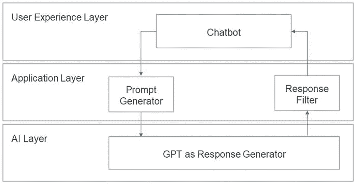

**图 4.1:** 基本对话

# 用户体验层

这一层主要关注用户如何与解决方案进行交互。它采用标准的聊天机器人用户界面，可以是一个简单的文本框，也可以是一个具有语音和头像功能的更高级用户界面。这一层负责捕捉用户输入（话语）并以用户友好的方式呈现来自 AI 层的响应。

# 应用层

这一层连接了用户体验和 AI 层。它执行将原始用户输入转化为适合 GPT 模型的格式（提示生成）以及根据企业规则和要求过滤生成的响应的关键功能。

+   提示生成器：该组件将用户的话语转化为适合 GPT 模型的提示。首先，它选择与用户输入匹配的预定义提示模板²，然后用输入的细节实例化模板。示例如下：

+   服务代理输入：“一个重要客户不断提出不合理的投诉。今天我们收到了另一份这样的投诉。我们可以拒绝吗，还是因为客户的重要性而需要接受？”

+   GPT 模型的提示：

+   “专家角色：您是一家重视客户满意度和公平政策的公司的客户关系专家。

+   背景：一名服务代理提供了以下信息：“一个重要客户不断提出不合理的投诉。今天我们收到了另一份这样的投诉。我们可以拒绝吗，还是因为客户的重要性而需要接受？”

+   任务规范：

1.  总结投诉中与决策相关的方面。

1.  根据公司标准和过往互动，确定投诉是否合理或不合理。

1.  权衡这个客户的重要性和接受或拒绝投诉的公平性。

+   执行规则：

1.  确保所有决定都符合公司指南和道德标准。

1.  优先考虑与客户的长期关系，同时维护公司的诚信和声誉。

1.  考虑客户过去投诉中的任何模式。

+   输出约束：

1.  在不超过 150 个字的简洁回复中，就是否接受或拒绝投诉做出合理的决定。”

+   响应过滤：每个生成的响应都会经过一系列标准的检查，如适当性、相关性、完整性和连贯性。如果响应通过了这些检查，它将通过用户体验层发送回用户。否则，将显示默认消息。

# AI 层

这种模式的核心是 AI 层，它利用 GPT 模型作为响应生成器。该层接受应用层处理的提示，并利用预先训练的 GPT 模型中嵌入的知识生成响应。

# 模式工作流程

1.  用户通过输入问题或命令与聊天机器人界面进行交互。

1.  应用层接收用户输入并根据提示模板库将其转化为适合 GPT 模型的提示。

1.  AI 层，特别是 GPT 模型，根据给定的提示生成响应。

1.  应用层接收响应并应用过滤器检查是否符合定义的标准。

1.  如果响应通过了过滤器，它将通过用户体验层发送回用户。如果未通过过滤器，将向用户显示默认消息。

# 企业集成

基本对话模式既不与企业应用程序交互，也不利用内部知识库。此外，虽然系统确实考虑了对话历史作为上下文，但它主要依赖用户提供的信息。因此，系统的响应局限于 AI 模型在训练阶段灌输的知识。这样的响应是一般的，缺乏组织特定见解或来自企业应用程序和数据库的实时数据的丰富化，这对许多应用程序构成了相当大的限制。

# 输出质量

这种模式为简单和通用的查询提供了不错的输出质量，这主要归功于先进的 GPT 模型的强大。此外，基本的质量检查也在响应过滤器中实施，有助于保持生成的响应的适当性、相关性和准确性。

# 性能

由于其简约的设计，这种模式在计算性能方面脱颖而出。每次输入用户和 GPT 模型之间只有一次交互，确保快速响应和较低的计算负载。这种简化的方法使系统能够高效处理更大量的用户查询，从而提高了可扩展性。

# 使用案例

考虑到这种模式的基本性质，它适用于简单的问答任务，不需要上下文理解或访问专用知识库。它可以用于简单的常见问题解答机器人、提示-响应系统或基本用户参与活动等场景。它不适用于需要复杂的对话管理、上下文感知响应或访问动态和最新知识库的任务。

# A2 接地对话

这种架构模式通过将 GPT 模型的灵活性与组织现有系统的领域特定知识和数据相结合，增强了基本聊天机器人的能力（见*图 4.2*）。

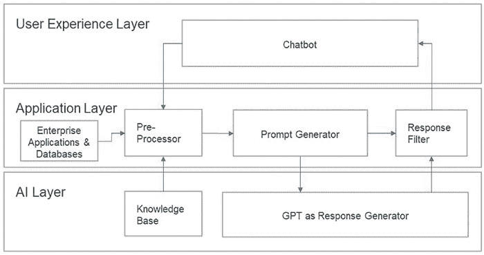

**图 4.2：** 接地对话

# 用户体验层

这一层与 A1 模式相同。

# 应用层

这一层充当用户体验和 AI 层之间的桥梁。它包含以下组件：

+   **企业应用程序和数据库**：这些是企业特定数据的来源，可以通过 API 调用访问。

+   **预处理器**：该组件从企业应用程序和数据库中检索相关数据，并查询知识库，丰富用户的输入。任何必要的质量检查和转换成文本格式也在这里执行。

+   **提示生成器**：该组件从预处理器获取丰富的用户输入，并将其转换为 GPT 模型可以理解和处理的提示格式。

+   **响应过滤器**：该组件评估 GPT 模型的响应是否符合特定标准，如相关性、适当性、完整性和连贯性，就像基本模式一样。如果响应未通过这些检查，将向用户返回默认消息。

# AI 层

这一层对基于 AI 的交互至关重要。它包括两个基本组件：GPT 模型和内部知识库。

+   **知识库**：位于 AI 层内部，与 GPT 模型并列，是领域特定知识的储备库。这个知识库通常以文档数据库³、图数据库⁴或向量数据库⁵的形式存在，提供了一个行业和/或组织特定细节的附加层。

+   **GPT 模型**：它通过利用应用层提供的丰富提示生成连贯且上下文相关的响应。值得注意的是，该模型将其预训练知识应用于用户、企业数据源和知识库的综合输入。

# [模式工作流]

1.  用户与聊天机器人界面进行交互，提供输入或提出问题。

1.  应用程序层的预处理器根据原始用户输入从企业应用程序和数据库中获取任何必要的数据。

1.  然后，预处理器通过知识库搜索与用户输入相关的相关信息。它可以使用传统基于关键词的搜索来直接匹配，或者在基础向量数据库的情况下，依赖于搜索查询和候选文档的向量编码的相似性进行语义搜索，以进行更广泛的、上下文感知的匹配。

1.  预处理器通过数据清洗、规范化、删除个人可识别信息（PII）和将长文本分成可管理的块等任务进一步完善了补充输入，以符合底层 GPT 模型的输入大小限制。

1.  Prompt 生成器将丰富的输入转换为适合 GPT 模型的提示。

1.  AI 层或 GPT 模型根据提示生成回应。

1.  响应过滤器根据预定义的标准检查此响应。

1.  如果响应通过过滤器，则通过用户体验层将其传递回用户。如果失败，将向用户提供默认消息。

# [模式工作流示例]

想象一下，您最近在客厅安装了一个智能灯泡，但它没有开启。寻求快速帮助，您联系制造商的技术支持聊天机器人。

您的交互是：“我的客厅的智能灯泡无法开启。”

以下是模式工作流可能进行的方式，示例中的步骤编号对应于一般工作流程中的步骤：

1.  用户交互：您已经告诉聊天机器人您的智能灯泡问题。

1.  获取必要的数据：立即，预处理器咨询制造商的数据库，确定您拥有的灯泡的确切型号和版本，以及安装日期和任何相关设备。

1.  搜索知识库：使用有关您特定灯泡型号的详细信息，预处理器搜索知识库——数字故障排除手册——寻找针对您灯泡型号量身定制的相关指导。

1.  精炼输入：预处理器确保指令按照易于遵循的顺序排列，剥离任何技术术语，使其用户友好。

1.  提示创建：这是聊天机器人为其主要大脑准备问题或上下文的地方。结合故障排除步骤，提示可能看起来像这样：“鉴于‘ABC 型号’灯泡无法开启，并基于建议检查灯泡的电源来源、验证其与开关的兼容性，并确保应用程序设置正确，您将如何以清晰和富有同情心的方式指导用户完成这些步骤？”

1.  响应生成：有了这个详细的提示，聊天机器人的大脑（GPT 模型）生成了一个连贯而有用的回答，引导您完成这些步骤。

1.  检查响应：响应过滤器评估聊天机器人的答案，确保清晰并击中所有重要的故障排除点。

1.  提供答案：经过验证后，聊天机器人回答：“很抱歉听到您的灯泡出了问题。让我们尝试这些步骤适用于您的‘ABC 型号’：

1.  首先确保灯泡牢固地拧入插座并接收电源。

1.  检查您使用的开关或插座是否与智能设备兼容。

1.  打开相关应用程序，并确保灯泡的设置正确配置。如果在这些步骤之后仍然遇到问题，请与我们的技术团队联系。

# [企业集成]

基于 API 调用的强大企业数据集成是基础对话模式的特点。它还访问知识库，以增强输入的相关领域特定知识。这种级别的集成允许系统利用组织现有 IT 基础设施的资源和功能，通过丰富聊天机器人的响应以组织知识和上下文感知。

# 输出质量

该模式通过将企业知识和数据与提示相结合，增强了输出质量。通过整合企业应用程序、数据库和知识库来补充用户输入，GPT 模型的上下文感知能力和生成更加细致和定制的响应的能力都得到了提高。

为了进一步提高提示的质量，架构采用了诸如数据清洗和规范化等预处理步骤。这些步骤消除了用户输入中的潜在不准确性和不一致性，并标准化数据，确保其以适合 GPT 模型处理的格式呈现。

该模式还包括一个输出过滤过程，原则上类似于基础对话模式（A1）中的过滤过程。然而，由于丰富的提示导致初始响应质量更高，输出过滤器现在可以专注于更具体的质量检查。

# 性能

与基础对话模式（A1）相比，基础对话模式展示了更多的计算复杂性和较低的效率，这是由于包含了额外的预处理步骤和集成。

# 使用案例

该模式适用于需要利用内部领域特定知识以及来自企业应用程序和数据库的数据的更加细致的响应的情景。它适用于希望提供动态、上下文感知响应的企业，比如特定产品或服务的客户支持、内部员工帮助，甚至个性化用户交互。

# A3 混合主动对话

该模式提供了一个具有交互能力的基于 GPT 的聊天机器人的高级配置。它通过系统发起的问题或指令来增强典型的用户驱动交互，以收集信息或协同执行流程（见*图 4.3*）。

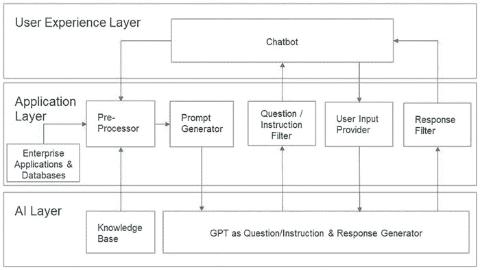

**图 4.3：** 混合主动对话

# 用户体验层

这一层现在支持使用聊天机器人用户界面进行混合主动对话。

# 应用层

除了之前模式的组件外，这里还引入了两个新组件：

+   **问题/指令过滤器**：这个新组件过滤了 GPT 模型生成的问题或指令，只有符合特定标准的才会传递给用户。

+   **用户输入提供者**：该组件捕获用户对 GPT 生成的问题或指令的响应，并将其反馈到 GPT 模型中。

# AI 层

这一层与基础对话模式（A2）中的情景保持一致，托管着一个 GPT 模型和一个知识库。

# 模式工作流程

1.  用户与聊天机器人界面进行交互，提供输入或提问。

1.  应用层中的预处理器咨询企业数据源和知识库，丰富用户的输入并执行任何其他所需的数据准备任务。

1.  增强的输入被转换为适合 GPT 模型的提示。

1.  GPT 模型可以根据提示为用户生成问题/指令或响应。

1.  GPT 生成的问题/指令经过过滤，如果符合标准，则传递给用户。

1.  用户提供相应的反馈，由用户输入提供者捕获并传递给 GPT 模型。

1.  最后，GPT 模型生成一个响应，然后由响应过滤器进行评估。

1.  如果回复通过了过滤器，它将被传递回用户。如果未通过，将显示默认消息。

# 企业集成

这种模式提供了与基础对话模式（A2）相同水平的企业集成。

# 输出质量

由于 GPT 模型提出的问题导致提示更具上下文，因此与 A2 相比，输出质量更高。

# 性能

每次对话轮的性能与 A2 相同，但由于 GPT 模型提出的额外问题，对话本身更加延长。

# 使用案例

这种架构类型非常适合需要动态、上下文感知的回复和用户输入的复杂互动场景。可能的应用包括高级客户服务、互动用户参与、引导式故障排除和个性化推荐。

# A4 质量控制对话

这种模式概述了一种复杂的聊天机器人架构，通过使用两个 GPT 模型来提高对话质量：一个作为主要的响应生成器，另一个作为评论家。这种配置提供了一个迭代的反馈机制，用于质量控制，以根据 GPT 评论家提供的反馈改进聊天机器人的回复（见*图 4.4*）。

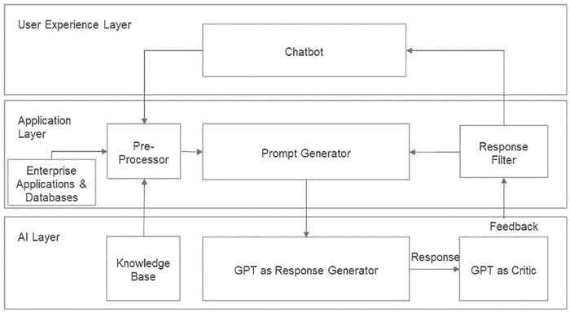

**图 4.4：** 质量控制对话

# 用户体验层

用户体验层与基础对话模式（A1）保持一致。

# 应用层

这一层包含与**基础对话**模式（A2）相同类型的组件，但在功能上有一些不同：

+   **提示生成器**：该组件还会根据 GPT 评论家的反馈生成纠正提示。这种功能使得有一个反馈循环，可以逐步改进回复的质量。

+   **响应过滤器**：与**基础对话**模式相比，由于 GPT 评论家提供的详细反馈，过滤标准现在更具体，使得对回复的评估更具上下文敏感和严格。

# 人工智能层

这一层包含两个 GPT 模型：一个作为主要的响应生成器，另一个作为评论家，还有一个知识库。

+   **响应生成器**：这个 GPT 模型根据提示生成回复，利用其预训练知识以及从内部知识库和企业数据源获取的输入。

+   **GPT 评论家**：这个 GPT 模型会对生成的回复进行质量评估。它会评估提示和回复，并就回复的质量提供反馈。为了确保高水准的回复，GPT 评论家会根据更详细的一套标准对每个生成的回复进行检查，包括恰当性、相关性、事实准确性、正确推理和潜在幻觉。评论的性质可能会根据具体的设置而有所不同。如果响应生成器使用的是相同的模型和上下文，那么 GPT 评论家也使用相同的模型和上下文，这可能会导致一种自我批评。在这种情况下，模型本质上会评估自己的输出。然而，如果评论过程中使用了不同的模型或上下文，这将引入一个新的独立审查层次，从而产生一个独立的评论。这有助于提供额外的检查和平衡，以确保生成的回复的质量。过去迭代的回复和反馈也可以包含在未来的提示中，以便响应生成器从过去的错误中学习。

# 模式工作流程

1.  用户与聊天机器人界面进行交互，提供输入或提问。

1.  预处理器使用内部知识库和企业数据源丰富用户输入，并执行必要的数据准备任务。

1.  增强输入被转换成适合 GPT 模型的提示。

1.  GPT 响应生成器根据提示生成响应。

1.  提示和响应被输入到 GPT 评论者中，评论者对响应的质量提供反馈。

1.  检查质量反馈。如果所有标准都得到满足，原始响应被传递回用户。如果没有，会向提示生成器发送更正提示的请求。

1.  更正提示被反馈到 GPT 响应生成器，新的迭代开始。

1.  在评论者提供反馈后，该过程终止，该反馈通过响应过滤器，或者在预定义数量的迭代完成失败后终止。

# 企业集成

这种模式提供了与基础模式（A2）相同水平的企业集成。

# 输出质量

通过企业数据和知识对提示进行基础和丰富是从以前的模式中保留下来的特性，这确保了响应的生成基于企业特定的上下文。

与这种模式独有的是，GPT 评论者审查来自 GPT 响应生成器的响应。它评估提示和生成的响应，提供的反馈被响应过滤器用来改善响应的质量，形成迭代的反馈循环。这个过程有助于确保响应的相关性、连贯性和整体质量，因为它们不断被改进，直到满足预定义的质量标准。

# 性能

与以前的模式相比，质量受控对话模式引入了计算复杂性的显着增加，因为增加了作为评论者的第二个 GPT 模型。这个 GPT 评论者审查了第一个 GPT 模型生成的每个响应，增加了新的计算负载。此外，迭代的反馈循环机制，根据评论者的反馈改善响应的质量，还通过响应生成器增加了额外的处理时间。

# 使用案例

这种模式非常适合需要高质量、上下文感知的响应的场景。反馈循环机制确保响应在满足定义的质量标准之前不断改进。这在客户支持系统、医疗咨询助手、金融咨询服务或任何其他响应质量至关重要的领域中特别有用。

# 与外部工具集成的对话模式

在本节中，我们深入探讨了两种用于 GPT 驱动的聊天机器人的更高级的架构模式。这些模式利用了 OpenAI 的 GPT 模型的强大功能，同时集成了外部工具和引导聊天机器人推理过程的高级方法。

+   **基本工具集成对话（B1）：**在介绍章节的相应部分的延续中（*GPT 模型中的外部工具访问*），第一个模式概述了一个架构，其中一个对话解决方案通过 API 调用与企业应用程序进行交互。这些交互嵌入到整个对话中，并根据用户输入动态触发，从文本生成扩展到执行企业任务，扩展了解决方案的能力。

+   **使用工具引导的思维链对话（B2）：** 第二种模式介绍了一种结构，将思维链（CoT）演示与特定工具的 API 调用集成在一起。这种配置确保了工具操作在解决方案推理过程中的流畅整合，使其能够暂停，使用外部工具执行操作，并根据结果继续对话。这种高级交互模型特别有益于需要在对话过程中进行推理的更复杂任务。

+   **高级工具集成对话（B3）：** 比基本工具集成对话（B1）更进一步，第三种模式将 GPT 模型部署为上下文规划器和响应生成器。虽然 B1 侧重于用户输入触发的与外部工具的直接交互，B3 引入了一个规划层，确定了一系列逻辑操作的顺序。结果是更丰富和更适应性的对话体验，超越了简单的任务执行，转向战略任务编排。

接下来的章节将详细讨论这些模式，讨论它们的各个组成部分、工作流程和潜在用例。

# B1 基本工具集成对话

这种模式概述了一种架构，其中一个启用了 GPT 的聊天机器人参与用户交互，这些交互需要通过 API 执行企业应用程序、数据库和知识库提供的特定功能。这使得聊天机器人能够扩展其能力，不仅仅是生成类似人类的文本，还能够在对话过程中执行外部任务（见*图 4.5*）。

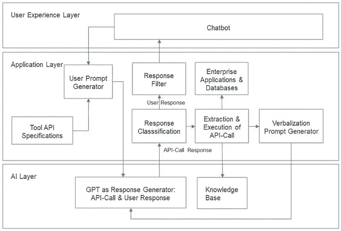

**图 4.5：** 基本工具集成对话

# 用户体验层

这一层与**Grounded Conversation**模式（A2）保持不变，为用户交互提供标准的聊天机器人用户界面。

# 应用层

作为用户体验和 AI 层之间的桥梁，这一层包含几个组件：工具 API 规范、企业应用程序和数据库、用户提示生成器、响应过滤器、响应分类、API 调用的提取和执行，以及语音提示生成器。

+   **工具 API 规范**：这个组件保存了对话应用程序可以与之交互的各种工具的 API 规范。规范通常包括这四个元素。

+   **API 名称**：API 名称提供了 API 的摘要。它帮助 GPT 模型将用户指令与此 API 链接，并作为提取和执行组件的入口。名称应该用自然语言清晰而精确，避免与其他 API 名称产生歧义，比如*check_order_status*用于检查后端系统中订单的状态。

+   **参数列表**：API 的参数列表包括输入参数和返回值，每个参数都有参数名称、参数描述、数据类型和默认值。这些信息帮助使用的 GPT 模型正确填充相应位置的参数，并使用适当的格式。对于*check_order_status*示例，参数可能如下：

+   输入参数：

+   **order_id***:* 整数，系统中订单的唯一标识符。这用于查找特定订单并检索其当前状态。

+   返回值：

+   **order_status***:* 字符串，表示订单的当前状态。常见的值可以包括 Pending、Processing、Shipped、Delivered、Canceled 等。

+   **expected_delivery_date***:* 日期（可选），已发货状态的订单的预计交付日期。

+   **reason***:* 字符串（可选），如果订单被取消，这将提供取消的原因。

+   **API 描述**：与 API 名称相比，API 描述包含了更多关于 API 的信息，包括它的功能、工作原理、输入和输出，以及可能引发的任何潜在错误或异常。*check_order_status*的相应示例可能是：*此函数允许检索与特定订单相关的当前状态，通过使用订单的唯一 ID 实现。查询时，系统将回复订单的状态，并可能提供额外的细节，如预计交付日期或订单取消的原因。*

+   使用示例（可选）：为复杂的 API 提供使用示例可以帮助演示 API 的使用方式，而对于简单的 API 可能并不是必要的。对于订单状态检查，一个示例可能是这样的：*用户可以使用 ID“12345678”请求订单的状态。响应可能会告知他们订单已经“发货”，并提供相应的预计交付日期。*

+   **企业应用和数据库**：这些通过 API 调用提供外部工具，可以包括任何功能性后端系统，如人力资源、财务或采购，还可以包括搜索引擎或专门的 ML 模型。

+   **用户提示生成器**：这个组件将用户的输入转换成适合 GPT 模型的提示。

+   **响应分类**：这个组件将 GPT 生成的响应分为两种类型：

+   对用户请求的最终响应或

+   中间响应包含一个功能调用。

如果响应包含一个`**function_call**`字段，则会识别出一个功能调用。

+   **API 调用的提取和执行**：当识别到一个功能调用响应时，这个组件从功能调用字段中提取必要的细节，根据工具 API 规范选择适当的工具，并使用所选的工具执行 API 调用。工具可以是企业应用、数据库或知识库中的任何功能。

+   **语言化提示生成器**：这个组件利用现有的上下文（用户提示和功能调用响应）并添加一个功能提示，其中包含了前一个功能调用的结果转换成文本格式。然后，一个 GPT 模型将这些结果转换成自然语言的用户响应。

+   **响应过滤器**：这个组件检查用户的最终 GPT 响应，以确保其适当性、相关性、完整性和连贯性。

# AI 层

这一层承载了 GPT 模型，这些模型已经在包括特定版本的 GPT-3.5 Turbo 和 GPT-4 在内的对话数据上进行了训练。这些模型可以根据它们收到的提示生成用户响应或功能调用响应。

它还包括一个具有与之前模式相同功能的知识库。

# 模式工作流程

1.  用户与聊天机器人界面进行交互，提供输入或提出问题。

1.  用户的输入被转换成 GPT 模型的初始提示，其中还包括工具 API 规范。

1.  然后将响应分类为用户响应或功能调用响应。

1.  如果是用户响应，它将被转发到响应过滤器，那里会对其进行相关性、准确性和适当性的审查，并将其转发给用户（检查结果为正面）或替换为默认消息（检查结果为负面）。

1.  如果它是一个以定义 API 调用格式的功能调用响应，‘API 调用的提取和执行’组件将执行 API 调用到指定的企业应用、数据库或知识库。

1.  API 调用的结果被用于语言化提示生成器生成一个 GPT 模型的功能提示。

1.  一个 GPT 模型会生成一个用户响应，将 API 调用的结果转换成自然语言。

1.  这个过程会随着每个新的用户提示而重复，直到对话结束。

# 模式工作流程示例

让我们通过一个示例来使用这个模式。在这里，我们将使用用户联系在线书店的聊天机器人询问其订单状态的场景：

您的互动是：“您能告诉我订单编号为 98765432 的订单状态吗？”

以下是聊天机器人模式工作流程的辅助，示例中的步骤编号对应于一般工作流程中的步骤：

1.  用户互动：您通过提供订单编号向聊天机器人询问订单状态。

1.  初始提示创建：提示生成器将您的问题转换为适合 GPT 模型的提示：“用户想要根据工具 API 规范检查订单状态来了解订单编号为 98765432 的订单状态。”

1.  响应分类：GPT 模型解释提示并确定这需要调用书店系统的函数，特别是 check_order_status 函数。

1.  用户或函数调用决策：由于响应表明需要进行函数调用，系统跳过用户响应生成并继续下一步。

1.  API 执行：使用提供的细节，系统从书店系统获取信息。它使用订单编号 98765432 的 check_order_status API 来获取订单的当前状态和其他细节。

1.  口头提示创建：使用书店系统的结果，为 GPT 模型生成一个函数提示，其中包含订单的当前状态和其他细节。

1.  生成用户响应：然后，GPT 模型根据这个提示创建一个连贯的响应，可能是：“您的订单编号为 98765432 的订单已经发货！您可以预计在 2023 年 8 月 28 日之前收到。”

1.  对话继续或结束：聊天机器人将这条消息传递给您。如果您有更多问题，对话将继续，如果您的询问得到满足，对话将结束。

# 企业集成

工具集成对话模式具有显著的企业集成水平。该架构与通过 API 可访问特定功能的企业应用程序和数据库紧密相关。这种设计促进了几乎实时的集成，使聊天机器人能够执行任务、获取数据并根据这些操作生成响应。此外，这种模式还可以通过 API 潜在地访问知识库，扩展了聊天机器人在对话过程中可以获取数据的范围。

# 输出质量

这种模式通过动态地使用后端系统的任务输出来显著提高了输出质量。决定何时调用后端系统是由 GPT 模型根据用户输入而不是像**Grounded pattern**（A2）中的预处理器来进行的。这些任务的结果为 GPT 模型提供了详细和准确的上下文，当它实际用作响应生成器时。

# 性能

这种模式引入了更多的计算复杂性和延迟，因为涉及与企业应用程序和数据库通过 API 进行交互、对响应进行分类和生成口头提示的额外步骤。

# 用例

这种模式在需要根据用户输入与企业应用程序和数据库进行多次交互的流程导向场景中表现出色。它也非常适合需要与企业应用程序和数据库交互以获取或更新用户数据的客户服务机器人。

# B2 链式思维引导对话使用工具

该模式代表了基于 GPT 的聊天机器人的架构，结合了思维链（CoT）演示和通过 API 调用与企业应用程序和数据库的特定功能进行交互。CoT 演示有助于设计更有效的提示，展示逻辑推理链给 GPT 模型，增强其在一系列交互中保持一致的逻辑响应或动作的能力（见*图 4.6*）。

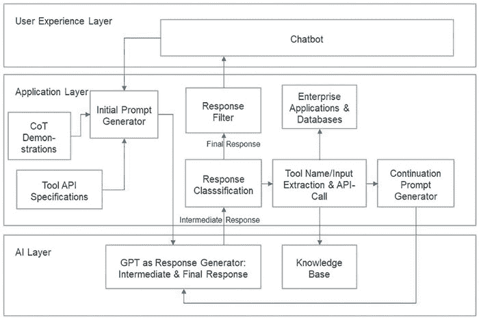

**图 4.6:** 使用工具进行思维链引导的对话

# 用户体验层

这一层与**基础对话**模式（A2）中的一样，为用户交互提供了标准的聊天机器人用户界面。

# 应用层

应用层在调解聊天机器人的推理过程和其与企业应用程序和数据库的交互中发挥了关键作用。它包括几个组件：CoT 演示、企业应用程序和数据库、工具 API 规范、初始提示生成器、响应过滤器、响应分类、函数名称/输入提取和 API 调用以及继续提示生成器。

+   **思维链（CoT）演示**：这些是用于增强用户输入的聊天机器人所需思维过程的演示。

+   **企业应用程序和数据库**：这些应用程序和数据库包含了聊天机器人通过 API 调用与之交互的特定工具功能。

+   **工具 API 规范**：该组件保存了企业应用程序和数据库中各种工具的规范，聊天机器人可以与之交互。

+   **初始提示生成器**：该组件将用户的输入与企业应用程序和数据库中的相关工具 API 规范以及匹配的 CoT 演示相结合，转换为 GPT 模型的初始提示，指示在生成工具触发时停止。

+   **响应过滤器**：该组件检查 GPT 模型生成的响应是否符合定义的标准。

+   **响应分类**：该组件将 GPT 生成的响应分类为用户响应或工具调用。

+   **工具名称/输入提取和 API 调用**：当在响应中识别出工具触发时，该组件提取工具名称和输入，执行工具调用，并将结果附加到推理过程中。

+   **继续提示生成器**：该组件通过结合原始提示、中间响应和工具结果生成 GPT 模型的继续提示。

# AI 层

该层承载了知识库和一个负责生成用户提示的中间和最终响应的 GPT 模型。

# 模式工作流程

1.  用户与聊天机器人界面进行交互，提供输入或发出请求。

1.  用户的输入被增强，包括来自企业应用程序和数据库的相关工具 API 规范以及匹配的 CoT 演示。

1.  增强输入被转换为 GPT 模型的初始提示，指示在生成工具触发时停止。

1.  GPT 模型生成中间响应，然后被分类为用户响应或函数调用。

1.  如果响应包含工具触发，将提取工具名称和输入，并在指定的应用程序、数据库或知识库上执行相应的函数调用。

1.  函数调用的结果被附加到推理过程中。

1.  再次调用 GPT，使用继续提示（原始提示+中间响应+工具结果）来继续对话。

1.  步骤 4-7 重复，直到推理过程中的所有使用工具的步骤都已完成。

1.  生成最终响应，由响应过滤器检查，并传递给用户。

# 企业集成

该模式的企业集成等同于**集成工具对话**模式（B1）中的企业集成。

# 输出质量

这种模式的输出质量也与之前的模式相当。

# 性能

由于每次需要执行函数调用时都会重复进行继续提示，因此该模式的性能不如工具集成对话模式。

# 用例

这种模式特别适用于需要逐步推理过程和与外部工具集成的复杂用例。它可以用来创建复杂的聊天机器人，不仅可以回答查询，还可以执行多步任务，解决复杂问题，或者在与外部工具或服务交互时引导用户完成流程。示例包括 IT 支持聊天机器人，复杂软件应用程序的虚拟助手，或培训系统。

# B3 高级工具集成对话

这种进化的架构模式利用了 GPT 模型的两种能力：作为规划者和响应生成器。作为规划者，它将用户输入转换为任务序列，这些任务以协调的方式执行，作为响应生成器，它使用每个任务的输出生成具有上下文的用户响应（参见*图 4.7*）。

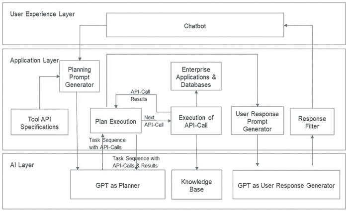

**图 4.7：** 高级工具集成对话

# 用户体验层

与 B1 模式相比，这保持不变，提供一致的用户-聊天机器人交互界面。

# 应用层

该层使用 B1 模式中的以下组件：

+   工具 API 规范，现在还可以包括有关如何组合多个 API 以完成复杂用户请求的组合说明。

+   API 调用的提取和执行

+   企业应用程序和数据库

+   响应过滤器

此外，它引入了几个与规划相关的组件：

+   **规划提示生成器**：该组件将用户的输入转换为提示，要求 GPT 模型生成计划或任务序列。

+   **计划执行**：一旦 GPT 模型生成了计划，该组件系统地提取并执行序列中的每个任务。

+   **用户响应提示生成器**：它取代了语言提示生成器。该组件将结果编译成新的提示，供 GPT 模型生成全面且易于理解的响应，所有计划中的任务执行完毕后。

# AI 层

该层包括与以前一样的知识库和 GPT 模型扮演两种不同角色：

+   **规划者**：给定一个规划提示，GPT 模型会概述一系列逻辑任务及其相应的 API 调用，以满足用户的请求。

+   **用户响应生成器**：在计划中的所有任务执行完毕并编译结果后，GPT 模型将编译结果并将其制作成用户易于理解的全面响应。

# 模式工作流程

1.  用户与聊天机器人界面进行交互。

1.  规划提示生成器将用户的请求转换为 GPT 模型的规划提示，其中还包括工具 API 规范。

1.  GPT 在其规划者角色中解释规划提示，并为每个任务生成一系列具有 API 调用的任务序列。第一个任务具有完全指定的 API 调用，而后续任务在各自的 API 调用中有占位符。

1.  计划执行组件提取第一个任务的 API 调用并将其发送到 API 调用执行组件，该组件处理并返回 API 调用结果。

1.  计划执行组件更新任务序列中第一个任务的结果，并将其重新提交给 GPT 作为规划者。

1.  GPT 模型保留计划中已执行的任务，并立即重新生成紧随上一个已执行任务的任务序列。

1.  计划执行组件移动到序列中的下一个任务，并将其发送到 API 执行模块，从中再次获取结果。

1.  之后，它更新计划并将其重新提交给 GPT 模型。这个循环会一直持续，直到计划中的所有任务都被执行。

1.  在所有任务完成后，计划执行组件将所有中间和最终结果转发给用户响应提示生成器。

1.  用户响应提示生成器为 GPT 模型制定了一个提示。

1.  GPT 在其响应生成器角色下产生了详细且用户友好的响应。

1.  响应过滤器审核这个最终响应，确保其质量和相关性。

1.  用户收到经过过滤的响应，并在需要时继续交互。

# [模式工作流示例]

让我们想象一下，一个用户想要在当地公园为朋友举办生日派对，并需要一些帮助。

您的互动是：“我想在下周六在中央公园为我的朋友马克举办生日派对。你能帮忙吗？”

这就是这种模式如何发挥作用的方式。由于对计划任务序列的迭代，示例中的步骤编号不同：

1.  用户互动：您向聊天机器人表达了在中央公园为朋友筹划生日派对的意图。

1.  规划提示创建：聊天机器人通过规划提示生成器重新制定您的请求：“为下周六在中央公园举办生日派对生成一个计划。”

1.  GPT 的计划生成：GPT 模型在其规划者角色下解释规划提示，并制定了一个多步任务序列：

+   任务 1：验证下周六中央公园的活动场地是否可用。

+   任务 2：在中央公园预订一个合适的地点。

+   任务 3：列出附近的面包店供制作生日蛋糕。

+   任务 4：推荐本地娱乐或表演者供雇佣。

+   任务 5：提供下周六的天气预报。

1.  计划执行 - 任务 1：系统首先使用活动 API 检查指定日期中央公园的活动场地是否可用。

1.  更新和重新提交：假设公园可用，计划将继续并被重新提交给 GPT 进行下一个序列。

1.  计划执行 - 任务 2：系统然后使用预订 API 预订一个适合生日聚会的中央公园地点。

1.  计划执行 - 任务 3：聊天机器人访问本地目录 API，列出附近几家评价较高的面包店，以便可能的蛋糕订购。

1.  计划执行 - 任务 4：系统利用另一个本地服务 API，提供一些可供雇佣的魔术师、音乐家或派对表演者等娱乐选项。

1.  计划执行 - 任务 5：系统使用天气 API 提供下周六的天气预报，以确保准备工作考虑到可能的雨天或晴天。

1.  编制结果：所有中间结果，即公园的可用性、预订确认、面包店列表、娱乐建议和天气预报，都被整合起来。

1.  用户响应提示创建：生成一个提示，整合所有数据：“将中央公园的可用性、预订、面包店列表、娱乐选项和天气预报的发现转化为连贯的用户响应。”

1.  制作用户响应：GPT 在其用户响应生成器的能力下构建消息：“下周六中央公园有空！我已经为马克的生日预订了一个地点。附近有前 3 家面包店：[面包店名称]。作为娱乐，考虑雇佣[表演者名称]。此外，天气预报显示将是晴天。愉快的筹划！”

1.  响应过滤：检查这个详细的响应是否连贯清晰。

1.  最终用户互动：您将得到详细的计划和资源，可以继续进行准备工作，或者继续交互以获取更具体的细节。

# 企业集成

高级工具集成对话模式展示了更深层次的企业集成。通过利用 GPT 的规划能力，它可以动态交互地构建利用各种企业应用程序和数据库功能的任务序列。这种设计允许自适应交互，确保任务序列和响应根据不断变化的用户输入不断优化。

# 输出质量

这种模式的输出质量明显更高，因为动态规划和迭代执行任务的添加。GPT 模型不仅仅依赖于初始上下文，还可以根据先前任务的结果和用户的响应调整其方法。这种迭代和自适应过程确保对话保持更相关，并且不断优化以最好地满足用户的需求。

# 性能

虽然这种模式在输出质量和企业集成方面带来了显著的好处，但也引入了更多的计算开销。迭代规划、执行和重新规划过程会增加整体响应时间的延迟。

# 用例

鉴于 B3 模式的增强功能，其用例扩展到更复杂和动态的场景：

+   **流程自动化机器人：** 适用于引导用户完成复杂的、多步骤的流程，如入职、故障排除或服务配置。随着每个步骤的完成，机器人可以根据结果调整其引导。

+   **动态查询系统：** 适用于用户请求需要按特定顺序从多个来源获取和处理数据的情况，例如生成跨多个企业应用程序的详细报告。

+   **高级客户服务机器人：** 除了简单的数据检索，这些机器人可以执行更新多个记录、启动流程，然后在单个用户交互中报告结果的任务序列。

+   **交互式教程和引导学习：** 机器人可以根据用户的响应、测试结果或其他标准调整学习路径，确保定制化的学习体验。

+   **集成业务智能工具：** 适用于需要从不同企业工具中获取数据、进行分析和可视化任务序列以生成见解的业务用户。

# C 使用经过微调的模型的对话模式

本节介绍了两种利用 GPT 与经过微调模型潜力的高级模式，用于端到端的对话解决方案。

+   **使用经过微调的模型的对话 (C1):** 这种模式利用 GPT 模型生成训练数据，用于微调商业或开源语言模型。对话解决方案随后利用这个经过微调的模型为用户制定响应，辅以企业知识和数据。

+   **使用两个模型的对话 (C2):** 这种模式同时利用经过微调的模型和预训练的 GPT 模型进行操作。经过微调的模型的输出用于增强具有特定上下文数据的用户输入。这为 GPT 模型提供了更高质量的输入，从而产生更精确和与上下文相关的响应。

包括它们的结构、工作流程和潜在用例在内的这些架构模式的详细描述将在下文中介绍。

# C1 使用经过微调的模型的对话

这种模式概述了一个以 GPT 为驱动的对话解决方案的架构，它利用数据库和 GPT 创建训练数据。这些数据用于微调现有的语言模型，随后处理用户交互（参见*图 4.8*）。

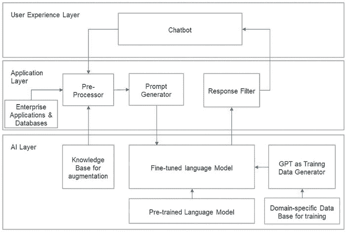

**图 4.8:** 使用经过微调的模型的对话

# 用户体验层

这一层相当于**基础对话**模式（A2）。

# 应用层

这一层还包括 A2 模式中的相同组件。

# AI 层

AI 层包括几个关键组件：

+   增强知识库：在运行时用于补充 AI 的知识。

+   预训练语言模型：这是一个通用模型，经过大量数据的训练，可以理解语言，但不专门针对任何特定任务。

+   精细调整的语言模型：利用预训练模型奠定的基础，这个版本在特定数据集上进一步训练或精细调整。这可以用于针对性的任务，比如遵循指示或促进对话，提高其在这些任务中的准确性和相关性。

+   GPT 模型作为训练数据生成器：它利用 GPT 模型的能力生成训练数据，模拟各种场景或对话。用户应注意一个关键的许可规定：从 OpenAI 的服务中得到的输出不得用于与 OpenAI 竞争的模型的创建。值得注意的是，许可条款是动态的，可能会定期更改。有关最新信息，请始终参考 OpenAI 的官方文档或服务条款。

+   用于训练数据生成的数据库：一个精心策划的来源，GPT 模型从中提取和处理信息以生成训练数据。

在考虑精细调整解决方案时，企业今天可以选择利用 OpenAI 提供的商业模型或一些值得注意的开源模型：

+   OpenAI 的商业模型：

+   GPT-3.5 Turbo：OpenAI 提供了 GPT-3.5 Turbo 的精细调整能力。早期评估表明，GPT-3.5 Turbo 的精细调整版本在特定狭窄任务中可以达到与基础 GPT-4 模型相媲美的性能水平。强调安全性，精细调整的训练数据受到 OpenAI 的 Moderation API 的约束，该 API 基于 GPT-4。

+   GPT Base、babbage-002 和 davinci-002：这些模型是 OpenAI 的最新添加，具有 16K 的上下文窗口大小，可用于标准和精细调整应用。

+   开源模型（预训练 1 万亿标记）：

+   MosaicML 的 MPT-30B：一个拥有 300 亿参数的开源模型。它超越了 MPT-7B 和 GPT-3 的能力，具有 8000 个标记的上下文窗口大小。该模型有两个不同的版本：MPT-30B-Instruct，专门用于指令精细调整，以及 MPT-30B-Chat，专为聊天机器人开发而设计。MosaicML 的平台还提供了定制和部署选项。

+   科技创新研究所的 Falcon LLM：这个总部位于阿布扎比的开源模型配备了 400 亿参数，并提供了 2000 个标记的上下文长度。此外，还提供了 Falcon-40B-Instruct 变体，专门设计用于基于指令的精细调整。

+   OpenLLaMA：作为 Meta AI 的 LLaMA 的开源对应物，它提供了 3B、7B 和 13B 参数配置的模型，每个模型都配有 4000 个标记的上下文窗口。与 Meta 的研究专用 LLaMA 相比，OpenLLaMA 是为商业应用而设计的，并支持精细调整。

+   开源模型（预训练 2 万亿标记）：

+   Meta 的 Llama 2：这是一个更近期的发布，Llama 2 有 7B、13B 和 70B 参数的配置。它有 4000 个标记的上下文长度，是其前身 Llama 1 的两倍容量。Llama-2-chat 变体经过进一步的改进，使用了 10 万个公共指令数据集，并受到了超过一百万人类偏好的影响，以增强交互的安全性和实用性。Llama 2 的许可允许商业利用和精细调整。

在选择预训练模型之后，需要对其进行微调以适应特定的企业任务。我们的方法涵盖了数据策划、预处理、使用 GPT 生成训练数据、模型训练和评估，所有这些都以实际例子进行说明。这种方法确保模型能够有效地适应手头的任务：

1.  数据策划：

+   定义：主要步骤涉及收集和策划特定领域的数据库。所选数据应代表特定任务，并为后续步骤提供坚实基础。

+   例子：

+   收集客户支持票据以创建 IT 支持聊天机器人。

+   积累过程日志以帮助预测过程结果。

+   汇总电子邮件历史以开发通信分类器。

+   收集销售交易数据以开发产品推荐系统。

+   整理员工入职的查询和答案，以识别常见问题和回答。

1.  预处理：

+   定义：处理策划数据，使其准备好进行机器学习任务。这涉及数据清理、转换或其他特定领域的操作。

+   例子：

+   清理支持票据以删除任何个人客户信息。

+   结构化和组织过程日志以跟踪执行阶段。

+   根据主题和内容对电子邮件历史进行分类。

+   规范销售交易数据，例如调和产品描述，以应对季节性或促销高峰。

+   整理员工入职的查询和答案，形成全面的数据库。

1.  使用 GPT 模型生成训练数据：

+   定义：利用 GPT 模型根据预处理信息生成标记或结构化数据。

+   例子：

+   模拟 IT 支持对话：通过将客户支持票据输入到 GPT 模型中，生成整个对话，模拟客户查询如何由 IT 支持台处理。

+   预测过程结果：GPT 模型在提供部分执行过程时，生成潜在结果，可用作训练数据。

+   使用 GPT 进行电子邮件分类：通过向 GPT 模型提供电子邮件历史，模型可以生成分类标签，如“投诉”、“查询”或“反馈”。

+   产品推荐模拟：通过 GPT 处理销售数据，我们可以模拟客户购买模式并得出可能的产品推荐。

+   HR 的问题和答案生成：GPT 可以生成与入职流程相关的问题和答案对，形成一个多样化的数据集。

1.  模型微调：

+   定义：使用生成的数据集来训练或微调特定于手头任务的模型。

+   例子：

+   使用模拟的 IT 支持对话训练聊天机器人模型以处理客户互动。

+   使用 GPT 派生的结果训练模型以预测过程结果。

+   训练分类器以根据 GPT 生成的标签对电子邮件进行分类。

+   使用 GPT 模拟客户购买模式来训练推荐引擎。

+   创建标准的问答聊天机器人，找到类似的问题并显示相应的答案，使用 GPT 生成的问答对。

1.  评估和迭代：

+   定义：评估训练模型的性能，并根据需要重复过程以实现最佳结果。

+   例子：

+   将聊天机器人的回答与专家提供的答案进行比较，评估聊天机器人的效果。

+   将过程结果预测的准确性与实际结果进行比较。

+   通过将其与手动标签进行比较，评估电子邮件分类器的准确性。

+   测试推荐引擎的建议与真实客户反馈进行比较。

+   通过将 HR 聊天机器人的答案与 GPT 生成的数据集进行比较，以确保准确性和相关性。

每个步骤都经过精心设计，以确保所选的预训练模型精确适应特定领域的需求，推动高效和准确的结果。

# 模式工作流程

微调后的工作流程与 A2 模式相同。

# 企业集成

这种模式提供了与 A2 模式中一样的企业集成水平。

# 输出质量

与 A2 模式相比，这种模式显示出更高的输出质量。这种改进来自于在微调过程中应用特定领域知识，使系统能够在特定领域内提供更准确和相关的响应。

与 A2 模式一样，它还通过输出过滤过程丰富用户提示的信息来确保生成的响应的相关性和适当性。

# 性能

这种模式在训练阶段主要会产生相当大的计算负载，其中模型会在特定领域的数据上进行微调。虽然对其进行优化的研究仍在进行中，但生成训练数据和微调预训练语言模型的过程仍然需要大量的计算资源，如处理能力、内存和时间。它可能还需要大量的特定领域数据才能达到所需的性能水平。

一旦模型被微调，操作计算成本与涉及将用户话语转换为提示、生成响应和过滤这些响应的其他模式相似。

然而，微调对话模式的一个重要优势是，它通常会导致一个比通用模型更小的模型。这种减小的尺寸可以降低每次推理（响应生成）的计算成本，提高速度，并且可能允许本地部署，消除了通过云平台访问的需要，因此可能减少响应时间。

# 使用案例

这种模式在特定领域相关知识至关重要的场景中特别有用。这些可能包括：

+   **具有丰富示例的高复杂度领域**：生命科学或工程等领域，标准语言模型可能无法提供所需的深度或准确性的输出。特别是在存在大量复杂和专业示例的情况下，微调变得至关重要。

+   **高风险环境**：精度至关重要的情况，因为不准确可能导致重大后果。例如医学诊断、财务预测或法律咨询，错误的解释或建议可能会产生严重后果。

+   **定制化体验和语调**：需要定制化互动或调整以满足不同用户群体的需求，以及努力在模型输出中反映其独特品牌声音的机构。

+   **快速变化的领域**：知识领域迅速发展，不断进行模型重新训练比依赖外部工具或预处理更有优势。例如技术行业频繁的软件更新或新闻机构报道快速发展的事件。

+   **可操纵性、一致性和输出格式化**：对于需要增强对模型行为的控制的企业，比如保持特定语言输出或确保一致的响应格式。这对于代码补全或组成 API 调用等场景至关重要。

+   **高效的提示利用**：微调可以减少对冗长提示的需求，当原始提示及其响应可以从微调数据集中的快捷方式中预测出来时。

# C2 使用两个模型的对话

这种模式详细介绍了一个使用微调模型与预训练模型协同生成用户响应的 GPT 启用对话解决方案的架构 4]（参见*图 4.9*）。

![

**图 4.9:** 使用两个模型的对话

# 用户体验层

该层利用标准聊天机器人用户界面进行用户交互，可能还增加了语音和头像功能。

# 应用层

应用层包括两个提示生成器、一个响应过滤器以及企业应用和数据库：

+   企业应用和数据库：这些是内部工具和数据源。

+   提示生成器 1：这个组件解释用户的话语，并调用企业应用和数据库的相关 API，将返回的数据整合到微调模型的初始提示中。

+   提示生成器 2：这个组件接受微调模型的输入和输出，如果需要，再次调用企业应用和数据库的必要 API，并为预先训练的 GPT 模型生成最终响应的新提示。

+   响应过滤器：这个组件根据各种标准检查最终响应，以确保它与用户的查询相关且适当。

# AI 层

该层包括一个预先训练的模型、一个微调模型、GPT 作为训练数据生成器、GPT 作为响应生成器以及一个知识库。

微调过程与前一模式中描述的过程相同。

# 模式工作流程

1.  用户交互到初始提示创建：用户向系统传达他们的查询。提示生成器 1 理解这个输入，与后端系统 API 进行联络，吸收必要的数据。这些综合信息形成了一个为微调模型量身定制的初始提示。

1.  微调模型交互：微调模型在其专业领域内进行评估初始提示，并产生简洁而明晰的输出。

1.  预先训练的 GPT 模型的提示：提示生成器 2 将微调模型的输入和输出合并。它可能通过咨询额外的后端 API 进一步增强数据，最终形成一个为预先训练的 GPT 模型设计的全面提示。

1.  生成最终响应：预先训练的 GPT 模型，具有更广泛的理解能力，根据接收到的提示制作全面而有条理的响应。

1.  响应过滤：结果消息经过一定标准的相关性和适当性检查。通过此评估后，将其传递给用户，但未通过检查则显示默认响应。

# 模式工作流程示例

使用这个模式，让我们概述一个示例场景，用户想购买一台笔记本电脑，并根据他们的特定需求寻求最佳选择的建议。

您的交互是：“我正在寻找一台适合图形设计任务的笔记本电脑。我的预算是$1500。你有什么推荐？”

以下是 C2 模式的应用方式，示例中的步骤编号与一般工作流程中的步骤相对应：

1.  用户交互到初始提示创建：在表达您的需求后，提示生成器 1 解释您的查询。它调用后端系统的 API 来获取价格范围内可用的笔记本电脑及其规格。这些信息被整合到一个初始提示中，可能是：“在$1500 内提供适合的笔记本电脑推荐，优先考虑图形设计能力。”

1.  微调模型交互：微调模型专门针对电子产品和用户需求进行培训，可能生成一个简洁的列表：“考虑[Laptop Brand A]，配备[Spec A]，售价$1400，或[Laptop Brand B]，配备[Spec B]，售价$1450。两者都适合图形设计。”

1.  预训练 GPT 模型的提示：Prompt Generator 2 接受来自经过精细调整模型的输入和输出，可能调用额外的后端 API（也许是用户评论或可用性），生成预训练 GPT 模型的提示：“考虑到用户的平面设计需求和 1500 美元的预算，以及推荐的笔记本电脑[Laptop Brand A]，配备[Spec A]，售价 1400 美元和[User Review A]，以及[Laptop Brand B]，配备[Spec B]，售价 1450 美元和[User Review B]，制定一个详细而有说服力的回应。”

1.  生成最终回应：预训练 GPT 模型处理全面的提示，产生一个详细的回复：“根据您的需求和预算，我建议[Laptop Brand A]，配备[Spec A]，非常适合平面设计任务，价格为 1400 美元，远低于您的预算。它得到了用户的高度评价，特别是因为它的[specific feature]。另一个很好的选择是[Laptop Brand B]，售价 1450 美元，提供[Spec B]，也受到平面设计师的积极反馈。两者现在都可以购买。您对哪个感兴趣？”

1.  响应过滤：对这个详细的回应进行审查，以确保它符合适当性和相关性的标准。如果通过，消息将传递给您。如果没有，您可能会看到一个通用的回应，也许是这样的：“抱歉，我无法处理您的请求。请再试一次。”

# 企业集成

在这种模式中，通过将企业应用程序和数据库整合到应用层中，实现了两次企业集成。

应用层中的两个提示生成器旨在直接调用企业应用程序和数据库的相关 API。‘Prompt Generator 1’利用从这些 API 调用返回的数据来为经过精细调整的模型形成初始丰富的提示。同样，‘Prompt Generator 2’可能会从企业应用程序和数据库调用额外的 API，将返回的数据集成到预训练 GPT 模型的新提示中。

# 输出质量

“使用两个模型进行对话”的模式通过利用经过精细调整和预训练模型的独特优势来提高输出质量。它利用了经过精细调整的模型对专业化、上下文感知的响应的能力，以及预训练的 GPT 模型的通用多功能性。这些模型的协同作用促进了适应性和特定上下文的响应生成，可以满足各种对话场景的需求。

就像在**基于事实的对话**模式（A2）中一样，这种架构也包括提示的基础和丰富方面，利用来自企业应用程序和数据库的数据来完善和指导提供给 AI 模型的提示。这种基础过程在这种模式中执行两次，每个模型执行一次，这允许更深入、更复杂地理解用户的意图。

# 性能

“使用两个模型进行对话”的模式的计算需求更高，因为它涉及到每个用户交互的两个独立语言模型。第一个计算负载是模型的精细调整，这是离线完成的，可能会像前一个模式描述的那样在计算上昂贵。

第二个，可能更重要的计算负载是在交互过程中产生的。每个用户提示都要经过两次处理，首先是由经过精细调整的模型处理，然后是由预训练的 GPT 模型处理。这两个步骤都需要 CPU 或 GPU 资源，并需要一定的时间。此外，应用层的处理，比如从企业应用程序和数据库调用 API，可能需要两次，并生成丰富的提示，也会增加计算负载。

# 用例

这种双模型模式在需要专业模型和通用模型共同工作的环境中表现出色。潜在的场景包括：

+   多阶段查询解决方案：在 IT 支持等领域，第一个模型可以根据用户的问题描述快速诊断问题，第二个模型可以提供更用户友好的详细逐步解决方案。

+   数据丰富的产品推荐：在电子商务中，第一个模型可以根据用户偏好识别和列出产品，而第二个模型可以将短列表与用户评论、评级或趋势数据进行交叉参考，以提供更全面的推荐。

+   法律咨询：最初，第一个模型可以根据用户的查询识别相关法律或先例，第二个模型可以用通俗的语言解释它们，确保理解。

+   财务规划：最初，第一个模型可以根据用户的财务状况提供财务概况或策略，第二个模型可以深入研究投资机会、风险和详细预算等具体内容。

+   教育内容创建：第一个模型可以根据课程大纲概述学习模块或教学计划，第二个模型可以开发详细的内容、活动和评估。

# D1 代理模式

在这一部分，我们深入探讨了利用 GPT 集成的专门代理模式，突出它们独特的架构特点和应用功能。重点是自动化、适应性和用户协作：

+   **批量自动化代理（D1）**：该代理首先对数据进行预处理，然后执行两步循环：处理每个增强的数据记录，并通过顺序指令引导 GPT 模型，其中一个指令的结果提供下一个指令的输入，直到序列完全处理。

+   编排代理（D2）：这种模式的核心是编排代理，它无缝地连接用户、GPT 模型、应用程序、数据库和知识库。编排可以通过工作流提示或程序实现。

+   **协作代理（D3）**：这种模式的关键是协作代理，它在动态的合作环境中使多个用户和 GPT 模型保持一致。通过协作存储库，每个 GPT 交互都受到不断发展的上下文的驱动，其中包括多个用户的提示和先前模型的输出。

+   **多代理协作（D4）**：在这种设计中，多个代理共同努力实现给定用户目标。规划代理将目标分解为任务，并相应地推导专家代理配置文件。然后编排代理根据这些配置文件创建和管理专家代理，而专家代理执行其指定的任务以实现用户的目标。

# D1 批量自动化代理

这种模式展示了一个以 GPT 为中心的系统，由批量自动化代理驱动。来自企业应用程序和数据库的数据记录通过知识库进行丰富。然后代理采用双循环机制：迭代每个丰富的记录，并引导 GPT 通过一系列提示。一个提示的结果影响下一个提示。后处理使输出准备好由用户界面显示（参见*图 4.10*）。

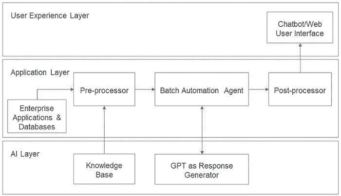

**图 4.10：** 批量自动化代理

# 用户体验层

显示批处理输出的结果，并通过聊天机器人或 Web 用户界面促进用户交互。

# 应用层

该层由预处理器、企业应用程序和数据库、批量自动化代理和后处理器组成：

+   企业应用程序和数据库：企业应用程序和数据库是原始数据记录的主要来源。

+   预处理器：预处理器执行与对话模式相同的步骤，但这次是针对整个数据记录批处理。

+   批量自动化代理：该代理采用双循环机制：外部循环处理批处理中的每个数据记录，内部循环迭代地将与当前记录相关的一系列丰富提示输入到 GPT 模型中。

+   后处理器：一旦批量自动化代理生成了批量响应，后处理器会将其格式化为用户体验层的显示。

# AI 层

AI 层具有与**扎根对话**模式（A2）相同的功能。

# 模式工作流程

1.  企业应用和数据库提供批量数据记录。

1.  预处理器利用知识库创建丰富的数据记录。

1.  批量自动化代理采用其双循环机制：对于批处理中的每个丰富记录（外部循环），它会处理一系列提示（内部循环）到一个 GPT 模型。

1.  后处理器为最佳显示组织批量输出。

1.  用户体验层可视化格式化输出。

# 模式工作流程示例

想象一家租车公司，希望处理他们每天收到的大量关于汽车租赁和服务的客户评论。目标是对这些评论进行分类，并以分类、总结、用户友好的格式呈现给他们的分店经理。

这里有一个示例工作流程：

1.  源数据收集：公司的租车管理系统和反馈门户作为企业应用和数据库，收集当天的客户评论，汇总成几百条反馈条目的批量。

1.  数据丰富：预处理器接受每个评论并使用内部知识库添加上下文。例如，一条评论说，“汽车的空调坏了”可能会被丰富为：“顾客发现从[具体分店]租来的[汽车型号]的空调有问题。”

1.  双循环数据处理：

+   外部循环：批量自动化代理开始处理每个丰富的评论。

+   内部循环：

+   第一个提示：“根据评论‘[丰富的评论]’，确定其情绪（积极的、中立的、消极的）和主要关注类别（例如，车辆状况、客户服务、定价、预订流程）。”

+   第二个提示：“根据识别的情绪和类别，创建一个适合分店经理审阅的简洁摘要。”

+   （注意：根据系统设计，可以添加进一步提示以提取更细致的信息。）

1.  数据格式化：一旦 GPT 模型处理了所有评论，后处理器会对批量摘要进行结构化。评论按分店、车型和关注类别分组。数据准备好进行最佳可视化，可能通过生成展示经常问题的图表或通过积极反馈排名分店的排行榜来展示。

1.  可视化和用户交互：用户体验层在交互式仪表板上显示这些结构化摘要。分店经理可以深入特定的反馈类别，查看个别评论，或通过集成的聊天机器人提出更详细的问题。

# 企业集成

相当于**扎根对话**模式（A2）的集成级别。

# 输出质量

批量自动化代理的双循环机制在保持连续性和上下文的同时，也带来了一个挑战：错误累积的风险。如果序列中的一个提示生成了不准确或次优的响应，随后的提示可能会基于这个错误，潜在地使不准确性叠加。这强调了确保每个单独提示的精度以维护响应的整体质量的重要性。

# 性能

虽然双循环的特性可能引入复杂性，但批量处理方法旨在提高效率。批量处理本质上具有延迟，直到整个批次完成，但结果是全面的，过程在没有用户参与的情况下自主运行。

# 使用案例

这种架构模式适用于需要高级批量知识驱动自动化的场景。在知识管理领域特别突出，为大量数据的快速处理、分类和表示提供了强大的解决方案。值得注意的应用包括：

+   信息提取：深入研究广泛的文件，挖掘相关的见解，这个功能在研究、法律或新闻等领域尤其有价值。

+   数据转换和质量管理：具有整合不同格式和结构的数据，发现冗余、不一致性的能力，使得可以使用标准分析工具。

+   过程分析：通过检查从不同事件日志中提取的模式，提供有助于完善工作流程的可操作见解。这对于依赖于复杂过程指标的行业特别有益。

+   高级数据挖掘：通过在非结构化数据上使用关联规则挖掘和聚类分析等方法，该架构能够解读传统分析可能忽略的模式和见解。

+   自动标记：通过增强搜索结果和加强推荐，这个功能简化了用户体验，根据内容的性质自动标记内容。

# D2 编排代理

这种架构的核心是编排的工作流程，旨在指导用户-GPT 从开始到结束的互动。编排代理是这个工作流程的核心，集成了用户、GPT 模型、应用程序、数据库和知识库（见*图 4.11*）。

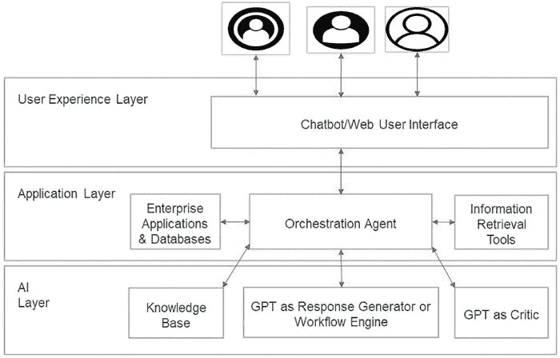

**图 4.11：**编排代理

# 用户体验层

这一层是多个用户与系统连接的地方。他们可能使用聊天机器人或 Web 界面。他们提出请求，查看他们的任务，并从 GPT 模型获得回应。

# 应用层

分为三个主要组件，这一层协调任务和互动的流程：

+   编排代理：这个关键组件存在两种变体：

+   基于程序的代理：用于使用适当的编程语言（如 Python 或 Java）编写的静态工作流程，以控制顺序任务执行。

+   基于提示的代理：适用于涉及规划、执行和适应的动态工作流程。它使用与外部工具集成的工作流提示，类似于 B1-B3 架构模式。

+   企业应用和数据库：这些是代理利用的特定企业工具和数据源。

+   信息检索工具：这包括公共工具，如搜索引擎或网站，系统利用这些工具来给后续提示提供上下文。

# AI 层

这一层包括：

+   两种潜在角色中的主 GPT 模型：

+   特定工作流任务的响应生成器（基于程序的编排）：在这种情况下，GPT 模型对脚本化工作流中定义的特定任务进行回应。

+   工作流引擎（基于提示的编排）：在这里，GPT 模型承担更广泛的角色，通过工作流提示管理任务的流程和执行。

+   知识库：该组件提供长期和短期记忆功能，因此超越了它在以前模式中扮演的静态存储库角色：

+   长期记忆：这部分存储各种知识，根据信息的来源和性质进行分类。

+   学习知识：这包括从以前的互动中生成的见解和信息，GPT 模型做出了回应。它形成了一个不断丰富的知识体系，通过监控和分析 GPT 模型过去回应的结果，以促进对时间的更细致理解和改进性能。

+   检索到的知识：这部分存储了在先前操作中从外部资源获取的数据和信息，例如在先前用户互动中搜索的结果。它有助于保留有价值的发现以供将来参考，避免对相同查询进行重复搜索操作，并确保一致的响应。

+   获取的知识：这部分记忆中存放着经常由专业主题专家（SMEs）策划和验证的知识。它代表了随着时间的推移形成的结构化和可靠的信息库，为 GPT 模型的响应提供了坚实的基础，确保输出与企业标准和专家验证相一致。

+   短期记忆：这部分旨在保留与用户、GPT 模型、企业应用程序或搜索工具的中间交互结果，暂时保存数据以便通过回忆最近的交互和计算来促进连贯和适应性的互动。这种记忆是短暂的，在会话结束或预定义的时间后会被清除，以保持数据的相关性和安全性。

+   GPT-Critic：一个辅助 GPT 模型，负责评估主要 GPT 模型的输出的有效性和质量。

# 基于程序的编排代理的模式工作流

1.  用户请求：用户描述他们的预期结果。

1.  工作流选择：根据用户请求选择标准工作流程。例如：

+   具有生成任务的一步搜索

+   语义搜索：从知识库中提取相关知识。

+   生成任务：使用 GPT 模型进行内容创建、摘要或回答查询。

+   具有生成任务的两步搜索：

+   查询制定：在需要特定数据时使用 GPT 模型生成 API 调用或搜索查询。

+   信息检索：从外部来源获取必要的数据。

+   知识表示：将这些数据纳入知识库。

+   语义搜索：从知识库中提取相关知识。

+   生成任务：使用 GPT 模型进行内容创建、摘要或回答查询。

+   一步后端功能执行（类似于 B1 模式）

+   从用户收集信息（可选）：根据需要从用户那里收集补充数据。

+   后端功能调用生成：创建可执行的应用级功能或调用。

+   后端功能调用执行：执行先前生成的应用程序功能调用。

+   后端功能结果翻译：将系统级功能的结果转换为用户友好的输出或格式。

+   多步后端功能执行

+   对每个后端系统重复上一个工作流程的三个步骤：依次执行多个后端进程的功能生成、执行和结果转换步骤。

+   后端功能调用之间可能的用户交互：在各个阶段与用户互动，收集更多信息或完善后续步骤。

+   交互式内容创建

+   从用户收集信息：从用户那里收集内容创建过程所需的数据。

+   基于收集的信息创建内容：根据用户提供的数据开发定制内容。

1.  工作流执行：开始并监督在前一个“工作流选择”步骤中选择的完整步骤序列。

1.  输出评估：利用 GPT-Critic 检查输出的准确性和相关性，确保其符合已建立的标准或用户请求。

1.  结果呈现：以易于理解和用户友好的方式向用户显示工作流的结果。

# 基于程序的编排的工作流示例

想象一个为企业设计的数字平台，用于定位和采购稀有、环保或具有其他独特属性的专业原材料。

一家制造公司正在寻找一种可持续的橡胶，既耐用又对环境影响最小，用于新的系列环保鞋类产品。

以下是一个匹配模式工作流程结构的示例工作流程：

1.  用户请求：制造商的采购经理登录数字平台并指定他们的需求：可持续、耐用的橡胶，最好具有公平贸易或雨林联盟等认证。

1.  工作流程选择：

+   考虑经理的具体要求，系统选择了具有生成任务工作流程的两步搜索。

+   查询制定：使用经理的输入，系统制定针对性的搜索查询，如“具有认证的可持续耐用橡胶供应商”。

+   信息检索：系统利用网络爬虫浏览行业数据库、供应商目录、论坛和相关的可持续发展网站，以确定潜在供应商。

+   知识表示：提取的信息，如供应商档案、他们的认证、客户评价和材料规格，被结构化以便更容易分析。

+   语义搜索：系统评估组织好的数据，优先考虑与制造商标准密切符合的供应商。

+   生成任务：如果没有找到理想的供应商，系统将使用 GPT 模型起草询问或 RFP（提案请求）发送给有前途的供应商或行业联系人。

1.  工作流程执行：

+   基于程序的代理管理操作顺序，确保从网络中获取相关和准确的供应商信息。

1.  输出评估：

+   GPT 评论员审查供应商的入围名单和 RFP，以确认它们符合制造商的规格。

+   如果发现不一致，可能会启动“信息检索”步骤的新迭代，或者修订搜索标准。

1.  结果呈现：

+   买方收到了一份精心筛选的潜在供应商名单，包括所有相关细节，如认证、过往客户评价和联系信息。

+   生成的 RFP 可用，准备好发送给潜在供应商以获得更详细的提案。

+   买方可以选择直接与供应商联系，请求样品，或者发送 RFP 以进行竞争性投标。

# 具有基于提示的编排代理的模式工作流程

1.  用户请求：用户描述他们的预期结果。

1.  工作流程提示模式选择：根据用户请求选择工作流程提示模式。相应模式的示例在第六章的“自适应业务流程管理”部分中给出。

1.  工作流程提示执行：通过使用 GPT 模型作为工作流引擎执行工作流程。当工作流程需要时，它会生成对 API 函数调用的请求（如 B1 模式中）和用户输入（如 A3 模式中）。编排代理将处理这些请求，并将结果反馀 GPT 模型以继续工作流程。工作流程在达到特定停止条件或用户停止时终止。

1.  输出评估：GPT 评论员检查工作流程的输出，以确保符合规定的标准。

1.  结果呈现：一旦工作流程完成，结果以易于解释的格式展示给用户。

# 具有基于提示的编排的工作流程示例

想象一个电子商务巨头，一个客户最近购买的智能手表屏幕损坏了：

1.  用户请求：客户访问投诉部分并提到：“我收到了我的智能手表订单，但屏幕破裂了。我想要更换或退款。订单号：567890。”

1.  工作流程提示选择：根据投诉的性质，系统选择自适应投诉管理工作流的提示：

+   提示名称：自适应投诉管理工作流程

+   专家角色：“作为一名接受过电子商务自适应投诉管理培训的人工智能，您可以通过确定和执行适当的工作流来自主管理投诉解决。与用户的互动仅用于捕获必要的细节。”

+   背景：“您正在协助一家每天收到大量投诉的电子商务巨头。当前的投诉是：[捕获的投诉槽]。投诉解决步骤包括：

1.  投诉澄清：通过与用户互动了解投诉的具体情况。

1.  工作流设计：自主规划任务以解决投诉。

1.  工作流启动和执行：开始并完成投诉任务，要求用户提供所需的详细信息。

1.  工作流监控：确保解决进展顺利并收集用户反馈。

1.  工作流适应：根据意外情况或偏差修改任务。”

+   目标：有效地引导每个投诉解决阶段，利用沟通、规划和建议等技能。

+   控制和约束：始终尊重隐私，寻求必要的用户输入，澄清决策，并确保输出是可操作的，并遵循最佳实践。

+   指示：从“投诉澄清”开始：请分享有关投诉的更多信息[捕获的投诉槽]，以进行有效的解决过程。

1.  工作流执行：

1.  投诉澄清：系统询问：“您能否提供有关损坏的更多具体信息？包装在送达时是否完好？”用户回答：“包装看起来没问题，但里面的手表损坏了。看起来是质量控制问题。”

1.  工作流设计：根据用户的反馈，系统选择产品更换和质量保证工作流。

+   验证订单。

+   确认保修。

+   发起退货和更换流程。

+   确保更换产品的质量检查。

1.  工作流启动和执行：执行四个工作流步骤：

1.  工作流监控：随着更换产品的发货，用户将收到关于进展的通知。

1.  工作流适应：如果出现延迟或问题，系统将调整工作流，通知用户并提供解决方案。

1.  输出评估：GPT-Critic 评估整个解决过程，确保投诉得到有效解决，并且所有工作流步骤都得到遵守。

1.  结果呈现：客户将得到采取的行动时间表、更换货物的跟踪号码以及在收到货物后提供反馈的界面。他们还将获得一个折扣码，以补偿不便，鼓励未来的购买。

# 企业集成

这种模式由于编排代理的能力可以在整个工作流中嵌入基于 API 的功能，因此提供了先进的企业集成。

# 输出质量

这种模式通过系统地将提示与上下文用户输入、知识、内部和外部数据以及先前的 GPT 输出相结合，系统地提高了输出质量。多个用户的潜在参与提供了一个额外的人类判断层，进一步完善了人工智能的上下文感知输出。GPT-Critic 评估人工智能生成内容的质量，其反馈由编排代理管理，以优化输出质量。

# 性能

这种模式的计算性能与工作流的长度密切相关。然而，对于大多数使用案例来说，长度较短到中等长度的工作流应该足够，平衡了效率和计算需求。

# 使用案例

这种模式的动态能力和健壮的设计使其非常适用于各种应用。在其核心，它旨在管理两种主要类型的工作流：静态（脚本化）和动态（自适应）。

静态工作流是日常运营的基础，其结构明确定义，流程可预测。这类工作流通常是自动化的，并遵循预设脚本：

+   复杂内容创建：

+   报告：将数据点综合成全面的报告，包括图表等可视化呈现。

+   新闻简报：定期整理更新或相关新闻的内容，保持一致的布局。

+   文档：为各种需求生成结构化文档，确保目标受众的清晰度。

+   信息收集：

+   采访：利用模板和协议系统地从个人或团体中提取信息。

+   交互式报告：从企业特定系统或数据库中获取并呈现交互格式的数据，确保数据的完整性和准确性。

+   网站：自动搜索、阅读和总结相关网站内容。

+   标准工作流程：

+   申请：处理和自动化标准申请流程，从请求到批准。

+   批准周期：简化批准请求、提醒和文档工作。

+   库存管理：自动化与库存盘点、重新订货水平和库存估值相关的任务。

虽然这种模式轻松地管理可预测的操作，但它也展示了它在接纳更加复杂和适应性挑战方面的熟练。具有不完整规范、需要即时调整或由不断发展的用户意图和意外情况所决定的任务属于这个领域。这样的动态工作流程需要计划、执行、重新评估和适应的结合：

+   任务导向对话：适应不断发展的用户意图，这些代理设计、修改和部署对话计划，产生多方面的互动。

+   全面研究：将广泛的研究目标分割为子目标，并使用多种资源对每个子目标进行概念化和执行详细的策略。

+   探索性数据分析：代理根据洞察目标制定探索性策略，通过多种数据来源和工具进行迭代。

+   自动故障排除：在理解用户问题后，系统制定诊断计划，可能包括查询特定企业工具，提供引导解决方案，或利用 GPT 进行创新疗法。

+   个性化学习路径：根据学生的抱负定制教育轨迹，精心选择、排序和校准内容，根据他们的进展和反馈。

# D3 协作代理

这种模式的本质围绕着协作代理，作为连接用户与 GPT 模型的动态通道，在自适应协作空间内。通过利用协作存储库，这种设计确保了 GPT 的参与是基于上下文的，并且可以被归档，重新访问或完善（见*图 4.12*）。

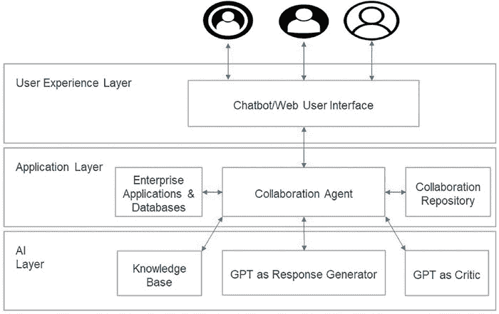

**图 4.12：** 协作代理

# 用户体验层

通过聊天机器人或 Web UI，用户可以积极参与任何活跃的协作，贡献意见，并根据不断发展的内容共同确定轨迹和结果。

# 应用层

它包括以下内容：

+   企业应用和数据库：这些是在协作过程中使用的工具和数据来源。

+   协作代理：该代理与协作存储库交互，以检索或归档主要提示⁸，协作历史，摘要和结果。

+   协作存储库：关键的存储空间，保存主要提示，深入的协作历史，简洁的协作摘要，以及中间和最终结果。

# AI 层

这一层包括：

+   GPT 作为响应生成器：负责提供与上下文相关的响应。

+   知识库：与之前的 D2 模式一样，具有短期和长期记忆。

+   GPT-Critic：第二个 GPT 模型，确保第一个 GPT 模型的输出符合期望的质量标准。

# 模式工作流程

1.  用户选择启动或参与一个持续的合作。

1.  如果开始一个新的合作，合作代理会从合作存储库中获取与所选场景相对应的主提示。

1.  对于持续的合作，最近的合作历史为舞台。

1.  用户不断添加提示。在每个用户输入之后，合作代理都会将用户的提示和 GPT 的输出结果附加到活动合作历史中。

1.  GPT-Critic 监督并确保 GPT 的回应质量。

1.  在结束合作时，其摘要和结果将存档在合作存储库中。

# 模式工作流示例

想象一家希望改进其车辆维护策略的汽车租赁公司。通过与多个利益相关者（技术人员、车队经理、客户服务代表，甚至客户）合作，他们旨在在使用合作代理进行持续讨论中收集见解、经验和建议。

你的任务是：主持一个关于改进车辆维护流程的合作讨论，考虑到不同的观点、历史讨论和建议。

这是一个与模式工作流匹配的示例工作流：

1.  启动：车队经理决定开始一个名为“改进我们的车辆维护策略”的合作讨论。

1.  合作启动：

+   合作代理从合作存储库中检索有关汽车维护的通用主提示。

+   提示可能会是：“讨论我们公司汽车维护的最佳实践、挑战和改进。”

1.  持续合作参与：

+   当技术人员、客户服务代表和其他利益相关者加入时，他们可以查看正在进行的讨论并做出贡献。

+   例如，一个技术人员可能会添加：“例行检查通常只是肤浅的。我们需要更深入的诊断。”

+   立即，一个从知识库中获取信息的 GPT 模型可能会建议：“考虑实施详细的每两个月一次的诊断和例行检查。这可以发现潜在问题。”

+   合作代理将每个提示和回应附加到活动合作历史中。

1.  用户贡献：

+   一个客户服务代表可能会插话：“客户经常报告夏季空调问题。也许我们可以在旺季之前进行预防性检查？”

+   一个 GPT 模型可能会回应：“夏季前的年度空调服务有助于。此外，考虑在初始租车时教育客户如何最佳使用空调。”

1.  GPT-Critic 对质量进行监督：

+   假设客户提出：“我曾经租过一辆在半路抛锚的车。紧急情况下的策略是什么？”

+   如果 GPT 模型最初提供了一个模糊的答案，比如“汽车应该保养”，GPT-Critic 可能会标记这个答案质量低，促使模型产生更全面的回应。

1.  合作结束和存档：

+   一个星期后，车队经理决定结束讨论。

+   合作代理会自动生成一个摘要：“讨论改进我们的车辆维护策略的要点。”

+   它包括实施每两个月一次的诊断、夏季前的年度空调服务，以及可能针对紧急故障的策略。

+   这个摘要和整个讨论都被存档在合作存储库中以供将来参考。

# 企业集成

这个模式提供了与**基础对话**模式（A2）相同水平的企业集成。

# 输出质量

通过合作存储库的帮助，GPT 模型在一个丰富的背景下运作，这个背景包括来自多个具有不同观点的用户和相应 GPT 输出的输入。GPT-Critic 的角色也有助于通过检查和验证来提高输出的质量。

# 性能

这种模式的效率取决于协作内容的深度和广度。然而，通过协作代理处理任务，利用协作存储库，确保流畅的进展，并且仅在接收到新的协作输入后使用计算资源。

# 使用案例

理想情况下，这种模式适用于跨不同背景的复杂协作努力，主要应用包括：

+   顺序人本工作流程：在产品开发中，这涉及协调团队从构思到生产。协作代理根据先前的输入确保每个阶段的一致性。

+   项目：在活动规划中，代理帮助建立时间表，分配任务，并收集后勤输入。它根据持续更新提出改进建议。

+   销售参与：对于市场进入战略，代理整合市场研究、竞争对手分析和客户画像。

+   供应商评估：在寻找供应商时，代理存储供应商档案和过去的互动。评估者的标准，如成本或交付时间表，将与存储的数据进行匹配，以做出明智的决策。

+   创新框架：在技术创新中，利益相关者在平台上进行头脑风暴。代理提供情境反馈，从过去的会话或外部趋势中获取，协助制定一致和创造性的策略。

# D4 多代理合作

这种模式的本质根植于分布式智能的概念。通过将任务分散在一组专门的代理人之间 5]，这种模式创造了一种更流畅和适应性更强的方式来满足复杂的用户目标。这个动态的代理人合奏团共同利用各种 GPT 模型，确保每个任务都由最合适的专家来处理（见*图 4.13*）。

![

**图 4.13：** 多代理合作

# 用户体验层

与之前两种模式相似，这一层提供了各种互动可能性。通过聊天机器人界面或 Web 用户界面，用户可以表达复杂的目标，然后由一组合作的代理人来完成，并可能需要与多个用户进一步互动。

# 应用层

这里包括的组件有：

+   代理团队：一群专门的代理人，负责执行不同的角色，以实现用户目标。团队由以下成员组成：

+   规划代理：将用户指定的目标分解为可行动的任务，并确定适合每个任务的理想专家代理配置文件。

+   编排代理：根据代理配置文件启动专家代理创建过程，启动任务序列，激活第一个专家代理，并逐步完成任务。该代理还监督专家代理之间的通信，确保与用户、知识库和其他企业工具的无缝互动。

+   专家代理：动态创建，这些代理具备执行特定任务所需的精确技能，以实现整体用户目标。

+   企业应用和数据库：这与 D2 模式中的情况相同。

+   信息检索工具：这与 D2 模式中的情况相同。

与 D2 模式类似，值得注意的是在这种架构中有两种不同类型的代理团队。虽然图表中展示了基于程序的代理团队，但还存在另一种构造 - 基于提示的代理团队。基于提示的代理团队的复杂性和应用将在《第五章，高级 GPT 提示工程技术》和专门讨论多代理提示的附录 1 中进行探讨。

# AI 层

以下元素对这一层至关重要：

+   知识库：类似于 D2，存储着瞬时和持久的信息。

+   在不同角色中实例化的 GPT 模型：

+   GPT 作为规划者：与规划代理对齐，将用户目标转化为一系列任务。

+   GPT 作为指挥者：驱动着编排代理，管理专家代理之间任务的排序和委派。

+   GPT 作为专家：为每个专家代理提供领域特定的知识和专业知识，以执行其指定的任务。

# 模式工作流

1.  用户表达了他们希望实现的详细目标。

1.  规划代理处理这个目标，将其转化为一系列可执行任务，并为每个任务确定理想的专家代理配置文件。

1.  对于每个任务，编排代理创建相应的专家代理。

1.  任务排序完成后，编排代理激活第一个专家代理并委派相应的任务。

1.  专家代理执行分配给它的任务。

1.  任务完成后，编排代理移动到下一个任务，激活下一个排队的专家代理。

1.  这个顺序会被认真遵循，直到所有任务得到解决。

1.  在整个过程中，编排代理确保专家代理之间以及它们与其他涉及实体（如用户、知识库或数据库）之间的顺畅沟通。

# 企业集成

这种模式提供了与 D2 模式中一样的高级企业集成，因为所有代理都可以通过 API 访问功能来执行他们的任务。

# 输出质量

当最终专家代理评估所有先前专家代理的性能时，D4 的输出质量与 D2 的输出质量非常相似。虽然通过为每个涉及的代理（包括规划、编排和专家代理）实施质量评估有潜力提高输出质量，但必须注意，这种增强可能会以性能下降为代价。

# 性能

性能受到参与的代理数量以及他们之间和用户和企业应用程序之间的互动程度的显着影响。随着代理数量的增加，或者互动变得更频繁和复杂，系统的响应速度和效率可能会相应受到影响。

# 使用案例

在 D2 模式的基础能力上构建，并通过多代理合作的复杂性加以增强，这种 D4 模式能够熟练处理各种应用，如以下使用案例所示：

+   全面的研究：

+   规划代理：理解总体研究目标，并将其分成有针对性的研究领域或问题。

+   编排代理：在专家代理之间协调，为它们分配特定的研究领域或任务，并确保无缝整合它们的发现。

+   专家代理：深入其分配的领域，挖掘数据，参考学术文章，并交叉参考研究结果。每个代理可能专门研究各种研究方法或来源。

+   探索性数据分析：

+   规划代理：根据期望的见解和结果定义数据探索的目标。

+   编排代理：组织数据流，确保它以有序的方式在专家代理之间移动并整合他们的分析。

+   专家代理：每个代理可以专注于特定的数据集或分析技术。例如，一个代理可能处理统计分析，而另一个专注于可视化或预测建模。

+   自动故障排除：

+   规划代理：识别报告的问题并定义诊断步骤。

+   编排代理：管理故障排除过程，确保每个步骤都被执行，收集所需数据，并提供反馈。

+   专家代理：专门处理问题的不同方面。一个可能处理与软件相关的问题，另一个可能是硬件诊断，另一个可能专注于用户体验或界面问题。

+   个性化学习路径：

+   规划代理：评估学习者当前的知识水平、偏好和长期教育目标。

+   编排代理：组织课程表，安排课程，并确保内容流与学习者的进展相一致。

+   专家代理：专注于不同学科或学习方法。例如，一个人可以处理数学，而另一个人处理文学。其他人可能专注于经验性学习、多媒体内容或实践项目。

+   软件开发协助：

+   规划代理：解释需求并将其分解为特性或任务。

+   编排代理：管理依赖关系和工作流程。

+   专家代理：建议代码片段，运行测试，调试问题，甚至帮助部署策略。

+   咨询任务：

+   规划代理：确定客户需求并将其分解为可操作的见解或任务。

+   编排代理：安排会议，管理时间表，并确保交付物得到满足。

+   专家代理：深入具体细节，无论是市场研究、财务建模还是战略规划，利用最佳工具和资源完成每项任务。

# 架构模式建议

通过深入研究各种 GPT 驱动的架构模式的细微差别和复杂性，我们准备提出一系列精心策划的建议。这些见解来自全面的描述和评估，旨在指导您选择最适合您特定需求的架构：

+   **高级对话体验**：**基于实际情况的对话**（A2）与企业系统集成，增加了上下文深度。**混合主动对话**（A3）促进双向互动，引导用户行动和查询，而**质量控制对话**（A4）确保所有回应在显示给用户之前都经过第二个 GPT 模型的检查。

+   **工具驱动对话**：**集成工具对话**（B1）利用 GPT 模型通过 API 与外部应用程序和数据库无缝交互。**基于思维链引导的工具对话**（B2）通过推理演示丰富了这一点。与此同时，**高级工具集成对话**（B3）利用基于对话上下文的动态任务规划优化与企业工具的交互。

+   **专业对话**：**使用精细调校模型的对话**（C1）采用精细调校的语言模型生成精确的回应，非常适合复杂领域和高风险环境。与此同时，**使用两个模型的对话**（C2）结合了精细调校模型的特定性和预训练的 GPT 模型的广度，确保深入用户互动嵌入到多样的对话场景中。

+   **高级自动化**：对于复杂的自动化需求，模式**批量自动化代理**（D1）、**编排代理**（D2）和**多代理协作**（D4）脱颖而出。D1 强调批量数据处理，而 D2 利用顺序编排实现无缝互动。D4 特别适用于需要高度动态适应性和任务特定专业知识的环境。

+   **协助协作**：对于深度协作环境，模式**协作代理**（D3）和**多代理协作**（D4）表现突出。D3 在强调持续以人为中心互动的情况下表现出色，GPT 管理和增强整个协作过程。另一方面，D4 强调人类和任务特定代理共同工作的情景，结合各自的优势以获得最佳结果。

我们对 GPT 驱动的架构模式的探索揭示了多种解决方案，每种都有其固有的优点。您的组织或项目的正确选择取决于您的具体需求和限制。将此分析作为参考，指导您选择最符合您目标的架构模式。

# 结论

当我们在 GPT 驱动的架构模式的多样景观中航行时，这些系统可以如何在改善用户互动、增强协作场景和推进自动化流程方面发挥重要作用变得明显。通过提供多样化的模式谱，每个模式都针对特定的用例和需求定制，我们可以释放 AI 能力的全部潜力，开发未来高效、适应性强、协作性强且提供丰富用户体验的对话系统和工作流程。

既然我们已经确定了 GPT 在各种架构模式中的多功能性和适应性，现在是时候深入了解高级 GPT 提示工程技术的世界了。这些技术将深入了解如何引导 GPT 模型实现期望的结果，特别是在复杂的企业场景中。让我们现在将焦点转向这些结构化提示方法，以进一步释放 GPT 在高级 AI 应用中的广泛潜力。

# 关键点

1.  GPT 驱动架构的多功能性：架构模式是多功能的，可以将 GPT 模型部署到各种对话上下文、工具集成和自动化场景中，证明了它们在增强用户参与和简化信息检索方面的重要性。

1.  分层系统方法：在架构模式中使用分层系统方法确保解耦和可维护性，从而导致更可持续的系统生命周期。

1.  质量和性能的权衡：每种模式都提供了独特的输出质量、性能和企业集成的混合，提供了一系列选择，以满足不同的需求和用例。

1.  企业集成：与企业应用程序和数据库的无缝集成，如工具集成对话和其他模式中所见，可以显著扩展 GPT 驱动系统的能力。

1.  响应的精确性和广度：在特定知识与更广泛理解之间取得平衡，一些架构展示了模型微调在提供准确和全面响应方面的重要性。

1.  高级自动化：GPT 集成架构还展示了在各种自动化场景中的多功能性：内容的批处理、信息工作流编排以及使用多代理系统执行项目。

1.  协作卓越：GPT 模型可以用于促进协作环境中的自适应互动，实现人类中心互动和多代理合作的独特融合，共同实现复杂目标。

____________________

¹ 代理是一种设计用于执行特定任务的软件组件，通常是自主地与其他代理、系统或用户进行交互。

² 提示模板主要是预填的提示模式，用于控制 GPT 模型，并在*第五章，高级 GPT 提示工程技术*中介绍。模板可以基于规则、机器学习模型或通过选择提示向 GPT 模型选择。

³ 文档数据库，也称为文档导向数据库或文档存储，是一种设计用于存储、检索和管理半结构化信息的非关系型数据库，例如带有元数据的文本，通常以 JSON（JavaScript 对象表示）或 XML（可扩展标记语言）等标准格式存储。

⁴ 图数据库，通常称为图导向数据库或图引擎，也是一种非关系型数据库，用于捕获、处理和管理以网络模型化的数据，强调节点、边和属性，从而能够映射、访问和分析复杂的相互连接和依赖关系。

⁵ 向量数据库是一种专门优化用于存储和查询高维向量数据的数据库系统，通常表示文档、查询或兴趣配置文件，常用于 AI 应用程序中的任务，如相似性搜索或推荐。

⁶ 在 GPT 模型（如 ChatGPT）的背景下，“思维链（CoT）”指的是模型在一系列句子或交流中保持连贯推理的能力。CoT 演示就是这样一种推理链的示例。

⁷ 这种架构模式的实现在第九章中以 Java 编程语言为例进行了说明。

⁸ 主提示定义了给定协作场景的协作手册。主提示在*第六章，设计基于提示的智能助手*中有详细介绍。

# 第五章：高级 GPT 提示工程技术

# [介绍]

回顾我们之前的讨论，我们已经深入探讨了 ChatGPT 启用的人工智能能力，见于*第二章，CapabilityGPT – 一个 ChatGPT 的企业人工智能能力框架*，并且在*第三章，ChatGPT 对企业的影响*中审视了它们对企业角色的变革性影响。我们还在*第四章，GPT 模型赋能的架构模式*中看到了这些先进能力，当与正确的解决方案架构模式结合时，可以引领一个新一代的智能系统。掌握这些人工智能能力的核心是提示工程的实践，即有效地与 GPT 模型进行交流的技术。

无论在什么情境下，提示工程都是至关重要的——无论是与 ChatGPT 聊天机器人进行简单交互，开发以 GPT 为核心的专业应用程序，还是利用像 Microsoft Copilot 这样增强了 GPT 的企业解决方案。这个过程是制定精确、具有上下文相关性的提示，使我们能够从模型中产生期望的回应。

有三种主要技术，指令提示、查询提示和多智能体提示，每种技术都在与 GPT 模型交流时解决独特的挑战和场景。

我们从**指令提示**开始探索。这一技术牢固地基于在*第二章*中介绍的 CapabilityGPT 框架，它提出了一种结构化方法，用于向 GPT 模型传达特定的任务或行动。随后的深入剖析将通过其三种变体：单一指令、指令序列和伪代码指令来导航，它们的有效性将通过强调它们实际应用的现实世界例子得以展现。

接下来，我们转向**查询提示**，这是一种在探索和分析场景中有用的技术，也是在面对模糊和不完整信息时有用的技术。在本节中，我们区分各种查询类型，包括寻求信息、比较、预测和假设性查询，并为每种查询类型提供详细的示例。

最后，我们深入探讨**多智能体提示**。在其核心，这种技术在任务无法严格定义的情况下表现出色，需要多个人工智能代理的专业知识和有效协作。本节提供了潜在概念的定义，并在企业环境中提供了详细的实际示例。

需要注意的是，本章讨论的提示工程技术是特定于 ChatGPT 及其之后的 GPT 模型的，目前包括 ChatGPT 和 GPT-4。

# 结构

在本章中，将涵盖以下主题：

+   指令提示

+   查询提示

+   多智能体提示

# 指令提示

在本节中，我们首先探讨指令提示模式，这是 GPT 模型交互的精确引导蓝图。然后，我们提供多个实际示例，说明其在企业场景中的应用。

# 指令提示模式

指令提示模式是在*第二章，CapabilityGPT – 一个 ChatGPT 的企业人工智能能力框架*中引入的人工智能能力框架的基础上构建的，它提出了一种系统的方法来引导 GPT 模型产生深入、具有上下文意识和精确的输出。让我们深入探讨每个模式组件：

+   专家角色：这个基本要素勾勒了 GPT 模型在其回应中应展现的专业知识和角色。专家角色可以被构想为一个个体或一个团队，拥有多样但互补的技能：

+   个人角色：重点是单一的专业技能集，比如“营销公司的业务分析师”或“专门从事数据分析的 AI 代理”。在这种情况下，模型将利用其预训练的知识，以满足专业背景和情境理解的要求，发挥专业知识和观点。

+   团队角色：例如“教师、学生和家长的协作团队”或“由开发人员、设计师和项目经理组成的跨职能团队”，涵盖了多样化观点和经验的协同作用。在这里，GPT 模型试图促进协作方法，牢记每个角色贡献的独特见解。

+   背景：这个组成部分包括引导 GPT 模型更准确和适当地回应的外部或用户提供的信息。它可能涉及背景信息或特定情景的细节；例如，“我们公司上季度推出了三个营销活动。”背景信息显著有助于定位 GPT 模型的理解和回应，并有助于减少幻觉的风险，即生成与提供的输入或其预训练数据不符的信息。

+   任务规范：这个组成部分作为详细的指令，定义了 GPT 模型需要采取的行动或一系列行动。指令的性质和结构可能因任务复杂性、所需的精度以及任务是否涉及单个步骤或多个步骤而有所不同。这类指令有三种不同的格式：

+   单一指令：这些指令符合 CapabilityGPT 框架中定义的 AI 能力，指导 GPT 模型利用其多样化的能力，如评估、分类或沟通。例如，一条指令可能是：“评估这些广告活动的表现，并找出改进的方向。”

+   指令序列：这种格式涉及一系列指令，每个指令对应一个特定的 AI 能力。该序列指导 GPT 模型完成多个任务，旨在解决复杂问题或实现详细目标。每个指令都作为整体任务进展的一个阶段，其中一个指令的输出作为下一个指令的输入。一个例子是：“1. 从提供的财务报告中提取季度销售数据。2. 从提取的数据中识别任何销售趋势或模式。3. 根据识别的趋势，预测下一个季度的销售额。”

+   伪代码指令：伪代码将自然语言和编程语言联系起来，提供了算法的高级描述，而不必遵循严格的编程语法。这确保了对 GPT 模型的清晰和精确的指令。通过伪代码，诸如“if-then-else”条件和“for”或“while”循环等结构可以无缝集成，使模型能够高效而明确地处理复杂的多步任务。一个相关的例子是：

对于文章中的每个段落

如果段落中包含“重要”一词

提取段落的主要思想

如果

结束对于

将提取的想法编译成简要摘要

返回摘要

+   执行规则：执行规则提供潜在的指导，引导 GPT 模型在任务执行过程中进行思考和决策。这些规则包括问题解决方法、数据收集技术、道德考虑、协作实践和进化原则。它们可以适用于整个指令序列，也可以针对每个指令步骤有所不同。每个规则类别都包含具体的示例，以进一步澄清其意图和应用。以下是详细说明：

+   问题解决和推理：

+   “让我们一步一步地思考”：确保 GPT 模型执行逐步的思考过程，并在生成最终输出之前记录每一步的上下文。

+   “让我们首先了解问题并制定解决方案的计划。然后，让我们执行计划，一步一步地解决问题”：指示 GPT 模型为任务生成行动计划，然后遵守该计划，依次执行每个动作。

+   “考虑所有潜在解决方案”：鼓励 GPT 模型探索多种解决方案，而不仅仅专注于最明显或首先识别到的解决方案。

+   “在决定之前权衡利弊”：指示 GPT 模型评估每种解决方案或方法的利弊，确保更加平衡的决策过程。

+   “从列举潜在结果开始”：指导 GPT 模型在深入分析之前，通过列举可能的结果或情景来开始其思考过程。

+   “系统地参考可用数据”：指示模型仔细核对其掌握的每一条信息，确保在推理过程中没有遗漏任何细节。

+   “用新的见解更新假设”：提示模型随着提供更多数据或背景，完善其最初的预测或结论，鼓励推理过程中的适应性。

+   数据收集：

+   “仔细问我信息性问题，以最大化你对这一事件的信息，这样，当你得到所有答案时，你就可以做 X”：确保 GPT 模型提出最有效的问题，以最大化信息获取。

+   “每次只问一个问题，不给出答案”：限制 GPT 模型一次只能提出一个问题，允许后续问题建立在先前的回答基础上。

+   “在继续之前验证数据完整性”：鼓励模型确保其收集的信息准确、完整，没有被篡改或误导。

+   遵守道德标准：

+   “消除特定偏见”：指示模型主动避免任何形式的偏见，无论是人口统计学、社会经济、文化、种族、性别等，在生成输出时。

+   “拒绝个人可识别信息（PII）”：确保 GPT 模型不接受提示中的任何 PII 数据。

+   “促进公平和包容”：指导模型产生公平和包容的输出，代表多元化的观点，避免边缘化。

+   “避免有害或冒犯性内容”：指示模型过滤任何可能对任何个人或群体有害、误导或冒犯的内容。

+   “认识并披露局限性”：鼓励模型承认其局限性，并在适当的情况下提供免责声明或建议用户寻求专家意见。

+   合作规则：在由专家角色组成的团队执行的任务中，合作规则指导不同角色之间的互动和协同作用，以促进建设性和平衡的对话。在这里，我们详细介绍鼓励结构化合作的规则：

+   “进行协作综合”：鼓励专家角色团队共同合作，将他们各自的见解整合成一致的回应。例如，教师、学生和家长可以汇集他们独特的观点，构建基于人工智能学习的多方面解决方案。

+   “采取基于角色的视角”：鼓励专家角色团队的每个成员从其特定角度提供意见，促进对所讨论问题的更深入理解。

+   “建立共识”：指导专家角色团队努力寻找共同点，鼓励一种和谐的方法，尊重并整合所有团队成员的观点。

+   **‘解决冲突’：**指导团队高效地解决分歧，促进一个不同观点可以和谐共存的协作环境。

+   **应用进化原理：**指导 GPT 模型利用模拟自然选择过程的进化方法，以迭代地改进解决方案，生成或改进输出。在应用这些原理时，用户应指定：

+   **‘使用此初始解决方案：<solution>’：**指导 GPT 模型从指定的起点开始其演化过程。例如，当为新的跑车生成口号时，可以以“绿色和快速。不再矛盾”开始。

+   **‘执行<number>次进化步骤’：**指示模型应进行的精确改进次数。举例来说，为了改进口号，模型可能被指示进行 20 次进化步骤。

+   **‘通过此适应度函数评估<function description>’：**命令模型根据设定的标准评估其输出。在口号创作领域，这个函数可以根据口号的朗朗上口程度或其在现代生态背景下的相关性来衡量。

+   **输出约束：**这些定义了 GPT 模型生成的输出必须满足的条件。它们可以涉及格式、顺序、包含或排除某些元素、输出的大小和/或其他因素。约束可以是这样的：“输出应该是一个结构化报告，每个活动的表现和建议改进都有明确的部分。总输出不应超过 500 字。”

+   **参考案例：**基于案例的推理（CBR）是一种方法论，其中通过将新挑战与先前遇到的情况及其结果进行类比来推导新的解决方法。它涉及选择相关的参考案例，并对其进行调整以解决上下文部分描述的当前挑战。它涵盖了不同领域的广泛实际场景，并分为三种主要类型：

+   **问题解决案例：**描述了实体面临的特定问题以及随后实施的解决方案或干预措施。

+   **示例 1（零售）：**

+   **问题：**MegaStore 注意到他们的电子商务网站在移动设备上的购物车放弃率很高。

+   **解决方案：**MegaStore 重新设计了他们的移动结账流程，简化了步骤，并整合了更高效和流行的移动支付方式。这导致购物车放弃率在两个月内减少了 25%。

+   **示例 2（人力资源）：**

+   **问题：**TechCorp 意识到其员工流失率逐年增加，特别是初级员工中。

+   **解决方案：**TechCorp 实施了一项导师计划，将初级员工与资深专业人士配对。他们还引入了灵活的工作时间和持续学习机会。一年内，流失率减少了 20%。

+   **输入输出案例：**具体输入及其对应的 GPT 生成的输出的配对

+   **示例 1（媒体监测）：**

+   **输入：**“在年度会议上，CEO 约翰·史密斯宣布与 GlobalTech 合作，创新新的人工智能解决方案。”

+   **输出（事件数据提取）：**事件：合作伙伴关系公告；参与者：CEO 约翰·史密斯，GlobalTech；背景：年度会议；目标：创新新的人工智能解决方案。

+   **示例 2（能源部门）：**

+   **输入：**冬季增加的消费趋势和新的监管政策。

+   **输出（事件预测）：**基于增加的消费趋势和新的监管政策，预计在即将到来的冬季月份能源价格将上涨。

+   **思维链案例：**详细的序列，其中初始输入经历一系列逻辑或推理步骤以得出特定输出。

+   **示例 1（供应链管理-库存重新订购）：**

+   **输入：**本月数据：销售 500 个单位，退货 200 个单位，在运输中损坏 50 个单位，库存 1000 个单位，补货的交货时间为 3 周，平均每周销售 150 个单位。

+   **思路：**

1.  计算净销售额：从销售单位中减去退货单位：500 - 200 = 300 个单位。

1.  评估当前库存：考虑净销售和库存中的损坏单位：1000（起始库存）- 300（净销售）- 50（损坏）= 650 个单位。

1.  预测未来库存：考虑平均每周销售量和当前库存：650（当前库存）-（3 周×每周 150 个单位）= 3 周后预计剩余 200 个单位。

1.  确定补货的紧急性：如果交货时间为 3 周，那么在库存补充之前，只剩下 200 个单位。因此，必须在一周内进行补货，以避免在补货期结束之前库存不足。

1.  评估最佳重新订购数量：考虑销售趋势、退货率和潜在损坏，对意外损坏进行缓冲是明智的。重新订购（3 周×每周 150 个单位+100 个单位缓冲）= 550 个单位似乎是合适的。

+   **输出：**为了在接下来的一个月内保持健康的库存水平并考虑到不可预见的情况，建议在一周内重新订购 550 个单位。

+   **示例 2（银行-分类案例）：**

+   **输入：**具有以下详细信息的贷款申请：申请人年龄：29 岁，年收入：85,000 美元，就业状况：全职，信用评分：680，现有债务：20,000 美元。

+   **思路：**

1.  评估年龄及其对贷款风险的影响。

1.  评估年收入与潜在贷款规模的关系。

1.  检查就业状况以确定财务稳定性。

1.  审查信用评分以确定信用价值。

1.  分析现有债务与收入，以了解财务负担。

+   **输出：**申请人属于“中等风险”类别，可以获得贷款批准。

+   **外部能力：**GPT 模型可以进一步利用插件和外部工具的功能来增强其功能：

+   **插件：**这些是最初为 ChatGPT 生态系统引入的专业扩展。它们专注于推动业务效率，实现数据驱动的决策，并促进智能自动化。关键类别包括探索性数据分析、文档理解、人工智能和浏览。

+   **外部工具：**代表通过指定接口可用的功能目录，这些工具促进了 GPT 模型与其他人工智能平台、搜索引擎或后端系统之间的交互。每个工具都由详细的规范定义，包括执行任务类型、参数类型、结果类型和功能。

指令提示模式在以下情况下特别有用：

+   **需要复杂问题解决方案：**在任务多方面且需要复杂解决方案的情况下，该模式确保了系统化的方法，将复杂任务分解为可管理的步骤，以提高清晰度和效果。

+   **精度至关重要：**对于那些精度和准确性至关重要的任务，指令提示模式的详细任务规范和执行规则指导模型产生精确和具有上下文意识的响应。

+   **需要特殊专业知识：**如果情境需要多样的专业技能，选择个人或团队角色可以满足特定需求的专业知识，无论是来自单一专业人士还是协作团队。

+   **期望结构化输出：**当期望结果必须符合特定格式或结构时，输出约束组件可以确保人工智能生成的内容符合定义的要求。

+   **基于案例推理是有价值的：**在可以提供有价值见解的过去情景中，该模式的参考案例提供了一种方法来利用先前知识应对新挑战。

# 单一指令示例

以下展示了 ChatGPT-4 在处理单一指令提示时利用指令模式的组件，展现了其多样的能力。这些示例涉及项目回顾、利益相关者管理和销售预测的领域。每个提示展示了 ChatGPT-4 的不同 AI 能力⁴：

+   **项目回顾**：评估一个已完成的项目，比较了两个评估提示，其中一个提供了简洁的总结，另一个则进行了详细分析，确定了改进的领域和建议。比较表明，对**评估**能力的指令提示模式的组件进行具体规定，如角色、执行规则和输出约束，可以产生更详细、具体和专业的结果。

+   **利益相关者管理**：在这里，ChatGPT-4 充当产品经理，说服高管支持三种产品选项之一，使用论证框架⁵。它将产品特性与利益相关者的利益相一致，为所有产品提出分阶段的开发方法，并提倡平衡的产品开发策略。这是通过使用**创造**能力来发展几个论证推理链条来实现的。

+   **销售预测**：最后，ChatGPT-4 展示了对有机护肤产品线未来销售的预测能力，考虑了历史销售数据、观察到的模式和未来市场预期。它利用其**预测**能力以自然语言生成未来几个月的基本销售预测，有助于库存管理和营销工作的战略规划。

# 项目回顾

让我们从评估一个已完成的项目开始，以其项目经理的报告作为**评估**能力的示例：

**图 5.1:** 项目回顾

以下是报告：

*项目报告：XYZ 移动应用的开发*

+   *项目范围：旨在为我们的客户 XYZ 公司设计和实施一个全功能移动应用，以增加客户互动和用户体验。关键功能包括用户友好界面、安全支付网关和客户支持功能。*

+   *进度：项目计划为 12 个月，从 2022 年 8 月 1 日开始，到 2023 年 7 月 31 日结束。分为四个阶段：规划（2 个月）、开发（5 个月）、测试（3 个月）和部署（2 个月）。*

+   *成本：预算为 50 万美元，但由于在开发和测试阶段出现了一些意外复杂性，项目超出了预估成本的 15%，最终成本为 57.5 万美元。*

+   *质量：尽管时间和成本超支，但项目按协议达到了质量期望。用户测试平均得分为 4.5 分（满分 5 分），表明对应用的可用性和功能性感到满意。*

+   *资源：项目团队由一个项目经理，两名软件开发人员，一个 UI/UX 设计师，一个质量保证专员和一个业务分析师组成。然而，在开发阶段出现了较高的人员流失率，导致项目交付出现了轻微延迟。*

+   *风险：遇到了两个重大风险：*

+   *预算超支是由于开发中的意外复杂性，通过从营销储备中重新分配预算来进行管理。*

+   *资源流失造成的延迟得到了缓解，通过雇佣临时经验丰富的资源来保持进度。*

参考报告，ChatGPT-4 的直观提示可能是：

*‘根据上述项目报告进行端到端评估。’*

回应如下：

*项目评估摘要：XYZ 移动应用的开发*

+   *目标和范围：项目有效地实现了其设计和实施一个具有用户友好界面、安全支付网关和客户支持功能的全功能移动应用的目标。*

+   时间表：尽管在开发阶段出现了人员流失导致的轻微延迟，但项目仍然遵循了规定的 12 个月时间表。考虑到所涉及任务的复杂性，项目阶段的分配似乎是合理的。

+   *预算：该项目的预算超出最初估计的 15%（75,000 美元），主要是由于开发和测试阶段出现了意想不到的复杂性。虽然通过重新分配营销储备来管理了这一超支，但这是未来项目中需要改进的明显领域。更好的应急计划和风险管理可以预见到一些额外成本。

+   质量：质量措施显示出积极的结果。应用程序在测试中获得了高用户满意度评分，这表明尽管预算和资源存在挑战，最终产品的质量很高。

+   资源：项目团队的组成基本上适合项目的需求。然而，高流失率表明项目管理、团队士气或其他组织挑战可能存在潜在问题。这种资源不稳定性产生了实质性影响，导致项目交付延迟。

+   风险管理：风险已经被识别和管理，但识别过程可以更主动一些，特别是涉及预算和人力资源方面。虽然已经采取了缓解措施（重新分配预算、雇佣临时资源），但分析这些问题以防止未来项目中的再次发生将是有益的。

+   未来项目的建议：

1.  增强项目成本估算和应急计划，以防止预算超支。

1.  加强团队管理和留任策略，以减少关键项目阶段的人员流失。

1.  改进风险识别流程，考虑在规划阶段更全面地考虑内部和外部潜在风险。

总的来说，该项目可以被认为是成功的，因为它实现了其主要目标，并且产生了一个受用户欢迎的高质量产品。然而，时间和预算的超支，再加上资源不稳定性，表明有一些领域需要在未来项目中更加关注和完善。这些改进可以导致更可预测、更顺利的项目执行，并可能带来成本节约。

然而，使用指示提示模式，提示将被制定如下：

+   **专家角色**：“您是一位擅长项目评估的高级项目经理”

+   **背景：**“下面是一个关于开发移动应用的已完成项目的描述”

+   **指示：**“对项目进行端到端的评估”

+   **执行规则：**

+   “确保涵盖项目的范围、进度、成本、质量、资源、沟通、风险、采购和利益相关者管理。”

+   “确保采取非常批判性的中立立场，并挑战负责交付项目的项目经理创建的报告。”

+   **输出约束：**“输出必须以结构化报告的形式呈现，每个评估因素都有清晰的标题”

ChatGPT-4 生成的输出如下：

项目评估报告：开发“XYZ”移动应用程序

1.  项目范围：该项目旨在设计和实施一个具有用户友好界面、安全支付网关和客户支持功能的移动应用程序。然而，项目范围的描述似乎过于泛泛，缺乏对其复杂性的详细洞察。包括应用程序开发平台、预期用户互动水平和所需客户支持规模的具体细节将是有益的。还应明确说明功能数量、复杂性和任何限制，以避免范围蔓延。

1.  进度：该项目遵守了 12 个月的时间框架，尽管由于资源流失而出现了轻微延迟。评估原始项目进度表中是否有足够的应急时间来容纳意外延迟是至关重要的。规划阶段似乎是相称的，然而，开发阶段几乎占据了项目时间的一半，这引发了对效率和方法的质疑。此外，部署的两个月时间可能有些长——事后评估应确定是否可以为未来项目简化这一过程。

1.  成本：该项目经历了 15%的成本超支，主要是由于开发和测试阶段出现了意外复杂性。这引发了对项目最初成本估算和风险评估过程的担忧。项目预算是否包括了意外成本的应急基金？如果没有，应该纳入未来的项目中。此外，从营销储备中重新分配资金可能会对项目的可见性和客户接触产生影响。

1.  质量：该项目似乎已经达到了其质量目标，用户测试得分证明了这一点。然而，平均得分并不能提供全面的图片。与应用程序特定方面相关的得分细分，如可用性、设计、功能和安全性，将提供更深入的理解。此外，在整个项目生命周期中是否有管理和监控质量的机制，还是仅在最后通过用户测试来衡量？

1.  资源：团队构成对于这种性质的项目来说相当全面。然而，高流失率令人担忧。这背后的原因是什么？这些与项目管理、公司文化还是市场条件有关？调查这一点对于减轻未来类似事件至关重要。此外，雇佣临时资源可能会影响整体团队的协同和产出质量。

1.  风险：报告提到了两个重大风险——预算超支和由于资源流失而导致的延迟。分析项目中采用的风险识别、评估和缓解策略将是值得的。这些风险是否在前期被识别出来？如果没有，为什么会被忽视？项目是否有风险管理计划？了解这些因素将加强未来项目的风险管理方法。

1.  采购：关于该项目的采购没有提供任何信息。它是否涉及到分包或采购第三方服务、工具或技术？如果是，采购策略是什么，它的管理效果如何？在这方面的透明度将有助于更全面地评估项目。

1.  利益相关者管理：报告没有提供任何关于利益相关者管理的见解。有关利益相关者识别、他们的角色、期望和沟通策略的信息对于从各个角度理解项目的成功至关重要。是否有一种结构化的方法来让利益相关者了解项目的进展和挑战？

总之，虽然该项目成功交付了一个高质量的移动应用程序，但仍有重大改进空间。这些包括细化项目范围、改进成本估算和风险管理、解决资源流失问题，以及增强采购和利益相关者管理的透明度。

两份评估报告都对“XYZ”移动应用项目进行了审查，但它们在方法、分析深度和关注领域上存在差异，如下所示：

1.  目标和范围：两份报告都赞扬该项目达到了其目标。第二份报告建议对范围描述进行细化，以提高具体性，并建议进行改进。

1.  **时间表：** 评估一致认为时间表得以保持，只有轻微的问题。第二次评估建议进行事后评估，以进一步审查各阶段的持续时间。

1.  **预算：** 两份审查都承认预算超支，并突出财务规划方面的改进空间，并在第二份报告中质疑应急和营销资金的分配。

1.  **质量：** 第一份报告赞扬用户满意度得分，而第二份报告则寻求对这些得分进行更深入的分析，并质疑项目的质量管理策略。

1.  **资源：** 报告指出高员工流失率，主张改进团队管理策略，并通过第二份报告对员工流失原因和影响进行调查。

1.  **风险管理：** 第一份报告建议改进风险识别流程，第二份报告呼吁全面审查项目中使用的风险管理策略。

1.  **采购和利益相关者管理：** 第二份报告引入了新的考虑因素，建议在采购方面增加透明度，并加强利益相关者管理。

总之，两份评估都一致认为项目取得了成功的结果。第一份报告提供了简洁全面的摘要，而第二份报告提供了更详细和批判性的分析，确定了额外的改进空间，并提供了更具体的建议（尽管两份提示都没有要求建议）。比较两者，可以明显看出，从指示提示模式中增加额外组件，如角色、执行规则和输出约束，会产生更详细、更具体，最终更专业的结果。

# 利益相关者管理

让我们以产品管理领域的一个例子来进行，这个领域必须处理多个利益相关者。

**图 5.2：** 利益相关者管理

随后的提示基于**创作**能力：

+   **专家角色：** *“您是产品经理和论证专家”*

+   **背景：** *“您正面临推出新产品的压力。*

+   *您有以下三个选项：*

+   *产品 A 具有最多的功能，但需要最长的开发时间，价格也最高。”*

+   *产品 B 具有所有基本功能，可替代不再符合市场标准的成功产品 C。*

+   *产品 D 吸引了新一代客户，具有特殊的技术特点。*

+   *您的利益相关者是以下高管：*

+   *CTO（首席技术官）对应用新技术有浓厚兴趣。*

+   *COO（首席运营官），几年前开发了产品 C。*

+   *CMO（首席营销官），希望拥有一个快速开发新产品的流水线，以跟上竞争。*

+   **指示：** *“* *开发几条论证推理链（创作）”*

+   **执行规则：**

+   *尽量说服尽可能多的利益相关者，*

+   *尽量减少潜在的不满，*

+   *使用 AI 论证框架。*

ChatGPT-4 生成的对此提示的响应如下：

*当然，我可以帮助您。我们将使用基于三个主要组件的 AI 论证框架：主张、证据和保证。主张是我们想要提出的观点或断言，证据是支持主张的信息，保证连接证据与主张，解释为什么证据支持主张。*

让我们逐个为每个产品进行论证：

*产品 A（最多功能，开发时间长，价格高）*

*主张：产品 A 是最全面的解决方案，将吸引寻求功能丰富产品的客户，并在长期内增加价值。*

*证据：它具有最多的功能，可能比市场上的任何其他产品更好地满足客户需求。*

*保证：尽管开发时间较长且价格较高，产品 A 的广泛功能可以证明价格标签并吸引一个专注于质量的用户群体。这将帮助我们获得坚实的市场份额并建立我们的品牌声誉，这符合首席营销官对我们与竞争对手区分的兴趣。*

*产品 B（基本功能，产品 C 的替代品）*

*主张：产品 B 是先前成功产品 C 的直接继任者，确保连续性并迎合我们现有的用户群体。*

*证据：它旨在取代产品 C，后者已不再符合市场标准，这意味着它填补了我们产品阵容中的当前空白。*

*保证：更新我们的产品阵容以匹配市场标准至关重要。这将保持我们当前用户的信任，确保他们不会感到被抛弃，并保持我们的市场份额。首席运营官会欣赏这一策略，因为它最小化了风险并确保了稳定性。*

*产品 D（新技术，吸引新一代客户）*

*主张：产品 D 代表创新，迎合新一代客户，开拓了一个潜在的利润丰厚的市场细分。*

*证据：它的特殊技术功能使其吸引了一个重视创新并熟悉尖端技术的新一代客户。*

*保证：通过开发和推出产品 D，我们不仅能吸引首席技术官对应用新技术的兴趣，还能与首席营销官的目标保持竞争力相一致。尽管是一个新的尝试，但从吸引年轻、精通技术的人群中获得的潜在回报可能会超过风险。*

*总之，每个产品都有其自身的优势，并与不同利益相关者的利益相一致。然而，一个平衡的方法可能涉及制定一个包括所有三种产品的阶段性路线图，这可能解决所有利益相关者的关切。我们可以根据市场需求、技术准备情况和我们的战略目标来优先发展。*

在这个利益相关者管理模拟中，ChatGPT-4 充当了一个擅长辩论的产品经理，任务是说服一组高管支持三种产品选项中的一种。遵循 AI 辩论框架，它为每种产品策略性地制定推理链，将产品的特点与涉及的利益相关者的具体利益相一致。

ChatGPT-4 熟练地在任务中导航，勾画出产品的优势和潜在市场影响，同时满足利益相关者的优先考虑。它建议制定一项路线图，支持分阶段开发所有产品，以潜在地满足所有利益相关者，从而在产品开发战略中推动和谐的前进道路。所提议的计划确保了一个全面的方法，努力平衡各种利益相关者的利益，同时倡导强大的产品开发轨迹。

# 销售预测

在这个例子中，我们深入探讨了 ChatGPT-4 的**预测**能力，重点关注销售预测。通过分析有机护肤产品线，ChatGPT-4 将展示其预测未来销售的能力。

**图 5.3：** 销售预测

利用历史销售数据、观察到的销售模式和未来市场预期，随后的提示将引导模型以自然语言生成基本的销售预测：

**专家角色：** *您是销售预测专家。*

**背景：**

这是销售历史：该产品是一系列有机护肤产品，于 2021 年 1 月推向市场。当月销售缓慢，仅售出 50 个单位。为了提高销量，公司采用了激进的营销策略，包括社交媒体宣传和与意见领袖的合作。这导致销量逐渐增加，到 2021 年 4 月达到每月 200 个单位。2021 年夏季带来了意外的销售激增，7 月销量达到 600 个单位，得益于成功的夏季促销活动和产品适合暖季护肤的特点。秋季销量略有下降，降至每月 400 个单位，但在 11 月和 12 月的假期季节销量反弹，平均每月达到 550 个单位。2022 年 1 月由于假期过后市场饱和和预算限制，销量略有下滑至 350 个单位。然后销量在第一季度稳定在每月平均 400 个单位。2022 年 4 月推出新产品变种后，销量再次增长至 700 个单位，此后每月平均维持在 650 个单位。到 2023 年 7 月底，已售出 8000 多个单位，反映了产品的稳定需求和日益增长的受欢迎程度。2023 年 8 月标志着一个关键时刻，公司的返校季促销活动将销量推至历史最高的 800 个单位。这一成功得到了特别促销折扣、战略意见领袖合作以及今年早些时候推出的新产品变种的持续受欢迎的支持。

这是自市场推出以来观察到的历史模式：

1.  初始阶段销售缓慢：在推出新产品或变种后，销售通常会初始缓慢，表明顾客需要时间来接受新产品的模式。

1.  秋季销售下降：历史上，秋季销售通常会下降。这种模式可能与天气变化以及消费者护肤程序相应调整有关。

1.  假期销售激增：销售在 11 月和 12 月的假期季节一直呈现出激增的趋势。这可能是由于礼品购买增加和顾客为冬季护肤需求备货。

1.  假期后销量下滑：假期季过后，销量下滑，表明存在购买行为减少的模式，可能是由于市场饱和和假期后消费者预算限制所致。

这是今年余下时间的预期：

1.  季节性促销活动：市场部门已经计划在假期季推出一项重大促销活动，预计将在该期间带来销售的显著增长。

1.  新产品变种：全年推出新产品变种或扩展可能会促进销售增长，吸引既有客户尝试新产品，也吸引新客户。

1.  市场扩张：公司计划将业务拓展到新市场。这一举措可能会激发销售增长，因为它将吸引新的客户群体。

1.  日益普及：产品日益普及和品牌认知度的提高，得益于积极的客户评价和有效的营销，预计将在未来维持并可能加速销售增长。

1.  经济因素：预期的经济复苏和全球事件后消费者支出的增加也可能导致销售增长。

**指示：** *基于销售历史、历史模式和未来预期，提供未来六个月的自然语言销售预测（预测）。

ChatGPT-4 对此提示的回应如下：

基于销售历史、观察到的模式和未来预期，我们可以为接下来的六个月提供以下销售预测：

2023 年 8 月：据报道，8 月销量已经达到历史最高的 800 个单位，得益于返校季活动的推动。

*2023 年 9 月：我们通常观察到秋季销售下降。然而，从 8 月开始的高销售势头和新产品变体的持续受欢迎可能会减轻这种预期的下降。因此，我们可以预测轻微下降，可能在 700 个单位左右。*

*2023 年 10 月：根据历史模式，秋季销售下降应该会继续，但由于新产品变体的持续影响，预期的效果将不那么显著。让我们预测销售额大约在 650 个单位左右。*

*2023 年 11 月：随着节日季节的开始，我们历年来都看到销售额的激增，公司计划的促销活动预计将进一步增加这一激增。根据往年的趋势，销售额可能会跃升到大约 800 个单位。*

*2023 年 12 月：节日季节持续到 12 月，如果促销活动像预期的那样成功，销售额应该会继续保持高增长。考虑到产品日益增长的受欢迎程度和促销活动的影响，销售额可能会达到 850 个单位的高峰。*

*2024 年 1 月：节后销售低迷一直是一个持续的模式。消费者可能正在从节日支出中恢复过来，市场可能会因前几个月的高销售而出现一些饱和。然而，计划中的市场扩张的影响可能有助于减轻这种下降。因此，我们可以预测下降到大约 600 个单位。*

*请注意，这些数字是基于过去的趋势和计划活动的预测。其他因素，如竞争对手的活动、市场动态和意外事件可能会影响实际销售业绩。需要定期跟踪和调整预测，以保持其准确性和相关性*。

在这个销售预测的例子中，ChatGPT-4 扮演了一个具有预测能力的销售预测专家的角色。指令提示建立了上下文，展示了有机护肤产品线的销售历史，突出了观察到的模式，并设定了未来的期望。然后，ChatGPT-4 被要求根据给定的上下文预测接下来几个月的销售情况。

ChatGPT-4 熟练地处理指令，并通过考虑销售数据、历史模式和未来期望，为接下来的几个月制定了基本的预测。它概述了每个月的销售可能如何塑造，有助于制定管理库存和营销工作的战略计划。

另外三个单一指令示例在*附录 A*中呈现：

+   **资源管理**：在这个例子中，我们展示了 ChatGPT-4 在资源管理领域的**匹配**能力。系统被提示根据其技能和项目需求为项目分配资源。

+   **基于场景的项目模拟**：在项目管理领域中使用另一个例子，我们突出了 ChatGPT-4 的**模拟**能力。它被提示根据先前的项目结果执行项目阶段模拟。

+   **商业沟通**：这个最后的单一指令示例探讨了新兴的碳会计行业中的商业沟通和总结能力。任务将由参考案例指导，这些案例向 ChatGPT-4 展示了预期摘要应该如何利用其**总结**能力。

# 指令序列示例

接下来的例子说明了使用 ChatGPT-4 进行员工辅导和产品评论情感分析的基于序列的指令提示。每个例子都突出了 ChatGPT-4 的一组独特的人工智能能力：

+   **新员工辅导**：这个第一个例子展示了 ChatGPT-4 在人力资源领域的**评估**和**建议**能力。系统被指示评估新员工的情况，并建议适当的措施以防止潜在的流失，所有这些都是由参考案例指导的。

+   **产品评论的情感分析：** 然后我们涵盖产品评论的情感分析领域，以展示 ChatGPT-4 在**信息提取和分析**、**因果分析**和**分类**方面的能力。系统被要求在三个连续步骤中对产品评论进行情感分类。

# 新员工辅导

这个例子侧重于一个两步指令序列，指导时装零售业的人力资源经理评估新员工情况，并建议采取适当措施防止潜在的流失：

**图 5.4：** 新员工辅导

**专家角色***：您是一家时装零售商的人力资源经理，专门负责员工流失问题。您在处理各种员工案例并找到解决方案方面拥有丰富的经验。*

**背景：** *您的新案例涉及詹姆斯，一名最近招聘的初级商品推销员。詹姆斯在公司工作了几周后已经显示出不满的迹象。尽管在入职期间有一个有希望的开端，但他的热情似乎迅速消退。他在团队会议上经常沉默，对团队活动不响应，他的工作缺乏新人应有的活力和彻底性。*

**指令序列：**

1.  *根据以下参考案例评估新案例。始终在新案例和参考案例之间进行比较，并从中学到的东西。*

1.  *根据评估结果，推荐采取具体的人力资源行动来防止流失*

**参考案例：**

**问题解决案例 1：**

+   **问题：** *新销售代表整合 索菲亚作为一名最近招聘的销售代表，最初充满活力，渴望为我们的时装零售商做出贡献。然而，进入角色几周后，索菲亚开始显示出不参与的迹象。她似乎对自己的责任不确定，并在与同事建立关系方面遇到困难。她的表现也不稳定，显示出对自己角色的理解不足。*

+   **解决方案：** *我们迅速意识到这些迹象，并实施了一个针对索菲亚角色的结构化入职培训计划。该计划包括培训课程，帮助她了解自己的责任和产品知识。除此之外，我们还为她介绍了一个来自她团队的导师，指导她了解日常流程并回答她的问题。导师还向她介绍了其他团队成员，帮助她建立联系。随着时间的推移，索菲亚与团队的信心和参与度增加，她的表现也显著提高。她对导师制度和结构化指导表示赞赏，这有助于她顺利过渡到自己的角色。*

问题解决案例 2：

+   **问题：** *新设计师的文化适应 马克是一位才华横溢的设计师，带着令人印象深刻的作品集加入了我们的公司。然而，一个月内，马克似乎变得疏远和不参与。他的设计缺乏热情，很少在团队讨论中做出贡献，表明他在适应公司文化方面存在困难。为了帮助马克，我们启动了一个文化适应计划。*

+   **解决方案：** *我们组织了定期的团队建设活动，鼓励马克分享他的想法并更加开放地与同事互动。我们还组织了讨论公司价值观和文化的会议，旨在创造一个包容的环境，让马克感到舒适地表达自己的创造力。马克慢慢地开始变得活跃起来，在团队会议上积极参与，他的设计开始反映出我们在招聘过程中看到的创造力。文化适应计划取得了成功，不仅对马克而且对团队内部的团结和包容性的培养也是如此。*

**问题解决案例 3：**

+   **问题：** *新的物流经理角色明晰。新招聘的物流经理丹尼斯在面试过程中表现出了很大的潜力。但在最初的几周后，她的贡献变得零星，她的工作缺乏细节注意，她在团队会议上的存在几乎可以忽略不计。很明显，丹尼斯对她的角色和对她的期望不清楚。*

+   **解决方案：** *作为回应，我们修改了她的工作描述，清楚地概述了她的职责、责任和绩效基准。我们在最初的两个月安排了每周一次的会议，以提供定期的反馈，讨论她的进展，并认可她的成就。结果，丹尼斯的表现显著提高，她承担起了自己的角色，并且她在团队会议上的贡献变得非常宝贵。她对清晰的沟通和持续的反馈表示感激，这使她顺利、无压力地过渡到新角色。*

作为对给定提示的回应，ChatGPT-4 生成了以下输出：

*评估：*

*詹姆斯的情况在某种程度上与参考案例相似。像索菲亚（参考案例 1）一样，他开始时充满热情，但他的动力迅速消退。然而，索菲亚的问题源于她对自己的角色的理解不足，而詹姆斯的问题似乎更多地与他与团队的参与和工作中的活力有关，这似乎更接近马克的情况（参考案例 2）。丹尼斯的情况（参考案例 3）也有些相似之处，因为她的贡献是不一致的，这也是詹姆斯所表现出的症状。然而，丹尼斯的问题是由于缺乏角色明晰，这似乎不是詹姆斯的问题。*

*建议：*

1.  *启动个性化入职计划：詹姆斯可能会受益于一个类似索菲亚的结构化计划。尽管他有经验，但他可能需要更多在这家公司的角色特定任务和责任方面的明确性和实践经验。与导师合作可能有助于他增强信心，提高他工作的彻底性。*

1.  *促进团队建设活动：詹姆斯对团队活动的不响应和在会议期间的沉默可能表明他在融入团队方面存在困难，类似于马克的问题。定期的团队建设活动可以鼓励他更多地与同事互动，提高他在工作中的热情和活力。*

1.  *提供定期反馈和认可：对丹尼斯采取的方法也可以应用于詹姆斯的情况。定期的反馈会话可以帮助澄清绩效期望，并给他一个表达任何可能存在的担忧或不确定性的平台。承认他的成就，无论多么小，也可以帮助提高他的动力。*

1.  *员工参与度调查：进行一项调查，以评估詹姆斯的参与度。这可以揭示他是否感到被低估、没有挑战或没有动力，这可能导致他的不参与。*

1.  *一对一会议：与詹姆斯的个人互动可能会更深入地了解他的情况。可能有一些工作外的问题影响了他的表现。保持开放的沟通渠道，了解是什么导致了他的不满至关重要。*

在这个员工辅导模拟中，ChatGPT-4 扮演了一名专门负责预防时尚零售公司员工流失的人力资源经理的角色。通过一个两步指导过程，任务是分析最近一名新员工逐渐减少的参与度，通过比较新情况和参考案例来找到潜在的解决方案。

利用参考案例中的过去经验，ChatGPT-4 建议了一种细致的策略，以留住新员工詹姆斯。它指出了与团队的潜在脱节，并建议个性化的入职计划和团队建设活动，以促进更好的参与度并防止流失。该回应有效地勾勒出了一项策略，为詹姆斯在公司初期提供了支持。

# 情感分析

让我们继续以一个包括三个步骤的指令序列提示的示例来进行产品评论情感分析：

**图 5.5:** 情感分析

**专家角色：** *您是电影评论情感分类的专家。*

**背景：** *StreamSmith V35 蓝牙耳机是一个雄心勃勃的尝试，旨在创造一个易于获得的高质量音频体验。然而，尽管它们有许多积极的品质，但它们仅仅达到了标准，获得了坚实的 3 颗星。V35s 的制造质量令人钦佩，因为它们具有舒适的贴合感和高级的外观和手感。此外，长时间的电池寿命是一个突出的特点，可以在单次充电中提供数小时的不间断使用。StreamSmith 的手势控制系统也很直观，使操作变得轻松。此外，公司对可持续包装的承诺值得赞扬。另一方面，V35s 让人失望的地方在于它们的音质，明显不如同价位的竞争对手令人印象深刻。低频的深度明显不足，使低音听起来略显空洞。高音也似乎缺乏清晰度，造成整体平坦的音场。再加上偶尔的连接问题，这减弱了本可以成为真正出色的音频体验。总的来说，StreamSmith V35s 代表了一个有前途的进步，特别是在设计和用户界面方面。然而，对于发烧友来说，这些耳机可能不是首选。如果 StreamSmith 专注于改善他们的音质和连接稳定性，他们未来的产品可能会对市场上的老牌竞争对手构成严峻挑战。*

**指令序列：** *在这三个步骤中对产品评论进行情感分类：*

**第一步，** *提供支持输入情感确定的线索（例如关键词、短语、上下文信息、语义关系、语义含义、语气、引用）。*

**第二步，** *从前提（例如线索、输入）中推断出支持情感确定的诊断推理过程。（因果分析）。*

**第三步，** *确定电影评论的整体情感，即考虑第 1 步的线索，第 2 步的推理过程和电影评论（分类）。*

对于给定的提示，ChatGPT-4 生成了以下输出：

*“以下是请求的步骤：*

1.  *信息提取与分析：*

+   *积极线索：“舒适的贴合感”，“高级的外观和手感”，“长时间的电池寿命”，“直观的”手势控制，“值得赞扬的”可持续包装，“有前途的进步”，“对市场上的老牌竞争对手构成严峻挑战”。*

+   *负面线索：“仅仅达到标准”，音质“不如同价位的竞争对手令人印象深刻”，低频“深度不足”，低音“略显空洞”，高音“缺乏清晰度”，“平坦的音场”，“偶尔的连接问题”。*

1.  *因果分析：*

+   评论者提供了产品的几个积极方面，如舒适感和高级感、电池寿命、直观的控制和可持续包装。这表明公司在用户体验和产品设计的许多方面都考虑周到。

+   *然而，评论的负面方面集中在产品的核心功能上，即声音质量和连接。鉴于产品的性质是耳机，这可能被认为更为关键。*

+   *尽管评论者承认该产品有挑战已建立的市场参与者的潜力，但他们也指出了它目前的缺点，特别是对于一个关键的目标受众 - 音响发烧友。*

1.  *分类：*

+   *总的来说，这篇评论的情感似乎是复杂的，但更偏向于负面，主要是由于批评的重量。尽管积极的线索比负面的要多，但负面的触及了耳机的核心功能 - 声音质量和稳定连接，这可能更具影响力。因此，这篇评论可以被分类为有些负面。*

在这个任务中，ChatGPT-4 扮演了一个情感分析专家，评估了对 StreamSmith V35 蓝牙耳机的评论。在一个三步指令序列之后，它首先确定评论中的积极和消极情绪。接下来，它进行因果分析，审查评论中提到的优点和缺点，特别关注产品功能的关键点。最后，它将整体情感分类为有些负面，突出了对产品核心功能的重大批评。这个任务展示了 ChatGPT-4 对评论进行分析以进行明智决策的分析方法。

另外三个例子在*附录 A*中呈现：

+   **指令序列：保险理赔处理**：系统被提示执行一系列涉及提问、总结答案和评估损失成本的步骤。

+   **指令序列：解决方案架构分析**：ChatGPT-4 审查给定的 Azure OpenAI 架构，识别组件，找出瓶颈，提出建议，并制定实施计划。

+   **伪代码指令：房地产列表比较**：ChatGPT-4 根据大小、价格、位置和便利设施等标准对办公空间列表进行排名。它应用一个评分系统，识别和优先考虑顶级空间，展示了它在房地产评估方面的熟练程度。

# 查询提示

在这一部分，我们将首先深入探讨查询提示模式⁶，这是与 GPT 模型进行交互的另一种独特方法。随后，我们将探索一系列实际示例，突出展示了这种模式在各种企业场景中的应用。

# 查询提示模式

查询提示模式是一种有效的方法，旨在指导 GPT 模型生成对各种类型问题的见解深刻和准确的回答。以下是每个组件的贡献方式：

+   **证据**：这是向 GPT 模型提供的事实、情境或背景信息，用作准确解释和回应后续查询的参考，有助于防止生成无根据或无关的输出。例如，一家公司可能向 GPT 模型提供详细的季度财务报告，以便分析并从中提取有见地的信息。

+   **推理规则**：这些是明确指导 GPT 模型从提供的证据中得出见解或结论的规则。在商业环境中，有各种规则可能会影响分析过程。例如，一个规则可能表明“季度收入增加表明积极增长”，这将通过突出公司收入在一定期间内的有利趋势来指导财务报告的分析。同时，另一个规则可能提出“市场份额增长是公司竞争力增强的潜在指标”，从而将调查重点放在市场研究数据上，以辨别公司相对于行业同行的表现。

+   模糊逻辑规则：模糊逻辑规则用于处理模糊逻辑查询（见下文），因为它们允许模型处理不确定性和模糊性特征的情况。在商业场景中，规则“如果市场反馈主要是积极的，那么产品受到欢迎”可能被应用于解释一系列客户评论。

+   理由要求：这强调了 GPT 模型解释其结论的必要性。这有助于验证 GPT 模型的见解，在复杂查询中可能至关重要，其中理解其推理过程是必不可少的。在商业场景中，这可能涉及根据现有季度报告中识别的模式来验证下一季度的预测。

+   查询：一个或多个分类的查询被制定，以利用 GPT 模型在预训练期间获得的背景知识，以及提供的证据和推理规则，生成全面的响应。以下是每种查询类型的操作方式：

+   信息查询：这种类型的查询指导 GPT 模型仔细分析和解释现有证据，以回答提出的问题，而不涉及投机或假设的情景。它旨在提供清晰直接的答案，基于提供的证据。例如，它可能涉及要求 GPT 模型从提供的销售数据中识别 Q1 中表现最好的产品，或者从竞争对手的财务报告中计算几个未公开的关键绩效指标。

+   现状分析查询：这种查询类型指导 GPT 模型对现有证据进行深入、结构化的分析，通过详细探索各种角度来揭示关系、比较和相关性。

+   因果分析：它涉及在提供的证据中识别数据点之间的因果关系。一个公司可能会询问：“根据过去两个季度的数据，我们能否找出产品退货增加背后的原因？”

+   比较分析：这种途径鼓励比较不同元素或时间框架，以发现趋势、相似之处或差异。一个企业可能会问：“在过去的财政年度里，产品 A 的表现与产品 B 相比如何？”

+   相关性分析：它旨在建立证据中不同变量之间的统计关联。一个公司可能会查询：“我们的营销支出和过去一年新客户的数量之间是否存在明显的相关性？”

+   预测性查询：这种查询类型促使 GPT 模型利用提供的证据预测潜在的未来事件，鼓励基于现实的预测，而抑制毫无根据的猜测。这种查询类型探索各种预测途径：

+   无条件预测：这一类查询指导 GPT 模型基于现有证据直接进行预测，而不施加任何假设条件。例如，一个企业可能会问：“考虑到我们在证据中记录的月收入，我们可以预期本财政年度末的总收入会是多少？”

+   条件预测：这些查询涉及根据条件语句或潜在行动对未来情景进行假设，指导模型探索特定战略或决策的影响。基本上，它使用“假设”情景来预测不同方法的潜在结果，促进积极规划和知情决策。这些情景可以涵盖从战略规划和风险管理到政策变化和技术进步。例如，一个企业可能会询问：“如果我们实施更强大的售后服务，这可能对我们的客户忠诚度产生什么影响？”

+   **指导查询**：这种查询类型指导 GPT 模型构想可能的策略和建议，基于提供的证据，利用其分析能力来帮助企业制定改进策略。它通过两个详细的路径导航：

+   **咨询**：在这里，查询旨在基于对证据的实际分析提供专家建议，旨在制定适合现有情况的潜在策略。这一类问题可能是：“根据我们最新产品的评论，我们应该专注于什么以提高用户满意度？”

+   **优化**：这一部分制定了在给定约束条件下的最佳策略或解决方案，重点是通过对当前数据和趋势进行细致分析，提取最佳可能的结果。例如，一家公司可能会问：“考虑到我们目前的资源和市场地位，我们未来产品的最佳定价策略是什么？”

+   **反事实查询**：这种查询类型鼓励 GPT 模型进入替代现实，策划“本可以是什么”的探索。通过这种方式，它制定了探索不同路径及其潜在影响的叙事，同时制定了既具有推测性又基于逻辑分析的回应。企业可能会询问：“如果去年我们将服务价格降低 10％，对我们的销售可能会有什么潜在影响？”

+   **模糊逻辑查询**：在充满不确定性和模糊性的情景中使用，这种查询类型利用模糊逻辑规则和提供的背景来理解和应对复杂情况。例如，利用模糊逻辑规则“如果反馈主要是中性的，那么情绪可能是混合的”，企业可能寻求对新产品推出的客户反应进行深入了解，旨在在确定性结论难以得出时获得指示性智能。

查询提示模式是处理复杂分析和探索性问题的强大工具，在以下条件下最好实现：

+   **可靠的证据是可用的**：事实和背景数据是所有应用推理的基础，以生成现实和相关的回应。

+   **推理规则可以明确制定**：明确的规则可以透明地引导模型的思维链，从证据中得出见解。

+   **存在固有的模糊或不确定性**：在这些情景下，标准的逻辑推理技术无法应用。

+   **正当理由至关重要**：对回答背后的原因进行解释与回答本身一样重要。

+   **需要探索性查询类型**：需要处理复杂业务问题的不同类别的查询，从寻求信息到预测和反事实等。

# 查询示例

即将进行的演示展示了在化妆品、供应商评估、业务预测和系统可用性改进等背景下，使用 ChatGPT-4 的各种查询提示的应用：

+   关于化妆品的视觉查询：利用几个信息查询，ChatGPT-4 充当图像分析专家，检查化妆品的视觉提示。它解释了产品布局传达的艺术和情感印象，展示了其在视觉解释和对美容行业的理解方面的技能。

+   新供应商评估：使用多个比较分析查询，ChatGPT-4 评估了 ABC 公司的五个供应商的质量、定价、交货及时性和客户满意度，展示了其对最佳供应商选择的支持。

+   预测业务分析：利用两个预测性查询，ChatGPT-4 预测了基于技术的消费品的收入和市场份额增长。它还涵盖了增加投资的情景，探讨了财务和市场渗透的影响。

+   改善医疗保健系统的可用性：ChatGPT-4 提出了根据医护人员反馈解决新电子病历系统挑战的策略。它提出了不同的建议，以提高用户满意度和患者护理效率。

# 关于化妆品的视觉查询

让我们来看一个在图像分析领域的例子。

**图 5.6：** 关于化妆品的视觉查询

这个例子使用了通过网页链接提供的图像作为证据，展示了各种化妆品，并提出了五个具体的信息查询问题：

**证据***:*

*展示各种化妆品的高分辨率图像：*

图 5.7：化妆品图像[6]

**推理规则：**

1.  *图像中的每种产品都是独特的*，*代表着不同的化妆品*。

1.  如果产品的 50%以上可见，则认为产品“在图像上”。

1.  使用 SceneExplain 插件。

**理由要求：** *解释你是如何确定特定的化妆品是否在图像上，并根据产品的可见性、放置位置或独特性提供任何相关的背景信息。*

**信息查询问题：**

1.  *有指甲油瓶吗？它们是什么颜色？它们在反光吗？*

1.  *梳妆镜是如何装饰的？它表达了什么？*

1.  *有什么样的刷子，它们传达了什么？*

1.  *有口红吗？它放在哪里？*

1.  *图像的整体印象是什么？*

以下是 ChatGPT 的答案：

*基于 SceneXplain 提供的详细解释，这里是你寻求信息的问题的答案：*

1.  *指甲油瓶：是的，图像中有指甲油瓶。它们主要是银色和黑色。这些瓶子靠近彼此摆放，并且反射光线，产生优雅的闪光，这表明它们在反光。*

1.  *梳妆镜装饰：梳妆镜造型时尚，银色。它反射周围的美容物品，展示了口红、眼影和眼线笔等必备化妆品。镜子的倒影展示了变身和自我表达的可能性，强调了化妆品的转化力量。*

1.  *刷子：整个构图中散落着化妆刷。这些刷子被描绘为艺术的工具。此外，一个棕色容器装着一支化妆刷，强调了它的实用性和功能性。刷子传达了一种准备好进行化妆和艺术创作的感觉。*

1.  *口红：是的，图像中有口红。它展示在中央镜子上，是构图中突出的物品之一。*

1.  *整体印象：图像的整体印象是美丽和优雅的。在一块洁白的表面上精心摆放的化妆品展示了一个精心策划的化妆品系列。从刷子到化妆品的每个元素都对和谐平衡做出了贡献，邀请观众探索美丽和自我表达的世界。*

*理由：* *这些决定是基于 SceneXplain 提供的详细解释而做出的，该解释分析了图像并深入描述了其内容。解释中考虑了每种产品的可见性、放置位置和独特性，从而能够准确回答问题*。

在这个描绘中，ChatGPT-4 使用 SceneXplain 插件作为图像分析专家，专注于视觉提示中化妆品的细节。除了识别物品，它还解释了产品布局传达的艺术和情感印象。这突显了 ChatGPT-4 在视觉解释方面的技能，以及其提供关于美丽和自我表达的见解的能力。

# 新供应商评估

这个例子通过 ChatGPT-4 系统地评估和比较了 ABC 公司的各个供应商的绩效，包括质量、定价、交货及客户满意度，以确定最适合采购的候选供应商。

**图 5.8：** 新供应商评估

这是基于比较分析查询类型的提示：

**证据***：这是 ABC 公司考虑采购的五家供应商的绩效报告：*

1.  *供应商 A：*

+   *概述：供应商 A 以及时交货而闻名，拥有 98%的准时交货率。他们提供有竞争力的定价，但在过去六个月中遇到了三次质量问题。这些问题与材料缺陷有关，导致产品退货。*

+   *客户满意度：获得了 85 分的客户满意度得分。反馈显示对交货满意，但对偶尔出现的质量不一致表示担忧。*

+   *定价：价格具有竞争力，比市场平均价低 5%，吸引了注重预算的客户。*

+   *缓解措施：供应商已经启动了增强的质量控制措施，以解决和预防未来的质量问题。*

1.  *供应商 B：*

+   *概述：供应商 B 提供了优质产品，没有报告过质量问题。然而，他们的价格高出市场平均价 15%。他们以质量著称，准时交货率为 95%。*

+   *客户满意度：客户满意度得分为 92 分，特别赞扬产品质量和可靠性。*

+   *定价：高端市场部分的优质和可靠产品支持了高昂的定价。*

+   *缓解措施：供应商提供灵活的付款条件，以减轻对较高价格的担忧。*

1.  *供应商 C：*

+   *概述：供应商 C 提供了最经济的定价，比市场平均价低 10%，但准时交货率为 88%。过去一年报告了两起与包装故障有关的质量问题。*

+   *客户满意度：客户满意度得分为 80 分，较低的分数归因于延迟和包装问题。*

+   *定价：经济定价策略吸引了较小的企业和成本敏感的客户群体。*

+   *缓解措施：供应商正在投资改进包装技术和物流合作伙伴关系，以提高交货及减少缺陷。*

1.  *供应商 D：*

+   *概述：供应商 D 保持高质量标准，过去一年只有一起与产品表面处理有关的质量问题。他们提供平均定价，并且有 90%的准时交货率。*

+   *客户满意度：获得了 88 分的客户满意度得分。客户欣赏一贯的质量，但希望在交货时间上有所改进。*

+   *定价：价格与市场平均水平相符，为广泛客户群体提供了平衡选择。*

+   *缓解措施：供应商已解决了表面处理问题，并正在探索物流解决方案，以改善交货时间。*

1.  *供应商 E：*

+   *概述：供应商 E 在质量和价格之间取得了很好的平衡。他们过去六个月内有 96%的准时交货率，报告了两起质量问题，但都得到了及时解决。*

+   *客户满意度：客户满意度得分为 89 分。质量、价格和交货之间的平衡受到了良好的反响，但一些客户建议进一步增强产品功能。*

+   *定价：定价策略具有竞争力，对大宗订单有 3%的折扣，吸引了多样化的客户群体。*

+   *缓解措施：供应商正在积极与客户合作，了解他们的需求，并正在投资产品开发，引入增强功能。*

**推理规则：**

+   *平衡方法：一家平衡质量、定价和交货及时性的供应商通常更可取。*

+   *质量优先：质量问题可能导致下游问题；因此，质量问题较少的供应商更受欢迎。*

+   *交货及时性：准时交货对于保持供应链的效率至关重要，因此更青睐准时交货率更高的供应商。*

+   *客户满意度：更高的客户满意度分数表明整体供应商表现更好。*

**理由要求：**

*你应该仔细解释对于选择供应商的任何推荐或见解背后的推理。它应该考虑所有可用的数据点，权衡每个因素的重要性，并清楚地阐明这些因素如何影响整体评估。*

**比较查询：**

1.  *平衡方法分析：*

+   根据提供的证据，每个供应商如何平衡质量、定价和交货及时性？

+   哪个供应商在这些因素中表现出最有效的平衡，为什么？

1.  *质量优先评估：*

+   你能否确定并比较每个供应商报告的质量问题的数量和严重程度？

+   考虑到采购中质量的优先级，这些质量问题如何影响每个供应商的吸引力？

1.  *交货及时性评估：*

+   比较五个供应商的准时交货率。哪个供应商的准时交货率最高，这对其整体表现有多大影响？

+   是否有任何供应商的较低的准时交货率可能会引起对维持供应链效率的担忧？

1.  *客户满意度比较：*

+   每个供应商的客户满意度分数如何比较？

+   这些评分对供应商的整体表现有何指示，并且这些评分在最终决策中应该起多大的作用？

1.  *推荐和理由：*

+   根据上述评估，你会推荐 ABC 公司考虑采购哪个供应商，为什么？

+   是否有任何特定的供应商的优势或劣势，对你的推荐产生重大影响？

+   你能否提供详细的推荐理由，考虑到提供的所有证据和推理规则？

1.  *风险和减轻：*

+   你推荐的供应商是否存在潜在风险？

+   ABC 公司如何减轻这些风险，以确保与所选供应商的成功合作？

ChatGPT-4 的回答如下：

*平衡方法分析：*

1.  *供应商 A 平衡了有竞争力的定价（低于市场平均价 5%）和高的准时交货率（98%），但存在质量问题。*

1.  *供应商 B 在质量方面表现出色，没有报告的问题，并且准时交货率良好（95%），但其定价高出市场平均价 15%。*

1.  *供应商 C 提供最经济的定价（低于平均价 10%），但在交货率（88%）上有所妥协，并且存在质量问题。*

1.  *供应商 D 采用了平衡的方法，定价平均，准时交货率 90%，质量问题很少。*

1.  *供应商 E 也取得了良好的平衡，具有有竞争力的定价（包括批量折扣），96%的交货率，以及及时解决质量问题。*

在质量、定价和交货方面，供应商 E 似乎取得了最有效的平衡，提供有竞争力的定价、高的交货率和及时解决问题的质量。

*质量优先评估：*

*供应商 B 在没有报告的质量问题方面脱颖而出。供应商 D 和供应商 E 存在少量问题，并得到了解决，而供应商 A 和供应商 C 遇到了更严重的问题，供应商 A 存在导致退货的材料缺陷。*

*考虑到质量的优先级，供应商 B 是最理想的选择，但供应商 D 和供应商 E 也通过及时解决问题提出了强有力的案例。*

*交货及时性评估：*

供应商 A 的准时交货率最高，达到 98%，显著影响了他们的整体表现。供应商 C 的交货率为 88%，可能在保持供应链效率方面存在问题，特别是当与他们的质量问题结合在一起时。

*客户满意度比较:*

供应商 B 的客户满意度得分最高（92/100），表明他们的整体表现优秀。这些得分至关重要，因为它们反映了现实世界的表现和客户体验，因此在最终决策中应该占据重要地位。

*建议和理由:*

*考虑所有因素，供应商 E 将是 ABC 公司的推荐选择。他们展示了一种平衡的方式，具有有竞争力的定价、高交货率，以及及时解决的最小质量问题。他们的客户满意度得分也很高，显示了良好的市场反应。*

虽然供应商 B 在质量和客户满意度方面表现优异，但他们显著更高的定价可能不会吸引市场的所有细分。供应商 E 的平衡方式将迎合更广泛的客户群体，他们愿意增强产品特性表明了适应性和客户导向，这是供应商的宝贵特质。

*风险和缓解:*

与供应商 E 相关的潜在风险是报告的质量问题。即使它们得到了及时解决，确保这类问题被最小化是至关重要的。ABC 公司可以通过定期进行质量审核和保持开放的沟通渠道来及时解决任何问题，从而减轻这些风险。此外，由于客户建议增强产品特性，ABC 公司应与供应商 E 密切合作，以有效满足客户需求。

*总之，虽然所有供应商都有各自的优势和劣势，但供应商 E 提供了一种平衡、适应性和客户导向的方式，很可能适合 ABC 公司的采购需求。定期监督和合作开发将有助于减轻相关风险。*

在这种情况下，ChatGPT-4 充当睿智的顾问，分析了 ABC 公司五个潜在供应商的概况。利用全面的方法，它根据质量、定价、交货及时性和客户满意度评估每个供应商，以确定最有利的合作伙伴，并提供了如何克服剩余挑战的建议。

# 预测性业务分析

这个例子展示了一个预测性业务分析的场景，ChatGPT-4 审查了 TechPioneer 最近推出的 SmartGadget 的潜在影响，探索了基于当前趋势和未来战略举措的预测收入和市场份额。

**图 5.9:** 预测性业务分析

这是使用预测性查询类型的提示:

**证据:**

领先的科技公司 TechPioneer 最近推出了新产品 SmartGadget。季度财务报告显示了以下细节:

+   自产品发布以来，公司的收入增长了 15%，达到了总季度收入 115 万美元。

+   *市场份额增长了 5%，导致智能设备行业当前市场份额达到 20%。*

+   *SmartGadget 根据客户评价获得了平均 4.5 分的评分，突出了其创新特性和用户友好的界面。*

+   目前，智能设备行业的增长率稳定在每季度约 3%。

+   SmartGadget 的营销预算在上个季度为 10 万美元。

+   竞争对手分析显示，竞争对手在市场表现上保持一致，未计划在接下来的两个季度推出重大产品。

+   *客户反馈调查显示，产品当前特性的满意度很高，有 70%的可能性会向他人推荐 SmartGadget。*

**推理规则:**

1.  持续增长的季度收入表明潜在的长期增长。

1.  积极的产品评价与高消费者满意度相关，并可能导致销售增加。

1.  市场份额的增加可能表明市场竞争力的增强。

理由要求：

模型应通过参考提供的证据中确定的具体数据点或趋势，并应用推理规则来证明其预测。它还应概述在预测过程中所做的任何假设。

查询：

无条件预测：

考虑到详细的季度财务报告，包括收入增长 15%，市场份额增长 5%，以及 SmartGadget 的积极产品评价，对我们在本财政年度末的总收入和市场份额可以做出什么定量预测？

预期的理由：模型应计算财政年度剩余季度的预计收入和市场份额，考虑当前增长率、行业增长和竞争对手格局。积极的产品评价和客户推荐可能会被纳入估计销售潜在额外增长。

有条件预测：

如果 TechPioneer 决定根据用户反馈，额外投资 SmartGadget 当前季度收入的 10%（即额外 115,000 美元）用于营销和增强产品特性，这可能对我们在下一个财政年度的总收入和市场份额产生的定量影响是什么？

预期的理由：模型应分析增加营销投资和改进产品特性的潜在回报，考虑现有市场条件、竞争对手活动和客户偏好。它应计算销售和市场份额的可能增加，考虑当前增长率和行业动态。

ChatGPT-4 的回答如下：

无条件预测：

计算预计收入：

鉴于当前季度收入为 115 万美元，增长 15%，为了预测财政年度剩余时间的收入，我们将计算接下来三个季度的收入。

Q2 收入=115 万美元*（1+0.15）=1.3225 百万美元

Q3 收入=1.3225 百万美元*（1+0.15）=1.520875 百万美元

Q4 收入=1.520875 百万美元*（1+0.15）=1.74900625 百万美元

财政年度的总预计收入：115 万美元+1.3225 百万美元+1.520875 百万美元+1.74900625 百万美元=5.74238125 百万美元

计算预计市场份额：

鉴于当前市场份额为 20%，增长 5%，我们预测未来三个季度的市场份额如下：

Q2 市场份额=20%+5%=25%

Q3 市场份额=25%+5%=30%

Q4 市场份额=30%+5%=35%

这些预测假设线性增长，这可能过于简单，考虑到市场动态、竞争和饱和点，但在没有额外数据的情况下，这是一个合理的近似。

有条件预测：

额外投资的影响：

假设在营销和产品增强上额外投资 115,000 美元（当前季度收入的 10%），可能会增加收入和市场份额。然而，在没有关于营销和产品增强的投资回报率（ROI）的具体数据的情况下，计算确切的影响是具有挑战性的。

假设每投资一美元在营销和增强上都能产生额外 5 美元的收入，ROI 为 5。

每季度额外收入=115,000 美元*5=575,000 美元

下一个财政年度的总额外收入将是 575,000 美元*4（季度）=2.3 百万美元。

下一个财政年度的新预计收入将是 5.74138125 百万美元+2.3 百万美元=8.04138125 百万美元。

市场份额：

额外投资可能吸引更多客户，从而增加市场份额。假设额外投资导致每季度额外增长 2%的市场份额：

*Q2 市场份额= 25% + 2% = 27%*

*Q3 市场份额= 30% + 2% = 32%*

*Q4 市场份额= 35% + 2% = 37%*

*这些估计是基于几个假设的，应该通过更具体的市场动态数据、客户行为和营销和产品增强的有效性来验证。*

*总之，无条件预测基于当前增长率提供了一个直接的预测，而有条件预测涉及更多的变量和假设，特别是关于额外投资的投资回报率及其对市场份额的影响。*

在这个预测性的业务分析中，ChatGPT-4 巧妙地结合了财务数据和市场导向的指标，评估了 TechPioneer 的 SmartGadget 未来的发展轨迹。它预测了收入和市场份额的潜在增长，提供了产品对公司地位的整体影响。

此外，ChatGPT-4 评估了一种有条件的情景，探讨了增加投资对财务结果和市场渗透的影响，从而突出了增长的战略机会。

# 在医疗保健中改善系统可用性

这种情况涉及 ChatGPT-4 分析员工反馈，以优化医疗机构内新实施的电子健康记录（EHR）系统的可用性。目标是解决具体问题，提高用户体验和患者护理，同时确保符合法规和数据安全性。

**图 5.10：** 在医疗保健中改善系统可用性

以下是使用咨询查询类型的提示：

**证据：**

一个医疗机构最近在其医院网络中实施了新的电子健康记录（EHR）系统。不同员工的初步反馈表明存在以下挑战：

+   *护士 Emma：报告在浏览多个屏幕以获取患者信息时遇到困难，导致系统使用时间增加，与患者的互动减少。*

+   *医生约翰逊：面临系统响应性的挑战，并且出现数据未能正确保存的情况，引起对数据准确性和可靠性的担忧。*

+   *管理员迈克：在生成报告方面遇到困难，因为系统缺乏直观的报告定制功能，影响了管理工作流程。*

+   *IT 专家克拉拉：对系统与其他正在使用的软件的集成提出了担忧，可能导致数据同步问题。*

*这些挑战导致了文档编制时间的增加和可用于直接患者护理的时间的减少。*

**推理规则：**

1.  *可用性改进：*

+   *解决不同员工报告的具体问题有助于提高系统的可用性。*

+   *解决与导航、响应和集成相关的挑战提高了整体用户体验和满意度。*

1.  *患者护理增强：*

+   *减少系统文档编制时间增加了可用于患者护理的时间。*

+   *高效可靠的数据管理有助于改善患者结果。*

**证明要求：**

GPT 模型需要通过解决护士 Emma、医生约翰逊、管理员迈克和 IT 专家克拉拉提出的具体问题来证明其建议。此外，该模型还应考虑提高系统可用性与遵守医疗法规和数据安全性之间的潜在权衡。

**咨询查询：**

*鉴于护士 Emma、医生约翰逊、管理员迈克和 IT 专家克拉拉对新 EHR 系统的具体挑战，可以得出什么一般建议来解决这些个人问题以及其他员工的类似问题，并提高整体用户满意度？*

ChatGPT-4 的回答如下：

1.  *用户培训和支持：*

+   目标：提高员工的导航能力和系统利用率。

+   行动：进行有针对性的培训，重点是护士的系统导航和行政人员的报告生成。

+   理由：这直接解决了护士 Emma 在多个屏幕中导航的困难以及管理员 Mike 在高效生成报告方面的挣扎。

1.  系统优化：

+   目标：提高系统的响应性和可靠性。

+   行动：识别和解决瓶颈，并定期更新系统以纠正与数据保存和响应性相关的问题。

+   理由：这对于解决 Dr. Johnson 在系统响应性和数据未正确保存的情况下面临的挑战至关重要。

1.  增强集成能力：

+   目标：实现与其他正在使用的软件的无缝集成。

+   行动：与 IT 专家和供应商合作，解决集成和数据同步方面的问题。

+   理由：IT 专家 Clara 对系统集成可能导致潜在的数据同步问题的担忧将通过这种方法直接得到解决。

1.  可定制的报告功能：

+   目标：简化报告定制，以改善行政工作流程。

+   行动：根据行政人员的反馈，与电子健康记录系统供应商合作，增强报告定制功能。

+   理由：通过为报告定制开发直观的功能，这些建议解决了管理员 Mike 报告的具体问题，从而有助于改善行政工作流程。

通过实施这些有针对性的策略，医疗机构可以直接解决员工提出的具体问题，从而提高整体系统的可用性和用户满意度。

在这份咨询评估中，ChatGPT-4 提供了针对医护人员在新的电子健康记录系统中提出的具体挑战的有针对性策略。建议侧重于系统优化、增强集成、可定制的报告和用户培训，旨在提高用户满意度并增加用于患者护理的时间。

附录 A 中提供了三个进一步的查询示例：

+   安全法规查询：使用几个信息查询，ChatGPT-4 解释个人防护装备（PPE）安全法规，分析损坏装备的后果，强调立即更换损坏的 PPE 以确保工人安全，展示其对技术法规的理解。

+   人力资源管理中的反事实探索：通过反事实查询，ChatGPT-4 分析了早期职业发展的假设结果，重点关注流失率、成本、士气和声誉。分析强调了潜在的好处、节省、增强的工作满意度和改善的雇主品牌形象，展示了 ChatGPT-4 在人力资源场景中的能力。

+   供应可能性估计：通过应用模糊逻辑查询，ChatGPT-4 评估了不同供应商对 ACME Corp.的订单大小和车队容量的交付满足可能性。它通过模糊逻辑规则得出结论，表明拥有许多小卡车的供应商提供了满足大订单的最高可能性，展示了模糊逻辑在供应链场景中的应用。

# 多智能体提示

在本节中，我们首先介绍了 GPT 模型环境中多智能体协作的多智能体提示模式。然后，我们提供了几个实际示例，以展示这种模式在企业环境中的有效应用。

# 多智能体提示模式

多智能体提示模式是一种开创性的方法，利用先进的 GPT 模型的多智能体能力。它培养了一个生态系统，其中专门的人工智能代理，每个代理都有其独特的角色和责任，共同实现特定的用户提供的目标。这种模式的组成部分包括：

+   **代理组织：**这指定了涉及的 AI 代理。每个代理可以代表具有独特技能的不同业务功能。例如，当推出新产品时，代理可能包括“市场调研代理”，“产品开发代理”和“营销和销售代理”。

+   **代理责任：**这一元素为每个代理规定了角色。对于产品推出，市场调研代理可能负责收集市场和客户见解，产品开发代理负责监督产品设计和制造，营销和销售代理负责推动产品的营销策略和销售工作。

+   **目标规定：**这是代理团队将努力实现的总体目标。在我们的产品推出场景中，目标可能是“成功推出 X 产品并在第一季度实现 Y 销售额”。

+   **参与规则：**这些是规定代理如何相互交互，与人类以及与外部工具或插件交互的规则。产品推出的参与规则可能是产品开发代理在营销和销售代理开始其活动之前必须先确认产品的准备情况。

+   **约束：**这些是代理必须操作的限制或边界。例如，产品推出必须符合监管合规要求，营销活动应符合预算，产品应在特定日期前准备好推出。

+   **方法：**这描述了代理将应用的策略或方法，以实现目标，同时可能使用外部工具或插件。例如，代理可以从市场调研开始，然后转向产品开发，最后专注于营销和销售工作。

多智能体提示模式通过专门的互连代理推进了 AI 驱动的协作领域，并在以下情况下特别有用：

+   **存在模糊性：**在任务不明确定义的情况下，一组代理可以首先建立全面的任务描述，最大限度地减少误解或幻觉的可能性。

+   **需要深入的专业知识：**当任务需要专业知识时，具有特定专业知识的代理可以提供详细的见解并生成组件解决方案。

+   **多元化观点至关重要：**这种方法在关键时刻可以蓬勃发展，确保通过多个视角实现全面和经过验证的结果。

+   **高质量的结果是首要任务：**当需要严格的质量保证时，让多个代理进行独立检查可以显著提高最终输出的质量。

+   **适应性至关重要：**在快速变化的环境或任务中，代理实时修改计划的能力是非常宝贵的。

# 多智能体提示示例

随后的叙述展示了多智能体提示在互动场景中的应用，涵盖了项目准备评估、销售数据分析和预警财务评估：

+   **项目上线检查：**ChatGPT-4 作为规划、执行和编排代理，评估项目 X 的上线准备情况。它概述了必要的任务，收集用户对项目细节的见解，并编制了一个总结的路线图，为项目 X 的充分准备上线提供了便利。

+   **销售数据深入挖掘：**在这种情况下，我们见证了 ChatGPT-4 在解开批发数据集一年销售数据的分析能力。系统扮演数据管理代理、数据处理代理和可视化代理的角色，提取重要趋势和见解，提供了销售业绩的详细画面，并提出了未来增强策略。

+   **预警财务分析：** ChatGPT-4 作为报告提取器、财务分析和演示代理，剖析了美国零售商 JCPenney 的 2019 年财务报告。它提取了关键的指标，评估了流动性和偿债能力等财务指标，并可视化数据，提供了关于 JCP 导致其在 2020 年破产的财务困境的见解。

# 项目投入使用检查

在这个例子中，一个多代理团队合作，以确定项目 X 是否准备好投入使用阶段。当我们深入故事情节时，你会看到这个团队，由一个管弦乐代理、一个规划代理和一个执行代理组成，借助专家用户的帮助评估项目状态，并计划必要的行动，以确保成功投入使用。

**图 5.11：** 项目投入使用检查

让我们看看提示：

+   **代理组织：** *你们是一个团队，由一个管弦乐代理、一个规划代理和一个执行代理组成。*

+   **代理责任：**

+   *管弦乐代理：充当中央控制单元，管理任务流程，监督规划代理和执行代理之间的协作，并在最后产生摘要。*

+   *规划代理：负责根据用户定义的目标制定任务列表，并进一步将复杂任务分解为更多的操作组件。*

+   *执行代理：根据真实用户输入直接处理任务的操作，确保它们完成，并记录结果。*

+   **目标规定：** *确保项目 X 准备投入使用。*

+   **参与规则：**

+   *管弦乐代理调用规划代理为指定目标创建任务列表。*

+   *规划代理将目标分解为 3-4 个任务，*

+   *然后管弦乐代理选择下一个任务，并确定其复杂性，决定是否需要进一步规划或是否可以直接处理。*

+   *对于被视为复杂的任务，再次让规划代理参与分解。这种分解受到总体目标和任何中间结果的影响。*

+   *操作任务直接发送到执行代理进行处理和结果文档化。*

+   *执行代理在开始任务时必须始终询问真实用户的意见，并且只能根据用户的输入继续进行。它必须执行以下协议：*

+   *总是问我，真实用户，3 个问题。*

+   *一次只问一个问题，在你问下一个问题之前等待我的答案。*

+   *仔细向我提问，以最大限度地获取关于这种损害的信息，这样当你得到所有答案时，你可以总结我的答案并将总结用作你的任务输入。*

+   *一旦所有任务都已计划或执行，管弦乐代理负责创建所有任务结果的摘要。*

+   **约束：**

+   *整个过程应严格遵循指定的目标。*

+   *每个代理都应严格按照其定义的责任进行操作，确保没有重叠或绕过协议。*

+   *任务列表不应超过 10 个任务。*

+   方法：

+   *从指定目标开始并形成初始任务列表。*

+   *迭代处理任务——分解被视为复杂的任务并执行操作任务——都基于真实用户输入。*

+   *一旦所有任务都得到解决，将呈现结果摘要，以提供对成就的全面视图。*

ChatGPT-4 的输出如下，其中包括一段对话，其中各自的话语分配给了 ChatGPT 和用户：

*管弦乐代理：* *欢迎。我们的主要目标是确保项目 X 准备好投入使用。我将通过调用规划代理来为这个指定目标创建初始任务列表。*

*规划代理：* *注意。分解确保项目 X 准备投入使用的目标，我提出以下任务：*

1.  *评估项目 X 的当前状态。*

1.  识别项目中的任何差距或未决事项。

1.  确定必要的资源并分配它们。

1.  进行最终测试和审查。

编排代理：让我们从任务 1 开始-评估项目 X 的当前状态。考虑到这个任务的性质，我认为它是操作的，但需要真实用户的输入。我将把这个任务交给执行代理。

执行代理：明白了。我将开始执行任务，询问真实用户关于项目 X 当前状态的 3 个问题。

问题 1：您能简要概述一下项目 X 的当前状态吗？

用户：我们完成了集成测试，不再有关键的启动问题。

执行代理：感谢您的意见。我将继续下一个问题。

问题 2：所有利益相关者是否批准了项目 X 当前阶段的启动？

用户：是的。

执行代理：很高兴听到这个。这是第三个问题。

问题 3：在启动阶段之前，我们应该注意的非关键问题或增强功能吗？

用户：内部报告中有一个错误，但我们有一个解决方法。然后一些生产中的最终用户无法参加培训。最后，我们还没有进行完整的启动模拟。

执行代理：感谢您分享这些信息。总结一下：

1.  集成测试已完成，没有关键问题。

1.  所有利益相关者都已批准启动阶段。

1.  当前的担忧包括内部报告中的错误（有解决方法），一些生产中的最终用户错过了培训，以及没有进行完整的启动模拟。

编排代理：随着项目 X 的当前状态确定，我们将转移到下一个任务：识别项目中的任何差距或未决事项。这是一个复杂的任务，因为涉及项目的各个方面。我将把它传递给规划代理以进一步细分。

规划代理：根据真实用户的反馈和当前任务的要求，我将把任务 2 细分为：

1.  解决内部报告中的错误并实施解决方法。

1.  安排给错过培训的最终用户进行补课。

1.  计划并执行完整的启动模拟。

编排代理：谢谢，规划代理。我们将从第一个子任务开始：解决内部报告中的错误并实施解决方法。考虑到它的性质，我认为它是操作的，但需要更多用户的输入。执行代理，请继续。

执行代理：明白了。我将开始询问用户有关错误和解决方法的详细信息。

………………………（出于简洁起见，省略了问题和答案）

执行代理：明白了。总结信息：

1.  内部报告中存在一个错误，它没有包括所有必需的数据。

1.  提供了一个备用报告，提供了必要的数据并且功能正常。

1.  错误可以在启动后解决。

1.  用户已被告知问题和备用报告，并且他们对临时解决方案感到满意。

编排代理：感谢您的清晰。现在，让我们继续下一个子任务：安排给错过培训的最终用户进行补课。这个任务是操作的，但需要用户的输入。执行代理，请继续。

………（出于简洁起见，省略了剩余的任务特定问题和答案）

编排代理：我们现在对从我们确保项目 X 准备好启动的主要目标中得出的所有子任务有了详细的计划和理解。在结束之前，我将快速总结我们的参与：

1.  评估项目状态：

+   项目 X 已完成集成测试，没有关键问题。

+   所有利益相关者都批准了启动阶段。

+   现有的担忧包括报告错误，错过的培训课程和未完成的启动模拟。

1.  解决报告错误：

+   *报告错误可以在上线后解决。*

+   存在一个备用的功能报告，并已通知用户。

1.  *安排补课培训课程：*

+   20%的最终用户需要在接下来的 2 周内进行生产订单确认的补课培训。

+   *此培训的资源可用。*

1.  *规划上线模拟：*

+   一个切换日程将指导模拟，重点关注时间关键的任务。

+   *主要挑战在于数据迁移：库存、采购订单和生产订单。*

+   所有必需的资源和工具都已准备就绪。

*有了这些细节，我相信我们有一个全面的计划，确保项目 X 准备好上线。您是否需要我们提供进一步的行动或帮助？*

*用户：不，谢谢。*

**编排代理**：不客气！如果您将来需要任何进一步的帮助，请随时联系。祝项目 X 的上线顺利！祝您有一个美好的一天。

在这个上线准备任务中，ChatGPT-4 操作一个三层代理系统来分析项目 X 的上线准备情况。最初，**规划代理**列出了评估当前项目状态和识别差距等基本任务，以提供对项目需求的结构化理解。

接下来，**执行代理**深入每个任务，通过一系列问题收集用户见解，以了解更精细的项目细节，包括现有问题和培训需求。

**编排代理**监督整个协作过程，最终编制数据并提供上线过程的摘要行动计划。

# 销售数据深度挖掘

在这个互动分析中，一个多代理团队合作分析在线批发商的销售数据。由数据管理代理、数据处理代理和可视化代理组成的合奏团队协同工作，以从数据中发现趋势、见解和可操作的建议。

**图 5.12：**销售数据深度挖掘

让我们深入了解提示：

+   **代理组织**：您由数据管理代理、数据处理代理和可视化代理组成。

+   **代理责任：**

+   *数据管理代理：接收数据集文件，确保其完整性，管理数据存储，并监督数据处理代理和可视化代理之间的协作。还整合最终的分析报告。*

+   *数据处理代理：根据数据集，利用代码解释器插件来清理、转换和分析数据。提取相关的统计数据和模式。*

+   *可视化代理：使用高级数据分析插件等工具来创建分析数据的视觉呈现，如图表和热图。*

+   **目标规定：**进行对去年可用数据的销售数据的全面分析，以识别趋势、模式和改进领域。

+   **参与规则：**

+   *数据管理代理首先检查数据集的完整性，并确保它准备好进行分析。*

+   数据处理代理开始工作，利用高级数据分析插件来清理和分析数据。

+   *对于每一个重要的发现，可视化代理将创建一个视觉呈现以更好地理解数据。*

+   *一旦数据分析完成，可视化代理呈现其视觉效果。然后数据管理代理起草一份报告，呈现最显著的要点。*

+   **约束：**

+   代理必须确保数据集集中在去年的销售数据上。

+   代理不应超越其定义的角色，并且必须始终相互协调，以确保一个连贯和有影响力的结果。

+   最终报告严格限制为 5 个视觉呈现，仅捕捉最重要的见解。

+   **方法：**

+   *验证和准备销售数据集以进行分析。*

+   *使用高级数据分析插件进行集中的数据处理，强调数据清理和统计分析。*

+   使用高级数据分析插件可视化发现，创建最多 5 个视觉效果，突出过去一年销售趋势的最有价值的见解。

在进行分析之前，2010/11 年的开源数据集`online_retail_II.csv` [7]已上传。 ChatGPT-4 对此提示生成以下响应：

数据管理代理：我已收到文件“online_retail_II.csv”。我将首先检查数据集的完整性，以确保它准备好进行分析。让我们初步查看数据。

数据管理代理：“online_retail_II.csv”数据集包含以下列：

+   发票：发票号码

+   库存代码：产品代码

+   描述：产品描述

+   数量：产品的数量

+   发票日期：交易发生的日期和时间。

+   价格：产品的价格

+   客户 ID：客户的标识符

+   国家：购买发生的国家。

接下来，我将检查数据集中是否有任何缺失值，并提供数据完整性的摘要。

数据管理代理：根据最初的检查，以下是缺失值的状态：

+   描述：1,454 个缺失值

+   客户 ID：135,080 个缺失值

这些缺失值将在数据处理阶段进行处理。

在将其交给数据处理代理之前，让我们确保数据只关注去年的销售。为此，我们将过滤掉任何超出此时间范围的记录。

数据管理代理：数据已成功过滤，重点关注 2010 年 12 月 9 日至 2011 年 12 月 9 日的销售数据，这是可用数据的最后一年。

我现在将数据集交给数据处理代理进行进一步的清洗、转换和分析。

数据处理代理：谢谢。我将首先解决缺失值问题，然后进行分析任务。

数据处理代理：已解决缺失值问题：

+   对于“描述”列，缺失值已替换为“未知”。

+   对于“客户 ID”列，缺失值可能代表客人结账或非注册用户。这些值已替换为占位符“Guest”。

为了进一步分析数据，我将开始提取以下见解：

1.  去年的总销售额。

1.  销售量前 10 名的产品。

1.  购买价值前 10 名的客户。

1.  月销售趋势。

1.  不同国家的销售分布。

一旦我处理了这些见解，我将把信息传递给可视化代理以创建可视化呈现。

让我们从计算去年的总销售额开始。

数据处理代理：去年的总销售额约为£8,011,676.51。

接下来，我将确定销售量前 10 名的产品。

数据处理代理：以下是去年销售量前 10 名的产品：

1.  WORLD WAR 2 GLIDERS ASSTD DESIGNS：49,519 个单位

1.  JUMBO BAG RED RETROSPOT：43,708 个单位

1.  ASSORTED COLOUR BIRD ORNAMENT：33,902 个单位

1.  …………（由于空间原因省略）

我现在将确定基于其总购买价值的前 10 名客户。

数据处理代理：以下是去年基于其总购买价值的前 10 名客户：

1.  客户 ID：14646.0 - 总购买额：£279,489.02

1.  客户 ID：18102.0 - 总购买额：£230,518.12

1.  客户 ID：17450.0 - 总购买额：£185,453.33

1.  …………（由于空间原因省略）

接下来，我将分析去年的月销售趋势。

………………（由于空间原因省略）

数据显示，2011 年 9 月、10 月和 11 月的销售出现了显著增长。

最后，我将分析不同国家的销售分布。

………………（由于空间原因省略）

英国在销售方面占据压倒性地位，其次是荷兰、爱尔兰、德国和法国。

*有了这些见解，我现在将交给可视化代理，以创建可视化图表，以更好地理解数据。

*可视化代理：请为以下内容创建可视化图表：*

1.  *月度销售趋势。

1.  *不同国家的销售分布（为了清晰起见，列出前 10 个国家）。

1.  *按销售量排名前 10 的产品。

1.  *按购买价值排名前 10 的客户。

*请记住，我们只能提供 5 种可视化图表，所以明智地选择以捕捉最重要的见解。

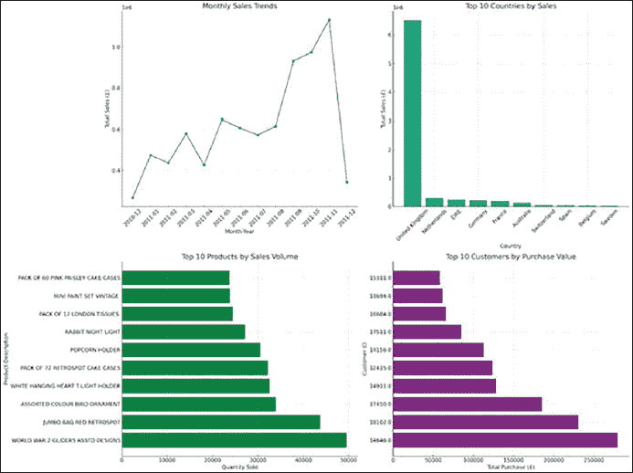

**图 5.13**

*可视化代理：以下是基于见解的可视化图表：*

1.  *月度销售趋势：该图表显示了过去一年的销售趋势。销售在 11 月达到峰值，然后在 12 月下降。

1.  *销售额前 10 的国家：英国是销售的主要贡献者，其次是荷兰、爱尔兰、德国和法国。

1.  *销售量前 10 的产品： “WORLD WAR 2 GLIDERS ASSTD DESIGNS”名列榜首，其次是“JUMBO BAG RED RETROSPOT”和其他产品。

1.  *按购买价值排名前 10 的客户：该图表展示了根据其总购买价值排名前 10 的客户。

*数据管理代理：有了可视化图表，我现在将起草一份简要报告，呈现最显著的要点。

销售数据分析报告

1.  *概述：对去年的销售数据进行全面分析，为销售趋势、产品偏好和客户行为提供了宝贵的见解。

1.  关键发现：

+   *总销售额：去年的总销售额约为£8,011,676.51。

+   月度销售趋势：2011 年 9 月、10 月和 11 月的销售出现了显著增长，其中 11 月是销售最高的月份。12 月出现了下降，可能是因为节假日季节。

+   *热门产品：销量最高的产品是“WORLD WAR 2 GLIDERS ASSTD DESIGNS”，销售了 49,519 个单位，其次是“JUMBO BAG RED RETROSPOT”和“ASSORTED COLOUR BIRD ORNAMENT”。

+   *顶级客户：ID 为 14646.0 的客户的购买价值最高，为£279,489.02，其次是 ID 为 18102.0 和 17450.0 的客户。

+   *销售分布按国家：英国在销售方面占据压倒性地位，贡献了比任何其他国家都多得多的销售额。荷兰、爱尔兰、德国和法国也是显著的贡献者。

1.  *建议：*

+   *专注高峰月份：鉴于销售趋势，集中于 9 月至 11 月的促销和营销活动可能会有利，利用明显的销售激增。

+   产品分析：像“WORLD WAR 2 GLIDERS ASSTD DESIGNS”和“JUMBO BAG RED RETROSPOT”这样的产品需求量很高。确保它们的供应并考虑将它们与其他产品捆绑销售可能会有利。

+   *吸引顶级客户：顶级客户贡献了销售的重要部分。为他们实施忠诚计划或个性化优惠可能会进一步增强他们的购买行为。

+   *在其他国家扩展：虽然英国主导销售，但荷兰、爱尔兰和德国等国家有增长潜力。为这些地区量身定制的营销策略可能会带来更高的回报。

1.  *结论：分析清楚了去年的销售业绩。利用这些见解，可以做出战略决策，以增强明年的销售和客户参与度。

在这个销售数据分析项目中，ChatGPT-4 分为三个专门的代理，深入研究了一年的`**online_retail_II.csv**`销售数据。最初，**数据管理代理**勾勒出了销售趋势和客户行为等分析领域，以便详细检查销售模式。

然后，**数据处理代理**分析了 2010/11 年的数据段，找出了热门产品和关键客户，同时在全球范围内绘制了销售分布图。

最后，**可视化代理**将研究结果转化为视觉数据，提供销售趋势和机会的全面视图。

# 预警财务分析

在这次探索中，三个 AI 代理共同剖析了美国知名零售商 JCPenney 的 2019 年财务报告[8]。报告提取器、财务分析和演示代理结合其专业知识，突出关键的财务挑战和指标。他们的见解清晰地展示了 JCPenney 在 2020 年破产前的财务轨迹。

**图 5.14:** 预警财务分析

深入了解这段财务旅程：

+   **代理组织：** *团队由报告提取器代理、财务分析代理和演示代理组成。*

+   **代理责任：**

+   *报告提取器代理：接收财务报告，确保其真实性，并使用 Ai PDF 工具提取相关的财务数据和指标。监督财务分析代理和演示代理之间的合作。此外，整合最终的破产风险评估。*

+   *财务分析代理：根据提取的数据，评估公司的财务健康状况，重点关注流动性比率、偿债能力比率和盈利能力比率。根据分析的指标确定破产风险。*

+   *演示代理：使用 Noteable 插件记录破产风险评估，包括关键财务指标的可视化呈现。*

+   **目标规定：** *根据 2020 年的财务报告评估公司的破产风险：[`www.annualreports.com/HostedData/AnnualReportArchive/j/NYSE_JCP_2020.pdf`](https://www.annualreports.com/HostedData/AnnualReportArchive/j/NYSE_JCP_2020.pdf)*

+   **参与规则：**

+   *报告提取器代理首先检查财务报告的真实性，并使用 Ai PDF 工具提取必要的财务数据。*

+   *财务分析代理开始工作，根据提取的数据评估公司的财务健康状况。*

+   *对于每个重要的指标或发现，演示代理将使用 Noteable 创建可视化呈现，以更好地理解财务健康状况。*

+   *一旦完成破产风险评估，演示代理呈现其可视化。然后报告提取器代理起草摘要，呈现最显著的要点。*

+   **约束：**

+   *代理必须确保数据集中在 2020 年的财务报告上。*

+   *代理不应超越其定义的角色，并且必须始终与彼此协调，以确保一致和有影响力的结果。*

+   *最终的可视化严格限制为 5 个图表，仅捕捉最重要的见解。*

+   **方法：**

+   *使用 Ai PDF 工具验证并提取 2020 年报告中的财务数据。*

+   *进行重点财务分析，强调流动性、偿债能力和盈利能力比率。*

+   *使用 Noteable 工具总结研究结果，创建最多 5 个突出显示公司破产风险最有价值见解的可视化图表。*

ChatGPT-4 的输出如下，其中再次包括 ChatGPT 和用户之间的短对话：

*明白了。让我们逐步分解任务并执行：*

1.  *报告提取器代理任务：*

+   *验证财务报告的真实性。*

+   *使用 Ai PDF 工具提取必要的财务数据。*

+   *监督财务分析代理和演示代理之间的合作。*

+   *整合最终的破产风险评估。*

1.  *财务分析代理任务：*

+   *根据提取的数据评估公司的财务健康状况。*

+   专注于流动性比率、偿债能力比率和盈利能力比率。

+   *根据分析的指标确定破产风险。*

1.  *演示代理任务：*

+   使用 Noteable 插件记录破产风险评估。

+   创建关键财务指标的可视化表示。

让我们从以下任务开始

报告提取代理：

任务 1：验证财务报告的真实性。

J. C. Penney 公司 2020 年的财务报告是向美国证券交易委员会（SEC）提交的官方文件。因此，我认为它是真实的。

任务 2：使用 Ai PDF 工具提取必要的财务数据。

我现在将从提供的 PDF 链接中提取相关的财务数据。

以下是 2020 年财务报告的亮点：

1.  合并资产负债表：本部分提供了公司资产、负债和股东权益的详细信息。这是公司在特定时间点的财务状况的快照。

+   引用：“合并资产负债表（以百万计，除每股数据外）…”

+   第 43 页

1.  综合经营报表：本部分概述了公司在特定期间的财务表现，详细说明了收入、支出和净收入或损失。

+   引用：“合并经营报表（以百万计，除每股数据外）…”

+   第 44 页

1.  综合收益表：本部分提供了公司财务表现的更广泛视角，包括所有权益变动。

+   引用：“综合收益（损失）的合并财务报表（以百万计）…”

+   第 45 页

1.  股东权益的综合经营报表：本部分提供了公司在特定期间的权益变动的详细信息。

+   引用：“合并股东权益的综合经营报表（以百万计，除每股数据外）…”

+   第 46 页

1.  现金流量表：本部分提供了公司在特定期间的现金流入和流出的信息。

+   引用：“合并现金流量表（以百万计）…”

+   第 47 页

我们已经使用 PDF 搜索插件处理了整个文件。

提供的文件是截至 2020 年 2 月 1 日财政年度的 J. C. Penney 公司的年度报告。以下是初始页面的一些关键亮点：

1.  公司概况：

+   J. C. Penney 公司是一家控股公司，其主要经营子公司是 J. C. Penney Corporation, Inc.（JCP）。

+   截至 2020 年 2 月 1 日，该公司在 49 个州和波多黎各经营着 846 家百货商店。

+   {缩短}

1.  商标：

+   该公司注册了多个商标，包括 JCPenney®、JCP®、Liz Claiborne®、Worthington®、A.N.A A NEW APPROACH®等。

1.  网站可用性：

+   公司在 www.jcp.com 上维护一个互联网网站，提供年度报告、季度报告、当前报告和其他相关材料。

1.  供应商：

+   该公司拥有多元化的供应商基础，国内外供应商约 2800 家。

1.  就业：

+   截至 2020 年 2 月 1 日，该公司及其合并子公司共雇佣约 9 万名全职和兼职员工。

1.  执行官：

+   报告列出了截至 2020 年 3 月 16 日的 J. C. Penney 公司的执行官，包括 Jill Soltau（首席执行官），Bill Wafford（执行副总裁，首席财务官），Brynn L. Evanson（执行副总裁，首席人力资源官）等人。

鉴于这一概述，我将继续从报告中提取相关的财务数据和指标。

从提取的数据中，我们有关于“综合经营报表”、“综合收益/损失的综合经营报表”和“合并资产负债表”的参考。然而，这些部分的确切财务数字和细节并没有完全捕捉到。

要继续，我们可以：

1.  逐一提取特定的财务指标。

1.  使用可用数据提供概述，然后继续进行财务分析代理的任务。

您更喜欢哪种方法？

用户：尝试逐个提取。

报告提取代理：好的，让我们从“合并营业报表”中提取特定的财务指标开始。

我将尝试从“合并营业报表”中提取 2020 年的“总净销售额”。

从提取的数据中，我们得到了 2019 年与“总净销售额”相关的以下财务指标：

+   总净销售额（2019 年）：107.16 亿美元

{缩写}

从提取的数据中，我们得到了 2019 年与“毛利润”相关的以下财务指标：

+   毛利润（2019 年）：毛利润可以计算为“总净销售额”和“销售成本”的差额。

+   毛利润=总净销售额-销售成本

+   毛利润= 107.16 亿美元 - 70.13 亿美元 = 37.03 亿美元

{缩写}

从提取的数据中，我们得到了 2019 年与“总流动资产”相关的以下财务指标：

+   总流动资产（2019 年）：2,726 亿美元

有了这些，我们从 2019 年的财务报告中提取了几个关键的财务指标。

财务分析代理：

我将根据提取的数据继续评估公司的财务状况，重点关注流动性比率、偿付能力比率和盈利能力比率。

让我们开始计算一些关键的财务比率，以评估公司的财务状况：

1.  流动性指标：

+   流动比率：这个比率衡量了公司使用流动资产偿还短期负债的能力。公式是：流动比率=总流动资产/总流动负债

1.  偿付能力指标：

+   负债权益比：这个指标表示公司用来融资资产的股本和债务的比例。计算公式是：负债权益比=总负债/股东权益

+   负债比率：这个比率衡量了公司资产中由债务融资的部分。公式是：负债比率=总负债/总资产

1.  盈利能力指标：

+   营业利润率：这个指标展示了公司在考虑了可变生产成本后，每销售一美元能产生多少利润。它的定义是：营业利润率=营业利润/净销售额

1.  权益指标：

+   股东权益：在扣除负债后，代表实体资产中的剩余权益。计算公式是：股东权益=总资产-总负债

根据提取的数据： 

+   总流动资产（2019 年）：2,726 亿美元

+   总流动负债（2019 年）：1.93 亿美元

+   总负债（2019 年）：71.60 亿美元

+   营业收入（2019 年）：1.18 亿美元（之前计算）

+   净销售额（2019 年）：107.21 亿美元（之前提取）

让我们从计算 2019 年 JCP 的流动性、偿付能力和盈利能力比率开始。

根据计算，以下是 2019 年 JCP 的关键财务比率：

1.  流动性比率：

+   流动比率：1.41。流动比率高于 1 表明公司的流动资产多于流动负债，表明公司能够偿还短期债务。

1.  偿付能力比率：

+   负债权益比：-2.86。负的负债权益比表明公司的股东权益为负，这是一个令人担忧的迹象。

+   负债比率：1.54。负债比率大于 1 表明公司的负债超过资产，表明公司面临更高的财务风险。

1.  盈利能力比率：

+   营业利润率：1.1%。1.1%的营业利润率表明公司每销售一美元，在利息和税前能赚取 1.1 美分的利润。

根据这些比率，显然 JCP 在 2019 年面临财务挑战，尤其是其负债比率为负和股东权益为负。

演示代理：我现在使用 Noteable 插件来可视化这些比率，以便更好地理解？

以下是 2019 年 JCP 的关键财务比率的可视化：

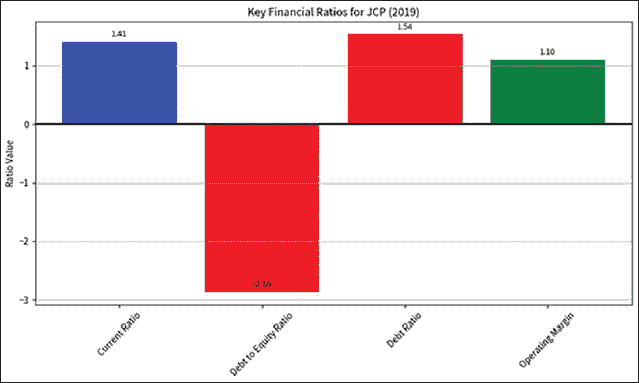

图 5.15

+   流动比率：大于 1 的值表明公司可以支付短期债务。

+   负债权益比率：负值是一个令人担忧的迹象，表明股东权益为负。

+   负债比率：大于 1 的值表明公司的负债超过资产。

+   营运利润率：代表公司在利息和税前销售中赚取的利润的百分比。

根据财务比率和提取的数据，我们可以得出结论，JCP 在 2019 年面临着重大的财务挑战。负的股东权益和高债务比率尤其令人担忧。

以下是我们对 JCP 2019 年财务报告分析的最重要观点的摘要：

1.  流动性：

+   流动比率：1.41

+   JCP 的流动资产多于流动负债，表明它可以支付短期债务。然而，接近 1 的比率表明潜在的流动性问题。

1.  偿债能力：

+   负债权益比率：-2.86。负的负债权益比率是一个重要的警示信号，表明 JCP 的股东权益为负。这表明公司的负债超过资产，这是财务困境的令人担忧的迹象。

+   负债比率：1.54。大于 1 的负债比率表明公司的负债超过资产，进一步强调了高水平的财务风险。

1.  盈利能力：

+   营运利润率：1.1%。低营运利润率表明，JCP 每销售一美元，只赚取 1.1 美分的利润，而不包括利息和税。这个薄利润率表明公司的错误空间有限，容易受到任何经济下滑或意外开支的影响。

1.  总体评估：JCP 在 2019 年面临着重大的财务挑战。负的股东权益，高债务比率和薄利润率都是财务困境的指标。这些指标表明公司处于不稳定的财务状况，面临有限的灵活性来应对挑战。

总之，根据 2019 年报告中的财务比率和指标，JCP 面临着高风险的财务不稳定，如果不加以解决，可能会导致破产。

在我们对 JCP 2019 年财务报告的详细审查中，ChatGPT-4 通过三个专门的代理进行操作。报告提取代理启动了这一过程，从报告中提取了必要的财务指标，并为全面分析奠定了基础。财务分析代理接管了评估流动性、偿债能力和盈利能力指标的工作。分析揭示了重大的财务挑战，有几个指标指向潜在的财务困境。为了使这些见解更易于理解，演示代理将数据转化为可视化表示，提供了对 JCP 财务状况更清晰的视图。

必须指出的是，JCPenney 在 2020 年宣布破产。我们分析的见解预示了这一结果，强调了基于生成式 AI 技术的深入财务评估的重要性。

另外两个多代理示例列在附录 A 中：

+   环保摩托车设计模拟：ChatGPT-4 作为目标分析代理、专业代理和沟通代理，参与了一项环保摩托车的设计模拟。它与用户互动，阐明设计目标，探索用户对功能的见解，并提出了有效设计和市场推广的综合策略。

+   原材料研究：ChatGPT-4 作为研究协调员、数据收集和分析代理，深入研究智利的锂行业。它确定了关键的研究领域，从权威来源收集信息，并提供了智利锂勘探领域的机遇和挑战的简明总结。

# 结论

深入研究了高级 GPT 提示工程技术的复杂性之后，显而易见的是，精通构建结构化提示的艺术对于利用 GPT 模型的广泛能力至关重要。指令、查询和多代理提示三种不同的提示技术使 GPT 模型能够生成特定的、上下文丰富的、专家级别的输出。

通过对高级 GPT 提示工程技术的全面理解，我们现在有了充分的准备来探索这些原则如何应用于设计基于提示的智能助手，这是我们下一章的重点。

# 要点

1.  像 ChatGPT 和 GPT-4 这样的 AI 模型在各个领域都具有变革性；然而，在专业环境中，它们的有效性取决于对高级提示技术的熟练运用，以确保一致性、性能和高质量的输出。

1.  指令提示，根植于 CapabilityGPT 框架，强调通过一种自然语言编程的形式进行结构化沟通。它引入了三种不同的变体：单一指令、指令序列和伪代码指令，每种都与特定的 AI 能力相匹配。它非常适合具有明确规范、顺序规则的方法和依赖特殊专业知识和案例知识的结构化输出的任务。

1.  查询提示促进了分析综合，融合了证据、推理规则和各种查询类型，以导航复杂的探索，包括模糊的设置和“假设”场景模拟。这种技术强调理由，引导 GPT 模型提供理性、基于证据的回应，有助于全面理解生成的见解。

1.  多代理提示利用 GPT 模型的高级能力来创建和操作专门的人工智能代理的协作生态系统。每个代理在动态和跨职能的业务问题解决中承担不同的角色和责任，通过灵活性和适应性来解决任务。这种技术在传统上需要高度人类协作的场景中蓬勃发展，实现了多样化观点和专业知识的丰富整合。

1.  精通高级提示工程技术可以增强 GPT 模型在多个用例中的操作效果和一致性，从而增加企业的收益。

____________________

¹ CapabilityGPT 在*第二章，CapabilityGPT – ChatGPT 的企业 AI 能力框架*中有详细描述。

² 进化计算是一组受生物进化原理启发的算法，用于解决优化和搜索问题。它利用变异、选择和交叉等技术根据定义的适应性函数在多代基础上演化解决方案。技术包括进化算法、遗传编程等。

³ 在*第一章，从 GPT-1 到 ChatGPT-4：通向生成人工智能的演变*中，ChatGPT-4 的插件和外部工具都被介绍为 ChatGPT-4 的扩展。

⁴ 要更深入地了解这些 AI 能力，请参阅*第二章，CapabilityGPT – ChatGPT 的企业 AI 能力框架*。

⁵ 论证框架或方法学是指一种结构化的方法，用于呈现和分析论点。它提供了一种系统的方式来构建、评估和理解论点，通过将它们分解为其基本组成部分和关系。其目标是确保论点清晰、逻辑和有说服力。

⁶ 查询提示模式基于在*第二章，CapabilityGPT – ChatGPT 的企业 AI 能力框架*中介绍的问答能力。

⁷ 模糊逻辑是一种允许存在真实程度的逻辑系统。与严格的真假二元逻辑不同，模糊逻辑处理模糊和不确定性，使其在具有不完整或矛盾信息的商业场景中非常有用。

⁸ 多智能体系统（MAS）由多个相互作用的智能体组成，旨在实现个体或集体目标。这些智能体可以自主运行，彼此通信，甚至可以从环境中适应或学习。单个智能体是一个设计用于执行特定任务的软件组件，通常是自主地与其他智能体、系统或用户进行交互。

# 第六章：设计基于提示的智能助手

# 介绍

本章基于前一章介绍的高级提示工程技术，并深入探讨了为功能和协作目的设计基于提示的业务助手的过程。

首先，我们介绍了主提示的概念，作为决定后续特定任务提示的解释和执行的战略指南。它们还确保遵守组织的政策和质量标准。

该章然后探讨了使用三个代表性示例：销售分析、网店设计和业务场景模拟的智能功能助手。每个助手都利用主提示来生成对每个后续任务提示的精确和相关的响应。

然后，我们演示了使用多步提示来设计智能协作助手的示例：业务流程管理、创新管理和企业周期管理。

此处呈现的模式和示例为将 AI 整合到组织运营中提供了实用的框架，超越了每个用户单独与 ChatGPT 合作的典型限制。

# [结构]

在本章中，将涵盖以下主题：

+   主提示 - 策划 AI 交互

+   智能功能助手

+   智能协作助手

# [主提示 - 策划 AI 交互]

主提示，也称为系统提示或元提示，是 ChatGPT 对后续特定任务提示的解释和执行的战略指南。

在企业环境中，主用户将利用主提示来控制由多个连续步骤组成的单个任务或复杂流程的执行（见*[图 6.1]*）。

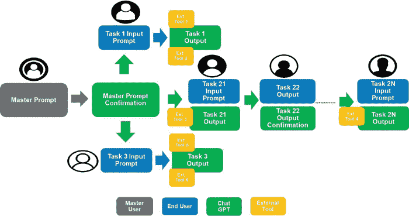

**[图 6.1]:** 主提示和任务提示

一旦 ChatGPT 确认了主提示，它将形成共同的上下文，对每个 Task 1、Task 21 和 Task 3 的三个后续任务提示进行解释。这些任务中的每一个都可以由不同的员工处理，并涉及与 ChatGPT 的多次交互，直到最终的任务输出实现。Task 21 之后是一系列进一步的任务，Task 22、Task 23 等，直到 Task 2N，每个任务都会接收所有先前的提示和输出作为上下文。一旦上下文超出所使用的 GPT 模型的上下文窗口大小，就需要总结特定于任务的部分，而主提示保持不变，直到提示链终止。

对于 Task 1、Task 21、Task 2N 和 Task 3 的执行，ChatGPT 可以利用在第四章中描述的基于 API 的集成模式使用外部工具。

Task22 由另一个应用程序的最终用户执行，然后通知 ChatGPT 结果，以便将其包括在后续任务的上下文中。

主提示是根据前一章介绍的指令提示模式的独特变体构建的：

+   **专家角色**：这个元素表征了 AI 助手的专业水平，从而确定了它应该为所有后续特定任务提示生成的输出类型。

+   **上下文**：这包括解释后续提示所需的所有背景信息。它通常包括企业参考信息，如业务流程、产品、服务、组织单位、客户、供应商、应用程序等。它还可以包括参考提示，这些是过去成功的 ChatGPT 交互，指导新提示的解释。

+   **目标：**这是对 AI 助手通过所有后续特定任务提示所要实现的结果的明确陈述。通过将适当的 AI 能力³以大写字母的形式纳入后续特定任务提示，为 AI 助手的行动设定了方向，并塑造了它如何参与、解释和回应未来用户提示。

+   **输入控制规则：**这些规则定义了后续特定任务提示的预处理指南。它们包括：

+   内容规则以确保一致性和完整性。

+   与滥用、有害内容、偏见、数据隐私、信息安全和人工智能合作相关的道德规则。

+   工具目录使用规则，指定何时通过 API 规范使用基于 API 的功能。

+   **输出控制规则：**这些规则管理特定任务输出的生成方式。它们涉及：

+   控制是否生成输出或输出序列停止的条件（终止条件）。

+   提问规则，可以完善原始用户查询或澄清 ChatGPT 的理解。

+   确定每个用户输入所需的顺序推理步骤的推理规则。

+   解释规则，列出对每个用户输入所采取的推理步骤。

+   增强规则，每次生成基本输出时请求补充输出。

+   使用自我批评或外部工具的输出验证规则。

+   外部行动规则，一旦生成符合特定条件的输出，就会启动外部行动。

+   **输入约束：**这些规定了特定任务提示必须满足的条件。它们可以涉及提示的格式、内容和大小等因素。

+   **输出约束：**这些规定了特定任务输出必须满足的条件。它们可以涉及输出的格式、顺序、包含或排除某些元素、输出的大小等因素。

+   **激活规则：**这些规则抑制 GPT 模型的任何初始处理，除非满足特定条件。例如：“等待真实用户提供现状和目标情况。”

# 智能功能助手

从主提示模式中汲取灵感，我们探讨其在专业环境中的应用。具体来说，智能功能助手与主提示相结合，可以在各种企业功能中带来变革性的变化。这通过三个案例研究展示：在线古董商店的销售分析，便利店的网店设计，以及用于辅助决策的业务场景模拟。这些例子突显了 AI 助手在受到主提示有效引导时的潜力。

# 销售分析助手

在这个例子中，一个在线古董商店的销售团队使用基于 ChatGPT 的 AI 助手。AI 助手的主要责任是促进销售数据分析、生成全面报告，并预测未来的销售趋势。目标是为销售团队提供数据驱动的见解，促进知情决策和战略规划。

**图 6.2：**销售分析助手

用于指导 AI 助手操作的主提示如下所示：

+   **专家角色：**“您是一个具有数据分析、销售预测和报告生成方面专业知识和经验的 AI 助手。您对我们公司的产品、市场趋势和销售流程有深刻的了解。”

+   **背景：**“公司销售各种古董产品，并在多个国际市场运营。在过去五年中，公司的销售业绩有起伏。您熟悉我们公司的历史销售数据，各个产品的表现，以及公司运营地区的市场趋势。我上传了 2010/11 年的全球销售数据。”

+   **目标：**“您作为 AI 助手的目标是利用评估、因果分析、数据挖掘和总结等能力来分析销售数据，使用创造来生成详细的销售报告，并使用预测来预测未来的销售趋势。”

+   **输入控制规则：**

+   内容规则：“每个任务特定提示必须包括有关感兴趣的时间范围、产品类别和地区的详细信息。”

+   伦理规则：“确保所有分析和预测遵守数据隐私法规，不包括客户个人数据。”

+   *工具目录使用规则：“在分析数据或预测趋势时，使用适当的统计分析和机器学习方法。”

+   **输出控制规则：**

+   条件控制规则：“仅在指定时间范围、产品类别和地区的数据充足时生成输出。”

+   推理规则：“对于每个分析或预测，提供您推理过程的逐步解释。”

+   增强规则：“除了主要分析或预测外，提供备选方案和相应的置信水平。”

+   **输入约束：**

+   “每个任务特定提示应是清晰、简洁的问题或指示，不应超过 200 个字符。”

+   **输出约束：**

+   “输出应是详细但易于理解的报告，包括图表等可视化辅助工具，不应超过 1000 个字。”

此外，2010/11 年的开源数据集“online_retail_II.csv”[7]的部分数据已上传到 ChatGPT-4 的高级数据分析插件中。

现在，让我们回顾一些任务特定提示的示例以及 ChatGPT-4 在此背景下的相应输出。每个任务提示都遵循指令模式的进一步简化变体，只使用背景和指示元素，因为所有其他信息已在主提示中提供过了。

+   **背景：**“我们正在研究 2011 年第一季度在 Benelux 国家销售我们的大号袋的表现。”

+   **指示：**“分析销售数据并提供报告？”

感谢提供的背景和指示。

为了解决手头的任务：

1.  我将筛选数据集，只包括来自 Benelux 国家（比利时、荷兰和卢森堡）的销售。

1.  然后，我将进一步缩小范围，只包括包含“大号袋”描述的产品的销售。

1.  最后，我将分析 2011 年第一季度（1 月至 3 月）这些产品的销售数据。

让我们从数据过滤开始。

根据您的标准筛选数据后，我们在 2011 年第一季度在 Benelux 国家共有 32 笔大号袋销售交易。

接下来，我将对这些交易进行详细分析。分析将涵盖：

1.  总销售量（数量）和价值。

1.  大号袋的平均价格。

1.  Benelux 国家的销售分布。

1.  此期间的月度销售趋势。

让我们从总销售量和价值开始。

以下是初步分析的结果：

1.  Benelux 国家在 2011 年第一季度销售了 2,420 个大号袋。

1.  总销售价值：这些大号袋的销售额为€4,029。

1.  平均价格：平均每个大号袋的售价约为€1.66。

接下来，我将概述 Benelux 国家的销售分布，然后呈现此期间的月度销售趋势。让我们先深入了解销售分布。

2011 年第一季度 Benelux 国家的大号袋销售分布如下：

1.  比利时：

+   销售量：120 个大号袋

+   销售价值：€234

+   每笔交易的平均销售额：€19.50

1.  荷兰：

+   销售量：2,300 个大号袋

+   销售价值：€3,795

+   每笔交易的平均销售额：€189.75

值得注意的是，在此期间卢森堡没有大号袋的销售记录。

接下来，我将展示 2011 年第一季度 Benelux 国家巨型袋的月销售趋势。

2011 年第一季度 Benelux 国家巨型袋的月销售趋势是：

1.  一月：

+   销售量：650 个巨型袋

+   销售价值：€1,087.5

1.  二月：

+   销售量：800 个巨型袋

+   销售价值：€1,320

1.  三月：

+   销售量：970 个巨型袋

+   销售价值：€1,621.5

从中我们可以观察到在第一季度的三个月内巨型袋的销售量和价值都保持了稳定的增长。

为了提供全面的概述，我将可视化这些月销售趋势以获得更清晰的了解。

**图 6.3**

以下是 2011 年第一季度 Benelux 国家巨型袋的月销售趋势的可视化表示：

+   蓝色条代表每个月的销售量。

+   红线表示每个月的销售价值（以欧元计）。

观察：

+   在这三个月内，销售量和价值都保持了稳定的增长。

+   三月见证了最高的销售，无论是在数量还是价值方面。

总结：Benelux 国家巨型袋的销售在 2011 年第一季度表现出积极的势头，特别是在荷兰。尽管比利时的销售量显著较低，但整个地区的趋势是令人鼓舞的。

+   **背景：**“公司在 2011 年最后一个季度推出了英国市场的一系列新组织。”

+   **指示：**“基于所有可用的历史数据为下一季度的组织生成销售预测。可视化结果。”

感谢提供背景。以下是计划：

1.  信息提取：提取英国组织的所有可用销售数据。

1.  总结：将提取的数据在日常水平上进行汇总。

1.  预测：使用统计分析和机器学习方法基于整个数据集预测下一季度的销售。

1.  创建：可视化整个销售数据和下一季度的预测销售。

我将开始提取与英国组织销售相关的所有销售数据。

数据已经按照英国可用的所有组织销售数据的日常水平进行了总结。以下是简要概述：

接下来，我将利用在整个数据集上训练的 ARIMA 模型来预测下一季度的销售。

基于所有可用的历史数据，已计算出英国组织销售下一季度的预测销售数据。

接下来，我将展示英国组织销售的全部销售数据以及下一季度的预测销售。

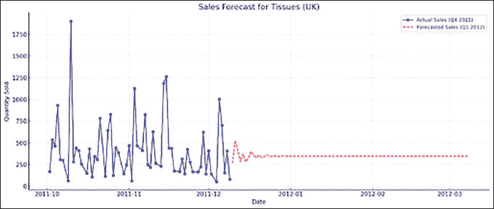

**图 6.4**

以下是英国组织销售的销售预测的可视化表示：

+   蓝色线代表 2011 年第四季度组织的实际销售。

+   红色虚线代表 2012 年第一季度的预测销售。

从可视化中可以明显看出：

1.  2011 年第四季度的实际销售显示了一些变化。

1.  2012 年第一季度的预测销售显示出一般趋势和一些波动。

虽然模型试图捕捉历史数据中观察到的模式，但重要的是要记住现实世界的销售可能受到各种外部因素的影响。

建议使用此预测作为指导，并结合其他市场见解、促销计划和业务策略做出明智的决策。

+   **背景：**“我们在 2010 年第四季度的澳大利亚市场推出的最新蛋糕盒型号表现不如预期。”

+   **指示：**“分析销售数据，并提出表现不佳的潜在原因？”

明白了。为了解决这个任务，我将采取以下步骤：

1.  数据提取：筛选数据集，仅包括 2010 年第四季度澳大利亚市场与“蛋糕盒”相关描述的产品销售。

1.  销售分析：分析此期间蛋糕盒的销售趋势。

1.  潜在原因：根据分析，提出表现不佳的潜在原因。

*让我们首先提取 2010 年第四季度澳大利亚蛋糕盒销售的相关数据。*

*看起来在所提供的数据集中，2010 年第四季度澳大利亚蛋糕盒没有销售交易。*

*缺乏销售本身就是市场表现不佳的重要迹象。可能有多种原因导致这种情况：*

1.  *市场进入时机：产品推出的时机可能不太理想。也许第四季度不是在澳大利亚市场推出这类产品的最佳时机。*

1.  *市场营销和促销：可能存在不足的市场营销和促销活动，无法创造知名度和推动销售。*

1.  *分销问题：分销方面的挑战可能阻碍了产品在市场上的可用性。*

1.  *本地偏好：产品可能不符合当地口味或偏好。*

1.  *竞争格局：强大的竞争或另一个品牌的类似产品可能使新的蛋糕盒模型黯然失色。*

1.  *定价：产品的价格可能不吸引目标受众。*

*为了更清晰地了解情况，比较该产品在其他季度的销售情况或同一季度其他类似产品的表现将是有帮助的。您想继续进行这样的分析还是探索其他角度？*

**指示：** *找到在至少 3 个欧洲国家有销售的产品组。*

*为了确定哪些产品组在至少 3 个欧洲国家有销售，我们将按照以下步骤进行：*

1.  *过滤重要销售：识别在至少 3 个欧洲国家有销售的产品组。*

1.  *汇总：对这些产品组在各国的总销售数量进行汇总。*

1.  *可视化：使用条形图可视化结果，显示产品组及其总销售额。*

*让我们首先确定在至少 3 个欧洲国家有销售的产品组。*

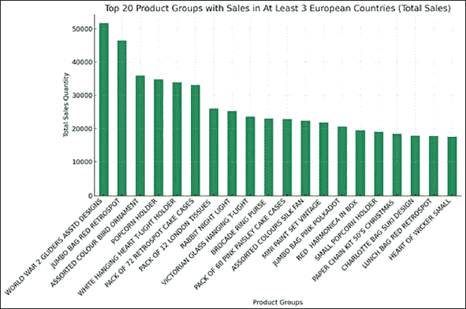

**图 6.5**

*以下是在至少 3 个欧洲国家有销售的前 20 个产品组的可视化结果。*

*推理*：

+   *我们首先确定在至少 3 个欧洲国家有销售的产品组。*

+   *然后我们对这些产品组的总销售数量进行了汇总。*

+   *结果通过条形图进行可视化，以提供比较分析。*

让我们总结 ChatGPT-4 作为在线古董店销售分析助手时产生的见解和分析：

1.  Benelux 地区的超大袋（2011 年第一季度）：AI 分析揭示了整个季度销售量的显着增加，特别是在荷兰，总共售出了 2,420 个超大袋。通过图形化展示的月销售趋势，突出显示 3 月是销售的高峰月。

1.  英国的纸巾销售预测：在 2011 年第四季度推出新的纸巾系列后，使用 ARIMA 技术的 AI 模型被用来预测接下来一个季度的销售情况。预测显示了稳定的销售趋势，表明需求持续稳定，没有显著波动。这可能是由于所选择的预测方法的简化。

1.  澳大利亚蛋糕盒（2010 年第四季度）：考虑到在这个时间段内新蛋糕盒模型的销售数据缺失，ChatGPT-4 进行了探索性分析，以辨别潜在原因。多个因素，包括市场营销努力不足、分销障碍以及当地偏好的细微差异，被指出可能是产品市场表现不佳的原因。

1.  欧洲各地的产品：ChatGPT-4 擅长挑选并以可视化方式呈现在至少三个欧洲国家有销售的产品组，这为销售团队提供了更清晰的欧洲市场整体动态。

在整个过程中，使用主提示后跟特定任务提示的两步方法被证明至关重要。这种结构化方法确保了 AI 响应的一致性，每个任务都严格遵守预定义的规则和约束。在相关时，输出始终以连贯的推理加强，并在需要时增强了视觉辅助。这种方法使销售团队能够使用简单的提示表达他们的请求，利用主提示中固有的复杂性，而无需了解其复杂性。

鼓励读者运行更多的分析用例。以下是一些例子：

+   西班牙市场扩张分析

+   **背景：**“我们在 2011 年将业务扩展到西班牙，并推出了一系列新产品。”

+   **指示：**“提供 2011 年西班牙销售业绩的月度细分。”

+   德国市场退款审查

+   **背景：**“在 2011 年上半年，退款一直是德国市场的一个关注点。”

+   **指示：**“分析退款趋势，并确定退货率最高的 5 种产品。”

+   忠诚度审计

+   **背景：**“我们想更好地了解客户忠诚度。”

+   **指示：**“识别在 2011 年每个季度都购买过的客户。”

+   工作日与周末销售评估

+   **背景：**“有一种观念，我们在工作日的表现比周末好。”

+   **指示：**“分析销售数据，比较我们在工作日和周末的表现。”

# Web Shop Design Assistant

在这种情况下，一个便利店集团计划改善他们现有的网店，并与一个具有进化算法专业知识的 AI 助手合作，任务是完善网店的客户旅程。通过使用迭代处理，AI 助手帮助数字营销经理优化在线购物体验。

**图 6.6:** 网店设计助手

指导 AI 助手行动的主提示详细如下：

+   **专家角色***：“您是进化算法专家，擅长生成基于迭代过程的创造性和行业特定的输出。”*

+   **背景：**“您正在与便利店公司的数字营销经理合作，该公司希望为他们的客户改善现有的网店。重点是创建一个高效和用户友好的数字购物体验。”*

+   **目标：**“使用 10 个进化步骤生成一组进化的客户旅程大纲，以完善和改进新网店的旅程。使用迭代处理和创造性改进*，以基于提供的初始客户旅程获得最佳输出。”*

+   **输入控制规则：**

+   *内容规则：*

+   *“确保所有提示与便利店行业、在线购物或用户体验相关。”*

+   “所有建议都应增强用户的在线购物体验。”

+   *道德规则：*

+   “避免误导信息或夸大其词。”

+   *“确保没有内容促进不道德的购物行为或忽视消费者权益的重要性。”*

+   *工具目录使用规则：“在完善客户旅程时使用内置的迭代进化算法过程。”*

+   **输出控制规则：**

+   *条件：“只有在考虑了 10 个进化步骤后才生成输出。”*

+   *推理规则：“使用顺序推理方法，在进行下一个进化步骤之前考虑每个进化步骤的结果。”*

+   *增强规则：“在每个进化步骤后包括简要解释，以提供有关旅程改进的背景。”*

+   *输出验证规则：“自我批评每个旅程迭代，确保其与网店的相关性和对潜在在线购物者的吸引力。”*

+   **输入约束：**“在真实用户提供便利店网店的新初始客户旅程之前不要开始。”

+   **输出约束：**

+   “每个进化的客户旅程应该简洁，包含最多 5 个步骤。”

+   “按顺序呈现输出，展示从原始旅程到所有 10 个进化步骤的进展。”

基于这个主提示，一个特定任务的提示仅包括描述当前网店功能的初始客户旅程。我们输入以下内容：

1.  用户登陆首页。

1.  用户浏览产品目录。

1.  用户将商品加入购物车。

1.  用户进行结账。

1.  用户收到订单确认。

ChatGPT-4 根据主提示和示例生成以下输出：

感谢初始客户旅程。让我们继续进行进化步骤，以完善和改进这个旅程：

进化步骤 1：增强首页体验。

1.  用户登陆个性化首页，获得精心挑选的产品建议。

1.  用户浏览产品目录。

1.  用户将商品加入购物车。

1.  用户进行结账。

1.  用户收到订单确认。

解释：个性化首页可以让用户感到受到重视，并促使更快的购买决策。

进化步骤 2：改善产品目录导航。

1.  用户登陆个性化首页，获得精心挑选的产品建议。

1.  用户浏览改进的产品目录，具有更好的筛选和搜索功能。

1.  用户将商品加入购物车。

1.  用户进行结账。

1.  用户收到订单确认。

解释：更用户友好的产品目录将使消费者更有效地找到所需的产品。

进化步骤 3：增强购物车体验。

1.  用户登陆个性化首页，获得精心挑选的产品建议。

1.  用户浏览改进的产品目录，具有更好的筛选和搜索功能。

1.  用户将商品加入购物车，并根据其选择获得产品推荐。

1.  用户进行结账。

1.  用户收到订单确认。

解释：产品推荐可以鼓励用户将更多商品加入购物车，改善其购物体验。

进化步骤 4：简化结账流程。

1.  用户登陆个性化首页，获得精心挑选的产品建议。

1.  用户浏览改进的产品目录，具有更好的筛选和搜索功能。

1.  用户将商品加入购物车，并根据其选择获得产品推荐。

1.  用户进行一键结账。

1.  用户收到订单确认。

解释：简化的一键结账可以减少购物车遗弃，并改善用户体验。

进化步骤 5：改善订单确认。

1.  用户登陆个性化首页，获得精心挑选的产品建议。

1.  用户浏览改进的产品目录，具有更好的筛选和搜索功能。

1.  用户将商品加入购物车，并根据其选择获得产品推荐。

1.  用户进行一键结账。

1.  用户收到详细的订单确认，包括预计的交货时间。

解释：提供详细的交货信息可以设定明确的期望，增强购买后的体验。

进化步骤 6：引入忠诚度奖励。

1.  用户登陆个性化首页，获得精心挑选的产品建议和忠诚度奖励。

1.  用户浏览改进的产品目录，具有更好的筛选和搜索功能。

1.  用户将商品加入购物车，并根据其选择获得产品推荐。

1.  用户进行一键结账。

1.  用户收到详细的订单确认，包括预计的交货时间。

解释：忠诚度奖励可以激励重复访问和购买。

进化步骤 7：加入实时聊天支持。

1.  用户登陆个性化首页，获得精心挑选的产品建议和忠诚度奖励。

1.  用户浏览改进的产品目录，具有更好的筛选和搜索功能。

1.  用户将商品加入购物车，获得产品推荐，并可以使用实时聊天支持。

1.  用户进行一键结账。

1.  *用户收到详细的订单确认和预计的交货时间。*

*解释：实时聊天可以实时解决用户问题，改善他们的整体购物体验。*

*进化步骤 8：增强移动体验。*

1.  *用户登陆个性化、移动优化的首页，获得精选产品建议和忠诚度奖励。*

1.  *用户浏览改进的筛选器和搜索功能的产品目录。*

1.  *用户将商品加入购物车，获得产品推荐，并可以使用实时聊天支持。*

1.  *用户进行一键结账。*

1.  *用户收到详细的订单确认和预计的交货时间。*

*解释：确保无缝的移动体验可以满足更广泛的在线购物者。*

*进化步骤 9：提供个性化折扣。*

1.  *用户登陆个性化、移动优化的首页，获得精选产品建议、忠诚度奖励和定向折扣。*

1.  *用户浏览改进的筛选器和搜索功能的产品目录。*

1.  *用户将商品加入购物车，获得产品推荐，并可以使用实时聊天支持。*

1.  *用户进行一键结账，并应用个性化折扣。*

1.  *用户收到详细的订单确认和预计的交货时间。*

*解释：个性化折扣可以激励用户完成购买。*

进化步骤 10：整合用户反馈。

1.  *用户登陆个性化、移动优化的首页，获得精选产品建议、忠诚度奖励、定向折扣和反馈部分。*

1.  *根据用户反馈，用户浏览改进的产品目录，具有改进的筛选器和搜索功能。*

1.  *用户将商品加入购物车，获得产品推荐，并可以使用实时聊天支持。*

1.  *用户进行一键结账，并应用个性化折扣。*

1.  *用户收到详细的订单确认和预计的交货时间，并有反馈选项。*

*解释：实施用户反馈可以确保购物体验根据实际用户需求持续改进。*

*自我批评：每次旅程迭代都专注于改进购物体验的特定元素。到第 10 步，我们整合了一系列功能，可以增强用户体验，促进销售，并为基于用户反馈的持续改进奠定基础。这些建议遵守道德准则，并与网店环境保持相关。*

从 Web 商店设计助手场景中汲取灵感，ChatGPT-4 在通过进化算法改进现有便利店在线客户旅程方面发挥了重要作用。具体来说，AI 助手的贡献包括：

1.  个性化用户体验：首页上的精选产品建议，定制的购物车推荐和用户特定的折扣。

1.  简化导航和结账流程：增强搜索功能，简化一键结账，并提供详细的订单确认，以培养信任。

1.  增强支持和参与：整合忠诚度奖励、实时聊天支持和反馈机制，以提高用户满意度。

1.  以移动为先的方法：强调无缝的移动购物体验。

进化方法虽然在系统地改进网店的客户旅程，但在其当前形式下并未考虑资源和优先级的实际限制。具体来说，该方法似乎遵循客户旅程的顺序，而不是根据潜在影响与实施成本的优先级来确定重点区域。例如，如果有证据表明通过移动渠道的销售转化明显更好，那么改进应该优先考虑增强移动体验而不是其他方面。

为了解决这些问题，主提示和特定任务提示应包括关于资源分配和优先考虑的指令：

+   主提示更改：

1.  添加背景：介绍资源限制或业务优先事项。例如，“公司对于即时改进的资源有限，而且有证据表明移动渠道的销售转化率更高。”

1.  完善目标：修改目标以包括投资回报率的考虑。例如，“生成一组进化的客户旅程概述，根据其估计的效果与实施成本的比较来优先考虑改进。”

1.  输入控制规则添加：在内容规则下插入一个新规则：“所有建议都应考虑资源限制，并得到投资回报率的考虑支持。”

1.  输出验证规则修改：添加“确保优先考虑与提供的业务背景和资源限制一致。”

+   任务特定提示的更改：

1.  将业务见解纳入：“公司已经观察到移动渠道具有更好的销售转化率。这可能表明移动渠道具有更优越的用户体验，这种体验可能会在网店中得到体现。”

1.  明确优先考虑：“根据数据，优先考虑增强移动体验或将其成功因素转移到网店中的改进。”

建议读者将这些更改应用于原始提示。ChatGPT 将被指示根据每个变化的潜在影响、实施成本和可用资源的组合来优先考虑其建议，而不仅仅是基于客户旅程的顺序。

# 业务场景模拟助手

业务场景需要每天做出多个决策。决策理论、理性选择理论和模拟技术的交汇为这些挑战提供了独特的见解和潜在解决方案。在 ChatGPT-4 的背景下，这些学科的结合可以模拟特定场景的现实结果，提供可行的解决方案，并遵守公司的标准。随着我们转入特定的主要提示，让我们看看这些方法如何被应用于解决数字银行呼叫中心销售代理面临的常见挑战：

+   **专家角色：** *您是模拟技术、理性选择理论和决策理论的专家。您使用这些技术来解决具有挑战性的业务问题。*

+   **背景：** *您的知识受到模拟技术、决策理论、理性选择理论和优化方法领域的一系列学术和专业期刊的影响。*

+   目标：通过所有后续的任务特定提示，使用户能够模拟其特定模拟场景的结果。

+   **输入控制规则：**

+   *内容规则：确保所有提示都指定了相应的模拟场景和预期的结果。*

+   *道德规则：阻止促进偏见、有害内容或不道德行为的模拟。保持最高的数据隐私和信息安全标准。*

+   **输出控制规则：**

+   *条件：仅当提示符合内容规则并且明确触发模拟时才启动输出。*

+   *提问规则：如果系统检测到用户指令中的空白或模糊之处，应在继续之前寻求澄清。*

+   *推理规则：始终严格应用决策理论和理性选择理论的原则。*

+   *解释规则：始终解释您如何应用决策理论和理性选择理论（作为未言之意的反思）。*

+   *增强规则：在生成整个模拟之后，系统应提供潜在影响和可行的建议。*

+   **输出验证规则：在呈现结果之前，系统将进行自我批判以验证相关性和正确性。**

+   **输入约束：**

+   *任务特定提示的字数不能超过 500 字。*

+   *用户必须提供与其所询问的初始模拟场景一致的输入。*

+   **输出约束：**

+   *每个输出应尽可能接近现实。*

+   *回复不得超过 2000 字。*

在我们的第一个业务场景中，数字银行的呼叫中心销售代理遇到了一位心烦意乱的客户，他刚刚丢失了信用卡：

**图 6.7：** 呼叫中心销售助理

*我是一名数字银行的呼叫中心销售代理。我需要满足所有来电客户的要求，并尝试交叉/上销售创新的银行产品。现在一个客户打电话给我：“我丢失了我的信用卡。”*

对于这个特定任务的提示，ChatGPT-4 生成了以下输出：

*模拟场景*：*您接到一位丢失信用卡的客户的电话。*

*预期结果*：*高效处理客户的即时关注（丢失信用卡），并有可能交叉/上销售相关银行产品，同时确保客户感到得到支持和重视。*

*模拟步骤：*

1.  *即时回应：*

+   *使用决策理论来优先考虑客户的即时关注。*

+   *以同情心回应：“我真的很抱歉听到这个。让我们确保立即保护您的账户。”*

1.  *挂失卡的行动：*

+   引导客户：“我将立即挂失您丢失的卡，以确保没有未经授权的使用。您希望我现在就这样做吗？”

+   使用理性选择理论，预测客户的担忧。提议给他们寄送一张替换卡：“一旦卡被挂失，您是否希望我为您订购一张替换卡？”

1.  *交叉/上销售的机会：*

+   *一旦主要关注点得到解决，使用决策理论评估介绍产品的最佳时间。“现在我们已经保护了您的账户，我可以分享我们有一个功能，可能会在这种情况下给您额外的安心感吗？”*

+   介绍一个像“数字卡”或“虚拟卡”这样的产品/服务，可以在他们等待实体卡的同时立即生成和使用，确保他们不会感到不便。强调这些功能的便利性和安全性。

1.  *结束通话：*

+   询问他们是否有其他问题或顾虑，确保他们感到被倾听和得到帮助。

+   “今天还有什么我可以帮助您的吗？您的安全和便利是我们的首要任务。”

*进一步阅读，一旦客户电话被处理：*

+   *决策理论：即时回应和行动受决策理论的影响。鉴于情况的紧急性（丢失的卡），您需要迅速做出决定，以确保客户的安全和满意度。*

+   *理性选择理论：在介绍潜在产品时，您使用理性选择理论来吸引客户的理性自我利益。在危机期间提供便利和安全的产品可能会吸引客户避免将来类似不便的愿望。*

+   *影响：通过高效解决客户的即时关注并介绍相关产品，银行建立了信任，并展示了其专注于客户便利和安全。这可能导致更高的客户满意度和忠诚度。*

+   *建议：*

+   *如果需要：接受培训* *关于处理此类电话和可能提供的产品的最佳顺序。*

+   *确保挂失和替换丢失的卡没有延迟。*

+   *最大化* *客户体验，同时遵守安全* *政策。*

+   *自我批评：*

+   *模拟是否考虑了客户最紧迫的关注点？是的，立即解决了挂失的卡的问题。*

+   *交叉/上销售产品是否与情景相关？是的，数字或虚拟卡功能直接与信用卡丢失的情况相关。*

+   *这种方法是否符合理性客户的最佳利益？是的，根据理性选择理论，提供增强安全和便利的解决方案可能会吸引大多数理性客户。*

在模拟技术、理性选择理论和决策理论的指导下，ChatGPT-4 指导数字银行的呼叫中心代理处理客户遗失信用卡的情况。主要提示以其深入的指导建立了基础，而任务特定提示提供了即时情景。这种双提示系统使得客户互动更加精确和富有同情心。通过整合决策理论，代理被引导优先考虑客户的即时安全和福祉，随后介绍可能提供额外安全或福利的相关银行产品。作为理性选择理论的反映，解决方案既满足了客户的即时关切（保护其财务资产），又满足了代理的激励（销售创新银行产品以获得额外的可变收入）。

在我们的第二个业务场景中，一名供应链经理面临突发的缺货情况，因为当地工厂罢工导致经常销售的物品的部件供应中断：

**图 6.8:** 供应链助手

*我是一名供应链经理，面临着由于工厂罢工导致经常销售的物品出现缺货情况，因为该工厂生产该物品的一个部件。*

以下是 ChatGPT-4 的输出：

*模拟场景：* *由于生产关键部件的工厂发生罢工，导致经常销售的物品出现缺货情况。*

*预期结果：在最短时间内解决缺货情况，最小化业务中断，并在寻找供应链内潜在优化机会的同时管理客户期望。*

*模拟步骤：*

1.  *即时响应和客户沟通：*

+   *使用决策理论来优先考虑紧急行动：“我们需要立即与客户沟通潜在的延迟，并提供替代解决方案或补偿以减少不便。”*

+   *通知内部销售、客户服务和营销团队有关情况，以便他们管理客户期望。*

1.  *替代供应商和临时解决方案：*

+   *寻找可以提供该部件的替代供应商或供应商，即使价格更高也可以。*

+   *考虑临时修改产品，如果可行，以排除不可用的部件或用现成的替代品替换它。*

1.  *库存检查和重新分配：*

+   *使用决策理论优化现有库存：“让我们将当前库存分配到我们最高周转的地点或优先考虑关键客户以保持业务连续性。”*

+   *检查可能包含成品或部件的在途货物，并在可能的情况下加快它们的速度。*

1.  *与罢工工厂进行交流：*

+   *与工厂管理和工会领导展开对话，了解情况的严重程度和预期解决时间。*

+   *探索可能的临时解决方案，如部分生产或替代班次安排。*

1.  *重新审视供应链策略：*

+   *使用理性选择理论评估是否从长远来看多元化供应商对于该部件是有利的，减少对单一工厂的依赖。*

+   *考虑增加这类关键部件或成品的安全库存水平。*

*事件处理后的进一步阅读：*

+   *决策理论：在时间压力下，优先考虑客户沟通、替代采购和库存优化是关键决策，以最小化业务中断。*

+   *理性选择理论：决定多元化供应商或增加安全库存水平是基于理性自身利益，以减少未来的脆弱性并确保顺畅运营。*

+   影响：直面缺货情况，透明沟通和寻找替代方案可以提高客户的信任，即使在中断期间。然而，这也可能导致暂时增加的运营成本。

+   建议：

+   投资于供应链可见性工具，以实时了解库存水平和供应商绩效。

+   定期审查和更新供应链的风险管理策略，考虑潜在的脆弱性并建立应急计划。

+   为关键组件进行多元化采购或区域多样化。

+   自我批评：

+   模拟是否考虑了即时客户和业务关切？是的，这些步骤既解决了短期问题（客户沟通，替代采购），又提出了长期解决方案（重新审视供应链战略）。

+   替代性采购建议是否现实？是的，在供应链中断时，寻找替代供应商，即使成本更高，也可以是一个合理的决定，以确保连续性。

+   这种方法是否吸引理性的供应链经理的最佳利益？是的，因为它确保了供应链的即时业务连续性和长期韧性。

ChatGPT-4 利用与第一个用例相同的技术，为一位面临当地工厂罢工导致缺货问题的供应链经理提供建议。虽然任务特定提示指定了即时问题，但主提示建立了模拟和决策参数。应用决策理论原则，经理被引导考虑各种供应来源，有效地与客户沟通延迟，并重新评估库存策略。理性选择理论原则微妙地支持了优化即时库存需求和长期客户满意度的重要性。

我们建议读者在重复使用相同的主提示的同时尝试其他业务场景。以下是一些示例场景的列表：

+   振兴历史品牌形象

+   业务场景：一家有百年历史的手表品牌的营销经理注意到年轻一代消费者的销售下滑，怀疑品牌形象存在问题。

+   任务特定提示：我负责一家历史悠久的手表品牌的营销工作。最近的数据表明，我们正在失去年轻消费者的吸引力。我正在寻求现代化和振兴我们品牌形象的策略，以吸引这一人群。

+   为珠宝采购道德原材料

+   业务场景：一家精品珠宝品牌的所有者了解到冲突钻石的负面影响，并希望采购既道德又真实的材料。

+   任务特定提示：我拥有一家精品珠宝品牌。在了解使用冲突钻石的后果后，我渴望过渡到道德采购。我如何确保材料是真实的并且负责任地采购？

+   通过本地化产品全球扩张

+   业务场景：一家知名快餐连锁店的 CEO 希望将业务扩展到东南亚，考虑到该地区独特的烹饪口味和偏好。

+   任务特定提示：我是一家知名快餐品牌的 CEO。我们正在策划进军东南亚。考虑到那里多样化的烹饪风景，我正在探索将当地风味融入我们的菜单，而不失去我们的品牌本质的策略。

+   减少制造业的碳足迹

+   业务场景：一家运动服装制造公司的 COO 希望减少他们工厂的碳足迹，而不影响产品质量。

+   任务特定提示：我负责一家运动服装制造企业的运营。我对可持续发展充满热情，并希望减少我们的碳排放。我需要技术来实现这一目标，而不影响我们产品的质量。

# 智能协作助手

本章深入探讨了基于 ChatGPT 的智能协作助手以及它们在管理端到端业务运营中潜在未来角色。从自适应业务流程管理到企业创新管理和企业周期支持，这些协作人工智能助手可以显著提高生产力和效率。

# 自适应业务流程管理

在这种情况下，ChatGPT-4 在自适应业务流程管理（ABPM）的创新范式内运行，专门设计以强调业务流程规划和适应性的动态特性。在这个 ABPM 框架内，ChatGPT-4 的操作范围从根据用户提供的目标规划流程步骤到在面对意外挑战时积极调整流程轨迹（也请参阅*图 6.9*）：

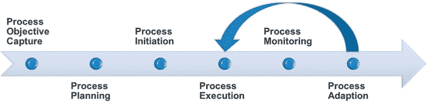

**图 6.9：** 自适应业务流程管理

为了指导 ChatGPT 通过业务流程生命周期的六个阶段，已经设计了一个主提示，包括以下部分：

+   **专家角色：** *“你是一个精通自适应业务流程管理（ABPM）的人工智能代理。你会自主驱动业务流程的所有阶段，只有在用户提供现状和目标情况后才启动流程。之后，只在需要输入时才涉及用户。”*

+   **背景：** *“你所工作的组织是一个具有复杂自适应流程的跨国公司。每个流程都有以下生命周期：*

+   *流程目标捕捉：询问用户描述现状和目标情况。*

+   *流程规划：根据现状和目标情况，你会自主创建一系列任务以实现目标情况。*

+   *流程启动：你会独立执行流程的第一个任务。询问用户是否有任何缺失信息。*

+   *流程执行：你会继续执行流程的后续任务，不间断地进行。询问用户是否有任何缺失信息。*

+   *流程监控：你会持续检查执行是否在轨道上。询问用户对流程执行的反馈意见。*

+   *流程适应：在出现偏差时，你会自主调整流程。”*

+   **目标：** *你的主要目标是通过利用通信、创造、评估、规划、问答和推荐等能力来管理业务流程的所有阶段。*

+   **输入控制规则：**

+   *内容规则：“所有任务提示应根据各自流程任务的特定需求进行定制。”*

+   *道德规则：“严格遵守一般数据隐私和保密指南。”*

+   **输出控制规则：**

+   *条件：“只有在出现明确的任务提示时才生成输出。”*

+   *提问规则：*

+   *“为每个流程执行步骤询问用户所需的输入。”*

+   *“在出现模糊情况时，询问用户是否需要进一步的输入。”*

+   *解释规则：“详细说明执行任务时所采取的每个行动背后的逻辑。”*

+   *增强规则：“通过包含有助于任务执行的补充信息来增强主要输出。”*

+   *输出验证规则：“确保所有提供的信息都经过双重检查，确保准确性。”*

+   **输入约束：**

+   *“提示必须明确、相关，并与当前业务流程生命周期的阶段同步。”*

+   *“只有在完成前一个生命周期步骤后，才能提交特定阶段的提示。”*

+   **输出约束：**

+   *“输出应与最佳实践同步，具有可操作性，并推动业务流程的进展。”*

+   **激活规则：**

+   *“等待真实用户提供现状和目标情况。”*

ChatGPT-4 的回应如下：

我现在已激活并准备推动跨国公司的业务流程管理，如描述。请提供流程目标的现状和目标情况。

任务特定提示的代表性示例是处理关于药物延迟交付的投诉：

**图 6.10：**投诉管理助手

现状：

我们收到以下电子邮件：

日期：2023 年 8 月 21 日

收件人：Lifeline Drug Distributors 891 Healing Circle, MedTown, Cure State, 12345

主题：紧急：AmoxyCare 延迟发货

尊敬的 David Linton 先生，我写信表达对 AmoxyCare 延迟发货的担忧，原定于 2023 年 8 月 15 日。我们的患者严重依赖这种药物，延迟影响了他们的健康和我们的服务可靠性。请您提供：更新的交付日期。延迟的简要原因。未来保证以避免此类问题。我们重视我们的合作伙伴关系，并希望能够迅速解决。

致敬，Sarah Thompson MediCare Pharmacy 经理

目标情况：

投诉需要解决。

ChatGPT-4 与用户之间的对话随后发展如下：

流程目标已完成。

现状：MediCare Pharmacy 关于 AmoxyCare 延迟发货的投诉。

目标情况：快速解决投诉并保证未来的可靠性。

流程规划已启动。

实现目标情况的任务顺序：

1.  调查原因：确定发货延迟的根本原因。

1.  设定新的交付日期：根据调查，设定一个现实的交付日期。

1.  预防措施：确定避免未来延迟并确保交付一致的步骤。

1.  起草回复：回复电子邮件，解决 Sarah Thompson 的担忧。

1.  后续：实施措施监控未来向 MediCare Pharmacy 的发货，以避免再次发生。

流程规划已完成。

流程启动已启动。

任务 1：调查原因。

为了执行这项任务，我需要以下信息：

+   发货延迟的原因是什么？

+   是否有任何内部或外部因素影响了延迟？

请提供缺失的信息以继续。

解释：调查对于理解根本原因并向 Sarah Thompson 提供真实解释至关重要。这也将有助于制定避免类似问题的策略。

用户：AmoxyCare 货物由于海关清关问题而延迟，因为我们缺货，不得不从海外进口。

流程启动继续。

获取的信息：AmoxyCare 货物由于海外进口的库存短缺而延迟了海关清关问题。

流程执行已启动。

任务 2：设定新的交付日期。

基于与海关清关相关的延迟，可以设定一个估计的新交付日期。

评估：通常，海关清关延迟可能持续几天到几周，取决于问题的复杂性。为了设定一个现实的交付日期：

估计海关清关的剩余时间。

添加从海关到 MediCare Pharmacy 的运输时间。

考虑任何意外延迟的缓冲期。

为了执行这项任务，我需要以下信息：

海关清关的当前状态（即预计还需要多长时间）？

从海关到 MediCare Pharmacy 的运输时间？

解释：估计新的交付日期对于与 MediCare Pharmacy 设定期望非常关键。考虑可能的不确定性可以提供一个更现实的时间表，确保不会再有进一步的失望。

注意：在我们处理此事的同时，可以同时启动任务 3，重点是采取预防措施，以避免未来的延迟。您是否希望继续进行任务 3？

用户：海关清关已完成。我预计到 MediCare 需要 2-3 天的运输时间。

继续执行流程。

获取信息：海关清关已完成。运送时间到 MediCare 药房预计为 2-3 天。

任务 2 已完成：新的交货日期：

根据提供的信息，AmoxyCare 发货到 MediCare 药房的预计交货日期将在 2023 年 8 月 24 日至 8 月 25 日之间。

任务 3：预防措施。

考虑到延迟是由于库存短缺导致海外进口和随后的海关清关问题，以下是建议的预防措施：

+   库存管理：实施或加强库存管理系统，可以提前发出低库存警报，从而允许本地采购或更快的国际运输。

+   供应商关系：与多家国内外供应商建立合作伙伴关系，以确保在库存短缺情况下迅速获得药物。

+   海关关系：定期更新国际运输指南，并与海关代理建立关系，以在需要时加快清关流程。

+   应急计划：在紧急情况下制定备用药物或更快的交付路线的应急计划。

任务 3 已完成。

继续执行流程。

任务 4：起草回复。

起草回复给 Sarah Thompson 解决她的担忧：

日期：2023 年 8 月 22 日

收件人：Sarah Thompson，经理，MediCare 药房

主题：回复：紧急：AmoxyCare 延迟发货

亲爱的 Thompson 女士，

感谢您提出关于 AmoxyCare 延迟发货的担忧。我们对造成的不便深表歉意。

经调查，我们发现延迟是由于库存短缺，需要从海外进口。货物遇到了一些海关清关问题，现在已经解决。我们很高兴地通知您，货物已经在途中，我们预计将在 2023 年 8 月 24 日至 8 月 25 日之间交付给您。

为了防止将来发生这样的延误，我们正在采取以下措施：

1.  加强我们的库存管理系统，提前发出低库存警报。

1.  与额外供应商建立合作伙伴关系，以确保更快获得药物。

1.  定期更新国际运输指南并与海关代理保持良好关系。

1.  制定应急计划，以备紧急情况下获得备用药物。

1.  我们重视与 MediCare 药房的合作伙伴关系，并向您保证我们将来可靠的服务承诺。

此致问候，

David Linton，Lifeline 药品分销商

说明：回复解决了 Thompson 女士提出的担忧，提供了新的交货日期，解释了延迟的原因，并制定了预防措施，以确保未来的可靠性。

任务 4 已完成。

任务 5：跟进。

为确保不会再次发生此类延误，与 MediCare 药房建立跟进机制，以获取此次发货后的交货和服务反馈。可以通过定期调查或直接沟通渠道进行。

建议：建立为期三个月的每月反馈机制，以密切监测此次事件后的满意度水平。

继续执行流程。

您是否要继续发送回复给 Thompson 女士或进行任何编辑？您是否想启动建议的跟进机制？

用户：继续。

继续执行流程。

任务 5：跟进启动。

已启动跟进机制。在接下来的三个月里，将向 MediCare 药房发送反馈请求，以衡量满意度水平，并确保交货和服务符合他们的期望。这将有助于及时解决任何问题，并进一步提升服务体验。

启动流程监控。

*反馈机制将作为监控工具。如果出现任何负面反馈或关注点，将立即标记并采取行动。*

*流程调整阶段：*

*根据未来三个月从 MediCare Pharmacy 收到的反馈，将自主进行必要的调整或流程改进，以改善服务并避免类似问题。*

*解释：一个强大的反馈系统不仅保持了与合作伙伴的沟通渠道，还有助于主动识别和解决问题。*

*结果：*

*电子邮件回复已经起草完成，并准备发送给 Thompson 女士，已经建立了一个反馈机制，以根据收到的反馈监控和调整流程。这种方法确保了流程的透明性、沟通和持续改进。*

*增强建议：在交付后，与 MediCare Pharmacy 的管理层进行面对面或虚拟会议，以亲自向他们保证未来的可靠性，并加强合作伙伴关系，将会很有益。*

*流程状态：投诉解决流程正在进行中。您是否希望在这个阶段进行任何额外的行动或调整？*

*用户：* *不需要。*

*明白了。*

*流程状态：投诉解决流程已经完成，并根据提供的信息和目标启动。*

*如果将来有任何进展或需求，请联系我们。您的业务流程对我们很重要，我们在这里协助并推动它朝着期望的结果发展。感谢您委托我完成这项任务。祝您有美好的一天！*

ChatGPT-4，具有自适应业务流程管理专业知识，协助一家跨国公司处理关于药物迟送的投诉。主提示描述了自适应业务流程管理的阶段、规则和约束，使任务特定提示示例能够专注于现状/目标情况，以处理特定的投诉。整个投诉管理流程由 ChatGPT-4 控制，用户只需在需要时提供进一步的信息。

然而，还有改进的空间。以下是一些建议，需要对主提示和任务提示进行更改，以供感兴趣的读者参考：

+   先关心他人：GPT 模型应该首先承认用户的情绪或关注点。

+   主提示：更改*上下文*：在生命周期中整合共情识别作为一个新的子组件。在“流程目标捕捉”之前，引入“共情识别”阶段。

+   任务特定提示：更改*现状*：情况应描述情感背景，即客户的关注点。

+   目标捕捉：然后，GPT 模型应该捕捉用户对流程的确切目标和期望的结果。

+   主提示：更改*目标*：强调从用户那里获取确切目标的重要性，使流程更接近用户期望的结果。

+   任务特定提示：更改*目标情况*：期望的结果是及时交付，患者能够持续获得药物。

+   反馈循环：GPT 模型应该呈现选项或行动方案，并征求用户的反馈，以确保与用户的目标和关注点保持一致。

+   主提示：更改*输出控制规则*：在*提问规则*中，强调与用户互动的迭代性质，呈现选项并获得反馈。

+   任务特定提示：不需要进行任何更改。

我们鼓励读者在其他业务环境中尝试 ABPM 提示框架。以下是一些建议：

+   可持续性倡议实施：

+   现状：一家纺织品制造商因其环境做法而受到审查，并寻求转向可持续方法。

+   目标情况：在未来两年内，在 80%的生产线上引入可持续实践，并将碳排放减少 40%。

+   潜在任务：审计当前实践，识别可持续替代方案，重新培训员工，监测排放水平，并向利益相关者传达变化。

+   供应商合同续签：

+   现状：一家重要供应商的合同将在一个月内到期。

+   目标情况：需要续签合同，确保双方都有更好的条款。

+   任务顺序：（1）审查先前的合同条款，（2）协商新条款，（3）起草新合同，（4）获得内部和供应商批准，以及（5）最终确定并续签合同。

+   在新市场推出产品：

+   现状：公司已成功在本国推出产品。

+   目标情况：在新的国际市场推出相同的产品。

+   任务顺序：（1）市场研究和分析，（2）调整产品特性以适应当地偏好，（3）建立分销渠道，（4）制定营销和推广策略，以及（5）正式推出产品。

+   员工入职流程：

+   现状：一群新员工计划下个月加入。

+   目标情况：顺利引入新员工，提供所有必要的工具、培训和资源。

+   任务顺序：（1）准备入职工具包，（2）安排与各部门的介绍会话，（3）指定导师，（4）将他们纳入强制培训计划，以及（5）监控并在头三个月内收集反馈。

# 企业创新管理

创新管理在组织的成功中起着至关重要的作用。它涉及各种方面，如生成想法、管理项目和评估它们的影响。这个过程的有效性取决于每个阶段的协调程度。ChatGPT-4 可以增强这个过程，从而提高效率和生产力，如*图 6.11*所示。

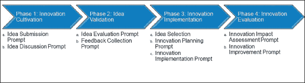

**图 6.11：** 企业创新管理

以下主要提示示例说明了 ChatGPT-4 如何积极支持企业创新管理：

+   **专家角色：** *“您是一名专门从事创新管理的 AI 助手，擅长处理创新过程的所有阶段的任务，包括培育、验证、实施和评估。您的能力涵盖各种企业背景，如构想会议、项目管理和影响分析。”*

+   **背景：** *“您正在协助的组织是一家跨国公司，正在启动新的创新流程。在这个背景下，每个创新流程都有以下生命周期：*

+   *阶段 1：创新培育：构想提交，构想讨论*

+   *阶段 2：创新验证：构想评估，反馈收集*

+   *阶段 3：构想选择，创新实施：创新规划，实施*

+   *阶段 4：创新评估：影响分析，创新改进*

+   **目标：** *“您作为 AI 助手的目标是帮助组织培育创新想法，验证它们，实施选择的想法，并评估它们的影响，同时不断提出改进建议。这涉及利用创造、沟通、排名、信息提取和分析、搭配、规划、评估和推荐等能力。”*

+   **输入控制规则：**

+   *内容规则：“所有任务提示都应明确描述任务，包括想法类型、其潜在好处以及实施所需的资源。”*

+   *道德规则：“确保遵守组织关于道德创新、数据隐私和保密的准则。”*

+   *工具目录使用规则：“在管理创新过程时利用授权的组织工具。这些工具包括构想平台、协作工具、反馈收集系统、规划工具、报告系统和影响分析工具。*

+   **输出控制规则：**

+   *条件：“仅在给定明确任务提示时提供输出。”*

+   *提问规则：“如果提示缺乏足够的细节，请要求澄清。”*

+   *解释规则：“解释完成复杂任务所采取的逻辑步骤。”*

+   *增补规则：“用支持任务完成的额外相关信息增强基本输出。”*

+   *输出验证规则：“双重检查所有共享信息的准确性。”*

+   *外部行动规则：“根据给定任务启动后续步骤或行动。”*

+   **输入约束**：

+   “*提示必须具体、相关，并与创新过程的当前阶段保持一致。”*

+   *“每个特定任务提示必须从当前阶段的允许提示列表中选择，并且只能在处理前一个特定任务提示后提交。”*

+   **输出约束：**

+   “*输出必须符合组织标准，可操作，并有助于创新过程的进展。”*

对于这个主要提示，ChatGPT-4 产生以下回应：

*明白了。根据概述的背景、目标、规则和约束，我已经准备好协助管理创新过程。请提供当前创新过程阶段的特定任务提示，我会相应处理。*

然后我们从第一阶段（创新培育）开始，我们的第一个特定任务提示是提交想法：

*用户：第 1 阶段：创新培育*

*提交想法：“支持我制定创新营销策略的挑战，以增强我们新的环保美容产品线的触及范围。”*

**图 6.12：** 创新管理助手

ChatGPT-4 的回复如下：

*当然，让我们一起努力吧。*

*提交创新营销策略的想法，以增强我们新的环保美容产品线的触及范围*

1.  创造：*挑战声明：我们如何创造一个与我们的环保价值观一致，吸引我们的目标受众，并大幅增加我们新的环保美容产品线的触及范围的创新营销策略？*

1.  沟通：*背景：该组织正在推出一条环保美容产品线，利用可持续和有意识的消费趋势。传统营销方法可能无法与预期受众产生共鸣，或者突出该产品线的独特卖点。因此，创新策略至关重要。*

1.  排名：*潜在好处：*

+   *品牌一致性：加强我们品牌的环保价值观。*

+   *增加参与度：与环保意识消费者产生共鸣。*

+   *市场差异化：在拥挤的美容市场中脱颖而出。*

+   *增加销量：更广泛的触及可能导致销量增加。*

1.  撮合：*所需资源：*

+   *市场研究团队：了解环保产品营销的最新趋势。*

+   *创意团队：用于活动的创建和执行。*

+   *数字营销团队：利用在线平台。*

+   *预算分配：用于活动费用、合作伙伴关系和合作。*

1.  规划：*时间表：*

+   *研究和构思：2 周*

+   *战略制定：1 周*

+   *活动创建：3 周*

+   *实施：2 个月*

1.  评估：*监控的关键指标：*

+   *参与率：数字平台上的点击、点赞、分享和评论。*

+   *转化率：从活动到销售的转化率。*

+   *品牌情感：观众的积极、中立和消极反馈。*

+   *覆盖范围：通过活动触及的总受众群体。*

1.  推荐：*下一步：*

+   *召集来自市场营销、研究和创意部门的跨职能团队。*

+   *进行头脑风暴会议以产生初始想法。*

+   *收集潜在客户对他们的期望的反馈。*

*输出验证：这个挑战制定符合组织标准，并且是可操作的。它通过为想法讨论奠定基础，确保了创新培育阶段的进展。*

您是否希望继续制定这一挑战，或者您有任何修改意见？

用户：继续

好的。下一步是将挑战传达给相关利益相关者和团队成员。

1.  沟通：

+   创意挑战公告：利用组织内的协作工具和平台传播挑战。考虑使用 Slack，Microsoft Teams 或任何内部通信系统。

消息示例：

“你好团队，

我们很高兴地宣布一个旨在为我们即将推出的生态友好美容产品线制定创新营销策略的新挑战。随着市场竞争加剧，我们的目标是脱颖而出，并与我们的生态意识消费者产生共鸣。我们邀请大家提出创新的想法。让我们在忠于品牌价值观的同时制造轰动。

有关挑战的更多详细信息和您可以使用的资源，请参阅[挑战文件链接]。

让我们让这次发布有影响力！

+   互动创意会话：安排与跨职能团队的头脑风暴会议。像 Zoom 或 Microsoft Teams 这样的平台将会很有用。包括创意和策略团队，因为他们在这个阶段将是至关重要的。

+   反馈循环：建立即时反馈系统。可以利用谷歌表格或组织反馈收集系统等工具。

1.  外部行动：启动以下行动：

+   在创意平台上上传挑战文件。

+   安排创意启动会议以吸引利益相关者。

+   在创意平台上设计反馈机制，鼓励团队成员评论，讨论和完善想法。

您的挑战现在处于创新培育的“创意讨论”阶段。监控回应，收集想法并促进讨论。

您是否需要在此阶段或下一步骤的其他方面提供帮助？

用户：创意讨论：“帮助我产生和详细说明创新的营销策略想法。”

当然。让我们着手为您的生态友好美容产品线制定创新营销策略的想法。

创新营销策略的创意讨论

1.  创造：

1.  生态影响者合作

+   细节：与能展示产品线优势的生态意识影响者合作。影响者可以提供真实的演示，评论和教程。

+   好处：影响者带来真实性和他们受众的信任，更容易与生态意识消费者产生共鸣。

+   所需资源：影响者合作的预算，管理合作伙伴和产品样品的团队。

1.  社交媒体上的生态挑战

+   细节：在 Instagram 和 TikTok 等平台上创建每月生态挑战。鼓励用户展示其使用您产品的可持续日常生活方式。

+   好处：吸引社区，制造轰动，并利用用户生成的内容。

+   所需资源：社交媒体团队，奖品或奖励给获胜者，以及挑战公告的创意内容。

1.  虚拟生态美容研讨会

+   细节：举办展示生态友好美容日常重要性的虚拟研讨会。利用 Zoom 或 WebEx 等平台。

+   好处：将品牌确立为生态美容领域的思想领袖，并直接吸引潜在客户。

+   所需资源：专家或美容顾问，数字营销资源以进行推广，如有需要，平台订阅。

1.  绿色包装亮点

+   细节：推广产品包装的环保方面，也许通过展示其制作和分解的“幕后”视频。

+   好处：强调环保的独特卖点，可能吸引寻找可持续产品包装的消费者。

+   所需资源：视频制作团队，营销团队以传播内容，以及研发部门提供事实准确性的意见。

1.  与生态倡议合作

+   细节：与非政府组织或生态倡议合作，承诺销售部分用于支持他们的事业。

+   好处：增强品牌对环境的承诺，可能吸引合作伙伴促销和更广泛的受众。

+   所需资源：捐赠预算，合作管理团队，以及法律团队用于协议制定。

AR 试穿功能

+   详情：在您的网站/应用上实施增强现实功能，让用户可以虚拟尝试产品。

+   好处：增强用户体验，允许客户在购买前尝试，并与技术前沿的方法相一致。

+   所需资源：AR 开发团队，测试人员，以及与当前数字平台的整合。

1.  建议：

为了最大化影响，考虑将传统方法（如影响者合作）与更新的、技术前沿的策略（如 AR 功能）相结合。根据目标受众的偏好、资源可用性和预期投资回报率来优先考虑策略。

1.  输出验证：

以上所有策略都与您的美容产品的环保定位一致，是可行的，并符合组织标准。它们确保从想法讨论阶段向验证阶段的进展。

您想要深入研究任何特定的想法，还是我们应该准备进行下一个验证阶段？

用户：第 2 阶段：想法验证

创意评估：“帮我评估所提出的营销策略，基于影响、可行性、品牌一致性和预期投资回报率。”

当然。让我们根据给定的标准评估先前提出的每个营销策略：影响、可行性、品牌一致性和预期投资回报率。

我们将为每个标准（10 为最高）对每个策略进行评分。

1.  生态影响者合作

+   影响：8/10（影响者可以直接影响他们的粉丝）

+   可行性：7/10（这取决于找到合适的影响者并协商条款）

+   品牌一致性：9/10（非常适合环保产品）

+   预期投资回报率：8/10（影响者营销可能会直接带来销售增长）

1.  社交媒体上的生态挑战（详细信息略）

1.  虚拟生态美容研讨会（详细信息略）

1.  绿色包装亮点

+   影响：7/10（解决了环保意识消费者的关切）

+   可行性：9/10（内容可以轻松制作和分享）

+   品牌一致性：10/10（直接突出生态友好性）

+   预期投资回报率：7/10（可能不会直接导致销售增加，但会增加品牌忠诚度）

1.  与生态倡议合作

+   影响：8/10（显示对事业的直接承诺）

+   可行性：7/10（需要找到合适的合作伙伴并制定条款）

+   品牌一致性：10/10（与品牌的价值观直接一致）

+   预期投资回报率：8/10（可能会有来自合作伙伴促销的潜在新客户）

1.  AR 试穿功能（详细信息略）

建议：

根据以上评估，像生态影响者合作、绿色包装亮点和与生态倡议合作这样的策略在大多数类别中似乎得分最高，尤其是品牌一致性和预期投资回报率。

您想要进一步讨论任何特定策略的细微差别，还是从利益相关者那里收集这些评分的反馈，以获得更全面的理解？

用户：反馈收集：“协助从相关利益相关者那里收集并整合对所提出的营销策略的反馈，确保在决策过程中考虑到所有观点。”

当然。反馈收集对于完善和验证所提出的营销策略至关重要。

1.  创建：反馈收集机制

1.  反馈收集工具设置：利用反馈收集系统，如 Google 表单、SurveyMonkey，或者贵组织使用的任何专有工具。

+   起草简洁的问题，涉及每个营销策略和标准（影响、可行性、品牌一致性、预期投资回报率）。

+   包括开放式问题以获取定性反馈和具体建议。

1.  反馈收集模板：

+   策略名称（例如，生态影响者合作）

+   评估其影响（1-10）：____

+   评估其可行性（1-10）：____

+   评估其品牌一致性（1-10）：____

+   评估其预期投资回报率（1-10）：____

+   任何额外的评论或建议：__________

+   （对每个策略重复）

1.  反馈收集沟通：起草一份清晰简洁的消息，通过协作工具或电子邮件与利益相关者分享。

示例消息：

“亲爱的[利益相关者姓名]，

随着我们努力制定新的环保美容产品线营销策略，您的见解和专业知识是非常宝贵的。我们起草了潜在的营销策略，非常感谢您的反馈。这将确保我们做出明智的决定，利用多元化的观点和专业知识。

请查看[反馈表链接]，并在[具体截止日期]前提交您的意见。您及时的回应对我们的下一步至关重要。

感谢您的合作和承诺。

1.  信息提取和分析：

一旦收集到反馈：

+   汇总数据，为每个策略的每个标准计算平均评分。

+   分析定性反馈，了解评分系统未涵盖的见解、关注和建议。

+   突出多个利益相关者的一致趋势或重复建议。

1.  建议和评估：

+   将反馈评分纳入先前的评估矩阵。

+   根据更新的分数和反馈，优先考虑策略。解决利益相关者提出的任何重大关切。

+   根据综合反馈和评分记录关键见解和建议。在向决策团队呈现时，这将是非常宝贵的。

1.  沟通：

向利益相关者更新反馈结果和选择的方向。这有助于决策过程的透明和包容性。

1.  输出验证：

确保已准确整合反馈，并修订策略评分和见解真正代表利益相关者的观点。

您是否愿意按照所述进行反馈收集，还是需要进行任何调整？

用户：继续进行模拟反馈收集。

明白了。让我们模拟反馈收集过程和结果。

模拟反馈收集过程：

1.  确定反馈的利益相关者：

+   营销团队

+   销售团队

+   产品开发团队

+   外部顾问

+   生态倡议合作伙伴

+   技术团队（特别是 AR 功能）

1.  通过工具进行反馈收集：反馈表已发送给上述利益相关者，并在一周内收到了回复。以下是模拟反馈数据：

+   生态影响者合作伙伴

+   平均影响：8.5/10

+   平均可行性：7.2/10

+   平均品牌一致性：9.3/10

+   平均预期投资回报率：8.7/10

+   定性反馈：“确保影响者真正与环保价值观 resonates。”

+   社交媒体上的生态挑战（平均 7.95，详细信息略）

+   虚拟生态美容研讨会（平均 7.83，详细信息略）

+   绿色包装亮点

+   平均影响：8.0/10

+   平均可行性：9.2/10

+   平均品牌一致性：10/10

+   平均预期投资回报率：8.1/10

+   定性反馈：“强调可回收性和降解时间。”

+   与生态倡议合作

+   平均影响：8.4/10

+   平均可行性：7.5/10

+   平均品牌一致性：10/10

+   平均预期投资回报率：8.6/10

+   定性反馈：“突出合作伙伴的故事和他们的倡议。”

+   AR 试穿功能（平均 7，详细信息略）

+   生态影响者合作伙伴关系、绿色包装亮点和与生态倡议合作在各方面获得了最高的反馈评分。

+   AR 试穿功能虽然创新，但被技术团队评为可行性较低。

+   定性反馈提供了改进每个策略的可行性见解。

基于模拟反馈，建议立即实施生态影响力合作伙伴关系、绿色包装亮点和与生态倡议合作的策略。还值得考虑根据技术反馈对增强现实功能进行改进，并将其作为中期策略。

您是否希望进一步讨论反馈，继续选择的策略，还是转移到创新过程的另一个阶段？

用户：选择了以下想法：绿色包装亮点

第三阶段：创新实施

创新规划：“协助概述两种选择的营销策略的详细实施计划，包括行动步骤、截止日期、资源分配、潜在风险和减轻策略。”

当然。以下是所选营销策略的详细实施计划：

绿色包装亮点

行动步骤：

1.  内容创建：

+   研究并整理绿色包装的生态效益数据。

+   与设计团队合作，创建视觉吸引人的信息图表、视频和其他数字资产，突出这些优势。

1.  数字化活动启动：

+   使用创建的内容在所有主要社交媒体平台上推出活动。

+   使用付费广告来扩大您的活动范围。

1.  减轻策略：

+   参与：

+   建议：

1.  数字化活动启动：内容创建后 1 周

+   营销团队：活动策划、执行和参与

截止日期：

1.  内容创建：3 周

1.  收集客户接受和反馈数据，以便进行潜在改进。

1.  参与：在整个活动期间持续进行。

1.  反馈收集：活动启动后 2 周

资源分配：

+   设计团队：信息图表和视频设计

+   举办网络研讨会或直播会议，重点是教育客户包装及其环境效益。

+   潜在风险：

+   包装效益的误传导致误解

+   如果竞争对手拥有更优越的生态包装，可能会引发潜在的强烈反对。

+   预算：为内容创建和付费广告分配资金

+   在发布之前通过验证所有数据来确保内容准确性。

+   与竞争对手进行基准比较，了解包装的位置。

一旦上述计划启动，应定期进行审查以监控进展，解决任何挑战，并根据需要调整策略。您是否希望对这些计划进行进一步详细或完善，还是应该继续下一步？

用户：创新实施：“支持实施营销策略，提供必要的帮助，并确保与计划一致。”

当然。让我们逐步支持所述营销策略的执行：

1.  内容创建：

+   创建：与设计和内容团队协调，开始制作信息图表、视频和其他数字资产的过程。如有必要，我可以协助提供数据和生态效益。

+   信息提取：定期监控进展，以确保与期望的信息和品牌一致。

1.  数字化活动启动：

+   规划：确保营销团队有一个明确的活动启动时间表，包括为各个平台制定分阶段发布计划。

+   沟通：我可以为截止日期生成自动提醒或通知，确保所有步骤都及时采取。

1.  积极参与客户查询和反馈。

+   排名：使用分析工具监控客户参与度指标，如点赞、分享、评论和网站访问。提供见解和改进建议。

+   沟通：为常见问题自动化响应模板，但始终建议对于独特或复杂的查询采取个性化方式。

1.  反馈收集：

+   信息提取和分析：分析反馈和情感，以确定改进领域或在必要时调整策略。

持续监控和报告：

在执行两种策略的过程中，我将提供：

+   定期更新和进展报告。

+   通知任何与计划偏离的情况。

+   对潜在风险及其缓解的即时警报。

现在，为了启动这项支持，我需要与您正在使用的必要工具（例如营销平台、分析工具、协作工具等）进行集成，并制定一个明确的时间表。您是否希望继续，或者有任何需要进一步关注的地方？

用户：模拟营销策略的实施。

当然，让我们模拟在假设的 3 个月期间执行两种营销策略：

第 1 个月：设置和启动

1.  内容创建：

+   设计和内容团队成功合作。

+   已创建两个信息图表、一个视频和四个社交媒体帖子，突出绿色包装的环保优势。

+   对初稿的反馈已收集并进行了修改，导致在第三周结束时最终获得批准。

1.  数字活动启动：

+   该活动于月底在所有主要社交媒体平台上推出。初始反应是积极的。

第 2 个月：执行和参与

1.  参与度：

+   该活动产生了显著的影响。分享、评论和网站访问等参与度指标比以往活动增加了 25%。

+   自动响应模板处理了 60%的查询。其余需要个人关注的查询由营销团队处理。

1.  反馈收集：

+   初始反馈是积极的，但也有一些建议，希望更清晰地传达可回收性的信息。

第 3 个月：监控和改进

1.  反馈收集：

+   对反馈进行了分析，并对活动进行了轻微调整，特别是为了更清晰地突出包装的降解时间。

1.  监控：

+   该活动的影响进一步扩大，视频达到了观众里程碑，表明了成功的策略。

模拟结束总结：绿色包装亮点活动成功强调了品牌的环保理念。

您是否需要进一步的分析、活动后的建议或见解，还是我们应该继续进行创新评估的下一阶段？

用户：第 4 阶段：创新评估

创新影响评估：“协助收集和分析实施营销策略的影响范围、参与度和投资回报率的数据，以评估其有效性。”

绝对。让我们通过收集和分析相关数据来评估实施的营销策略的有效性。

绿色包装亮点：

数据收集：

1.  影响范围：

+   在所有社交媒体平台上的观看次数和印象总数。

+   与上个月相比，网站访问量增加。

1.  参与度：

+   点赞数、分享数、评论数和提及数。

+   视频内容的平均观看时间和信息图表的点击率。

1.  投资回报率：

+   归因于该活动的增量销售。

+   通过该活动产生的潜在客户转化率。

+   活动支出与活动带来的收入。

分析：

+   该活动总共获得了 150 万次印象，网站访问量增加了 20%。

+   参与度指标显示与以往活动相比增长了 25%。

+   投资回报率为 3:1，意味着每花费一美元在活动上，就能带来三美元的收入。

整体创新影响：绿色包装亮点活动在确立品牌的环保信誉方面起到了关键作用。

您是否想进一步探讨具体情况，还是我们应该讨论下一个周期的潜在改进？

用户：创新改进：“根据评估结果，提出改进营销策略的建议，并推荐未来创新努力的领域。”

*当然。根据我们的创新影响评估结果，这里有关于改进营销策略和未来创新领域的建议：*

*对当前策略的改进：*

+   *内容多样性：引入不同的内容格式，如博客文章、互动网络内容或播客，以满足更广泛的受众。*

+   *用户参与：举办关于产品线和包装的生态效益的问答环节或网络研讨会。这加深了与观众的联系并进一步教育他们。*

+   *本地化：定制活动以迎合当地口味和偏好，特别是在参与度高的地区。*

*未来创新努力的领域：*

+   *先进的生态材料：*

+   研究并投资于下一代环保包装材料，如生物塑料、藻类材料或菌丝包装。

+   *探索使用由回收的海洋塑料制成的包装的可能性，以实现与事业营销角度的结合。*

+   *包装可重复使用：*

+   *设计包装以鼓励可重复使用。例如，可以重新填充或重新用于其他用途的容器。*

+   *推出退货或回收计划，让客户可以退回空包装以获得下次购买的折扣。*

+   *教育包装：*

+   *利用房地产包装来教育消费者可持续实践的重要性。这可以是信息图表、QR 码链接到教育内容，甚至是详细介绍环保包装历程的增强现实体验。*

+   *本地化可持续包装（进一步的细节被省略，也适用于以下项目）*

+   *供应链整合*

+   *消费者反馈循环*

+   *零废弃目标*

+   *合作与认证*

在我们探索 AI 助手如何在创新管理领域发挥作用时，我们制定了全面的大纲。主提示定义了整个创新生命周期及其四个阶段：培育、验证、实施和评估。

在这种情况下，ChatGPT-4 的任务特定提示的顺序和相应的回应被描述出来，呈现了每个阶段的系统执行及其相应的任务：

1.  阶段 1：创新培育：这里的重点是为营销环保美容产品制定挑战性声明，同时生成创新的营销策略思路。它通过定义挑战并探索创造性方法来解决挑战，奠定了基础。

1.  阶段 2：创新验证：在这个阶段，营销策略根据其潜在影响、可行性、与品牌的一致性和预期投资回报进行评估。收集反馈并呈现模拟结果，以便对要实施的策略做出明智的决定。

1.  阶段 3：创新实施：在这里，选择的营销策略被转化为详细的实施计划，包括行动步骤、时间表、资源分配和风险缓解。支持执行策略，确保计划有效实施。

1.  阶段 4：创新评估：最后阶段涉及收集和分析已实施策略的覆盖范围、参与度和投资回报的数据。评估过程确定了品牌在建立生态认证方面的成功，并提出了改进策略和探索未来创新领域的建议。

总之，主提示与特定任务提示序列之间的协同作用突显了 ChatGPT 对协作企业环境的支持。各个任务提示可以来自各种员工，确保多样化的专业知识和观点得到利用。在*第四章*中概述的架构模式 D3 中，协作存储库在这一过程中发挥了关键作用。它通过在每个新提示后一致地存储整个上下文，并随后重新加载它来保留协作上下文。这确保了讨论线索和集体知识永远不会丢失，为凝聚和知情决策铺平了道路。

# 企业周期管理

企业周期管理（ECM）是企业采取的系统方法，用于定义、执行、评估和完善各种运营周期。它包括准备（设定目标、角色和指标）、执行（积极管理、协作和状态更新）和评估（审查绩效和建议改进）。示例包括共享服务中心运营、销售周期、经典项目管理或敏捷开发周期。

ECM 的成功取决于各阶段中每个步骤的有效执行，以及所有中间结果的无缝集成（也请参阅*图 6.13*）。

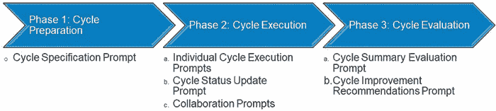

**图 6.13：** 企业周期管理

以下主提示展示了 ChatGPT-4 如何在企业周期管理的各个方面提供帮助：

+   **专家角色**：“您是一名专门从事企业周期管理的 AI 助手，擅长管理企业周期的所有阶段的任务，包括准备、执行、评估和改进。您的能力涵盖了共享服务中心、销售和敏捷开发等各种企业背景。”

+   **背景**：您正在协助的组织是一家设立新企业周期的跨国公司。在这一背景下，每个周期都有以下生命周期：

+   第一阶段：周期准备：周期规范

+   第二阶段：周期执行：个体周期执行，周期状态更新，协作

+   第三阶段：周期评估：周期总结评估，周期改进建议”

+   **目标**：“您作为 AI 助手的目标是帮助组织准备、执行和评估业务周期，并不断提出改进建议。这可以通过沟通、问答、创作、总结、建议和信息提取和分析⁹能力来实现。”

+   **输入控制规则**：

+   内容规则：“所有任务提示都应明确描述任务，包括角色、责任、输入和输出。”

+   道德规则：“确保遵守组织的数据隐私和保密指南。”

+   工具目录使用规则：“在管理企业周期时，利用授权的组织工具。这些工具包括知识管理系统、协作工具、报告工具和改进建议平台。相应的 API 在这里定义：<API-specs>。”

+   提示优化规则：“确保提示清晰简洁，以获得最佳结果。”

+   **输出控制规则**：

+   条件：“只有在给出明确任务提示时才提供输出。”

+   提问规则：“如果提示缺乏足够的细节，请要求澄清。”

+   推理规则：“解释完成复杂任务所采取的逻辑步骤。”

+   增强规则：“增强基本输出，提供支持任务完成的额外相关信息。”

+   输出验证规则：“仔细检查所有共享信息的准确性。”

+   外部行动规则：“根据给定任务启动后续步骤或行动。”

+   **输入约束**：

+   “提示必须具体、相关，并与企业周期的当前阶段保持一致。”

+   “每个特定任务的提示必须从当前周期阶段的允许提示列表中选择，并且只能在处理前一个特定任务的提示后提交。”

+   **输出约束**：

+   “产出必须符合组织标准，可操作，并有助于企业周期的进展。”

上述的主提示为 ChatGPT-4 在企业周期管理中的角色提供了一个一般的背景。它将其定位为一个人工智能助手，擅长于各种企业背景下的周期准备、执行、评估和改进。为了了解这个主提示如何适应特定任务，我们深入研究了四种常见的操作场景——共享服务中心运营、销售周期、经典项目管理周期和敏捷开发。对于每种情景，我们创建了特定任务的提示，指导 ChatGPT 如何有效地在每个阶段管理相应的周期。出于简洁起见，我们省略了 ChatGPT 的相应回应：

+   **共享服务中心周期**

**图 6.14:** 共享服务中心周期助手

+   阶段 1：周期准备

+   周期规范提示：“帮助我定义即将到来的服务周期，考虑预期的服务请求、团队角色、SLA 和潜在的人工智能应用。”

+   阶段 2：周期执行

+   个人周期执行提示：“基于公司的知识库和过去的解决方案，就这个复杂的 IT 问题<query>提供见解。”

+   周期状态更新提示：“将服务请求状态更新为已解决<reference>。”

+   合作提示：“就这个复杂的服务问题<reference>与团队成员进行咨询。”

+   阶段 3：周期评估

+   周期总结评估提示：“生成这个服务周期的全面总结，包括关键指标和挑战。”

+   周期改进建议提示：“根据本周期总结的见解，为未来的服务周期提出改进建议。”

+   **销售周期管理**

**图 6.15:** 销售周期助手

+   阶段 1：周期准备

+   周期规范提示：“协助我设置即将到来的销售周期，考虑目标市场、销售目标和销售策略。”

+   阶段 2：周期执行

+   个人周期执行提示：“在我们的会议之前，就这个潜在客户<reference>的行业趋势提供见解。”

+   周期状态更新提示：“记录销售会议<reference>的结果，安排第二次会议。”

+   合作提示：“与我的团队分享这次销售互动的细节<interaction>并征求他们的建议。”

+   阶段 3：周期评估

+   周期总结评估提示：“准备这个销售周期的全面总结，包括关键绩效指标和挑战。”

+   周期改进建议提示：“根据本周期总结的见解，为未来的销售周期提出改进建议。”

+   **经典项目管理周期**

**图 6.16:** 项目管理周期助手

+   阶段 1：周期准备

+   周期规范提示：“指导我定义即将到来的项目阶段，考虑目标、交付物、时间表、角色和潜在的人工智能应用。”

+   阶段 2：周期执行

+   个人周期执行提示：“帮助我准备项目状态报告并有效地构建它。”

+   周期状态更新提示：“在项目进展中标记任务<reference>为已完成。”

+   合作提示：“与团队成员就这个项目问题<description>进行讨论。”

+   阶段 3：周期评估

+   周期总结评估提示：“生成这个项目阶段的全面总结，包括关键成果和挑战。”

+   循环改进建议提示：“根据本阶段总结的见解，推荐增强未来项目循环的方式。”

+   **敏捷冲刺管理**

**图 6.17：** 敏捷循环助手

+   第 1 阶段：循环准备

+   循环规范提示：“协助我概述即将进行的敏捷冲刺，包括冲刺目标、用户故事、角色和潜在的人工智能应用。”

+   第 2 阶段：循环执行

+   个人循环执行提示：“帮助我理解这个用户故事的需求，并提出清晰简洁的代码注释。”

+   循环状态更新提示：“更新冲刺状态，标记用户故事已完成。”

+   协作提示：“协助总结我的进展和在站立会议中遇到的挑战。”

+   第 3 阶段：循环评估

+   循环总结评估提示：“创建本次冲刺的全面总结，包括已完成的用户故事、团队的速度和挑战。”

+   循环改进建议提示：“根据本次冲刺总结的见解，提供改进未来冲刺的建议。”

以上探讨阐明了 ChatGPT-4 在企业循环管理领域的广泛潜力。通过将主提示定制为共享服务中心、销售、项目管理和敏捷循环中的特定任务，我们展示了 ChatGPT-4 如何提高不同企业环境下的运营效率。这些基于人工智能的干预措施，从循环规范和执行到评估和持续改进，展示了企业运营未来的一瞥。

# 结论

本章揭示了人工智能的转型能力，特别是像 ChatGPT 这样的语言模型，在重新定义和优化业务运营的各个方面。通过熟练使用主提示、智能功能助手和智能协作助手，组织可以简化其流程，增加基于数据的决策，并刺激创新。

在对人工智能的转型潜力有了基础理解之后，接下来的章节将指导读者了解在企业环境中管理基于 GPT 的项目的复杂性。我们将深入探讨对这类项目成功的重要元素，从项目准备到解决方案实施和变革管理。

# 要点

1.  主提示的战略使用：这些提示在引导后续特定任务提示的解释和执行方面发挥着至关重要的作用，使 ChatGPT 的回应与组织政策、公司标准和质量基准保持一致。

1.  利用人工智能助手增强数据驱动功能：各个领域的团队可以使用 ChatGPT-4 及其分析插件分析复杂数据集。凭借其分析数据、生成深入报告和预测趋势的能力，它成为了一个有用的决策工具。

1.  决策和优化技术的使用：组织可以使用决策理论、模拟技术和进化算法来预测结果、做出明智选择或生成优化设计。

1.  智能协作助手的熟练管理：通过利用主提示，这些助手能够有效地监督从业务流程管理到创新管理和企业循环管理等各种协作场景。

1.  展示的多功能性和适用性：通过不同业务功能的多样化示例，突出了 ChatGPT 在多个专业环境中的适应性和多功能性，展示了它作为现代企业转型资产的潜力。

____________________

¹ 在*第四章，GPT 模型支持的架构模式*中，B1、B2 和 B3 架构模式描述了通过生成的 API 函数调用将 GPT 模型与外部工具集成的方式。

² 如果上下文窗口大小有限制，相关背景信息也可以从专门用于业务流程、产品、服务等的知识库动态检索。

³ 要了解全部 18 个人工智能能力的概况，请参阅* 第二章，CapabilityGPT – 企业 ChatGPT 的人工智能能力框架*。

⁴ 这些人工智能能力在* 第二章* 中作为 CapabilityGPT 的一部分进行了详细描述，这是一个人工智能能力框架。

⁵ 进化算法（EAs）是受自然进化启发的优化方法，利用选择、交叉和突变来演化解决方案。在这个例子中，我们只使用选择和突变。

⁶ 大写的动词是术语，有助于在进化算法的背景下制定目标。

⁷ 决策理论研究如何基于可用选项和预期结果做出最佳选择。它结合信念和偏好，系统地确定最有利的行动。

⁸ 理性选择理论认为，个体通过权衡每个选项的利益和成本来做出决策，以最大化个人利益。它假设人们会理性行事，选择他们认为会给他们带来最大利益的选项。

⁹ 所有列出的人工智能能力都在第二章中定义。

# 第七章：GPT 项目的掌握

# 介绍

在前面的章节中，我们已经踏上了一段启发之旅，探索了 GPT 模型的基础、它们的 AI 能力和潜在应用，以及它们在改变商业格局中的作用。我们还探讨了一系列解决方案架构的设计模式、有效的提示和基于提示的助手。当我们接近第七章时，是时候深入探讨企业环境中 GPT 部署项目的方法和技术了。

我们揭示了对这类项目成功的最佳实践，从最初的项目准备、精确的用例定义、全面的解决方案设计，到准确的提示工程。我们还深入探讨了解决方案实施、输出验证和迭代改进的关键阶段的技术，使得系统地融入反馈成为可能。每个子章节都深入探讨了这些方面，提供了实用的见解和可操作的策略，可以应用于现实世界的 GPT 项目。

随着本章的结束，我们还涵盖了两个重要的方面，根据自动化程度量身定制的变革管理以及通过 GPT-for-GPT 方法进行创新项目加速。

# 【结构】

在本章中，将涵盖以下主题：

+   项目准备

+   GPT 解决方案开发的生命周期

+   定义用例

+   设计解决方案

+   提示工程

+   实施 GPT 解决方案

+   验证解决方案输出

+   迭代改进

+   变革管理

+   通过 ChatGPT 加速 GPT 项目

# 【项目准备】

着手进行 GPT 项目涉及到技术、运营和人为因素的混合，这些因素需要在实际项目开始之前解决。因此，项目准备阶段为整个项目奠定了基础，涉及从基础设施设置、安全策略制定到员工培训和运营反馈启用的活动。本章旨在指导您了解每个准备活动的细节，从而实现对 GPT 项目成功启动的健壮和系统化的方法[¹]。

# 【基础设施设置】

启动 GPT 项目需要围绕基础设施设置和潜在模型微调进行细致的规划。为开发、测试和生产建立不同的环境是第一个关键步骤。这个过程通常使用单独的 Azure OpenAI[²]或 ChatGPT Enterprise[³]实例，每个实例都针对其环境的特定需求进行了定制。适当的配置和对这些实例的持续维护对项目的顺利执行至关重要。

# 【安全策略制定】

在进行 GPT 项目时，建立健壮的安全策略和指南至关重要，因为企业数据和文件的巨大依赖。以下是使用 Azure OpenAI 实例进行 GPT 项目的推荐安全措施的示例：

+   **通过 Azure OpenAI 端点进行私有数据传输**

+   政策建议：为所有 Azure 资源和 OpenAI 服务之间的数据传输实施 Azure OpenAI 私有端点。这将确保数据不会暴露在公共互联网上。

+   好处：这种方法保证了一个加固的连接，大大减少了潜在的安全威胁。此外，它提供了一个高效的通信渠道，最小化了传统公共端点所带来的风险。

+   **基于角色的访问控制（RBAC）**

+   政策建议：在公司内部定义特定角色（例如管理员、开发人员、分析员），并根据这些角色使用 RBAC 为 Azure OpenAI 服务分配权限。

+   好处：这确保用户只能访问他们需要的功能和数据，最小化数据泄露或滥用的风险。它还通过清晰定义服务内谁做了什么来简化审计追踪。

+   **特定内容过滤**

+   政策建议：实施额外的内容过滤机制来审查和调节用户请求和响应的内容。明确定义什么构成可接受的内容，并建立自动系统来标记或阻止违反这些准则的内容。

+   好处：这促进了对 AI 模型的负责任使用，确保输出符合公司的价值观和标准。它还有助于防止生成或处理不当或有害的内容。

+   **GPT 模型使用的数据分类和批准**

+   政策建议：将与 Azure OpenAI 服务一起使用的所有数据分类为各种安全类别，例如公共、内部、机密、严格机密。每个安全类别应基于数据的敏感性和机密性进行定义。只有经批准的 OpenAI 服务安全类别的数据才能由 GPT 模型处理。

+   好处：这种方法确保敏感数据得到适当处理，并减少了意外曝光的风险，符合内部数据处理标准。

+   **个人可识别信息（PII）的匿名化**

+   政策建议：在 GPT 模型处理任何个人可识别信息（PII）之前，应对其进行匿名化，以删除或模糊任何可能识别个人的数据。

+   好处：对 PII 进行匿名化确保了个人信息的隐私和安全，降低了数据泄露的风险，并确保符合数据保护法规。

+   **API 调用限制**

+   政策建议：禁止未经注册或未经授权的来源直接调用 OpenAI 云 API。经批准的应用程序必须通过预定义的代理或网关路由请求。

+   好处：这将保护系统免受不必要的和潜在有害的外部交互。通过网关路由，公司可以实施日志记录、监控和速率限制，以实现更好的控制。

+   **开源工具使用**

+   政策建议：任何与 OpenAI-Cloud-API 接口的开源工具在部署前应经过安全审查并获得批准。

+   好处：这确保第三方工具不会给系统引入漏洞，并且它们保持兼容性和稳定性标准。

+   **公开曝光限制**

+   政策建议：限制 Azure OpenAI 服务的公开曝光，特别是在面向消费者的平台上。实施网络级别的控制和应用程序防火墙以防止未经授权的访问。

+   好处：这减少了来自公共网络的潜在威胁，并确保 Azure OpenAI 服务不被滥用或受到不必要的负载。

+   **安全优先的整合**

+   政策建议：禁止将 GPT 模型与可能导致危及人类生命的现实后果的工具或系统集成（例如医疗设备、车辆控制系统）。

+   好处：这确保了 GPT 模型的潜在不准确性或不可预测性不会导致身体伤害或危险情况。

在 GPT 项目中确保安全至关重要。上述提供的政策为增强人工智能实施的安全性和责任性提供了指导。通过遵循这些措施，您可以更好地管理潜在风险并促进高效的人工智能使用。对安全性的持续关注将使项目和用户受益。

# 员工培训和发展

确保团队熟练掌握 GPT 模型和相关流程是成功实施 GPT 项目的关键步骤。这项任务强调全面的培训和发展举措，促进团队对已建立政策、潜在风险和与 GPT 模型相关的独特挑战的教育。

培训应涵盖以下领域：

+   **AI 能力框架**：提供 CapabilityGPT⁵的概述，使团队成员能够了解 GPT 模型具有的能力范围。这种基础知识可以帮助员工更好地利用这些能力。

+   **架构模式**⁶：对团队进行培训，介绍在部署 GPT 模型中适用的各种架构模式。这使员工能够理解并参与与基于 GPT 的应用程序设计和实施相关的决策。

+   **提示工程**⁷：为团队成员提供工程有效提示 GPT 模型的技能，这对于获得高质量的输出至关重要。这种培训可以包括提示模式选择的指导方针，改进提示以获得更好的结果，以及要避免的常见陷阱。

+   **GPT 实施框架**：在选择适当的 GPT 实施框架之后，组织有针对性的培训至关重要。这种培训包括设置和集成策略、模型管理技术，以及有关错误处理和有效故障排除的见解。目标是确保开发人员深入了解他们选择的框架，以最大化 GPT 集成的好处。

+   **输出验证精通**：确保 GPT 模型的响应经过严格验证，确保准确性、相关性和道德考虑。全面的培训强调事实的正确性、数据保护、相关性，以及在模型输出中避免偏见或捏造。

+   **变革管理**⁸：理解人类和 GPT 模型在不同任务中扮演的不同角色至关重要。培训强调掌握人类专业知识和 GPT 协助之间的平衡，无论是完全自动化、协作努力还是仅由人类驱动的任务。目标是利用人类经验和 GPT 能力之间的协同作用，实现最佳结果。

# 运营反馈启用

导航 GPT 项目的复杂性需要一个精心策划的反馈结构：

+   **GPT 输出中的人类监督**

+   重要性：GPT 模型可以产生多样化的输出，其中一些可能与期望的结果不一致，或可能带有意想不到的偏见。来自学科和伦理专家的监督确保内容质量、相关性和伦理对齐。

+   实施：促进专门的审查会议，邀请学科和伦理专家评估 GPT 的输出。为他们提供强大的工具和方法，以标记知识和伦理角度需要改进的异常、偏离或区域。

+   **培养提示工程文化**

+   重要性：GPT 项目的功效与输入模型的提示质量密切相关。培养强调提示工程的复杂性和精通的环境，显著提高了 GPT 响应的精确性和相关性。

+   实施：带头发起深化团队参与的倡议，使用*第五章，高级 GPT 提示工程技术*中解释的先进提示工程技术。这可能包括专门讨论这些高级技术的研讨会，挑战团队利用*第五章*中的见解进行头脑风暴会议，或旨在利用这些新发现技术进行创新的团队驱动挑战。

+   **超越输出的 GPT 特定反馈收集**

+   重要性：虽然 GPT 输出提供了一个反馈维度，但理解用户体验、系统性能和适应性同样至关重要。这些方面给出了对 GPT 模型有效性的全面视图。

+   实施：设计机制，不仅仅是在生成的内容上征求反馈，还要考虑模型的反应时间、对一系列提示的适应能力以及整体用户体验等参数。这种全面的反馈方法确保了 GPT 生态系统的全面改进。

# GPT 解决方案开发的生命周期

GPT 解决方案开发周期是一个结构化和迭代的过程，用于实施 GPT 项目。如*图 7.1*所示，该周期提供了一种系统化的方法，确保每个阶段的清晰度和效率。

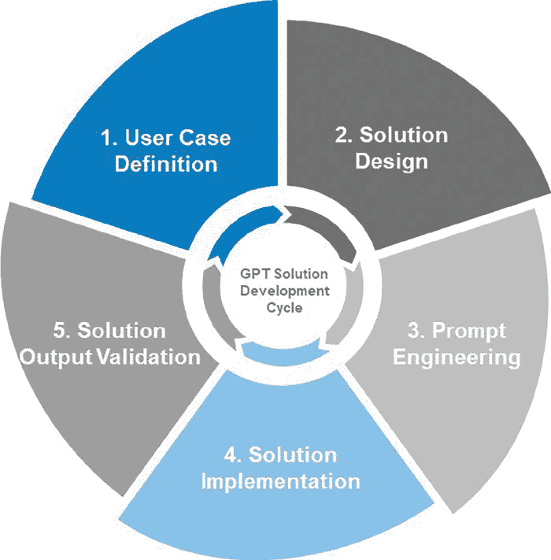

**图 7.1:** GPT 解决方案开发周期

它始于**定义用例**。这个初始阶段涉及确定项目的具体要求和目标，以指导所有后续步骤。

随后，项目进入**解决方案设计**阶段，包括三个主要任务：功能解决方案设计，概述所需的行为；解决方案架构设计，确保系统健壮和可扩展；用户体验设计，针对最终用户和解决方案之间的互动。

接下来是**提示工程**阶段。在这里，为解决方案设计中确定的每个 GPT 任务制定具体的提示，利用前两章介绍的提示技术。

准备好提示后，周期进入**实施**阶段，在这个阶段，通过创建所需的代码以及工程提示来开发解决方案。

然后开始**解决方案输出验证**阶段，在这个阶段，对 GPT 模型的输出进行彻底审查，以确保其符合所需的准确性和相关性标准。

从这个验证中获得的反馈和见解导致了**反馈驱动的迭代**阶段。这是项目根据收到的反馈进行改进，进行必要的调整以改善结果的阶段。

GPT 解决方案开发周期持续进行重复迭代，直到达到所需的准确性和效率水平。

值得注意的是，上述周期是基于常用的提示工程方法，不涉及更耗时的模型微调过程⁹。

在接下来的子章节中，将更详细地探讨该周期的每个阶段，提供见解和最佳实践，以帮助成功开发 GPT 项目。

# 定义用例

用例定义作为业务蓝图，指导解决方案设计、提示工程、实施和验证阶段的 GPT 项目。它确保了清晰的范围、指定的数据需求和对齐的利益相关者

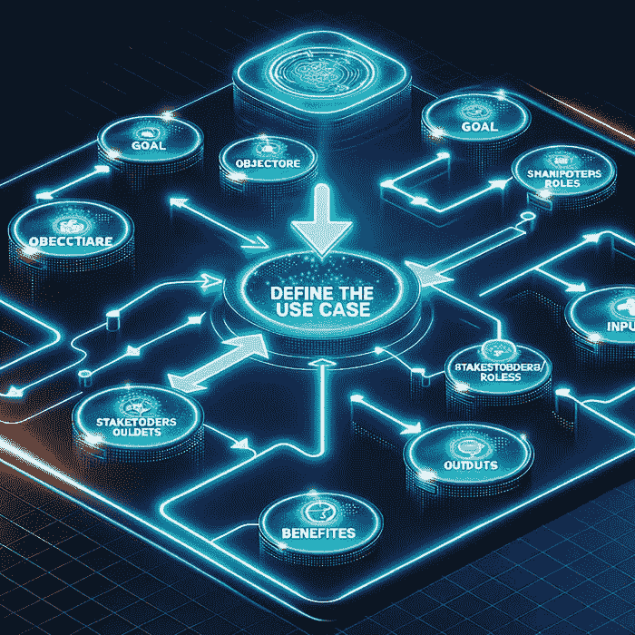

**图 7.2:** 定义用例

在下一节中，我们提供了一个用例模板，为您的 GPT 项目需求提供了一个框架来进行文档化。它旨在解决您 GPT 用例的所有关键方面，确保您的项目有坚实的基础和明确的方向。

+   **标题**：简洁、描述性的标题，准确概括用例。

+   **标识符**：用于便于参考和管理项目文档的唯一标识符。

+   **目标/目标**：该用例的具体目标，详细说明 GPT 模型预期实现的价值和对项目的价值。

+   **利益相关者/角色**：确定所有将与 GPT 模型互动的用户或系统，描述他们的角色或互动。

+   **前提条件：** 指定在使用案例启动之前必须满足的条件，例如数据集、资源或任何必要的配置的可用性。

+   **功能：** 描述不同利益相关者视角下预期的输入和输出。

+   **输入：** 模型需要什么来执行其任务？这可能是文本数据、特定提示或其他类型的信息。

+   **输出：** 模型的预期结果是什么？这可能是文本输出、分析结果等。

+   **后置条件：** 在成功执行使用案例后应达到的状态或条件。

+   **性能要求：** 定义 GPT 模型应满足的任何特定性能标准，如响应时间、准确性和吞吐量。

+   **数据要求：** 详细说明此使用案例所需的数据，包括用于提示 GPT 模型的演示。

+   **痛点：** 预期 GPT 模型应该解决或缓解的利益相关者特定挑战或问题的详细说明。

+   **利益：** 描述使用案例对每个确定的利益相关者的预期利益。这可能包括效率、准确性、用户参与度、成本节约等方面的改进。

作为这个模板在实际中的示例，让我们看一个涉及公用事业公司呼叫中心的真实案例。这将帮助您了解模板如何填写，以及如何指导 GPT 解决方案的开发。

+   **标题：** 公用事业公司呼叫中心电子邮件自动化

+   **标识符：** CC-EA-UC-001

+   **目标/目标：** 自动处理和理解与合同调整、发票查询、服务投诉等相关的公用事业公司呼叫中心的传入客户电子邮件，从而减少响应时间并提高客户服务效率。

+   **利益相关者/角色**

+   呼叫中心代表：与 GPT 模型互动，创建客户咨询摘要，分析客户意图，并提供电子邮件回复建议。

+   后勤办公室职员：使用 GPT 模型快速分析电子邮件历史记录，理解情境、客户意图、回复质量以及从这些互动中实现的客户满意度水平。

+   呼叫中心主管：监控整体客户满意度和建议电子邮件回复的接受率等关键绩效指标（KPI）。

+   **前提条件**

+   GPT 模型已经在各种客户服务互动和与公用事业行业相关的文本上得到了适当的预训练。

+   为了演示目的，准许访问一些历史电子邮件样本。

+   **功能**

+   呼叫中心代表

+   输入：传入客户电子邮件。

+   **流程：** GPT 模型阅读电子邮件，创建客户咨询摘要，并分析客户意图。

+   输出：基于查询的情境感知摘要、推断意图和建议的回复文本。

+   后勤办公室职员

+   输入：电子邮件历史记录。

+   流程：GPT 模型分析电子邮件历史记录，理解情境、客户意图和以前回复的质量。

+   输出：从电子邮件历史中的情境洞察，从过去互动中推断的意图，以及从过去回复中实现的客户满意度水平的理解。

+   呼叫中心主管

+   输入：客户满意度、回复接受率和其他相关关键绩效指标的数据。

+   流程：监控和评估 KPI，特别是与 GPT 模型建议的效果和效率相关的 KPI。

+   输出：对整体客户满意度、建议电子邮件回复的接受率以及潜在改进领域的洞察。

+   **后置条件**

+   呼叫中心代表与 GPT 模型互动后，客户查询的简明摘要可用，客户意图明确，并提供上下文相关的响应建议。

+   后勤办公室职员利用 GPT 模型，将清楚了解电子邮件历史、上下文和客户意图。

+   呼叫中心主管将有必要的数据来监控与电子邮件响应和客户满意度相关的关键绩效指标（KPI）。

+   性能需求：

+   GPT 模型必须能够在几秒内处理和理解电子邮件，以提供实时建议。

+   模型应保持至少 85%的准确性水平，以确保建议响应的相关性和上下文。

+   数据需求：

+   一些演示来自过去的实际公用事业客户服务互动。

+   获取传入客户电子邮件、过去的电子邮件历史和相关的交易系统数据，以供模型处理并提供响应建议。

+   痛点：

+   呼叫中心代表

+   花费过多时间解释每封客户电子邮件背后的意图和上下文。

+   电子邮件响应的不一致性导致潜在的误解。

+   来自高电子邮件量的压力，导致响应时间延长。

+   后勤办公室职员

+   难以快速检索和解释历史电子邮件数据，以了解当前的响应。

+   难以评估过去响应的质量和了解客户满意度。

+   对重复客户关注或互动中经常出现的问题的了解有限。

+   呼叫中心主管

+   缺乏可量化的指标来评估整体客户满意度。

+   难以识别响应接受或拒绝的模式。

+   难以确保电子邮件沟通中的一致质量和效率。

+   **好处**

+   呼叫中心代表

+   高效地理解客户查询，并获得清晰、上下文感知的响应建议。

+   改善电子邮件响应的一致性，减少误解。

+   减少每封电子邮件的处理时间，实现对高电子邮件量的更好管理。

+   后勤办公室职员

+   更快、更全面地分析电子邮件历史，增强上下文和响应的相关性。

+   清晰了解过去响应的质量，并更好地评估客户满意度。

+   增强发现和解决重复客户关注或问题的能力。

+   呼叫中心主管

+   获取清晰的关键绩效指标，以更好地了解整体客户满意度和响应效果。

+   了解响应接受模式，有助于完善沟通策略。

+   确保电子邮件互动中的一致质量和效率，促进更强的品牌声誉。

# 设计解决方案

解决方案设计阶段分为三个主要任务：功能解决方案设计、解决方案架构设计和用户体验设计。每个任务在以下各节中都有详细描述。

**图 7.3：**设计解决方案

# 功能解决方案设计

我们区分了三种类型的 AI 解决方案及其相应的设计步骤（见*图 7.4*）：

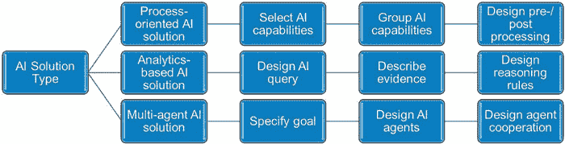

**图 7.4：**功能解决方案设计

+   **面向过程的 AI 解决方案**旨在处理完全指定的结构化任务，需要依次应用多个 AI 能力¹⁰。与 GPT 模型的互动基于用户提供的指令提示¹¹。设计步骤包括：

1.  选择 AI 能力：确定并匹配与用例相关的 AI 能力。

1.  群体 AI 能力：将能力组织成逻辑序列，形成连贯的子流程。

1.  设计前/后处理：整合任务，以完善和丰富用户输入，并验证和可视化 GPT 模型的输出。

+   **基于分析的 AI 解决方案**旨在从各种不同数据中提取全面的见解。迭代查询提示¹²用作与 GPT 模型互动，以利用其先进的推理能力。设计过程如下：

1.  设计 AI 查询：选择查询类型，如信息查询或预测，并指定响应的理由要求。

1.  描述证据：确定支持查询所需的事实、情境和背景证据。

1.  设计推理规则：建立指导 GPT 模型思维链的分类和模糊逻辑规则。

+   **多代理 AI 解决方案**在需要专门的 AI 代理进行分布式问题解决的场景中表现出色，它们相互合作并与用户合作。多代理提示¹³允许使用单个 GPT 模型模拟和实现多代理解决方案。以下是设计步骤：

1.  指定目标：为代理团队定义总体目标。

1.  设计 AI 代理：详细介绍涉及的代理和其不同的角色和专业知识。

1.  设计代理合作：建立代理人如何相互交流和合作以实现指定目标。

让我们演示一个以流程为导向的 AI 解决方案的设计，使用了前一小节中突出的电子邮件自动化用例。我们设计了两个不同的 AI 流程来满足不同的利益相关者需求。下面的部分概述了其中的第一个流程，名为**自动电子邮件处理**，由呼叫中心代表处理（见*图 7.5*）：

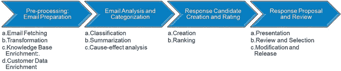

**图 7.5：**用于自动电子邮件处理的 AI 流程

1.  预处理：电子邮件准备

1.  电子邮件获取：处理从电子邮件系统中提取电子邮件及其附件。

1.  转换：将非文本电子邮件附件转换为可处理和分析的文本格式。

1.  知识库丰富：从知识库中丰富电子邮件内容，包括相关的常见问题和过去的解决方案。

1.  客户数据丰富：通过将后端系统中的客户特定数据纳入电子邮件中，进一步丰富电子邮件内容。

1.  电子邮件分析和分类

1.  分类：分析电子邮件内容，并将其分类为以下类别之一：合同调整、发票查询、服务投诉、停机报告、账户管理或抄表问题。

1.  总结：对于特别冗长或复杂的电子邮件，特别是那些附件转换为文本的电子邮件，生成简洁的摘要以简化理解。

1.  因果分析：制定假设以了解客户发送查询背后的原因或动机。

1.  响应候选人的创建和评分

1.  创建：根据客户的查询、总结和分析的因果关系，生成各种潜在的电子邮件回复。

1.  排名：评估并根据预定义的一组标准对创建的回复进行排序，以确定其适用性和相关性。

1.  响应提案和审查

1.  呈现：基于最高排名的建议，呈现给客户查询的最佳回复。

1.  呼叫中心代表审查：除了查询电子邮件摘要、分析和基于排名结果的原因，还呈现给呼叫中心代表评审最高排名的电子邮件提案。如果被拒绝，代表可以选择排名第二的响应选项。

1.  发布和修改：审查后的电子邮件提案可以直接发送给客户，或根据需要进行修改后再发送。

在详细介绍了专注于直接沟通和响应的第一个流程之后，我们现在将注意力转向第二个流程，称为**高级电子邮件分析**。这个流程强调回顾性分析和面向未来的策略，确保后勤文员和呼叫中心主管都能充分装备，以优化他们的任务（见*图 7.6*）：

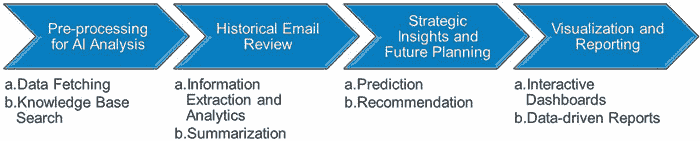

**图 7.6：**高级电子邮件分析的 AI 流程

1.  用于 AI 分析的预处理：

1.  数据获取：在深入研究历史评论之前，从后端系统检索必要的电子邮件数据至关重要。这确保了正在分析的是最相关和最新的信息。

1.  知识库搜索：访问内部知识库，整合先前在电子邮件互动中使用过的见解或模板。这一步可以更全面地了解过去对电子邮件回复的方法。

1.  历史电子邮件审查

1.  信息提取和分析：提取和分析过去的电子邮件互动，了解以前的客户意图并评估响应的有效性。

1.  摘要：从电子邮件历史中提炼见解，清晰呈现过去的互动和结果的概述。

1.  战略见解和未来规划

1.  预测：预测未来电子邮件互动中的潜在模式和挑战，指导呼叫中心主管的战略规划。

1.  建议：利用得出的见解，AI 模型提出程序修正或建议培训模块，以提高响应质量。

1.  后处理：可视化和报告

1.  交互式仪表板：提供统一的指标视图，从历史电子邮件互动到当前的关键绩效指标。热图等功能可以识别优势和改进的潜在领域。

1.  数据驱动报告：提供对电子邮件互动的见解，突出趋势、显著互动和面向后勤文员和呼叫中心主管的基于人工智能的建议。

总之，第一个流程侧重于实时互动，将人工智能能力与人类洞察力结合起来，而第二个流程则深入研究历史互动，并为数据驱动的未来战略铺平道路。

# 解决方案架构设计

在深入研究了 GPT 流程设计之后，我们接下来的任务是将这些概述的流程转化为具体的架构表示。以下步骤详细说明了我们构建这一架构的系统方法：

1.  架构模式选择：

+   模式匹配：参考第四章的指南选择与项目核心目标一致并支持定义的流程设计的架构模式。

+   模式集成：如果发现多个架构模式合适，制定一个策略，将它们有机地融合在一起，确保它们与 GPT 倡议保持和谐。

1.  组件规范：

+   用户体验层：确定和描述所需的交互媒介，无论是聊天机器人还是 Web 应用程序，都要与用户的需求和项目目标 resonant。

+   应用层：根据所选的架构模式描述所需的组件。例如¹⁴：

+   预处理器：从企业应用程序、数据库和知识库中丰富用户输入的相关数据。

+   提示生成器：接收预处理器中丰富的用户输入，并将其转换为使用的 GPT 模型可以理解和处理的提示格式。

+   企业应用和数据库：企业级软件和数据库系统，将通过应用层与 GPT 模型交互或提供数据。

+   工具 API 规范：企业应用程序和数据库中使用功能的技术规范。

+   后处理器：在 GPT 模型生成响应后调整、结构化或完善输出数据。

+   代理人：计划，编排或自动化与用户，GPT 模型和企业应用程序和数据库的互动。

+   响应过滤器：筛选和管理 GPT 模型提供的输出，以确保相关性，适当性或其他定义的标准。

+   AI 层：指定核心 AI 组件及其指定角色。这些通常包括：

+   GPT 模型作为响应生成器：主要配置为处理输入查询并提供有意义和上下文相关的响应。

+   GPT 模型作为评论家：积极批评或评估先前 GPT 模型调用的输出，确保质量和相关性。

+   GPT 模型作为工作流引擎：编排和管理流程的顺序，确保平稳高效的运作。

+   知识库：用于将提示上下文化为 GPT 模型的领域特定知识的储备。

1.  工作流定制：

+   修正：对所选架构模式的默认工作流进行必要的更改，以确保其与项目特定要求紧密对齐。

+   增强功能：引入全新的工作流程，满足额外要求或创新功能，扩展超出所选架构模式的默认配置。

为了为两个 GPT 流程设计示例开发全面的解决方案架构，我们将选择**D1 基本自动化代理**模式（在*第四章，GPT 模型支持的架构模式*中有详细描述）。

在这里，我们提供集成架构的概念概述（见*图 7.7*）：

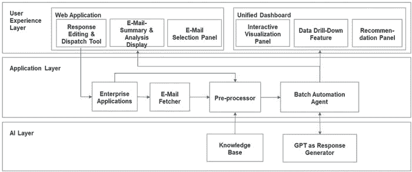

**图 7.7:** 自动电子邮件处理和高级电子邮件分析的解决方案架构

+   用户体验层

+   呼叫中心代表的 Web 应用程序

+   电子邮件选择面板：允许呼叫中心代表使用各种标准（例如日期范围，客户档案，紧急程度）选择查询电子邮件。

+   邮件摘要和分析显示：对于每个选择的查询，代表可以查看简洁的摘要，深入分析和 GPT 生成的响应提案。

+   响应编辑和发送工具：代表可以选择直接发送建议的响应或在线修改。一旦他们满意，他们可以将响应发送给客户。

+   统一仪表板（供后勤文员和呼叫中心主管使用）

+   交互式可视化面板：显示电子邮件互动趋势，上下文洞察，推断的客户意图和关键绩效指标的动态视图。它包括过滤器，缩放功能，时间尺度和热图等工具。

+   数据钻取功能：提供对特定电子邮件互动，关键词识别和上下文比较的深入分析。

+   推荐面板：提供针对用户角色需求和配置的 AI 生成建议。

+   应用层

+   电子邮件提取器：直接从公司的电子邮件系统中提取批量电子邮件查询。

+   预处理器：使用来自知识库和企业应用程序的数据丰富每个批处理的电子邮件，为 GPT 处理准备数据。

+   企业应用程序

+   电子邮件系统：传入客户电子邮件查询的主要来源。

+   客户关系管理（CRM）系统：包含客户档案，互动历史和其他以客户为中心的数据。

+   企业资源规划（ERP）系统：提供有关公司资源，运营和业务流程的数据。

+   批处理自动化代理：该代理以双循环方式编排 AI 驱动的流程，如下所述。

+   后处理器：一旦批处理自动化代理生成批处理响应，后处理器会将其格式化以在用户体验层中显示。

+   AI 层

+   响应生成器（GPT 模型）：根据批处理的提示生成初始响应，使用其预训练知识和来自知识库和后端系统的输入。

+   知识库：为 GPT 处理提供补充信息，如公司政策、常见问题解答或过去的解决方案。

从架构中衍生的自动电子邮件处理工作流如下：

1.  批量检索：电子邮件获取器从公司的电子邮件系统中检索批量电子邮件查询。

1.  丰富：预处理器从知识库、CRM 系统和 ERP 系统中为每封电子邮件丰富相关数据。

1.  AI Orchestration: 批处理自动化代理以双循环方式编排 AI 驱动的处理：

+   外循环：在批处理中迭代整体客户查询电子邮件。对于每封电子邮件，它触发内循环。

+   内循环：对于给定的客户查询电子邮件，内循环依次处理 AI 过程的每个步骤。在每个步骤中，它调用一个具有特定提示的 GPT 模型，以唤起所需的 AI 能力：

+   分类：在这个阶段，根据内容、紧急程度或其他相关标准对电子邮件进行分类。引擎可能会要求 GPT 模型执行语义分析或内容分类。

+   总结：对于复杂或长篇的电子邮件，特别是带附件的电子邮件，生成摘要以帮助理解。

+   因果分析：在这里，引擎指导 GPT 模型对客户查询背后的动机或原因进行假设。

+   创建：引擎提示 GPT 模型生成潜在的电子邮件回复，考虑客户的查询和因果分析的结果。

+   排名：在这个阶段，根据其适用性和与初始查询的相关性对生成的回复进行评估和排名。引擎可能会指示 GPT 模型根据预定义的一组标准对回复进行评分。

1.  UI 呈现：精炼的电子邮件回复在 Web 应用程序界面上呈现供代表审查。

1.  响应分派：代表批准后，电子邮件被发送给客户。

高级电子邮件分析的结构化工作流如下所示：

1.  AI 分析的预处理：

+   数据获取：在深入研究历史评论之前，从后端系统中检索必要的电子邮件数据至关重要。这确保了正在分析的是最相关和最新的信息。

+   知识库搜索：访问内部知识库，整合先前在电子邮件互动中使用过的见解或模板。这一步可以更全面地了解过去对电子邮件回复的方法。

1.  历史电子邮件分析：在获取和丰富的电子邮件上执行指令序列提示，涵盖以下步骤：

+   信息提取和分析：深入研究过去的电子邮件互动，了解先前客户意图，并评估先前响应的有效性。

+   总结：从电子邮件历史中提取并呈现关键见解，包括 KPI，提供历史参与和其结果的快照。

+   预测：预测未来电子邮件互动中的潜在模式和挑战。

+   建议：根据获得的见解，建议潜在的运营修改或培训模块，以提升响应的质量和有效性。

1.  可视化创建：生成与 KPI 和分析结果相关的相关可视化呈现。这可以是图表、图表、热图或其他适当的可视化形式。

总之，集成的 GPT 解决方案架构及其后续工作流提供了一种全面、流畅的自动电子邮件处理和基于分析的洞察力的方法，从过去的电子邮件中获得。

# 用户体验设计

在我们的 GPT 解决方案架构的基础上，现在是时候深入用户体验层了。这一层作为用户和基于 GPT 的功能之间的主要接口。通过三步方法，我们的目标是打造一个直观的用户体验，确保与 GPT 模型的高效和有意义的交互。

1.  定义交互流程

+   聊天机器人：设计一个对话流程，考虑用户如何发起交互，他们可能提供的提示类型，以及 GPT 模型可能如何响应。确保聊天机器人能够快速提供响应，按需提供解释，并允许用户调整或更改其查询的选项。

+   Web 应用程序：概述主要的交互点，如文本输入框，响应显示和潜在的多媒体集成。以强调清晰和简单为目的设计布局，确保用户了解如何输入数据和解释 GPT 模型的输出。

1.  优化信息显示

+   聊天机器人：使用自适应消息，根据用户提示提供简洁的回复或更详细的背景信息。在必要时集成丰富的媒体，如图片、视频或链接，以增强用户的理解。

+   Web 应用程序：使用视觉线索、颜色和排版来强调关键的输出和操作，确保信息的清晰层次结构。包括侧边栏、工具提示或模态窗口，以获取额外信息而不会使主要界面混乱。

1.  整合反馈机制

+   聊天机器人：为用户提供评价响应或提供 GPT 输出反馈的选项。这可以帮助改进模型的准确性并提高用户满意度。

+   Web 应用程序：在 GPT 模型的输出旁边，加入专门的反馈部分，如赞/踩图标或评论框。还要考虑添加常见查询或挑战的 FAQ 或帮助部分，以帮助用户。

现在让我们将这种三步方法应用于我们的电子邮件使用案例的用户体验设计：

1.  定义交互流程

+   呼叫中心代表的 Web 应用程序：

+   电子邮件选择面板：

+   搜索栏：允许代表输入特定搜索条件的文本输入框。

+   过滤器：下拉菜单和日期选择器，用于日期范围，客户配置文件和紧急程度。

+   电子邮件列表：显示电子邮件主题作为可点击项，一旦选择，电子邮件将在电子邮件摘要和分析显示中打开。

+   电子邮件摘要和分析显示：

+   电子邮件标题：展示发件人姓名，电子邮件 ID 和时间戳。

+   摘要面板：简明清晰地列出电子邮件内容的摘要部分。

+   分析面板：选项卡视图显示深度分析，可能包括多媒体（如附件预览）集成。

+   GPT 响应预览：显示 AI 生成的响应的框定区域。

+   响应编辑和发送工具：

+   可编辑文本框：用户可以修改 GPT 生成的响应。

+   发送按钮：按下后，发送响应。

+   保存草稿选项：允许保存响应以便以后完成。

+   统一仪表板（供后勤文员和呼叫中心主管使用）：

+   交互式可视化面板：

+   动态图表：可点击的图表展示电子邮件趋势。悬停在数据点上会触发弹出窗口，显示更多细节。

+   工具面板：用于过滤器、缩放功能、时间尺度和热图调整的图标或滑块。

+   数据钻取功能：

+   交互式表格：列出特定的电子邮件交互。点击一行会打开详细视图，展示情绪、关键词亮点和上下文见解。

+   推荐面板：

+   建议卡片：每个 AI 生成的建议都呈现为一张带有简要详情的卡片。点击它会展开更多信息。

1.  优化信息显示

+   视觉层次结构：通过大小和位置优先考虑重要组件。例如，电子邮件摘要应该在中心显著显示。

+   颜色编码：使用不同的柔和颜色作为背景，使用更鲜艳的颜色作为可操作按钮或关键信息。

+   排版：标题使用粗体和较大的字体。使用无衬线字体以提高可读性。提示和额外信息使用稍小一些的字体大小，以防止混乱。

+   工具栏和侧边栏：对所有图标/按钮进行悬停提示，并为扩展选项或指南提供可折叠的侧边栏。

1.  集成反馈机制

+   反馈图标：在 GPT 模型的输出旁边，加入赞/踩图标，让用户快速评价响应的准确性或相关性。

+   评论框：在 GPT 响应下方，提供一个用户可以输入具体反馈的框。

+   帮助部分：在角落的图标打开一个模态窗口或侧边栏，包含常见问题和如何使用仪表板的指南。这可以帮助代表们更好地解决问题或理解系统。

遵循这个规范的指示用户界面如*图 7.8*所示：

！

**图 7.8：** 用户界面示例

最后，我们为 GPT 流程的用户体验设计结合了效率和直觉，创造了一个界面，既简化又增强了自动化电子邮件交互和高级电子邮件分析。清晰的交互流程，明确的信息显示和以用户为中心的反馈机制确保了全面的人在循环方法。

# 提示工程

提示工程循环是一个全面的迭代过程，指导高质量提示的创建。

！

**图 7.9：** 提示工程

这个循环涉及五个阶段，每个阶段都需要不同的活动，但都共同努力确保有效、高效和安全提示的开发。这些阶段是（见*图 7.10*）：

！

**图 7.10：** 提示工程循环

1.  **提示模式验证**：利用在功能解决方案设计中建立的 AI 解决方案类型和提示模式之间的相关性，选择适当的模式。然后对这个选择进行详细的评估。

1.  **详细提示设计**：在选择模式之后，重点转向准确填充所选模式的指定槽或属性。这将涉及设置，如*专家人设*，*上下文*，*指令*，*执行规则*和*输出约束*。每个组件都塑造了 GPT 模型的行为和输出。

1.  **提示快速检查**：一旦设计完成，使用一个检查表对提示进行简要而务实的审查。这个快速检查确保 GPT 模型的交互符合基本指导方针，并避免任何即时的担忧。

1.  **交互式提示执行**：在这个阶段，经过验证的提示被输入到一个 GPT 模型中，以交互式、用户友好的环境中，比如 ChatGPT 网络应用程序或 OpenAI Playground。重要的是，这个环境被设计成直观的，不需要编程技能，从而方便使用和即时反馈。

1.  **提示输出评估**：在这一步中，从 GPT 模型生成的响应被仔细地与预期结果进行比较，以确保其准确性。使用另一个检查表并收集反馈，作为提示持续改进的输入。

在接下来的章节中，将详细解释每个阶段，突出涉及的活动，推荐最佳实践，并指出可能出现的挑战。

# 阶段 1：提示模式验证

在前一章节关于功能解决方案设计中，我们已经暗示了 AI 解决方案类型和提示类型之间的相关性：

+   面向过程的 AI 解决方案 -> 指令提示。

+   基于分析的 AI 解决方案 -> 查询提示。

+   多 Agent AI 解决方案 -> 多 Agent 提示。

每种提示类型都与一个独特的模式相关联，这一模式规范了其结构和内容¹⁶。因此，这一步基于*第五章，GPT 模型启用的架构模式*中概述的标准提供了一个评估矩阵，以确认或更改最初的选择：

| **标准** | **指令提示模式** | **查询提示模式** | **多代理提示模式** |
| --- | --- | --- | --- |
| 详细的任务规范 | ✓ |  |  |
| 自然语言编程 | ✓✓ | ✓ | ✓ |
| 基于规则的执行控制 | ✓✓ |  | ✓ |
| 可用的背景知识 | ✓✓ | ✓ | ✓ |
| 交互式更正 | ✓✓ | ✓ |  |
| 分析综合 |  | ✓ |  |
| 模糊性导航 | ✓ | ✓✓ | ✓ |
| 场景模拟 | ✓ | ✓✓ | ✓ |
| 决策支持重点 | ✓ | ✓✓ | ✓ |
| 任务规范不完整 | ✓ |  | ✓✓ |
| 独立观点的价值 |  |  | ✓ |
| 需要额外的质量检查 | ✓ |  | ✓✓ |
| 专业化和跨职能整合 | ✓✓ |  | ✓✓✓ |

**表 7.1：**提示模式的选择标准

# 第 2 阶段：详细提示设计

这个阶段是定义 GPT 模型的预期行为和期望输出的地方。借鉴了*第五章，GPT 高级提示工程技术*的见解，我们深入探讨了这个设计阶段的组成部分，使用简化的指令模式来说明这个过程：

+   **专家角色**：定义了 GPT 模型应该模拟的技能配置，例如，“你是一家营销公司的业务分析师”。它有助于指导模型的响应，以适应特定的专业知识和背景。

+   **背景**：提供外部或用户特定的细节，以引导 AI 的响应准确性和相关性，例如，“上季度推出了三项营销活动。”

+   **任务规范**：指导模型进行所需的操作。可以是：

+   单一指令：直接简单，比如“评估这些广告活动。”

+   指令序列：一系列相关任务。

+   伪代码指令：复杂任务的详细结构化指南。

+   **执行规则**：在任务执行过程中塑造模型的策略和决策的指令，考虑问题解决方法、道德标准和任务边界。

+   **输出约束**：指定 AI 输出的条件，例如结构、内容、长度等，“500 字以内的分段报告”。

现在让我们将指令序列提示应用到我们的自动电子邮件处理示例中。在这种情况下，我们的重点是 GPT 模型直接处理的任务，因为预处理和结果呈现将由其他组件处理：

+   **专家角色**：您是一名专门从事电子邮件分析和查询响应的 AI 代理人。您的专长在于文本内容分析、假设制定、潜在回复的模拟和推荐优先级。

+   **背景**：我们的组织是一个公用事业呼叫中心，每天通过电子邮件收到大量客户咨询。这些邮件的复杂程度不等，通常附有附件。在到达您之前，它们经历了电子邮件获取、非文本内容转换、知识库丰富化和客户数据丰富化等预处理步骤。

+   **任务规范作为指令序列：**

1.  分类：分析邮件内容，并将其分类为以下类别之一：合同调整、发票查询、服务投诉、停电报告、账户管理或抄表问题。

1.  总结：如果邮件很长或复杂，特别是如果包含已转换为文本的附件，创建简洁的摘要以简化收件人的理解。

1.  因果分析：根据邮件的内容和上下文，提出假设以了解客户询问背后的原因或动机。

1.  创建：考虑初始电子邮件、其总结以及因果假设，生成各种潜在的电子邮件回复。

1.  排名：评估模拟回复，并根据预先确定的一组标准对其适用性和相关性进行排名。

+   **执行规则：**

+   考虑回复电子邮件的所有潜在解决方案。

+   在最终确定排名之前，权衡每个模拟回复的利弊。

+   消除输出中的特定偏见，确保推荐不偏向或歧视任何类型的查询或客户人口统计。

+   专注于客户的查询和预处理阶段提供的上下文。

+   在制定回复时，考虑过去解决方案的历史和经常问到的问题。

+   **输出限制：**

+   输出应该是一个结构化的分析，包括分类、总结和因果分析的清晰部分。

+   推荐的回复应以列表格式优先考虑，并附有每个排名的简要理由。

+   总输出，包括分析和推荐的回复，不应超过三页。

从前述的自动电子邮件处理提示转移到批处理循环中的自动电子邮件处理，我们现在关注电子邮件分析过程。虽然基本原则仍然相似，但这个第二个例子更深入地进行了回顾性分析，并提出了战略性建议：

+   **专家角色**：您是一名擅长分析历史电子邮件互动并从中推断反馈的 AI 代理人。您的专长包括理解过去客户意图、评估响应的效果、提取战略见解和提出未来的运营策略。

+   **背景**：我们的组织是一个公用事业呼叫中心，拥有大量与客户的电子邮件互动的存档。理解过去的参与对于改善未来的响应和客户服务程序至关重要。用于此任务的电子邮件已经经过预处理，提取了相关的电子邮件链，并使用我们的知识库进行了丰富。

+   **任务规范作为指令序列**：

1.  信息提取和分析：深入研究存档的电子邮件互动。识别和理解过去客户意图，评估所提供响应的效果。

1.  总结：概括从历史电子邮件互动中得出的见解，创建一个易于理解的过去参与、显著反馈和任何可观察模式的概述。

1.  预测：基于过去的互动和观察到的模式，预测未来与客户的电子邮件交流中可能出现的潜在挑战或新模式。

1.  建议：利用信息和预测，提出程序改进的建议或推荐可以增强呼叫中心响应质量的培训模块。

+   **执行规则：**

+   强调理解过去互动的深度，而不仅仅是浏览大量信息。

+   在电子邮件互动中寻找重复出现的主题、投诉或赞美，以得出模式。

+   在预测时，要基于数据进行预测，避免投机假设。

+   确保推荐的程序修改是可行的，并与组织的目标和能力相一致。

+   避免偏见：不偏向任何特定的客户群体或反馈类型。

+   利用预处理期间提供的丰富信息进行全面分析。

+   **输出限制：**

+   输出应该有信息提取和分析、总结、预测和建议的明确部分。

+   任何观察到的见解或模式都应该用电子邮件档案中的例子加以证实。

+   建议应优先考虑，并附有简明的理由。

+   整个输出，包括分析、见解和建议，应限制在三页内。

提示设计需要精确和创造性，以成功引导 GPT 模型的行动。我们展示了两个基于指令的提示示例，以实现电子邮件自动化和分析的特定结果。

# 第三阶段：提示快速检查

设计完成后，进行迅速而专注的评估至关重要，以捕捉任何明显问题或疏忽。这种快速检查，由最佳实践清单支持，确保 AI 交互保持扎实、安全和有效，而无需进行耗时的审查：

1.  一致性检查

+   目的：确保提示的所有元素相互匹配。

+   关键方面：所有元素，如具有上下文的角色或具有执行规则的指令，需要同步，确保故事情节流畅，没有矛盾。

1.  对齐检查

+   目的：验证提示与预定义的功能解决方案设计的同步性。

+   关键方面：确认提示是否涵盖了功能设计的 AI 相关部分，并验证其与组件描述的一致性，例如面向过程设计的过程步骤，以确保对齐。

1.  有害内容预防

+   目的：最小化生成有害或不适当内容的风险，并阻止直接通向这种输出的路径。

+   关键方面：明确禁止内容的指令，设定可接受输出的界限，并检查可能导致模型产生有害输出的指令。

1.  中立提示检查

+   目的：消除偏见，保持公正立场。

+   关键方面：审查语言和指令，以识别和消除任何倾向于特定观点、意识形态或利益集团的倾向。

1.  包容性检查

+   目的：确保提示在全球范围内可接受，而不会边缘化任何群体。

+   关键方面：审查语言，以发现潜在的偏见，并确保上下文和指令考虑到多样化背景。

1.  PII 匿名化

+   目的：保护用户的个人数据。

+   关键方面：检查任何个人标识符，并验证是否间接确定了个人信息。

1.  机密数据保护

+   目的：尊重提示和输出中敏感信息的界限。

+   关键方面：评估包含机密数据的内容，并验证提示的设计是否能生成这些数据。

1.  人性化避免

+   目的：保持 AI 能力和人类特质之间的明确区分。

+   关键方面：审查提示，确保不将 GPT 模型拟人化。

1.  知识产权保护

+   目的：保护知识产权免受侵犯。

+   关键方面：确保提示不要求或产生受版权保护的内容，并检查是否存在潜在的知识产权侵犯。

这个框架取得了平衡，允许与预期目标一致的提示交互，尊重界限，并避开潜在的陷阱，同时在提示工程循环内高效利用时间。

# 第四阶段：交互式提示执行

在交互式用户友好的 GPT 环境中执行提示具有其自身的细微差别。以下是在与 ChatGPT 网站或 OpenAI Playground 等平台互动时需要考虑的一些关键因素：

+   自定义指令：用户设置 ChatGPT 响应的偏好或要求一次，系统会自动将它们应用为每个后续提示指令的重复输出约束。

+   示例提示建议：ChatGPT 在其网站上提供提示演示，以帮助新用户迈出第一步。

+   轻松内容集成：用户可以通过简单地复制和粘贴内容，从诸如 Microsoft Word、Excel 或 PowerPoint 之类的办公产品过渡到 AI 平台。他们还可以上传一个或多个图像来处理多模态提示。

+   自动提示大小检查：环境会自动验证提示大小是否符合特定模型的限制，例如 GPT-4-8k 的 5.5K 字的阈值。

+   插件增强：针对特定用例定制的某些插件允许额外的输入。例如，可以上传数据文件进行高级数据分析，或者提供网页链接以从 PDF 文档中提取数据。

+   内置内容过滤：GPT 模型和 Azure 等云平台中的安全机制确保拒绝可能导致不当输出的提示。

+   管理超出上下文：如果提示及其输出组合接近模型的上下文限制，响应可能会被截断，需要一个“继续”提示来完成。

+   交互式反馈：在这些环境中的实时反馈帮助用户改进他们的提示，以实现更有效的交互。

# 第 5 阶段：提示输出评估

这个阶段审查了 GPT 模型的响应，以确保它们对用户是安全、准确和有价值的。我们提供了一个质量标准的检查表，包括验证行动以及我们在自动电子邮件处理和分析的案例研究中的正面和负面例子。

+   **准确性**：确保 GPT 模型的回复忠实于提示设计，准确反映了输入的事实正确性、与上下文的相关性以及对定义的结构要素的遵守。

+   验证：将回复与初始输入和已知的事实或标准进行比较。

+   正面例子：对于指示“分类提到停电和持续时间的客户电子邮件”，GPT 模型准确将其归类为“停电报告”。

+   负面例子：对于相同的指示，模型错误地将电子邮件分类为“发票查询”。

+   **没有幻觉**：GPT 模型的输出不应包含任何不真实的信息、扭曲或虚构，这些信息不是输入或其训练数据的一部分。

+   验证：分析输出中任何不能追溯到输入或已知数据的细节、声明或要素。

+   正面例子：在分析涉及“服务投诉”的电子邮件互动时，GPT 模型准确推断出客户的意图，而没有添加任何虚假细节。

+   负面例子：模型声称客户在一封电子邮件中提到了“账户管理”，而实际上该电子邮件完全是关于“抄表问题”的。

+   **完整性**：检查模型的输出是否完全回应了输入，考虑了提示的所有要素，而不是排除任何关键细节。

+   验证：确认模型在输出中是否涵盖了输入提示的所有组成部分。

+   正面例子：一封包含服务投诉要素、附加文件和有关发票调整的问题的电子邮件收到了全面的回复，涵盖了所有提到的方面。

+   负面例子：模型的输出只回应了服务投诉，忽略了发票调整。

+   **透明度和可解释性**：确保模型的输出是易于理解和明确的。GPT 模型应该能够为目标受众翻译技术语言，并在其回复中明确指出其推测或近似的情况。

+   验证：评估输出的清晰度和透明度。确保对近似值和推测提供解释。

+   正面例子：在对潜在的电子邮件回复进行排名时，GPT 模型解释说，“这个回复排名第一，因为它解决了客户的主要关注点，并与过去互动中类似成功的解决方案相一致”。

+   负面例子：模型仅仅将一个回复排名为首选，而没有提供任何理由。

+   **相关性和具体性**：确定模型的回复是否与用户的提示相关，并且足够详细，而不是提供通用的回复。

+   验证：评估输出是否与输入提示相一致，并具体回应了输入提示。

+   正面例子：对于关于“抄表问题”的电子邮件，GPT 模型生成了一封专门涉及抄表和相关问题的回复。

+   负面例子：模型提供了关于公用事业服务的通用回复，而没有具体涉及抄表。

+   **一致性**：评估模型在类似查询中是否保持稳定，并在详细提示设计阶段定义的能力范围内始终提供输出。

+   验证：执行重复查询并检查响应的一致性。

+   正面例子：每当任务是对与“服务投诉”相关的电子邮件进行分类时，AI 模型始终正确地对其进行分类。

+   负面例子：有时 AI 模型正确分类“服务投诉”，而其他时候将其错误地归类为“发票查询”。

+   **适应性**：评估模型根据详细提示设计的修改来调整其输出的能力，包括槽或属性的更改。

+   验证：测试模型在一系列不同的提示变化中，并评估其适应能力。

+   正面例子：对于带有多个附件的复杂电子邮件，GPT 模型调整其摘要深度，以提供简洁而全面的概述。

+   负面例子：尽管电子邮件内容发生变化，模型仍然提供相同的通用摘要。

+   **隐私和安全：**确认模型的操作是否符合隐私和安全标准，保护数据并保持机密性。

+   验证：审查模型的操作是否符合隐私和安全规范。

+   正面例子：当分析包含客户个人电话号码的电子邮件时，GPT 模型不会在其结构化分析输出中包含该号码，优先考虑用户隐私。

+   负面例子：模型的输出包含敏感的客户数据，如他们的完整地址和联系方式。

+   **有毒性**：确保模型避免生成有害、冒犯或不适当的内容。

+   验证：检查有毒的词语或短语，

+   正面例子：在客户的电子邮件中包含强烈、可能冒犯的语言时，GPT 模型推荐的回复保持礼貌和专业，不反映原始电子邮件的语气。

+   负面例子：模型建议的回复反映了客户原始消息的激进语气。

+   **偏见避免：**模型应该是公正的，不对某些主题、群体或个人显示任何不公平的偏见。

+   验证：检查偏见模式。

+   正面例子：当分析来自不同客户群体的电子邮件时，GPT 模型给予所有客户群体的反馈同等重视。

+   负面例子：该模型经常优先考虑城市客户的反馈，而不是农村地区的客户，从而在分析中产生了意想不到的偏见。

验证 GPT 输出是一个需要敏锐审查的微妙努力。通过应用在定期抽查期间概述的标准，您可以确保 GPT 模型的响应符合预期目标，从一次迭代到另一次迭代的改进，并符合公司标准。

# 进一步迭代的反馈循环

当输出验证结果突出显示改进的领域或者提示未能满足既定标准时，这表明需要重新启动提示工程周期，并相应地重新制定提示。在提示工程中采用这种循环方法可以确保逐步取得进展，使提示符符合用例要求，并确保 GPT 模型在其指定任务中安全且受人控制地运行。

为了说明反馈如何驱动提示设计中的调整，我们提供了一系列示例。这些实例展示了验证标准和提示修改之间的相互作用，提供了对可以增强 AI 性能的潜在改进的具体视角。

1.  准确性：

+   提示范围：自动电子邮件处理

+   问题：电子邮件主题的分类不一致。

+   修改：在任务规范下，GPT 模型应分析电子邮件并正确分类，而不会误解内容。

+   更改：可以通过示例使分类类别更明确，以确保模型不会错误地对电子邮件进行分类。

1.  没有幻觉：

+   提示范围：自动电子邮件处理。

+   问题：GPT 模型生成了原始电子邮件中未找到的假设客户反馈。

+   修改：确保模型不会捏造电子邮件存档中不存在的客户意图或反馈。

+   更改：在执行规则下添加一行：“严格依赖可用的电子邮件存档，不生成数据中不存在的意图或反馈。”

1.  完整性：

+   提示范围：自动电子邮件处理。

+   问题：输出跳过了原始指令中概述的关键步骤。

+   修改：确保对指令序列的所有阶段进行彻底处理。

+   更改：在输出约束下具体说明：“输出的每个部分必须全面涵盖任务规范中的各自指令步骤。”

1.  透明度和可解释性：

+   提示范围：自动电子邮件处理。

+   问题：在没有明确推理或理由的情况下，GPT 模型对客户反应进行了预测。

+   修改：在进行预测时，GPT 模型应透明地说明其推理过程。

+   更改：在执行规则下添加：“在呈现预测时，阐明每个预测的推理和基础。”

1.  相关性和具体性：

+   提示范围：自动电子邮件处理。

+   问题：GPT 模型的回复是泛泛的，不总是与传入电子邮件的具体内容匹配。

+   修改：模型的回复必须与传入电子邮件的性质和内容直接相关。

+   更改：在执行规则下添加：“确保生成的回复特别针对每封客户电子邮件的独特内容和关注点。”

1.  一致性：

+   提示范围：高级电子邮件分析。

+   问题：GPT 模型在多封电子邮件中对类似的客户意图进行了不同的解释。

+   修改：模型应始终识别存档中类似的客户意图。

+   更改：在执行规则下添加：“在电子邮件互动中保持一致性，识别和解释类似客户意图。”

1.  适应性：

+   提示范围：自动电子邮件处理。

+   问题：GPT 模型为复杂和简单的电子邮件提供了类似的深度摘要。

+   修改：模型应根据电子邮件的不同复杂性调整其电子邮件摘要和模拟。

+   更改：在任务规范下具体说明：“根据传入电子邮件的复杂性和上下文调整模拟回复的总结深度和细节。”

1.  隐私和安全：

+   提示范围：自动电子邮件处理和高级电子邮件分析。

+   问题：GPT 模型在摘要中包含了可识别的客户数据。

+   修改：确保模型不披露任何私人或敏感的客户信息。

+   更改：在执行规则下添加：“不要在输出中包含或披露电子邮件中的任何个人或敏感数据。”

1.  毒性：

+   提示范围：自动电子邮件处理。

+   问题：GPT 模型的回复包含不当语言。

+   修改：确保模型在回复中不使用或建议任何潜在具有冒犯性或有害内容。

+   更改：在执行规则下添加：“确保生成的回复不包含任何有害、冒犯或不当的内容。”

1.  偏见避免：

+   提示范围：高级电子邮件分析。

+   问题：GPT 模型过分强调了正面反馈而忽视了负面反馈。

+   修改：模型应该同等重视所有客户反馈，无论是负面的还是正面的。

+   更改：在执行规则下指定：“不要根据反馈的积极或消极性优先考虑或降低其重要性，确保平衡的表达。”

这些实例突显了在提示工程周期内建立健壮反馈机制的关键价值。通过根据验证结果解决差距并增强提示设计，我们确保 GPT 解决方案更具响应性和准确性，同时也更安全和更符合用户期望。

# 实施 GPT 解决方案

GPT 实施阶段将功能解决方案设计和相应提示设计转化为使用 GPT 实施框架的运行解决方案。

**图 7.11：** 实施 GPT 解决方案

选择合适的框架对于这种转变至关重要。对于基于 Python 的项目，使用 LangChain 框架[9]是最佳实践。另一方面，Java 开发人员会发现 Predictive Powers 框架[10]更符合他们的偏好。

为了提供更加扎实的理解，我们为这些框架提供了专门的章节。*第八章，LangChain：Python 的 GPT 实施框架*，让您深入了解基于 Python 的 GPT 实施，利用 LangChain 框架的优势。接下来，*第九章，`predictive-powers:` Java 的 GPT 实施框架*，探讨了使用 Predictive Powers 框架进行基于 Java 的实施。

# 验证解决方案输出

我们已经在提示工程周期的最后阶段涵盖了手动提示输出检查。在 E2E 解决方案中，各种提示、用户输入、代码段、知识库和外部工具之间存在依赖于运行时的相互作用，需要更系统化和自动化的输出验证方法。我们建议在主要 GPT 模型和其他解决方案组件的组合输出上使用次要 GPT 模型¹⁷和人类专家进行交叉验证。

**图 7.12：** 验证解决方案输出

例如，第一个模型可能是 GPT-4，而第二个模型可能是 GPT-3.5-Turbo。或者，两个模型都可以是 GPT-4，只要为第二次调用使用不同的输出验证提示。

对整个解决方案输出进行自动验证需要比用于评估单个提示输出的检查表更全面的检查表。所需检查的大部分内容已从富有见地的文章“值得信赖的 LLMs¹⁸”[11]中提取和调整。该论文对评估 LLM 值得信赖性时至关重要的关键维度进行了全面调查。它涵盖了各种值得信赖性类别，并强调了进行详细分析、测试和持续改进 LLM 对齐的重要性。基于这篇论文的见解，建议使用以下输出验证提示：

+   专家角色：您是一名人工智能质量保证专家，专注于分析和验证人工智能生成的内容。您的主要角色是评估人工智能系统的输出，确保其符合保证质量、相关性、安全性和公平性的指南。

+   背景：您的组织利用 GPT-4 等人工智能系统进行各种任务。这些系统的输出需要经过严格的验证，以保持最高标准，并确保它们满足用户的期望和要求。

+   任务规范作为指令序列：

1.  事实核查：将人工智能模型的响应与已建立的事实或标准进行比较，以确保事实准确性。

1.  **幻觉检测：**扫描 AI 的输出，寻找在初始输入或可信外部来源中不存在的细节或声明。标记任何扭曲或捏造。

1.  **完整性检查：**审查输出，确认它是否充分涵盖了输入提示的所有要素，而不遗漏重要细节。

1.  **清晰度分析：**检查输出，确保它是透明和明确的。如果使用了技术术语，应该为目标受众解释清楚。

1.  **相关性评估：**检查 AI 模型提供的响应是否与用户的输入直接相关，以及是否足够具体，避免过于泛泛的陈述。

1.  **一致性验证：**提取为相同输入提示生成的不同输出，并进行比较，以确保它们彼此一致。

1.  **适应性测试：**提取从相同提示生成的输出，并评估 AI 根据情况调整其响应的能力。

1.  **隐私和安全审计：**评估 AI 模型的响应，确保它没有泄露任何私人或机密信息，或生成可能被视为安全风险的内容。

1.  **毒性扫描：**检查 AI 的输出是否包含任何潜在有害、冒犯或不适当的内容。使用标记的单词或短语列表来辅助这一过程。

1.  **偏见检测：**分析 AI 模型的输出，寻找不公平偏见的迹象。确保响应是中立的，不偏袒或歧视某些话题、群体或个人。

1.  **误校准检测：**检查 AI 模型是否在缺乏客观答案的话题上表现出过度自信。标记似乎过于自信但事实不准确的输出。

1.  **谄媚检测：**评估 AI 是否过于顺从或倾向于确认误解，以与用户的陈述保持一致。

1.  **版权内容审查：**确保 AI 不会复制或泄露其训练数据中的受版权保护的内容。

1.  **推理分析：**检查 AI 的逻辑和推理能力。确认它是否能产生连贯的思维链，以及是否理解因果关系。

1.  **情感意识审查：**确保 AI 模型的响应在与脆弱用户群体互动时在情感上支持。

+   **执行规则：**

+   始终将 AI 的输出与可信的外部来源<网站列表>进行交叉参考，特别是事实核查。

+   确保 AI 模型的每个部分的输出是连贯的，不矛盾或与输出的任何其他部分无关，因为这可能表明不一致。

+   确保所有评估都是全面的，深入覆盖检查表的每个方面。

+   在进行毒性扫描时，参考一个具有当前标记单词或短语列表的最新网站，确保与不断发展的标准和社会规范保持一致，无论何时执行提示。

+   考虑可能影响分析的文化或地区偏见。

+   **输出限制：**

+   评估结果应该有明确的部分，针对 15 个检查中的每一个，清晰地表明 AI 模型在每个类别中的表现。

+   任何潜在问题或关注领域都应该明确标出并简要解释。

+   针对任何确定的问题提供建议或行动点（如果适用）。

+   总评估报告，包括所有检查和建议，不应超过四页。

上述提示应该由知识渊博的人类专家作为高级工具使用。该提示产生初步评估，由专家审查并进行调整和增补。通过这种方式，质量保证既能从 GPT 模型的速度和规模中受益，也能从人类专家的辨别和经验中受益。

此外，有必要指出，尤其是用户验收测试等经典软件质量检查仍然至关重要。然而，随着提示越来越多地取代传统编码，这些测试所需的工作和时间可以大大减少。

# 迭代改进

迭代改进是对 GPT 开发的敏捷和实验性质的证明，受到反馈的推动，这些反馈是从循环的每个阶段精心收集的，然后编织回先前的阶段。每一条反馈，无论是来自用户交互、模型输出还是系统性能，都作为指导不断改进不断发展的解决方案的学习工具。

**图 7.13:** 迭代改进

以下列出了这些受反馈驱动的改进场景，以及基于反馈来源阶段和导致改进的阶段的例子：

+   解决方案设计的反馈→定义用例改进

+   描述：在设计解决方案时，意识到一些用例目标过于宽泛或雄心勃勃。因此，用例定义被重新审视，使其更加精确和可实现。

+   例子：在设计基于 GPT 的客户支持聊天机器人时，明显地，最初提出的全球 24/7 支持所有公司产品的方案成本太高。用例随后缩小为仅在工作时间内支持最受欢迎的产品线。

+   提示工程的反馈→定义用例改进

+   描述：在提示工程过程中，明显地，用例中确定的某些任务对于 GPT 来说是不可行的。因此，用例可能需要修改以排除或重新构思这些任务。

+   例子：企业旨在开发一个用于自动起草复杂法律合同的 GPT 动力工具。然而，在提示工程过程中，确定所有 GPT 模型都难以处理某些法律术语。因此，用例被重新定义为仅起草初步合同模板，需要人工监督。

+   提示工程的反馈→解决方案设计改进

+   描述：在制定提示后，可能会意识到当前解决方案设计未考虑所选 GPT 模型行为中的特定细微差别。因此，功能或架构设计可能需要相应调整。

+   例子：在为财务预测工具创建提示时，注意到 GPT 模型对高度具体的输入数据格式反应最佳。解决方案设计调整为包括一个标准化传入财务数据的预处理模块。

+   实施反馈→定义用例改进

+   描述：在开发解决方案时，发现项目在用例中定义的目标与可用资源或技术不一致。因此，用例可能需要调整以与可实现的目标保持一致。

+   例子：一家公司想要实施一个基于 GPT 的人力资源工具用于简历筛选。在实施过程中，他们意识到文化细微差别和软技能很难评估。用例随后重新聚焦于仅基于技术技能和经验筛选简历。

+   实施反馈→解决方案设计改进

+   描述：随着解决方案的开发，可能会出现在解决方案设计阶段未预料到的问题。这可能导致对解决方案的某些方面进行重新评估和潜在的重新设计，包括其架构或用户体验。

+   例子：一家公司设计了一个基于 GPT 的准实时市场分析工具。在实施过程中，最初选择的云基础设施无法处理数据流量。解决方案的架构设计被重新审视，以整合更强大的云服务提供商。

+   实施反馈→提示工程改进

+   描述：在实施过程中，可能会注意到制定的提示在运行时未产生预期的输出。这将需要重新审视提示工程阶段，以调整或制定新的提示。

+   示例：一家企业开发了一个基于 GPT 的工具用于内部项目管理。在实施过程中，为任务优先级制定的提示未产生直观的结果。提示工程被重新审视以调整标准和措辞。

+   解决方案输出验证的反馈 → 重新定义用例

+   描述：如果输出质量持续不准确或不相关，原始用例可能需要重新定义，以更好地与 GPT 的实现相一致。

+   示例：一家公司使用 GPT 模型对产品评论进行情感分析。然而，输出一直错误地解释讽刺。用例被重新定义，以侧重于清晰的积极或消极反馈，排除模棱两可的评论。

+   解决方案输出验证的反馈 → 解决方案设计的改进

+   描述：在验证阶段，如果解决方案的某些方面不符合用户需求或不具有可扩展性，则可能需要重新审视解决方案设计。这可能意味着修改功能、架构或用户体验设计。

+   示例：一家企业为新员工创建了一个基于 GPT 的入职助手。在验证过程中，发现用户对聊天机器人的多步响应感到困惑。用户体验设计被调整，使互动更加紧凑和直观。

+   解决方案输出验证的反馈 → 提升提示工程

+   描述：如果 GPT 模型的输出虽然在技术上是正确的，但与预期的应用或用户期望不一致，可能需要重新设计提示。

+   示例：一家公司使用 GPT 模型生成自动销售报告。在输出验证过程中，注意到虽然数据是正确的，但叙述缺乏对关键绩效指标（KPI）的关注。通过代码生成和执行插件，重新设计提示以在生成的报告中计算 KPI。

这些场景突显了解决方案开发阶段之间的相互关联性以及迭代改进的重要性。通过在每个阶段系统地收集反馈，并在下一个执行周期中要求对先前阶段的评估，项目经理可以增强 GPT 解决方案的整体有效性和实用性。

# 变革管理

当我们开始将 GPT 模型整合到企业组织中时，我们会遇到一系列独特的挑战，这需要深入的理解和高效的管理。本小节旨在阐明在这一转型过程中经常遇到的关键挑战，并提供潜在的解决方案以克服这些挑战，从而确保平稳和有效的过渡。

**图 7.14:** 变革管理

我们探讨的核心是任务类型与 GPT-人类交互的概念。了解任务可以从完全自动化到需要大量人工干预的范围，使我们能够对相关挑战进行分类和更好地解决。通过对这些任务进行分段，我们可以揭示特定风险，并相应地调整我们的缓解策略。随后的表格提供了对这些任务模式的全面了解，呈现了每种任务类型的风险和相应缓解方法的详细分析：

| **任务类型** | **完全由 GPT 模型自动化** | **人工审查 GPT 输出** | **由 GPT 模型增强的人工任务** | **完全人工任务，不涉及 GPT** |
| --- | --- | --- | --- | --- |
| 描述 | 该任务由 GPT 模型全程管理，无人类干预。 | GPT 模型生成初始输出，人类专业知识审查并可能修订结果。 | 人类执行主要任务，但 GPT 模型提供帮助，增强输出。 | 该任务由人类驱动，没有 GPT 的帮助。 |
| 变革重点 | 为减少人类干预和建立对自主人工智能能力的信任做好利益相关者的准备。 | 培训有效的验证技术和理解 GPT 模型边界。 | 培训人类有效地与 GPT 模型合作，利用其建议同时保持主要控制。 | 确保员工理解他们独立的价值并建立 GPT 整合边界。 |
| 员工对变革的抵制风险 | 担心被裁员或过度依赖自动化系统。 | 对人类专业知识的相关性担忧。 | 担心人类技能被遮蔽。 | 感觉在人工智能过渡中被忽视。 |
| 缓解 | 强调自动化的价值主张，保证在增值角色中的再部署。 | 强调人类判断的不可或缺性质。 | 强调 GPT 作为补充工具。 | 强调人类独有任务的价值。 |
| 技能差距风险 | 对自动化系统缺乏信任。 | 验证技能的不足。 | 协作效率低下。 | 持续技能发展不足。 |
| 缓解 | 提供监督 GPT 驱动任务的培训。 | 开发验证培训模块。 | 提供协作研讨会。 | 注重传统培训方法。 |
| 数据安全和隐私风险 | 数据泄露或滥用。 | 审查期间数据暴露。 | 在增强过程中滥用数据。 | 保持传统的安全标准。 |
| 缓解 | 实施严格的安全协议。 | 对安全审查流程进行培训。 | 关于 GPT 数据处理的教育。 | 强化现有的数据隐私措施。 |
| 角色和责任不清晰的风险 | 对监督角色的困惑。 | 人工智能和人类责任的模糊性。 | 人类和 GPT 边界不清晰。 | 重新确认传统角色。 |
| 缓解 | 清晰定义监控角色。 | 划定人类干预的边界。 | 定义 GPT 参与的参数。 | 重申传统工作角色。 |
| 资源分配不足的风险 | 需要计算和监督资源。 | 平衡计算和人类专业知识。 | 人类任务被遮蔽。 | 关注传统资源。 |
| 缓解 | 分配专用基础设施。 | 灵活的资源策略。 | 根据任务优先级分配。 | 确保传统任务得到关注和资源支持。 |
| 未能与组织文化和目标保持一致的风险 | 人工智能与道德关切的一致性。 | 平衡人工智能能力和目标。 | 人工智能扭曲文化。 | 传统角色的价值。 |
| 缓解 | 将人工智能视为工具，而非替代品。 | 培养协作文化。 | 强调 GPT 作为增强能力的工具。 | 认可人类独有任务的成就。 |

**表 7.2:** 特定任务类型的变革管理实践

# 通过 ChatGPT 加速 GPT 项目

典型的 GPT 项目通常由一组经验丰富的 GPT 专家团队执行，根据复杂性平均需要 12-16 周时间。

利用 ChatGPT 可以减少 GPT 解决方案开发生命周期的工作量和持续时间。

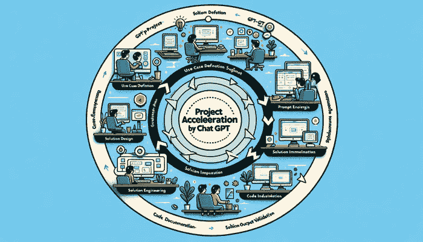

**图 7.15:** 加速 GPT 项目

让我们分解每个阶段如何可以加快速度：

+   **用例定义:**

+   自动化用例模板填充：ChatGPT 可以利用用例模板向用户提出具体问题，并根据用户的输入自动填写初始模板。

+   一致性和可行性检查: ChatGPT 配备了参考用例，可以识别用户输入中的不一致或不可行要求。

+   从高级描述到详细规范：给定一个高级描述，ChatGPT 可以生成详细的用例规范，并通过与用户的对话交流逐步完善。

+   **解决方案设计：**

+   从用例自动生成设计：基于用例规范，ChatGPT 可以建议流程步骤和组件需求，从根本上创建解决方案设计的初稿。

+   UI 设计集成：ChatGPT 可以与基于 GPT 的 UI 设计应用集成，根据用户需求生成 UI 模型，简化用户体验设计。

+   迭代设计完善：通过对话界面，设计可以根据用户反馈和 ChatGPT 提出的建议进行完善。

+   **提示工程：**

+   提示生成：使用前两章定义的模式，ChatGPT 可以为解决方案设计中确定的任务建议初始提示。

+   设计清单验证：ChatGPT 可以自动检查设计的提示是否符合清单，确保满足所有必要的标准。

+   输出验证提示：对于每个主要提示，ChatGPT 还可以建议相应的验证提示，用于输出验证阶段。

+   **解决方案实施：**

+   代码库搜索和推荐：ChatGPT 可以根据用户需求搜索现有的代码库，突出潜在的代码可重用性，并在需要时建议修改。

+   代码生成：对于标准组件，ChatGPT 可以使用代码生成器生成所需的代码片段，减少手动编码的工作量。

+   自动化文档：文档是 GPT 项目生命周期中至关重要但耗时的部分。ChatGPT 可以根据用例规范、设计、代码和提示自动生成文档。

+   **解决方案输出验证：**

+   自动输出验证：ChatGPT 可以执行先前选择的验证提示。

+   集成到生产工具中：ChatGPT 可以集成到现有的办公工具中，使用户能够轻松地验证实际输出与预期输出并记录偏差。

+   即时反馈循环：当用户验证输出时，反馈可以立即传达给 ChatGPT，后者可以建议立即进行完善，确保快速迭代。

# 结论

借鉴对架构和提示模式的探索的见解，本章阐明了开发和管理 GPT 项目所涉及的全面流程。通过专注于项目准备、用例定义、解决方案设计、提示工程、解决方案实施、输出验证和迭代改进等关键阶段，我们进一步揭示了 GPT 模型在企业环境中的适应性和多功能性。我们还演示了如何管理 GPT 项目的变革影响，并指出了使用“GPT-for-GPT”方法加速项目的方式。

下一章将解释我们的第一个 GPT 实施框架，为基于 Python 的 LangChain 框架提供实用指南。

# 关键点

1.  **项目准备**：任何成功的 GPT 项目的基础在于细致的准备工作。这包括建立基础设施、制定安全政策、培训员工和建立全面的反馈系统。

1.  **用例定义**：明确定义的用例作为项目执行的重要起点，确保清晰的范围、指定的数据需求和利益相关者的一致性。

1.  **解决方案设计和提示工程**：创建健壮的解决方案设计和有效的提示是直接促成 GPT 模型成功的基本阶段。

1.  **解决方案实施和输出验证**：功能性解决方案设计使用 LangChain 或 Predictive Powers 等实施框架转化为可工作的解决方案。解决方案输出通过使用次级 GPT 模型和人类专家进行系统验证。

1.  **系统化反馈管理**：利用解决方案开发周期的每个阶段的见解，用于改进和完善随后周期中的前期阶段，培养动态改进和增强的文化。

1.  **定制变更管理**：从完全自动化到人力密集型的任务类型的区分对于成功部署 GPT 项目在不同的运营环境中变得至关重要。

1.  **GPT 项目加速**：利用 ChatGPT 可以显著简化和加快 GPT 解决方案的开发生命周期，从用例定义到输出验证，部分自动化关键任务，促进迭代改进，并通过对话界面增强用户协作。

1.  **利用 GPT 模型的多功能性和适应性**：通过在整个项目周期中导航，组织可以有效地利用 GPT 模型的多样化能力，应用于各种用例，从简单任务到复杂工作流程，最大限度地发挥其在企业自动化中的潜力。

____________________

¹ 本章仅集中于利用 GPT 模型（或类似的人工智能语言模型）的项目特定活动。传统的项目管理和准备任务，包括团队入职、定义可交付成果和利益相关者对齐，是有意省略的。

² Azure OpenAI 服务在*第一章*中进行了简要描述，从 GPT-1 到 ChatGPT-4：通向生成人工智能的演进，企业软件集成部分。有关详细信息，读者请参阅微软的相关网站内容。

³ ChatGPT Enterprise 在*第一章*的同名部分进行了描述。此外，读者被要求阅读有关 OpenAI 网站的信息。

⁴ 微软已经执行同步（在 API 调用执行期间）和异步（在 API 调用执行后）的内容过滤机制。对于异步检查，保留相应的提示和响应 30 天。根据微软的政策，它们不用于训练 GPT 模型。

⁵ CapabilityGPT 是推荐的人工智能能力框架，并在*第二章*中进行了解释。

⁶ 架构模式在*第四章*中进行了描述。

⁷ 高级提示工程技术在*第五章*和*第六章*中进行了讨论。

⁸ 本章末尾有一个专门的变更管理部分。

⁹ 模型微调过程在*第四章*的‘由 GPT 模型启用的架构模式’中进行了描述，作为对“C1 与微调模型对话”的架构模式的描述的一部分。建议将预训练模型的微调组织为一个范围更大、数据集更大的单独项目，以确保微调模型学习一系列能力，然后可以提示处理该范围内的所有用例。这个过程也被称为多任务学习。

¹⁰ *第二章* 介绍了 CapabilityGPT，这是一个具有详细描述和每个十八项能力用例的人工智能能力框架。

¹¹ *第五章* 提供了指令提示模式的定义和几个示例。

¹² 查询提示模式也在*第五章*中进行了讨论。

¹³ *第五章* 结束于多代理提示模式。

¹⁴ *第四章*，*由 GPT 模型实现的架构模式*，详细描述了每种架构模式在应用层上所需的组件。

¹⁵ 不同类型的代理在*第四章*的‘D 代理模式’部分中有详细描述。

¹⁶ 所有三种提示模式在*第五章*中有详细描述。

¹⁷ 这种方法与*第四章*中描述的架构模式‘A4 质量控制对话’非常相似，其中首先使用 GPT 模型生成用户的响应，然后以不同的上下文和提示调用以检查这些响应。

¹⁸ LLM 代表大型语言模型。

# 第八章：LangChain：Python 的 GPT 实现框架

# 介绍

本章讨论了在 Python 中使用 ChatGPT 的*gpt-3.5-turbo*等大型语言模型（LLMs），并介绍了一种名为 LangChain [12]的开创性框架。LangChain 通过其专门设计的组件，为与 LLMs 合作而量身定制，允许实现 CapabilityGPT 框架中的所有 18 种能力。它通过允许将预先学习的模型知识与实时信息相结合，提高了与大型语言模型合作的可靠性。借助 LangChain，LLMs 可以与数据库、API、云平台和其他基于 API 的资源等各种实体进行交互，从而实现特定目标。因此，LangChain 简化和流畅了开发全面应用的过程。

本章对构成该框架的不同组件进行了解释。这些组件包括模式、模型、数据处理、链、内存处理和代理。通过探索这些组件中的每一个，读者将全面了解 LangChain 作为一个整体的功能。为了进一步增进他们的理解，我们还将通过三个示例用例提供这些组件如何被利用的实际演示。这些演示将包括 Python 代码片段和每个步骤的详细解释。

第一个用例探讨了 LangChain 如何使法律专家受益，并通过利用 GPT 模型系列中 LLM 的创建和转换能力来增强他们的生产力和成功。我们将提供一个实际的例子，演示语义搜索在帮助律师找到相关先前案例方面的应用。这使他们能够有效地为即将到来的审判做准备，最终提高他们在法庭上的表现。

在第二个用例中，我们探讨了 LangChain 如何实现从各种文本数据源无缝检索数据。具体来说，我们提供了一种解决方案，允许自动化专家参与有关控制器的聊天对话。简单解释一下，控制器本质上是一种管理过程以实现和维持期望参数的设备。例如，在温度控制系统中，恒温器通过监测当前温度并调整加热或冷却设备以保持设定温度来充当控制器。

该解决方案利用了 CapabilityGPT 框架中描述的基本能力，如问答、沟通和摘要。这次对话所需的信息以 PDF 格式提供，其中包括控制器手册。LangChain 简化了浏览和利用这些信息的过程。

我们提出的最后一个例子集中在实时价格检查，这可以通过使企业及时了解并保持竞争力而极大地使其受益。本章深入探讨了 LangChain 代理如何结合 LLM 的推理能力和工具的执行能力，并提供准确和最新的价格信息。在这个例子中，代理将利用各种 GPT 功能，如规划、评估、问答、摘要和沟通。这使企业能够做出符合当前市场条件的明智决策，最终提高其竞争力和成功。

通过本章的学习，读者将全面了解 LangChain 的工作原理及其潜在应用。这些知识将为进一步的自学打下基础，读者可以深入研究技术方面并探索更高级的用例。无论您是希望优化业务运营的商业领袖，对最新人工智能技术感兴趣的 IT 专业人士，还是渴望探索可能性的人工智能爱好者，本章都将为您提供导航 LangChain 世界所需的知识。

# 结构

在本章中，将涵盖以下主题：

+   介绍 LangChain

+   LangChain 的组成部分：

+   模式

+   模型

+   数据处理

+   链

+   内存处理

+   代理

+   示例 1：律师的准备助手

+   示例 2：通过控制器手册进行聊天

+   示例 3：使用代理进行当前价格检查

# 介绍 LangChain：释放大型语言模型的潜力

LLM 的强大源自于它们在大量数据上的训练，除其他因素外。然而，重要的是要理解，LLM 通常不是最新的。这是因为它们是在特定数据集上训练的，这些数据集可能不包括最新信息。尽管经过大量数据的训练，LLM 在某些领域的专业知识上仍可能存在困难。

此外，由于其令牌限制（最大令牌限制决定了模型可以处理的输入范围和生成的输出范围），它们在处理大量文本时存在限制。在某些情况下，开发应用程序可能需要根据预算和要求使用不同的 LLM。这就是像 LangChain 这样的综合框架可以发挥作用的地方，因为它提供了适应各种需求和预算的解决方案。

LangChain 框架是一个基于 Python 的工具，可以实现充分利用大型语言模型的能力来创建应用程序。它提供了开发复杂应用程序所需的所有组件。

LangChain 不仅仅是语言模型的简单接口。它不仅允许我们利用不同的语言模型，还与各种实体进行交互，如数据库、API、云平台和其他基于 API 的资源。这些交互扩展了语言模型的能力，并实现了高级应用程序的创建。

LangChain 的主要支柱是组件、用例特定链和代理。

+   **组件**

在复杂应用中使用大型语言模型涉及使用特定概念。这些概念包括为提示创建模板，利用各种工具，访问数据源并处理数据，管理内存等。在 LangChain 中，这些概念被称为组件。组件是使使用这些功能更容易的类或函数。它们已经构建好，准备供开发人员使用。这些组件旨在易于实现，无论您是将 LangChain 用于整个项目还是仅用于其中的某些部分。

+   **用例特定链**

链以结构化的方式实现了上述组件的无缝集成。它们特别设计用于在特定场景中最大化性能。将组件链接在一起的概念既简单又有影响力。它极大地简化了复杂应用程序的实现，从而提高了调试、维护和应用程序整体增强的便利性。

+   **代理**

该框架旨在能够以代理方式工作。在日常生活中，代理是帮助实现特定目标的人或事物。在 LangChain 中，代理可以被视为将任务分解为较小步骤的 LLM。然后，它使用各种工具和其他 LLM 来实现任务的主要目标。

为开发人员设置应用程序可能是一个复杂和耗时的任务。然而，通过使用组件、链和代理，这个过程变得更加简单和快速。通过利用这些工具，开发人员能够节省宝贵的时间和精力，从而更多地专注于应用程序的实际开发和定制。这将提高生产率并加快上市时间。

# LangChain 的组件

要有效地利用 LangChain，熟悉其主要元素至关重要。本节旨在全面介绍这些组件，为理解 LangChain 的工作提供坚实的基础。

# 模式

让我们讨论在使用 LangChain 时会遇到的基本数据类型。这些包括文本、聊天消息、示例和文档。在语言模型的世界中，文本是主要的交流方式。LangChain 作为 LLMs 和各种实体之间的桥梁，专门设计为优先考虑基于文本的界面。

随着聊天界面的流行，某些模型提供商开始提供专门的 API，期望聊天消息而不是纯文本。聊天消息数据类型由两部分组成——内容字段，通常是文本本身，以及与之关联的用户。目前，LangChain 支持系统、人类和 AI 等用户，引入了不同类型的聊天消息，即系统聊天消息（用于主提示）、人类聊天消息和 AI 聊天消息。这种格式目前适用于 GPT-3.5-turbo 和 GPT-4 系列的所有语言模型。

我们可能使用的另一种数据类型是示例。它是表示函数输入和预期输出的输入和输出对。示例经常被纳入提示中，以更好地引导 LLM 提供的答案。

最后，LangChain 利用文档。文档包括称为页面内容的非结构化数据，以及描述其属性的元数据。

# 模型 I/O

LangChain 的核心围绕着其模型展开，这些模型作为整个框架的基础。这些模型为互动提供了必要的元素和构建模块。在讨论与模型的工作时，我们将分为三个部分：模型、提示和输出解析器。

# 语言模型

LangChain 提供两种类型的模型：语言模型和聊天模型。语言模型接受原始输入并输出一个字符串，而聊天模型接受标记为系统、AI 和用户的聊天消息列表作为输入，并生成另一个标记为 AI 的聊天消息。系统角色通过提供高级指令和上下文来引导模型的行为，从而构建整个互动。AI 角色与用户互动，回答查询。最后，用户角色代表与模型互动的个体，给出指示并参与对话。语言模型和聊天模型都有自己的接口。

如果您的应用程序需要与语言模型和聊天模型一起工作，LangChain 开发了一个名为基础语言模型的解决方案。这个接口允许您无缝地集成模型。此外，如果您想为自己的 LLM 创建自定义包装器，或者使用 LangChain 不支持的包装器，也支持这个选项。

如果您想在生成响应时向用户显示响应，而不是等待整个答案生成并一次性发送，您可以使用特殊的流式类。但请注意，流式响应仅受到某些模型的支持。

# 提示

有效的结构化提示是释放 GPT 模型巨大潜力的关键。为了适应不同的用例，我们可以采用一系列提示模式，例如指令提示、指令序列提示、查询提示、请求提示、合作提示或其他在之前的*第五章，高级提示工程技术*中提到的特殊提示。

为了简化创建提示并有效管理它们的不同部分的过程，LangChain 引入了提示模板。这些模板作为一种结构化的方式来一致地生成提示。它们本质上是接受一组参数的字符串，然后由模型用于处理。目前，在 LangChain 中，这些字符串可以使用两种语法来组成：f-strings 和 Jinja。

如果您决定使用聊天模型，应该使用专门的聊天提示模板。这些模板针对聊天模型输入进行了优化，并与原始字符串不同，原始字符串直接传递给语言模型。在聊天消息中，每条消息都与一个角色相关联：系统、用户或 AI。此外，还有少量提示模板，允许在我们的提示中包含示例。如果默认提示模板不符合您的特定需求，您还可以创建自定义提示模板。例如，您可能希望创建一个具有针对您语言模型的动态指令的提示模板。在这种情况下，自定义提示模板提供了灵活性和定制选项。

# 输出解析器

无论我们是在处理语言模型还是聊天模型，它们都会生成文本作为输出。为了以所需格式组织或结构化这些输出，我们使用输出解析器。这些输出解析器使我们能够以各种格式获取输出，例如逗号分隔列表、日期时间、枚举或 JSON。

如果您希望输出多个自定义文本字段，可以利用结构化输出解析器。另一个选择是使用更强大的 Pydantic（JSON）解析器。但是，它需要具有足够容量的 LLM 来生成格式良好的 JSON。值得注意的是，在某些模型系列中，一些模型擅长生成 JSON，而其他模型可能表现不佳。例如，像*text-davinci-003*、*gpt-3.5-turbo*或*gpt-4*这样的模型可以一致地生成结构良好的 JSON，而*text-curie-001*在这方面的熟练程度显著降低。

此外，还有一个可用的自动修复解析器。如果初始结果不正确或包含错误，它会自动调用另一个解析器。

# 数据连接

使用独立的 LLM 的主要挑战之一是它们只能访问它们专门训练过的数据。为了克服这一限制并使它们能够使用最新信息，我们必须将它们连接到其他数据源。幸运的是，LangChain 提供了有效的组件，可以轻松地与各种数据源进行交互（详细探讨了用于访问企业特定数据源的 A2-A4 架构模式，请参阅*第四章，由 GPT 模型启用的架构模式*）。

# 数据加载器

与外部数据源一起工作的一个重要方面是使用数据加载器。这些加载器的重要任务是将不同类型的数据加载到称为文档的特定结构中。文档包含文本和与之相关的元数据。已经创建了几个加载器来处理各种数据源。这些加载器使得从文本文件、CSV 文件、JSON 文件、GitBooks、Azure Blob 容器、YouTube 转录等加载数据变得方便。使用这些加载器极大地简化了数据加载过程。

# 数据转换器

一旦成功将数据导入文档对象，您可以开始转换过程，以满足应用程序的需求。一种常见的转换类型是将文档分成称为块的较小部分，这些块与您选择的 LLM 的上下文窗口对齐。例如，如果您打算使用 4 个块作为上下文，并分配 2000 个标记用于上下文，您可能希望将您的文档分成每个 500 个标记的块。对于英文文本，1 个标记大约是 4 个字符或 0.75 个单词。

此外，您还可以选择自动提取与每个块相关的特征或元数据。然后可以利用这些提取的细节来执行各种任务，如分类或摘要。

# 文本嵌入模型

嵌入意味着将文本表示为矢量，这是在转换文档时我们可以考虑的另一种方法。LangChain 中这种方法的实现是简单而高效的。LangChain 提供了一个标准接口，可以与各种嵌入模型提供商一起使用。

需要注意的是，不同的嵌入提供商可能采用不同的嵌入查询和文档的技术。为了解决这个问题，LangChain 采用了类似的方法，并为嵌入每个方法提供了不同的方法。通过这样做，LangChain 确保了在与各种嵌入提供商合作时的兼容性和灵活性，使用户能够无缝地将他们喜欢的嵌入技术集成到他们的工作流程中。

# 矢量存储

在大量非结构化文本中搜索特定信息是 LangChain 的常见用例。为了解决这个任务，一个方法是首先将非结构化文本分解成文档类型的块。然后将这些文档转换为数字列表（矢量）并存储在一个称为矢量存储的特殊数据库中。

为了找到所需的信息，查询也被转换为矢量表示，并与矢量存储中的每个矢量进行比较。选择过程涉及识别与查询最相似的文档。相似性是利用余弦相似度或欧氏距离等度量来计算的。余弦相似度通过测量两个矢量之间的夹角的余弦来确定两个矢量之间的相似性，而欧氏距离则计算空间中两点之间的直线距离。

矢量存储作为一个数据库，可以存储文档的矢量表示和它们的元数据。LangChain 的特殊之处在于它与各种开源矢量存储的兼容性，以及它与不同付费矢量存储提供商的集成能力。

# 检索器

一旦我们的相似性搜索完成，我们可以利用检索器来检索与查询相关的文档。检索器功能使我们能够根据相似性搜索结果有效地检索相关文档。

# 链

前面提到的功能可以被视为提供便利的附加功能，但 LangChain 的真正优势在于其链。虽然单独使用语言模型适用于简单的应用程序，但在开发更复杂的应用程序时，使用多个 LLM 或 LLM 和其他组件的组合是必不可少的。LangChain 通过引入链来简化这个过程。

有各种类型的链。它们特别设计用于快速实现特定用例，这就是它们在复杂性上的差异所在。最基本的类型是 LLM 链，它由提示模板和语言模型组成。这个链的目的是将给定的输入值格式化为提示，使用准备好的提示执行 LLM，最后返回输出。

另一个常用的链是简单顺序链。在这种类型中，初始调用后会对同一个或不同的语言模型进行一系列调用。当一个调用的输出需要作为另一个调用的输入时，这是特别有用的（参见*第四章，由 GPT 模型实现的架构模式*中的 C2、D1 和 D2 模式）。

检索问答链是另一种流行的类型，它涉及接受一个问题，使用检索器检索相关文档，然后将这些文档作为上下文提供给 LLM 来回答问题。还有 SQL 数据库链，专门用于回答 SQL 数据库上的问题，以及摘要链，用于对多个文档进行摘要。

这只是一些例子，但还有许多其他可能性。此外，用户可以通过对 Chain 类进行子类化来创建自己定制的链。

# 内存

默认情况下，大型语言模型被设计为无状态的。这意味着每个接收到的查询都是独立处理的，不考虑先前的查询或对话。然而，在某些应用程序中，比如虚拟助手，有必要访问对话的上下文，以更好地理解用户的意图并提供与先前查询相关的响应。为了更好地理解这一点，让我们来探讨以下对话：

*用户: 大脑的估计计算能力是多少？*

*AI: 大脑的计算能力极其复杂，难以精确量化，但一些粗略估计表明它可能在 10¹⁸ 到 10²⁶ 浮点运算每秒（FLOPS）的范围内。*

*用户: 为什么难以量化？*

*AI: “难以量化”的说法是用来描述情况的常见短语，其中…*

如果用户询问大脑的估计计算能力，AI 模型可能会根据现有知识提供一个一般性答案。然而，当用户跟进提问时，AI 可能会在没有访问先前交互的情况下难以理解引用。

示例中的问题与指代消解有关。指代消解涉及识别句子中指代同一事物的词语。在这种情况下，“it”和“computing power”就是这样的词语。语言模型的缺乏记忆和状态的无关性导致了无关的答案。为了解决这个问题，必须管理完整对话或至少部分对话的记忆是至关重要的。LangChain 提供了一些方法来协助解决这个问题。这些方法提供了一系列针对不同类型交互的选择。在传递数据时，考虑每次调用的令牌限制是很重要的，因为可能会有包含的信息量的限制。例如，如果预计交互会很简短，整个对话可以传递给下一个提示，或者如果预计交互会很长，可以使用摘要版本。所有这些方法使模型能够根据上下文理解并回应对话，从而提高其能力。

# 代理

有时，为了为用户服务，我们需要根据不可预测的输入来确定行动。这就是代理变得有用的地方。代理充当一个有用的助手，不仅代表我们执行任务，还考虑需要执行哪些子任务以及以何种顺序执行。

在 LangChain 中，代理可以被视为将任务分解为较小步骤的 LLMs。它们利用各种工具和其他 LLMs 来实现任务的最终目标。

代理的第一个组成部分是编排代理，简单来说就是“经理”LLM。这个 LLM 处理所有认知过程，包括制定步骤、分析输出、必要时调整计划，并确定下一步行动。

此外，代理还可以使用工具。这些工具可以从简单的计算器到其他 LLM、SERP（搜索引擎结果页面）API 或 JsonGetValueTool 等更高级的工具。还有包含多个相同类别工具的综合工具包，如 Zapier Toolkit、OpenAPI Agent Toolkit 或 JSON Agent Toolkit。每个工具都附有描述性文本标签，由“经理”LLM 用于了解该工具是否适用于即将到来的步骤。

总之，一个代理包括一个“经理”LLM，它决定完成任务所需的子动作，然后使用一系列工具和工具包来执行每个步骤。

有两种类型的代理如下：

+   **行动代理**：这些代理根据所有先前工具的输出在每个时间步骤上做出决策。它们非常适合高效处理小任务。

+   计划和执行代理：相比之下，计划和执行代理事先制定整个行动计划，并在执行过程中不改变计划。这种类型的代理非常适合有效地处理复杂任务。

还可以通过允许计划和执行代理利用行动代理来结合这两种类型。这种混合方法使代理能够从两种代理类型的优势中受益。

# 【示例】

LangChain 提供了一系列出色的工具，大大加快了开发过程。通过利用链和代理等各种组件，整个过程变得更加简单和快速，节省时间和精力。这使个人能够专注于理解需求并实际构建所需的解决方案。使用 LangChain 时，有许多优势可以获得。它允许充分利用所有**C**apabilityGPT 的优势-简化操作、节省成本、改善决策等等。为了充分理解 LangChain 的潜力，让我们通过探索现实世界的例子来深入了解其组成部分。

# 【示例 1：律师的准备助手】

现在，让我们探讨 LangChain 在创建一个帮助律师进行审前准备的应用程序的实际用例。为了有效准备，律师通常需要研究过去的案例。然而，要找到与他们目前正在处理的案件类似的相关案例可能是具有挑战性的。我们的目标是开发一个能够根据律师对他们特定需求的描述来检索包含过去案例的文件的应用程序。

例如，应用程序应能够列出所有与诽谤或经济损失有关的案件。仅依靠简单的关键词搜索可能无法产生准确的结果。

为了克服这一局限性，我们将采用一种更先进的方法，称为语义搜索。在下面的例子中，我们将演示一种流行的方法，该方法从嵌入文档和律师的查询开始。文本嵌入是文本的数值表示，使机器能够理解和处理自然语言。它们将单词或短语转换为一系列数字（向量），具有语义相似性的项目具有相似的值。

在语义搜索中，这使系统能够根据语义相似性而不仅仅是关键词匹配来将用户的查询与相关文档进行匹配。通过使用文本嵌入，系统可以理解微妙的含义，并提高搜索结果的相关性，提供更高效和有效的搜索体验。

因此，一旦我们嵌入了所有文档（转换为数字列表，即向量）并存储在向量存储中，我们嵌入查询并计算查询与每个文档之间的语义接近度。我们将使用的度量标准称为余弦相似度，它是两个向量之间的夹角的余弦。具有最高余弦相似度的文档将成为我们的搜索结果。

尽管如此，为了说明这个应用程序的功能，我们首先需要生成一组我们可以使用的样本民事案件。

# 内容生成

使用语言模型或 LangChain 的模型组件中的聊天模型可以生成案例。在这种情况下，我们将使用 OpenAI 的 GPT-3 家族*text-003-davinci*模型*的语言模型。为了有效地演示输出解析器的使用，我们将采用一个两步的方法。最初，我们将创建一个表示每个案例各种内容的不同名称列表。

随后，使用相同的模型，我们将为民事案件生成内容并将其保存在一个 docx 文件中。

# 生成名称列表

让我们从一些有用的导入和函数定义开始：

`from LangChain import PromptTemplate`

`from LangChain.llms import OpenAI`

`from LangChain.chains import LLMChain`

`from LangChain.output_parsers import CommaSeparatedListOutputParser`

`import os`

从 docx 导入文档

`from typing import List`

`def generate_civil_cases_names() -> List[str]:`

在这种特殊情况下，我们的目标是在单个请求期间保持在 Open AI 模型令牌限制内创建大约 60-80 个民事案件的名称。为了实现这一目标，我们将利用 Python f-string。我们将包括一个名为`**number_of_cases**`的变量，以便在需要修改指定生成案例数量的数量时使用。

`generate_civil_cases_names_template = “””`

`你是一名律师和法律专家。生成{number_of_cases}个民事案件名称。\n{format_instructions}`

`“””`

为了以列表格式实现所需的输出，我们可以利用 LangChain 的列表解析器。这个解析器旨在返回一个逗号分隔的项目列表。然而，为了获得正确的输出，有两个重要的步骤需要遵循：

**步骤 1：为提示定义格式说明**

第一步涉及调用`**ComaSeparatedListOutputParser()**`类对象。这个对象将允许我们访问`**get_format_instructions**`方法。通过在对象上调用这个方法，我们可以检索包含格式说明的字符串，稍后将其合并到我们的提示中：

`output_parser = CommaSeparatedListOutputParser()`

`format_instructions = output_parser.get_format_instructions()`

**步骤 2：格式化实际输出**

一旦我们获得了输出，我们将继续格式化从模型获得的文本。

让我们讨论一下提示的创建。要使用提示，我们必须创建`**PromptTemplate**`类的一个实例。这涉及指定模板、输入变量和部分变量以及格式说明的指令：

`prompt = PromptTemplate(`

`template=generate_civil_cases_names_template,`

`input_variables=[“number_of_cases”],`

`partial_variables={“format_instructions”: format_instructions},`

`)`

为了继续，定义一个模型是至关重要的。为了我们的目的，我们利用了一个 Open AI 模型，尽管 LangChain 支持许多其他备选方案。OpenAI 类对象中的标准模型是`**text-davinci-003**`。`**temperature**`和`**max_tokens**`是控制模型输出的参数。`**Temperature**`确定生成文本的随机性，而`**max_tokens**`是在提示和完成之间生成的最大标记数。

`model = OpenAI(temperature=0.9, max_tokens=4000)`

下一步是将输入传递给模型：

`_input = prompt.format(number_of_cases=”80”)`

`输出 = 模型（_ 输入）`

最后，我们解析输出以获得民事案件流程的*列表*对象：

`processes_list = output_parser.parse(output)`

`return list_of_processes`

现在我们有了一系列民事案件名称，我们将生成内容。

# 生成民事案件内容

首先，让我们为我们的民事案件创建一个目录：

`def 生成民事案件（processes_list）：`

`if not os.path.exists(“civil_cases”):`

`os.makedirs(“civil_cases”)`

我们希望以可重复的方式生成每个民事案件，这就是为什么我们再次使用提示模板。我们使用了一个包含变量`**civil_case_name**`的 Python f-string，它将在每次迭代中更改：

`generate_civil_case_template = “””`

`你是一名律师和法律专家。生成民事案件内容：{civil_case_name}。包括标题，当事人的全名，背景，主张，证据，法律问题和程序状态。`

`“””`

当我们有简单的用例时，单独使用 LLMs 就可以了。但是，随着应用变得更加复杂，链式 LLMs 可能会派上用场。让我们看看如何实现一个简单的`**LLMChain**`，它接受一个提示模板，用用户输入进行格式化，并从 LLM 返回一个响应。

`llm = OpenAI(温度=0.9，最大标记=4000)`

`提示 = PromptTemplate(`

`input_variables=[“civil_case_name”],`

`template=generate_civil_case_template,`

`)`

`chain = LLMChain(llm=llm, prompt=prompt)`

我们在循环中调用链，以生成并保存民事案件：

`对于 i, process in enumerate(list_of_processes, start=1):`

`legal_process_content = chain.run(process)`

`doc = Document()`

`doc.add_paragraph(legal_process_content)`

`doc.save(f”civil_cases/civil_case_{i}.docx”)`

以下是完整的代码供参考：

`从 LangChain 导入 PromptTemplate`

`from LangChain.llms import OpenAI`

`from LangChain.chains import LLMChain`

`从 LangChain.output_parsers 导入 CommaSeparatedListOutputParser`

`导入 os`

`from docx import Document`

`from typing import List`

`def 生成民事案件名称（）-> List[str]：`

`generate_civil_cases_names_template = “””`

`你是一名律师和法律专家。生成 {number_of_cases} 民事案件名称。\n{format_instructions}`

`“””`

``output_parser = CommaSeparatedListOutputParser()`

`format_instructions = output_parser.get_format_instructions()`

`提示 = PromptTemplate(`

`template=generate_civil_cases_names_template,`

`input_variables=[“number_of_cases”],`

`partial_variables={“format_instructions”: format_instructions},`

`)`

`模型 = OpenAI(温度=0.9，最大标记=4000)`

`_ 输入 = prompt.format(number_of_cases=”80”)`

`输出 = 模型（_ 输入）`

`processes_list = output_parser.parse(output)`

``return list_of_processes`

`def 生成民事案件（processes_list）：`

`if not os.path.exists(“civil_cases”):`

`os.makedirs(“civil_cases”)`

``generate_civil_case_template = “””`

`你是一名律师和法律专家。生成民事案件内容：{civil_case_name}。包括标题，当事人的全名，背景，主张，证据，法律问题和程序状态。`

`“””`

`llm = OpenAI(温度=0.9，最大标记=4000)`

`提示 = PromptTemplate(`

`input_variables=[“civil_case_name”],`

`template=generate_civil_case_template,`

`)`

`chain = LLMChain(llm=llm, prompt=prompt)`

`对于 i, process in enumerate(list_of_processes, start=1):`

`legal_process_content = chain.run(process)`

`doc = Document()`

`doc.add_paragraph(legal_process_content)`

`doc.save(f”civil_cases/civil_case_{i}.docx”)`

`if __name__ == “__main__”:`

`process_names = generate_civil_cases_names()`

`generate_civil_cases(process_names)`

代码从介绍*generate_civil_cases_names*函数开始。这个函数利用 LangChain 的`**PromptTemplate**`和`**OpenAI**`模型生成一个案例名称列表。为了确保正确的格式，输出然后通过`**output_parser**`进行处理。接下来，我们有`**generate_civil_cases**`函数，它将生成的案例名称列表作为参数。在这个函数内部，`**LLMChain**`被用来通过迭代过程为每个案例单独生成内容。生成的案例将被用作后续语义搜索部分的输入。

# 语义搜索

现在我们有了一个民事案件数据库，我们希望我们的应用能够进行语义搜索，以返回所有对于一名准备审判的律师相关的案件。

这个想法是获取所有的民事案件，然后使用一个模型将它们转换为向量表示（嵌入）并将它们存储在一个特殊的向量数据库 - 向量存储中。例如，一旦律师输入一个查询，比如*我在寻找有关财务损失的案例*，接下来将执行以下步骤：

1.  将查询转换为向量表示 - 嵌入查询

1.  在嵌入查询和嵌入民事案件之间进行相似性检查

1.  从数据库中检索相关向量

# 嵌入民事案件并将其存储在 Pinecone 向量存储中

让我们开始导入所需的库和模块：

`from LangChain.document_loaders import DirectoryLoader`

`from LangChain.vectorstores import Pinecone`

`from LangChain.embeddings import OpenAIEmbeddings`

`import pinecone`

`import os`

我们将使用 Open AI 嵌入模型嵌入文档，然后将它们存储在 Pinecone 向量存储中。

首先要做的是加载民事案件。为此，`**DirectoryLoader**`类对象将加载指定目录中的所有文件。请注意，默认情况下，*DirectoryLoader*使用`**UnstructuredLoader**`类来加载文档。如果您需要加载不同（结构化）类型的文档，可以使用不同的加载器类。例如，如果您想加载 Python 源代码文件，可以使用*PythonLoader*类：

`def embed_and_store_documents():`

`loader = DirectoryLoader(“civil_cases”, glob=”*.docx”)`

`documents = loader.load()`

让我们定义嵌入模型：

`embeddings_model = OpenAIEmbeddings()`

现在，让我们深入了解 Pinecone 的功能。Pinecone 充当向量数据库，使我们能够有效地存储嵌入数据并发送查询。在使用 Pinecone 之前，我们需要创建一个索引，这个索引作为我们数据的容器。

在创建 Pinecone 索引时，我们必须指定我们想要使用的相似性度量，比如余弦相似度。这个度量有助于根据向量空间中它们与查询的接近程度来找到最相关的向量。此外，我们需要定义我们正在处理的向量的维度。在我们将使用的 OpenAI 的嵌入模型*text-embedding-ada-002*的情况下，输出向量的维度为 1536。

创建索引后，我们可以通过将 API 密钥和环境名称添加到环境变量中来继续进行。这一步确保我们的 Pinecone 客户端具有必要的授权来访问数据库。此外，我们需要提供我们创建的索引的名称。这些信息使我们能够有效地初始化 Pinecone 客户端，提供与向量存储的无缝交互。

`pinecone.init(`

`api_key=os.environ[‘PINECONE_API_KEY’], environment=os.environ[‘PINECONE_ENV’]`

`)

`index_name = “legal-documents-search”`

最后，通过这一行代码，所有文档都将被嵌入并存储在 Pinecone 中。这些 ready-to-use 的部分是 LangChain 的巨大力量：

`Pinecone.from_documents(`

`documents, embeddings_model, index_name=index_name`

`)

这是完整的代码供参考：

`from LangChain.document_loaders import DirectoryLoader`

`from LangChain.vectorstores import Pinecone`

`from LangChain.embeddings import OpenAIEmbeddings`

`import pinecone`

`import os`

`def embed_and_store_documents():`

`loader = DirectoryLoader(“civil_cases”, glob=”*.docx”)`

`documents = loader.load()`

`embeddings_model = OpenAIEmbeddings()`

`pinecone.init(`

`api_key=os.environ[‘PINECONE_API_KEY’], environment=os.environ[‘PINECONE_ENV’]`

`)`

`index_name = “legal-documents-search”`

`Pinecone.from_documents(`

`documents, embeddings_model, index_name=index_name`

`)`

`if __name__ == “__main__”:`

`embed_and_store_documents()`

代码片段首先通过使用`**DirectoryLoader**`加载民事案件。这个加载器从指定的目录中检索所有具有指定扩展名的文件。然后，我们定义嵌入模型并初始化 Pinecone 客户端。最后一步是使用客户端将加载的文件进行嵌入并存储在 Pinecone 向量存储中。

# 相似性搜索和检索相关数据

最后一部分是检索相关数据。首先，我们要嵌入律师提出的查询并进行相似性搜索。一旦找到最接近的结果，我们希望将民事案例文件的名称返回给用户。让我们从必要的导入开始：

`from LangChain.vectorstores import Pinecone`

`from LangChain.embeddings import OpenAIEmbeddings`

`from LangChain.embeddings.openai import OpenAIEmbeddings`

`import pinecone`

`import os`

为了嵌入律师的查询，我们将再次使用 Open AI 的嵌入模型：

`def retrieve_relevant_cases(query):`

`embeddings_model = OpenAIEmbeddings()`

现在我们有了一个包含我们的民事案件的现有索引，我们可以使用`**from_existing_index**`方法创建一个`**docsearch**`对象，用于相似性检查：

`index_name = “legal-documents-search”`

`pinecone.init(`

`api_key=os.environ[“PINECONE_API_KEY”], environment=os.environ[“PINECONE_ENV”]`

`)`

`docsearch = Pinecone.from_existing_index(index_name, embeddings_model)`

如果我们将查询如“关于财务损失的案例”传递给*docsearch*对象调用*similarty_search*方法，将会发生以下情况：查询将使用*OpenAIEmbeddings*对象中定义的默认模型进行嵌入，执行相似性搜索并返回所有相关文件：

`docs = docsearch.similarity_search(query)`

最后，由于我们正在寻找特定的文件，我们希望返回存储在元数据中的这些文件的名称：

`sources = [doc.metadata[“source”] for doc in docs]`

这是检索相关民事案例的完整代码：

`from LangChain.vectorstores import Pinecone`

`from LangChain.embeddings import OpenAIEmbeddings`

`from LangChain.embeddings.openai import OpenAIEmbeddings`

`import pinecone`

`import os`

`def retrieve_relevant_cases(query):`

`embeddings_model = OpenAIEmbeddings()`

`index_name = “legal-documents-search”`

`pinecone.init(`

`api_key=os.environ[“PINECONE_API_KEY”], environment=os.environ[“PINECONE_ENV”]`

`)`

`docsearch = Pinecone.from_existing_index(index_name, embeddings_model)`

`docs = docsearch.similarity_search(query)`

`sources = [doc.metadata[“source”] for doc in docs]`

`return sources`

`if __name__ == “__main__”:`

`print(retrieve_relevant_cases(“Cases about financial loss”))`

代码片段包括一个名为`**retrieve_relevant_cases**`的函数，旨在获取适当的案例。首先，我们定义嵌入模型、索引名称并初始化 Pinecone 客户端。接下来，我们创建一个用于进行相似性搜索的*docsearch*对象。最后，我们从返回的文件的元数据中提取案例的名称。

# 示例 2：自动化专家的内部知识 QA-在特定控制器手册上聊天

在企业环境中利用 LLM 的一个常见场景是从各种类型的文本文档中提取数据，如产品规格、使用文档、网页、演示文稿和内部文档。在这些情况下的主要挑战是处理大量数据以及不同术语用于指代同一事物的不一致性。简单的关键词搜索通常是不够的，理解用户问题的语义含义变得至关重要。为了解决这个问题，LangChain 提供了一系列组件，具有有效的策略来解决语义搜索。

为了说明 LangChain 的功能，让我们考虑一个例子，我们开发一个工具，用于自动化专家加快搜索文档的过程。这个工具将作为一个聊天机制，允许专家询问关于特定控制器的问题。提醒一下，控制器是管理过程以实现和维持期望参数的设备。例如，在巧克力制造工厂中，可编程逻辑控制器（PLC）通过监控和控制各种设备和过程来维持特定的生产参数，如温度、压力和速度，确保最佳运行和产品质量。这类控制器的文档可能非常广泛，包含大量内容。

目标是为自动化专家提供一个聊天界面，使他们能够快速访问设计和编程所需的信息。

# 将手册分块并加载到 Pinecone 向量存储器

让我们探讨使用 LangChain 进行实现的技术方面。控制器手册是一份 40 页的 PDF 文档，所以我们的初始任务是加载文档。由于整个文档太长而无法输入到我们的提示中，我们必须制定一种策略将文档分成可管理的部分。首先，让我们考虑一些有用的导入：

`from LangChain.text_splitter import RecursiveCharacterTextSplitter`

`from LangChain.vectorstores import Pinecone`

`from LangChain.embeddings import OpenAIEmbeddings`

`from LangChain.document_loaders import PyPDFLoader`

`import pinecone`

`Import os`

加载手册是我们的下一步。为了实现这一目标，我们可以利用`**PyPDFLoader**`类，这个类可以方便地加载文档并将其保存为*Document*对象：

`def embed_and_store_documents():`

`loader = PyPDFLoader(“Manual_MT655333.pdf”)`

`manual = loader.load_and_split()`

现在我们已经加载了 PDF 文件，我们需要将其分成较小的部分。在 LangChain 中，有一个名为*RecursiveCharacterTextSplitter*的文本分割器类，可以帮助我们完成这个任务。分割器根据特定字符拆分文本，这些字符列在下面：[“\n”, “\r”, “ “, „“]。采用这种方法的原因是尽可能保持整个段落在一起。这增加了获取强语义相关文本块的机会。

分块大小指的是每个部分的最大大小，由长度函数测量。重叠指示了每个相邻部分之间共享多少标记。长度函数确定了如何计算各部分的长度。默认情况下，它计算字符数，但通常使用标记计数。`**add_start_index**`参数确定是否应在元数据中包括每个部分在原始文档中的起始位置。

`text_splitter = RecursiveCharacterTextSplitter(`

`chunk_size=500,`

`chunk_overlap=30,`

`length_function=len,`

`add_start_index=True,`

`)`

为了将文档分成较小的部分，我们可以利用`**text_splitter**`对象及其`**split_documents**`方法：

`documents = text_splitter.split_documents(documents=manual)`

完成此步骤后，我们继续嵌入这些块并将它们发布到 Pinecone 向量存储中：

embeddings_model = OpenAIEmbeddings（）

pinecone.init（

api_key = os.environ [‘PINECONE_API_KEY’]，environment = os.environ [‘PINECONE_ENV’]

）

index_name = ‘mt655333-manual’

Pinecone.from_documents（documents，embeddings_model，index_name = index_name）

以下是分块、嵌入和推送向 Pinecone 的完整代码：

从 LangChain.text_splitter 导入 RecursiveCharacterTextSplitter

从 LangChain.vectorstores 导入 Pinecone

从 LangChain.embeddings 导入 OpenAIEmbeddings

从 LangChain.document_loaders 导入 PyPDFLoader

导入 pinecone

导入 os

def embed_and_store_documents（）：

加载器= PyPDFLoader（“Manual_MT655333.pdf”）

manual = loader.load_and_split（）

text_splitter = RecursiveCharacterTextSplitter（

chunk_size = 500，

chunk_overlap = 30，

length_function = len，

add_start_index = True，

）

documents = text_splitter.split_documents（documents = manual）

``embeddings_model = OpenAIEmbeddings（）

pinecone.init（

api_key = os.environ [‘PINECONE_API_KEY’]，环境= os.environ [‘PINECONE_ENV’]

）

index_name = ‘mt655333-manual’

Pinecone.from_documents（documents，embeddings_model，index_name = index_name）

if __name__ == ‘__main__’：

embed_and_store_documents（）

上述代码片段使用**PyPDFLoader**加载控制器手册。之后，它利用**RecursiveCharacterTextSplitter**将文档分割成较小的块。随后，它嵌入这些块并使用 Pinecone 客户端将它们放入向量存储中。这使我们能够为下一步准备文档，该步骤涉及在手册上执行相似性搜索。

# [在控制器手册上聊天-用于相似性搜索的对话检索链]（toc.xhtml＃s455a）

现在让我们探讨一种聊天机制的实现，该机制允许自动化专家询问有关控制器的信息。为了确保对话流畅，我们必须解决后续查询可能与先前查询相关的事实。为了处理这一点，我们需要有效地管理对话的记忆。为了检索相关数据块并有效处理聊天历史记录，我们将使用**ConversationalRetrievalQAchain**。使用这个类，我们将处理先前的交互并将它们整合到当前的聊天中。

从 LangChain.embeddings.openai 导入 OpenAIEmbeddings

从 LangChain.llms 导入 OpenAI

从 LangChain.chat_models 导入 ChatOpenAI

从 LangChain.chains 导入 ConversationalRetrievalChain

从 LangChain.vectorstores 导入 Pinecone

导入 pinecone

导入 os

pinecone.init（

api_key = os.environ [“PINECONE_API_KEY”]，环境= os.environ [“PINECONE_ENV”]

）

def retrieve_controllers_info（query，chat_history）：

embeddings_model = OpenAIEmbeddings（）

index_name = “mt655333-manual”

docsearch = Pinecone.from_existing_index（index_name，embeddings_model）

通过在**ConversationalRetrievalChain**类上使用**from_llm**方法创建以下链：

qa = ConversationalRetrievalChain.from_llm（

OpenAI（temperature = 0），

docsearch.as_retriever（），

return_source_documents = True，

condense_question_llm = ChatOpenAI（temperature = 0，model =”gpt-3.5-turbo”），

）

return qa（{“question”：query，“chat_history”：chat_history}）

为了获取生成答案所使用的源文档的信息，我们包括一个名为“return_source_documents”的额外参数，并将其设置为“True”。最后一个参数“condense_question_llm”负责将聊天历史和查询合并为单个查询向量。这使我们能够使用不同的模型来压缩问题并回答它。可以根据特定任务的性能或使用成本选择模型。该链生成一个包含答案和聊天历史的元组。聊天历史是一个包含查询及其对应答案的元组列表。

# 内存处理

最后一步是测试链。重要的是要注意，在这种情况下，我们必须在聊天会话期间管理内存。在每个会话开始时，我们将内存设置为空列表。当每个查询发送到聊天助手时，我们将其添加到一个包含查询及其对应答案的元组中，添加到聊天历史列表中：

如果 __name__ ==“__main__”：

chat_history=[]

查询=“MT65533 支持自动调谐吗？”

结果=检索控制器信息（查询，聊天记录）

打印（result[“answer”]）

打印（result[“source_documents”]）

chat_history.append（（query，result[“answer”]））

查询=“到底是哪些方法？”

result=检索控制器信息（query，chat_history）

打印（result[“answer”]）

打印（result[“source_documents”]）

以下对话是前面的后端应用程序的结果。此外，根据设计，人们可能希望添加由“docsearch”对象返回的手册的相关片段。

自动化专家：MT65533 支持自动调谐吗？

*AI：是的，MT655333 控制器支持自动调谐技术，以自动确定最佳控制参数。*

自动化专家：到底是哪些方法？

*AI：MT65533 控制器支持自动调谐方法，如继电器反馈、Ziegler-Nichols 前向控制、自适应控制和模糊逻辑控制。*

以下是完整的代码供参考：

从 LangChain.embeddings.openai 导入 OpenAIEmbeddings

从 LangChain.llms 导入 OpenAI

从 LangChain.chat_models 导入 ChatOpenAI

从 LangChain.chains 导入 ConversationalRetrievalChain

从 LangChain.vectorstores 导入 Pinecone

导入 pinecone

导入 os

pinecone.init（

api_key=os.environ[“PINECONE_API_KEY”]，environment=os.environ[“PINECONE_ENV”]

）

def retrieve_controllers_info（query，chat_history）：

embeddings_model=OpenAIEmbeddings（）

index_name=“mt655333-manual”

docsearch=Pinecone.from_existing_index（index_name，embeddings_model）

qa=从 llm 创建对话检索链（

OpenAI（temperature=0），

docsearch.as_retriever（），

return_source_documents=True，

condense_question_llm=ChatOpenAI（temperature=0，model=”gpt-3.5-turbo”），

）

返回 qa（{“question”：query，“chat_history”：chat_history}）

如果 __name__ ==“__main__”：

chat_history=[]

查询=“MT65533 支持自动调谐吗？”

result=检索控制器信息（query，chat_history）

打印（result[“answer”]）

打印（result[“source_documents”]）

chat_history.append（（查询，result[“answer”]））

查询=“到底是哪些方法？”

result=检索控制器信息（query，chat_history）

打印（result[“answer”]）

打印（result[“source_documents”]）

这段代码从初始化 Pinecone 客户端开始，然后定义了“retrieve_controllers_info”函数。此函数接受*query*和*chat_history*作为输入参数，并利用“ConversationalRetrievalChain”在向量存储中执行相似性搜索并生成答案。在主函数中，通过将*query*和*chat_history*传递给“retrieve_controllers_info”函数来测试解决方案。对话记忆的管理由开发人员自行决定。

# 示例 3：使用 LangChain 代理进行市场研究

以下示例说明了如何利用 LangChain 的代理进行市场调研。这个过程包括理解任务，制定执行策略和实施具体行动。

在这个例子中，我们将使用 LangChain 的代理组件。我们将赋予我们的代理能力，利用 SERP API 作为搜索引擎。SERP API 本质上是开发人员可以利用的工具，用于访问和提取搜索引擎结果页面的数据。代理将利用 Open AI 模型来规划所有必要的步骤。它将确定要搜索的相关数据，验证 API 输出的准确性，并编译结果以向用户提供答案。

由于 LangChain 提供了所有必要的工具，因此实现这个功能将是简单和不复杂的。让我们首先导入必要的模块和库：

从 LangChain.agents 导入 load_tools

从 LangChain.agents 导入 initialize_agent

从 LangChain.agents 导入 AgentType

从 LangChain.llms 导入 OpenAI

导入 os

为了使用 SERP API，我们需要注册并获取**serp_api_key**：

serpapi_api_key = os.environ[‘SERPAPI_API_KEY’]

llm = OpenAI(temperature=0)

我们正在为代理配备 SERP API 和 LLM。这些工具使代理能够生成准确和全面的答案：

tools = load_tools([“serpapi”], llm=llm)

现在我们已经准备好工具列表，让我们使用**zero-shot-react-agent**。这种类型的代理使用*ReAct* [13]范式来确定基于工具描述的最合适的工具。*ReAct*得名于*reasoning*和*acting*这两个词的组合。这个框架利用推理组件来识别需要执行的任务并评估观察结果。然后它利用执行组件来执行任务。*ReAct*是一个将推理和行动与语言模型相结合，用于解决各种语言推理和决策任务的通用范式。

agent = initialize_agent(tools, llm, agent=AgentType.ZERO_SHOT_REACT_DESCRIPTION, verbose=True)

要开始，我们首先需要初始化代理。我们通过提供一组工具和推理 LLM 来实现这一点，并指定*ReAct*代理类型。此外，我们可以设置 verbose 参数，以确定代理是否应该提供其行动的逐步描述。一旦代理被初始化，我们就可以要求它解决一个问题：

agent.run(“当前最好的兰博基尼车型的价格是多少？”)

这是完整的代码供参考：

从 LangChain.agents 导入 load_tools

从 LangChain.agents 导入 initialize_agent

从 LangChain.agents 导入 AgentType

从 LangChain.llms 导入 OpenAI

导入 os

serpapi_api_key = os.environ[“SERPAPI_API_KEY”]

llm = OpenAI(temperature=0)

tools = load_tools([“serpapi”], llm=llm)

agent = initialize_agent(

tools，llm，agent=AgentType.ZERO_SHOT_REACT_DESCRIPTION，verbose=True

）

agent.run(“当前最好的兰博基尼车型的价格是多少？”)

在初始化代理并装备它的工具后，我们通过使用查询*最新兰博基尼车型的价格是多少？*来运行它。代理然后开始思考并执行一系列动作。由于我们在初始化过程中先前设置了 verbose 参数，这些步骤将显示为输出：

进入新的 AgentExecutor 链…

我应该查找当前最好的兰博基尼车型

动作：搜索

动作输入：“当前最好的兰博基尼车型”

观察：当前兰博基尼车型阵容中最好的是·兰博基尼 Huracán Evo RWD / STO·兰博基尼 Aventador SVJ·兰博基尼 Urus·兰博基尼 Sián·很棒…

思考：我应该查找兰博基尼 Huracán Evo RWD / STO 的价格

动作：搜索

动作输入：“兰博基尼 Huracán Evo RWD / STO 价格”

`观察：当兰博基尼 Huracan STO 轿车推出时，价格为 327,838 美元，不包括税费和交付费，到 2023 年款约为 33.5 万美元。应该...`

`想法：我现在知道最终答案`

`最终答案：兰博基尼 Huracán Evo RWD / STO 的价格约为 2023 年款约为 33.5 万美元。`

`> 链完成。`

确定顶级兰博基尼车型的价格是代理要执行的任务。代理开始通过识别所请求的兰博基尼车型来进行任务，该车型被描述为“最佳”。

一旦确定了车型，代理就使用 SERP API 来进行彻底的搜索，以获取有关其价格和相关数据的具体信息。它不断评估从 API 收到的输出，仔细分析以确定缺失的信息。为了得出正确的答案，代理依靠推理和执行能力的结合。这就是 LangChain 代理如此强大的原因。它们有能力使用工具，并配备有 LLMs，使它们能够得出结论。通过遵循这种系统化的方法，代理能够准确可靠地确定顶级兰博基尼车型的价格。这展示了 LangChain 代理的令人印象深刻的能力，使它们成为各种用例的有价值的工具。其他一些例子包括利用代理创建个性化的动态定价策略，基于历史和市场数据为个别股票生成风险评估，或者通过分析与特定行业相关的新闻文章和社交媒体帖子来识别市场趋势。

# 结论

LangChain 框架是一个强大的基于 Python 的工具，可以释放大型语言模型在应用程序开发中的全部潜力。该框架提供了一套全面的组件，赋予开发人员创建复杂应用程序的能力。通过利用组件、链和代理的使用，开发过程变得更加流畅和高效。这导致了大幅的工作量节约、提高的质量、标准化和可读性，最终导致了组织生产力的提高和更快的上市时间。LangChain 是一个可以彻底改变企业和专业人士利用大型语言模型所有能力的工具。

随着我们结束对 LangChain 的章节，我们已经看到这个基于 Python 的框架在开发基于 GPT 的应用程序方面表现出色。在我们开始下一章之际，我们将深入探讨“predictive-powers”，这是一个特别设计用于构建利用 LLMs 能力的解决方案的杰出的基于 Java 的库 - 这是我们在生成式人工智能领域激动人心旅程的延续。

# 要点

+   LangChain 是一个基于 Python 的框架，允许开发人员创建最大化大型语言模型潜力的应用程序。它可以与多个供应商的 LLMs 一起使用，包括 OpenAI，以及定制的模型。

+   使用 LangChain 有助于提高质量、标准化和可读性。凭借其即用型组件，开发全面应用程序的过程变得简化和流畅。

+   通过将预先学习的知识与实时或领域信息相结合，LangChain 增强了与 LLMs 合作的能力和可靠性。

+   该框架包括模式、模型、数据处理、链、内存处理和代理等组件，赋予开发人员更快的工作能力。

+   链是一种可立即使用的类，允许堆叠命令。它们有助于提高开发人员的效率。

+   代理在需要独立推理、规划和执行操作的任务中非常有价值，这使得创建自主和强大的应用程序成为可能。

# 第九章：`predictive-powers:` Java 的 GPT 实现框架

# 介绍

在上一章中，我们探讨了 Python 的 GPT 实现框架`LangChain`。在本章中，我们将探讨`predictive-powers`，这是一个允许 Java 开发人员快速构建生成式人工智能¹解决方案的软件库。出于几个原因，理解这个库应该被视为至关重要。

首先，由于 Java 仍然是企业级应用程序开发的基石，通过这个库集成生成式人工智能功能显著扩大了您的 Java 应用程序可以实现的范围。想象一下自动化客户服务查询，生成动态内容，甚至构建智能数据分析工具，所有这些都在 Java 生态系统的舒适和熟悉中实现。

其次，该库提供的实现便利性使得普通用户可以访问先进的人工智能功能，这对经验丰富的 Java 开发人员和新手都非常吸引。如果您有兴趣利用 GPT 模型的强大功能，但发现人工智能领域令人生畏，本章将作为一个导航工具。

在快速比较 Java 和 Python 之后，本章将描述该库及其特性。

第一部分揭示了该库的关键特性。您将了解到诸如 API 客户端、端点和服务等基本概念，并提供示例以增进理解。

然后，我们开始展示通过一个名为‘Essay Writer’的自主代理来展示该库的实际实现。这个用例旨在说明该库的多功能性及其在现实任务中的应用，从而为您提供可应用于各种其他应用程序的可操作见解。

随后，本章深入探讨了实现 Essay Writer 所涉及的架构模式，提供了*第四章*中所呈现的内容的实例。每个部分都探讨了`predictive-powers`服务如何融入代理的架构，为您提供了构建类似应用程序的路线图。

最后，我们深入了解代码。这一部分将是必要的简洁，并且只会突出一些实现细节。请注意，虽然我们提供了代码片段作为上下文，但如果您有兴趣探索完整的注释代码，我们鼓励您访问`predictive-powers` GitHub 存储库[10]。虽然对 Java 语言有基本的了解确实可以促进对本章中所呈现的代码示例的更深入理解，但这并不是必需的。对 Java 不熟悉的读者仍然可以理解该库如何轻松应用于前几节讨论的概念。然而，建议读者对软件开发原则有基本了解，因为并非每个技术术语都会被深入定义。

# 结构

在本章中，我们将讨论以下主题：

+   快速比较 Java 和 Python 编程语言

+   `predictive-powers`库概述

+   理解基本概念：API 客户端、端点和服务

+   `predictive-powers`用例：实现‘Essay Writer’自主代理

+   ‘Essay Writer’架构

+   ‘Essay Writer’代码演示

# Java vs. Python

Python 和 Java 在技术领域各自占据重要地位，为不同的专业领域提供了独特的服务，为在各种应用中利用 GPT 打下了丰富的基础。

Python 以其简单性和可读性而闻名，已成为数据科学领域的基本工具。该语言的用户友好性，加上丰富的库存储库，使其成为数据分析和可视化的首选，这一特点与涉足数据科学和人工智能领域的专业人士相契合。

相比之下，Java 仍然是企业应用程序开发领域的支柱，以其稳定性、内置安全功能和显著的可扩展性而享有盛誉，以支持大型基础设施项目。其多功能性进一步延伸；Java 可以在企业服务器、桌面和尤其是 Android 智能手机等各种环境中无缝运行。这种广泛的适用性使其成为开发人员追求适应性和强大性能的首选。

通过展示 Python 和 Java 框架，本书旨在使开发人员从不同领域更加了解可用技术，以便在应用程序中实现 GPT 集成，从而为他们提供更加明智的方法。

# `predictive-powers`库

`predictive-powers`库旨在简化 Java 开发人员集成生成 AI 能力。作为 Apache-2.0 许可的资源，它在 GitHub 上免费提供。虽然本节提供了示例代码片段，但为了真正深入了解其广泛功能，我们鼓励访问`predictive-powers`GitHub 存储库以获取全面的代码和工作示例。

这些是`predictive-powers`库的关键特性：

+   它提供对 OpenAI 和 Hugging Face 托管推理 API 的低级访问。此功能使开发人员可以直接与这些 API 交互，如果他们选择的话。

+   该库为生成 AI 能力添加了一个抽象层，将它们与*第二章*中公开的 CapabilityGPT 框架对齐。这种设计决策确保与各种能力提供商的兼容性，减轻了供应商锁定的风险。正如我们将要说明的，该库使得在不同提供商之间切换变得微不足道，允许开发人员测试不同的提供商，并在新的语言模型可用时升级。

+   它托管了一个关键的内存向量数据库，对语义搜索²、信息提取和问题回答等能力至关重要。即将推出的版本将允许开发人员利用任何现有的向量数据库³。

+   该库包括方便地从各种来源（包括网页和各种格式的文件，如 MS Office、PDF、HTML 等）读取文本内容的方法。

# 基本组件

以下是您需要熟悉的主要组件的解释，以便使用`predictive-powers`库。这些也在*图 9.1*中描述，显示它们的相互关系：

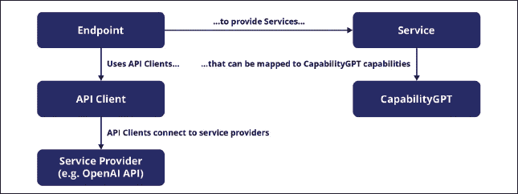

**图 9.1：** `predictive-powers`库的基本组件及其关系

**API 客户端**

API 客户端是`predictive-powers`库的最底层组件，可直接调用服务提供商的 API。例如，开发人员可以选择通过`OpenAiClient`实例化直接访问 OpenAI API，并随后调用其方法。

API 客户端还提供对 API 密钥（用于服务访问）的安全访问以及临时服务器不可用情况的自动管理，例如请求洪水。

实质上，API 客户端为开发人员提供了直接 API 调用的自由，同时通过提供样板代码实现了强大而高效的开发。

考虑以下 API 客户端使用示例；该代码实例化了一个`OpenAiClient`，然后使用它执行一个非常简单的提示：

`import io.github.mzattera.predictivepowers.openai.client.OpenAiClient;`

`import io.github.mzattera.predictivepowers.openai.client.completions.CompletionsRequest;`

`import io.github.mzattera.predictivepowers.openai.client.completions.CompletionsResponse;`

`public class OpenAiClientExample {`

`public static void main(String[] args) {`

`// 从操作系统中检索 API 密钥`

`// 环境变量 OpenAiClient.OS_ENV_VAR_NAME`

`try (OpenAiClient client = new OpenAiClient()) {`

``// 完成一个句子；参考`

`// https://platform.openai.com/docs/api-reference/completions`

`// 详情`

`CompletionsRequest req = CompletionsRequest.builder()`

`.model(“text-davinci-003”)`

`.maxTokens(50)`

`.prompt(“Alan Turing was”)`

`.build();`

`CompletionsResponse resp = client.createCompletion(req);`

`// 输出结果`

`System.out.println(resp.getChoices().get(0).getText());`

``} // 关闭客户端`

`}`

`}`

这将生成以下输出：

`一位英国数学家、计算机科学家、逻辑学家、密码分析家、哲学家和理论生物学家，对理论计算机科学和人工智能的发展产生了深远的影响。`

**端点和服务**

端点是一个能力提供者，意味着它使用 API 客户端以服务的形式呈现不同的能力。

以下代码说明了创建`AiEndpoint`的过程，该端点提供对生成 AI 功能的访问，包括 OpenAI 和 Hugging Face 提供商⁴：

`// 构建 Hugging Face 端点。`

`// API 密钥从操作系统环境中检索。`

`AiEndpoint endpoint = new HuggingFaceEndpoint();`

`// 从现有 API 客户端构建 OpenAI 端点`

`OpenAiClient cli = new OpenAiClient();`

`AiEndpoint endpoint = new OpenAiEndpoint(cli);`

一旦创建了端点，它就可以访问服务。这些是高级生成 AI 功能，类似于 CapabilityGPT 框架中描述的那些。当前的服务包括：

+   `**ModelService**`：提供对模型元数据的访问，例如模型列表、模型上下文大小等。

+   `**CompletionService**`：通过执行提供的文本提示来执行文本完成。这是最灵活的服务，因为我们可以通过提供正确的提示来指示它执行不同的任务，如*第五章*中所讨论的那样。通过适当的指示，该服务可以提供**评估**、**分类**、**创作**、**信息提取**、**撮合**、**摘要**、**转换**等功能。

+   `**ChatService**`：处理用户和代理之间的对话，管理代理的个性和对话历史。这将对应于**通信**功能。还要注意，`ChatService`可以提供`CompletionService`公开的所有功能，因为提示执行可以被视为与用户进行单次交换的对话，用户通过提供提示开始对话，代理对其做出响应，从而执行它。

+   `**EmbeddingService**`：提供文本嵌入和相似性计算功能，这对于 CapabilityGPT 框架中的**语义搜索**功能至关重要。

+   `**QuestionAnsweringService**`：通过使用用户提供的上下文来直接映射到 CapabilityGPT 框架中的**问答**功能来回答问题。

+   `**QuestionExtractionService**`：从文本中提取不同类型的问题（例如，判断题、多项选择测验等）。这是**信息提取**功能的一个例子。

+   `**ImageGenerationService**`：使用 OpenAI（DALL-E 3⁵）或 Hugging Face（Openjourney⁶）生成图像。这是**创作**功能的另一个例子。

+   `**SearchService**`：在互联网上搜索数据。这是一个可以作为代理的构建块使用的外部工具的例子⁷。

以下示例展示了使用`CompletionService`完成句子的用法。创建端点后，代码从中获取了一个`CompletionService`的实例，用于完成一个简单的提示。请注意，服务抽象允许使用一行代码修改来更改服务提供者（OpenAI 或 Hugging Face）：

`import io.github.mzattera.predictivepowers.AiEndpoint;`

`import io.github.mzattera.predictivepowers.huggingface.endpoint.HuggingFaceEndpoint;`

`import io.github.mzattera.predictivepowers.openai.endpoint.OpenAiEndpoint;`

`import io.github.mzattera.predictivepowers.services.CompletionService;`

`public class CompletionExample {`

`public static void main(String[] args) throws Exception {`

`// Uncomment the below to use OpenAI`

`AiEndpoint endpoint = new OpenAiEndpoint();`

`// Uncomment the below to use Hugging Face`

`// AiEndpoint endpoint = new HuggingFaceEndpoint();`

`try (endpoint) {`

`CompletionService cs = endpoint.getCompletionService();`

`System.out.println(cs.complete(“Alan Turing was”).getText());`

`}`

`}`

`}`

**Knowledge Base**

在`predictive-powers`库的上下文中，知识库是一个内存中的向量数据库，其中包含文本嵌入⁸。每个嵌入可以具有作为`Map`封装的属性数组。知识库提供了基于嵌入相似性和其他过滤条件的语义搜索方法。它可以分区为域，以允许单独搜索并优化性能。

# `predictive-powers` Use Case

在本节中，我们将指导您实现一个名为“Essay Writer”（简称“***Writer***”）的自主代理，其目标是撰写关于不同主题的文章。Writer 旨在接收文章内容的简短文本描述，搜索互联网上的相关信息，下载和整理它，生成完整的文章。

我们将提供代码片段来演示如何利用 CapabilityGPT 框架的功能来构建代理。有关代理的完整代码，您可以参考`predictive-powers` GitHub 存储库。

**Architecture**

本节详细解释了实现 Writer 所采用的架构，使用了应该在*Chapter 4](c04.xhtml)*⁹中熟悉的三层方法。该架构旨在具有可扩展性，使其能够处理更复杂的情况。但是，基本的分层方法将保持一致，利用`predictive-powers`服务来为应用程序和 AI 层创建模块化架构。

![**Figure 9.2:** Essay Writer – Architecture**User Experience Layer**在我们的示例中，为了保持简单，用户将仅通过计算机控制台与 Writer 进行交互。可以使用各种命令行选项启动 Writer 以执行文章写作任务中的不同步骤（有关详细信息，请参阅完整的应用程序代码）。生成的输出将包括可以使用任何文本文件查看器检查的 JSON¹⁰和纯文本文件。**Application Layer**在应用层，编排代理通过执行相应的应用流程并正确协调不同的`predictive-powers`服务来响应用户命令。本章后面，我们将深入介绍这些应用流程的详细描述。此外，还有一个信息检索组件。它负责在互联网上搜索相关内容，这些内容将用于创建文章：+   `**SearchService**`: `SearchService`根据`ChatService`生成的查询执行网络搜索。它返回相关网页的链接列表，供编排代理下载和利用。+   `**GoogleEndpoint**`：该组件促进了与谷歌自定义搜索 JSON API 的集成，以增强`SearchService`的功能。它允许用户创建定制搜索引擎，以谷歌强大的搜索能力为基础。然后可以将该端点指向这些引擎。它赋予用户构建强大搜索工具的能力，能够限制搜索到特定网站，过滤成人内容，将搜索限制在特定地区等。**AI 层**AI 层是 CapabilityGPT 功能的实现和公开的`predictive-powers`服务。在这里，端点连接到相关的服务提供商，执行编排代理所需的任务。+   `**ChatService**`：该服务将提供构建论文结构所需的创建能力。它将从其草稿描述开始，创建搜索查询，从网络中搜索相关材料，并通过总结和重写从互联网收集的知识来撰写论文的每个部分。+   `**EmbeddingService**`：该服务用于嵌入从互联网下载的内容，使其能够存储在知识库中以支持语义搜索。+   `**OpenAiEndpoint**`：该端点连接到所需的 OpenAI 模型¹¹。+   `**KnowledgeBase**`：这提供了一个内存向量数据库，用于存储下载的内容，并在需要时检索它，以撰写论文的不同部分。此外，`KnowledgeBase`可以作为单个文件持久化在用户的个人电脑上，允许用户重新生成论文，而无需重新下载相关网页。重要的是要指出，两个层的服务都独立于端点和知识库的使用。这种抽象确保应用层与每个服务提供商提供的具体实现保持解耦。在开发过程中，这意味着软件工程师可以轻松测试不同的服务提供商和语言模型，以决定哪一个更适合正在构建的解决方案。**工作流程**如*图 9.3*所示的工作流程图，说明了将用户的论文草稿转化为作者生成的最终论文所涉及的步骤：1.  用户提供论文内容的文本描述。1.  作者生成论文结构（章节和部分）作为 JSON 文件。1.  作者生成谷歌查询，以搜索适合填充论文每个部分的信息。1.  作者然后执行每个查询，并编制由谷歌搜索引擎返回的相关网页链接列表。1.  作者下载每个链接的内容并创建相应的嵌入，这些嵌入存储在`KnowledgeBase`中。1.  对于论文的每个部分，作者使用语义搜索从知识库中检索相关信息。1.  最后，作者使用这些信息来生成论文的每个部分，从而产生单个文本文件输出。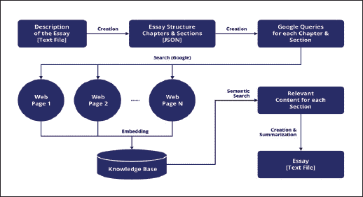

**图 9.3**：论文作者-工作流程

让我们详细研究每个步骤，并探索 CapabilityGPT 框架在每个阶段使用的能力。

该过程始于用户提供论文的文本描述，如下所示：

`写一篇关于意大利帕多瓦市的论文。`

`第一章描述了这座城市的地理和人口统计情况，经济状况，以及从原始历史到现代的历史。`

`此外，还有一个章节介绍了生活在帕多瓦的名人。`

`第二章侧重于传统和民间传说，包括传统活动和节日，食品和葡萄酒，以及其他相关主题。`

`最后一章是一个显著景点的集合，每个景点都有单独的部分，描述了有趣的地方和游客的经历。`

需要注意的是，作者将论文视为由章节组成的结构。尽管更复杂的结构是可能的，但为简单起见，我们将专注于这种格式。论文结构最初是使用 ChatGPT 生成能力生成的，根据提供的描述创建章节和部分。生成的结构以 JSON 格式保存以供进一步处理。以下是一个示例结构：

{

“title”: “我的论文”,

“description”: “写一篇关于意大利帕多瓦市的论文。\r\n 第一章描述了城市的地理和人口统计信息，其经济状况，以及从原始历史到现代的历史。\r\n 此外，还有一个关于居住在帕多瓦的名人的部分。\r\n 第二章重点介绍传统和民间故事，包括传统活动和节日、食品和葡萄酒等相关主题。\r\n 最后一章是著名景点的集合，每个景点都有单独的部分，描述了有趣的地方和游客的体验。\r\n”,

“chapters”: [

{

“id”: “1”,

“title”: “地理和人口统计”,

“summary”: “本章概述了帕多瓦市的地理和人口统计信息。它探讨了城市的位置、气候和自然特征。此外，它深入研究了人口统计信息，包括种族构成、年龄分布和人口随时间的增长。”,

“sections”: [

{

“id”: “1.1”,

“title”: “经济学”,

“summary”: “本部分探讨了帕多瓦的经济方面，包括其主要产业、贸易和经济发展。它突出了城市作为经济中心的地位，并讨论了推动其经济的关键部门。”

…

},

{

“id”: “1.2”,

“title”: “历史”,

“summary”: “本部分追溯了帕多瓦从原始历史起源到现代的历史。它涵盖了塑造城市身份的重要历史事件、统治者和文化发展。”

…

},

…

]

},

…

]

}

注意 ChatGPT 如何增强了每个部分的描述，提供了更详细的内容摘要。在“著名景点”部分，有趣的地方会自动添加，无需事先列出，这要归功于 ChatGPT 的能力。

“id” : “3”,

“title” : “著名景点”,

“summary” : “本章是帕多瓦著名景点的指南，重点介绍了城市的建筑、历史和文化地标。每个部分都专注于一个特定的景点，提供了详细的描述并捕捉了游客的体验。”,

“sections” : [

“id” : “3.1”,

“title” : “圣安东尼教堂”,

…

}, {

“id” : “3.2”,

“title” : “Prato della Valle”,

…

}, {

“id” : “3.3”,

“title” : “雷焦内宫”,

…

}, {

“id” : “3.4”,

“title” : “斯科罗韦尼小教堂”,

…

} ],

With the essay structure in place, the Writer needs to populate it with relevant information. Instead of relying solely on the model’s implicit knowledge, we want to fetch updated and relevant information from the Internet. To accomplish this, we generate Google searches for each section using ChatGPT text generation capabilities. This generates a short list of Google queries for each section.

The next step involves leveraging a different capability of our framework: **Search**. The Essay Writer uses these generated Google queries to query the search engine and collect a list of relevant web page links.

一旦我们确定了相关的网页，它们就会被下载并存储在数据库中以进行语义搜索。语义搜索将允许 Writer 在数据库中搜索与给定部分摘要在语义上相似的文本，从而检索与编译该部分文章相关的文档。为了启用语义搜索，下载的页面以一种特殊的方式编码，称为‘嵌入’；这种编码为文本提供了 AI 更容易处理的数值表示。

`predictive-powers`库提供了高级方法来下载网页内容、执行嵌入并将数据存储在内存数据库（`KnowledgeBase`）中，该数据库作为库的一部分可用。

在下载、嵌入和存储相关网页之后，Writer 使用语义搜索来获取与文章各部分相关的内容。这些上下文片段，称为每个部分的‘上下文’，作为生成各部分实际内容的基础。ChatGPT 利用其**摘要**和**生成**能力根据提供的上下文创建部分内容。

通过遵循这个工作流程，Writer 自主生成了一篇文章，其中包含来自网络的最新信息，产生了全面且经过深入研究的最终输出。

# 代码演示

在本节中，我们阐明了在前几节中概述的应用程序的工作流程，提供了代码片段来演示如何执行各种任务。如果您希望深入了解 Writer 的完整代码，它始终可以在`predictive-powers` GitHub 存储库中访问。

在展示应用程序代码的同时，我们有机会列出一些使用的提示。我们鼓励读者尝试根据*第五章*中的指南编写自己的提示，并查看 Writer 的技能是否有所提高。

请注意，为了提高效率，Writer 是一个多线程应用程序。方法`parallelExecution()`管理多个任务的同时执行，将它们的所有结果编译成一个`List`。在本章中，我们将展示用于各种任务的代码片段，但不会过多关注多任务处理所需的结构。

`Essay`类是 Writer 使用的内部类，用于维护文章的结构。它提供了几种方法，以有组织的方式方便地获取其格式良好的内容。Writer 在其`essay`字段中包含`Essay`的一个实例；随着程序的执行，该实例逐渐被数据填充。

应用程序工作流程的编排发生在类的`main()`方法中。在这里，用户输入被处理，并执行所需的任务。简而言之，`main()`方法实现了我们架构中显示的‘编排代理’组件。

工作流程中的第一个任务是读取用户提供的草稿并建立文章的结构。为了方便处理，结构被保存为 JSON 文件。以下代码片段演示了如何完成此任务。它假设文章草稿已经存储在`essay.description`中（这在此时`main()`方法已经执行过了）。请注意代码如何利用 GPT 返回数据的能力以各种格式，本例中是 JSON。专门处理 JSON 序列化的 Java 库使我们能够轻松地将返回的数据转换为一个`Essay`实例，只需一行代码：

`public void createStructure() throws JsonProcessingException {`

`String description = essay.description;`

`[…]`

`// 实例化一个服务来创建文章结构`

`OpenAiChatService chatSvc = openAi.getChatService();`

`chatSvc.setModel(COMPLETION_MODEL);`

`chatSvc.setTemperature(40.0);`

`// 设置代理人个性，指示它返回 JSON`

`// and provide one example`

chatSvc.setPersonality（

“您是一名助手，正在帮助作家创建文章的结构。文章结构由一系列章节组成，每个章节包含一系列部分。始终使用此 JSON 格式返回结构；以下是格式的示例：

+“\n”

+“{\n”

+“\”章节\”：[{\n”

+“\”title\”：\”第一章的标题\”，\n”

+“\”summary\”：\”第一章的摘要。\”，\n”

+“\”部分\”：[{\n”

+“\”title\”：\”第一章的第一节标题\”，\n”

+“\”summary\”：\”本节摘要\”\n”

+“}，{\n”

+“\”title\”：\”第一章的第二节标题\”，\n”

+“\”summary\”：\”本节摘要\”\n”

+“}]\n”

+“}，{\n”

+“\”title\”：\”第二章的标题\”，\n”

+“\”summary\”：\”第二章的摘要。\”，\n”

+“\”部分\”：[{\n”

+“\”title\”：\”第二章的第一节标题\”，\n”

+“\”summary\”：\”本节摘要\”\n”

+“}，{\n”

+“\”title\”：\”第二章的第二节标题\”，\n”

+“\”summary\”：\”本节摘要\”\n”

+“}]\n”

+“}]\n”

+“}\n”

+“\n”

+“确保各节不嵌套在其他节内。标题不应包括节编号或单词‘章’或‘节’。”

//调用代理创建结构，

//使用描述中的草稿

TextCompletion resp = chatSvc.complete（

“您的任务是根据提供的描述创建一本书的结构。该书应包括几个章节，每个章节包含一个标题，一个摘要和一个部分列表。每个部分应包括一个标题和一个摘要。确保各节不嵌套在彼此内。

+“\n”

+“如果可能，尝试使章节和部分的摘要至少 100 个字长，以提供书纲的实质内容。

+“\n”

+“逐步考虑并列出所有章节及其包含的部分。使用 JSON 格式返回结果。

+“\n”

+“用户描述：”+描述

）;

//将返回的 JSON 转换为文章

//然后将其复制到本地实例中。

Essay created = JSON_MAPPER.readValue（resp.getText（），Essay.class）;

essay.chapters = new ArrayList<>(created.chapters);

[…]

}

在创建结构之后，从互联网上获取撰写文章所需的相关数据。以下代码片段返回一个 SearchResult 实例（指向网页的链接）列表，这些内容可以用来撰写给定的部分。这些链接以 Pair 结构返回，以及它们在 Google 中确定的相应排名。

这段代码还说明了库的另一个特性：创建提示模板的能力，这些模板是参数化的提示。在模板中，通过双大括号将提示参数括起来。在运行时，这些占位符将被传递给 CompletionService.fillSlots（）方法的 Map 中具有相同键的值替换。例如，在以下代码中，“{{chapter_summary}}”字符串将被 params Map 中“chapter_summary”键关联的值替换：

public List<Pair<SearchResult, Integer>>

谷歌（章节章节，部分部分）

{

//首先创建一个搜索查询列表，

//基于我们想要搜索的内容

//实例化模型以创建谷歌搜索

OpenAiChatService chatSvc = openAi.getChatService（）;

chatSvc.setModel（COMPLETION_MODEL）;

chatSvc.setTemperature（50.0）;

//动态构建提示

最终的提示字符串=

“鉴于下面的章节摘要，部分标题和部分摘要，以 XML 标记提供，生成可用于在互联网上搜索与该部分对应的主题的搜索引擎查询列表。”

+“每个查询都是一个简短的句子或与该部分主题相关的关键词的简短列表。”

`+ “ 包括术语，以便为主题提供上下文，如章节摘要所述，以便查询与章节内容明确相关。”`

`+ “ 创造性地提供确切的 5 个查询。”`

`+ “ 严格按照 JSON 字符串数组的形式提供结果。\n\n”`

`+ “<chapter_summary>{{chapter_summary}}</chapter_summary>\n\n”`

`+ “<section_title>{{section_title}}</section_title>\n\n”`

`+ “<section_summary>{{section_summary}}</section_summary>”;`

`// 提供数据以填充提示模板中的插槽`

`Map<String, String> params = new HashMap<>();`

`params.put(“chapter_summary”, chapter.summary);`

`params.put(“section_title”, section.title);`

`params.put(“section_summary”, section.summary);`

`// 准备对话；`

`// 注意在提示模板中填充插槽的调用`

`List<ChatMessage> msgs = new ArrayList<>();`

`msgs.add(new ChatMessage(`

`Role.SYSTEM,`

`“您是一名助手，帮助研究人员找到与他们正在撰写的文章部分相关的网页。”`

`));`

`msgs.add(new ChatMessage(`

`Role.USER, CompletionService.fillSlots(prompt, params)`

`));`

`// 为该部分构建 Google 查询列表。`

`// 查询作为 JSON 字符串列表返回，进行反序列化。`

`List<String> queries;`

`while (true) {`

`try {`

`queries = JSON_MAPPER.readValue(chatSvc.complete(msgs).getText(),`

`new TypeReference<List<String>>() {});`

`break;`

`} catch (JsonProcessingException e) {`

`// 重试以防 GPT 返回格式不正确的 JSON`

`LOG.warn(“因为 JSON 格式错误而重试，e);`

`}`

`}`

`// 现在提交每个查询并收集返回的链接`

`List<Pair<SearchResult, Integer>> result = new ArrayList<>();`

`for (String query : queries) {`

`List<SearchResult> links;`

`try {`

`links = google.getSearchService()`

`.search(query, LINKS_PER_QUERY);`

`} catch (Exception e) {`

`// 跳过失败的单个查询`

`LOG.warn(“忽略搜索错误: “ + query, e);`

`continue;`

`}`

[…]`

`}`

`return result;`

`}`

一旦写手有要下载的页面列表，它就会继续并检索它们，提供相应的嵌入。根据页面的大小，这可能会导致多个项目。`ExtractionUtil.fromUrl()`方法是一个方便的一行代码，用于直接从 URL 获取文本内容。

读者还应该注意我们如何使用`ModelService`来获取一些模型元数据，比如它接受的最大标记数。

在 Java 中，这个过程看起来像这样：

`private List<EmbeddedText> download(SearchResult link) {`

`// 实例化用于嵌入下载页面的服务`

`EmbeddingService embSvc = openAi.getEmbeddingService();`

`// 设置每个嵌入文本块的最大大小；`

`// 以下计算确保大约有 15 个嵌入`

`// 将用于组成每个部分。`

`// 注意 ModelService 是如何从 OpenAIEndpoint（openAI）中获取的`

`// 用于检索完成模型和`

`// 嵌入模型。`

`int writerSize = openAi.getModelService().getContextSize(WRITER_MODEL);`

`int embSize = openAi.getModelService().getContextSize(embSvc.getModel());`

`embSvc.setMaxTextTokens(`

`Math.min(embSize, (writerSize - SECTION_LENGTH_TOKENS) / 15)    );`

``// 将页面内容作为字符串下载`

`String content = null;`

`try {`

`content = ExtractionUtil.fromUrl(`

`link.getLink(), DOWNLOAD_TIMEOUT_MILLIS));`

`} catch (Exception e) {`

`// 如果在下载页面过程中发生错误，则跳过该页面`

`LOG.error(“下载错误 “ + link.getLink(), e);`

`return new ArrayList<>();`

`}`

`// 嵌入下载的内容`

`List<EmbeddedText> result = embSvc.embed(content);`

[…]`

`return result;`

`}`

成功完成后，嵌入将存储在知识库中，为写作过程的开始铺平道路。以下代码片段概述了如何编写单个部分。

通过检查代码，读者可以看到`KnowledgeBase`中的`search()`方法是如何使用的，通过传递部分摘要的嵌入版本来执行语义搜索：

`private List<Section> write(Section section) {`

`//实例化服务`

`EmbeddingService embSvc = openAi.getEmbeddingService();`

`OpenAiChatService chatSvc = openAi.getChatService();`

`chatSvc.setModel(WRITER_MODEL);`

`chatSvc.setTemperature(0.0);`

`String prompt =`

`“<context>{{context}}</context>\n\n”`

`+“
{{summary}}
”;`

`Map<String, String> params = new HashMap<>();`

`params.put(“summary”, section.summary);`

`//这是用于创建部分的提示`

`List<ChatMessage> msgs = new ArrayList<>();`

`msgs.add(new ChatMessage(Role.SYSTEM,`

`“您将获得一个上下文和一篇文章部分摘要，两者都由 XML 标记限定。”`

`+“您的任务是使用上下文的内容来撰写文章的整个部分。”`

`+“使用专业风格。”+“避免内容重复，但要详细。”`

`+“仅输出部分内容，而不是标题，不要创建子部分。”`

`+“不要编造缺失的信息或为没有的数据放置占位符。”`

`+“只有在内容中有足够的信息时，才产生至少一个文本”`

`+ SECTION_LENGTH_TOKENS +“令牌长。\n\n”));`

`[…]`

`//搜索知识库以获取相关内容//（=构建上下文）`

`List<Pair<EmbeddedText, Double>> knowledge = kb.search(embSvc.embed(section.summary).get(0), 50, 0);`

`//这里需要一些代码来仅获取`

`//适合模型提示大小的上下文。`

`//出于简单起见，它被省略了。`

`[…]`

`// 将生成的内容添加到部分`

`section.content = chatSvc.complete(msgs).getText();`

`[…]`

`return section.sections; //实际上没有使用`

`}`

# 结论

本章介绍了`predictive-powers`库及其利用 Java 开发人员的生成 AI 能力的能力。重点是提供一种真实生活的方法来利用生成 AI 能力。

`predictive-powers`库为 Java 开发人员和 AI 爱好者提供了独特的优势。它不仅简化了生成 AI 能力的集成，还提供了对 OpenAI 和 Hugging Face 等流行 API 的低级访问权限。这种灵活性允许开发人员在需要时直接与这些 API 进行交互。此外，该库的设计与 CapabilityGPT 框架保持一致，确保与不同的能力提供者兼容，降低了供应商锁定的风险。此外，其内存向量数据库支持语义搜索、信息提取和问题回答等重要功能。最后，它便于从各种来源检索文本内容，包括网页和各种文件格式，如 MS Office、PDF 和 HTML。这些功能使`predictive-powers`库成为在 Java 应用程序中利用生成 AI 能力的有价值工具，同时利用了 Java 应用程序的灵活性、兼容性和易用性。

我们深入研究了该库的技术方面，详细介绍了 API 客户端、端点和服务以及知识库等基本概念。我们了解了它们在更广泛框架内的角色和功能，并深入了解了它们的基本机制。

本章的亮点之一是一个实际的例子：创建了一个名为“Essay Writer”的自主代理。这作为一个具体的例子，展示了如何在一个现实项目中利用`predictive-powers`库及其不同的特性。

# 要点

在本章结束时，读者应该熟悉：

+   **The** `**predictive-powers**` **library**: 一个 Apache-2.0 许可的库，为 Java 开发人员提供了一个简化但强大的界面，以利用生成 AI。

+   **API 客户端**：`predictive-powers`库的基本单元，用于直接调用 OpenAI 和 Hugging Face 等服务提供商的 API。

+   **端点和服务**：利用 API 客户端提供服务的高级生成式人工智能组件。读者应该了解提供的服务，比如`ModelService`、`CompletionService`、`ChatService`、`EmbeddingService`等。

+   `**知识库**`：对于语义搜索、信息提取和问题回答等能力至关重要的内存中向量数据库。

+   **自主代理的实现**：本章指导读者创建一个“论文写作机”，演示所学概念的实际应用。它展示了如何轻松组合库组件，利用 CapabilityGPT 框架、提示工程技术和本书其他部分介绍的架构模式，创建能够执行复杂任务的代理。

+   **架构模式**：理解架构模式并导航代码是学习过程的关键部分。读者应熟悉三层架构：用户体验层、应用层和人工智能层，并了解如何使用`predictive-powers`库中的组件来实现这些层。

+   **代码导航**：理解代码片段及其工作原理，可以帮助读者将这些概念应用到自己的项目中。

____________________

¹ ***生成式人工智能*** 指的是人工智能的一个分支，专门用于生成新内容，可以是文本、图像、音频和视频，利用从现有数据源中获取的模式和信息。OpenAI 的 GPT 系列是这种人工智能的一个显著代表。在本章中，“生成式人工智能”这个术语将比“GPT”更频繁地使用，以保持对更广泛技术类别的关注，强调`predictive-powers`库的多功能性，该库不仅限于专门使用 GPT。

² 正如在*第八章：LangChain：Python 的 GPT 实现框架*中已经提到的，文本***嵌入***是文本的数值表示，使机器能够理解和处理自然语言。它们将单词或短语转换为一系列数字，具有语义相似性的项目具有相似的值。在***语义搜索***中，这使系统能够基于语义相似性而不仅仅是关键词匹配来匹配用户的查询和相关文档。通过使用文本嵌入，系统可以理解微妙的含义，并提高搜索结果的相关性，提供更高效和有效的搜索体验。

³ 内存中向量数据库利用系统内存（RAM）存储数据，这提供了极快的数据检索和处理优势。然而，这也带来了与 RAM 大小相关的限制，使其不太适合处理极大的数据集。

⁴ 正如我们将在后面看到的，还有其他端点，提供不同的功能，比如`SearchEndpoint`，它公开了访问网络搜索服务的方法。

⁵ [`openai.com/dall-e-3`](https://openai.com/dall-e-3)

⁶ [`openjourney.art/`](https://openjourney.art/)

⁷ 参见*第四章：GPT 模型支持的架构模式*，特别是“B 与外部工具集成的对话模式”部分。

⁸ 知识库类似于 LangChain 中的向量存储。参见*第八章：LangChain：Python 的 GPT 实现框架*。

⁹ 请参考*第四章：GPT 模型支持的架构模式*，并将此架构与“D2 Orchestration Agent”架构模式进行比较。

¹⁰ JSON，全称 JavaScript 对象表示法，是一种用于以有组织、易于访问的方式存储信息的方法。简而言之，它为我们提供了一个文本人类可读的数据集合，我们可以以逻辑方式访问。它被广泛应用于许多数字服务和产品中，以帮助系统和服务器高效快速地共享数据。即使它的名称包含“JavaScript”，它也可以在 JavaScript 之外的许多编程环境中使用。

¹¹ [`platform.openai.com/docs/models`](https://platform.openai.com/docs/models)（具体来说，用于聊天服务的 gpt-3.5-turbo 和用于嵌入的 text-embedding-ada-002）。

# 附录 A：进一步探索提示工程应用

# 介绍

在*第五章，高级 GPT 提示工程技术*的基础上，探索高级提示工程技术，该章节提供了 12 个我们的三种提示模式——指令、查询和多代理——的示例，本附录介绍了 11 个进一步的示例。这些示例旨在加深对 ChatGPT-4 提示模式的理解，并突出了更广泛的实际企业场景。

在单指令示例中，我们深入探讨了“资源管理”、“基于场景的项目模拟”和“商业沟通”等用例，每个用例都提供了对指令提示模式应用的新视角。指令序列示例和伪代码指令示例进一步揭示了通过“保险理赔处理”、“解决方案架构分析”和“房地产列表比较”等实际场景中的顺序和逻辑任务管理的复杂性。

然后我们进行查询示例，ChatGPT-4 在安全法规中导航，深入研究假设的人力资源场景，并利用模糊逻辑评估供应可能性，利用分析和解释能力的混合。

最后，多代理示例部分涵盖了 ChatGPT-4 在多代理设置中运行的实例，处理环保摩托车设计模拟，并对原材料进行详细研究，从而反映了 ChatGPT-4 的协作和探索功能，使用了其中一些插件。

当您遍历这些额外的示例时，目标仍然是加深对提示工程技术的理解，展示 ChatGPT-4 在解决各种实际企业场景中的多样性。通过这些多样的场景，本附录致力于进一步装备您对 ChatGPT-4 的细致知识和技能，以有效地利用 ChatGPT-4 推动创新和企业景观中的运营卓越。

# 结构

在本章中，将涵盖以下额外的提示案例研究:

+   单指令示例

+   资源管理

+   基于场景的项目模拟

+   商业沟通

+   指令序列示例:

+   保险理赔处理

+   解决方案架构分析

+   伪代码指令示例:

+   房地产列表比较

+   查询示例

+   安全法规查询

+   人力资源管理中的反事实探索

+   供应可能性估计

+   多代理示例

+   环保摩托车设计模拟

+   原材料研究

# 单指令示例

这些示例涵盖了*资源管理*模拟，ChatGPT-4 作为资源经理将技能与项目任务对齐；*基于场景的项目模拟*，在挑战中预测项目阶段；以及碳会计领域的*商业沟通*示例，总结了关键行业增长和挑战。

# 资源管理

这是来自项目资源管理领域的一个示例。以下提示基于在*第二章，“CapabilityGPT，ChatGPT 的企业 AI 能力框架”*中介绍的框架的**匹配**能力：

+   **专家角色***: “您是一位擅长为项目分配资源的资源经理”*

+   **背景***:*

+   *项目:*

+   *为客户流失开发预测机器学习模型：任务包括数据清洗和预处理，探索性数据分析，特征工程和选择，构建和训练机器学习模型，模型验证和评估，向利益相关者展示模型结果，并与软件工程团队合作进行模型部署。*

+   *资源:*

+   Person_1：在数据清洗和预处理方面有 3 年以上的经验，精通 Python、Pandas 和 SQL，具有使用 Matplotlib 和 Seaborn 等工具进行良好的数据可视化技能。

+   Person_2：在机器学习方面有 4 年以上的经验，擅长使用 Scikit-learn 或 TensorFlow 构建和训练模型，了解模型评估指标，精通 Python。

+   Person_3：在数据分析和展示方面有 2 年以上的经验，精通探索性数据分析和特征工程，具有向利益相关者呈现复杂结果的良好沟通技能，精通 Python 和 Tableau。

+   **指示**：“根据他们的技能和项目需求为项目分配资源（撮合）”

+   **执行规则**：“考虑每个资源的技能和每个项目的需求”

+   **输出约束**：“输出应该是分配资源的项目列表”

ChatGPT-4 对此提示生成的响应如下：

根据项目和资源的详细信息，我们可以将资源分配给项目的不同任务如下：

项目：为客户流失开发预测性机器学习模型

1.  数据清洗和预处理：这项任务涉及清理数据，处理缺失值、异常值和数据中的任何不一致性。根据要求，我们指定 Person_1 负责这项任务，因为他们在数据清洗和预处理方面有超过 3 年的经验，并且精通 Python、Pandas 和 SQL，这些是这项任务的理想工具。

1.  探索性数据分析：这涉及深入挖掘数据集，找到相关性，并可视化数据以更好地理解。这项任务最适合 Person_3，他在数据分析方面有超过 2 年的经验，精通 Python 和 Tableau，一种数据可视化工具。

1.  特征工程和选择：这是从数据集中选择最相关特征的过程，这些特征对预测模型有重大贡献。鉴于 Person_3 在特征工程方面的专业知识，他将是这项任务的最佳选择。

1.  构建和训练机器学习模型：这项任务需要对机器学习算法和模型训练有深入的理解。因此，Person_2，他在机器学习方面有 4 年以上的经验，并且擅长使用 Scikit-learn 或 TensorFlow 构建和训练模型，将负责这项任务。

1.  模型验证和评估：这需要对各种模型评估指标有扎实的理解。鉴于 Person_2 对这些指标的理解，他也将负责这项任务。

1.  向利益相关者展示模型结果：这项任务涉及以清晰简洁的方式向利益相关者传达模型的结果。鉴于 Person_3 的良好沟通技能，他将负责这项任务。

1.  与软件工程团队合作进行模型部署：这项任务可以由 Person_1、Person_2 和 Person_3 共同处理，因为它将需要数据处理（Person_1）、模型构建（Person_2）和展示（Person_3）的技能。

在资源管理模拟中，ChatGPT-4 充当资源协调员，根据技能和专业知识将资源分配给任务。遵循指示，它制定了一个分配计划，有效地将资源与适当的任务对齐。然而，通过利用 Person_2 在特征工程方面的机器学习专业知识，项目策略可以进一步优化，增强其成功的可能性。

# 基于场景的项目模拟

这是项目管理领域的另一个示例。接下来的提示取决于**模拟**能力：

**专家角色**：您是一位经验丰富的项目经理。

**背景：** *这是您当前的项目：*

项目描述：EduRevolution 项目旨在开发并推出一款创新的移动学习应用程序，旨在颠覆传统的教育体系。该应用程序将允许各个年龄和水平的学习者访问各种教育资源，包括互动课程、多媒体内容、定制学习计划、游戏化测验和协作学习空间。该应用程序旨在促进积极学习，鼓励持续评估，并在学习者之间建立社区感。

已完成的阶段：

第一阶段：概念化和需求收集在这个阶段，我们收集了业务需求，定义了应用程序的概念、其关键特性，并勾画了用户角色。进行了详细的市场分析，以了解市场格局并确定潜在机会。

第二阶段：设计在这个阶段，我们致力于应用程序的用户体验（UX）和用户界面（UI）设计。这个过程涉及创建应用程序的线框图、原型和最终设计，确保应用程序用户友好、视觉吸引力强，易于导航。

第三阶段：开发在这个阶段进行了应用程序的编码和集成。我们采用了敏捷方法，包括冲刺和斯克拉姆，以迭代开发应用程序，根据用户反馈和测试需要进行更改。核心功能已经开发并与现有系统集成。

第四阶段：测试在这里，我们进行了彻底的测试阶段，包括单元测试、系统测试和用户验收测试（UAT）。识别了潜在的错误和性能问题，并根据严重程度进行分类。虽然所有主要错误都已修复，但仍存在一些小型和中型错误，需要各种变通方法才能正确使用应用程序。

指示：根据迄今为止取得的结果，对接下来的两个阶段进行模拟：生产准备和上线与超级关怀。

执行规则：区分三种情况：最佳情况、平均情况和最坏情况。

ChatGPT-4 根据此提示生成以下响应：

第五阶段：生产准备

最佳情况：

在最佳情况下，转移到生产环境顺利进行。剩余的小型和中型错误迅速解决，不会影响发布日期。生产环境中的应用程序性能与测试环境中的性能相匹配，表明已准备好进入上线阶段。团队已经为部署做好了充分的准备，制作了广泛的文档，并培训了所有利益相关者使用应用程序和解决常见问题。

平均情况：

在平均情况下，即使在初始修复后仍有一些小型和中型错误，需要额外的开发时间，稍微推迟发布日期。经过一些小的调整，应用程序在生产环境中表现出令人满意的性能。团队已经完成了大部分所需的文档和培训，但仍在最后阶段进行一些临时添加。

最坏情况：

在最坏的情况下，修复剩余的错误可能比预期更复杂，揭示了代码库中更深层次的问题，并导致了重大的延迟。在生产环境中，应用程序的性能不稳定，需要大量的时间和精力来诊断和解决。尽管尝试加快流程，但文档不完整，利益相关者的培训也不足。

第六阶段：上线和超级关怀。

最佳情况：

在最佳情况下，上线阶段按计划进行，没有重大问题。用户采用率很高，反馈非常积极。超级关怀团队迅速解决了一些小问题，导致干扰最小。超级关怀期比计划的时间短，因为应用的稳定性，最终成功移交给运营支持团队。

平均情况下：

在平均情况下，上线阶段遇到了一些小问题，比如推出速度比预期慢，导致初始用户群略有减少。用户反馈褒贬不一，用户赞扬应用的功能性，但也报告了一些可用性问题。超级关怀团队全力解决这些问题，超级关怀期延长到最大预期长度。

最坏情况下：

在最坏情况下，上线阶段遇到了重大问题。技术问题影响了用户体验，导致负面反馈和减少的用户群。应用的稳定性低于预期，超级关怀团队被问题压倒，需要将期限延长到最初计划的时间之外。高优先级的错误和系统稳定性问题需要紧急处理，可能导致回滚或暂时暂停服务，直到问题解决为止。

在项目管理模拟中，ChatGPT-4 充当经验丰富的经理，根据过去的数据和潜在挑战预测未来项目阶段。在分析最佳、平均和最坏情况后，它提供了一个详细的计划，详细说明每种情况可能的进展方式。这种分析最终形成了一个应急计划，确保为任何结果提供了一个准备充分和强大的方法。

# 商业沟通

这个最后的单指令示例探讨了碳核算行业内的商业沟通和总结技能。以下是提示：

专家角色：您是一位商业沟通专家。

背景：碳核算行业正在经历一波增长，因为政府机构、投资者和消费者越来越多地寻求详细报告企业温室气体排放情况。尽管对数据准确性存在怀疑，但这种增长仍在持续。根据数据公司 PitchBook 的数据，碳核算公司的风险投资资金从 2020 年的 6000 万美元增加到 2022 年的 7.67 亿美元。这种上升趋势一直延续到 2023 年，风险投资家迄今已向该行业投入了 3.33 亿美元。这种投资热潮是由公司对预计在未来一年内在欧洲和美国实施的复杂披露要求的预期以及投资者和消费者对展现环保形象的压力所刺激的。这与国际可持续性标准委员会在 6 月启动标准的开始有关，该委员会发布了有关计算供应链排放的指南。这些标准在 ISSB 在 12 月宣布公司将被额外授予一年时间来报告其整个价值链排放后被证明比最初预期的更宽松。尽管如此，这一实施正在成为许多企业进行更全面跟踪的催化剂。

指令：总结这段文字

输出约束：摘要不应超过 3 句话。

执行规则：

1.  严格遵循“发生了什么以及为什么？”的结构。

1.  如果没有提到原因，请使用假设。

参考案例：使用这三个总结示例作为指导。

输入-输出案例 1：会议纪要总结

**输入***：“2023 年 4 月 5 日季度会议上，团队讨论了与去年同期第四季度相比第一季度销售额下降了 20％的情况。市场部提出了一项新的全国性广告活动，预算增加了 5 万美元，以提高品牌知名度。产品开发团队报告了新的‘绿色科技’产品线的进展，但指出由于与海外合作伙伴的供应链问题可能会出现长达两个月的延迟。财务部对增加的营销预算和由于产品线延迟可能导致第二季度利润下降表示担忧。”

**输出***：“发生了什么以及为什么：2023 年 4 月 5 日季度会议上讨论了第一季度销售额下降了 20％，可能是由于市场竞争加剧。市场部提出了全国性广告活动以提高知名度，而产品开发预测由于供应链问题‘绿色科技’产品将会延迟。由于这些变化，财务部表示预算和利润方面的担忧。”

**输入-输出案例 2***：总结季度财务报告

**输入***：“2023 年第二季度，XYZ 公司报告总收入为 21 亿美元，较 2022 年第二季度下降了 5％。净利润率也从去年的 9％下降到 6％。收入和利润的双重下降主要归因于供应链中断和由于全球经济状况导致的物流成本增加。”

**输出***：“发生了什么以及为什么：2023 年第二季度，XYZ 公司的总收入下降了 5％，净利润率从 2022 年第二季度的 9％下降到 6％。这主要是由于供应链中断和与不利的全球经济状况相关的物流成本增加。”

**输入-输出案例 3***：总结新产品发布的新闻稿

**输入***：“2023 年 6 月 15 日，ABC Tech 宣布推出其创新产品‘SmartLens’，这是一款由人工智能驱动的隐形眼镜，提供增强现实体验。这一推出是对可穿戴技术需求不断增长的回应。‘SmartLens’预计将于 2023 年秋季上市。”

**输出***：“发生了什么以及为什么：ABC Tech 宣布于 2023 年 6 月 15 日推出了‘SmartLens’，这是一款由人工智能驱动的隐形眼镜，提供增强现实体验。这一举措是对消费者对可穿戴技术日益增长的兴趣的回应。”

响应给定提示，ChatGPT-4 生成以下输出：

“发生了什么以及为什么：碳会计行业看到了风险投资资金的激增，从 2020 年的 6000 万美元上升到 2022 年的 7.67 亿美元，并在 2023 年继续吸引投资，尽管对数据准确性存在疑虑。这是由于政府、投资者和消费者对详细的企业排放报告的需求不断增加，以及企业对欧洲和美国新排放披露法规的预期。国际可持续发展标准委员会引入了跨供应链计算排放的指南，这促使企业进行全面的排放跟踪。”

在商业沟通示例中，ChatGPT-4 充当专业摘要者，利用参考案例中展示的摘要技术，概括了碳会计行业的增长和挑战的细节。它简洁地指出了风险投资资金的增加，尽管存在准确性问题，将其与利益相关者的需求和预期的排放法规联系起来。国际可持续发展标准委员会的指南也得到了强调，展示了 ChatGPT-4 从复杂背景中提取关键信息的能力。

# 指令序列示例

深入探讨两种多步处理场景，在这些场景中，ChatGPT-4 扮演理赔代表处理车祸保险索赔，并作为系统架构师解剖和完善给定的架构图。

# 保险索赔处理

ChatGPT-4 作为索赔代表，展示了处理车祸保险索赔的三步流程，展示了在管理信息收集、数据概括和初步维修成本估算方面的有条不紊的方法。以下是所提供的提示：

**专家角色***：您是一家保险公司的索赔代表。

**背景：** *我有关于一起车祸的基本信息：‘我的车现在停在路边’。*

**指令序列***：执行以下三个步骤：*

1.  首先向我询问 10 个关于损坏的问题。一次只问一个问题，在问下一个问题之前等待我的回答。仔细询问信息性问题，以最大化了解损坏的信息，这样当您得到所有答案时，您可以总结我的答案并估算修复损坏的成本。避免问是/否问题（沟通）。

1.  然后总结我的答案。在收到所有问题的答案之前，不要开始总结（总结）。

1.  最后根据我对所有问题的回答总结的结果来评估损坏的成本（评估）。”

ChatGPT-4 的输出如下，其中包括一段对话，其中分别为 ChatGPT 和用户的话语：

ChatGPT：感谢您与我们联系。我将问您一系列问题，以更好地了解损坏的程度。

1.  您能描述事故后您的车的整体状况吗？

用户：严重受损，无法驾驶。

ChatGPT：我明白，很抱歉听到这个消息。

1.  您能具体说明哪些区域受到了碰撞的影响吗？

用户：右侧车门、右侧车窗和右侧车翼

ChatGPT：我明白。

1.  车轮和悬架是否受到事故的影响？如果是，情况如何？

用户：是的，右前轮也有轻微损坏。悬架没有损坏。

ChatGPT：已记录。

1.  您能详细描述车辆外部油漆和车身工作的当前状况，特别是受碰撞直接影响的区域吗？

用户：车门严重变形，车门板也弯曲。车翼只有一个小凹痕和一些划痕。

ChatGPT：明白。

1.  车内有没有损坏，比如座椅、仪表板或电子系统？

用户：右侧车座也有轻微凹痕。

ChatGPT：我明白。

1.  大灯、尾灯或其他外部灯具在事故中有损坏吗？

用户：不行。

ChatGPT：好的。

1.  您能描述一下引擎、变速箱或车辆其他重要机械部件的潜在损坏吗？

用户：据我所知没有。

ChatGPT：已记录。

1.  除了您之前提到的右侧车窗外，挡风玻璃或其他玻璃部件有损坏吗？

用户：不行。

ChatGPT：好的。

1.  事故后您有没有注意到任何液体泄漏，比如机油或冷却液？

用户：不行。

ChatGPT：好的。

1.  最后，您能告诉我车辆的品牌、型号和年份吗？这将帮助我估算维修所需零件的成本。

用户：宝马 230i，2020 年。

ChatGPT：感谢您提供所有必要的信息。让我总结一下损坏情况：

1.  由于严重损坏，车辆无法行驶。

1.  车辆受损最严重的区域是右侧车门、车窗和车翼。

1.  右前轮轻微受损，但悬架未受影响。

1.  外部车门板严重变形，右侧车翼有小凹痕和划痕。

1.  车内右侧座椅有轻微凹痕。

1.  大灯、尾灯和其他外部灯具没有损坏。

1.  没有报告引擎和变速箱等重要机械部件的损坏。

1.  *除了右侧窗户，没有其他玻璃部件如挡风玻璃受损。*

1.  *事故后没有报告的液体泄漏。*

1.  *问题车辆是一辆 2020 年的 BMW 230i。*

*ChatGPT：基于这些信息，成本可以估算如下：*

1.  *车身工作：根据损坏程度，修复或更换车门板和车翼的成本可能在 500 到 1500 美元之间。*

1.  *右前车轮：BMW 230i 的新轮可能在 100 到 300 美元之间。*

1.  *右侧窗口：更换成本可能在 200 到 400 美元之间。*

1.  *内部损坏（右侧车座）：轻微的凹痕修复可能花费约 100 到 200 美元。*

请注意，这些是粗略估计，实际成本可能会更高或更低，取决于人工成本、零件的可用性以及从我们的对话中无法明显看出的任何隐藏损坏。建议由专业技师彻底检查车辆，以获得更精确的估算。

在这种情况下，ChatGPT-4 充当理赔代表，进行三步流程来处理车辆事故保险索赔。最初，它通过开放式问题认真收集详细信息，涵盖事故影响的车辆所有区域。随后，它压缩收集到的信息，突出显示所造成的损害的重要细节。最后，基于整合的信息，它给出了修复成本的初步估计，强调需要专业评估以进行准确的成本评估。这个案例说明了 ChatGPT-4 在管理对话时的系统方法，后续问题取决于先前的答案，并根据所有回答做出结论。

# 解决方案架构分析

ChatGPT-4 在这里充当系统架构师，剖析和优化所呈现的架构图。通过遵循结构化的三步方法，分析揭示了关键组件，确定潜在瓶颈，并提供可操作的建议。以下是指令序列提示：

**专家角色***：您是专家，擅长分析和优化架构图，特别是在软件或系统架构领域。*

**背景***：附有架构图：*

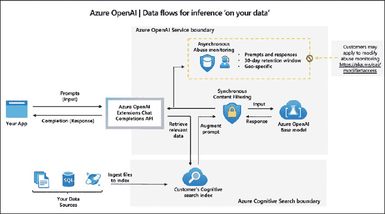

**图 A.1：**Azure OpenAI 使用企业数据源的架构图[14]*

**指令序列***：在这三个步骤中分析和优化所提供的架构。*

1.  *首先，从架构图中提取关键组件、连接、模式和可能的瓶颈。列出在图表中表示的工具、服务和流程。（信息提取）。*

1.  *其次，根据您的专业知识和从第一步提取的信息，确定潜在改进或优化的领域。考虑效率、可扩展性、冗余和安全等因素。建议改变或添加可以增强架构效果和韧性的内容。（建议）。*

1.  *第三，起草初步的项目计划，详细说明实施建议改进所需的步骤、时间表和资源。这应包括优先考虑改进、确定依赖关系、估算工作量，并建议成功实施的里程碑。（规划）。*

以下是 ChatGPT-4 对此提示的回应：

*第 1 步：信息提取*

+   *关键组件：*

+   *您的应用程序：代表用户与之交互的应用程序界面。*

+   *Azure OpenAI 扩展聊天完成 API：是应用程序和 OpenAI 模型之间的中介，处理用户输入并提供响应。*

+   *Azure OpenAI 基础模型：处理输入并生成响应的核心模型。*

+   *Azure 认知搜索：为客户的索引数据提供搜索功能。*

+   *您的数据源：应用程序的数据存储和索引以供搜索。*

+   客户的认知搜索索引：表示可以高效搜索的索引数据。

+   异步滥用监控：监控提示和滥用回应。

+   同步内容过滤：作为用户交互的实时内容过滤器。

+   连接和流程：

+   用户与“您的应用程序”进行交互，该应用程序将输入发送到“Azure OpenAI 扩展聊天完成 API”。

+   “Azure OpenAI 扩展聊天完成 API”增强提示并将其发送到“Azure OpenAI 基础模型”。

+   基础模型生成响应，然后发送回“您的应用程序”。

+   如果需要，基础模型可以从“客户的认知搜索索引”中检索相关数据。

+   “您的数据源”发送要被摄取和索引的数据，然后由“Azure 认知搜索”存储在“客户的认知搜索索引”中。

+   可能的瓶颈：

+   “同步内容过滤”的同步性质可能会引入延迟。

+   依赖于“客户的认知搜索索引”进行数据检索，如果索引未经优化，可能会导致延迟。

+   架构依赖于“Azure OpenAI 基础模型”的性能和可用性。

第 2 步：推荐

+   潜在改进领域：

+   降低延迟：在“Azure OpenAI 扩展聊天完成 API”级别引入缓存机制，以存储频繁查询及其响应。这可以减少基础模型的负载并加快响应时间。

+   冗余：为“Azure OpenAI 基础模型”等关键组件实施冗余，以确保高可用性。

+   增强安全性：为传输中的数据引入端到端加密，特别是在“您的应用程序”和“Azure OpenAI 扩展聊天完成 API”之间。

+   优化搜索索引：定期更新和优化“客户的认知搜索索引”，以确保高效的数据检索。

+   监控和警报：实施强大的监控和警报机制，以快速检测和纠正任何系统异常。

第 3 步：规划

+   项目计划：

+   缓存实施（2 周）：

+   评估合适的缓存解决方案。

+   将缓存机制与“Azure OpenAI 扩展聊天完成 API”集成。

+   测试性能改进。

+   基础模型的冗余（4 周）：

+   评估潜在的故障转移策略。

+   设置“Azure OpenAI 基础模型”的辅助实例。

+   实施并测试故障转移机制。

+   增强安全性（3 周）：

+   评估与 Azure 兼容的加密解决方案。

+   为数据传输实施端到端加密。

+   进行安全审计以验证加密。

+   优化搜索索引（2 周）：

+   监控索引性能并识别低效。

+   如果需要，重新索引数据。

+   实施定期优化。

+   监控和警报（3 周）：

+   评估与 Azure 兼容的监控解决方案。

+   实施系统范围的监控。

+   设置系统异常的警报。

+   里程碑：

+   第 2 周：成功的缓存实施和可观的性能改进。

+   第 6 周：已经实施并测试了基础模型的冗余。

+   第 9 周：已建立并验证了端到端加密。

+   第 11 周：优化搜索索引并注意到性能增益。

+   第 14 周：监控和警报机制运作。

+   所需资源：

+   系统架构师（1）

+   后端开发人员（2）

+   安全专家（1）

+   数据库管理员（1）

注意：时间表是初步的，可能会根据具体要求和意外挑战而改变。应定期进行审查以评估进展并进行必要的调整。

在这次深入分析中，ChatGPT-4 扮演了经验丰富的解决方案架构师的角色，仔细分析了一个以 Azure OpenAI 的数据流为中心的架构图。初始阶段涉及对关键组件的仔细提取，并利用最近发布的视觉语言模型 GPT-4V(ision)作为工具来理解它们之间的相互关系。然后，利用其专业知识，ChatGPT-4 找出了从减少延迟到增强安全性的改进领域。最后一步是制定一个结构化的项目计划，详细说明实现建议优化的步骤、资源和时间表。

然而，值得注意的是，GPT-4V 仍然难以准确从复杂的图表中提取信息，比如重叠连接、垂直书写的文本，或者图形元素的水平或垂直对齐。

# 伪代码指令示例

在唯一的伪代码指令示例中，ChatGPT-4 根据评估标准对办公空间清单进行排名。

# 房地产清单比较

这个例子使用伪代码指令来建立房地产清单的排名系统。以下提示指导 ChatGPT-4 应用**排名**功能生成排好序的顶级选项：

**专家角色***：您是一家精品软件公司的 CEO，需要为整个高管团队找到新的办公空间。*

**背景***：这些是预先选择的房源，可以满足您的需求：清单 1：市中心办公空间 位于市中心的 4,000 平方英尺办公空间，靠近公共交通和当地餐馆。租金包括水电和清洁服务。包括私人办公室、会议室和厨房区。月租金为 8,000 美元。还包括停车位。*

*清单 2：中央办公空间 位于中心位置的 2,500 平方英尺办公室，布局开放，有大窗户。包括小厨房、洗手间和 2 个会议室。靠近公共交通。全方位服务租金每月为 5,000 美元。*

*清单 3：大型市中心办公室 位于市中心的 10,000 平方英尺办公室，配有充足的停车位、私人办公室、会议室、厨房区和便捷的主干公路。月租金为 18,000 美元。*

*清单 4：市中心联合办公空间 位于市中心的联合办公空间，提供每月 500 美元的专用办公桌或私人办公室。包括全天候访问、高速互联网、共享会议室和厨房。该空间可容纳多达 50 人的团队。*

*清单 5：A 级办公空间 位于 A 级写字楼的 5,000 平方英尺空间。设施包括健身中心、现场咖啡厅、24/7 安保和便捷的公共交通。月租金为 10,000 美元。*

*清单 6：市中心商业空间 位于市中心核心地带的 3,000 平方英尺商业空间。包括私人办公室、洗手间和小厨房。高可见度和人流量。月租金为 6,000 美元。*

*清单 7：市中心医疗办公室 1,500 平方英尺的市中心医疗综合体内的医疗办公室。配有检查室、接待区、私人办公室和充足的停车位。不适合非医疗使用。月租金为 4,500 美元。*

*清单 8：市中心店面 1,200 平方英尺的市中心物业可供租赁。包括大型展示窗户、私人停车场、洗手间和一个小办公室。不适合非零售使用。月租金为 2,400 美元。*

*清单 9：仓库/办公空间 位于市中心的 5,000 平方英尺混合工业/办公空间。一楼作为仓库，二楼设有现代办公室、洗手间和小厨房。月租金为 9,000 美元。*

*清单 10：市中心豪华零售空间 2,000 平方英尺的市中心零售空间，内部设计精美，有大型店面展示窗户、洗手间和一个小办公室。不适合非零售使用。月租金为 5,000 美元。*

清单 11：河畔办公空间 3,500 平方英尺的办公空间位于河边，景色优美。包括私人办公室、会议室、厨房区和充足的停车位。月租金为$7,500。

清单 12：郊区办公空间 5,000 平方英尺的办公空间位于安静的郊区社区。配有私人办公室、会议室、大型厨房区、充足的停车位和花园。月租金为$6,500。

**伪代码说明***：

*对于每个清单，应用以下评分系统并*根据得分对清单进行排名*：*

+   大小：3,000-5,000 平方英尺之间得到 10 分，少于 3,000 平方英尺得到 5 分，超过 5,000 平方英尺得到 7 分。

+   价格：创建一个从$2,000 到$20,000 的线性评分标尺，其中$2,000 得到 10 分，$20,000 得到 1 分。

+   位置：市中心位置得到 10 分，中心和河畔位置得到 8 分，郊区位置得到 6 分。

+   设施：像小厨房/洗手间这样的基本设施得到 2 分。停车得到额外的 2 分。健身中心/现场咖啡厅/安保等额外设施每个得到 1 分。

+   类型：办公空间得到 10 分，混合工业/办公空间得到 8 分，共享办公空间得到 5 分。指定为医疗或零售的空间应得 3 分。

注意：假设清单 4（共享办公空间）的价格为整个团队的$25,000，并假设为了评分而言其面积为 5,000 平方英尺。对于清单 5，假设提到的价格是指 5,000 平方英尺的空间。所有其他未指定的信息应被解释为不适用，并对该类别得 0 分。

*以格式“清单 N：描述”显示基于总分的前 5 个清单的表格，包括它们的总分和各自的子分。*

作为对给定提示的回应，ChatGPT-4 生成以下输出：

| **排名** | **清单** | **总分** | **大小得分** | **价格得分** | **位置得分** | **设施得分** | **类型得分** |
| --- | --- | --- | --- | --- | --- | --- | --- |
| 1 | 清单 5：A 级办公空间 | 37 | 10 | 2 | 10 | 5 | 10 |
| 2 | 清单 6：市中心商业空间 | 35.5 | 10 | 3.5 | 10 | 2 | 10 |
| 3 | 清单 11：河畔办公空间 | 35.125 | 10 | 3.125 | 8 | 4 | 10 |
| 4 | 清单 1：市中心办公空间 | 33.4 | 7 | 2.4 | 10 | 4 | 10 |
| 5 | 清单 9：仓库/办公空间 | 32.2 | 10 | 2.2 | 10 | 2 | 8 |

**表 A.1**

在这种情况下，ChatGPT-4 作为房地产专家，负责根据详细的评估标准对办公空间清单进行排名。根据指示，它对每个清单都进行了仔细的评分，审查了物业的大小、价格、位置、设施和类型等因素。通过准确评估和按照指南对每个因素进行评分，它成功地确定并优先考虑了提供最佳价值的清单。这个过程最终导致 ChatGPT-4 呈现了五个顶级办公空间的精心筛选清单，展示了它在执行详细的房地产评估方面的能力。

# 查询示例

探索 ChatGPT-4 在安全规定、假设的人力资源场景和使用模糊逻辑评估供应可能性时的三种查询场景。

# 安全规定查询

让我们看看安全领域的第一个示例。这个示例包括有关个人防护装备（PPE）的具体安全规定的详细证据和三个具体的信息寻求问题：

**证据***：考虑这些特定的个人防护装备（PPE）的安全规定：

+   安全头盔：在制造车间内始终佩戴。头盔应在五年内或在重大冲击后立即更换。

+   安全眼镜/护目镜：应始终佩戴安全眼镜或护目镜，以防止飞溅颗粒、化学气体、蒸汽或光辐射。它们应该干净，没有划痕，并且合适地穿戴以提供足够的保护。

+   听力保护：如果工作场所的噪音或声音水平超过了卫生安全法规规定的限制，工人应该使用耳塞或耳罩。

+   呼吸保护：必要时，应使用呼吸器来防止吸入有害的灰尘、蒸气、烟雾或气体。呼吸器必须定期检查、清洁和维护。

+   防护手套：在处理化学品、热物料、锋利物体或其他可能危及手部的情况下，必须戴手套。手套应选择适当的材料，以防止有害物质的穿透，并应定期更换。

+   安全鞋：在工厂车间，必须始终穿戴防砸物品或在地面上防穿刺的钢头靴或其他安全鞋。鞋子应保持清洁，并定期检查是否磨损过度。

+   高能见度服装：在能见度低的区域或有车辆行驶的地方（如叉车），应穿戴高能见度服装，以确保工人能够清晰地被看到。

+   防护服：根据工作性质，可能需要额外的防护服，如耐化学物质的围裙、工作服或全身服。

员工必须接受有关个人防护装备的正确使用、保养和维护的培训。损坏或有缺陷的个人防护装备应报告给主管，并立即更换。所有个人防护装备必须符合职业安全与健康管理局（OSHA）法规的标准。

第 1 个信息查询：如果安全头盔只使用了两年，但刚刚受到重大冲击，应该采取什么措施？

ChatGPT 的回答：根据之前概述的具体安全规定，安全头盔在受到重大冲击后应立即更换。因此，即使头盔只使用了两年（在 5 年更换规则下），也需要立即更换，因为它可能已经受到损坏，影响了其保护能力。

第 2 个信息查询：如果员工的安全眼镜/护目镜被划伤，应采取什么措施？

ChatGPT 的回答：根据提供的具体安全规定，安全眼镜或护目镜应该干净，没有划痕，以确保它们提供足够的保护。如果员工的安全眼镜被划伤，他们应该向主管报告，以便更换眼镜。

第 3 个信息查询：一名员工在处理锋利物体时，其防护手套上出现了一个洞。他们是否可以继续工作直到班次结束？

ChatGPT 的回答：根据提到的个人防护装备安全规定，防护手套应该防止有害物质或物体的穿透。如果手套上出现了洞，它们将不再提供必要的保护。因此，员工应立即停止工作，并通知主管以获取一副替换手套。员工在获得合适的防护手套之前不应继续工作。

在这种情况下，ChatGPT-4 充当了安全规定专家，专注于查询提示中个人防护装备（PPE）的具体内容。任务是解释详细的安全规定，它熟练地浏览各种 PPE 项目的功能和用途。除了认识它们的用途之外，它还进一步深入分析了由于这些防护装备的损坏而产生的后果，强调了立即更换损坏 PPE 以确保工人安全的必要性。

# 人力资源管理中的反事实探索

在这种情况下，ChatGPT-4 参与了 XYZ 公司人力资源部门的反事实分析，探讨了提前一年实施职业发展计划对员工流失率、成本、员工士气和雇主声誉的假设结果。以下是使用反事实查询类型的提示：

证据：

XYZ 公司，一家专门从事消费电子产品制造的知名制造公司，在上一财年经历了明显的 15%的员工流失率。这导致了总共 100 名员工，主要是熟练劳动力和中层管理人员离开了公司。离职面谈和员工反馈调查突显出主要的不满，即缺乏明确的职业晋升机会和不足的职业发展支持。

为了了解员工流失背后的原因，XYZ 公司进行了详细的内部审查，并发现流失率最高的部门缺乏职业发展和技能提升的明确路径。此外，公司观察到，与组织内其他部门相比，这些部门的员工参与度和工作满意度明显较低。

推理规则：

1.  员工保留规则：通过结构化的发展计划提升职业晋升机会可能会潜在降低员工流失。

1.  成本效益分析规则：减少流失率的好处，如减少招聘和培训成本以及增加生产力，应该超过实施和维护职业发展计划的成本。

理由要求：

GPT 模型应通过考虑流失率的潜在降低和估计减少招聘和培训成本的储蓄来证明其结论。此外，它还应该评估对员工士气、生产力和公司在职场的声誉的潜在影响。

反事实查询：

“如果 XYZ 公司在去年初实施了一个结构化的职业发展计划，对员工流失率、招聘和培训成本、员工士气以及公司作为雇主的声誉可能会有什么潜在影响呢？”

ChatGPT-4 的回答如下：

如果 XYZ 公司在去年初实施了一个结构化的职业发展计划，可能会在公司的不同领域观察到几个影响。

1.  员工流失率：

+   “减少：鉴于缺乏职业晋升机会和职业发展支持是离职的主要原因，解决这些问题可能会显著降低 15%的流失率。结构化的职业发展计划将直接解决这些问题，可能导致更高的工作满意度。”

+   估计：虽然准确的减少量很难量化，但一个合理的假设可能是流失率下降大约 5-10%，这取决于该计划的有效性。

1.  招聘和培训成本：

+   节省：流失率的降低将导致需要更少的招聘，从而减少招聘和培训成本。替换员工的成本可能从几千美元的低级职位到更高的中层管理人员和熟练劳动力。

+   估计：假设每名员工的平均替换成本为 15,000 美元（考虑到劳动力的技能性质），减少 50 名员工（离职 100 人中 5-10%范围的中点）将导致节约约 750,000 美元。

1.  员工士气和生产力：

+   改进：职业发展计划很可能会提高员工士气和工作满意度，特别是在之前水平较低的部门。更快乐、更投入的员工通常更有生产力，这可能有助于提高产出，可能带来更高的收入。

+   估计：量化这种影响更加主观，但即使是生产力的小幅提高，比如 5%，也可能会产生重大影响，这取决于公司的规模。

1.  公司作为雇主的声誉：

+   增强：投资于员工发展表明公司重视其劳动力，这可能已经改善了 XYZ 公司的雇主品牌。这可能会更容易吸引高质量的候选人，并可能减少未来的招聘成本。

+   估计：声誉的影响也是主观的，但可以通过雇主在招聘网站上的评级以及求职者的质量和数量等指标来观察。

1.  计划成本：

+   费用：实施结构化的职业发展计划涉及诸如培训材料、讲师以及员工参与可能需要的工作时间等成本。然而，这些成本可以被视为对公司人力资本的投资。

+   估计：成本将取决于计划的规模和性质，但可以通过减少流失和提高生产力所获得的节约和好处来抵消。

通过分析这些潜在影响，可以推断出如果 XYZ 公司实施了结构化的职业发展计划，可能会在员工流失、士气、生产力和雇主声誉方面产生实质性的积极影响，同时在减少招聘和培训费用方面实现成本节约。

在这个反事实分析中，ChatGPT-4 分析了 XYZ 公司假设的职业发展计划可能对员工流失、成本、士气和公司声誉产生的潜在影响。分析突出了公司可能实现的实质性利益和节约，以及增强的工作满意度和改善的雇主品牌，展示了 ChatGPT-4 在反事实推理方面的能力。

# 供应可能性估计

在这个例子中，我们深入探讨了使用模糊逻辑进行供应链预测分析的情景。ChatGPT-4 被用来评估不同供应商根据订单大小和其各自车队的容量来履行交付的可能性。以下是应用模糊逻辑查询类型的设置：

+   证据：ACME 公司向三个不同的供应商下订单：A 供应商、B 供应商和 C 供应商。所有供应商可以在一周内的任何一天交付在本周早些时候下达的订单。A 供应商有几辆大卡车，B 供应商有许多小卡车（每辆卡车的容量是大卡车的一半），C 供应商只有几辆小卡车。一个订单只能由一个供应商交付。

+   模糊逻辑规则：

+   规则 1：如果 ACME 公司下达需要一辆大卡车的订单，那么从拥有大卡车的 A 供应商进行交付的可能性为“非常可能”（0.9）。

+   规则 2：如果 ACME 公司下达了一个可以由小型卡车满足的较小订单，那么从拥有许多小型卡车的 B 供应商（可能性为 0.7）可能会进行交付。

+   规则 3：如果 ACME 公司下达了 A 供应商无法交付的大订单（无论什么原因），那么从使用多辆小卡车的 B 供应商进行交付的可能性为“有些可能”（0.5）。

+   规则 4：如果 ACME 公司下达了可以由小卡车满足的较小订单，那么从也有小卡车的 C 供应商进行交付的可能性为“有些可能”（0.5）。

+   *规则 5：如果 ACME 公司下了一个需要多辆小卡车的大宗订单，那么从供应商 C 那里交付的可能性是‘几乎不可能’（0.2），因为他们的小卡车数量有限。*

+   **模糊逻辑查询***：假设订单无法装入一辆大卡车，但可以分割成多辆小卡车，ACME 公司每天从任何供应商那里收到货物的可能性是多少？使用最大方法聚合模糊值。*

对于给定的提示，ChatGPT-4 生成以下输出：

*为了回答你的问题，我们需要确定在指定条件下所有供应商中的最高可能性。由于订单无法装入一辆大卡车，我们需要考虑与该情况相关的规则。*

*以下是相关规则：*

1.  *规则 3：如果 ACME 公司下了供应商 A 无法交付的大订单，那么从供应商 B（使用多辆小卡车）那里交付的可能性是‘有些可能’（0.5）。*

1.  *规则 5：如果 ACME 公司下了一个需要多辆小卡车的大宗订单，那么从供应商 C 那里交付的可能性是‘几乎不可能’（0.2）。*

*对于供应商 A 来说，由于订单无法装入他们的一辆大卡车，他们无法完成订单，因此没有可能性。*

*对于供应商 B，根据规则 3，交付的可能性是 0.5（有些可能）。*

*根据规则 5，对于供应商 C 来说，交付的可能性是 0.2（几乎不可能）。*

*因此，如果我们使用最大方法聚合模糊值，ACME 公司从任何供应商那里收到货物的最大可能性是 0.5，对应于从供应商 B 那里收到的可能性。*

在这个供应链场景中，ChatGPT-4 被引导得出结论，即 ACME 公司与三个不同的供应商合作，每个供应商都有不同的车队容量。它的任务是根据一组模糊逻辑规则，确定在需要灵活交付机制的特定订单大小下收到货物的可能性。ChatGPT-4 熟练地应用模糊逻辑规则，并根据提供的条件得出结论。它正确地得出结论，即供应商 B 拥有许多小卡车，提供了最高的可能性来满足无法装入一辆大卡车但可以分割成多辆小卡车的大订单。

# 多代理示例

让我们探讨 ChatGPT-4 在多代理设置中的运作实例，处理一个环保摩托车设计模拟并进行前材料研究。

# 环保摩托车设计模拟

在这个设计模拟练习中，一个多层代理系统评估了环保摩托车的构想和可行性。通讯、目标分析和专家代理深入设计细节并相应地制定策略。他们通过与用户的互动，制定了详细的指示性蓝图，以确保摩托车的有效设计和市场推介。深入了解提示：

+   **代理组织***：你们是一个由通讯代理、目标分析代理和几个专家代理组成的团队。*

+   **代理责任：**

+   *通讯代理：管理用户互动，解释用户的目标，并确定最终摘要是否符合目标标准，或者是否需要进一步迭代。*

+   *目标分析代理：使用 SMART 标准将用户的目标分解为可行动的项目，并确定每个任务所需的正确专家代理。*

+   *专家代理：每个代理都专门从事特定领域。他们根据各自的专长定义自己的贡献，执行相关任务，并记录他们的发现。*

+   **目标规定：** *实现真实用户定义的目标。*

+   **参与规则：**

+   *通讯代理接收用户的目标并将其传递给目标分析代理进行分解。*

+   目标分析代理生成一组基于 SMART 的任务，理想情况下是 3-4 个任务，与用户的目标一致。

+   沟通代理审查每个任务，评估其深度和性质，决定是否需要进一步细分或是否已准备好执行。

+   如果任务复杂，目标分析代理会进一步完善它，考虑主要目标和任何中间见解。

+   简化的任务分配给相关的专家代理执行。专家代理必须：

+   首先向真实用户提出 3 个问题。

+   按顺序询问用户，等待一个答案，然后问下一个问题。

+   通过这些问题巧妙地征求细节，以获得最大的见解。在获得所有回答后，他们应该概括这些输入，然后作为他们专门任务的基础。

+   一旦所有任务得到解决，无论是通过规划还是执行，沟通代理都会编制所有结果的摘要。

+   约束：

+   该过程必须始终坚定地致力于用户的目标。

+   每个代理都应坚定地遵守其规定的角色，确保程序不偏离或重叠。

+   任务清单的数量不得超过 10 个。

+   方法：

+   从用户定义的目标开始，制定初步任务清单。

+   逐步解决任务-加强那些被确定为复杂的任务，并实现简单的任务-所有这些都基于用户的反馈。

+   在解决所有任务后，将展示全面的摘要，以描述累积的进展和结果。

ChatGPT-4 的输出如下，其中包括一段对话，其中各自的话语分配给 ChatGPT 和用户：

请提供您想要实现的主要目标或目标。

沟通代理：用户，你能为我们澄清你的主要目标或目标吗？这将指导我们的合作进程。

用户：开发一款新的环保摩托车。

沟通代理：感谢您明确您的目标。我现在将这传递给我们的目标分析代理，以将其分解为可行的任务。

目标分析代理：考虑到开发一款新的环保摩托车的目标，我已经确定了符合 SMART 标准的以下任务：

1.  研究与创新：

+   确定当前摩托车的生态挑战。

+   了解环保交通的最新技术进步。

1.  设计和材料选择：

+   确定对摩托车结构既可持续又耐用的材料。

+   创建符合人体工程学和环保的设计。

1.  发动机和燃料：

+   探索替代的环保燃料或动力来源。

+   设计一个高效的发动机系统，以减少排放。

1.  安全与合规：

+   确保新摩托车符合所有安全标准。

+   理解并满足环境法规和认证要求。

沟通代理：审查所提到的任务，它们在某些领域似乎全面但又广泛。让我们从第一个任务“研究与创新”开始。我相信这可能受益于一些专门的查询。我现在将与这项任务的专家代理联系。

研究与创新的专家代理：为了帮助我在这个领域量身定制我们的方法，请回答以下问题：

1.  您是否对当前摩托车存在的特定生态挑战或关注点最感兴趣？

1.  在考虑环保交通技术的技术进步时，您是否有任何偏好或约束？

1.  在我们的研究过程中，是否有针对这款新的环保摩托车的目标市场或人口统计数据？

请按顺序提供您的回答。

用户：1. 燃油消耗，排放，噪音 2. 电力使用，物联网，人工智能 3. 30 多岁高收入无子女或 50 多岁成熟市场的成年人

研究和创新专家代理：感谢您详细的回答。

根据您的输入：

1.  我将优先研究创新，解决当前摩托车燃油消耗、排放和噪音污染的挑战。

1.  我将专注于集成电力作为动力源的技术，以及物联网和人工智能在增强摩托车的环保性能方面的潜在应用。

1.  成年人的目标市场，他们的年龄在 30 多岁，收入高，没有孩子，或者是成熟市场中 50 多岁的人，将指导设计和功能的考虑，以确保我们满足他们的偏好和要求。

有了这些具体的信息，我将按照所述进行“研究和创新”的任务。

沟通代理：谢谢，研究和创新专家代理。现在，对于“设计和材料选择”的任务，我相信这也可以从专门的问题中受益。我现在将与这项任务的专家代理进行接触。

设计和材料选择专家代理：为了在设计和材料领域进行精确的方法，我想得到这些问题的答案：

1.  您是否已经考虑了特定的可持续材料，或者您是否愿意接受建议？

1.  您更倾向于哪种审美设计？现代、复古、未来主义，还是其他什么？

1.  鉴于高收入的目标人口，您是否希望加入任何豪华功能或装饰？

请逐个分享您的答案。

用户：1. 开放 2. 面向 30 多岁一代的未来主义模型，面向 50 多岁一代的复古模型。两种模型应该使用相同的发动机和其他技术部件 3. 是，豪华轮毂、仪表盘和配件的豪华功能

设计和材料选择专家代理：您的见解非常宝贵。根据它们：

1.  我将探索一系列可持续材料，用于摩托车的构建，确保耐用性和环保性。

1.  我将专注于两条不同的设计路径：

+   一个面向 30 多岁一代的未来主义设计。

+   以 50 年代人口为目标的复古设计。两种设计都将保持发动机和技术部件的一致性，以简化生产和维护。

1.  豪华功能将被整合，特别是关注轮毂、仪表盘和各种配件，以满足高收入人群的需求。

这将引导“设计和材料选择”的任务。

沟通代理：谢谢，专家代理设计和材料选择。接下来是“发动机和燃料”，我们目标的一个关键组成部分。我现在将与专门从事这一领域的专家代理进行接触。

发动机和燃料专家代理：为了为摩托车开发最环保的发动机系统，我需要以下问题的答案：

1.  鉴于对电力的强调，您是想要一个完全电动的摩托车，还是也考虑混合型号？

1.  您希望摩托车在充满电/电池寿命的情况下实现的预期平均行驶里程是多少？

1.  对于这个设计来说，有没有特定的性能指标（比如速度、加速度）是至关重要的？

等待您的顺序回答。

用户：1. 混合动力 2. 500 公里 3. 高速（250 公里/小时）和高加速度（从 0 到 100 公里/小时不到 3 秒）

发动机和燃料专家代理：根据您的回答：

1.  我将优先开发混合动力发动机系统。这种方法将在燃料选择上提供灵活性，同时促进环保。

1.  在充满电或油箱的情况下，目标是实现 500 公里的行驶里程，这将指导我们的电池和燃料储存设计。研究将致力于在平衡重量和空间的同时实现这一目标。

1.  高性能至关重要。设计将融入技术解决方案，实现 250 公里/小时的最高时速和从 0 到 100 公里/小时不到 3 秒的加速度，而不会影响环保。

这为“发动机和燃料”任务提供了明确的路径。

*沟通代理：很好，发动机与燃料专家代理。最后，针对“安全与合规”，作为车辆开发中至关重要的组成部分，我将与专门从事安全和法规的专家代理进行接触。*

*安全与合规专家代理：安全和法规遵从至关重要。在深入研究之前，您能否澄清一下：*

1.  *您是否有特定的地区或国家是您针对这款摩托车的推出？*

1.  *除了标准的安全功能外，您是否希望整合其他安全增强或技术？*

1.  *您是否有特定的环保或安全认证是您所针对的，或者您认为对这款摩托车至关重要？*

*请按顺序回答。*

*用户：1. 美国、印度、欧洲 2. 强大的制动系统，驾驶员导航的人工智能，特别是图像识别 3. 符合目标市场的所有生态法规*

*安全与合规专家代理：根据您的意见：*

1.  *我将研究并确保摩托车设计符合美国、印度和欧洲特定的安全和环保标准。这些市场有独特的法规，遵守对于成功推出至关重要。*

1.  *强大的制动系统将是主要关注点。此外，我将探索整合人工智能驱动的驾驶员导航系统，特别强调图像识别以提高安全性。*

1.  *我们的目标是摩托车不仅要符合，而且要超越目标市场的生态法规，确保受到良好的接待，并有可能在这些竞争激烈的市场中获得优势。*

*这些反馈巩固了我们“安全与合规”任务的方向。*

*沟通代理：感谢所有专家代理。凭借用户提供的详细见解和随后的任务分解，我们已经做好了开发环保摩托车的准备。我们将继续进行这些任务，一旦完成，我将编写全面的摘要，概述我们的进展和结果。*

*请让我们知道您是否希望我们开始，或者是否需要任何其他细节或调整。*

*用户：开始*

*沟通代理：感谢您的肯定。让我们开始开发环保摩托车吧。*

*研究与创新专家代理：开始任务：*

*我将深入研究当前关于燃油消耗、尾气排放和噪音污染的生态挑战。重点将放在将电力、物联网和人工智能整合到摩托车中，考虑到目标人群。*

*设计与材料选择专家代理：开始任务：*

*探索可持续材料，打造两种设计风格（未来主义和复古），并在车轮、仪表盘和配件中加入豪华功能。*

*发动机与燃料专家代理：开始任务：*

*致力于混合动力发动机系统，重点是实现 500 公里的续航里程、高速和快速加速。挑战在于在实现这些性能指标的同时确保环保。*

*安全与合规专家代理：开始任务：*

*确保摩托车设计符合美国、印度和欧洲的安全和环保标准。这包括整合先进的制动系统和人工智能驱动的导航系统，特别是图像识别。*

*沟通代理：任务现在已经启动。一旦每个任务完成，我将提供一个全面的摘要，概括我们的发现、进展以及与开发环保摩托车相关的任何结果。感谢您委托我们这个项目。我们致力于取得最佳结果。*

*………………………………………………………………*

*以下是我们在开发环保摩托车方面的进展摘要：*

*研究与创新专家代理：*

+   *研究结果：*

+   燃油消耗：大多数现代摩托车已经通过先进的发动机设计开始减少燃油消耗。混合动力方法通过在可能的情况下利用电力进一步优化了这一点。

+   排放：电动驱动部件显著减少了排放。电池技术的进步表明硫酸锂电池是一个潜在选择，提供更高的能量密度。

+   噪音污染：电动推进本身就更安静。主动降噪技术在混合动力运行期间进一步减少噪音。

+   技术进步：

+   物联网：可用于实时反馈摩托车健康状况、维护通知和与智能基础设施的连接。

+   人工智能：利用人工智能的先进驾驶辅助系统（ADAS）可以通过预测分析、障碍物检测和路线优化提供增强的安全性。

设计和材料选择专家代理：

+   材料选择：生物基复合材料、竹子和再生铝因其可持续性和强度而成为强有力的候选者。

+   设计创建：

+   未来模型：时尚流线型设计，LED 轮廓，触摸式控制和透明 OLED 仪表盘。

+   复古模型：经典设计元素搭配现代触感，将镀铬饰面与可持续材料相结合。

+   豪华功能：菱形切割合金轮毂，可定制的 OLED 仪表盘，以及高级皮革或人造皮革配件，具有集成人工智能功能，提供豪华感和功能性。

发动机和燃料专家代理：

+   发动机开发：原型混合动力发动机将紧凑型汽油发动机与电动机结合。初步测试显示了在达到目标里程、速度和加速度方面取得了有希望的结果。

+   燃油和电池：研究超级电容器与电池的结合，为快速加速提供能量。先进的燃油喷射技术进一步优化燃油消耗。

安全和合规专家代理：

+   安全协议：正在集成具有再生能力的先进制动系统。人工智能驱动的引导系统处于测试阶段，展示了在图像识别和实时辅助方面的高准确性。

+   合规检查：初步评估表明符合目标市场上大多数主要安全和环保法规。进一步测试和调整将确保在推出前完全符合。

通讯代理：所有任务都在按照我们的目标进行。我们正处于开发和原型测试的后期阶段。在这一点上，您的反馈和任何进一步的指导将是非常宝贵的，因为我们旨在完善和最终确定面向您目标人群的环保摩托车。

继续

通讯代理：感谢您继续与我们合作。我们将进一步深入项目的细节和执行阶段。让我们深入了解正在进行的发展。

研究和创新专家代理：

+   测试后调整：

+   燃油消耗：我们已经集成了一个直观地在电动和燃油模式之间切换以根据骑行性质优化消耗的系统。

+   噪音污染：在路试后，混合动力运行的噪音水平已经被最小化到符合城市标准的水平。

+   人工智能整合：我们已经与领先的人工智能公司合作开发了专门为摩托车设计的神经网络，帮助实时决策，增强安全性，并优化骑手体验。

设计和材料选择专家代理：

+   最终设计：

+   未来模型：采用摄像头技术和 OLED 显示器的智能后视镜，提供后视画面和重要通知。

+   复古模型：我们成功地将可持续材料与复古设计融合，而不损害经典感。像可伸缩触摸屏仪表盘这样的功能已经被巧妙地整合。

+   材料采购：我们已经与以可持续采购实践而闻名的供应商进行了谈判，以确保道德和环保的生产过程。

发动机和燃料的专家代理：

+   原型性能：经过多次路试，我们实现了略优于预期的加速度（从 0 到 100 公里/小时不到 3 秒）。然而，在真实环境中达到稳定的 250 公里/小时顶速在不同条件下是具有挑战性的。我们正在考虑进行轻微的设计调整以增强空气动力学。

+   电池技术：已开发出模块化电池系统，使骑手可以在不进行重大改动的情况下更换或升级电池。这确保了电池技术的持久性和适应性。

安全和合规的专家代理：

+   增强安全协议：使用人工智能驱动的引导系统整合了车道保持辅助功能。这确保了骑手保持自己的车道，在高速公路上降低风险。

+   合规更新：我们已经在美国、印度和欧洲启动了认证流程。初步反馈是积极的，只需要进行轻微调整以满足特定的区域标准。

沟通代理：随着大部分开发阶段的完成，我们现在进入了测试、认证和生产准备的最后阶段。出现了一些挑战，特别是在实现稳定的期望顶速方面，但正在积极探索解决方案。随着我们更接近实现环保摩托车项目，您的见解、反馈或任何进一步的指导将是至关重要的。

用户：继续

沟通代理：当然。让我们进一步完善我们环保摩托车开发的最后阶段。

研究和创新的专家代理：

+   进一步整合：

+   骑手反馈系统：开发了一个直观的反馈机制，允许骑手实时提供有关摩托车性能和舒适度的输入。这些数据对持续改进至关重要。

+   远程更新：摩托车的人工智能和物联网系统已经配备了远程更新功能，确保摩托车与技术进步保持同步。

设计和材料选择的专家代理：

+   生产准备：

+   原型定稿：未来和复古款式都已定稿，现在已准备好进行大规模生产。根据初步用户测试进行了一些小的调整。

+   材料物流：与可持续供应商签订合同，确保生产中稳定的环保材料供应。

发动机和燃料的专家代理：

+   性能调整：为了解决顶速挑战，我们通过风洞测试反馈增强了摩托车的空气动力学性能。现在我们能够更接近稳定达到 250 公里/小时的速度。

+   环保燃料选择：探索了生物燃料与混合系统的潜在整合，进一步减少了摩托车的碳足迹。

安全和合规的专家代理：

+   先进的安全功能：除了人工智能驱动功能外，我们还整合了紧急制动和自适应巡航控制。后者使用雷达和摄像头来保持与前方车辆的设定距离，增强骑手的安全性。

+   最终合规阶段：所有初步认证已经获得。我们现在正在最后阶段获取在美国、印度和欧洲使摩托车上路所需的所有必要许可。

沟通代理：环保摩托车即将完成。精心设计、研究和整合先进功能已经使它成为一辆技术先进但可持续发展的车辆。我们正在为最终产品发布做准备，调整营销策略，并建立分销渠道。

当我们接近终点时，您的反馈、见解或任何调整都将至关重要。您想要详细概述，还是有特定领域您想进一步关注的吗？

用户：继续

沟通代理：让我们进入预发布和发布准备阶段，确保我们的环保摩托车在目标市场得到良好接受并建立强大的存在。

营销和分销专家代理：

+   品牌定位：制定了一个强大的品牌叙事，强调环保、奢华和尖端技术，与我们目标人群（30 至 50 岁的人群）的口味相一致。

+   发布策略：在美国、印度和欧洲的关键城市组织独家活动。邀请潜在客户、行业专家和媒体影响者，以产生关注和获得反馈。

+   分销渠道：与我们目标地区的顶级经销商和展厅合作，确保潜在买家能够广泛接触和购买。

用户体验和反馈专家代理：

+   互动演示：在购物中心和热门地区设置展台，让个人可以虚拟测试驾驶摩托车，获取见解并激发兴奋。

+   反馈循环：在摩托车中加入了一个系统，允许用户分享他们的骑行经验、建议和关注，促进持续改进。

售后支持专家代理：

+   服务网络：与知名服务中心建立合作伙伴关系，确保客户获得一流的维护和支持。

+   保修和零部件：为混合系统和关键部件提供延长保修期。同时建立健全的零部件分销系统，以有效解决任何更换需求。

安全合规专家代理：

+   安全培训：为新买家组织培训课程，确保他们熟悉摩托车的先进安全功能和人工智能系统。

+   监管遵从：定期监测和更新任何生态或安全标准的区域变化，确保摩托车在整个生命周期内保持合规。

沟通代理：我们即将向世界推出我们创新的环保摩托车。我们的多管齐下策略不仅确保成功的发布，还确保与客户的可持续和积极关系。在为这次发布做准备时，您有什么建议、反馈或任何特定方向希望我们采取吗？您的意见将对我们的最后步骤至关重要。

用户：继续

沟通代理：当然，让我们继续进行最后步骤，迎接产品发布和即将到来的发布期。

营销和分销专家代理：

+   预订活动：推出了早鸟预订活动，提供限时折扣和独家配件。这不仅引起了兴趣，还让我们了解了最初的需求。

+   合作与伙伴关系：与环保意识的名人和影响者合作进行促销活动和代言。这些合作正在增加与我们目标人群的可见度和共鸣。

用户体验和反馈专家代理：

+   发布日体验：为发布活动的参与者组织沉浸式体验。这包括制造过程的虚拟现实游览、与人工智能功能的实际操作以及试乘体验。

+   用户社区：推出了一个专门的在线平台，供用户分享他们的经验、骑行和技巧，促进围绕我们的品牌和摩托车的社区。

售后支持专家代理：

+   支持应用：推出了一个移动应用，允许用户安排维护、订购零部件并访问数字手册。该应用还具有针对骑手可能遇到的任何问题的人工智能诊断功能。

+   忠诚计划：推出忠诚计划，奖励长期客户未来产品的折扣、免费维护课程和独家活动邀请。

安全合规专家代理：

+   安全宣传活动：推出公共安全宣传活动，强调环保骑行的重要性，并向骑手介绍我们摩托车的安全功能。

+   持续监控：建立了一个专门团队，不断监测和调整我们目标市场的法规或标准的任何变化，确保持续合规。

沟通代理：随着产品的推出和受到欢迎，我们致力于保持势头，确保客户满意，并适应反馈。旅程并不会在推出后结束；这是一个持续改进和增长的循环。在我们导航推出后阶段时，您是否有任何特定的关注或重点想要我们强调？您的指导将继续塑造我们的方法和策略。

用户：使用更多人工智能技术。

沟通代理：明白了。我们将强调先进人工智能技术的整合，以进一步增强骑手体验，提高安全性，并简化售后服务。让我们探讨在摩托车生态系统的不同方面进行战略性人工智能整合。

研究与创新专家代理：

+   预测性维护：通过在摩托车上整合人工智能驱动传感器，我们可以预测零部件何时接近磨损并可能需要更换。这确保骑手可以保持最佳的摩托车性能并预先解决潜在问题。

+   骑手行为分析：借助人工智能，我们可以分析骑手的习惯，并调整摩托车设置（如悬挂刚度或油门响应）以更好地适应个人骑行风格，增强整体体验。

设计与材料选择专家代理：

+   自适应设计特性：基于人工智能驱动的分析，某些设计元素，如可调节的空气动力学，可以根据骑行条件实时变化，确保最佳性能。

引擎和燃料专家代理：

+   效率优化：人工智能可以不断分析发动机性能，实时调整电力和燃料组件之间的平衡，以实现最大燃油效率和最低排放。

安全与合规专家代理：

+   人工智能增强的安全功能：利用图像识别，我们的人工智能可以识别道路上的潜在危险，如行人或障碍物，并提醒骑手甚至采取纠正措施，如减速摩托车。

+   交通模式分析：人工智能还可以分析交通模式并建议最有效的路线，帮助骑手避开拥挤区域或潜在危险。

用户体验与反馈专家代理：

+   可定制的人工智能助手：车载人工智能助手可以从骑手的偏好中学习，如喜欢的路线或骑行模式，并提供建议或自动调整设置，实现个性化体验。

+   反馈解释：使用自然语言处理（NLP），人工智能可以解释社区平台上用户的反馈，找出改进的方面或新功能请求。

售后与支持专家代理：

+   远程诊断：使用人工智能，我们可以为骑手可能遇到的任何问题提供即时远程诊断，大大减少停机时间，确保迅速解决问题。

沟通代理：扩大的人工智能整合将使我们的环保摩托车不仅更智能，而且更能满足个体骑手的需求，确保无与伦比的体验。在我们实施这些人工智能增强功能时，您是否想要指定任何特定方面进行重点关注或提供额外的反馈？

不

沟通代理：好的！我们感谢您在整个过程中的指导和支持。我们相信，由战略性人工智能整合支持的环保摩托车将在市场上脱颖而出。如果您有更多问题或将来需要进一步帮助，请随时联系我们。祝您安全和可持续的骑行！

总结所有结果。

- 通讯代理人：当然。这是我们在开发环保摩托车过程中的简要概述：

- 目标：开发一款为 30 多岁高收入无子女成年人和成熟市场中 50 多岁成年人量身定制的环保摩托车。

- 主要特点：

1.  - 混合引擎：燃油消耗优化，目标里程为 500 公里。可实现高速（250 公里/小时）和快速加速。

1.  - 设计：为 30 多岁人群设计未来感设计，为 50 多岁人群设计复古设计。两种模型共享相同的发动机和技术部件，但在轮毂、仪表盘和配件等豪华功能上有所不同。

1.  - 技术：强调物联网、用于驾驶员引导的 AI，特别是图像识别和空中软件更新。

1.  - 安全：高性能刹车，AI 驱动的安全功能，遵守目标市场的环保和安全法规——美国、印度和欧洲。

- 开发过程：

1.  - 研究与创新：专注于可持续燃料消耗、排放和噪音减少。AI 整合用于预测性维护、骑手行为分析和自适应设计功能。

1.  - 设计与材料选择：环保材料采购。两种不同的模型共享技术部件。强调豪华功能，营造高端感受。

1.  - 发动机与燃料：开发高效的混合系统，平衡电力和燃料部件。整合 AI 以实现效率优化。

1.  - 安全与合规：强调强大的刹车、AI 增强的安全功能如危险检测，严格遵守市场法规。

1.  - 用户体验与反馈：推出反馈循环系统，为用户提供在线社区、互动演示和 AI 驱动的个性化体验。

1.  - 售后与支持：建立服务中心支持网络，发布支持应用程序和忠诚计划。

- AI 技术增强：

+   - 先进的预测性维护。

+   - 实时调整摩托车设置以适应个人骑行风格。

+   - 实时效率优化，以实现最大燃油效率。

+   - 图像识别，用于识别道路危险。

+   - 交通模式分析，以实现最佳路由。

+   - 专用 AI 助手，为用户提供量身定制的体验。

+   - 由自然语言处理驱动的用户反馈解释。

+   - 及时远程诊断，以便迅速解决问题。

- 通讯代理：这概括了我们在创建环保、技术先进的摩托车过程中的方法、发展和最终产出。如果您有任何进一步的问题或意见，请告诉我们。

在这个环保摩托车开发努力中，ChatGPT-4 利用多方面的代理系统来模拟设计和推出一款为不同人群量身定制的尖端混合动力摩托车。最初，**目标分析代理**分解用户的广泛目标，勾勒出设计偏好、目标人群和技术包含等关键领域，以全面了解项目的抱负。

随后，**专家代理人**深入研究每个领域，通过连续的查询引出详细的用户见解，从而促进功能的构思和整合，例如由 AI 驱动的安全机制、混合引擎优化和独特的设计差异化。

最后，**通讯代理**整合所有贡献，呈现潜在旅程、策略和最终产品的综合概述，确保深入模拟特定目标群体的最新环保摩托车。

# 原材料研究

在这个练习中，我们利用多方面的代理系统探索智利的锂行业。研究协调员、数据收集和分析代理共同利用 Statista 和 NS Energy 等来源分析该行业。通过用户指导，他们提供了智利锂储备和行业挑战的概述。深入探讨以下问题：

+   代理组织：你由研究协调员代理、数据收集代理和分析代理组成。

+   代理责任：

+   研究协调员代理：制定研究议程，管理任务顺序，监督数据收集代理和分析代理之间的合作，并整合最终的研究报告。

+   数据收集代理：根据具体的研究任务，利用网络搜索插件收集信息，提取相关数据，并将其组织成简明的形式以供分析。

+   分析代理：处理收集到的数据，识别模式，得出见解，并制定可行的建议。

+   目标规定：对智利的锂勘探机会进行高层次分析。

+   参与规则：

+   研究协调员代理首先根据目标（例如，主要锂储量、领先的勘探公司、关键的政府法规等）确定最关键的研究领域。

+   数据收集代理开始研究，利用网络搜索插件收集相关信息。只能查阅三个来源，Statista、NS Energy 和 LegalPlanet，以确保快速洞察。

+   对于每一部分数据，分析代理将处理并找出最重要的见解。

+   数据收集代理的研究应只考虑以下以可靠性和准确性闻名的来源：Statista、NS Energy 和 LegalPlanet。

+   一旦来自所有来源的研究完成，分析代理将压缩其发现。然后研究协调员代理起草一份报告，呈现最显著的要点。

+   约束：

+   代理必须确保研究始终专注于智利。

+   代理不应超越其定义的角色，并且必须始终相互协调，以确保一致和有影响力的结果。

+   *只能查阅三个网络来源：Statista、NS Energy 和 LegalPlanet。

+   最终报告严格限制为 10 个要点，仅捕捉最高层次的见解。

+   方法：

+   定义智利锂勘探的最关键方面。

+   从三个信誉良好的来源 Statista、NS Energy 和 LegalPlanet 进行专注的数据收集，并简化数据提取过程。

+   将发现过程压缩成 10 个要点，强调有关智利锂勘探机会的最有价值的见解。

这个提示引发了 ChatGPT-4 的以下回应：

研究协调员代理（RCA）：好的，团队！我们的目标是对智利的锂勘探机会进行高层次分析。让我们分解一下：

1.  智利的主要锂储量：我们需要了解智利的锂储量的规模和重要性。

1.  领先的勘探公司：确定锂勘探领域的关键参与者将为我们提供行业动态的见解。

1.  关键的政府法规：法规可以显著影响勘探机会，因此我们需要了解任何限制或激励。

数据收集代理（DCA）：明白了！我将开始从我们指定的来源 Statista、NS Energy 和 LegalPlanet 收集智利主要锂储量的数据。

分析代理（AA）：一旦你提供数据，我将加工并突出最重要的见解。让我们保持发现简明而有影响力。

RCA：完美！DCA，请继续进行第一个研究领域。

*DCA：从 Statista 开始搜索智利的主要锂储量。

使用网络请求插件。

DCA：我在 Statista 上找到了一篇名为“2022 年全球锂储量前几位国家”的文章。我将从这个来源提取有关智利锂储量的相关数据。

RCA：太好了！一旦你有了数据，就把它传给分析代理进行分析。

DCA：访问文章，提取有关智利锂储量的相关信息。

*2022 年全球锂储量前几位国家| Statista statista.com*

*使用了 WebPilot 插件*

*DCA：我已从 Statista 的文章中提取了相关信息：*

+   *2022 年，智利的锂储量估计达到 930 万公吨，是全球最大的。*

+   *智利拥有全球最大的锂储量，超过其他国家很多。例如，排名第二的澳大利亚在 2022 年的储量估计为 620 万公吨。*

*AA：基于这些数据：*

+   智利在全球锂储量中占据主导地位，位居榜首。

+   *智利与第二大持有国澳大利亚之间的差距很大，表明智利在锂勘探领域具有重要潜力。*

*RCA：非常有见地！DCA，请继续从 NS Energy 收集智利锂行业领先勘探公司的数据。*

*…………。 （出于简洁起见而省略）*

*RCA：谢谢，AA。现在我们从三个来源获得了见解，我将整合研究结果并起草最终报告。*

*智利锂勘探机会研究报告*

*介绍：凭借其广阔的锂储量，智利在全球锂市场中占据重要地位。本报告根据来自 Statista、NS Energy 和 LegalPlanet 的信息，呈现了智利锂勘探领域的综合视图。*

*关键见解：*

1.  全球最大储量：智利拥有全球最大的锂储量，使其成为锂市场的关键参与者。

1.  *主要生产者：智利是第二大锂生产国，紧随澳大利亚之后。*

1.  *盐湖作为主要来源：该国的锂生产主要来自阿塔卡马盐湖和马里昆加盐湖。*

1.  *主要参与者：SQM 和 Albemarle 是智利锂行业的主要公司，两者在阿塔卡马盐湖都有重要的业务。*

1.  特殊法规：智利的锂受到独特的法律框架的约束，与其他矿产不同，使其开发具有挑战性。

1.  *国家角色：由于其不可授予的地位，锂勘探和开发主要由国家及其公司垄断。*

1.  *历史影响：冷战时代影响了将锂保留给国家的决定，考虑到其潜在的核应用。*

1.  *现代意义：如今，锂的重要性与电动汽车的崛起特别相关。*

1.  *进入壁垒：现有的法律框架对新进入者构成了威慑，限制了该行业的参与者。*

1.  *改革机会：为了利用对锂的全球需求增加，智利需要重新考虑其围绕锂勘探的法律。*

*结论：智利广阔的锂储量具有巨大潜力。然而，为了充分利用这一潜力并在全球市场上保持地位，智利需要解决现有法律框架带来的挑战，并鼓励更多的参与者投资其锂行业。*

*RCA：这就结束了我们关于智利锂勘探机会的研究报告。我希望这提供了对当前情况的全面概述，并为未来的努力提供了潜在的关注领域。*

在这项锂勘探研究中，ChatGPT-4 作为一个三层代理系统，密切审查智利的锂行业。最初，**研究协调员代理**确定重要的研究领域，如主要储量和法规框架，以有效引导调查。

然后，**数据收集代理**从知名来源积累相关信息，包括 Statista 和 LegalPlanet，阐明智利锂行业的行业动态和法规环境中的挑战。

最后，**分析代理**汇编数据，提供智利锂勘探领域机遇的简明总结。

# 附录 B：企业转型案例与 ChatGPT

# 介绍

在我们对 ChatGPT 对个人角色影响的分析基础上*第三章*，我们现在将我们的视角扩展到整个企业的更广阔的景观。为此，我们将深入研究四个案例研究，每个案例反映了 ChatGPT 在不同业务场景中的转型潜力。

我们的探索始于半自动化的请求提案（RfP）处理。在这里，我们设想了一个未来的情景，一家咨询公司因为一项 SAP 实施项目的广泛 RfP 而不堪重负，利用 ChatGPT 来简化提案流程，克服时间限制和有限资源的挑战。

随后，我们深入探讨基于 AI 的财富管理的未来，传统的财富管理公司正在重新塑造其商业模式，采用由 ChatGPT 提供动力的数字化和个性化服务。在这里，数字化关系经理的角色被重新构想，以迎合技术精通的高收入客户。

然后，我们继续探讨基于 AI 的投诉管理的未来客户服务格局。未来的消费品公司利用 ChatGPT 将劳动密集型和容易出错的投诉流程转变为无缝的业务运营。

在最后一个案例中，我们探讨了供应链情景评估的 AI 决策情景，这是一家汽车供应商的决策情景。这家企业利用 ChatGPT 做出战略决策，将生产地点迁移到新的移动市场附近，同时降低能源成本。

当我们遍历这些案例研究时，我们通过 ChatGPT 的视角展示了企业未来的潜力，揭示了它解决复杂企业问题、自动化 E2E 流程和指导战略决策的潜力。

# 结构

在本章中，将涵盖以下案例研究：

+   案例研究 1：加速 RfP 响应

+   案例研究 2：个性化财富管理

+   案例研究 3：简化客户投诉处理

+   案例研究 4：战略迁址的决策

# 案例研究 1：加速 RfP 响应

ConsultCo 是一家专门从事 SAP 实施的知名咨询公司，面临着一项艰巨的挑战。该公司收到了一个来自潜在客户的复杂 RFP，对方期望在短时间内提交全面的提案。有限的资源和 RfP 的复杂性进一步加剧了任务的复杂性。为了克服这一挑战，ConsultCo 寻求 RfPGPT，这是 ChatGPT 在这一领域的精细调整版本。

# RfP 理解、评估和规划

ConsultCo 利用 RfPGPT 重新定义了 RfP 理解过程。它从**信息提取和分析**开始，系统地分析并确定 RfP 的关键方面，如上下文、范围、时间表和现有系统架构，为随后的深入评估奠定了基础。对于包含大量信息的较长 RfP 章节，RfPGPT 利用其**总结**能力。这个功能审查、解释和压缩这些广泛章节成摘要版本，然后用于信息提取。

具有对 RfP 关键点的牢固把握后，RfPGPT 进入**评估**阶段。它根据提取的信息评估了 RfP 的可行性，提出了需要问的问题，并标记了任何需要立即关注的挑战和风险。

最后，**规划**能力被激活。它利用提取、总结和评估的信息来规划必要的任务序列，以创建全面的提案。这种计划的方法确保了对 RfP 的一致和及时的响应，从而增加了 ConsultCo 获得项目的机会。

# 详细的 RfP 评估、洞察生成和提案起草

在这个阶段，RfPGPT 启动了对 RfP 的**语义搜索**，使用详细的所需内容清单作为参考。这种搜索旨在深入挖掘 RfP 中内容与清单标准的语义关系和上下文相关性。通过这样做，它确保了对所有必要内容组件的全面和准确的识别和理解。

在语义搜索之后，RfPGPT 的**问答**能力被部署来回答与识别的内容组件相关的具体问题。它系统地回答每个问题，确保基于预选内容的全面和准确的回应。

最后，RfPGPT 的**创作**能力被激活，以所需的格式起草提案。这个阶段将所有问题的答案和前一阶段的要点系统地整合成一个连贯的叙述，全面解决了 RfP 的所有关键方面。草案提案的结构和表达方式符合客户的期望。

# 提案的完善和资源分配

在生成草案提案后，RfPGPT 启动了其**推荐**能力，建议丰富提案内容并增加其整体吸引力的方法。同时，它的**沟通**能力被用来从各个团队成员那里收集额外的专业提案内容。然后，通过**评估**能力仔细评估每个团队成员的贡献。这个功能提高了贡献内容的质量和相关性。

在需要进行修订的情况下，RfPGPT 再次利用其**沟通**能力向各个团队成员传达反馈，明确所需的更改。这种互动反馈过程确保所有贡献与整体提案目标一致，并符合期望的质量标准。

一旦准备好精炼而有凝聚力的提案，RfPGPT 再次利用其**沟通**能力，从提案经理那里获得提交批准，然后专业地执行这项任务。

提交后，使用**因果分析**能力进行审查。这种分析确定了改进的潜在领域，为提高未来 RfP 响应的质量提供了宝贵的见解。这种持续改进的方法进一步加强了 ConsultCo 在获得项目和保持竞争优势方面的地位。

通过充分利用 RfPGPT，ConsultCo 正在有效地改变他们复杂的 RfP 响应流程，从全面理解 RfP 到深入分析和详细的提案起草。通过智能 AI 能力和人类专业知识的智能结合，ConsultCo 显著提高了他们的提案质量、效率和竞争优势，突显了 AI 在咨询服务领域的变革潜力。

# 案例研究 2：个性化财富管理

领先的传统财富管理公司 XYZ 金融服务面临着独特的挑战。他们的目标是将其服务数字化并个性化，以满足他们精通科技、高收入的客户。作为对此的回应，XYZ 引入了数字关系经理的新角色，由 GPT-4 支持的人工代理 WealthGPT。

# 客户入职和了解

XYZ 的入职流程现在由 WealthGPT 的**沟通**能力驱动。这个人工智能代理与新客户互动，了解他们的财务需求、风险承受能力、投资偏好和整体财务状况。

在互动之后，WealthGPT 使用**信息提取和分析**全面分析客户信息。它提取关键的财务细节，了解新客户的投资行为，并收集其他相关数据。

接下来，AI 代理执行**评估**，评估客户的投资组合和投资目标。它考虑了客户的财务状况、风险承受能力和未来愿景等各种因素，形成对客户财务格局的全面理解。

在完成评估后，WealthGPT 再次利用其**沟通**能力，将提取和衍生的数据安全地传输到 XYZ 金融服务的后端系统。成功传输后，WealthGPT 向数字关系经理和客户发送确认，确保他们的财务概况已被准确捕捉，并且现在可以用于未来的咨询和行动。

# 策略制定和风险分析

根据评估结果，WealthGPT 利用**语义搜索**搜索大量的投资策略、资产类别和金融产品的数据库。这种针对每个客户需求和偏好的搜索确保了个性化的财富管理方法。

在搜索之后，AI 代理利用**总结**将复杂的财务信息简化为可理解的见解。它简化了搜索中确定的众多策略和投资选择，有助于决策。

对于风险评估，WealthGPT 执行高级**因果分析**，以了解与各种投资策略相关的潜在风险。

# 个性化策略展示和实施与人工审查

WealthGPT 利用其**创造**技能设计个性化的财务策略，包括建议的资产配置、投资途径和风险缓解措施。该计划是综合评估、搜索、总结和风险分析的直接输出。一旦 AI 代理生成了建议的策略，它将由数字关系经理进行审查。这个人在循环中进行理智检查，验证 AI 生成的策略是否切实可行和适合客户，确保没有策略在没有人类审查的情况下被传达。

在获得数字关系经理的确认后，WealthGPT 利用其**沟通**能力向客户呈现确认的策略。它清晰地解释了每个建议背后的原因，促进客户的理解和知情决策。AI 生成和人工审查的结合方法促进了对提议策略的信心，并保持了高标准的个性化财务规划。

# 策略监控和调整

一旦策略实施，AI 代理将继续监控市场状况、客户的投资组合和相关的财经新闻。它利用**数据挖掘**分析大量的财务数据，发现新兴趋势或风险。

在市场发生重大变化或偏离策略时，AI 系统使用**规划**创建策略调整计划，并利用其**沟通**能力与数字关系经理达成一致。

# 持续客户参与和服务增强

WealthGPT 通过其**沟通**能力与客户保持定期联系。它提供投资组合表现、市场趋势和策略调整的更新。

它还使用**排名**根据客户的投资组合规模、财务需求或潜在风险对客户进行优先排序。这有助于 XYZ 有效地分配资源，并确保为所有客户提供高质量的服务。

最后，AI 代理使用**撮合**将客户与 XYZ 内合适的资源或人员联系起来，通过有针对性和高效的服务提高客户满意度。

通过整合 WealthGPT，XYZ 金融服务正在创新地数字化他们的财富管理服务，增强个性化和客户参与度。通过将人工智能能力与人类洞察力相结合，他们确保为他们精通科技、高收入的客户提供有效和实用的财务策略。这个案例展示了人工智能在传统业务运营领域的变革潜力。

# 案例研究 3：简化客户投诉处理

Acme Consumer Goods，一家领先的跨国公司，在客户投诉处理过程中面临着艰巨的挑战。现有的流程劳动密集、容易出错且耗时。Acme 的目标是将投诉处理流程转变为高度自动化的标准投诉流程和特殊投诉的引导流程。为了实现这一目标，Acme 转向了由 GPT-4 赋能的特殊 AI 解决方案 ComplaintGPT。

# 投诉收集、情感分析和分类

ComplaintGPT 的**沟通**能力接收并理解客户投诉的内容和背景。这个过程确保准确捕捉客户的关切，节省时间并减少误解的机会。

在收到投诉后，AI 应用程序应用**信息提取和分析**系统地分析每个投诉。它确定关键问题，确定它们的严重程度，并提取其他相关细节，大大减少了疏忽的机会，为有效评估铺平了道路。

接下来，AI 系统作为其**分类**能力的应用进行情感分析。它评估投诉的情感，确定它们是中性的、负面的，甚至可能是积极的。这种分析为了解投诉背后的情感色彩提供了宝贵的见解，有助于更全面地了解客户的情绪和他们的不满程度。

随后，AI 系统进行**评估**。利用提取、分析和情感评估的信息，它对每个投诉进行深入评估。它考虑了各种因素，如背景、潜在影响和其他相关方面。

最后，ComplaintGPT 再次利用其**分类**能力将每个投诉根据前面步骤的结果归类为“标准”或“特殊”类别。这种分类在确定后续行动方面起着至关重要的作用，确保每个投诉都得到适当处理，考虑到其性质、严重程度和情感色彩。

# 标准投诉解决

对于标准投诉，ComplaintGPT 利用**语义搜索**和**问答**。它通过预定义解决方案的数据库匹配标准投诉，提供快速、精确和高效的解决方案。

# 特殊投诉分析和解决

在处理消费品行业的特殊投诉时，AI 系统启动了详细的**因果分析**。这个分析从解剖投诉开始，以了解被报告的产品问题。例如，如果客户报告家用电器故障，AI 系统将仔细研究客户提供的细节，比如故障的性质、电器型号以及它的使用或维护方式。

然后，AI 将这些投诉细节与产品规格、用户手册和与该产品型号相关的常见问题进行交叉参考。这是为了确定投诉是否可能是由产品误用、已知产品缺陷或意外问题引起的。系统还考虑了可能导致问题的运输或处理问题等外部因素。

在分析之后，如果没有明确的解决策略出现，AI 系统将利用其**沟通**能力来引入人类专家。专家在展示解决过程时，提供了问题的详细解释。这可能涉及额外的测试、检查生产批次细节，甚至联系产品供应商以获取更多信息。

一旦人类专家解决了问题，ComplaintGPT 使用其**转换**能力来抽象所采取的步骤。这使得 AI 系统能够将具体采取的行动转化为一般的步骤集，从而扩展 Acme 的知识数据库，包括这个新形成的解决方案。这种方法丰富了 Acme 处理未来类似投诉的能力，提高了效率和客户满意度。

# 最终沟通和持续改进

在每个解决过程结束时，ComplaintGPT 使用其**沟通**技能向客户传达结果。对于内部目的，它使用**撮合**将投诉与公司内最合适的资源或人员进行匹配，提高了响应效率。

该 AI 系统还使用**排名**来根据投诉的严重程度、频率或对客户满意度的潜在影响来优先处理投诉。这有助于帮助 Acme 管理其工作量并有效分配资源。

通过采用 ComplaintGPT，Acme Consumer Goods 正在创新地自动化其客户投诉流程，提高效率和客户满意度。通过将 AI 能力与人类专业知识相结合，他们确保为其多样化的客户群快速有效地解决投诉。

# 案例研究 4：

# 战略迁移的决策制定

AutoSuppliers Inc.，作为汽车行业的一流供应商，发现自己处于一个十字路口。不断上涨的能源成本和不断变化的市场动态促使公司重新考虑其生产地点。为了解决这一复杂的挑战，AutoSuppliers Inc.转向 DecisionGPT，这是一个可以访问大量例行企业决策数据库的 GPT 应用程序。

# 数据收集和初步分析

AutoSuppliers Inc.首先利用 DecisionGPT 来改进其数据收集和分析过程。凭借其**数据挖掘**能力，该公司有效地从其庞大的能源使用、生产过程和供应商数据库的历史数据中提取有见地的模式。

DecisionGPT 然后利用**信息提取和分析**来解析和分析非结构化数据，如报告、电子邮件和合同，为 AutoSuppliers Inc.提供了对其能源利用和供应链的全面视图。

最后，AI 模型的**语义搜索**用于发现有关能源成本、潜在生产地点和移动市场新趋势的额外上下文信息。

# 洞察力生成和影响评估

为了进一步解决这个复杂的问题，DecisionGPT 执行**评估**并对公司当前的能源消耗和生产效率进行详细评估，基于第一步收集和分析的信息。

接下来，AI 应用程序使用**预测**能力来估计能源成本、可再生能源供应的未来趋势以及新移动市场的增长轨迹。

最后，通过**因果分析**能力，DecisionGPT 检查了将生产地点迁移对能源成本和新移动市场的潜在影响。

# 规划和决策

基于这些详细的见解，AutoSuppliers Inc.利用 DecisionGPT 的**规划**技能制定前瞻性的运营策略。这涉及识别潜在的新生产地点，评估其适宜性，并计划物流变化。

**模拟**能力随后被用来创建各种场景的数字副本，使公司能够预测搬迁的潜在结果。如果需要，AI 系统的**顺序决策**能力会被谨慎使用，以指导决策过程，考虑搬迁决策步骤随时间的累积影响。

# 推荐和实施

在最后阶段，AutoSuppliers Inc.依赖 DecisionGPT 的**推荐**能力。AI 系统利用积累的数据和见解来建议最合适的生产地点。然后使用**排名**来优先考虑这些地点，考虑成本效益、接近新市场等变量。

AI 系统的**撮合**能力被利用来将公司的需求与确定的最合适地点对齐，简化决策过程。然后使用**转化**能力以易于理解的格式呈现调查结果、预测和建议给利益相关者。

在整个过程中，DecisionGPT 的**通信**能力促进了与用户的互动，确保他们得到及时通知并能有效地为决策做出贡献。

通过 DecisionGPT，AutoSuppliers Inc.正在重新定义其成本和位置管理的战略方法。该公司预计将实现显著的能源成本节约，改善对新兴市场的接近度，并增强竞争地位。

四个案例研究展示了 ChatGPT 在不同业务场景中整合时的变革潜力。在 ConsultCo 的案例中，AI 和人类专业知识在 RfP 处理中的融合显著提高了提案质量和效率，展示了 AI 在咨询中的变革力量。同样，XYZ 金融服务利用 WealthGPT 来数字化和个性化其服务，典型地展示了 ChatGPT 现代化传统业务运营的能力。此外，Acme Consumer Goods 和 AutoSuppliers Inc.分别采用了 ComplaintGPT 和 DecisionGPT，突显了 ChatGPT 如何可以简化客户服务流程并在供应链管理中指导战略决策，支持其可以解决的广泛企业挑战。

# 总结建议

ChatGPT 及其生态系统的变革潜力（不断改进的 GPT 模型、多模态、插件、工具、企业软件、专业应用），如本书章节所示，需要战略方法。对于渴望利用这一潜力使企业受益的商业领袖，这里有 21 条具体建议：

+   采用 AI 优先的方法：考虑将 AI 整合到业务战略中，利用 CapabilityGPT 等框架加速向成为 AI 优先组织的转型之旅。

+   促进人工智能与人类的协作：创建专业人员和 AI 代理无缝协作的环境，利用两者的优势推动创新、效率和主动决策。

+   培训员工进行 AI：投资于全面和定期的培训计划，为整个员工队伍提供提示工程和 AI 协作所需的知识和技能。

+   通过 AI 增强客户体验：在面向客户的角色中部署 ChatGPT 等 AI 工具，提供个性化的沟通策略，提高客户满意度和忠诚度。

+   投资于提示工程：投入资源来掌握提示模式和工程技术，以最大化 GPT 输出的一致性、性能和质量。

+   建立智能提示助手：利用 GPT 模型的力量来简化运营和决策，通过在不同部门整合智能功能和协作助手。

+   创建角色特定的提示环境：开发和部署特定于角色的提示环境，集成适用于各种企业角色的提示模板和插件。

+   优先考虑安全性：确保严谨的安全政策和协议，特别是在将 GPT 模型整合到现有业务运营中时。

+   保持道德标准：确保建立和遵守透明度、公平和数据隐私的道德准则和标准，保持组织的信任和完整性。

+   拥抱多功能架构：优先考虑实施各种 GPT 驱动的架构模式，满足不同的业务需求，确保敏捷性、性能和有效整合。

+   允许 AI 解决方案的可扩展性：随着 AI 整合的深入，确保基础设施考虑到可扩展性，实现无缝增长和演变的 AI 解决方案。

+   使用低代码开发工具：利用 LangChain 和 Predictive Powers 等工具，加速基于提示的应用程序的开发，充分利用大型语言模型的能力。

+   建立知识库：建立企业范围的知识库，可以轻松访问和更新，确保准确、一致和全面的 AI 输出。

+   探索 AI 的多模态能力：利用 ChatGPT-4 及其插件的多模态功能，整合语音和图像功能，为用户提供更丰富、更互动的体验。

+   利用多代理协作：激活一个由 GPT 启用的机器人团队，他们相互合作，与人类员工共同解决复杂的业务问题。

+   设计健壮的解决方案：优先考虑解决方案设计和提示工程在 GPT 项目管理过程中，以确保 GPT 模型在各种用例中的成功。

+   采用敏捷工作流程：在 GPT 项目管理中采用敏捷和适应性方法，专注于迭代开发、持续验证和改进。

+   整合反馈循环：实施强大的反馈循环，捕获用户见解，帮助改进 AI 驱动的解决方案，确保与用户需求的一致性。

+   **推动变革管理**: 认识到任务的区别，从完全自动化到人力密集型，并实施量身定制的变革管理策略，以实现有效的 GPT 部署。

+   **进行定期的人工智能审计**: 经常审查和评估人工智能应用的性能，确保其符合不断发展的标准和法规。

+   **与人工智能进展保持更新**: 随着人工智能发展的快速步伐，确保持续学习和适应，保持领先并利用最新的功能和特性。

与我的合著者一起，我深入探索了“用 ChatGPT 改变企业”的世界，我必须说，这是一段有意义的旅程。与您分享我们的见解、经验和策略是一种荣幸。我们真诚地相信人工智能对企业的变革潜力，并急切期待您将以这些知识推动的创新。您的反馈是宝贵的，帮助我们和更广泛的社区完善我们的方法和理解。感谢您加入我们的旅程。

# 参考文献

[1] 罗希特·谢瓦莱，32 个详细的 ChatGPT 统计数据-用户、收入和趋势，[`www.demandsage.com/`](https://www.demandsage.com/)，2023 年。

[2] Tyna Eloundou，Sam Manning，Pamela Mishkin，丹尼尔·洛克。GPT 是 GPT：对大型语言模型劳动力市场影响潜力的早期展望。[`openai.com/research`](https://openai.com/research)，2023 年。

[3] 稻葉辰郎，清丸宏和，程飞，黑橋貞夫。MultiTool-CoT：GPT-3 可以使用多个外部工具进行思维链提示。arXiv 预印本 arXiv: 2305.16896。2023 年。

[4] 王泽中，杨方凯，赵璞，王璐，张珏，莫希特·加格，林庆伟，张东梅。增强大型语言模型在工业领域特定问题回答上的表现。arXiv 预印本 arXiv: 2305.11541。2023 年。

[5] 陈光耀，董思伟，舒宇，张戈，贾沃德·塞赛，博尔杰·F·卡尔松，傅杰，史业民。AutoAgents：自动生成代理的框架。arXiv 预印本 arXiv: 2309.17288。2023 年。

[6] 朱莉娅·里茨恩塔勒，你的化妆品和护肤品能用多久？beautyjunkees.com，2020 年。

[7] Daqing Chen，在线零售 II，[`archive.ics.uci.edu/datasets`](https://archive.ics.uci.edu/datasets)，2019 年。

[8] JC Penny，[`www.annualreports.com/HostedData/AnnualReportArchive`](https://www.annualreports.com/HostedData/AnnualReportArchive)，2020 年

[9] 大卫·杰恩蒂尔，LangChain 简介：用于 LLM 动力应用的框架，[`www.davidgentile.net/`](https://www.davidgentile.net/)，2023 年。

[10] Massimiliano Zattera，`predictive-powers`，[`github.com/mzattera/predictive-powers`](https://github.com/mzattera/predictive-powers)，2023 年。

[11] 刘洋，姚元顺，让-弗朗索瓦·汤，张晓英，郭若成，郭浩，克洛奇科夫·叶戈尔，穆罕默德·法伊兹·陶菲克，李航。值得信赖的 LLM：评估大型语言模型对齐的调查和指南。arXiv 预印本 arXiv: 2308.05374，2023 年。

[12] Harrison Chase，langchain-ai/langchain，[`github.com/LangChain-ai/LangChain`](https://github.com/LangChain-ai/LangChain)，2023 年。

[13] 姚顺宇，赵杰，于典，杜楠，伊扎克·沙夫兰，卡迪克·纳拉西曼，曹远。ReAct：在语言模型中协同推理和行动。2023 年。

[14] Eric Urban 等，Azure OpenAI，数据流用于推断“在您的数据上”，[`learn.microsoft.com/en-us/legal/cognitive-services/openai/data-privacy`](https://learn.microsoft.com/en-us/legal/cognitive-services/openai/data-privacy)，2023 年。
