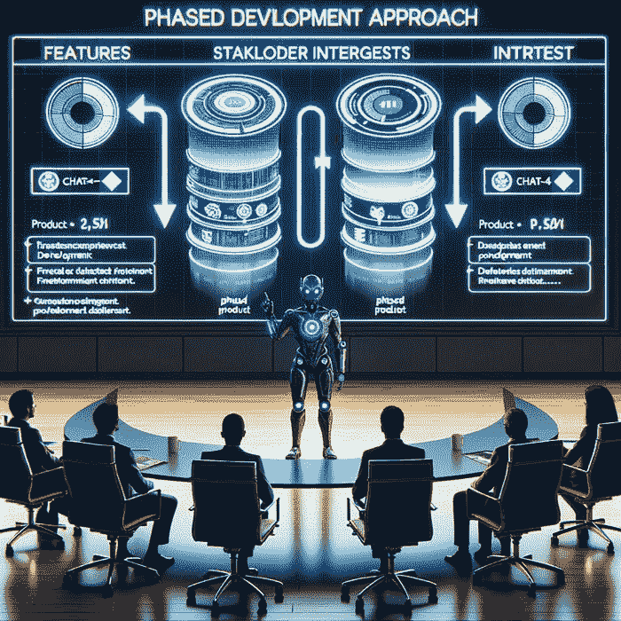
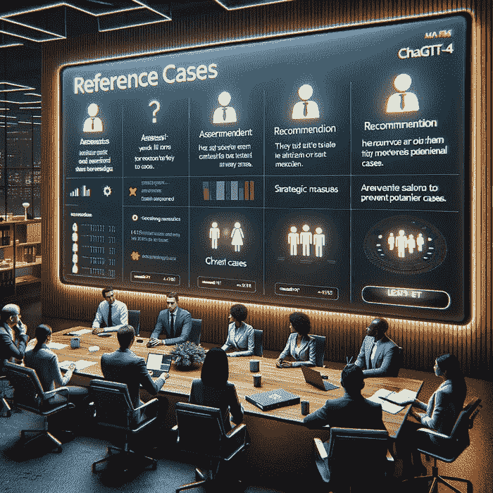
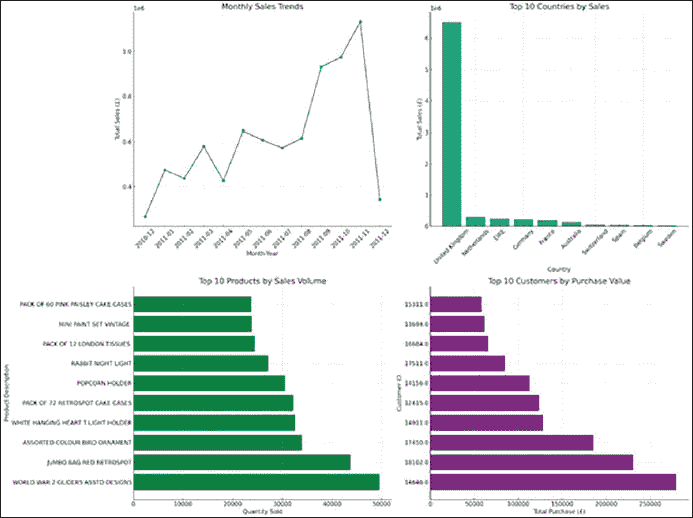

# 第五章：高级 GPT 提示工程技术

# [介绍]

回顾我们之前的讨论，我们已经深入探讨了 ChatGPT 启用的人工智能能力，见于*第二章，CapabilityGPT – 一个 ChatGPT 的企业人工智能能力框架*，并且在*第三章，ChatGPT 对企业的影响*中审视了它们对企业角色的变革性影响。我们还在*第四章，GPT 模型赋能的架构模式*中看到了这些先进能力，当与正确的解决方案架构模式结合时，可以引领一个新一代的智能系统。掌握这些人工智能能力的核心是提示工程的实践，即有效地与 GPT 模型进行交流的技术。

无论在什么情境下，提示工程都是至关重要的——无论是与 ChatGPT 聊天机器人进行简单交互，开发以 GPT 为核心的专业应用程序，还是利用像 Microsoft Copilot 这样增强了 GPT 的企业解决方案。这个过程是制定精确、具有上下文相关性的提示，使我们能够从模型中产生期望的回应。

有三种主要技术，指令提示、查询提示和多智能体提示，每种技术都在与 GPT 模型交流时解决独特的挑战和场景。

我们从**指令提示**开始探索。这一技术牢固地基于在*第二章*中介绍的 CapabilityGPT 框架，它提出了一种结构化方法，用于向 GPT 模型传达特定的任务或行动。随后的深入剖析将通过其三种变体：单一指令、指令序列和伪代码指令来导航，它们的有效性将通过强调它们实际应用的现实世界例子得以展现。

接下来，我们转向**查询提示**，这是一种在探索和分析场景中有用的技术，也是在面对模糊和不完整信息时有用的技术。在本节中，我们区分各种查询类型，包括寻求信息、比较、预测和假设性查询，并为每种查询类型提供详细的示例。

最后，我们深入探讨**多智能体提示**。在其核心，这种技术在任务无法严格定义的情况下表现出色，需要多个人工智能代理的专业知识和有效协作。本节提供了潜在概念的定义，并在企业环境中提供了详细的实际示例。

需要注意的是，本章讨论的提示工程技术是特定于 ChatGPT 及其之后的 GPT 模型的，目前包括 ChatGPT 和 GPT-4。

# 结构

在本章中，将涵盖以下主题：

+   指令提示

+   查询提示

+   多智能体提示

# 指令提示

在本节中，我们首先探讨指令提示模式，这是 GPT 模型交互的精确引导蓝图。然后，我们提供多个实际示例，说明其在企业场景中的应用。

# 指令提示模式

指令提示模式是在*第二章，CapabilityGPT – 一个 ChatGPT 的企业人工智能能力框架*中引入的人工智能能力框架的基础上构建的，它提出了一种系统的方法来引导 GPT 模型产生深入、具有上下文意识和精确的输出。让我们深入探讨每个模式组件：

+   专家角色：这个基本要素勾勒了 GPT 模型在其回应中应展现的专业知识和角色。专家角色可以被构想为一个个体或一个团队，拥有多样但互补的技能：

+   个人角色：重点是单一的专业技能集，比如“营销公司的业务分析师”或“专门从事数据分析的 AI 代理”。在这种情况下，模型将利用其预训练的知识，以满足专业背景和情境理解的要求，发挥专业知识和观点。

+   团队角色：例如“教师、学生和家长的协作团队”或“由开发人员、设计师和项目经理组成的跨职能团队”，涵盖了多样化观点和经验的协同作用。在这里，GPT 模型试图促进协作方法，牢记每个角色贡献的独特见解。

+   背景：这个组成部分包括引导 GPT 模型更准确和适当地回应的外部或用户提供的信息。它可能涉及背景信息或特定情景的细节；例如，“我们公司上季度推出了三个营销活动。”背景信息显著有助于定位 GPT 模型的理解和回应，并有助于减少幻觉的风险，即生成与提供的输入或其预训练数据不符的信息。

+   任务规范：这个组成部分作为详细的指令，定义了 GPT 模型需要采取的行动或一系列行动。指令的性质和结构可能因任务复杂性、所需的精度以及任务是否涉及单个步骤或多个步骤而有所不同。这类指令有三种不同的格式：

+   单一指令：这些指令符合 CapabilityGPT 框架中定义的 AI 能力，指导 GPT 模型利用其多样化的能力，如评估、分类或沟通。例如，一条指令可能是：“评估这些广告活动的表现，并找出改进的方向。”

+   指令序列：这种格式涉及一系列指令，每个指令对应一个特定的 AI 能力。该序列指导 GPT 模型完成多个任务，旨在解决复杂问题或实现详细目标。每个指令都作为整体任务进展的一个阶段，其中一个指令的输出作为下一个指令的输入。一个例子是：“1. 从提供的财务报告中提取季度销售数据。2. 从提取的数据中识别任何销售趋势或模式。3. 根据识别的趋势，预测下一个季度的销售额。”

+   伪代码指令：伪代码将自然语言和编程语言联系起来，提供了算法的高级描述，而不必遵循严格的编程语法。这确保了对 GPT 模型的清晰和精确的指令。通过伪代码，诸如“if-then-else”条件和“for”或“while”循环等结构可以无缝集成，使模型能够高效而明确地处理复杂的多步任务。一个相关的例子是：

对于文章中的每个段落

如果段落中包含“重要”一词

提取段落的主要思想

如果

结束对于

将提取的想法编译成简要摘要

返回摘要

+   执行规则：执行规则提供潜在的指导，引导 GPT 模型在任务执行过程中进行思考和决策。这些规则包括问题解决方法、数据收集技术、道德考虑、协作实践和进化原则。它们可以适用于整个指令序列，也可以针对每个指令步骤有所不同。每个规则类别都包含具体的示例，以进一步澄清其意图和应用。以下是详细说明：

+   问题解决和推理：

+   “让我们一步一步地思考”：确保 GPT 模型执行逐步的思考过程，并在生成最终输出之前记录每一步的上下文。

+   “让我们首先了解问题并制定解决方案的计划。然后，让我们执行计划，一步一步地解决问题”：指示 GPT 模型为任务生成行动计划，然后遵守该计划，依次执行每个动作。

+   “考虑所有潜在解决方案”：鼓励 GPT 模型探索多种解决方案，而不仅仅专注于最明显或首先识别到的解决方案。

+   “在决定之前权衡利弊”：指示 GPT 模型评估每种解决方案或方法的利弊，确保更加平衡的决策过程。

+   “从列举潜在结果开始”：指导 GPT 模型在深入分析之前，通过列举可能的结果或情景来开始其思考过程。

+   “系统地参考可用数据”：指示模型仔细核对其掌握的每一条信息，确保在推理过程中没有遗漏任何细节。

+   “用新的见解更新假设”：提示模型随着提供更多数据或背景，完善其最初的预测或结论，鼓励推理过程中的适应性。

+   数据收集：

+   “仔细问我信息性问题，以最大化你对这一事件的信息，这样，当你得到所有答案时，你就可以做 X”：确保 GPT 模型提出最有效的问题，以最大化信息获取。

+   “每次只问一个问题，不给出答案”：限制 GPT 模型一次只能提出一个问题，允许后续问题建立在先前的回答基础上。

+   “在继续之前验证数据完整性”：鼓励模型确保其收集的信息准确、完整，没有被篡改或误导。

+   遵守道德标准：

+   “消除特定偏见”：指示模型主动避免任何形式的偏见，无论是人口统计学、社会经济、文化、种族、性别等，在生成输出时。

+   “拒绝个人可识别信息（PII）”：确保 GPT 模型不接受提示中的任何 PII 数据。

+   “促进公平和包容”：指导模型产生公平和包容的输出，代表多元化的观点，避免边缘化。

+   “避免有害或冒犯性内容”：指示模型过滤任何可能对任何个人或群体有害、误导或冒犯的内容。

+   “认识并披露局限性”：鼓励模型承认其局限性，并在适当的情况下提供免责声明或建议用户寻求专家意见。

+   合作规则：在由专家角色组成的团队执行的任务中，合作规则指导不同角色之间的互动和协同作用，以促进建设性和平衡的对话。在这里，我们详细介绍鼓励结构化合作的规则：

+   “进行协作综合”：鼓励专家角色团队共同合作，将他们各自的见解整合成一致的回应。例如，教师、学生和家长可以汇集他们独特的观点，构建基于人工智能学习的多方面解决方案。

+   “采取基于角色的视角”：鼓励专家角色团队的每个成员从其特定角度提供意见，促进对所讨论问题的更深入理解。

+   “建立共识”：指导专家角色团队努力寻找共同点，鼓励一种和谐的方法，尊重并整合所有团队成员的观点。

+   **‘解决冲突’：**指导团队高效地解决分歧，促进一个不同观点可以和谐共存的协作环境。

+   **应用进化原理：**指导 GPT 模型利用模拟自然选择过程的进化方法，以迭代地改进解决方案，生成或改进输出。在应用这些原理时，用户应指定：

+   **‘使用此初始解决方案：<solution>’：**指导 GPT 模型从指定的起点开始其演化过程。例如，当为新的跑车生成口号时，可以以“绿色和快速。不再矛盾”开始。

+   **‘执行<number>次进化步骤’：**指示模型应进行的精确改进次数。举例来说，为了改进口号，模型可能被指示进行 20 次进化步骤。

+   **‘通过此适应度函数评估<function description>’：**命令模型根据设定的标准评估其输出。在口号创作领域，这个函数可以根据口号的朗朗上口程度或其在现代生态背景下的相关性来衡量。

+   **输出约束：**这些定义了 GPT 模型生成的输出必须满足的条件。它们可以涉及格式、顺序、包含或排除某些元素、输出的大小和/或其他因素。约束可以是这样的：“输出应该是一个结构化报告，每个活动的表现和建议改进都有明确的部分。总输出不应超过 500 字。”

+   **参考案例：**基于案例的推理（CBR）是一种方法论，其中通过将新挑战与先前遇到的情况及其结果进行类比来推导新的解决方法。它涉及选择相关的参考案例，并对其进行调整以解决上下文部分描述的当前挑战。它涵盖了不同领域的广泛实际场景，并分为三种主要类型：

+   **问题解决案例：**描述了实体面临的特定问题以及随后实施的解决方案或干预措施。

+   **示例 1（零售）：**

+   **问题：**MegaStore 注意到他们的电子商务网站在移动设备上的购物车放弃率很高。

+   **解决方案：**MegaStore 重新设计了他们的移动结账流程，简化了步骤，并整合了更高效和流行的移动支付方式。这导致购物车放弃率在两个月内减少了 25%。

+   **示例 2（人力资源）：**

+   **问题：**TechCorp 意识到其员工流失率逐年增加，特别是初级员工中。

+   **解决方案：**TechCorp 实施了一项导师计划，将初级员工与资深专业人士配对。他们还引入了灵活的工作时间和持续学习机会。一年内，流失率减少了 20%。

+   **输入输出案例：**具体输入及其对应的 GPT 生成的输出的配对

+   **示例 1（媒体监测）：**

+   **输入：**“在年度会议上，CEO 约翰·史密斯宣布与 GlobalTech 合作，创新新的人工智能解决方案。”

+   **输出（事件数据提取）：**事件：合作伙伴关系公告；参与者：CEO 约翰·史密斯，GlobalTech；背景：年度会议；目标：创新新的人工智能解决方案。

+   **示例 2（能源部门）：**

+   **输入：**冬季增加的消费趋势和新的监管政策。

+   **输出（事件预测）：**基于增加的消费趋势和新的监管政策，预计在即将到来的冬季月份能源价格将上涨。

+   **思维链案例：**详细的序列，其中初始输入经历一系列逻辑或推理步骤以得出特定输出。

+   **示例 1（供应链管理-库存重新订购）：**

+   **输入：**本月数据：销售 500 个单位，退货 200 个单位，在运输中损坏 50 个单位，库存 1000 个单位，补货的交货时间为 3 周，平均每周销售 150 个单位。

+   **思路：**

1.  计算净销售额：从销售单位中减去退货单位：500 - 200 = 300 个单位。

1.  评估当前库存：考虑净销售和库存中的损坏单位：1000（起始库存）- 300（净销售）- 50（损坏）= 650 个单位。

1.  预测未来库存：考虑平均每周销售量和当前库存：650（当前库存）-（3 周×每周 150 个单位）= 3 周后预计剩余 200 个单位。

1.  确定补货的紧急性：如果交货时间为 3 周，那么在库存补充之前，只剩下 200 个单位。因此，必须在一周内进行补货，以避免在补货期结束之前库存不足。

1.  评估最佳重新订购数量：考虑销售趋势、退货率和潜在损坏，对意外损坏进行缓冲是明智的。重新订购（3 周×每周 150 个单位+100 个单位缓冲）= 550 个单位似乎是合适的。

+   **输出：**为了在接下来的一个月内保持健康的库存水平并考虑到不可预见的情况，建议在一周内重新订购 550 个单位。

+   **示例 2（银行-分类案例）：**

+   **输入：**具有以下详细信息的贷款申请：申请人年龄：29 岁，年收入：85,000 美元，就业状况：全职，信用评分：680，现有债务：20,000 美元。

+   **思路：**

1.  评估年龄及其对贷款风险的影响。

1.  评估年收入与潜在贷款规模的关系。

1.  检查就业状况以确定财务稳定性。

1.  审查信用评分以确定信用价值。

1.  分析现有债务与收入，以了解财务负担。

+   **输出：**申请人属于“中等风险”类别，可以获得贷款批准。

+   **外部能力：**GPT 模型可以进一步利用插件和外部工具的功能来增强其功能：

+   **插件：**这些是最初为 ChatGPT 生态系统引入的专业扩展。它们专注于推动业务效率，实现数据驱动的决策，并促进智能自动化。关键类别包括探索性数据分析、文档理解、人工智能和浏览。

+   **外部工具：**代表通过指定接口可用的功能目录，这些工具促进了 GPT 模型与其他人工智能平台、搜索引擎或后端系统之间的交互。每个工具都由详细的规范定义，包括执行任务类型、参数类型、结果类型和功能。

指令提示模式在以下情况下特别有用：

+   **需要复杂问题解决方案：**在任务多方面且需要复杂解决方案的情况下，该模式确保了系统化的方法，将复杂任务分解为可管理的步骤，以提高清晰度和效果。

+   **精度至关重要：**对于那些精度和准确性至关重要的任务，指令提示模式的详细任务规范和执行规则指导模型产生精确和具有上下文意识的响应。

+   **需要特殊专业知识：**如果情境需要多样的专业技能，选择个人或团队角色可以满足特定需求的专业知识，无论是来自单一专业人士还是协作团队。

+   **期望结构化输出：**当期望结果必须符合特定格式或结构时，输出约束组件可以确保人工智能生成的内容符合定义的要求。

+   **基于案例推理是有价值的：**在可以提供有价值见解的过去情景中，该模式的参考案例提供了一种方法来利用先前知识应对新挑战。

# 单一指令示例

以下展示了 ChatGPT-4 在处理单一指令提示时利用指令模式的组件，展现了其多样的能力。这些示例涉及项目回顾、利益相关者管理和销售预测的领域。每个提示展示了 ChatGPT-4 的不同 AI 能力⁴：

+   **项目回顾**：评估一个已完成的项目，比较了两个评估提示，其中一个提供了简洁的总结，另一个则进行了详细分析，确定了改进的领域和建议。比较表明，对**评估**能力的指令提示模式的组件进行具体规定，如角色、执行规则和输出约束，可以产生更详细、具体和专业的结果。

+   **利益相关者管理**：在这里，ChatGPT-4 充当产品经理，说服高管支持三种产品选项之一，使用论证框架⁵。它将产品特性与利益相关者的利益相一致，为所有产品提出分阶段的开发方法，并提倡平衡的产品开发策略。这是通过使用**创造**能力来发展几个论证推理链条来实现的。

+   **销售预测**：最后，ChatGPT-4 展示了对有机护肤产品线未来销售的预测能力，考虑了历史销售数据、观察到的模式和未来市场预期。它利用其**预测**能力以自然语言生成未来几个月的基本销售预测，有助于库存管理和营销工作的战略规划。

# 项目回顾

让我们从评估一个已完成的项目开始，以其项目经理的报告作为**评估**能力的示例：

**图 5.1:** 项目回顾

以下是报告：

*项目报告：XYZ 移动应用的开发*

+   *项目范围：旨在为我们的客户 XYZ 公司设计和实施一个全功能移动应用，以增加客户互动和用户体验。关键功能包括用户友好界面、安全支付网关和客户支持功能。*

+   *进度：项目计划为 12 个月，从 2022 年 8 月 1 日开始，到 2023 年 7 月 31 日结束。分为四个阶段：规划（2 个月）、开发（5 个月）、测试（3 个月）和部署（2 个月）。*

+   *成本：预算为 50 万美元，但由于在开发和测试阶段出现了一些意外复杂性，项目超出了预估成本的 15%，最终成本为 57.5 万美元。*

+   *质量：尽管时间和成本超支，但项目按协议达到了质量期望。用户测试平均得分为 4.5 分（满分 5 分），表明对应用的可用性和功能性感到满意。*

+   *资源：项目团队由一个项目经理，两名软件开发人员，一个 UI/UX 设计师，一个质量保证专员和一个业务分析师组成。然而，在开发阶段出现了较高的人员流失率，导致项目交付出现了轻微延迟。*

+   *风险：遇到了两个重大风险：*

+   *预算超支是由于开发中的意外复杂性，通过从营销储备中重新分配预算来进行管理。*

+   *资源流失造成的延迟得到了缓解，通过雇佣临时经验丰富的资源来保持进度。*

参考报告，ChatGPT-4 的直观提示可能是：

*‘根据上述项目报告进行端到端评估。’*

回应如下：

*项目评估摘要：XYZ 移动应用的开发*

+   *目标和范围：项目有效地实现了其设计和实施一个具有用户友好界面、安全支付网关和客户支持功能的全功能移动应用的目标。*

+   时间表：尽管在开发阶段出现了人员流失导致的轻微延迟，但项目仍然遵循了规定的 12 个月时间表。考虑到所涉及任务的复杂性，项目阶段的分配似乎是合理的。

+   *预算：该项目的预算超出最初估计的 15%（75,000 美元），主要是由于开发和测试阶段出现了意想不到的复杂性。虽然通过重新分配营销储备来管理了这一超支，但这是未来项目中需要改进的明显领域。更好的应急计划和风险管理可以预见到一些额外成本。

+   质量：质量措施显示出积极的结果。应用程序在测试中获得了高用户满意度评分，这表明尽管预算和资源存在挑战，最终产品的质量很高。

+   资源：项目团队的组成基本上适合项目的需求。然而，高流失率表明项目管理、团队士气或其他组织挑战可能存在潜在问题。这种资源不稳定性产生了实质性影响，导致项目交付延迟。

+   风险管理：风险已经被识别和管理，但识别过程可以更主动一些，特别是涉及预算和人力资源方面。虽然已经采取了缓解措施（重新分配预算、雇佣临时资源），但分析这些问题以防止未来项目中的再次发生将是有益的。

+   未来项目的建议：

1.  增强项目成本估算和应急计划，以防止预算超支。

1.  加强团队管理和留任策略，以减少关键项目阶段的人员流失。

1.  改进风险识别流程，考虑在规划阶段更全面地考虑内部和外部潜在风险。

总的来说，该项目可以被认为是成功的，因为它实现了其主要目标，并且产生了一个受用户欢迎的高质量产品。然而，时间和预算的超支，再加上资源不稳定性，表明有一些领域需要在未来项目中更加关注和完善。这些改进可以导致更可预测、更顺利的项目执行，并可能带来成本节约。

然而，使用指示提示模式，提示将被制定如下：

+   **专家角色**：“您是一位擅长项目评估的高级项目经理”

+   **背景：**“下面是一个关于开发移动应用的已完成项目的描述”

+   **指示：**“对项目进行端到端的评估”

+   **执行规则：**

+   “确保涵盖项目的范围、进度、成本、质量、资源、沟通、风险、采购和利益相关者管理。”

+   “确保采取非常批判性的中立立场，并挑战负责交付项目的项目经理创建的报告。”

+   **输出约束：**“输出必须以结构化报告的形式呈现，每个评估因素都有清晰的标题”

ChatGPT-4 生成的输出如下：

项目评估报告：开发“XYZ”移动应用程序

1.  项目范围：该项目旨在设计和实施一个具有用户友好界面、安全支付网关和客户支持功能的移动应用程序。然而，项目范围的描述似乎过于泛泛，缺乏对其复杂性的详细洞察。包括应用程序开发平台、预期用户互动水平和所需客户支持规模的具体细节将是有益的。还应明确说明功能数量、复杂性和任何限制，以避免范围蔓延。

1.  进度：该项目遵守了 12 个月的时间框架，尽管由于资源流失而出现了轻微延迟。评估原始项目进度表中是否有足够的应急时间来容纳意外延迟是至关重要的。规划阶段似乎是相称的，然而，开发阶段几乎占据了项目时间的一半，这引发了对效率和方法的质疑。此外，部署的两个月时间可能有些长——事后评估应确定是否可以为未来项目简化这一过程。

1.  成本：该项目经历了 15%的成本超支，主要是由于开发和测试阶段出现了意外复杂性。这引发了对项目最初成本估算和风险评估过程的担忧。项目预算是否包括了意外成本的应急基金？如果没有，应该纳入未来的项目中。此外，从营销储备中重新分配资金可能会对项目的可见性和客户接触产生影响。

1.  质量：该项目似乎已经达到了其质量目标，用户测试得分证明了这一点。然而，平均得分并不能提供全面的图片。与应用程序特定方面相关的得分细分，如可用性、设计、功能和安全性，将提供更深入的理解。此外，在整个项目生命周期中是否有管理和监控质量的机制，还是仅在最后通过用户测试来衡量？

1.  资源：团队构成对于这种性质的项目来说相当全面。然而，高流失率令人担忧。这背后的原因是什么？这些与项目管理、公司文化还是市场条件有关？调查这一点对于减轻未来类似事件至关重要。此外，雇佣临时资源可能会影响整体团队的协同和产出质量。

1.  风险：报告提到了两个重大风险——预算超支和由于资源流失而导致的延迟。分析项目中采用的风险识别、评估和缓解策略将是值得的。这些风险是否在前期被识别出来？如果没有，为什么会被忽视？项目是否有风险管理计划？了解这些因素将加强未来项目的风险管理方法。

1.  采购：关于该项目的采购没有提供任何信息。它是否涉及到分包或采购第三方服务、工具或技术？如果是，采购策略是什么，它的管理效果如何？在这方面的透明度将有助于更全面地评估项目。

1.  利益相关者管理：报告没有提供任何关于利益相关者管理的见解。有关利益相关者识别、他们的角色、期望和沟通策略的信息对于从各个角度理解项目的成功至关重要。是否有一种结构化的方法来让利益相关者了解项目的进展和挑战？

总之，虽然该项目成功交付了一个高质量的移动应用程序，但仍有重大改进空间。这些包括细化项目范围、改进成本估算和风险管理、解决资源流失问题，以及增强采购和利益相关者管理的透明度。

两份评估报告都对“XYZ”移动应用项目进行了审查，但它们在方法、分析深度和关注领域上存在差异，如下所示：

1.  目标和范围：两份报告都赞扬该项目达到了其目标。第二份报告建议对范围描述进行细化，以提高具体性，并建议进行改进。

1.  **时间表：** 评估一致认为时间表得以保持，只有轻微的问题。第二次评估建议进行事后评估，以进一步审查各阶段的持续时间。

1.  **预算：** 两份审查都承认预算超支，并突出财务规划方面的改进空间，并在第二份报告中质疑应急和营销资金的分配。

1.  **质量：** 第一份报告赞扬用户满意度得分，而第二份报告则寻求对这些得分进行更深入的分析，并质疑项目的质量管理策略。

1.  **资源：** 报告指出高员工流失率，主张改进团队管理策略，并通过第二份报告对员工流失原因和影响进行调查。

1.  **风险管理：** 第一份报告建议改进风险识别流程，第二份报告呼吁全面审查项目中使用的风险管理策略。

1.  **采购和利益相关者管理：** 第二份报告引入了新的考虑因素，建议在采购方面增加透明度，并加强利益相关者管理。

总之，两份评估都一致认为项目取得了成功的结果。第一份报告提供了简洁全面的摘要，而第二份报告提供了更详细和批判性的分析，确定了额外的改进空间，并提供了更具体的建议（尽管两份提示都没有要求建议）。比较两者，可以明显看出，从指示提示模式中增加额外组件，如角色、执行规则和输出约束，会产生更详细、更具体，最终更专业的结果。

# 利益相关者管理

让我们以产品管理领域的一个例子来进行，这个领域必须处理多个利益相关者。

**图 5.2：** 利益相关者管理

随后的提示基于**创作**能力：

+   **专家角色：** *“您是产品经理和论证专家”*

+   **背景：** *“您正面临推出新产品的压力。*

+   *您有以下三个选项：*

+   *产品 A 具有最多的功能，但需要最长的开发时间，价格也最高。”*

+   *产品 B 具有所有基本功能，可替代不再符合市场标准的成功产品 C。*

+   *产品 D 吸引了新一代客户，具有特殊的技术特点。*

+   *您的利益相关者是以下高管：*

+   *CTO（首席技术官）对应用新技术有浓厚兴趣。*

+   *COO（首席运营官），几年前开发了产品 C。*

+   *CMO（首席营销官），希望拥有一个快速开发新产品的流水线，以跟上竞争。*

+   **指示：** *“* *开发几条论证推理链（创作）”*

+   **执行规则：**

+   *尽量说服尽可能多的利益相关者，*

+   *尽量减少潜在的不满，*

+   *使用 AI 论证框架。*

ChatGPT-4 生成的对此提示的响应如下：

*当然，我可以帮助您。我们将使用基于三个主要组件的 AI 论证框架：主张、证据和保证。主张是我们想要提出的观点或断言，证据是支持主张的信息，保证连接证据与主张，解释为什么证据支持主张。*

让我们逐个为每个产品进行论证：

*产品 A（最多功能，开发时间长，价格高）*

*主张：产品 A 是最全面的解决方案，将吸引寻求功能丰富产品的客户，并在长期内增加价值。*

*证据：它具有最多的功能，可能比市场上的任何其他产品更好地满足客户需求。*

*保证：尽管开发时间较长且价格较高，产品 A 的广泛功能可以证明价格标签并吸引一个专注于质量的用户群体。这将帮助我们获得坚实的市场份额并建立我们的品牌声誉，这符合首席营销官对我们与竞争对手区分的兴趣。*

*产品 B（基本功能，产品 C 的替代品）*

*主张：产品 B 是先前成功产品 C 的直接继任者，确保连续性并迎合我们现有的用户群体。*

*证据：它旨在取代产品 C，后者已不再符合市场标准，这意味着它填补了我们产品阵容中的当前空白。*

*保证：更新我们的产品阵容以匹配市场标准至关重要。这将保持我们当前用户的信任，确保他们不会感到被抛弃，并保持我们的市场份额。首席运营官会欣赏这一策略，因为它最小化了风险并确保了稳定性。*

*产品 D（新技术，吸引新一代客户）*

*主张：产品 D 代表创新，迎合新一代客户，开拓了一个潜在的利润丰厚的市场细分。*

*证据：它的特殊技术功能使其吸引了一个重视创新并熟悉尖端技术的新一代客户。*

*保证：通过开发和推出产品 D，我们不仅能吸引首席技术官对应用新技术的兴趣，还能与首席营销官的目标保持竞争力相一致。尽管是一个新的尝试，但从吸引年轻、精通技术的人群中获得的潜在回报可能会超过风险。*

*总之，每个产品都有其自身的优势，并与不同利益相关者的利益相一致。然而，一个平衡的方法可能涉及制定一个包括所有三种产品的阶段性路线图，这可能解决所有利益相关者的关切。我们可以根据市场需求、技术准备情况和我们的战略目标来优先发展。*

在这个利益相关者管理模拟中，ChatGPT-4 充当了一个擅长辩论的产品经理，任务是说服一组高管支持三种产品选项中的一种。遵循 AI 辩论框架，它为每种产品策略性地制定推理链，将产品的特点与涉及的利益相关者的具体利益相一致。

ChatGPT-4 熟练地在任务中导航，勾画出产品的优势和潜在市场影响，同时满足利益相关者的优先考虑。它建议制定一项路线图，支持分阶段开发所有产品，以潜在地满足所有利益相关者，从而在产品开发战略中推动和谐的前进道路。所提议的计划确保了一个全面的方法，努力平衡各种利益相关者的利益，同时倡导强大的产品开发轨迹。

# 销售预测

在这个例子中，我们深入探讨了 ChatGPT-4 的**预测**能力，重点关注销售预测。通过分析有机护肤产品线，ChatGPT-4 将展示其预测未来销售的能力。

**图 5.3：** 销售预测

利用历史销售数据、观察到的销售模式和未来市场预期，随后的提示将引导模型以自然语言生成基本的销售预测：

**专家角色：** *您是销售预测专家。*

**背景：**

这是销售历史：该产品是一系列有机护肤产品，于 2021 年 1 月推向市场。当月销售缓慢，仅售出 50 个单位。为了提高销量，公司采用了激进的营销策略，包括社交媒体宣传和与意见领袖的合作。这导致销量逐渐增加，到 2021 年 4 月达到每月 200 个单位。2021 年夏季带来了意外的销售激增，7 月销量达到 600 个单位，得益于成功的夏季促销活动和产品适合暖季护肤的特点。秋季销量略有下降，降至每月 400 个单位，但在 11 月和 12 月的假期季节销量反弹，平均每月达到 550 个单位。2022 年 1 月由于假期过后市场饱和和预算限制，销量略有下滑至 350 个单位。然后销量在第一季度稳定在每月平均 400 个单位。2022 年 4 月推出新产品变种后，销量再次增长至 700 个单位，此后每月平均维持在 650 个单位。到 2023 年 7 月底，已售出 8000 多个单位，反映了产品的稳定需求和日益增长的受欢迎程度。2023 年 8 月标志着一个关键时刻，公司的返校季促销活动将销量推至历史最高的 800 个单位。这一成功得到了特别促销折扣、战略意见领袖合作以及今年早些时候推出的新产品变种的持续受欢迎的支持。

这是自市场推出以来观察到的历史模式：

1.  初始阶段销售缓慢：在推出新产品或变种后，销售通常会初始缓慢，表明顾客需要时间来接受新产品的模式。

1.  秋季销售下降：历史上，秋季销售通常会下降。这种模式可能与天气变化以及消费者护肤程序相应调整有关。

1.  假期销售激增：销售在 11 月和 12 月的假期季节一直呈现出激增的趋势。这可能是由于礼品购买增加和顾客为冬季护肤需求备货。

1.  假期后销量下滑：假期季过后，销量下滑，表明存在购买行为减少的模式，可能是由于市场饱和和假期后消费者预算限制所致。

这是今年余下时间的预期：

1.  季节性促销活动：市场部门已经计划在假期季推出一项重大促销活动，预计将在该期间带来销售的显著增长。

1.  新产品变种：全年推出新产品变种或扩展可能会促进销售增长，吸引既有客户尝试新产品，也吸引新客户。

1.  市场扩张：公司计划将业务拓展到新市场。这一举措可能会激发销售增长，因为它将吸引新的客户群体。

1.  日益普及：产品日益普及和品牌认知度的提高，得益于积极的客户评价和有效的营销，预计将在未来维持并可能加速销售增长。

1.  经济因素：预期的经济复苏和全球事件后消费者支出的增加也可能导致销售增长。

**指示：** *基于销售历史、历史模式和未来预期，提供未来六个月的自然语言销售预测（预测）。

ChatGPT-4 对此提示的回应如下：

基于销售历史、观察到的模式和未来预期，我们可以为接下来的六个月提供以下销售预测：

2023 年 8 月：据报道，8 月销量已经达到历史最高的 800 个单位，得益于返校季活动的推动。

*2023 年 9 月：我们通常观察到秋季销售下降。然而，从 8 月开始的高销售势头和新产品变体的持续受欢迎可能会减轻这种预期的下降。因此，我们可以预测轻微下降，可能在 700 个单位左右。*

*2023 年 10 月：根据历史模式，秋季销售下降应该会继续，但由于新产品变体的持续影响，预期的效果将不那么显著。让我们预测销售额大约在 650 个单位左右。*

*2023 年 11 月：随着节日季节的开始，我们历年来都看到销售额的激增，公司计划的促销活动预计将进一步增加这一激增。根据往年的趋势，销售额可能会跃升到大约 800 个单位。*

*2023 年 12 月：节日季节持续到 12 月，如果促销活动像预期的那样成功，销售额应该会继续保持高增长。考虑到产品日益增长的受欢迎程度和促销活动的影响，销售额可能会达到 850 个单位的高峰。*

*2024 年 1 月：节后销售低迷一直是一个持续的模式。消费者可能正在从节日支出中恢复过来，市场可能会因前几个月的高销售而出现一些饱和。然而，计划中的市场扩张的影响可能有助于减轻这种下降。因此，我们可以预测下降到大约 600 个单位。*

*请注意，这些数字是基于过去的趋势和计划活动的预测。其他因素，如竞争对手的活动、市场动态和意外事件可能会影响实际销售业绩。需要定期跟踪和调整预测，以保持其准确性和相关性*。

在这个销售预测的例子中，ChatGPT-4 扮演了一个具有预测能力的销售预测专家的角色。指令提示建立了上下文，展示了有机护肤产品线的销售历史，突出了观察到的模式，并设定了未来的期望。然后，ChatGPT-4 被要求根据给定的上下文预测接下来几个月的销售情况。

ChatGPT-4 熟练地处理指令，并通过考虑销售数据、历史模式和未来期望，为接下来的几个月制定了基本的预测。它概述了每个月的销售可能如何塑造，有助于制定管理库存和营销工作的战略计划。

另外三个单一指令示例在*附录 A*中呈现：

+   **资源管理**：在这个例子中，我们展示了 ChatGPT-4 在资源管理领域的**匹配**能力。系统被提示根据其技能和项目需求为项目分配资源。

+   **基于场景的项目模拟**：在项目管理领域中使用另一个例子，我们突出了 ChatGPT-4 的**模拟**能力。它被提示根据先前的项目结果执行项目阶段模拟。

+   **商业沟通**：这个最后的单一指令示例探讨了新兴的碳会计行业中的商业沟通和总结能力。任务将由参考案例指导，这些案例向 ChatGPT-4 展示了预期摘要应该如何利用其**总结**能力。

# 指令序列示例

接下来的例子说明了使用 ChatGPT-4 进行员工辅导和产品评论情感分析的基于序列的指令提示。每个例子都突出了 ChatGPT-4 的一组独特的人工智能能力：

+   **新员工辅导**：这个第一个例子展示了 ChatGPT-4 在人力资源领域的**评估**和**建议**能力。系统被指示评估新员工的情况，并建议适当的措施以防止潜在的流失，所有这些都是由参考案例指导的。

+   **产品评论的情感分析：** 然后我们涵盖产品评论的情感分析领域，以展示 ChatGPT-4 在**信息提取和分析**、**因果分析**和**分类**方面的能力。系统被要求在三个连续步骤中对产品评论进行情感分类。

# 新员工辅导

这个例子侧重于一个两步指令序列，指导时装零售业的人力资源经理评估新员工情况，并建议采取适当措施防止潜在的流失：

**图 5.4：** 新员工辅导

**专家角色***：您是一家时装零售商的人力资源经理，专门负责员工流失问题。您在处理各种员工案例并找到解决方案方面拥有丰富的经验。*

**背景：** *您的新案例涉及詹姆斯，一名最近招聘的初级商品推销员。詹姆斯在公司工作了几周后已经显示出不满的迹象。尽管在入职期间有一个有希望的开端，但他的热情似乎迅速消退。他在团队会议上经常沉默，对团队活动不响应，他的工作缺乏新人应有的活力和彻底性。*

**指令序列：**

1.  *根据以下参考案例评估新案例。始终在新案例和参考案例之间进行比较，并从中学到的东西。*

1.  *根据评估结果，推荐采取具体的人力资源行动来防止流失*

**参考案例：**

**问题解决案例 1：**

+   **问题：** *新销售代表整合 索菲亚作为一名最近招聘的销售代表，最初充满活力，渴望为我们的时装零售商做出贡献。然而，进入角色几周后，索菲亚开始显示出不参与的迹象。她似乎对自己的责任不确定，并在与同事建立关系方面遇到困难。她的表现也不稳定，显示出对自己角色的理解不足。*

+   **解决方案：** *我们迅速意识到这些迹象，并实施了一个针对索菲亚角色的结构化入职培训计划。该计划包括培训课程，帮助她了解自己的责任和产品知识。除此之外，我们还为她介绍了一个来自她团队的导师，指导她了解日常流程并回答她的问题。导师还向她介绍了其他团队成员，帮助她建立联系。随着时间的推移，索菲亚与团队的信心和参与度增加，她的表现也显著提高。她对导师制度和结构化指导表示赞赏，这有助于她顺利过渡到自己的角色。*

问题解决案例 2：

+   **问题：** *新设计师的文化适应 马克是一位才华横溢的设计师，带着令人印象深刻的作品集加入了我们的公司。然而，一个月内，马克似乎变得疏远和不参与。他的设计缺乏热情，很少在团队讨论中做出贡献，表明他在适应公司文化方面存在困难。为了帮助马克，我们启动了一个文化适应计划。*

+   **解决方案：** *我们组织了定期的团队建设活动，鼓励马克分享他的想法并更加开放地与同事互动。我们还组织了讨论公司价值观和文化的会议，旨在创造一个包容的环境，让马克感到舒适地表达自己的创造力。马克慢慢地开始变得活跃起来，在团队会议上积极参与，他的设计开始反映出我们在招聘过程中看到的创造力。文化适应计划取得了成功，不仅对马克而且对团队内部的团结和包容性的培养也是如此。*

**问题解决案例 3：**

+   **问题：** *新的物流经理角色明晰。新招聘的物流经理丹尼斯在面试过程中表现出了很大的潜力。但在最初的几周后，她的贡献变得零星，她的工作缺乏细节注意，她在团队会议上的存在几乎可以忽略不计。很明显，丹尼斯对她的角色和对她的期望不清楚。*

+   **解决方案：** *作为回应，我们修改了她的工作描述，清楚地概述了她的职责、责任和绩效基准。我们在最初的两个月安排了每周一次的会议，以提供定期的反馈，讨论她的进展，并认可她的成就。结果，丹尼斯的表现显著提高，她承担起了自己的角色，并且她在团队会议上的贡献变得非常宝贵。她对清晰的沟通和持续的反馈表示感激，这使她顺利、无压力地过渡到新角色。*

作为对给定提示的回应，ChatGPT-4 生成了以下输出：

*评估：*

*詹姆斯的情况在某种程度上与参考案例相似。像索菲亚（参考案例 1）一样，他开始时充满热情，但他的动力迅速消退。然而，索菲亚的问题源于她对自己的角色的理解不足，而詹姆斯的问题似乎更多地与他与团队的参与和工作中的活力有关，这似乎更接近马克的情况（参考案例 2）。丹尼斯的情况（参考案例 3）也有些相似之处，因为她的贡献是不一致的，这也是詹姆斯所表现出的症状。然而，丹尼斯的问题是由于缺乏角色明晰，这似乎不是詹姆斯的问题。*

*建议：*

1.  *启动个性化入职计划：詹姆斯可能会受益于一个类似索菲亚的结构化计划。尽管他有经验，但他可能需要更多在这家公司的角色特定任务和责任方面的明确性和实践经验。与导师合作可能有助于他增强信心，提高他工作的彻底性。*

1.  *促进团队建设活动：詹姆斯对团队活动的不响应和在会议期间的沉默可能表明他在融入团队方面存在困难，类似于马克的问题。定期的团队建设活动可以鼓励他更多地与同事互动，提高他在工作中的热情和活力。*

1.  *提供定期反馈和认可：对丹尼斯采取的方法也可以应用于詹姆斯的情况。定期的反馈会话可以帮助澄清绩效期望，并给他一个表达任何可能存在的担忧或不确定性的平台。承认他的成就，无论多么小，也可以帮助提高他的动力。*

1.  *员工参与度调查：进行一项调查，以评估詹姆斯的参与度。这可以揭示他是否感到被低估、没有挑战或没有动力，这可能导致他的不参与。*

1.  *一对一会议：与詹姆斯的个人互动可能会更深入地了解他的情况。可能有一些工作外的问题影响了他的表现。保持开放的沟通渠道，了解是什么导致了他的不满至关重要。*

在这个员工辅导模拟中，ChatGPT-4 扮演了一名专门负责预防时尚零售公司员工流失的人力资源经理的角色。通过一个两步指导过程，任务是分析最近一名新员工逐渐减少的参与度，通过比较新情况和参考案例来找到潜在的解决方案。

利用参考案例中的过去经验，ChatGPT-4 建议了一种细致的策略，以留住新员工詹姆斯。它指出了与团队的潜在脱节，并建议个性化的入职计划和团队建设活动，以促进更好的参与度并防止流失。该回应有效地勾勒出了一项策略，为詹姆斯在公司初期提供了支持。

# 情感分析

让我们继续以一个包括三个步骤的指令序列提示的示例来进行产品评论情感分析：

**图 5.5:** 情感分析

**专家角色：** *您是电影评论情感分类的专家。*

**背景：** *StreamSmith V35 蓝牙耳机是一个雄心勃勃的尝试，旨在创造一个易于获得的高质量音频体验。然而，尽管它们有许多积极的品质，但它们仅仅达到了标准，获得了坚实的 3 颗星。V35s 的制造质量令人钦佩，因为它们具有舒适的贴合感和高级的外观和手感。此外，长时间的电池寿命是一个突出的特点，可以在单次充电中提供数小时的不间断使用。StreamSmith 的手势控制系统也很直观，使操作变得轻松。此外，公司对可持续包装的承诺值得赞扬。另一方面，V35s 让人失望的地方在于它们的音质，明显不如同价位的竞争对手令人印象深刻。低频的深度明显不足，使低音听起来略显空洞。高音也似乎缺乏清晰度，造成整体平坦的音场。再加上偶尔的连接问题，这减弱了本可以成为真正出色的音频体验。总的来说，StreamSmith V35s 代表了一个有前途的进步，特别是在设计和用户界面方面。然而，对于发烧友来说，这些耳机可能不是首选。如果 StreamSmith 专注于改善他们的音质和连接稳定性，他们未来的产品可能会对市场上的老牌竞争对手构成严峻挑战。*

**指令序列：** *在这三个步骤中对产品评论进行情感分类：*

**第一步，** *提供支持输入情感确定的线索（例如关键词、短语、上下文信息、语义关系、语义含义、语气、引用）。*

**第二步，** *从前提（例如线索、输入）中推断出支持情感确定的诊断推理过程。（因果分析）。*

**第三步，** *确定电影评论的整体情感，即考虑第 1 步的线索，第 2 步的推理过程和电影评论（分类）。*

对于给定的提示，ChatGPT-4 生成了以下输出：

*“以下是请求的步骤：*

1.  *信息提取与分析：*

+   *积极线索：“舒适的贴合感”，“高级的外观和手感”，“长时间的电池寿命”，“直观的”手势控制，“值得赞扬的”可持续包装，“有前途的进步”，“对市场上的老牌竞争对手构成严峻挑战”。*

+   *负面线索：“仅仅达到标准”，音质“不如同价位的竞争对手令人印象深刻”，低频“深度不足”，低音“略显空洞”，高音“缺乏清晰度”，“平坦的音场”，“偶尔的连接问题”。*

1.  *因果分析：*

+   评论者提供了产品的几个积极方面，如舒适感和高级感、电池寿命、直观的控制和可持续包装。这表明公司在用户体验和产品设计的许多方面都考虑周到。

+   *然而，评论的负面方面集中在产品的核心功能上，即声音质量和连接。鉴于产品的性质是耳机，这可能被认为更为关键。*

+   *尽管评论者承认该产品有挑战已建立的市场参与者的潜力，但他们也指出了它目前的缺点，特别是对于一个关键的目标受众 - 音响发烧友。*

1.  *分类：*

+   *总的来说，这篇评论的情感似乎是复杂的，但更偏向于负面，主要是由于批评的重量。尽管积极的线索比负面的要多，但负面的触及了耳机的核心功能 - 声音质量和稳定连接，这可能更具影响力。因此，这篇评论可以被分类为有些负面。*

在这个任务中，ChatGPT-4 扮演了一个情感分析专家，评估了对 StreamSmith V35 蓝牙耳机的评论。在一个三步指令序列之后，它首先确定评论中的积极和消极情绪。接下来，它进行因果分析，审查评论中提到的优点和缺点，特别关注产品功能的关键点。最后，它将整体情感分类为有些负面，突出了对产品核心功能的重大批评。这个任务展示了 ChatGPT-4 对评论进行分析以进行明智决策的分析方法。

另外三个例子在*附录 A*中呈现：

+   **指令序列：保险理赔处理**：系统被提示执行一系列涉及提问、总结答案和评估损失成本的步骤。

+   **指令序列：解决方案架构分析**：ChatGPT-4 审查给定的 Azure OpenAI 架构，识别组件，找出瓶颈，提出建议，并制定实施计划。

+   **伪代码指令：房地产列表比较**：ChatGPT-4 根据大小、价格、位置和便利设施等标准对办公空间列表进行排名。它应用一个评分系统，识别和优先考虑顶级空间，展示了它在房地产评估方面的熟练程度。

# 查询提示

在这一部分，我们将首先深入探讨查询提示模式⁶，这是与 GPT 模型进行交互的另一种独特方法。随后，我们将探索一系列实际示例，突出展示了这种模式在各种企业场景中的应用。

# 查询提示模式

查询提示模式是一种有效的方法，旨在指导 GPT 模型生成对各种类型问题的见解深刻和准确的回答。以下是每个组件的贡献方式：

+   **证据**：这是向 GPT 模型提供的事实、情境或背景信息，用作准确解释和回应后续查询的参考，有助于防止生成无根据或无关的输出。例如，一家公司可能向 GPT 模型提供详细的季度财务报告，以便分析并从中提取有见地的信息。

+   **推理规则**：这些是明确指导 GPT 模型从提供的证据中得出见解或结论的规则。在商业环境中，有各种规则可能会影响分析过程。例如，一个规则可能表明“季度收入增加表明积极增长”，这将通过突出公司收入在一定期间内的有利趋势来指导财务报告的分析。同时，另一个规则可能提出“市场份额增长是公司竞争力增强的潜在指标”，从而将调查重点放在市场研究数据上，以辨别公司相对于行业同行的表现。

+   模糊逻辑规则：模糊逻辑规则用于处理模糊逻辑查询（见下文），因为它们允许模型处理不确定性和模糊性特征的情况。在商业场景中，规则“如果市场反馈主要是积极的，那么产品受到欢迎”可能被应用于解释一系列客户评论。

+   理由要求：这强调了 GPT 模型解释其结论的必要性。这有助于验证 GPT 模型的见解，在复杂查询中可能至关重要，其中理解其推理过程是必不可少的。在商业场景中，这可能涉及根据现有季度报告中识别的模式来验证下一季度的预测。

+   查询：一个或多个分类的查询被制定，以利用 GPT 模型在预训练期间获得的背景知识，以及提供的证据和推理规则，生成全面的响应。以下是每种查询类型的操作方式：

+   信息查询：这种类型的查询指导 GPT 模型仔细分析和解释现有证据，以回答提出的问题，而不涉及投机或假设的情景。它旨在提供清晰直接的答案，基于提供的证据。例如，它可能涉及要求 GPT 模型从提供的销售数据中识别 Q1 中表现最好的产品，或者从竞争对手的财务报告中计算几个未公开的关键绩效指标。

+   现状分析查询：这种查询类型指导 GPT 模型对现有证据进行深入、结构化的分析，通过详细探索各种角度来揭示关系、比较和相关性。

+   因果分析：它涉及在提供的证据中识别数据点之间的因果关系。一个公司可能会询问：“根据过去两个季度的数据，我们能否找出产品退货增加背后的原因？”

+   比较分析：这种途径鼓励比较不同元素或时间框架，以发现趋势、相似之处或差异。一个企业可能会问：“在过去的财政年度里，产品 A 的表现与产品 B 相比如何？”

+   相关性分析：它旨在建立证据中不同变量之间的统计关联。一个公司可能会查询：“我们的营销支出和过去一年新客户的数量之间是否存在明显的相关性？”

+   预测性查询：这种查询类型促使 GPT 模型利用提供的证据预测潜在的未来事件，鼓励基于现实的预测，而抑制毫无根据的猜测。这种查询类型探索各种预测途径：

+   无条件预测：这一类查询指导 GPT 模型基于现有证据直接进行预测，而不施加任何假设条件。例如，一个企业可能会问：“考虑到我们在证据中记录的月收入，我们可以预期本财政年度末的总收入会是多少？”

+   条件预测：这些查询涉及根据条件语句或潜在行动对未来情景进行假设，指导模型探索特定战略或决策的影响。基本上，它使用“假设”情景来预测不同方法的潜在结果，促进积极规划和知情决策。这些情景可以涵盖从战略规划和风险管理到政策变化和技术进步。例如，一个企业可能会询问：“如果我们实施更强大的售后服务，这可能对我们的客户忠诚度产生什么影响？”

+   **指导查询**：这种查询类型指导 GPT 模型构想可能的策略和建议，基于提供的证据，利用其分析能力来帮助企业制定改进策略。它通过两个详细的路径导航：

+   **咨询**：在这里，查询旨在基于对证据的实际分析提供专家建议，旨在制定适合现有情况的潜在策略。这一类问题可能是：“根据我们最新产品的评论，我们应该专注于什么以提高用户满意度？”

+   **优化**：这一部分制定了在给定约束条件下的最佳策略或解决方案，重点是通过对当前数据和趋势进行细致分析，提取最佳可能的结果。例如，一家公司可能会问：“考虑到我们目前的资源和市场地位，我们未来产品的最佳定价策略是什么？”

+   **反事实查询**：这种查询类型鼓励 GPT 模型进入替代现实，策划“本可以是什么”的探索。通过这种方式，它制定了探索不同路径及其潜在影响的叙事，同时制定了既具有推测性又基于逻辑分析的回应。企业可能会询问：“如果去年我们将服务价格降低 10％，对我们的销售可能会有什么潜在影响？”

+   **模糊逻辑查询**：在充满不确定性和模糊性的情景中使用，这种查询类型利用模糊逻辑规则和提供的背景来理解和应对复杂情况。例如，利用模糊逻辑规则“如果反馈主要是中性的，那么情绪可能是混合的”，企业可能寻求对新产品推出的客户反应进行深入了解，旨在在确定性结论难以得出时获得指示性智能。

查询提示模式是处理复杂分析和探索性问题的强大工具，在以下条件下最好实现：

+   **可靠的证据是可用的**：事实和背景数据是所有应用推理的基础，以生成现实和相关的回应。

+   **推理规则可以明确制定**：明确的规则可以透明地引导模型的思维链，从证据中得出见解。

+   **存在固有的模糊或不确定性**：在这些情景下，标准的逻辑推理技术无法应用。

+   **正当理由至关重要**：对回答背后的原因进行解释与回答本身一样重要。

+   **需要探索性查询类型**：需要处理复杂业务问题的不同类别的查询，从寻求信息到预测和反事实等。

# 查询示例

即将进行的演示展示了在化妆品、供应商评估、业务预测和系统可用性改进等背景下，使用 ChatGPT-4 的各种查询提示的应用：

+   关于化妆品的视觉查询：利用几个信息查询，ChatGPT-4 充当图像分析专家，检查化妆品的视觉提示。它解释了产品布局传达的艺术和情感印象，展示了其在视觉解释和对美容行业的理解方面的技能。

+   新供应商评估：使用多个比较分析查询，ChatGPT-4 评估了 ABC 公司的五个供应商的质量、定价、交货及时性和客户满意度，展示了其对最佳供应商选择的支持。

+   预测业务分析：利用两个预测性查询，ChatGPT-4 预测了基于技术的消费品的收入和市场份额增长。它还涵盖了增加投资的情景，探讨了财务和市场渗透的影响。

+   改善医疗保健系统的可用性：ChatGPT-4 提出了根据医护人员反馈解决新电子病历系统挑战的策略。它提出了不同的建议，以提高用户满意度和患者护理效率。

# 关于化妆品的视觉查询

让我们来看一个在图像分析领域的例子。

**图 5.6：** 关于化妆品的视觉查询

这个例子使用了通过网页链接提供的图像作为证据，展示了各种化妆品，并提出了五个具体的信息查询问题：

**证据***:*

*展示各种化妆品的高分辨率图像：*

图 5.7：化妆品图像[6]

**推理规则：**

1.  *图像中的每种产品都是独特的*，*代表着不同的化妆品*。

1.  如果产品的 50%以上可见，则认为产品“在图像上”。

1.  使用 SceneExplain 插件。

**理由要求：** *解释你是如何确定特定的化妆品是否在图像上，并根据产品的可见性、放置位置或独特性提供任何相关的背景信息。*

**信息查询问题：**

1.  *有指甲油瓶吗？它们是什么颜色？它们在反光吗？*

1.  *梳妆镜是如何装饰的？它表达了什么？*

1.  *有什么样的刷子，它们传达了什么？*

1.  *有口红吗？它放在哪里？*

1.  *图像的整体印象是什么？*

以下是 ChatGPT 的答案：

*基于 SceneXplain 提供的详细解释，这里是你寻求信息的问题的答案：*

1.  *指甲油瓶：是的，图像中有指甲油瓶。它们主要是银色和黑色。这些瓶子靠近彼此摆放，并且反射光线，产生优雅的闪光，这表明它们在反光。*

1.  *梳妆镜装饰：梳妆镜造型时尚，银色。它反射周围的美容物品，展示了口红、眼影和眼线笔等必备化妆品。镜子的倒影展示了变身和自我表达的可能性，强调了化妆品的转化力量。*

1.  *刷子：整个构图中散落着化妆刷。这些刷子被描绘为艺术的工具。此外，一个棕色容器装着一支化妆刷，强调了它的实用性和功能性。刷子传达了一种准备好进行化妆和艺术创作的感觉。*

1.  *口红：是的，图像中有口红。它展示在中央镜子上，是构图中突出的物品之一。*

1.  *整体印象：图像的整体印象是美丽和优雅的。在一块洁白的表面上精心摆放的化妆品展示了一个精心策划的化妆品系列。从刷子到化妆品的每个元素都对和谐平衡做出了贡献，邀请观众探索美丽和自我表达的世界。*

*理由：* *这些决定是基于 SceneXplain 提供的详细解释而做出的，该解释分析了图像并深入描述了其内容。解释中考虑了每种产品的可见性、放置位置和独特性，从而能够准确回答问题*。

在这个描绘中，ChatGPT-4 使用 SceneXplain 插件作为图像分析专家，专注于视觉提示中化妆品的细节。除了识别物品，它还解释了产品布局传达的艺术和情感印象。这突显了 ChatGPT-4 在视觉解释方面的技能，以及其提供关于美丽和自我表达的见解的能力。

# 新供应商评估

这个例子通过 ChatGPT-4 系统地评估和比较了 ABC 公司的各个供应商的绩效，包括质量、定价、交货及客户满意度，以确定最适合采购的候选供应商。

**图 5.8：** 新供应商评估

这是基于比较分析查询类型的提示：

**证据***：这是 ABC 公司考虑采购的五家供应商的绩效报告：*

1.  *供应商 A：*

+   *概述：供应商 A 以及时交货而闻名，拥有 98%的准时交货率。他们提供有竞争力的定价，但在过去六个月中遇到了三次质量问题。这些问题与材料缺陷有关，导致产品退货。*

+   *客户满意度：获得了 85 分的客户满意度得分。反馈显示对交货满意，但对偶尔出现的质量不一致表示担忧。*

+   *定价：价格具有竞争力，比市场平均价低 5%，吸引了注重预算的客户。*

+   *缓解措施：供应商已经启动了增强的质量控制措施，以解决和预防未来的质量问题。*

1.  *供应商 B：*

+   *概述：供应商 B 提供了优质产品，没有报告过质量问题。然而，他们的价格高出市场平均价 15%。他们以质量著称，准时交货率为 95%。*

+   *客户满意度：客户满意度得分为 92 分，特别赞扬产品质量和可靠性。*

+   *定价：高端市场部分的优质和可靠产品支持了高昂的定价。*

+   *缓解措施：供应商提供灵活的付款条件，以减轻对较高价格的担忧。*

1.  *供应商 C：*

+   *概述：供应商 C 提供了最经济的定价，比市场平均价低 10%，但准时交货率为 88%。过去一年报告了两起与包装故障有关的质量问题。*

+   *客户满意度：客户满意度得分为 80 分，较低的分数归因于延迟和包装问题。*

+   *定价：经济定价策略吸引了较小的企业和成本敏感的客户群体。*

+   *缓解措施：供应商正在投资改进包装技术和物流合作伙伴关系，以提高交货及减少缺陷。*

1.  *供应商 D：*

+   *概述：供应商 D 保持高质量标准，过去一年只有一起与产品表面处理有关的质量问题。他们提供平均定价，并且有 90%的准时交货率。*

+   *客户满意度：获得了 88 分的客户满意度得分。客户欣赏一贯的质量，但希望在交货时间上有所改进。*

+   *定价：价格与市场平均水平相符，为广泛客户群体提供了平衡选择。*

+   *缓解措施：供应商已解决了表面处理问题，并正在探索物流解决方案，以改善交货时间。*

1.  *供应商 E：*

+   *概述：供应商 E 在质量和价格之间取得了很好的平衡。他们过去六个月内有 96%的准时交货率，报告了两起质量问题，但都得到了及时解决。*

+   *客户满意度：客户满意度得分为 89 分。质量、价格和交货之间的平衡受到了良好的反响，但一些客户建议进一步增强产品功能。*

+   *定价：定价策略具有竞争力，对大宗订单有 3%的折扣，吸引了多样化的客户群体。*

+   *缓解措施：供应商正在积极与客户合作，了解他们的需求，并正在投资产品开发，引入增强功能。*

**推理规则：**

+   *平衡方法：一家平衡质量、定价和交货及时性的供应商通常更可取。*

+   *质量优先：质量问题可能导致下游问题；因此，质量问题较少的供应商更受欢迎。*

+   *交货及时性：准时交货对于保持供应链的效率至关重要，因此更青睐准时交货率更高的供应商。*

+   *客户满意度：更高的客户满意度分数表明整体供应商表现更好。*

**理由要求：**

*你应该仔细解释对于选择供应商的任何推荐或见解背后的推理。它应该考虑所有可用的数据点，权衡每个因素的重要性，并清楚地阐明这些因素如何影响整体评估。*

**比较查询：**

1.  *平衡方法分析：*

+   根据提供的证据，每个供应商如何平衡质量、定价和交货及时性？

+   哪个供应商在这些因素中表现出最有效的平衡，为什么？

1.  *质量优先评估：*

+   你能否确定并比较每个供应商报告的质量问题的数量和严重程度？

+   考虑到采购中质量的优先级，这些质量问题如何影响每个供应商的吸引力？

1.  *交货及时性评估：*

+   比较五个供应商的准时交货率。哪个供应商的准时交货率最高，这对其整体表现有多大影响？

+   是否有任何供应商的较低的准时交货率可能会引起对维持供应链效率的担忧？

1.  *客户满意度比较：*

+   每个供应商的客户满意度分数如何比较？

+   这些评分对供应商的整体表现有何指示，并且这些评分在最终决策中应该起多大的作用？

1.  *推荐和理由：*

+   根据上述评估，你会推荐 ABC 公司考虑采购哪个供应商，为什么？

+   是否有任何特定的供应商的优势或劣势，对你的推荐产生重大影响？

+   你能否提供详细的推荐理由，考虑到提供的所有证据和推理规则？

1.  *风险和减轻：*

+   你推荐的供应商是否存在潜在风险？

+   ABC 公司如何减轻这些风险，以确保与所选供应商的成功合作？

ChatGPT-4 的回答如下：

*平衡方法分析：*

1.  *供应商 A 平衡了有竞争力的定价（低于市场平均价 5%）和高的准时交货率（98%），但存在质量问题。*

1.  *供应商 B 在质量方面表现出色，没有报告的问题，并且准时交货率良好（95%），但其定价高出市场平均价 15%。*

1.  *供应商 C 提供最经济的定价（低于平均价 10%），但在交货率（88%）上有所妥协，并且存在质量问题。*

1.  *供应商 D 采用了平衡的方法，定价平均，准时交货率 90%，质量问题很少。*

1.  *供应商 E 也取得了良好的平衡，具有有竞争力的定价（包括批量折扣），96%的交货率，以及及时解决质量问题。*

在质量、定价和交货方面，供应商 E 似乎取得了最有效的平衡，提供有竞争力的定价、高的交货率和及时解决问题的质量。

*质量优先评估：*

*供应商 B 在没有报告的质量问题方面脱颖而出。供应商 D 和供应商 E 存在少量问题，并得到了解决，而供应商 A 和供应商 C 遇到了更严重的问题，供应商 A 存在导致退货的材料缺陷。*

*考虑到质量的优先级，供应商 B 是最理想的选择，但供应商 D 和供应商 E 也通过及时解决问题提出了强有力的案例。*

*交货及时性评估：*

供应商 A 的准时交货率最高，达到 98%，显著影响了他们的整体表现。供应商 C 的交货率为 88%，可能在保持供应链效率方面存在问题，特别是当与他们的质量问题结合在一起时。

*客户满意度比较:*

供应商 B 的客户满意度得分最高（92/100），表明他们的整体表现优秀。这些得分至关重要，因为它们反映了现实世界的表现和客户体验，因此在最终决策中应该占据重要地位。

*建议和理由:*

*考虑所有因素，供应商 E 将是 ABC 公司的推荐选择。他们展示了一种平衡的方式，具有有竞争力的定价、高交货率，以及及时解决的最小质量问题。他们的客户满意度得分也很高，显示了良好的市场反应。*

虽然供应商 B 在质量和客户满意度方面表现优异，但他们显著更高的定价可能不会吸引市场的所有细分。供应商 E 的平衡方式将迎合更广泛的客户群体，他们愿意增强产品特性表明了适应性和客户导向，这是供应商的宝贵特质。

*风险和缓解:*

与供应商 E 相关的潜在风险是报告的质量问题。即使它们得到了及时解决，确保这类问题被最小化是至关重要的。ABC 公司可以通过定期进行质量审核和保持开放的沟通渠道来及时解决任何问题，从而减轻这些风险。此外，由于客户建议增强产品特性，ABC 公司应与供应商 E 密切合作，以有效满足客户需求。

*总之，虽然所有供应商都有各自的优势和劣势，但供应商 E 提供了一种平衡、适应性和客户导向的方式，很可能适合 ABC 公司的采购需求。定期监督和合作开发将有助于减轻相关风险。*

在这种情况下，ChatGPT-4 充当睿智的顾问，分析了 ABC 公司五个潜在供应商的概况。利用全面的方法，它根据质量、定价、交货及时性和客户满意度评估每个供应商，以确定最有利的合作伙伴，并提供了如何克服剩余挑战的建议。

# 预测性业务分析

这个例子展示了一个预测性业务分析的场景，ChatGPT-4 审查了 TechPioneer 最近推出的 SmartGadget 的潜在影响，探索了基于当前趋势和未来战略举措的预测收入和市场份额。

**图 5.9:** 预测性业务分析

这是使用预测性查询类型的提示:

**证据:**

领先的科技公司 TechPioneer 最近推出了新产品 SmartGadget。季度财务报告显示了以下细节:

+   自产品发布以来，公司的收入增长了 15%，达到了总季度收入 115 万美元。

+   *市场份额增长了 5%，导致智能设备行业当前市场份额达到 20%。*

+   *SmartGadget 根据客户评价获得了平均 4.5 分的评分，突出了其创新特性和用户友好的界面。*

+   目前，智能设备行业的增长率稳定在每季度约 3%。

+   SmartGadget 的营销预算在上个季度为 10 万美元。

+   竞争对手分析显示，竞争对手在市场表现上保持一致，未计划在接下来的两个季度推出重大产品。

+   *客户反馈调查显示，产品当前特性的满意度很高，有 70%的可能性会向他人推荐 SmartGadget。*

**推理规则:**

1.  持续增长的季度收入表明潜在的长期增长。

1.  积极的产品评价与高消费者满意度相关，并可能导致销售增加。

1.  市场份额的增加可能表明市场竞争力的增强。

理由要求：

模型应通过参考提供的证据中确定的具体数据点或趋势，并应用推理规则来证明其预测。它还应概述在预测过程中所做的任何假设。

查询：

无条件预测：

考虑到详细的季度财务报告，包括收入增长 15%，市场份额增长 5%，以及 SmartGadget 的积极产品评价，对我们在本财政年度末的总收入和市场份额可以做出什么定量预测？

预期的理由：模型应计算财政年度剩余季度的预计收入和市场份额，考虑当前增长率、行业增长和竞争对手格局。积极的产品评价和客户推荐可能会被纳入估计销售潜在额外增长。

有条件预测：

如果 TechPioneer 决定根据用户反馈，额外投资 SmartGadget 当前季度收入的 10%（即额外 115,000 美元）用于营销和增强产品特性，这可能对我们在下一个财政年度的总收入和市场份额产生的定量影响是什么？

预期的理由：模型应分析增加营销投资和改进产品特性的潜在回报，考虑现有市场条件、竞争对手活动和客户偏好。它应计算销售和市场份额的可能增加，考虑当前增长率和行业动态。

ChatGPT-4 的回答如下：

无条件预测：

计算预计收入：

鉴于当前季度收入为 115 万美元，增长 15%，为了预测财政年度剩余时间的收入，我们将计算接下来三个季度的收入。

Q2 收入=115 万美元*（1+0.15）=1.3225 百万美元

Q3 收入=1.3225 百万美元*（1+0.15）=1.520875 百万美元

Q4 收入=1.520875 百万美元*（1+0.15）=1.74900625 百万美元

财政年度的总预计收入：115 万美元+1.3225 百万美元+1.520875 百万美元+1.74900625 百万美元=5.74238125 百万美元

计算预计市场份额：

鉴于当前市场份额为 20%，增长 5%，我们预测未来三个季度的市场份额如下：

Q2 市场份额=20%+5%=25%

Q3 市场份额=25%+5%=30%

Q4 市场份额=30%+5%=35%

这些预测假设线性增长，这可能过于简单，考虑到市场动态、竞争和饱和点，但在没有额外数据的情况下，这是一个合理的近似。

有条件预测：

额外投资的影响：

假设在营销和产品增强上额外投资 115,000 美元（当前季度收入的 10%），可能会增加收入和市场份额。然而，在没有关于营销和产品增强的投资回报率（ROI）的具体数据的情况下，计算确切的影响是具有挑战性的。

假设每投资一美元在营销和增强上都能产生额外 5 美元的收入，ROI 为 5。

每季度额外收入=115,000 美元*5=575,000 美元

下一个财政年度的总额外收入将是 575,000 美元*4（季度）=2.3 百万美元。

下一个财政年度的新预计收入将是 5.74138125 百万美元+2.3 百万美元=8.04138125 百万美元。

市场份额：

额外投资可能吸引更多客户，从而增加市场份额。假设额外投资导致每季度额外增长 2%的市场份额：

*Q2 市场份额= 25% + 2% = 27%*

*Q3 市场份额= 30% + 2% = 32%*

*Q4 市场份额= 35% + 2% = 37%*

*这些估计是基于几个假设的，应该通过更具体的市场动态数据、客户行为和营销和产品增强的有效性来验证。*

*总之，无条件预测基于当前增长率提供了一个直接的预测，而有条件预测涉及更多的变量和假设，特别是关于额外投资的投资回报率及其对市场份额的影响。*

在这个预测性的业务分析中，ChatGPT-4 巧妙地结合了财务数据和市场导向的指标，评估了 TechPioneer 的 SmartGadget 未来的发展轨迹。它预测了收入和市场份额的潜在增长，提供了产品对公司地位的整体影响。

此外，ChatGPT-4 评估了一种有条件的情景，探讨了增加投资对财务结果和市场渗透的影响，从而突出了增长的战略机会。

# 在医疗保健中改善系统可用性

这种情况涉及 ChatGPT-4 分析员工反馈，以优化医疗机构内新实施的电子健康记录（EHR）系统的可用性。目标是解决具体问题，提高用户体验和患者护理，同时确保符合法规和数据安全性。

**图 5.10：** 在医疗保健中改善系统可用性

以下是使用咨询查询类型的提示：

**证据：**

一个医疗机构最近在其医院网络中实施了新的电子健康记录（EHR）系统。不同员工的初步反馈表明存在以下挑战：

+   *护士 Emma：报告在浏览多个屏幕以获取患者信息时遇到困难，导致系统使用时间增加，与患者的互动减少。*

+   *医生约翰逊：面临系统响应性的挑战，并且出现数据未能正确保存的情况，引起对数据准确性和可靠性的担忧。*

+   *管理员迈克：在生成报告方面遇到困难，因为系统缺乏直观的报告定制功能，影响了管理工作流程。*

+   *IT 专家克拉拉：对系统与其他正在使用的软件的集成提出了担忧，可能导致数据同步问题。*

*这些挑战导致了文档编制时间的增加和可用于直接患者护理的时间的减少。*

**推理规则：**

1.  *可用性改进：*

+   *解决不同员工报告的具体问题有助于提高系统的可用性。*

+   *解决与导航、响应和集成相关的挑战提高了整体用户体验和满意度。*

1.  *患者护理增强：*

+   *减少系统文档编制时间增加了可用于患者护理的时间。*

+   *高效可靠的数据管理有助于改善患者结果。*

**证明要求：**

GPT 模型需要通过解决护士 Emma、医生约翰逊、管理员迈克和 IT 专家克拉拉提出的具体问题来证明其建议。此外，该模型还应考虑提高系统可用性与遵守医疗法规和数据安全性之间的潜在权衡。

**咨询查询：**

*鉴于护士 Emma、医生约翰逊、管理员迈克和 IT 专家克拉拉对新 EHR 系统的具体挑战，可以得出什么一般建议来解决这些个人问题以及其他员工的类似问题，并提高整体用户满意度？*

ChatGPT-4 的回答如下：

1.  *用户培训和支持：*

+   目标：提高员工的导航能力和系统利用率。

+   行动：进行有针对性的培训，重点是护士的系统导航和行政人员的报告生成。

+   理由：这直接解决了护士 Emma 在多个屏幕中导航的困难以及管理员 Mike 在高效生成报告方面的挣扎。

1.  系统优化：

+   目标：提高系统的响应性和可靠性。

+   行动：识别和解决瓶颈，并定期更新系统以纠正与数据保存和响应性相关的问题。

+   理由：这对于解决 Dr. Johnson 在系统响应性和数据未正确保存的情况下面临的挑战至关重要。

1.  增强集成能力：

+   目标：实现与其他正在使用的软件的无缝集成。

+   行动：与 IT 专家和供应商合作，解决集成和数据同步方面的问题。

+   理由：IT 专家 Clara 对系统集成可能导致潜在的数据同步问题的担忧将通过这种方法直接得到解决。

1.  可定制的报告功能：

+   目标：简化报告定制，以改善行政工作流程。

+   行动：根据行政人员的反馈，与电子健康记录系统供应商合作，增强报告定制功能。

+   理由：通过为报告定制开发直观的功能，这些建议解决了管理员 Mike 报告的具体问题，从而有助于改善行政工作流程。

通过实施这些有针对性的策略，医疗机构可以直接解决员工提出的具体问题，从而提高整体系统的可用性和用户满意度。

在这份咨询评估中，ChatGPT-4 提供了针对医护人员在新的电子健康记录系统中提出的具体挑战的有针对性策略。建议侧重于系统优化、增强集成、可定制的报告和用户培训，旨在提高用户满意度并增加用于患者护理的时间。

附录 A 中提供了三个进一步的查询示例：

+   安全法规查询：使用几个信息查询，ChatGPT-4 解释个人防护装备（PPE）安全法规，分析损坏装备的后果，强调立即更换损坏的 PPE 以确保工人安全，展示其对技术法规的理解。

+   人力资源管理中的反事实探索：通过反事实查询，ChatGPT-4 分析了早期职业发展的假设结果，重点关注流失率、成本、士气和声誉。分析强调了潜在的好处、节省、增强的工作满意度和改善的雇主品牌形象，展示了 ChatGPT-4 在人力资源场景中的能力。

+   供应可能性估计：通过应用模糊逻辑查询，ChatGPT-4 评估了不同供应商对 ACME Corp.的订单大小和车队容量的交付满足可能性。它通过模糊逻辑规则得出结论，表明拥有许多小卡车的供应商提供了满足大订单的最高可能性，展示了模糊逻辑在供应链场景中的应用。

# 多智能体提示

在本节中，我们首先介绍了 GPT 模型环境中多智能体协作的多智能体提示模式。然后，我们提供了几个实际示例，以展示这种模式在企业环境中的有效应用。

# 多智能体提示模式

多智能体提示模式是一种开创性的方法，利用先进的 GPT 模型的多智能体能力。它培养了一个生态系统，其中专门的人工智能代理，每个代理都有其独特的角色和责任，共同实现特定的用户提供的目标。这种模式的组成部分包括：

+   **代理组织：**这指定了涉及的 AI 代理。每个代理可以代表具有独特技能的不同业务功能。例如，当推出新产品时，代理可能包括“市场调研代理”，“产品开发代理”和“营销和销售代理”。

+   **代理责任：**这一元素为每个代理规定了角色。对于产品推出，市场调研代理可能负责收集市场和客户见解，产品开发代理负责监督产品设计和制造，营销和销售代理负责推动产品的营销策略和销售工作。

+   **目标规定：**这是代理团队将努力实现的总体目标。在我们的产品推出场景中，目标可能是“成功推出 X 产品并在第一季度实现 Y 销售额”。

+   **参与规则：**这些是规定代理如何相互交互，与人类以及与外部工具或插件交互的规则。产品推出的参与规则可能是产品开发代理在营销和销售代理开始其活动之前必须先确认产品的准备情况。

+   **约束：**这些是代理必须操作的限制或边界。例如，产品推出必须符合监管合规要求，营销活动应符合预算，产品应在特定日期前准备好推出。

+   **方法：**这描述了代理将应用的策略或方法，以实现目标，同时可能使用外部工具或插件。例如，代理可以从市场调研开始，然后转向产品开发，最后专注于营销和销售工作。

多智能体提示模式通过专门的互连代理推进了 AI 驱动的协作领域，并在以下情况下特别有用：

+   **存在模糊性：**在任务不明确定义的情况下，一组代理可以首先建立全面的任务描述，最大限度地减少误解或幻觉的可能性。

+   **需要深入的专业知识：**当任务需要专业知识时，具有特定专业知识的代理可以提供详细的见解并生成组件解决方案。

+   **多元化观点至关重要：**这种方法在关键时刻可以蓬勃发展，确保通过多个视角实现全面和经过验证的结果。

+   **高质量的结果是首要任务：**当需要严格的质量保证时，让多个代理进行独立检查可以显著提高最终输出的质量。

+   **适应性至关重要：**在快速变化的环境或任务中，代理实时修改计划的能力是非常宝贵的。

# 多智能体提示示例

随后的叙述展示了多智能体提示在互动场景中的应用，涵盖了项目准备评估、销售数据分析和预警财务评估：

+   **项目上线检查：**ChatGPT-4 作为规划、执行和编排代理，评估项目 X 的上线准备情况。它概述了必要的任务，收集用户对项目细节的见解，并编制了一个总结的路线图，为项目 X 的充分准备上线提供了便利。

+   **销售数据深入挖掘：**在这种情况下，我们见证了 ChatGPT-4 在解开批发数据集一年销售数据的分析能力。系统扮演数据管理代理、数据处理代理和可视化代理的角色，提取重要趋势和见解，提供了销售业绩的详细画面，并提出了未来增强策略。

+   **预警财务分析：** ChatGPT-4 作为报告提取器、财务分析和演示代理，剖析了美国零售商 JCPenney 的 2019 年财务报告。它提取了关键的指标，评估了流动性和偿债能力等财务指标，并可视化数据，提供了关于 JCP 导致其在 2020 年破产的财务困境的见解。

# 项目投入使用检查

在这个例子中，一个多代理团队合作，以确定项目 X 是否准备好投入使用阶段。当我们深入故事情节时，你会看到这个团队，由一个管弦乐代理、一个规划代理和一个执行代理组成，借助专家用户的帮助评估项目状态，并计划必要的行动，以确保成功投入使用。

**图 5.11：** 项目投入使用检查

让我们看看提示：

+   **代理组织：** *你们是一个团队，由一个管弦乐代理、一个规划代理和一个执行代理组成。*

+   **代理责任：**

+   *管弦乐代理：充当中央控制单元，管理任务流程，监督规划代理和执行代理之间的协作，并在最后产生摘要。*

+   *规划代理：负责根据用户定义的目标制定任务列表，并进一步将复杂任务分解为更多的操作组件。*

+   *执行代理：根据真实用户输入直接处理任务的操作，确保它们完成，并记录结果。*

+   **目标规定：** *确保项目 X 准备投入使用。*

+   **参与规则：**

+   *管弦乐代理调用规划代理为指定目标创建任务列表。*

+   *规划代理将目标分解为 3-4 个任务，*

+   *然后管弦乐代理选择下一个任务，并确定其复杂性，决定是否需要进一步规划或是否可以直接处理。*

+   *对于被视为复杂的任务，再次让规划代理参与分解。这种分解受到总体目标和任何中间结果的影响。*

+   *操作任务直接发送到执行代理进行处理和结果文档化。*

+   *执行代理在开始任务时必须始终询问真实用户的意见，并且只能根据用户的输入继续进行。它必须执行以下协议：*

+   *总是问我，真实用户，3 个问题。*

+   *一次只问一个问题，在你问下一个问题之前等待我的答案。*

+   *仔细向我提问，以最大限度地获取关于这种损害的信息，这样当你得到所有答案时，你可以总结我的答案并将总结用作你的任务输入。*

+   *一旦所有任务都已计划或执行，管弦乐代理负责创建所有任务结果的摘要。*

+   **约束：**

+   *整个过程应严格遵循指定的目标。*

+   *每个代理都应严格按照其定义的责任进行操作，确保没有重叠或绕过协议。*

+   *任务列表不应超过 10 个任务。*

+   方法：

+   *从指定目标开始并形成初始任务列表。*

+   *迭代处理任务——分解被视为复杂的任务并执行操作任务——都基于真实用户输入。*

+   *一旦所有任务都得到解决，将呈现结果摘要，以提供对成就的全面视图。*

ChatGPT-4 的输出如下，其中包括一段对话，其中各自的话语分配给了 ChatGPT 和用户：

*管弦乐代理：* *欢迎。我们的主要目标是确保项目 X 准备好投入使用。我将通过调用规划代理来为这个指定目标创建初始任务列表。*

*规划代理：* *注意。分解确保项目 X 准备投入使用的目标，我提出以下任务：*

1.  *评估项目 X 的当前状态。*

1.  识别项目中的任何差距或未决事项。

1.  确定必要的资源并分配它们。

1.  进行最终测试和审查。

编排代理：让我们从任务 1 开始-评估项目 X 的当前状态。考虑到这个任务的性质，我认为它是操作的，但需要真实用户的输入。我将把这个任务交给执行代理。

执行代理：明白了。我将开始执行任务，询问真实用户关于项目 X 当前状态的 3 个问题。

问题 1：您能简要概述一下项目 X 的当前状态吗？

用户：我们完成了集成测试，不再有关键的启动问题。

执行代理：感谢您的意见。我将继续下一个问题。

问题 2：所有利益相关者是否批准了项目 X 当前阶段的启动？

用户：是的。

执行代理：很高兴听到这个。这是第三个问题。

问题 3：在启动阶段之前，我们应该注意的非关键问题或增强功能吗？

用户：内部报告中有一个错误，但我们有一个解决方法。然后一些生产中的最终用户无法参加培训。最后，我们还没有进行完整的启动模拟。

执行代理：感谢您分享这些信息。总结一下：

1.  集成测试已完成，没有关键问题。

1.  所有利益相关者都已批准启动阶段。

1.  当前的担忧包括内部报告中的错误（有解决方法），一些生产中的最终用户错过了培训，以及没有进行完整的启动模拟。

编排代理：随着项目 X 的当前状态确定，我们将转移到下一个任务：识别项目中的任何差距或未决事项。这是一个复杂的任务，因为涉及项目的各个方面。我将把它传递给规划代理以进一步细分。

规划代理：根据真实用户的反馈和当前任务的要求，我将把任务 2 细分为：

1.  解决内部报告中的错误并实施解决方法。

1.  安排给错过培训的最终用户进行补课。

1.  计划并执行完整的启动模拟。

编排代理：谢谢，规划代理。我们将从第一个子任务开始：解决内部报告中的错误并实施解决方法。考虑到它的性质，我认为它是操作的，但需要更多用户的输入。执行代理，请继续。

执行代理：明白了。我将开始询问用户有关错误和解决方法的详细信息。

………………………（出于简洁起见，省略了问题和答案）

执行代理：明白了。总结信息：

1.  内部报告中存在一个错误，它没有包括所有必需的数据。

1.  提供了一个备用报告，提供了必要的数据并且功能正常。

1.  错误可以在启动后解决。

1.  用户已被告知问题和备用报告，并且他们对临时解决方案感到满意。

编排代理：感谢您的清晰。现在，让我们继续下一个子任务：安排给错过培训的最终用户进行补课。这个任务是操作的，但需要用户的输入。执行代理，请继续。

………（出于简洁起见，省略了剩余的任务特定问题和答案）

编排代理：我们现在对从我们确保项目 X 准备好启动的主要目标中得出的所有子任务有了详细的计划和理解。在结束之前，我将快速总结我们的参与：

1.  评估项目状态：

+   项目 X 已完成集成测试，没有关键问题。

+   所有利益相关者都批准了启动阶段。

+   现有的担忧包括报告错误，错过的培训课程和未完成的启动模拟。

1.  解决报告错误：

+   *报告错误可以在上线后解决。*

+   存在一个备用的功能报告，并已通知用户。

1.  *安排补课培训课程：*

+   20%的最终用户需要在接下来的 2 周内进行生产订单确认的补课培训。

+   *此培训的资源可用。*

1.  *规划上线模拟：*

+   一个切换日程将指导模拟，重点关注时间关键的任务。

+   *主要挑战在于数据迁移：库存、采购订单和生产订单。*

+   所有必需的资源和工具都已准备就绪。

*有了这些细节，我相信我们有一个全面的计划，确保项目 X 准备好上线。您是否需要我们提供进一步的行动或帮助？*

*用户：不，谢谢。*

**编排代理**：不客气！如果您将来需要任何进一步的帮助，请随时联系。祝项目 X 的上线顺利！祝您有一个美好的一天。

在这个上线准备任务中，ChatGPT-4 操作一个三层代理系统来分析项目 X 的上线准备情况。最初，**规划代理**列出了评估当前项目状态和识别差距等基本任务，以提供对项目需求的结构化理解。

接下来，**执行代理**深入每个任务，通过一系列问题收集用户见解，以了解更精细的项目细节，包括现有问题和培训需求。

**编排代理**监督整个协作过程，最终编制数据并提供上线过程的摘要行动计划。

# 销售数据深度挖掘

在这个互动分析中，一个多代理团队合作分析在线批发商的销售数据。由数据管理代理、数据处理代理和可视化代理组成的合奏团队协同工作，以从数据中发现趋势、见解和可操作的建议。

**图 5.12：**销售数据深度挖掘

让我们深入了解提示：

+   **代理组织**：您由数据管理代理、数据处理代理和可视化代理组成。

+   **代理责任：**

+   *数据管理代理：接收数据集文件，确保其完整性，管理数据存储，并监督数据处理代理和可视化代理之间的协作。还整合最终的分析报告。*

+   *数据处理代理：根据数据集，利用代码解释器插件来清理、转换和分析数据。提取相关的统计数据和模式。*

+   *可视化代理：使用高级数据分析插件等工具来创建分析数据的视觉呈现，如图表和热图。*

+   **目标规定：**进行对去年可用数据的销售数据的全面分析，以识别趋势、模式和改进领域。

+   **参与规则：**

+   *数据管理代理首先检查数据集的完整性，并确保它准备好进行分析。*

+   数据处理代理开始工作，利用高级数据分析插件来清理和分析数据。

+   *对于每一个重要的发现，可视化代理将创建一个视觉呈现以更好地理解数据。*

+   *一旦数据分析完成，可视化代理呈现其视觉效果。然后数据管理代理起草一份报告，呈现最显著的要点。*

+   **约束：**

+   代理必须确保数据集集中在去年的销售数据上。

+   代理不应超越其定义的角色，并且必须始终相互协调，以确保一个连贯和有影响力的结果。

+   最终报告严格限制为 5 个视觉呈现，仅捕捉最重要的见解。

+   **方法：**

+   *验证和准备销售数据集以进行分析。*

+   *使用高级数据分析插件进行集中的数据处理，强调数据清理和统计分析。*

+   使用高级数据分析插件可视化发现，创建最多 5 个视觉效果，突出过去一年销售趋势的最有价值的见解。

在进行分析之前，2010/11 年的开源数据集`online_retail_II.csv` [7]已上传。 ChatGPT-4 对此提示生成以下响应：

数据管理代理：我已收到文件“online_retail_II.csv”。我将首先检查数据集的完整性，以确保它准备好进行分析。让我们初步查看数据。

数据管理代理：“online_retail_II.csv”数据集包含以下列：

+   发票：发票号码

+   库存代码：产品代码

+   描述：产品描述

+   数量：产品的数量

+   发票日期：交易发生的日期和时间。

+   价格：产品的价格

+   客户 ID：客户的标识符

+   国家：购买发生的国家。

接下来，我将检查数据集中是否有任何缺失值，并提供数据完整性的摘要。

数据管理代理：根据最初的检查，以下是缺失值的状态：

+   描述：1,454 个缺失值

+   客户 ID：135,080 个缺失值

这些缺失值将在数据处理阶段进行处理。

在将其交给数据处理代理之前，让我们确保数据只关注去年的销售。为此，我们将过滤掉任何超出此时间范围的记录。

数据管理代理：数据已成功过滤，重点关注 2010 年 12 月 9 日至 2011 年 12 月 9 日的销售数据，这是可用数据的最后一年。

我现在将数据集交给数据处理代理进行进一步的清洗、转换和分析。

数据处理代理：谢谢。我将首先解决缺失值问题，然后进行分析任务。

数据处理代理：已解决缺失值问题：

+   对于“描述”列，缺失值已替换为“未知”。

+   对于“客户 ID”列，缺失值可能代表客人结账或非注册用户。这些值已替换为占位符“Guest”。

为了进一步分析数据，我将开始提取以下见解：

1.  去年的总销售额。

1.  销售量前 10 名的产品。

1.  购买价值前 10 名的客户。

1.  月销售趋势。

1.  不同国家的销售分布。

一旦我处理了这些见解，我将把信息传递给可视化代理以创建可视化呈现。

让我们从计算去年的总销售额开始。

数据处理代理：去年的总销售额约为£8,011,676.51。

接下来，我将确定销售量前 10 名的产品。

数据处理代理：以下是去年销售量前 10 名的产品：

1.  WORLD WAR 2 GLIDERS ASSTD DESIGNS：49,519 个单位

1.  JUMBO BAG RED RETROSPOT：43,708 个单位

1.  ASSORTED COLOUR BIRD ORNAMENT：33,902 个单位

1.  …………（由于空间原因省略）

我现在将确定基于其总购买价值的前 10 名客户。

数据处理代理：以下是去年基于其总购买价值的前 10 名客户：

1.  客户 ID：14646.0 - 总购买额：£279,489.02

1.  客户 ID：18102.0 - 总购买额：£230,518.12

1.  客户 ID：17450.0 - 总购买额：£185,453.33

1.  …………（由于空间原因省略）

接下来，我将分析去年的月销售趋势。

………………（由于空间原因省略）

数据显示，2011 年 9 月、10 月和 11 月的销售出现了显著增长。

最后，我将分析不同国家的销售分布。

………………（由于空间原因省略）

英国在销售方面占据压倒性地位，其次是荷兰、爱尔兰、德国和法国。

*有了这些见解，我现在将交给可视化代理，以创建可视化图表，以更好地理解数据。

*可视化代理：请为以下内容创建可视化图表：*

1.  *月度销售趋势。

1.  *不同国家的销售分布（为了清晰起见，列出前 10 个国家）。

1.  *按销售量排名前 10 的产品。

1.  *按购买价值排名前 10 的客户。

*请记住，我们只能提供 5 种可视化图表，所以明智地选择以捕捉最重要的见解。

**图 5.13**

*可视化代理：以下是基于见解的可视化图表：*

1.  *月度销售趋势：该图表显示了过去一年的销售趋势。销售在 11 月达到峰值，然后在 12 月下降。

1.  *销售额前 10 的国家：英国是销售的主要贡献者，其次是荷兰、爱尔兰、德国和法国。

1.  *销售量前 10 的产品： “WORLD WAR 2 GLIDERS ASSTD DESIGNS”名列榜首，其次是“JUMBO BAG RED RETROSPOT”和其他产品。

1.  *按购买价值排名前 10 的客户：该图表展示了根据其总购买价值排名前 10 的客户。

*数据管理代理：有了可视化图表，我现在将起草一份简要报告，呈现最显著的要点。

销售数据分析报告

1.  *概述：对去年的销售数据进行全面分析，为销售趋势、产品偏好和客户行为提供了宝贵的见解。

1.  关键发现：

+   *总销售额：去年的总销售额约为£8,011,676.51。

+   月度销售趋势：2011 年 9 月、10 月和 11 月的销售出现了显著增长，其中 11 月是销售最高的月份。12 月出现了下降，可能是因为节假日季节。

+   *热门产品：销量最高的产品是“WORLD WAR 2 GLIDERS ASSTD DESIGNS”，销售了 49,519 个单位，其次是“JUMBO BAG RED RETROSPOT”和“ASSORTED COLOUR BIRD ORNAMENT”。

+   *顶级客户：ID 为 14646.0 的客户的购买价值最高，为£279,489.02，其次是 ID 为 18102.0 和 17450.0 的客户。

+   *销售分布按国家：英国在销售方面占据压倒性地位，贡献了比任何其他国家都多得多的销售额。荷兰、爱尔兰、德国和法国也是显著的贡献者。

1.  *建议：*

+   *专注高峰月份：鉴于销售趋势，集中于 9 月至 11 月的促销和营销活动可能会有利，利用明显的销售激增。

+   产品分析：像“WORLD WAR 2 GLIDERS ASSTD DESIGNS”和“JUMBO BAG RED RETROSPOT”这样的产品需求量很高。确保它们的供应并考虑将它们与其他产品捆绑销售可能会有利。

+   *吸引顶级客户：顶级客户贡献了销售的重要部分。为他们实施忠诚计划或个性化优惠可能会进一步增强他们的购买行为。

+   *在其他国家扩展：虽然英国主导销售，但荷兰、爱尔兰和德国等国家有增长潜力。为这些地区量身定制的营销策略可能会带来更高的回报。

1.  *结论：分析清楚了去年的销售业绩。利用这些见解，可以做出战略决策，以增强明年的销售和客户参与度。

在这个销售数据分析项目中，ChatGPT-4 分为三个专门的代理，深入研究了一年的`**online_retail_II.csv**`销售数据。最初，**数据管理代理**勾勒出了销售趋势和客户行为等分析领域，以便详细检查销售模式。

然后，**数据处理代理**分析了 2010/11 年的数据段，找出了热门产品和关键客户，同时在全球范围内绘制了销售分布图。

最后，**可视化代理**将研究结果转化为视觉数据，提供销售趋势和机会的全面视图。

# 预警财务分析

在这次探索中，三个 AI 代理共同剖析了美国知名零售商 JCPenney 的 2019 年财务报告[8]。报告提取器、财务分析和演示代理结合其专业知识，突出关键的财务挑战和指标。他们的见解清晰地展示了 JCPenney 在 2020 年破产前的财务轨迹。

**图 5.14:** 预警财务分析

深入了解这段财务旅程：

+   **代理组织：** *团队由报告提取器代理、财务分析代理和演示代理组成。*

+   **代理责任：**

+   *报告提取器代理：接收财务报告，确保其真实性，并使用 Ai PDF 工具提取相关的财务数据和指标。监督财务分析代理和演示代理之间的合作。此外，整合最终的破产风险评估。*

+   *财务分析代理：根据提取的数据，评估公司的财务健康状况，重点关注流动性比率、偿债能力比率和盈利能力比率。根据分析的指标确定破产风险。*

+   *演示代理：使用 Noteable 插件记录破产风险评估，包括关键财务指标的可视化呈现。*

+   **目标规定：** *根据 2020 年的财务报告评估公司的破产风险：[`www.annualreports.com/HostedData/AnnualReportArchive/j/NYSE_JCP_2020.pdf`](https://www.annualreports.com/HostedData/AnnualReportArchive/j/NYSE_JCP_2020.pdf)*

+   **参与规则：**

+   *报告提取器代理首先检查财务报告的真实性，并使用 Ai PDF 工具提取必要的财务数据。*

+   *财务分析代理开始工作，根据提取的数据评估公司的财务健康状况。*

+   *对于每个重要的指标或发现，演示代理将使用 Noteable 创建可视化呈现，以更好地理解财务健康状况。*

+   *一旦完成破产风险评估，演示代理呈现其可视化。然后报告提取器代理起草摘要，呈现最显著的要点。*

+   **约束：**

+   *代理必须确保数据集中在 2020 年的财务报告上。*

+   *代理不应超越其定义的角色，并且必须始终与彼此协调，以确保一致和有影响力的结果。*

+   *最终的可视化严格限制为 5 个图表，仅捕捉最重要的见解。*

+   **方法：**

+   *使用 Ai PDF 工具验证并提取 2020 年报告中的财务数据。*

+   *进行重点财务分析，强调流动性、偿债能力和盈利能力比率。*

+   *使用 Noteable 工具总结研究结果，创建最多 5 个突出显示公司破产风险最有价值见解的可视化图表。*

ChatGPT-4 的输出如下，其中再次包括 ChatGPT 和用户之间的短对话：

*明白了。让我们逐步分解任务并执行：*

1.  *报告提取器代理任务：*

+   *验证财务报告的真实性。*

+   *使用 Ai PDF 工具提取必要的财务数据。*

+   *监督财务分析代理和演示代理之间的合作。*

+   *整合最终的破产风险评估。*

1.  *财务分析代理任务：*

+   *根据提取的数据评估公司的财务健康状况。*

+   专注于流动性比率、偿债能力比率和盈利能力比率。

+   *根据分析的指标确定破产风险。*

1.  *演示代理任务：*

+   使用 Noteable 插件记录破产风险评估。

+   创建关键财务指标的可视化表示。

让我们从以下任务开始

报告提取代理：

任务 1：验证财务报告的真实性。

J. C. Penney 公司 2020 年的财务报告是向美国证券交易委员会（SEC）提交的官方文件。因此，我认为它是真实的。

任务 2：使用 Ai PDF 工具提取必要的财务数据。

我现在将从提供的 PDF 链接中提取相关的财务数据。

以下是 2020 年财务报告的亮点：

1.  合并资产负债表：本部分提供了公司资产、负债和股东权益的详细信息。这是公司在特定时间点的财务状况的快照。

+   引用：“合并资产负债表（以百万计，除每股数据外）…”

+   第 43 页

1.  综合经营报表：本部分概述了公司在特定期间的财务表现，详细说明了收入、支出和净收入或损失。

+   引用：“合并经营报表（以百万计，除每股数据外）…”

+   第 44 页

1.  综合收益表：本部分提供了公司财务表现的更广泛视角，包括所有权益变动。

+   引用：“综合收益（损失）的合并财务报表（以百万计）…”

+   第 45 页

1.  股东权益的综合经营报表：本部分提供了公司在特定期间的权益变动的详细信息。

+   引用：“合并股东权益的综合经营报表（以百万计，除每股数据外）…”

+   第 46 页

1.  现金流量表：本部分提供了公司在特定期间的现金流入和流出的信息。

+   引用：“合并现金流量表（以百万计）…”

+   第 47 页

我们已经使用 PDF 搜索插件处理了整个文件。

提供的文件是截至 2020 年 2 月 1 日财政年度的 J. C. Penney 公司的年度报告。以下是初始页面的一些关键亮点：

1.  公司概况：

+   J. C. Penney 公司是一家控股公司，其主要经营子公司是 J. C. Penney Corporation, Inc.（JCP）。

+   截至 2020 年 2 月 1 日，该公司在 49 个州和波多黎各经营着 846 家百货商店。

+   {缩短}

1.  商标：

+   该公司注册了多个商标，包括 JCPenney®、JCP®、Liz Claiborne®、Worthington®、A.N.A A NEW APPROACH®等。

1.  网站可用性：

+   公司在 www.jcp.com 上维护一个互联网网站，提供年度报告、季度报告、当前报告和其他相关材料。

1.  供应商：

+   该公司拥有多元化的供应商基础，国内外供应商约 2800 家。

1.  就业：

+   截至 2020 年 2 月 1 日，该公司及其合并子公司共雇佣约 9 万名全职和兼职员工。

1.  执行官：

+   报告列出了截至 2020 年 3 月 16 日的 J. C. Penney 公司的执行官，包括 Jill Soltau（首席执行官），Bill Wafford（执行副总裁，首席财务官），Brynn L. Evanson（执行副总裁，首席人力资源官）等人。

鉴于这一概述，我将继续从报告中提取相关的财务数据和指标。

从提取的数据中，我们有关于“综合经营报表”、“综合收益/损失的综合经营报表”和“合并资产负债表”的参考。然而，这些部分的确切财务数字和细节并没有完全捕捉到。

要继续，我们可以：

1.  逐一提取特定的财务指标。

1.  使用可用数据提供概述，然后继续进行财务分析代理的任务。

您更喜欢哪种方法？

用户：尝试逐个提取。

报告提取代理：好的，让我们从“合并营业报表”中提取特定的财务指标开始。

我将尝试从“合并营业报表”中提取 2020 年的“总净销售额”。

从提取的数据中，我们得到了 2019 年与“总净销售额”相关的以下财务指标：

+   总净销售额（2019 年）：107.16 亿美元

{缩写}

从提取的数据中，我们得到了 2019 年与“毛利润”相关的以下财务指标：

+   毛利润（2019 年）：毛利润可以计算为“总净销售额”和“销售成本”的差额。

+   毛利润=总净销售额-销售成本

+   毛利润= 107.16 亿美元 - 70.13 亿美元 = 37.03 亿美元

{缩写}

从提取的数据中，我们得到了 2019 年与“总流动资产”相关的以下财务指标：

+   总流动资产（2019 年）：2,726 亿美元

有了这些，我们从 2019 年的财务报告中提取了几个关键的财务指标。

财务分析代理：

我将根据提取的数据继续评估公司的财务状况，重点关注流动性比率、偿付能力比率和盈利能力比率。

让我们开始计算一些关键的财务比率，以评估公司的财务状况：

1.  流动性指标：

+   流动比率：这个比率衡量了公司使用流动资产偿还短期负债的能力。公式是：流动比率=总流动资产/总流动负债

1.  偿付能力指标：

+   负债权益比：这个指标表示公司用来融资资产的股本和债务的比例。计算公式是：负债权益比=总负债/股东权益

+   负债比率：这个比率衡量了公司资产中由债务融资的部分。公式是：负债比率=总负债/总资产

1.  盈利能力指标：

+   营业利润率：这个指标展示了公司在考虑了可变生产成本后，每销售一美元能产生多少利润。它的定义是：营业利润率=营业利润/净销售额

1.  权益指标：

+   股东权益：在扣除负债后，代表实体资产中的剩余权益。计算公式是：股东权益=总资产-总负债

根据提取的数据： 

+   总流动资产（2019 年）：2,726 亿美元

+   总流动负债（2019 年）：1.93 亿美元

+   总负债（2019 年）：71.60 亿美元

+   营业收入（2019 年）：1.18 亿美元（之前计算）

+   净销售额（2019 年）：107.21 亿美元（之前提取）

让我们从计算 2019 年 JCP 的流动性、偿付能力和盈利能力比率开始。

根据计算，以下是 2019 年 JCP 的关键财务比率：

1.  流动性比率：

+   流动比率：1.41。流动比率高于 1 表明公司的流动资产多于流动负债，表明公司能够偿还短期债务。

1.  偿付能力比率：

+   负债权益比：-2.86。负的负债权益比表明公司的股东权益为负，这是一个令人担忧的迹象。

+   负债比率：1.54。负债比率大于 1 表明公司的负债超过资产，表明公司面临更高的财务风险。

1.  盈利能力比率：

+   营业利润率：1.1%。1.1%的营业利润率表明公司每销售一美元，在利息和税前能赚取 1.1 美分的利润。

根据这些比率，显然 JCP 在 2019 年面临财务挑战，尤其是其负债比率为负和股东权益为负。

演示代理：我现在使用 Noteable 插件来可视化这些比率，以便更好地理解？

以下是 2019 年 JCP 的关键财务比率的可视化：

图 5.15

+   流动比率：大于 1 的值表明公司可以支付短期债务。

+   负债权益比率：负值是一个令人担忧的迹象，表明股东权益为负。

+   负债比率：大于 1 的值表明公司的负债超过资产。

+   营运利润率：代表公司在利息和税前销售中赚取的利润的百分比。

根据财务比率和提取的数据，我们可以得出结论，JCP 在 2019 年面临着重大的财务挑战。负的股东权益和高债务比率尤其令人担忧。

以下是我们对 JCP 2019 年财务报告分析的最重要观点的摘要：

1.  流动性：

+   流动比率：1.41

+   JCP 的流动资产多于流动负债，表明它可以支付短期债务。然而，接近 1 的比率表明潜在的流动性问题。

1.  偿债能力：

+   负债权益比率：-2.86。负的负债权益比率是一个重要的警示信号，表明 JCP 的股东权益为负。这表明公司的负债超过资产，这是财务困境的令人担忧的迹象。

+   负债比率：1.54。大于 1 的负债比率表明公司的负债超过资产，进一步强调了高水平的财务风险。

1.  盈利能力：

+   营运利润率：1.1%。低营运利润率表明，JCP 每销售一美元，只赚取 1.1 美分的利润，而不包括利息和税。这个薄利润率表明公司的错误空间有限，容易受到任何经济下滑或意外开支的影响。

1.  总体评估：JCP 在 2019 年面临着重大的财务挑战。负的股东权益，高债务比率和薄利润率都是财务困境的指标。这些指标表明公司处于不稳定的财务状况，面临有限的灵活性来应对挑战。

总之，根据 2019 年报告中的财务比率和指标，JCP 面临着高风险的财务不稳定，如果不加以解决，可能会导致破产。

在我们对 JCP 2019 年财务报告的详细审查中，ChatGPT-4 通过三个专门的代理进行操作。报告提取代理启动了这一过程，从报告中提取了必要的财务指标，并为全面分析奠定了基础。财务分析代理接管了评估流动性、偿债能力和盈利能力指标的工作。分析揭示了重大的财务挑战，有几个指标指向潜在的财务困境。为了使这些见解更易于理解，演示代理将数据转化为可视化表示，提供了对 JCP 财务状况更清晰的视图。

必须指出的是，JCPenney 在 2020 年宣布破产。我们分析的见解预示了这一结果，强调了基于生成式 AI 技术的深入财务评估的重要性。

另外两个多代理示例列在附录 A 中：

+   环保摩托车设计模拟：ChatGPT-4 作为目标分析代理、专业代理和沟通代理，参与了一项环保摩托车的设计模拟。它与用户互动，阐明设计目标，探索用户对功能的见解，并提出了有效设计和市场推广的综合策略。

+   原材料研究：ChatGPT-4 作为研究协调员、数据收集和分析代理，深入研究智利的锂行业。它确定了关键的研究领域，从权威来源收集信息，并提供了智利锂勘探领域的机遇和挑战的简明总结。

# 结论

深入研究了高级 GPT 提示工程技术的复杂性之后，显而易见的是，精通构建结构化提示的艺术对于利用 GPT 模型的广泛能力至关重要。指令、查询和多代理提示三种不同的提示技术使 GPT 模型能够生成特定的、上下文丰富的、专家级别的输出。

通过对高级 GPT 提示工程技术的全面理解，我们现在有了充分的准备来探索这些原则如何应用于设计基于提示的智能助手，这是我们下一章的重点。

# 要点

1.  像 ChatGPT 和 GPT-4 这样的 AI 模型在各个领域都具有变革性；然而，在专业环境中，它们的有效性取决于对高级提示技术的熟练运用，以确保一致性、性能和高质量的输出。

1.  指令提示，根植于 CapabilityGPT 框架，强调通过一种自然语言编程的形式进行结构化沟通。它引入了三种不同的变体：单一指令、指令序列和伪代码指令，每种都与特定的 AI 能力相匹配。它非常适合具有明确规范、顺序规则的方法和依赖特殊专业知识和案例知识的结构化输出的任务。

1.  查询提示促进了分析综合，融合了证据、推理规则和各种查询类型，以导航复杂的探索，包括模糊的设置和“假设”场景模拟。这种技术强调理由，引导 GPT 模型提供理性、基于证据的回应，有助于全面理解生成的见解。

1.  多代理提示利用 GPT 模型的高级能力来创建和操作专门的人工智能代理的协作生态系统。每个代理在动态和跨职能的业务问题解决中承担不同的角色和责任，通过灵活性和适应性来解决任务。这种技术在传统上需要高度人类协作的场景中蓬勃发展，实现了多样化观点和专业知识的丰富整合。

1.  精通高级提示工程技术可以增强 GPT 模型在多个用例中的操作效果和一致性，从而增加企业的收益。

____________________

¹ CapabilityGPT 在*第二章，CapabilityGPT – ChatGPT 的企业 AI 能力框架*中有详细描述。

² 进化计算是一组受生物进化原理启发的算法，用于解决优化和搜索问题。它利用变异、选择和交叉等技术根据定义的适应性函数在多代基础上演化解决方案。技术包括进化算法、遗传编程等。

³ 在*第一章，从 GPT-1 到 ChatGPT-4：通向生成人工智能的演变*中，ChatGPT-4 的插件和外部工具都被介绍为 ChatGPT-4 的扩展。

⁴ 要更深入地了解这些 AI 能力，请参阅*第二章，CapabilityGPT – ChatGPT 的企业 AI 能力框架*。

⁵ 论证框架或方法学是指一种结构化的方法，用于呈现和分析论点。它提供了一种系统的方式来构建、评估和理解论点，通过将它们分解为其基本组成部分和关系。其目标是确保论点清晰、逻辑和有说服力。

⁶ 查询提示模式基于在*第二章，CapabilityGPT – ChatGPT 的企业 AI 能力框架*中介绍的问答能力。

⁷ 模糊逻辑是一种允许存在真实程度的逻辑系统。与严格的真假二元逻辑不同，模糊逻辑处理模糊和不确定性，使其在具有不完整或矛盾信息的商业场景中非常有用。

⁸ 多智能体系统（MAS）由多个相互作用的智能体组成，旨在实现个体或集体目标。这些智能体可以自主运行，彼此通信，甚至可以从环境中适应或学习。单个智能体是一个设计用于执行特定任务的软件组件，通常是自主地与其他智能体、系统或用户进行交互。
