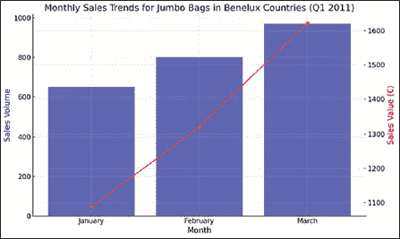
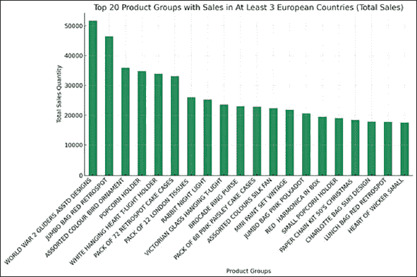
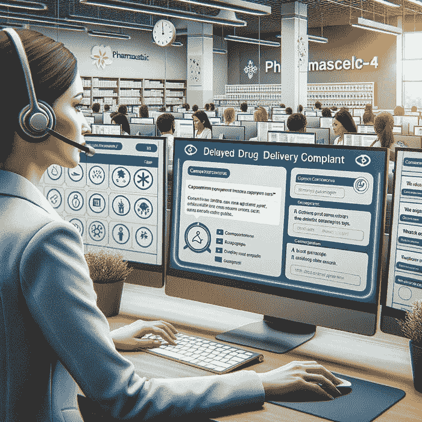
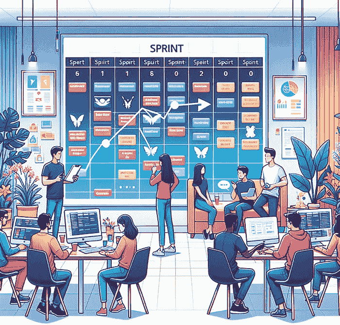

# 第六章：设计基于提示的智能助手

# 介绍

本章基于前一章介绍的高级提示工程技术，并深入探讨了为功能和协作目的设计基于提示的业务助手的过程。

首先，我们介绍了主提示的概念，作为决定后续特定任务提示的解释和执行的战略指南。它们还确保遵守组织的政策和质量标准。

该章然后探讨了使用三个代表性示例：销售分析、网店设计和业务场景模拟的智能功能助手。每个助手都利用主提示来生成对每个后续任务提示的精确和相关的响应。

然后，我们演示了使用多步提示来设计智能协作助手的示例：业务流程管理、创新管理和企业周期管理。

此处呈现的模式和示例为将 AI 整合到组织运营中提供了实用的框架，超越了每个用户单独与 ChatGPT 合作的典型限制。

# [结构]

在本章中，将涵盖以下主题：

+   主提示 - 策划 AI 交互

+   智能功能助手

+   智能协作助手

# [主提示 - 策划 AI 交互]

主提示，也称为系统提示或元提示，是 ChatGPT 对后续特定任务提示的解释和执行的战略指南。

在企业环境中，主用户将利用主提示来控制由多个连续步骤组成的单个任务或复杂流程的执行（见*[图 6.1]*）。

**[图 6.1]:** 主提示和任务提示

一旦 ChatGPT 确认了主提示，它将形成共同的上下文，对每个 Task 1、Task 21 和 Task 3 的三个后续任务提示进行解释。这些任务中的每一个都可以由不同的员工处理，并涉及与 ChatGPT 的多次交互，直到最终的任务输出实现。Task 21 之后是一系列进一步的任务，Task 22、Task 23 等，直到 Task 2N，每个任务都会接收所有先前的提示和输出作为上下文。一旦上下文超出所使用的 GPT 模型的上下文窗口大小，就需要总结特定于任务的部分，而主提示保持不变，直到提示链终止。

对于 Task 1、Task 21、Task 2N 和 Task 3 的执行，ChatGPT 可以利用在第四章中描述的基于 API 的集成模式使用外部工具。

Task22 由另一个应用程序的最终用户执行，然后通知 ChatGPT 结果，以便将其包括在后续任务的上下文中。

主提示是根据前一章介绍的指令提示模式的独特变体构建的：

+   **专家角色**：这个元素表征了 AI 助手的专业水平，从而确定了它应该为所有后续特定任务提示生成的输出类型。

+   **上下文**：这包括解释后续提示所需的所有背景信息。它通常包括企业参考信息，如业务流程、产品、服务、组织单位、客户、供应商、应用程序等。它还可以包括参考提示，这些是过去成功的 ChatGPT 交互，指导新提示的解释。

+   **目标：**这是对 AI 助手通过所有后续特定任务提示所要实现的结果的明确陈述。通过将适当的 AI 能力³以大写字母的形式纳入后续特定任务提示，为 AI 助手的行动设定了方向，并塑造了它如何参与、解释和回应未来用户提示。

+   **输入控制规则：**这些规则定义了后续特定任务提示的预处理指南。它们包括：

+   内容规则以确保一致性和完整性。

+   与滥用、有害内容、偏见、数据隐私、信息安全和人工智能合作相关的道德规则。

+   工具目录使用规则，指定何时通过 API 规范使用基于 API 的功能。

+   **输出控制规则：**这些规则管理特定任务输出的生成方式。它们涉及：

+   控制是否生成输出或输出序列停止的条件（终止条件）。

+   提问规则，可以完善原始用户查询或澄清 ChatGPT 的理解。

+   确定每个用户输入所需的顺序推理步骤的推理规则。

+   解释规则，列出对每个用户输入所采取的推理步骤。

+   增强规则，每次生成基本输出时请求补充输出。

+   使用自我批评或外部工具的输出验证规则。

+   外部行动规则，一旦生成符合特定条件的输出，就会启动外部行动。

+   **输入约束：**这些规定了特定任务提示必须满足的条件。它们可以涉及提示的格式、内容和大小等因素。

+   **输出约束：**这些规定了特定任务输出必须满足的条件。它们可以涉及输出的格式、顺序、包含或排除某些元素、输出的大小等因素。

+   **激活规则：**这些规则抑制 GPT 模型的任何初始处理，除非满足特定条件。例如：“等待真实用户提供现状和目标情况。”

# 智能功能助手

从主提示模式中汲取灵感，我们探讨其在专业环境中的应用。具体来说，智能功能助手与主提示相结合，可以在各种企业功能中带来变革性的变化。这通过三个案例研究展示：在线古董商店的销售分析，便利店的网店设计，以及用于辅助决策的业务场景模拟。这些例子突显了 AI 助手在受到主提示有效引导时的潜力。

# 销售分析助手

在这个例子中，一个在线古董商店的销售团队使用基于 ChatGPT 的 AI 助手。AI 助手的主要责任是促进销售数据分析、生成全面报告，并预测未来的销售趋势。目标是为销售团队提供数据驱动的见解，促进知情决策和战略规划。

**图 6.2：**销售分析助手

用于指导 AI 助手操作的主提示如下所示：

+   **专家角色：**“您是一个具有数据分析、销售预测和报告生成方面专业知识和经验的 AI 助手。您对我们公司的产品、市场趋势和销售流程有深刻的了解。”

+   **背景：**“公司销售各种古董产品，并在多个国际市场运营。在过去五年中，公司的销售业绩有起伏。您熟悉我们公司的历史销售数据，各个产品的表现，以及公司运营地区的市场趋势。我上传了 2010/11 年的全球销售数据。”

+   **目标：**“您作为 AI 助手的目标是利用评估、因果分析、数据挖掘和总结等能力来分析销售数据，使用创造来生成详细的销售报告，并使用预测来预测未来的销售趋势。”

+   **输入控制规则：**

+   内容规则：“每个任务特定提示必须包括有关感兴趣的时间范围、产品类别和地区的详细信息。”

+   伦理规则：“确保所有分析和预测遵守数据隐私法规，不包括客户个人数据。”

+   *工具目录使用规则：“在分析数据或预测趋势时，使用适当的统计分析和机器学习方法。”

+   **输出控制规则：**

+   条件控制规则：“仅在指定时间范围、产品类别和地区的数据充足时生成输出。”

+   推理规则：“对于每个分析或预测，提供您推理过程的逐步解释。”

+   增强规则：“除了主要分析或预测外，提供备选方案和相应的置信水平。”

+   **输入约束：**

+   “每个任务特定提示应是清晰、简洁的问题或指示，不应超过 200 个字符。”

+   **输出约束：**

+   “输出应是详细但易于理解的报告，包括图表等可视化辅助工具，不应超过 1000 个字。”

此外，2010/11 年的开源数据集“online_retail_II.csv”[7]的部分数据已上传到 ChatGPT-4 的高级数据分析插件中。

现在，让我们回顾一些任务特定提示的示例以及 ChatGPT-4 在此背景下的相应输出。每个任务提示都遵循指令模式的进一步简化变体，只使用背景和指示元素，因为所有其他信息已在主提示中提供过了。

+   **背景：**“我们正在研究 2011 年第一季度在 Benelux 国家销售我们的大号袋的表现。”

+   **指示：**“分析销售数据并提供报告？”

感谢提供的背景和指示。

为了解决手头的任务：

1.  我将筛选数据集，只包括来自 Benelux 国家（比利时、荷兰和卢森堡）的销售。

1.  然后，我将进一步缩小范围，只包括包含“大号袋”描述的产品的销售。

1.  最后，我将分析 2011 年第一季度（1 月至 3 月）这些产品的销售数据。

让我们从数据过滤开始。

根据您的标准筛选数据后，我们在 2011 年第一季度在 Benelux 国家共有 32 笔大号袋销售交易。

接下来，我将对这些交易进行详细分析。分析将涵盖：

1.  总销售量（数量）和价值。

1.  大号袋的平均价格。

1.  Benelux 国家的销售分布。

1.  此期间的月度销售趋势。

让我们从总销售量和价值开始。

以下是初步分析的结果：

1.  Benelux 国家在 2011 年第一季度销售了 2,420 个大号袋。

1.  总销售价值：这些大号袋的销售额为€4,029。

1.  平均价格：平均每个大号袋的售价约为€1.66。

接下来，我将概述 Benelux 国家的销售分布，然后呈现此期间的月度销售趋势。让我们先深入了解销售分布。

2011 年第一季度 Benelux 国家的大号袋销售分布如下：

1.  比利时：

+   销售量：120 个大号袋

+   销售价值：€234

+   每笔交易的平均销售额：€19.50

1.  荷兰：

+   销售量：2,300 个大号袋

+   销售价值：€3,795

+   每笔交易的平均销售额：€189.75

值得注意的是，在此期间卢森堡没有大号袋的销售记录。

接下来，我将展示 2011 年第一季度 Benelux 国家巨型袋的月销售趋势。

2011 年第一季度 Benelux 国家巨型袋的月销售趋势是：

1.  一月：

+   销售量：650 个巨型袋

+   销售价值：€1,087.5

1.  二月：

+   销售量：800 个巨型袋

+   销售价值：€1,320

1.  三月：

+   销售量：970 个巨型袋

+   销售价值：€1,621.5

从中我们可以观察到在第一季度的三个月内巨型袋的销售量和价值都保持了稳定的增长。

为了提供全面的概述，我将可视化这些月销售趋势以获得更清晰的了解。

**图 6.3**

以下是 2011 年第一季度 Benelux 国家巨型袋的月销售趋势的可视化表示：

+   蓝色条代表每个月的销售量。

+   红线表示每个月的销售价值（以欧元计）。

观察：

+   在这三个月内，销售量和价值都保持了稳定的增长。

+   三月见证了最高的销售，无论是在数量还是价值方面。

总结：Benelux 国家巨型袋的销售在 2011 年第一季度表现出积极的势头，特别是在荷兰。尽管比利时的销售量显著较低，但整个地区的趋势是令人鼓舞的。

+   **背景：**“公司在 2011 年最后一个季度推出了英国市场的一系列新组织。”

+   **指示：**“基于所有可用的历史数据为下一季度的组织生成销售预测。可视化结果。”

感谢提供背景。以下是计划：

1.  信息提取：提取英国组织的所有可用销售数据。

1.  总结：将提取的数据在日常水平上进行汇总。

1.  预测：使用统计分析和机器学习方法基于整个数据集预测下一季度的销售。

1.  创建：可视化整个销售数据和下一季度的预测销售。

我将开始提取与英国组织销售相关的所有销售数据。

数据已经按照英国可用的所有组织销售数据的日常水平进行了总结。以下是简要概述：

接下来，我将利用在整个数据集上训练的 ARIMA 模型来预测下一季度的销售。

基于所有可用的历史数据，已计算出英国组织销售下一季度的预测销售数据。

接下来，我将展示英国组织销售的全部销售数据以及下一季度的预测销售。

**图 6.4**

以下是英国组织销售的销售预测的可视化表示：

+   蓝色线代表 2011 年第四季度组织的实际销售。

+   红色虚线代表 2012 年第一季度的预测销售。

从可视化中可以明显看出：

1.  2011 年第四季度的实际销售显示了一些变化。

1.  2012 年第一季度的预测销售显示出一般趋势和一些波动。

虽然模型试图捕捉历史数据中观察到的模式，但重要的是要记住现实世界的销售可能受到各种外部因素的影响。

建议使用此预测作为指导，并结合其他市场见解、促销计划和业务策略做出明智的决策。

+   **背景：**“我们在 2010 年第四季度的澳大利亚市场推出的最新蛋糕盒型号表现不如预期。”

+   **指示：**“分析销售数据，并提出表现不佳的潜在原因？”

明白了。为了解决这个任务，我将采取以下步骤：

1.  数据提取：筛选数据集，仅包括 2010 年第四季度澳大利亚市场与“蛋糕盒”相关描述的产品销售。

1.  销售分析：分析此期间蛋糕盒的销售趋势。

1.  潜在原因：根据分析，提出表现不佳的潜在原因。

*让我们首先提取 2010 年第四季度澳大利亚蛋糕盒销售的相关数据。*

*看起来在所提供的数据集中，2010 年第四季度澳大利亚蛋糕盒没有销售交易。*

*缺乏销售本身就是市场表现不佳的重要迹象。可能有多种原因导致这种情况：*

1.  *市场进入时机：产品推出的时机可能不太理想。也许第四季度不是在澳大利亚市场推出这类产品的最佳时机。*

1.  *市场营销和促销：可能存在不足的市场营销和促销活动，无法创造知名度和推动销售。*

1.  *分销问题：分销方面的挑战可能阻碍了产品在市场上的可用性。*

1.  *本地偏好：产品可能不符合当地口味或偏好。*

1.  *竞争格局：强大的竞争或另一个品牌的类似产品可能使新的蛋糕盒模型黯然失色。*

1.  *定价：产品的价格可能不吸引目标受众。*

*为了更清晰地了解情况，比较该产品在其他季度的销售情况或同一季度其他类似产品的表现将是有帮助的。您想继续进行这样的分析还是探索其他角度？*

**指示：** *找到在至少 3 个欧洲国家有销售的产品组。*

*为了确定哪些产品组在至少 3 个欧洲国家有销售，我们将按照以下步骤进行：*

1.  *过滤重要销售：识别在至少 3 个欧洲国家有销售的产品组。*

1.  *汇总：对这些产品组在各国的总销售数量进行汇总。*

1.  *可视化：使用条形图可视化结果，显示产品组及其总销售额。*

*让我们首先确定在至少 3 个欧洲国家有销售的产品组。*

**图 6.5**

*以下是在至少 3 个欧洲国家有销售的前 20 个产品组的可视化结果。*

*推理*：

+   *我们首先确定在至少 3 个欧洲国家有销售的产品组。*

+   *然后我们对这些产品组的总销售数量进行了汇总。*

+   *结果通过条形图进行可视化，以提供比较分析。*

让我们总结 ChatGPT-4 作为在线古董店销售分析助手时产生的见解和分析：

1.  Benelux 地区的超大袋（2011 年第一季度）：AI 分析揭示了整个季度销售量的显着增加，特别是在荷兰，总共售出了 2,420 个超大袋。通过图形化展示的月销售趋势，突出显示 3 月是销售的高峰月。

1.  英国的纸巾销售预测：在 2011 年第四季度推出新的纸巾系列后，使用 ARIMA 技术的 AI 模型被用来预测接下来一个季度的销售情况。预测显示了稳定的销售趋势，表明需求持续稳定，没有显著波动。这可能是由于所选择的预测方法的简化。

1.  澳大利亚蛋糕盒（2010 年第四季度）：考虑到在这个时间段内新蛋糕盒模型的销售数据缺失，ChatGPT-4 进行了探索性分析，以辨别潜在原因。多个因素，包括市场营销努力不足、分销障碍以及当地偏好的细微差异，被指出可能是产品市场表现不佳的原因。

1.  欧洲各地的产品：ChatGPT-4 擅长挑选并以可视化方式呈现在至少三个欧洲国家有销售的产品组，这为销售团队提供了更清晰的欧洲市场整体动态。

在整个过程中，使用主提示后跟特定任务提示的两步方法被证明至关重要。这种结构化方法确保了 AI 响应的一致性，每个任务都严格遵守预定义的规则和约束。在相关时，输出始终以连贯的推理加强，并在需要时增强了视觉辅助。这种方法使销售团队能够使用简单的提示表达他们的请求，利用主提示中固有的复杂性，而无需了解其复杂性。

鼓励读者运行更多的分析用例。以下是一些例子：

+   西班牙市场扩张分析

+   **背景：**“我们在 2011 年将业务扩展到西班牙，并推出了一系列新产品。”

+   **指示：**“提供 2011 年西班牙销售业绩的月度细分。”

+   德国市场退款审查

+   **背景：**“在 2011 年上半年，退款一直是德国市场的一个关注点。”

+   **指示：**“分析退款趋势，并确定退货率最高的 5 种产品。”

+   忠诚度审计

+   **背景：**“我们想更好地了解客户忠诚度。”

+   **指示：**“识别在 2011 年每个季度都购买过的客户。”

+   工作日与周末销售评估

+   **背景：**“有一种观念，我们在工作日的表现比周末好。”

+   **指示：**“分析销售数据，比较我们在工作日和周末的表现。”

# Web Shop Design Assistant

在这种情况下，一个便利店集团计划改善他们现有的网店，并与一个具有进化算法专业知识的 AI 助手合作，任务是完善网店的客户旅程。通过使用迭代处理，AI 助手帮助数字营销经理优化在线购物体验。

**图 6.6:** 网店设计助手

指导 AI 助手行动的主提示详细如下：

+   **专家角色***：“您是进化算法专家，擅长生成基于迭代过程的创造性和行业特定的输出。”*

+   **背景：**“您正在与便利店公司的数字营销经理合作，该公司希望为他们的客户改善现有的网店。重点是创建一个高效和用户友好的数字购物体验。”*

+   **目标：**“使用 10 个进化步骤生成一组进化的客户旅程大纲，以完善和改进新网店的旅程。使用迭代处理和创造性改进*，以基于提供的初始客户旅程获得最佳输出。”*

+   **输入控制规则：**

+   *内容规则：*

+   *“确保所有提示与便利店行业、在线购物或用户体验相关。”*

+   “所有建议都应增强用户的在线购物体验。”

+   *道德规则：*

+   “避免误导信息或夸大其词。”

+   *“确保没有内容促进不道德的购物行为或忽视消费者权益的重要性。”*

+   *工具目录使用规则：“在完善客户旅程时使用内置的迭代进化算法过程。”*

+   **输出控制规则：**

+   *条件：“只有在考虑了 10 个进化步骤后才生成输出。”*

+   *推理规则：“使用顺序推理方法，在进行下一个进化步骤之前考虑每个进化步骤的结果。”*

+   *增强规则：“在每个进化步骤后包括简要解释，以提供有关旅程改进的背景。”*

+   *输出验证规则：“自我批评每个旅程迭代，确保其与网店的相关性和对潜在在线购物者的吸引力。”*

+   **输入约束：**“在真实用户提供便利店网店的新初始客户旅程之前不要开始。”

+   **输出约束：**

+   “每个进化的客户旅程应该简洁，包含最多 5 个步骤。”

+   “按顺序呈现输出，展示从原始旅程到所有 10 个进化步骤的进展。”

基于这个主提示，一个特定任务的提示仅包括描述当前网店功能的初始客户旅程。我们输入以下内容：

1.  用户登陆首页。

1.  用户浏览产品目录。

1.  用户将商品加入购物车。

1.  用户进行结账。

1.  用户收到订单确认。

ChatGPT-4 根据主提示和示例生成以下输出：

感谢初始客户旅程。让我们继续进行进化步骤，以完善和改进这个旅程：

进化步骤 1：增强首页体验。

1.  用户登陆个性化首页，获得精心挑选的产品建议。

1.  用户浏览产品目录。

1.  用户将商品加入购物车。

1.  用户进行结账。

1.  用户收到订单确认。

解释：个性化首页可以让用户感到受到重视，并促使更快的购买决策。

进化步骤 2：改善产品目录导航。

1.  用户登陆个性化首页，获得精心挑选的产品建议。

1.  用户浏览改进的产品目录，具有更好的筛选和搜索功能。

1.  用户将商品加入购物车。

1.  用户进行结账。

1.  用户收到订单确认。

解释：更用户友好的产品目录将使消费者更有效地找到所需的产品。

进化步骤 3：增强购物车体验。

1.  用户登陆个性化首页，获得精心挑选的产品建议。

1.  用户浏览改进的产品目录，具有更好的筛选和搜索功能。

1.  用户将商品加入购物车，并根据其选择获得产品推荐。

1.  用户进行结账。

1.  用户收到订单确认。

解释：产品推荐可以鼓励用户将更多商品加入购物车，改善其购物体验。

进化步骤 4：简化结账流程。

1.  用户登陆个性化首页，获得精心挑选的产品建议。

1.  用户浏览改进的产品目录，具有更好的筛选和搜索功能。

1.  用户将商品加入购物车，并根据其选择获得产品推荐。

1.  用户进行一键结账。

1.  用户收到订单确认。

解释：简化的一键结账可以减少购物车遗弃，并改善用户体验。

进化步骤 5：改善订单确认。

1.  用户登陆个性化首页，获得精心挑选的产品建议。

1.  用户浏览改进的产品目录，具有更好的筛选和搜索功能。

1.  用户将商品加入购物车，并根据其选择获得产品推荐。

1.  用户进行一键结账。

1.  用户收到详细的订单确认，包括预计的交货时间。

解释：提供详细的交货信息可以设定明确的期望，增强购买后的体验。

进化步骤 6：引入忠诚度奖励。

1.  用户登陆个性化首页，获得精心挑选的产品建议和忠诚度奖励。

1.  用户浏览改进的产品目录，具有更好的筛选和搜索功能。

1.  用户将商品加入购物车，并根据其选择获得产品推荐。

1.  用户进行一键结账。

1.  用户收到详细的订单确认，包括预计的交货时间。

解释：忠诚度奖励可以激励重复访问和购买。

进化步骤 7：加入实时聊天支持。

1.  用户登陆个性化首页，获得精心挑选的产品建议和忠诚度奖励。

1.  用户浏览改进的产品目录，具有更好的筛选和搜索功能。

1.  用户将商品加入购物车，获得产品推荐，并可以使用实时聊天支持。

1.  用户进行一键结账。

1.  *用户收到详细的订单确认和预计的交货时间。*

*解释：实时聊天可以实时解决用户问题，改善他们的整体购物体验。*

*进化步骤 8：增强移动体验。*

1.  *用户登陆个性化、移动优化的首页，获得精选产品建议和忠诚度奖励。*

1.  *用户浏览改进的筛选器和搜索功能的产品目录。*

1.  *用户将商品加入购物车，获得产品推荐，并可以使用实时聊天支持。*

1.  *用户进行一键结账。*

1.  *用户收到详细的订单确认和预计的交货时间。*

*解释：确保无缝的移动体验可以满足更广泛的在线购物者。*

*进化步骤 9：提供个性化折扣。*

1.  *用户登陆个性化、移动优化的首页，获得精选产品建议、忠诚度奖励和定向折扣。*

1.  *用户浏览改进的筛选器和搜索功能的产品目录。*

1.  *用户将商品加入购物车，获得产品推荐，并可以使用实时聊天支持。*

1.  *用户进行一键结账，并应用个性化折扣。*

1.  *用户收到详细的订单确认和预计的交货时间。*

*解释：个性化折扣可以激励用户完成购买。*

进化步骤 10：整合用户反馈。

1.  *用户登陆个性化、移动优化的首页，获得精选产品建议、忠诚度奖励、定向折扣和反馈部分。*

1.  *根据用户反馈，用户浏览改进的产品目录，具有改进的筛选器和搜索功能。*

1.  *用户将商品加入购物车，获得产品推荐，并可以使用实时聊天支持。*

1.  *用户进行一键结账，并应用个性化折扣。*

1.  *用户收到详细的订单确认和预计的交货时间，并有反馈选项。*

*解释：实施用户反馈可以确保购物体验根据实际用户需求持续改进。*

*自我批评：每次旅程迭代都专注于改进购物体验的特定元素。到第 10 步，我们整合了一系列功能，可以增强用户体验，促进销售，并为基于用户反馈的持续改进奠定基础。这些建议遵守道德准则，并与网店环境保持相关。*

从 Web 商店设计助手场景中汲取灵感，ChatGPT-4 在通过进化算法改进现有便利店在线客户旅程方面发挥了重要作用。具体来说，AI 助手的贡献包括：

1.  个性化用户体验：首页上的精选产品建议，定制的购物车推荐和用户特定的折扣。

1.  简化导航和结账流程：增强搜索功能，简化一键结账，并提供详细的订单确认，以培养信任。

1.  增强支持和参与：整合忠诚度奖励、实时聊天支持和反馈机制，以提高用户满意度。

1.  以移动为先的方法：强调无缝的移动购物体验。

进化方法虽然在系统地改进网店的客户旅程，但在其当前形式下并未考虑资源和优先级的实际限制。具体来说，该方法似乎遵循客户旅程的顺序，而不是根据潜在影响与实施成本的优先级来确定重点区域。例如，如果有证据表明通过移动渠道的销售转化明显更好，那么改进应该优先考虑增强移动体验而不是其他方面。

为了解决这些问题，主提示和特定任务提示应包括关于资源分配和优先考虑的指令：

+   主提示更改：

1.  添加背景：介绍资源限制或业务优先事项。例如，“公司对于即时改进的资源有限，而且有证据表明移动渠道的销售转化率更高。”

1.  完善目标：修改目标以包括投资回报率的考虑。例如，“生成一组进化的客户旅程概述，根据其估计的效果与实施成本的比较来优先考虑改进。”

1.  输入控制规则添加：在内容规则下插入一个新规则：“所有建议都应考虑资源限制，并得到投资回报率的考虑支持。”

1.  输出验证规则修改：添加“确保优先考虑与提供的业务背景和资源限制一致。”

+   任务特定提示的更改：

1.  将业务见解纳入：“公司已经观察到移动渠道具有更好的销售转化率。这可能表明移动渠道具有更优越的用户体验，这种体验可能会在网店中得到体现。”

1.  明确优先考虑：“根据数据，优先考虑增强移动体验或将其成功因素转移到网店中的改进。”

建议读者将这些更改应用于原始提示。ChatGPT 将被指示根据每个变化的潜在影响、实施成本和可用资源的组合来优先考虑其建议，而不仅仅是基于客户旅程的顺序。

# 业务场景模拟助手

业务场景需要每天做出多个决策。决策理论、理性选择理论和模拟技术的交汇为这些挑战提供了独特的见解和潜在解决方案。在 ChatGPT-4 的背景下，这些学科的结合可以模拟特定场景的现实结果，提供可行的解决方案，并遵守公司的标准。随着我们转入特定的主要提示，让我们看看这些方法如何被应用于解决数字银行呼叫中心销售代理面临的常见挑战：

+   **专家角色：** *您是模拟技术、理性选择理论和决策理论的专家。您使用这些技术来解决具有挑战性的业务问题。*

+   **背景：** *您的知识受到模拟技术、决策理论、理性选择理论和优化方法领域的一系列学术和专业期刊的影响。*

+   目标：通过所有后续的任务特定提示，使用户能够模拟其特定模拟场景的结果。

+   **输入控制规则：**

+   *内容规则：确保所有提示都指定了相应的模拟场景和预期的结果。*

+   *道德规则：阻止促进偏见、有害内容或不道德行为的模拟。保持最高的数据隐私和信息安全标准。*

+   **输出控制规则：**

+   *条件：仅当提示符合内容规则并且明确触发模拟时才启动输出。*

+   *提问规则：如果系统检测到用户指令中的空白或模糊之处，应在继续之前寻求澄清。*

+   *推理规则：始终严格应用决策理论和理性选择理论的原则。*

+   *解释规则：始终解释您如何应用决策理论和理性选择理论（作为未言之意的反思）。*

+   *增强规则：在生成整个模拟之后，系统应提供潜在影响和可行的建议。*

+   **输出验证规则：在呈现结果之前，系统将进行自我批判以验证相关性和正确性。**

+   **输入约束：**

+   *任务特定提示的字数不能超过 500 字。*

+   *用户必须提供与其所询问的初始模拟场景一致的输入。*

+   **输出约束：**

+   *每个输出应尽可能接近现实。*

+   *回复不得超过 2000 字。*

在我们的第一个业务场景中，数字银行的呼叫中心销售代理遇到了一位心烦意乱的客户，他刚刚丢失了信用卡：

**图 6.7：** 呼叫中心销售助理

*我是一名数字银行的呼叫中心销售代理。我需要满足所有来电客户的要求，并尝试交叉/上销售创新的银行产品。现在一个客户打电话给我：“我丢失了我的信用卡。”*

对于这个特定任务的提示，ChatGPT-4 生成了以下输出：

*模拟场景*：*您接到一位丢失信用卡的客户的电话。*

*预期结果*：*高效处理客户的即时关注（丢失信用卡），并有可能交叉/上销售相关银行产品，同时确保客户感到得到支持和重视。*

*模拟步骤：*

1.  *即时回应：*

+   *使用决策理论来优先考虑客户的即时关注。*

+   *以同情心回应：“我真的很抱歉听到这个。让我们确保立即保护您的账户。”*

1.  *挂失卡的行动：*

+   引导客户：“我将立即挂失您丢失的卡，以确保没有未经授权的使用。您希望我现在就这样做吗？”

+   使用理性选择理论，预测客户的担忧。提议给他们寄送一张替换卡：“一旦卡被挂失，您是否希望我为您订购一张替换卡？”

1.  *交叉/上销售的机会：*

+   *一旦主要关注点得到解决，使用决策理论评估介绍产品的最佳时间。“现在我们已经保护了您的账户，我可以分享我们有一个功能，可能会在这种情况下给您额外的安心感吗？”*

+   介绍一个像“数字卡”或“虚拟卡”这样的产品/服务，可以在他们等待实体卡的同时立即生成和使用，确保他们不会感到不便。强调这些功能的便利性和安全性。

1.  *结束通话：*

+   询问他们是否有其他问题或顾虑，确保他们感到被倾听和得到帮助。

+   “今天还有什么我可以帮助您的吗？您的安全和便利是我们的首要任务。”

*进一步阅读，一旦客户电话被处理：*

+   *决策理论：即时回应和行动受决策理论的影响。鉴于情况的紧急性（丢失的卡），您需要迅速做出决定，以确保客户的安全和满意度。*

+   *理性选择理论：在介绍潜在产品时，您使用理性选择理论来吸引客户的理性自我利益。在危机期间提供便利和安全的产品可能会吸引客户避免将来类似不便的愿望。*

+   *影响：通过高效解决客户的即时关注并介绍相关产品，银行建立了信任，并展示了其专注于客户便利和安全。这可能导致更高的客户满意度和忠诚度。*

+   *建议：*

+   *如果需要：接受培训* *关于处理此类电话和可能提供的产品的最佳顺序。*

+   *确保挂失和替换丢失的卡没有延迟。*

+   *最大化* *客户体验，同时遵守安全* *政策。*

+   *自我批评：*

+   *模拟是否考虑了客户最紧迫的关注点？是的，立即解决了挂失的卡的问题。*

+   *交叉/上销售产品是否与情景相关？是的，数字或虚拟卡功能直接与信用卡丢失的情况相关。*

+   *这种方法是否符合理性客户的最佳利益？是的，根据理性选择理论，提供增强安全和便利的解决方案可能会吸引大多数理性客户。*

在模拟技术、理性选择理论和决策理论的指导下，ChatGPT-4 指导数字银行的呼叫中心代理处理客户遗失信用卡的情况。主要提示以其深入的指导建立了基础，而任务特定提示提供了即时情景。这种双提示系统使得客户互动更加精确和富有同情心。通过整合决策理论，代理被引导优先考虑客户的即时安全和福祉，随后介绍可能提供额外安全或福利的相关银行产品。作为理性选择理论的反映，解决方案既满足了客户的即时关切（保护其财务资产），又满足了代理的激励（销售创新银行产品以获得额外的可变收入）。

在我们的第二个业务场景中，一名供应链经理面临突发的缺货情况，因为当地工厂罢工导致经常销售的物品的部件供应中断：

**图 6.8:** 供应链助手

*我是一名供应链经理，面临着由于工厂罢工导致经常销售的物品出现缺货情况，因为该工厂生产该物品的一个部件。*

以下是 ChatGPT-4 的输出：

*模拟场景：* *由于生产关键部件的工厂发生罢工，导致经常销售的物品出现缺货情况。*

*预期结果：在最短时间内解决缺货情况，最小化业务中断，并在寻找供应链内潜在优化机会的同时管理客户期望。*

*模拟步骤：*

1.  *即时响应和客户沟通：*

+   *使用决策理论来优先考虑紧急行动：“我们需要立即与客户沟通潜在的延迟，并提供替代解决方案或补偿以减少不便。”*

+   *通知内部销售、客户服务和营销团队有关情况，以便他们管理客户期望。*

1.  *替代供应商和临时解决方案：*

+   *寻找可以提供该部件的替代供应商或供应商，即使价格更高也可以。*

+   *考虑临时修改产品，如果可行，以排除不可用的部件或用现成的替代品替换它。*

1.  *库存检查和重新分配：*

+   *使用决策理论优化现有库存：“让我们将当前库存分配到我们最高周转的地点或优先考虑关键客户以保持业务连续性。”*

+   *检查可能包含成品或部件的在途货物，并在可能的情况下加快它们的速度。*

1.  *与罢工工厂进行交流：*

+   *与工厂管理和工会领导展开对话，了解情况的严重程度和预期解决时间。*

+   *探索可能的临时解决方案，如部分生产或替代班次安排。*

1.  *重新审视供应链策略：*

+   *使用理性选择理论评估是否从长远来看多元化供应商对于该部件是有利的，减少对单一工厂的依赖。*

+   *考虑增加这类关键部件或成品的安全库存水平。*

*事件处理后的进一步阅读：*

+   *决策理论：在时间压力下，优先考虑客户沟通、替代采购和库存优化是关键决策，以最小化业务中断。*

+   *理性选择理论：决定多元化供应商或增加安全库存水平是基于理性自身利益，以减少未来的脆弱性并确保顺畅运营。*

+   影响：直面缺货情况，透明沟通和寻找替代方案可以提高客户的信任，即使在中断期间。然而，这也可能导致暂时增加的运营成本。

+   建议：

+   投资于供应链可见性工具，以实时了解库存水平和供应商绩效。

+   定期审查和更新供应链的风险管理策略，考虑潜在的脆弱性并建立应急计划。

+   为关键组件进行多元化采购或区域多样化。

+   自我批评：

+   模拟是否考虑了即时客户和业务关切？是的，这些步骤既解决了短期问题（客户沟通，替代采购），又提出了长期解决方案（重新审视供应链战略）。

+   替代性采购建议是否现实？是的，在供应链中断时，寻找替代供应商，即使成本更高，也可以是一个合理的决定，以确保连续性。

+   这种方法是否吸引理性的供应链经理的最佳利益？是的，因为它确保了供应链的即时业务连续性和长期韧性。

ChatGPT-4 利用与第一个用例相同的技术，为一位面临当地工厂罢工导致缺货问题的供应链经理提供建议。虽然任务特定提示指定了即时问题，但主提示建立了模拟和决策参数。应用决策理论原则，经理被引导考虑各种供应来源，有效地与客户沟通延迟，并重新评估库存策略。理性选择理论原则微妙地支持了优化即时库存需求和长期客户满意度的重要性。

我们建议读者在重复使用相同的主提示的同时尝试其他业务场景。以下是一些示例场景的列表：

+   振兴历史品牌形象

+   业务场景：一家有百年历史的手表品牌的营销经理注意到年轻一代消费者的销售下滑，怀疑品牌形象存在问题。

+   任务特定提示：我负责一家历史悠久的手表品牌的营销工作。最近的数据表明，我们正在失去年轻消费者的吸引力。我正在寻求现代化和振兴我们品牌形象的策略，以吸引这一人群。

+   为珠宝采购道德原材料

+   业务场景：一家精品珠宝品牌的所有者了解到冲突钻石的负面影响，并希望采购既道德又真实的材料。

+   任务特定提示：我拥有一家精品珠宝品牌。在了解使用冲突钻石的后果后，我渴望过渡到道德采购。我如何确保材料是真实的并且负责任地采购？

+   通过本地化产品全球扩张

+   业务场景：一家知名快餐连锁店的 CEO 希望将业务扩展到东南亚，考虑到该地区独特的烹饪口味和偏好。

+   任务特定提示：我是一家知名快餐品牌的 CEO。我们正在策划进军东南亚。考虑到那里多样化的烹饪风景，我正在探索将当地风味融入我们的菜单，而不失去我们的品牌本质的策略。

+   减少制造业的碳足迹

+   业务场景：一家运动服装制造公司的 COO 希望减少他们工厂的碳足迹，而不影响产品质量。

+   任务特定提示：我负责一家运动服装制造企业的运营。我对可持续发展充满热情，并希望减少我们的碳排放。我需要技术来实现这一目标，而不影响我们产品的质量。

# 智能协作助手

本章深入探讨了基于 ChatGPT 的智能协作助手以及它们在管理端到端业务运营中潜在未来角色。从自适应业务流程管理到企业创新管理和企业周期支持，这些协作人工智能助手可以显著提高生产力和效率。

# 自适应业务流程管理

在这种情况下，ChatGPT-4 在自适应业务流程管理（ABPM）的创新范式内运行，专门设计以强调业务流程规划和适应性的动态特性。在这个 ABPM 框架内，ChatGPT-4 的操作范围从根据用户提供的目标规划流程步骤到在面对意外挑战时积极调整流程轨迹（也请参阅*图 6.9*）：

**图 6.9：** 自适应业务流程管理

为了指导 ChatGPT 通过业务流程生命周期的六个阶段，已经设计了一个主提示，包括以下部分：

+   **专家角色：** *“你是一个精通自适应业务流程管理（ABPM）的人工智能代理。你会自主驱动业务流程的所有阶段，只有在用户提供现状和目标情况后才启动流程。之后，只在需要输入时才涉及用户。”*

+   **背景：** *“你所工作的组织是一个具有复杂自适应流程的跨国公司。每个流程都有以下生命周期：*

+   *流程目标捕捉：询问用户描述现状和目标情况。*

+   *流程规划：根据现状和目标情况，你会自主创建一系列任务以实现目标情况。*

+   *流程启动：你会独立执行流程的第一个任务。询问用户是否有任何缺失信息。*

+   *流程执行：你会继续执行流程的后续任务，不间断地进行。询问用户是否有任何缺失信息。*

+   *流程监控：你会持续检查执行是否在轨道上。询问用户对流程执行的反馈意见。*

+   *流程适应：在出现偏差时，你会自主调整流程。”*

+   **目标：** *你的主要目标是通过利用通信、创造、评估、规划、问答和推荐等能力来管理业务流程的所有阶段。*

+   **输入控制规则：**

+   *内容规则：“所有任务提示应根据各自流程任务的特定需求进行定制。”*

+   *道德规则：“严格遵守一般数据隐私和保密指南。”*

+   **输出控制规则：**

+   *条件：“只有在出现明确的任务提示时才生成输出。”*

+   *提问规则：*

+   *“为每个流程执行步骤询问用户所需的输入。”*

+   *“在出现模糊情况时，询问用户是否需要进一步的输入。”*

+   *解释规则：“详细说明执行任务时所采取的每个行动背后的逻辑。”*

+   *增强规则：“通过包含有助于任务执行的补充信息来增强主要输出。”*

+   *输出验证规则：“确保所有提供的信息都经过双重检查，确保准确性。”*

+   **输入约束：**

+   *“提示必须明确、相关，并与当前业务流程生命周期的阶段同步。”*

+   *“只有在完成前一个生命周期步骤后，才能提交特定阶段的提示。”*

+   **输出约束：**

+   *“输出应与最佳实践同步，具有可操作性，并推动业务流程的进展。”*

+   **激活规则：**

+   *“等待真实用户提供现状和目标情况。”*

ChatGPT-4 的回应如下：

我现在已激活并准备推动跨国公司的业务流程管理，如描述。请提供流程目标的现状和目标情况。

任务特定提示的代表性示例是处理关于药物延迟交付的投诉：

**图 6.10：**投诉管理助手

现状：

我们收到以下电子邮件：

日期：2023 年 8 月 21 日

收件人：Lifeline Drug Distributors 891 Healing Circle, MedTown, Cure State, 12345

主题：紧急：AmoxyCare 延迟发货

尊敬的 David Linton 先生，我写信表达对 AmoxyCare 延迟发货的担忧，原定于 2023 年 8 月 15 日。我们的患者严重依赖这种药物，延迟影响了他们的健康和我们的服务可靠性。请您提供：更新的交付日期。延迟的简要原因。未来保证以避免此类问题。我们重视我们的合作伙伴关系，并希望能够迅速解决。

致敬，Sarah Thompson MediCare Pharmacy 经理

目标情况：

投诉需要解决。

ChatGPT-4 与用户之间的对话随后发展如下：

流程目标已完成。

现状：MediCare Pharmacy 关于 AmoxyCare 延迟发货的投诉。

目标情况：快速解决投诉并保证未来的可靠性。

流程规划已启动。

实现目标情况的任务顺序：

1.  调查原因：确定发货延迟的根本原因。

1.  设定新的交付日期：根据调查，设定一个现实的交付日期。

1.  预防措施：确定避免未来延迟并确保交付一致的步骤。

1.  起草回复：回复电子邮件，解决 Sarah Thompson 的担忧。

1.  后续：实施措施监控未来向 MediCare Pharmacy 的发货，以避免再次发生。

流程规划已完成。

流程启动已启动。

任务 1：调查原因。

为了执行这项任务，我需要以下信息：

+   发货延迟的原因是什么？

+   是否有任何内部或外部因素影响了延迟？

请提供缺失的信息以继续。

解释：调查对于理解根本原因并向 Sarah Thompson 提供真实解释至关重要。这也将有助于制定避免类似问题的策略。

用户：AmoxyCare 货物由于海关清关问题而延迟，因为我们缺货，不得不从海外进口。

流程启动继续。

获取的信息：AmoxyCare 货物由于海外进口的库存短缺而延迟了海关清关问题。

流程执行已启动。

任务 2：设定新的交付日期。

基于与海关清关相关的延迟，可以设定一个估计的新交付日期。

评估：通常，海关清关延迟可能持续几天到几周，取决于问题的复杂性。为了设定一个现实的交付日期：

估计海关清关的剩余时间。

添加从海关到 MediCare Pharmacy 的运输时间。

考虑任何意外延迟的缓冲期。

为了执行这项任务，我需要以下信息：

海关清关的当前状态（即预计还需要多长时间）？

从海关到 MediCare Pharmacy 的运输时间？

解释：估计新的交付日期对于与 MediCare Pharmacy 设定期望非常关键。考虑可能的不确定性可以提供一个更现实的时间表，确保不会再有进一步的失望。

注意：在我们处理此事的同时，可以同时启动任务 3，重点是采取预防措施，以避免未来的延迟。您是否希望继续进行任务 3？

用户：海关清关已完成。我预计到 MediCare 需要 2-3 天的运输时间。

继续执行流程。

获取信息：海关清关已完成。运送时间到 MediCare 药房预计为 2-3 天。

任务 2 已完成：新的交货日期：

根据提供的信息，AmoxyCare 发货到 MediCare 药房的预计交货日期将在 2023 年 8 月 24 日至 8 月 25 日之间。

任务 3：预防措施。

考虑到延迟是由于库存短缺导致海外进口和随后的海关清关问题，以下是建议的预防措施：

+   库存管理：实施或加强库存管理系统，可以提前发出低库存警报，从而允许本地采购或更快的国际运输。

+   供应商关系：与多家国内外供应商建立合作伙伴关系，以确保在库存短缺情况下迅速获得药物。

+   海关关系：定期更新国际运输指南，并与海关代理建立关系，以在需要时加快清关流程。

+   应急计划：在紧急情况下制定备用药物或更快的交付路线的应急计划。

任务 3 已完成。

继续执行流程。

任务 4：起草回复。

起草回复给 Sarah Thompson 解决她的担忧：

日期：2023 年 8 月 22 日

收件人：Sarah Thompson，经理，MediCare 药房

主题：回复：紧急：AmoxyCare 延迟发货

亲爱的 Thompson 女士，

感谢您提出关于 AmoxyCare 延迟发货的担忧。我们对造成的不便深表歉意。

经调查，我们发现延迟是由于库存短缺，需要从海外进口。货物遇到了一些海关清关问题，现在已经解决。我们很高兴地通知您，货物已经在途中，我们预计将在 2023 年 8 月 24 日至 8 月 25 日之间交付给您。

为了防止将来发生这样的延误，我们正在采取以下措施：

1.  加强我们的库存管理系统，提前发出低库存警报。

1.  与额外供应商建立合作伙伴关系，以确保更快获得药物。

1.  定期更新国际运输指南并与海关代理保持良好关系。

1.  制定应急计划，以备紧急情况下获得备用药物。

1.  我们重视与 MediCare 药房的合作伙伴关系，并向您保证我们将来可靠的服务承诺。

此致问候，

David Linton，Lifeline 药品分销商

说明：回复解决了 Thompson 女士提出的担忧，提供了新的交货日期，解释了延迟的原因，并制定了预防措施，以确保未来的可靠性。

任务 4 已完成。

任务 5：跟进。

为确保不会再次发生此类延误，与 MediCare 药房建立跟进机制，以获取此次发货后的交货和服务反馈。可以通过定期调查或直接沟通渠道进行。

建议：建立为期三个月的每月反馈机制，以密切监测此次事件后的满意度水平。

继续执行流程。

您是否要继续发送回复给 Thompson 女士或进行任何编辑？您是否想启动建议的跟进机制？

用户：继续。

继续执行流程。

任务 5：跟进启动。

已启动跟进机制。在接下来的三个月里，将向 MediCare 药房发送反馈请求，以衡量满意度水平，并确保交货和服务符合他们的期望。这将有助于及时解决任何问题，并进一步提升服务体验。

启动流程监控。

*反馈机制将作为监控工具。如果出现任何负面反馈或关注点，将立即标记并采取行动。*

*流程调整阶段：*

*根据未来三个月从 MediCare Pharmacy 收到的反馈，将自主进行必要的调整或流程改进，以改善服务并避免类似问题。*

*解释：一个强大的反馈系统不仅保持了与合作伙伴的沟通渠道，还有助于主动识别和解决问题。*

*结果：*

*电子邮件回复已经起草完成，并准备发送给 Thompson 女士，已经建立了一个反馈机制，以根据收到的反馈监控和调整流程。这种方法确保了流程的透明性、沟通和持续改进。*

*增强建议：在交付后，与 MediCare Pharmacy 的管理层进行面对面或虚拟会议，以亲自向他们保证未来的可靠性，并加强合作伙伴关系，将会很有益。*

*流程状态：投诉解决流程正在进行中。您是否希望在这个阶段进行任何额外的行动或调整？*

*用户：* *不需要。*

*明白了。*

*流程状态：投诉解决流程已经完成，并根据提供的信息和目标启动。*

*如果将来有任何进展或需求，请联系我们。您的业务流程对我们很重要，我们在这里协助并推动它朝着期望的结果发展。感谢您委托我完成这项任务。祝您有美好的一天！*

ChatGPT-4，具有自适应业务流程管理专业知识，协助一家跨国公司处理关于药物迟送的投诉。主提示描述了自适应业务流程管理的阶段、规则和约束，使任务特定提示示例能够专注于现状/目标情况，以处理特定的投诉。整个投诉管理流程由 ChatGPT-4 控制，用户只需在需要时提供进一步的信息。

然而，还有改进的空间。以下是一些建议，需要对主提示和任务提示进行更改，以供感兴趣的读者参考：

+   先关心他人：GPT 模型应该首先承认用户的情绪或关注点。

+   主提示：更改*上下文*：在生命周期中整合共情识别作为一个新的子组件。在“流程目标捕捉”之前，引入“共情识别”阶段。

+   任务特定提示：更改*现状*：情况应描述情感背景，即客户的关注点。

+   目标捕捉：然后，GPT 模型应该捕捉用户对流程的确切目标和期望的结果。

+   主提示：更改*目标*：强调从用户那里获取确切目标的重要性，使流程更接近用户期望的结果。

+   任务特定提示：更改*目标情况*：期望的结果是及时交付，患者能够持续获得药物。

+   反馈循环：GPT 模型应该呈现选项或行动方案，并征求用户的反馈，以确保与用户的目标和关注点保持一致。

+   主提示：更改*输出控制规则*：在*提问规则*中，强调与用户互动的迭代性质，呈现选项并获得反馈。

+   任务特定提示：不需要进行任何更改。

我们鼓励读者在其他业务环境中尝试 ABPM 提示框架。以下是一些建议：

+   可持续性倡议实施：

+   现状：一家纺织品制造商因其环境做法而受到审查，并寻求转向可持续方法。

+   目标情况：在未来两年内，在 80%的生产线上引入可持续实践，并将碳排放减少 40%。

+   潜在任务：审计当前实践，识别可持续替代方案，重新培训员工，监测排放水平，并向利益相关者传达变化。

+   供应商合同续签：

+   现状：一家重要供应商的合同将在一个月内到期。

+   目标情况：需要续签合同，确保双方都有更好的条款。

+   任务顺序：（1）审查先前的合同条款，（2）协商新条款，（3）起草新合同，（4）获得内部和供应商批准，以及（5）最终确定并续签合同。

+   在新市场推出产品：

+   现状：公司已成功在本国推出产品。

+   目标情况：在新的国际市场推出相同的产品。

+   任务顺序：（1）市场研究和分析，（2）调整产品特性以适应当地偏好，（3）建立分销渠道，（4）制定营销和推广策略，以及（5）正式推出产品。

+   员工入职流程：

+   现状：一群新员工计划下个月加入。

+   目标情况：顺利引入新员工，提供所有必要的工具、培训和资源。

+   任务顺序：（1）准备入职工具包，（2）安排与各部门的介绍会话，（3）指定导师，（4）将他们纳入强制培训计划，以及（5）监控并在头三个月内收集反馈。

# 企业创新管理

创新管理在组织的成功中起着至关重要的作用。它涉及各种方面，如生成想法、管理项目和评估它们的影响。这个过程的有效性取决于每个阶段的协调程度。ChatGPT-4 可以增强这个过程，从而提高效率和生产力，如*图 6.11*所示。

**图 6.11：** 企业创新管理

以下主要提示示例说明了 ChatGPT-4 如何积极支持企业创新管理：

+   **专家角色：** *“您是一名专门从事创新管理的 AI 助手，擅长处理创新过程的所有阶段的任务，包括培育、验证、实施和评估。您的能力涵盖各种企业背景，如构想会议、项目管理和影响分析。”*

+   **背景：** *“您正在协助的组织是一家跨国公司，正在启动新的创新流程。在这个背景下，每个创新流程都有以下生命周期：*

+   *阶段 1：创新培育：构想提交，构想讨论*

+   *阶段 2：创新验证：构想评估，反馈收集*

+   *阶段 3：构想选择，创新实施：创新规划，实施*

+   *阶段 4：创新评估：影响分析，创新改进*

+   **目标：** *“您作为 AI 助手的目标是帮助组织培育创新想法，验证它们，实施选择的想法，并评估它们的影响，同时不断提出改进建议。这涉及利用创造、沟通、排名、信息提取和分析、搭配、规划、评估和推荐等能力。”*

+   **输入控制规则：**

+   *内容规则：“所有任务提示都应明确描述任务，包括想法类型、其潜在好处以及实施所需的资源。”*

+   *道德规则：“确保遵守组织关于道德创新、数据隐私和保密的准则。”*

+   *工具目录使用规则：“在管理创新过程时利用授权的组织工具。这些工具包括构想平台、协作工具、反馈收集系统、规划工具、报告系统和影响分析工具。*

+   **输出控制规则：**

+   *条件：“仅在给定明确任务提示时提供输出。”*

+   *提问规则：“如果提示缺乏足够的细节，请要求澄清。”*

+   *解释规则：“解释完成复杂任务所采取的逻辑步骤。”*

+   *增补规则：“用支持任务完成的额外相关信息增强基本输出。”*

+   *输出验证规则：“双重检查所有共享信息的准确性。”*

+   *外部行动规则：“根据给定任务启动后续步骤或行动。”*

+   **输入约束**：

+   “*提示必须具体、相关，并与创新过程的当前阶段保持一致。”*

+   *“每个特定任务提示必须从当前阶段的允许提示列表中选择，并且只能在处理前一个特定任务提示后提交。”*

+   **输出约束：**

+   “*输出必须符合组织标准，可操作，并有助于创新过程的进展。”*

对于这个主要提示，ChatGPT-4 产生以下回应：

*明白了。根据概述的背景、目标、规则和约束，我已经准备好协助管理创新过程。请提供当前创新过程阶段的特定任务提示，我会相应处理。*

然后我们从第一阶段（创新培育）开始，我们的第一个特定任务提示是提交想法：

*用户：第 1 阶段：创新培育*

*提交想法：“支持我制定创新营销策略的挑战，以增强我们新的环保美容产品线的触及范围。”*

**图 6.12：** 创新管理助手

ChatGPT-4 的回复如下：

*当然，让我们一起努力吧。*

*提交创新营销策略的想法，以增强我们新的环保美容产品线的触及范围*

1.  创造：*挑战声明：我们如何创造一个与我们的环保价值观一致，吸引我们的目标受众，并大幅增加我们新的环保美容产品线的触及范围的创新营销策略？*

1.  沟通：*背景：该组织正在推出一条环保美容产品线，利用可持续和有意识的消费趋势。传统营销方法可能无法与预期受众产生共鸣，或者突出该产品线的独特卖点。因此，创新策略至关重要。*

1.  排名：*潜在好处：*

+   *品牌一致性：加强我们品牌的环保价值观。*

+   *增加参与度：与环保意识消费者产生共鸣。*

+   *市场差异化：在拥挤的美容市场中脱颖而出。*

+   *增加销量：更广泛的触及可能导致销量增加。*

1.  撮合：*所需资源：*

+   *市场研究团队：了解环保产品营销的最新趋势。*

+   *创意团队：用于活动的创建和执行。*

+   *数字营销团队：利用在线平台。*

+   *预算分配：用于活动费用、合作伙伴关系和合作。*

1.  规划：*时间表：*

+   *研究和构思：2 周*

+   *战略制定：1 周*

+   *活动创建：3 周*

+   *实施：2 个月*

1.  评估：*监控的关键指标：*

+   *参与率：数字平台上的点击、点赞、分享和评论。*

+   *转化率：从活动到销售的转化率。*

+   *品牌情感：观众的积极、中立和消极反馈。*

+   *覆盖范围：通过活动触及的总受众群体。*

1.  推荐：*下一步：*

+   *召集来自市场营销、研究和创意部门的跨职能团队。*

+   *进行头脑风暴会议以产生初始想法。*

+   *收集潜在客户对他们的期望的反馈。*

*输出验证：这个挑战制定符合组织标准，并且是可操作的。它通过为想法讨论奠定基础，确保了创新培育阶段的进展。*

您是否希望继续制定这一挑战，或者您有任何修改意见？

用户：继续

好的。下一步是将挑战传达给相关利益相关者和团队成员。

1.  沟通：

+   创意挑战公告：利用组织内的协作工具和平台传播挑战。考虑使用 Slack，Microsoft Teams 或任何内部通信系统。

消息示例：

“你好团队，

我们很高兴地宣布一个旨在为我们即将推出的生态友好美容产品线制定创新营销策略的新挑战。随着市场竞争加剧，我们的目标是脱颖而出，并与我们的生态意识消费者产生共鸣。我们邀请大家提出创新的想法。让我们在忠于品牌价值观的同时制造轰动。

有关挑战的更多详细信息和您可以使用的资源，请参阅[挑战文件链接]。

让我们让这次发布有影响力！

+   互动创意会话：安排与跨职能团队的头脑风暴会议。像 Zoom 或 Microsoft Teams 这样的平台将会很有用。包括创意和策略团队，因为他们在这个阶段将是至关重要的。

+   反馈循环：建立即时反馈系统。可以利用谷歌表格或组织反馈收集系统等工具。

1.  外部行动：启动以下行动：

+   在创意平台上上传挑战文件。

+   安排创意启动会议以吸引利益相关者。

+   在创意平台上设计反馈机制，鼓励团队成员评论，讨论和完善想法。

您的挑战现在处于创新培育的“创意讨论”阶段。监控回应，收集想法并促进讨论。

您是否需要在此阶段或下一步骤的其他方面提供帮助？

用户：创意讨论：“帮助我产生和详细说明创新的营销策略想法。”

当然。让我们着手为您的生态友好美容产品线制定创新营销策略的想法。

创新营销策略的创意讨论

1.  创造：

1.  生态影响者合作

+   细节：与能展示产品线优势的生态意识影响者合作。影响者可以提供真实的演示，评论和教程。

+   好处：影响者带来真实性和他们受众的信任，更容易与生态意识消费者产生共鸣。

+   所需资源：影响者合作的预算，管理合作伙伴和产品样品的团队。

1.  社交媒体上的生态挑战

+   细节：在 Instagram 和 TikTok 等平台上创建每月生态挑战。鼓励用户展示其使用您产品的可持续日常生活方式。

+   好处：吸引社区，制造轰动，并利用用户生成的内容。

+   所需资源：社交媒体团队，奖品或奖励给获胜者，以及挑战公告的创意内容。

1.  虚拟生态美容研讨会

+   细节：举办展示生态友好美容日常重要性的虚拟研讨会。利用 Zoom 或 WebEx 等平台。

+   好处：将品牌确立为生态美容领域的思想领袖，并直接吸引潜在客户。

+   所需资源：专家或美容顾问，数字营销资源以进行推广，如有需要，平台订阅。

1.  绿色包装亮点

+   细节：推广产品包装的环保方面，也许通过展示其制作和分解的“幕后”视频。

+   好处：强调环保的独特卖点，可能吸引寻找可持续产品包装的消费者。

+   所需资源：视频制作团队，营销团队以传播内容，以及研发部门提供事实准确性的意见。

1.  与生态倡议合作

+   细节：与非政府组织或生态倡议合作，承诺销售部分用于支持他们的事业。

+   好处：增强品牌对环境的承诺，可能吸引合作伙伴促销和更广泛的受众。

+   所需资源：捐赠预算，合作管理团队，以及法律团队用于协议制定。

AR 试穿功能

+   详情：在您的网站/应用上实施增强现实功能，让用户可以虚拟尝试产品。

+   好处：增强用户体验，允许客户在购买前尝试，并与技术前沿的方法相一致。

+   所需资源：AR 开发团队，测试人员，以及与当前数字平台的整合。

1.  建议：

为了最大化影响，考虑将传统方法（如影响者合作）与更新的、技术前沿的策略（如 AR 功能）相结合。根据目标受众的偏好、资源可用性和预期投资回报率来优先考虑策略。

1.  输出验证：

以上所有策略都与您的美容产品的环保定位一致，是可行的，并符合组织标准。它们确保从想法讨论阶段向验证阶段的进展。

您想要深入研究任何特定的想法，还是我们应该准备进行下一个验证阶段？

用户：第 2 阶段：想法验证

创意评估：“帮我评估所提出的营销策略，基于影响、可行性、品牌一致性和预期投资回报率。”

当然。让我们根据给定的标准评估先前提出的每个营销策略：影响、可行性、品牌一致性和预期投资回报率。

我们将为每个标准（10 为最高）对每个策略进行评分。

1.  生态影响者合作

+   影响：8/10（影响者可以直接影响他们的粉丝）

+   可行性：7/10（这取决于找到合适的影响者并协商条款）

+   品牌一致性：9/10（非常适合环保产品）

+   预期投资回报率：8/10（影响者营销可能会直接带来销售增长）

1.  社交媒体上的生态挑战（详细信息略）

1.  虚拟生态美容研讨会（详细信息略）

1.  绿色包装亮点

+   影响：7/10（解决了环保意识消费者的关切）

+   可行性：9/10（内容可以轻松制作和分享）

+   品牌一致性：10/10（直接突出生态友好性）

+   预期投资回报率：7/10（可能不会直接导致销售增加，但会增加品牌忠诚度）

1.  与生态倡议合作

+   影响：8/10（显示对事业的直接承诺）

+   可行性：7/10（需要找到合适的合作伙伴并制定条款）

+   品牌一致性：10/10（与品牌的价值观直接一致）

+   预期投资回报率：8/10（可能会有来自合作伙伴促销的潜在新客户）

1.  AR 试穿功能（详细信息略）

建议：

根据以上评估，像生态影响者合作、绿色包装亮点和与生态倡议合作这样的策略在大多数类别中似乎得分最高，尤其是品牌一致性和预期投资回报率。

您想要进一步讨论任何特定策略的细微差别，还是从利益相关者那里收集这些评分的反馈，以获得更全面的理解？

用户：反馈收集：“协助从相关利益相关者那里收集并整合对所提出的营销策略的反馈，确保在决策过程中考虑到所有观点。”

当然。反馈收集对于完善和验证所提出的营销策略至关重要。

1.  创建：反馈收集机制

1.  反馈收集工具设置：利用反馈收集系统，如 Google 表单、SurveyMonkey，或者贵组织使用的任何专有工具。

+   起草简洁的问题，涉及每个营销策略和标准（影响、可行性、品牌一致性、预期投资回报率）。

+   包括开放式问题以获取定性反馈和具体建议。

1.  反馈收集模板：

+   策略名称（例如，生态影响者合作）

+   评估其影响（1-10）：____

+   评估其可行性（1-10）：____

+   评估其品牌一致性（1-10）：____

+   评估其预期投资回报率（1-10）：____

+   任何额外的评论或建议：__________

+   （对每个策略重复）

1.  反馈收集沟通：起草一份清晰简洁的消息，通过协作工具或电子邮件与利益相关者分享。

示例消息：

“亲爱的[利益相关者姓名]，

随着我们努力制定新的环保美容产品线营销策略，您的见解和专业知识是非常宝贵的。我们起草了潜在的营销策略，非常感谢您的反馈。这将确保我们做出明智的决定，利用多元化的观点和专业知识。

请查看[反馈表链接]，并在[具体截止日期]前提交您的意见。您及时的回应对我们的下一步至关重要。

感谢您的合作和承诺。

1.  信息提取和分析：

一旦收集到反馈：

+   汇总数据，为每个策略的每个标准计算平均评分。

+   分析定性反馈，了解评分系统未涵盖的见解、关注和建议。

+   突出多个利益相关者的一致趋势或重复建议。

1.  建议和评估：

+   将反馈评分纳入先前的评估矩阵。

+   根据更新的分数和反馈，优先考虑策略。解决利益相关者提出的任何重大关切。

+   根据综合反馈和评分记录关键见解和建议。在向决策团队呈现时，这将是非常宝贵的。

1.  沟通：

向利益相关者更新反馈结果和选择的方向。这有助于决策过程的透明和包容性。

1.  输出验证：

确保已准确整合反馈，并修订策略评分和见解真正代表利益相关者的观点。

您是否愿意按照所述进行反馈收集，还是需要进行任何调整？

用户：继续进行模拟反馈收集。

明白了。让我们模拟反馈收集过程和结果。

模拟反馈收集过程：

1.  确定反馈的利益相关者：

+   营销团队

+   销售团队

+   产品开发团队

+   外部顾问

+   生态倡议合作伙伴

+   技术团队（特别是 AR 功能）

1.  通过工具进行反馈收集：反馈表已发送给上述利益相关者，并在一周内收到了回复。以下是模拟反馈数据：

+   生态影响者合作伙伴

+   平均影响：8.5/10

+   平均可行性：7.2/10

+   平均品牌一致性：9.3/10

+   平均预期投资回报率：8.7/10

+   定性反馈：“确保影响者真正与环保价值观 resonates。”

+   社交媒体上的生态挑战（平均 7.95，详细信息略）

+   虚拟生态美容研讨会（平均 7.83，详细信息略）

+   绿色包装亮点

+   平均影响：8.0/10

+   平均可行性：9.2/10

+   平均品牌一致性：10/10

+   平均预期投资回报率：8.1/10

+   定性反馈：“强调可回收性和降解时间。”

+   与生态倡议合作

+   平均影响：8.4/10

+   平均可行性：7.5/10

+   平均品牌一致性：10/10

+   平均预期投资回报率：8.6/10

+   定性反馈：“突出合作伙伴的故事和他们的倡议。”

+   AR 试穿功能（平均 7，详细信息略）

+   生态影响者合作伙伴关系、绿色包装亮点和与生态倡议合作在各方面获得了最高的反馈评分。

+   AR 试穿功能虽然创新，但被技术团队评为可行性较低。

+   定性反馈提供了改进每个策略的可行性见解。

基于模拟反馈，建议立即实施生态影响力合作伙伴关系、绿色包装亮点和与生态倡议合作的策略。还值得考虑根据技术反馈对增强现实功能进行改进，并将其作为中期策略。

您是否希望进一步讨论反馈，继续选择的策略，还是转移到创新过程的另一个阶段？

用户：选择了以下想法：绿色包装亮点

第三阶段：创新实施

创新规划：“协助概述两种选择的营销策略的详细实施计划，包括行动步骤、截止日期、资源分配、潜在风险和减轻策略。”

当然。以下是所选营销策略的详细实施计划：

绿色包装亮点

行动步骤：

1.  内容创建：

+   研究并整理绿色包装的生态效益数据。

+   与设计团队合作，创建视觉吸引人的信息图表、视频和其他数字资产，突出这些优势。

1.  数字化活动启动：

+   使用创建的内容在所有主要社交媒体平台上推出活动。

+   使用付费广告来扩大您的活动范围。

1.  减轻策略：

+   参与：

+   建议：

1.  数字化活动启动：内容创建后 1 周

+   营销团队：活动策划、执行和参与

截止日期：

1.  内容创建：3 周

1.  收集客户接受和反馈数据，以便进行潜在改进。

1.  参与：在整个活动期间持续进行。

1.  反馈收集：活动启动后 2 周

资源分配：

+   设计团队：信息图表和视频设计

+   举办网络研讨会或直播会议，重点是教育客户包装及其环境效益。

+   潜在风险：

+   包装效益的误传导致误解

+   如果竞争对手拥有更优越的生态包装，可能会引发潜在的强烈反对。

+   预算：为内容创建和付费广告分配资金

+   在发布之前通过验证所有数据来确保内容准确性。

+   与竞争对手进行基准比较，了解包装的位置。

一旦上述计划启动，应定期进行审查以监控进展，解决任何挑战，并根据需要调整策略。您是否希望对这些计划进行进一步详细或完善，还是应该继续下一步？

用户：创新实施：“支持实施营销策略，提供必要的帮助，并确保与计划一致。”

当然。让我们逐步支持所述营销策略的执行：

1.  内容创建：

+   创建：与设计和内容团队协调，开始制作信息图表、视频和其他数字资产的过程。如有必要，我可以协助提供数据和生态效益。

+   信息提取：定期监控进展，以确保与期望的信息和品牌一致。

1.  数字化活动启动：

+   规划：确保营销团队有一个明确的活动启动时间表，包括为各个平台制定分阶段发布计划。

+   沟通：我可以为截止日期生成自动提醒或通知，确保所有步骤都及时采取。

1.  积极参与客户查询和反馈。

+   排名：使用分析工具监控客户参与度指标，如点赞、分享、评论和网站访问。提供见解和改进建议。

+   沟通：为常见问题自动化响应模板，但始终建议对于独特或复杂的查询采取个性化方式。

1.  反馈收集：

+   信息提取和分析：分析反馈和情感，以确定改进领域或在必要时调整策略。

持续监控和报告：

在执行两种策略的过程中，我将提供：

+   定期更新和进展报告。

+   通知任何与计划偏离的情况。

+   对潜在风险及其缓解的即时警报。

现在，为了启动这项支持，我需要与您正在使用的必要工具（例如营销平台、分析工具、协作工具等）进行集成，并制定一个明确的时间表。您是否希望继续，或者有任何需要进一步关注的地方？

用户：模拟营销策略的实施。

当然，让我们模拟在假设的 3 个月期间执行两种营销策略：

第 1 个月：设置和启动

1.  内容创建：

+   设计和内容团队成功合作。

+   已创建两个信息图表、一个视频和四个社交媒体帖子，突出绿色包装的环保优势。

+   对初稿的反馈已收集并进行了修改，导致在第三周结束时最终获得批准。

1.  数字活动启动：

+   该活动于月底在所有主要社交媒体平台上推出。初始反应是积极的。

第 2 个月：执行和参与

1.  参与度：

+   该活动产生了显著的影响。分享、评论和网站访问等参与度指标比以往活动增加了 25%。

+   自动响应模板处理了 60%的查询。其余需要个人关注的查询由营销团队处理。

1.  反馈收集：

+   初始反馈是积极的，但也有一些建议，希望更清晰地传达可回收性的信息。

第 3 个月：监控和改进

1.  反馈收集：

+   对反馈进行了分析，并对活动进行了轻微调整，特别是为了更清晰地突出包装的降解时间。

1.  监控：

+   该活动的影响进一步扩大，视频达到了观众里程碑，表明了成功的策略。

模拟结束总结：绿色包装亮点活动成功强调了品牌的环保理念。

您是否需要进一步的分析、活动后的建议或见解，还是我们应该继续进行创新评估的下一阶段？

用户：第 4 阶段：创新评估

创新影响评估：“协助收集和分析实施营销策略的影响范围、参与度和投资回报率的数据，以评估其有效性。”

绝对。让我们通过收集和分析相关数据来评估实施的营销策略的有效性。

绿色包装亮点：

数据收集：

1.  影响范围：

+   在所有社交媒体平台上的观看次数和印象总数。

+   与上个月相比，网站访问量增加。

1.  参与度：

+   点赞数、分享数、评论数和提及数。

+   视频内容的平均观看时间和信息图表的点击率。

1.  投资回报率：

+   归因于该活动的增量销售。

+   通过该活动产生的潜在客户转化率。

+   活动支出与活动带来的收入。

分析：

+   该活动总共获得了 150 万次印象，网站访问量增加了 20%。

+   参与度指标显示与以往活动相比增长了 25%。

+   投资回报率为 3:1，意味着每花费一美元在活动上，就能带来三美元的收入。

整体创新影响：绿色包装亮点活动在确立品牌的环保信誉方面起到了关键作用。

您是否想进一步探讨具体情况，还是我们应该讨论下一个周期的潜在改进？

用户：创新改进：“根据评估结果，提出改进营销策略的建议，并推荐未来创新努力的领域。”

*当然。根据我们的创新影响评估结果，这里有关于改进营销策略和未来创新领域的建议：*

*对当前策略的改进：*

+   *内容多样性：引入不同的内容格式，如博客文章、互动网络内容或播客，以满足更广泛的受众。*

+   *用户参与：举办关于产品线和包装的生态效益的问答环节或网络研讨会。这加深了与观众的联系并进一步教育他们。*

+   *本地化：定制活动以迎合当地口味和偏好，特别是在参与度高的地区。*

*未来创新努力的领域：*

+   *先进的生态材料：*

+   研究并投资于下一代环保包装材料，如生物塑料、藻类材料或菌丝包装。

+   *探索使用由回收的海洋塑料制成的包装的可能性，以实现与事业营销角度的结合。*

+   *包装可重复使用：*

+   *设计包装以鼓励可重复使用。例如，可以重新填充或重新用于其他用途的容器。*

+   *推出退货或回收计划，让客户可以退回空包装以获得下次购买的折扣。*

+   *教育包装：*

+   *利用房地产包装来教育消费者可持续实践的重要性。这可以是信息图表、QR 码链接到教育内容，甚至是详细介绍环保包装历程的增强现实体验。*

+   *本地化可持续包装（进一步的细节被省略，也适用于以下项目）*

+   *供应链整合*

+   *消费者反馈循环*

+   *零废弃目标*

+   *合作与认证*

在我们探索 AI 助手如何在创新管理领域发挥作用时，我们制定了全面的大纲。主提示定义了整个创新生命周期及其四个阶段：培育、验证、实施和评估。

在这种情况下，ChatGPT-4 的任务特定提示的顺序和相应的回应被描述出来，呈现了每个阶段的系统执行及其相应的任务：

1.  阶段 1：创新培育：这里的重点是为营销环保美容产品制定挑战性声明，同时生成创新的营销策略思路。它通过定义挑战并探索创造性方法来解决挑战，奠定了基础。

1.  阶段 2：创新验证：在这个阶段，营销策略根据其潜在影响、可行性、与品牌的一致性和预期投资回报进行评估。收集反馈并呈现模拟结果，以便对要实施的策略做出明智的决定。

1.  阶段 3：创新实施：在这里，选择的营销策略被转化为详细的实施计划，包括行动步骤、时间表、资源分配和风险缓解。支持执行策略，确保计划有效实施。

1.  阶段 4：创新评估：最后阶段涉及收集和分析已实施策略的覆盖范围、参与度和投资回报的数据。评估过程确定了品牌在建立生态认证方面的成功，并提出了改进策略和探索未来创新领域的建议。

总之，主提示与特定任务提示序列之间的协同作用突显了 ChatGPT 对协作企业环境的支持。各个任务提示可以来自各种员工，确保多样化的专业知识和观点得到利用。在*第四章*中概述的架构模式 D3 中，协作存储库在这一过程中发挥了关键作用。它通过在每个新提示后一致地存储整个上下文，并随后重新加载它来保留协作上下文。这确保了讨论线索和集体知识永远不会丢失，为凝聚和知情决策铺平了道路。

# 企业周期管理

企业周期管理（ECM）是企业采取的系统方法，用于定义、执行、评估和完善各种运营周期。它包括准备（设定目标、角色和指标）、执行（积极管理、协作和状态更新）和评估（审查绩效和建议改进）。示例包括共享服务中心运营、销售周期、经典项目管理或敏捷开发周期。

ECM 的成功取决于各阶段中每个步骤的有效执行，以及所有中间结果的无缝集成（也请参阅*图 6.13*）。

**图 6.13：** 企业周期管理

以下主提示展示了 ChatGPT-4 如何在企业周期管理的各个方面提供帮助：

+   **专家角色**：“您是一名专门从事企业周期管理的 AI 助手，擅长管理企业周期的所有阶段的任务，包括准备、执行、评估和改进。您的能力涵盖了共享服务中心、销售和敏捷开发等各种企业背景。”

+   **背景**：您正在协助的组织是一家设立新企业周期的跨国公司。在这一背景下，每个周期都有以下生命周期：

+   第一阶段：周期准备：周期规范

+   第二阶段：周期执行：个体周期执行，周期状态更新，协作

+   第三阶段：周期评估：周期总结评估，周期改进建议”

+   **目标**：“您作为 AI 助手的目标是帮助组织准备、执行和评估业务周期，并不断提出改进建议。这可以通过沟通、问答、创作、总结、建议和信息提取和分析⁹能力来实现。”

+   **输入控制规则**：

+   内容规则：“所有任务提示都应明确描述任务，包括角色、责任、输入和输出。”

+   道德规则：“确保遵守组织的数据隐私和保密指南。”

+   工具目录使用规则：“在管理企业周期时，利用授权的组织工具。这些工具包括知识管理系统、协作工具、报告工具和改进建议平台。相应的 API 在这里定义：<API-specs>。”

+   提示优化规则：“确保提示清晰简洁，以获得最佳结果。”

+   **输出控制规则**：

+   条件：“只有在给出明确任务提示时才提供输出。”

+   提问规则：“如果提示缺乏足够的细节，请要求澄清。”

+   推理规则：“解释完成复杂任务所采取的逻辑步骤。”

+   增强规则：“增强基本输出，提供支持任务完成的额外相关信息。”

+   输出验证规则：“仔细检查所有共享信息的准确性。”

+   外部行动规则：“根据给定任务启动后续步骤或行动。”

+   **输入约束**：

+   “提示必须具体、相关，并与企业周期的当前阶段保持一致。”

+   “每个特定任务的提示必须从当前周期阶段的允许提示列表中选择，并且只能在处理前一个特定任务的提示后提交。”

+   **输出约束**：

+   “产出必须符合组织标准，可操作，并有助于企业周期的进展。”

上述的主提示为 ChatGPT-4 在企业周期管理中的角色提供了一个一般的背景。它将其定位为一个人工智能助手，擅长于各种企业背景下的周期准备、执行、评估和改进。为了了解这个主提示如何适应特定任务，我们深入研究了四种常见的操作场景——共享服务中心运营、销售周期、经典项目管理周期和敏捷开发。对于每种情景，我们创建了特定任务的提示，指导 ChatGPT 如何有效地在每个阶段管理相应的周期。出于简洁起见，我们省略了 ChatGPT 的相应回应：

+   **共享服务中心周期**

**图 6.14:** 共享服务中心周期助手

+   阶段 1：周期准备

+   周期规范提示：“帮助我定义即将到来的服务周期，考虑预期的服务请求、团队角色、SLA 和潜在的人工智能应用。”

+   阶段 2：周期执行

+   个人周期执行提示：“基于公司的知识库和过去的解决方案，就这个复杂的 IT 问题<query>提供见解。”

+   周期状态更新提示：“将服务请求状态更新为已解决<reference>。”

+   合作提示：“就这个复杂的服务问题<reference>与团队成员进行咨询。”

+   阶段 3：周期评估

+   周期总结评估提示：“生成这个服务周期的全面总结，包括关键指标和挑战。”

+   周期改进建议提示：“根据本周期总结的见解，为未来的服务周期提出改进建议。”

+   **销售周期管理**

**图 6.15:** 销售周期助手

+   阶段 1：周期准备

+   周期规范提示：“协助我设置即将到来的销售周期，考虑目标市场、销售目标和销售策略。”

+   阶段 2：周期执行

+   个人周期执行提示：“在我们的会议之前，就这个潜在客户<reference>的行业趋势提供见解。”

+   周期状态更新提示：“记录销售会议<reference>的结果，安排第二次会议。”

+   合作提示：“与我的团队分享这次销售互动的细节<interaction>并征求他们的建议。”

+   阶段 3：周期评估

+   周期总结评估提示：“准备这个销售周期的全面总结，包括关键绩效指标和挑战。”

+   周期改进建议提示：“根据本周期总结的见解，为未来的销售周期提出改进建议。”

+   **经典项目管理周期**

**图 6.16:** 项目管理周期助手

+   阶段 1：周期准备

+   周期规范提示：“指导我定义即将到来的项目阶段，考虑目标、交付物、时间表、角色和潜在的人工智能应用。”

+   阶段 2：周期执行

+   个人周期执行提示：“帮助我准备项目状态报告并有效地构建它。”

+   周期状态更新提示：“在项目进展中标记任务<reference>为已完成。”

+   合作提示：“与团队成员就这个项目问题<description>进行讨论。”

+   阶段 3：周期评估

+   周期总结评估提示：“生成这个项目阶段的全面总结，包括关键成果和挑战。”

+   循环改进建议提示：“根据本阶段总结的见解，推荐增强未来项目循环的方式。”

+   **敏捷冲刺管理**

**图 6.17：** 敏捷循环助手

+   第 1 阶段：循环准备

+   循环规范提示：“协助我概述即将进行的敏捷冲刺，包括冲刺目标、用户故事、角色和潜在的人工智能应用。”

+   第 2 阶段：循环执行

+   个人循环执行提示：“帮助我理解这个用户故事的需求，并提出清晰简洁的代码注释。”

+   循环状态更新提示：“更新冲刺状态，标记用户故事已完成。”

+   协作提示：“协助总结我的进展和在站立会议中遇到的挑战。”

+   第 3 阶段：循环评估

+   循环总结评估提示：“创建本次冲刺的全面总结，包括已完成的用户故事、团队的速度和挑战。”

+   循环改进建议提示：“根据本次冲刺总结的见解，提供改进未来冲刺的建议。”

以上探讨阐明了 ChatGPT-4 在企业循环管理领域的广泛潜力。通过将主提示定制为共享服务中心、销售、项目管理和敏捷循环中的特定任务，我们展示了 ChatGPT-4 如何提高不同企业环境下的运营效率。这些基于人工智能的干预措施，从循环规范和执行到评估和持续改进，展示了企业运营未来的一瞥。

# 结论

本章揭示了人工智能的转型能力，特别是像 ChatGPT 这样的语言模型，在重新定义和优化业务运营的各个方面。通过熟练使用主提示、智能功能助手和智能协作助手，组织可以简化其流程，增加基于数据的决策，并刺激创新。

在对人工智能的转型潜力有了基础理解之后，接下来的章节将指导读者了解在企业环境中管理基于 GPT 的项目的复杂性。我们将深入探讨对这类项目成功的重要元素，从项目准备到解决方案实施和变革管理。

# 要点

1.  主提示的战略使用：这些提示在引导后续特定任务提示的解释和执行方面发挥着至关重要的作用，使 ChatGPT 的回应与组织政策、公司标准和质量基准保持一致。

1.  利用人工智能助手增强数据驱动功能：各个领域的团队可以使用 ChatGPT-4 及其分析插件分析复杂数据集。凭借其分析数据、生成深入报告和预测趋势的能力，它成为了一个有用的决策工具。

1.  决策和优化技术的使用：组织可以使用决策理论、模拟技术和进化算法来预测结果、做出明智选择或生成优化设计。

1.  智能协作助手的熟练管理：通过利用主提示，这些助手能够有效地监督从业务流程管理到创新管理和企业循环管理等各种协作场景。

1.  展示的多功能性和适用性：通过不同业务功能的多样化示例，突出了 ChatGPT 在多个专业环境中的适应性和多功能性，展示了它作为现代企业转型资产的潜力。

____________________

¹ 在*第四章，GPT 模型支持的架构模式*中，B1、B2 和 B3 架构模式描述了通过生成的 API 函数调用将 GPT 模型与外部工具集成的方式。

² 如果上下文窗口大小有限制，相关背景信息也可以从专门用于业务流程、产品、服务等的知识库动态检索。

³ 要了解全部 18 个人工智能能力的概况，请参阅* 第二章，CapabilityGPT – 企业 ChatGPT 的人工智能能力框架*。

⁴ 这些人工智能能力在* 第二章* 中作为 CapabilityGPT 的一部分进行了详细描述，这是一个人工智能能力框架。

⁵ 进化算法（EAs）是受自然进化启发的优化方法，利用选择、交叉和突变来演化解决方案。在这个例子中，我们只使用选择和突变。

⁶ 大写的动词是术语，有助于在进化算法的背景下制定目标。

⁷ 决策理论研究如何基于可用选项和预期结果做出最佳选择。它结合信念和偏好，系统地确定最有利的行动。

⁸ 理性选择理论认为，个体通过权衡每个选项的利益和成本来做出决策，以最大化个人利益。它假设人们会理性行事，选择他们认为会给他们带来最大利益的选项。

⁹ 所有列出的人工智能能力都在第二章中定义。
