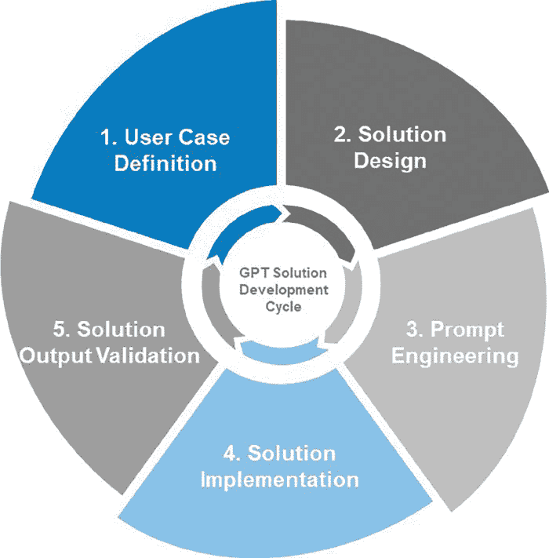
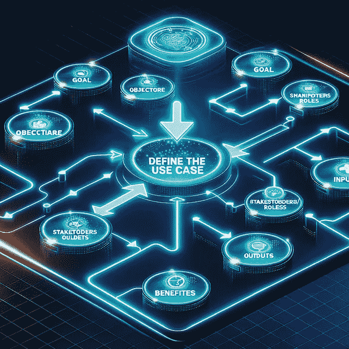
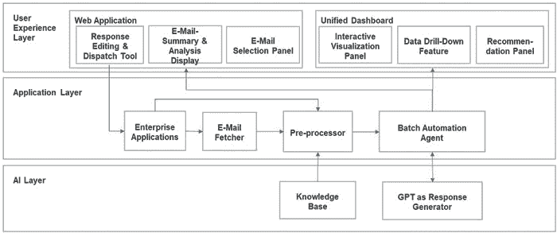
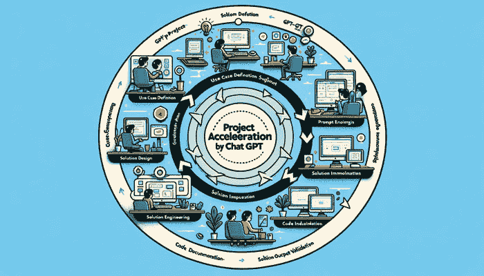

# 第七章：GPT 项目的掌握

# 介绍

在前面的章节中，我们已经踏上了一段启发之旅，探索了 GPT 模型的基础、它们的 AI 能力和潜在应用，以及它们在改变商业格局中的作用。我们还探讨了一系列解决方案架构的设计模式、有效的提示和基于提示的助手。当我们接近第七章时，是时候深入探讨企业环境中 GPT 部署项目的方法和技术了。

我们揭示了对这类项目成功的最佳实践，从最初的项目准备、精确的用例定义、全面的解决方案设计，到准确的提示工程。我们还深入探讨了解决方案实施、输出验证和迭代改进的关键阶段的技术，使得系统地融入反馈成为可能。每个子章节都深入探讨了这些方面，提供了实用的见解和可操作的策略，可以应用于现实世界的 GPT 项目。

随着本章的结束，我们还涵盖了两个重要的方面，根据自动化程度量身定制的变革管理以及通过 GPT-for-GPT 方法进行创新项目加速。

# 【结构】

在本章中，将涵盖以下主题：

+   项目准备

+   GPT 解决方案开发的生命周期

+   定义用例

+   设计解决方案

+   提示工程

+   实施 GPT 解决方案

+   验证解决方案输出

+   迭代改进

+   变革管理

+   通过 ChatGPT 加速 GPT 项目

# 【项目准备】

着手进行 GPT 项目涉及到技术、运营和人为因素的混合，这些因素需要在实际项目开始之前解决。因此，项目准备阶段为整个项目奠定了基础，涉及从基础设施设置、安全策略制定到员工培训和运营反馈启用的活动。本章旨在指导您了解每个准备活动的细节，从而实现对 GPT 项目成功启动的健壮和系统化的方法[¹]。

# 【基础设施设置】

启动 GPT 项目需要围绕基础设施设置和潜在模型微调进行细致的规划。为开发、测试和生产建立不同的环境是第一个关键步骤。这个过程通常使用单独的 Azure OpenAI[²]或 ChatGPT Enterprise[³]实例，每个实例都针对其环境的特定需求进行了定制。适当的配置和对这些实例的持续维护对项目的顺利执行至关重要。

# 【安全策略制定】

在进行 GPT 项目时，建立健壮的安全策略和指南至关重要，因为企业数据和文件的巨大依赖。以下是使用 Azure OpenAI 实例进行 GPT 项目的推荐安全措施的示例：

+   **通过 Azure OpenAI 端点进行私有数据传输**

+   政策建议：为所有 Azure 资源和 OpenAI 服务之间的数据传输实施 Azure OpenAI 私有端点。这将确保数据不会暴露在公共互联网上。

+   好处：这种方法保证了一个加固的连接，大大减少了潜在的安全威胁。此外，它提供了一个高效的通信渠道，最小化了传统公共端点所带来的风险。

+   **基于角色的访问控制（RBAC）**

+   政策建议：在公司内部定义特定角色（例如管理员、开发人员、分析员），并根据这些角色使用 RBAC 为 Azure OpenAI 服务分配权限。

+   好处：这确保用户只能访问他们需要的功能和数据，最小化数据泄露或滥用的风险。它还通过清晰定义服务内谁做了什么来简化审计追踪。

+   **特定内容过滤**

+   政策建议：实施额外的内容过滤机制来审查和调节用户请求和响应的内容。明确定义什么构成可接受的内容，并建立自动系统来标记或阻止违反这些准则的内容。

+   好处：这促进了对 AI 模型的负责任使用，确保输出符合公司的价值观和标准。它还有助于防止生成或处理不当或有害的内容。

+   **GPT 模型使用的数据分类和批准**

+   政策建议：将与 Azure OpenAI 服务一起使用的所有数据分类为各种安全类别，例如公共、内部、机密、严格机密。每个安全类别应基于数据的敏感性和机密性进行定义。只有经批准的 OpenAI 服务安全类别的数据才能由 GPT 模型处理。

+   好处：这种方法确保敏感数据得到适当处理，并减少了意外曝光的风险，符合内部数据处理标准。

+   **个人可识别信息（PII）的匿名化**

+   政策建议：在 GPT 模型处理任何个人可识别信息（PII）之前，应对其进行匿名化，以删除或模糊任何可能识别个人的数据。

+   好处：对 PII 进行匿名化确保了个人信息的隐私和安全，降低了数据泄露的风险，并确保符合数据保护法规。

+   **API 调用限制**

+   政策建议：禁止未经注册或未经授权的来源直接调用 OpenAI 云 API。经批准的应用程序必须通过预定义的代理或网关路由请求。

+   好处：这将保护系统免受不必要的和潜在有害的外部交互。通过网关路由，公司可以实施日志记录、监控和速率限制，以实现更好的控制。

+   **开源工具使用**

+   政策建议：任何与 OpenAI-Cloud-API 接口的开源工具在部署前应经过安全审查并获得批准。

+   好处：这确保第三方工具不会给系统引入漏洞，并且它们保持兼容性和稳定性标准。

+   **公开曝光限制**

+   政策建议：限制 Azure OpenAI 服务的公开曝光，特别是在面向消费者的平台上。实施网络级别的控制和应用程序防火墙以防止未经授权的访问。

+   好处：这减少了来自公共网络的潜在威胁，并确保 Azure OpenAI 服务不被滥用或受到不必要的负载。

+   **安全优先的整合**

+   政策建议：禁止将 GPT 模型与可能导致危及人类生命的现实后果的工具或系统集成（例如医疗设备、车辆控制系统）。

+   好处：这确保了 GPT 模型的潜在不准确性或不可预测性不会导致身体伤害或危险情况。

在 GPT 项目中确保安全至关重要。上述提供的政策为增强人工智能实施的安全性和责任性提供了指导。通过遵循这些措施，您可以更好地管理潜在风险并促进高效的人工智能使用。对安全性的持续关注将使项目和用户受益。

# 员工培训和发展

确保团队熟练掌握 GPT 模型和相关流程是成功实施 GPT 项目的关键步骤。这项任务强调全面的培训和发展举措，促进团队对已建立政策、潜在风险和与 GPT 模型相关的独特挑战的教育。

培训应涵盖以下领域：

+   **AI 能力框架**：提供 CapabilityGPT⁵的概述，使团队成员能够了解 GPT 模型具有的能力范围。这种基础知识可以帮助员工更好地利用这些能力。

+   **架构模式**⁶：对团队进行培训，介绍在部署 GPT 模型中适用的各种架构模式。这使员工能够理解并参与与基于 GPT 的应用程序设计和实施相关的决策。

+   **提示工程**⁷：为团队成员提供工程有效提示 GPT 模型的技能，这对于获得高质量的输出至关重要。这种培训可以包括提示模式选择的指导方针，改进提示以获得更好的结果，以及要避免的常见陷阱。

+   **GPT 实施框架**：在选择适当的 GPT 实施框架之后，组织有针对性的培训至关重要。这种培训包括设置和集成策略、模型管理技术，以及有关错误处理和有效故障排除的见解。目标是确保开发人员深入了解他们选择的框架，以最大化 GPT 集成的好处。

+   **输出验证精通**：确保 GPT 模型的响应经过严格验证，确保准确性、相关性和道德考虑。全面的培训强调事实的正确性、数据保护、相关性，以及在模型输出中避免偏见或捏造。

+   **变革管理**⁸：理解人类和 GPT 模型在不同任务中扮演的不同角色至关重要。培训强调掌握人类专业知识和 GPT 协助之间的平衡，无论是完全自动化、协作努力还是仅由人类驱动的任务。目标是利用人类经验和 GPT 能力之间的协同作用，实现最佳结果。

# 运营反馈启用

导航 GPT 项目的复杂性需要一个精心策划的反馈结构：

+   **GPT 输出中的人类监督**

+   重要性：GPT 模型可以产生多样化的输出，其中一些可能与期望的结果不一致，或可能带有意想不到的偏见。来自学科和伦理专家的监督确保内容质量、相关性和伦理对齐。

+   实施：促进专门的审查会议，邀请学科和伦理专家评估 GPT 的输出。为他们提供强大的工具和方法，以标记知识和伦理角度需要改进的异常、偏离或区域。

+   **培养提示工程文化**

+   重要性：GPT 项目的功效与输入模型的提示质量密切相关。培养强调提示工程的复杂性和精通的环境，显著提高了 GPT 响应的精确性和相关性。

+   实施：带头发起深化团队参与的倡议，使用*[第五章，高级 GPT 提示工程技术](c05.xhtml)*中解释的先进提示工程技术。这可能包括专门讨论这些高级技术的研讨会，挑战团队利用*[第五章](c05.xhtml)*中的见解进行头脑风暴会议，或旨在利用这些新发现技术进行创新的团队驱动挑战。

+   **超越输出的 GPT 特定反馈收集**

+   重要性：虽然 GPT 输出提供了一个反馈维度，但理解用户体验、系统性能和适应性同样至关重要。这些方面给出了对 GPT 模型有效性的全面视图。

+   实施：设计机制，不仅仅是在生成的内容上征求反馈，还要考虑模型的反应时间、对一系列提示的适应能力以及整体用户体验等参数。这种全面的反馈方法确保了 GPT 生态系统的全面改进。

# GPT 解决方案开发的生命周期

GPT 解决方案开发周期是一个结构化和迭代的过程，用于实施 GPT 项目。如*图 7.1*所示，该周期提供了一种系统化的方法，确保每个阶段的清晰度和效率。

**图 7.1:** GPT 解决方案开发周期

它始于**定义用例**。这个初始阶段涉及确定项目的具体要求和目标，以指导所有后续步骤。

随后，项目进入**解决方案设计**阶段，包括三个主要任务：功能解决方案设计，概述所需的行为；解决方案架构设计，确保系统健壮和可扩展；用户体验设计，针对最终用户和解决方案之间的互动。

接下来是**提示工程**阶段。在这里，为解决方案设计中确定的每个 GPT 任务制定具体的提示，利用前两章介绍的提示技术。

准备好提示后，周期进入**实施**阶段，在这个阶段，通过创建所需的代码以及工程提示来开发解决方案。

然后开始**解决方案输出验证**阶段，在这个阶段，对 GPT 模型的输出进行彻底审查，以确保其符合所需的准确性和相关性标准。

从这个验证中获得的反馈和见解导致了**反馈驱动的迭代**阶段。这是项目根据收到的反馈进行改进，进行必要的调整以改善结果的阶段。

GPT 解决方案开发周期持续进行重复迭代，直到达到所需的准确性和效率水平。

值得注意的是，上述周期是基于常用的提示工程方法，不涉及更耗时的模型微调过程⁹。

在接下来的子章节中，将更详细地探讨该周期的每个阶段，提供见解和最佳实践，以帮助成功开发 GPT 项目。

# 定义用例

用例定义作为业务蓝图，指导解决方案设计、提示工程、实施和验证阶段的 GPT 项目。它确保了清晰的范围、指定的数据需求和对齐的利益相关者

**图 7.2:** 定义用例

在下一节中，我们提供了一个用例模板，为您的 GPT 项目需求提供了一个框架来进行文档化。它旨在解决您 GPT 用例的所有关键方面，确保您的项目有坚实的基础和明确的方向。

+   **标题**：简洁、描述性的标题，准确概括用例。

+   **标识符**：用于便于参考和管理项目文档的唯一标识符。

+   **目标/目标**：该用例的具体目标，详细说明 GPT 模型预期实现的价值和对项目的价值。

+   **利益相关者/角色**：确定所有将与 GPT 模型互动的用户或系统，描述他们的角色或互动。

+   **前提条件：** 指定在使用案例启动之前必须满足的条件，例如数据集、资源或任何必要的配置的可用性。

+   **功能：** 描述不同利益相关者视角下预期的输入和输出。

+   **输入：** 模型需要什么来执行其任务？这可能是文本数据、特定提示或其他类型的信息。

+   **输出：** 模型的预期结果是什么？这可能是文本输出、分析结果等。

+   **后置条件：** 在成功执行使用案例后应达到的状态或条件。

+   **性能要求：** 定义 GPT 模型应满足的任何特定性能标准，如响应时间、准确性和吞吐量。

+   **数据要求：** 详细说明此使用案例所需的数据，包括用于提示 GPT 模型的演示。

+   **痛点：** 预期 GPT 模型应该解决或缓解的利益相关者特定挑战或问题的详细说明。

+   **利益：** 描述使用案例对每个确定的利益相关者的预期利益。这可能包括效率、准确性、用户参与度、成本节约等方面的改进。

作为这个模板在实际中的示例，让我们看一个涉及公用事业公司呼叫中心的真实案例。这将帮助您了解模板如何填写，以及如何指导 GPT 解决方案的开发。

+   **标题：** 公用事业公司呼叫中心电子邮件自动化

+   **标识符：** CC-EA-UC-001

+   **目标/目标：** 自动处理和理解与合同调整、发票查询、服务投诉等相关的公用事业公司呼叫中心的传入客户电子邮件，从而减少响应时间并提高客户服务效率。

+   **利益相关者/角色**

+   呼叫中心代表：与 GPT 模型互动，创建客户咨询摘要，分析客户意图，并提供电子邮件回复建议。

+   后勤办公室职员：使用 GPT 模型快速分析电子邮件历史记录，理解情境、客户意图、回复质量以及从这些互动中实现的客户满意度水平。

+   呼叫中心主管：监控整体客户满意度和建议电子邮件回复的接受率等关键绩效指标（KPI）。

+   **前提条件**

+   GPT 模型已经在各种客户服务互动和与公用事业行业相关的文本上得到了适当的预训练。

+   为了演示目的，准许访问一些历史电子邮件样本。

+   **功能**

+   呼叫中心代表

+   输入：传入客户电子邮件。

+   **流程：** GPT 模型阅读电子邮件，创建客户咨询摘要，并分析客户意图。

+   输出：基于查询的情境感知摘要、推断意图和建议的回复文本。

+   后勤办公室职员

+   输入：电子邮件历史记录。

+   流程：GPT 模型分析电子邮件历史记录，理解情境、客户意图和以前回复的质量。

+   输出：从电子邮件历史中的情境洞察，从过去互动中推断的意图，以及从过去回复中实现的客户满意度水平的理解。

+   呼叫中心主管

+   输入：客户满意度、回复接受率和其他相关关键绩效指标的数据。

+   流程：监控和评估 KPI，特别是与 GPT 模型建议的效果和效率相关的 KPI。

+   输出：对整体客户满意度、建议电子邮件回复的接受率以及潜在改进领域的洞察。

+   **后置条件**

+   呼叫中心代表与 GPT 模型互动后，客户查询的简明摘要可用，客户意图明确，并提供上下文相关的响应建议。

+   后勤办公室职员利用 GPT 模型，将清楚了解电子邮件历史、上下文和客户意图。

+   呼叫中心主管将有必要的数据来监控与电子邮件响应和客户满意度相关的关键绩效指标（KPI）。

+   性能需求：

+   GPT 模型必须能够在几秒内处理和理解电子邮件，以提供实时建议。

+   模型应保持至少 85%的准确性水平，以确保建议响应的相关性和上下文。

+   数据需求：

+   一些演示来自过去的实际公用事业客户服务互动。

+   获取传入客户电子邮件、过去的电子邮件历史和相关的交易系统数据，以供模型处理并提供响应建议。

+   痛点：

+   呼叫中心代表

+   花费过多时间解释每封客户电子邮件背后的意图和上下文。

+   电子邮件响应的不一致性导致潜在的误解。

+   来自高电子邮件量的压力，导致响应时间延长。

+   后勤办公室职员

+   难以快速检索和解释历史电子邮件数据，以了解当前的响应。

+   难以评估过去响应的质量和了解客户满意度。

+   对重复客户关注或互动中经常出现的问题的了解有限。

+   呼叫中心主管

+   缺乏可量化的指标来评估整体客户满意度。

+   难以识别响应接受或拒绝的模式。

+   难以确保电子邮件沟通中的一致质量和效率。

+   **好处**

+   呼叫中心代表

+   高效地理解客户查询，并获得清晰、上下文感知的响应建议。

+   改善电子邮件响应的一致性，减少误解。

+   减少每封电子邮件的处理时间，实现对高电子邮件量的更好管理。

+   后勤办公室职员

+   更快、更全面地分析电子邮件历史，增强上下文和响应的相关性。

+   清晰了解过去响应的质量，并更好地评估客户满意度。

+   增强发现和解决重复客户关注或问题的能力。

+   呼叫中心主管

+   获取清晰的关键绩效指标，以更好地了解整体客户满意度和响应效果。

+   了解响应接受模式，有助于完善沟通策略。

+   确保电子邮件互动中的一致质量和效率，促进更强的品牌声誉。

# 设计解决方案

解决方案设计阶段分为三个主要任务：功能解决方案设计、解决方案架构设计和用户体验设计。每个任务在以下各节中都有详细描述。

**图 7.3：**设计解决方案

# 功能解决方案设计

我们区分了三种类型的 AI 解决方案及其相应的设计步骤（见*图 7.4*）：

**图 7.4：**功能解决方案设计

+   **面向过程的 AI 解决方案**旨在处理完全指定的结构化任务，需要依次应用多个 AI 能力¹⁰。与 GPT 模型的互动基于用户提供的指令提示¹¹。设计步骤包括：

1.  选择 AI 能力：确定并匹配与用例相关的 AI 能力。

1.  群体 AI 能力：将能力组织成逻辑序列，形成连贯的子流程。

1.  设计前/后处理：整合任务，以完善和丰富用户输入，并验证和可视化 GPT 模型的输出。

+   **基于分析的 AI 解决方案**旨在从各种不同数据中提取全面的见解。迭代查询提示¹²用作与 GPT 模型互动，以利用其先进的推理能力。设计过程如下：

1.  设计 AI 查询：选择查询类型，如信息查询或预测，并指定响应的理由要求。

1.  描述证据：确定支持查询所需的事实、情境和背景证据。

1.  设计推理规则：建立指导 GPT 模型思维链的分类和模糊逻辑规则。

+   **多代理 AI 解决方案**在需要专门的 AI 代理进行分布式问题解决的场景中表现出色，它们相互合作并与用户合作。多代理提示¹³允许使用单个 GPT 模型模拟和实现多代理解决方案。以下是设计步骤：

1.  指定目标：为代理团队定义总体目标。

1.  设计 AI 代理：详细介绍涉及的代理和其不同的角色和专业知识。

1.  设计代理合作：建立代理人如何相互交流和合作以实现指定目标。

让我们演示一个以流程为导向的 AI 解决方案的设计，使用了前一小节中突出的电子邮件自动化用例。我们设计了两个不同的 AI 流程来满足不同的利益相关者需求。下面的部分概述了其中的第一个流程，名为**自动电子邮件处理**，由呼叫中心代表处理（见*图 7.5*）：

**图 7.5：**用于自动电子邮件处理的 AI 流程

1.  预处理：电子邮件准备

1.  电子邮件获取：处理从电子邮件系统中提取电子邮件及其附件。

1.  转换：将非文本电子邮件附件转换为可处理和分析的文本格式。

1.  知识库丰富：从知识库中丰富电子邮件内容，包括相关的常见问题和过去的解决方案。

1.  客户数据丰富：通过将后端系统中的客户特定数据纳入电子邮件中，进一步丰富电子邮件内容。

1.  电子邮件分析和分类

1.  分类：分析电子邮件内容，并将其分类为以下类别之一：合同调整、发票查询、服务投诉、停机报告、账户管理或抄表问题。

1.  总结：对于特别冗长或复杂的电子邮件，特别是那些附件转换为文本的电子邮件，生成简洁的摘要以简化理解。

1.  因果分析：制定假设以了解客户发送查询背后的原因或动机。

1.  响应候选人的创建和评分

1.  创建：根据客户的查询、总结和分析的因果关系，生成各种潜在的电子邮件回复。

1.  排名：评估并根据预定义的一组标准对创建的回复进行排序，以确定其适用性和相关性。

1.  响应提案和审查

1.  呈现：基于最高排名的建议，呈现给客户查询的最佳回复。

1.  呼叫中心代表审查：除了查询电子邮件摘要、分析和基于排名结果的原因，还呈现给呼叫中心代表评审最高排名的电子邮件提案。如果被拒绝，代表可以选择排名第二的响应选项。

1.  发布和修改：审查后的电子邮件提案可以直接发送给客户，或根据需要进行修改后再发送。

在详细介绍了专注于直接沟通和响应的第一个流程之后，我们现在将注意力转向第二个流程，称为**高级电子邮件分析**。这个流程强调回顾性分析和面向未来的策略，确保后勤文员和呼叫中心主管都能充分装备，以优化他们的任务（见*图 7.6*）：

**图 7.6：**高级电子邮件分析的 AI 流程

1.  用于 AI 分析的预处理：

1.  数据获取：在深入研究历史评论之前，从后端系统检索必要的电子邮件数据至关重要。这确保了正在分析的是最相关和最新的信息。

1.  知识库搜索：访问内部知识库，整合先前在电子邮件互动中使用过的见解或模板。这一步可以更全面地了解过去对电子邮件回复的方法。

1.  历史电子邮件审查

1.  信息提取和分析：提取和分析过去的电子邮件互动，了解以前的客户意图并评估响应的有效性。

1.  摘要：从电子邮件历史中提炼见解，清晰呈现过去的互动和结果的概述。

1.  战略见解和未来规划

1.  预测：预测未来电子邮件互动中的潜在模式和挑战，指导呼叫中心主管的战略规划。

1.  建议：利用得出的见解，AI 模型提出程序修正或建议培训模块，以提高响应质量。

1.  后处理：可视化和报告

1.  交互式仪表板：提供统一的指标视图，从历史电子邮件互动到当前的关键绩效指标。热图等功能可以识别优势和改进的潜在领域。

1.  数据驱动报告：提供对电子邮件互动的见解，突出趋势、显著互动和面向后勤文员和呼叫中心主管的基于人工智能的建议。

总之，第一个流程侧重于实时互动，将人工智能能力与人类洞察力结合起来，而第二个流程则深入研究历史互动，并为数据驱动的未来战略铺平道路。

# 解决方案架构设计

在深入研究了 GPT 流程设计之后，我们接下来的任务是将这些概述的流程转化为具体的架构表示。以下步骤详细说明了我们构建这一架构的系统方法：

1.  架构模式选择：

+   模式匹配：参考第四章的指南选择与项目核心目标一致并支持定义的流程设计的架构模式。

+   模式集成：如果发现多个架构模式合适，制定一个策略，将它们有机地融合在一起，确保它们与 GPT 倡议保持和谐。

1.  组件规范：

+   用户体验层：确定和描述所需的交互媒介，无论是聊天机器人还是 Web 应用程序，都要与用户的需求和项目目标 resonant。

+   应用层：根据所选的架构模式描述所需的组件。例如¹⁴：

+   预处理器：从企业应用程序、数据库和知识库中丰富用户输入的相关数据。

+   提示生成器：接收预处理器中丰富的用户输入，并将其转换为使用的 GPT 模型可以理解和处理的提示格式。

+   企业应用和数据库：企业级软件和数据库系统，将通过应用层与 GPT 模型交互或提供数据。

+   工具 API 规范：企业应用程序和数据库中使用功能的技术规范。

+   后处理器：在 GPT 模型生成响应后调整、结构化或完善输出数据。

+   代理人：计划，编排或自动化与用户，GPT 模型和企业应用程序和数据库的互动。

+   响应过滤器：筛选和管理 GPT 模型提供的输出，以确保相关性，适当性或其他定义的标准。

+   AI 层：指定核心 AI 组件及其指定角色。这些通常包括：

+   GPT 模型作为响应生成器：主要配置为处理输入查询并提供有意义和上下文相关的响应。

+   GPT 模型作为评论家：积极批评或评估先前 GPT 模型调用的输出，确保质量和相关性。

+   GPT 模型作为工作流引擎：编排和管理流程的顺序，确保平稳高效的运作。

+   知识库：用于将提示上下文化为 GPT 模型的领域特定知识的储备。

1.  工作流定制：

+   修正：对所选架构模式的默认工作流进行必要的更改，以确保其与项目特定要求紧密对齐。

+   增强功能：引入全新的工作流程，满足额外要求或创新功能，扩展超出所选架构模式的默认配置。

为了为两个 GPT 流程设计示例开发全面的解决方案架构，我们将选择**D1 基本自动化代理**模式（在*[第四章，GPT 模型支持的架构模式](c04.xhtml)*中有详细描述）。

在这里，我们提供集成架构的概念概述（见*图 7.7*）：

**图 7.7:** 自动电子邮件处理和高级电子邮件分析的解决方案架构

+   用户体验层

+   呼叫中心代表的 Web 应用程序

+   电子邮件选择面板：允许呼叫中心代表使用各种标准（例如日期范围，客户档案，紧急程度）选择查询电子邮件。

+   邮件摘要和分析显示：对于每个选择的查询，代表可以查看简洁的摘要，深入分析和 GPT 生成的响应提案。

+   响应编辑和发送工具：代表可以选择直接发送建议的响应或在线修改。一旦他们满意，他们可以将响应发送给客户。

+   统一仪表板（供后勤文员和呼叫中心主管使用）

+   交互式可视化面板：显示电子邮件互动趋势，上下文洞察，推断的客户意图和关键绩效指标的动态视图。它包括过滤器，缩放功能，时间尺度和热图等工具。

+   数据钻取功能：提供对特定电子邮件互动，关键词识别和上下文比较的深入分析。

+   推荐面板：提供针对用户角色需求和配置的 AI 生成建议。

+   应用层

+   电子邮件提取器：直接从公司的电子邮件系统中提取批量电子邮件查询。

+   预处理器：使用来自知识库和企业应用程序的数据丰富每个批处理的电子邮件，为 GPT 处理准备数据。

+   企业应用程序

+   电子邮件系统：传入客户电子邮件查询的主要来源。

+   客户关系管理（CRM）系统：包含客户档案，互动历史和其他以客户为中心的数据。

+   企业资源规划（ERP）系统：提供有关公司资源，运营和业务流程的数据。

+   批处理自动化代理：该代理以双循环方式编排 AI 驱动的流程，如下所述。

+   后处理器：一旦批处理自动化代理生成批处理响应，后处理器会将其格式化以在用户体验层中显示。

+   AI 层

+   响应生成器（GPT 模型）：根据批处理的提示生成初始响应，使用其预训练知识和来自知识库和后端系统的输入。

+   知识库：为 GPT 处理提供补充信息，如公司政策、常见问题解答或过去的解决方案。

从架构中衍生的自动电子邮件处理工作流如下：

1.  批量检索：电子邮件获取器从公司的电子邮件系统中检索批量电子邮件查询。

1.  丰富：预处理器从知识库、CRM 系统和 ERP 系统中为每封电子邮件丰富相关数据。

1.  AI Orchestration: 批处理自动化代理以双循环方式编排 AI 驱动的处理：

+   外循环：在批处理中迭代整体客户查询电子邮件。对于每封电子邮件，它触发内循环。

+   内循环：对于给定的客户查询电子邮件，内循环依次处理 AI 过程的每个步骤。在每个步骤中，它调用一个具有特定提示的 GPT 模型，以唤起所需的 AI 能力：

+   分类：在这个阶段，根据内容、紧急程度或其他相关标准对电子邮件进行分类。引擎可能会要求 GPT 模型执行语义分析或内容分类。

+   总结：对于复杂或长篇的电子邮件，特别是带附件的电子邮件，生成摘要以帮助理解。

+   因果分析：在这里，引擎指导 GPT 模型对客户查询背后的动机或原因进行假设。

+   创建：引擎提示 GPT 模型生成潜在的电子邮件回复，考虑客户的查询和因果分析的结果。

+   排名：在这个阶段，根据其适用性和与初始查询的相关性对生成的回复进行评估和排名。引擎可能会指示 GPT 模型根据预定义的一组标准对回复进行评分。

1.  UI 呈现：精炼的电子邮件回复在 Web 应用程序界面上呈现供代表审查。

1.  响应分派：代表批准后，电子邮件被发送给客户。

高级电子邮件分析的结构化工作流如下所示：

1.  AI 分析的预处理：

+   数据获取：在深入研究历史评论之前，从后端系统中检索必要的电子邮件数据至关重要。这确保了正在分析的是最相关和最新的信息。

+   知识库搜索：访问内部知识库，整合先前在电子邮件互动中使用过的见解或模板。这一步可以更全面地了解过去对电子邮件回复的方法。

1.  历史电子邮件分析：在获取和丰富的电子邮件上执行指令序列提示，涵盖以下步骤：

+   信息提取和分析：深入研究过去的电子邮件互动，了解先前客户意图，并评估先前响应的有效性。

+   总结：从电子邮件历史中提取并呈现关键见解，包括 KPI，提供历史参与和其结果的快照。

+   预测：预测未来电子邮件互动中的潜在模式和挑战。

+   建议：根据获得的见解，建议潜在的运营修改或培训模块，以提升响应的质量和有效性。

1.  可视化创建：生成与 KPI 和分析结果相关的相关可视化呈现。这可以是图表、图表、热图或其他适当的可视化形式。

总之，集成的 GPT 解决方案架构及其后续工作流提供了一种全面、流畅的自动电子邮件处理和基于分析的洞察力的方法，从过去的电子邮件中获得。

# 用户体验设计

在我们的 GPT 解决方案架构的基础上，现在是时候深入用户体验层了。这一层作为用户和基于 GPT 的功能之间的主要接口。通过三步方法，我们的目标是打造一个直观的用户体验，确保与 GPT 模型的高效和有意义的交互。

1.  定义交互流程

+   聊天机器人：设计一个对话流程，考虑用户如何发起交互，他们可能提供的提示类型，以及 GPT 模型可能如何响应。确保聊天机器人能够快速提供响应，按需提供解释，并允许用户调整或更改其查询的选项。

+   Web 应用程序：概述主要的交互点，如文本输入框，响应显示和潜在的多媒体集成。以强调清晰和简单为目的设计布局，确保用户了解如何输入数据和解释 GPT 模型的输出。

1.  优化信息显示

+   聊天机器人：使用自适应消息，根据用户提示提供简洁的回复或更详细的背景信息。在必要时集成丰富的媒体，如图片、视频或链接，以增强用户的理解。

+   Web 应用程序：使用视觉线索、颜色和排版来强调关键的输出和操作，确保信息的清晰层次结构。包括侧边栏、工具提示或模态窗口，以获取额外信息而不会使主要界面混乱。

1.  整合反馈机制

+   聊天机器人：为用户提供评价响应或提供 GPT 输出反馈的选项。这可以帮助改进模型的准确性并提高用户满意度。

+   Web 应用程序：在 GPT 模型的输出旁边，加入专门的反馈部分，如赞/踩图标或评论框。还要考虑添加常见查询或挑战的 FAQ 或帮助部分，以帮助用户。

现在让我们将这种三步方法应用于我们的电子邮件使用案例的用户体验设计：

1.  定义交互流程

+   呼叫中心代表的 Web 应用程序：

+   电子邮件选择面板：

+   搜索栏：允许代表输入特定搜索条件的文本输入框。

+   过滤器：下拉菜单和日期选择器，用于日期范围，客户配置文件和紧急程度。

+   电子邮件列表：显示电子邮件主题作为可点击项，一旦选择，电子邮件将在电子邮件摘要和分析显示中打开。

+   电子邮件摘要和分析显示：

+   电子邮件标题：展示发件人姓名，电子邮件 ID 和时间戳。

+   摘要面板：简明清晰地列出电子邮件内容的摘要部分。

+   分析面板：选项卡视图显示深度分析，可能包括多媒体（如附件预览）集成。

+   GPT 响应预览：显示 AI 生成的响应的框定区域。

+   响应编辑和发送工具：

+   可编辑文本框：用户可以修改 GPT 生成的响应。

+   发送按钮：按下后，发送响应。

+   保存草稿选项：允许保存响应以便以后完成。

+   统一仪表板（供后勤文员和呼叫中心主管使用）：

+   交互式可视化面板：

+   动态图表：可点击的图表展示电子邮件趋势。悬停在数据点上会触发弹出窗口，显示更多细节。

+   工具面板：用于过滤器、缩放功能、时间尺度和热图调整的图标或滑块。

+   数据钻取功能：

+   交互式表格：列出特定的电子邮件交互。点击一行会打开详细视图，展示情绪、关键词亮点和上下文见解。

+   推荐面板：

+   建议卡片：每个 AI 生成的建议都呈现为一张带有简要详情的卡片。点击它会展开更多信息。

1.  优化信息显示

+   视觉层次结构：通过大小和位置优先考虑重要组件。例如，电子邮件摘要应该在中心显著显示。

+   颜色编码：使用不同的柔和颜色作为背景，使用更鲜艳的颜色作为可操作按钮或关键信息。

+   排版：标题使用粗体和较大的字体。使用无衬线字体以提高可读性。提示和额外信息使用稍小一些的字体大小，以防止混乱。

+   工具栏和侧边栏：对所有图标/按钮进行悬停提示，并为扩展选项或指南提供可折叠的侧边栏。

1.  集成反馈机制

+   反馈图标：在 GPT 模型的输出旁边，加入赞/踩图标，让用户快速评价响应的准确性或相关性。

+   评论框：在 GPT 响应下方，提供一个用户可以输入具体反馈的框。

+   帮助部分：在角落的图标打开一个模态窗口或侧边栏，包含常见问题和如何使用仪表板的指南。这可以帮助代表们更好地解决问题或理解系统。

遵循这个规范的指示用户界面如*图 7.8*所示：

！

**图 7.8：** 用户界面示例

最后，我们为 GPT 流程的用户体验设计结合了效率和直觉，创造了一个界面，既简化又增强了自动化电子邮件交互和高级电子邮件分析。清晰的交互流程，明确的信息显示和以用户为中心的反馈机制确保了全面的人在循环方法。

# 提示工程

提示工程循环是一个全面的迭代过程，指导高质量提示的创建。

！

**图 7.9：** 提示工程

这个循环涉及五个阶段，每个阶段都需要不同的活动，但都共同努力确保有效、高效和安全提示的开发。这些阶段是（见*图 7.10*）：

！

**图 7.10：** 提示工程循环

1.  **提示模式验证**：利用在功能解决方案设计中建立的 AI 解决方案类型和提示模式之间的相关性，选择适当的模式。然后对这个选择进行详细的评估。

1.  **详细提示设计**：在选择模式之后，重点转向准确填充所选模式的指定槽或属性。这将涉及设置，如*专家人设*，*上下文*，*指令*，*执行规则*和*输出约束*。每个组件都塑造了 GPT 模型的行为和输出。

1.  **提示快速检查**：一旦设计完成，使用一个检查表对提示进行简要而务实的审查。这个快速检查确保 GPT 模型的交互符合基本指导方针，并避免任何即时的担忧。

1.  **交互式提示执行**：在这个阶段，经过验证的提示被输入到一个 GPT 模型中，以交互式、用户友好的环境中，比如 ChatGPT 网络应用程序或 OpenAI Playground。重要的是，这个环境被设计成直观的，不需要编程技能，从而方便使用和即时反馈。

1.  **提示输出评估**：在这一步中，从 GPT 模型生成的响应被仔细地与预期结果进行比较，以确保其准确性。使用另一个检查表并收集反馈，作为提示持续改进的输入。

在接下来的章节中，将详细解释每个阶段，突出涉及的活动，推荐最佳实践，并指出可能出现的挑战。

# 阶段 1：提示模式验证

在前一章节关于功能解决方案设计中，我们已经暗示了 AI 解决方案类型和提示类型之间的相关性：

+   面向过程的 AI 解决方案 -> 指令提示。

+   基于分析的 AI 解决方案 -> 查询提示。

+   多 Agent AI 解决方案 -> 多 Agent 提示。

每种提示类型都与一个独特的模式相关联，这一模式规范了其结构和内容¹⁶。因此，这一步基于*[第五章，GPT 模型启用的架构模式](c05.xhtml)*中概述的标准提供了一个评估矩阵，以确认或更改最初的选择：

| **标准** | **指令提示模式** | **查询提示模式** | **多代理提示模式** |
| --- | --- | --- | --- |
| 详细的任务规范 | ✓ |  |  |
| 自然语言编程 | ✓✓ | ✓ | ✓ |
| 基于规则的执行控制 | ✓✓ |  | ✓ |
| 可用的背景知识 | ✓✓ | ✓ | ✓ |
| 交互式更正 | ✓✓ | ✓ |  |
| 分析综合 |  | ✓ |  |
| 模糊性导航 | ✓ | ✓✓ | ✓ |
| 场景模拟 | ✓ | ✓✓ | ✓ |
| 决策支持重点 | ✓ | ✓✓ | ✓ |
| 任务规范不完整 | ✓ |  | ✓✓ |
| 独立观点的价值 |  |  | ✓ |
| 需要额外的质量检查 | ✓ |  | ✓✓ |
| 专业化和跨职能整合 | ✓✓ |  | ✓✓✓ |

**表 7.1：**提示模式的选择标准

# 第 2 阶段：详细提示设计

这个阶段是定义 GPT 模型的预期行为和期望输出的地方。借鉴了*[第五章，GPT 高级提示工程技术](c05.xhtml)*的见解，我们深入探讨了这个设计阶段的组成部分，使用简化的指令模式来说明这个过程：

+   **专家角色**：定义了 GPT 模型应该模拟的技能配置，例如，“你是一家营销公司的业务分析师”。它有助于指导模型的响应，以适应特定的专业知识和背景。

+   **背景**：提供外部或用户特定的细节，以引导 AI 的响应准确性和相关性，例如，“上季度推出了三项营销活动。”

+   **任务规范**：指导模型进行所需的操作。可以是：

+   单一指令：直接简单，比如“评估这些广告活动。”

+   指令序列：一系列相关任务。

+   伪代码指令：复杂任务的详细结构化指南。

+   **执行规则**：在任务执行过程中塑造模型的策略和决策的指令，考虑问题解决方法、道德标准和任务边界。

+   **输出约束**：指定 AI 输出的条件，例如结构、内容、长度等，“500 字以内的分段报告”。

现在让我们将指令序列提示应用到我们的自动电子邮件处理示例中。在这种情况下，我们的重点是 GPT 模型直接处理的任务，因为预处理和结果呈现将由其他组件处理：

+   **专家角色**：您是一名专门从事电子邮件分析和查询响应的 AI 代理人。您的专长在于文本内容分析、假设制定、潜在回复的模拟和推荐优先级。

+   **背景**：我们的组织是一个公用事业呼叫中心，每天通过电子邮件收到大量客户咨询。这些邮件的复杂程度不等，通常附有附件。在到达您之前，它们经历了电子邮件获取、非文本内容转换、知识库丰富化和客户数据丰富化等预处理步骤。

+   **任务规范作为指令序列：**

1.  分类：分析邮件内容，并将其分类为以下类别之一：合同调整、发票查询、服务投诉、停电报告、账户管理或抄表问题。

1.  总结：如果邮件很长或复杂，特别是如果包含已转换为文本的附件，创建简洁的摘要以简化收件人的理解。

1.  因果分析：根据邮件的内容和上下文，提出假设以了解客户询问背后的原因或动机。

1.  创建：考虑初始电子邮件、其总结以及因果假设，生成各种潜在的电子邮件回复。

1.  排名：评估模拟回复，并根据预先确定的一组标准对其适用性和相关性进行排名。

+   **执行规则：**

+   考虑回复电子邮件的所有潜在解决方案。

+   在最终确定排名之前，权衡每个模拟回复的利弊。

+   消除输出中的特定偏见，确保推荐不偏向或歧视任何类型的查询或客户人口统计。

+   专注于客户的查询和预处理阶段提供的上下文。

+   在制定回复时，考虑过去解决方案的历史和经常问到的问题。

+   **输出限制：**

+   输出应该是一个结构化的分析，包括分类、总结和因果分析的清晰部分。

+   推荐的回复应以列表格式优先考虑，并附有每个排名的简要理由。

+   总输出，包括分析和推荐的回复，不应超过三页。

从前述的自动电子邮件处理提示转移到批处理循环中的自动电子邮件处理，我们现在关注电子邮件分析过程。虽然基本原则仍然相似，但这个第二个例子更深入地进行了回顾性分析，并提出了战略性建议：

+   **专家角色**：您是一名擅长分析历史电子邮件互动并从中推断反馈的 AI 代理人。您的专长包括理解过去客户意图、评估响应的效果、提取战略见解和提出未来的运营策略。

+   **背景**：我们的组织是一个公用事业呼叫中心，拥有大量与客户的电子邮件互动的存档。理解过去的参与对于改善未来的响应和客户服务程序至关重要。用于此任务的电子邮件已经经过预处理，提取了相关的电子邮件链，并使用我们的知识库进行了丰富。

+   **任务规范作为指令序列**：

1.  信息提取和分析：深入研究存档的电子邮件互动。识别和理解过去客户意图，评估所提供响应的效果。

1.  总结：概括从历史电子邮件互动中得出的见解，创建一个易于理解的过去参与、显著反馈和任何可观察模式的概述。

1.  预测：基于过去的互动和观察到的模式，预测未来与客户的电子邮件交流中可能出现的潜在挑战或新模式。

1.  建议：利用信息和预测，提出程序改进的建议或推荐可以增强呼叫中心响应质量的培训模块。

+   **执行规则：**

+   强调理解过去互动的深度，而不仅仅是浏览大量信息。

+   在电子邮件互动中寻找重复出现的主题、投诉或赞美，以得出模式。

+   在预测时，要基于数据进行预测，避免投机假设。

+   确保推荐的程序修改是可行的，并与组织的目标和能力相一致。

+   避免偏见：不偏向任何特定的客户群体或反馈类型。

+   利用预处理期间提供的丰富信息进行全面分析。

+   **输出限制：**

+   输出应该有信息提取和分析、总结、预测和建议的明确部分。

+   任何观察到的见解或模式都应该用电子邮件档案中的例子加以证实。

+   建议应优先考虑，并附有简明的理由。

+   整个输出，包括分析、见解和建议，应限制在三页内。

提示设计需要精确和创造性，以成功引导 GPT 模型的行动。我们展示了两个基于指令的提示示例，以实现电子邮件自动化和分析的特定结果。

# 第三阶段：提示快速检查

设计完成后，进行迅速而专注的评估至关重要，以捕捉任何明显问题或疏忽。这种快速检查，由最佳实践清单支持，确保 AI 交互保持扎实、安全和有效，而无需进行耗时的审查：

1.  一致性检查

+   目的：确保提示的所有元素相互匹配。

+   关键方面：所有元素，如具有上下文的角色或具有执行规则的指令，需要同步，确保故事情节流畅，没有矛盾。

1.  对齐检查

+   目的：验证提示与预定义的功能解决方案设计的同步性。

+   关键方面：确认提示是否涵盖了功能设计的 AI 相关部分，并验证其与组件描述的一致性，例如面向过程设计的过程步骤，以确保对齐。

1.  有害内容预防

+   目的：最小化生成有害或不适当内容的风险，并阻止直接通向这种输出的路径。

+   关键方面：明确禁止内容的指令，设定可接受输出的界限，并检查可能导致模型产生有害输出的指令。

1.  中立提示检查

+   目的：消除偏见，保持公正立场。

+   关键方面：审查语言和指令，以识别和消除任何倾向于特定观点、意识形态或利益集团的倾向。

1.  包容性检查

+   目的：确保提示在全球范围内可接受，而不会边缘化任何群体。

+   关键方面：审查语言，以发现潜在的偏见，并确保上下文和指令考虑到多样化背景。

1.  PII 匿名化

+   目的：保护用户的个人数据。

+   关键方面：检查任何个人标识符，并验证是否间接确定了个人信息。

1.  机密数据保护

+   目的：尊重提示和输出中敏感信息的界限。

+   关键方面：评估包含机密数据的内容，并验证提示的设计是否能生成这些数据。

1.  人性化避免

+   目的：保持 AI 能力和人类特质之间的明确区分。

+   关键方面：审查提示，确保不将 GPT 模型拟人化。

1.  知识产权保护

+   目的：保护知识产权免受侵犯。

+   关键方面：确保提示不要求或产生受版权保护的内容，并检查是否存在潜在的知识产权侵犯。

这个框架取得了平衡，允许与预期目标一致的提示交互，尊重界限，并避开潜在的陷阱，同时在提示工程循环内高效利用时间。

# 第四阶段：交互式提示执行

在交互式用户友好的 GPT 环境中执行提示具有其自身的细微差别。以下是在与 ChatGPT 网站或 OpenAI Playground 等平台互动时需要考虑的一些关键因素：

+   自定义指令：用户设置 ChatGPT 响应的偏好或要求一次，系统会自动将它们应用为每个后续提示指令的重复输出约束。

+   示例提示建议：ChatGPT 在其网站上提供提示演示，以帮助新用户迈出第一步。

+   轻松内容集成：用户可以通过简单地复制和粘贴内容，从诸如 Microsoft Word、Excel 或 PowerPoint 之类的办公产品过渡到 AI 平台。他们还可以上传一个或多个图像来处理多模态提示。

+   自动提示大小检查：环境会自动验证提示大小是否符合特定模型的限制，例如 GPT-4-8k 的 5.5K 字的阈值。

+   插件增强：针对特定用例定制的某些插件允许额外的输入。例如，可以上传数据文件进行高级数据分析，或者提供网页链接以从 PDF 文档中提取数据。

+   内置内容过滤：GPT 模型和 Azure 等云平台中的安全机制确保拒绝可能导致不当输出的提示。

+   管理超出上下文：如果提示及其输出组合接近模型的上下文限制，响应可能会被截断，需要一个“继续”提示来完成。

+   交互式反馈：在这些环境中的实时反馈帮助用户改进他们的提示，以实现更有效的交互。

# 第 5 阶段：提示输出评估

这个阶段审查了 GPT 模型的响应，以确保它们对用户是安全、准确和有价值的。我们提供了一个质量标准的检查表，包括验证行动以及我们在自动电子邮件处理和分析的案例研究中的正面和负面例子。

+   **准确性**：确保 GPT 模型的回复忠实于提示设计，准确反映了输入的事实正确性、与上下文的相关性以及对定义的结构要素的遵守。

+   验证：将回复与初始输入和已知的事实或标准进行比较。

+   正面例子：对于指示“分类提到停电和持续时间的客户电子邮件”，GPT 模型准确将其归类为“停电报告”。

+   负面例子：对于相同的指示，模型错误地将电子邮件分类为“发票查询”。

+   **没有幻觉**：GPT 模型的输出不应包含任何不真实的信息、扭曲或虚构，这些信息不是输入或其训练数据的一部分。

+   验证：分析输出中任何不能追溯到输入或已知数据的细节、声明或要素。

+   正面例子：在分析涉及“服务投诉”的电子邮件互动时，GPT 模型准确推断出客户的意图，而没有添加任何虚假细节。

+   负面例子：模型声称客户在一封电子邮件中提到了“账户管理”，而实际上该电子邮件完全是关于“抄表问题”的。

+   **完整性**：检查模型的输出是否完全回应了输入，考虑了提示的所有要素，而不是排除任何关键细节。

+   验证：确认模型在输出中是否涵盖了输入提示的所有组成部分。

+   正面例子：一封包含服务投诉要素、附加文件和有关发票调整的问题的电子邮件收到了全面的回复，涵盖了所有提到的方面。

+   负面例子：模型的输出只回应了服务投诉，忽略了发票调整。

+   **透明度和可解释性**：确保模型的输出是易于理解和明确的。GPT 模型应该能够为目标受众翻译技术语言，并在其回复中明确指出其推测或近似的情况。

+   验证：评估输出的清晰度和透明度。确保对近似值和推测提供解释。

+   正面例子：在对潜在的电子邮件回复进行排名时，GPT 模型解释说，“这个回复排名第一，因为它解决了客户的主要关注点，并与过去互动中类似成功的解决方案相一致”。

+   负面例子：模型仅仅将一个回复排名为首选，而没有提供任何理由。

+   **相关性和具体性**：确定模型的回复是否与用户的提示相关，并且足够详细，而不是提供通用的回复。

+   验证：评估输出是否与输入提示相一致，并具体回应了输入提示。

+   正面例子：对于关于“抄表问题”的电子邮件，GPT 模型生成了一封专门涉及抄表和相关问题的回复。

+   负面例子：模型提供了关于公用事业服务的通用回复，而没有具体涉及抄表。

+   **一致性**：评估模型在类似查询中是否保持稳定，并在详细提示设计阶段定义的能力范围内始终提供输出。

+   验证：执行重复查询并检查响应的一致性。

+   正面例子：每当任务是对与“服务投诉”相关的电子邮件进行分类时，AI 模型始终正确地对其进行分类。

+   负面例子：有时 AI 模型正确分类“服务投诉”，而其他时候将其错误地归类为“发票查询”。

+   **适应性**：评估模型根据详细提示设计的修改来调整其输出的能力，包括槽或属性的更改。

+   验证：测试模型在一系列不同的提示变化中，并评估其适应能力。

+   正面例子：对于带有多个附件的复杂电子邮件，GPT 模型调整其摘要深度，以提供简洁而全面的概述。

+   负面例子：尽管电子邮件内容发生变化，模型仍然提供相同的通用摘要。

+   **隐私和安全：**确认模型的操作是否符合隐私和安全标准，保护数据并保持机密性。

+   验证：审查模型的操作是否符合隐私和安全规范。

+   正面例子：当分析包含客户个人电话号码的电子邮件时，GPT 模型不会在其结构化分析输出中包含该号码，优先考虑用户隐私。

+   负面例子：模型的输出包含敏感的客户数据，如他们的完整地址和联系方式。

+   **有毒性**：确保模型避免生成有害、冒犯或不适当的内容。

+   验证：检查有毒的词语或短语，

+   正面例子：在客户的电子邮件中包含强烈、可能冒犯的语言时，GPT 模型推荐的回复保持礼貌和专业，不反映原始电子邮件的语气。

+   负面例子：模型建议的回复反映了客户原始消息的激进语气。

+   **偏见避免：**模型应该是公正的，不对某些主题、群体或个人显示任何不公平的偏见。

+   验证：检查偏见模式。

+   正面例子：当分析来自不同客户群体的电子邮件时，GPT 模型给予所有客户群体的反馈同等重视。

+   负面例子：该模型经常优先考虑城市客户的反馈，而不是农村地区的客户，从而在分析中产生了意想不到的偏见。

验证 GPT 输出是一个需要敏锐审查的微妙努力。通过应用在定期抽查期间概述的标准，您可以确保 GPT 模型的响应符合预期目标，从一次迭代到另一次迭代的改进，并符合公司标准。

# 进一步迭代的反馈循环

当输出验证结果突出显示改进的领域或者提示未能满足既定标准时，这表明需要重新启动提示工程周期，并相应地重新制定提示。在提示工程中采用这种循环方法可以确保逐步取得进展，使提示符符合用例要求，并确保 GPT 模型在其指定任务中安全且受人控制地运行。

为了说明反馈如何驱动提示设计中的调整，我们提供了一系列示例。这些实例展示了验证标准和提示修改之间的相互作用，提供了对可以增强 AI 性能的潜在改进的具体视角。

1.  准确性：

+   提示范围：自动电子邮件处理

+   问题：电子邮件主题的分类不一致。

+   修改：在任务规范下，GPT 模型应分析电子邮件并正确分类，而不会误解内容。

+   更改：可以通过示例使分类类别更明确，以确保模型不会错误地对电子邮件进行分类。

1.  没有幻觉：

+   提示范围：自动电子邮件处理。

+   问题：GPT 模型生成了原始电子邮件中未找到的假设客户反馈。

+   修改：确保模型不会捏造电子邮件存档中不存在的客户意图或反馈。

+   更改：在执行规则下添加一行：“严格依赖可用的电子邮件存档，不生成数据中不存在的意图或反馈。”

1.  完整性：

+   提示范围：自动电子邮件处理。

+   问题：输出跳过了原始指令中概述的关键步骤。

+   修改：确保对指令序列的所有阶段进行彻底处理。

+   更改：在输出约束下具体说明：“输出的每个部分必须全面涵盖任务规范中的各自指令步骤。”

1.  透明度和可解释性：

+   提示范围：自动电子邮件处理。

+   问题：在没有明确推理或理由的情况下，GPT 模型对客户反应进行了预测。

+   修改：在进行预测时，GPT 模型应透明地说明其推理过程。

+   更改：在执行规则下添加：“在呈现预测时，阐明每个预测的推理和基础。”

1.  相关性和具体性：

+   提示范围：自动电子邮件处理。

+   问题：GPT 模型的回复是泛泛的，不总是与传入电子邮件的具体内容匹配。

+   修改：模型的回复必须与传入电子邮件的性质和内容直接相关。

+   更改：在执行规则下添加：“确保生成的回复特别针对每封客户电子邮件的独特内容和关注点。”

1.  一致性：

+   提示范围：高级电子邮件分析。

+   问题：GPT 模型在多封电子邮件中对类似的客户意图进行了不同的解释。

+   修改：模型应始终识别存档中类似的客户意图。

+   更改：在执行规则下添加：“在电子邮件互动中保持一致性，识别和解释类似客户意图。”

1.  适应性：

+   提示范围：自动电子邮件处理。

+   问题：GPT 模型为复杂和简单的电子邮件提供了类似的深度摘要。

+   修改：模型应根据电子邮件的不同复杂性调整其电子邮件摘要和模拟。

+   更改：在任务规范下具体说明：“根据传入电子邮件的复杂性和上下文调整模拟回复的总结深度和细节。”

1.  隐私和安全：

+   提示范围：自动电子邮件处理和高级电子邮件分析。

+   问题：GPT 模型在摘要中包含了可识别的客户数据。

+   修改：确保模型不披露任何私人或敏感的客户信息。

+   更改：在执行规则下添加：“不要在输出中包含或披露电子邮件中的任何个人或敏感数据。”

1.  毒性：

+   提示范围：自动电子邮件处理。

+   问题：GPT 模型的回复包含不当语言。

+   修改：确保模型在回复中不使用或建议任何潜在具有冒犯性或有害内容。

+   更改：在执行规则下添加：“确保生成的回复不包含任何有害、冒犯或不当的内容。”

1.  偏见避免：

+   提示范围：高级电子邮件分析。

+   问题：GPT 模型过分强调了正面反馈而忽视了负面反馈。

+   修改：模型应该同等重视所有客户反馈，无论是负面的还是正面的。

+   更改：在执行规则下指定：“不要根据反馈的积极或消极性优先考虑或降低其重要性，确保平衡的表达。”

这些实例突显了在提示工程周期内建立健壮反馈机制的关键价值。通过根据验证结果解决差距并增强提示设计，我们确保 GPT 解决方案更具响应性和准确性，同时也更安全和更符合用户期望。

# 实施 GPT 解决方案

GPT 实施阶段将功能解决方案设计和相应提示设计转化为使用 GPT 实施框架的运行解决方案。

**图 7.11：** 实施 GPT 解决方案

选择合适的框架对于这种转变至关重要。对于基于 Python 的项目，使用 LangChain 框架[9]是最佳实践。另一方面，Java 开发人员会发现 Predictive Powers 框架[10]更符合他们的偏好。

为了提供更加扎实的理解，我们为这些框架提供了专门的章节。*[第八章，LangChain：Python 的 GPT 实施框架](c08.xhtml)*，让您深入了解基于 Python 的 GPT 实施，利用 LangChain 框架的优势。接下来，*[第九章，`predictive-powers:` Java 的 GPT 实施框架](c09.xhtml)*，探讨了使用 Predictive Powers 框架进行基于 Java 的实施。

# 验证解决方案输出

我们已经在提示工程周期的最后阶段涵盖了手动提示输出检查。在 E2E 解决方案中，各种提示、用户输入、代码段、知识库和外部工具之间存在依赖于运行时的相互作用，需要更系统化和自动化的输出验证方法。我们建议在主要 GPT 模型和其他解决方案组件的组合输出上使用次要 GPT 模型¹⁷和人类专家进行交叉验证。

**图 7.12：** 验证解决方案输出

例如，第一个模型可能是 GPT-4，而第二个模型可能是 GPT-3.5-Turbo。或者，两个模型都可以是 GPT-4，只要为第二次调用使用不同的输出验证提示。

对整个解决方案输出进行自动验证需要比用于评估单个提示输出的检查表更全面的检查表。所需检查的大部分内容已从富有见地的文章“值得信赖的 LLMs¹⁸”[11]中提取和调整。该论文对评估 LLM 值得信赖性时至关重要的关键维度进行了全面调查。它涵盖了各种值得信赖性类别，并强调了进行详细分析、测试和持续改进 LLM 对齐的重要性。基于这篇论文的见解，建议使用以下输出验证提示：

+   专家角色：您是一名人工智能质量保证专家，专注于分析和验证人工智能生成的内容。您的主要角色是评估人工智能系统的输出，确保其符合保证质量、相关性、安全性和公平性的指南。

+   背景：您的组织利用 GPT-4 等人工智能系统进行各种任务。这些系统的输出需要经过严格的验证，以保持最高标准，并确保它们满足用户的期望和要求。

+   任务规范作为指令序列：

1.  事实核查：将人工智能模型的响应与已建立的事实或标准进行比较，以确保事实准确性。

1.  **幻觉检测：**扫描 AI 的输出，寻找在初始输入或可信外部来源中不存在的细节或声明。标记任何扭曲或捏造。

1.  **完整性检查：**审查输出，确认它是否充分涵盖了输入提示的所有要素，而不遗漏重要细节。

1.  **清晰度分析：**检查输出，确保它是透明和明确的。如果使用了技术术语，应该为目标受众解释清楚。

1.  **相关性评估：**检查 AI 模型提供的响应是否与用户的输入直接相关，以及是否足够具体，避免过于泛泛的陈述。

1.  **一致性验证：**提取为相同输入提示生成的不同输出，并进行比较，以确保它们彼此一致。

1.  **适应性测试：**提取从相同提示生成的输出，并评估 AI 根据情况调整其响应的能力。

1.  **隐私和安全审计：**评估 AI 模型的响应，确保它没有泄露任何私人或机密信息，或生成可能被视为安全风险的内容。

1.  **毒性扫描：**检查 AI 的输出是否包含任何潜在有害、冒犯或不适当的内容。使用标记的单词或短语列表来辅助这一过程。

1.  **偏见检测：**分析 AI 模型的输出，寻找不公平偏见的迹象。确保响应是中立的，不偏袒或歧视某些话题、群体或个人。

1.  **误校准检测：**检查 AI 模型是否在缺乏客观答案的话题上表现出过度自信。标记似乎过于自信但事实不准确的输出。

1.  **谄媚检测：**评估 AI 是否过于顺从或倾向于确认误解，以与用户的陈述保持一致。

1.  **版权内容审查：**确保 AI 不会复制或泄露其训练数据中的受版权保护的内容。

1.  **推理分析：**检查 AI 的逻辑和推理能力。确认它是否能产生连贯的思维链，以及是否理解因果关系。

1.  **情感意识审查：**确保 AI 模型的响应在与脆弱用户群体互动时在情感上支持。

+   **执行规则：**

+   始终将 AI 的输出与可信的外部来源<网站列表>进行交叉参考，特别是事实核查。

+   确保 AI 模型的每个部分的输出是连贯的，不矛盾或与输出的任何其他部分无关，因为这可能表明不一致。

+   确保所有评估都是全面的，深入覆盖检查表的每个方面。

+   在进行毒性扫描时，参考一个具有当前标记单词或短语列表的最新网站，确保与不断发展的标准和社会规范保持一致，无论何时执行提示。

+   考虑可能影响分析的文化或地区偏见。

+   **输出限制：**

+   评估结果应该有明确的部分，针对 15 个检查中的每一个，清晰地表明 AI 模型在每个类别中的表现。

+   任何潜在问题或关注领域都应该明确标出并简要解释。

+   针对任何确定的问题提供建议或行动点（如果适用）。

+   总评估报告，包括所有检查和建议，不应超过四页。

上述提示应该由知识渊博的人类专家作为高级工具使用。该提示产生初步评估，由专家审查并进行调整和增补。通过这种方式，质量保证既能从 GPT 模型的速度和规模中受益，也能从人类专家的辨别和经验中受益。

此外，有必要指出，尤其是用户验收测试等经典软件质量检查仍然至关重要。然而，随着提示越来越多地取代传统编码，这些测试所需的工作和时间可以大大减少。

# 迭代改进

迭代改进是对 GPT 开发的敏捷和实验性质的证明，受到反馈的推动，这些反馈是从循环的每个阶段精心收集的，然后编织回先前的阶段。每一条反馈，无论是来自用户交互、模型输出还是系统性能，都作为指导不断改进不断发展的解决方案的学习工具。

**图 7.13:** 迭代改进

以下列出了这些受反馈驱动的改进场景，以及基于反馈来源阶段和导致改进的阶段的例子：

+   解决方案设计的反馈→定义用例改进

+   描述：在设计解决方案时，意识到一些用例目标过于宽泛或雄心勃勃。因此，用例定义被重新审视，使其更加精确和可实现。

+   例子：在设计基于 GPT 的客户支持聊天机器人时，明显地，最初提出的全球 24/7 支持所有公司产品的方案成本太高。用例随后缩小为仅在工作时间内支持最受欢迎的产品线。

+   提示工程的反馈→定义用例改进

+   描述：在提示工程过程中，明显地，用例中确定的某些任务对于 GPT 来说是不可行的。因此，用例可能需要修改以排除或重新构思这些任务。

+   例子：企业旨在开发一个用于自动起草复杂法律合同的 GPT 动力工具。然而，在提示工程过程中，确定所有 GPT 模型都难以处理某些法律术语。因此，用例被重新定义为仅起草初步合同模板，需要人工监督。

+   提示工程的反馈→解决方案设计改进

+   描述：在制定提示后，可能会意识到当前解决方案设计未考虑所选 GPT 模型行为中的特定细微差别。因此，功能或架构设计可能需要相应调整。

+   例子：在为财务预测工具创建提示时，注意到 GPT 模型对高度具体的输入数据格式反应最佳。解决方案设计调整为包括一个标准化传入财务数据的预处理模块。

+   实施反馈→定义用例改进

+   描述：在开发解决方案时，发现项目在用例中定义的目标与可用资源或技术不一致。因此，用例可能需要调整以与可实现的目标保持一致。

+   例子：一家公司想要实施一个基于 GPT 的人力资源工具用于简历筛选。在实施过程中，他们意识到文化细微差别和软技能很难评估。用例随后重新聚焦于仅基于技术技能和经验筛选简历。

+   实施反馈→解决方案设计改进

+   描述：随着解决方案的开发，可能会出现在解决方案设计阶段未预料到的问题。这可能导致对解决方案的某些方面进行重新评估和潜在的重新设计，包括其架构或用户体验。

+   例子：一家公司设计了一个基于 GPT 的准实时市场分析工具。在实施过程中，最初选择的云基础设施无法处理数据流量。解决方案的架构设计被重新审视，以整合更强大的云服务提供商。

+   实施反馈→提示工程改进

+   描述：在实施过程中，可能会注意到制定的提示在运行时未产生预期的输出。这将需要重新审视提示工程阶段，以调整或制定新的提示。

+   示例：一家企业开发了一个基于 GPT 的工具用于内部项目管理。在实施过程中，为任务优先级制定的提示未产生直观的结果。提示工程被重新审视以调整标准和措辞。

+   解决方案输出验证的反馈 → 重新定义用例

+   描述：如果输出质量持续不准确或不相关，原始用例可能需要重新定义，以更好地与 GPT 的实现相一致。

+   示例：一家公司使用 GPT 模型对产品评论进行情感分析。然而，输出一直错误地解释讽刺。用例被重新定义，以侧重于清晰的积极或消极反馈，排除模棱两可的评论。

+   解决方案输出验证的反馈 → 解决方案设计的改进

+   描述：在验证阶段，如果解决方案的某些方面不符合用户需求或不具有可扩展性，则可能需要重新审视解决方案设计。这可能意味着修改功能、架构或用户体验设计。

+   示例：一家企业为新员工创建了一个基于 GPT 的入职助手。在验证过程中，发现用户对聊天机器人的多步响应感到困惑。用户体验设计被调整，使互动更加紧凑和直观。

+   解决方案输出验证的反馈 → 提升提示工程

+   描述：如果 GPT 模型的输出虽然在技术上是正确的，但与预期的应用或用户期望不一致，可能需要重新设计提示。

+   示例：一家公司使用 GPT 模型生成自动销售报告。在输出验证过程中，注意到虽然数据是正确的，但叙述缺乏对关键绩效指标（KPI）的关注。通过代码生成和执行插件，重新设计提示以在生成的报告中计算 KPI。

这些场景突显了解决方案开发阶段之间的相互关联性以及迭代改进的重要性。通过在每个阶段系统地收集反馈，并在下一个执行周期中要求对先前阶段的评估，项目经理可以增强 GPT 解决方案的整体有效性和实用性。

# 变革管理

当我们开始将 GPT 模型整合到企业组织中时，我们会遇到一系列独特的挑战，这需要深入的理解和高效的管理。本小节旨在阐明在这一转型过程中经常遇到的关键挑战，并提供潜在的解决方案以克服这些挑战，从而确保平稳和有效的过渡。

**图 7.14:** 变革管理

我们探讨的核心是任务类型与 GPT-人类交互的概念。了解任务可以从完全自动化到需要大量人工干预的范围，使我们能够对相关挑战进行分类和更好地解决。通过对这些任务进行分段，我们可以揭示特定风险，并相应地调整我们的缓解策略。随后的表格提供了对这些任务模式的全面了解，呈现了每种任务类型的风险和相应缓解方法的详细分析：

| **任务类型** | **完全由 GPT 模型自动化** | **人工审查 GPT 输出** | **由 GPT 模型增强的人工任务** | **完全人工任务，不涉及 GPT** |
| --- | --- | --- | --- | --- |
| 描述 | 该任务由 GPT 模型全程管理，无人类干预。 | GPT 模型生成初始输出，人类专业知识审查并可能修订结果。 | 人类执行主要任务，但 GPT 模型提供帮助，增强输出。 | 该任务由人类驱动，没有 GPT 的帮助。 |
| 变革重点 | 为减少人类干预和建立对自主人工智能能力的信任做好利益相关者的准备。 | 培训有效的验证技术和理解 GPT 模型边界。 | 培训人类有效地与 GPT 模型合作，利用其建议同时保持主要控制。 | 确保员工理解他们独立的价值并建立 GPT 整合边界。 |
| 员工对变革的抵制风险 | 担心被裁员或过度依赖自动化系统。 | 对人类专业知识的相关性担忧。 | 担心人类技能被遮蔽。 | 感觉在人工智能过渡中被忽视。 |
| 缓解 | 强调自动化的价值主张，保证在增值角色中的再部署。 | 强调人类判断的不可或缺性质。 | 强调 GPT 作为补充工具。 | 强调人类独有任务的价值。 |
| 技能差距风险 | 对自动化系统缺乏信任。 | 验证技能的不足。 | 协作效率低下。 | 持续技能发展不足。 |
| 缓解 | 提供监督 GPT 驱动任务的培训。 | 开发验证培训模块。 | 提供协作研讨会。 | 注重传统培训方法。 |
| 数据安全和隐私风险 | 数据泄露或滥用。 | 审查期间数据暴露。 | 在增强过程中滥用数据。 | 保持传统的安全标准。 |
| 缓解 | 实施严格的安全协议。 | 对安全审查流程进行培训。 | 关于 GPT 数据处理的教育。 | 强化现有的数据隐私措施。 |
| 角色和责任不清晰的风险 | 对监督角色的困惑。 | 人工智能和人类责任的模糊性。 | 人类和 GPT 边界不清晰。 | 重新确认传统角色。 |
| 缓解 | 清晰定义监控角色。 | 划定人类干预的边界。 | 定义 GPT 参与的参数。 | 重申传统工作角色。 |
| 资源分配不足的风险 | 需要计算和监督资源。 | 平衡计算和人类专业知识。 | 人类任务被遮蔽。 | 关注传统资源。 |
| 缓解 | 分配专用基础设施。 | 灵活的资源策略。 | 根据任务优先级分配。 | 确保传统任务得到关注和资源支持。 |
| 未能与组织文化和目标保持一致的风险 | 人工智能与道德关切的一致性。 | 平衡人工智能能力和目标。 | 人工智能扭曲文化。 | 传统角色的价值。 |
| 缓解 | 将人工智能视为工具，而非替代品。 | 培养协作文化。 | 强调 GPT 作为增强能力的工具。 | 认可人类独有任务的成就。 |

**表 7.2:** 特定任务类型的变革管理实践

# 通过 ChatGPT 加速 GPT 项目

典型的 GPT 项目通常由一组经验丰富的 GPT 专家团队执行，根据复杂性平均需要 12-16 周时间。

利用 ChatGPT 可以减少 GPT 解决方案开发生命周期的工作量和持续时间。

**图 7.15:** 加速 GPT 项目

让我们分解每个阶段如何可以加快速度：

+   **用例定义:**

+   自动化用例模板填充：ChatGPT 可以利用用例模板向用户提出具体问题，并根据用户的输入自动填写初始模板。

+   一致性和可行性检查: ChatGPT 配备了参考用例，可以识别用户输入中的不一致或不可行要求。

+   从高级描述到详细规范：给定一个高级描述，ChatGPT 可以生成详细的用例规范，并通过与用户的对话交流逐步完善。

+   **解决方案设计：**

+   从用例自动生成设计：基于用例规范，ChatGPT 可以建议流程步骤和组件需求，从根本上创建解决方案设计的初稿。

+   UI 设计集成：ChatGPT 可以与基于 GPT 的 UI 设计应用集成，根据用户需求生成 UI 模型，简化用户体验设计。

+   迭代设计完善：通过对话界面，设计可以根据用户反馈和 ChatGPT 提出的建议进行完善。

+   **提示工程：**

+   提示生成：使用前两章定义的模式，ChatGPT 可以为解决方案设计中确定的任务建议初始提示。

+   设计清单验证：ChatGPT 可以自动检查设计的提示是否符合清单，确保满足所有必要的标准。

+   输出验证提示：对于每个主要提示，ChatGPT 还可以建议相应的验证提示，用于输出验证阶段。

+   **解决方案实施：**

+   代码库搜索和推荐：ChatGPT 可以根据用户需求搜索现有的代码库，突出潜在的代码可重用性，并在需要时建议修改。

+   代码生成：对于标准组件，ChatGPT 可以使用代码生成器生成所需的代码片段，减少手动编码的工作量。

+   自动化文档：文档是 GPT 项目生命周期中至关重要但耗时的部分。ChatGPT 可以根据用例规范、设计、代码和提示自动生成文档。

+   **解决方案输出验证：**

+   自动输出验证：ChatGPT 可以执行先前选择的验证提示。

+   集成到生产工具中：ChatGPT 可以集成到现有的办公工具中，使用户能够轻松地验证实际输出与预期输出并记录偏差。

+   即时反馈循环：当用户验证输出时，反馈可以立即传达给 ChatGPT，后者可以建议立即进行完善，确保快速迭代。

# 结论

借鉴对架构和提示模式的探索的见解，本章阐明了开发和管理 GPT 项目所涉及的全面流程。通过专注于项目准备、用例定义、解决方案设计、提示工程、解决方案实施、输出验证和迭代改进等关键阶段，我们进一步揭示了 GPT 模型在企业环境中的适应性和多功能性。我们还演示了如何管理 GPT 项目的变革影响，并指出了使用“GPT-for-GPT”方法加速项目的方式。

下一章将解释我们的第一个 GPT 实施框架，为基于 Python 的 LangChain 框架提供实用指南。

# 关键点

1.  **项目准备**：任何成功的 GPT 项目的基础在于细致的准备工作。这包括建立基础设施、制定安全政策、培训员工和建立全面的反馈系统。

1.  **用例定义**：明确定义的用例作为项目执行的重要起点，确保清晰的范围、指定的数据需求和利益相关者的一致性。

1.  **解决方案设计和提示工程**：创建健壮的解决方案设计和有效的提示是直接促成 GPT 模型成功的基本阶段。

1.  **解决方案实施和输出验证**：功能性解决方案设计使用 LangChain 或 Predictive Powers 等实施框架转化为可工作的解决方案。解决方案输出通过使用次级 GPT 模型和人类专家进行系统验证。

1.  **系统化反馈管理**：利用解决方案开发周期的每个阶段的见解，用于改进和完善随后周期中的前期阶段，培养动态改进和增强的文化。

1.  **定制变更管理**：从完全自动化到人力密集型的任务类型的区分对于成功部署 GPT 项目在不同的运营环境中变得至关重要。

1.  **GPT 项目加速**：利用 ChatGPT 可以显著简化和加快 GPT 解决方案的开发生命周期，从用例定义到输出验证，部分自动化关键任务，促进迭代改进，并通过对话界面增强用户协作。

1.  **利用 GPT 模型的多功能性和适应性**：通过在整个项目周期中导航，组织可以有效地利用 GPT 模型的多样化能力，应用于各种用例，从简单任务到复杂工作流程，最大限度地发挥其在企业自动化中的潜力。

____________________

¹ 本章仅集中于利用 GPT 模型（或类似的人工智能语言模型）的项目特定活动。传统的项目管理和准备任务，包括团队入职、定义可交付成果和利益相关者对齐，是有意省略的。

² Azure OpenAI 服务在*[第一章](c01.xhtml)*中进行了简要描述，从 GPT-1 到 ChatGPT-4：通向生成人工智能的演进，企业软件集成部分。有关详细信息，读者请参阅微软的相关网站内容。

³ ChatGPT Enterprise 在*[第一章](c01.xhtml)*的同名部分进行了描述。此外，读者被要求阅读有关 OpenAI 网站的信息。

⁴ 微软已经执行同步（在 API 调用执行期间）和异步（在 API 调用执行后）的内容过滤机制。对于异步检查，保留相应的提示和响应 30 天。根据微软的政策，它们不用于训练 GPT 模型。

⁵ CapabilityGPT 是推荐的人工智能能力框架，并在*[第二章](c02.xhtml)*中进行了解释。

⁶ 架构模式在*[第四章](c04.xhtml)*中进行了描述。

⁷ 高级提示工程技术在*[第五章](c05.xhtml)*和*[第六章](c06.xhtml)*中进行了讨论。

⁸ 本章末尾有一个专门的变更管理部分。

⁹ 模型微调过程在*[第四章](c04.xhtml)*的‘由 GPT 模型启用的架构模式’中进行了描述，作为对“C1 与微调模型对话”的架构模式的描述的一部分。建议将预训练模型的微调组织为一个范围更大、数据集更大的单独项目，以确保微调模型学习一系列能力，然后可以提示处理该范围内的所有用例。这个过程也被称为多任务学习。

¹⁰ *[第二章](c02.xhtml)* 介绍了 CapabilityGPT，这是一个具有详细描述和每个十八项能力用例的人工智能能力框架。

¹¹ *[第五章](c05.xhtml)* 提供了指令提示模式的定义和几个示例。

¹² 查询提示模式也在*[第五章](c05.xhtml)*中进行了讨论。

¹³ *[第五章](c05.xhtml)* 结束于多代理提示模式。

¹⁴ *[第四章](c04.xhtml)*，*由 GPT 模型实现的架构模式*，详细描述了每种架构模式在应用层上所需的组件。

¹⁵ 不同类型的代理在*[第四章](c04.xhtml)*的‘D 代理模式’部分中有详细描述。

¹⁶ 所有三种提示模式在*[第五章](c05.xhtml)*中有详细描述。

¹⁷ 这种方法与*[第四章](c04.xhtml)*中描述的架构模式‘A4 质量控制对话’非常相似，其中首先使用 GPT 模型生成用户的响应，然后以不同的上下文和提示调用以检查这些响应。

¹⁸ LLM 代表大型语言模型。
