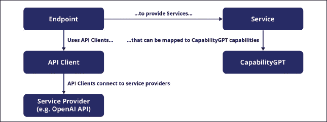
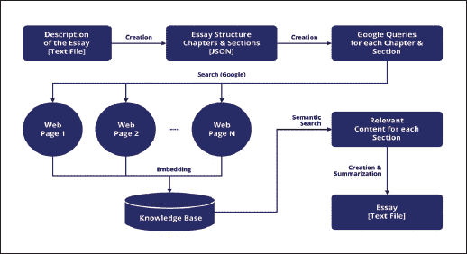

# 第九章：`predictive-powers:` Java 的 GPT 实现框架

# 介绍

在上一章中，我们探讨了 Python 的 GPT 实现框架`LangChain`。在本章中，我们将探讨`predictive-powers`，这是一个允许 Java 开发人员快速构建生成式人工智能¹解决方案的软件库。出于几个原因，理解这个库应该被视为至关重要。

首先，由于 Java 仍然是企业级应用程序开发的基石，通过这个库集成生成式人工智能功能显著扩大了您的 Java 应用程序可以实现的范围。想象一下自动化客户服务查询，生成动态内容，甚至构建智能数据分析工具，所有这些都在 Java 生态系统的舒适和熟悉中实现。

其次，该库提供的实现便利性使得普通用户可以访问先进的人工智能功能，这对经验丰富的 Java 开发人员和新手都非常吸引。如果您有兴趣利用 GPT 模型的强大功能，但发现人工智能领域令人生畏，本章将作为一个导航工具。

在快速比较 Java 和 Python 之后，本章将描述该库及其特性。

第一部分揭示了该库的关键特性。您将了解到诸如 API 客户端、端点和服务等基本概念，并提供示例以增进理解。

然后，我们开始展示通过一个名为‘Essay Writer’的自主代理来展示该库的实际实现。这个用例旨在说明该库的多功能性及其在现实任务中的应用，从而为您提供可应用于各种其他应用程序的可操作见解。

随后，本章深入探讨了实现 Essay Writer 所涉及的架构模式，提供了*第四章*中所呈现的内容的实例。每个部分都探讨了`predictive-powers`服务如何融入代理的架构，为您提供了构建类似应用程序的路线图。

最后，我们深入了解代码。这一部分将是必要的简洁，并且只会突出一些实现细节。请注意，虽然我们提供了代码片段作为上下文，但如果您有兴趣探索完整的注释代码，我们鼓励您访问`predictive-powers` GitHub 存储库[10]。虽然对 Java 语言有基本的了解确实可以促进对本章中所呈现的代码示例的更深入理解，但这并不是必需的。对 Java 不熟悉的读者仍然可以理解该库如何轻松应用于前几节讨论的概念。然而，建议读者对软件开发原则有基本了解，因为并非每个技术术语都会被深入定义。

# 结构

在本章中，我们将讨论以下主题：

+   快速比较 Java 和 Python 编程语言

+   `predictive-powers`库概述

+   理解基本概念：API 客户端、端点和服务

+   `predictive-powers`用例：实现‘Essay Writer’自主代理

+   ‘Essay Writer’架构

+   ‘Essay Writer’代码演示

# Java vs. Python

Python 和 Java 在技术领域各自占据重要地位，为不同的专业领域提供了独特的服务，为在各种应用中利用 GPT 打下了丰富的基础。

Python 以其简单性和可读性而闻名，已成为数据科学领域的基本工具。该语言的用户友好性，加上丰富的库存储库，使其成为数据分析和可视化的首选，这一特点与涉足数据科学和人工智能领域的专业人士相契合。

相比之下，Java 仍然是企业应用程序开发领域的支柱，以其稳定性、内置安全功能和显著的可扩展性而享有盛誉，以支持大型基础设施项目。其多功能性进一步延伸；Java 可以在企业服务器、桌面和尤其是 Android 智能手机等各种环境中无缝运行。这种广泛的适用性使其成为开发人员追求适应性和强大性能的首选。

通过展示 Python 和 Java 框架，本书旨在使开发人员从不同领域更加了解可用技术，以便在应用程序中实现 GPT 集成，从而为他们提供更加明智的方法。

# `predictive-powers`库

`predictive-powers`库旨在简化 Java 开发人员集成生成 AI 能力。作为 Apache-2.0 许可的资源，它在 GitHub 上免费提供。虽然本节提供了示例代码片段，但为了真正深入了解其广泛功能，我们鼓励访问`predictive-powers`GitHub 存储库以获取全面的代码和工作示例。

这些是`predictive-powers`库的关键特性：

+   它提供对 OpenAI 和 Hugging Face 托管推理 API 的低级访问。此功能使开发人员可以直接与这些 API 交互，如果他们选择的话。

+   该库为生成 AI 能力添加了一个抽象层，将它们与*第二章*中公开的 CapabilityGPT 框架对齐。这种设计决策确保与各种能力提供商的兼容性，减轻了供应商锁定的风险。正如我们将要说明的，该库使得在不同提供商之间切换变得微不足道，允许开发人员测试不同的提供商，并在新的语言模型可用时升级。

+   它托管了一个关键的内存向量数据库，对语义搜索²、信息提取和问题回答等能力至关重要。即将推出的版本将允许开发人员利用任何现有的向量数据库³。

+   该库包括方便地从各种来源（包括网页和各种格式的文件，如 MS Office、PDF、HTML 等）读取文本内容的方法。

# 基本组件

以下是您需要熟悉的主要组件的解释，以便使用`predictive-powers`库。这些也在*图 9.1*中描述，显示它们的相互关系：

**图 9.1：** `predictive-powers`库的基本组件及其关系

**API 客户端**

API 客户端是`predictive-powers`库的最底层组件，可直接调用服务提供商的 API。例如，开发人员可以选择通过`OpenAiClient`实例化直接访问 OpenAI API，并随后调用其方法。

API 客户端还提供对 API 密钥（用于服务访问）的安全访问以及临时服务器不可用情况的自动管理，例如请求洪水。

实质上，API 客户端为开发人员提供了直接 API 调用的自由，同时通过提供样板代码实现了强大而高效的开发。

考虑以下 API 客户端使用示例；该代码实例化了一个`OpenAiClient`，然后使用它执行一个非常简单的提示：

`import io.github.mzattera.predictivepowers.openai.client.OpenAiClient;`

`import io.github.mzattera.predictivepowers.openai.client.completions.CompletionsRequest;`

`import io.github.mzattera.predictivepowers.openai.client.completions.CompletionsResponse;`

`public class OpenAiClientExample {`

`public static void main(String[] args) {`

`// 从操作系统中检索 API 密钥`

`// 环境变量 OpenAiClient.OS_ENV_VAR_NAME`

`try (OpenAiClient client = new OpenAiClient()) {`

``// 完成一个句子；参考`

`// https://platform.openai.com/docs/api-reference/completions`

`// 详情`

`CompletionsRequest req = CompletionsRequest.builder()`

`.model(“text-davinci-003”)`

`.maxTokens(50)`

`.prompt(“Alan Turing was”)`

`.build();`

`CompletionsResponse resp = client.createCompletion(req);`

`// 输出结果`

`System.out.println(resp.getChoices().get(0).getText());`

``} // 关闭客户端`

`}`

`}`

这将生成以下输出：

`一位英国数学家、计算机科学家、逻辑学家、密码分析家、哲学家和理论生物学家，对理论计算机科学和人工智能的发展产生了深远的影响。`

**端点和服务**

端点是一个能力提供者，意味着它使用 API 客户端以服务的形式呈现不同的能力。

以下代码说明了创建`AiEndpoint`的过程，该端点提供对生成 AI 功能的访问，包括 OpenAI 和 Hugging Face 提供商⁴：

`// 构建 Hugging Face 端点。`

`// API 密钥从操作系统环境中检索。`

`AiEndpoint endpoint = new HuggingFaceEndpoint();`

`// 从现有 API 客户端构建 OpenAI 端点`

`OpenAiClient cli = new OpenAiClient();`

`AiEndpoint endpoint = new OpenAiEndpoint(cli);`

一旦创建了端点，它就可以访问服务。这些是高级生成 AI 功能，类似于 CapabilityGPT 框架中描述的那些。当前的服务包括：

+   `**ModelService**`：提供对模型元数据的访问，例如模型列表、模型上下文大小等。

+   `**CompletionService**`：通过执行提供的文本提示来执行文本完成。这是最灵活的服务，因为我们可以通过提供正确的提示来指示它执行不同的任务，如*第五章*中所讨论的那样。通过适当的指示，该服务可以提供**评估**、**分类**、**创作**、**信息提取**、**撮合**、**摘要**、**转换**等功能。

+   `**ChatService**`：处理用户和代理之间的对话，管理代理的个性和对话历史。这将对应于**通信**功能。还要注意，`ChatService`可以提供`CompletionService`公开的所有功能，因为提示执行可以被视为与用户进行单次交换的对话，用户通过提供提示开始对话，代理对其做出响应，从而执行它。

+   `**EmbeddingService**`：提供文本嵌入和相似性计算功能，这对于 CapabilityGPT 框架中的**语义搜索**功能至关重要。

+   `**QuestionAnsweringService**`：通过使用用户提供的上下文来直接映射到 CapabilityGPT 框架中的**问答**功能来回答问题。

+   `**QuestionExtractionService**`：从文本中提取不同类型的问题（例如，判断题、多项选择测验等）。这是**信息提取**功能的一个例子。

+   `**ImageGenerationService**`：使用 OpenAI（DALL-E 3⁵）或 Hugging Face（Openjourney⁶）生成图像。这是**创作**功能的另一个例子。

+   `**SearchService**`：在互联网上搜索数据。这是一个可以作为代理的构建块使用的外部工具的例子⁷。

以下示例展示了使用`CompletionService`完成句子的用法。创建端点后，代码从中获取了一个`CompletionService`的实例，用于完成一个简单的提示。请注意，服务抽象允许使用一行代码修改来更改服务提供者（OpenAI 或 Hugging Face）：

`import io.github.mzattera.predictivepowers.AiEndpoint;`

`import io.github.mzattera.predictivepowers.huggingface.endpoint.HuggingFaceEndpoint;`

`import io.github.mzattera.predictivepowers.openai.endpoint.OpenAiEndpoint;`

`import io.github.mzattera.predictivepowers.services.CompletionService;`

`public class CompletionExample {`

`public static void main(String[] args) throws Exception {`

`// Uncomment the below to use OpenAI`

`AiEndpoint endpoint = new OpenAiEndpoint();`

`// Uncomment the below to use Hugging Face`

`// AiEndpoint endpoint = new HuggingFaceEndpoint();`

`try (endpoint) {`

`CompletionService cs = endpoint.getCompletionService();`

`System.out.println(cs.complete(“Alan Turing was”).getText());`

`}`

`}`

`}`

**Knowledge Base**

在`predictive-powers`库的上下文中，知识库是一个内存中的向量数据库，其中包含文本嵌入⁸。每个嵌入可以具有作为`Map`封装的属性数组。知识库提供了基于嵌入相似性和其他过滤条件的语义搜索方法。它可以分区为域，以允许单独搜索并优化性能。

# `predictive-powers` Use Case

在本节中，我们将指导您实现一个名为“Essay Writer”（简称“***Writer***”）的自主代理，其目标是撰写关于不同主题的文章。Writer 旨在接收文章内容的简短文本描述，搜索互联网上的相关信息，下载和整理它，生成完整的文章。

我们将提供代码片段来演示如何利用 CapabilityGPT 框架的功能来构建代理。有关代理的完整代码，您可以参考`predictive-powers` GitHub 存储库。

**Architecture**

本节详细解释了实现 Writer 所采用的架构，使用了应该在*Chapter 4](c04.xhtml)*⁹中熟悉的三层方法。该架构旨在具有可扩展性，使其能够处理更复杂的情况。但是，基本的分层方法将保持一致，利用`predictive-powers`服务来为应用程序和 AI 层创建模块化架构。

![**Figure 9.2:** Essay Writer – Architecture**User Experience Layer**在我们的示例中，为了保持简单，用户将仅通过计算机控制台与 Writer 进行交互。可以使用各种命令行选项启动 Writer 以执行文章写作任务中的不同步骤（有关详细信息，请参阅完整的应用程序代码）。生成的输出将包括可以使用任何文本文件查看器检查的 JSON¹⁰和纯文本文件。**Application Layer**在应用层，编排代理通过执行相应的应用流程并正确协调不同的`predictive-powers`服务来响应用户命令。本章后面，我们将深入介绍这些应用流程的详细描述。此外，还有一个信息检索组件。它负责在互联网上搜索相关内容，这些内容将用于创建文章：+   `**SearchService**`: `SearchService`根据`ChatService`生成的查询执行网络搜索。它返回相关网页的链接列表，供编排代理下载和利用。+   `**GoogleEndpoint**`：该组件促进了与谷歌自定义搜索 JSON API 的集成，以增强`SearchService`的功能。它允许用户创建定制搜索引擎，以谷歌强大的搜索能力为基础。然后可以将该端点指向这些引擎。它赋予用户构建强大搜索工具的能力，能够限制搜索到特定网站，过滤成人内容，将搜索限制在特定地区等。**AI 层**AI 层是 CapabilityGPT 功能的实现和公开的`predictive-powers`服务。在这里，端点连接到相关的服务提供商，执行编排代理所需的任务。+   `**ChatService**`：该服务将提供构建论文结构所需的创建能力。它将从其草稿描述开始，创建搜索查询，从网络中搜索相关材料，并通过总结和重写从互联网收集的知识来撰写论文的每个部分。+   `**EmbeddingService**`：该服务用于嵌入从互联网下载的内容，使其能够存储在知识库中以支持语义搜索。+   `**OpenAiEndpoint**`：该端点连接到所需的 OpenAI 模型¹¹。+   `**KnowledgeBase**`：这提供了一个内存向量数据库，用于存储下载的内容，并在需要时检索它，以撰写论文的不同部分。此外，`KnowledgeBase`可以作为单个文件持久化在用户的个人电脑上，允许用户重新生成论文，而无需重新下载相关网页。重要的是要指出，两个层的服务都独立于端点和知识库的使用。这种抽象确保应用层与每个服务提供商提供的具体实现保持解耦。在开发过程中，这意味着软件工程师可以轻松测试不同的服务提供商和语言模型，以决定哪一个更适合正在构建的解决方案。**工作流程**如*图 9.3*所示的工作流程图，说明了将用户的论文草稿转化为作者生成的最终论文所涉及的步骤：1.  用户提供论文内容的文本描述。1.  作者生成论文结构（章节和部分）作为 JSON 文件。1.  作者生成谷歌查询，以搜索适合填充论文每个部分的信息。1.  作者然后执行每个查询，并编制由谷歌搜索引擎返回的相关网页链接列表。1.  作者下载每个链接的内容并创建相应的嵌入，这些嵌入存储在`KnowledgeBase`中。1.  对于论文的每个部分，作者使用语义搜索从知识库中检索相关信息。1.  最后，作者使用这些信息来生成论文的每个部分，从而产生单个文本文件输出。

**图 9.3**：论文作者-工作流程

让我们详细研究每个步骤，并探索 CapabilityGPT 框架在每个阶段使用的能力。

该过程始于用户提供论文的文本描述，如下所示：

`写一篇关于意大利帕多瓦市的论文。`

`第一章描述了这座城市的地理和人口统计情况，经济状况，以及从原始历史到现代的历史。`

`此外，还有一个章节介绍了生活在帕多瓦的名人。`

`第二章侧重于传统和民间传说，包括传统活动和节日，食品和葡萄酒，以及其他相关主题。`

`最后一章是一个显著景点的集合，每个景点都有单独的部分，描述了有趣的地方和游客的经历。`

需要注意的是，作者将论文视为由章节组成的结构。尽管更复杂的结构是可能的，但为简单起见，我们将专注于这种格式。论文结构最初是使用 ChatGPT 生成能力生成的，根据提供的描述创建章节和部分。生成的结构以 JSON 格式保存以供进一步处理。以下是一个示例结构：

{

“title”: “我的论文”,

“description”: “写一篇关于意大利帕多瓦市的论文。\r\n 第一章描述了城市的地理和人口统计信息，其经济状况，以及从原始历史到现代的历史。\r\n 此外，还有一个关于居住在帕多瓦的名人的部分。\r\n 第二章重点介绍传统和民间故事，包括传统活动和节日、食品和葡萄酒等相关主题。\r\n 最后一章是著名景点的集合，每个景点都有单独的部分，描述了有趣的地方和游客的体验。\r\n”,

“chapters”: [

{

“id”: “1”,

“title”: “地理和人口统计”,

“summary”: “本章概述了帕多瓦市的地理和人口统计信息。它探讨了城市的位置、气候和自然特征。此外，它深入研究了人口统计信息，包括种族构成、年龄分布和人口随时间的增长。”,

“sections”: [

{

“id”: “1.1”,

“title”: “经济学”,

“summary”: “本部分探讨了帕多瓦的经济方面，包括其主要产业、贸易和经济发展。它突出了城市作为经济中心的地位，并讨论了推动其经济的关键部门。”

…

},

{

“id”: “1.2”,

“title”: “历史”,

“summary”: “本部分追溯了帕多瓦从原始历史起源到现代的历史。它涵盖了塑造城市身份的重要历史事件、统治者和文化发展。”

…

},

…

]

},

…

]

}

注意 ChatGPT 如何增强了每个部分的描述，提供了更详细的内容摘要。在“著名景点”部分，有趣的地方会自动添加，无需事先列出，这要归功于 ChatGPT 的能力。

“id” : “3”,

“title” : “著名景点”,

“summary” : “本章是帕多瓦著名景点的指南，重点介绍了城市的建筑、历史和文化地标。每个部分都专注于一个特定的景点，提供了详细的描述并捕捉了游客的体验。”,

“sections” : [

“id” : “3.1”,

“title” : “圣安东尼教堂”,

…

}, {

“id” : “3.2”,

“title” : “Prato della Valle”,

…

}, {

“id” : “3.3”,

“title” : “雷焦内宫”,

…

}, {

“id” : “3.4”,

“title” : “斯科罗韦尼小教堂”,

…

} ],

With the essay structure in place, the Writer needs to populate it with relevant information. Instead of relying solely on the model’s implicit knowledge, we want to fetch updated and relevant information from the Internet. To accomplish this, we generate Google searches for each section using ChatGPT text generation capabilities. This generates a short list of Google queries for each section.

The next step involves leveraging a different capability of our framework: **Search**. The Essay Writer uses these generated Google queries to query the search engine and collect a list of relevant web page links.

一旦我们确定了相关的网页，它们就会被下载并存储在数据库中以进行语义搜索。语义搜索将允许 Writer 在数据库中搜索与给定部分摘要在语义上相似的文本，从而检索与编译该部分文章相关的文档。为了启用语义搜索，下载的页面以一种特殊的方式编码，称为‘嵌入’；这种编码为文本提供了 AI 更容易处理的数值表示。

`predictive-powers`库提供了高级方法来下载网页内容、执行嵌入并将数据存储在内存数据库（`KnowledgeBase`）中，该数据库作为库的一部分可用。

在下载、嵌入和存储相关网页之后，Writer 使用语义搜索来获取与文章各部分相关的内容。这些上下文片段，称为每个部分的‘上下文’，作为生成各部分实际内容的基础。ChatGPT 利用其**摘要**和**生成**能力根据提供的上下文创建部分内容。

通过遵循这个工作流程，Writer 自主生成了一篇文章，其中包含来自网络的最新信息，产生了全面且经过深入研究的最终输出。

# 代码演示

在本节中，我们阐明了在前几节中概述的应用程序的工作流程，提供了代码片段来演示如何执行各种任务。如果您希望深入了解 Writer 的完整代码，它始终可以在`predictive-powers` GitHub 存储库中访问。

在展示应用程序代码的同时，我们有机会列出一些使用的提示。我们鼓励读者尝试根据*第五章*中的指南编写自己的提示，并查看 Writer 的技能是否有所提高。

请注意，为了提高效率，Writer 是一个多线程应用程序。方法`parallelExecution()`管理多个任务的同时执行，将它们的所有结果编译成一个`List`。在本章中，我们将展示用于各种任务的代码片段，但不会过多关注多任务处理所需的结构。

`Essay`类是 Writer 使用的内部类，用于维护文章的结构。它提供了几种方法，以有组织的方式方便地获取其格式良好的内容。Writer 在其`essay`字段中包含`Essay`的一个实例；随着程序的执行，该实例逐渐被数据填充。

应用程序工作流程的编排发生在类的`main()`方法中。在这里，用户输入被处理，并执行所需的任务。简而言之，`main()`方法实现了我们架构中显示的‘编排代理’组件。

工作流程中的第一个任务是读取用户提供的草稿并建立文章的结构。为了方便处理，结构被保存为 JSON 文件。以下代码片段演示了如何完成此任务。它假设文章草稿已经存储在`essay.description`中（这在此时`main()`方法已经执行过了）。请注意代码如何利用 GPT 返回数据的能力以各种格式，本例中是 JSON。专门处理 JSON 序列化的 Java 库使我们能够轻松地将返回的数据转换为一个`Essay`实例，只需一行代码：

`public void createStructure() throws JsonProcessingException {`

`String description = essay.description;`

`[…]`

`// 实例化一个服务来创建文章结构`

`OpenAiChatService chatSvc = openAi.getChatService();`

`chatSvc.setModel(COMPLETION_MODEL);`

`chatSvc.setTemperature(40.0);`

`// 设置代理人个性，指示它返回 JSON`

`// and provide one example`

chatSvc.setPersonality（

“您是一名助手，正在帮助作家创建文章的结构。文章结构由一系列章节组成，每个章节包含一系列部分。始终使用此 JSON 格式返回结构；以下是格式的示例：

+“\n”

+“{\n”

+“\”章节\”：[{\n”

+“\”title\”：\”第一章的标题\”，\n”

+“\”summary\”：\”第一章的摘要。\”，\n”

+“\”部分\”：[{\n”

+“\”title\”：\”第一章的第一节标题\”，\n”

+“\”summary\”：\”本节摘要\”\n”

+“}，{\n”

+“\”title\”：\”第一章的第二节标题\”，\n”

+“\”summary\”：\”本节摘要\”\n”

+“}]\n”

+“}，{\n”

+“\”title\”：\”第二章的标题\”，\n”

+“\”summary\”：\”第二章的摘要。\”，\n”

+“\”部分\”：[{\n”

+“\”title\”：\”第二章的第一节标题\”，\n”

+“\”summary\”：\”本节摘要\”\n”

+“}，{\n”

+“\”title\”：\”第二章的第二节标题\”，\n”

+“\”summary\”：\”本节摘要\”\n”

+“}]\n”

+“}]\n”

+“}\n”

+“\n”

+“确保各节不嵌套在其他节内。标题不应包括节编号或单词‘章’或‘节’。”

//调用代理创建结构，

//使用描述中的草稿

TextCompletion resp = chatSvc.complete（

“您的任务是根据提供的描述创建一本书的结构。该书应包括几个章节，每个章节包含一个标题，一个摘要和一个部分列表。每个部分应包括一个标题和一个摘要。确保各节不嵌套在彼此内。

+“\n”

+“如果可能，尝试使章节和部分的摘要至少 100 个字长，以提供书纲的实质内容。

+“\n”

+“逐步考虑并列出所有章节及其包含的部分。使用 JSON 格式返回结果。

+“\n”

+“用户描述：”+描述

）;

//将返回的 JSON 转换为文章

//然后将其复制到本地实例中。

Essay created = JSON_MAPPER.readValue（resp.getText（），Essay.class）;

essay.chapters = new ArrayList<>(created.chapters);

[…]

}

在创建结构之后，从互联网上获取撰写文章所需的相关数据。以下代码片段返回一个 SearchResult 实例（指向网页的链接）列表，这些内容可以用来撰写给定的部分。这些链接以 Pair 结构返回，以及它们在 Google 中确定的相应排名。

这段代码还说明了库的另一个特性：创建提示模板的能力，这些模板是参数化的提示。在模板中，通过双大括号将提示参数括起来。在运行时，这些占位符将被传递给 CompletionService.fillSlots（）方法的 Map 中具有相同键的值替换。例如，在以下代码中，“{{chapter_summary}}”字符串将被 params Map 中“chapter_summary”键关联的值替换：

public List<Pair<SearchResult, Integer>>

谷歌（章节章节，部分部分）

{

//首先创建一个搜索查询列表，

//基于我们想要搜索的内容

//实例化模型以创建谷歌搜索

OpenAiChatService chatSvc = openAi.getChatService（）;

chatSvc.setModel（COMPLETION_MODEL）;

chatSvc.setTemperature（50.0）;

//动态构建提示

最终的提示字符串=

“鉴于下面的章节摘要，部分标题和部分摘要，以 XML 标记提供，生成可用于在互联网上搜索与该部分对应的主题的搜索引擎查询列表。”

+“每个查询都是一个简短的句子或与该部分主题相关的关键词的简短列表。”

`+ “ 包括术语，以便为主题提供上下文，如章节摘要所述，以便查询与章节内容明确相关。”`

`+ “ 创造性地提供确切的 5 个查询。”`

`+ “ 严格按照 JSON 字符串数组的形式提供结果。\n\n”`

`+ “<chapter_summary>{{chapter_summary}}</chapter_summary>\n\n”`

`+ “<section_title>{{section_title}}</section_title>\n\n”`

`+ “<section_summary>{{section_summary}}</section_summary>”;`

`// 提供数据以填充提示模板中的插槽`

`Map<String, String> params = new HashMap<>();`

`params.put(“chapter_summary”, chapter.summary);`

`params.put(“section_title”, section.title);`

`params.put(“section_summary”, section.summary);`

`// 准备对话；`

`// 注意在提示模板中填充插槽的调用`

`List<ChatMessage> msgs = new ArrayList<>();`

`msgs.add(new ChatMessage(`

`Role.SYSTEM,`

`“您是一名助手，帮助研究人员找到与他们正在撰写的文章部分相关的网页。”`

`));`

`msgs.add(new ChatMessage(`

`Role.USER, CompletionService.fillSlots(prompt, params)`

`));`

`// 为该部分构建 Google 查询列表。`

`// 查询作为 JSON 字符串列表返回，进行反序列化。`

`List<String> queries;`

`while (true) {`

`try {`

`queries = JSON_MAPPER.readValue(chatSvc.complete(msgs).getText(),`

`new TypeReference<List<String>>() {});`

`break;`

`} catch (JsonProcessingException e) {`

`// 重试以防 GPT 返回格式不正确的 JSON`

`LOG.warn(“因为 JSON 格式错误而重试，e);`

`}`

`}`

`// 现在提交每个查询并收集返回的链接`

`List<Pair<SearchResult, Integer>> result = new ArrayList<>();`

`for (String query : queries) {`

`List<SearchResult> links;`

`try {`

`links = google.getSearchService()`

`.search(query, LINKS_PER_QUERY);`

`} catch (Exception e) {`

`// 跳过失败的单个查询`

`LOG.warn(“忽略搜索错误: “ + query, e);`

`continue;`

`}`

[…]`

`}`

`return result;`

`}`

一旦写手有要下载的页面列表，它就会继续并检索它们，提供相应的嵌入。根据页面的大小，这可能会导致多个项目。`ExtractionUtil.fromUrl()`方法是一个方便的一行代码，用于直接从 URL 获取文本内容。

读者还应该注意我们如何使用`ModelService`来获取一些模型元数据，比如它接受的最大标记数。

在 Java 中，这个过程看起来像这样：

`private List<EmbeddedText> download(SearchResult link) {`

`// 实例化用于嵌入下载页面的服务`

`EmbeddingService embSvc = openAi.getEmbeddingService();`

`// 设置每个嵌入文本块的最大大小；`

`// 以下计算确保大约有 15 个嵌入`

`// 将用于组成每个部分。`

`// 注意 ModelService 是如何从 OpenAIEndpoint（openAI）中获取的`

`// 用于检索完成模型和`

`// 嵌入模型。`

`int writerSize = openAi.getModelService().getContextSize(WRITER_MODEL);`

`int embSize = openAi.getModelService().getContextSize(embSvc.getModel());`

`embSvc.setMaxTextTokens(`

`Math.min(embSize, (writerSize - SECTION_LENGTH_TOKENS) / 15)    );`

``// 将页面内容作为字符串下载`

`String content = null;`

`try {`

`content = ExtractionUtil.fromUrl(`

`link.getLink(), DOWNLOAD_TIMEOUT_MILLIS));`

`} catch (Exception e) {`

`// 如果在下载页面过程中发生错误，则跳过该页面`

`LOG.error(“下载错误 “ + link.getLink(), e);`

`return new ArrayList<>();`

`}`

`// 嵌入下载的内容`

`List<EmbeddedText> result = embSvc.embed(content);`

[…]`

`return result;`

`}`

成功完成后，嵌入将存储在知识库中，为写作过程的开始铺平道路。以下代码片段概述了如何编写单个部分。

通过检查代码，读者可以看到`KnowledgeBase`中的`search()`方法是如何使用的，通过传递部分摘要的嵌入版本来执行语义搜索：

`private List<Section> write(Section section) {`

`//实例化服务`

`EmbeddingService embSvc = openAi.getEmbeddingService();`

`OpenAiChatService chatSvc = openAi.getChatService();`

`chatSvc.setModel(WRITER_MODEL);`

`chatSvc.setTemperature(0.0);`

`String prompt =`

`“<context>{{context}}</context>\n\n”`

`+“
{{summary}}
”;`

`Map<String, String> params = new HashMap<>();`

`params.put(“summary”, section.summary);`

`//这是用于创建部分的提示`

`List<ChatMessage> msgs = new ArrayList<>();`

`msgs.add(new ChatMessage(Role.SYSTEM,`

`“您将获得一个上下文和一篇文章部分摘要，两者都由 XML 标记限定。”`

`+“您的任务是使用上下文的内容来撰写文章的整个部分。”`

`+“使用专业风格。”+“避免内容重复，但要详细。”`

`+“仅输出部分内容，而不是标题，不要创建子部分。”`

`+“不要编造缺失的信息或为没有的数据放置占位符。”`

`+“只有在内容中有足够的信息时，才产生至少一个文本”`

`+ SECTION_LENGTH_TOKENS +“令牌长。\n\n”));`

`[…]`

`//搜索知识库以获取相关内容//（=构建上下文）`

`List<Pair<EmbeddedText, Double>> knowledge = kb.search(embSvc.embed(section.summary).get(0), 50, 0);`

`//这里需要一些代码来仅获取`

`//适合模型提示大小的上下文。`

`//出于简单起见，它被省略了。`

`[…]`

`// 将生成的内容添加到部分`

`section.content = chatSvc.complete(msgs).getText();`

`[…]`

`return section.sections; //实际上没有使用`

`}`

# 结论

本章介绍了`predictive-powers`库及其利用 Java 开发人员的生成 AI 能力的能力。重点是提供一种真实生活的方法来利用生成 AI 能力。

`predictive-powers`库为 Java 开发人员和 AI 爱好者提供了独特的优势。它不仅简化了生成 AI 能力的集成，还提供了对 OpenAI 和 Hugging Face 等流行 API 的低级访问权限。这种灵活性允许开发人员在需要时直接与这些 API 进行交互。此外，该库的设计与 CapabilityGPT 框架保持一致，确保与不同的能力提供者兼容，降低了供应商锁定的风险。此外，其内存向量数据库支持语义搜索、信息提取和问题回答等重要功能。最后，它便于从各种来源检索文本内容，包括网页和各种文件格式，如 MS Office、PDF 和 HTML。这些功能使`predictive-powers`库成为在 Java 应用程序中利用生成 AI 能力的有价值工具，同时利用了 Java 应用程序的灵活性、兼容性和易用性。

我们深入研究了该库的技术方面，详细介绍了 API 客户端、端点和服务以及知识库等基本概念。我们了解了它们在更广泛框架内的角色和功能，并深入了解了它们的基本机制。

本章的亮点之一是一个实际的例子：创建了一个名为“Essay Writer”的自主代理。这作为一个具体的例子，展示了如何在一个现实项目中利用`predictive-powers`库及其不同的特性。

# 要点

在本章结束时，读者应该熟悉：

+   **The** `**predictive-powers**` **library**: 一个 Apache-2.0 许可的库，为 Java 开发人员提供了一个简化但强大的界面，以利用生成 AI。

+   **API 客户端**：`predictive-powers`库的基本单元，用于直接调用 OpenAI 和 Hugging Face 等服务提供商的 API。

+   **端点和服务**：利用 API 客户端提供服务的高级生成式人工智能组件。读者应该了解提供的服务，比如`ModelService`、`CompletionService`、`ChatService`、`EmbeddingService`等。

+   `**知识库**`：对于语义搜索、信息提取和问题回答等能力至关重要的内存中向量数据库。

+   **自主代理的实现**：本章指导读者创建一个“论文写作机”，演示所学概念的实际应用。它展示了如何轻松组合库组件，利用 CapabilityGPT 框架、提示工程技术和本书其他部分介绍的架构模式，创建能够执行复杂任务的代理。

+   **架构模式**：理解架构模式并导航代码是学习过程的关键部分。读者应熟悉三层架构：用户体验层、应用层和人工智能层，并了解如何使用`predictive-powers`库中的组件来实现这些层。

+   **代码导航**：理解代码片段及其工作原理，可以帮助读者将这些概念应用到自己的项目中。

____________________

¹ ***生成式人工智能*** 指的是人工智能的一个分支，专门用于生成新内容，可以是文本、图像、音频和视频，利用从现有数据源中获取的模式和信息。OpenAI 的 GPT 系列是这种人工智能的一个显著代表。在本章中，“生成式人工智能”这个术语将比“GPT”更频繁地使用，以保持对更广泛技术类别的关注，强调`predictive-powers`库的多功能性，该库不仅限于专门使用 GPT。

² 正如在*第八章：LangChain：Python 的 GPT 实现框架*中已经提到的，文本***嵌入***是文本的数值表示，使机器能够理解和处理自然语言。它们将单词或短语转换为一系列数字，具有语义相似性的项目具有相似的值。在***语义搜索***中，这使系统能够基于语义相似性而不仅仅是关键词匹配来匹配用户的查询和相关文档。通过使用文本嵌入，系统可以理解微妙的含义，并提高搜索结果的相关性，提供更高效和有效的搜索体验。

³ 内存中向量数据库利用系统内存（RAM）存储数据，这提供了极快的数据检索和处理优势。然而，这也带来了与 RAM 大小相关的限制，使其不太适合处理极大的数据集。

⁴ 正如我们将在后面看到的，还有其他端点，提供不同的功能，比如`SearchEndpoint`，它公开了访问网络搜索服务的方法。

⁵ [`openai.com/dall-e-3`](https://openai.com/dall-e-3)

⁶ [`openjourney.art/`](https://openjourney.art/)

⁷ 参见*第四章：GPT 模型支持的架构模式*，特别是“B 与外部工具集成的对话模式”部分。

⁸ 知识库类似于 LangChain 中的向量存储。参见*第八章：LangChain：Python 的 GPT 实现框架*。

⁹ 请参考*第四章：GPT 模型支持的架构模式*，并将此架构与“D2 Orchestration Agent”架构模式进行比较。

¹⁰ JSON，全称 JavaScript 对象表示法，是一种用于以有组织、易于访问的方式存储信息的方法。简而言之，它为我们提供了一个文本人类可读的数据集合，我们可以以逻辑方式访问。它被广泛应用于许多数字服务和产品中，以帮助系统和服务器高效快速地共享数据。即使它的名称包含“JavaScript”，它也可以在 JavaScript 之外的许多编程环境中使用。

¹¹ [`platform.openai.com/docs/models`](https://platform.openai.com/docs/models)（具体来说，用于聊天服务的 gpt-3.5-turbo 和用于嵌入的 text-embedding-ada-002）。
