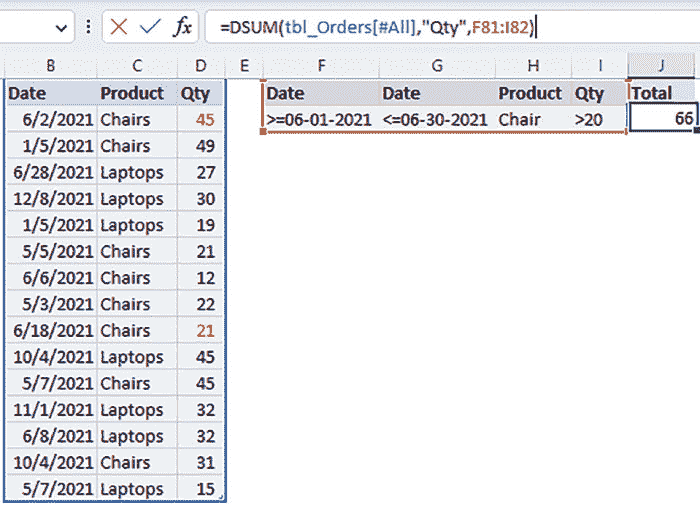
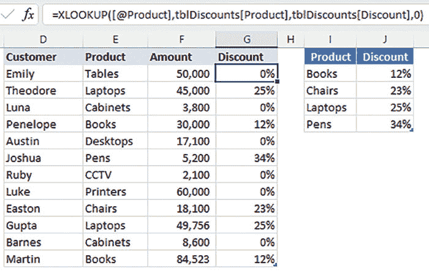

# （一）

# 序言

在不断发展的数据管理和分析领域中，掌握 Excel 的查找功能不仅是一种技能，更是高效数据处理的基石。《**使用 Power Query 和 ChatGPT 的终极 Excel**》不仅仅是一本书；它是为数据爱好者、Excel 爱好者以及希望充分利用 Excel 查找功能潜力的任何人而设计的指南。

本书通过 Excel 的查找功能展开了一场变革性的旅程，从传统方法到定义当前数据管理时代的开创性技术。每一章都展示了一个新的维度，揭示了谬误，揭开了复杂性，介绍了嵌套函数，并提供了实际数据查找困境的解决方案。

每章结束时，你不仅会掌握重点查找功能，还会学习许多其他嵌套函数，扩展你对 Excel 的知识。

本书分为九章。它们将涵盖从 Excel 基础知识和基本查找功能到在 Excel 中使用人工智能的高级用法。具体内容如下。

**第一章**：本章将介绍 Excel 的基础知识。你将了解为什么需要发展 Excel 技能以及掌握这些技能的一般步骤。我们将探索 Excel 公式和函数的世界，包括嵌套或组合函数。此外，我们还将介绍 Excel 单元格引用的基础知识和使用 Excel 表格。

**第二章**：本章将介绍 Excel 中最常用的查找函数 — VLOOKUP。它将突出其挑战，并通过展示如何嵌套其他函数来克服 VLOOKUP 默认设置的挑战，提供解决方法。

**第三章**：本章将介绍 Excel 用户普遍认为是一种查找函数的函数组合 — INDEX 和 MATCH。我们将探讨这两个函数的工作原理以及它们的组合是第二种最广泛使用的查找数据方法。之后，我们将研究这种组合在何种情况下优于 VLOOKUP 函数。

**第四章**：LOOKUP 函数与 Excel 本身一样古老。自 1985 年以来一直存在。与其后继者 VLOOKUP 不同，LOOKUP 函数有一个独特的特点 — 它可以处理数组。本章将调查其在 35 年后的实用性，特别是在它是更好选择的领域。

**第五章**：除了 Excel 分类为查找函数的内容外，在 Excel 中还有不同的查找数据的方法。本章探讨了可以用来查找数据的不同方法和函数。我们将学习一些很少讨论的方法，例如使用 Excel 交集、高级筛选、数据库函数以及使用数据透视表。

**第六章**：XLOOKUP 于 2019 年发布，是任何函数中最受瞩目的发布。它被称为 Excel 中最强大的查找函数。本章将研究 XLOOKUP 可能成为首选查找函数的场景。

**第七章**：虽然没有像 XLOOKUP 那样受到广泛关注，但 FILTER 函数弥补了以前查找函数的所有缺点。本章将探讨 FILTER 是终极查找函数的领域。我们还将看看它的缺点以及如何解决。

**第八章**：Power Query 被誉为 Excel 的终极数据提取、加载和转换插件，但它也可以用于查找数据。本章将探讨如何使用 Power Query 创建解决方案，适用于那些害怕调整函数的初学者。

**第九章**：本章将讨论如何将人工智能（AI）融入到 Excel 中解决查找问题。我们将探讨诸如 ChatGPT 是什么以及如何充分利用它的话题。通过本章结束时，您将能够理解如何促使和利用 ChatGPT 进行准确和个性化的回应。

# 下载代码

捆绑包和彩色图片

请点击链接下载

该书的**代码捆绑包**：

# [`github.com/ava-orange-education/Ultimate-Excel-with-Power-Query-and-ChatGPT`](https://github.com/ava-orange-education/Ultimate-Excel-with-Power-Query-and-ChatGPT)

该书的代码捆绑包和图片也托管在

**[*https://rebrand.ly/zlukuby*](https://rebrand.ly/zlukuby)**

如果代码有更新，将在现有的 GitHub 存储库上进行更新。

# 勘误

我们为**橙色教育私人有限公司**的工作感到无比自豪，并遵循最佳实践，以确保内容的准确性，为我们的订阅者提供愉快的阅读体验。我们的读者是我们的镜子，我们利用他们的反馈来反思和改进出版过程中可能发生的任何人为错误。为了让我们保持质量，并帮助我们接触到由于任何意外错误而遇到困难的读者，请写信给我们：

**errata@orangeava.com**

感谢您的支持、建议和反馈。

# 你知道吗

您知道橙色教育私人有限公司提供每本出版书籍的电子书版本吗，提供 PDF 和 ePub 文件？您可以升级到电子书版本：[**www.orangeava.com**](http://www.orangeava.com)，作为印刷书籍客户，您有资格获得电子书折扣。请通过**info@orangeava.com**与我们联系以获取更多详细信息。

在**[www.orangeava.com](http://www.orangeava.com)**，您还可以阅读一系列免费的技术文章，订阅各种免费的新闻简报，并获得 AVA™图书和电子书的独家折扣和优惠。

# 盗版

如果您在互联网上发现我们作品的任何非法副本，请提供地址或网站名称给我们，我们将不胜感激。请通过**info@orangeava.com**与我们联系，并附上材料链接。

# 您有兴趣与我们合作撰写吗？

如果您在某个领域有专业知识，并且有兴趣撰写或为一本书作出贡献，请写信给我们：**business@orangeava.com**。我们正在努力帮助开发人员和技术专业人士深入了解全球正在发生的技术进步和创新，并建立一个相信知识最好通过与他人分享和学习获得的社区。请与我们联系，了解我们的受众需求以及您如何成为这一教育改革的一部分。我们也欢迎技术专家的想法，并帮助他们为自己的领域构建学习和发展内容。

# 评论

请留下您的评论。一旦您阅读并使用了这本书，为什么不在购买它的网站上留下一条评论呢？潜在的读者可以看到并使用您的客观意见来做出购买决定。我们在 Orange Education 非常乐意知道您对我们产品的看法，我们的作者可以从您的反馈中学习。谢谢！

欲了解更多关于 Orange Education 的信息，请访问**[www.orangeava.com](http://www.orangeava.com)**。

# 目录

1\. Excel 环境

介绍

结构

学习 Excel 的原因

如何精通 Excel

步骤 1：热爱错误

步骤 2：掌握基础知识

步骤 3：渐进性过载

步骤 4：学会将问题分解为小块

步骤 5：教授

步骤 6：参与 Excel 论坛

步骤 7：每日有意识地学习

介绍 Excel 公式和函数

嵌套函数：当一个不够时

解决嵌套函数中的复杂性

嵌套函数规则

介绍 Excel 单元格引用

单元格引用类型

介绍 Excel 表格

具有查找技能的重要性

查找函数分类

结论

问题

2\. VLOOKUP 已死：还是吗？

介绍

结构

VLOOKUP 精确和近似匹配

VLOOKUP 近似匹配

打破 VLOOKUP 的神话

神话 1：VLOOKUP 无法进行左查找

神话 2：VLOOKUP 无法在查找中返回多列

神话 3：VLOOKUP 无法在查找中使用多个条件

神话 4：VLOOKUP 无法处理查找范围中的列的插入和删除

神话 5：VLOOKUP 无法进行双向查找

神话 6：VLOOKUP 无法进行部分匹配查找

神话 7：VLOOKUP 无法进行区分大小写的部分匹配查找

神话 8：VLOOKUP 无法进行区分大小写查找

神话 9：VLOOKUP 无法返回多个结果

神话 10：VLOOKUP 无法从后往前查找

神话 11：VLOOKUP 无法查找前 N 个或后 N 个值

神话 12：VLOOKUP 无法进行反向查找

神话 13：VLOOKUP 无法进行水平查找

神话 14：VLOOKUP 无法返回多个非连续列

神话 15：VLOOKUP 无法查找多个非连续数组

结论

需要记住的要点

3\. INDEX 和 MATCH

介绍

结构

INDEX、MATCH 和双向查找

三向查找

反向查找单个结果

反向查找多个结果

多条件查找

返回多列

水平���找

查找非连续数组

使用通配符进行查找

基于文本长度的查找

在列表中查找项目

查找唯一值

查找底部 n 个值

结论

需要记住的要点

4\. LOOKUP

介绍

结构

使用条件查找最后匹配项

查找最后一个空单元格

查找最后一个负数或文本

在数组中查找近似匹配

查找最重复的项目

结论

需要记住的要点

多项选择题

答案

5\. 其他查找方法和函数

介绍

结构

使用高级筛选查找列表中/不在列表中的项目

使用 Excel 交集运算符进行双向查找

使用数据库函数查找数值数据

使用 SUMIFS、SUMPRODUCT、AGGREGATE 和 MAX 函数查找数值数据

查找图片

查找单元格地址

使用数据透视表查找列表中的唯一项目

结论

需要记住的要点

6\. XLOOKUP

介绍

结构

默认精确匹配

轻松返回多个相邻和非相邻列

轻松从左侧或右侧查找数据

轻松适应列的插入/删除

轻松垂直或水平查找数据

轻松从底部向上查找数据

轻松集成通配符进行查找

返回单元格引用

在没有匹配的情况下返回值

轻松进行三向查找

轻松返回非相邻列

返回最后/第一个非空单元格

轻松查找非连续数组

轻松返回重复查找值

结论

需要记住的要点

多项选择题

答案

7\. 筛选：终极查找函数

介绍

结构

返回多列和多行

返回多个非相邻列和行

使用 AND/OR 进行多条件查找

轻松查找所有 X 而不是 Y 项目

轻松查找前 n 个或后 n 个项目

轻松查找 X 或 Y 而不是两者都

使用通配符查找数据

查找工作日或周末数据

查找排除节假日和周末的数据

查找奇数/偶数

查找重复 N 次的项目

基于时间查找项目

根据周数、月份和年份查找数据

查找两个列表中的常见/不常见项

仅返回月末日期项

结论

记住的要点

测验

答案

8\. Power Query：一站式解决方案

介绍

结构

为 Excel 2010 和 Excel 2013 安装 Power Query 加载项

精确查找

返回多个结果和多列

近似查找

使用表连接进行查找

查找前 n 个或后 n 个项目

使用 List 函数进行查找

查找工作日与周末数据

查找不包括假期的日期

查找重复 N 次的项目

仅返回月末日期项

模糊查找

结论

记住的要点

多项选择题

答案

9\. ChatGPT：使用 ChatGPT 解决查找问题

介绍

结构

设置 ChatGPT 以获得最佳结果

掌握完美的 ChatGPT 提示

提高 ChatGPT 提示的准确性

高级 ChatGPT 使用技巧和窍门

超越 ChatGPT

结论

记住的要点

多项选择题

答案

索引

# 第一章

# Excel 环境

# 介绍

本章将向我们介绍 Excel 的基础知识。你将了解为什么需要发展 Excel 技能以及掌握这些技能的一般步骤。

我们将探索 Excel 公式和函数的世界，包括函数的嵌套或组合。我们还将介绍 Excel 单元格引用的基础知识和使用 Excel 表格。

由于这本书是关于在 Excel 中查找任何内容的 101 种方法，我们将深入探讨 Excel 查找技能的世界以及它们为掌握 Excel 打开的大门。最后，我们将深入研究查找函数的不同分类。

# 结构

在本章中，我们将讨论以下主题：

+   为什么你应该学习 Excel？

+   如何掌握 Excel

+   介绍 Excel 公式和函数

+   函数的嵌套：当一个不够时

+   介绍 Excel 单元格引用：完整列/行，范围引用，命名引用，绝对引用，相对引用和混合引用

+   介绍 Excel 表格

+   具备查找技能的重要性

+   查找函数的分类：

    +   旧版本：传统数组函数

    +   动态数组函数

    +   ���大查询

# 学习 Excel 的原因

Excel 是全球数百万人用来分析、管理和可视化数据的最强大的电子表格工具之一。它被广泛应用于不同行业，如金融、工程、物流、医学、采矿和运营等。

2018 年由两家全球研究顾问公司（Spiceworks 和 Censuswide）进行的调查显示，超过 69% 的专业人士定期使用 Excel，其中 57% 的人至少每天使用一次。此外，超过 59% 的拥有超过 500 名员工的公司使用 Excel 进行数据分析。

因此，无论你所在的行业如何，如果你的工作涉及数据处理或分析，你很可能会使用 Excel。

在个人层面上，Excel 有助于组织信息：它易于以结构化格式组织和存储数据，创建、检索和简单更新信息。这使得它在维护个人预算、跟踪个人物品，甚至创建每日待办事项清单方面非常有帮助。

发展你的 Excel 能力是在当今数据驱动的商业环境中提升职业的一种方式。它通过提高你在需要数据管理、分析和报告的任务中的效率和效果来增强你的生产力。一个高效的工作者是晋升的有力候选人。

总之，Excel 的普及性和多功能性使得获取和提升与 Excel 相关的技能对任何专业人士都是必要的。

# 如何掌握 Excel

在过去十多年中使用并培训他人使用 Excel，我们已经确定了加快获取和提升 Excel 技能的六个步骤。

这些是已经被遵循并传授给他人的步骤，取得了令人印象深刻的成果。

# 步骤 1：热爱错误

从错误中学习是获得任何技能中最被低估的步骤之一。

从错误中学习比仅仅阅读理论和练习而不犯错误获得的要多得多。错误提供宝贵的反馈，帮助你完善技术和提高表现。

因此，热爱错误使你摆脱了对失败的恐惧，并帮助你建立韧性和坚持力。

有能力从错误中学习并热爱错误，我们可以实现在所选择领域获得和改善任何技能的目标。这就是为什么这是掌握 Excel 技能的第一步。

# 第 2 步：掌握基础知识

掌握基础知识是获得任何技能中最被轻视的步骤之一，因为它看起来乏味和重复。然而，基础知识构成了更高级技术的基础。具有对基础知识的深刻理解，可以更容易地在任何领域取得进步和改善。

掌握基础知识的其他障碍包括渴望迅速取得成果和更看重高级技能，认为它们更令人印象深刻或更重要。

例如，用户想要开始使用嵌套的 INDEX 和 MATCH 函数，而不先了解嵌套函数和使用各个函数的基础知识。

在这本书中，我们将花时间建立这个基础，因为它有助于构建复杂的函数。

# 第 3 步：逐渐增加负荷

获得和提升技能就像锻炼肌肉一样。你需要通过逐渐增加负荷来挑战自己。

掌握基础知识是必不可少的，但固守基础知识对于掌握 Excel 和任何其他技能是有害的。

掌握需要持续练习，逐渐增加难度，跟踪进展，并寻求专家和同事的反馈和指导。

为了促进持续的增长和改善，本书教授的概念将从基础到复杂逐渐展开。

# 第 4 步：学会将问题分解成小块

你如何吃掉一头大象？答案是“*一口一口地吃*”。

换句话说，当面对一个庞大而复杂的任务时，一次性解决所有问题似乎是不可能的。然而，如果你将其分解成更小、更易管理的部分，你可以逐步地一步一步地接近，直到最终实现目标。

例如，你有多容易记住数字“12110081644936251694”？

提示是将其分解成小块并观察模式。（请参见章节末的答案）。

Excel 中的复杂任务需要一些公式，其中包含超过五个嵌套函数。如果你知道每个函数对公式的贡献，理解嵌套函数就很容易。

比喻地说，这就是看到森林中的单棵树的艺术。

# 第 5 步：教授

对于新手来说，教学是最可怕的事情之一，然而这是提升任何技能的重要步骤。对失败的恐惧和缺乏信心阻止了初学者从教学中获益。

当你教别人时，你必须整理思绪并清晰简洁地表达信息。

向他人解释一个概念需要你完全理解材料并预料到学生可能会有的问题和潜在误解。通过这样做，你可以发现自己知识的空白并填补这些空白，从而提高你的理解能力。

“*当你教别人时，你自己也在学习两次*”这句谚语表明，教授他人可以是巩固和加深你对某一主题理解的强大方式。

要提升你的 Excel 技能，你需要习惯于教授他人你所学到的一点点知识，这样才能牢记。

# 步骤 6：参与 Excel 论坛

网络连接使世界变成了一个村庄。你可以从任何地方获取世界级专家、讨论和培训。

参加并参与 Excel 论坛对于两个原因至关重要：

1.  这让你可以接触在线学生，从而练习你的教学。正如前一节所讨论的，教学对于掌握 Excel 至关重要。

1.  这为被动和无意识学习提供了绝佳的机会。在这些论坛中，你会遇到许多课程、技巧和窍门，这些你可能从未想到过。

一些建议的论坛包括 Excel 微软答案、Excel 微软技术社区、Excel Stack Overflow 和 Reddit Excel。

# 步骤 7：每日有意识学习

有意学习与自发学习不同，因为有目的的学习是有意识地为了特定目的获取知识。

例如，这本书的每一章都涵盖了在 Excel 中查找数据的不同方法。如果你每天设定一个特定的时间来学习每一章，你就会进行有意识的学习。

这涉及设定明确的目标，积极寻找信息，并进行刻意练习以提高自己的能力。这需要愿意在学习过程中投入时间和精力。

每日有意识学习提高了学习者教授他人的信心，从而导致更深入的理解。用户进入学习教授和教授学习的生产力循环：

**图 1.1：** 生产力循环

这并不是贬低偶然学习（在进行其他活动时无意中学到的知识）或意外学习（偶然学到的知识）的好处的尝试。这些方式也能带来好处，但有意学习的好处胜过其他所有形式的学习。

# 介绍 Excel 公式和函数

Excel 公式和函数是 Excel 的核心。您必须学习公式和函数才能充分利用 Excel 并提高生产力。

在 Excel 中，公式结合了用于计算、数据操作或从工作表数据生成结果的操作。它可能包含单元格引用、算术运算符、数字或函数。

例如，在*图 1.2*中，如何使用公式计算每张发票的总付款？

**图 1.2：** 在 Excel 中使用公式

图中使用的公式包含算术运算符(=，+)和单元格引用(C3，D3，E3，F3，G3)。我们将在本章后面讨论更多单元格引用。

另一方面，函数是预定义的一组指令或公式**已经内置**，可用于对数据执行各种操作。

例如，在*图 1.3*中，如何使用函数计算每张发票的总付款？

**图 1.3：** 在 Excel 中使用 Sum 函数

在*图 1.3*中使用的函数包含算术运算符(=)，单元格范围引用(C3:G3)和内置函数名称(`**SUM**`)。

**注意**

公式和函数都应该以等号(=)开头。

一些用户以加号(+)开头，而其他人则过度使用加号和等号(= +)开头。

我们还可以有一个复杂的公式，它将是操作和函数的组合。

Excel 拥有 500 多个函数，但您只需要学习其中一些才能提高生产力。随着 LAMBDA 函数的引入，这个数字不断增长，使用户有能力创建自己的函数。

这些函数被分类为数学、统计、金融、逻辑、文本、日期和时间、查找和引用、工程等。本书重点介绍查找和引用组以及它们与其他组的关系。

以下是所有函数的最常见特征：

+   **组成：** 所有 Excel 函数都有一个标准结构，确定它们如何输入到单元格中，即始终以等号开头，然后是函数名称，然后是一个或多个或没有参数，用逗号分隔。

    例如，IF 函数有三个参数，Excel IntelliSense 将概述，而`**TODAY**`函数没有参数：

    `=IF(Logical_Test, Value_if_True, Value_if_False)`

    `=Today()`

+   **参数：** 参数是函数用于执行特定计算的值或单元格引用。每个函数需要不同数量和类型的参数才能正常工作。方括号内的任何参数表示它是可选的，因此可以跳过，函数仍然可以正常工作。

+   **结果：** 每个 Excel 函数都基于输入参数和功能分类返回结果。例如，所有被分类为文本函数的函数将始终返回文本数据类型的结果。

+   **兼容：** Excel 函数可以很好地协同工作，允许您将一个函数的结果用作另一个函数的输入。这称为嵌套函数，稍后将在本章中介绍。嵌套功能允许您设计复杂的计算和公式。

+   **内置：** 所有 Excel 函数都是内置的，这意味着它们是 Excel 软件的一部分，不需要单独安装。但是，函数仅在不同版本的 Excel 中可用。例如，您只能在 Office 365 中访问动态数组公式。

+   **可访问性：** Excel 函数可以通过公式栏（*图 1.4*）和函数向导轻松访问：

**图 1.4：** 通过公式栏访问函数

或者，通过直接在单元格中键入函数（*图 1.5*）：

**图 1.5：** 通过直接在单元格中键入访问函数

# 嵌套函数：当一个不够时

在 Excel 中嵌套函数是执行复杂计算和操作数据的终极技能。通过组合多个函数，您可以执行使用单个函数难以或不可能完成的任务。

**那么，嵌套函数意味着什么？**

嵌套函数在 Excel 中是指使用一个函数的结果作为另一个函数的输入。您可以尽可能多地这样做，以创建执行多个计算的复杂公式。

例如，在*图 1.6*中，我们如何标记只有在一月到期且金额大于或等于 50,000 的发票为优先级？

您会意识到，在 Excel 中没有单个函数可以帮助您解决前面的任务。这就需要一个嵌套公式，如下所示：

`=IF(`

`AND(MONTH(I3)=1, J3>=50000 ),`

`“YES”,”NO”)`

**这个函数是如何工作的？**

首先，您需要意识到 IF 函数本身只能处理单个逻辑测试。由于我们的任务有两个分析测试，因此您需要将`**AND**`函数嵌套在 IF 函数内部。

其次，您会意识到第一个逻辑测试需要一个月份比较，但您的数据包含日期。因此，您必须将日期转换为月份，将`**MONTH**`函数嵌套在`**AND**`函数内部。

总之，以下是这三个函数如何一起工作的，从最内部的函数开始：

+   `**MONTH**`函数返回日期的月份部分。这些结果用于`**AND**`函数的第一个逻辑测试中，以检查月份是否为一月（1）。

+   AND 函数评估两个逻辑测试（检查月份是否为一月和金额是否大于或等于 50,000），并返回由 IF 函数使用的 TRUE/FALSE 结果，以确定优先级是`**YES**`/`**NO**`。

    **图 1.6：** 嵌套函数

# 解决嵌套函数中的复杂性

让我们学习如何解决嵌套函数中的复杂性：

+   使用括号颜色代码确保所有嵌套函数参数都在括号内。最外层函数的括号始终是黑色；对于嵌套函数，开放和关闭括号颜色相同。

+   另一个选择是确保每次编写函数时，在输入参数之前跟着开放和关闭括号。

+   利用 Excel 的函数智能感知显示您正在处理的函数和参数。

+   使用命名范围和表的结构引用使您的函数更易读。

+   始终使用 F9 快捷键评估每个函数的结果。

# 嵌套函数规则

以下是在嵌套函数中遵循的一些规则：

+   只有最外层函数前面才应该有一个等号，不应该在所有嵌套函数前面加上等号。

+   所有嵌套函数`**必须**`返回与其在函数中替换的参数相同的数据类型。使用我们前面的例子，`**AND**`函数必须返回布尔数据类型，因为这是`**IF**`函数中逻辑测试参数所需的数据类型。

+   所有嵌套函数必须遵循 Excel 的运算顺序：PEDMAS（括号、指数、乘法、除法、加法、减法）

+   嵌套函数从最内层到最外层进行评估。

# 介绍 Excel 单元格引用

Excel 中的每个单元格都由列字母和行号的唯一组合称为“单元格地址”来标识。

例如，位于第一列第一行的单元格称为“A1”，位于第二列第三行的单元格称为“B3”。

在 Excel 中创建公式时，可以硬编码数据（例如，`**SUM(10, 12)**`）或者引用存储在单元格中的数据（例如，`**SUM(A1, A2)**`）。这称为单元格引用。

单元格引用是 Excel 中的一个重要概念，了解如何有效使用它们可以帮助您更高效和准确地操作和分析数据。

# 单元格引用类型

在 Excel 中观察到以下类型的单元格引用：

+   **完整行/完整列引用**：如果要选择列 A 中的所有 1,048,576 行，则使用完整列引用（**A:A**）。否则，如果要选择第一行中所有 16,384 列的数据，则使用完整行引用（**1:1**）。

    我们强烈反对使用完整行和完整列引用的做法，原因有两个：

    +   可能会有一个无效值远在您视野之外的列/行，影响您的分析。

    +   它可能导致电子表格计算缓慢，因为 Excel 必须检查所有 1,048,576 行或 16,384 列。

+   **单元格范围引用**：它指的是工作表上的一个单元格块，具有起始和结束单元格地址，而不是完整的列/行引用。它可以是同一列中的块（例如，A1:A26），同一列中的块（例如，A1:K1），或行和列的组合（例如，A1:F26）。

    这使您能够一次对多个单元格执行计算、格式设置或其他操作，而不必逐个执行。

    例如，在*图 1.7*中，每张发票的总和（`=SUM(C3:G3)`，一行中的单元格范围），每日总和（`=SUM(C3:C7)`，一列中的单元格范围）和总体总和（=`**SUM**`(C3:G7)，两列和两行中的单元格范围）。

    

    **图 1.7：** 单元格范围引用

+   **命名范围引用**：这是一种通过名称而不是使用此处讨论的传统单元格引用来引用电子表格中的一系列单元格的方法。要在 Excel 中创建命名范围，请执行以下步骤：

    +   选择要命名的单元格范围，然后转到“公式”选项卡，单击“定义名称”。或者，您可以使用键盘快捷键**Alt + M + M + D**。

    +   在新名称弹出窗口中，为您的范围命名并定义其范围（您是否希望在整个工作簿中访问它，还是只在创建它的工作表中访问它）。

    创建后，这些命名范围可以像使用单元格引用一样在公式和函数中使用。例如，如果您已经命名了一个从单元格范围 C3:G3 创建的命名范围`**Invoice100**`，您可以在公式中引用它，如下所示：

    `=SUM(Invoice100)`

    这个公式的工作方式类似于之前讨论的`=SUM(C3:G3)`。使用命名范围可以使您的公式和函数更容易阅读和理解。

    在创建命名范围时，请考虑以下一些规则：

    +   名称应具有描述性，不带空格或特殊字符，并且不能以数字开头。

    +   避免使用相对单元格引用，为您的命名范围使用绝对单元格引用。相对引用和绝对引用之间的区别将在下一节中讨论。

    +   最后，保持您的名称尽可能简短、简单，并在整个工作簿中保持一致。

+   **相对引用、绝对引用和混合单元格引用**：所有单元格引用默认为相对引用，即它们相对于公式位置的位置在复制或移动到新单元格时会改变。

    例如，如果您在单元格 C1 中有一个公式，引用单元格范围 A1:B1，并将公式复制到单元格 D1，则引用将更改为 B1:C1。

    另一方面，绝对引用始终指向相同的单元格或范围，无论公式被复制或移动到何处。要确定是否为绝对引用，请检查列字母和行号之前是否有美元符号($)。

    例如，如果您想要使单元格范围 A1:B1 绝对化，最简单的方法是突出显示该范围并按下 F4，这将变为`**$A$1: $B$1**`**。当公式被复制或移动时，引用将保持为`**$A$1: $B$1**`。

    混合引用包含相对和绝对组件的组合，其中行或列引用是绝对的，而另一个是相对的。

    例如，如果你有一个引用单元格 A1:A10 的公式，并且你希望列是绝对的，但行是相对的，你会使用 `**$A1:$A10**`**。** 当公式被复制或移动时，它将始终引用列 A，但行引用将根据公式的位置而改变。

    否则，如果您希望列是相对的而行是绝对的，请使用 `**A$1:B$1**`**。** 当公式被复制或移动时，它将始终引用第 1 行，但列引用将根据公式的位置而改变。

# 介绍 Excel 表格

假设你想携带十个笨重的物品；哪种方法更容易？把它们放在一个容器里还是试图把它们排列在你的手上？当然，把它们放在一个容器里是最容易的方法。

Excel 表格只是帮助您轻松组织、分析和简洁呈现数据的容器，通过自动化特定任务节省您的时间。此外，它允许快速对数据进行排序和筛选，这可以帮助您发现数据中的模式或趋势。

此外，Excel 表格还允许您在公式中使用结构化引用，使您的公式更易读且更易维护。例如，不是通过它们的单元格地址引用单元格，您可以使用类似 `**=SUM(tblSales[Amount])**` 的公式，即，在名为 Sales 的表中，总计名为 `**Amount**` 的列中的所有数据。

**图 1.8：** 在公式中使用结构化引用

**执行以下步骤创建表格：**

+   确保您的数据之间没有空白行或列。

+   使用快捷键 **Ctrl + A** 选择全部。

+   转到“主页”选项卡，选择“格式为表格”，或使用快捷键 **Ctrl + T**。将弹出一个窗口（见 *图 1.9*）显示格式为表格的数据范围。如果您的数据范围中的第一行包含标题，请勾选“我的表格有标题”复选框。否则，Excel 将在您的范围顶部创建一个额外的标题行。

    **图 1.9：** 在 Excel 中创建表格

+   单击表格的任意位置，转到“**表格设计**”选项卡，并为您的表格指定一个描述性名称。默认情况下，Excel 给出一个通用的表格（见 *图 1.10*）：

    **图 1.10：** 重命名您的表格

+   要将表格转换回范围，请转到“**表格设计**”选项卡，然后单击“转换为范围”：

    **图 1.11：** 将表格转换为范围

**现在，让我们看看使用表格的原因：**

+   它们是数据透视表和图表的重要源数据，因为它们会动态扩展。

+   它们可以快速且轻松地进行格式化。

+   您可以通过单击轻松选择整个表格、列或行。要选择整个表格，请将鼠标悬停在左上角并单击（见*图 1.12*）。

    **图 1.12：** 选择整个表格

    要仅选择包含数据的列范围，请将鼠标悬停在列标题上并单击一次（见*图 1.13*）。

    

    **图 1.13：** 选择整个列

    将鼠标悬停在表格的左边缘以选择行范围并单击（见*图 1.14*）。

    

    **图 1.14：** 选择整个行

+   Excel 表格使用结构引用，使得创建复杂公式更加容易。结构引用使用表格列名和函数来简化公式，节省时间并减少错误。

# 具备查找技能的重要性

本书旨在通过建立用户的查找技能来帮助他们掌握 Excel。

**那么，为什么查找函数对任何 Excel 用户如此重要呢？**

这里是 11 个主要原因：

+   **快速、高效和有效的数据检索**：Excel 查找函数可以加快在广泛数据集中查找和检索特定数据的速度，跨工作表或工作簿，从而减少手动数据搜索和检索时间。

+   **提高整体数据分析准确性**：通过使用这些函数，您还可以减少手动数据搜索过程中可能出现的错误，并确保准确访问正确的数据。

+   **增强数据分析和报告**：查找函数帮助您比较和分析来自不同来源的数据，并将它们整合到一个报告中，减少错误。

+   **改善决策**：准确及时的信息对于做出明智决策至关重要。此外，从整合数据中获得全局视图对于做出更好的决策至关重要。查找函数在数据整合、节省时间和准确数据检索方面至关重要。

+   **提高生产力**：使用查找函数，您可以更快速、更准确地工作，从而提高生产力和表现。

+   **灵活且易学**：Excel 查找函数相对容易学习，一旦理解，就可以以各种方式使用，使其灵活且适应不同情况。

+   **减少错误**：查找函数通过提供准确可靠的结果来减少数据分析中错误的风险。

+   **增强数据可视化**：查找函数允许您创建动态报告和图表，随着新数据的添加而自动更新，增强数据的可视化和呈现。

+   **更好的数据组织**：通过自动化数据检索和组织，查找函数可以帮助保持数据更有条理，更易于管理。

+   **允许进行更复杂的计算**：使用查找函数，用户可以执行更复杂的计算，否则这些计算将是耗时或无法手动完成的。

+   **提高 Excel 熟练度**：不同的查找方法整合了 Excel 函数中的许多功能。学习这些方法可以提高您的整体 Excel 熟练度，并使您在使用 Excel 时更加高效和有效。

# 查找函数分类

Excel 函数可以广泛分为以下三类：

+   动态数组函数（自动将结果溢出到相邻单元格）

+   传统数组函数（如果需要将结果溢出到相邻单元格，则需要使用键盘快捷键**Ctrl + Shift + Enter**输入它们）

+   `**M**`函数（用于在 Power Query 中执行数据转换的函数）

在本书中，我们将学习使用来自三个类别的各种方法的查找技巧。

我们将从学习传统的数组函数开始，首先是最流行的`**VLOOKUP**`，然后是`**INDEX**`和`**MATCH**`的流行组合，最后是最古老的查找函数`**LOOKUP**`。最后，我们将学习使用数据库函数、聚合函数、数学函数以及一些文本函数来检索数据的独特方法。

稍后，我们将进入节省时间和动态数组函数，首先是最流行的`**XLOOKUP**`，然后是方便的`**FILTER**`函数。在这个过程中，我们将学习如何嵌套其他动态函数，如`**VSTACK**`、`**HSTACK**`和`**SEQUENCE**`，以创建高效的查找公式。

最后，我们将探讨如何使用 Power Query 表连接、列表函数、分组以及如何在 Power Query 中创建动态条件来查找数据。

# 结论

Excel 技能对于任何工作职责包括任何形式的数据操作的专业人士都是必不可少的。此外，这些技能可以用于管理个人数据，如预算、跟踪日常习惯和制作待办事项清单。

在所有要学习的 Excel 技能中，学习查找技能对您的生产力和数据分析准确性都会产生即时影响。

在下一章中，我们将深入研究最流行的 Excel 函数之一：VLOOKUP。

# 问题

你找到记住这个数字“12110081644936251694”的诀窍了吗？

**解决方案：**

将其分解为这些组 →121 | 100 | 81 | 64 | 49 | 36 | 25 | 16 | 9 | 4

你能看出模式了吗？

这些是从 11 到 2 的数字的平方。如果你将问题分解成小块，问题就变得如此简单。

# 第二章

# VLOOKUP 已死：还是吗？

# 介绍

本章将向我们介绍最流行的 Excel 查找函数 — `**VLOOKUP**`。我们将学习其基本结构和固有弱点，以及如何将其与其他函数嵌套以克服其弱点。

另外，由于这本书是关于精通 Excel，我们将深入研究不同的 Excel 函数。

# 结构

在本章中，我们将讨论以下主题：

+   `**VLOOKUP**` 精确匹配和近似匹配

+   打破 `**VLOOKUP**` 的神话

    +   神话 1: `**VLOOKUP**` 无法进行左侧查找

    +   神话 2: `**VLOOKUP**` 无法在查找中返回多列

    +   神话 3: `**VLOOKUP**` 无法进行多条件查找

    +   神话 4: `**VLOOKUP**` 无法处理在查找范围中插入和删除列

    +   神话 5: `**VLOOKUP**` 无法进行双向查找

    +   神话 6: `**VLOOKUP**` 无法进行部分匹配查找

    +   神话 7: `**VLOOKUP**` 无法进行区分大小写的部分匹配查找

    +   神话 8: `**VLOOKUP**` 无法进行区分大小写的查找

    +   神话 9: `**VLOOKUP**` 无法返回多个结果

    +   神话 10: `**VLOOKUP**` 无法从后往前查找

    +   神话 11: `**VLOOKUP**` 无法查找前 N 个或后 N 个值

    +   神话 12: `**VLOOKUP**` 无法进行反向查找

    +   神话 13: `**VLOOKUP**` 无法进行水平查找

    +   神话 14: `**VLOOKUP**` 无法返回多个不连续的列

    +   神话 15: `**VLOOKUP**` 无法查找多个不连续的数组

# VLOOKUP 精确匹配和近似匹配

正如我们在前一章中所学到的，掌握基础知识是掌握任何技能的第一步。因此，以下是关于 `**VLOOKUP**` 的必知内容。

`**VLOOKUP**` 允许你在表格的最左列（即 *查找值*）中搜索特定值，然后从同一行中指定的列（即 *列索引号*）返回一个值。你可以指定是否要进行近似匹配或精确匹配（即 *范围查找*）。

默认情况下，`**VLOOKUP**` 将进行近似匹配。

语法：

`=VLOOKUP(查找值, 表数组, 列索引号, [范围查找])`

**注意事项：**

+   查找值**必须在表格的第一列**中。在 *图 2.1* 中，由于发票号是查找值，所有发票都存储在我们表格的第一列中。

+   我们的表格中只有两列是必要的 — 存储查找值的列和存储要返回值的列。在 *图 2.1* 中，即使我们没有第三列，我们的公式仍然可以工作。

+   由于我们希望对查找值进行精确匹配，我们选择 `**FALSE**` 作为查找范围。你可以用零 `**0**` 替换 `**FALSE**`，如下所示：

    `=VLOOKUP(F3, tblSales, 2, 0)`

**注意**：Excel 将布尔值存储为整数，值为`**0**`表示`**FALSE**`，任何其他值表示 TRUE。当您在单元格中输入`**TRUE**`或`**FALSE**`时，Excel 会自动将其转换为其等效的整数。

**图 2.1：** 基本 VLOOKUP 精确匹配

# VLOOKUP 近似匹配

默认情况下，`**VLOOKUP**`函数设置为返回近似匹配。在处理大量数字和排序数据集，并且可以容忍一些错误时，`**VLOOKUP**`非常快速。

然而，大多数搜索需要精确匹配。此外，如果不满足以下要求，近似搜索将返回错误的结果：

+   数据表必须按查找值升序排序。

+   数据表的查找值列中应只有唯一值。

+   数据表查找范围应与查找值具有相同的数据类型。

尽管如此，当分组数据时（例如，为学生分配成绩时；*图 2.2*），近似匹配是有益的。

**图 2.2：** VLOOKUP 近似匹配数据分组

在搜索范围内查找值时，近似匹配也适用（例如，根据销售范围给出折扣时；*图 2.3*）：

**图 2.3：** 从范围内 VLOOKUP 近似匹配值

**注意：** 在使用 VLOOKUP 进行近似范围时，您可以跳过最后的范围查找参数，公式仍然有效。

方括号中的任何参数表示是可选的。

`=VLOOKUP(查找值, 表数组, 列索引号, [范围查找])`

**提示**：VLOOKUP 近似匹配是嵌套 IF 函数的一个很好的替代，因为计算速度更快。

例如，为了获得与*图 2.2*中显示的相同结果，您可以使用以下嵌套的 IF 函数或 VLOOKUP：

`=IF(J3>=M7, N7, IF(J3>=M6,N6,IF(J3>=M5,N5,IF(J3>=M4,N4,$N3))))`

`=VLOOKUP(J3, tblGrades,2)`

由于前述限制，关于`VLOOKUP`能做什么或不能做什么有许多神话。

在下一节中，我们将探讨`VLOOKUP`函数与其他函数嵌套时的全部潜力。

# 打破 VLOOKUP 的神话

神话是特定文化中的人们长期以来一直在讲述的故事。这些故事通常主要涉及根据历史教导事物为何是其现在的样子。这些有时是半真半假或纯粹的谎言。

关于`**VLOOKUP**`函数如何运作的许多教导都被半真半假或纯粹的谎言所掩盖，给`**VLOOKUP**`函数带来了不好的名声。

在本节中，我们将通过逐一打破现有的神话来了解`**VLOOKUP**`的全部真相。

# 神话 1：VLOOKUP 无法进行左查找

在*图 2.4*中，查找值（销售日期）不在表的第一列，而是在那里有返回值（客户）。

在这种情况下，默认的`**VLOOKUP**`函数将无法工作。您必须嵌套 IF 函数，如下图所示：

**图 2.4：** VLOOKUP 左查找

关键是使用`**IF**`函数创建自定义表数组。

`**IF**`函数返回一个两列表，销售日期是第一列，客户是第二列。

这种列重新排列技巧使`**VLOOKUP**`在假定向右查找的同时实际上向左查找。

# 神话 2：VLOOKUP 无法在查找中返回多列

在*图 2.5*中，您必须返回特定客户的销售日期和金额。

默认情况下，您一次只能返回一个值，因为 VLOOKUP 中的`**column_index**`参数只接受单个值。

然而，您可以将多个`**column_index**`值放在花括号中，并返回多个列。

如果您没有 Office 365 订阅，请执行以下步骤：

+   高亮显示要返回多个值的单元格。

+   转到公式栏，输入以下公式。

+   点击**Ctrl + Shift + Enter**返回以下值：

**图 2.5：** VLOOKUP 返回多列

# 神话 3：VLOOKUP 无法在查找中使用多个条件

如果您的数据有重复项，如*图 2.6*所示，`**VLOOKUP**`函数将返回满足条件的第一个值。

例如，如果您查找客户“卡尔·杰克逊”的销售金额，`VLOOKUP`函数将返回 45,000，因为这是第一次出现。

如果您想查找客户“卡尔·杰克逊”在“2010 年 1 月 14 日”的销售金额怎么办？

默认情况下，`VLOOKUP`无法查找多个值。您可以按以下方式修改它：

+   使用和号组合多个值。使用我们前面的例子，我们的查找值现在将是`Carl Jackson1/14/2010`。

+   使用 IF 函数创建一个自定义两列表数组。第一列应包含两列的组合，这两列包含查找值，即按顺序`tblSales[Customer]&tblSales[Sales Date]`，类似于查找值组合。第二列应包含查找值。

+   使用组合查找值和自定义表数组，在*图 2.6*中编写您的 VLOOKUP。请记住这是一个数组函数；因此，如果您没有 Office 365，请点击**Ctrl + Shift + Enter**。

`=VLOOKUP( T19&U19,`

`IF({1,0}, tblSalesT[Customer]&tblSalesT[Sales Date], tblSalesT[Amount]), 2, 0 )`

**图 2.6：** VLOOKUP 多条件

# 神话 4：VLOOKUP 无法处理查找范围中的列插入和删除

到目前为止，我们一直在函数中硬编码列索引号，即包含返回值的列的编号。

当在此列之前插入或删除列时，这会导致问题，因为它会破坏`VLOOKUP`函数。

因此，为了使`VLOOKUP`处理插入和删除，我们需要使用`MATCH`函数使列索引号动态化，如*图 2.7*所示：

`**=VLOOKUP(E3,tblSale,**`

`**MATCH(F2,tblSale[#Headers],0),**`

`**FALSE)**`

注意：`**MATCH**`函数查找范围中的值并返回其相对位置。

`=MATCH(F2,tblSale[#Headers],0)=2`

在我们的情况下，`**MATCH**`函数在销售表头中查找存储在单元格 F2 中的文本`**Amount**`，并始终返回其位置，使其具有动态性。

**图 2.7：** VLOOKUP 处理插入和删除

# 神话 5：VLOOKUP 无法进行双向查找

在`**VLOOKUP**`函数中硬编码列索引号几乎不可能进行双向查找。

但是，如果像我们从前一节学到的那样嵌套`**MATCH**`函数，`**VLOOKUP**`函数可以轻松进行双向查找（见*图 2.8*）。

我们的任务是从客户列表中查找特定客户（Joshua）的销售额，并查找特定地区（Western）的销售额。

由于客户名单存储在我们的`SalesRegion`表的第一列中，查找值将是单元格 G38 中的特定客户。至于地区，我们将使用`MATCH`函数返回特定地区的相对列索引。

`=VLOOKUP(G38,SalesRegion,`

`MATCH(G40, SalesRegion[#Headers],0),0)`

**注意：** MATCH 函数始终返回第一个 TRUE 匹配。

由于我们不能在表头中有重复项，MATCH 函数将始终返回正确的列号。

**图 2.8：** VLOOKUP 双向查找

# 神话 6：VLOOKUP 无法进行部分匹配查找

VLOOKUP 只有近似匹配和精确匹配，但也可以进行部分匹配。

如果将查找值与通配符结合起来，就可以进行部分匹配，如*图 2.9*所示。

**注意：** 通配符是表示文本字符串中一个或多个字符的特殊字符。最常见的通配符是星号（*）和问号（?）。

+   星号（*）：此通配符表示文本字符串中一个或多个字符。例如，**“**`**P***`**”**将找到以字母 P 开头的任何单词，`***P**`将找到以字母 P 结尾的任何单词，`***P***`将找到包含字母 P 的任何单词。

+   问号（?）：问号通配符表示文本字符串中的单个字符。例如，搜索词`**H??t**`将找到任何以“H”开头，以“t”结尾，并在中间有两个字符的四字词，例如“Heat”或“Host”。

+   您可以结合星号和问号来定义您的搜索。例如，`**???T***` 将搜索 T 为第四个字符但以任意数量的字符结尾的任何字符串，例如 Mas**ts**，Coa**t**ing，Soo**t**hing 等。另一个例子是*****`**T???**` 这将搜索 T 为倒数第四个字符但以任意数量的字符开头的任何字符串，例如 Bea**t**ing，Charac**t**ers，Assis**t**ing 等。

    `=VLOOKUP( “*” & E54 & “*”, tblinvoices, 2, 0 )`

在下面的示例（*图 2.9*）中，我们查找包含字母 P 的发票金额。我们知道这一点，因为我们在存储在单元格 E54 中的标准前后放置了一个星号。

因此，*P* 意味着字母“P”前后可能有许多字符。

请注意，该公式返回第一个`TRUE`值。在本章后面，我们将学习如何在重复项的情况下返回多个值。

**图 2.9：** VLOOKUP 部分匹配

假设你想查找第五个字符为字母“P”的发票的值？

在这种情况下，我们将使用问号（?）作为通配符来代表任意单个字符。

`=VLOOKUP( “????”&E57&”*”, tblinvoices, 2, 0 )`

如*图 2.10*所示，发票号“220-PU-009”是第一张发票，其中字母“P”是第五个字符。我们知道这是正确的发票，因为我们在存储在单元格 E57 中的标准（P��前面放置了四个问号。

请记住，由于发票不以字母“P”结尾，我们必须在标准后面插入一个星号来代表它后面的任意数量的字符。

**图 2.10：** VLOOKUP 部分匹配单个字符

**注意：** 由于`**VLOOKUP**`函数不区分大小写，前面的示例将搜索字母“P”，无论其是大写还是小写。

# 神话 7：VLOOKUP 无法进行区分大小写的部分匹配查找

Excel 有两个流行的区分大小写的函数：`**FIND**` 和 `**EXACT**`。

由于`**VLOOKUP**`不区分大小写，当进行区分大小写的部分匹配查找时，我们必须嵌套前面的函数之一。

如*图 2.11*所示，我们需要查找一个包含小写字母“p”的发票。

`=VLOOKUP(TRUE, IF( {1,0},`

`ISNUMBER(FIND(K54,tblpay[Invoice’#])),`

`tblpay[Amount]),2,0)`

以下是前述函数的工作原理：

+   `**FIND(K54, tblpay[Invoice’#])**` 返回一个数字和错误的数组。数字代表发票号码中小写“p”的位置，错误代表任何缺少小写“p”的发票。

+   `**ISNUMBER(FIND(K54,tblpay[Invoice’#]))**` 将这个数字和错误的数组转换成一个`**TRUE**`/`**FALSE**`数组。对于任何数字为 TRUE，对于错误为 FALSE。

`*   使用 IF 函数创建一个自定义的两列表数组。第一列包含这个由 `**TRUE/FALSE**`（查找值列）组成的数组，第二列包含发票金额（返回值列）。*   由于我们的查找值是 `**TRUE/FALSE**` 值，`**VLOOKUP**` 函数应该查找一个 `**TRUE**` 值并返回第一个 `**TRUE**` 值。*   由于这是一个数组函数，如果您没有 Office 365 订阅，请单击 **Ctrl + Shift + Enter**。

`

**图 2.11：** VLOOKUP 部分区分大小写匹配

# 迷思 8：VLOOKUP 无法进行区分大小写查找

正如我们从前一节中学到的，`**FIND**` 函数将帮助 `**VLOOKUP**` 函数进行部分区分大小写查找。

我们必须使用 `EXACT` 函数来进行整个区分大小写查找（见 *图 2.12*）：

`=VLOOKUP(TRUE,`

`IF({1,0},`

`EXACT(Q54,Payment[Product]),`

`Payment[Amount]),2,0)`

以下是前述函数的操作方式：

+   `**EXACT(Q54, Payment[Product])**` 返回一个由 `**TRUE**` 和 `**FALSE**` 组成的数组。 `**TRUE**` 代表产品，它与正确大小写的 `Furniture` 完全相等，否则为 `**FALSE**`。

+   使用 IF 函数创建一个自定义的两列表数组。第一列包含这个由 `**TRUE**`/`**FALSE**`（查找值列）组成的数组，第二列包含发票金额（返回值列）。

+   由于我们的查找值是 `**TRUE**`/`**FALSE**` 值，`**VLOOKUP**` 函数应该查找一个 `**TRUE**` 值并返回第一个 `**TRUE**` 值。

+   由于这是一个数组函数，如果您没有 Office 365 订阅，请单击 **Ctrl + Shift + Enter**。

**图 2.12：** VLOOKUP 完全区分大小写匹配

**注意：** 由于 `**VLOOKUP**` 不区分大小写，如果没有像前面展示的 `**EXACT**` 函数，它将返回产品为家具的第一个实例的金额，即 45,000。

# 迷思 9：VLOOKUP 无法返回多个结果

默认情况下，`**VLOOKUP**` 返回第一个 `**TRUE**` 值。因此，如果您有重复项目并且想要返回所有 `**TRUE**` 值，您必须像 *图 2.13* 中所示嵌套 `**SMALL**` 和 `**IF**` 函数。

`=VLOOKUP(`

`SMALL(IF($F$70=tbl[Customer],`

`ROW(tbl[Customer])), ROW(A1)),`

`IF({1,0},ROW(tbl[Customer]),tbl[Amount]),`

`2,0)`

以下是前述函数的工作方式：

+   `**IF($F$70=tbl[Customer], ROW(tbl[Customer])**` 检查我们的标准客户“Carl Jackson”是否在客户列表中，并且如果为真，则返回找到客户的行号。由于我们有重复的客户，此函数将返回多个行号。

+   我们需要遍历这个行号列表，并逐个作为`VLOOKUP`的查找值返回。我们使用`SMALL`函数来完成这个任务，它会从最小到最大返回行号。请注意，`ROW(A1)`的计算结果为 1，当您拖动函数时，它会逐渐增加，直到完整列表被迭代：

`**SMALL(IF($F$70=tbl[Customer],ROW(tbl[Customer])), ROW(A1))**`

+   使用 IF 函数创建一个自定义的两列表数组。第一列包含客户的行号（查找值列），第二列包含发票金额（返回值列）。

+   VLOOKUP 函数使用`SMALL`函数返回的每个行号，并返回相应的金额。

+   请注意，在所有金额都被返回后，`VLOOKUP`函数会返回`#NUM`错误。

+   由于这是一个数组函数，如果您没有 Office 365 订阅，请点击**Ctrl + Shift + Enter**。

**图 2.13：** VLOOKUP 多个结果

# 神话 10：VLOOKUP 无法从后往前查找

默认情况下，`VLOOKUP`从上到下查找值，并返回第一个 TRUE 值。

为了从最后到第一个搜索，我们将`LARGE`函数嵌套在`VLOOKUP`中。

使用上一章的示例，要从后往前搜索，我们只需要用`LARGE`函数替换`SMALL`函数，如*图 2.14*所示：

**图 2.14：** VLOOKUP 多个结果

以下是上述函数的工作原理：

+   `**IF($F$70=tbl[Customer], ROW(tbl[Customer])**`检查我们的标准客户“卡尔·杰克逊”是否在客户列表中，如果是，则返回客户被发现的行号。由于我们有重复的客户，此函数将返回多个行号。

+   我们需要遍历这个行号列表，并逐个作为`VLOOKUP`的查找值返回。我们使用`LARGE`函数来完成这个任务，它会从最大到最小返回行号。请注意，`ROW(A1)`的计算结果为 1，当您拖动函数时，它会逐渐增加，直到完整列表被迭代。

+   使用 IF 函数创建一个自定义的两列表数组。第一列包含客户的行号（查找值列），第二列包含发票金额（返回值列）。

+   VLOOKUP 函数使用 LARGE 函数返回的每个行号，并返回相应的金额。

+   请注意，在所有金额都被返回后，`VLOOKUP`函数会返回`#NUM`错误。

+   由于这是一个数组函数，如果您没有 Office 365 订阅，请点击**Ctrl + Shift + Enter**。

# 神话 11：VLOOKUP 无法查找前 N 个或后 N 个值

通过嵌套`SMALL`或`LARGE`函数，`VLOOKUP`可以快速返回未排序列表中的前 N 个或后 N 个金额（见*图 2.15*）：

**图 2.15：** VLOOKUP 前三个销售金额

`=VLOOKUP(`

`SMALL(IF(TopSale[Amt]>=LARGE(TopSale[Amt],3),ROW(TopSale[Amt])),ROW(A1)),`

`IF({1,0},ROW(TopSale[Amt]),TopSale[Amt]),2,0)`

以下是前述函数的执行方式：

+   `**TopSale[Amt]>=LARGE(TopSale[Amt],3)**`检查销售金额是否大于或等于第三大销售金额，并返回一个 TRUE/FALSE 数组。

+   IF 函数返回所有销售金额大于或等于第三大销售金额的行号列表。

+   我们需要遍历这个行号列表，并逐个作为`VLOOKUP`的查找值返回。为此任务，我们使用`SMALL`函数，它从最小到最大返回行号。注意`ROW(A1)`评估为 1，当您拖动函数时，它会增加直到完整列表被迭代。

`**SMALL(IF(TopSale[Amt]>=LARGE(TopSale[Amt],3),ROW(TopSale[Amt])),ROW(A1))**`

+   使用 IF 函数创建自定义的两列表数组。第一列包含金额的行号（查找值列），第二列包含发票金额（返回值列）。

+   VLOOKUP 函数使用 SMALL 函数返回的每个行号，并返回相应的金额。

+   请注意，在所有金额已经返回之后，`VLOOKUP`函数会返回`#NUM`错误。

+   由于这是一个数组函数，如果您没有 Office 365 订阅，请单击 Ctrl + Shift + Enter。

# 神话 12：VLOOKUP 无法进行反向查找

在 Excel 中，反向查找是根据已知结果在表中查找值的一种方法。这是前一节讨论的双向查找的反向（见神话 5）。

例如，如*图 2.16*所示，您正在寻找给患者的医生和相应的会话。

**图 2.16：**VLOOKUP 反向查找

`=VLOOKUP(`

`MAX(IF(Clients=F86,ROW(Clients))),`

`CHOOSE({1,2,3},`

`ROW(Clients),`

`Doctors&”-Morning”,`

`Doctors&”-Afternoon”),`

`MAX(IF(Clients=F86, COLUMN(Clients)-COLUMN(Doctors)+1)),0)`

在开始学习公式如何工作之前，让我们了解一下我们使用的命名范围：

+   客户 = C86:D95

+   医生 = B86:B95

现在，前述函数的执行方式如下：

+   `**IF(Clients=F86, ROW(Clients))**`检查单元格 F86 中的客户是否在命名范围中的客户数组中。假设没有重复项，IF 函数将返回客户的行号；否则，返回 FALSE 值（见*图 2.17*）：

    **图 2.17：**返回客户行

+   `**MAX(IF(Clients=F86, ROW(Clients)))**``**:**`MAX 函数忽略`FALSE`值并返回行号。这成为`VLOOKUP`函数的查找值。

+   `**CHOOSE({1,2,3}, ROW(Clients), Doctors&”-Morning”, Doctors&”-Afternoon”):**` `CHOOSE`创建了一个表数组，用于`VLOOKUP`函数，其中客户行号作为查找值列，将医生与会话组合为返回值列。

    **图 2.18：** VLOOKUP 自定义表数组

+   `**MAX(IF(Clients=F86, COLUMN(Clients)-COLUMN(Doctors)+1))**` 检查 F86 单元格中的客户是否在命名范围中的客户数组中，并返回客户的列号；否则，返回 FALSE 值。请注意，我们必须通过减去医生的列数并加 1 来调整列计数。

+   使用前述输入，`**VLOOKUP**`函数可以进行反向查找。

# 神话 13：VLOOKUP 无法进行水平查找

在 Excel 中，许多水平查找都留给了`HLOOKUP`函数，但这不再是情况，因为`VLOOKUP`函数也可以进行水平查找，如**图 2.19**所示。

在以下示例中，您应该查找每个项目报价最低的代表。

**图 2.19：** VLOOKUP 水平查找

`=VLOOKUP(`

`MIN(C101:E101),`

`TRANSPOSE(IF({1;0},C101:E101,Reps)),`

`2,0)`

此函数的工作方式如下：

+   `**MIN(C101:E101)**` 返回每个项目的最低金额。这成为`VLOOKUP`函数的查找值。

+   `**IF({1;0}, C101:E101, Reps)**` 返回一个两行表数组，其中第一行包含报价，第二行包含代表（见**图 2.20**）：

    **图 2.20：** 两行表数组

+   由于`VLOOKUP`只能垂直查找数据，我们需要使用`TRANSPOSE`函数将两行表转置为两列表（见**图 2.21**）：

    **图 2.21：** 两列表数组

+   使用最低报价作为查找值和转置表作为表数组，`VLOOKUP`函数快速返回了报价最少的代表。

# 神话 14：VLOOKUP 无法返回多个非连续列

在前一节中，我们讨论了神话 2，即如何返回多个连续的列。现在，让我们进一步讨论如何返回多个非连续的列。

在我们的示例中（**图 2.22**），我们必须返回金额和地区列的数据：

**图 2.22：** VLOOKUP 非连续列

`=VLOOKUP(G113, tblTransact,{4,2},0)`

我们必须记住的唯一技巧是将所需的列号放在花括号中。此外，如果您没有 Office 365 订阅，首先突出显示列，转到公式栏，编写上述公式，最后，**单击 Ctrl + Shift + Enter**。

如果您希望以行方式返回值，则唯一要记住的技巧是在列号之间使用分号（;）而不是逗号（,）作为分隔符（见**图 2.23**）：

**图 2.23：** VLOOKUP 逐行查找非连续列

# 神话 15：VLOOKUP 无法查找多个非连续数组

动态查找非连续表需要更多的函数嵌套，如*图 2.24*所示：

`=VLOOKUP([@Amount],`

`CHOOSE(MATCH([@Product],{“椅子”,”笔记本电脑”},0),`

`椅子折扣, 笔记本电脑折扣), 2, TRUE)`

该函数的工作原理如下：

+   `**MATCH([@Product],{“椅子”, “笔记本电脑”},0)**` 动态返回产品在查找数组中的位置，即，椅子 = 1，笔记本电脑 = 2。

+   `**CHOOSE(MATCH([@Product],{“椅子”, “笔记本电脑”},0), 椅子折扣, 笔记本电脑折扣))**`：`CHOOSE`函数使用 MATCH 函数返回的位置来确定查找表数组，即，1=椅子折扣，2=笔记本电脑折扣。

+   `VLOOKUP`函数然后检查所选折扣表金额中的销售额，并返回近似折扣。

**图 2.24：** VLOOKUP 非连续查找表

# 结论

在本章中，我们学会了超越关于`VLOOKUP`的常识，并试图发挥其全部潜力。

我们发现，通过使用 IF 函数创建自定义表数组，无需重新排列列即可使`VLOOKUP`向左查找。此外，通过在花括号中包含所需的返回列，我们可以返回多个列。

此外，您无需费力使用`HLOOKUP`函数进行水平查找；相反，您可以简单地转置您的数据。

与`MATCH`函数结合使用时，`VLOOKUP`执行的任务等同于`INDEX` + `MATCH`的组合。

在下一章中，我们将调查为什么许多 Excel 用户更喜欢使用 INDEX 和 MATCH 函数的组合而不是`VLOOKUP`和`MATCH`。

# 需要记住的要点

+   每个 Excel 函数都有其限制，但大多数可以通过嵌套另一个函数来调整。这就是为什么我们在第一章指出每个 Excel 用户需要磨练他们的函数嵌套技能的原因。

+   使用 IF 函数为`VLOOKUP`函数创建自定义表数组使其更灵活且能够向左查找。然而，IF 函数仅限于返回一个两列表。如果我们需要更多列，我们使用`CHOOSE`函数。

+   `VLOOKUP`函数默认为近似搜索。这是它最大的弱点之一，任何用户都应该意识到这一点。

+   最后，永远不要在挑战之前接受函数的弱点。`

# 第三章

# INDEX 和 MATCH

# 介绍

本章将介绍被视为`**VLOOKUP**`函数替代品的`**INDEX**`和`**MATCH**`。这些嵌套函数如此受欢迎，以至于一些用户认为它们是独立的函数。我们将首先分析这两个函数，然后看看它们为何是如此强大的组合。

此外，由于本书是关于精通 Excel，我们将学习如何将它们与其他函数结合使用来解决复杂的查找问题。

# 结构

在本章中，我们将讨论以下主题：

+   INDEX、MATCH 和双向查找

+   三向查找

+   反向查找单个结果

+   反向查找多个结果

+   多条件查找

+   返回多列

+   水平查找

+   查找非连续数组

+   使用通配符进行查找

+   基于文本长度进行查找

+   在列表中查找项目

+   查找唯一值

# INDEX、MATCH 和双向查找

双向查找用于通过匹配两个条件找到特定值。当您有一个数据表并且需要检索行和列的交点处的值时，通常会使用它。

INDEX 函数返回给定行和列的交点处的数据。因此，该函数需要一个数据数组，一个可选的行号（如果是***单行数组），以及一个可选的列号（如果是单列数组）***。

我们将首先查找多行和多列数组，如*图 3.1*所示。我们试图回答问题，“*客户 Gupta 从西部地区购买了多少？*”：

**图 3.1：** 索引多行和多列查找

`=INDEX(RegionSales,10,3)`

**注意：** 如果您的数据在表格中（这是范围 A2:D13 的日期），行计数从标题之后开始。

这就是为什么在*图 3.1*中，Gupta 在第 10 行而不是第 11 行。

我们可以选择您想要的列或行，而不是选择整个表格。

例如，在*图 3.2*中，由于我们知道我们想要西部地区的销售额，我们可以选择整个列，并仅提供包含我们客户的行号：

`=INDEX(RegionSales[Western],10)`

注意：如果您的数据在单列中，只需提供行号即可。

您可以将列号输入为 1，但是由于您只选择了一个列——西部地区的数据，因此这是不必要的。

例如，您可以将前述函数重写如下：

`=INDEX(RegionSales[Western],10,1)`

**图 3.2：** 索引单列查找

或者，您可以选择包含客户**“**`**Gupta**`**”**的整行，并仅提供列号，如*图 3.3*所示：

`=INDEX( A11:D11, 3 )`

**图 3.3：** 索引单行查找

**注意：** 如果您的数据在单行中，只需提供列号即可。

您可以将行号输入为 1，但这是不必要的。

例如，您可以将前面的函数重写如下：

`=INDEX(A11:D11,1,3)`

现在我们已经了解了 INDEX 函数的工作原理，让我们修改`MATCH`函数。

正如我们在*第二章，“VLOOKUP 已死：还是吗”*中学到的，MATCH 函数返回数组中项目的相对位置。例如，在*图 3.2*中，我们可以动态获取行号而不是硬编码。我们使用`**MATCH**`函数来实现这一点，如*图 3.4*所示：

**图 3.4:** MATCH 函数获取行号

**注意:** `**MATCH**`函数返回第 10 行，但从图中我们可以看到客户在第 11 行。

正如我们之前注意到的，这是因为 MATCH 函数返回查找数组中值的相对位置。由于标题数据不在查找数组内，`**MATCH**`函数已忽略它。

知道`**MATCH**`函数可以自动化在`**INDEX**`函数中硬编码的行号，让我们用它替换行号（见*图 3.5*）：

`=INDEX(RegionSales[Western],`

`MATCH(F3,RegionSales[Customer],0))`

这是编写简单的 INDEX 和 MATCH 组合的最佳方式：

+   仅选择您需要的列/行。

+   使用`**MATCH**`函数获取条件行/列而不是硬编码它。

**图 3.5:** INDEX 和 MATCH 函数

我们不仅限于选择单列或单行数组。我们可以选择完整的表格并嵌套两个 MATCH 函数使我们的解决方案动态化（见*图 3.6*）：

`=INDEX(RegionSales,`

`MATCH(F3,RegionSales[Customer],0),`

`MATCH(G3,RegionSales[#Headers],0))`

**图 3.6:** 动态二向查找

# 三向查找

三向查找公式允许您使用三个条件从表中获取数据（见*图 3.7*）：

`=INDEX(RegionSales,`

`MATCH(G18&H18,RegionSales[Product]&RegionSales[Customer],0),`

`MATCH(G20,RegionSales[#Headers],0))`

**图 3.7:** 动态三向查找

前面的函数执行如下：

+   `**G18&H18**`返回一个单一的组合条件，“ChairsRuby”。

+   `**RegionSales[Product]&RegionSales[Customer]**`连接两列并返回一个产品和客户的单向数组，我们可以用它来查找组合条件（见***图 3.8***）：

**提示**：创建单向数组时，要遵循与创建组合条件相同的顺序。

在我们的示例中，组合条件是`**Product 和 Customer**`的连接（`**ChairsRuby**`）；这就是我们在创建单一数组时遇到相同顺序的原因。

+   `**MATCH(G18&H18, RegionSales[Product]&RegionSales[Customer],0)**`返回包含组合条件的自定义单向数组中的行号。

+   `**MATCH(G20, RegionSales[#Headers],0))**` 返回包含月份条件的表头中的列号。

+   请记住这是一个数组函数，因为我们正在进行条件和列的连接。因此，如果您没有 Office 365 订阅，请在完成编写时记得单击**Ctrl + Shift + Enter**。

**图 3.8：** 单向数组

# 反向查找单个结果

反向查找是之前讨论的双向查找函数的相反。您从交叉点的数据开始，并返回行和列标题。

例如，在*图 3.10*中，我们知道考试，但我们必须查找导师和大厅：

`=INDEX(Tutors&“-”&Halls,`

`SUM((Exams=E33)*ROW(Exams))-ROW(Halls),`

`SUM((Exams=E33)*COLUMN(Exams))-COLUMN(Tutors))`

以下是前述函数的工作原理：

+   `**导师&“-”&大厅**` 返回一个包含每位导师和大厅组合的自定义表。

+   `**(Exams=E33)*ROW(Exams)**` 检查我们的条件考试是否在考试列表中，并返回一个`**TRUE / FALSE**`数组，当乘以考试行时，在`**FALSE**`处返回 0，在`**TRUE**`处返回行号（见***图 3.9***）。

+   我们对数组进行`**求和**`，以从前一步得到单个行号。由于`**INDEX**`从标题开始计算行号，因此我们需要减去标题的行号：`SUM((Exams=E33) * ROW(Exams)) - ROW(Halls)`

+   重复之前提到的类似步骤以获取列号：`SUM((Exams=E33) * COLUMN(Exams))- COLUMN(Tutors))`

+   请记住这是一个数组函数，因为我们创建了自定义导师和会话表。因此，如果您没有 Office 365 订阅，请在完成编写时记得单击**Ctrl + Shift + Enter**。

**图 3.9：** 考试行号

**提示：** 如果您尚未在表数组中包含行或列标题，请在计数中减去它们。

**图 3.10：** 反向查找

# 反向查找多个结果

现在，让我们学习如何在数据中存在重复项时返回多个项目。

使用前一节中的示例，假设患者`**杰克·丹**`有两个预约。*图 3.12*展示了如何返回这两个预约：

`=INDEX(Doctor&“ ”&session,`

`MATCH(TRUE,`

`INDEX(Patients,, LARGE(IF(Patients=$G$47,COLUMN(Patients)-COLUMN(Doctor)),ROW(A1)))=$G$47,0),`

`LARGE((Patients=$G$47)*COLUMN(Patients)-COLUMN(Doctor),ROW(A1)))`

此函数的工作方式如下：

+   `**医生&“ ”&会话**` 返回一个包含每位医生和会话组合的自定义表。

+   `**IF(Patients=$G$47, COLUMN(Patients)-COLUMN(Doctor))**` 检查我们的条件患者是否在患者列表中，并返回这些条件为`**TRUE**`的列号，否则为`**FALSE**`（见***图 3.11***）：

    **图 3.11：** 检查列

+   `**LARGE(IF(Patients=$G$47,COLUMN(Patients)-COLUMN(Doctor)),ROW(A1))**` 返回最大的列号，即 2。我们使用`ROW(A1)`，返回 1，随着我们向下滚动公式，数字递增。

+   `**INDEX(Patients,,LARGE(IF(Patients=$G$47,COLUMN(Patients)-COLUMN(Doctor)),ROW(A1)))**` 使用`**INDEX**`函数按列过滤数据（见***图 3.12***）：

    **图 3.12：** 逐列过滤

+   `**MATCH(TRUE, INDEX(Patients,, LARGE(IF(Patients=$G$47, COLUMN(Patients)-COLUMN(Doctor)), ROW(A1)))=$G$47,0),**` 检查患者是否在过滤列中，并返回一个`**TRUE/FALSE**`数组。`**MATCH**`函数返回唯一`**TRUE**`值的相对位置，这形成了我们`**INDEX**`函数的行号。

+   现在我们有了行号，最后一部分是使用`**LARGE: LARGE(IF(Patients=$G$47,COLUMN(Patients)-COLUMN(Doctor)), ROW(A1))**`获取列号。

+   向下填充公式以返回所有预约。

+   请记住这是一个数组函数，因为我们创建了自定义医生和会话表。因此，如果您没有 Office 365 订阅，请在完成编写时记得单击**Ctrl + Shift + Enter**。

**图 3.13：** 反向查找多个项目

**注意：** 当所有预约都返回时，`**INDEX**`函数开始返回`**#NUM**`错误。

# 多条件查找

正如我们在前一节关于三向查找中所学到的，进行多条件查找的技巧是使用和号（&）将条件合并为一个（见*图 3.14*）：

`=INDEX(tblSalesT20[Amount],`

`MATCH(E60&F60,tblSalesT20[Customer]&tblSalesT20[Sales Date],0))`

**图 3.14：** 多条件查找

上述函数的执行如下：

+   `**E60&F60**` 返回客户和日期的单个组合条件**“Carl Jackson40192.”**

+   `**tblSalesT20[Customer]&tblSalesT20[Sales Date]**` 返回客户和日期的单个组合数组（见*图 3.15*）：

    **图 3.15：** 组合数组

+   `**MATCH(E60&F60,tblSalesT20[Customer]&tblSalesT20[Sales Date],0))**` `**MATCH**`函数返回组合条件在组合数组中的行号。

+   请记住这是一个数组函数，因为我们创建了自定义组合数组。因此，如果您没有 Office 365 订阅，请在完成编写时记得单击**Ctrl + Shift + Enter**。

# 返回多列

默认情况下，`**INDEX**`和`**MATCH**`组合返回单列。如果我们想要多列，必须修改`**MATCH**`函数，如*图 3.16*所示：

`=INDEX(RegionSale21,`

`MATCH(F75,RegionSale21[Customer],0),`

`MATCH(G74:H74,RegionSale21[#Headers],0))`

**图 3.16：** 多列

唯一的技巧是使用 MATCH 函数找到多个列的相对位置，`**MATCH(G74:H74,RegionSale21[#Headers],0))**`，通过突出显示两个条件(G74:H74)，`**MATCH**`函数返回一个列的数组({2,3})，这迫使`**INDEX**`函数返回两列。

这也是一个数组函数；因此，如果您没有 Office 365 订阅，请记住在编写完毕时点击**Ctrl + Shift + Enter**。

# 水平查找

与 VLOOKUP 函数不同，`**INDEX**`函数不限于垂直查找。如果提供正确的列或行号（参见*图 3.17*），返回数组可以存储在任何方向上：

`=INDEX(Suppliers,,`

`MATCH( MIN(B91:D91),B91:D91,0))`

**图 3.17：** 水平查找

这里唯一的技巧是使用 MIN 函数返回每件物品的最低报价。这个价格成为我们的查找值，用于`**MATCH**`函数。`**MATCH**`函数然后返回这个最低价格的相对位置。

**注意：** 由于供应商在单行数组中，我们可以跳过行号，如前面的公式所示。

# 查找非连续数组

如*图 3.18*所示，INDEX 函数有两种语法选项：

+   数组选项，期望单个或多个连续的数据数组。

+   参考选项，期望对单元格或非连续单元格范围的引用。以下是关于非连续范围的一些重要注意事项：

    +   范围必须用括号括起来，并用逗号分隔。

    +   范围必须在同一工作表上；否则，函数将导致`**#VALUE**`错误。

    +   范围可以是不同长度的，但必须包含引用的行或列号。超出范围的引用将导致`**#REF**`错误。

    +   范围在`**[area_num]**`参数中被选择的`**INDEX**`函数中。

**图 3.18：** INDEX 参考选项

在*图 3.19*中给出的示例显示了椅子和笔记本电脑的不同折扣。我们可以使用以下函数查找不同的表：

`=INDEX((Chairs_Disc[Disc],Laptops_Disc[Disc]),`

`MATCH([@Amount],`

`CHOOSE(IF([@Product]=”Chairs”,1,2),Chairs_Disc[Amt],Laptops_Disc[Amt]),1),,`

`IF([@Product]=”Chairs”,1,2))`

**图 3.19：** INDEX 非连续数组

前述函数的工作方式如下：

+   `**( Chairs_Disc[Disc], Laptops_Disc[Disc] )**`返回椅子和笔记本电脑的两个不连续的折扣列。

+   **IF([@Product]=”Chairs”,1,2),** 如果表上的产品是椅子，则返回 1；否则返回 2。这是`**CHOOSE**`函数将确定以选择椅子或笔记本电脑表中的金额列的索引。

+   `**MATCH([@Amount],CHOOSE(IF([@Product]=”Chairs”,1,2),Chairs_Disc[Amt],Laptops_Disc[Amt]),1)**` MATCH 函数返回折扣表金额列中金额的近似相对位置。

+   由于我们选择的是单列数组，因此可以忽略列索引参数并跳转到区域编号参数。

+   **IF([@Product]=”Chairs”,1,2),** 如果表上的产品是椅子，则返回 1；否则，返回 2。这决定了选择椅子和笔记本电脑两个不连续的折扣列中的哪一个。

# 通配符查找

正如在上一章中所学到的，特别是在`**VLOOKUP**`部分查找部分中，`**INDEX-MATCH**`组合也可以使用两个流行的通配符字符（? *）。

例如，在*图 3.20*中，我们想要查找包含字母“P”的发票的金额：

**图 3.20：** 使用星号通配符字符的 INDEX

`=INDEX(tblinvoicez[Amount],`

`MATCH(“*”&G117&”*”,tblinvoicez[Invoice ‘#],0))`

在使用通配符字符时，请记住以下几点：

+   **星号（*）**：星号通配符表示文本字符串中的零个或多个字符。

+   **问号（?）**：问号通配符表示文本字符串中的单个字符。

+   您可以结合星号和问号来进一步定义您的搜索。

以下是前述函数的工作原理：

+   `**“*”&G117&”*”**` 返回 *P*，这意味着字母`**P**`前后可能有许多字符。

+   `**MATCH**` 函数返回第一张发票中包含字母`**P**`的相对行位置。

+   `**INDEX**` 函数返回相同行号中的发票金额。

假设您想要查找第五个字符为字母“P”的发票号的值？

在这种情况下，我们将使用问号（?）作为通配符字符，表示任何单个字符（见***图 3.21***）：

**图 3.21：** 使用混合通配符字符的 INDEX

`=INDEX(tblinvoicez[Amount],`

`MATCH(“????”&J117&”*”,tblinvoicez[Invoice ‘#],0))`

以下是前述函数的工作原理：

+   `**“????”&J117&”*”**` 返回`????P*`，这意味着字母“P”前可能有任意四个字符。因此，“P”是第五个字符，但它后面有多个字符。

+   MATCH 函数返回第一张发票中发票号第五个字符为字母“P”的相对行位置。

+   INDEX 函数返回相同行号中的发票金额。

# 基于文本长度的查找

在*图 3.22*中，我们假设所有发票的后订单都可以通过发票号的长度（即 8 个字符）来识别：

**图 3.22：** 基于长度查找文本

要查找这些后订单发票，我们使用以下公式：

`=INDEX(Invoices[Amount],`

`MATCH( G132,LEN(Invoices[Invoice ‘#]),0))`

以下是前述函数的工作原理：

+   `**LEN(Invoices[Invoice ‘#]), the**` `LEN` 函数返回一个发票号长度的数组。这成为 `MATCH` 函数的查找数组参数。

+   `**MATCH**` 函数返回第一张发票的相对行位置，其长度为 8 个字符。

+   `**INDEX**` 函数返回相同行号的发票金额。

假设您有多张备货发票，如 *图 3.23* 所示。让我们学习如何借助 `**MAX**` 函数返回最后匹配项：

`=INDEX(Invoices[Amount],`

`MAX(`

`(LEN(Invoices[Invoice ‘#])=G132)*ROW(Invoices[Invoice ‘#])`

`-ROW(Invoices[#Headers])`

`))`

**图 3.23：** 查找最后匹配项

以下是前述函数的工作原理：

+   `**LEN(Invoices[Invoice ‘#])**` LEN 函数返回一个发票号长度的数组。

+   `**LEN(Invoices[Invoice ‘#])=G132**` 检查哪张发票长度等于 8，并返回一个 `**TRUE/FALSE**` 数组。

+   通过将 TRUE/FALSE 数组乘以行号来获取行号： `**(LEN(Invoices[Invoice ‘#])=G132)*ROW(Invoices[Invoice ‘#])**`

+   通过减去标题行来调整行号计数。

+   要获取最后一行，请使用 `**MAX**` 函数。

+   `**INDEX**` 函数返回 `**MAX**` 函数返回的最后匹配行号中的发票金额。

# 列表中的查找项目

当你理解 `**COUNTIF**` 函数时，在列表中查找项目相对容易。

在 *图 3.24* 中，我们想要查找第一个从我们这里购买的客户，使用单元格 G 中列表中的任何货币。

**图 3.24：** 列表中的查找项目

`=INDEX(Sales_Currency[Customer],`

`MATCH(1,COUNTIF(List, Sales_Currency[Currency]),0))`

以下是前述函数的工作原理：

+   `**COUNTIF(List, Sales_Currency[Currency])**` `**COUNTIF**` 函数返回一个 1/0 数组，其中 1 是货币在列表中找到的计数，否则为 0。这成为 `MATCH` 函数的查找数组参数。

+   `**MATCH**` 函数返回第一张发票的相对行位置，计数为 1。

+   `**INDEX**` 函数返回相同行号的客户。

如果我们想返回所有项目而不仅仅是第一个匹配项，我们必须修改我们的公式，如 *图 3.25* 所示：

`=INDEX(`

`Sales_Currency[Customer],`

`LARGE(`

`COUNTIF(List, Sales_Currency[Currency])`

`*ROW(Sales_Currency[Currency])-ROW(Sales_Currency[#Headers]), ROW(A1))`

`)`

以下是前述函数的工作原理：

+   `COUNTIF(List, Sales_Currency[Currency])`

    `*ROW(Sales_Currency[Currency])` `**COUNTIF**` 函数返回一个 1/0 数组，其中 1 是货币在列表中找到的计数，否则为 0。将此数组乘以行号以返回包含列表中项目的行号列表。记得通过减去标题行号来调整行号以从标题后开始计数。

+   我们需要遍历这个行号码列表，并逐个作为 `**INDEX**` 函数的行参数返回。我们使用 `LARGE` 函数来完成这个任务，它从最大到最小返回行号。注意 ROW(A1) 评估为 1，当你向下拖动函数时，它会增加直到完整列表被迭代。

+   **INDEX** 函数使用 `LARGE` 函数返回的每行号码，并返回相应的客户。

+   请注意，当所有客户都返回后，`**INDEX**` 函数会返回 `**#VALUE**` 错误。

**图 3.25:** 在列表中查找多个项目

如果我们不希望公式返回错误，我们可以将其嵌套在 `**IFERRROR**` 函数中，如下所示。`**IFERROR**` 函数现在返回空白而不是错误：

`=IFERROR(`

`INDEX(Sales_Currency[Customer],`

`LARGE(`

`COUNTIF(List,Sales_Currency[Currency])`

`*ROW(Sales_Currency[Currency])`

`-ROW(Sales_Currency[#Headers]),ROW(A1))),`

`“”)`

# 查找唯一值

掌握 `**COUNTIF**` 函数是提升我们查找技能的重要一步。例如，如果你想在 Excel 中查找唯一值，你必须利用 `**COUNTIF**` 函数，如 *图 3.26* 所示：

`=INDEX(Sales[Customer],`

`MATCH(TRUE, COUNTIF(Sales[Currency],Sales[Currency])=1,0))`

以下是这个函数的工作原理：

+   `**COUNTIF(Sales[Currency],Sales[Currency])**` `**COUNTIF**` 函数返回列中每个货币的计数数组。由于我们正在寻找唯一值，我们检查哪个计数等于 1 ► `**COUNTIF(Sales[Currency],Sales[Currency])=1**`。这个比较返回一个 `TRUE/FALSE` 数组，其中 `TRUE=唯一`，`FALSE=重复`。

+   `**MATCH**` 函数返回前述数组中第一个 `**TRUE**` 值的相对行位置。

+   **INDEX** 函数返回相同行号的客户。

**图 3.26:** 查找唯一项目

# 查找底部 *n* 值

如果我们首先了解 `**IF**` 和 `**SMALL**` 函数，查找底部值就相对容易了。例如，在 *图 3.27* 中，我们查找三个销售额最低的客户：

**图 3.27:** 查找底部项目

`=INDEX(BottomSale[Customer],`

`SMALL(`

`IF((BottomSale[Amt]<=SMALL(BottomSale[Amt],3)),`

`(BottomSale[Amt]<=SMALL(BottomSale[Amt],3))*ROW(BottomSale[Amt])-ROW(BottomSale[#Headers]),`

`“”),ROW(A1)))`

以下是前述函数的工作原理：

+   **SMALL(BottomSale[Amt],3)** `SMALL` 函数返回第三个最小的金额 — 28,600。下一步是检查哪个金额小于或等于这第三个最小的金额 ► **(BottomSale[Amt]<=SMALL(BottomSale[Amt],3))**。这个比较返回一个 `TRUE/FALSE` 数组。

+   `**BottomSale[Amt]<=SMALL(BottomSale[Amt],3))*ROW(BottomSale[Amt])**` `**])-ROW(BottomSale[#Headers])**` 要获得一系列行号，我们将`TRUE/FALSE`数组与金额的行号相乘。记得调整行号，从标题行号中减去以开始计数。

+   下一步是使用 IF 函数将前面数组中的负值替换为空白：`**IF((BottomSale[Amt]<=SMALL(BottomSale[Amt],3)), (BottomSale[Amt]<=SMALL(BottomSale[Amt],3))*ROW(BottomSale[Amt])-ROW(BottomSale[#Headers]), “”)**`

+   我们需要遍历这个行号列表，并逐个作为 INDEX 函数的行参数返回。为此任务，我们使用`SMALL`函数，它按从最小到最大的顺序返回行号。注意`ROW(A1)`评估为 1，当您向下拖动函数时，它会增加直到完整列表被迭代。

+   `**INDEX**`函数使用`**SMALL**`函数返回的每个行号，并返回相应的客户。

+   请注意，当所有客户都被返回后，`**INDEX**`函数会返回“#NUM”错误。

正如我们在前一节中学到的，如果不希望 INDEX 函数返回错误，可以将其嵌套在`IFERROR`函数中，如下所示：

`=IFERROR(`

`INDEX(BottomSale[Customer],`

`SMALL(`

`IF((BottomSale[Amt]<=SMALL(BottomSale[Amt],3)),`

`(BottomSale[Amt]<=SMALL(BottomSale[Amt],3))`

`*ROW(BottomSale[Amt])-ROW(BottomSale[#Headers]),`

`“”),ROW(A1))),`

`“”)`

# 结论

本章提供了一个更好的查找方法，即`VLOOKUP — INDEX/MATCH`组合。

这种组合是更好的选择的主要原因有三点：(i) 它允许我们选择不仅是两列表，还可以是单列/行数组；(ii) 选择单列/行数组的能力使其灵活，不仅可以向左或向右查找，还可以垂直或水平查找；(iii) 由于它不默认进行近似匹配，这种组合更不容易出错。

对于没有 Office365 订阅的用户，`INDEX/MATCH`组合是最有效的查找方法。

在下一章中，我们将探讨为什么一些 Excel 用户仍然使用最古老的遗留查找函数之一 — `LOOKUP` 和 `HLOOKUP`。

# 需要记住的要点

+   与`VLOOKUP`函数类似，`INDEX/MATCH`组合默认返回第一个匹配的单个值。如果我们想要嵌套多个值，可以使用`SMALL/LARGE`函数。

+   与`VLOOKUP`函数不同，`INDEX/MATCH`函数的行数是基于所选数组的，而不是 ROW 函数返回的默认行数。因此，如果您的数据不是从最顶部行开始的，必须调整行数。

# 第四章

# LOOKUP

# 介绍

在本章中，我们将讨论 LOOKUP 函数，这个函数从 Excel 的最早版本就存在。`**LOOKUP**`函数的长寿和持续存在于 Excel 中证明了它作为数据检索和电子表格分析基本工具的价值和广泛应用。

您可以在向量形式和数组形式中都使用`**LOOKUP**`函数。

在向量形式中，您在一个列/行中搜索一个项目，并从另一个列/行中的相同位置返回一个项目。

**语法如下：**

`=LOOKUP (lookup_value, lookup_vector, [result_vector])`

其中：

+   `**lookup_value**`：您要查找的值。

+   `**lookup_vector**`：包含要搜索的值的单列/行（注意：它应按升序排序）。

+   `**result_vector**`：包含要返回的值的单列/行。

**注意**

+   如果要指定包含要搜索的值的列/行，则向量形式最为适用。

+   如果未找到查找值，则`**LOOKUP**`函数将匹配小于查找值的下一个最大值。

+   如果未找到查找值并且小于查找范围中的最小值，则`**LOOKUP**`函数将返回`**#N/A**`错误值。

+   `**Lookup_vector**`和`**result_vector**`范围必须具有相同的大小。

在数组形式中，我们在表数组（行和列）的第一列/行中搜索项目，并返回表数组的最后一列/行中与之相同位置的值。

语法如下：

`=LOOKUP (lookup_value, array)`

其中：

+   `**lookup_value:**` 您要查找的值。

+   `**Array:**` 包含要搜索的值的列/行。

**注意：**

+   第一行/列中的值必须按升序排序。

+   搜索是水平还是垂直取决于行数与列数的比较。如果数组的行数多于列数，则`**LOOKUP**`将搜索第一列；否则，它将搜索第一行。

+   如果未找到查找值并且小于查找范围中的最小值，则`**LOOKUP**`函数将返回`**#N/A**`错误值。

+   如果未找到查找值，则`**LOOKUP**`函数将匹配小于查找值的下一个最大值。

# 结构

在本章中，我们将讨论应该使用`**LOOKUP**`函数的五种情况：

+   使用条件查找最后匹配项

+   查找最后一个空单元格

+   查找最后一个负数或文本

+   在数组中查找近似匹配项

+   查找最重复的项目

# 使用条件查找最后匹配项

`LOOKUP`函数的一个日常用途是检索最后匹配的值。在这个例子中，我们将使用向量形式。

我们正在尝试找到 Ms Abby 在*图 4.1*中提供的最后一个科目：

**图 4.1：** 在列中查找最后匹配项

`=LOOKUP(2,1/(Lecturers=F3), Subjects)`

以下是前述函数的工作原理：

+   2 代表一个我们确定不会在查找向量中找到的大值。

+   `**Lecturers=F3**` 返回一个`TRUE/FALSE`数组，其中 TRUE 表示满足条件，即讲师为 Ms Abby；否则返回 FALSE（见*图 4.2*):

    **图 4.2:** 检查是否符合条件

+   `**1/(Lecturers=F3)**` 通过将 1 除以每个值，将 TRUE/FALSE 转换为数值等效值（见*图 4.3*):

    **图 4.3:** 将 TRUE/FALSE 转换为数值等效值

**注意:** 有四种方法将布尔值转换为数值等效值：

+   通过加上零：**(Lecturers=F3)+0**

+   通过乘以 1：**(Lecturers=F3)*1**

+   使用双重一元方法：--**(Lecturers=F3)**

+   通过除以 1：1/**(Lecturers=F3)**

+   我们应该选择最后一种方法，因为它是唯一不包含零在结果中的方法；在查找向量中包含零可能会破坏升序排列并导致函数返回意外结果或错误。

+   由于找不到 2，并且查找向量中最大的值是 1，LOOKUP 函数匹配数组中的最后一个 1，并返回结果向量中相同位置的值。

我们不仅限于使用单一条件。例如，在*图 4.4*中，我们想知道客户 Luke 购买椅子的最后日期：

**图 4.4:** 使用多个条件查找最后一个匹配项

`=LOOKUP(2,`

`1/((tbl_Sales[Customer]=H16)*(tbl_Sales[Product]=H18)),`

`tbl_Sales[Date])`

以下是前述函数的工作原理：

+   `**2**` 代表一个我们确定不会在查找向量中找到的大值。

+   `**(tbl_Sales[Customer]=H16)*(tbl_Sales[Product]=H18)**` 返回一个由 1/0 组成的数组，其中 1 表示客户为 Luke 且产品为椅子的行位置。

+   `**1/((tbl_Sales[Customer]=H16)*(tbl_Sales[Product]=H18))**` 我们将前述数组除以 1，以排除所有零。在查找向量中包含零可能会破坏升序排列并导致函数返回意外结果或错误。

+   由于找不到 2，并且查找向量中最大的值是 1，`**LOOKUP**`函数匹配数组中的最后一个 1，并返回结果向量中相同位置的值。

# 查找最后一个空单元格

查找数组中的最后一个空白与前述示例类似，唯一的区别在于逻辑测试。与前述示例类似，我们将使用`LOOKUP`函数的向量形式进行水平查找。

在*图 4.5*中，我们查找客户最后一次付款的月份，即最后一个非空月份：

**图 4.5:** 查找最后一个非空单元格

`=LOOKUP(2, 1/(D33:H33<>””), $D$32:$H$32 )`

以下是此函数的工作原理：

+   `**2**` 表示我们确定不会在查找向量中找到的一个大值。

+   `**D33:H33<>””**` 返回一个`TRUE/FALSE`数组，其中`TRUE`表示行中的非空单元格。

+   `**1/(D33:H33<>””)**` 我们将前面的数组除以 1，将布尔数组转换为其数值等效形式，并排除所有零。在查找向量中包含零可能会破坏升序并导致函数返回意外结果或错误。

+   由于找不到 2，并且查找向量中的最大值为 1，LOOKUP 函数匹配数组中的最后一个 1，并返回结果向量中相同位置的值，即`**$D$32:$H$32**`。

# 查找最后一个负数或文本

`LOOKUP`函数的向量形式是查找数组中任何最后一个值的最强大函数。我们需要学习的唯一技巧是为查找向量创建复杂的逻辑测试。

例如，在*图 4.6*中，我们想要查找最后一次出现负温度的日期：

**图 4.6：** 查找最后一个负数

`=LOOKUP(2,1/(tblHarvest[Temp0]<0),tblHarvest[Date])`

这个公式的工作方式与前面示例中的其他公式相同，除了逻辑测试。在这个示例中，`**tblHarvest[Temp0]<0**` 返回一个`**TRUE/FALSE**`数组，其中 TRUE 表示所有小于零的值。

要查找最后一个文本，如*图 4.7*所示，使用 ISTEXT 函数返回一个 TRUE/FALSE 值数组，其中 TRUE 表示文本函数。

函数的其他方面与之前解释的相同。

`=LOOKUP(2,1/ISTEXT(D59:D74),D59:D74)`

**图 4.7：** 查找最后一个文本

# 在数组中查找近似匹配

在我们之前的所有示例中，我们都使用了`LOOKUP`函数的向量形式。现在，让我们学习如何使用数组形式在数组中查找近似匹配。

例如，在*图 4.8*中，我们正在查找使用近似匹配从折扣表中获取折扣百分比。

**图 4.8：** 在数组中查找近似匹配

`=LOOKUP(D78, Discounts)`

这是这个函数的工作原理：

+   存储在列 D 中的销售值被用作查找值。

+   LOOKUP 函数使用折扣表的第一列作为查找数组，并在结果向量的相同位置返回近似值。

+   请记住，表数组的第一列中的值必须按升序排序。

# 查找最重复的项目

这是使用`LOOKUP`函数的数组形式的另一个示例。在*图 4.9*中，我们正在寻找最频繁的客户：

**图 4.9：** 查找最重复的项目

`=LOOKUP(MODE(MATCH(Customer[Name],Customer[Name],0)),`

`CHOOSE({1,2},MATCH(Customer[Name],Customer[Name],0),Customer[Name]))`

以下是前述函数的工作原理：

+   `**MATCH(Customer[Name], Customer[Name],0)**` 函数返回一个等于客户数量的数组，其中数组中的每个项目表示数据中客户姓名首次出现的位置（见*图 4.10*）。

    **图 4.10：** 客户的位置

+   `**MODE(MATCH(Customer[Name], Customer[Name],0)**` 函数返回数组中重复次数最多的项目。

+   我们使用`CHOOSE`函数创建一个两列表格数组，其中第一列是客户的位置，第二列是客户的姓名（见*图 4.11*）。

    **图 4.11：** 两列表格数组

+   `**LOOKUP**`函数使用两列表格的第一列作为查找数组，并返回第二列中与最后匹配值相同位置的客户姓名。

# 结论

在本章中，我们了解到`**LOOKUP**`函数在查找最后一个匹配项时是最佳选择。无论是使用向量形式还是数组形式，只要查找数组数据按升序排序，`**LOOKUP**`函数都可以用于垂直或水平查找数据。

由于其限制，仅建议用于近似匹配和查找最后一个匹配项。

在下一章中，我们将探讨其他可用于查找数据的函数，尽管它们不被归类为查找函数。

# 记住的要点

+   Excel 的`**LOOKUP**`功能有限，因此不建议日常使用。作为替代方案，考虑使用`**VLOOKUP**`或`**INDEX**`/`**MATCH**`函数。

+   `**LOOKUP**`函数没有精确匹配选项；它的所有用途默认为近似匹配。

# 多项选择题

1.  以下公式的结果是什么：

    `=LOOKUP(0, {1,2,3,4,5}, {“A”,“B”,“C”,“D”,“E”})?`

    1.  A

    1.  B

    1.  C

    1.  D

    1.  E

    1.  #N/A

1.  以下公式的结果是什么：

    `=LOOKUP(“Z”, {“A”,“B”,“C”,“D”,“E”}, {1,2,3,4,5})?`

    1.  1

    1.  2

    1.  3

    1.  4

    1.  5

    1.  #N/A

1.  以下公式的结果是什么：

    `=LOOKUP(5, {1,2,3,4,6}, {“A”,“B”,“C”,“D”,“E”})`?

    1.  A

    1.  B

    1.  C

    1.  D

    1.  E

    1.  #N/A

1.  LOOKUP 函数的向量形式和数组形式之间有什么区别？

    1.  向量形式在一列/行中搜索项目，并返回另一列/行中相同位置的项目，而数组形式在表格数组的第一列/行中搜索项目，并返回表格数组的最后一列/行中相同位置的值。

    1.  向量形式在表格数组的第一列/行中搜索项目，并返回表格数组的最后一列/行中相同位置的值，而数组形式在一列/行中搜索项目，并返回另一列/行中相同位置的项目。

    1.  向量形式搜索精确匹配，而数组形式搜索近似匹配。

    1.  向量形式搜索近似匹配，而数组形式搜索精确匹配。

# 答案

1.  f

1.  e

1.  d

1.  a

# 第五章

# 其他查找方法和函数

# 介绍

在本章中，我们将讨论可用于查找数据的替代方法和函数。

许多 Excel 用户在面对查找问题时只会使用查找函数，他们没有深入了解其他函数的工作原理的机会。

根据数据的大小或任务的复杂性，某些替代方法可能比已知的查找函数更有效或更快。

现在让我们探讨不同的方法，以帮助我们确定最有效的解决方案。

# 结构

在本章中，我们将讨论查找数据的六种独特替代方法和函数：

+   使用高级筛选来查找列表中的项目/不在列表中的项目

+   使用 Excel 交集运算符进行双向查找

+   使用数据库函数查找数值数据

+   使用`**SUMIFS**`、`**SUMPRODUCT**`、`**AGGREGATE**`和`**MAX**`/`**MAXIFS**`来查找数值数据

+   查找图片

+   查找项目的单元格地址

+   使用数据透视表查找列表中的唯一项目

# 使用高级筛选查找列表中的项目/不在列表中的项目

许多 Excel 用户在日常查找任务中必须使用高级筛选选项。与标准筛选不同，您只有在将鼠标悬停在其上时才能看到筛选标准，高级筛选选项对所有用户都是可见的。

*图 5.1*展示了使用高级筛选查找所有椅子购买的情况：

**图 5.1:** 使用高级筛选在表中查找项目

**以下是要遵循的步骤：**

1.  点击包含所有数据的表格的任意位置。

1.  转到数据选项卡，点击高级筛选选项。

1.  在`**高级筛选弹出屏幕**`上（见*图 5.2*）：

    1.  点击`**复制到另一个位置**`。

    1.  如果您使用的是表格并且已经按照前面的步骤操作，列表范围将会自动选择。

    1.  选择一个标准范围 — 包括标头和包含标准的单元格都应该被选中。由于高级筛选从`**标准范围:**`读取到`**列表范围:**`，所以标头应该是相同的。

    1.  在`**复制到**`字段中，选择一个单元格来复制筛选后的表格。

    1.  最后，点击`**确定**`。

    **图 5.2:** 选择列表中项目的高级筛选选项

要查找不在表中的项目，将标准改为包含“不等于”运算符（<>），然后按照前面的步骤操作。

**图 5.3:** 使用高级筛选查找列表中不在的项目

如果我们想查找唯一值，高级筛选也有这个选项。如*图 5.4*所示，假设我们想知道我们种植的独特作物：

**图 5.4:** 使用高级筛选查找列表中的唯一项目

**注意：** 在唯一记录过滤中，我们跳过条件范围，而是选择`**仅唯一记录**`选项。

所有其他步骤，如上所述，均适用。

# 使用 Excel 交集运算符进行双向查找

Excel 交集运算符是解决双向查找问题的最少为人知但理想的方法之一，即查找两个命名范围的交叉值。

我们只需要记住，在这些范围之间加入**一个空格字符**就成为了交集运算符。

在*图 5.5*中，交集运算符用于返回由客户 Joshua 在西部地区进行的销售：

**图 5.5：** 使用 Excel 交集运算进行双向查找

**以下是要遵循的步骤：**

1.  单击包含所有数据的表格的任意位置。

1.  转到`**公式**`选项卡，在`**定义名称**`下，点击`**从选择创建**`。

1.  `**从选择创建名称**`弹出窗口将出现，如*图 5.6*所示。选择从顶部行和左侧列的值创建名称。

    **图 5.6：** 创建用于交集的名称

1.  创建名称后，您可以使用交集运算符。输入行标题（Joshua）和列标题（Western），它们之间用空格分隔，这就是交集运算符，如*图 5.7*所示：

    **图 5.7：** 使用交集运算

交集运算不仅限于单个条件操作；我们可以用它来处理多个条件，如*图 5.8*所示。我们想知道 Joshua 在西部和南部地区购买的总金额：

`=SUM(Joshua Western:Southern)`

**图 5.8：** 使用多个条件进行交集运算的双向查找

**公式的工作原理：**

我们将按照相同的步骤创建命名范围。但是，对于这个解决方案，我们将选择两个由冒号分隔的区域。

这将返回两个区域的金额，如*图 5.9*所示。

最后，将金额相加以获得总额。

**图 5.9：** 多条件结果

我们还可以查找非相邻列的总值，如*图 5.10*所示。

在这个例子中，我们想知道 Joshua 在东部或南部地区的总值。

唯一需要记住的技巧是使用加号（+）作为 OR 逻辑的替代。

`=Joshua Eastern + Joshua Southern`

**图 5.10：** 多个 OR 条件结果

**注意：** 交集运算符适用于单元格范围引用和命名范围。

您需要记住的是在这些范围之间包含一个空格。

# 使用数据库函数查找数字数据

自 Excel 2007 以来，数据库函数一直存在，然而许多用户并不了解它们查找数字数据的能力和潜力。

数据库函数对满足指定条件的记录执行特定计算。

语法如下：

`= DSUM(Database, Field, Criteria)`

其中：

1.  数据库必须是一个数据范围，其中每一行被视为一条记录，每一列被视为一个字段，顶部行包含字段的标识符。

1.  字段是包含要查找数据的列。

1.  条件是确定要查找的记录的范围或一组条件。它必须包含列标题，并且标准必须对应于数据库中的字段名称。

例如，在*图 5.11*中，我们要查找 3 月销售的钢笔数量：

**图 5.11：** 多个 OR 条件结果

`=DSUM (B65:E78, G66, G67:G68)`

其中：

1.  **数据库**：包括标题的所有数据范围 ►B65:E78。

1.  **字段**：包含查找数据的列标题 ► 存储在单元格 G66 中的 Mar。

1.  **条件**：包含列标题和作为条件的字段值的范围。有关更多信息，请参见*图 5.12*。

**图 5.12：** 数据库函数中的参数

数据库函数不仅限于简单条件，如前面的示例所示；您可以创建复杂条件，如*图 5.13*所示：

**图 5.13：** 数据库函数中的复杂条件

`=DSUM(tbl_Orders[#All],”Qty”,F81:I82)`

该公式返回大于 6 月 1 日且小于 6 月 30 日的日期的产品椅子的订单，并且数量大于 20。

公式的工作原理如下：

1.  **数据库**：名为`**tbl_Orders**`的表中的所有数据。

1.  **字段**：其标题为`**Qty**`的列。

1.  **条件**：包含在单元格范围 F81:182 中的所有信息。

**注意**：条件区域**不得包含**任何空白行或列。

# 使用 SUMIFS、SUMPRODUCT、AGGREGATE 和 MAX 函数查找数值数据

其中之一鲜为人知的事实是，当查找单个数值时，匹配和三角函数可能比查找函数更好。

例如，在*图 5.14*中，我们要返回发票“224-VV-004”的付款金额：

**图 5.14：** 使用 SUMIFS 函数查找数值数据

`=SUMIFS(Payments[Amt],Payments[Invoice],G100)`

`**SUMIFS**`函数计算满足多个条件的值的总和。它允许您指定多个条件，并仅对满足条件的值进行求和。

语法：

`=SUMIFS (sum_range, criteria_range1, criteria1, [criteria_range2, criteria2], ...)`

其中：

1.  汇总范围 ► 要聚合的值。

1.  条件范围 ► 应用条件的值。

1.  条件 ► 要满足的条件。

1.  在我们之前的示例中，我们检查存储在支付中的发票号是否等于：

1.  `**Payments[Amt]**` 是求和范围。它代表`**付款**`表中的`**Amt**`列。我们想要根据给定条件从该范围返回值。

1.  `**Payments[Invoice]**` 是第一个条件范围。它代表`**付款**`表中的`**发票**`列。我们想要检查这些单元格范围是否符合特定条件。

1.  `**G100**` 是条件。它是一个特定值或参考值，用于评估`**发票**`列中的单元格。

该函数返回相应的付款金额，因为只有一个发票号符合条件。

**注意：** 如果多个发票号符合条件，函数将返回总付款金额。

`**SUMIFS**` 函数的替代方案是`**SUMPRODUCT**`函数（见*图 5.15*）：

**图 5.15：** 使用 SUMPRODUCT 函数查找数值数据

`=SUMPRODUCT(Payments[Amt],(Payments[Invoice]=G100)*1)`

`**SUMPRODUCT**` 函数功能强大，允许您将多个数组中对应元素相乘并求和。

当您需要对数组执行计算或同时对多个范围应用条件时，这是一个优势。

语法：

`=SUMPRODUCT(array1, array2, ...)`

在上面的示例中：

1.  `**Payments[Amt]**` 是第一个数组。它代表`**付款**`表中的`**Amt**`列。我们想要将这些值的数组相乘并求和。

1.  对于第二个数组，我们首先比较`**发票**`列中的每个单元格（在`**付款**`表中）与单元格 G100 中的值，并返回一个由 True 和 False 值组成的数组`**(Payments[Invoice]=G100)**`。将此数组乘以 1 将 True 值转换为 1，False 值转换为 0`**((Payments[Invoice]=G100)*1)**`。

1.  最后，`SUMPRODUCT`函数将`**Amt**`列中的相应值与 1 和 0 的数组相乘，然后求和这些乘积。求和计算将仅包括`**Amt**`列中的值，其中`**Invoice**`列与 G100 匹配（见*图 5.16*）。

**注意：** 对布尔值执行数学运算会将它们转换为它们的数值等效值 1/0。

因此，我们可以通过添加零来转换前面的 True/False 值。

`**(Payments [Invoice]=G100)+0.**`

**图 5.16：** SUMPRODUCT 数组乘法

最后，让我们看看`**AGGREGATE**`函数以及我们如何使用它查找数值，如*图 5.17*所示：

**图 5.17：** 使用 AGGREGATE 函数查找数值数据

与其他`**SUMPRODUCT**`和`**SUMIFS**`函数不同，`**AGGREGATE**`函数在数据集上执行各种计算。

它允许您应用 19 个函数（见*表 5.1*），有七个选项可以忽略错误、隐藏值和小计，并应用特定条件来包含或排除数据。

| **1.** `**AVERAGE**` | **5.** `**MIN**` | **9.** `**SUM**` | **13.** `**MODE.SNGL**` | **17.** `**QUARTILE.INC**` |
| --- | --- | --- | --- | --- |
| **2.** `**COUNT**` | **6.** `**PRODUCT**` | **10.**`**VAR.S**` | **14.** `**LARGE**` | **18.** `**PERCENTILE.EXC**` |
| **3.** `**COUNTA**` | **7.** `**STDEV.S**` | **11.**`**VAR.P**` | **15.** `**SMALL**` | **19.** `**QUARTILE.EXC**` |
| **4.** `**MAX**` | **8.** `**STDEV.P**` | **12.** `**MEDIAN**` | **16.** `**PERCENTILE.INC**` |  |

**表 5.1：** 在 AGGREGATE 中应用的函数

语法：

`=AGGREGATE(function_num, options, array, [k])`

参考*图 5.16*中使用的公式。

`=AGGREGATE(14,3,Payments[Amt]*(Payments[Invoice]=G100)*1,1)`

以下是前述函数的工作原理：

1.  14 ►该参数指定`**LARGE**`函数返回数据范围中第 k 个最大值。

1.  3 ►该参数指定函数将忽略数据范围中的错误值。

1.  对于数组，我们首先将`**Payments**`表中`**Invoice**`列中的每个单元格与单元格 G100 中的值进行比较，并返回一个 True 和 False 值的数组（Payments[Invoice]=G100）。将此数组乘以 1 将 True 值转换为 1，False 值转换为 0（(Payments[Invoice]=G100)*1）。然后，将`**Amt**`列中的相应值与 1 和 0 的数组相乘。

1.  最后，函数返回前述最终数组中的最大值。

**注意**：与`**SUMPRODUCT**`函数一样，`**AGGREGATE**`可以在不使用**Ctrl + Shift + Enter**的情况下本地管理许多数组操作。

与前述函数密切相关的是`**MAX**`和`**MAXIFS**`函数。

在*图 5.17*中，我们使用`**MAX**`函数查找数值函数。

`=MAX( Payments[Amt]* (Payments[Invoice]=G100) )`

以下是前述函数的工作原理：

1.  我们首先将`**Invoice**`列中的每个单元格与单元格 G100 中的值进行比较，并返回一个 True 和 False 值的数组（Payments[Invoice]=G100）。

1.  然后，我们将`**Amt**`列中的相应值与 True 和 False 的数组相乘。这将为所有 True 返回一个金额值，对于所有`**FALSE**`则返回零。

1.  `**MAX**`函数返回前述数组中的最大值。

**图 5.18：** 使用 MAX 函数查找数值数据

`**MAX**`函数可能难以理解和解释。替代方法是`**MAXIFS**`函数，如*图 5.19*所示：

`=MAXIFS(Payments[Amt], Payments[Invoice],G100 )`

**图 5.19：** 使用 MAXIFS 函数查找数值数据

语法：

`=MAXIFS(max_range, criteria_range1, criteria1, criteria_range2, criteria2,…)`

在上述示例中，`**Amount**`值是我们的最大范围，而条件范围是发票号码，我们的条件是存储在单元格 G100 中的值。

**注意**：对于复杂的条件查找，请考虑使用`**MAXIFS**`而不是`**MAX**`函数。

# 查找图像

Excel 中的查找功能比仅限于文本和数字更全面。我们将学习如何查找图像，如*图 5.20*所示：

**图 5.20：** 查找图像

执行以下步骤：

1.  创建一个产品列表，并在旁边的空白列中放置标志图像。

1.  为每个产品复制一个标志图像，并将其粘贴到每个产品名称旁边的空白单元格中。调整大小以适应。

1.  要将图像锁定到单元格，右键单击并选择`**格式图片**`。转到格式图片窗格，选择`**大小和属性**`，在`**属性**`部分选择`**随单元格移动和调整大小**`（见*图 5.21*）：

    **图 5.21：** 将图像锁定到单元格

1.  接下来的步骤涉及创建链接图像：

    1.  选择并复制任何带有图像的单元格。确保复制的是单元格而不是图像。

    1.  右键单击要存储查找图像的另一个单元格。

    1.  选择`**粘贴特殊**`，将其粘贴为链接图像（见*图 5.22*）。

    1.  你选择的单元格中的标志将被粘贴到新单元格中。

    **图 5.22：** 粘贴为链接图片

1.  下一步是创建一个命名范围。这将确保复制的标志根据产品名称动态更改。

    1.  转到`**公式**`选项卡，选择定义名称。

    1.  在新名称对话框中，在名称字段中写入 ►：**标志**，在引用中写入：`**=INDEX($E$116:$E$120, MATCH($G$116,$D$116:$D$120,0))**`（见*图 5.22*）。

    1.  其中`**$E$116:$E$120**` ► 包含标志图像的列，`**$G$116**` ► 包含要查找其标志图像的产品的单元���，`**$D$116:$D$120**` ► 包含产品名称的列。

    **图 5.23：** 创建名称范围

1.  最后，选择我们在上一步中创建的链接图像，并用创建的名称范围中的动态引用替换其引用（见*图 5.24*）：

    **图 5.24：** 将图像引用更改为创建的名称范围

**注意**：定义的名称应该只返回一个单元格引用，因此我们使用`**INDEX/MATCH**`函数。其他函数如`**VLOOKUP**`不起作用，因为它们不返回引用。

# 查找单元格地址

在本节中，我们将学习如何使用 ADDRESS 函数查找单元格地址。

一般来说，`**ADDRESS**`函数将根据给定的行号和列号返回单元格地址。

请注意，返回的单元格地址是一个文本字符串，而不是实际引用。此外，根据所选的地址类型，返回的地址可能是相对的、混合的或绝对的。

如*图 5.25*所示，我们想知道作物“`**Traka**`”的最后一个单元格地址。

**图 5.25：** 查找带有条件的最后一个单元格地址

`=ADDRESS(`

`MAX( (C125:C136=F125)*ROW(C125:C136) ),`

`COLUMN(C125:C136) )`

以下是前述函数的工作原理：

1.  `**C125:C136=F125**` 返回一个由`**TRUE**`和`**FALSE**`组成的数组，其中`**TRUE**`是符合条件的位置；否则为`**FALSE**`。

1.  (`**C125:C136=F125)*ROW(C125:C136),**` 将相应的行号和`**TRUE**`和`**FALSE**`数组相乘。这将返回所有`**TRUE**`的行号和所有`**FALSE**`的零。

1.  `**MAX**`函数从前述数组中返回最大的行号。

1.  `**COLUMN(C125:C136)**` 返回所有作物的列号。

1.  `**ADDRESS**`函数根据行号和列号返回绝对单元格引用。

**注意：** 默认情况下，`**ADDRESS**`函数返回绝对单元格引用。如果您想返回混合或相对地址，请按照*图 5.26*中所示的选项进行选择。

**图 5.26：** 在 ADDRESS 函数中返回相对或混合引用

# 使用数据透视表查找列表中的唯一项

数据透视表可以帮助您快速、轻松地总结和分析大量数据。它通过有意义地组织数据来帮助您理清数据。

它还可以用于查找列表中的唯一项，如*图 5.27*所示：

**图 5.27：** 使用数据透视表查找唯一项

以下是要遵循的步骤：

1.  将您的范围转换为表格，单击 Excel 表格的任意位置，转到`**表格设计**`选项卡，然后单击使用数据透视表进行汇总（见*图 5.28*）:

    **图 5.28：** 创建数据透视表

1.  在弹出窗口中，单击现有工作表，然后在位置下拉菜单中选择放置数据透视表的单元格（见*图 5.29*）:

    **图 5.29：** 选择放置数据透视表的位置

1.  在数据透视表字段中勾选`**作物**`字段或将该字段拖放到行区域。这将生成一个唯一字段列表（见*图 5.30*）:

    **图 5.30：** 选择数据透视表字段

# 结论

在本章中，我们了解到 Excel 提供了多种查找数据的方式。通过学习不同的方法，您可以灵活选择最佳方法。

这些替代方法中有些比已知的查找函数更高效或更快，这取决于数据集的大小或任务的复杂性。例如，`DSUM`函数可以处理更复杂的条件并在数字数据上比`**VLOOKUP**`函数计算更快。

总之，在 Excel 中学习查找数据的替代方法可以为您提供更广泛的技能集、增加效率、适应性和解决问题的能力。

在下一章中，我们将开始学习动态数组查找函数。

# 需要记住的要点

+   学习在 Excel 中解决问题的替代方式可以增强您的问题解决能力。它鼓励您进行批判性思考，考虑不同的方法，并探索创造性的解决方案。这些技能是可转移的，并且在 Excel 之外也具有价值，使您在其他工作或生活领域受益。

+   Excel 被广泛应用于各行各业和各种职业。扩展对替代技术的了解，使您更能够处理各种问题并适应不断发展的需求或限制。

# 第六章

# XLOOKUP

# 介绍

在本章中，我们将介绍第一个动态数组查找函数 — `**XLOOKUP**`。

当它在 2019 年推出时，被誉为“函数杀手”，“终极查找函数”，“最重要的函数”等等。它应该取代 `**LOOKUP**`，`**VLOOKUP**`，`**HLOOKUP**` 和 `**INDEX**`/`**MATCH**` 组合。

现在让我们探讨可以使用此函数的领域以及它相对于其他函数的优势。

# 结构

在本章中，我们将讨论为什么 `**XLOOKUP**` 是比之前讨论的函数更好的选择的 15 个原因：

+   默认为精确匹配

+   轻松返回多个相邻和非相邻列

+   轻松向左或向右查找

+   轻松适应列的插入/删除

+   轻松垂直或水平查找

+   轻松从底部向上查找

+   轻松在查找中集成通配符

+   返回单元格引用

+   在“无匹配”情况下返回值

+   轻松进行双向或三向查找

+   返回非相邻列

+   返回最后一个空或非空单元格

+   查找非连续数组

+   轻松返回重复的查找值

# 默认精确匹配

以下是基本的 `**XLOOKUP**` 语法：

`=XLOOKUP(lookup_value, lookup_array, return_array, [match_mode], [search_mode])`

其中：

+   `**lookup_value:**` 我们想在 `lookup_array` 中搜索这个值。它可以是单元格引用或常量值。

+   `**lookup_array:**` 这是我们搜索上述值的范围或数组。它可以是单列或行，也可以是二维范围。

+   `**return_array:**` 这是我们要检索结果的范围或数组。它可以是单列或行，也可以是二维范围。

+   `**match_mode (可选):**` 此参数确定函数如何将 `lookup_value` 与 `lookup_array` 中的值进行匹配。可以指定为 0 (精确匹配)，-1 (精确或下一个较小值)，1 (精确或下一个较大值)，或 2 (通配符匹配)。如果省略，`**XLOOKUP**` 将默认为精确匹配。

+   `**search_mode (可选):**` 此参数确定函数的搜索行为，即 1 (从头到尾)，-1 (从尾到头)，或 2 (二分搜索)。如果省略，`**XLOOKUP**` 将默认为 1 (从头到尾)。

这个默认的精确匹配使得使用 `**XLOOKUP**` 函数时比使用 `**VLOOKUP**` 函数时更不容易出错。

此外，与复杂的 `**VLOOKUP**` 函数语法不同，您需要计算列数，`**XLOOKUP**` 函数参数是自解释的 — 易于阅读和理解。

例如，在 *图 6.1* 中，我们正在查找 1 月 15 日的销售额：

**图 6.1:** XLOOKUP 默认精确匹配

`=XLOOKUP(H3,SalesTable[[ Date]],SalesTable[Amount])`

使用 `**XLOOKUP**`，我们只需要三个参数：查找值（H3）、查找数组（日期）和返回数组（`**金额**`）。此外，与 `**VLOOKUP**` 不同，数据不需要排序。

结果必须使用 `**VLOOKUP**` 进行校正，如 *图 6.2* 所示，因为查找数组未排序，而且我们已跳过匹配模式。

**图 6.2：** VLOOKUP 近似匹配默认

`=VLOOKUP(H3,SalesTable[[ Date]:[Amount]],2)`

# 轻松返回多个相邻和非相邻列

`**XLOOKUP**` 属于 Excel 中的新动态数组公式，允许将多个结果返回到一系列单元格中。这个范围被称为溢出范围，可以是多行/列或一个表格。

动态数组函数被设计为通过自动填充相邻单元格来容纳它们的输出结果。这种溢出行为允许函数返回多个值或一组值，而不是单个结果。

溢出范围的大小取决于函数返回的值的数量。

如果我们使用类似 `**VLOOKUP**` 的传统数组函数，我们必须手动选择相邻单元格，并使用 `**Ctrl + Shift + Enter**` 来确认。这是它可以填充相邻单元格的唯一方式。

如 *图 6.3* 所示，我们正在查找客户“Luke Daly”的销售日期和金额。

`=XLOOKUP(H3, SalesTable[Customer], SalesTable[[ Date]:[Amount]] )`

返回多列的唯一技巧是确保将它们选择为返回数组。在前面的例子中，我们选择了日期和金额两列：`**SalesTable[[ Date]:[Amount]]**`

**图 6.3：** XLOOKUP 返回多个相邻列

要返回多个非相邻列，我们需要在返回数组参数中使用 CHOOSECOLS 函数来返回所选列（参见 *图 6.4*）：

**图 6.4：** XLOOKUP 返回多个非相邻列

`=XLOOKUP(I3,SalesTable[Customer],CHOOSECOLS(SalesTable[[ Date]:[Amount]],1,3))`

在这个例子中，我们选择了三列：日期、项目和金额。使用 `**CHOOSECOLS(SalesTable[[ Date]:[Amount]],1,3)**`，选择列仅返回第一列和第三列。

唯一需要记住的是，我们可以使用 `**CHOOSECOLS**` 函数返回所选的非相邻列在一个数组中。

# 轻松查找左侧或右侧的数据

与 VLOOKUP 函数不同，XLOOKUP 函数可以轻松地从左侧查找数据。

在 *图 6.5* 中，我们正在查找客户“Luke”的销售日期。

**图 6.5：** XLOOKUP 向左查找

`=XLOOKUP(I3,SalesTable[Customer],SalesTable[Date])`

即使日期存储在客户数据的左侧，`**XLOOKUP**` 仍然使用其简单的三个参数，不像 `**VLOOKUP**` 需要嵌套 IF 函数（参见 *图 6.6*）：

`=VLOOKUP(I3, IF({1,0}, SalesTable[Customer], SalesTable[Date]), 2, 0)`

使用 `**VLOOKUP**` 时，您必须使用 IF 函数创建自定义表数组，就像我们在上一章中看到的那样。

**图 6.6：** `VLOOKUP` 向左查找

# 轻松适应列的插入/删除

与 `VLOOKUP` 函数不同，`XLOOKUP` 可以处理表中列的插入和删除。

例如，*图 6.7* 显示了在插入新列之前两个函数的结果。

**图 6.7：** 在插入列之前的 `VLOOKUP` 和 `XLOOKUP` 函数

当您在表中插入列时，`**VLOOKUP**` 返回错误的值，但 `**XLOOKUP**` 可以动态处理插入（参见 *图 6.8*）：

**图 6.8：** 在插入列后的 `VLOOKUP` 和 `XLOOKUP` 函数

**注意：** `**VLOOKUP**` 无法处理插入，因为我们有一个硬编码的查找列，即第 4 列。

正如我们在 *第二章，VLOOKUP 已死：还是吗？* 中学到的，您可以通过将 `**MATCH**` 函数嵌套在 `**VLOOKUP**` 中来克服这个问题，如下所示：

`=VLOOKUP(J3, SalesTable, MATCH(K2, SalesTable[#Headers], 0), 0)`

当您删除列时，`**VLOOKUP**` 函数会返回错误，但 `**XLOOKUP**` 可以动态处理删除。参考在我们删除项目列后的 *图 6.9*。

`**VLOOKUP**` 函数返回错误，因为找不到返回列，即第 4 列。

**图 6.9：** 在删除列后的 `VLOOKUP` 和 `XLOOKUP` 函数

# 轻松垂直或水平查找数据

使用 `**XLOOKUP**` 函数，我们不再需要 `**HLOOKUP**` 或修改后的 `**VLOOKUP**` 函数来水平查找数据。

在 *图 6.10* 中，我们查找了最低报价的供应商：

**图 6.10：** 在删除列后的 `VLOOKUP` 和 `XLOOKUP` 函数

`=VLOOKUP(MIN(E67:G67), TRANSPOSE(IF({1;0}, E67:G67, Reps)), 2, 0)`

`=XLOOKUP(MIN(E67:G67), E67:G67, $E$66:$G$66)`

正如我们从前述函数中看到的，`**XLOOKUP**` 很容易编写和解释。

这是 `**XLOOKUP**` 函数的工作原理：

+   `**MIN(E67:G67):**` `MIN` 函数返回每个项目的最低报价。这将成为我们的查找值。

+   `**E67:G67:**` 这是我们的查找数组，即所有价格范围。这是我们将找到最低价格位置的地方。

+   `**$E$66:$G$66:**` 这是我们的返回数组，即所有供应商。我们将返回位置对应于最低价格的供应商。

# 轻松从底部向上查找数��

默认情况下，`XLOOKUP` 和 `VLOOKUP` 函数从上到下查找数据，并返回第一个 `TRUE` 值。

在 *图 6.11* 中，我们查找了最后一次客户“Clay Rozendal”向我们购买的日期：

**图 6.11：** `XLOOKUP` 函数从下到上查找

`=XLOOKUP(H3,SalesTable[Customer],SalesTable[Date],,,-1)`

这里唯一的诀窍是在`**XLOOKUP**`中指定正确的搜索模式，即-1。

这个搜索模式参数确定函数的搜索行为，即 1（从头到尾）、-1（从尾到头）或 2（二进制搜索）。如果省略，`**XLOOKUP**`将默认为 1（从头到尾）。

我们需要使用以下函数来使用`**VLOOKUP**`获得相同的结果。如*图 6.12*所示，`**VLOOKUP**`函数复杂且难以理解：

`=VLOOKUP(`

`MAX((SalesTable[Customer]=H3)*ROW(SalesTable[Customer])),`

`IF({1,0},(SalesTable[Customer]=H3)*ROW(SalesTable[Customer]),SalesTable[Date]),`

`2,0)`

**图 6.12：** VLOOKUP 函数从底部向顶部查找

参考*第二章，VLOOKUP 已死：还是吗？*以了解前述`**VLOOKUP**`函数的工作原理。

# 轻松将通配符集成到查找中

使用星号（*）或问号（?）通配符字符创建了一个多功能且更简单的查找值。

例如，在*图 6.13*中，我们查找包含字母“P”的成本代码的日期。

**图 6.13：** 使用星号通配符的 XLOOKUP

`=XLOOKUP(I3,SalesTable[Cost Code],SalesTable[Date],,2)`

这里唯一的诀窍是记住使用 2 作为匹配模式。

匹配模式参数确定函数如何将查找值与查找数组中的值进行匹配。它可以指定为 0（精确匹配）、-1（精确或下一个较小值）、1（精确或下一个较大值）或 2（通配符匹配）。如果省略，XLOOKUP 将默认为精确匹配。

**注意：**星号（*）通配符代表文本字符串中的一个或多个字符。例如，P*将找到以字母 P 开头的任何单词，*P 将找到以字母 P 结尾的任何单词，*P*将找到包含字母 P 的任何单词。

还要记住`**XLOOKUP**`函数返回第一个`**TRUE**`值。

我们不仅限于使用星号通配符，而是可以将两者结合起来，如*图 6.14*所示。在这个例子中，我们查找第五个字符为“P”的成本代码的日期。

如讨论的，问号（?）通配符代表文本字符串中的单个字符。因此，查找值“????P*”将找到第五个字符为字母“P”后跟任意字符的任何文本字符串。

**图 6.14：** 使用问号和星号通配符的 XLOOKUP

# 返回单元格引用

`**XLOOKUP**`函数最不为人知的功能之一是它返回单元格引用，而不仅仅是值。

尽管单元格引用是看不见的，不像返回的值，但仍然可以使用，如*图 6.15*所示：

**图 6.15：** XLOOKUP 返回单元格引用

`=SUM(XLOOKUP(I95,Customers,XLOOKUP(J95,Regions,Data)):`

`XLOOKUP(I95,客户, XLOOKUP(K95,地区,数据)))`

公式的工作原理如下：

+   **步骤 1**：为公式中使用的部分创建命名范围。选择每个地区，如*图 6.16*所示，转到名称框，并给它一个名称。

    **图 6.16：** 创建命名范围

+   **步骤 2**：编写嵌套的`**XLOOKUP**`函数：

    +   嵌套的`**XLOOKUP**`函数，XLOOKUP(J95,地区,数据)，返回地区数据。这形成了主`**XLOOKUP**`函数的返回数组。

    +   使用嵌套的`**XLOOKUP**`函数作为返回数组，查找客户的位置：

        `**XLOOKUP(I95,客户, XLOOKUP(J95,地区,数据))**`

    +   要强制`**XLOOKUP**`函数返回单元格引用，使用范围运算符（:）在返回东部地区的`**XLOOKUP**`和返回西部地区的`**XLOOKUP**`之间（参见*图 6.17*）：

        `**XLOOKUP(I95,客户, XLOOKUP(J95,地区,数据)):**`

        `**XLOOKUP(I95,客户, XLOOKUP(K95,地区,数据))**`

        

    **图 6.17：** XLOOKUP 返回单元格范围

+   步骤 3：最后，对上述返回的范围求和：

    `**=SUM(**`

    `**XLOOKUP(I95,客户, XLOOKUP(J95,地区,数据)):**`

    `**XLOOKUP(I95,客户, XLOOKUP(K95,地区,数据))**`

    `**)**`

**注意：** `**XLOOKUP**` 无法返回多行/列引用；它仅限于单个单元格引用。对于多行/列引用，请使用多个以范围运算符（:）分隔的`**XLOOKUP**`

# 在没有匹配项的情况下返回值

与其他查找函数不同，如果未找到匹配项，XLOOKUP 具有内置的“如果未找到匹配项”参数。

例如，在*图 6.19*中，我们只应该为打折商品获得折扣，而对其他商品返回零。

**图 6.18：** XLOOKUP if_not_found 参数

我们必须使用`**if_not_found**`参数来捕获非打折商品的零，如*图 6.18*所示：

**图 6.19：** XLOOKUP 如果未找到匹配项则返回一个值

# 轻松进行三向查找

与 VLOOKUP 函数不同，嵌套的 XLOOKUP 函数可以轻松进行三向查找，如*图 6.20*所示：

**图 6.20：** XLOOKUP 三向查找

`=XLOOKUP(J126&K126,销售代表&产品,`

`XLOOKUP(L126, 月份, 金额))`

函数的工作原理如下：

+   **步骤 1**：为公式中使用的部分创建命名范围。选择每个地区，如*图 6.20*中突出显示的。要创建一个命名范围，突出显示数据，转到名称框，并给它一个名称。最后，按 Enter 键。

+   **步骤 2**：编写嵌套的`**XLOOKUP**`函数：

    +   嵌套的`**XLOOKUP**`函数，`**XLOOKUP(L126, 月份, 金额)**`，返回准则月份数据。这形成了主 XLOOKUP 函数的返回数组。

    +   至于主要的`**XLOOKUP**`函数，首先创建一个连接的标准 — `**J126&K126**`。这返回销售代表和产品标准的组合。然后创建组合的销售代表和产品列，如*图 6.21*所示：

    **图 6.21：** XLOOKUP 连接列作为查找数组

+   **步骤 3**：最后，获取组合条件在组合列中的位置。然后返回相同位置的金额。

**注意：** 连接条件的顺序应该与列的顺序相同。

例如，在前面的情景中，如果我们创建了一个`**SalesRep&Product**`组合标准，那么我们必须创建一个`**SalesRep&Product**`组合查找数组。任何其他顺序都不起作用。

# 轻松返回非相邻列

使用上面的示例，现在让我们使用 XLOOKUP 函数返回一月和三月的金额，如*图 6.22*所示：

**图 6.22：** XLOOKUP 返回非相邻列值

`=XLOOKUP(J126&K126, SaleReps&Products, IF({1,0},Jan,Mar))`

函数的工作原理如下：

+   **步骤 1**：为公式中使用的部分创建命名范围。选择如*图 6.22*中突出显示的每个区域。要创建命名范围，突出显示数据，转到名称框，并给它一个名称。最后，按 Enter 键。

+   **步骤 2**：使用 IF 函数返回非相邻列，如*图 6.23*所示。这是你需要记住的唯一技巧。

+   **步骤 3**：创建一个连接的标准 — J126&K126。这返回销售代表和产品标准的组合。然后创建销售代表和产品列的组合查找数组。

+   **步骤 4**：最后，获取组合条件在组合查找数组列中的位置。然后返回相同位置的非相邻列中的金额。

**注意：** IF 函数的替代方案是`**CHOOSE**`函数，如下所示：

`**=XLOOKUP(J126&K126, SaleReps&Products, CHOOSE({1,2},Jan,Mar))**`

**图 6.23：** IF 返回非相邻列

另一种方法是使用 Filter 函数返回非相邻列，如*图 6.24*所示：

**图 6.24：** FILTER 函数返回非相邻列

`=XLOOKUP(J126&K126, SaleReps&Products,FILTER(Amounts,{1,0,1}))`

这里需要学习的唯一技巧是学习如何使用包含参数来获取非相邻行（有关更多信息，请参考下一章中的 FILTER 函数）。

Filter 函数的“包含”部分通常指定应在过滤结果中包含哪些给定列表或数组的元素的条件。如果条件为 TRUE（1），则包含；否则，不包含。

# 返回最后/第一个非空单元格

除了`**LOOKUP**`函数外，获取最后/第一个非空单元格的更好选择是`**XLOOKUP**`函数，如*图 6.25*所示：

**图 6.25：** XLOOKUP 最后/第一个非空单元格

要获得第一笔付款：

`=XLOOKUP(FALSE,ISBLANK(E158:I158),$E$157:$I$157)`

要获得最后一笔付款：

`=XLOOKUP(FALSE,ISBLANK(E158:I158),$E$157:$I$157,,-1)`

函数的工作原理如下。

+   **步骤 1**：使用 ISBLANK 函数检查单元格是否为空。这将返回一个 TRUE/FALSE 值数组，如*图 6.26*所示：

    **图 6.26：** ISBLANK TRUE/FALSE 数组

+   **步骤 2**：要获得第一笔付款，在数组中搜索第一个 FALSE 值：`**=XLOOKUP(FALSE,ISBLANK(E158:I158),$E$157:$I$157)**`

+   **步骤 3**：要获得最后一笔付款，我们将-1 指定为 search_mode。XLOOKUP 函数将最后一个 FALSE 值与范围中的第一个 FALSE 值进行匹配：`**=XLOOKUP(FALSE,ISBLANK(E158:I158),$E$157:$I$157,,-1)**`

# 轻松查找非连续数组

嵌套的 XLOOKUP 函数还可以轻松地从非连续数组中获取值，如*图 6.27*所示：

**图 6.27：** XLOOKUP 非连续数组

`=XLOOKUP(TRUE,[@Product]=”Chairs”,`

`XLOOKUP([@Amount], DiscountChairs[Amt], DiscountChairs[Disc],,-1),`

`XLOOKUP([@Amount], DiscountLaptops[Amt], DiscountLaptops[Disc],,-1))`

函数的工作原理如下。

+   **步骤 1**：检查产品是否为“椅子”。这将返回一个 TRUE/FALSE 值。

+   **步骤 2**：由于我们使用“TRUE”作为查找值，如果前面的比较为 TRUE，则执行第一个嵌套的 XLOOKUP。它使用近似匹配（我们指定-1 作为匹配模式以进行近似匹配查找）从椅子的折扣表中获取折扣百分比。

    `**XLOOKUP([@Amount], DiscountChairs[Amt], DiscountChairs[Disc],,-1),**`

+   **步骤 3**：如果值为`**FALSE**`，我们执行`**XLOOKUP**`，该函数位于`**XLOOKUP**`的**“if_not_found”**参数中。这个`**XLOOKUP**`从笔记本电脑的折扣表中获取折扣百分比。注意：这也是一个近似匹配查找。

    `**XLOOKUP([@Amount], DiscountLaptops[Amt], DiscountLaptops[Disc],,-1)**`

# 轻松返回重复查找值

虽然，默认情况下，`**XLOOKUP**`函数在查找数组包含重复值时不返回多个匹配值，但它会返回第一个`**TRUE**`值。

但是，如果嵌套`**LARGE**`函数，则可以实现这一点，如*图 6.28*所示：

**图 6.28：** XLOOKUP 返回重复查找值。

`=XLOOKUP(`

`LARGE((Vendors=$J$183)*ROW(Vendors),ROW(A1)),`

`ROW(Vendors),January,””)`

函数的工作原理如下。

+   `**(Vendors=$J$183)**` 检查哪个供应商等于“Emily”并返回一个 TRUE/FALSE 数组。

+   `**(Vendors=$J$183)*ROW(Vendors)**` 将上述 TRUE/FALSE 数组与行号相乘。这将返回供应商 Emily 的行号数组；否则，返回零（见 *图 6.29*）：

    **图 6.29：** 标准供应商的行号

+   我们需要遍历这些行号列表，并逐个作为 `**XLOOKUP**` 的查找值返回。我们使用 LARGE 函数来完成此任务，它从最大到最小返回行号。注意 ROW(A1) 评估为 1，当您向下拖动函数时，它会增加，直到完整列表被迭代。`**LARGE((Vendors=$J$183)*ROW(Vendors),ROW(A1)),**`

+   `**XLOOKUP**` 返回每行号的一月金额。

# 结论

在本章中，我们探讨了新 XLOOKUP 动态函数的强大功能，并观察了它如何轻松查找值。

将 `**XLOOKUP**` 与其他函数区分开的一个独特特性是其搜索模式从后往前，而不是从上到下。

与其他函数不同，如果查找值未找到并且我们需要将它们嵌套在 IFERROR 函数中，XLOOKUP 不需要这样做，因为它有一个 `**If_not_found**` 参数，我们可以��回一个值或一个函数。

在下一章中，我们将了解一个更好的查找函数，如果 `**lookup_array**` 包含重复值，则可以返回多个值 — FILTER 函数。

# 要记住的要点

+   `**XLOOKUP**` 函数同时返回值和单元格引用。

+   `**XLOOKUP**` 通常比传统的查找函数如 `**VLOOKUP**` 或 `**HLOOKUP**` 更快，特别是处理大数据集时。对于升序排序的值，指定 2 以启用二进制搜索模式，对于降序排序的值，指定-2。

# 多项选择题

1.  在 `**XLOOKUP**` 函数中，`**lookup_value**` 是什么？

    1.  要在查找范围中搜索的值

    1.  要在其中搜索的值范围

    1.  要返回的值范围

    1.  用于过滤结果的条件

1.  如果默认的 `**XLOOKUP**` 函数在查找范围中找不到 `**lookup_value**`，会发生什么？

    1.  它返回一个错误

    1.  它返回最接近的匹配值

    1.  它返回一个指定的默认值

    1.  它返回查找范围的平均值

1.  以下哪项不是 `**XLOOKUP**` 函数中的有效参数？

    1.  “`**lookup_value**`”

    1.  “`**return_array**`”

    1.  “`**criteria_range**`”

    1.  “`**not_found**`”

1.  `**XLOOKUP**` 函数中的 “`**if_not_found**`” 参数的目的是什么？

    1.  指定如果找到匹配项要返回的值

    1.  指定如果找不到匹配项要返回的值

    1.  指定要搜索匹配项的范围

    1.  指定结果的数据类型

1.  哪个 Excel 版本引入了 `**XLOOKUP**` 函数？

    1.  Excel 2007

    1.  Excel 2010

    1.  Excel 2016

    1.  Office 365 Excel

1.  `**XLOOKUP**` 函数的公式结构是什么？

    1.  `**=XLOOKUP(lookup_value, lookup_array, return_array)**`

    1.  `**=XLOOKUP(lookup_array, lookup_value, return_array)**`

    1.  `**=XLOOKUP(return_array, lookup_value, lookup_array)**`

    1.  `**=XLOOKUP(return_array, lookup_array, lookup_value)**`

# 答案

1.  a

1.  a

1.  c

1.  b

1.  d

1.  a

# 第七章

# FILTER：最终查找函数

# 介绍

本章将讨论最终查找函数之一——Filter 函数。与`**XLOOKUP**`函数不同，`**FILTER**`函数轻松返回所有匹配项的数组，而不仅仅是第一个匹配项。这种返回数据子集的灵活性，而不仅仅是单个条目，使 FILTER 成为创建动态报告中最佳函数之一。现在让我们探讨不同的情况，我们可以使用`**FILTER**`函数以更**定制**的方式**分析**数据，而无需复杂的公式。

# 结构

本章将讨论以下 15 种情况，其中`**FILTER**`函数最适用：

+   返回多列和多行

+   返回非相邻列

+   轻松使用`AND`/`OR`进行多条件查找

+   轻松查找所有 X 而不是 Y 的项目

+   轻松查找前 n 个或后 n 个项目

+   轻松查找 X 或 Y，但不是两者都有

+   使用通配符查找数据

+   查找工作日与周末数据

+   查找排除假期的数据

+   查找奇数/偶数

+   查找重复出现 N 次的项目

+   基于时间查找项目

+   基于周数、月份、年份查找数据

+   查找两个列表中常见/不常见的值

+   仅返回月末日期项目

# 返回多列和多行

FILTER 函数具有最简单和最易于理解的语法之一——仅三个参数。

`=FILTER(array, include, [if_empty])`

+   array 是您要查找的数据范围/数组。这可以是表格或单个列/行。

+   include 是一个由`**TRUE/FALSE**`组成的数组，其中`**TRUE**`表示要返回的值，否则为`**FALSE**`。

    注：如果筛选的数组在列中，则包含必须与此数组的长度相同。如果数组在行中，则包含必须与此数组的宽度相同。

+   `**[if_empty]- [可选]**` 当没有结果返回时要返回的值。

例如，在*图 7.1*中，我们想查找所有员工“卡尔·杰克逊”的贡献及相应日期。

**图 7.1：** 返回多行和多列

`=FILTER(tblContribution[[Date]:[Amount]],tblContribution[Staff]=F3)`

以下是前述函数的工作原理：

+   选择要作为我们数组筛选的列。这里我们选择相邻列；在下一个示例中，我们将学习如何选择非相邻列→ `**tblContribution[[Date]:[Amount]]**`

+   检查我们的标准（卡尔·杰克逊）在员工名单中出现的所有情况→ `**tblContribution[Staff]=F3.**` 这将返回一个布尔数组（参见*图 7.2*），确定要包含在筛选器中的值。

**图 7.2：** 创建包含参数

**注意**：由于 FILTER 函数根据您的筛选数组在垂直/水平方向或两者之间溢出结果，请确保有足够的空单元格，否则将出现`**#SPILL!**`错误（参见*图 7.3*）。

**图 7.3：** 阻止文本导致溢出错误

# 返回多个非相邻列和行

如*图 7.4*所示，我们已调整了前面示例中的数据以包括捐赠物品。

在这个例子中，我们想要返回所有捐赠物品和金额。

**图 7.4：** 返回非相邻列

`=FILTER(CHOOSECOLS(tblContribution,2,4),tblContribution[Staff]=G3)`

以下是前述函数的工作原理：

+   要选择要筛选的非相邻列，我们将使用`CHOOSECOLS`函数。此函数需要一个表名和所需的列号 → `**CHOOSECOLS(tblContribution,2,4)**`

**注意**

+   如果您不想在`**CHOOSECOLS**`函数中硬编码列，可以使用`**XMATCH**`函数（参见*图 7.5*）。

+   检查所有员工列表中出现我们标准（卡尔·杰克逊）的情况→ `**tblContribution[Staff]=F3**`。这将返回一个布尔数组，确定筛选器中要包含的值**。**

**图 7.5：** CHOOSECOLS 函数动态返回非相邻列

返回非相邻列的另一种选择是使用嵌套的`**FILTER**`函数，如下所示：

`=FILTER(`

`FILTER(tblContribution,tblContribution[Staff]=G3),`

`{0,1,0,1})`

以下是前述函数的工作原理：

+   `**FILTER(tblContribution,tblContribution[Staff]=G3)**` 这个嵌套的 FILTER 函数返回所有员工等于存储在单元格 G3 中的卡尔·杰克逊的列。

+   要仅获取第二和第四列，我们使用另一个`**FILTER**`函数，并在包含参数中指定这些列。正如我们在介绍部分中学到的那样，包含参数是一个`**TRUE (1)**` /`**FALSE (0)**`的数组，其中 TRUE 表示要返回的值，否则为 FALSE。因此，{0,1,0,1}将仅返回第二和第四列。

返回非相邻列的第三种选择是嵌套`**CHOOSE**`函数。就像`**CHOOSECOL**`函数一样，您不仅可以返回非相邻列，还可以重新排列它们。使用下面的公式，我们可以先返回金额列，然后是日期列。

`=FILTER(`

`CHOOSE({1,2},tblContribution[Amount],tblContribution[Date]),tblContribution[Staff]=G51)`

# 使用 AND/OR 轻松进行多个条件查找

如前面的示例所示，我们不限于单个标准。我们可以使用 FILTER 函数与多个标准和不同的逻辑（`**AND**`/`**OR**`）。

例如，在*图 7.6*中，我们想要查找所有捐赠物品为`**ZAR**`、`**USD**`或`**CHF**`的捐赠者。

`=FILTER(Donors, COUNTIF(List, Currency))`

以下是前述函数的工作原理：

+   选择捐赠者的命名范围（Donors）作为我们的过滤数组。

+   使用`**COUNTIF**`函数计算我们的货币条件列表在我们的货币数据库列表中出现的次数。这将返回一个由 1/0 组成的数组，其中 1=TRUE，0=FALSE。

    `**{0 0 0 0 0 1 0 1 0 0 0 1}**`

+   `**Filter**`函数返回所有对应于值为 1 的捐赠者。

**图 7.6：** 使用 COUNTIF 函数的 FILTER 函数多条件 OR 逻辑

使用加号（+）表示 OR 逻辑是使用`**COUNTIF**`函数的替代方法，如*图 7.7*所示。

**图 7.7：** 使用加号（+）表示的 FILTER 函数多条件 OR 逻辑

在*图 7.8*中，我们想知道员工`**Carl Jackson**`何时以及捐赠了多少书籍。

**图 7.8：** 使用 FILTER 函数多条件 AND 逻辑

`=FILTER($D$3:$E$14,($B$3:$B$14=G3)*($C$3:$C$14=H3))`

以下是前述函数的工作原理：

+   选择过滤数组`**($D$3:$E$14)**`。

+   检查员工是否等于 Carl Jackson `**($B$3:$B$14=G3)**`，物品是否等于 Books `**($C$3:$C$14=H3)**`**。**这些返回一个布尔数组（`**TRUE/FALSE**`）。

+   由于 FILTER 函数不接受`**AND**`函数的嵌套，我们使用星号（*）来表示 AND 逻辑。当你将前两个布尔数组相乘时，只有在满足所有条件时才会得到值为 1。参见*图 7.9*。

**图 7.9：** 使用星号（*）表示 AND 逻辑

# 轻松查找所有 X 而不是 Y 的项目

在本节中，我们将学习如何在 FILTER 函数中使用 NOT 比较运算符（<>）。

如*图 7.10*所示，我们想查找所有成绩为 A 但不在英语科目中的学生。

**图 7.10：** 使用 NOT 比较运算符（<>）过���数据

`=FILTER(C49:C61,(F49:F61=”A”)=(D49:D61<>”English”))`

以下是前述函数的工作原理：

+   选择学生过滤数组**(C49:C61)**。

+   检查成绩是否等于`**A**` **(F49:F61=”A”)**，以及科目是否不等于`**English**`（`**D49:D61<>English**`）。这些返回一个布尔数组—`**TRUE**`（两个检查都为真）和`**FALSE**`（其中一个/两个测试为假）

使用大于比较运算符的替代方法，如*图 7.11*所示。

**图 7.11：** 使用大于（>）比较运算符过滤数据

`=FILTER(C49:C61,(F49:F61=”A”)>(D49:D61=”English”))`

这里需要学习的唯一技巧是 Excel 将 FALSE 值视为零（0），将 TRUE 视为一（1）；然后，只有在 1>0 的情况下结果才为 TRUE。参见*图 7.12*。

**图 7.12：** 比较布尔值

# 轻松查找前 n 个或后 n 个项目

与先前学习的查找函数不同，FILTER 函数可以轻松返回前几项或底部项目，如 *图 7.13* 所示。

**图 7.13：** 过滤前几项或底部项目

要过滤前 3 个

`=FILTER(Donors, Donations>=LARGE(Donations,3))`

要过滤最后 3 个

`=FILTER(Donors, Donations<=SMALL(Donations,3))`

这里是上述函数的工作原理：

+   选择捐赠者的命名范围过滤数组。

+   使用 LARGE 函数返回第三大值 `**( LARGE(Donations,3) )**` 或使用 SMALL 函数返回第三小值 `**( SMALL(Donations,3) ).**`

+   要过滤前几项，请检查捐赠金额大于或等于第三大的 `**(Donations>=LARGE(Donations,3)).**` 要过滤底部项目，请检查捐赠金额小于或等于第三小的 `**(Donations<=SMALL(Donations,3)).**` 这些返回一个布尔数组—`TRUE`（两个检查都为真）和`FALSE`（一个/两个测试为假）。

+   过滤函数返回所有对应于 `TRUE` 值的捐赠者。

# 轻松查找 X 或 Y 而不是两者都有

这不是一个经常出现的查找问题，但了解如何解决它是值得的。

我们需要查找所有得到 A 等级或参加英语考试的学生，但不是两者都有。参见 *图 7.14*。

**图 7.14：** 过滤所有 X 或 Y 但不是两者都有

`=FILTER(C82:C94,(F82:F94=”A”)-(D82:D94=”English”))`

唯一需要学习的技巧是使用减号（-）作为比较运算符。

这里是比较的工作原理。

如果一个比较是 `TRUE`（1） 而另一个是 `FALSE`（0），那么比较结果将是 1-0=1。因此，总体上是 `TRUE`。当比较两个 `FALSE` 条件时，0-0=0，因此总体上是 `FALSE`。当比较两个 `TRUE` 条件时，1-1=0，这也将是总体上的 `FALSE`。参见 *图 7.15*。

**图 7.15：** 减号（-）比较运算符

**注意**

+   在 Excel 中，`FALSE` 等于 0 值，而任何其他值等于 `TRUE`。

+   这就是为什么在 *图 7.15* 中，值为 -1 等于 `TRUE`。

# 使用通配��查找数据

不幸的是，FILTER 函数不支持两个通配符字符（***?**）。

然而，可以通过结合使用 SEARCH 和 ISNUMBER 函数来解决，如 *图 7.16* 所示。

任务是过滤所有产品中包含单词“牛奶”的生产商。

**图 7.16：** 使用通配符过滤数据

`=FILTER(Producers, ISNUMBER(SEARCH(“Milk”, Product)))`

这里是上述函数的工作原理：

+   如果产品名称包含单词“牛奶”，搜索函数返回一个数字，否则返回一个错误 `**(SEARCH(“Milk”, Product)).**`

+   `ISNUMBER` 函数返回一个 `TRUE/FALSE` 数组，将用作 `FILTER` 函数中的包含条件。如果 `SEARCH` 函数返回的值是一个数字，则 `ISNUMBER` 返回 `TRUE`；否则返回 `FALSE`。

# 查找工作日或周末数据

根据工作日或周末分析交易是必要的，特别是对于销售分析师。

这可以通过 `FILTER` 函数和 `WEEKDAY` 函数的组合轻松完成，如 *图 7.17* 所示。

要筛选工作日销售的物品：

`=FILTER(tblSportSale[Item],WEEKDAY(tblSportSale[Date],2)<6)`

要筛选周末销售的物品：

`=FILTER(tblSportSale[Item],WEEKDAY(tblSportSale[Date],2)>=6)`

以下是前述公式的工作原理。

+   给定销售日期，`WEEKDAY` 函数 `**( WEEKDAY(tblSportSale[Date],2))**` 返回一个介于 1 和 7 之间的数字，代表一周中的某一天。星期一(1)到星期日(7)

+   对于工作日日期，这些日期的日期编号小于 6，而周末日期的日期编号大于或等于 6

**图 7.17：** 筛选工作日或周末数据

# 查找排除假期和周末的数据

在前面的示例中，我们看到了如何查找工作日或周末销售的物品。

假设我们有假期，如何查找仅在工作日销售的物品？如 *图 7.18* 所示，您可以使用 `po` 函数排除假期和周末。

`=FILTER(SportSales[Item],WORKDAY(SportSales[Date]-1,1,Holidays)=SportSales[Date])`

以下是前述函数的工作原理：

+   `**WORKDAY(SportSales[Date]-1, 1, Holidays)**` 将从销售日期减去一天以获取初始日期，然后添加一个工作日以找到该初始日期后的下一个工作日，同时排除“假期”列表中指定的任何日期。如果销售日期不是假期或周末，则 `WORKDAY` 函数将返回相同日期；否则，它将返回下一个工作日。

+   将返回的工作日与销售日期进行比较，`**WORKDAY(SportSales[Date]-1,1,Holidays)=SportSales[Date].**` 如果日期相同，则返回 `**TRUE**`，否则返回 `**FALSE**`。

`FILTER` 函数仅返回与前述数组中的 `TRUE` 值对应的物品。

**图 7.18：** 仅筛选工作日数据

# 查找奇数/偶数数字

假设您是一名审计员，想要提取仅为偶数发票的物品，如 *图 7.19* 所示。

以下是您可以用于此任务的公式。

`=FILTER(B147:B158,ISEVEN(0+B147:B158))`

以下是前述函数的工作原理：

+   `**ISEVEN(0+B147:B158)**` `ISEVEN` 函数返回一个 `TRUE/FALSE` 数组。所有偶数发票返回 `TRUE`，否则返回 `FALSE`。

**注意**

+   要强制 `ISEVEN` 函数将整个范围作为数组进行评估，必须在引用的范围中添加零，否则函数将返回 `#VALUE` 错误。

+   FILTER 函数仅返回与先前返回的数组的 TRUE 值对应的发票。

+   要过滤奇数发票号，将公式更改如下：

`=FILTER(B147:B158,ISODD(0+B147:B158))`

**图 7.19：** 仅过滤偶数值

# 查找重复 N 次的物品

利用之前的贡献数据，让我们看看如何过滤所有捐赠超过两次的员工，如 *图 7.20* 所示：

**图 7.20：** 过滤重复 n 次的项目

`=UNIQUE(FILTER(Staff, COUNTIF(Staff, Staff)>2))`

以下是前述函数的工作原理：

+   `**COUNTIF(Staff, Staff)**` COUNTIF 函数返回列表中员工重复次数的数组。参考 *图 7.21*。

    **图 7.21：** COUNTIF 函数显示每个物品的重复次数

+   接下来，我们检查哪些物品重复超过两次 `**COUNTIF(Staff, Staff)>2.**` 这将返回一个 `TRUE/FALSE` 数组。

+   `FILTER` 函数仅包括对应于 TRUE 值的员工，如 *图 7.22* 所示。

    **图 7.22：** 过滤重复值

+   为了消除重复值，我们使用 `**UNIQUE 函数 UNIQUE(FILTER(Staff, COUNTIF(Staff, Staff)>2))**`

# 根据时间查找物品

大多数出勤数据以 DateTime 格式收集，如 *图 7.23* 所示。然而，我们需要仅使用 DateTime 的时间部分来查找该数据。

面对这样的问题，唯一需要记住的是时间值始终以 24 小时的分数存储，而日期存储为序列号。

因此，时间将是 DateTime 序列号中的小数部分。

**图 7.23：** 基于时间过滤

`=FILTER(tblStudents,MOD(tblStudents[[Arrival ]],1)>G164)`

以下是前述函数的工作原理：

+   `**MOD(tblStudents[[Arrival ]],1)**` 当除数为 1 时，MOD 函数始终返回数字的小数部分。

+   `**MOD(tblStudents[[Arrival ]],1)>G164**` 此条件检查计算出的 `**Arrival**` 时间的小数部分（`**MOD**` 结果）是否大于单元格 G164 中的值。这实质上是检查到达时间的分钟部分是否大于 G164 中的值。

+   FILTER 函数用于根据特定条件从 `**tblStudents**` 表中检索行。在这种情况下，它过滤了计算出的 `**Arrival**` 时间的小数部分大于单元格 G164 中的值的行。

# 根据周数、月份和年份查找数据

在前一节中，我们学习了如何根据工作日或周末筛选数据。在本节中，我们将学习如何根据周数、月份和年份查找数据。

在 *图 7.24* 中，我们正在查找所有在第 3 周售出的物品。

**图 7.24：** 基于周数筛选

`=FILTER(SportSales[Item],WEEKNUM(SportSales[Date]+0)=3)`

**注意：**

+   WEEKNUM 函数不接受数据范围。它会返回`**#VALUE**`错误。但是，我们可以通过在范围后添加零`**(SportSales[Date]+0)**`来强制执行。

+   WEEKNUM 函数返回一个周数的数组（参见*图 7.25*）。

+   当我们将计算出的周数（来自前一步）与该值进行比较时，我们会返回一个由`TRUE`和`FALSE`组成的数组。

+   `FILTER`函数用于筛选前一步中数值为`TRUE`的行。

**图 7.25：** WEEKNUM 返回一个周数数组

要筛选特定月份的数据，请使用如*图 7.26*所示的月份函数。

**图 7.26：** 基于月份筛选

`=FILTER(SportSales[Item],MONTH(SportSales[Date])=6)`

这里需要注意的是`MONTH`函数返回一个月份数字的数组。其他一切都如`WEEKNUM`函数中所解释的那样。

最后，*图 7.27*展示了如何使用年份值来筛选数据。

**图 7.27：** 基于年份筛选

`=FILTER(SportSales[Item],YEAR(SportSales[Date])=2022)`

这里需要注意的是`YEAR`函数返回一个年份数字的数组。其他一切都如前面的函数中所解释的那样。

# 查找两个列表中的共同/不常见项目

在 Excel 中比较列表中的值是一项常见的活动。例如，在*图 7.28*中，我们查找两个列表之间的共同和新客户。

获取新（不常见的）客户

`=FILTER(Current_Customers, COUNTIF(LastYear_Customers,Current_Customers)=0)`

获取老（共同的）客户

`=FILTER(Current_Customers, COUNTIF(LastYear_Customers,Current_Customers)=0)`

函数的唯一技巧是使用`**COUNTIF**`函数计算新列表中项目在旧列表中重复出现的次数。

`**►COUNTIF(LastYear_Customers, Current_Customers)**` 计算同时出现在 LastYear_Customers 范围和 Current_Customers 范围中的客户数量。它返回一个由 1 和 0 组成的数组。其中 1=两者共同，0=不常见。

**图 7.28：** 筛选列表之间的常见/不常见项目

# 仅返回月底日期项目

当您想要返回任何月份最后一天出售的物品时，就像在*图 7.29*中所示，您必须使用`**EOMONTH**`函数。

**图 7.29：** 筛选在月底出售的项目

`=FILTER(Sport_Sales[Item], EOMONTH(Sport_Sales[Date]+0,0)=Sport_Sales[Date])`

**注意：**

+   `**EOMONTH**`函数不接受数据范围。它会返回`**#VALUE**`错误。但是，我们可以通过在范围后添加零（SportSales[Date]+0）来强制执行。

+   `**EOMONTH**`函数返回给定日期的月份的最后一天的数组（参考*图 7.30*）。

    **图 7.30：** EOMONTH 返回月份的最后一天的数组

+   当我们将计算得出的月底日期（来自上一步）与销售日期进行比较时，我们会返回一个由`**TRUE**`和`**FALSE**`组成的数组。

+   `**FILTER**`函数用于过滤前一步骤中数值为`**TRUE**`的行。

# 结论

在本章中，我们学习了 Excel 中最易于理解和使用的查找函数之一——`**FILTER**`函数。当您想要返回多个数值时，这是最常推荐的函数。

`**FILTER**`函数是 Excel 工具中的一个强大工具，为用户提供了从庞大数据集中提取特定数据子集的动态和高效手段。通过本章，我们探讨了`**FILTER**`函数的复杂性，深入研究了其语法、参数和实际应用。

通过利用`**FILTER**`函数的功能，Excel 用户可以简化其数据分析流程，提高准确性和效率。该函数使用户能够轻松地根据复杂条件检索相关信息，促进明智决策，并促进对数据的全面洞察。

在下一章中，我们将学习有关 Power Query 的内容。

# 记住的要点

+   `**FILTER**`函数与其他 Excel 动态数组函数（如`**SORT**`、`**UNIQUE**`和`**TRANSPOSE**`）无缝配合，允许您创建复杂的数据操作工作流程。

+   `FILTER`函数是非不稳定的。与其他一些在每次更改时重新计算的函数不同，`**FILTER**`函数仅在基础数据或条件更改时重新计算，提高了整体工作表性能。

+   `FILTER`函数不支持 AND/OR 函数。因此，在多个条件的情况下，使用星号（*）来调用 AND 操作，加号（+）来调用 OR 操作。

+   `**FILTER**`函数可以处理各种数据类型，包括数字、文本、日期等，使其适用于各种数据分析任务。

# 测验

1.  `**FILTER**`函数的哪个参数用于在未找到匹配结果时显示自定义消息或数值？

    1.  数组

    1.  条件

    1.  `**[if_empty]**`

    1.  `**[include]**`

1.  使用`**FILTER**`函数而不是传统过滤技术的以下哪项不是其优点？

    1.  动态数组溢出

    1.  与其他动态数组函数兼容

    1.  不稳定的重新计算

    1.  简化多条件处理

1.  如果根据条件未找到匹配结果，`FILTER`函数会返回什么 Excel 错误？

    1.  `**#REF!**`

    1.  `**#VALUE!**`

    1.  `**#CALC!**`

    1.  `**#NUM!**`

1.  用于重新排序`**FILTER**`函数结果列的 Excel 函数是什么？

    1.  `**SORT**`

    1.  `**SUM**`

    1.  `**VLOOKUP**`

    1.  `**CHOOSE**`

1.  以下哪个公式使用 FILTER 函数从表中提取“`**Region**`”列等于“`**East**`”的行？

    1.  =`**FILTER(Table1, “Region”, “East”)**`

    1.  =`**FILTER(Table1, “Region”=”East”)**`

    1.  =`**FILTER(Table1, Table1[Region]=”East”)**`

    1.  =`**FILTER(Table1, “East”, “Region”)**`

# 答案

1.  `**[if_empty]**`

1.  可变重新计算

1.  `**#CALC!**`

1.  `**CHOOSE**`

1.  `**=FILTER(Table1, Table1[Region]=”East”)**`

# 第八章

# Power Query：一站式解决方案

# 介绍

本章将讨论 Excel 中的一个改变游戏规则的工具，承诺彻底改变我们处理数据检索和转换的方式 — Power Query。

Power Query 常被誉为数据查找的*一站式解决方案*，赋予用户无缝连接、重塑和清洗来自各种来源的数据的能力，以出色的效率和便捷性将原始信息转化为有价值的见解。

像 FILTER 函数一样，Power Query 具有返回数据子集的灵活性，而不仅仅是单个条目，这对于创建动态报告非常重要。

在 Excel 2010 和 Excel 2013 版本中，默认情况下未集成 Power Query 功能。您需要下载并安装 Power Query 加载项，该加载项可以在微软下载中心的加载项中找到。安装后，您将在 Excel 标签的`**Power Query**`选项卡中找到 Power Query 选项。

# 结构

在本章中，我们将讨论可以使用 Power Query 的 15 种场景：

+   为 Excel 2010 和 Excel 2013 安装 Power Query 加载项

+   精确查找

+   返回多个结果和多列。

+   近似查找

+   使用表连接进行查找。

+   查找前 n 个或后 n 个项目

+   使用 List 函数进行查找。

+   查找工作日与周末数据

+   查找排除节假日的数据。

+   查找重复 *N* 次的项目。

+   仅返回月底日期项目

+   模糊查找

# 安装 Power Query 加载项适用于 Excel 2010 和 Excel 2013

以下是如何操作的指南：

**对于 Excel 2010：**

+   下载 Power Query 加载项**：**

    +   前往微软下载中心。

    +   搜索“Excel 2010 的 Power Query”并根据您的 Excel 版本和系统架构下载适当的版本（32 位或 64 位）。

+   安装加载项：

    +   运行下载的安装程序。

    +   按照屏幕上的说明安装 Power Query 加载项。确保在此过程中关闭 Excel。

    +   安装完成后，打开 Excel 2010。

+   启用加载项：

    +   在 Excel 中点击“文件”选项卡。

    +   选择“选项”。

    +   在 Excel 选项对话框中，点击左侧边栏的“加载项”。

    +   在底部的“管理”框中，选择“COM 加载项”并点击“前往”。

    +   选中“Microsoft Office Power Query for Excel”选项。

    +   点击“确定”以启用加载项。

**对于 Excel 2013：**

Power Query 已经集成，但您可能需要启用它。

以下是如何启用 Power Query 的方法：

+   在 Excel 中点击“文件”选项卡。

+   选择“选项”。

+   在 Excel 选项对话框中，点击左侧边栏的“加载项”。

+   在底部的“管理”框中，选择“COM 加载项”并点击“前往”。

+   选中“Microsoft Office Power Query”选项。

+   点击“确定”以启用 Power Query。

+   启用 Power Query 后，您可以从功能区的“数据”选项卡中访问它。您将在那里看到“获取和转换”以及“获取数据”等选项。

使用 Power Query 的第一步是将数据导入其编辑器。有两种导入数据的方式如下：

+   如果您的数据位于 Excel 工作簿中，请转到“数据”选项卡，并选择“从表/范围获取”，如果您的��据位于结构化表中。

+   如果您的数据位于不同的工作簿或不同的格式（CSV、文本文件、数据库、网络来源等），请转到“数据”选项卡，选择“获取数据”，并选择适当的来源。

**注意：**

+   如果您连接到不同的数据源，将出现一个导航窗口。导航到特定文件或数据库，选择您想要的表或查询，然后单击`**加载**`或`**转换数据**`以打开 Power Query Editor。

# 精确查找

要使用 Power Query 进行精确查找，我们需要将准则和查找数据都放入表中。

例如，在*图 8.1*中，我们想要获取单元格 E2 中任何债务人的日期：

**图 8.1：** Power Query 精确匹配查找

以下是要遵循的步骤：

1.  将包含准则的单元格转换为表。如*图 8.2*所示，将表命名为准则：

    **图 8.2：** 创建一个准则表

1.  将要查找的数据也转换为表，并将其命名为`**tblDebtors**`，如*图 8.3*所示：

    **图 8.3：** 创建一个查找数据表

1.  首先将准则表加载到 Power Query 中。要做到这一点，单击表中的任意位置 ► 转到“数据”选项卡 ► 单击“从表/范围获取”（参见*图 8.4*）：

    **图 8.4：** 将准则表加载到 Power Query Editor

1.  转到`**Power Query Editor**`，仅作为连接加载准则表，如*图 8.5*所示：

    **图 8.5：** 仅作为连接加载准则表

1.  按照第 3 步中概述的相同步骤加载 Power Query 中的数据表。现在，您应该在 Power Query Editor 中看到`**准则**`和查找表，如*图 8.6*所示：

    **图 8.6：** Power Query Editor 中的准则和查找表

1.  转到`**债务人**`表，并根据第一个债务人进行筛选，如*图 8.7*所示：

    **图 8.7：** 在查找表上应用筛选器

1.  通过右键单击值并展开，将准则表转换为值，如*图 8.8*所示：

    **图 8.8：** 将准则表转换为值

1.  用第 6 步中的准则值替换筛选值，如*图 8.9*所示：

    **图 8.9：** 用准则值替换筛选值

1.  由于我们想要返回日期值，我们应该选择并删除其他列，如图 8.10 所示：

    **图 8.10：** 用准则值替换筛选值

1.  关闭并加载检索到的日期（参见*图 8.11*）：

    **图 8.11：** 加载返回的数据

1.  最后一步是将筛选后的客户/债务人的日期加载到现有工作表而不是连接（见*图 8.12*）：

    **图 8.12：** 将数据加载到现有工作表

**注意：**

+   要查找另一个客户/债务人的日期，只需替换名称。然后，转到“数据”选项卡。在查询和连接组中，单击“全部刷新”。

+   Power Query 存储并记住所有步骤，因此在标准发生变化时无需重复执行。

# 返回多个结果和多个列

现在，让我们假设我们有多个债务人的交易，并且希望返回所有交易和多个列，如*图 8.13*所示：

**图 8.13：** Power Query 返回多个项目和多个列

以下是要遵循的步骤：

您将按照前面概述的相同步骤进行操作，只是在第 9 步中有一个小变化。

在第 9 步中，我们删除不需要的列，这次我们只删除债务人的列，如*图 8.14*所示：

**图 8.14：** 允许返回多个列

前一节中的第 10 和第 11 步保持不变。

# 近似查找

与 Excel 不同，Power Query 没有可以进行近似查找的 VLOOKUP 或 XLOOKUP 函数。

在本节中，我们将学习使用近似查找来查找成绩的步骤，如*图 8.15*所示。请注意，您的成绩表需要按升序排序：

**图 8.15：** Power Query 近似匹配

以下是要遵循的步骤：

1.  仅将成绩表(`**tblGrade**`)加载为连接，然后加载考试表(`**tblExams**`)。然后，按照前一节中概述的步骤 3-5 进行操作（见*图 8.16*）：

    **图 8.16：** 为表命名并加载到 Power Query

1.  单击考试表，转到“合并”选项卡，并追加查询为新的（见*图 8.17*）：

    **图 8.17：** 在 Power Query 中追加查询

1.  追加考试表(`**tblExams**`)和成绩表(`**tblGrade**`)（见*图 8.18*）：

    **图 8.18：** 追加两个表

1.  在追加的查询中，转到`**添加列**`选项卡并添加一个`**索引列**`。我们将在稍后使用此列对数据进行排序（见*图 8.19*）：

    **图 8.19：** 为追加的查询添加索引列

1.  将分数按升序排序（见*图 8.20*）：

    **图 8.20：** 将分数按升序排序

1.  单击成绩列，转到`**转换**`选项卡，然后在填充选项中点击“向下”（见*图 8.21*）：

    **图 8.21：** 填充成绩

1.  转到学生列并过滤掉空值。只需取消选中空值。

1.  转到索引列并按升序排序。

1.  高亮显示成绩表，然后转到`**主页**`选项卡，在删除列选项下，单击删除其他列。

1.  单击附加的查询，转到`**主页**`选项卡，然后在关闭和加载选项下，单击`**关闭并加载到**`（见*图 8.22*）：

    **图 8.22：** 从近似查找加载成绩

1.  将成绩加载为一个表，放在考试表旁边（见*图 8.23*）：

    **图 8.23：** 将成绩加载到考试表旁边

# 使用表连接查找

在 Power Query 中，学习的最重要的事情之一是不同形式的表连接。在这个例子中，我们将只使用两种连接：

+   **内连接：** 结果中只包括两个表中值匹配的行。

+   **左反连接：** 结果中只包括左侧（或第一个）表中的行。

在下面的示例中，见*图 8.24*，我���希望从`**tblCars**`中查找那些车辆已经服务过的客户（满意顾客）和那些车辆未服务过的客户（不满意顾客）：

**图 8.24：** 使用表连接查找数据

以下是要遵循的步骤：

1.  将汽车表（`**tblCars**`）和服务表（`**tblServiced**`）仅作为连接加载。按照先前提到的精确查找部分的步骤 3-5 进行操作。

1.  单击汽车表，转到`**主页**`选项卡。在`**合并**`组下，选择合并查询，然后选择`**合并查询**`作为新查询（见*图 8.25*）：

    **图 8.25：** 合并查询

1.  在合并弹出表中，从第二个下拉菜单中选择`**tblServiced**`。然后从`**tblCars**`中选择`**Car Serviced**`列，从`**tblServiced**`表中选择`**Serviced Cars**`列。最后，从连接类型中选择内连接。这将只显示满意顾客的数据（见*图 8.26*）：

    **图 8.26：** 内连接表合并

1.  将查询重命名为`**满意顾客**`，选择客户列，然后单击删除其他列（见*图 8.27*）：

    **图 8.27：** 重命名查询

1.  重复前述步骤 1-3，创建一个新的合并查询。这次，不选择内连接，而是选择左反连接。这将只显示未服务车辆的不满意顾客的数据（见*图 8.28*）：

    **图 8.28：** 左反连接表合并

1.  将查询重命名为`**不满意顾客**`，选择客户列，然后单击删除其他列。

1.  最后，将这两个新查询作为表加载到现有工作表中。

# 查找前 n 个或后 n 个项目

要动态查找前/后 n 个项目，我们将使用几乎与精确查找部分相同的步骤，只是稍作修改。

例如，*图 8.29*展示了如何查找前五名债权人：

**图 8.29：** 查找前五名债权人

下面是要遵循的步骤：

1.  将前 5 名表（`**tblTop**`）仅作为连接加载，然后加载债权人表（`**tblCreditors**`）。按照前述精确查找部分的步���3-5 进行操作。

1.  通过右键单击值并进行下钻，将`**tblTop**`表转换为值。请参考前面提到的精确查找部分的第 7 步。

1.  点击债权人表，转到“**主页**”选项卡，在“保留行”选项下，选择“保留前几行”。在弹出窗口中，输入 5 作为行数（参见*图 8.30*）：

    **图 8.30：** 保留前五行

1.  转到“**查看**”选项卡，点击“**高级编辑器**”（参见*图 8.31*）。这一步的原因是将硬编码的五行替换为我们在`**tblTop**`表中的条件：

    **图 8.31：** 调用高级编辑器

1.  在“tblTop”表中用我们的动态条件替换硬编码的 5（参见*图 8.32*）：

    **图 8.32：** 用动态条件替换硬编码的条件

1.  将筛选后的债权人加载为现有工作表中的表格。

1.  为了测试动态筛选是否有效，请将前 5-7 行更改为其他数字，然后刷新查询。

***注意****：要查找底部的 n 个项目，请按照前述步骤进行，但在第 3 步中选择“保留底部行”*

# 使用列表函数进行查找

Power Query 中有超过 45 个与列表相关的函数。让我们学习如何使用其中一些来查找数据。

我们将查找成绩和导师表，如*图 8.33*所示：

**图 8.33：** 使用列表函数的近似和精确函数

下面是要遵循的步骤：

1.  将所有三个表仅作为连接加载。

1.  选择班级表（`**tblClass**`），转到“**添加列**”选项卡，点击“**自定义列**”（参见*图 8.34*）：

    **图 8.34：** 创建自定义列

1.  将您的列重命名为`**Tutor**`，并按照*图 8.35*所示编写函数：

    **图 8.35：** 使用 List.PositionOf 函数进行精确查找

`tblTutor[Tutor]`

`{ List.PositionOf(tblTutor[Subject],[Subject]) }`

函数的工作原理如下：

+   `**tblTutor[Tutor]**` ► 返回查找表`**tblTutor**`中所有导师的列表。在 Power Query 中，您可以使用方括号表示法`**([ColumnName])**`访问表的列**。**

+   获取列后，我们需要使用位置索引运算符，即花括号（{}），返回在`**tblclass**`中的主题与`**tblTutor**`中的主题匹配的行号

+   `**List.PositionOf(tblTutor[Subject],[Subject])**` ► 为了动态返回每个科目的行，我们使用了函数 List.PositionOf。该函数用于在表的`**Subject**`列（tblTutor[Subject]）中查找当前值（[Subject]）的位置。它返回值在列表中的位置（索引）。

+   这个表达式的工作方式类似于我们在*第三章，Index and Match*中学到的 INDEX 和 MATCH 组合函数。我们首先从`**tblTutor**`中查找列，然后在`**tblClass**`中匹配科目与`**tblTutor**`中的科目的行。

现在，让我们看看如何通过查找成绩来进行近似匹配。

下面是要遵循的步骤：

1.  创建另一个自定义列并将其重命名为 grades。

1.  按照*图 8.36*中显示的函数编写如下：

`List.Last(`

`Table.SelectRows(Grades,(IT)=> IT[Marks]<=[Marks])[Grade])`

**图 8.36:** 使用 Table.SelectRows 和 List.Last 进行近似查找

函数的工作原理如下：

+   `**Table.SelectRows(Grades, (IT)=> IT[Marks]<=[Marks])**` ► 此函数根据条件过滤“Grades”表的行。第二个参数，`**(IT) => IT[Marks] <= [Marks]**`，是一个内联函数（也称为 lambda 函数），指定了过滤条件。

    这里发生了什么：

    +   `**(IT)**` 是代表内部表“Grades”的自定义变量，在“tblClass”表内我们将对其进行筛选。

    +   `**IT[Marks]**` 指的是内部表“Marks”列中的值。

    +   `**[Marks]**` 指的是“tblClass”每行中的成绩值。

因此，过滤条件检查“Grades”表的“Marks”列的值（IT[Marks])是否小于或等于“tblClass”中的“Marks”值，并返回那些 Marks 和相应 Grades 的表。

+   `**Table.SelectRows(Grades,(IT)=> IT[Marks]<=[Marks])[Grade]►**` 由于我们只对成绩感兴趣，我们使用字段列运算符（ [] ）来获取一个成绩列表。

+   最后，我们使用`**List.Last**`函数查找列表中的最后一个成绩。

# 查找工作日与周末数据

要在 Power Query 中查找周末或工作日数据，我们使用`**Date.DayOfWeek**`函数。

例如，使用*图 8.37*中显示的数据，让我们看看如何查找我们在周末和工作日给信用的人。

**图 8.37:** 查找工作日和周末数据

下面是要遵循的步骤：

1.  将表加���到 Power Query 中。

1.  要查找工作日数据，转到“查看”选项卡，单击“高级编辑器”，并编写以下函数：

    `let`

    `Source = Excel.CurrentWorkbook(){[Name=”tblCreditors”]}[Content],`

    `#”筛选行” =`

    `Table.SelectRows(`

    `Source, each Date.DayOfWeek([Date])>=1 and Date.DayOfWeek([Date])<6`

    `)`

    `in`

    `#”筛选行”`

函数的工作原理如下：

+   `**let**` 子句用于定义一组命名步骤，每个步骤代表特定的转换或计算。

+   `**Source = Excel.CurrentWorkbook(){[Name=”tblCreditors”]}[Content**``**] ►**` 将当前 Excel 工作簿中名为“tblCreditors”的表的内容分配给变量“Source”。

+   使用 `**Table.SelectRows**` 函数定义一个新的“Filtered Rows”步骤，以根据涉及一周中某一天的特定条件过滤“Source”表的行。

+   `**Date.DayOfWeek([Date]) > 1 and Date.DayOfWeek([Date]) < 6**` 检查“Date”列的星期几是否大于或等于 1（星期一）且小于 6（星期五）。这有效地过滤掉对应于周末（星期六和星期日）的行。

+   `**in #”Filtered Rows”►**` in 关键字表示脚本的输出。此行指定脚本的结果，即“Filtered Rows”步骤生成的表。

注意

+   `**Date.DayOfWeek**` 函数返回一个数字（从 0 到 6），表示提供的日期是一周中的哪一天。

+   将星期日视为一周的第一天。

+   因此，要查找仅周末数据，请将先前提供的 `**Table.SelectRows**` 函数替换为以下函数，该函数仅返回 `**Date**` 的一周中的日期等于 0 或 1 的函数，即（星期日和星期六）：

`**Table.SelectRows(Source, each Date.DayOfWeek([Date])=0 or Date.DayOfWeek([Date])=6)**`

# 查找不包括假期的日期

假设我们有以下收集的数据和假期日期，如 *图 8.38* 所示。让我们学习如何查找不包括假期的收集数据。

**图 8.38：** 查找不包括假期的日期

以下是要遵循的步骤：

1.  仅将这两个表加载为连接。

1.  转到查询和连接，右键单击已获取的表，然后单击 `**Merge**`（参见 *图 8.39*）:

    **图 8.39：** 合并查询

1.  在合并弹出窗口中，选择第二个下拉菜单中的假期表。然后，在已获取的表和假期中选择日期列。最后，选择左反连接以从已获取的表中排除假期（参见 *图 8.40*）:

    **图 8.40：** 合并查询

1.  最后，删除假期列并加载数据。

# 查找重复 N 次的项目

使用 *图 8.41* 中显示的数据，让我们学习如何从 `**Sports Sale**` 表中查找重复两次的项目。

请注意，我们希望一种解决方案，可以用任何数字替换 2，Power Query 将查找这些项目。

**图 8.41：** 查找重复 2 次的项目

以下是要遵循的步骤：

1.  仅将这两个表加载为连接。

1.  将 `**RepeatN**` 表转换为值 ► 右键单击值并展开（参见 *图 8.42*）:

    **图 8.42：**将表转换为值

1.  转到`**SportSales**`表格，选择项目列。然后，转到“转换”选项卡，点击`**GroupBy**`。在操作下，选择`**CountRows**`，然后点击`**确定**` (见*图 8.43*)*:*

    **图 8.43：**按项目分组

1.  转到新的计数列，并按 1 进行筛选(见*图 8.44*):

    **图 8.44：**按任意计数筛选

1.  用我们的`**RepeatN**`值替换硬编码的筛选条件。转到查看选项卡，点击`**高级编辑器**`。删除硬编码的筛选条件(1)，输入`**RepeatN**` (见*图 8.45*):

    **图 8.45：**按任意计数筛选

1.  删除`**Count**`列并加载数据(见*图 8.46*)*:*

    **图 8.46：**删除计数列并加载数据

# 仅返回月末日期项目

在上一章关于`**FILTER**`函数中，我们学习了如何查找发生在月末的交易。现在，让我们看看如何使用 Power Query 实现相同的功能。

使用*图 8.47*中显示的数据，仅返回每月末支付的债权人：

**图 8.47：**查找月末交易

以下是要遵循的步骤：

1.  在 Power Query 中加载债权人表。

1.  转到`**查看**`选项卡，点击高级编辑器。

1.  按照*图 8.48*中显示的方式编写函数:

    **图 8.48：**选择月末项目的 M 代码

    函数的工作原理如下：

    +   `**let**`子句用于定义一组命名步骤，每个步骤代表特定的转换或计算。

    +   `**Source = Excel.CurrentWorkbook(){[Name=”Creditors”]}[Content] ►**`将当前 Excel 工作簿中名为“Creditors”的表的内容分配给变量“Source”。

    +   使用`**Table.SelectRows**`函数定义一个新的“筛选行”步骤，根据特定条件筛选“Source”表的行。

    +   `**Date.Day([Paid Date])**`返回“支付日期”列的日期部分，而`**Date.DaysInMonth([Paid Date])**`返回一个从 28 到 31 的数字，表示该月的天数。

    +   `**Date.Day([Paid Date]) = Date.DaysInMonth([Paid Date])**`检查支付日期的日期部分是否等于该月的总天数。如果相等，则表达式将返回 TRUE，表示支付日期是该月的最后一天。

    +   `**Table.SelectRows**`函数仅返回前提条件为 TRUE 的行。

1.  将筛选后的表加载到现有工作表中。

# 模糊查找

在 Power Query 中执行模糊匹配比使用函数更容易且更直观。

模糊匹配是指根据相似性比较非相同文本字符串的技术。模糊匹配评估字符串之间的相似度，而不是精确匹配，允许在数据集中识别相似或密切相关的术语。

例如，我们如何使用`**tblClean**`中的`**Lookup Company**`列查找`**tblDirty**`中的员工，如*图 8.49*所示：

**图 8.49：** 模糊查找

以下是要遵循的步骤：

1.  仅将两个表作为连接加载。

1.  单击`**tblDirty**`，然后单击合并。

1.  选择`**tblClean**`，然后选择要匹配的列，如*图 8.50*所示。

1.  单击`**使用模糊匹配执行合并**`并展开模糊匹配选项。这些选项允许您微调匹配过程。较低的相似性阈值降低了模糊匹配算法的严格性。

    **图 8.50：** 左外部模糊查找

1.  展开合并表（见*图 8.51*）并仅选择查找列。

    **图 8.51：** 展开合并表

1.  删除脏列并将表加载出来。

# 结论

在本章中，我们学习了如何使用强大的数据转换和准备工具——Power Query 来解决不同的查找问题。在处理大数据集时，这是主要推荐的工具。

其中一个缺点是，创建 Power Query 查询和连接可能需要比使用简单的 Excel 公式更多的时间。正如我们所学到的，这涉及许多步骤。

另一个缺点是，与实时重新计算并在编辑电子表格时提供即时结果的公式不同，Power Query 要求您在数据更改时刷新查询。您可以设置查询在特定时间后刷新，但如果您有复杂的查询，这将是资源的浪费。

在下一章中，我们将学习如何在精通 Excel 中利用人工智能。

# 需要记住的要点

+   如果您正在处理相对较小的数据集并且需要执行简单的查找，通常使用 Excel 公式设置和使用速度更快。但是，随着数据集大小和复杂性的增加或需要进行广泛的数据转换时，Power Query 将成为更高效和可扩展的选择。

+   尽管涉及许多步骤，但 Power Query 提供了一个视觉、用户友好的界面，允许用户与数据转换进行交互。这些步骤比复杂的公式更直观。

+   您可以创建可重复使用的 Power Query 查询，可应用于不同的数据集或在团队之间共享，确保数据准备和查找过程的一致性。

# 多项选择题

1.  Power Query 的主要目的是什么？

    1.  数据可视化

    1.  数据转换和准备

    1.  统计分析

    1.  数据备份和恢复

1.  以下哪个不是您可以在 Power Query 中执行的步骤？

    1.  过滤行

    1.  创建数据透视表

    1.  合并表格

    1.  删除重复项

1.  在 Excel 中哪个选项卡可以访问 Power Query？

    1.  数据

    1.  插入

    1.  格式

    1.  主页

1.  Power Query 中的哪个操作允许您基于共同列合并来自多个表的数据？

    1.  合并

    1.  连接

    1.  追加

    1.  按组

1.  以下哪个是 Power Query 的有效数据源？

    1.  仅限 Excel 文件

    1.  仅限 CSV 文件

    1.  Excel 文件，CSV 文件，数据库，Web 资源等等

    1.  仅限 Word 文档

1.  “模糊匹配”这个术语在 Power Query 中是什么意思？

    1.  匹配相同字符串

    1.  基于相似性匹配非相同文本

    1.  匹配区分大小写的文本

    1.  匹配数值

# 答案

1.  b

1.  b

1.  a

1.  a

1.  c

1.  b

# 第九章

# ChatGPT：使用 ChatGPT 解决查找问题

# 介绍

在本章中，我们将讨论如何将人工智能（AI）融入到解决 Excel 中的查找问题中。

在我们了解外部人工智能之前，我们想要承认一些内置的 AI 功能，如 Flash Fill（使用模式识别）、Power Query 中的按列示例选项（也使用模式识别并编写可重用的 M 代码函数）、数据分析选项（创建图表和分析）、推荐图表（显示您可以从数据创建的各种图表）和推荐数据透视表（显示您可以从数据创建的各种数据透视表分析）。

ChatGPT 代表了由 OpenAI 领先的语言生成领域的尖端发展。它属于 GPT（生成式预训练变换器）模型系列。利用变换器架构，GPT 模型可以理解和生成类似人类语言的文本，借鉴它们所提供的输入。

在使用 ChatGPT 时最关键的技能是提示。提示是您提供的文本，用于开始聊天或要求模型给出特定回应。当您与 ChatGPT 交互时，您会以提示开始对话 —— 一个问题，一个陈述，或任何传达您意图的文本。

您的提示的质量和具体性通常会影响您从 ChatGPT 收到的回应的实用性和相关性。提供清晰和详细的提示可以导致更准确和有用的答案。

# 结构

在本章中，我们将讨论以下五种更好地利用 ChatGPT 的方法：

+   为获得最佳结果设置 ChatGPT

+   掌握完美的 ChatGPT 提示

+   提高 ChatGPT 提示的准确性

+   高级 ChatGPT 使用技巧

+   超越 ChatGPT

# 为获得最佳结果设置 ChatGPT

充分利用 ChatGPT 的第一步是创建自定义说明，这有助于避免在每个提示中重复偏好。

以下是要遵循的步骤：

1.  要访问您的自定义说明设置，请单击您的个人资料，然后单击自定义说明，如*图 9.1*所示：

    **图 9.1：** 访问自定义说明

1.  告诉 ChatGPT 一些关于你自己的事情。这有助于 ChatGPT 给出更与你的工作/目标/兴趣相关的回应。例如，查看我的示例在*图 9.2*：

    **图 9.2：** 为 ChatGPT 提供关于你自己的背景

1.  下一步是告诉 ChatGPT 你希望它如何回应。回应是正式/随意的，长/短的，中立/主观的？例如，查看我的示例在*图 9.3*：

    **图 9.3：** 为 ChatGPT 提供关于您希望回应的指示

1.  保存并关闭，现在您可以开始提示。但在此之前，让我们学习如何创建说明。

**注意**：

+   ChatGPT 以不时提供错误响应而闻名。作为该领域的新手，您可能不会立即注意到这些错误，但您可以通过要求包含置信水平和源 URL 来减少错误响应的可能性。

+   通过可靠来源（URL）交叉参考来验证响应。

参见*图 9.4*，了解在 ChatGPT 中配置置信水平和 URL 设置。

**图 9.4：** 要求置信水平和事实 URL

# 掌握完美的 ChatGPT 提示

正如我们在介绍中学到的，您的提示的质量和具体性决定了响应的实用性和相关性。

现在让我们学习构成良好提示的四个基本要素，即任务、背景、示例和角色。

1.  **任务**

    在您的提示中必须有一个任务。这通过以动作动词开始您的提示来表示。

    例如，“生成一个可以使用多个条件获取数据的 Excel 内置查找函数列表。”

    前述提示将列出所有查找函数以及如何使用它进行多条件查找的示例语法。

    前述提示的唯一问题是它只会提供 Excel 中的函数，而不会提供 Power Query，因为这是我们给定的上下文。那么，什么是上下文？

1.  **背景**

    ChatGPT 可以提供无限量的信息，这可能不是您要寻找的。因此，您需要限制无尽的可能性。

    ChatGPT 限制可能性的一种方式是查看我们在上一节设置的自定义说明。

    此外，您需要指示环境作为一个限制因素。

    例如，如果您需要 Power Query 查找函数，则提示将是：“生成一个可以使用多个条件获取数据的 Power Query 查找函数列表。”

    环境可以缩小到特定函数。例如，“生成 Excel 中 FILTER 函数可以使用多个条件获取数据的方法列表。”

    另一种微调上下文的方法是告诉 ChatGPT 用户的背景。例如，“写出新手获取数据使用多个条件的最简单方法”。通过指示用户是新手，ChatGPT 将限制给出的响应。

1.  **示例**

    这些只是 ChatGPT 可以了解所需响应更多信息的示例。在您的提示中包含示例显着提高了结果的准确性。

    例如，如果您希望公式包含加号（+）而不是 OR 函数（正如我们在*第七章，FILTER：终极查找函数*中学到的`**FILTER**`函数），那么提示将是“使用加号而不是 OR 函数编写多条件`**INDEX/MATCH**`函数。”

1.  **角色**

    这是您希望 AI 在执行任务时成为的人物。想想一个在线可访问且 ChatGPT 可以轻松访问的著名人物。人物角色为 ChatGPT 提供了在回应提示时所需的写作风格、领域和专业水平。

    例如，在 Excel 中，人物角色可以是著名的微软 MVP（最有价值的专业人士）。

    这是一个包含人物角色的提示示例：

    编写一个 Power Query 近似查找函数。将其编写为著名的 Excel 专家 Bill Jellen，又名“Mr. Excel”，或 Mike Girvin，又名“Excel is Fun”。

    如*图 9.5*所示，ChatGPT 将确保响应与提供的人物角色的写作风格相关且一致。

    

    **图 9.5：** 为 ChatGPT 提供人物角色

**注意**

+   在您的提示中有一个任务是**强制性**的。

+   包含相关背景和示例是**重要**的。

+   拥有一个人物角色是**有益的**。

# 提高 ChatGPT 提示的准确性

正如我们在前一节关于设置 ChatGPT 时学到的，准确性并不保证，这往往会让无法排除响应问题的新手感到沮丧。

除了在响应中请求置信度水平和 URL 之外，让我们探讨四种增加准确性的方法：

1.  **自我批评**

    要求 ChatGPT 批评自己并优化其响应以提高准确性。

    例如，在掌握提示的前一节中，我们要求使用 Bill Jellen 或 Mike Girvin 的风格编写近���查找 M 代码。假设我们对 M 代码还不熟悉，我们希望 ChatGPT 在我们使用代码之前帮助我们解决问题。

    这是一个我们可以询问的后续自我批评问题，如*图 9.6*所示：

    

    **图 9.6：** 提出后续自我批评问题

1.  **简洁明了**

    强制 ChatGPT 修改响应并将其限制在特定步骤或单词可以帮助提高其响应准确性。

    在继续研究用于近似查找的 M 代码功能时，我们可以进一步询问减少到三个步骤的步骤，如*图 9.7*所示：

    

    **图 9.7：** 限制响应的步骤或单词

    **注意：** 给 ChatGPT 的约束越多，通常响应就会更有创意。尝试每次添加一个约束，并测试你的功能，看看哪个会优化速度和准确性。

1.  **要求 ChatGPT 自我提示**

    让 ChatGPT 发自内心地提示是让其发挥最佳作用的一种方式。这确保了它优化其提示并产生更丰富的响应。

    例如，ChatGPT 如何帮助您掌握 Excel 中的查找功能？（见*图 9.8*）：

    

    **图 9.8：** ChatGPT 中的自我提示

    **注意：** 无论您是学生还是培训师，上述自我提示和后续问题都可以帮助您为掌握 Excel 中的任何概念制定有效的策略。

1.  了解 ChatGPT 的局限性

    了解当前的弱点及其解决方法将极大地提高您的回应准确性。

这里列出了一些限制：

+   了解 ChatGPT 可访问版本的知识基于其截至 2021 年 9 月最后更新的训练数据。它可能无法访问实时数据或最新事件。

+   尽管 ChatGPT 已经接受了多样化主题的训练，但它可能不像某个特定领域的专家那样专业。其回应应该通过领域特定的来源进行验证以确保准确性。

+   ChatGPT 遭受“AI 幻觉”的困扰，即生成听起来正确但事实上错误或有偏见的答案的倾向。

+   免费版本仅限于文本。它无法查看、解释或分析图像、图表或非文本数据。

# 高级 ChatGPT 使用的技巧和窍门

正如我们在本章中迄今所学到的——提示是您需要培养的终极技能，以最大限度地利用 ChatGPT。

以下是一些提升技能的有用方法：

1.  每天设定一个学习提示的时间段。从这个免费网站开始：[`learnprompting.org/docs/intro`](https://learnprompting.org/docs/intro)

1.  经常开始应用提示。这可以通过识别频繁的手动任务，然后创建和优化提示以自动化它来完成。例如，如果您每天需要 consololidate data from multiple worksheets，创建一个提示，它将为您生成一个 M 代码，以自动化这个过程。

1.  创建一个有价值的提示数据库，您可以创建或在线找到。根据它们将帮助解决的问题而不是函数来组织提示，以便轻松访问和使用。例如，将提示存储在“如何在查找中返回多个项目”标题下，而不是“INDEX/MATCH 提示”下。

1.  设定一个每日阅读时间，ChatGPT 正在解决真实案例。请参见以下链接中的示例：

    [`blog.enterprisedna.co/chat-gpt-for-excel-a-beginners-guide-with-examples/`](https://blog.enterprisedna.co/chat-gpt-for-excel-a-beginners-guide-with-examples/)

1.  加入一个新闻简报，以便及时了解人工智能领域的最新发展。Big Brains Newsletter 是一个推荐的选择。欲了解更多信息，请访问以下链接：

    [`www.bigbraindaily.com/`](https://www.bigbraindaily.com/)

# 超越 ChatGPT

除了 ChatGPT 之外，还值得一提的是一些 AI 工具以及它们为什么是更好的替代品，如下所示：

1.  Bing Chat ([`www.bing.com/search?q=Bing+AI&showconv=1`](https://www.bing.com/search?q=Bing+AI&showconv=1))

    与 ChatGPT 3.5 的免费版本不同，Bing Chat 的可访问版本提供了一种上传数据截图并要求 AI 分析的方法。

    通过上传的图片，您可以指向 AI 您的数据单元引用以及您希望返回结果的位置。

    

    **图 9.9：** 在 Bing 中上传数据截图

1.  AI Excel 机器人 ([`aiexcelbot.com/?anchor=features`](https://aiexcelbot.com/?anchor=features))

    这是一个带有 Excel 工作簿插件的免费服务。

1.  公式机器人 ([`formulabot.com/`](https://formulabot.com/))

    优势在于它具有插件，并且可以上传工作簿以进行更快的分析。它目前的局限性在于它只能���行 Python 代码而不能执行 Excel 函数。

1.  在 Excel 中安装 AI 插件。

    对于我们的情况，我们将安装 AI 辅助公式编辑器。以下是步骤：

    +   转到`**插入**`选项卡，然后点击`**获取插件**`。

    +   搜索`**AI 辅助公式编辑器**`，然后点击`**添加**`。

        **图 9.10：** 添加 AI 辅助公式编辑器

    +   使用您的 Gmail 登录，您就可以开始使用它了。

    +   您可以升级到高级订阅或使用有限的免费版本来生成公式或解释公式。

# 结论

在本章中，我们探讨了将人工智能，特别是 ChatGPT，整合到 Excel 中以解决查找挑战的方法。了解提示的微妙之处并有效利用 ChatGPT 对于准确和定制的响应至关重要。

本章向我们介绍了 ChatGPT 的能力，强调了精确提示的重要性以产生准确的响应。内置 AI 功能如 Flash Fill 和 Power Query 选项的值得一提，为我们的探索提供了上下文背景。

与 ChatGPT 的旅程并没有结束；这只是一个开始。读者被邀请在 Excel 论坛中分享他们的经验或提出问题。让这成为一个双向对话。请专家分享他们如何将 ChatGPT 应用于 Excel 任务以及他们面临的挑战。他们的见解可以丰富您的学习以及社区中其他人的学习。提出问题，分享您的成功，让我们互相学习。

最后，鼓励读者踏上他们的学习之旅。他们可以探索权威的在线资源，加入论坛，或参加教程会话。ChatGPT 和 Excel 的世界充满活力，不断发展。通过寻求这些页面之外的知识，您可以赋予自己在人工智能驱动的数据解决方案不断变化的领域中航行的能力。

# 需要记住的要点

+   **清晰明确的提示**：使用动作动词和详细说明所需结果，精心制作明确的提示。您的查询的清晰度确保 ChatGPT 提供准确和相关的响应。

+   **提供上下文**：清晰地定义您 Excel 分析的上下文，指定数据类型和任务范围。上下文信息有助于 ChatGPT 根据您特定的数据需求调整其响应。

+   **参与对话**：将 ChatGPT 视为合作伙伴。如果初始响应不准确，请提出后续问题并寻求澄清。迭代对话将引导 ChatGPT 朝着您寻找的精确解决方案前进。

+   **验证和学习**：始终通过与可靠来源交叉参考和在 Excel 中进行额外分析来验证 ChatGPT 的回应。人类监督对于准确性至关重要。将 ChatGPT 的建议视为自己探索和学习的起点。

# 多项选择题

1.  在使用 ChatGPT 进行 Excel 任务时，清晰和具体的提示的重要性是什么？

    1.  清晰的提示增强了 ChatGPT 的词汇量

    1.  具体的提示确保准确和相关的回应

    1.  清晰的提示对于 ChatGPT 在离线状态下运行至关重要

    1.  仅对复杂的 Excel 任务需要具体的提示

1.  为什么在与 ChatGPT 互动进行 Excel 分析时提供上下文至关重要？

    1.  上下文增强了 ChatGPT 的通识知识

    1.  上下文信息帮助 ChatGPT 量身定制回应以满足特定数据需求

    1.  提供上下文可以提高 ChatGPT 的处理速度

    1.  在 Excel 任务中使用 ChatGPT 时上下文是无关紧要的

1.  如果 ChatGPT 的回应不完全符合您的需求，您应该如何处理？

    1.  忽略回应并重新表述同一问题

    1.  将 ChatGPT 的回应视为最终答案

    1.  参与对话，提出后续问题，并寻求澄清

    1.  终止对话并开始新对话

1.  在与 ChatGPT 进行 Excel 数据分析互动中，人类监督扮演什么角色？

    1.  人类监督是不必要的；ChatGPT 总是准确的

    1.  人类监督确保 ChatGPT 的道德行为

    1.  人类监督对于验证 ChatGPT 的回应并确保准确性至关重要

    1.  人类监督仅适用于初学者，而不适用于有经验的用户

1.  以下哪项最好描述了在 Excel 任务中 ChatGPT 与用户之间的关系？

    1.  ChatGPT 是一个独立的解决方案，不需要用户输入

    1.  应接受 ChatGPT 的回应而无需验证

    1.  ChatGPT 和用户进行合作伙伴关系，用户提供清晰提示和监督

    1.  ChatGPT 可以独立处理 Excel 任务；用户输入是可选的

# 答案

1.  b

1.  b

1.  c

1.  c

1.  c
