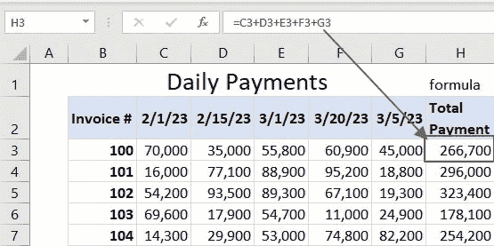
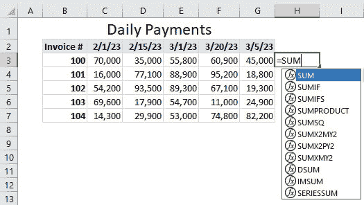
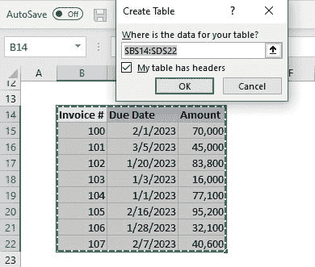
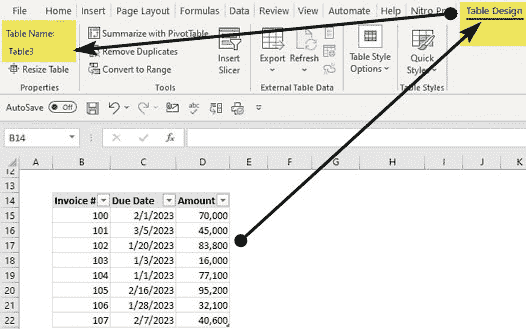
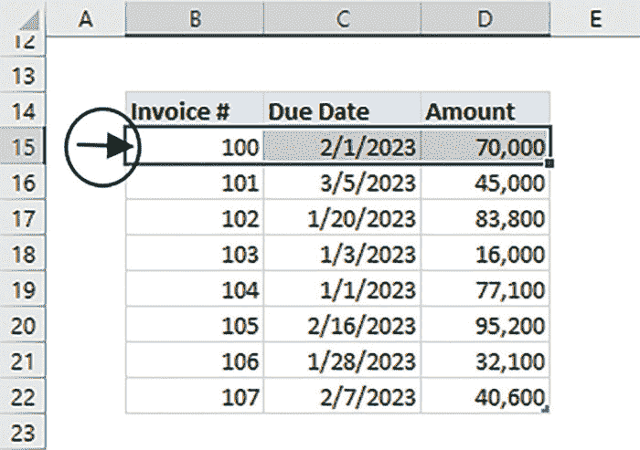

# 第一章

# Excel 环境

# 介绍

本章将向我们介绍 Excel 的基础知识。你将了解为什么需要发展 Excel 技能以及掌握这些技能的一般步骤。

我们将探索 Excel 公式和函数的世界，包括函数的嵌套或组合。我们还将介绍 Excel 单元格引用的基础知识和使用 Excel 表格。

由于这本书是关于在 Excel 中查找任何内容的 101 种方法，我们将深入探讨 Excel 查找技能的世界以及它们为掌握 Excel 打开的大门。最后，我们将深入研究查找函数的不同分类。

# 结构

在本章中，我们将讨论以下主题：

+   为什么你应该学习 Excel？

+   如何掌握 Excel

+   介绍 Excel 公式和函数

+   函数的嵌套：当一个不够时

+   介绍 Excel 单元格引用：完整列/行，范围引用，命名引用，绝对引用，相对引用和混合引用

+   介绍 Excel 表格

+   具备查找技能的重要性

+   查找函数的分类：

    +   旧版本：传统数组函数

    +   动态数组函数

    +   ���大查询

# 学习 Excel 的原因

Excel 是全球数百万人用来分析、管理和可视化数据的最强大的电子表格工具之一。它被广泛应用于不同行业，如金融、工程、物流、医学、采矿和运营等。

2018 年由两家全球研究顾问公司（Spiceworks 和 Censuswide）进行的调查显示，超过 69% 的专业人士定期使用 Excel，其中 57% 的人至少每天使用一次。此外，超过 59% 的拥有超过 500 名员工的公司使用 Excel 进行数据分析。

因此，无论你所在的行业如何，如果你的工作涉及数据处理或分析，你很可能会使用 Excel。

在个人层面上，Excel 有助于组织信息：它易于以结构化格式组织和存储数据，创建、检索和简单更新信息。这使得它在维护个人预算、跟踪个人物品，甚至创建每日待办事项清单方面非常有帮助。

发展你的 Excel 能力是在当今数据驱动的商业环境中提升职业的一种方式。它通过提高你在需要数据管理、分析和报告的任务中的效率和效果来增强你的生产力。一个高效的工作者是晋升的有力候选人。

总之，Excel 的普及性和多功能性使得获取和提升与 Excel 相关的技能对任何专业人士都是必要的。

# 如何掌握 Excel

在过去十多年中使用并培训他人使用 Excel，我们已经确定了加快获取和提升 Excel 技能的六个步骤。

这些是已经被遵循并传授给他人的步骤，取得了令人印象深刻的成果。

# 步骤 1：热爱错误

从错误中学习是获得任何技能中最被低估的步骤之一。

从错误中学习比仅仅阅读理论和练习而不犯错误获得的要多得多。错误提供宝贵的反馈，帮助你完善技术和提高表现。

因此，热爱错误使你摆脱了对失败的恐惧，并帮助你建立韧性和坚持力。

有能力从错误中学习并热爱错误，我们可以实现在所选择领域获得和改善任何技能的目标。这就是为什么这是掌握 Excel 技能的第一步。

# 第 2 步：掌握基础知识

掌握基础知识是获得任何技能中最被轻视的步骤之一，因为它看起来乏味和重复。然而，基础知识构成了更高级技术的基础。具有对基础知识的深刻理解，可以更容易地在任何领域取得进步和改善。

掌握基础知识的其他障碍包括渴望迅速取得成果和更看重高级技能，认为它们更令人印象深刻或更重要。

例如，用户想要开始使用嵌套的 INDEX 和 MATCH 函数，而不先了解嵌套函数和使用各个函数的基础知识。

在这本书中，我们将花时间建立这个基础，因为它有助于构建复杂的函数。

# 第 3 步：逐渐增加负荷

获得和提升技能就像锻炼肌肉一样。你需要通过逐渐增加负荷来挑战自己。

掌握基础知识是必不可少的，但固守基础知识对于掌握 Excel 和任何其他技能是有害的。

掌握需要持续练习，逐渐增加难度，跟踪进展，并寻求专家和同事的反馈和指导。

为了促进持续的增长和改善，本书教授的概念将从基础到复杂逐渐展开。

# 第 4 步：学会将问题分解成小块

你如何吃掉一头大象？答案是“*一口一口地吃*”。

换句话说，当面对一个庞大而复杂的任务时，一次性解决所有问题似乎是不可能的。然而，如果你将其分解成更小、更易管理的部分，你可以逐步地一步一步地接近，直到最终实现目标。

例如，你有多容易记住数字“12110081644936251694”？

提示是将其分解成小块并观察模式。（请参见章节末的答案）。

Excel 中的复杂任务需要一些公式，其中包含超过五个嵌套函数。如果你知道每个函数对公式的贡献，理解嵌套函数就很容易。

比喻地说，这就是看到森林中的单棵树的艺术。

# 第 5 步：教授

对于新手来说，教学是最可怕的事情之一，然而这是提升任何技能的重要步骤。对失败的恐惧和缺乏信心阻止了初学者从教学中获益。

当你教别人时，你必须整理思绪并清晰简洁地表达信息。

向他人解释一个概念需要你完全理解材料并预料到学生可能会有的问题和潜在误解。通过这样做，你可以发现自己知识的空白并填补这些空白，从而提高你的理解能力。

“*当你教别人时，你自己也在学习两次*”这句谚语表明，教授他人可以是巩固和加深你对某一主题理解的强大方式。

要提升你的 Excel 技能，你需要习惯于教授他人你所学到的一点点知识，这样才能牢记。

# 步骤 6：参与 Excel 论坛

网络连接使世界变成了一个村庄。你可以从任何地方获取世界级专家、讨论和培训。

参加并参与 Excel 论坛对于两个原因至关重要：

1.  这让你可以接触在线学生，从而练习你的教学。正如前一节所讨论的，教学对于掌握 Excel 至关重要。

1.  这为被动和无意识学习提供了绝佳的机会。在这些论坛中，你会遇到许多课程、技巧和窍门，这些你可能从未想到过。

一些建议的论坛包括 Excel 微软答案、Excel 微软技术社区、Excel Stack Overflow 和 Reddit Excel。

# 步骤 7：每日有意识学习

有意学习与自发学习不同，因为有目的的学习是有意识地为了特定目的获取知识。

例如，这本书的每一章都涵盖了在 Excel 中查找数据的不同方法。如果你每天设定一个特定的时间来学习每一章，你就会进行有意识的学习。

这涉及设定明确的目标，积极寻找信息，并进行刻意练习以提高自己的能力。这需要愿意在学习过程中投入时间和精力。

每日有意识学习提高了学习者教授他人的信心，从而导致更深入的理解。用户进入学习教授和教授学习的生产力循环：

**图 1.1：** 生产力循环

这并不是贬低偶然学习（在进行其他活动时无意中学到的知识）或意外学习（偶然学到的知识）的好处的尝试。这些方式也能带来好处，但有意学习的好处胜过其他所有形式的学习。

# 介绍 Excel 公式和函数

Excel 公式和函数是 Excel 的核心。您必须学习公式和函数才能充分利用 Excel 并提高生产力。

在 Excel 中，公式结合了用于计算、数据操作或从工作表数据生成结果的操作。它可能包含单元格引用、算术运算符、数字或函数。

例如，在*图 1.2*中，如何使用公式计算每张发票的总付款？

**图 1.2：** 在 Excel 中使用公式

图中使用的公式包含算术运算符(=，+)和单元格引用(C3，D3，E3，F3，G3)。我们将在本章后面讨论更多单元格引用。

另一方面，函数是预定义的一组指令或公式**已经内置**，可用于对数据执行各种操作。

例如，在*图 1.3*中，如何使用函数计算每张发票的总付款？

**图 1.3：** 在 Excel 中使用 Sum 函数

在*图 1.3*中使用的函数包含算术运算符(=)，单元格范围引用(C3:G3)和内置函数名称(`**SUM**`)。

**注意**

公式和函数都应该以等号(=)开头。

一些用户以加号(+)开头，而其他人则过度使用加号和等号(= +)开头。

我们还可以有一个复杂的公式，它将是操作和函数的组合。

Excel 拥有 500 多个函数，但您只需要学习其中一些才能提高生产力。随着 LAMBDA 函数的引入，这个数字不断增长，使用户有能力创建自己的函数。

这些函数被分类为数学、统计、金融、逻辑、文本、日期和时间、查找和引用、工程等。本书重点介绍查找和引用组以及它们与其他组的关系。

以下是所有函数的最常见特征：

+   **组成：** 所有 Excel 函数都有一个标准结构，确定它们如何输入到单元格中，即始终以等号开头，然后是函数名称，然后是一个或多个或没有参数，用逗号分隔。

    例如，IF 函数有三个参数，Excel IntelliSense 将概述，而`**TODAY**`函数没有参数：

    `=IF(Logical_Test, Value_if_True, Value_if_False)`

    `=Today()`

+   **参数：** 参数是函数用于执行特定计算的值或单元格引用。每个函数需要不同数量和类型的参数才能正常工作。方括号内的任何参数表示它是可选的，因此可以跳过，函数仍然可以正常工作。

+   **结果：** 每个 Excel 函数都基于输入参数和功能分类返回结果。例如，所有被分类为文本函数的函数将始终返回文本数据类型的结果。

+   **兼容：** Excel 函数可以很好地协同工作，允许您将一个函数的结果用作另一个函数的输入。这称为嵌套函数，稍后将在本章中介绍。嵌套功能允许您设计复杂的计算和公式。

+   **内置：** 所有 Excel 函数都是内置的，这意味着它们是 Excel 软件的一部分，不需要单独安装。但是，函数仅在不同版本的 Excel 中可用。例如，您只能在 Office 365 中访问动态数组公式。

+   **可访问性：** Excel 函数可以通过公式栏（*图 1.4*）和函数向导轻松访问：

**图 1.4：** 通过公式栏访问函数

或者，通过直接在单元格中键入函数（*图 1.5*）：

**图 1.5：** 通过直接在单元格中键入访问函数

# 嵌套函数：当一个不够时

在 Excel 中嵌套函数是执行复杂计算和操作数据的终极技能。通过组合多个函数，您可以执行使用单个函数难以或不可能完成的任务。

**那么，嵌套函数意味着什么？**

嵌套函数在 Excel 中是指使用一个函数的结果作为另一个函数的输入。您可以尽可能多地这样做，以创建执行多个计算的复杂公式。

例如，在*图 1.6*中，我们如何标记只有在一月到期且金额大于或等于 50,000 的发票为优先级？

您会意识到，在 Excel 中没有单个函数可以帮助您解决前面的任务。这就需要一个嵌套公式，如下所示：

`=IF(`

`AND(MONTH(I3)=1, J3>=50000 ),`

`“YES”,”NO”)`

**这个函数是如何工作的？**

首先，您需要意识到 IF 函数本身只能处理单个逻辑测试。由于我们的任务有两个分析测试，因此您需要将`**AND**`函数嵌套在 IF 函数内部。

其次，您会意识到第一个逻辑测试需要一个月份比较，但您的数据包含日期。因此，您必须将日期转换为月份，将`**MONTH**`函数嵌套在`**AND**`函数内部。

总之，以下是这三个函数如何一起工作的，从最内部的函数开始：

+   `**MONTH**`函数返回日期的月份部分。这些结果用于`**AND**`函数的第一个逻辑测试中，以检查月份是否为一月（1）。

+   AND 函数评估两个逻辑测试（检查月份是否为一月和金额是否大于或等于 50,000），并返回由 IF 函数使用的 TRUE/FALSE 结果，以确定优先级是`**YES**`/`**NO**`。

    **图 1.6：** 嵌套函数

# 解决嵌套函数中的复杂性

让我们学习如何解决嵌套函数中的复杂性：

+   使用括号颜色代码确保所有嵌套函数参数都在括号内。最外层函数的括号始终是黑色；对于嵌套函数，开放和关闭括号颜色相同。

+   另一个选择是确保每次编写函数时，在输入参数之前跟着开放和关闭括号。

+   利用 Excel 的函数智能感知显示您正在处理的函数和参数。

+   使用命名范围和表的结构引用使您的函数更易读。

+   始终使用 F9 快捷键评估每个函数的结果。

# 嵌套函数规则

以下是在嵌套函数中遵循的一些规则：

+   只有最外层函数前面才应该有一个等号，不应该在所有嵌套函数前面加上等号。

+   所有嵌套函数`**必须**`返回与其在函数中替换的参数相同的数据类型。使用我们前面的例子，`**AND**`函数必须返回布尔数据类型，因为这是`**IF**`函数中逻辑测试参数所需的数据类型。

+   所有嵌套函数必须遵循 Excel 的运算顺序：PEDMAS（括号、指数、乘法、除法、加法、减法）

+   嵌套函数从最内层到最外层进行评估。

# 介绍 Excel 单元格引用

Excel 中的每个单元格都由列字母和行号的唯一组合称为“单元格地址”来标识。

例如，位于第一列第一行的单元格称为“A1”，位于第二列第三行的单元格称为“B3”。

在 Excel 中创建公式时，可以硬编码数据（例如，`**SUM(10, 12)**`）或者引用存储在单元格中的数据（例如，`**SUM(A1, A2)**`）。这称为单元格引用。

单元格引用是 Excel 中的一个重要概念，了解如何有效使用它们可以帮助您更高效和准确地操作和分析数据。

# 单元格引用类型

在 Excel 中观察到以下类型的单元格引用：

+   **完整行/完整列引用**：如果要选择列 A 中的所有 1,048,576 行，则使用完整列引用（**A:A**）。否则，如果要选择第一行中所有 16,384 列的数据，则使用完整行引用（**1:1**）。

    我们强烈反对使用完整行和完整列引用的做法，原因有两个：

    +   可能会有一个无效值远在您视野之外的列/行，影响您的分析。

    +   它可能导致电子表格计算缓慢，因为 Excel 必须检查所有 1,048,576 行或 16,384 列。

+   **单元格范围引用**：它指的是工作表上的一个单元格块，具有起始和结束单元格地址，而不是完整的列/行引用。它可以是同一列中的块（例如，A1:A26），同一列中的块（例如，A1:K1），或行和列的组合（例如，A1:F26）。

    这使您能够一次对多个单元格执行计算、格式设置或其他操作，而不必逐个执行。

    例如，在*图 1.7*中，每张发票的总和（`=SUM(C3:G3)`，一行中的单元格范围），每日总和（`=SUM(C3:C7)`，一列中的单元格范围）和总体总和（=`**SUM**`(C3:G7)，两列和两行中的单元格范围）。

    

    **图 1.7：** 单元格范围引用

+   **命名范围引用**：这是一种通过名称而不是使用此处讨论的传统单元格引用来引用电子表格中的一系列单元格的方法。要在 Excel 中创建命名范围，请执行以下步骤：

    +   选择要命名的单元格范围，然后转到“公式”选项卡，单击“定义名称”。或者，您可以使用键盘快捷键**Alt + M + M + D**。

    +   在新名称弹出窗口中，为您的范围命名并定义其范围（您是否希望在整个工作簿中访问它，还是只在创建它的工作表中访问它）。

    创建后，这些命名范围可以像使用单元格引用一样在公式和函数中使用。例如，如果您已经命名了一个从单元格范围 C3:G3 创建的命名范围`**Invoice100**`，您可以在公式中引用它，如下所示：

    `=SUM(Invoice100)`

    这个公式的工作方式类似于之前讨论的`=SUM(C3:G3)`。使用命名范围可以使您的公式和函数更容易阅读和理解。

    在创建命名范围时，请考虑以下一些规则：

    +   名称应具有描述性，不带空格或特殊字符，并且不能以数字开头。

    +   避免使用相对单元格引用，为您的命名范围使用绝对单元格引用。相对引用和绝对引用之间的区别将在下一节中讨论。

    +   最后，保持您的名称尽可能简短、简单，并在整个工作簿中保持一致。

+   **相对引用、绝对引用和混合单元格引用**：所有单元格引用默认为相对引用，即它们相对于公式位置的位置在复制或移动到新单元格时会改变。

    例如，如果您在单元格 C1 中有一个公式，引用单元格范围 A1:B1，并将公式复制到单元格 D1，则引用将更改为 B1:C1。

    另一方面，绝对引用始终指向相同的单元格或范围，无论公式被复制或移动到何处。要确定是否为绝对引用，请检查列字母和行号之前是否有美元符号($)。

    例如，如果您想要使单元格范围 A1:B1 绝对化，最简单的方法是突出显示该范围并按下 F4，这将变为`**$A$1: $B$1**`**。当公式被复制或移动时，引用将保持为`**$A$1: $B$1**`。

    混合引用包含相对和绝对组件的组合，其中行或列引用是绝对的，而另一个是相对的。

    例如，如果你有一个引用单元格 A1:A10 的公式，并且你希望列是绝对的，但行是相对的，你会使用 `**$A1:$A10**`**。** 当公式被复制或移动时，它将始终引用列 A，但行引用将根据公式的位置而改变。

    否则，如果您希望列是相对的而行是绝对的，请使用 `**A$1:B$1**`**。** 当公式被复制或移动时，它将始终引用第 1 行，但列引用将根据公式的位置而改变。

# 介绍 Excel 表格

假设你想携带十个笨重的物品；哪种方法更容易？把它们放在一个容器里还是试图把它们排列在你的手上？当然，把它们放在一个容器里是最容易的方法。

Excel 表格只是帮助您轻松组织、分析和简洁呈现数据的容器，通过自动化特定任务节省您的时间。此外，它允许快速对数据进行排序和筛选，这可以帮助您发现数据中的模式或趋势。

此外，Excel 表格还允许您在公式中使用结构化引用，使您的公式更易读且更易维护。例如，不是通过它们的单元格地址引用单元格，您可以使用类似 `**=SUM(tblSales[Amount])**` 的公式，即，在名为 Sales 的表中，总计名为 `**Amount**` 的列中的所有数据。

**图 1.8：** 在公式中使用结构化引用

**执行以下步骤创建表格：**

+   确保您的数据之间没有空白行或列。

+   使用快捷键 **Ctrl + A** 选择全部。

+   转到“主页”选项卡，选择“格式为表格”，或使用快捷键 **Ctrl + T**。将弹出一个窗口（见 *图 1.9*）显示格式为表格的数据范围。如果您的数据范围中的第一行包含标题，请勾选“我的表格有标题”复选框。否则，Excel 将在您的范围顶部创建一个额外的标题行。

    **图 1.9：** 在 Excel 中创建表格

+   单击表格的任意位置，转到“**表格设计**”选项卡，并为您的表格指定一个描述性名称。默认情况下，Excel 给出一个通用的表格（见 *图 1.10*）：

    **图 1.10：** 重命名您的表格

+   要将表格转换回范围，请转到“**表格设计**”选项卡，然后单击“转换为范围”：

    **图 1.11：** 将表格转换为范围

**现在，让我们看看使用表格的原因：**

+   它们是数据透视表和图表的重要源数据，因为它们会动态扩展。

+   它们可以快速且轻松地进行格式化。

+   您可以通过单击轻松选择整个表格、列或行。要选择整个表格，请将鼠标悬停在左上角并单击（见*图 1.12*）。

    **图 1.12：** 选择整个表格

    要仅选择包含数据的列范围，请将鼠标悬停在列标题上并单击一次（见*图 1.13*）。

    

    **图 1.13：** 选择整个列

    将鼠标悬停在表格的左边缘以选择行范围并单击（见*图 1.14*）。

    

    **图 1.14：** 选择整个行

+   Excel 表格使用结构引用，使得创建复杂公式更加容易。结构引用使用表格列名和函数来简化公式，节省时间并减少错误。

# 具备查找技能的重要性

本书旨在通过建立用户的查找技能来帮助他们掌握 Excel。

**那么，为什么查找函数对任何 Excel 用户如此重要呢？**

这里是 11 个主要原因：

+   **快速、高效和有效的数据检索**：Excel 查找函数可以加快在广泛数据集中查找和检索特定数据的速度，跨工作表或工作簿，从而减少手动数据搜索和检索时间。

+   **提高整体数据分析准确性**：通过使用这些函数，您还可以减少手动数据搜索过程中可能出现的错误，并确保准确访问正确的数据。

+   **增强数据分析和报告**：查找函数帮助您比较和分析来自不同来源的数据，并将它们整合到一个报告中，减少错误。

+   **改善决策**：准确及时的信息对于做出明智决策至关重要。此外，从整合数据中获得全局视图对于做出更好的决策至关重要。查找函数在数据整合、节省时间和准确数据检索方面至关重要。

+   **提高生产力**：使用查找函数，您可以更快速、更准确地工作，从而提高生产力和表现。

+   **灵活且易学**：Excel 查找函数相对容易学习，一旦理解，就可以以各种方式使用，使其灵活且适应不同情况。

+   **减少错误**：查找函数通过提供准确可靠的结果来减少数据分析中错误的风险。

+   **增强数据可视化**：查找函数允许您创建动态报告和图表，随着新数据的添加而自动更新，增强数据的可视化和呈现。

+   **更好的数据组织**：通过自动化数据检索和组织，查找函数可以帮助保持数据更有条理，更易于管理。

+   **允许进行更复杂的计算**：使用查找函数，用户可以执行更复杂的计算，否则这些计算将是耗时或无法手动完成的。

+   **提高 Excel 熟练度**：不同的查找方法整合了 Excel 函数中的许多功能。学习这些方法可以提高您的整体 Excel 熟练度，并使您在使用 Excel 时更加高效和有效。

# 查找函数分类

Excel 函数可以广泛分为以下三类：

+   动态数组函数（自动将结果溢出到相邻单元格）

+   传统数组函数（如果需要将结果溢出到相邻单元格，则需要使用键盘快捷键**Ctrl + Shift + Enter**输入它们）

+   `**M**`函数（用于在 Power Query 中执行数据转换的函数）

在本书中，我们将学习使用来自三个类别的各种方法的查找技巧。

我们将从学习传统的数组函数开始，首先是最流行的`**VLOOKUP**`，然后是`**INDEX**`和`**MATCH**`的流行组合，最后是最古老的查找函数`**LOOKUP**`。最后，我们将学习使用数据库函数、聚合函数、数学函数以及一些文本函数来检索数据的独特方法。

稍后，我们将进入节省时间和动态数组函数，首先是最流行的`**XLOOKUP**`，然后是方便的`**FILTER**`函数。在这个过程中，我们将学习如何嵌套其他动态函数，如`**VSTACK**`、`**HSTACK**`和`**SEQUENCE**`，以创建高效的查找公式。

最后，我们将探讨如何使用 Power Query 表连接、列表函数、分组以及如何在 Power Query 中创建动态条件来查找数据。

# 结论

Excel 技能对于任何工作职责包括任何形式的数据操作的专业人士都是必不可少的。此外，这些技能可以用于管理个人数据，如预算、跟踪日常习惯和制作待办事项清单。

在所有要学习的 Excel 技能中，学习查找技能对您的生产力和数据分析准确性都会产生即时影响。

在下一章中，我们将深入研究最流行的 Excel 函数之一：VLOOKUP。

# 问题

你找到记住这个数字“12110081644936251694”的诀窍了吗？

**解决方案：**

将其分解为这些组 →121 | 100 | 81 | 64 | 49 | 36 | 25 | 16 | 9 | 4

你能看出模式了吗？

这些是从 11 到 2 的数字的平方。如果你将问题分解成小块，问题就变得如此简单。
