# 第二章

# VLOOKUP 已死：还是吗？

# 介绍

本章将向我们介绍最流行的 Excel 查找函数 — `**VLOOKUP**`。我们将学习其基本结构和固有弱点，以及如何将其与其他函数嵌套以克服其弱点。

另外，由于这本书是关于精通 Excel，我们将深入研究不同的 Excel 函数。

# 结构

在本章中，我们将讨论以下主题：

+   `**VLOOKUP**` 精确匹配和近似匹配

+   打破 `**VLOOKUP**` 的神话

    +   神话 1: `**VLOOKUP**` 无法进行左侧查找

    +   神话 2: `**VLOOKUP**` 无法在查找中返回多列

    +   神话 3: `**VLOOKUP**` 无法进行多条件查找

    +   神话 4: `**VLOOKUP**` 无法处理在查找范围中插入和删除列

    +   神话 5: `**VLOOKUP**` 无法进行双向查找

    +   神话 6: `**VLOOKUP**` 无法进行部分匹配查找

    +   神话 7: `**VLOOKUP**` 无法进行区分大小写的部分匹配查找

    +   神话 8: `**VLOOKUP**` 无法进行区分大小写的查找

    +   神话 9: `**VLOOKUP**` 无法返回多个结果

    +   神话 10: `**VLOOKUP**` 无法从后往前查找

    +   神话 11: `**VLOOKUP**` 无法查找前 N 个或后 N 个值

    +   神话 12: `**VLOOKUP**` 无法进行反向查找

    +   神话 13: `**VLOOKUP**` 无法进行水平查找

    +   神话 14: `**VLOOKUP**` 无法返回多个不连续的列

    +   神话 15: `**VLOOKUP**` 无法查找多个不连续的数组

# VLOOKUP 精确匹配和近似匹配

正如我们在前一章中所学到的，掌握基础知识是掌握任何技能的第一步。因此，以下是关于 `**VLOOKUP**` 的必知内容。

`**VLOOKUP**` 允许你在表格的最左列（即 *查找值*）中搜索特定值，然后从同一行中指定的列（即 *列索引号*）返回一个值。你可以指定是否要进行近似匹配或精确匹配（即 *范围查找*）。

默认情况下，`**VLOOKUP**` 将进行近似匹配。

语法：

`=VLOOKUP(查找值, 表数组, 列索引号, [范围查找])`

**注意事项：**

+   查找值**必须在表格的第一列**中。在 *图 2.1* 中，由于发票号是查找值，所有发票都存储在我们表格的第一列中。

+   我们的表格中只有两列是必要的 — 存储查找值的列和存储要返回值的列。在 *图 2.1* 中，即使我们没有第三列，我们的公式仍然可以工作。

+   由于我们希望对查找值进行精确匹配，我们选择 `**FALSE**` 作为查找范围。你可以用零 `**0**` 替换 `**FALSE**`，如下所示：

    `=VLOOKUP(F3, tblSales, 2, 0)`

**注意**：Excel 将布尔值存储为整数，值为`**0**`表示`**FALSE**`，任何其他值表示 TRUE。当您在单元格中输入`**TRUE**`或`**FALSE**`时，Excel 会自动将其转换为其等效的整数。

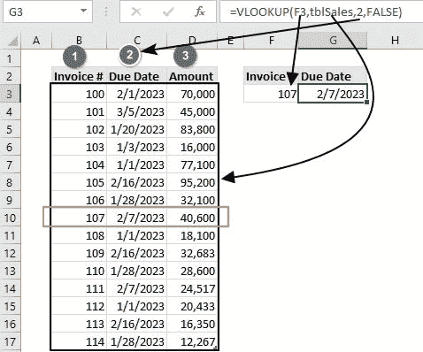

**图 2.1：** 基本 VLOOKUP 精确匹配

# VLOOKUP 近似匹配

默认情况下，`**VLOOKUP**`函数设置为返回近似匹配。在处理大量数字和排序数据集，并且可以容忍一些错误时，`**VLOOKUP**`非常快速。

然而，大多数搜索需要精确匹配。此外，如果不满足以下要求，近似搜索将返回错误的结果：

+   数据表必须按查找值升序排序。

+   数据表的查找值列中应只有唯一值。

+   数据表查找范围应与查找值具有相同的数据类型。

尽管如此，当分组数据时（例如，为学生分配成绩时；*图 2.2*），近似匹配是有益的。

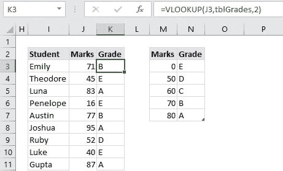

**图 2.2：** VLOOKUP 近似匹配数据分组

在搜索范围内查找值时，近似匹配也适用（例如，根据销售范围给出折扣时；*图 2.3*）：

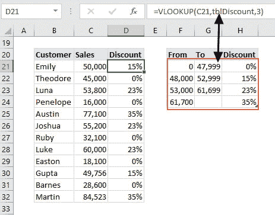

**图 2.3：** 从范围内 VLOOKUP 近似匹配值

**注意：** 在使用 VLOOKUP 进行近似范围时，您可以跳过最后的范围查找参数，公式仍然有效。

方括号中的任何参数表示是可选的。

`=VLOOKUP(查找值, 表数组, 列索引号, [范围查找])`

**提示**：VLOOKUP 近似匹配是嵌套 IF 函数的一个很好的替代，因为计算速度更快。

例如，为了获得与*图 2.2*中显示的相同结果，您可以使用以下嵌套的 IF 函数或 VLOOKUP：

`=IF(J3>=M7, N7, IF(J3>=M6,N6,IF(J3>=M5,N5,IF(J3>=M4,N4,$N3))))`

`=VLOOKUP(J3, tblGrades,2)`

由于前述限制，关于`VLOOKUP`能做什么或不能做什么有许多神话。

在下一节中，我们将探讨`VLOOKUP`函数与其他函数嵌套时的全部潜力。

# 打破 VLOOKUP 的神话

神话是特定文化中的人们长期以来一直在讲述的故事。这些故事通常主要涉及根据历史教导事物为何是其现在的样子。这些有时是半真半假或纯粹的谎言。

关于`**VLOOKUP**`函数如何运作的许多教导都被半真半假或纯粹的谎言所掩盖，给`**VLOOKUP**`函数带来了不好的名声。

在本节中，我们将通过逐一打破现有的神话来了解`**VLOOKUP**`的全部真相。

# 神话 1：VLOOKUP 无法进行左查找

在*图 2.4*中，查找值（销售日期）不在表的第一列，而是在那里有返回值（客户）。

在这种情况下，默认的`**VLOOKUP**`函数将无法工作。您必须嵌套 IF 函数，如下图所示：

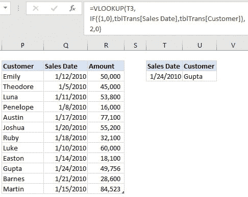

**图 2.4：** VLOOKUP 左查找

关键是使用`**IF**`函数创建自定义表数组。

`**IF**`函数返回一个两列表，销售日期是第一列，客户是第二列。

这种列重新排列技巧使`**VLOOKUP**`在假定向右查找的同时实际上向左查找。

# 神话 2：VLOOKUP 无法在查找中返回多列

在*图 2.5*中，您必须返回特定客户的销售日期和金额。

默认情况下，您一次只能返回一个值，因为 VLOOKUP 中的`**column_index**`参数只接受单个值。

然而，您可以将多个`**column_index**`值放在花括号中，并返回多个列。

如果您没有 Office 365 订阅，请执行以下步骤：

+   高亮显示要返回多个值的单元格。

+   转到公式栏，输入以下公式。

+   点击**Ctrl + Shift + Enter**返回以下值：

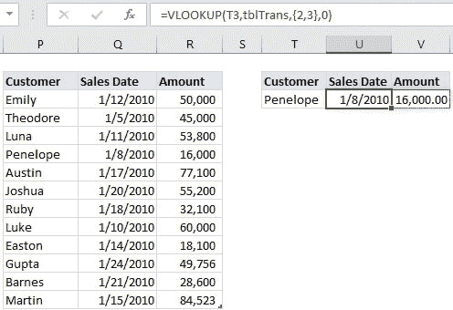

**图 2.5：** VLOOKUP 返回多列

# 神话 3：VLOOKUP 无法在查找中使用多个条件

如果您的数据有重复项，如*图 2.6*所示，`**VLOOKUP**`函数将返回满足条件的第一个值。

例如，如果您查找客户“卡尔·杰克逊”的销售金额，`VLOOKUP`函数将返回 45,000，因为这是第一次出现。

如果您想查找客户“卡尔·杰克逊”在“2010 年 1 月 14 日”的销售金额怎么办？

默认情况下，`VLOOKUP`无法查找多个值。您可以按以下方式修改它：

+   使用和号组合多个值。使用我们前面的例子，我们的查找值现在将是`Carl Jackson1/14/2010`。

+   使用 IF 函数创建一个自定义两列表数组。第一列应包含两列的组合，这两列包含查找值，即按顺序`tblSales[Customer]&tblSales[Sales Date]`，类似于查找值组合。第二列应包含查找值。

+   使用组合查找值和自定义表数组，在*图 2.6*中编写您的 VLOOKUP。请记住这是一个数组函数；因此，如果您没有 Office 365，请点击**Ctrl + Shift + Enter**。

`=VLOOKUP( T19&U19,`

`IF({1,0}, tblSalesT[Customer]&tblSalesT[Sales Date], tblSalesT[Amount]), 2, 0 )`

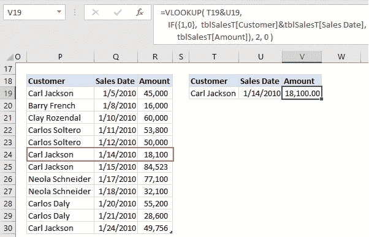

**图 2.6：** VLOOKUP 多条件

# 神话 4：VLOOKUP 无法处理查找范围中的列插入和删除

到目前为止，我们一直在函数中硬编码列索引号，即包含返回值的列的编号。

当在此列之前插入或删除列时，这会导致问题，因为它会破坏`VLOOKUP`函数。

因此，为了使`VLOOKUP`处理插入和删除，我们需要使用`MATCH`函数使列索引号动态化，如*图 2.7*所示：

`**=VLOOKUP(E3,tblSale,**`

`**MATCH(F2,tblSale[#Headers],0),**`

`**FALSE)**`

注意：`**MATCH**`函数查找范围中的值并返回其相对位置。

`=MATCH(F2,tblSale[#Headers],0)=2`

在我们的情况下，`**MATCH**`函数在销售表头中查找存储在单元格 F2 中的文本`**Amount**`，并始终返回其位置，使其具有动态性。

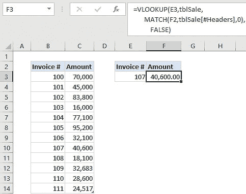

**图 2.7：** VLOOKUP 处理插入和删除

# 神话 5：VLOOKUP 无法进行双向查找

在`**VLOOKUP**`函数中硬编码列索引号几乎不可能进行双向查找。

但是，如果像我们从前一节学到的那样嵌套`**MATCH**`函数，`**VLOOKUP**`函数可以轻松进行双向查找（见*图 2.8*）。

我们的任务是从客户列表中查找特定客户（Joshua）的销售额，并查找特定地区（Western）的销售额。

由于客户名单存储在我们的`SalesRegion`表的第一列中，查找值将是单元格 G38 中的特定客户。至于地区，我们将使用`MATCH`函数返回特定地区的相对列索引。

`=VLOOKUP(G38,SalesRegion,`

`MATCH(G40, SalesRegion[#Headers],0),0)`

**注意：** MATCH 函数始终返回第一个 TRUE 匹配。

由于我们不能在表头中有重复项，MATCH 函数将始终返回正确的列号。

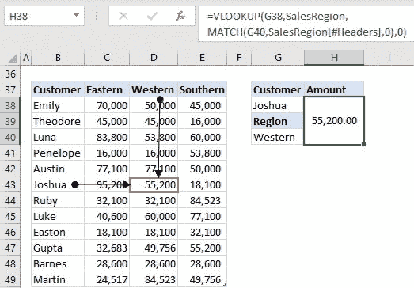

**图 2.8：** VLOOKUP 双向查找

# 神话 6：VLOOKUP 无法进行部分匹配查找

VLOOKUP 只有近似匹配和精确匹配，但也可以进行部分匹配。

如果将查找值与通配符结合起来，就可以进行部分匹配，如*图 2.9*所示。

**注意：** 通配符是表示文本字符串中一个或多个字符的特殊字符。最常见的通配符是星号（*）和问号（?）。

+   星号（*）：此通配符表示文本字符串中一个或多个字符。例如，**“**`**P***`**”**将找到以字母 P 开头的任何单词，`***P**`将找到以字母 P 结尾的任何单词，`***P***`将找到包含字母 P 的任何单词。

+   问号（?）：问号通配符表示文本字符串中的单个字符。例如，搜索词`**H??t**`将找到任何以“H”开头，以“t”结尾，并在中间有两个字符的四字词，例如“Heat”或“Host”。

+   您可以结合星号和问号来定义您的搜索。例如，`**???T***` 将搜索 T 为第四个字符但以任意数量的字符结尾的任何字符串，例如 Mas**ts**，Coa**t**ing，Soo**t**hing 等。另一个例子是*****`**T???**` 这将搜索 T 为倒数第四个字符但以任意数量的字符开头的任何字符串，例如 Bea**t**ing，Charac**t**ers，Assis**t**ing 等。

    `=VLOOKUP( “*” & E54 & “*”, tblinvoices, 2, 0 )`

在下面的示例（*图 2.9*）中，我们查找包含字母 P 的发票金额。我们知道这一点，因为我们在存储在单元格 E54 中的标准前后放置了一个星号。

因此，*P* 意味着字母“P”前后可能有许多字符。

请注意，该公式返回第一个`TRUE`值。在本章后面，我们将学习如何在重复项的情况下返回多个值。

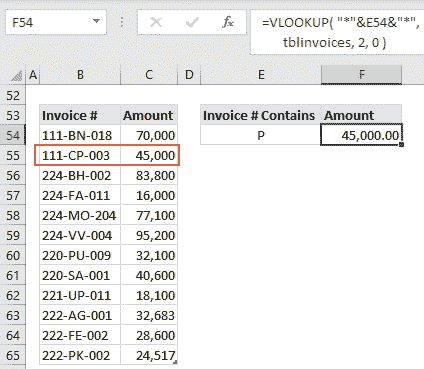

**图 2.9：** VLOOKUP 部分匹配

假设你想查找第五个字符为字母“P”的发票的值？

在这种情况下，我们将使用问号（?）作为通配符来代表任意单个字符。

`=VLOOKUP( “????”&E57&”*”, tblinvoices, 2, 0 )`

如*图 2.10*所示，发票号“220-PU-009”是第一张发票，其中字母“P”是第五个字符。我们知道这是正确的发票，因为我们在存储在单元格 E57 中的标准（P��前面放置了四个问号。

请记住，由于发票不以字母“P”结尾，我们必须在标准后面插入一个星号来代表它后面的任意数量的字符。

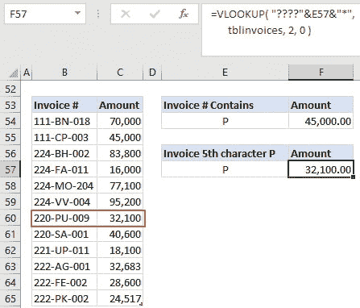

**图 2.10：** VLOOKUP 部分匹配单个字符

**注意：** 由于`**VLOOKUP**`函数不区分大小写，前面的示例将搜索字母“P”，无论其是大写还是小写。

# 神话 7：VLOOKUP 无法进行区分大小写的部分匹配查找

Excel 有两个流行的区分大小写的函数：`**FIND**` 和 `**EXACT**`。

由于`**VLOOKUP**`不区分大小写，当进行区分大小写的部分匹配查找时，我们必须嵌套前面的函数之一。

如*图 2.11*所示，我们需要查找一个包含小写字母“p”的发票。

`=VLOOKUP(TRUE, IF( {1,0},`

`ISNUMBER(FIND(K54,tblpay[Invoice’#])),`

`tblpay[Amount]),2,0)`

以下是前述函数的工作原理：

+   `**FIND(K54, tblpay[Invoice’#])**` 返回一个数字和错误的数组。数字代表发票号码中小写“p”的位置，错误代表任何缺少小写“p”的发票。

+   `**ISNUMBER(FIND(K54,tblpay[Invoice’#]))**` 将这个数字和错误的数组转换成一个`**TRUE**`/`**FALSE**`数组。对于任何数字为 TRUE，对于错误为 FALSE。

`*   使用 IF 函数创建一个自定义的两列表数组。第一列包含这个由 `**TRUE/FALSE**`（查找值列）组成的数组，第二列包含发票金额（返回值列）。*   由于我们的查找值是 `**TRUE/FALSE**` 值，`**VLOOKUP**` 函数应该查找一个 `**TRUE**` 值并返回第一个 `**TRUE**` 值。*   由于这是一个数组函数，如果您没有 Office 365 订阅，请单击 **Ctrl + Shift + Enter**。

`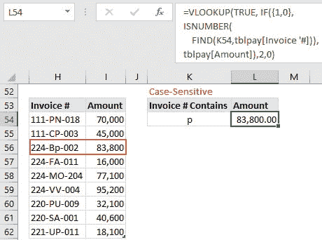

**图 2.11：** VLOOKUP 部分区分大小写匹配

# 迷思 8：VLOOKUP 无法进行区分大小写查找

正如我们从前一节中学到的，`**FIND**` 函数将帮助 `**VLOOKUP**` 函数进行部分区分大小写查找。

我们必须使用 `EXACT` 函数来进行整个区分大小写查找（见 *图 2.12*）：

`=VLOOKUP(TRUE,`

`IF({1,0},`

`EXACT(Q54,Payment[Product]),`

`Payment[Amount]),2,0)`

以下是前述函数的操作方式：

+   `**EXACT(Q54, Payment[Product])**` 返回一个由 `**TRUE**` 和 `**FALSE**` 组成的数组。 `**TRUE**` 代表产品，它与正确大小写的 `Furniture` 完全相等，否则为 `**FALSE**`。

+   使用 IF 函数创建一个自定义的两列表数组。第一列包含这个由 `**TRUE**`/`**FALSE**`（查找值列）组成的数组，第二列包含发票金额（返回值列）。

+   由于我们的查找值是 `**TRUE**`/`**FALSE**` 值，`**VLOOKUP**` 函数应该查找一个 `**TRUE**` 值并返回第一个 `**TRUE**` 值。

+   由于这是一个数组函数，如果您没有 Office 365 订阅，请单击 **Ctrl + Shift + Enter**。

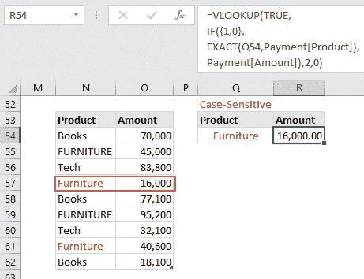

**图 2.12：** VLOOKUP 完全区分大小写匹配

**注意：** 由于 `**VLOOKUP**` 不区分大小写，如果没有像前面展示的 `**EXACT**` 函数，它将返回产品为家具的第一个实例的金额，即 45,000。

# 迷思 9：VLOOKUP 无法返回多个结果

默认情况下，`**VLOOKUP**` 返回第一个 `**TRUE**` 值。因此，如果您有重复项目并且想要返回所有 `**TRUE**` 值，您必须像 *图 2.13* 中所示嵌套 `**SMALL**` 和 `**IF**` 函数。

`=VLOOKUP(`

`SMALL(IF($F$70=tbl[Customer],`

`ROW(tbl[Customer])), ROW(A1)),`

`IF({1,0},ROW(tbl[Customer]),tbl[Amount]),`

`2,0)`

以下是前述函数的工作方式：

+   `**IF($F$70=tbl[Customer], ROW(tbl[Customer])**` 检查我们的标准客户“Carl Jackson”是否在客户列表中，并且如果为真，则返回找到客户的行号。由于我们有重复的客户，此函数将返回多个行号。

+   我们需要遍历这个行号列表，并逐个作为`VLOOKUP`的查找值返回。我们使用`SMALL`函数来完成这个任务，它会从最小到最大返回行号。请注意，`ROW(A1)`的计算结果为 1，当您拖动函数时，它会逐渐增加，直到完整列表被迭代：

`**SMALL(IF($F$70=tbl[Customer],ROW(tbl[Customer])), ROW(A1))**`

+   使用 IF 函数创建一个自定义的两列表数组。第一列包含客户的行号（查找值列），第二列包含发票金额（返回值列）。

+   VLOOKUP 函数使用`SMALL`函数返回的每个行号，并返回相应的金额。

+   请注意，在所有金额都被返回后，`VLOOKUP`函数会返回`#NUM`错误。

+   由于这是一个数组函数，如果您没有 Office 365 订阅，请点击**Ctrl + Shift + Enter**。

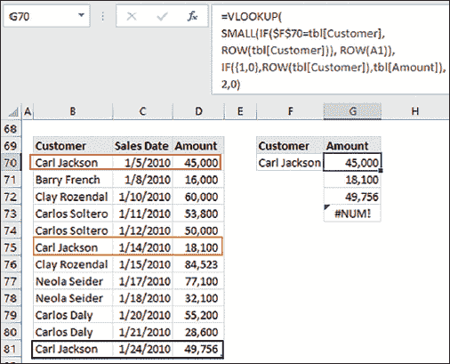

**图 2.13：** VLOOKUP 多个结果

# 神话 10：VLOOKUP 无法从后往前查找

默认情况下，`VLOOKUP`从上到下查找值，并返回第一个 TRUE 值。

为了从最后到第一个搜索，我们将`LARGE`函数嵌套在`VLOOKUP`中。

使用上一章的示例，要从后往前搜索，我们只需要用`LARGE`函数替换`SMALL`函数，如*图 2.14*所示：

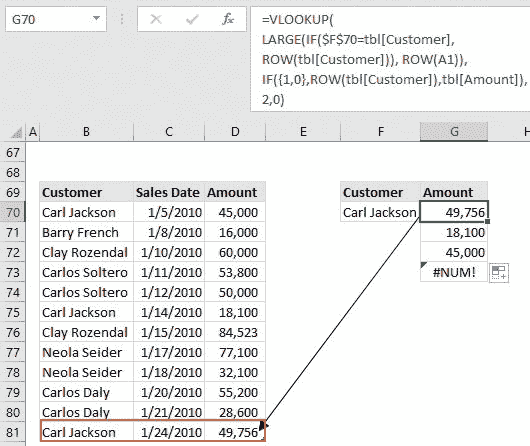

**图 2.14：** VLOOKUP 多个结果

以下是上述函数的工作原理：

+   `**IF($F$70=tbl[Customer], ROW(tbl[Customer])**`检查我们的标准客户“卡尔·杰克逊”是否在客户列表中，如果是，则返回客户被发现的行号。由于我们有重复的客户，此函数将返回多个行号。

+   我们需要遍历这个行号列表，并逐个作为`VLOOKUP`的查找值返回。我们使用`LARGE`函数来完成这个任务，它会从最大到最小返回行号。请注意，`ROW(A1)`的计算结果为 1，当您拖动函数时，它会逐渐增加，直到完整列表被迭代。

+   使用 IF 函数创建一个自定义的两列表数组。第一列包含客户的行号（查找值列），第二列包含发票金额（返回值列）。

+   VLOOKUP 函数使用 LARGE 函数返回的每个行号，并返回相应的金额。

+   请注意，在所有金额都被返回后，`VLOOKUP`函数会返回`#NUM`错误。

+   由于这是一个数组函数，如果您没有 Office 365 订阅，请点击**Ctrl + Shift + Enter**。

# 神话 11：VLOOKUP 无法查找前 N 个或后 N 个值

通过嵌套`SMALL`或`LARGE`函数，`VLOOKUP`可以快速返回未排序列表中的前 N 个或后 N 个金额（见*图 2.15*）：

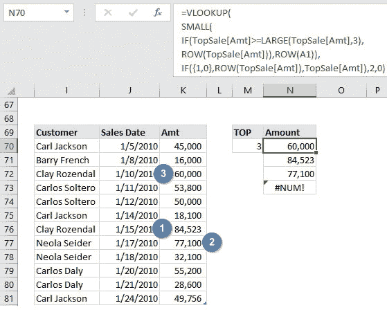

**图 2.15：** VLOOKUP 前三个销售金额

`=VLOOKUP(`

`SMALL(IF(TopSale[Amt]>=LARGE(TopSale[Amt],3),ROW(TopSale[Amt])),ROW(A1)),`

`IF({1,0},ROW(TopSale[Amt]),TopSale[Amt]),2,0)`

以下是前述函数的执行方式：

+   `**TopSale[Amt]>=LARGE(TopSale[Amt],3)**`检查销售金额是否大于或等于第三大销售金额，并返回一个 TRUE/FALSE 数组。

+   IF 函数返回所有销售金额大于或等于第三大销售金额的行号列表。

+   我们需要遍历这个行号列表，并逐个作为`VLOOKUP`的查找值返回。为此任务，我们使用`SMALL`函数，它从最小到最大返回行号。注意`ROW(A1)`评估为 1，当您拖动函数时，它会增加直到完整列表被迭代。

`**SMALL(IF(TopSale[Amt]>=LARGE(TopSale[Amt],3),ROW(TopSale[Amt])),ROW(A1))**`

+   使用 IF 函数创建自定义的两列表数组。第一列包含金额的行号（查找值列），第二列包含发票金额（返回值列）。

+   VLOOKUP 函数使用 SMALL 函数返回的每个行号，并返回相应的金额。

+   请注意，在所有金额已经返回之后，`VLOOKUP`函数会返回`#NUM`错误。

+   由于这是一个数组函数，如果您没有 Office 365 订阅，请单击 Ctrl + Shift + Enter。

# 神话 12：VLOOKUP 无法进行反向查找

在 Excel 中，反向查找是根据已知结果在表中查找值的一种方法。这是前一节讨论的双向查找的反向（见神话 5）。

例如，如*图 2.16*所示，您正在寻找给患者的医生和相应的会话。

**图 2.16：**VLOOKUP 反向查找

`=VLOOKUP(`

`MAX(IF(Clients=F86,ROW(Clients))),`

`CHOOSE({1,2,3},`

`ROW(Clients),`

`Doctors&”-Morning”,`

`Doctors&”-Afternoon”),`

`MAX(IF(Clients=F86, COLUMN(Clients)-COLUMN(Doctors)+1)),0)`

在开始学习公式如何工作之前，让我们了解一下我们使用的命名范围：

+   客户 = C86:D95

+   医生 = B86:B95

现在，前述函数的执行方式如下：

+   `**IF(Clients=F86, ROW(Clients))**`检查单元格 F86 中的客户是否在命名范围中的客户数组中。假设没有重复项，IF 函数将返回客户的行号；否则，返回 FALSE 值（见*图 2.17*）：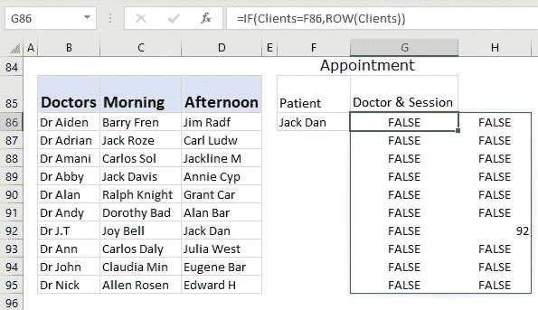

    **图 2.17：**返回客户行

+   `**MAX(IF(Clients=F86, ROW(Clients)))**``**:**`MAX 函数忽略`FALSE`值并返回行号。这成为`VLOOKUP`函数的查找值。

+   `**CHOOSE({1,2,3}, ROW(Clients), Doctors&”-Morning”, Doctors&”-Afternoon”):**` `CHOOSE`创建了一个表数组，用于`VLOOKUP`函数，其中客户行号作为查找值列，将医生与会话组合为返回值列。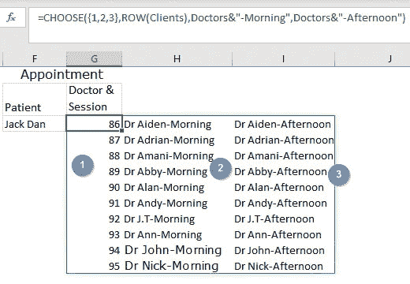

    **图 2.18：** VLOOKUP 自定义表数组

+   `**MAX(IF(Clients=F86, COLUMN(Clients)-COLUMN(Doctors)+1))**` 检查 F86 单元格中的客户是否在命名范围中的客户数组中，并返回客户的列号；否则，返回 FALSE 值。请注意，我们必须通过减去医生的列数并加 1 来调整列计数。

+   使用前述输入，`**VLOOKUP**`函数可以进行反向查找。

# 神话 13：VLOOKUP 无法进行水平查找

在 Excel 中，许多水平查找都留给了`HLOOKUP`函数，但这不再是情况，因为`VLOOKUP`函数也可以进行水平查找，如**图 2.19**所示。

在以下示例中，您应该查找每个项目报价最低的代表。

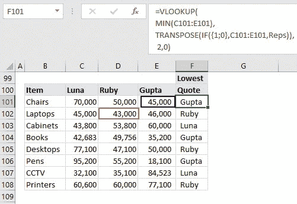

**图 2.19：** VLOOKUP 水平查找

`=VLOOKUP(`

`MIN(C101:E101),`

`TRANSPOSE(IF({1;0},C101:E101,Reps)),`

`2,0)`

此函数的工作方式如下：

+   `**MIN(C101:E101)**` 返回每个项目的最低金额。这成为`VLOOKUP`函数的查找值。

+   `**IF({1;0}, C101:E101, Reps)**` 返回一个两行表数组，其中第一行包含报价，第二行包含代表（见**图 2.20**）：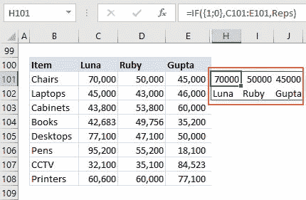

    **图 2.20：** 两行表数组

+   由于`VLOOKUP`只能垂直查找数据，我们需要使用`TRANSPOSE`函数将两行表转置为两列表（见**图 2.21**）：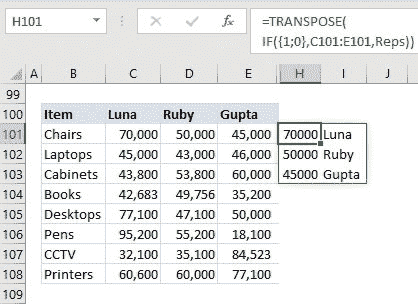

    **图 2.21：** 两列表数组

+   使用最低报价作为查找值和转置表作为表数组，`VLOOKUP`函数快速返回了报价最少的代表。

# 神话 14：VLOOKUP 无法返回多个非连续列

在前一节中，我们讨论了神话 2，即如何返回多个连续的列。现在，让我们进一步讨论如何返回多个非连续的列。

在我们的示例中（**图 2.22**），我们必须返回金额和地区列的数据：

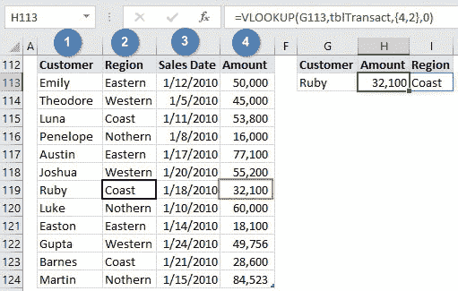

**图 2.22：** VLOOKUP 非连续列

`=VLOOKUP(G113, tblTransact,{4,2},0)`

我们必须记住的唯一技巧是将所需的列号放在花括号中。此外，如果您没有 Office 365 订阅，首先突出显示列，转到公式栏，编写上述公式，最后，**单击 Ctrl + Shift + Enter**。

如果您希望以行方式返回值，则唯一要记住的技巧是在列号之间使用分号（;）而不是逗号（,）作为分隔符（见**图 2.23**）：

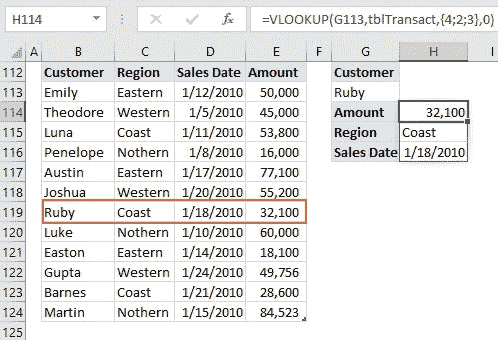

**图 2.23：** VLOOKUP 逐行查找非连续列

# 神话 15：VLOOKUP 无法查找多个非连续数组

动态查找非连续表需要更多的函数嵌套，如*图 2.24*所示：

`=VLOOKUP([@Amount],`

`CHOOSE(MATCH([@Product],{“椅子”,”笔记本电脑”},0),`

`椅子折扣, 笔记本电脑折扣), 2, TRUE)`

该函数的工作原理如下：

+   `**MATCH([@Product],{“椅子”, “笔记本电脑”},0)**` 动态返回产品在查找数组中的位置，即，椅子 = 1，笔记本电脑 = 2。

+   `**CHOOSE(MATCH([@Product],{“椅子”, “笔记本电脑”},0), 椅子折扣, 笔记本电脑折扣))**`：`CHOOSE`函数使用 MATCH 函数返回的位置来确定查找表数组，即，1=椅子折扣，2=笔记本电脑折扣。

+   `VLOOKUP`函数然后检查所选折扣表金额中的销售额，并返回近似折扣。

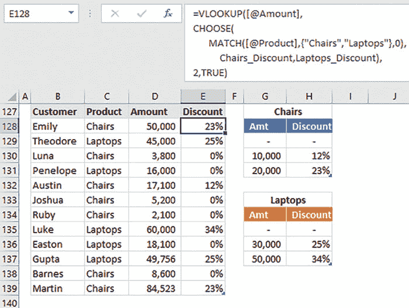

**图 2.24：** VLOOKUP 非连续查找表

# 结论

在本章中，我们学会了超越关于`VLOOKUP`的常识，并试图发挥其全部潜力。

我们发现，通过使用 IF 函数创建自定义表数组，无需重新排列列即可使`VLOOKUP`向左查找。此外，通过在花括号中包含所需的返回列，我们可以返回多个列。

此外，您无需费力使用`HLOOKUP`函数进行水平查找；相反，您可以简单地转置您的数据。

与`MATCH`函数结合使用时，`VLOOKUP`执行的任务等同于`INDEX` + `MATCH`的组合。

在下一章中，我们将调查为什么许多 Excel 用户更喜欢使用 INDEX 和 MATCH 函数的组合而不是`VLOOKUP`和`MATCH`。

# 需要记住的要点

+   每个 Excel 函数都有其限制，但大多数可以通过嵌套另一个函数来调整。这就是为什么我们在第一章指出每个 Excel 用户需要磨练他们的函数嵌套技能的原因。

+   使用 IF 函数为`VLOOKUP`函数创建自定义表数组使其更灵活且能够向左查找。然而，IF 函数仅限于返回一个两列表。如果我们需要更多列，我们使用`CHOOSE`函数。

+   `VLOOKUP`函数默认为近似搜索。这是它最大的弱点之一，任何用户都应该意识到这一点。

+   最后，永远不要在挑战之前接受函数的弱点。`
