# 第三章

# INDEX 和 MATCH

# 介绍

本章将介绍被视为`**VLOOKUP**`函数替代品的`**INDEX**`和`**MATCH**`。这些嵌套函数如此受欢迎，以至于一些用户认为它们是独立的函数。我们将首先分析这两个函数，然后看看它们为何是如此强大的组合。

此外，由于本书是关于精通 Excel，我们将学习如何将它们与其他函数结合使用来解决复杂的查找问题。

# 结构

在本章中，我们将讨论以下主题：

+   INDEX、MATCH 和双向查找

+   三向查找

+   反向查找单个结果

+   反向查找多个结果

+   多条件查找

+   返回多列

+   水平查找

+   查找非连续数组

+   使用通配符进行查找

+   基于文本长度进行查找

+   在列表中查找项目

+   查找唯一值

# INDEX、MATCH 和双向查找

双向查找用于通过匹配两个条件找到特定值。当您有一个数据表并且需要检索行和列的交点处的值时，通常会使用它。

INDEX 函数返回给定行和列的交点处的数据。因此，该函数需要一个数据数组，一个可选的行号（如果是***单行数组），以及一个可选的列号（如果是单列数组）***。

我们将首先查找多行和多列数组，如*图 3.1*所示。我们试图回答问题，“*客户 Gupta 从西部地区购买了多少？*”：

**图 3.1：** 索引多行和多列查找

`=INDEX(RegionSales,10,3)`

**注意：** 如果您的数据在表格中（这是范围 A2:D13 的日期），行计数从标题之后开始。

这就是为什么在*图 3.1*中，Gupta 在第 10 行而不是第 11 行。

我们可以选择您想要的列或行，而不是选择整个表格。

例如，在*图 3.2*中，由于我们知道我们想要西部地区的销售额，我们可以选择整个列，并仅提供包含我们客户的行号：

`=INDEX(RegionSales[Western],10)`

注意：如果您的数据在单列中，只需提供行号即可。

您可以将列号输入为 1，但是由于您只选择了一个列——西部地区的数据，因此这是不必要的。

例如，您可以将前述函数重写如下：

`=INDEX(RegionSales[Western],10,1)`

**图 3.2：** 索引单列查找

或者，您可以选择包含客户**“**`**Gupta**`**”**的整行，并仅提供列号，如*图 3.3*所示：

`=INDEX( A11:D11, 3 )`

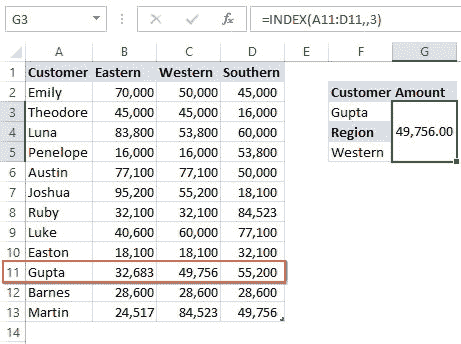

**图 3.3：** 索引单行查找

**注意：** 如果您的数据在单行中，只需提供列号即可。

您可以将行号输入为 1，但这是不必要的。

例如，您可以将前面的函数重写如下：

`=INDEX(A11:D11,1,3)`

现在我们已经了解了 INDEX 函数的工作原理，让我们修改`MATCH`函数。

正如我们在*第二章，“VLOOKUP 已死：还是吗”*中学到的，MATCH 函数返回数组中项目的相对位置。例如，在*图 3.2*中，我们可以动态获取行号而不是硬编码。我们使用`**MATCH**`函数来实现这一点，如*图 3.4*所示：

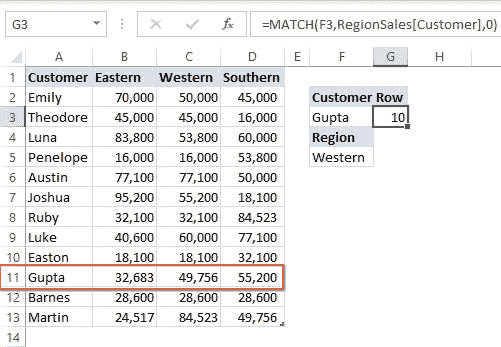

**图 3.4:** MATCH 函数获取行号

**注意:** `**MATCH**`函数返回第 10 行，但从图中我们可以看到客户在第 11 行。

正如我们之前注意到的，这是因为 MATCH 函数返回查找数组中值的相对位置。由于标题数据不在查找数组内，`**MATCH**`函数已忽略它。

知道`**MATCH**`函数可以自动化在`**INDEX**`函数中硬编码的行号，让我们用它替换行号（见*图 3.5*）：

`=INDEX(RegionSales[Western],`

`MATCH(F3,RegionSales[Customer],0))`

这是编写简单的 INDEX 和 MATCH 组合的最佳方式：

+   仅选择您需要的列/行。

+   使用`**MATCH**`函数获取条件行/列而不是硬编码它。

**图 3.5:** INDEX 和 MATCH 函数

我们不仅限于选择单列或单行数组。我们可以选择完整的表格并嵌套两个 MATCH 函数使我们的解决方案动态化（见*图 3.6*）：

`=INDEX(RegionSales,`

`MATCH(F3,RegionSales[Customer],0),`

`MATCH(G3,RegionSales[#Headers],0))`

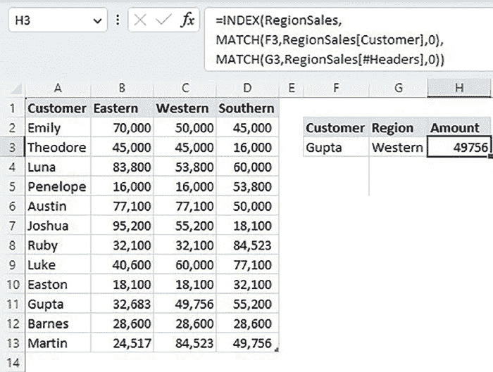

**图 3.6:** 动态二向查找

# 三向查找

三向查找公式允许您使用三个条件从表中获取数据（见*图 3.7*）：

`=INDEX(RegionSales,`

`MATCH(G18&H18,RegionSales[Product]&RegionSales[Customer],0),`

`MATCH(G20,RegionSales[#Headers],0))`

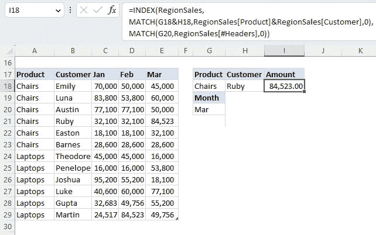

**图 3.7:** 动态三向查找

前面的函数执行如下：

+   `**G18&H18**`返回一个单一的组合条件，“ChairsRuby”。

+   `**RegionSales[Product]&RegionSales[Customer]**`连接两列并返回一个产品和客户的单向数组，我们可以用它来查找组合条件（见***图 3.8***）：

**提示**：创建单向数组时，要遵循与创建组合条件相同的顺序。

在我们的示例中，组合条件是`**Product 和 Customer**`的连接（`**ChairsRuby**`）；这就是我们在创建单一数组时遇到相同顺序的原因。

+   `**MATCH(G18&H18, RegionSales[Product]&RegionSales[Customer],0)**`返回包含组合条件的自定义单向数组中的行号。

+   `**MATCH(G20, RegionSales[#Headers],0))**` 返回包含月份条件的表头中的列号。

+   请记住这是一个数组函数，因为我们正在进行条件和列的连接。因此，如果您没有 Office 365 订阅，请在完成编写时记得单击**Ctrl + Shift + Enter**。

**图 3.8：** 单向数组

# 反向查找单个结果

反向查找是之前讨论的双向查找函数的相反。您从交叉点的数据开始，并返回行和列标题。

例如，在*图 3.10*中，我们知道考试，但我们必须查找导师和大厅：

`=INDEX(Tutors&“-”&Halls,`

`SUM((Exams=E33)*ROW(Exams))-ROW(Halls),`

`SUM((Exams=E33)*COLUMN(Exams))-COLUMN(Tutors))`

以下是前述函数的工作原理：

+   `**导师&“-”&大厅**` 返回一个包含每位导师和大厅组合的自定义表。

+   `**(Exams=E33)*ROW(Exams)**` 检查我们的条件考试是否在考试列表中，并返回一个`**TRUE / FALSE**`数组，当乘以考试行时，在`**FALSE**`处返回 0，在`**TRUE**`处返回行号（见***图 3.9***）。

+   我们对数组进行`**求和**`，以从前一步得到单个行号。由于`**INDEX**`从标题开始计算行号，因此我们需要减去标题的行号：`SUM((Exams=E33) * ROW(Exams)) - ROW(Halls)`

+   重复之前提到的类似步骤以获取列号：`SUM((Exams=E33) * COLUMN(Exams))- COLUMN(Tutors))`

+   请记住这是一个数组函数，因为我们创建了自定义导师和会话表。因此，如果您没有 Office 365 订阅，请在完成编写时记得单击**Ctrl + Shift + Enter**。

**图 3.9：** 考试行号

**提示：** 如果您尚未在表数组中包含行或列标题，请在计数中减去它们。

**图 3.10：** 反向查找

# 反向查找多个结果

现在，让我们学习如何在数据中存在重复项时返回多个项目。

使用前一节中的示例，假设患者`**杰克·丹**`有两个预约。*图 3.12*展示了如何返回这两个预约：

`=INDEX(Doctor&“ ”&session,`

`MATCH(TRUE,`

`INDEX(Patients,, LARGE(IF(Patients=$G$47,COLUMN(Patients)-COLUMN(Doctor)),ROW(A1)))=$G$47,0),`

`LARGE((Patients=$G$47)*COLUMN(Patients)-COLUMN(Doctor),ROW(A1)))`

此函数的工作方式如下：

+   `**医生&“ ”&会话**` 返回一个包含每位医生和会话组合的自定义表。

+   `**IF(Patients=$G$47, COLUMN(Patients)-COLUMN(Doctor))**` 检查我们的条件患者是否在患者列表中，并返回这些条件为`**TRUE**`的列号，否则为`**FALSE**`（见***图 3.11***）：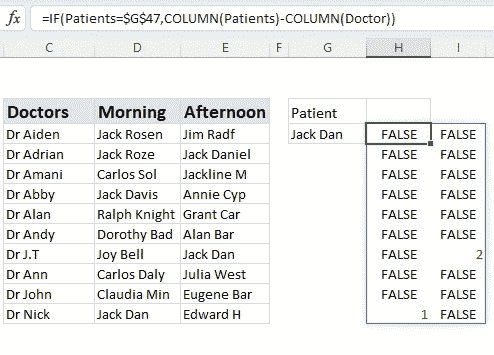

    **图 3.11：** 检查列

+   `**LARGE(IF(Patients=$G$47,COLUMN(Patients)-COLUMN(Doctor)),ROW(A1))**` 返回最大的列号，即 2。我们使用`ROW(A1)`，返回 1，随着我们向下滚动公式，数字递增。

+   `**INDEX(Patients,,LARGE(IF(Patients=$G$47,COLUMN(Patients)-COLUMN(Doctor)),ROW(A1)))**` 使用`**INDEX**`函数按列过滤数据（见***图 3.12***）：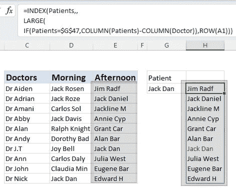

    **图 3.12：** 逐列过滤

+   `**MATCH(TRUE, INDEX(Patients,, LARGE(IF(Patients=$G$47, COLUMN(Patients)-COLUMN(Doctor)), ROW(A1)))=$G$47,0),**` 检查患者是否在过滤列中，并返回一个`**TRUE/FALSE**`数组。`**MATCH**`函数返回唯一`**TRUE**`值的相对位置，这形成了我们`**INDEX**`函数的行号。

+   现在我们有了行号，最后一部分是使用`**LARGE: LARGE(IF(Patients=$G$47,COLUMN(Patients)-COLUMN(Doctor)), ROW(A1))**`获取列号。

+   向下填充公式以返回所有预约。

+   请记住这是一个数组函数，因为我们创建了自定义医生和会话表。因此，如果您没有 Office 365 订阅，请在完成编写时记得单击**Ctrl + Shift + Enter**。

**图 3.13：** 反向查找多个项目

**注意：** 当所有预约都返回时，`**INDEX**`函数开始返回`**#NUM**`错误。

# 多条件查找

正如我们在前一节关于三向查找中所学到的，进行多条件查找的技巧是使用和号（&）将条件合并为一个（见*图 3.14*）：

`=INDEX(tblSalesT20[Amount],`

`MATCH(E60&F60,tblSalesT20[Customer]&tblSalesT20[Sales Date],0))`

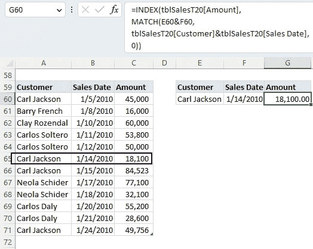

**图 3.14：** 多条件查找

上述函数的执行如下：

+   `**E60&F60**` 返回客户和日期的单个组合条件**“Carl Jackson40192.”**

+   `**tblSalesT20[Customer]&tblSalesT20[Sales Date]**` 返回客户和日期的单个组合数组（见*图 3.15*）：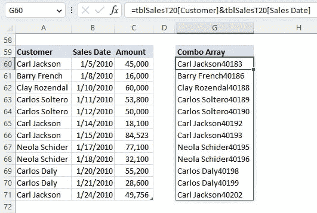

    **图 3.15：** 组合数组

+   `**MATCH(E60&F60,tblSalesT20[Customer]&tblSalesT20[Sales Date],0))**` `**MATCH**`函数返回组合条件在组合数组中的行号。

+   请记住这是一个数组函数，因为我们创建了自定义组合数组。因此，如果您没有 Office 365 订阅，请在完成编写时记得单击**Ctrl + Shift + Enter**。

# 返回多列

默认情况下，`**INDEX**`和`**MATCH**`组合返回单列。如果我们想要多列，必须修改`**MATCH**`函数，如*图 3.16*所示：

`=INDEX(RegionSale21,`

`MATCH(F75,RegionSale21[Customer],0),`

`MATCH(G74:H74,RegionSale21[#Headers],0))`

**图 3.16：** 多列

唯一的技巧是使用 MATCH 函数找到多个列的相对位置，`**MATCH(G74:H74,RegionSale21[#Headers],0))**`，通过突出显示两个条件(G74:H74)，`**MATCH**`函数返回一个列的数组({2,3})，这迫使`**INDEX**`函数返回两列。

这也是一个数组函数；因此，如果您没有 Office 365 订阅，请记住在编写完毕时点击**Ctrl + Shift + Enter**。

# 水平查找

与 VLOOKUP 函数不同，`**INDEX**`函数不限于垂直查找。如果提供正确的列或行号（参见*图 3.17*），返回数组可以存储在任何方向上：

`=INDEX(Suppliers,,`

`MATCH( MIN(B91:D91),B91:D91,0))`

**图 3.17：** 水平查找

这里唯一的技巧是使用 MIN 函数返回每件物品的最低报价。这个价格成为我们的查找值，用于`**MATCH**`函数。`**MATCH**`函数然后返回这个最低价格的相对位置。

**注意：** 由于供应商在单行数组中，我们可以跳过行号，如前面的公式所示。

# 查找非连续数组

如*图 3.18*所示，INDEX 函数有两种语法选项：

+   数组选项，期望单个或多个连续的数据数组。

+   参考选项，期望对单元格或非连续单元格范围的引用。以下是关于非连续范围的一些重要注意事项：

    +   范围必须用括号括起来，并用逗号分隔。

    +   范围必须在同一工作表上；否则，函数将导致`**#VALUE**`错误。

    +   范围可以是不同长度的，但必须包含引用的行或列号。超出范围的引用将导致`**#REF**`错误。

    +   范围在`**[area_num]**`参数中被选择的`**INDEX**`函数中。

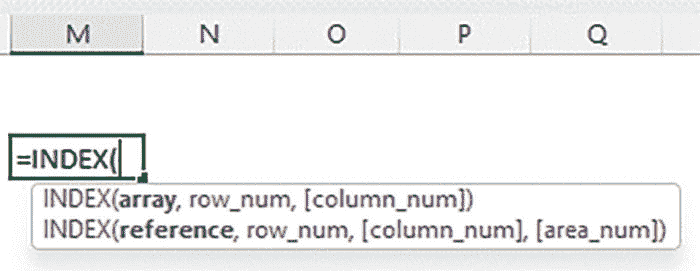

**图 3.18：** INDEX 参考选项

在*图 3.19*中给出的示例显示了椅子和笔记本电脑的不同折扣。我们可以使用以下函数查找不同的表：

`=INDEX((Chairs_Disc[Disc],Laptops_Disc[Disc]),`

`MATCH([@Amount],`

`CHOOSE(IF([@Product]=”Chairs”,1,2),Chairs_Disc[Amt],Laptops_Disc[Amt]),1),,`

`IF([@Product]=”Chairs”,1,2))`

**图 3.19：** INDEX 非连续数组

前述函数的工作方式如下：

+   `**( Chairs_Disc[Disc], Laptops_Disc[Disc] )**`返回椅子和笔记本电脑的两个不连续的折扣列。

+   **IF([@Product]=”Chairs”,1,2),** 如果表上的产品是椅子，则返回 1；否则返回 2。这是`**CHOOSE**`函数将确定以选择椅子或笔记本电脑表中的金额列的索引。

+   `**MATCH([@Amount],CHOOSE(IF([@Product]=”Chairs”,1,2),Chairs_Disc[Amt],Laptops_Disc[Amt]),1)**` MATCH 函数返回折扣表金额列中金额的近似相对位置。

+   由于我们选择的是单列数组，因此可以忽略列索引参数并跳转到区域编号参数。

+   **IF([@Product]=”Chairs”,1,2),** 如果表上的产品是椅子，则返回 1；否则，返回 2。这决定了选择椅子和笔记本电脑两个不连续的折扣列中的哪一个。

# 通配符查找

正如在上一章中所学到的，特别是在`**VLOOKUP**`部分查找部分中，`**INDEX-MATCH**`组合也可以使用两个流行的通配符字符（? *）。

例如，在*图 3.20*中，我们想要查找包含字母“P”的发票的金额：

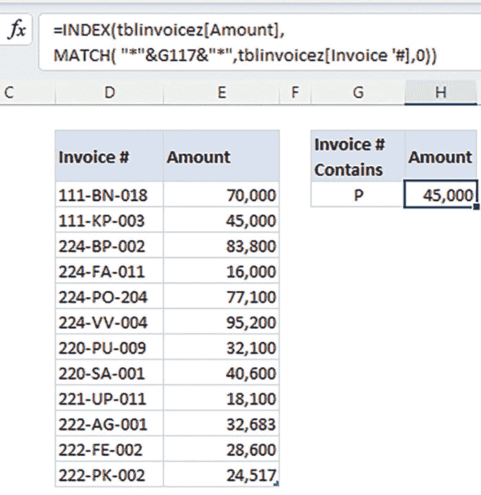

**图 3.20：** 使用星号通配符字符的 INDEX

`=INDEX(tblinvoicez[Amount],`

`MATCH(“*”&G117&”*”,tblinvoicez[Invoice ‘#],0))`

在使用通配符字符时，请记住以下几点：

+   **星号（*）**：星号通配符表示文本字符串中的零个或多个字符。

+   **问号（?）**：问号通配符表示文本字符串中的单个字符。

+   您可以结合星号和问号来进一步定义您的搜索。

以下是前述函数的工作原理：

+   `**“*”&G117&”*”**` 返回 *P*，这意味着字母`**P**`前后可能有许多字符。

+   `**MATCH**` 函数返回第一张发票中包含字母`**P**`的相对行位置。

+   `**INDEX**` 函数返回相同行号中的发票金额。

假设您想要查找第五个字符为字母“P”的发票号的值？

在这种情况下，我们将使用问号（?）作为通配符字符，表示任何单个字符（见***图 3.21***）：

**图 3.21：** 使用混合通配符字符的 INDEX

`=INDEX(tblinvoicez[Amount],`

`MATCH(“????”&J117&”*”,tblinvoicez[Invoice ‘#],0))`

以下是前述函数的工作原理：

+   `**“????”&J117&”*”**` 返回`????P*`，这意味着字母“P”前可能有任意四个字符。因此，“P”是第五个字符，但它后面有多个字符。

+   MATCH 函数返回第一张发票中发票号第五个字符为字母“P”的相对行位置。

+   INDEX 函数返回相同行号中的发票金额。

# 基于文本长度的查找

在*图 3.22*中，我们假设所有发票的后订单都可以通过发票号的长度（即 8 个字符）来识别：

**图 3.22：** 基于长度查找文本

要查找这些后订单发票，我们使用以下公式：

`=INDEX(Invoices[Amount],`

`MATCH( G132,LEN(Invoices[Invoice ‘#]),0))`

以下是前述函数的工作原理：

+   `**LEN(Invoices[Invoice ‘#]), the**` `LEN` 函数返回一个发票号长度的数组。这成为 `MATCH` 函数的查找数组参数。

+   `**MATCH**` 函数返回第一张发票的相对行位置，其长度为 8 个字符。

+   `**INDEX**` 函数返回相同行号的发票金额。

假设您有多张备货发票，如 *图 3.23* 所示。让我们学习如何借助 `**MAX**` 函数返回最后匹配项：

`=INDEX(Invoices[Amount],`

`MAX(`

`(LEN(Invoices[Invoice ‘#])=G132)*ROW(Invoices[Invoice ‘#])`

`-ROW(Invoices[#Headers])`

`))`

**图 3.23：** 查找最后匹配项

以下是前述函数的工作原理：

+   `**LEN(Invoices[Invoice ‘#])**` LEN 函数返回一个发票号长度的数组。

+   `**LEN(Invoices[Invoice ‘#])=G132**` 检查哪张发票长度等于 8，并返回一个 `**TRUE/FALSE**` 数组。

+   通过将 TRUE/FALSE 数组乘以行号来获取行号： `**(LEN(Invoices[Invoice ‘#])=G132)*ROW(Invoices[Invoice ‘#])**`

+   通过减去标题行来调整行号计数。

+   要获取最后一行，请使用 `**MAX**` 函数。

+   `**INDEX**` 函数返回 `**MAX**` 函数返回的最后匹配行号中的发票金额。

# 列表中的查找项目

当你理解 `**COUNTIF**` 函数时，在列表中查找项目相对容易。

在 *图 3.24* 中，我们想要查找第一个从我们这里购买的客户，使用单元格 G 中列表中的任何货币。

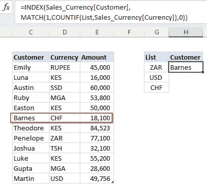

**图 3.24：** 列表中的查找项目

`=INDEX(Sales_Currency[Customer],`

`MATCH(1,COUNTIF(List, Sales_Currency[Currency]),0))`

以下是前述函数的工作原理：

+   `**COUNTIF(List, Sales_Currency[Currency])**` `**COUNTIF**` 函数返回一个 1/0 数组，其中 1 是货币在列表中找到的计数，否则为 0。这成为 `MATCH` 函数的查找数组参数。

+   `**MATCH**` 函数返回第一张发票的相对行位置，计数为 1。

+   `**INDEX**` 函数返回相同行号的客户。

如果我们想返回所有项目而不仅仅是第一个匹配项，我们必须修改我们的公式，如 *图 3.25* 所示：

`=INDEX(`

`Sales_Currency[Customer],`

`LARGE(`

`COUNTIF(List, Sales_Currency[Currency])`

`*ROW(Sales_Currency[Currency])-ROW(Sales_Currency[#Headers]), ROW(A1))`

`)`

以下是前述函数的工作原理：

+   `COUNTIF(List, Sales_Currency[Currency])`

    `*ROW(Sales_Currency[Currency])` `**COUNTIF**` 函数返回一个 1/0 数组，其中 1 是货币在列表中找到的计数，否则为 0。将此数组乘以行号以返回包含列表中项目的行号列表。记得通过减去标题行号来调整行号以从标题后开始计数。

+   我们需要遍历这个行号码列表，并逐个作为 `**INDEX**` 函数的行参数返回。我们使用 `LARGE` 函数来完成这个任务，它从最大到最小返回行号。注意 ROW(A1) 评估为 1，当你向下拖动函数时，它会增加直到完整列表被迭代。

+   **INDEX** 函数使用 `LARGE` 函数返回的每行号码，并返回相应的客户。

+   请注意，当所有客户都返回后，`**INDEX**` 函数会返回 `**#VALUE**` 错误。

**图 3.25:** 在列表中查找多个项目

如果我们不希望公式返回错误，我们可以将其嵌套在 `**IFERRROR**` 函数中，如下所示。`**IFERROR**` 函数现在返回空白而不是错误：

`=IFERROR(`

`INDEX(Sales_Currency[Customer],`

`LARGE(`

`COUNTIF(List,Sales_Currency[Currency])`

`*ROW(Sales_Currency[Currency])`

`-ROW(Sales_Currency[#Headers]),ROW(A1))),`

`“”)`

# 查找唯一值

掌握 `**COUNTIF**` 函数是提升我们查找技能的重要一步。例如，如果你想在 Excel 中查找唯一值，你必须利用 `**COUNTIF**` 函数，如 *图 3.26* 所示：

`=INDEX(Sales[Customer],`

`MATCH(TRUE, COUNTIF(Sales[Currency],Sales[Currency])=1,0))`

以下是这个函数的工作原理：

+   `**COUNTIF(Sales[Currency],Sales[Currency])**` `**COUNTIF**` 函数返回列中每个货币的计数数组。由于我们正在寻找唯一值，我们检查哪个计数等于 1 ► `**COUNTIF(Sales[Currency],Sales[Currency])=1**`。这个比较返回一个 `TRUE/FALSE` 数组，其中 `TRUE=唯一`，`FALSE=重复`。

+   `**MATCH**` 函数返回前述数组中第一个 `**TRUE**` 值的相对行位置。

+   **INDEX** 函数返回相同行号的客户。

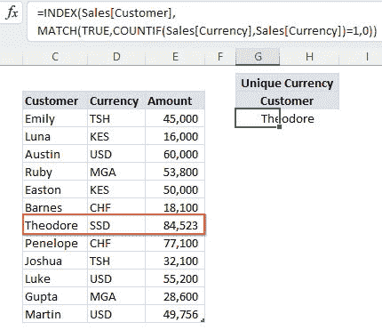

**图 3.26:** 查找唯一项目

# 查找底部 *n* 值

如果我们首先了解 `**IF**` 和 `**SMALL**` 函数，查找底部值就相对容易了。例如，在 *图 3.27* 中，我们查找三个销售额最低的客户：

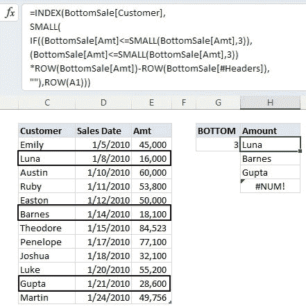

**图 3.27:** 查找底部项目

`=INDEX(BottomSale[Customer],`

`SMALL(`

`IF((BottomSale[Amt]<=SMALL(BottomSale[Amt],3)),`

`(BottomSale[Amt]<=SMALL(BottomSale[Amt],3))*ROW(BottomSale[Amt])-ROW(BottomSale[#Headers]),`

`“”),ROW(A1)))`

以下是前述函数的工作原理：

+   **SMALL(BottomSale[Amt],3)** `SMALL` 函数返回第三个最小的金额 — 28,600。下一步是检查哪个金额小于或等于这第三个最小的金额 ► **(BottomSale[Amt]<=SMALL(BottomSale[Amt],3))**。这个比较返回一个 `TRUE/FALSE` 数组。

+   `**BottomSale[Amt]<=SMALL(BottomSale[Amt],3))*ROW(BottomSale[Amt])**` `**])-ROW(BottomSale[#Headers])**` 要获得一系列行号，我们将`TRUE/FALSE`数组与金额的行号相乘。记得调整行号，从标题行号中减去以开始计数。

+   下一步是使用 IF 函数将前面数组中的负值替换为空白：`**IF((BottomSale[Amt]<=SMALL(BottomSale[Amt],3)), (BottomSale[Amt]<=SMALL(BottomSale[Amt],3))*ROW(BottomSale[Amt])-ROW(BottomSale[#Headers]), “”)**`

+   我们需要遍历这个行号列表，并逐个作为 INDEX 函数的行参数返回。为此任务，我们使用`SMALL`函数，它按从最小到最大的顺序返回行号。注意`ROW(A1)`评估为 1，当您向下拖动函数时，它会增加直到完整列表被迭代。

+   `**INDEX**`函数使用`**SMALL**`函数返回的每个行号，并返回相应的客户。

+   请注意，当所有客户都被返回后，`**INDEX**`函数会返回“#NUM”错误。

正如我们在前一节中学到的，如果不希望 INDEX 函数返回错误，可以将其嵌套在`IFERROR`函数中，如下所示：

`=IFERROR(`

`INDEX(BottomSale[Customer],`

`SMALL(`

`IF((BottomSale[Amt]<=SMALL(BottomSale[Amt],3)),`

`(BottomSale[Amt]<=SMALL(BottomSale[Amt],3))`

`*ROW(BottomSale[Amt])-ROW(BottomSale[#Headers]),`

`“”),ROW(A1))),`

`“”)`

# 结论

本章提供了一个更好的查找方法，即`VLOOKUP — INDEX/MATCH`组合。

这种组合是更好的选择的主要原因有三点：(i) 它允许我们选择不仅是两列表，还可以是单列/行数组；(ii) 选择单列/行数组的能力使其灵活，不仅可以向左或向右查找，还可以垂直或水平查找；(iii) 由于它不默认进行近似匹配，这种组合更不容易出错。

对于没有 Office365 订阅的用户，`INDEX/MATCH`组合是最有效的查找方法。

在下一章中，我们将探讨为什么一些 Excel 用户仍然使用最古老的遗留查找函数之一 — `LOOKUP` 和 `HLOOKUP`。

# 需要记住的要点

+   与`VLOOKUP`函数类似，`INDEX/MATCH`组合默认返回第一个匹配的单个值。如果我们想要嵌套多个值，可以使用`SMALL/LARGE`函数。

+   与`VLOOKUP`函数不同，`INDEX/MATCH`函数的行数是基于所选数组的，而不是 ROW 函数返回的默认行数。因此，如果您的数据不是从最顶部行开始的，必须调整行数。
