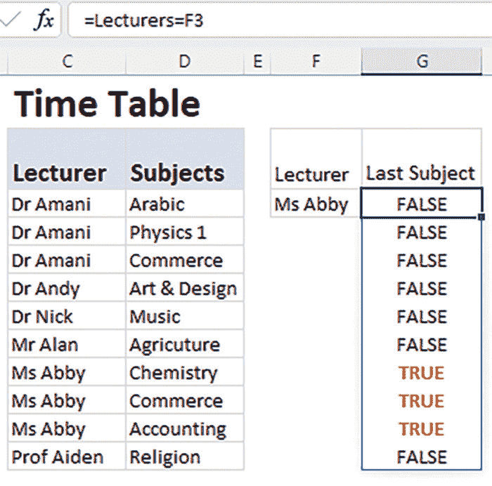
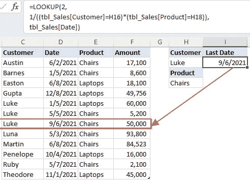
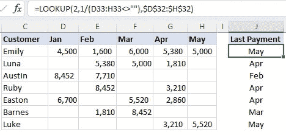
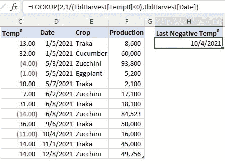
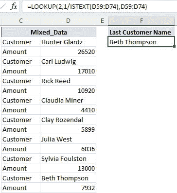
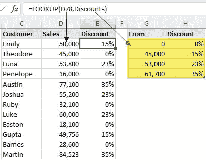
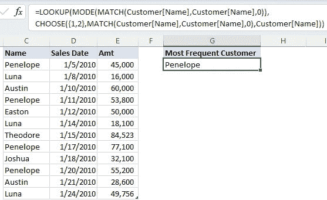
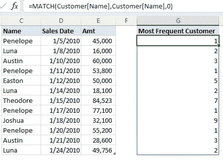
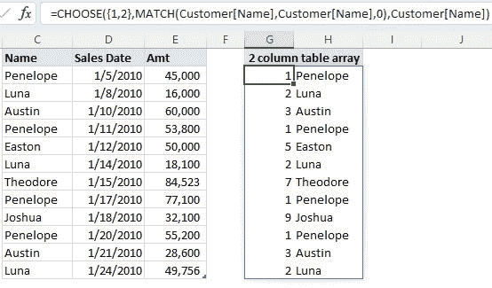

# 第四章

# LOOKUP

# 介绍

在本章中，我们将讨论 LOOKUP 函数，这个函数从 Excel 的最早版本就存在。`**LOOKUP**`函数的长寿和持续存在于 Excel 中证明了它作为数据检索和电子表格分析基本工具的价值和广泛应用。

您可以在向量形式和数组形式中都使用`**LOOKUP**`函数。

在向量形式中，您在一个列/行中搜索一个项目，并从另一个列/行中的相同位置返回一个项目。

**语法如下：**

`=LOOKUP (lookup_value, lookup_vector, [result_vector])`

其中：

+   `**lookup_value**`：您要查找的值。

+   `**lookup_vector**`：包含要搜索的值的单列/行（注意：它应按升序排序）。

+   `**result_vector**`：包含要返回的值的单列/行。

**注意**

+   如果要指定包含要搜索的值的列/行，则向量形式最为适用。

+   如果未找到查找值，则`**LOOKUP**`函数将匹配小于查找值的下一个最大值。

+   如果未找到查找值并且小于查找范围中的最小值，则`**LOOKUP**`函数将返回`**#N/A**`错误值。

+   `**Lookup_vector**`和`**result_vector**`范围必须具有相同的大小。

在数组形式中，我们在表数组（行和列）的第一列/行中搜索项目，并返回表数组的最后一列/行中与之相同位置的值。

语法如下：

`=LOOKUP (lookup_value, array)`

其中：

+   `**lookup_value:**` 您要查找的值。

+   `**Array:**` 包含要搜索的值的列/行。

**注意：**

+   第一行/列中的值必须按升序排序。

+   搜索是水平还是垂直取决于行数与列数的比较。如果数组的行数多于列数，则`**LOOKUP**`将搜索第一列；否则，它将搜索第一行。

+   如果未找到查找值并且小于查找范围中的最小值，则`**LOOKUP**`函数将返回`**#N/A**`错误值。

+   如果未找到查找值，则`**LOOKUP**`函数将匹配小于查找值的下一个最大值。

# 结构

在本章中，我们将讨论应该使用`**LOOKUP**`函数的五种情况：

+   使用条件查找最后匹配项

+   查找最后一个空单元格

+   查找最后一个负数或文本

+   在数组中查找近似匹配项

+   查找最重复的项目

# 使用条件查找最后匹配项

`LOOKUP`函数的一个日常用途是检索最后匹配的值。在这个例子中，我们将使用向量形式。

我们正在尝试找到 Ms Abby 在*图 4.1*中提供的最后一个科目：

**图 4.1：** 在列中查找最后匹配项

`=LOOKUP(2,1/(Lecturers=F3), Subjects)`

以下是前述函数的工作原理：

+   2 代表一个我们确定不会在查找向量中找到的大值。

+   `**Lecturers=F3**` 返回一个`TRUE/FALSE`数组，其中 TRUE 表示满足条件，即讲师为 Ms Abby；否则返回 FALSE（见*图 4.2*):

    **图 4.2:** 检查是否符合条件

+   `**1/(Lecturers=F3)**` 通过将 1 除以每个值，将 TRUE/FALSE 转换为数值等效值（见*图 4.3*):

    **图 4.3:** 将 TRUE/FALSE 转换为数值等效值

**注意:** 有四种方法将布尔值转换为数值等效值：

+   通过加上零：**(Lecturers=F3)+0**

+   通过乘以 1：**(Lecturers=F3)*1**

+   使用双重一元方法：--**(Lecturers=F3)**

+   通过除以 1：1/**(Lecturers=F3)**

+   我们应该选择最后一种方法，因为它是唯一不包含零在结果中的方法；在查找向量中包含零可能会破坏升序排列并导致函数返回意外结果或错误。

+   由于找不到 2，并且查找向量中最大的值是 1，LOOKUP 函数匹配数组中的最后一个 1，并返回结果向量中相同位置的值。

我们不仅限于使用单一条件。例如，在*图 4.4*中，我们想知道客户 Luke 购买椅子的最后日期：

**图 4.4:** 使用多个条件查找最后一个匹配项

`=LOOKUP(2,`

`1/((tbl_Sales[Customer]=H16)*(tbl_Sales[Product]=H18)),`

`tbl_Sales[Date])`

以下是前述函数的工作原理：

+   `**2**` 代表一个我们确定不会在查找向量中找到的大值。

+   `**(tbl_Sales[Customer]=H16)*(tbl_Sales[Product]=H18)**` 返回一个由 1/0 组成的数组，其中 1 表示客户为 Luke 且产品为椅子的行位置。

+   `**1/((tbl_Sales[Customer]=H16)*(tbl_Sales[Product]=H18))**` 我们将前述数组除以 1，以排除所有零。在查找向量中包含零可能会破坏升序排列并导致函数返回意外结果或错误。

+   由于找不到 2，并且查找向量中最大的值是 1，`**LOOKUP**`函数匹配数组中的最后一个 1，并返回结果向量中相同位置的值。

# 查找最后一个空单元格

查找数组中的最后一个空白与前述示例类似，唯一的区别在于逻辑测试。与前述示例类似，我们将使用`LOOKUP`函数的向量形式进行水平查找。

在*图 4.5*中，我们查找客户最后一次付款的月份，即最后一个非空月份：

**图 4.5:** 查找最后一个非空单元格

`=LOOKUP(2, 1/(D33:H33<>””), $D$32:$H$32 )`

以下是此函数的工作原理：

+   `**2**` 表示我们确定不会在查找向量中找到的一个大值。

+   `**D33:H33<>””**` 返回一个`TRUE/FALSE`数组，其中`TRUE`表示行中的非空单元格。

+   `**1/(D33:H33<>””)**` 我们将前面的数组除以 1，将布尔数组转换为其数值等效形式，并排除所有零。在查找向量中包含零可能会破坏升序并导致函数返回意外结果或错误。

+   由于找不到 2，并且查找向量中的最大值为 1，LOOKUP 函数匹配数组中的最后一个 1，并返回结果向量中相同位置的值，即`**$D$32:$H$32**`。

# 查找最后一个负数或文本

`LOOKUP`函数的向量形式是查找数组中任何最后一个值的最强大函数。我们需要学习的唯一技巧是为查找向量创建复杂的逻辑测试。

例如，在*图 4.6*中，我们想要查找最后一次出现负温度的日期：

**图 4.6：** 查找最后一个负数

`=LOOKUP(2,1/(tblHarvest[Temp0]<0),tblHarvest[Date])`

这个公式的工作方式与前面示例中的其他公式相同，除了逻辑测试。在这个示例中，`**tblHarvest[Temp0]<0**` 返回一个`**TRUE/FALSE**`数组，其中 TRUE 表示所有小于零的值。

要查找最后一个文本，如*图 4.7*所示，使用 ISTEXT 函数返回一个 TRUE/FALSE 值数组，其中 TRUE 表示文本函数。

函数的其他方面与之前解释的相同。

`=LOOKUP(2,1/ISTEXT(D59:D74),D59:D74)`

**图 4.7：** 查找最后一个文本

# 在数组中查找近似匹配

在我们之前的所有示例中，我们都使用了`LOOKUP`函数的向量形式。现在，让我们学习如何使用数组形式在数组中查找近似匹配。

例如，在*图 4.8*中，我们正在查找使用近似匹配从折扣表中获取折扣百分比。

**图 4.8：** 在数组中查找近似匹配

`=LOOKUP(D78, Discounts)`

这是这个函数的工作原理：

+   存储在列 D 中的销售值被用作查找值。

+   LOOKUP 函数使用折扣表的第一列作为查找数组，并在结果向量的相同位置返回近似值。

+   请记住，表数组的第一列中的值必须按升序排序。

# 查找最重复的项目

这是使用`LOOKUP`函数的数组形式的另一个示例。在*图 4.9*中，我们正在寻找最频繁的客户：

**图 4.9：** 查找最重复的项目

`=LOOKUP(MODE(MATCH(Customer[Name],Customer[Name],0)),`

`CHOOSE({1,2},MATCH(Customer[Name],Customer[Name],0),Customer[Name]))`

以下是前述函数的工作原理：

+   `**MATCH(Customer[Name], Customer[Name],0)**` 函数返回一个等于客户数量的数组，其中数组中的每个项目表示数据中客户姓名首次出现的位置（见*图 4.10*）。

    **图 4.10：** 客户的位置

+   `**MODE(MATCH(Customer[Name], Customer[Name],0)**` 函数返回数组中重复次数最多的项目。

+   我们使用`CHOOSE`函数创建一个两列表格数组，其中第一列是客户的位置，第二列是客户的姓名（见*图 4.11*）。

    **图 4.11：** 两列表格数组

+   `**LOOKUP**`函数使用两列表格的第一列作为查找数组，并返回第二列中与最后匹配值相同位置的客户姓名。

# 结论

在本章中，我们了解到`**LOOKUP**`函数在查找最后一个匹配项时是最佳选择。无论是使用向量形式还是数组形式，只要查找数组数据按升序排序，`**LOOKUP**`函数都可以用于垂直或水平查找数据。

由于其限制，仅建议用于近似匹配和查找最后一个匹配项。

在下一章中，我们将探讨其他可用于查找数据的函数，尽管它们不被归类为查找函数。

# 记住的要点

+   Excel 的`**LOOKUP**`功能有限，因此不建议日常使用。作为替代方案，考虑使用`**VLOOKUP**`或`**INDEX**`/`**MATCH**`函数。

+   `**LOOKUP**`函数没有精确匹配选项；它的所有用途默认为近似匹配。

# 多项选择题

1.  以下公式的结果是什么：

    `=LOOKUP(0, {1,2,3,4,5}, {“A”,“B”,“C”,“D”,“E”})?`

    1.  A

    1.  B

    1.  C

    1.  D

    1.  E

    1.  #N/A

1.  以下公式的结果是什么：

    `=LOOKUP(“Z”, {“A”,“B”,“C”,“D”,“E”}, {1,2,3,4,5})?`

    1.  1

    1.  2

    1.  3

    1.  4

    1.  5

    1.  #N/A

1.  以下公式的结果是什么：

    `=LOOKUP(5, {1,2,3,4,6}, {“A”,“B”,“C”,“D”,“E”})`?

    1.  A

    1.  B

    1.  C

    1.  D

    1.  E

    1.  #N/A

1.  LOOKUP 函数的向量形式和数组形式之间有什么区别？

    1.  向量形式在一列/行中搜索项目，并返回另一列/行中相同位置的项目，而数组形式在表格数组的第一列/行中搜索项目，并返回表格数组的最后一列/行中相同位置的值。

    1.  向量形式在表格数组的第一列/行中搜索项目，并返回表格数组的最后一列/行中相同位置的值，而数组形式在一列/行中搜索项目，并返回另一列/行中相同位置的项目。

    1.  向量形式搜索精确匹配，而数组形式搜索近似匹配。

    1.  向量形式搜索近似匹配，而数组形式搜索精确匹配。

# 答案

1.  f

1.  e

1.  d

1.  a
