# 第五章

# 其他查找方法和函数

# 介绍

在本章中，我们将讨论可用于查找数据的替代方法和函数。

许多 Excel 用户在面对查找问题时只会使用查找函数，他们没有深入了解其他函数的工作原理的机会。

根据数据的大小或任务的复杂性，某些替代方法可能比已知的查找函数更有效或更快。

现在让我们探讨不同的方法，以帮助我们确定最有效的解决方案。

# 结构

在本章中，我们将讨论查找数据的六种独特替代方法和函数：

+   使用高级筛选来查找列表中的项目/不在列表中的项目

+   使用 Excel 交集运算符进行双向查找

+   使用数据库函数查找数值数据

+   使用`**SUMIFS**`、`**SUMPRODUCT**`、`**AGGREGATE**`和`**MAX**`/`**MAXIFS**`来查找数值数据

+   查找图片

+   查找项目的单元格地址

+   使用数据透视表查找列表中的唯一项目

# 使用高级筛选查找列表中的项目/不在列表中的项目

许多 Excel 用户在日常查找任务中必须使用高级筛选选项。与标准筛选不同，您只有在将鼠标悬停在其上时才能看到筛选标准，高级筛选选项对所有用户都是可见的。

*图 5.1*展示了使用高级筛选查找所有椅子购买的情况：

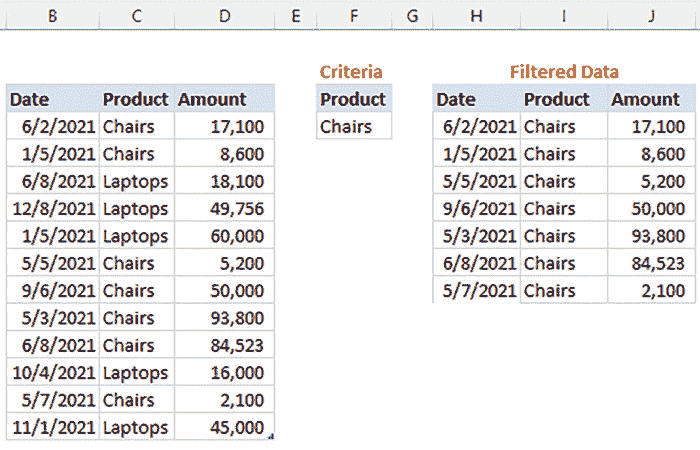

**图 5.1:** 使用高级筛选在表中查找项目

**以下是要遵循的步骤：**

1.  点击包含所有数据的表格的任意位置。

1.  转到数据选项卡，点击高级筛选选项。

1.  在`**高级筛选弹出屏幕**`上（见*图 5.2*）：

    1.  点击`**复制到另一个位置**`。

    1.  如果您使用的是表格并且已经按照前面的步骤操作，列表范围将会自动选择。

    1.  选择一个标准范围 — 包括标头和包含标准的单元格都应该被选中。由于高级筛选从`**标准范围:**`读取到`**列表范围:**`，所以标头应该是相同的。

    1.  在`**复制到**`字段中，选择一个单元格来复制筛选后的表格。

    1.  最后，点击`**确定**`。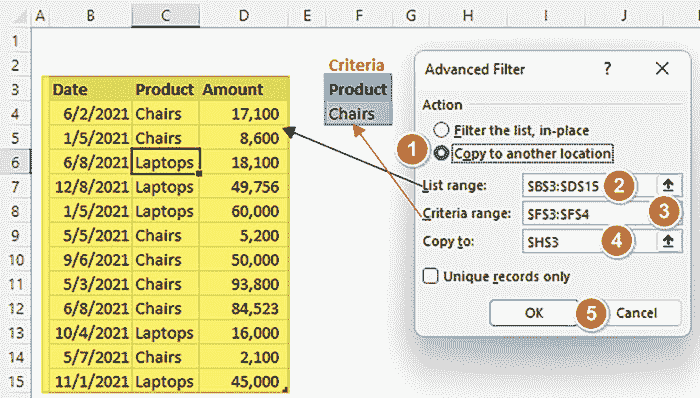

    **图 5.2:** 选择列表中项目的高级筛选选项

要查找不在表中的项目，将标准改为包含“不等于”运算符（<>），然后按照前面的步骤操作。

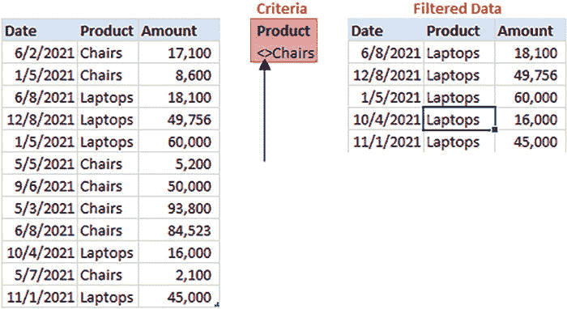

**图 5.3:** 使用高级筛选查找列表中不在的项目

如果我们想查找唯一值，高级筛选也有这个选项。如*图 5.4*所示，假设我们想知道我们种植的独特作物：

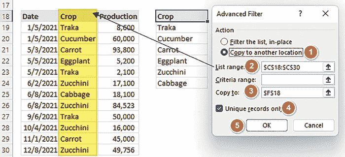

**图 5.4:** 使用高级筛选查找列表中的唯一项目

**注意：** 在唯一记录过滤中，我们跳过条件范围，而是选择`**仅唯一记录**`选项。

所有其他步骤，如上所述，均适用。

# 使用 Excel 交集运算符进行双向查找

Excel 交集运算符是解决双向查找问题的最少为人知但理想的方法之一，即查找两个命名范围的交叉值。

我们只需要记住，在这些范围之间加入**一个空格字符**就成为了交集运算符。

在*图 5.5*中，交集运算符用于返回由客户 Joshua 在西部地区进行的销售：

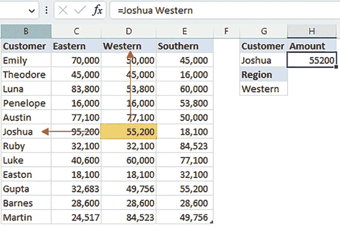

**图 5.5：** 使用 Excel 交集运算进行双向查找

**以下是要遵循的步骤：**

1.  单击包含所有数据的表格的任意位置。

1.  转到`**公式**`选项卡，在`**定义名称**`下，点击`**从选择创建**`。

1.  `**从选择创建名称**`弹出窗口将出现，如*图 5.6*所示。选择从顶部行和左侧列的值创建名称。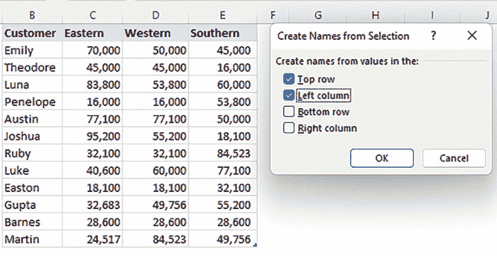

    **图 5.6：** 创建用于交集的名称

1.  创建名称后，您可以使用交集运算符。输入行标题（Joshua）和列标题（Western），它们之间用空格分隔，这就是交集运算符，如*图 5.7*所示：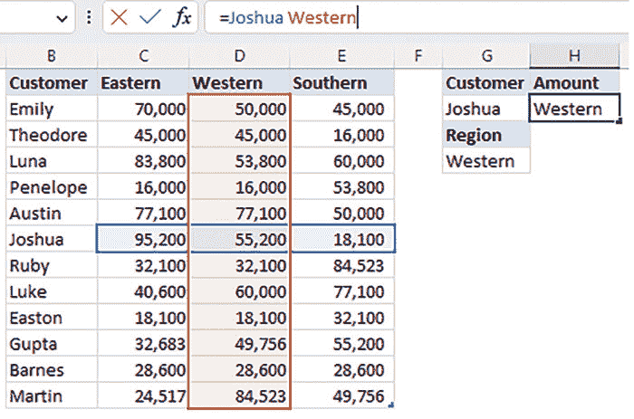

    **图 5.7：** 使用交集运算

交集运算不仅限于单个条件操作；我们可以用它来处理多个条件，如*图 5.8*所示。我们想知道 Joshua 在西部和南部地区购买的总金额：

`=SUM(Joshua Western:Southern)`

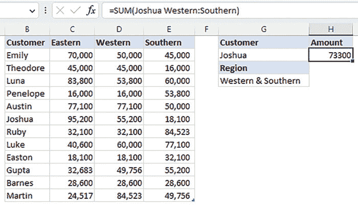

**图 5.8：** 使用多个条件进行交集运算的双向查找

**公式的工作原理：**

我们将按照相同的步骤创建命名范围。但是，对于这个解决方案，我们将选择两个由冒号分隔的区域。

这将返回两个区域的金额，如*图 5.9*所示。

最后，将金额相加以获得总额。

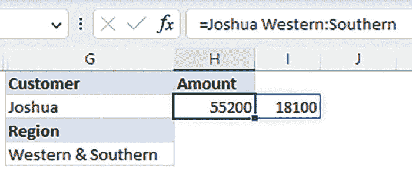

**图 5.9：** 多条件结果

我们还可以查找非相邻列的总值，如*图 5.10*所示。

在这个例子中，我们想知道 Joshua 在东部或南部地区的总值。

唯一需要记住的技巧是使用加号（+）作为 OR 逻辑的替代。

`=Joshua Eastern + Joshua Southern`

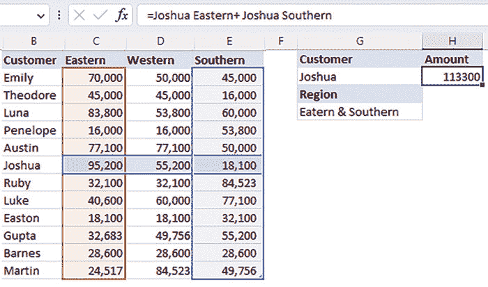

**图 5.10：** 多个 OR 条件结果

**注意：** 交集运算符适用于单元格范围引用和命名范围。

您需要记住的是在这些范围之间包含一个空格。

# 使用数据库函数查找数字数据

自 Excel 2007 以来，数据库函数一直存在，然而许多用户并不了解它们查找数字数据的能力和潜力。

数据库函数对满足指定条件的记录执行特定计算。

语法如下：

`= DSUM(Database, Field, Criteria)`

其中：

1.  数据库必须是一个数据范围，其中每一行被视为一条记录，每一列被视为一个字段，顶部行包含字段的标识符。

1.  字段是包含要查找数据的列。

1.  条件是确定要查找的记录的范围或一组条件。它必须包含列标题，并且标准必须对应于数据库中的字段名称。

例如，在*图 5.11*中，我们要查找 3 月销售的钢笔数量：

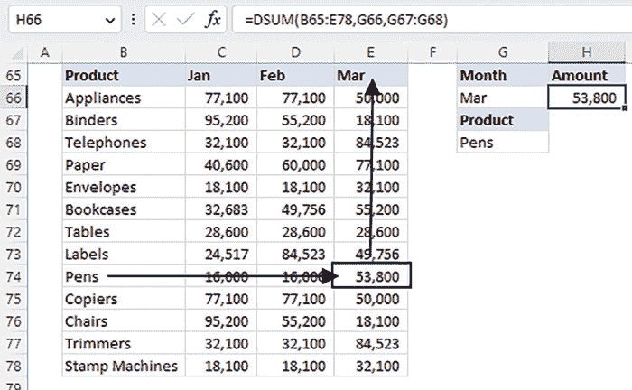

**图 5.11：** 多个 OR 条件结果

`=DSUM (B65:E78, G66, G67:G68)`

其中：

1.  **数据库**：包括标题的所有数据范围 ►B65:E78。

1.  **字段**：包含查找数据的列标题 ► 存储在单元格 G66 中的 Mar。

1.  **条件**：包含列标题和作为条件的字段值的范围。有关更多信息，请参见*图 5.12*。

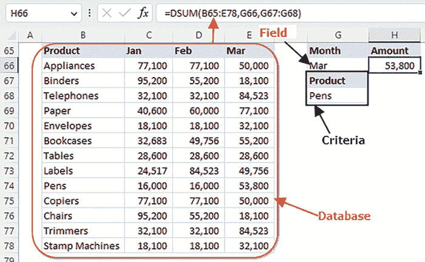

**图 5.12：** 数据库函数中的参数

数据库函数不仅限于简单条件，如前面的示例所示；您可以创建复杂条件，如*图 5.13*所示：

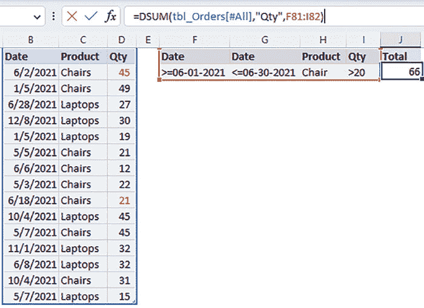

**图 5.13：** 数据库函数中的复杂条件

`=DSUM(tbl_Orders[#All],”Qty”,F81:I82)`

该公式返回大于 6 月 1 日且小于 6 月 30 日的日期的产品椅子的订单，并且数量大于 20。

公式的工作原理如下：

1.  **数据库**：名为`**tbl_Orders**`的表中的所有数据。

1.  **字段**：其标题为`**Qty**`的列。

1.  **条件**：包含在单元格范围 F81:182 中的所有信息。

**注意**：条件区域**不得包含**任何空白行或列。

# 使用 SUMIFS、SUMPRODUCT、AGGREGATE 和 MAX 函数查找数值数据

其中之一鲜为人知的事实是，当查找单个数值时，匹配和三角函数可能比查找函数更好。

例如，在*图 5.14*中，我们要返回发票“224-VV-004”的付款金额：

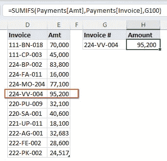

**图 5.14：** 使用 SUMIFS 函数查找数值数据

`=SUMIFS(Payments[Amt],Payments[Invoice],G100)`

`**SUMIFS**`函数计算满足多个条件的值的总和。它允许您指定多个条件，并仅对满足条件的值进行求和。

语法：

`=SUMIFS (sum_range, criteria_range1, criteria1, [criteria_range2, criteria2], ...)`

其中：

1.  汇总范围 ► 要聚合的值。

1.  条件范围 ► 应用条件的值。

1.  条件 ► 要满足的条件。

1.  在我们之前的示例中，我们检查存储在支付中的发票号是否等于：

1.  `**Payments[Amt]**` 是求和范围。它代表`**付款**`表中的`**Amt**`列。我们想要根据给定条件从该范围返回值。

1.  `**Payments[Invoice]**` 是第一个条件范围。它代表`**付款**`表中的`**发票**`列。我们想要检查这些单元格范围是否符合特定条件。

1.  `**G100**` 是条件。它是一个特定值或参考值，用于评估`**发票**`列中的单元格。

该函数返回相应的付款金额，因为只有一个发票号符合条件。

**注意：** 如果多个发票号符合条件，函数将返回总付款金额。

`**SUMIFS**` 函数的替代方案是`**SUMPRODUCT**`函数（见*图 5.15*）：

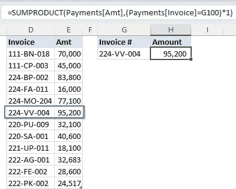

**图 5.15：** 使用 SUMPRODUCT 函数查找数值数据

`=SUMPRODUCT(Payments[Amt],(Payments[Invoice]=G100)*1)`

`**SUMPRODUCT**` 函数功能强大，允许您将多个数组中对应元素相乘并求和。

当您需要对数组执行计算或同时对多个范围应用条件时，这是一个优势。

语法：

`=SUMPRODUCT(array1, array2, ...)`

在上面的示例中：

1.  `**Payments[Amt]**` 是第一个数组。它代表`**付款**`表中的`**Amt**`列。我们想要将这些值的数组相乘并求和。

1.  对于第二个数组，我们首先比较`**发票**`列中的每个单元格（在`**付款**`表中）与单元格 G100 中的值，并返回一个由 True 和 False 值组成的数组`**(Payments[Invoice]=G100)**`。将此数组乘以 1 将 True 值转换为 1，False 值转换为 0`**((Payments[Invoice]=G100)*1)**`。

1.  最后，`SUMPRODUCT`函数将`**Amt**`列中的相应值与 1 和 0 的数组相乘，然后求和这些乘积。求和计算将仅包括`**Amt**`列中的值，其中`**Invoice**`列与 G100 匹配（见*图 5.16*）。

**注意：** 对布尔值执行数学运算会将它们转换为它们的数值等效值 1/0。

因此，我们可以通过添加零来转换前面的 True/False 值。

`**(Payments [Invoice]=G100)+0.**`

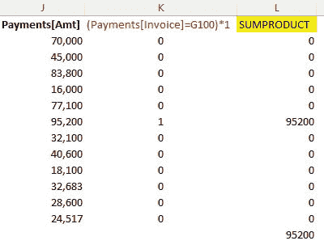

**图 5.16：** SUMPRODUCT 数组乘法

最后，让我们看看`**AGGREGATE**`函数以及我们如何使用它查找数值，如*图 5.17*所示：

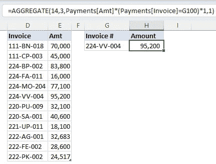

**图 5.17：** 使用 AGGREGATE 函数查找数值数据

与其他`**SUMPRODUCT**`和`**SUMIFS**`函数不同，`**AGGREGATE**`函数在数据集上执行各种计算。

它允许您应用 19 个函数（见*表 5.1*），有七个选项可以忽略错误、隐藏值和小计，并应用特定条件来包含或排除数据。

| **1.** `**AVERAGE**` | **5.** `**MIN**` | **9.** `**SUM**` | **13.** `**MODE.SNGL**` | **17.** `**QUARTILE.INC**` |
| --- | --- | --- | --- | --- |
| **2.** `**COUNT**` | **6.** `**PRODUCT**` | **10.**`**VAR.S**` | **14.** `**LARGE**` | **18.** `**PERCENTILE.EXC**` |
| **3.** `**COUNTA**` | **7.** `**STDEV.S**` | **11.**`**VAR.P**` | **15.** `**SMALL**` | **19.** `**QUARTILE.EXC**` |
| **4.** `**MAX**` | **8.** `**STDEV.P**` | **12.** `**MEDIAN**` | **16.** `**PERCENTILE.INC**` |  |

**表 5.1：** 在 AGGREGATE 中应用的函数

语法：

`=AGGREGATE(function_num, options, array, [k])`

参考*图 5.16*中使用的公式。

`=AGGREGATE(14,3,Payments[Amt]*(Payments[Invoice]=G100)*1,1)`

以下是前述函数的工作原理：

1.  14 ►该参数指定`**LARGE**`函数返回数据范围中第 k 个最大值。

1.  3 ►该参数指定函数将忽略数据范围中的错误值。

1.  对于数组，我们首先将`**Payments**`表中`**Invoice**`列中的每个单元格与单元格 G100 中的值进行比较，并返回一个 True 和 False 值的数组（Payments[Invoice]=G100）。将此数组乘以 1 将 True 值转换为 1，False 值转换为 0（(Payments[Invoice]=G100)*1）。然后，将`**Amt**`列中的相应值与 1 和 0 的数组相乘。

1.  最后，函数返回前述最终数组中的最大值。

**注意**：与`**SUMPRODUCT**`函数一样，`**AGGREGATE**`可以在不使用**Ctrl + Shift + Enter**的情况下本地管理许多数组操作。

与前述函数密切相关的是`**MAX**`和`**MAXIFS**`函数。

在*图 5.17*中，我们使用`**MAX**`函数查找数值函数。

`=MAX( Payments[Amt]* (Payments[Invoice]=G100) )`

以下是前述函数的工作原理：

1.  我们首先将`**Invoice**`列中的每个单元格与单元格 G100 中的值进行比较，并返回一个 True 和 False 值的数组（Payments[Invoice]=G100）。

1.  然后，我们将`**Amt**`列中的相应值与 True 和 False 的数组相乘。这将为所有 True 返回一个金额值，对于所有`**FALSE**`则返回零。

1.  `**MAX**`函数返回前述数组中的最大值。

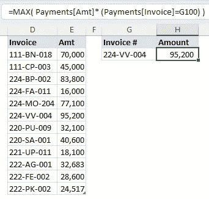

**图 5.18：** 使用 MAX 函数查找数值数据

`**MAX**`函数可能难以理解和解释。替代方法是`**MAXIFS**`函数，如*图 5.19*所示：

`=MAXIFS(Payments[Amt], Payments[Invoice],G100 )`

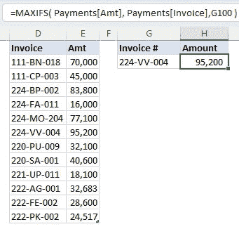

**图 5.19：** 使用 MAXIFS 函数查找数值数据

语法：

`=MAXIFS(max_range, criteria_range1, criteria1, criteria_range2, criteria2,…)`

在上述示例中，`**Amount**`值是我们的最大范围，而条件范围是发票号码，我们的条件是存储在单元格 G100 中的值。

**注意**：对于复杂的条件查找，请考虑使用`**MAXIFS**`而不是`**MAX**`函数。

# 查找图像

Excel 中的查找功能比仅限于文本和数字更全面。我们将学习如何查找图像，如*图 5.20*所示：

**图 5.20：** 查找图像

执行以下步骤：

1.  创建一个产品列表，并在旁边的空白列中放置标志图像。

1.  为每个产品复制一个标志图像，并将其粘贴到每个产品名称旁边的空白单元格中。调整大小以适应。

1.  要将图像锁定到单元格，右键单击并选择`**格式图片**`。转到格式图片窗格，选择`**大小和属性**`，在`**属性**`部分选择`**随单元格移动和调整大小**`（见*图 5.21*）：

    **图 5.21：** 将图像锁定到单元格

1.  接下来的步骤涉及创建链接图像：

    1.  选择并复制任何带有图像的单元格。确保复制的是单元格而不是图像。

    1.  右键单击要存储查找图像的另一个单元格。

    1.  选择`**粘贴特殊**`，将其粘贴为链接图像（见*图 5.22*）。

    1.  你选择的单元格中的标志将被粘贴到新单元格中。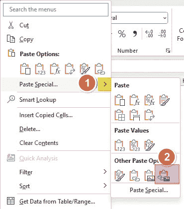

    **图 5.22：** 粘贴为链接图片

1.  下一步是创建一个命名范围。这将确保复制的标志根据产品名称动态更改。

    1.  转到`**公式**`选项卡，选择定义名称。

    1.  在新名称对话框中，在名称字段中写入 ►：**标志**，在引用中写入：`**=INDEX($E$116:$E$120, MATCH($G$116,$D$116:$D$120,0))**`（见*图 5.22*）。

    1.  其中`**$E$116:$E$120**` ► 包含标志图像的列，`**$G$116**` ► 包含要查找其标志图像的产品的单元���，`**$D$116:$D$120**` ► 包含产品名称的列。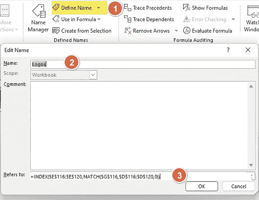

    **图 5.23：** 创建名称范围

1.  最后，选择我们在上一步中创建的链接图像，并用创建的名称范围中的动态引用替换其引用（见*图 5.24*）：

    **图 5.24：** 将图像引用更改为创建的名称范围

**注意**：定义的名称应该只返回一个单元格引用，因此我们使用`**INDEX/MATCH**`函数。其他函数如`**VLOOKUP**`不起作用，因为它们不返回引用。

# 查找单元格地址

在本节中，我们将学习如何使用 ADDRESS 函数查找单元格地址。

一般来说，`**ADDRESS**`函数将根据给定的行号和列号返回单元格地址。

请注意，返回的单元格地址是一个文本字符串，而不是实际引用。此外，根据所选的地址类型，返回的地址可能是相对的、混合的或绝对的。

如*图 5.25*所示，我们想知道作物“`**Traka**`”的最后一个单元格地址。

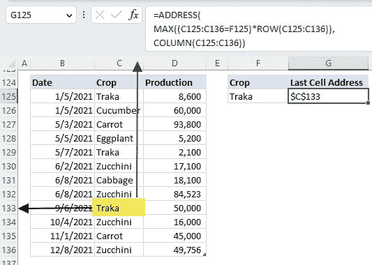

**图 5.25：** 查找带有条件的最后一个单元格地址

`=ADDRESS(`

`MAX( (C125:C136=F125)*ROW(C125:C136) ),`

`COLUMN(C125:C136) )`

以下是前述函数的工作原理：

1.  `**C125:C136=F125**` 返回一个由`**TRUE**`和`**FALSE**`组成的数组，其中`**TRUE**`是符合条件的位置；否则为`**FALSE**`。

1.  (`**C125:C136=F125)*ROW(C125:C136),**` 将相应的行号和`**TRUE**`和`**FALSE**`数组相乘。这将返回所有`**TRUE**`的行号和所有`**FALSE**`的零。

1.  `**MAX**`函数从前述数组中返回最大的行号。

1.  `**COLUMN(C125:C136)**` 返回所有作物的列号。

1.  `**ADDRESS**`函数根据行号和列号返回绝对单元格引用。

**注意：** 默认情况下，`**ADDRESS**`函数返回绝对单元格引用。如果您想返回混合或相对地址，请按照*图 5.26*中所示的选项进行选择。

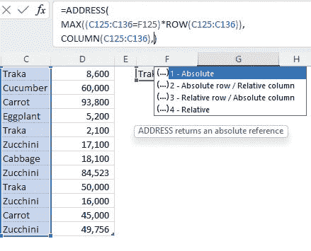

**图 5.26：** 在 ADDRESS 函数中返回相对或混合引用

# 使用数据透视表查找列表中的唯一项

数据透视表可以帮助您快速、轻松地总结和分析大量数据。它通过有意义地组织数据来帮助您理清数据。

它还可以用于查找列表中的唯一项，如*图 5.27*所示：

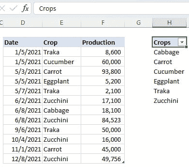

**图 5.27：** 使用数据透视表查找唯一项

以下是要遵循的步骤：

1.  将您的范围转换为表格，单击 Excel 表格的任意位置，转到`**表格设计**`选项卡，然后单击使用数据透视表进行汇总（见*图 5.28*）: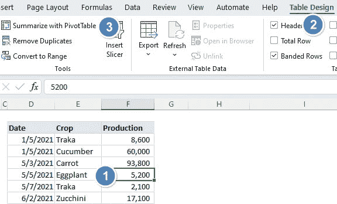

    **图 5.28：** 创建数据透视表

1.  在弹出窗口中，单击现有工作表，然后在位置下拉菜单中选择放置数据透视表的单元格（见*图 5.29*）: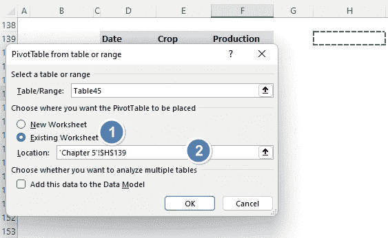

    **图 5.29：** 选择放置数据透视表的位置

1.  在数据透视表字段中勾选`**作物**`字段或将该字段拖放到行区域。这将生成一个唯一字段列表（见*图 5.30*）: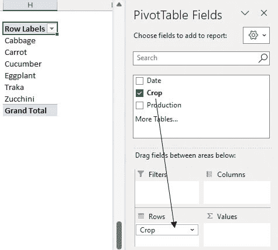

    **图 5.30：** 选择数据透视表字段

# 结论

在本章中，我们了解到 Excel 提供了多种查找数据的方式。通过学习不同的方法，您可以灵活选择最佳方法。

这些替代方法中有些比已知的查找函数更高效或更快，这取决于数据集的大小或任务的复杂性。例如，`DSUM`函数可以处理更复杂的条件并在数字数据上比`**VLOOKUP**`函数计算更快。

总之，在 Excel 中学习查找数据的替代方法可以为您提供更广泛的技能集、增加效率、适应性和解决问题的能力。

在下一章中，我们将开始学习动态数组查找函数。

# 需要记住的要点

+   学习在 Excel 中解决问题的替代方式可以增强您的问题解决能力。它鼓励您进行批判性思考，考虑不同的方法，并探索创造性的解决方案。这些技能是可转移的，并且在 Excel 之外也具有价值，使您在其他工作或生活领域受益。

+   Excel 被广泛应用于各行各业和各种职业。扩展对替代技术的了解，使您更能够处理各种问题并适应不断发展的需求或限制。
