# 第六章

# XLOOKUP

# 介绍

在本章中，我们将介绍第一个动态数组查找函数 — `**XLOOKUP**`。

当它在 2019 年推出时，被誉为“函数杀手”，“终极查找函数”，“最重要的函数”等等。它应该取代 `**LOOKUP**`，`**VLOOKUP**`，`**HLOOKUP**` 和 `**INDEX**`/`**MATCH**` 组合。

现在让我们探讨可以使用此函数的领域以及它相对于其他函数的优势。

# 结构

在本章中，我们将讨论为什么 `**XLOOKUP**` 是比之前讨论的函数更好的选择的 15 个原因：

+   默认为精确匹配

+   轻松返回多个相邻和非相邻列

+   轻松向左或向右查找

+   轻松适应列的插入/删除

+   轻松垂直或水平查找

+   轻松从底部向上查找

+   轻松在查找中集成通配符

+   返回单元格引用

+   在“无匹配”情况下返回值

+   轻松进行双向或三向查找

+   返回非相邻列

+   返回最后一个空或非空单元格

+   查找非连续数组

+   轻松返回重复的查找值

# 默认精确匹配

以下是基本的 `**XLOOKUP**` 语法：

`=XLOOKUP(lookup_value, lookup_array, return_array, [match_mode], [search_mode])`

其中：

+   `**lookup_value:**` 我们想在 `lookup_array` 中搜索这个值。它可以是单元格引用或常量值。

+   `**lookup_array:**` 这是我们搜索上述值的范围或数组。它可以是单列或行，也可以是二维范围。

+   `**return_array:**` 这是我们要检索结果的范围或数组。它可以是单列或行，也可以是二维范围。

+   `**match_mode (可选):**` 此参数确定函数如何将 `lookup_value` 与 `lookup_array` 中的值进行匹配。可以指定为 0 (精确匹配)，-1 (精确或下一个较小值)，1 (精确或下一个较大值)，或 2 (通配符匹配)。如果省略，`**XLOOKUP**` 将默认为精确匹配。

+   `**search_mode (可选):**` 此参数确定函数的搜索行为，即 1 (从头到尾)，-1 (从尾到头)，或 2 (二分搜索)。如果省略，`**XLOOKUP**` 将默认为 1 (从头到尾)。

这个默认的精确匹配使得使用 `**XLOOKUP**` 函数时比使用 `**VLOOKUP**` 函数时更不容易出错。

此外，与复杂的 `**VLOOKUP**` 函数语法不同，您需要计算列数，`**XLOOKUP**` 函数参数是自解释的 — 易于阅读和理解。

例如，在 *图 6.1* 中，我们正在查找 1 月 15 日的销售额：

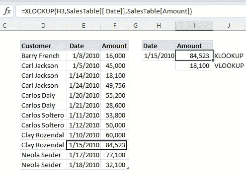

**图 6.1:** XLOOKUP 默认精确匹配

`=XLOOKUP(H3,SalesTable[[ Date]],SalesTable[Amount])`

使用 `**XLOOKUP**`，我们只需要三个参数：查找值（H3）、查找数组（日期）和返回数组（`**金额**`）。此外，与 `**VLOOKUP**` 不同，数据不需要排序。

结果必须使用 `**VLOOKUP**` 进行校正，如 *图 6.2* 所示，因为查找数组未排序，而且我们已跳过匹配模式。

**图 6.2：** VLOOKUP 近似匹配默认

`=VLOOKUP(H3,SalesTable[[ Date]:[Amount]],2)`

# 轻松返回多个相邻和非相邻列

`**XLOOKUP**` 属于 Excel 中的新动态数组公式，允许将多个结果返回到一系列单元格中。这个范围被称为溢出范围，可以是多行/列或一个表格。

动态数组函数被设计为通过自动填充相邻单元格来容纳它们的输出结果。这种溢出行为允许函数返回多个值或一组值，而不是单个结果。

溢出范围的大小取决于函数返回的值的数量。

如果我们使用类似 `**VLOOKUP**` 的传统数组函数，我们必须手动选择相邻单元格，并使用 `**Ctrl + Shift + Enter**` 来确认。这是它可以填充相邻单元格的唯一方式。

如 *图 6.3* 所示，我们正在查找客户“Luke Daly”的销售日期和金额。

`=XLOOKUP(H3, SalesTable[Customer], SalesTable[[ Date]:[Amount]] )`

返回多列的唯一技巧是确保将它们选择为返回数组。在前面的例子中，我们选择了日期和金额两列：`**SalesTable[[ Date]:[Amount]]**`

**图 6.3：** XLOOKUP 返回多个相邻列

要返回多个非相邻列，我们需要在返回数组参数中使用 CHOOSECOLS 函数来返回所选列（参见 *图 6.4*）：

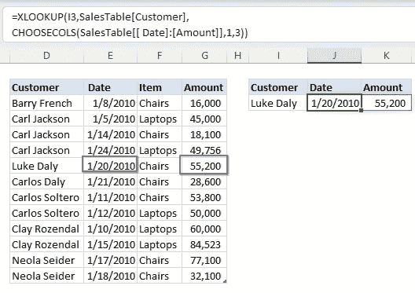

**图 6.4：** XLOOKUP 返回多个非相邻列

`=XLOOKUP(I3,SalesTable[Customer],CHOOSECOLS(SalesTable[[ Date]:[Amount]],1,3))`

在这个例子中，我们选择了三列：日期、项目和金额。使用 `**CHOOSECOLS(SalesTable[[ Date]:[Amount]],1,3)**`，选择列仅返回第一列和第三列。

唯一需要记住的是，我们可以使用 `**CHOOSECOLS**` 函数返回所选的非相邻列在一个数组中。

# 轻松查找左侧或右侧的数据

与 VLOOKUP 函数不同，XLOOKUP 函数可以轻松地从左侧查找数据。

在 *图 6.5* 中，我们正在查找客户“Luke”的销售日期。

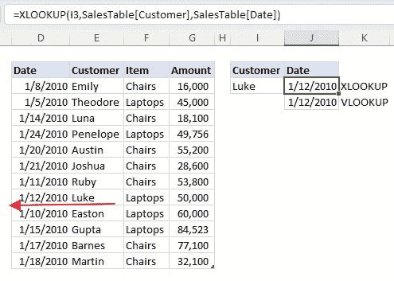

**图 6.5：** XLOOKUP 向左查找

`=XLOOKUP(I3,SalesTable[Customer],SalesTable[Date])`

即使日期存储在客户数据的左侧，`**XLOOKUP**` 仍然使用其简单的三个参数，不像 `**VLOOKUP**` 需要嵌套 IF 函数（参见 *图 6.6*）：

`=VLOOKUP(I3, IF({1,0}, SalesTable[Customer], SalesTable[Date]), 2, 0)`

使用 `**VLOOKUP**` 时，您必须使用 IF 函数创建自定义表数组，就像我们在上一章中看到的那样。

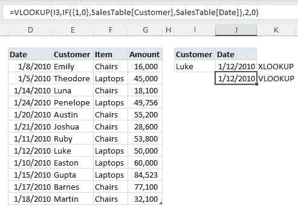

**图 6.6：** `VLOOKUP` 向左查找

# 轻松适应列的插入/删除

与 `VLOOKUP` 函数不同，`XLOOKUP` 可以处理表中列的插入和删除。

例如，*图 6.7* 显示了在插入新列之前两个函数的结果。

**图 6.7：** 在插入列之前的 `VLOOKUP` 和 `XLOOKUP` 函数

当您在表中插入列时，`**VLOOKUP**` 返回错误的值，但 `**XLOOKUP**` 可以动态处理插入（参见 *图 6.8*）：

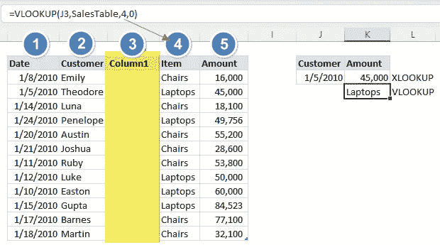

**图 6.8：** 在插入列后的 `VLOOKUP` 和 `XLOOKUP` 函数

**注意：** `**VLOOKUP**` 无法处理插入，因为我们有一个硬编码的查找列，即第 4 列。

正如我们在 *第二章，VLOOKUP 已死：还是吗？* 中学到的，您可以通过将 `**MATCH**` 函数嵌套在 `**VLOOKUP**` 中来克服这个问题，如下所示：

`=VLOOKUP(J3, SalesTable, MATCH(K2, SalesTable[#Headers], 0), 0)`

当您删除列时，`**VLOOKUP**` 函数会返回错误，但 `**XLOOKUP**` 可以动态处理删除。参考在我们删除项目列后的 *图 6.9*。

`**VLOOKUP**` 函数返回错误，因为找不到返回列，即第 4 列。

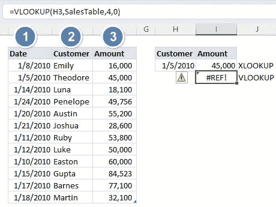

**图 6.9：** 在删除列后的 `VLOOKUP` 和 `XLOOKUP` 函数

# 轻松垂直或水平查找数据

使用 `**XLOOKUP**` 函数，我们不再需要 `**HLOOKUP**` 或修改后的 `**VLOOKUP**` 函数来水平查找数据。

在 *图 6.10* 中，我们查找了最低报价的供应商：

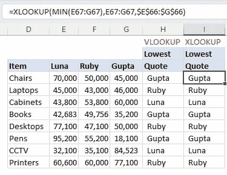

**图 6.10：** 在删除列后的 `VLOOKUP` 和 `XLOOKUP` 函数

`=VLOOKUP(MIN(E67:G67), TRANSPOSE(IF({1;0}, E67:G67, Reps)), 2, 0)`

`=XLOOKUP(MIN(E67:G67), E67:G67, $E$66:$G$66)`

正如我们从前述函数中看到的，`**XLOOKUP**` 很容易编写和解释。

这是 `**XLOOKUP**` 函数的工作原理：

+   `**MIN(E67:G67):**` `MIN` 函数返回每个项目的最低报价。这将成为我们的查找值。

+   `**E67:G67:**` 这是我们的查找数组，即所有价格范围。这是我们将找到最低价格位置的地方。

+   `**$E$66:$G$66:**` 这是我们的返回数组，即所有供应商。我们将返回位置对应于最低价格的供应商。

# 轻松从底部向上查找数��

默认情况下，`XLOOKUP` 和 `VLOOKUP` 函数从上到下查找数据，并返回第一个 `TRUE` 值。

在 *图 6.11* 中，我们查找了最后一次客户“Clay Rozendal”向我们购买的日期：

**图 6.11：** `XLOOKUP` 函数从下到上查找

`=XLOOKUP(H3,SalesTable[Customer],SalesTable[Date],,,-1)`

这里唯一的诀窍是在`**XLOOKUP**`中指定正确的搜索模式，即-1。

这个搜索模式参数确定函数的搜索行为，即 1（从头到尾）、-1（从尾到头）或 2（二进制搜索）。如果省略，`**XLOOKUP**`将默认为 1（从头到尾）。

我们需要使用以下函数来使用`**VLOOKUP**`获得相同的结果。如*图 6.12*所示，`**VLOOKUP**`函数复杂且难以理解：

`=VLOOKUP(`

`MAX((SalesTable[Customer]=H3)*ROW(SalesTable[Customer])),`

`IF({1,0},(SalesTable[Customer]=H3)*ROW(SalesTable[Customer]),SalesTable[Date]),`

`2,0)`

**图 6.12：** VLOOKUP 函数从底部向顶部查找

参考*第二章，VLOOKUP 已死：还是吗？*以了解前述`**VLOOKUP**`函数的工作原理。

# 轻松将通配符集成到查找中

使用星号（*）或问号（?）通配符字符创建了一个多功能且更简单的查找值。

例如，在*图 6.13*中，我们查找包含字母“P”的成本代码的日期。

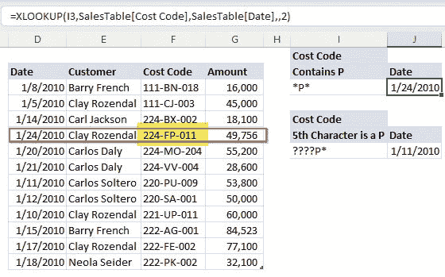

**图 6.13：** 使用星号通配符的 XLOOKUP

`=XLOOKUP(I3,SalesTable[Cost Code],SalesTable[Date],,2)`

这里唯一的诀窍是记住使用 2 作为匹配模式。

匹配模式参数确定函数如何将查找值与查找数组中的值进行匹配。它可以指定为 0（精确匹配）、-1（精确或下一个较小值）、1（精确或下一个较大值）或 2（通配符匹配）。如果省略，XLOOKUP 将默认为精确匹配。

**注意：**星号（*）通配符代表文本字符串中的一个或多个字符。例如，P*将找到以字母 P 开头的任何单词，*P 将找到以字母 P 结尾的任何单词，*P*将找到包含字母 P 的任何单词。

还要记住`**XLOOKUP**`函数返回第一个`**TRUE**`值。

我们不仅限于使用星号通配符，而是可以将两者结合起来，如*图 6.14*所示。在这个例子中，我们查找第五个字符为“P”的成本代码的日期。

如讨论的，问号（?）通配符代表文本字符串中的单个字符。因此，查找值“????P*”将找到第五个字符为字母“P”后跟任意字符的任何文本字符串。

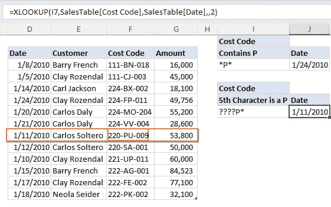

**图 6.14：** 使用问号和星号通配符的 XLOOKUP

# 返回单元格引用

`**XLOOKUP**`函数最不为人知的功能之一是它返回单元格引用，而不仅仅是值。

尽管单元格引用是看不见的，不像返回的值，但仍然可以使用，如*图 6.15*所示：

**图 6.15：** XLOOKUP 返回单元格引用

`=SUM(XLOOKUP(I95,Customers,XLOOKUP(J95,Regions,Data)):`

`XLOOKUP(I95,客户, XLOOKUP(K95,地区,数据)))`

公式的工作原理如下：

+   **步骤 1**：为公式中使用的部分创建命名范围。选择每个地区，如*图 6.16*所示，转到名称框，并给它一个名称。

    **图 6.16：** 创建命名范围

+   **步骤 2**：编写嵌套的`**XLOOKUP**`函数：

    +   嵌套的`**XLOOKUP**`函数，XLOOKUP(J95,地区,数据)，返回地区数据。这形成了主`**XLOOKUP**`函数的返回数组。

    +   使用嵌套的`**XLOOKUP**`函数作为返回数组，查找客户的位置：

        `**XLOOKUP(I95,客户, XLOOKUP(J95,地区,数据))**`

    +   要强制`**XLOOKUP**`函数返回单元格引用，使用范围运算符（:）在返回东部地区的`**XLOOKUP**`和返回西部地区的`**XLOOKUP**`之间（参见*图 6.17*）：

        `**XLOOKUP(I95,客户, XLOOKUP(J95,地区,数据)):**`

        `**XLOOKUP(I95,客户, XLOOKUP(K95,地区,数据))**`

        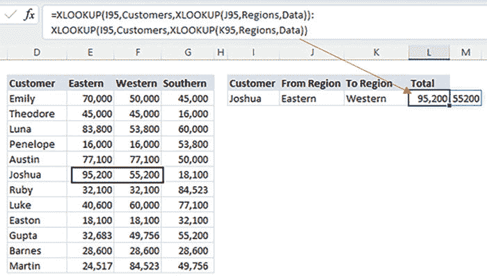

    **图 6.17：** XLOOKUP 返回单元格范围

+   步骤 3：最后，对上述返回的范围求和：

    `**=SUM(**`

    `**XLOOKUP(I95,客户, XLOOKUP(J95,地区,数据)):**`

    `**XLOOKUP(I95,客户, XLOOKUP(K95,地区,数据))**`

    `**)**`

**注意：** `**XLOOKUP**` 无法返回多行/列引用；它仅限于单个单元格引用。对于多行/列引用，请使用多个以范围运算符（:）分隔的`**XLOOKUP**`

# 在没有匹配项的情况下返回值

与其他查找函数不同，如果未找到匹配项，XLOOKUP 具有内置的“如果未找到匹配项”参数。

例如，在*图 6.19*中，我们只应该为打折商品获得折扣，而对其他商品返回零。

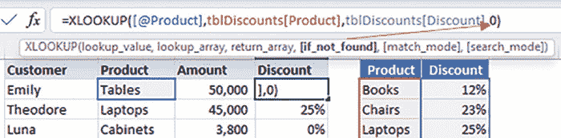

**图 6.18：** XLOOKUP if_not_found 参数

我们必须使用`**if_not_found**`参数来捕获非打折商品的零，如*图 6.18*所示：

**图 6.19：** XLOOKUP 如果未找到匹配项则返回一个值

# 轻松进行三向查找

与 VLOOKUP 函数不同，嵌套的 XLOOKUP 函数可以轻松进行三向查找，如*图 6.20*所示：

**图 6.20：** XLOOKUP 三向查找

`=XLOOKUP(J126&K126,销售代表&产品,`

`XLOOKUP(L126, 月份, 金额))`

函数的工作原理如下：

+   **步骤 1**：为公式中使用的部分创建命名范围。选择每个地区，如*图 6.20*中突出显示的。要创建一个命名范围，突出显示数据，转到名称框，并给它一个名称。最后，按 Enter 键。

+   **步骤 2**：编写嵌套的`**XLOOKUP**`函数：

    +   嵌套的`**XLOOKUP**`函数，`**XLOOKUP(L126, 月份, 金额)**`，返回准则月份数据。这形成了主 XLOOKUP 函数的返回数组。

    +   至于主要的`**XLOOKUP**`函数，首先创建一个连接的标准 — `**J126&K126**`。这返回销售代表和产品标准的组合。然后创建组合的销售代表和产品列，如*图 6.21*所示：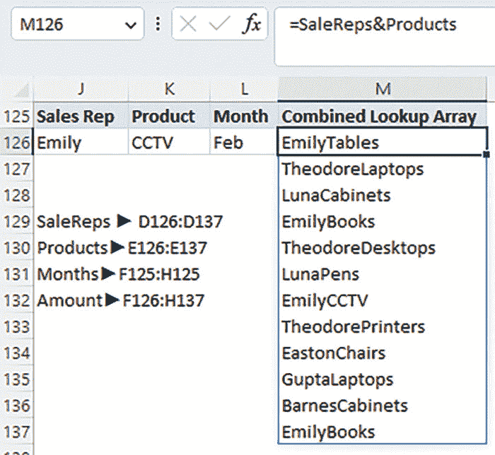

    **图 6.21：** XLOOKUP 连接列作为查找数组

+   **步骤 3**：最后，获取组合条件在组合列中的位置。然后返回相同位置的金额。

**注意：** 连接条件的顺序应该与列的顺序相同。

例如，在前面的情景中，如果我们创建了一个`**SalesRep&Product**`组合标准，那么我们必须创建一个`**SalesRep&Product**`组合查找数组。任何其他顺序都不起作用。

# 轻松返回非相邻列

使用上面的示例，现在让我们使用 XLOOKUP 函数返回一月和三月的金额，如*图 6.22*所示：

**图 6.22：** XLOOKUP 返回非相邻列值

`=XLOOKUP(J126&K126, SaleReps&Products, IF({1,0},Jan,Mar))`

函数的工作原理如下：

+   **步骤 1**：为公式中使用的部分创建命名范围。选择如*图 6.22*中突出显示的每个区域。要创建命名范围，突出显示数据，转到名称框，并给它一个名称。最后，按 Enter 键。

+   **步骤 2**：使用 IF 函数返回非相邻列，如*图 6.23*所示。这是你需要记住的唯一技巧。

+   **步骤 3**：创建一个连接的标准 — J126&K126。这返回销售代表和产品标准的组合。然后创建销售代表和产品列的组合查找数组。

+   **步骤 4**：最后，获取组合条件在组合查找数组列中的位置。然后返回相同位置的非相邻列中的金额。

**注意：** IF 函数的替代方案是`**CHOOSE**`函数，如下所示：

`**=XLOOKUP(J126&K126, SaleReps&Products, CHOOSE({1,2},Jan,Mar))**`

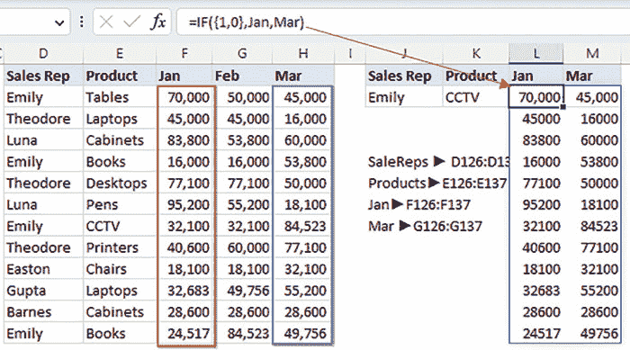

**图 6.23：** IF 返回非相邻列

另一种方法是使用 Filter 函数返回非相邻列，如*图 6.24*所示：

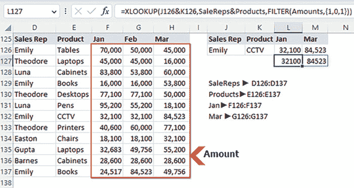

**图 6.24：** FILTER 函数返回非相邻列

`=XLOOKUP(J126&K126, SaleReps&Products,FILTER(Amounts,{1,0,1}))`

这里需要学习的唯一技巧是学习如何使用包含参数来获取非相邻行（有关更多信息，请参考下一章中的 FILTER 函数）。

Filter 函数的“包含”部分通常指定应在过滤结果中包含哪些给定列表或数组的元素的条件。如果条件为 TRUE（1），则包含；否则，不包含。

# 返回最后/第一个非空单元格

除了`**LOOKUP**`函数外，获取最后/第一个非空单元格的更好选择是`**XLOOKUP**`函数，如*图 6.25*所示：

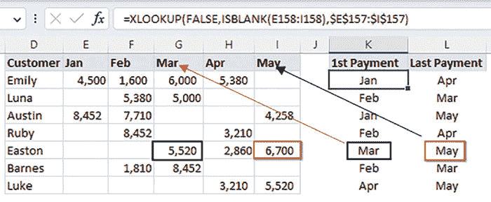

**图 6.25：** XLOOKUP 最后/第一个非空单元格

要获得第一笔付款：

`=XLOOKUP(FALSE,ISBLANK(E158:I158),$E$157:$I$157)`

要获得最后一笔付款：

`=XLOOKUP(FALSE,ISBLANK(E158:I158),$E$157:$I$157,,-1)`

函数的工作原理如下。

+   **步骤 1**：使用 ISBLANK 函数检查单元格是否为空。这将返回一个 TRUE/FALSE 值数组，如*图 6.26*所示：

    **图 6.26：** ISBLANK TRUE/FALSE 数组

+   **步骤 2**：要获得第一笔付款，在数组中搜索第一个 FALSE 值：`**=XLOOKUP(FALSE,ISBLANK(E158:I158),$E$157:$I$157)**`

+   **步骤 3**：要获得最后一笔付款，我们将-1 指定为 search_mode。XLOOKUP 函数将最后一个 FALSE 值与范围中的第一个 FALSE 值进行匹配：`**=XLOOKUP(FALSE,ISBLANK(E158:I158),$E$157:$I$157,,-1)**`

# 轻松查找非连续数组

嵌套的 XLOOKUP 函数还可以轻松地从非连续数组中获取值，如*图 6.27*所示：

**图 6.27：** XLOOKUP 非连续数组

`=XLOOKUP(TRUE,[@Product]=”Chairs”,`

`XLOOKUP([@Amount], DiscountChairs[Amt], DiscountChairs[Disc],,-1),`

`XLOOKUP([@Amount], DiscountLaptops[Amt], DiscountLaptops[Disc],,-1))`

函数的工作原理如下。

+   **步骤 1**：检查产品是否为“椅子”。这将返回一个 TRUE/FALSE 值。

+   **步骤 2**：由于我们使用“TRUE”作为查找值，如果前面的比较为 TRUE，则执行第一个嵌套的 XLOOKUP。它使用近似匹配（我们指定-1 作为匹配模式以进行近似匹配查找）从椅子的折扣表中获取折扣百分比。

    `**XLOOKUP([@Amount], DiscountChairs[Amt], DiscountChairs[Disc],,-1),**`

+   **步骤 3**：如果值为`**FALSE**`，我们执行`**XLOOKUP**`，该函数位于`**XLOOKUP**`的**“if_not_found”**参数中。这个`**XLOOKUP**`从笔记本电脑的折扣表中获取折扣百分比。注意：这也是一个近似匹配查找。

    `**XLOOKUP([@Amount], DiscountLaptops[Amt], DiscountLaptops[Disc],,-1)**`

# 轻松返回重复查找值

虽然，默认情况下，`**XLOOKUP**`函数在查找数组包含重复值时不返回多个匹配值，但它会返回第一个`**TRUE**`值。

但是，如果嵌套`**LARGE**`函数，则可以实现这一点，如*图 6.28*所示：

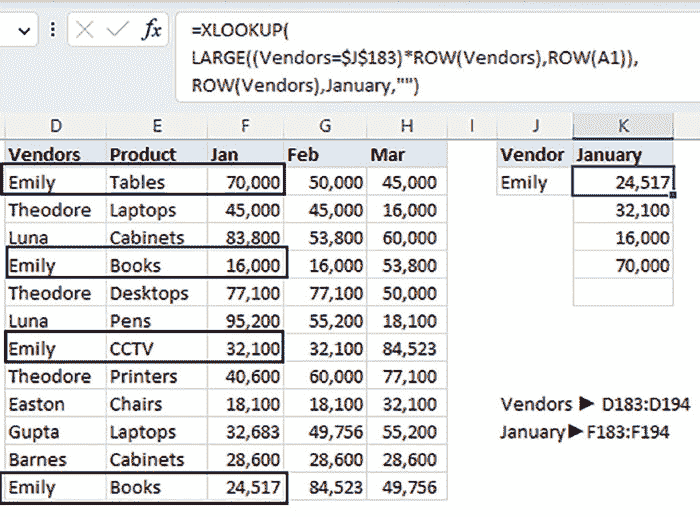

**图 6.28：** XLOOKUP 返回重复查找值。

`=XLOOKUP(`

`LARGE((Vendors=$J$183)*ROW(Vendors),ROW(A1)),`

`ROW(Vendors),January,””)`

函数的工作原理如下。

+   `**(Vendors=$J$183)**` 检查哪个供应商等于“Emily”并返回一个 TRUE/FALSE 数组。

+   `**(Vendors=$J$183)*ROW(Vendors)**` 将上述 TRUE/FALSE 数组与行号相乘。这将返回供应商 Emily 的行号数组；否则，返回零（见 *图 6.29*）：

    **图 6.29：** 标准供应商的行号

+   我们需要遍历这些行号列表，并逐个作为 `**XLOOKUP**` 的查找值返回。我们使用 LARGE 函数来完成此任务，它从最大到最小返回行号。注意 ROW(A1) 评估为 1，当您向下拖动函数时，它会增加，直到完整列表被迭代。`**LARGE((Vendors=$J$183)*ROW(Vendors),ROW(A1)),**`

+   `**XLOOKUP**` 返回每行号的一月金额。

# 结论

在本章中，我们探讨了新 XLOOKUP 动态函数的强大功能，并观察了它如何轻松查找值。

将 `**XLOOKUP**` 与其他函数区分开的一个独特特性是其搜索模式从后往前，而不是从上到下。

与其他函数不同，如果查找值未找到并且我们需要将它们嵌套在 IFERROR 函数中，XLOOKUP 不需要这样做，因为它有一个 `**If_not_found**` 参数，我们可以��回一个值或一个函数。

在下一章中，我们将了解一个更好的查找函数，如果 `**lookup_array**` 包含重复值，则可以返回多个值 — FILTER 函数。

# 要记住的要点

+   `**XLOOKUP**` 函数同时返回值和单元格引用。

+   `**XLOOKUP**` 通常比传统的查找函数如 `**VLOOKUP**` 或 `**HLOOKUP**` 更快，特别是处理大数据集时。对于升序排序的值，指定 2 以启用二进制搜索模式，对于降序排序的值，指定-2。

# 多项选择题

1.  在 `**XLOOKUP**` 函数中，`**lookup_value**` 是什么？

    1.  要在查找范围中搜索的值

    1.  要在其中搜索的值范围

    1.  要返回的值范围

    1.  用于过滤结果的条件

1.  如果默认的 `**XLOOKUP**` 函数在查找范围中找不到 `**lookup_value**`，会发生什么？

    1.  它返回一个错误

    1.  它返回最接近的匹配值

    1.  它返回一个指定的默认值

    1.  它返回查找范围的平均值

1.  以下哪项不是 `**XLOOKUP**` 函数中的有效参数？

    1.  “`**lookup_value**`”

    1.  “`**return_array**`”

    1.  “`**criteria_range**`”

    1.  “`**not_found**`”

1.  `**XLOOKUP**` 函数中的 “`**if_not_found**`” 参数的目的是什么？

    1.  指定如果找到匹配项要返回的值

    1.  指定如果找不到匹配项要返回的值

    1.  指定要搜索匹配项的范围

    1.  指定结果的数据类型

1.  哪个 Excel 版本引入了 `**XLOOKUP**` 函数？

    1.  Excel 2007

    1.  Excel 2010

    1.  Excel 2016

    1.  Office 365 Excel

1.  `**XLOOKUP**` 函数的公式结构是什么？

    1.  `**=XLOOKUP(lookup_value, lookup_array, return_array)**`

    1.  `**=XLOOKUP(lookup_array, lookup_value, return_array)**`

    1.  `**=XLOOKUP(return_array, lookup_value, lookup_array)**`

    1.  `**=XLOOKUP(return_array, lookup_array, lookup_value)**`

# 答案

1.  a

1.  a

1.  c

1.  b

1.  d

1.  a
