# 第七章

# FILTER：最终查找函数

# 介绍

本章将讨论最终查找函数之一——Filter 函数。与`**XLOOKUP**`函数不同，`**FILTER**`函数轻松返回所有匹配项的数组，而不仅仅是第一个匹配项。这种返回数据子集的灵活性，而不仅仅是单个条目，使 FILTER 成为创建动态报告中最佳函数之一。现在让我们探讨不同的情况，我们可以使用`**FILTER**`函数以更**定制**的方式**分析**数据，而无需复杂的公式。

# 结构

本章将讨论以下 15 种情况，其中`**FILTER**`函数最适用：

+   返回多列和多行

+   返回非相邻列

+   轻松使用`AND`/`OR`进行多条件查找

+   轻松查找所有 X 而不是 Y 的项目

+   轻松查找前 n 个或后 n 个项目

+   轻松查找 X 或 Y，但不是两者都有

+   使用通配符查找数据

+   查找工作日与周末数据

+   查找排除假期的数据

+   查找奇数/偶数

+   查找重复出现 N 次的项目

+   基于时间查找项目

+   基于周数、月份、年份查找数据

+   查找两个列表中常见/不常见的值

+   仅返回月末日期项目

# 返回多列和多行

FILTER 函数具有最简单和最易于理解的语法之一——仅三个参数。

`=FILTER(array, include, [if_empty])`

+   array 是您要查找的数据范围/数组。这可以是表格或单个列/行。

+   include 是一个由`**TRUE/FALSE**`组成的数组，其中`**TRUE**`表示要返回的值，否则为`**FALSE**`。

    注：如果筛选的数组在列中，则包含必须与此数组的长度相同。如果数组在行中，则包含必须与此数组的宽度相同。

+   `**[if_empty]- [可选]**` 当没有结果返回时要返回的值。

例如，在*图 7.1*中，我们想查找所有员工“卡尔·杰克逊”的贡献及相应日期。

**图 7.1：** 返回多行和多列

`=FILTER(tblContribution[[Date]:[Amount]],tblContribution[Staff]=F3)`

以下是前述函数的工作原理：

+   选择要作为我们数组筛选的列。这里我们选择相邻列；在下一个示例中，我们将学习如何选择非相邻列→ `**tblContribution[[Date]:[Amount]]**`

+   检查我们的标准（卡尔·杰克逊）在员工名单中出现的所有情况→ `**tblContribution[Staff]=F3.**` 这将返回一个布尔数组（参见*图 7.2*），确定要包含在筛选器中的值。

**图 7.2：** 创建包含参数

**注意**：由于 FILTER 函数根据您的筛选数组在垂直/水平方向或两者之间溢出结果，请确保有足够的空单元格，否则将出现`**#SPILL!**`错误（参见*图 7.3*）。

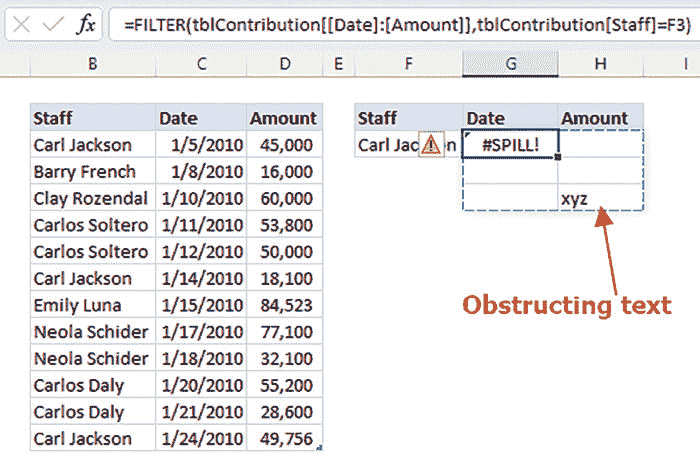

**图 7.3：** 阻止文本导致溢出错误

# 返回多个非相邻列和行

如*图 7.4*所示，我们已调整了前面示例中的数据以包括捐赠物品。

在这个例子中，我们想要返回所有捐赠物品和金额。

**图 7.4：** 返回非相邻列

`=FILTER(CHOOSECOLS(tblContribution,2,4),tblContribution[Staff]=G3)`

以下是前述函数的工作原理：

+   要选择要筛选的非相邻列，我们将使用`CHOOSECOLS`函数。此函数需要一个表名和所需的列号 → `**CHOOSECOLS(tblContribution,2,4)**`

**注意**

+   如果您不想在`**CHOOSECOLS**`函数中硬编码列，可以使用`**XMATCH**`函数（参见*图 7.5*）。

+   检查所有员工列表中出现我们标准（卡尔·杰克逊）的情况→ `**tblContribution[Staff]=F3**`。这将返回一个布尔数组，确定筛选器中要包含的值**。**

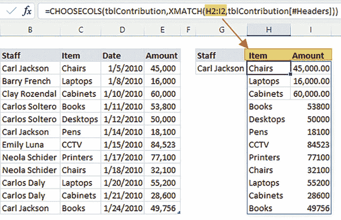

**图 7.5：** CHOOSECOLS 函数动态返回非相邻列

返回非相邻列的另一种选择是使用嵌套的`**FILTER**`函数，如下所示：

`=FILTER(`

`FILTER(tblContribution,tblContribution[Staff]=G3),`

`{0,1,0,1})`

以下是前述函数的工作原理：

+   `**FILTER(tblContribution,tblContribution[Staff]=G3)**` 这个嵌套的 FILTER 函数返回所有员工等于存储在单元格 G3 中的卡尔·杰克逊的列。

+   要仅获取第二和第四列，我们使用另一个`**FILTER**`函数，并在包含参数中指定这些列。正如我们在介绍部分中学到的那样，包含参数是一个`**TRUE (1)**` /`**FALSE (0)**`的数组，其中 TRUE 表示要返回的值，否则为 FALSE。因此，{0,1,0,1}将仅返回第二和第四列。

返回非相邻列的第三种选择是嵌套`**CHOOSE**`函数。就像`**CHOOSECOL**`函数一样，您不仅可以返回非相邻列，还可以重新排列它们。使用下面的公式，我们可以先返回金额列，然后是日期列。

`=FILTER(`

`CHOOSE({1,2},tblContribution[Amount],tblContribution[Date]),tblContribution[Staff]=G51)`

# 使用 AND/OR 轻松进行多个条件查找

如前面的示例所示，我们不限于单个标准。我们可以使用 FILTER 函数与多个标准和不同的逻辑（`**AND**`/`**OR**`）。

例如，在*图 7.6*中，我们想要查找所有捐赠物品为`**ZAR**`、`**USD**`或`**CHF**`的捐赠者。

`=FILTER(Donors, COUNTIF(List, Currency))`

以下是前述函数的工作原理：

+   选择捐赠者的命名范围（Donors）作为我们的过滤数组。

+   使用`**COUNTIF**`函数计算我们的货币条件列表在我们的货币数据库列表中出现的次数。这将返回一个由 1/0 组成的数组，其中 1=TRUE，0=FALSE。

    `**{0 0 0 0 0 1 0 1 0 0 0 1}**`

+   `**Filter**`函数返回所有对应于值为 1 的捐赠者。

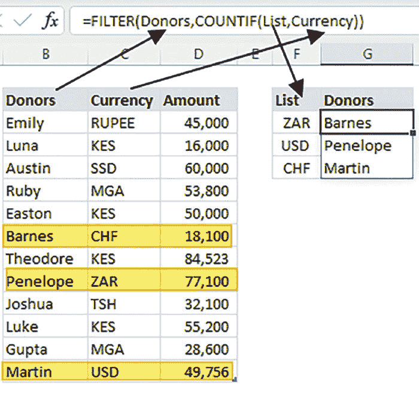

**图 7.6：** 使用 COUNTIF 函数的 FILTER 函数多条件 OR 逻辑

使用加号（+）表示 OR 逻辑是使用`**COUNTIF**`函数的替代方法，如*图 7.7*所示。

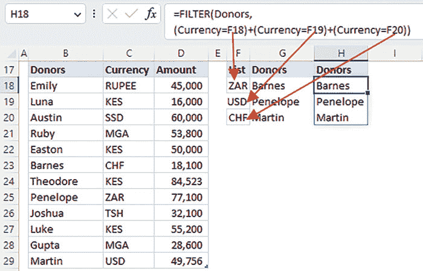

**图 7.7：** 使用加号（+）表示的 FILTER 函数多条件 OR 逻辑

在*图 7.8*中，我们想知道员工`**Carl Jackson**`何时以及捐赠了多少书籍。

**图 7.8：** 使用 FILTER 函数多条件 AND 逻辑

`=FILTER($D$3:$E$14,($B$3:$B$14=G3)*($C$3:$C$14=H3))`

以下是前述函数的工作原理：

+   选择过滤数组`**($D$3:$E$14)**`。

+   检查员工是否等于 Carl Jackson `**($B$3:$B$14=G3)**`，物品是否等于 Books `**($C$3:$C$14=H3)**`**。**这些返回一个布尔数组（`**TRUE/FALSE**`）。

+   由于 FILTER 函数不接受`**AND**`函数的嵌套，我们使用星号（*）来表示 AND 逻辑。当你将前两个布尔数组相乘时，只有在满足所有条件时才会得到值为 1。参见*图 7.9*。

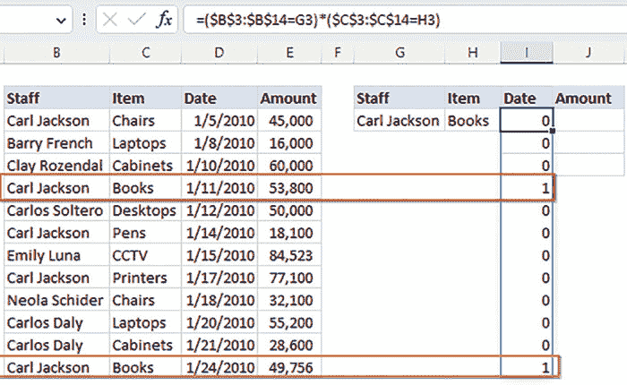

**图 7.9：** 使用星号（*）表示 AND 逻辑

# 轻松查找所有 X 而不是 Y 的项目

在本节中，我们将学习如何在 FILTER 函数中使用 NOT 比较运算符（<>）。

如*图 7.10*所示，我们想查找所有成绩为 A 但不在英语科目中的学生。

**图 7.10：** 使用 NOT 比较运算符（<>）过���数据

`=FILTER(C49:C61,(F49:F61=”A”)=(D49:D61<>”English”))`

以下是前述函数的工作原理：

+   选择学生过滤数组**(C49:C61)**。

+   检查成绩是否等于`**A**` **(F49:F61=”A”)**，以及科目是否不等于`**English**`（`**D49:D61<>English**`）。这些返回一个布尔数组—`**TRUE**`（两个检查都为真）和`**FALSE**`（其中一个/两个测试为假）

使用大于比较运算符的替代方法，如*图 7.11*所示。

**图 7.11：** 使用大于（>）比较运算符过滤数据

`=FILTER(C49:C61,(F49:F61=”A”)>(D49:D61=”English”))`

这里需要学习的唯一技巧是 Excel 将 FALSE 值视为零（0），将 TRUE 视为一（1）；然后，只有在 1>0 的情况下结果才为 TRUE。参见*图 7.12*。

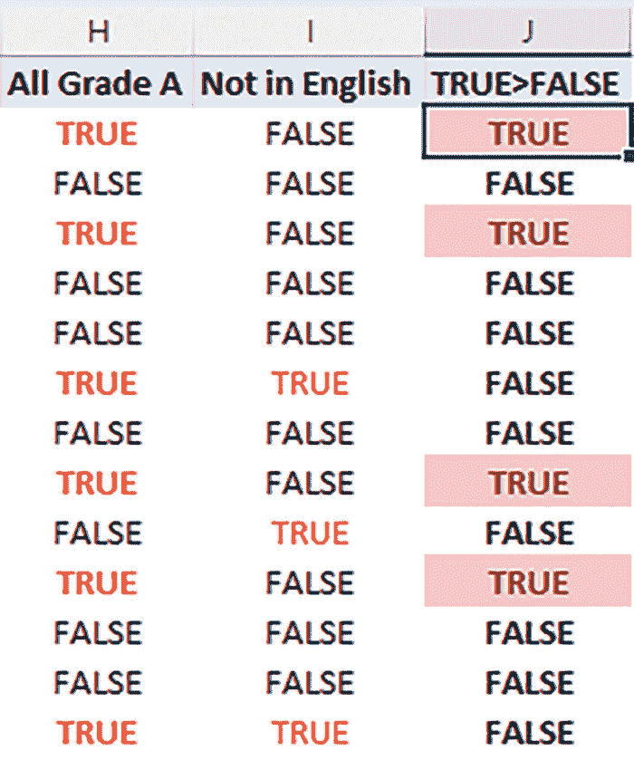

**图 7.12：** 比较布尔值

# 轻松查找前 n 个或后 n 个项目

与先前学习的查找函数不同，FILTER 函数可以轻松返回前几项或底部项目，如 *图 7.13* 所示。

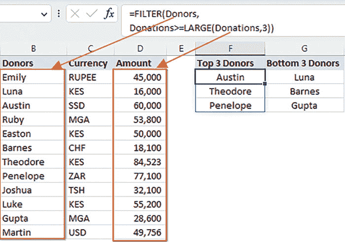

**图 7.13：** 过滤前几项或底部项目

要过滤前 3 个

`=FILTER(Donors, Donations>=LARGE(Donations,3))`

要过滤最后 3 个

`=FILTER(Donors, Donations<=SMALL(Donations,3))`

这里是上述函数的工作原理：

+   选择捐赠者的命名范围过滤数组。

+   使用 LARGE 函数返回第三大值 `**( LARGE(Donations,3) )**` 或使用 SMALL 函数返回第三小值 `**( SMALL(Donations,3) ).**`

+   要过滤前几项，请检查捐赠金额大于或等于第三大的 `**(Donations>=LARGE(Donations,3)).**` 要过滤底部项目，请检查捐赠金额小于或等于第三小的 `**(Donations<=SMALL(Donations,3)).**` 这些返回一个布尔数组—`TRUE`（两个检查都为真）和`FALSE`（一个/两个测试为假）。

+   过滤函数返回所有对应于 `TRUE` 值的捐赠者。

# 轻松查找 X 或 Y 而不是两者都有

这不是一个经常出现的查找问题，但了解如何解决它是值得的。

我们需要查找所有得到 A 等级或参加英语考试的学生，但不是两者都有。参见 *图 7.14*。

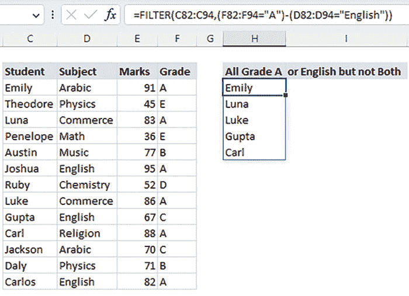

**图 7.14：** 过滤所有 X 或 Y 但不是两者都有

`=FILTER(C82:C94,(F82:F94=”A”)-(D82:D94=”English”))`

唯一需要学习的技巧是使用减号（-）作为比较运算符。

这里是比较的工作原理。

如果一个比较是 `TRUE`（1） 而另一个是 `FALSE`（0），那么比较结果将是 1-0=1。因此，总体上是 `TRUE`。当比较两个 `FALSE` 条件时，0-0=0，因此总体上是 `FALSE`。当比较两个 `TRUE` 条件时，1-1=0，这也将是总体上的 `FALSE`。参见 *图 7.15*。

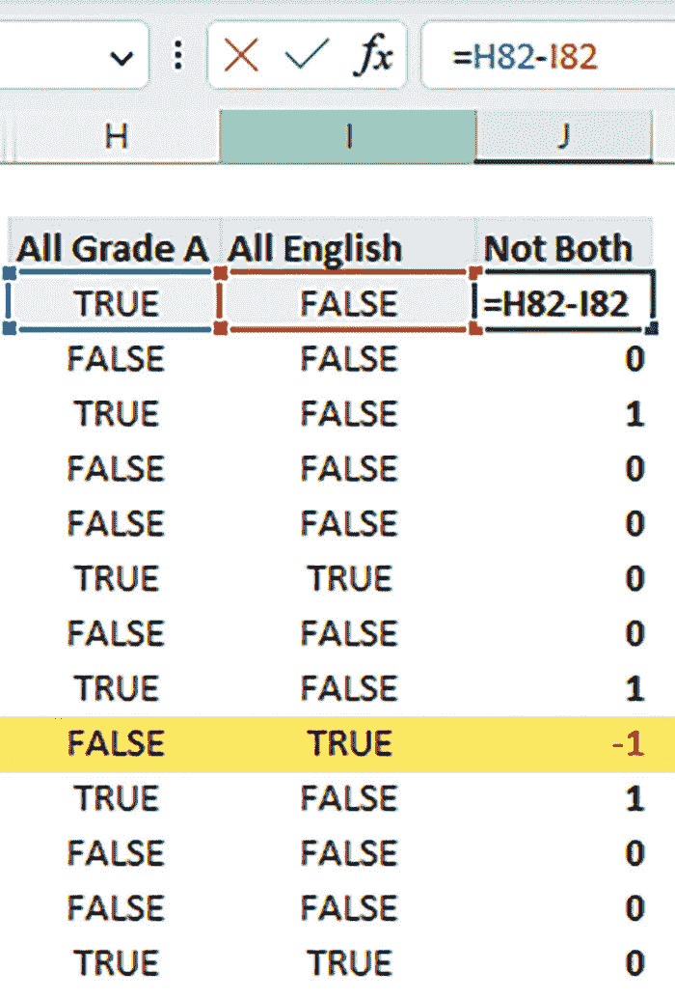

**图 7.15：** 减号（-）比较运算符

**注意**

+   在 Excel 中，`FALSE` 等于 0 值，而任何其他值等于 `TRUE`。

+   这就是为什么在 *图 7.15* 中，值为 -1 等于 `TRUE`。

# 使用通配��查找数据

不幸的是，FILTER 函数不支持两个通配符字符（***?**）。

然而，可以通过结合使用 SEARCH 和 ISNUMBER 函数来解决，如 *图 7.16* 所示。

任务是过滤所有产品中包含单词“牛奶”的生产商。

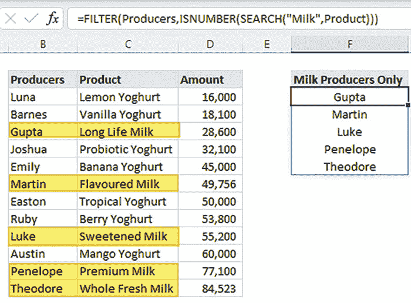

**图 7.16：** 使用通配符过滤数据

`=FILTER(Producers, ISNUMBER(SEARCH(“Milk”, Product)))`

这里是上述函数的工作原理：

+   如果产品名称包含单词“牛奶”，搜索函数返回一个数字，否则返回一个错误 `**(SEARCH(“Milk”, Product)).**`

+   `ISNUMBER` 函数返回一个 `TRUE/FALSE` 数组，将用作 `FILTER` 函数中的包含条件。如果 `SEARCH` 函数返回的值是一个数字，则 `ISNUMBER` 返回 `TRUE`；否则返回 `FALSE`。

# 查找工作日或周末数据

根据工作日或周末分析交易是必要的，特别是对于销售分析师。

这可以通过 `FILTER` 函数和 `WEEKDAY` 函数的组合轻松完成，如 *图 7.17* 所示。

要筛选工作日销售的物品：

`=FILTER(tblSportSale[Item],WEEKDAY(tblSportSale[Date],2)<6)`

要筛选周末销售的物品：

`=FILTER(tblSportSale[Item],WEEKDAY(tblSportSale[Date],2)>=6)`

以下是前述公式的工作原理。

+   给定销售日期，`WEEKDAY` 函数 `**( WEEKDAY(tblSportSale[Date],2))**` 返回一个介于 1 和 7 之间的数字，代表一周中的某一天。星期一(1)到星期日(7)

+   对于工作日日期，这些日期的日期编号小于 6，而周末日期的日期编号大于或等于 6

**图 7.17：** 筛选工作日或周末数据

# 查找排除假期和周末的数据

在前面的示例中，我们看到了如何查找工作日或周末销售的物品。

假设我们有假期，如何查找仅在工作日销售的物品？如 *图 7.18* 所示，您可以使用 `po` 函数排除假期和周末。

`=FILTER(SportSales[Item],WORKDAY(SportSales[Date]-1,1,Holidays)=SportSales[Date])`

以下是前述函数的工作原理：

+   `**WORKDAY(SportSales[Date]-1, 1, Holidays)**` 将从销售日期减去一天以获取初始日期，然后添加一个工作日以找到该初始日期后的下一个工作日，同时排除“假期”列表中指定的任何日期。如果销售日期不是假期或周末，则 `WORKDAY` 函数将返回相同日期；否则，它将返回下一个工作日。

+   将返回的工作日与销售日期进行比较，`**WORKDAY(SportSales[Date]-1,1,Holidays)=SportSales[Date].**` 如果日期相同，则返回 `**TRUE**`，否则返回 `**FALSE**`。

`FILTER` 函数仅返回与前述数组中的 `TRUE` 值对应的物品。

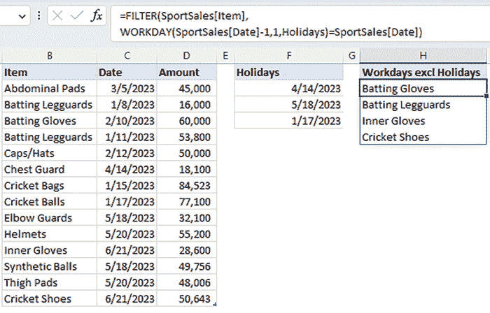

**图 7.18：** 仅筛选工作日数据

# 查找奇数/偶数数字

假设您是一名审计员，想要提取仅为偶数发票的物品，如 *图 7.19* 所示。

以下是您可以用于此任务的公式。

`=FILTER(B147:B158,ISEVEN(0+B147:B158))`

以下是前述函数的工作原理：

+   `**ISEVEN(0+B147:B158)**` `ISEVEN` 函数返回一个 `TRUE/FALSE` 数组。所有偶数发票返回 `TRUE`，否则返回 `FALSE`。

**注意**

+   要强制 `ISEVEN` 函数将整个范围作为数组进行评估，必须在引用的范围中添加零，否则函数将返回 `#VALUE` 错误。

+   FILTER 函数仅返回与先前返回的数组的 TRUE 值对应的发票。

+   要过滤奇数发票号，将公式更改如下：

`=FILTER(B147:B158,ISODD(0+B147:B158))`

**图 7.19：** 仅过滤偶数值

# 查找重复 N 次的物品

利用之前的贡献数据，让我们看看如何过滤所有捐赠超过两次的员工，如 *图 7.20* 所示：

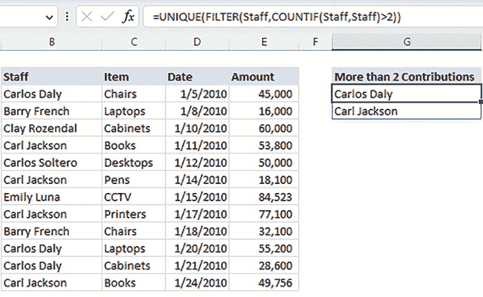

**图 7.20：** 过滤重复 n 次的项目

`=UNIQUE(FILTER(Staff, COUNTIF(Staff, Staff)>2))`

以下是前述函数的工作原理：

+   `**COUNTIF(Staff, Staff)**` COUNTIF 函数返回列表中员工重复次数的数组。参考 *图 7.21*。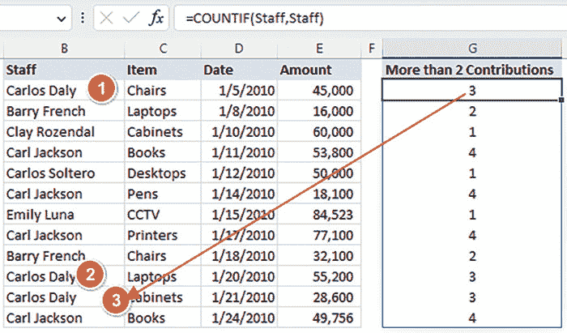

    **图 7.21：** COUNTIF 函数显示每个物品的重复次数

+   接下来，我们检查哪些物品重复超过两次 `**COUNTIF(Staff, Staff)>2.**` 这将返回一个 `TRUE/FALSE` 数组。

+   `FILTER` 函数仅包括对应于 TRUE 值的员工，如 *图 7.22* 所示。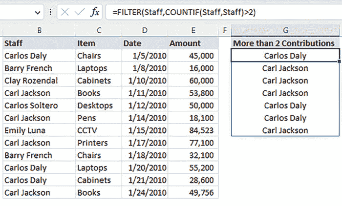

    **图 7.22：** 过滤重复值

+   为了消除重复值，我们使用 `**UNIQUE 函数 UNIQUE(FILTER(Staff, COUNTIF(Staff, Staff)>2))**`

# 根据时间查找物品

大多数出勤数据以 DateTime 格式收集，如 *图 7.23* 所示。然而，我们需要仅使用 DateTime 的时间部分来查找该数据。

面对这样的问题，唯一需要记住的是时间值始终以 24 小时的分数存储，而日期存储为序列号。

因此，时间将是 DateTime 序列号中的小数部分。

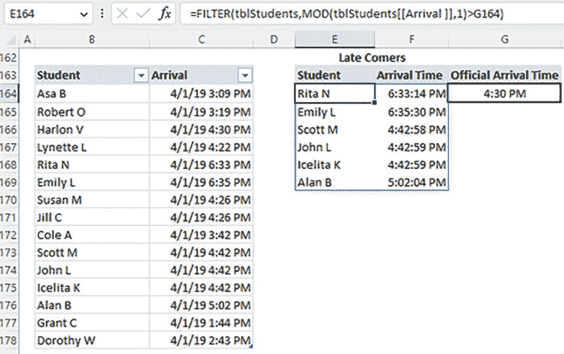

**图 7.23：** 基于时间过滤

`=FILTER(tblStudents,MOD(tblStudents[[Arrival ]],1)>G164)`

以下是前述函数的工作原理：

+   `**MOD(tblStudents[[Arrival ]],1)**` 当除数为 1 时，MOD 函数始终返回数字的小数部分。

+   `**MOD(tblStudents[[Arrival ]],1)>G164**` 此条件检查计算出的 `**Arrival**` 时间的小数部分（`**MOD**` 结果）是否大于单元格 G164 中的值。这实质上是检查到达时间的分钟部分是否大于 G164 中的值。

+   FILTER 函数用于根据特定条件从 `**tblStudents**` 表中检索行。在这种情况下，它过滤了计算出的 `**Arrival**` 时间的小数部分大于单元格 G164 中的值的行。

# 根据周数、月份和年份查找数据

在前一节中，我们学习了如何根据工作日或周末筛选数据。在本节中，我们将学习如何根据周数、月份和年份查找数据。

在 *图 7.24* 中，我们正在查找所有在第 3 周售出的物品。

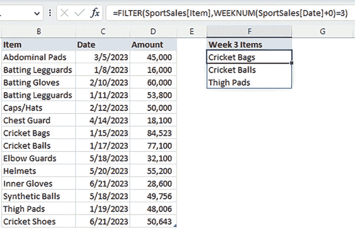

**图 7.24：** 基于周数筛选

`=FILTER(SportSales[Item],WEEKNUM(SportSales[Date]+0)=3)`

**注意：**

+   WEEKNUM 函数不接受数据范围。它会返回`**#VALUE**`错误。但是，我们可以通过在范围后添加零`**(SportSales[Date]+0)**`来强制执行。

+   WEEKNUM 函数返回一个周数的数组（参见*图 7.25*）。

+   当我们将计算出的周数（来自前一步）与该值进行比较时，我们会返回一个由`TRUE`和`FALSE`组成的数组。

+   `FILTER`函数用于筛选前一步中数值为`TRUE`的行。

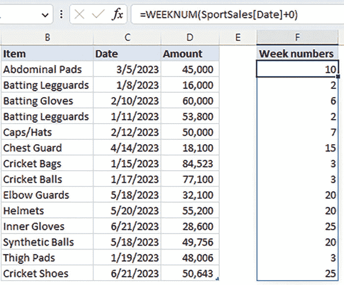

**图 7.25：** WEEKNUM 返回一个周数数组

要筛选特定月份的数据，请使用如*图 7.26*所示的月份函数。

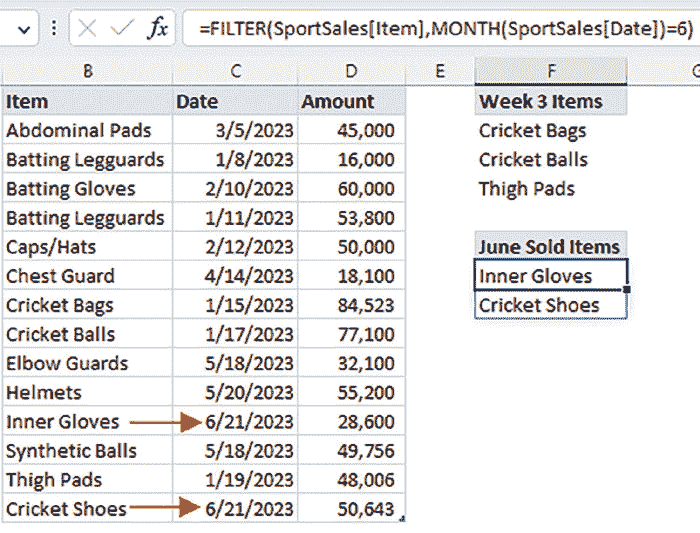

**图 7.26：** 基于月份筛选

`=FILTER(SportSales[Item],MONTH(SportSales[Date])=6)`

这里需要注意的是`MONTH`函数返回一个月份数字的数组。其他一切都如`WEEKNUM`函数中所解释的那样。

最后，*图 7.27*展示了如何使用年份值来筛选数据。

**图 7.27：** 基于年份筛选

`=FILTER(SportSales[Item],YEAR(SportSales[Date])=2022)`

这里需要注意的是`YEAR`函数返回一个年份数字的数组。其他一切都如前面的函数中所解释的那样。

# 查找两个列表中的共同/不常见项目

在 Excel 中比较列表中的值是一项常见的活动。例如，在*图 7.28*中，我们查找两个列表之间的共同和新客户。

获取新（不常见的）客户

`=FILTER(Current_Customers, COUNTIF(LastYear_Customers,Current_Customers)=0)`

获取老（共同的）客户

`=FILTER(Current_Customers, COUNTIF(LastYear_Customers,Current_Customers)=0)`

函数的唯一技巧是使用`**COUNTIF**`函数计算新列表中项目在旧列表中重复出现的次数。

`**►COUNTIF(LastYear_Customers, Current_Customers)**` 计算同时出现在 LastYear_Customers 范围和 Current_Customers 范围中的客户数量。它返回一个由 1 和 0 组成的数组。其中 1=两者共同，0=不常见。

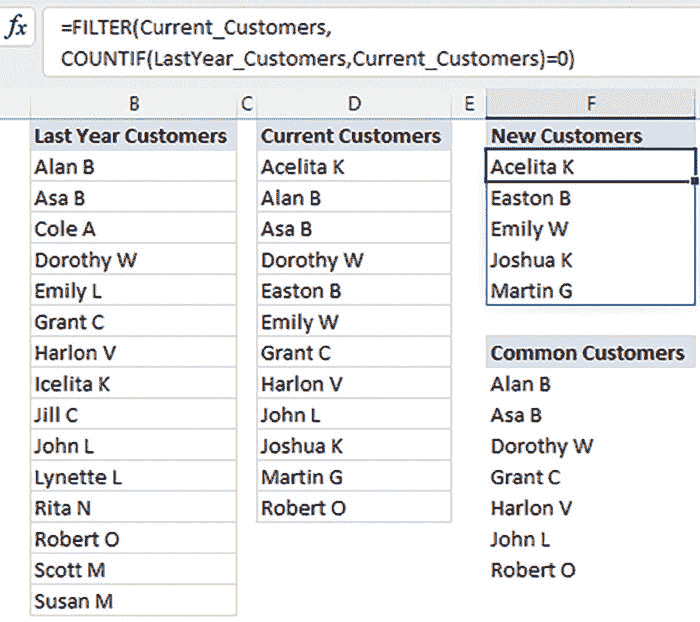

**图 7.28：** 筛选列表之间的常见/不常见项目

# 仅返回月底日期项目

当您想要返回任何月份最后一天出售的物品时，就像在*图 7.29*中所示，您必须使用`**EOMONTH**`函数。

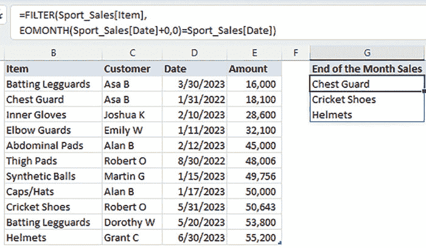

**图 7.29：** 筛选在月底出售的项目

`=FILTER(Sport_Sales[Item], EOMONTH(Sport_Sales[Date]+0,0)=Sport_Sales[Date])`

**注意：**

+   `**EOMONTH**`函数不接受数据范围。它会返回`**#VALUE**`错误。但是，我们可以通过在范围后添加零（SportSales[Date]+0）来强制执行。

+   `**EOMONTH**`函数返回给定日期的月份的最后一天的数组（参考*图 7.30*）。

    **图 7.30：** EOMONTH 返回月份的最后一天的数组

+   当我们将计算得出的月底日期（来自上一步）与销售日期进行比较时，我们会返回一个由`**TRUE**`和`**FALSE**`组成的数组。

+   `**FILTER**`函数用于过滤前一步骤中数值为`**TRUE**`的行。

# 结论

在本章中，我们学习了 Excel 中最易于理解和使用的查找函数之一——`**FILTER**`函数。当您想要返回多个数值时，这是最常推荐的函数。

`**FILTER**`函数是 Excel 工具中的一个强大工具，为用户提供了从庞大数据集中提取特定数据子集的动态和高效手段。通过本章，我们探讨了`**FILTER**`函数的复杂性，深入研究了其语法、参数和实际应用。

通过利用`**FILTER**`函数的功能，Excel 用户可以简化其数据分析流程，提高准确性和效率。该函数使用户能够轻松地根据复杂条件检索相关信息，促进明智决策，并促进对数据的全面洞察。

在下一章中，我们将学习有关 Power Query 的内容。

# 记住的要点

+   `**FILTER**`函数与其他 Excel 动态数组函数（如`**SORT**`、`**UNIQUE**`和`**TRANSPOSE**`）无缝配合，允许您创建复杂的数据操作工作流程。

+   `FILTER`函数是非不稳定的。与其他一些在每次更改时重新计算的函数不同，`**FILTER**`函数仅在基础数据或条件更改时重新计算，提高了整体工作表性能。

+   `FILTER`函数不支持 AND/OR 函数。因此，在多个条件的情况下，使用星号（*）来调用 AND 操作，加号（+）来调用 OR 操作。

+   `**FILTER**`函数可以处理各种数据类型，包括数字、文本、日期等，使其适用于各种数据分析任务。

# 测验

1.  `**FILTER**`函数的哪个参数用于在未找到匹配结果时显示自定义消息或数值？

    1.  数组

    1.  条件

    1.  `**[if_empty]**`

    1.  `**[include]**`

1.  使用`**FILTER**`函数而不是传统过滤技术的以下哪项不是其优点？

    1.  动态数组溢出

    1.  与其他动态数组函数兼容

    1.  不稳定的重新计算

    1.  简化多条件处理

1.  如果根据条件未找到匹配结果，`FILTER`函数会返回什么 Excel 错误？

    1.  `**#REF!**`

    1.  `**#VALUE!**`

    1.  `**#CALC!**`

    1.  `**#NUM!**`

1.  用于重新排序`**FILTER**`函数结果列的 Excel 函数是什么？

    1.  `**SORT**`

    1.  `**SUM**`

    1.  `**VLOOKUP**`

    1.  `**CHOOSE**`

1.  以下哪个公式使用 FILTER 函数从表中提取“`**Region**`”列等于“`**East**`”的行？

    1.  =`**FILTER(Table1, “Region”, “East”)**`

    1.  =`**FILTER(Table1, “Region”=”East”)**`

    1.  =`**FILTER(Table1, Table1[Region]=”East”)**`

    1.  =`**FILTER(Table1, “East”, “Region”)**`

# 答案

1.  `**[if_empty]**`

1.  可变重新计算

1.  `**#CALC!**`

1.  `**CHOOSE**`

1.  `**=FILTER(Table1, Table1[Region]=”East”)**`
