# 第八章

# Power Query：一站式解决方案

# 介绍

本章将讨论 Excel 中的一个改变游戏规则的工具，承诺彻底改变我们处理数据检索和转换的方式 — Power Query。

Power Query 常被誉为数据查找的*一站式解决方案*，赋予用户无缝连接、重塑和清洗来自各种来源的数据的能力，以出色的效率和便捷性将原始信息转化为有价值的见解。

像 FILTER 函数一样，Power Query 具有返回数据子集的灵活性，而不仅仅是单个条目，这对于创建动态报告非常重要。

在 Excel 2010 和 Excel 2013 版本中，默认情况下未集成 Power Query 功能。您需要下载并安装 Power Query 加载项，该加载项可以在微软下载中心的加载项中找到。安装后，您将在 Excel 标签的`**Power Query**`选项卡中找到 Power Query 选项。

# 结构

在本章中，我们将讨论可以使用 Power Query 的 15 种场景：

+   为 Excel 2010 和 Excel 2013 安装 Power Query 加载项

+   精确查找

+   返回多个结果和多列。

+   近似查找

+   使用表连接进行查找。

+   查找前 n 个或后 n 个项目

+   使用 List 函数进行查找。

+   查找工作日与周末数据

+   查找排除节假日的数据。

+   查找重复 *N* 次的项目。

+   仅返回月底日期项目

+   模糊查找

# 安装 Power Query 加载项适用于 Excel 2010 和 Excel 2013

以下是如何操作的指南：

**对于 Excel 2010：**

+   下载 Power Query 加载项**：**

    +   前往微软下载中心。

    +   搜索“Excel 2010 的 Power Query”并根据您的 Excel 版本和系统架构下载适当的版本（32 位或 64 位）。

+   安装加载项：

    +   运行下载的安装程序。

    +   按照屏幕上的说明安装 Power Query 加载项。确保在此过程中关闭 Excel。

    +   安装完成后，打开 Excel 2010。

+   启用加载项：

    +   在 Excel 中点击“文件”选项卡。

    +   选择“选项”。

    +   在 Excel 选项对话框中，点击左侧边栏的“加载项”。

    +   在底部的“管理”框中，选择“COM 加载项”并点击“前往”。

    +   选中“Microsoft Office Power Query for Excel”选项。

    +   点击“确定”以启用加载项。

**对于 Excel 2013：**

Power Query 已经集成，但您可能需要启用它。

以下是如何启用 Power Query 的方法：

+   在 Excel 中点击“文件”选项卡。

+   选择“选项”。

+   在 Excel 选项对话框中，点击左侧边栏的“加载项”。

+   在底部的“管理”框中，选择“COM 加载项”并点击“前往”。

+   选中“Microsoft Office Power Query”选项。

+   点击“确定”以启用 Power Query。

+   启用 Power Query 后，您可以从功能区的“数据”选项卡中访问它。您将在那里看到“获取和转换”以及“获取数据”等选项。

使用 Power Query 的第一步是将数据导入其编辑器。有两种导入数据的方式如下：

+   如果您的数据位于 Excel 工作簿中，请转到“数据”选项卡，并选择“从表/范围获取”，如果您的��据位于结构化表中。

+   如果您的数据位于不同的工作簿或不同的格式（CSV、文本文件、数据库、网络来源等），请转到“数据”选项卡，选择“获取数据”，并选择适当的来源。

**注意：**

+   如果您连接到不同的数据源，将出现一个导航窗口。导航到特定文件或数据库，选择您想要的表或查询，然后单击`**加载**`或`**转换数据**`以打开 Power Query Editor。

# 精确查找

要使用 Power Query 进行精确查找，我们需要将准则和查找数据都放入表中。

例如，在*图 8.1*中，我们想要获取单元格 E2 中任何债务人的日期：

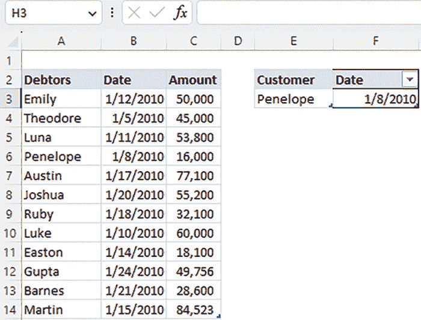

**图 8.1：** Power Query 精确匹配查找

以下是要遵循的步骤：

1.  将包含准则的单元格转换为表。如*图 8.2*所示，将表命名为准则：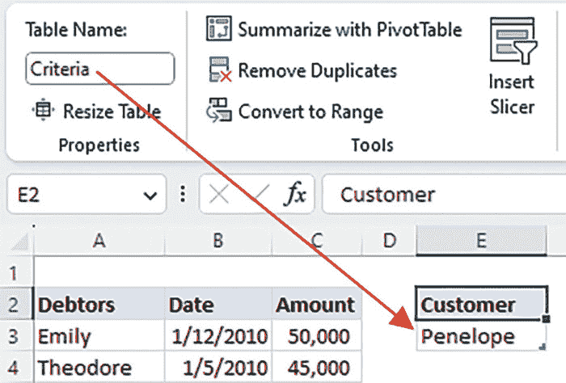

    **图 8.2：** 创建一个准则表

1.  将要查找的数据也转换为表，并将其命名为`**tblDebtors**`，如*图 8.3*所示：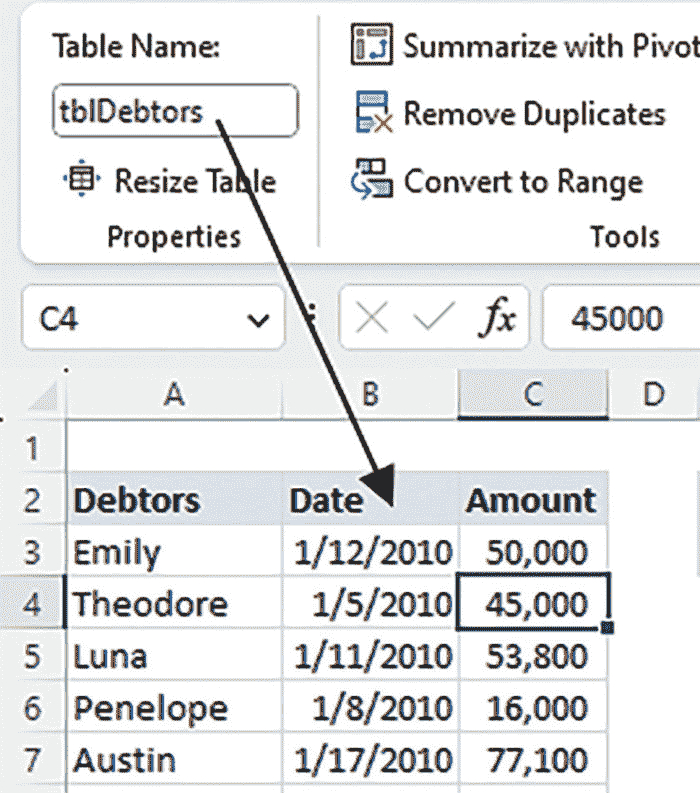

    **图 8.3：** 创建一个查找数据表

1.  首先将准则表加载到 Power Query 中。要做到这一点，单击表中的任意位置 ► 转到“数据”选项卡 ► 单击“从表/范围获取”（参见*图 8.4*）：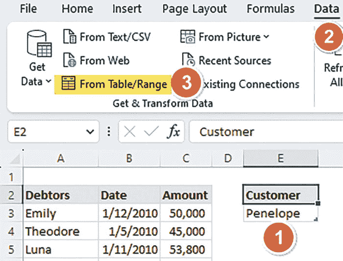

    **图 8.4：** 将准则表加载到 Power Query Editor

1.  转到`**Power Query Editor**`，仅作为连接加载准则表，如*图 8.5*所示：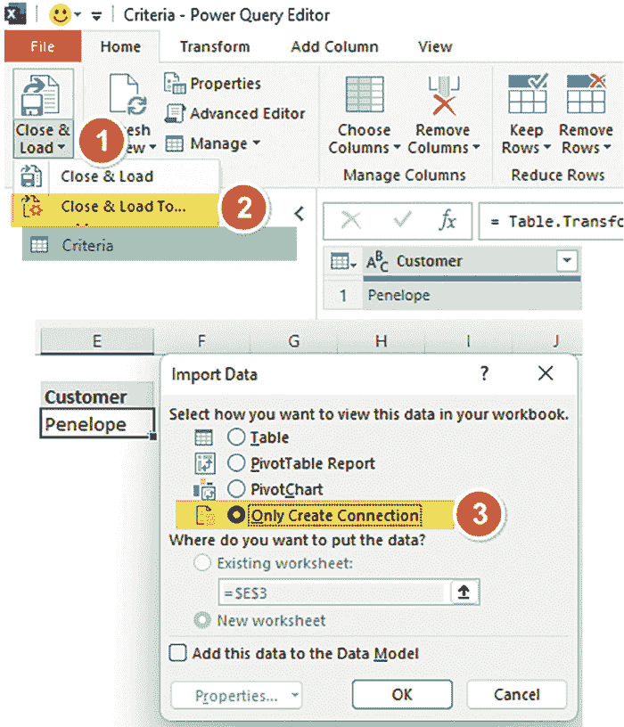

    **图 8.5：** 仅作为连接加载准则表

1.  按照第 3 步中概述的相同步骤加载 Power Query 中的数据表。现在，您应该在 Power Query Editor 中看到`**准则**`和查找表，如*图 8.6*所示：

    **图 8.6：** Power Query Editor 中的准则和查找表

1.  转到`**债务人**`表，并根据第一个债务人进行筛选，如*图 8.7*所示：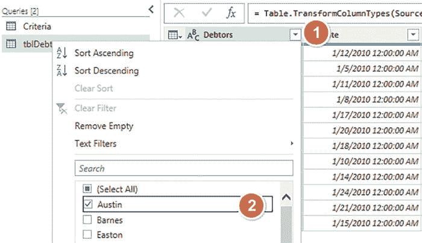

    **图 8.7：** 在查找表上应用筛选器

1.  通过右键单击值并展开，将准则表转换为值，如*图 8.8*所示：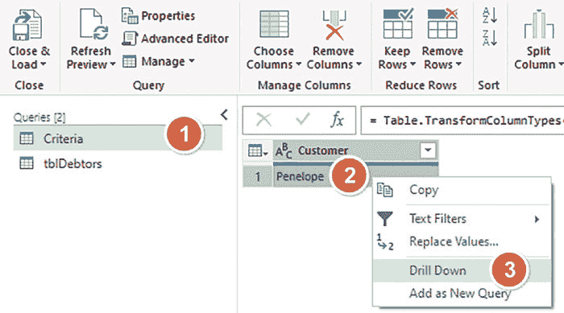

    **图 8.8：** 将准则表转换为值

1.  用第 6 步中的准则值替换筛选值，如*图 8.9*所示：

    **图 8.9：** 用准则值替换筛选值

1.  由于我们想要返回日期值，我们应该选择并删除其他列，如图 8.10 所示：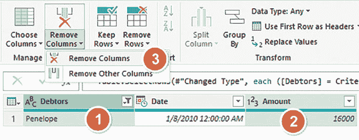

    **图 8.10：** 用准则值替换筛选值

1.  关闭并加载检索到的日期（参见*图 8.11*）：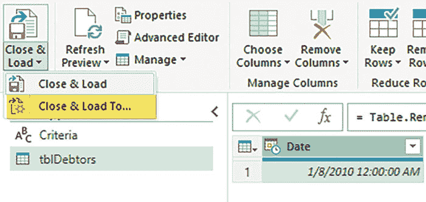

    **图 8.11：** 加载返回的数据

1.  最后一步是将筛选后的客户/债务人的日期加载到现有工作表而不是连接（见*图 8.12*）：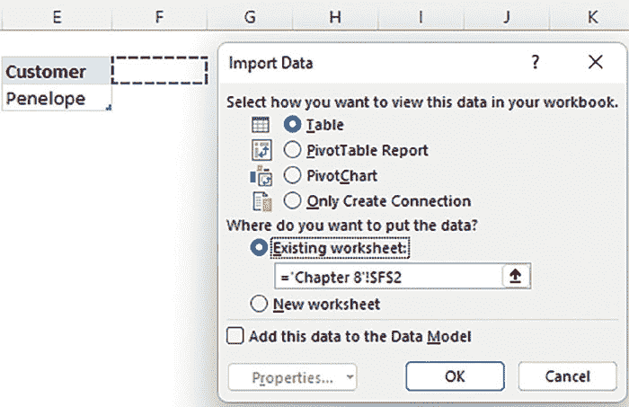

    **图 8.12：** 将数据加载到现有工作表

**注意：**

+   要查找另一个客户/债务人的日期，只需替换名称。然后，转到“数据”选项卡。在查询和连接组中，单击“全部刷新”。

+   Power Query 存储并记住所有步骤，因此在标准发生变化时无需重复执行。

# 返回多个结果和多个列

现在，让我们假设我们有多个债务人的交易，并且希望返回所有交易和多个列，如*图 8.13*所示：

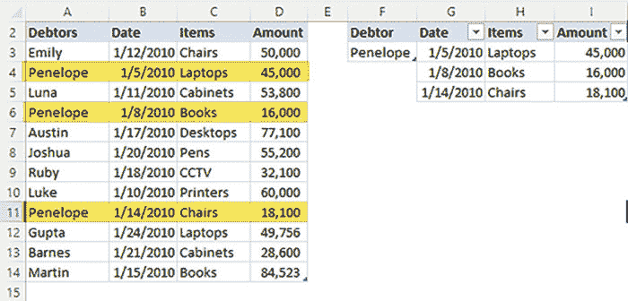

**图 8.13：** Power Query 返回多个项目和多个列

以下是要遵循的步骤：

您将按照前面概述的相同步骤进行操作，只是在第 9 步中有一个小变化。

在第 9 步中，我们删除不需要的列，这次我们只删除债务人的列，如*图 8.14*所示：

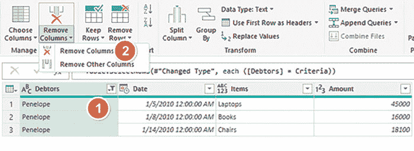

**图 8.14：** 允许返回多个列

前一节中的第 10 和第 11 步保持不变。

# 近似查找

与 Excel 不同，Power Query 没有可以进行近似查找的 VLOOKUP 或 XLOOKUP 函数。

在本节中，我们将学习使用近似查找来查找成绩的步骤，如*图 8.15*所示。请注意，您的成绩表需要按升序排序：

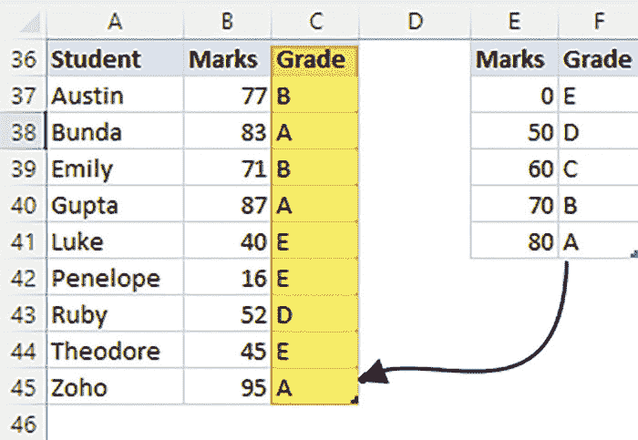

**图 8.15：** Power Query 近似匹配

以下是要遵循的步骤：

1.  仅将成绩表(`**tblGrade**`)加载为连接，然后加载考试表(`**tblExams**`)。然后，按照前一节中概述的步骤 3-5 进行操作（见*图 8.16*）：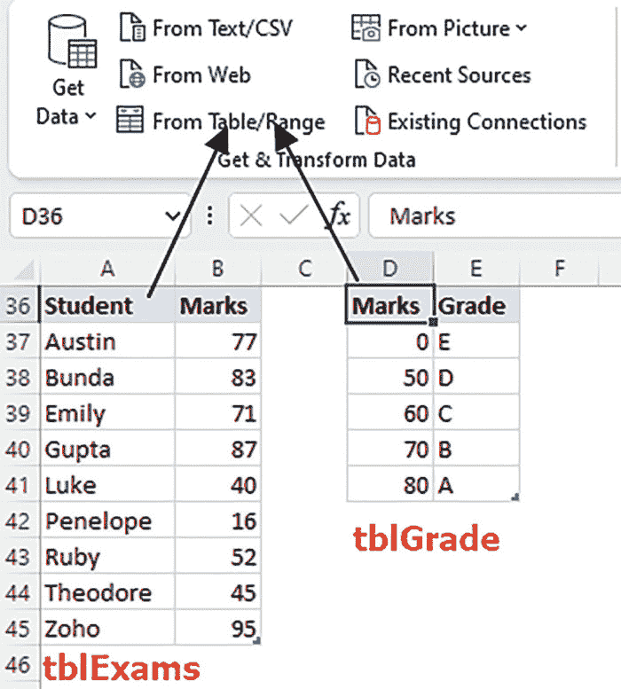

    **图 8.16：** 为表命名并加载到 Power Query

1.  单击考试表，转到“合并”选项卡，并追加查询为新的（见*图 8.17*）：

    **图 8.17：** 在 Power Query 中追加查询

1.  追加考试表(`**tblExams**`)和成绩表(`**tblGrade**`)（见*图 8.18*）：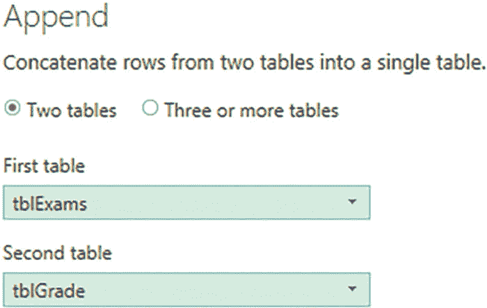

    **图 8.18：** 追加两个表

1.  在追加的查询中，转到`**添加列**`选项卡并添加一个`**索引列**`。我们将在稍后使用此列对数据进行排序（见*图 8.19*）：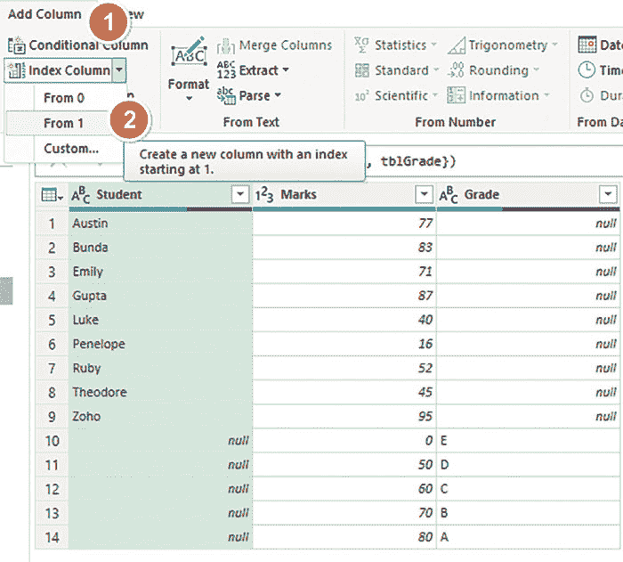

    **图 8.19：** 为追加的查询添加索引列

1.  将分数按升序排序（见*图 8.20*）：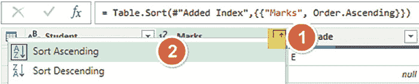

    **图 8.20：** 将分数按升序排序

1.  单击成绩列，转到`**转换**`选项卡，然后在填充选项中点击“向下”（见*图 8.21*）：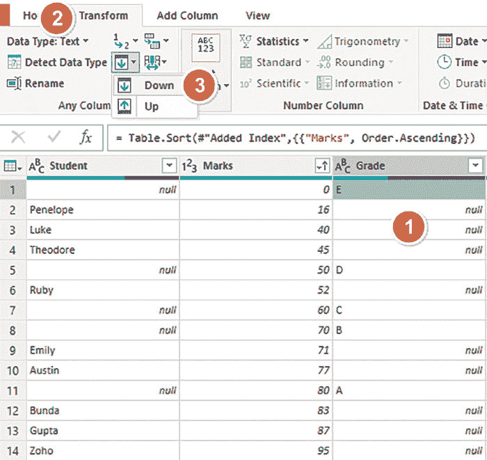

    **图 8.21：** 填充成绩

1.  转到学生列并过滤掉空值。只需取消选中空值。

1.  转到索引列并按升序排序。

1.  高亮显示成绩表，然后转到`**主页**`选项卡，在删除列选项下，单击删除其他列。

1.  单击附加的查询，转到`**主页**`选项卡，然后在关闭和加载选项下，单击`**关闭并加载到**`（见*图 8.22*）：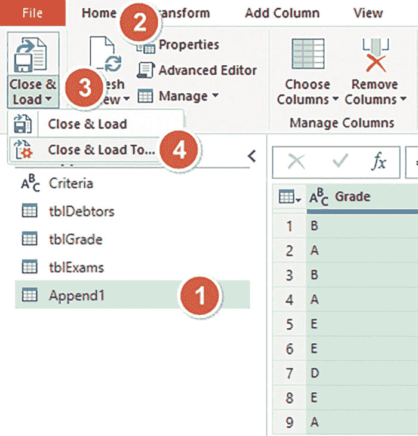

    **图 8.22：** 从近似查找加载成绩

1.  将成绩加载为一个表，放在考试表旁边（见*图 8.23*）：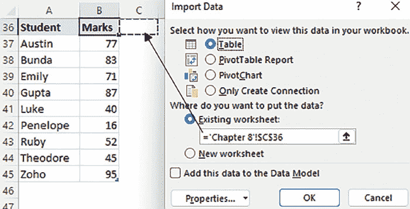

    **图 8.23：** 将成绩加载到考试表旁边

# 使用表连接查找

在 Power Query 中，学习的最重要的事情之一是不同形式的表连接。在这个例子中，我们将只使用两种连接：

+   **内连接：** 结果中只包括两个表中值匹配的行。

+   **左反连接：** 结果中只包括左侧（或第一个）表中的行。

在下面的示例中，见*图 8.24*，我���希望从`**tblCars**`中查找那些车辆已经服务过的客户（满意顾客）和那些车辆未服务过的客户（不满意顾客）：

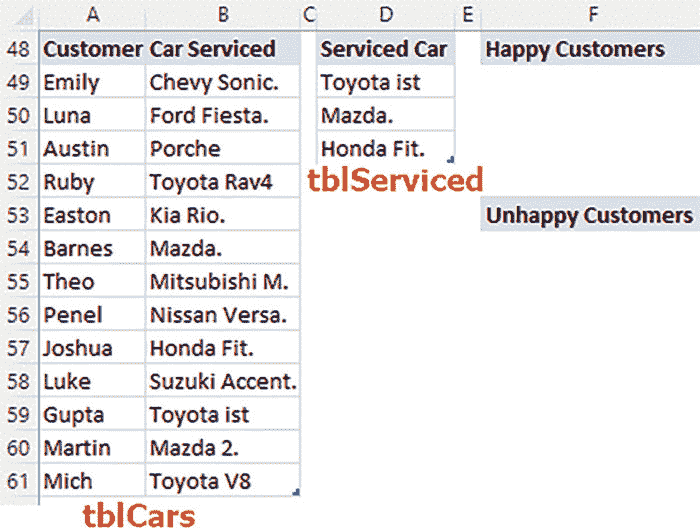

**图 8.24：** 使用表连接查找数据

以下是要遵循的步骤：

1.  将汽车表（`**tblCars**`）和服务表（`**tblServiced**`）仅作为连接加载。按照先前提到的精确查找部分的步骤 3-5 进行操作。

1.  单击汽车表，转到`**主页**`选项卡。在`**合并**`组下，选择合并查询，然后选择`**合并查询**`作为新查询（见*图 8.25*）：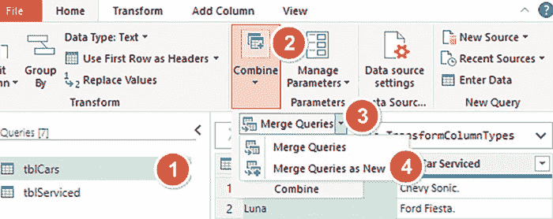

    **图 8.25：** 合并查询

1.  在合并弹出表中，从第二个下拉菜单中选择`**tblServiced**`。然后从`**tblCars**`中选择`**Car Serviced**`列，从`**tblServiced**`表中选择`**Serviced Cars**`列。最后，从连接类型中选择内连接。这将只显示满意顾客的数据（见*图 8.26*）：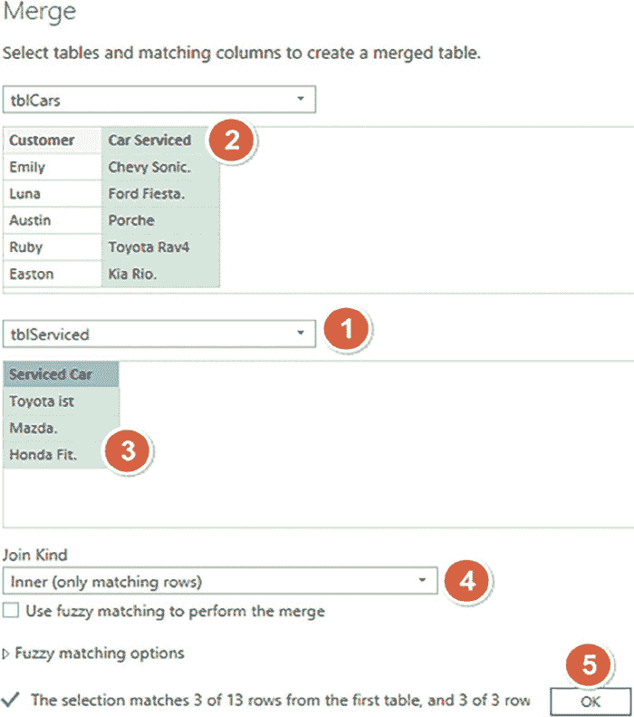

    **图 8.26：** 内连接表合并

1.  将查询重命名为`**满意顾客**`，选择客户列，然后单击删除其他列（见*图 8.27*）：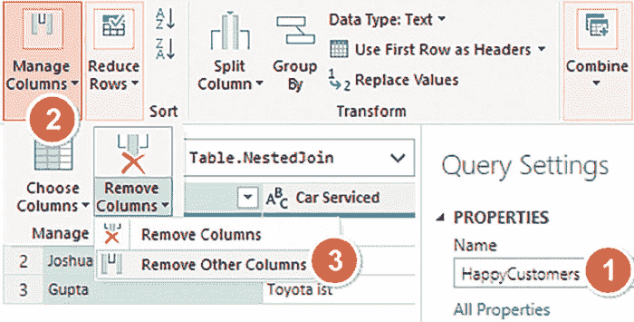

    **图 8.27：** 重命名查询

1.  重复前述步骤 1-3，创建一个新的合并查询。这次，不选择内连接，而是选择左反连接。这将只显示未服务车辆的不满意顾客的数据（见*图 8.28*）：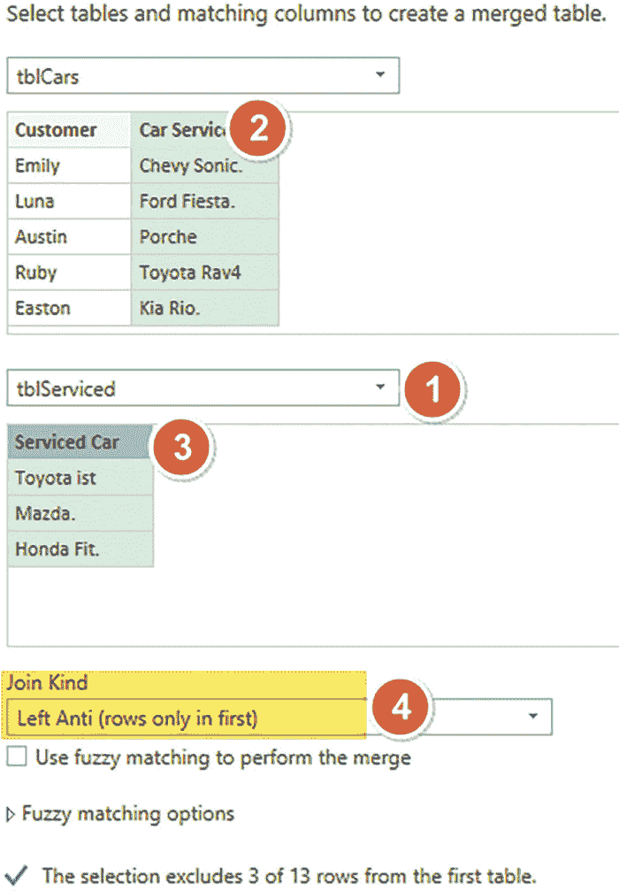

    **图 8.28：** 左反连接表合并

1.  将查询重命名为`**不满意顾客**`，选择客户列，然后单击删除其他列。

1.  最后，将这两个新查询作为表加载到现有工作表中。

# 查找前 n 个或后 n 个项目

要动态查找前/后 n 个项目，我们将使用几乎与精确查找部分相同的步骤，只是稍作修改。

例如，*图 8.29*展示了如何查找前五名债权人：

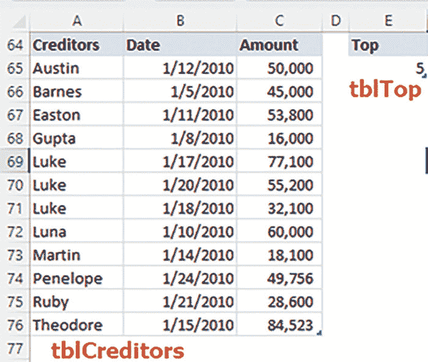

**图 8.29：** 查找前五名债权人

下面是要遵循的步骤：

1.  将前 5 名表（`**tblTop**`）仅作为连接加载，然后加载债权人表（`**tblCreditors**`）。按照前述精确查找部分的步���3-5 进行操作。

1.  通过右键单击值并进行下钻，将`**tblTop**`表转换为值。请参考前面提到的精确查找部分的第 7 步。

1.  点击债权人表，转到“**主页**”选项卡，在“保留行”选项下，选择“保留前几行”。在弹出窗口中，输入 5 作为行数（参见*图 8.30*）：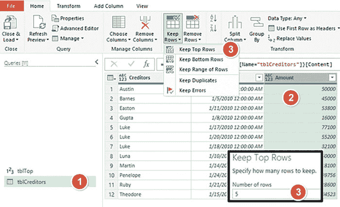

    **图 8.30：** 保留前五行

1.  转到“**查看**”选项卡，点击“**高级编辑器**”（参见*图 8.31*）。这一步的原因是将硬编码的五行替换为我们在`**tblTop**`表中的条件：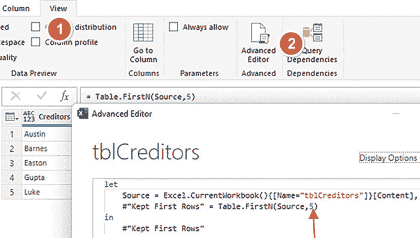

    **图 8.31：** 调用高级编辑器

1.  在“tblTop”表中用我们的动态条件替换硬编码的 5（参见*图 8.32*）：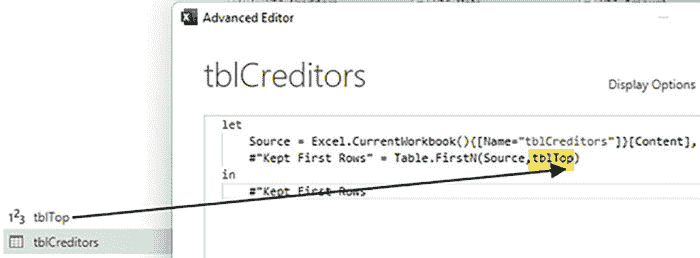

    **图 8.32：** 用动态条件替换硬编码的条件

1.  将筛选后的债权人加载为现有工作表中的表格。

1.  为了测试动态筛选是否有效，请将前 5-7 行更改为其他数字，然后刷新查询。

***注意****：要查找底部的 n 个项目，请按照前述步骤进行，但在第 3 步中选择“保留底部行”*

# 使用列表函数进行查找

Power Query 中有超过 45 个与列表相关的函数。让我们学习如何使用其中一些来查找数据。

我们将查找成绩和导师表，如*图 8.33*所示：

**图 8.33：** 使用列表函数的近似和精确函数

下面是要遵循的步骤：

1.  将所有三个表仅作为连接加载。

1.  选择班级表（`**tblClass**`），转到“**添加列**”选项卡，点击“**自定义列**”（参见*图 8.34*）：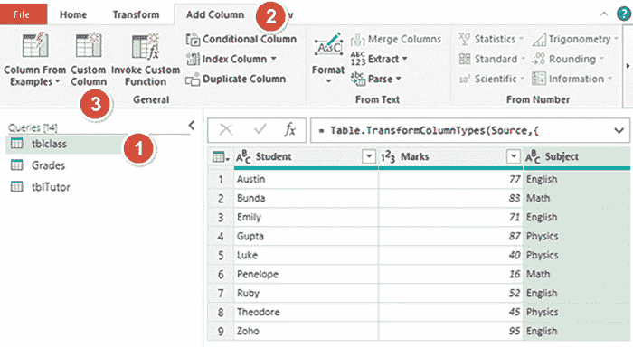

    **图 8.34：** 创建自定义列

1.  将您的列重命名为`**Tutor**`，并按照*图 8.35*所示编写函数：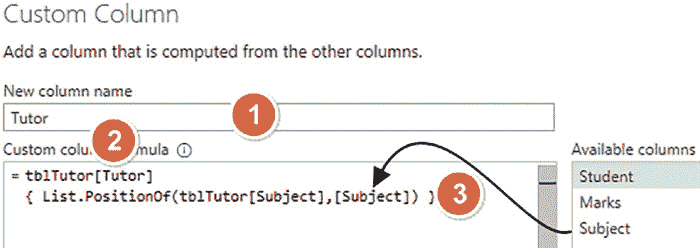

    **图 8.35：** 使用 List.PositionOf 函数进行精确查找

`tblTutor[Tutor]`

`{ List.PositionOf(tblTutor[Subject],[Subject]) }`

函数的工作原理如下：

+   `**tblTutor[Tutor]**` ► 返回查找表`**tblTutor**`中所有导师的列表。在 Power Query 中，您可以使用方括号表示法`**([ColumnName])**`访问表的列**。**

+   获取列后，我们需要使用位置索引运算符，即花括号（{}），返回在`**tblclass**`中的主题与`**tblTutor**`中的主题匹配的行号

+   `**List.PositionOf(tblTutor[Subject],[Subject])**` ► 为了动态返回每个科目的行，我们使用了函数 List.PositionOf。该函数用于在表的`**Subject**`列（tblTutor[Subject]）中查找当前值（[Subject]）的位置。它返回值在列表中的位置（索引）。

+   这个表达式的工作方式类似于我们在*第三章，Index and Match*中学到的 INDEX 和 MATCH 组合函数。我们首先从`**tblTutor**`中查找列，然后在`**tblClass**`中匹配科目与`**tblTutor**`中的科目的行。

现在，让我们看看如何通过查找成绩来进行近似匹配。

下面是要遵循的步骤：

1.  创建另一个自定义列并将其重命名为 grades。

1.  按照*图 8.36*中显示的函数编写如下：

`List.Last(`

`Table.SelectRows(Grades,(IT)=> IT[Marks]<=[Marks])[Grade])`

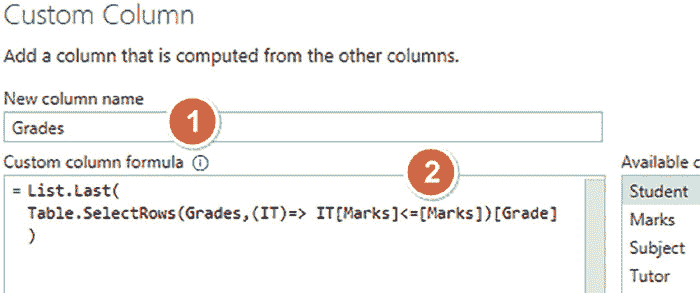

**图 8.36:** 使用 Table.SelectRows 和 List.Last 进行近似查找

函数的工作原理如下：

+   `**Table.SelectRows(Grades, (IT)=> IT[Marks]<=[Marks])**` ► 此函数根据条件过滤“Grades”表的行。第二个参数，`**(IT) => IT[Marks] <= [Marks]**`，是一个内联函数（也称为 lambda 函数），指定了过滤条件。

    这里发生了什么：

    +   `**(IT)**` 是代表内部表“Grades”的自定义变量，在“tblClass”表内我们将对其进行筛选。

    +   `**IT[Marks]**` 指的是内部表“Marks”列中的值。

    +   `**[Marks]**` 指的是“tblClass”每行中的成绩值。

因此，过滤条件检查“Grades”表的“Marks”列的值（IT[Marks])是否小于或等于“tblClass”中的“Marks”值，并返回那些 Marks 和相应 Grades 的表。

+   `**Table.SelectRows(Grades,(IT)=> IT[Marks]<=[Marks])[Grade]►**` 由于我们只对成绩感兴趣，我们使用字段列运算符（ [] ）来获取一个成绩列表。

+   最后，我们使用`**List.Last**`函数查找列表中的最后一个成绩。

# 查找工作日与周末数据

要在 Power Query 中查找周末或工作日数据，我们使用`**Date.DayOfWeek**`函数。

例如，使用*图 8.37*中显示的数据，让我们看看如何查找我们在周末和工作日给信用的人。

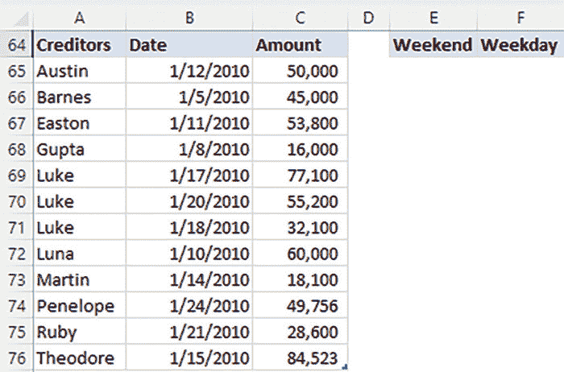

**图 8.37:** 查找工作日和周末数据

下面是要遵循的步骤：

1.  将表加���到 Power Query 中。

1.  要查找工作日数据，转到“查看”选项卡，单击“高级编辑器”，并编写以下函数：

    `let`

    `Source = Excel.CurrentWorkbook(){[Name=”tblCreditors”]}[Content],`

    `#”筛选行” =`

    `Table.SelectRows(`

    `Source, each Date.DayOfWeek([Date])>=1 and Date.DayOfWeek([Date])<6`

    `)`

    `in`

    `#”筛选行”`

函数的工作原理如下：

+   `**let**` 子句用于定义一组命名步骤，每个步骤代表特定的转换或计算。

+   `**Source = Excel.CurrentWorkbook(){[Name=”tblCreditors”]}[Content**``**] ►**` 将当前 Excel 工作簿中名为“tblCreditors”的表的内容分配给变量“Source”。

+   使用 `**Table.SelectRows**` 函数定义一个新的“Filtered Rows”步骤，以根据涉及一周中某一天的特定条件过滤“Source”表的行。

+   `**Date.DayOfWeek([Date]) > 1 and Date.DayOfWeek([Date]) < 6**` 检查“Date”列的星期几是否大于或等于 1（星期一）且小于 6（星期五）。这有效地过滤掉对应于周末（星期六和星期日）的行。

+   `**in #”Filtered Rows”►**` in 关键字表示脚本的输出。此行指定脚本的结果，即“Filtered Rows”步骤生成的表。

注意

+   `**Date.DayOfWeek**` 函数返回一个数字（从 0 到 6），表示提供的日期是一周中的哪一天。

+   将星期日视为一周的第一天。

+   因此，要查找仅周末数据，请将先前提供的 `**Table.SelectRows**` 函数替换为以下函数，该函数仅返回 `**Date**` 的一周中的日期等于 0 或 1 的函数，即（星期日和星期六）：

`**Table.SelectRows(Source, each Date.DayOfWeek([Date])=0 or Date.DayOfWeek([Date])=6)**`

# 查找不包括假期的日期

假设我们有以下收集的数据和假期日期，如 *图 8.38* 所示。让我们学习如何查找不包括假期的收集数据。

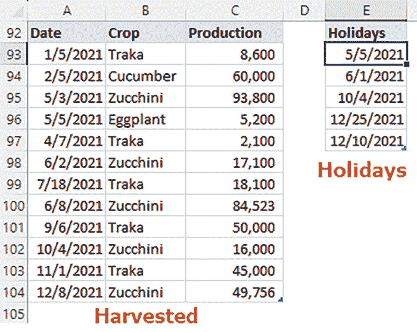

**图 8.38：** 查找不包括假期的日期

以下是要遵循的步骤：

1.  仅将这两个表加载为连接。

1.  转到查询和连接，右键单击已获取的表，然后单击 `**Merge**`（参见 *图 8.39*）: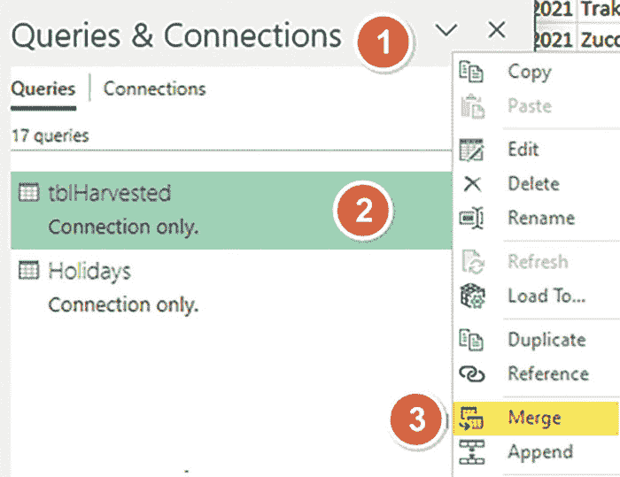

    **图 8.39：** 合并查询

1.  在合并弹出窗口中，选择第二个下拉菜单中的假期表。然后，在已获取的表和假期中选择日期列。最后，选择左反连接以从已获取的表中排除假期（参见 *图 8.40*）: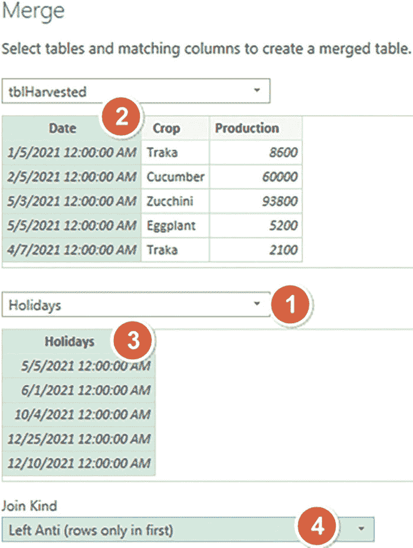

    **图 8.40：** 合并查询

1.  最后，删除假期列并加载数据。

# 查找重复 N 次的项目

使用 *图 8.41* 中显示的数据，让我们学习如何从 `**Sports Sale**` 表中查找重复两次的项目。

请注意，我们希望一种解决方案，可以用任何数字替换 2，Power Query 将查找这些项目。

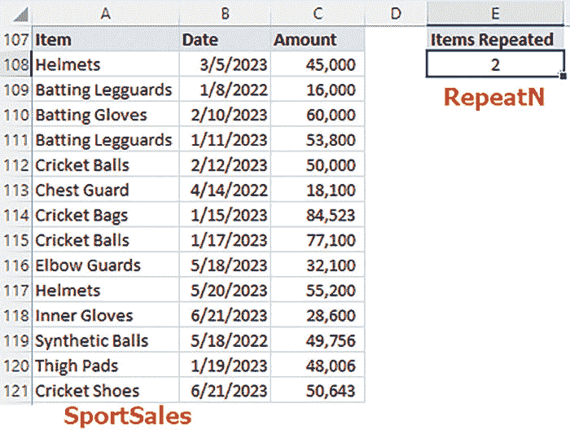

**图 8.41：** 查找重复 2 次的项目

以下是要遵循的步骤：

1.  仅将这两个表加载为连接。

1.  将 `**RepeatN**` 表转换为值 ► 右键单击值并展开（参见 *图 8.42*）: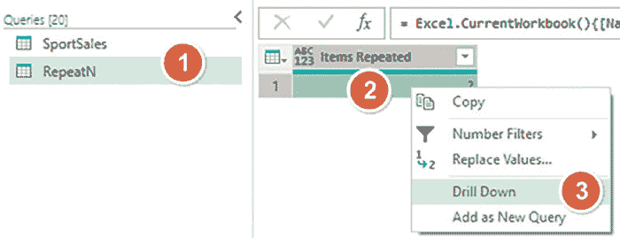

    **图 8.42：**将表转换为值

1.  转到`**SportSales**`表格，选择项目列。然后，转到“转换”选项卡，点击`**GroupBy**`。在操作下，选择`**CountRows**`，然后点击`**确定**` (见*图 8.43*)*:*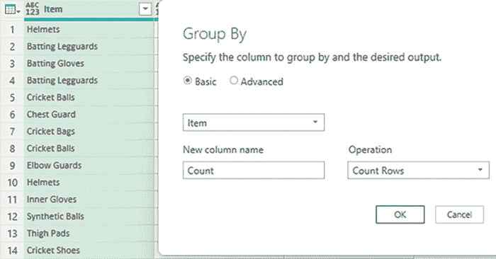

    **图 8.43：**按项目分组

1.  转到新的计数列，并按 1 进行筛选(见*图 8.44*):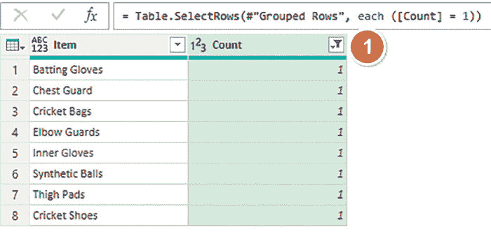

    **图 8.44：**按任意计数筛选

1.  用我们的`**RepeatN**`值替换硬编码的筛选条件。转到查看选项卡，点击`**高级编辑器**`。删除硬编码的筛选条件(1)，输入`**RepeatN**` (见*图 8.45*):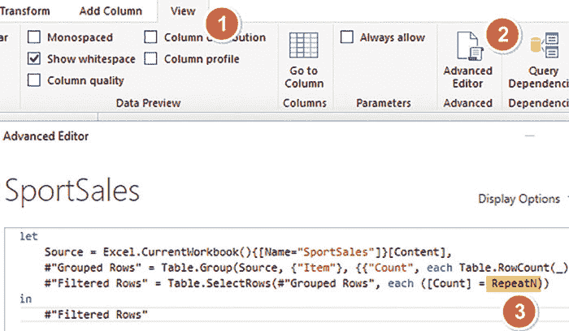

    **图 8.45：**按任意计数筛选

1.  删除`**Count**`列并加载数据(见*图 8.46*)*:*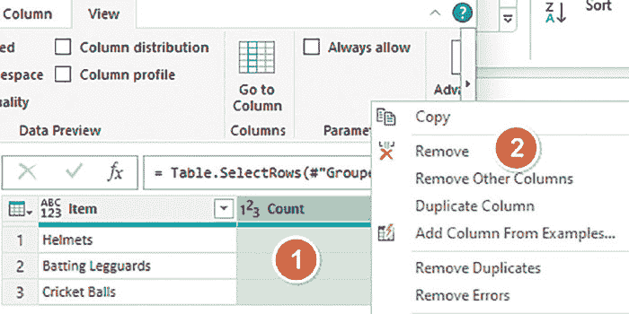

    **图 8.46：**删除计数列并加载数据

# 仅返回月末日期项目

在上一章关于`**FILTER**`函数中，我们学习了如何查找发生在月末的交易。现在，让我们看看如何使用 Power Query 实现相同的功能。

使用*图 8.47*中显示的数据，仅返回每月末支付的债权人：

**图 8.47：**查找月末交易

以下是要遵循的步骤：

1.  在 Power Query 中加载债权人表。

1.  转到`**查看**`选项卡，点击高级编辑器。

1.  按照*图 8.48*中显示的方式编写函数: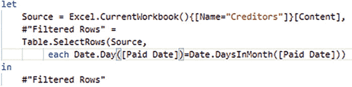

    **图 8.48：**选择月末项目的 M 代码

    函数的工作原理如下：

    +   `**let**`子句用于定义一组命名步骤，每个步骤代表特定的转换或计算。

    +   `**Source = Excel.CurrentWorkbook(){[Name=”Creditors”]}[Content] ►**`将当前 Excel 工作簿中名为“Creditors”的表的内容分配给变量“Source”。

    +   使用`**Table.SelectRows**`函数定义一个新的“筛选行”步骤，根据特定条件筛选“Source”表的行。

    +   `**Date.Day([Paid Date])**`返回“支付日期”列的日期部分，而`**Date.DaysInMonth([Paid Date])**`返回一个从 28 到 31 的数字，表示该月的天数。

    +   `**Date.Day([Paid Date]) = Date.DaysInMonth([Paid Date])**`检查支付日期的日期部分是否等于该月的总天数。如果相等，则表达式将返回 TRUE，表示支付日期是该月的最后一天。

    +   `**Table.SelectRows**`函数仅返回前提条件为 TRUE 的行。

1.  将筛选后的表加载到现有工作表中。

# 模糊查找

在 Power Query 中执行模糊匹配比使用函数更容易且更直观。

模糊匹配是指根据相似性比较非相同文本字符串的技术。模糊匹配评估字符串之间的相似度，而不是精确匹配，允许在数据集中识别相似或密切相关的术语。

例如，我们如何使用`**tblClean**`中的`**Lookup Company**`列查找`**tblDirty**`中的员工，如*图 8.49*所示：

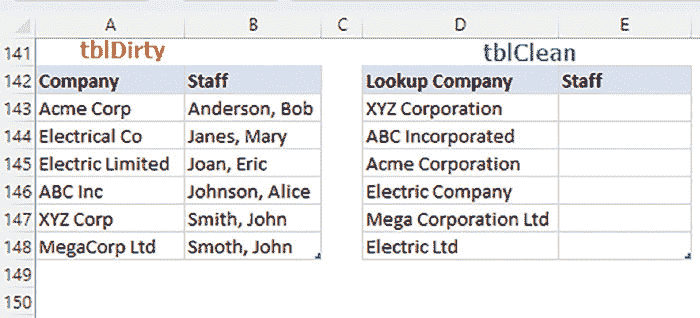

**图 8.49：** 模糊查找

以下是要遵循的步骤：

1.  仅将两个表作为连接加载。

1.  单击`**tblDirty**`，然后单击合并。

1.  选择`**tblClean**`，然后选择要匹配的列，如*图 8.50*所示。

1.  单击`**使用模糊匹配执行合并**`并展开模糊匹配选项。这些选项允许您微调匹配过程。较低的相似性阈值降低了模糊匹配算法的严格性。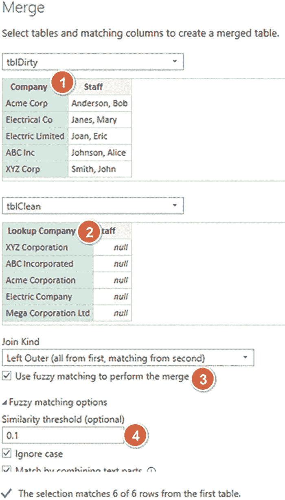

    **图 8.50：** 左外部模糊查找

1.  展开合并表（见*图 8.51*）并仅选择查找列。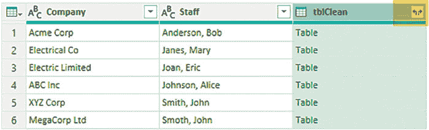

    **图 8.51：** 展开合并表

1.  删除脏列并将表加载出来。

# 结论

在本章中，我们学习了如何使用强大的数据转换和准备工具——Power Query 来解决不同的查找问题。在处理大数据集时，这是主要推荐的工具。

其中一个缺点是，创建 Power Query 查询和连接可能需要比使用简单的 Excel 公式更多的时间。正如我们所学到的，这涉及许多步骤。

另一个缺点是，与实时重新计算并在编辑电子表格时提供即时结果的公式不同，Power Query 要求您在数据更改时刷新查询。您可以设置查询在特定时间后刷新，但如果您有复杂的查询，这将是资源的浪费。

在下一章中，我们将学习如何在精通 Excel 中利用人工智能。

# 需要记住的要点

+   如果您正在处理相对较小的数据集并且需要执行简单的查找，通常使用 Excel 公式设置和使用速度更快。但是，随着数据集大小和复杂性的增加或需要进行广泛的数据转换时，Power Query 将成为更高效和可扩展的选择。

+   尽管涉及许多步骤，但 Power Query 提供了一个视觉、用户友好的界面，允许用户与数据转换进行交互。这些步骤比复杂的公式更直观。

+   您可以创建可重复使用的 Power Query 查询，可应用于不同的数据集或在团队之间共享，确保数据准备和查找过程的一致性。

# 多项选择题

1.  Power Query 的主要目的是什么？

    1.  数据可视化

    1.  数据转换和准备

    1.  统计分析

    1.  数据备份和恢复

1.  以下哪个不是您可以在 Power Query 中执行的步骤？

    1.  过滤行

    1.  创建数据透视表

    1.  合并表格

    1.  删除重复项

1.  在 Excel 中哪个选项卡可以访问 Power Query？

    1.  数据

    1.  插入

    1.  格式

    1.  主页

1.  Power Query 中的哪个操作允许您基于共同列合并来自多个表的数据？

    1.  合并

    1.  连接

    1.  追加

    1.  按组

1.  以下哪个是 Power Query 的有效数据源？

    1.  仅限 Excel 文件

    1.  仅限 CSV 文件

    1.  Excel 文件，CSV 文件，数据库，Web 资源等等

    1.  仅限 Word 文档

1.  “模糊匹配”这个术语在 Power Query 中是什么意思？

    1.  匹配相同字符串

    1.  基于相似性匹配非相同文本

    1.  匹配区分大小写的文本

    1.  匹配数值

# 答案

1.  b

1.  b

1.  a

1.  a

1.  c

1.  b
