# Python 和 ChatGPT 氛围编程入门

> 原文：[USING CHATGPT: MADE EASY](https://annas-archive.gl/md5/2553725c58eaf8c51162b1941160f222)
> 
> 译者：[飞龙](https://github.com/wizardforcel)
> 
> 协议：[CC BY-NC-SA 4.0](https://creativecommons.org/licenses/by-nc-sa/4.0/)

## 前言

在本书中，我们带您进行一次有趣、实用的 Vibe 编码速成课程，使用 Python 和 ChatGPT。通过 Vibe 编码，您将使用 ChatGPT 和 Python 为您构建应用程序，而无需进行复杂的编码，同时您专注于大的概念。

在本书的过程中，我们将介绍如何在几分钟内构建功能性的个人应用程序，包括：- 下载 YouTube 内容 - 通过 API/网络爬虫获取比特币价格 - 自动化网络浏览 - 文本转语音 - 使用 Elevenlabs API 生成声音克隆 - 自动化电子邮件

- 计算机视觉

- 创建和托管网站 - 创建 Flappy Bird 游戏 - 使用 OpenAI API 进行语音到文本和摘要 - 创建 Telegram 机器人 - 创建 RAG - 与 PDF 应用程序聊天 获取书籍更新

要接收书籍的更新版本，请通过发送邮件至 support@i-ducate.com 订阅我们的邮件列表。我试图更新我的书籍以使用最新的软件、库版本，并将更新本书中的代码/内容。因此，请订阅我的列表以接收更新副本！

伴侣视频课程 通过发送邮件至 support@i-ducate.com 联系我以获取本书的伴侣视频。一些示例在视频中展示得更好。有关本书的评论或问题也可以发送至同一邮箱。

# 第一章 - 简介

欢迎加入 Python 和 ChatGPT 的 Vibe 编码入门！

这本书的目标是帮助你学习如何创建应用程序，而无需精通复杂的编码。你将学习如何使用 Python 构建个人使用的真实应用程序，甚至更多。从提示到完成，你将在几分钟内看到结果。

与传统的编程书籍不同，这本书不需要你深入研究代码语法或花费数小时来完成。课程设置灵活，允许你从任何地方开始或遵循指导的学习曲线。

书的第一部分专注于在单个文件中运行的简单代码。第二部分探讨了 API 的使用。最后，书中包含了一些示例，结合库和 API 来展示你可以创建的项目类型。

这本书的目标是向你展示如何使用和集成 Python 的库和 API。它将为你提供一套最有用和最有趣的函数工具包，并说明如何将想法转化为实际应用。

一旦你了解了如何使用 Python 并将库和 API 集成到你的工作流程中，你将能够创建各种程序来提高你的效率——即使是单次使用。

## Vibe 编码简介

在传统的编码中，程序员制定计划，编写代码，运行它，并在过程中纠正错误。在 Vibe 编码中，你不会自己编写任何代码。相反，你要求 LLM 为你完成。你运行结果而不阅读代码，如果出现错误或你想调整输出，你只需告诉 LLM 按你的要求进行调整。

那么，Vibe 编码是从哪里来的？这个术语是由 OpenAI 的联合创始人 Andrej Karpathy 提出的。它是关于用简单的英语向 LLM 提出要求来创建某物，而不是管理代码本身：

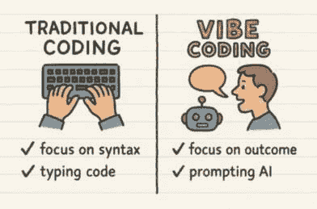

（来源：https://medium.com/@utsavmadaan823/the-vibe-coding-revolution-hype-pitfalls-how-to-ride-the-wave-%EF%B8%8F-a5e9b4a4185e）

要有效地完成这项任务，你需要具备基本编程概念的最小可行知识，以便解锁这项技能。

Vibe 编码是“糟糕”的编码吗？

Vibe 编码并不是关于编写完美的代码。它是一种拥抱实用的“完成任务”的方法，尤其是在构建通常不需要与商业软件相同标准的个人应用程序时。你正在为自己编写代码，增加你的技能栈，并将其与你的其他技能相结合。

为什么 Vibe 编码是一个好的开始

Vibe 编码的学习曲线比传统的编程课程要平缓得多，实验想法、探索库和 API 很有趣，并为构建软件和应用程序提供了一种新颖实用的方法。你可以为自己创建它们，无论是为了娱乐、工作还是好奇心。你可以创建的东西太多了！

那么，如何感受代码的魅力？

你将从询问一个 LLM 开始——我们将使用 ChatGPT。简单来说

1. 提示你想要的 app

2. 复制并粘贴它生成的代码。

3. 只需运行代码（无需阅读）。

4. 如果有错误或需要更改，复制粘贴错误或从 LLM 请求调整。

5. 重复。

## 使用 Python

我们将在本书中使用 Python。Python 是一种读起来有点像英语但有自己的语法的编程语言。我们选择 Python 是因为 LLMs 对其进行了很好的训练。任何语言的编程基础经验都将很有用，但您不需要深入学习 Python。

您需要在您的机器上安装 Python。它可能已经安装了；如果没有，可以免费从 python.org 下载。网上有很多教程，或者您可以要求 ChatGPT 引导您完成设置。

要编写和运行 Python 程序，您需要一个代码编辑器。我推荐 VS Code，这是一个免费的 Mac 和 Windows 代码编辑器，可以从 code.visualstudio.com 下载。在 VS Code 中，您将使用终端窗口——屏幕底部的简单界面来运行您的代码、复制粘贴错误和查看结果。

Python 库

Python 库是免费的功能集合，可以为您的程序添加功能。有数千个用于数据库、数学、图形、计算机视觉等库。每个库通常都需要您使用以下方式在您的机器上安装它：

pip install [库名称]

并在您的代码中使用它们：

import [库名称]

我们将在稍后探索许多此类示例。

# 第二章 - 使用 Python 库进行简单项目

我们将通过简单的单函数项目来探索基本的编程概念和应用程序，这些项目适合在一个文件中。代码简短，不需要太多组织。

第一个典型的编程项目是“Hello World！”这是一个简单的程序，显示“Hello World！”

让我们去 chatgpt.com 并说，“创建一个 Python hello world 程序”：

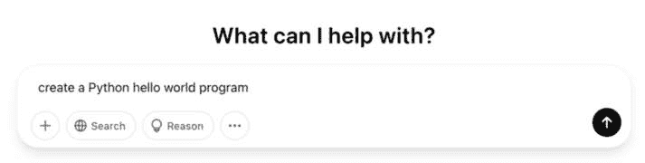

这里是输出结果！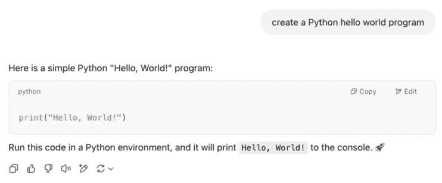

我们不需要阅读它——只需复制它。然后在 VSCode 中创建一个新的 Python 文件：

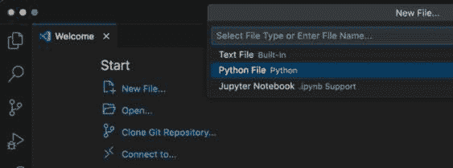

并粘贴代码：

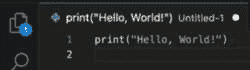

然后点击右上角的三角形（运行 Python 文件）：

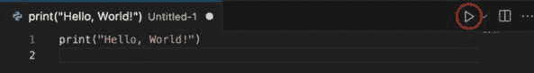

我们需要保存它。让我们称它为"hello.py"：

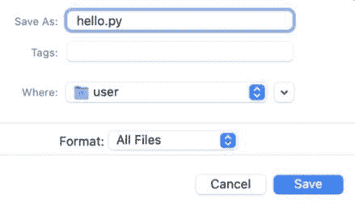

您可以看到底部出现了一个终端窗口，显示“Hello World”：

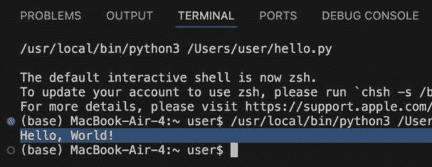

## 下载 YouTube 内容

我们接下来将创建一个程序，从 YouTube 链接下载视频。让我们去 ChatGPT 并提示它：“创建一个可以从 YouTube 链接下载视频的 Python 程序”：

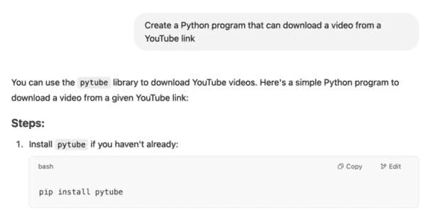

我们可以在响应中看到，我们可以使用 pytube 库下载 YouTube 视频。让我们在 VSCode 终端中运行 pytube 来安装它：

pip install pytube

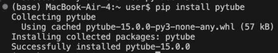

然后我们按照 pytube 使用说明的其余部分进行操作：

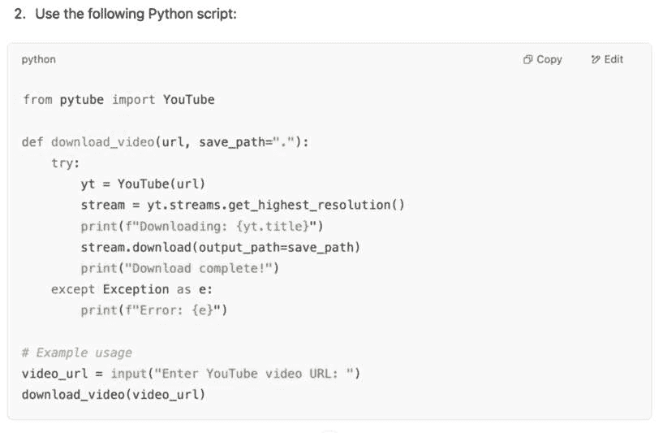

我们实际上不需要阅读代码。我们只需将代码复制粘贴到 VSCode 中的新 Python 文件中：

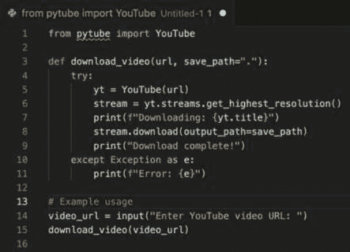

让我们运行它。我将称它为 youtube.py。现在当我运行它时，我得到一个错误消息，如下所示：

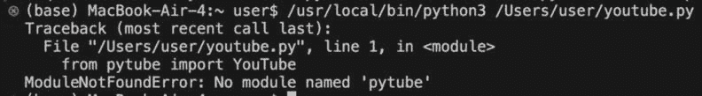

我可以简单地复制整个错误消息并将其粘贴到 ChatGPT 中：

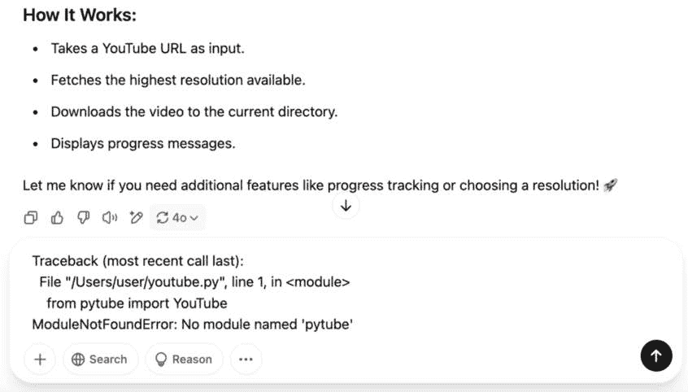

我认为问题是因为我正在使用 Python3：

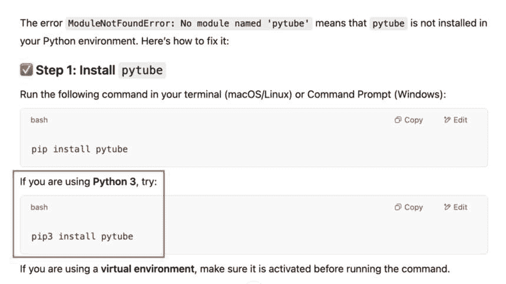

如果我运行：

pip3 install pytube

再次运行应用程序，程序运行！

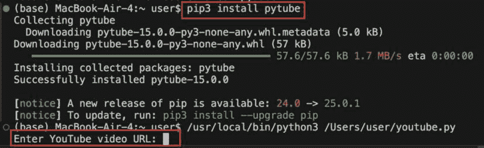

它要求我“输入 YouTube 视频 URL：”

所以就给它一个随机的视频（先尝试选择一个小视频），我又得到了另一个错误：

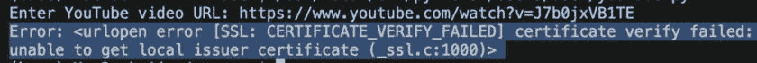

再次，将错误复制粘贴到 ChatGPT

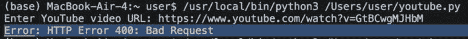

我又得到了另一个错误。尝试了几次之后，我得到了相同的错误重复出现。

现在，ChatGPT 提供了一个替代库：

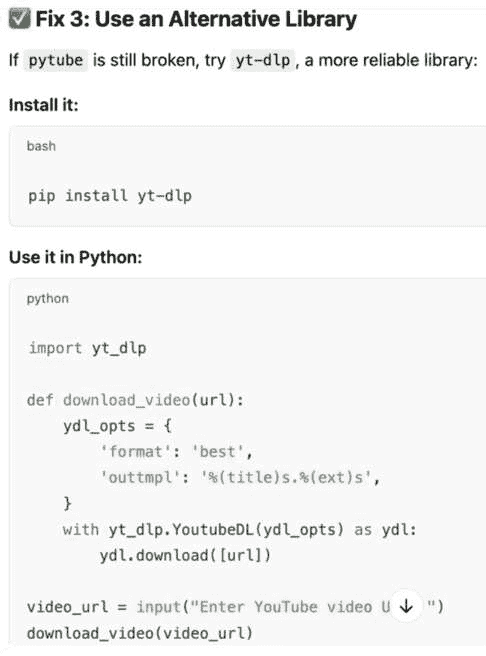

它建议使用 yt-dlp。所以我们来做：

pip3 install yt-dlp

然后将整个代码复制粘贴到替换 youtube.py，我得到了另一个错误：

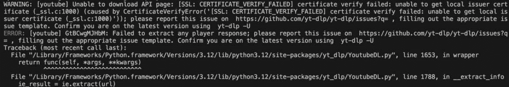

再次，将错误复制粘贴到 ChatGPT，我得到了以下解决方案：

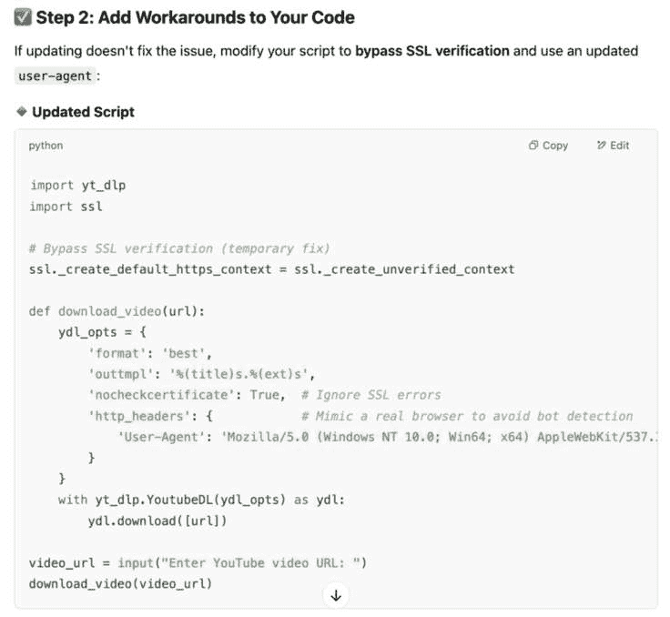

我将其复制粘贴到 VSCode 中并运行：

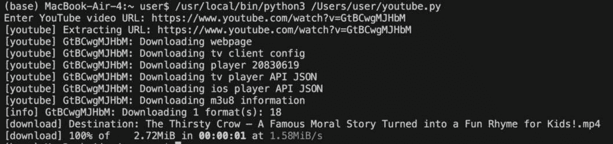

这次，程序成功运行并下载了视频（可能是与 youtube.py 相同的文件夹）！

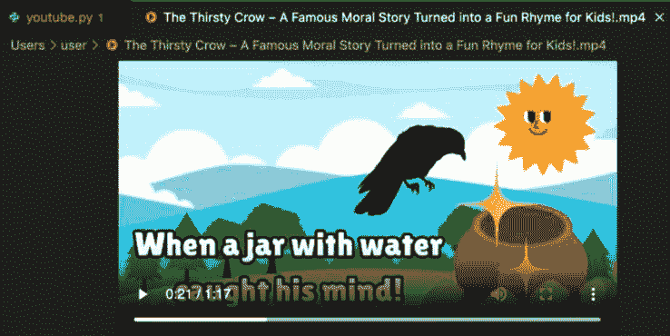

现在，你可能会遇到来自你的 LLM 的不同错误消息或建议，但那没关系。这正是 vibe 编码的精髓所在，我们只是提示 LLM 运行它，如果遇到任何错误，就将其复制粘贴回 LLM 并重复。

## 通过 API 获取比特币价格

你可以使用程序从 API 中检索数据。例如，假设我们想获取比特币的最新价格。让我们提示“创建一个 Python 程序，获取比特币的最新价格”。

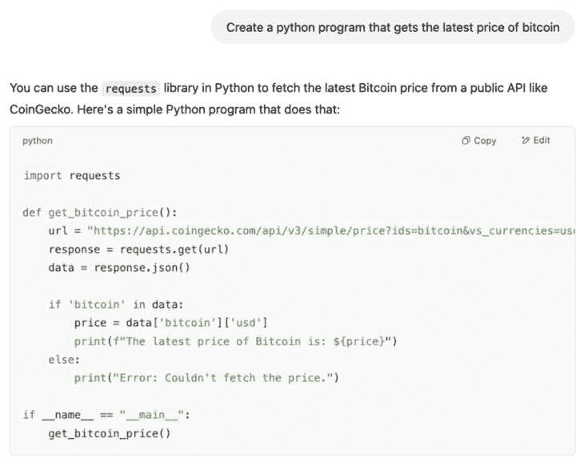

程序从 coingecko.com 的 API 中检索最新的比特币价格。

所以我复制并粘贴了代码。在运行之前，我用以下方式安装 requests：

pip3 install requests

现在，让我们运行它：

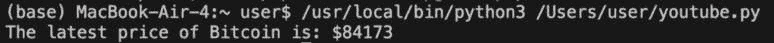

我得到了最新的比特币价格！

## 通过网络抓取获取比特币价格

假设我们不想使用 API（可能我们不想支付 API 费用或者没有可用的 API），我们可以提示“创建一个 Python 程序，通过从网站抓取来获取比特币的最新价格”。

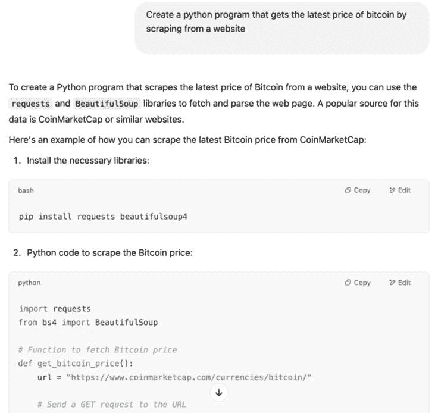

ChatGPT 建议使用一个名为 BeautifulSoup 的库，该库用于解析 HTML 代码。让我们复制粘贴此代码，安装库并尝试一下：

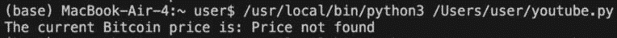

很遗憾，价格未找到。似乎我们需要提供更多 HTML 结构的详细信息，以便我们的程序知道从哪里收集价格。

我们可以查看 coinmarketcap.com/currencies/bitcoin/：

我们在左侧清楚地显示了比特币价格。如果检查比特币价格：

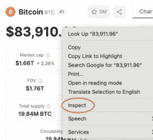

我们可以看到包含价格的 HTML 元素：

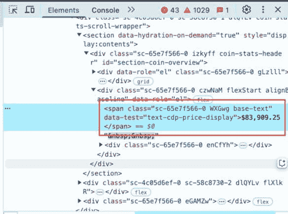

如果你是一位经验丰富的开发者，你可能会检查代码的路径，但我们不会这么做。

而不是，我们将复制该元素：

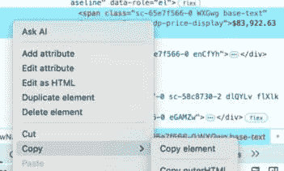

然后将它粘贴到 ChatGPT：

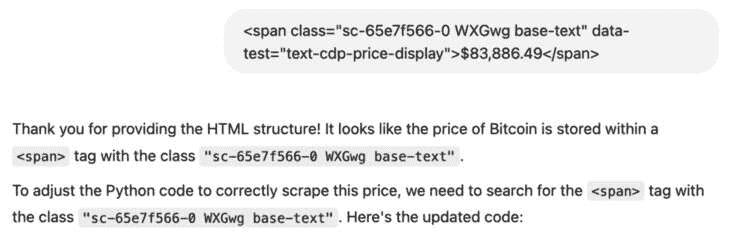

ChatGPT 确定价格存储在 HTML 结构中的 span 标签内，现在它正在修改代码：

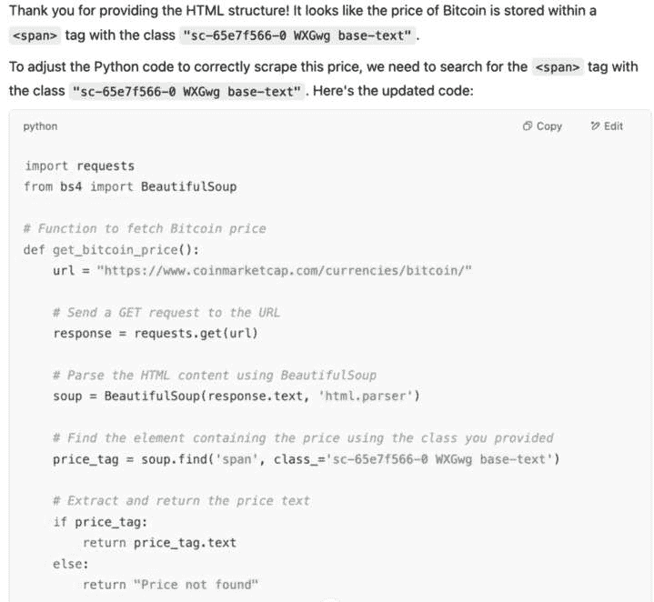

我们然后复制粘贴代码，运行它，我们得到当前的比特币价格：

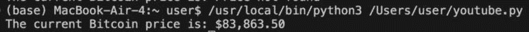

## 网络浏览自动化

让我们创建一个程序，为我们访问网站。让我们创建一个 Python 程序，访问维基百科并输入用户输入的搜索词：

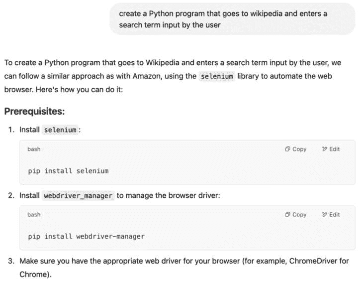

然后我们复制粘贴代码：

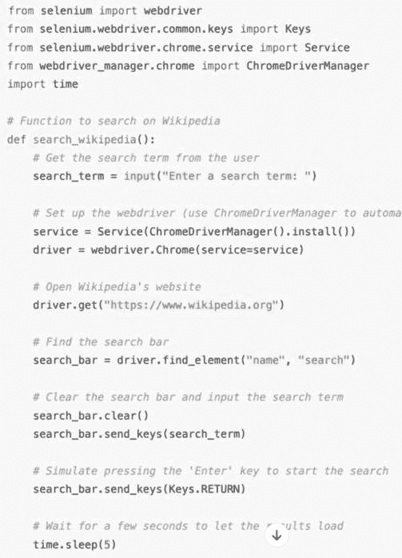

让我们运行它。让我们输入一个搜索词 *例如* “vibe coding”：

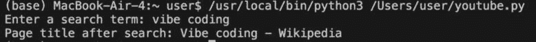

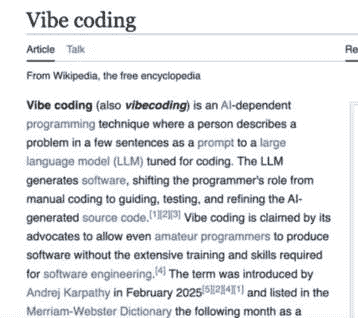

搜索词已输入，我们已经导航到维基百科页面！

## 文本到语音

我们将使用 ChatGPT 将文本转换为音频文件，使用文本到语音技术。让我们提示它：

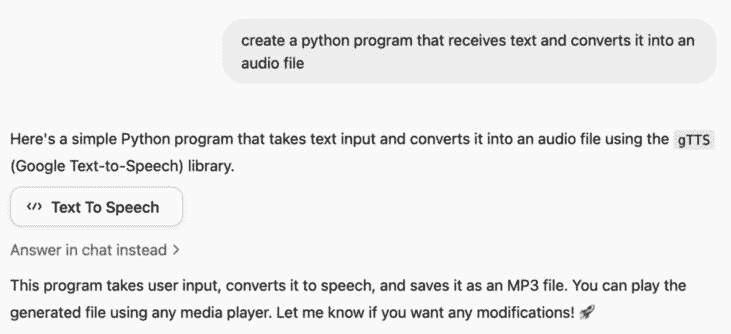

它给出了：

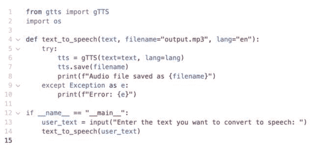

如果我们查看代码，我们可以看到它导入了 Google Text-to-Speech 库，from gtts import gTTS。它从用户那里接收文本，然后调用一个函数来创建并保存为 MP3 格式的音频文件。

首先，运行：pip install gtts

现在，运行文件并输入一些简单的内容，例如，“你好，你怎么样？”

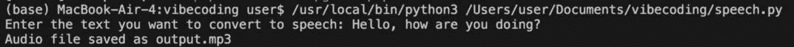

音频文件将被保存为类似 output.mp3 的文件：

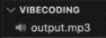

如果播放输出，它应该播放“你好。你怎么样？”。尝试输入更长的文本，它也应该运行良好。

## 改变声音

我们能否将文本转换为语音的语音改变？让我们尝试提示：“能否改变语音？”

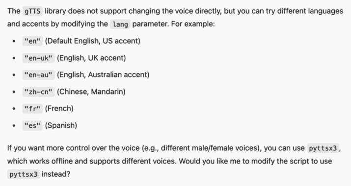

它告诉我们使用 pyttsx3 库来处理不同的语言和口音，并提供了更新的脚本：

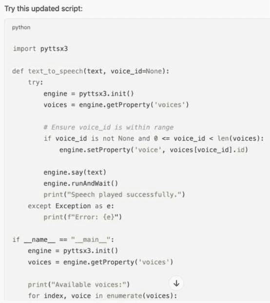

让我们复制粘贴代码并运行它：

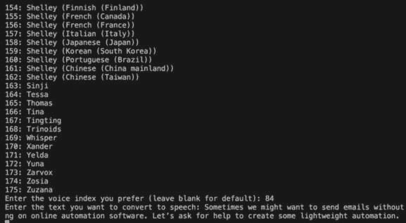

我们正在看到一个声音列表。如果我们选择一个声音并提供文本，它就会工作！现在，声音听起来可能相当机械。如果您想要更高品质的声音或克隆名人的声音，我们可以使用 Elevenlabs API，我们将在下一节中探讨。

## 使用 Elevenlabs API 生成声音克隆

要生成一个声音克隆，有多种服务可以实现。其中最受欢迎的是由 ElevenLabs 公司提供的服务。您需要首先向他们提供一个声音样本。

语音克隆服务是一项付费服务。最受欢迎的计划每月 11 美元：

让我们提示，“创建一个使用 elevenlabs API 克隆声音并使用用户输入文本生成音频文件的 Python 程序”：

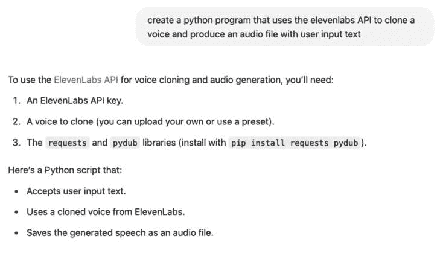

在 ElevenLabs 仪表板中，获取您的 API 密钥：

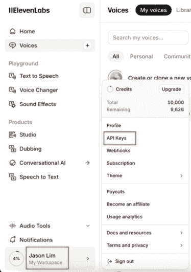

接下来，在 ElevenLabs 中，‘添加新声音’：

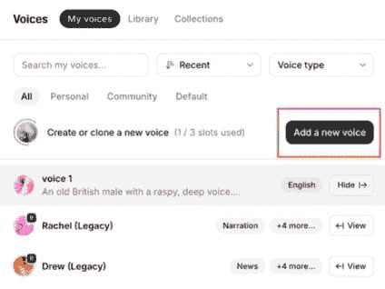

您可以选择克隆现有的声音或从提示中设计新的声音：

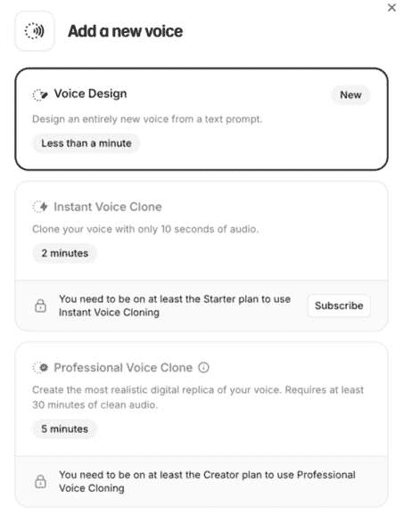

选择任一选项。请注意，您必须付费才能克隆声音。声音创建后，复制声音 ID：

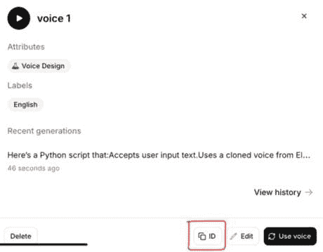

现在我们有了 API 密钥和声音 ID，将其粘贴到 ChatGPT 为我们生成的代码中：

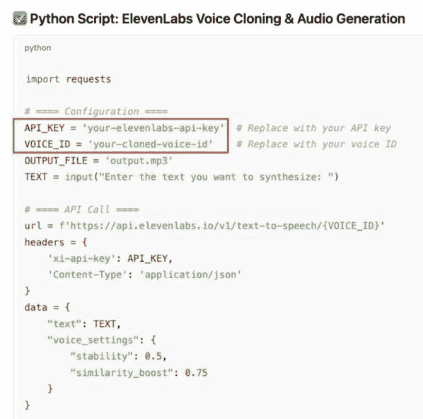

复制粘贴到 VS Code 并运行：

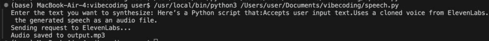

你应该会听到你输入文本的语音音频文件（例如 audio.mp3）！

## 邮件自动化

有时我们想要发送电子邮件而不需要逐个手动发送。让我们请求帮助创建一些轻量级的电子邮件自动化。让我们提示 ChatGPT：

“创建一个 Python 程序，向用户提供的一串电子邮件发送邮件。询问用户主题和正文。通过我的个人 Gmail 发送邮件”

ChatGPT 响应：

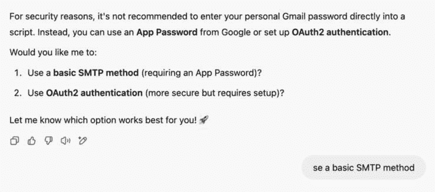

我选择了基本的 SMTP 方法（需要应用程序密码）。ChatGPT 给我提供了以下代码：

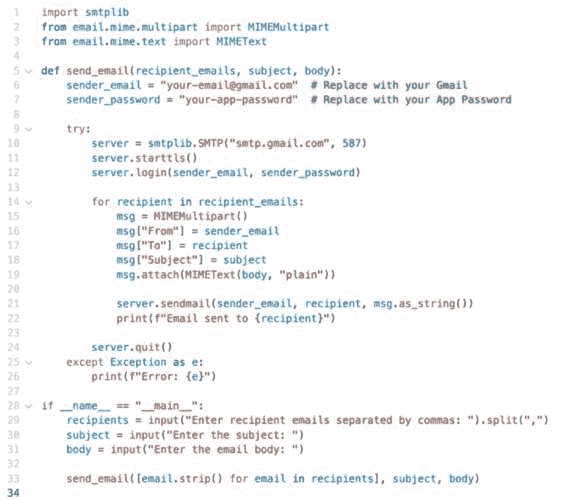

你需要在代码中输入你的 Gmail 电子邮件地址和应用程序密码。请注意，这不是你的原始 Gmail 密码，你不应该为了安全设置而提供。相反，这是一个更安全的特定于应用程序的应用程序密码。

要获取应用程序密码，请在 Google 上搜索“Google App Password”，你应该会被带到“应用程序密码”网站：

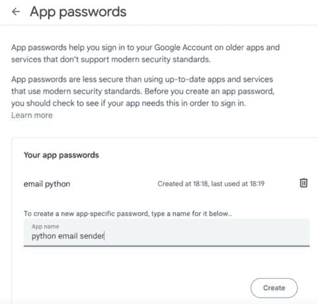

输入一个名称 *例如* ‘python email sender’ 并生成你的应用程序密码：

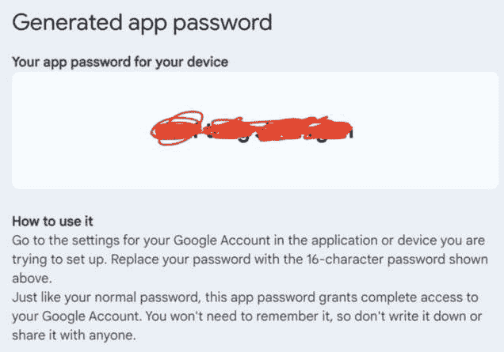

修改代码以包含你自己的电子邮件和应用程序密码：

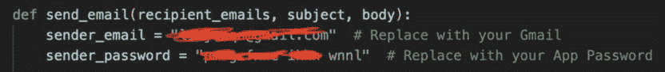

现在，运行你的应用。它应该提示你输入收件人电子邮件、主题和电子邮件正文。

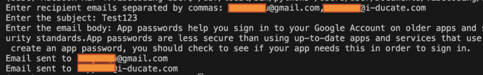

所有电子邮件都应该成功发送。例如，我收到了指定主题标题和正文的电子邮件：

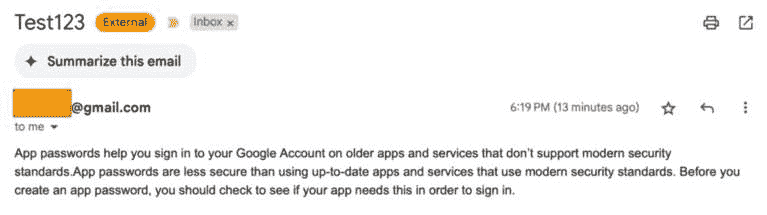

邮件发送成功了！你可以进一步改进应用，例如从文本文件中获取电子邮件列表，而不是在终端中手动输入。

## 计算机视觉

我们可以用计算机视觉做很多事情。让我们创建一个可以识别图像的程序。我们可以提示：

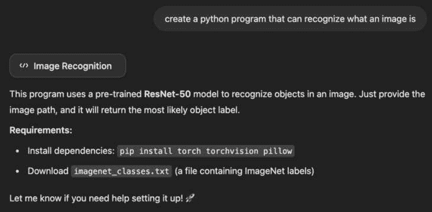

继续安装依赖项，并在 Google 上搜索“Download imagenet_classes.txt”以获取文件并将其粘贴到 VS Code 中。

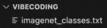

ChatGPT 使用了几个高级计算机视觉库进行图像识别，但我们不需要了解细节。让我们直接将代码复制粘贴到 VS Code 中并运行它。

你可能会遇到以下错误：

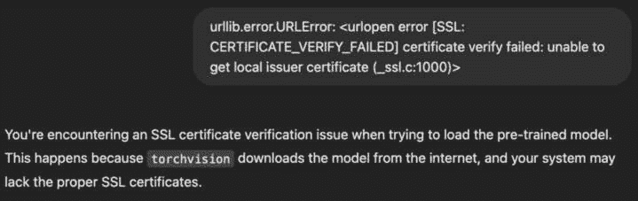

如 ChatGPT 所建议，尝试通过在下载模型时添加以下两行来禁用 SSL 验证：

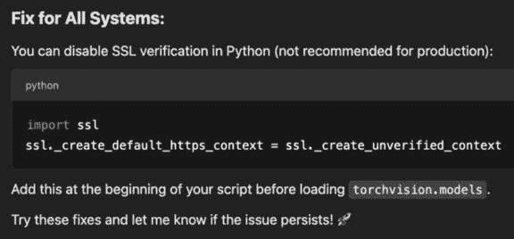

尝试运行程序并给出要识别的图像的路径。在我的情况下，我传递了这张图像：

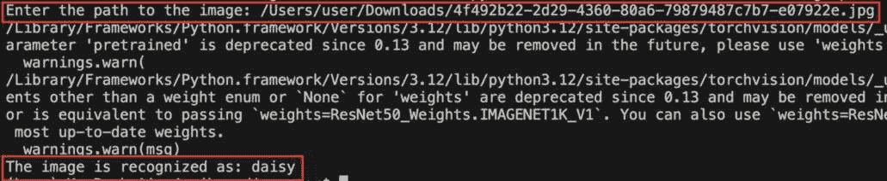

我们可以看到程序将图像识别为雏菊！

现在，如果我可以，并给出以下图像：

它实际上错误地将其识别为海星：

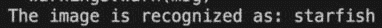

这可能是因为剥落的皮肤可能被误认为是海星的一条腿。因此，我们也希望程序告诉我们分配给图像的置信度百分比。所以让我们提示：

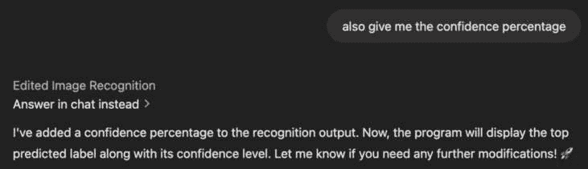

复制更新的代码并再次运行。它显示它以 46.16% 的置信度将其识别为海星！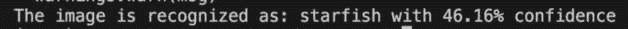

让我们再次尝试，但这次使用一个更清晰的香蕉图片：

而这次，我们得到了一个更有信心的结果！

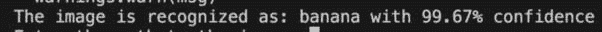

# 第三章 - 创建和托管网站

您可以使用 ChatGPT 创建简单或更复杂的网站。让我们从一个简单的网站开始：

“创建一个带有中心标志的个人页面 Python 程序，并链接到我的 YouTube、Twitter 和 Gumroad 页面。设计应该是现代和简约的。”

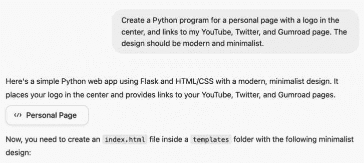

ChatGPT 建议使用 Flask 来渲染网站。我们必须创建一个包含“index.html”的“templates”文件夹，其代码如下：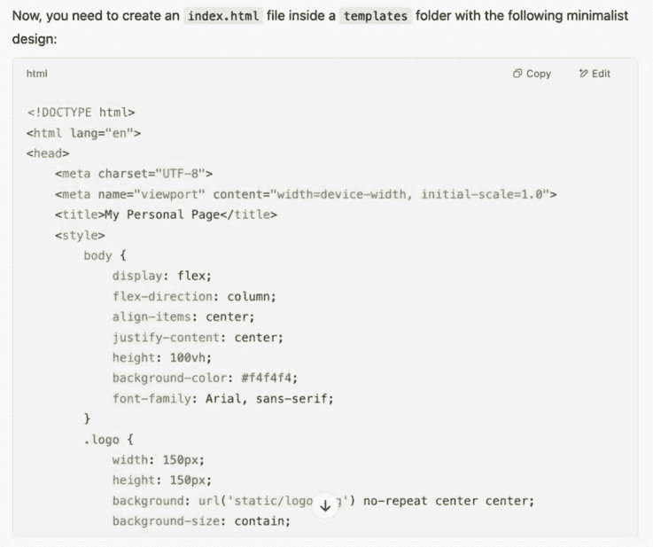

确保您将 YouTube、Twitter 和 Gumroad 链接替换为您自己的：…

<body>

[YouTube](https://www.youtube.com/@codeschool-r8q) [Twitter](https://x.com/greglim81) [Gumroad](https://greglim.gumroad.com/)

</body>

…

我还要求 ChatGPT 为我生成一个标志：

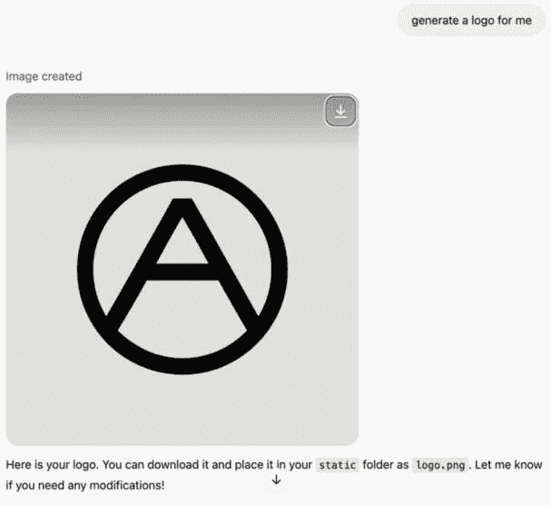

下载它并将其放置在“static”文件夹中。

最后，将主要代码复制粘贴到一个 Python 文件中并运行它：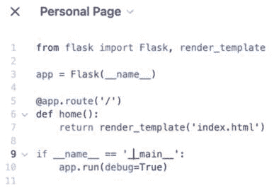

网站将在本地运行，以我的情况为例：127.0.0.1:5000

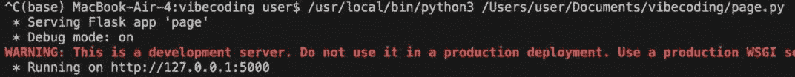

让我们看看它，完成了！我们在中心有一个漂亮的标志，并链接到我的个人 YouTube、Google 和 Gumroad 页面：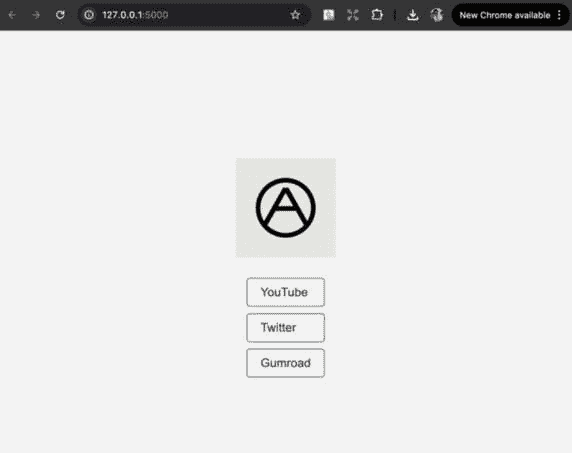

## 改进我们的网站

假设我们想要改进我们的网站。让我们询问 ChatGPT，“我如何使这个网站更复杂”：

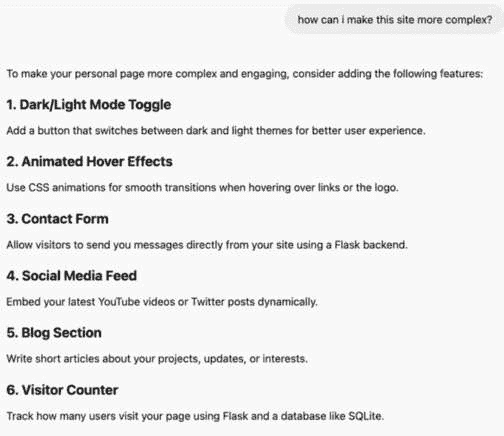

让我们尝试第一个建议来添加暗/亮模式切换：“添加一个按钮，在暗色和亮色主题之间切换，以获得更好的用户体验。”

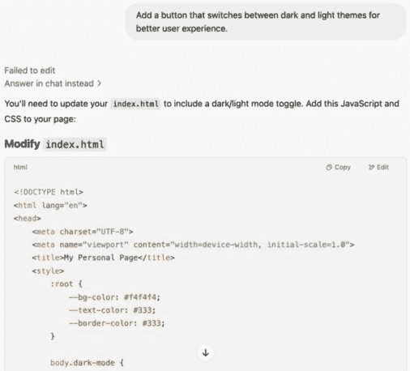

让我们复制粘贴更新的代码，现在我们有了暗/亮模式！

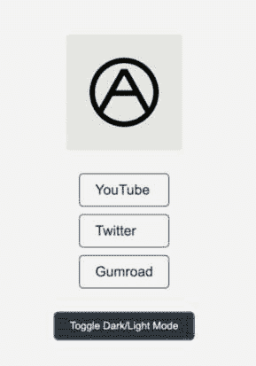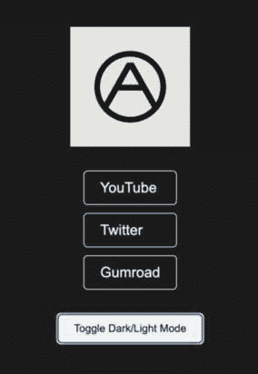

现在，假设我想“在不使用 Twitter API 的情况下嵌入我的最新 Twitter 帖子”：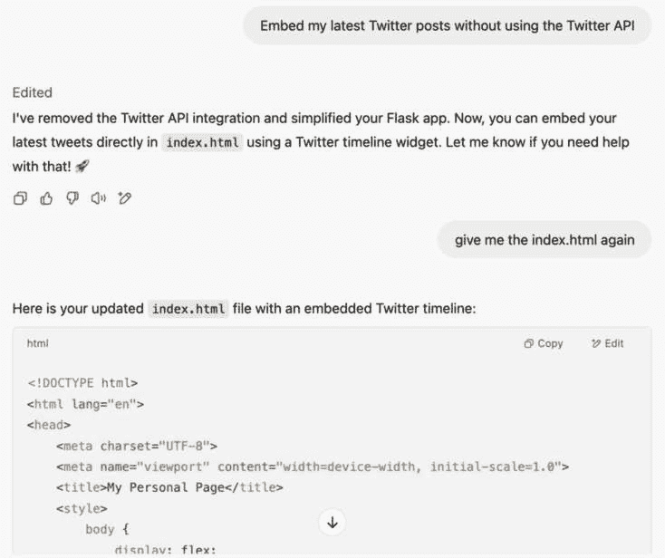

它更新了我的 index.html，并添加了一个 Twitter 小部件：

如果我们想更改页面布局以使 Twitter 小部件更宽，让我们提示 ChatGPT：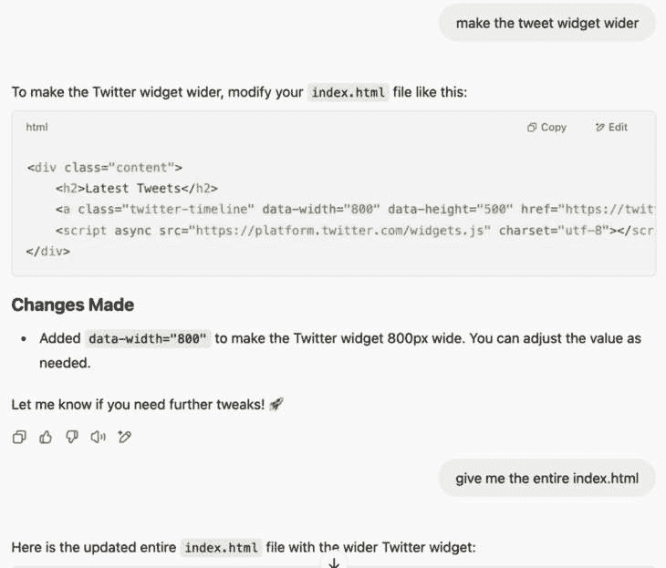

复制粘贴更新的 index.html，现在我们有了：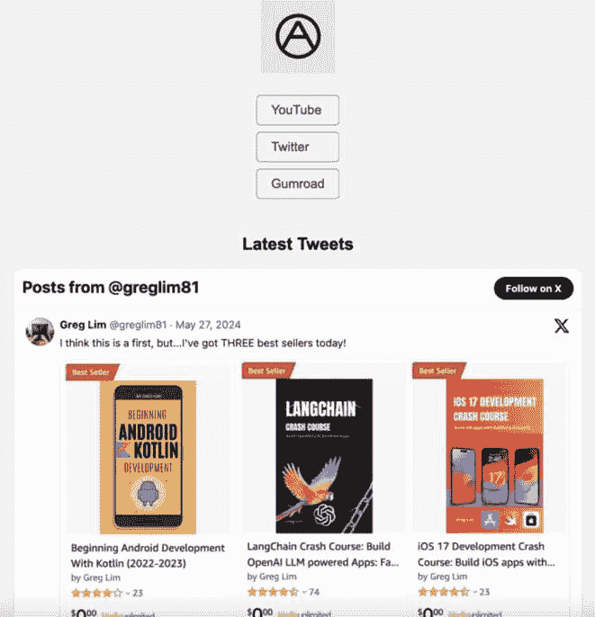

我希望你能理解这个想法，只需简单地提示 ChatGPT 提出改进你网站的建议，并选择一个具体的建议来实施，然后是下一个，再下一个！

## 代码托管

在创建在您的机器上运行的程序之后，您可能对通过在云上部署它们使其他用户或自己能够访问它们感兴趣。

对于云托管，有许多不同的提供商能够托管您的 Python 代码。我推荐一个简单的服务，称为 PythonAnywhere (pythonanywhere.com)。它提供直接的云托管。

那么，让我们说明如何将我们之前创建的网站托管在 PythonAnywhere 上。

PythonAnywhere.com 有一个免费计划，所以只需注册创建一个账户。它允许你部署一个免费的 Web 应用：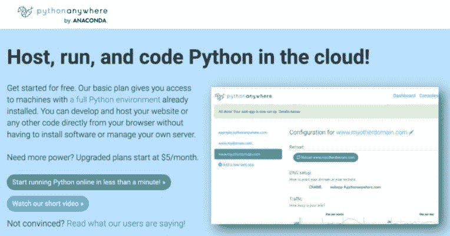

登录后，你将被带到仪表板。转到“Web”：

添加一个新的 Web 应用：

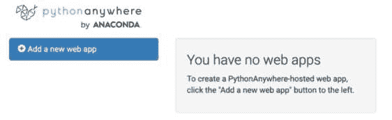

由于 ChatGPT 之前指导我使用 Flask 创建 Web 应用，点击“Flask”：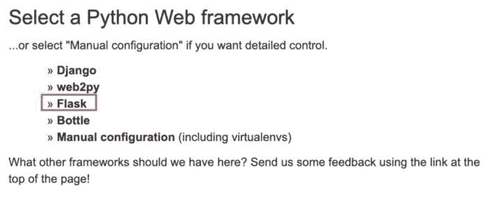

选择你的 Python 版本（如果你不确定，你可以直接选择最新版本）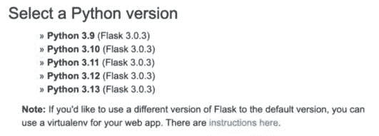

在接下来的屏幕上，我们将只使用提供的默认路径：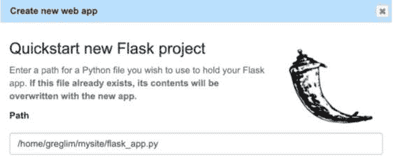

因此，你的 Web 应用现在已经设置好了：

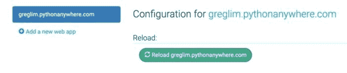

要查看你的 Web 应用，你可以点击 URL 来访问它。以我的情况为例，是“greglim.pythonanywhere.com”：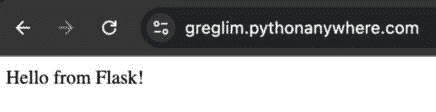

目前，它只是一个简单的 Web 应用，显示“Hello from Flask”，因为我们还没有上传任何内容。

要更改这一点，请转到“文件”并进入“mysite”文件夹：

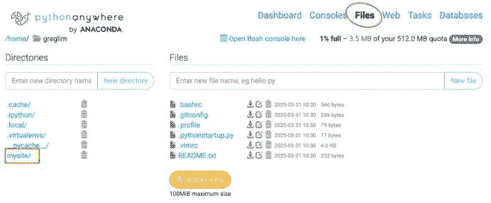

这是“flask_app.py”文件：

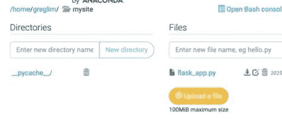

这是一个默认文件。如果你点击它，你会看到“Hello from Flask”——这就是 PythonAnywhere 现在正在渲染的内容：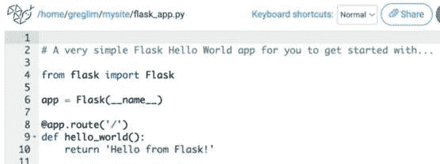

返回到“我的站点”，删除“flask_app.py”并上传我们之前为我们的网站创建的 Python 文件。以我的情况为例：“page.py”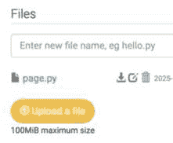

记住，在我们的“我的站点”文件夹中，我们还需要一个“templates”和“static”文件夹。所以，在“目录”下输入“templates”并点击“新建目录”：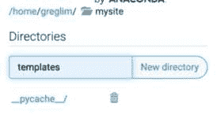

现在你已经进入了“templates”文件夹，你需要上传“index.html”文件：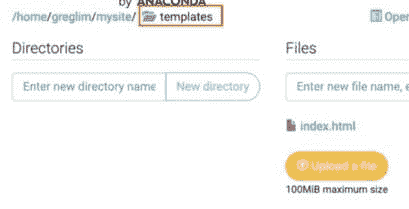

接下来，回到“我的站点”，创建“static”文件夹并上传“logo.png”：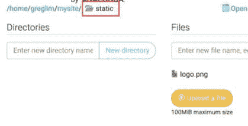

返回到“Web”：

在“代码”下向下滚动，并点击“WSGI 配置文件”：

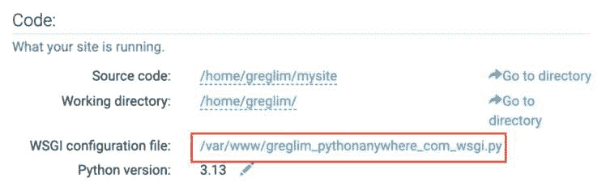

在这里，将“flask_app”（我们删除的文件名）更改为你上传的文件名，例如‘page’

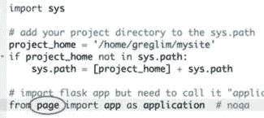

基本上，它是从“page.py”导入的。点击“保存”。返回到“Web”，并重新加载网页：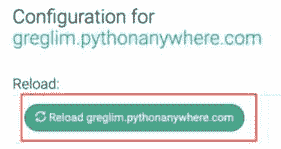

点击 URL，你应该能看到你的网页！

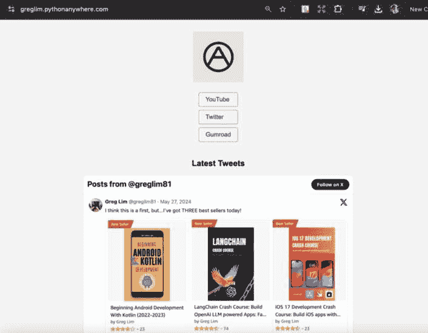

现在它已经上线，任何人都可以通过你的 URL 访问它。这应该和你在本地主机上的表现一样。所以，如果你成功做到了这一点，恭喜你！如果没有，可以向 support@i-ducate.com 发送问题，或者再次阅读这一节，因为你可能遗漏了一些小细节。

你还可以查看“错误日志”以查看你可能会遇到的错误：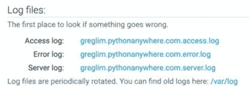

# 第四章 - 创建 Flappy Bird 游戏

让我们探索创建多功能项目。这些项目通常更复杂，因为它们使用了多个库和函数，需要更多的组织。这并不意味着我们必须完美地组织它们，但了解代码的结构有助于我们有效地指导 ChatGPT 并避免错误。

要开始，我们将要求 ChatGPT 帮助我们创建一个 Flappy Bird 游戏：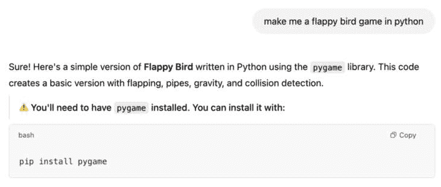

ChatGPT 决定使用一个名为"pygame"的库，该库是为简单游戏开发的。代码已经准备好了。它不到 100 行：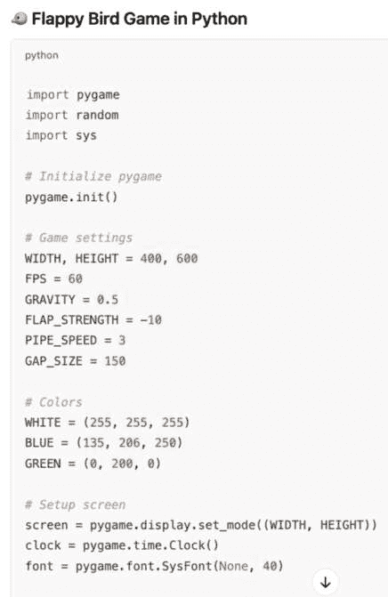

让我们复制、粘贴并运行它。好的，它就像 Flappy Bird，而且它在滚动（联系 support@i-ducate.com 以获取本章的视频版本）：

让我们通过添加滚动云彩来改进：

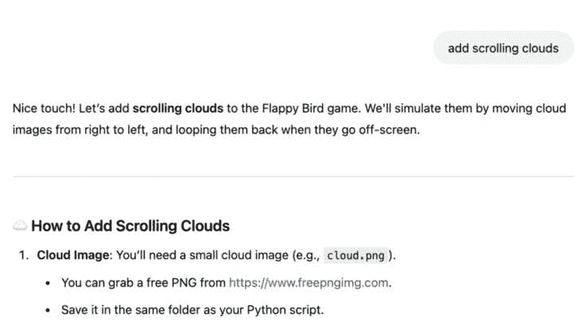

确保你添加一个 cloud.png，无论是从互联网下载还是让 ChatGPT 为你生成。复制粘贴并运行代码。我们现在有了滚动云彩，给鸟儿向前移动的印象。

.

接下来，我们为鸟儿添加可以收集的硬币：

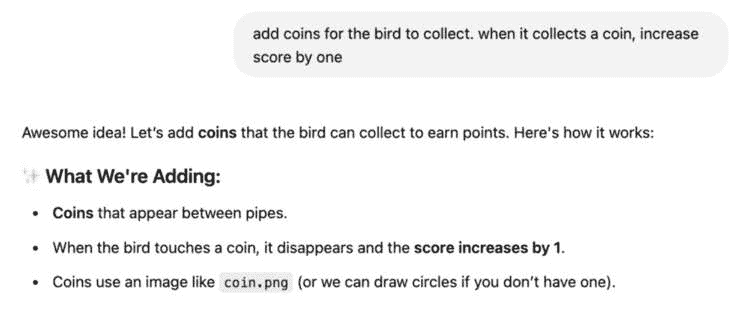

复制粘贴并运行代码。现在有了可以收集的硬币：

现在，游戏可能太难玩了。所以我给出了提示：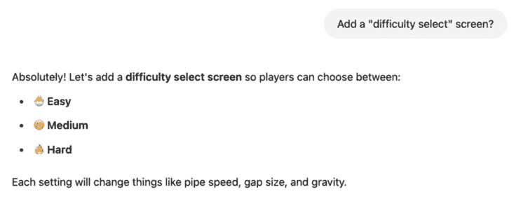

复制粘贴并运行代码。现在，在游戏开始之前，我可以选择难度：.

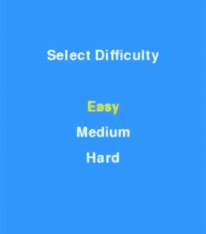

ChatGPT 还解释了他们如何通过改变某些推荐值来使游戏更容易或更难：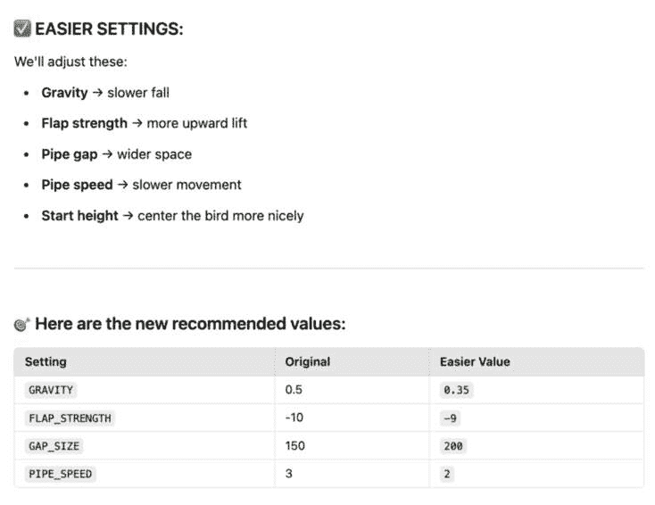

让我们要求 ChatGPT 创建一些音乐和音效：

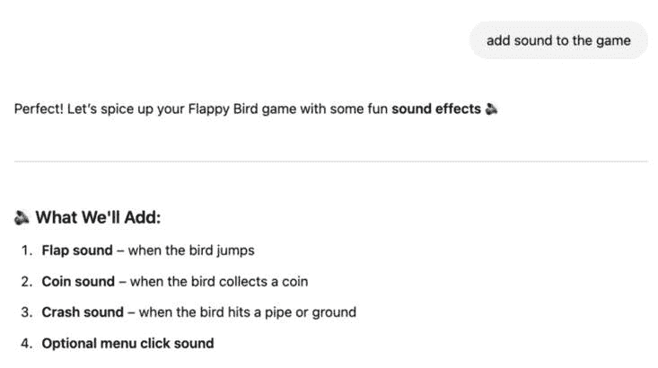

你甚至可以要求 ChatGPT 为你提供下载链接：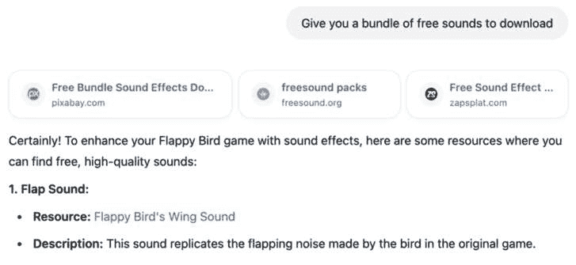

为了简化，我只是提示它实现拍打声音：

有时，ChatGPT 可能不会给你完整的代码。你可以提示它这样做：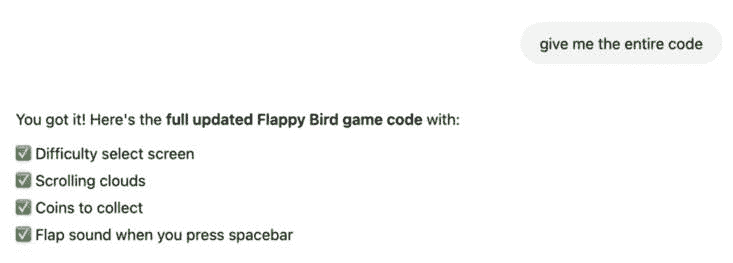

接下来，让我们添加音乐：

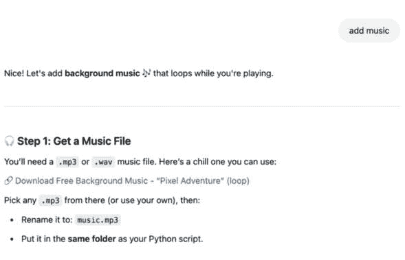

在代码中，现在正在加载"music.mp3"：

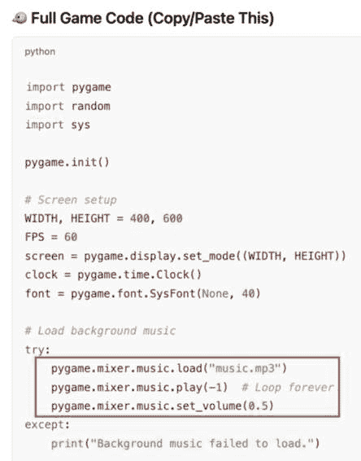

最后，我们告诉它将黄色圆圈改为鸟儿图像：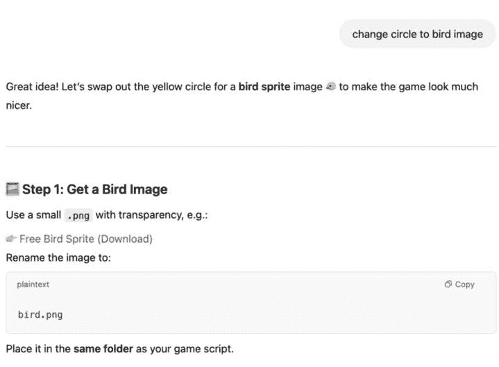

好的，作为演示这就足够了。我想你已经了解了你可以做什么。你可以使用互联网上各种库中的免费资源来创建各种游戏和游戏机制。

# 第五章 - 解锁 API 的力量

在这一章中，我们更深入地探索了 OpenAI 和 Telegram 提供的某些流行且强大的 API。这将使你具备探索其他 API 的技能。

## 使用 OpenAI API 进行语音转文本和摘要

现在，如果我们更喜欢阅读文本而不是听音频呢？我们可以构建转录音频文件的代码。

让我们尝试“创建一个使用 OpenAI API 转录音频文件的 Python 程序”：

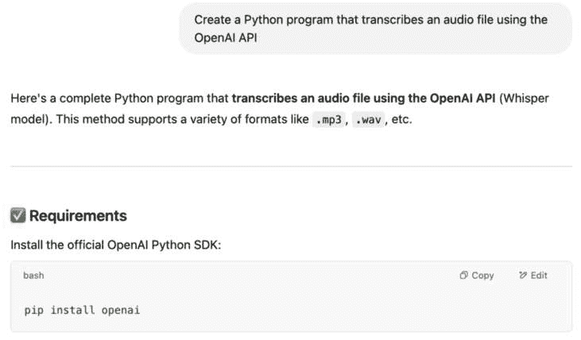

让我们安装 openai 库。接下来，ChatGPT 建议使用 Whisper 模型并创建我们自己的 Open AI 密钥：

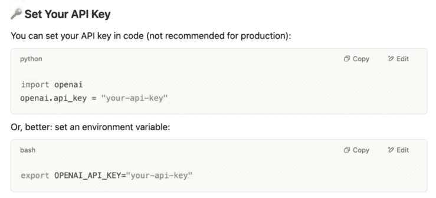

前往 platform.openai.com 创建你自己的密钥：

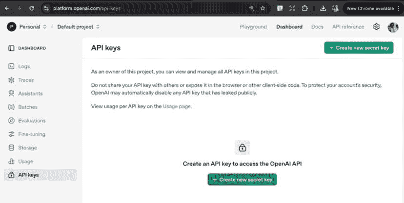

你可能需要输入一些初始积分来使用该 API，例如*例如* $5 就足够了。

复制粘贴并运行代码：

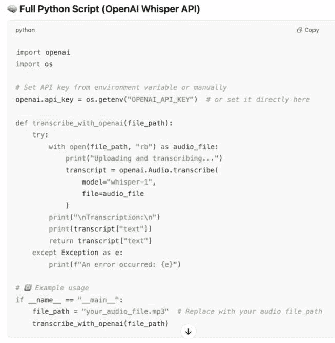

我提供了一个样本.wav 文件，程序成功转录了我的音频文件：

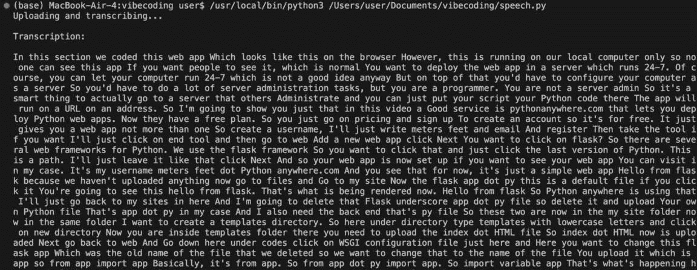

现在，假设我们没有时间阅读记录。我们能得到一个摘要吗？让我们提示：“修改代码以创建最多 100 字的记录摘要。”

这应该是 ChatGPT API 的一个简单任务：

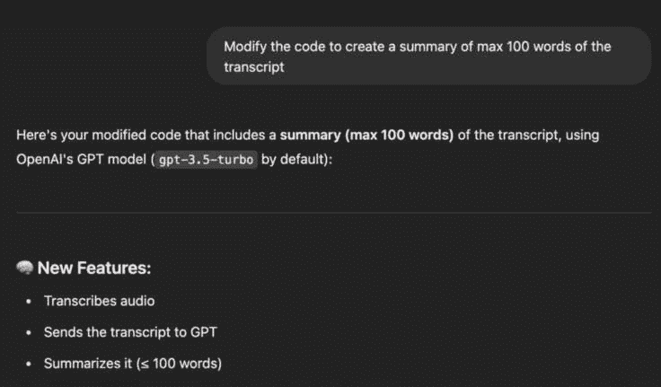

在生成的代码中，现在有一个新的函数：

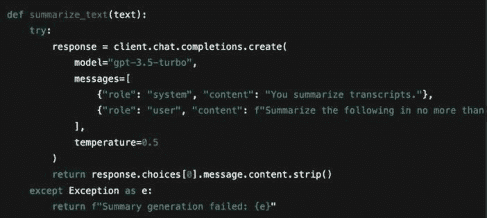

当我们复制粘贴并运行我们的代码时，我们会得到我们的摘要：

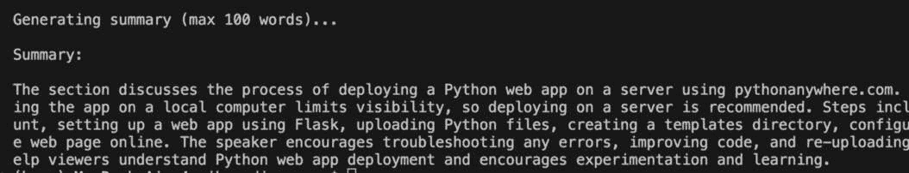

## Telegram 机器人

让我们创建一个可以发送最新 S&P 价格的 Telegram 机器人。让我们提示：“创建一个通过 Telegram 发送最新 S&P 价格的 python 程序。”：

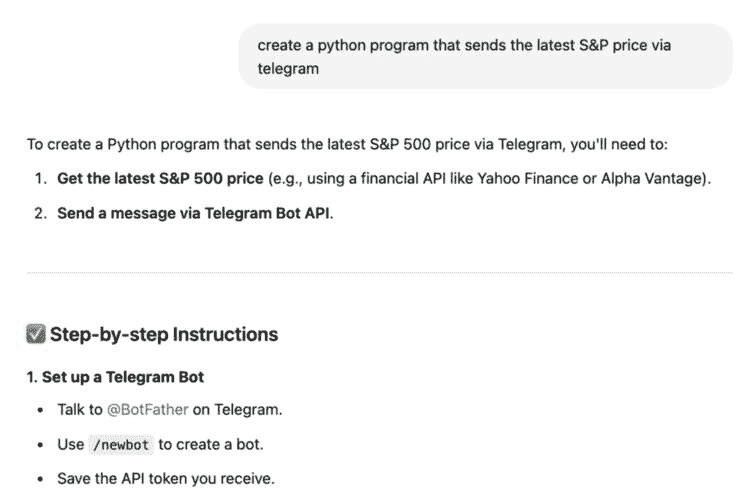

要使用此代码，我们需要使用 Telegram 和名为 BotFather 的服务创建一个 Telegram 机器人。

在 Telegram 中，转到 BotFather Telegram 账户并输入/newbot：

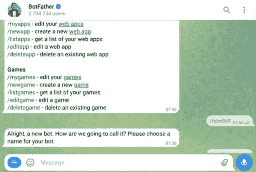

选择一个名称——我们将它命名为"VibeCodingPythonBot”（它必须是可用的）：

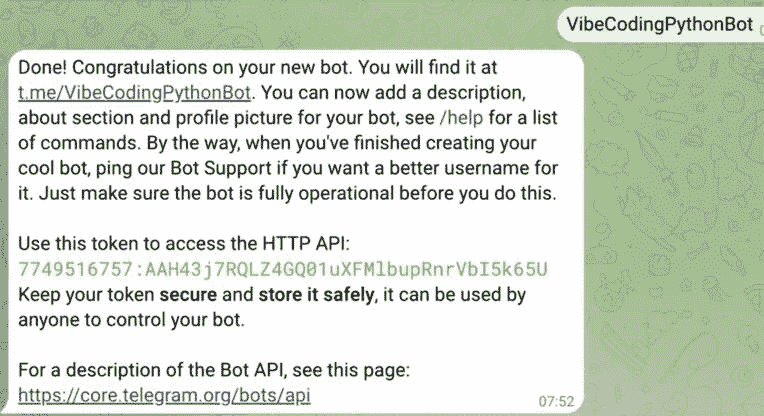

您将收到您的 API 令牌。请将其安全地保存在某个地方。

接下来，让我们获取聊天 ID：

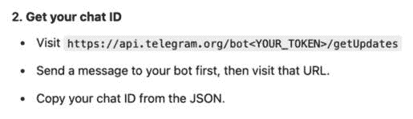

首先，让我们先向我们的机器人发送一条消息：

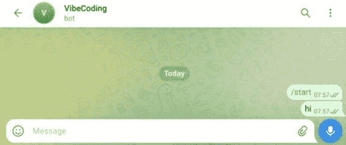

然后，通过访问 api.telegram.org/bot<your_token>/getUpdates 获取聊天 ID

在您的浏览器中：

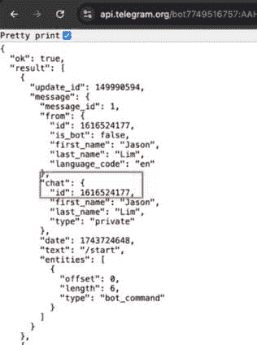

请安全地保存您的聊天 ID。

安装所需的库并将代码复制粘贴到 VSCode 中：

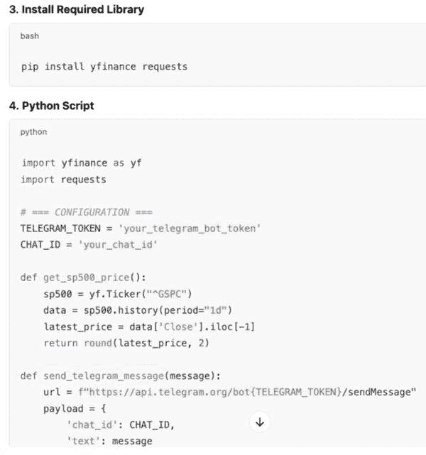

将您的令牌和聊天 ID 输入到代码中。请注意，如果您打算将此代码部署到生产环境中，令牌和聊天 ID 不应直接存储在代码中，您通常会使用环境变量。

让我们运行代码，它应该会给我们最新的 S&P 价格：

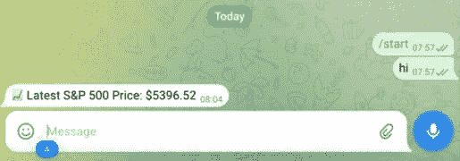

通过组合不同的功能，尝试创建更多高级的机器人和交互。

# 第六章 - 创建 RAG - 与 PDF 应用程序聊天

让我们尝试使用这个提示符创建一个带有 PDF 应用程序的检索增强生成（RAG）聊天：

“给我一个可以与 pdf 聊天的 python 程序”：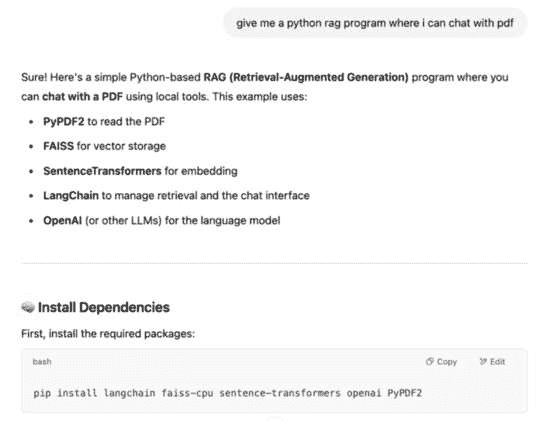

我得到了一个需要安装的依赖项列表，以及一个可以与 pdf 聊天的 python 代码：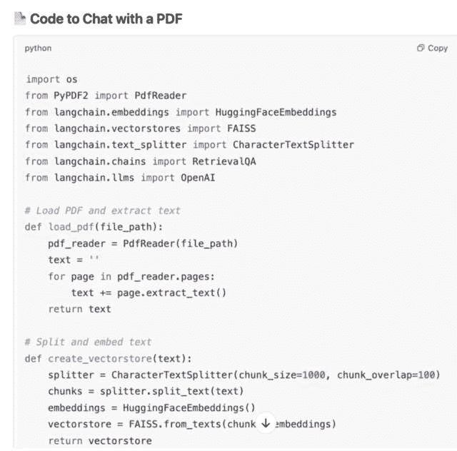

然而，前端目前是通过终端。假设我想让前端成为一个 Web UI。我可以提示：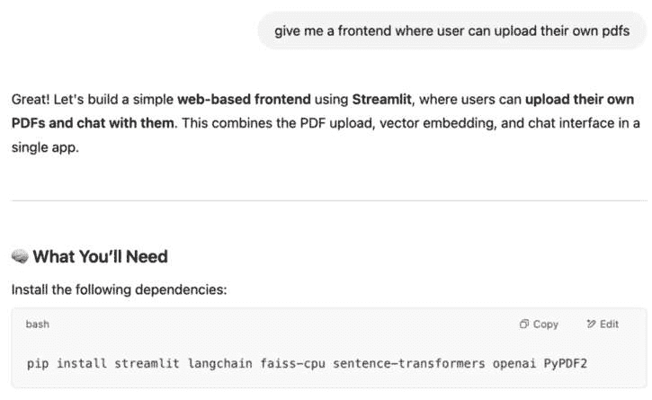

我可以将其复制粘贴，并使用以下命令运行 streamlit 应用程序：

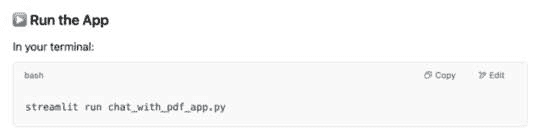

在过程中，您可能会遇到错误。但只需将错误复制粘贴到 ChatGPT 中，看看它是如何纠正的。例如，我得到一个空的权重错误：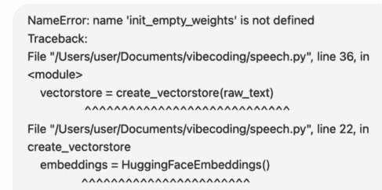

我将其复制粘贴到 ChatGPT 中，它给了我一些选项，可以将 Python 版本降级到一个更低、更兼容的版本。

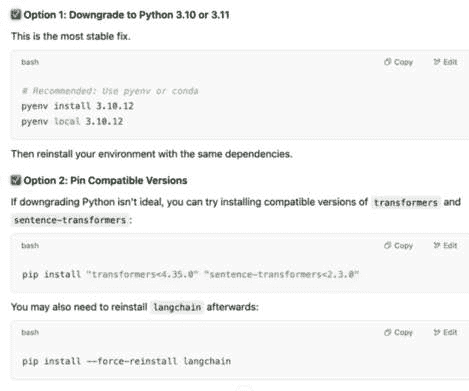

只需按照 ChatGPT 提示的步骤操作。

在过程中，您可能会遇到更多错误，但只需复制粘贴错误，您应该很快就能得到一个可工作的应用程序。

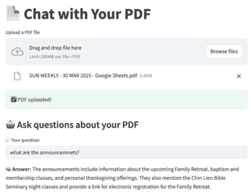

结束语

首先，恭喜！你已经学会了如何提示 LLMs 生成代码并运行它。这是你的新超能力。

现在，您可以为工作、娱乐或一次性使用创建程序。这是一个激动人心的时刻，我希望您能充分利用这项新技能。我期待着听到您创作的成果。

希望您喜欢这本书，并愿意从我这里学到更多。我很乐意收到您的反馈，了解您喜欢和不喜欢的地方，以便我们改进。

如果你在代码中遇到任何错误或者想要获取本书的更新版本，请随时通过电子邮件联系我：support@i-ducate.com。

如果您不喜欢这本书，或者觉得我应该涵盖某些额外的主题，请通过电子邮件告诉我们。这本书会因为像您这样的读者而变得更好。如果您喜欢这本书，我也非常感谢您能给我们留下评论。谢谢，祝您一切顺利！

关于作者

Greg Lim 是一位技术专家，也是几本编程书籍的作者。Greg 在高等教育机构教授编程已有多年经验，他特别强调通过实践学习。

联系 Greg：support@i-ducate.com
