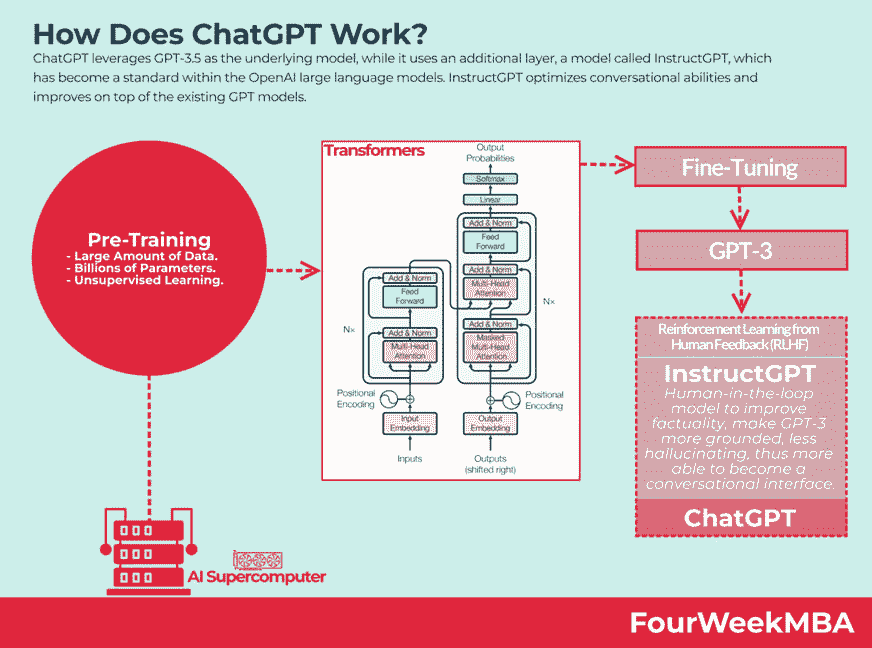
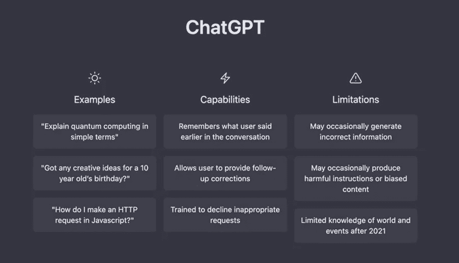
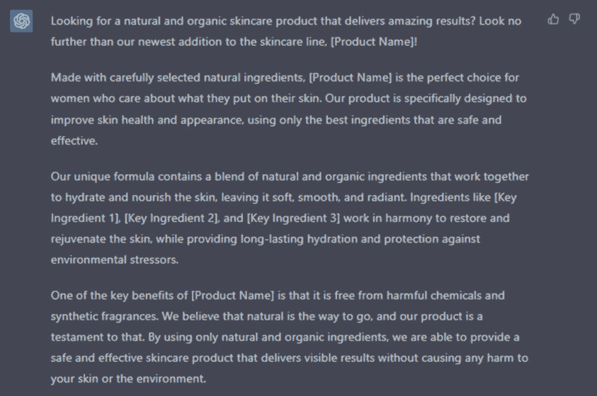
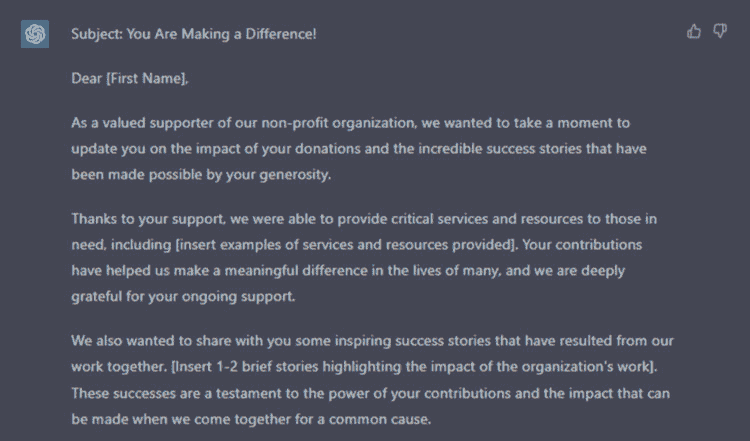
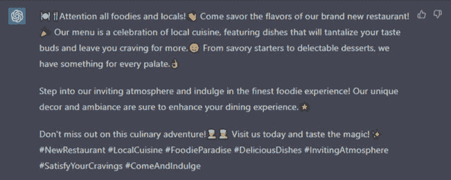

# ChatGPT 指南之像专家一样写作

> 原文：[Write Like A Pro The ChatGPT Guide for Crafting Killer Copywriting](https://annas-archive.org/md5/f6de601484fd1d6b51851bb281813a29)
> 
> 译者：[飞龙](https://github.com/wizardforcel)
> 
> 协议：[CC BY-NC-SA 4.0](https://creativecommons.org/licenses/by-nc-sa/4.0/)

### 前言

欢迎来到使用 ChatGPT 提示实现文案成功的终极指南！您即将踏上解锁人工智能的全部潜力并提升您的文案写作技能之旅。

你将学习关于 ChatGPT 的一切，使用 ChatGPT 提示的好处，以及可用的不同类型的提示。我们将指导您使用 ChatGPT 提示的最佳实践，包括选择适合任务的正确提示，编写有效的提示，以及避免常见错误。

我们还将向您展示如何为各种内容类型撰写文案，例如产品描述、标题、社交媒体帖子和电子邮件营销。您还将了解不同行业、渠道和本地市场的文案写作，以及如何优化您的文案以适应搜索引擎，并为不同平台和多样化受众而写作。

这还不是全部，我们还将涵盖将表情符号整合到您的内容中，并向您展示如何为无障碍和包容性而写作。

在本指南结束时，您将具备使用 ChatGPT 将您的文案写作提升到新水平所需的所有知识和工具。所以，请坐下来，拿杯咖啡，让我们一起探索 AI 驱动的文案写作世界！

### 目录

免责声明

前言

介绍

ChatGPT 概述

使用 ChatGPT 提示进行文案撰写的好处

ChatGPT 提示的工作原理

ChatGPT 提示的不同类型

如何使用和访问 ChatGTP

使用 ChatGPT 提示的最佳实践

为任务选择正确的提示

为特定用例训练 ChatGTP

撰写有效提示

选择您的语气和风格

语气

风格

避免常见错误

优化的提示模板

模板参数

模板示例

带有示例提示的文案内容类型

撰写产品描述

生成标题和广告文案

撰写引人入胜的社交媒体帖子

为电子邮件营销创建内容

撰写博客文章和文章

撰写网站文案和着陆页面

为内容营销活动生成创意

为广告活动创建营销信息

为视觉内容编写标题

制定口号和标语

为营销视频编写视频脚本

为信息图表和视觉辅助工具编写文案

制定案例研究和白皮书

文案框架

AIDA（注意、兴趣、欲望、行动）

问题-解决方案

独特卖点（USP）

特征-优势-利益

讲故事

情感吸引力

价值主张

直接回应

向您的内容添加表情符号

表情符号在文案撰写中的重要性

有效使用表情符号的技巧

适用于不同类型写作的表情符号示例

将表情符号整合到使用 ChatGPT 的工作流程中

使用包含特定表情符号的提示

训练模型识别写作中的表情符号使用

将表情符号建议整合到 ChatGPT 生成的输出中

在文案撰写中使用表情符号的最佳实践

不同行业的文案撰写

理解行业特定的语言和术语

为不同行业编写有效文案的技巧

成功的行业特定文案撰写活动示例

为不同渠道撰写

理解不同渠道的独特需求

撰写能引起不同渠道受众共鸣的文案技巧

不同渠道成功的文案撰写活动示例

利用 ChatGPT 进行特定渠道的研究和文案撰写

本地市场文案撰写

理解文案撰写中文化敏感性的重要性

撰写吸引国际受众的文案技巧

成功的本地化文案撰写活动示例

利用 ChatGPT 进行本地语言研究和文案撰写

为搜索引擎（SEO）优化您的文案

理解文案撰写中的 SEO

SEO 的关键组成部分

为何 SEO 对文案撰写至关重要

SEO 文案成功的 10 个技巧

友好 SEO 文案的最佳实践

为不同平台撰写

理解每个平台的独特受众和语调

为博客、网站和在线杂志撰写

为 Facebook、Twitter 和 Instagram 等社交媒体平台撰写

为 YouTube 和播客等多媒体平台撰写

创建跨平台活动

跨多平台内容再利用的最佳实践

为不同受众撰写

理解文案撰写中包容性和多样性的重要性

多样化的文化和背景

为无障碍撰写并为残障人士创建内容

理解为不同年龄群体和世代撰写的微妙之处

创建具有文化敏感性和尊重性的最佳实践文案

利用语言翻译工具触及全球受众

结论

AI 与文案撰写的未来

结合人类创造力和 AI 技术的重要性

应对竞争

利用 ChatGPT 实现文案撰写成功的最终思考和建议

关于作者

### 介绍

文案写作是市场营销和广告的重要组成部分，需要创造力、技巧和注意细节。然而，创造引人入胜的文案并与目标受众产生共鸣可能是一项具有挑战性和耗时的任务。这就是 ChatGPT 发挥作用的地方，它提供了一种 AI 驱动的解决方案，可以简化文案写作过程，并在几分钟内提供高质量的输出。在本指南中，我们将探讨使用 ChatGPT 提示进行文案写作的好处以及这个 AI 模型的工作原理。

我们将讨论不同类型的 ChatGPT 提示可用性，以及有效使用它们的最佳实践，以及如何为特定用例训练 ChatGPT。此外，我们还将为不同类型的文案内容（包括产品描述、标题和广告文案、社交媒体帖子、电子邮件营销内容、博客帖子和文章、网站内容等）提供优化的提示模板和示例。我们还将深入探讨各种文案框架和技术，帮助您打造具有说服力和引人入胜的内容。

本指南将涵盖如何为不同的渠道、不同的受众以及不同的行业撰写文案。我们还将讨论优化文案以适应搜索引擎以及有效使用表情符号的重要性。

最后，我们将探讨 AI 与文案写作的未来，强调在竞争激烈的市场中结合人类创造力和 AI 技术的重要性。

在本指南结束时，您将全面了解如何利用 ChatGPT 来提升您的文案写作技能，并产生与目标受众 resonates 的高质量、引人入胜的内容。

## ChatGPT 概述

ChatGPT 是由 OpenAI 开发的语言模型，能够根据输入提示生成类似人类的文本。凭借其庞大的知识库和先进的机器学习算法，ChatGPT 可以在各种写作任务中提供帮助，从生成标题到创作整篇内容。

你可以向 ChatGPT 提出各种一般性问题，包括：

1.寻求一般知识：“日本的首都是什么？”

2.寻求解释：“你能解释一下区块链的概念吗？”

3.获取观点：“你对可再生能源有什么看法？”

4.寻求推荐：“你能推荐一本关于人工智能的好书吗？”

5.寻求帮助：“我如何提高我的演讲技巧？”

6.寻求定义：“熵的定义是什么？”

7.寻求比较：“鳄鱼和短吻鳄有什么区别？”

8.寻求预测：“你认为 2023 年最流行的技术趋势会是什么？”

9.寻求建议：“对于想要学习一门新语言的人，你有什么建议？”

10.寻求有趣的事实：“你能告诉我一个关于宇宙的有趣事实吗？”

## 使用 ChatGPT 提示进行文案撰写的好处

通过利用 ChatGPT 提示，文案撰写人员可以节省时间并简化工作流程。这项技术可以快速生成想法、标题，甚至完整的内容，让文案撰写人员有更多时间专注于工作的创意方面。

1.节省时间：ChatGPT 可以为您节省大量时间，因为它为您提供了文案的起点，并帮助您快速生成内容的想法。

2.一致性：ChatGPT 可以帮助您保持文案风格和语调的一致性，特别是在您处理大型项目或有多名撰稿人为同一篇文章做贡献时，这尤为有用。

3.灵感：ChatGPT 可以为您提供新鲜的想法和灵感，帮助您跳出固有思维模式，想出创造性的解决方案来应对写作挑战。

4.效率：ChatGPT 可以帮助您更高效地工作，让您能够快速有效地生成文案，而不会牺牲质量。

5.多功能性：ChatGPT 可用于各种文案撰写目的，从产品描述和社交媒体帖子到电子邮件通讯和网站文案，使其成为各类作家的多功能工具。

使用 AI 进行文案撰写的好处多种多样，可以对您的工作质量和效率产生深远影响。无论您是经验丰富的文案撰写人员还是刚刚起步，ChatGPT 都是一个您不能忽视的改变游戏规则的工具。

要充分利用 AI 的力量，重要的是要对技术的工作原理和不同类型的提示有扎实的理解。在本章中，我们将深入探讨 ChatGPT 提示的基础知识。

这里是文案撰写人员可以以最简单形式向 ChatGPT 提问的一些示例问题：

1.你能为这篇博客文章想出五个潜在的标题吗？

2.你能帮我构思一些针对年轻成年人的社交媒体活动的创意想法吗？

3.你能校对这封电子邮件并提出任何能使其更有效的建议吗？

4.你能帮我想出我们新产品的一个引人注目的口号吗？

5.你能否撰写一个简短的视频脚本，突出我们最新软件更新的特点？

6.你能研究并撰写一篇关于将正念实践纳入工作场所的好处的全面文章吗？

7.你能创建一个有效传达我们新服务独特价值主张的登陆页面吗？

8.你能撰写一篇引人注目的新产品线发布的新闻稿吗？

在接下来的章节中，我们将学习如何以明智有效的方式构建文案提示，融入必须考虑的重要框架和参数。通过本指南的学习，您将掌握创建引人注目文案提示所需的知识和工具，将您的文案写作提升到新的水平。

## ChatGPT 提示的工作原理

ChatGPT 提示通过将提示或种子文本输入到语言模型中，然后生成文本作为输出来工作。生成的文本基于模型训练的广泛知识库，以及它在单词和短语之间学习的模式和关系。本指南将教你如何有效地构建你的提示，以创建出色的内容，无论是为你的客户还是为你自己的目的。

## 不同类型的 ChatGPT 提示

ChatGPT 有许多不同类型的提示，可用于各种写作任务。其中一些最常见的包括：

•标题提示：根据主题或对象生成标题

•广告文案提示：生成具有说服力和引人注意的广告文案

•社交媒体帖子提示：生成引人注目且易分享的社交媒体帖子

•产品描述提示：生成描述性和具有说服力的产品描述

理解语言模型

重要的是要理解，ChatGPT 是一个机器学习模型，而不是人类作家。因此，它可能会犯错，并产生语法不正确或不符合预期语气和风格的文本。

通过适当的调整和训练，ChatGPT 可以产生高度准确和有效的文本。关键在于了解技术的局限性，并不断完善和改进所使用的提示。

通过了解 ChatGPT 提示和语言模型，您作为文案撰写人员和其他营销专业人士可以充分利用这项技术，将内容创作提升到一个新的水平。

## 如何使用和访问 ChatGTP

chat.openai.com 网站提供了一个与 OpenAI 的 GPT-3 语言模型实时交互的平台。在这里，您可以提问或输入提示，模型将根据其训练的信息生成回应。目前，chat.openai.com 的访问对公众开放且免费。然而，OpenAI 尚未明确指定此服务将免费提供多长时间。

以下是访问并开始与 OpenAI 平台上的 ChatGPT 进行对话的步骤：

•访问网址 https://chat.openai.com/

•注册/登录

•在提供的文本框中开始输入问题或提示。

•按下“Enter”键或点击按钮发送消息，并从 OpenAI 的语言模型接收响应。

•继续通过在文本框中输入后续问题或提示与 OpenAI 进行对话，并接收模型的回复。

### 使用 ChatGPT 提示的最佳实践

要充分利用 ChatGPT，使用这项技术时遵循最佳实践至关重要。在本章中，我们将介绍使用 ChatGPT 提示的关键考虑因素和技巧，以发挥其最大潜力。

## 选择适合任务的正确提示

在使用 ChatGPT 时，选择适合手头任务的正确提示是其中最重要的步骤之一。不同类型的提示更适合不同类型的写作，因此在选择提示时要仔细考虑您的目标和目的。

提示

1.确定您的目标和目的：明确定义您希望通过写作实现的目标，并选择一个能帮助您实现这些目标的提示。

2.选择适合任务的提示：不同的提示更适合不同类型的写作。例如，一些提示更适合生成标题，而另一些则更适合生成产品描述或博客文章。

3.考虑目标受众：选择一个考虑到您写作的目标受众的提示。这将有助于确保生成的内容相关且引人入胜。

4.考虑语气和风格：考虑您希望在写作中使用的语气和风格，并选择一个能帮助您实现该语气和风格的提示。

5.尝试不同的提示：不要害怕尝试不同的提示，看看哪些对您最有效。尝试不同的提示用于不同的任务，并根据需要进行调整以获得最佳结果。

遵循这些建议，您可以为任务构建正确的提示，并充分利用技术生成高质量和有效的内容。

## 为特定用例训练 ChatGPT

ChatGPT 是一种高度灵活和可定制的技术，为特定用例进行训练可以极大地提升其性能。通过正确指导它，并在给系统提供适当数据的同时提供更相关的背景和含义，可以提高生成文本的准确性和相关性。

假设你是一家家具公司的营销文案撰写员，想要利用 ChatGPT 为你的网站生成产品描述。通过为 ChatGPT 提供特定的与家具相关的数据和关于你想要使用的语调和风格的指导，你可以提高生成描述的准确性和相关性。此外，通过向 ChatGPT 提供有关目标受众、每个产品的独特特点和优势的信息，可以提供更多背景和含义，从而产生更有效和有说服力的描述。

## 撰写有效的提示

撰写有效的 ChatGPT 提示对于从技术中获得最佳结果至关重要。在 ChatGPT 理解和用于文案撰写时，结构在书面语言中非常重要，以产生最佳输出。该模型已经在大型数据集上进行了训练，但仍需要清晰和结构良好的输入才能产生准确和有意义的输出。在撰写提示时，重要的是考虑语言结构，包括使用清晰简洁的句子、正确的语法和拼写以及适当的标点符号。这有助于模型更好地理解输入的上下文和含义，并产生更相关和高质量的输出。

以下是为文案撰写者撰写有效 ChatGPT 提示的一些建议：

提示

1.明确和清晰地说明任务：清楚地说明您希望模型生成的内容，并为模型提供足够的上下文以做出明智的决定。

2.提供相关背景信息：您提供的信息越多，模型就越能理解您寻找的内容。包括目标受众、语气和风格等信息。

3.保持提示简洁：长而复杂的提示可能会让模型感到困惑，并导致效果不佳。保持提示简短和集中，使用清晰简洁的语言。

4.使用特定关键词：在您的提示中包含特定关键词可以帮助模型理解上下文并生成更相关的内容。

5.提供所需输出的示例：提供您寻找的内容类型示例可以帮助模型理解您的需求，并产生更好的结果。

6.为特定用例训练模型：您为特定用例训练模型的次数越多，生成的文本就越准确和相关。尝试不同的训练数据，并调整模型的参数，直到达到所需的结果。

7.审查和编辑生成的文本：ChatGPT 是一个机器学习模型，生成的文本可能需要一些编辑才能符合您的标准。花时间审查和编辑文本，以确保它符合您的质量和风格要求。

选择你的语气和风格

语气

在构建文案提示时，考虑写作的语气非常重要。语气指的是作者对主题或读者的态度，可以极大地影响写作的效果。不同的语气，如会话式、说服性、信息性、启发性、讽刺性、幽默性、专业性和情感性，可以用于实现不同的目标并与不同的受众建立联系。通过选择合适的语气，文案撰写人员可以更好地吸引读者并实现他们的目标。以下是文案撰写中常用的一些语气：

1.会话式：一种友好、非正式的语气，旨在让读者感觉自己直接与作者交谈。

2.说服性：一种旨在说服读者采取某种行动的语气，比如购买商品。

3.信息性：一种直接、中立的语气，旨在向读者提供信息。

4.启发性：一种旨在激励和启发读者的语气。

5.讽刺性：一种使用讽刺或幽默来表达观点的语气。

6.幽默：一种轻松、有趣的语气，旨在娱乐和吸引读者。

7.专业性：一种正式、严肃的语气，用于商业或技术写作。

8.情感性：一种唤起强烈感情的语气，比如恐惧、悲伤或兴奋。

这只是许多不同语气中的一些例子。合适的语气将取决于写作类型、目标受众以及写作的目标和目的。

风格

风格指的是写作呈现的方式，包括句子结构、词语选择和语调等元素。以下是广告文案中常用的一些风格：

1.随意：一种轻松、非正式的风格，旨在平易近人、易于阅读。

2.正式：一种在商业或技术写作中使用的结构化、严肃的风格。

3.创意：这种风格使用富有想象力的语言、生动的描述和引人入胜的语调来吸引读者。

4.技术性：一种使用具体语言和技术术语以清晰简洁方式传达信息的风格。

5.信息性：一种直接、中立的风格，旨在向读者提供信息。

6.诗意：一种使用比喻语言、押韵和节奏来以富有想象力的方式传达信息的风格。

正确的风格取决于写作类型、目标读者以及写作的目标和目的。

一个更长（但不是详尽）的 ChatGPT 能力列表，涉及语调和风格，可能包括：

严肃 幽默 正式 非正式 对话式 有说服力 鼓舞人心 教育性 友好 权威性 诙谐 讽刺 令人兴奋 有同理心 爱玩 自信 关怀 紧急 质疑 直接 创意 好奇 值得信赖 信息性 叙事 情感化 有说服力 激励性 不敬的 古怪 轻松 个人 简单 直接 详细 有趣 发人深省 反思 讽刺 热情 客观 主观 令人惊讶 忏悔戏剧性 悬疑 讽刺 形式主义 诗意

这里有 10 种流行的内容类型写作风格的组合：

1.有说服力 + 权威性：这种风格将有说服力的语调与权威性的声音结合起来，以提出强有力的论点或号召行动。

2.信息性 + 友好：这种风格旨在教育的同时保持友好的语调，使信息更易于理解和接受。

3.鼓舞人心 + 激励性：这种风格使用振奋人心的语言来激励读者采取行动或在生活中做出积极改变。

4.对话 + 个人：这种风格营造友好、亲切的语调，与读者在个人层面上建立联系，通常使用轶事或个人经历来与观众联系。

5.反思 + 发人深省：这种风格通过提供反思性见解和引人深思的问题，鼓励读者深入思考一个主题。

6.讽刺 + 幽默：这种风格玩味十足、幽默风趣，通常使用讽刺来轻松处理情况或取笑某个话题。

7.情感化 + 叙事：这种风格通过使用叙事技巧来触动读者的情感，创造一个与观众共鸣的叙事。

8.紧急 + 悬疑：这种风格营造紧迫感和悬念，通常使用简短、有力的句子来建立紧张感，保持读者的参与。

9.正式 + 诗意：这种风格使用诗意的语言和正式的语调，营造出优雅和精致的感觉，通常出现在营销材料或品牌文案中。

10.直接 + 简洁：这种风格旨在通过直接、简单的语言和简洁的句子结构快速清晰地传达信息。

## 避免常见错误

要充分利用 ChatGPT，使用这项技术时避免常见错误非常重要。一些最常见的错误包括在提示中提供不足的上下文，不对模型进行特定用例的微调，以及不花时间审查和编辑生成的文本。

遵循这些最佳实践并避免常见错误，文案撰写人员可以使用 ChatGPT 提示轻松生成高质量有效内容。凭借其巨大潜力，ChatGPT 是一个强大的工具，可以帮助文案撰写人员节省时间，提高效率，并将他们的写作水平提升到新的高度。

在使用 ChatGPT 提示进行文案撰写时需要避免的一些常见错误：

1.上下文不足：在提示中提供的信息太少可能导致与主题无关或不符合预期目的的文本。

2.不对模型进行微调：语言模型可以通过微调来改进特定用例，但如果不这样做，可能会导致生成通用或无关的输出。您只需提供一些文本作为输入，并正常指示它生成您的输出即可。

3.过度依赖模型：生成的文本应始终由人类文案撰写人员审查和编辑，因为仅依赖模型可能导致语法错误、笨拙的措辞和缺乏创造力。

4.忽视品牌声音：生成文本的语调和风格应与品牌的声音和风格指南保持一致，但忽视这一点可能导致文本感觉不一致或缺乏个性。

5.不考虑受众：在使用 ChatGPT 时，应始终牢记目标受众，因为使用的语言和风格应该适合并吸引目标读者。

6.不校对：审查和编辑生成的文本对确保其质量和准确性至关重要，但如果不这样做，可能会导致语法错误、拼写错误和其他错误。

通过避免这些常见错误，文案撰写人员可以充分利用使用 ChatGPT 提示并创建有效的高质量文案。

### 优化的提示模板

亲爱的读者，你即将拥有一项宝贵的工具！这个经过优化的模板专为像你这样的文案撰写人员和营销人员设计，为生成精确结果提供清晰简明的指导。无论你是为网站、电子邮件还是其他任何媒介撰写文案，这个模板都能帮到你。

有了这个模板，你将能够轻松理解客户的需求，因为它具有清晰和结构化的格式。它涵盖了复制品的所有重要方面，包括复制品的目的、目标受众、所需的语气和风格等。我尝试过各种 AI 平台，但没有一个能处理大量输入，导致输出有限。有了这个模板，你将能够准确引导 ChatGPT 并生成令人惊叹的复制品。

记住，你可以使用成功的广告文案来产生类似的结果。只需将以前广告活动的文本粘贴到提示中，并为复制品提供任何必要的背景或指示。过去的广告活动可以作为 ChatGPT 的灵感或参考点。这将是 AI 文案平台中一个很好的功能，因为它可以通过参考来自 Google/Meta 或其他广告服务套件的过去成功广告活动来自动化。

更新：像 Jasper.ai 和 Inkforall.com 这样的平台现在接受定制提示以改善其输出。Inkforall.com 称之为“命令模式 AI 写作”，而 Jasper.ai 的新功能是“老板模式 Jasper 命令”。明智地使用这个指南，也可以在这些平台上大大提升你的结果！

想象一下，在生成高质量、转化率高的文案时，能够节省 90% 的时间。结果是非常出色的，不得不说。相信我们，当你构建提示时，你会非常高兴拥有这个模板！

在构建一个用于 ChatGPT 生成内容的提示时，有几个关键参数需要牢记。首先，要明确复制品的目的以及面向的目标受众。提供有关受众的具体细节可以帮助 ChatGPT 创建更相关和引人入胜的内容。此外，指明所需的语气和风格可以帮助为复制品设定适当的背景。

关键词或短语也很重要，因为它们确保内容保持主题和专注。提供复制品的所需长度也很有帮助，无论是具体的字数还是一般的指导方针。最后，任何额外的指示或要求，比如整合特定品牌或包含呼吁行动，都应包含在提示中。虽然表情符号可以是一个有趣的补充，但根据目标受众指定使用级别是很重要的。如果你得到的第一个输出不完全符合你的期望，请不要失望，友好地要求 AI 重复，再次提到它错过了什么。或者要求更多并稍后组合答案。

## -   模板参数

-   1.文案的目的：明确您希望 ChatGPT 制作的文案的目的。是用于营销活动、社交媒体帖子、电子通讯还是其他用途？

-   2.目标受众：文案的目标受众是谁？尽量具体并提供任何有助于 ChatGPT 更好理解受众的相关细节。

-   3.语调和风格：您希望文案具有什么语调和风格？是严肃还是幽默？正式还是非正式？提供这些信息可以帮助 ChatGPT 理解上下文并创建适当的文案。

-   4.关键词：提供您希望 ChatGPT 在文案中包含的任何关键词或短语。这可以帮助确保文案专注且主题相关。

-   5.长度：指定文案的期望长度，无论是具体的字数还是一般的指导方针。

-   6.额外说明：如果文案有任何特定的说明或要求，请确保在提示中包含这些内容。这可能包括包含号召行动或融入特定品牌等内容。

-   7.表情符号使用：如果您希望包含表情符号，请指定使用级别。有些受众可能对表情符号的使用更具接受性。

-   这里是每个参数的一些示例：

-   文案的目的：

-   •社交媒体帖子，推广新产品发布

-   •宣布公司更新的电子通讯

-   •新服务推出的落地页文案

-   •电子书销售页面文案

-   •关于特定主题的博客文章

-   目标受众：

-   •30 至 40 岁的职业人士

•对可持续发展感兴趣的大学生

-   •寻找家庭组织技巧的居家父母

-   •科技行业中的小企业主

-   •热衷于体重训练的健身爱好者

-   语调和风格：

-   •富有交流性和友好性

-   •正式和专业

-   •幽默轻松

-   •教育性和信息性

-   •具有说服力和吸引力

-   关键词：

-   •特定主题关键词（例如可持续性、组织、科技、体重训练）、技巧、建议、操作指南、最佳实践、案例研究、信息图表

-   •基于特定受众

-   •30 至 40 岁的职业人士：职业发展、工作与生活平衡、生产力、人际关系、专业发展

-   •对可持续发展感兴趣的大学生：环保、绿色生活、零浪费、可持续时尚、可持续旅行、环保行动

-   •寻找家庭组织技巧的居家父母：家庭组织、整理、时间管理、育儿技巧、家庭活动、预算

-   •科技行业中的小企业主：科技趋势、数字营销、搜索引擎优化、社交媒体、创业技巧

-   •热衷于体重训练的健身爱好者：体重训练、健身技巧、营养、训练计划、健身挑战、动力。

-   额外说明：

-   •包含号召行动，鼓励读者注册我们的新闻通讯。

•使用我们的品牌语气和语调指南，确保所有文案保持一致性。

•加入客户的推荐，为文案增加社会证明和可信度。

•专注于产品/服务的好处和价值，而不仅仅是其特点。

•避免使用我们的受众可能不理解的行业术语和技术语言。

这些只是使用此模板可以构建的无限提示组合的一些示例。在本指南中，您将学习如何理解和捕捉您需要完成的文案工作的实际目的和目标，并制作完美结构的提示。

## 模板示例

以下是 5 个不同类型内容的提示。它们是通用的，您需要定义您的产品/服务，但可以得到灵感。

一款新护肤产品的营销活动

目的：创建一个营销活动，推广一款新的护肤产品

目标受众：年龄在 25-40 岁之间，对天然有机护肤产品感兴趣的女性

语调和风格：友好和信息丰富，侧重于产品的好处和成分

关键词：天然，有机，护肤，美容，成分，好处

长度：500-700 字

额外说明：强调产品的独特卖点

一家新餐厅的社交媒体帖子

目的：创建一个社交媒体帖子，推广一家新餐厅

目标受众：餐厅所在地的美食爱好者和当地居民

语调和风格：俏皮和诱人，描述餐厅菜肴令人垂涎

关键词：餐厅，食物，菜单，本地，美食，氛围

长度：100-150 字

额外说明：强调餐厅独特的氛围

非营利组织的电子通讯

目的：创建一封电子通讯，与非营利组织的支持者互动和更新

目标受众：现有和潜在的捐赠者和志愿者

语调和风格：富有同理心和信息丰富，侧重于组织的影响和成功故事

关键词：非营利组织，捐赠，志愿者，影响，成功故事

长度：400-600 字

额外说明：包括捐赠和志愿机会的行动号召

输出（部分内容）：

一款新的健身器材的产品描述

目的：为一款新的健身器材撰写产品描述

目标受众：健身爱好者和对新的健身技术感兴趣的人

语调和风格：信息丰富和技术性，侧重于器材的特点和功能

关键词：健身，器材，技术，特点，功能

长度：300-400 字

额外说明：包括技术规格，并强调该器材的独特卖点。

旅行网站的博客文章

目的：撰写关于特定旅行目的地的博客文章

目标受众：旅行爱好者和计划前往目的地的人们

语调和风格：引人入胜和描述性，带有个人趣闻和旅行者的建议

关键词：旅行，目的地，建议，趣闻，经历

长度：800-1000 字

额外说明：提供实用的旅行建议和目的地的观光推荐

更具体的例子 - 电子邮件

文案目的：推广金融服务的电子邮件

目标受众：年龄在 40-60 岁之间，对财务规划感兴趣的男性和女性

语调和风格：专业和有说服力

关键词：财务规划，退休，投资，储蓄

长度：约 300 字

附加说明：包括金融规划公司提供的服务信息。

表情符号使用：无

输出（部分内容）：

利用这个模板，让您的 ChatGPT 和其他 AI 写作平台的文案效果更上一层楼。天空是极限！

通过包含大部分给定参数来优化您的提示。您不必使用确切的结构，但请尽量包含最重要的内容，比如：

针对新餐厅的社交媒体帖子：

“创建一个有趣且吸引人的社交媒体帖子，以促进一家新餐厅，面向美食爱好者和餐厅所在地区的当地居民。使用让人垂涎欲滴的描述来描述餐厅的菜肴，并强调独特的氛围。尝试使用关键词如餐厅、食物、菜单、当地、美食和氛围。使用食物的吸引人照片使帖子更具吸引力。保持长度在 100-150 字之间。”

针对非营利组织的电子通讯：

“创建一封 400-600 字的电子通讯，以吸引和更新非营利组织的支持者。目标受众是现有和潜在的捐助者和志愿者，因此语气应该是富有同情心和信息性的。侧重于组织的影响和成功故事，使用关键词如非营利、捐赠、志愿者、影响和成功故事。包括捐赠和志愿机会的行动号召，并使用引人注目的图片使通讯更具视觉吸引力。”

针对新健身器材的产品描述：

“为一款面向健身爱好者和对新型健身技术感兴趣的人群的新健身器材撰写 300-400 字的产品描述。语气应该是信息性和技术性的，侧重于器材的特点和功能。使用关键词如健身、器材、技术、特点和功能。包括技术规格，并强调该器材的独特卖点，以使其与市场上其他健身器材区分开来。”

针对旅行网站的博客文章：

“创建一篇 800-1000 字的博客文章，介绍一个特定的旅行目的地，面向旅行爱好者和计划前往该目的地旅行的人群。语气应该引人入胜和描述性，包括个人轶事和旅行者的建议。使用关键词如旅行、目的地、建议、轶事和经历。使用高质量的图片使帖子更具视觉吸引力，并提供实用的旅行建议和目的地的观光推荐。”

你应该时刻记住的一件事是，我们给系统提供的信息越多，它的表现就会越好。这就是为什么在写作时提供尽可能多的相关信息至关重要，这样结果就会更具针对性和特定性，而不是泛泛而谈。此外，您可以通过提供您希望在文本中反映的语气和语言的示例来引导写作风格。

使用示例提示的文案内容类型

## 撰写产品描述

ChatGPT 是撰写产品描述的高效工具。作为本指南的一部分，它可以帮助用户构建超级提示，有效传达产品的独特特点和优势。凭借其先进的语言处理能力，ChatGPT 可以生成吸引目标受众的具有说服力和信息性的产品描述。

撰写引人注目的产品描述的关键考虑因素

1.突出产品的独特特点和优势

2.使用具体和描述性的语言描绘生动的画面

3.解决潜在客户可能遇到的常见问题或疑问

4.包括相关的产品规格和细节

5.使用吸引目标受众并与品牌声音和信息一致的语气。

示例提示 1:

“为一双新的跑步鞋生成产品描述，重点放在关键特点和优势上。语气应该是信息性和有说服力的，具有运动、充满活力的风格。”

输出 1:

推出您跑步装备的最新成员：X-Sport 跑步鞋！无论您是经验丰富的跑步者还是刚刚开始，这些鞋子都是满足您所有跑步需求的完美选择。

X-Sport 鞋具有独特的减震系统，减少对您关节的冲击，有助于预防受伤。此外，这些鞋子设计时尚别致，既适合日常穿着，也适合徒步旅行。

那还等什么？立即购买您的 X-Sport 跑步鞋，体验舒适、性能和风格的终极体验。无论您是在为下一场比赛训练还是只是享受悠闲慢跑，这些鞋子肯定会成为您新的最爱跑步伴侣。

示例提示 2:

“为一系列新的可持续水瓶生成产品描述。语气应该是信息性和有说服力的，重点放在使用可重复使用瓶子的好处上。风格应该清晰简洁，使用项目符号突出关键特点。”

输出 1:

推出环保解决方案替代一次性塑料品 - 我们的新系列可持续水瓶！这些水瓶是任何希望减少环境影响并在外出时保持水分的人的完美配饰。以下是一些关键特点，使它们成为您下次购买的最佳选择：

•我们的水瓶由不含 BPA 的食品级不锈钢制成，安全耐用。

•具有防漏设计，您可以随身携带，无需担心溢出或泄漏。

•我们的水瓶有各种尺寸和颜色可供选择，因此您可以选择完美的水瓶来满足您的风格和水分需求。

•它们设计为可重复使用，因此您可以一次又一次地使用它们，节省金钱并减少浪费。

•而且最重要的是，选择我们的可持续水瓶，您将为帮助保护地球为子孙后代做出自己的贡献。

那么为什么还要等待呢？立即转向可持续水合，并加入迈向更绿色未来的运动！

锻炼

尝试分解上述提示，并应用优化提示模板中的所有原则。

还包括您需要描述的产品的任何特征。

以“耐克 ZoomX 无敌跑步飞织 3”为例。

充当文案撰写人，为我的电子商务网站上的“耐克 ZoomX 无敌跑步飞织 3”产品页面撰写一篇描述，突出显示前 5 个特点。

制造商鞋子的主要规格

性别：男士

文章组：全能跑鞋

颜色：黑色

偏移：9 毫米

跟高：40 毫米

前脚高度：31 毫米

鞋类型：中性

## 制作标题和广告文案

ChatGPT 为文案撰写人员和营销人员提供了一个强大的工具，可以轻松生成引人注目的标题和广告文案。利用先进的自然语言处理技术，ChatGPT 可以产生具有创意、有说服力和针对性的文案，与您的受众产生共鸣。通过使用本指南构建超级提示，您可以利用 ChatGPT 的力量简化文案撰写过程，并在更短的时间内取得更好的效果。

创作引人注目标题和广告文案时需要考虑的关键因素

1.清晰陈述产品或服务的好处和价值

2.使用引人注目和行动导向的语言

3.突出独特功能和差异化

4.解决目标受众的痛点和需求

5.制造紧迫感或稀缺性以推动转化。

EXAMPLE PROMPT:

“为户外装备促销制作一个引人注目的标题。语气应该大胆而令人兴奋，带有明确的行动号召。风格应该简短、有力，使用有力的词语。包含一些有趣的表情符号”

OUTPUT:

“户外探险等待着！现在购买装备可享大额折扣”

“户外探险大促销：所有装备最高可享 50%折扣！立即抢购，释放内心的探险家！”

EXAMPLE PROMPT:

“为新的环保产品制作引人注目的标题和广告文案，帮助客户减少碳足迹。标题应引人注目，文案应具有说服力，突出使用该产品的好处以及它对环境的影响。”

OUTPUT:

标题：

1.“选择我们的新环保产品，走向绿色！”

2.“今天就用[产品名称]减少你的碳足迹”

3.“可持续发展变得简单：介绍[产品名称]”

4.“用[产品名称]为环境做出改变”

5.“用[产品名称]体验最优质的生态意识生活”

广告文案：

1.“告别碳足迹，迎接我们的新环保产品！轻松时尚地减少对环境的影响。[产品名称]让您轻��过上可持续生活。”

2.“寻找一种对环境产生积极影响的方法？不用再找了！我们的[产品名称]在这里帮助您减少碳足迹，过上更绿色的生活。”

3.“加入朝着可持续发展的运动，选择[产品名称]。我们的环保产品旨在帮助您一步一步地产生影响。从今天开始减少您的碳足迹。”

4.“用[产品名称]提升您的生态意识生活方式。这款创新产品不仅可以帮助您减少碳足迹，还可以在无数方面改善您的日常生活。”

5.“用[产品名称]将您的可持续性提升到新的水平。这款环保产品充满功能，帮助您过上更绿色、更健康的生活。减少您的碳足迹，为您对环境的影响感到自豪。”

## 撰写引人入胜的社交媒体帖子

通过本指南，你可以提升社交媒体内容创作能力。该指南提供示例，轻松生成创意且引人入胜的帖子，利用在大量数据上训练的语言模型。通过采用这些技巧，你可以节省时间，增加社交媒体互动，最终提升你或你客户的在线存在感。

制作引人入胜的社交媒体帖子文案的关键考虑因素

1.了解你的受众：了解你的目标受众以及对他们产生共鸣的内容是创建引人入胜帖子的关键。

2.富有对话性：使用对话性语调，写作时就像直接与你的追随者交谈一样。

3.使用视觉元素：带有视觉元素的帖子在社交媒体上的表现往往更好，因此尽可能包含图片、视频或图形。

4.简洁明了：社交媒体上的注意力很短暂，因此保持帖子简洁、简明扼要且易于阅读。

5.包含行动���召：通过在帖子中包含行动号召，如提问或邀请追随者分享想法，鼓励互动。

示例提示：

“创建 4 条社交媒体帖子，推广一款新的护肤产品系列。语调应友好亲和，侧重产品的好处。风格应富有对话性，使用表情符号和标签。”

输出：

“准备迎接告别暗沉肌肤，迎接光彩照人肌肤的时刻！我们的新护肤产品系列已经上市，助你实现最佳肌肤！#全新护肤 #焕发”

“用我们的新护肤产品系列呵护你的肌肤！这些产品采用最佳成分配制而成，将为你带来健康、容光焕发的肌肤。迎接你最好的肌肤！#护肤目标 #焕发”

“准备迎接焕发的肌肤！我们的新护肤产品系列富含滋养成分，将让你的肌肤感到清爽、焕然一新。告别暗沉肌肤，迎接光彩照人的肤色！#护肤目标 #焕发”

“迎接你最好的肌肤！我们的新护肤产品系列充满强效成分，将让你的肌肤看起来和感觉都令人惊叹。别等了，抓住这些改变游戏规则的产品！#美容必备品 #护肤常规”

示例提示：

“为一本关注文案写作人员使用 ChatGPT 的新电子书指南撰写一系列社交媒体帖子。这些帖子应友好、富有对话性，使用图片、表情符号和标签与受众互动。突出电子书的好处以及专业人士将从中受益。”

输出：

1.“用 ChatGPT 的力量彻底改变你的文案写作！#文案写作技巧 #chatgpt”

2.“用我们的新电子书指南告别写作困境！学习如何利用 ChatGPT 取得文案写作成功！#文案写作 #chatgpt”

3.“最大化你的创造力和生产力，使用 ChatGPT！我们的新电子书拥有你所需的所有技巧和窍门！#文案写作 #chatgpt”

4.“不要错过文案写作的未来，发现 ChatGPT 如何革新您的工作流程 #文案写作技巧 #chatgpt”

5.“通过我们的新电子书，将您的文案写作技能提升到新的水平，了解如何使用 ChatGPT 轻松创建高质量内容 #文案写作 #chatgpt”

## 创建电子邮件营销内容

利用本指南中的知识和技巧，打造引人注目的主题行、个性化消息和视觉吸引力布局。专注于有针对性、有价值的内容，本指南将帮助您从电子邮件营销工作中获得更高的参与度和转化率。

有效电子邮件营销内容的考虑因素

•目标受众：了解您的受众是谁以及他们的兴趣是什么对于创作能引起共鸣的内容至关重要。

•目的：清晰定义您的电子邮件营销活动的目的有助于您集中精力并创建能实现目标的内容。

•语气和风格：选择适合您目标受众和电子邮件目的的语气和风格有助于与读者建立联系。

•号召行动：创建一个明确而引人注目的号召行动对于鼓励读者采取所需的行动至关重要。

•个性化：包括收件人的姓名和位置等个性化元素可以提高您的电子邮件营销活动的有效性。

示例提示：

“制作一个引人注目的电子邮件主题行和开场句，以促销家居用品的新销售。语气应该乐观、令人兴奋，带有紧迫感。风格应简洁明了，使用有力的词语吸引读者的注意。”

输出：

“最后一次机会，大幅优惠家居用品！”

“不要错过我们最新家居必需品限时特卖！从舒适的毯子到时尚的装饰品，以更少的费用升级您的空间”

“以更少的费用改造您的家”

“我们的家居用品大促销来啦！准备好用我们无与伦比的优惠升级您的空间”

## 撰写博客文章和文章

无论您是为 B2B 还是 B2C 受众撰写，您将学习成功博客文章和文章撰写的关键要素，包括结构、语调、风格等。通过本指南的结束，您将拥有创建能够吸引、教育和启发读者的博客文章和文章所需的所有知识。

在撰写博客文章和文章时考虑的事项：

了解目标受众：了解读者的偏好、痛点和兴趣对于撰写与他们产生共鸣的博客文章和文章至关重要。

确定语调和风格：您的写作语调和风格应该与品牌个性和目标受众相匹配。它应该引人入胜、信息丰富且易于阅读。

创作引人注目的标题：标题是读者看到的第一件事，因此用引人注目、相关和简洁的标题吸引他们的注意是非常重要的。

逻辑组织信息：信息应该以清晰和逻辑的方式组织，以便读者能够跟随和理解。这包括使用副标题、项目符号和图像。

优化搜索引擎：通过使用相关关键词、元描述和图像 alt 标签，优化您的内容对搜索引擎进行优化非常重要。这可以帮助增加可见性并将更多流量带到您的网站。

示例提示：

“为忙碌的专业人士做健康餐饮准备的博客文章撰写引言。语调应该是信息性和有帮助的，重点放在餐饮准备的好处上。风格应该是富有对话性和吸引力的，使用轶事和个人经历。”

输出：

这里有两个不同的引言示例：

1.您是否厌倦了在繁忙的工作周期间不断地选择不健康的外带选项？餐饮准备似乎是一项艰巨的任务，但实际上并非如此！通过一点点的计划和组织，您可以为整个一周准备健康美味的餐食，为自己创造成功。

2.作为一名忙碌的专业人士，找时间准备健康餐食似乎几乎是不可能的。但如果我告诉您，只需在周末花几个小时进行餐饮准备，就可以改变整个工作周的生活？您不仅会节省时间和金钱，还会在手边有滋养的家常餐，从而在身体和心理上感觉更好。

## 撰写网站内容和落地页

精心打造有效的网站内容和落地页对于您的在线存在至关重要。必须清晰地传达您的信息和价值主张给潜在客户，并给出强有力的第一印象。通过本指南的帮助，您将学会如何撰写不仅仅是通知，还能说服访客采取行动的内容。无论是突出您的产品或服务，还是制定有说服力的行动号召，本指南将为您提供使您的网站内容真正闪耀的知识。

有效网站和落地页内容的前 5 个因素

1.清晰和简洁：网站内容应清晰而简洁地传达产品或服务的价值主张和好处。

2.目标受众：考虑目标受众，并根据他们的共鸣调整语言、语调和信息传递。

3.品牌声音和语调：确保内容与品牌的声音和语调一致，并支持整体品牌形象。

4.行动号召：包括明确而引人注目的行动号召（CTA），引导读者采取所需的行动，如购买或注册服务。

5.搜索引擎优化（SEO）：考虑将与产品或服务相关的关键词和短语纳入其中，以提高搜索引擎的可见性，吸引更多合格的流量到网站上。

示例提示：

“为销售环保产品的网站生成一个口号。语调应乐观和有力，侧重可持续生活的好处。风格应简短易记，使用有力词语和头韵。”

输出：

“用环保产品赋能更美好的明天。”

“绿色生活，更美好：为更美好的明天提供环保产品”

## 生成内容营销活动的想法

在生成内容营销活动的想法时，了解目标受众及其喜欢的内容类型非常重要。考虑受众面临的痛点和挑战，并创作能提供解决方案和价值的内容。利用数据和客户反馈来指导你的想法，确保它们的相关性和影响力。

请记住

•了解你的目标受众：了解你的目标受众对于创作能引起共鸣并推动参与的内容至关重要。在制作内容时考虑年龄、性别、兴趣和痛点等因素。

•跟上行业趋势：及时了解你所在行业的最新趋势和发展，以确保你的内容是相关和新鲜的。这也会给你提供新主题的想法。

•与品牌目标和价值观保持一致：确保你的内容营销活动与品牌的价值观和目标保持一致。这将有助于建立一致的品牌形象，并吸引那些与你价值观相符的客户。

•衡量成功并调整策略：使用网站流量、参与度和转化等指标来衡量你的内容营销活动的成功。定期调整你的策略以提高表现并实现你期望的结果。

•创建内容日历：提前计划创建一个内容日历。这将帮助你保持组织，确保你持续创作和发布新内容。

示例提示：

“为促进健康生活的内容营销活动生成五个想法。语气应该鼓舞人心，激励人们，重点放在健康生活的好处上。风格应该富有创意和发人深省，使用视觉形象和叙事。”

输出：

1.“30 天变得更健康” - 一个挑战式的活动，鼓励参与者在 30 天内对他们的生活方式进行小改变，并使用指定的标签在社交媒体上分享他们的进展。

2.“世界各地的健康习惯” - 一系列博客文章或社交媒体帖子，展示不同文化中的健康习惯以及如何将其融入日常生活。

3.“前后对比” - 一个以视觉为主的活动，突出真实人们在养成健康习惯后的转变，包括他们的建议、技巧和挑战。

4.“植物为王”的力量 - 一个宣传活动，教育和鼓励人们拥抱植物为主的饮食及其好处，包括健康食谱和烹饪教程。

5.“真实世界中的健康生活” - 一系列来自已经向更健康生活转变的个人的真实、真诚和可信故事，以及他们在这个过程中面临的挑战。

## 创建广告活动的营销信息

在为广告活动制定营销信息时，关注活动的主要目标和目标受众至关重要。信息应该吸引目标受众的注意，传达产品或服务的主要优势和独特卖点，并留下深刻印象。为了实现这一点，考虑目标受众洞察、竞争对手、品牌形象和活动的整体目标至关重要。一些最重要的关键因素包括：

1.了解目标受众：了解你试图触达的广告受众将帮助你创造与他们共鸣的内容。

2.突出独特优势：一定要专注于你的产品或服务与市场上其他产品的不同之处，以及它如何解决目标受众的问题或满足需求。

3.情感吸引力：人们通常基于情感做出购买决策，因此创造能唤起情感或在个人层面与受众建立联系的信息至关重要。

4.明确的行动号召：确保你的信息清晰地说明你希望受众做什么，比如点击链接、购买商品或填写表格。

5.跨渠道一致性：在所有广告渠道（包括电视、数字和印刷品）上保持一致的信息和视觉风格非常重要。

牢记这些因素，并专注于产品或服务的独特优势，你可以创造出能有效吸引目标受众并产生效果的广告信息。

示例提示：

“为一款新的有机零食系列生成一条营销信息。语调应该是开胃健康的，重点放在有机零食的好处上。风格应该简短易记，使用有力的词语和形象。”

输出：

以下是一些营销信息示例：

1.“用我们美味又有机的零食满足你的口腹之欲。品尝口感和健康的双重享受！”

2.“告别单调乏味的零食。我们的有机系列充满口味和营养！”

3.“享用对你和地球都有益的零食。立即尝试我们的有机零食系列！”

4.“轻松享用有机零食。随时随地品尝我们美味又营养的小吃！”

5.“用我们的有机零食系列滋养身心。健康从未如此美味！”

## 为视觉内容编写标题

随着视觉内容继续主导数字领域，编写配图和视频的标题变得越来越重要。正确的标题可以增强您的视觉内容的影响力，并促进与观众的互动。在本指南中，我们将讨论制作视觉内容标题时需要考虑的关键因素。

•简洁的语言：标题应该简洁而有力。力求用 1-2 句话表达出色并有效传达您的信息。

•相关性：您的标题应与所附图像或视频的内容相一致。确保两者互补并强调相同的信息。

•号召行动：通过在标题中包含号召行动，鼓励观众参与互动。提出问题，提示他们点赞或分享帖子，或引导他们点击链接获取更多信息。

•语气：选择与品牌整体信息一致并吸引目标受众的语气。这可以从俏皮有趣到严肃和信息性的范围。

•标签和关键词：通过在标题中包含相关的标签和关键词，让您的粉丝更容易发现您的内容。这将帮助您触达更广泛的观众，并增加您的内容被发现的机会。

•情感：通过编写引发幽默、启发或兴奋等情感的标题，触动观众的情感。一个引发情感共鸣的标题很可能会给观众留下深刻印象。

示例提示：

“为一张日出照片生成一个标题。语调应该是平和宁静的，聚焦在大自然的美丽上。风格应该是诗意和鼓舞人心的，使用隐喻和感官语言。”

输出：

“迎接美丽令人惊叹的世界。清晨的阳光用新的一天的色彩涂抹在山顶上，提醒我们大自然的壮丽和它带来的平静。”

## 制定标语和口号

制定标语和口号是创建强大品牌身份的重要部分。一个出色的标语或口号可以帮助立即向目标受众传达品牌的价值，并留下深刻印象。在本指南中，您将了解有助于有效制定标语和口号的关键因素，以便创造与目标受众共鸣的信息。

•相关性：标语应准确反映品牌、产品和服务的本质。

•易记性：标语应易记，并留在观众的脑海中。

•独特性：标语应使您的品牌与其他品牌区分开来，并且对您的品牌独一无二。

•情感吸引力：标语应唤起情感，与观众建立联系，并具有共鸣。

•清晰性：标语应简单、清晰，易于理解，传达直接的信息。

•永恒性：标语应具有持久吸引力，不会随时间过去而过时或不相关。

示例提示：

“为一系列新的健康能量饮料创造 5 个标语。语气应充满活力和振奋，侧重于饮料的好处。风格应简短易记，使用头韵和有力词语。”

输出：

“以必要营养活力：通过我们的健康饮料提升您的能量。”

“保持敏锐和精力充沛：通过我们的健康能量饮料提升您的表现。”

“振兴您的一天：通过我们的营养丰富饮料找到您的能量。”

“提升您的能量：通过我们的健康能量饮料在一天中保持活力。”

“获得健康提升：通过我们的营养饮料激发您的能量。”

## 撰写营销视频的视频脚本

在撰写营销视频的视频脚本时，重要的是要牢记受众，并确保你的信息清晰而引人入胜。本指南将为你提供一些在撰写视频脚本时需要考虑的关键因素，以便你可以创建有效推广品牌并产生结果的视频。

在撰写营销视频的视频脚本时需要牢记的主要因素如下：

•目标受众：考虑你的目标受众是谁，以及他们在视频中寻找什么。这将有助于指导你脚本的语气和内容。

•信息：清晰表达你品牌的信息以及你希望通过视频实现的目标。

•讲故事：使用讲故事技巧吸引观众，让你的信息栩栩如生。

•视觉效果：考虑视觉效果如何与脚本相辅相成，并如何支持视频的整体信息传达。

•号召行动：包含一个明确的号召行动，鼓励观众在观看视频后采取特定行动。

•时长：确保你的脚本长度适合你正在使用的格式和平台，并且符合规定的时间范围。

示例提示：

“为一则 30 秒的视频生成一个脚本，宣传一系列新的户外装备。语气应该是冒险和令人兴奋的，重点放在客户的利益上。”

输出：

场景 1：[开场镜头展示山脉和大自然，背景音乐响起]

旁白：“你准备好迎接大自然了吗？无论你是徒步旅行、露营，还是只是享受大自然美好的一天，你都需要一套能够与你的冒险精神相匹配的装备。”

场景 2：[切换到人们徒步旅行和露营的镜头，展示装备的使用情况]

旁白：“介绍我们的新一系列户外装备，专为那些热爱冒险、欣赏大自然之美的人设计。我们的装备轻便耐用，采用环保材料制成，让你可以在不伤害环境的情况下享受大自然。”

场景 3：[切换到装备被测试并证明其坚固性的镜头]

旁白：“有了我们的装备，你可以轻松应对任何地形和天气条件。最重要的是，你在使用时看起来感觉都很棒。那还等什么？立即开始你的下一个冒险，选择我们的新一系列户外装备吧！”

场景 4：[结束镜头展示山脉和大自然，品牌标志和标语出现在屏幕上]

## 为信息图表和视觉辅助材料撰写文案

为信息图表和视觉辅助材料撰写文案可能是一项挑战，但它是任何内容营销策略的重要组成部分。为了以简单易懂的方式有效传达复杂信息，重要的是考虑以下因素：

1.清晰：文案应该清晰、简洁地传达信息图表或视觉辅助材料的关键信息。

2.简洁：信息图表和视觉辅助材料应该能够快速浏览，因此文案应该简洁明了。

3.一致性：文案的风格、语调和语气应该与整体视觉美学相匹配。

4.易读性：文本的字体、大小和颜色应该易于阅读，不应该压倒视觉元素。

5.相关性：文案应该与目标受众相关，并提供有价值的信息或见解。

在为信息图表和视觉辅助材料撰写文案时牢记这些因素，您可以创造引人入胜且有效传达信息的内容，有效地向目标受众传达您的信息。

示例提示：

“为信息图表撰写文案，解释使用可再生能源的好处。文案应该清晰简洁，使用简单语言和视觉辅助材料来解释信息。强调使用可再生能源的统计数据和好处，并使读者易于理解。语气应该清晰、简洁、信息丰富，风格以简单语言、视觉辅助材料和统计数据为特点”

输出：

“用可再生能源为您的世界充电”

风能、太阳能和水力等可再生能源正变得越来越受欢迎，而且很容易理解为什么！通过利用地球的自然力量，可再生能源减少了我们对化石燃料的依赖，并帮助我们减少温室气体排放。

“更清���的未来：可再生能源的好处”

与污染说再见，迎接更绿色的明天！通过使用可再生能源，我们可以为我们的家园、企业和社区提供动力，同时减少对环境的影响。借助可再生能源，我们可以为每个人创造一个更明亮、更可持续的未来。

“可再生能源：对您的钱包和地球更好”

可再生能源不仅对环境更友好，而且从长远来看也可以为您省钱。通过降低能源成本和减少碳排放，使用可再生能源既是对您的财务智慧选择，也是对地球的明智选择。

“释放可再生能源的地球之力”

利用可再生能源，您可以掌握地球的力量！通过利用风、太阳和水等自然力量，我们可以为每个人创造一个更清洁、更可持续的未来。

“转向可再生能源，帮助拯救地球”

是时候做出更好的改变了！通过使用可再生能源，我们可以减少碳排放，减少温室气体排放，并帮助为后代保护地球。

## 开发案例研究和白皮书

作为一名文案撰稿人或营销人员（或两者兼有），开发案例研究和白皮书可以成为展示公司在行业中专业知识和思想领导力的强大工具。在撰写这类内容时，重点是清晰和引人注目的讲故事，突出具体例子和数据来说明观点。在开发案例研究和白皮书时需要考虑的一些关键因素包括：

•确定目标受众面临的具体问题或挑战，以及你的公司是如何解决的。

•提供数据和统计数据支持你的主张，增强解决方案的可信度。

•突出你的方法和取得的成果的独特之处。

•使用清晰、简洁和有说服力的语言传达解决方案的关键要点和价值。

•创建一个视觉吸引人的设计，吸引读者并增强阅读体验。

•利用讲故事技巧吸引读者，使信息更加易记。

优秀写作的讲故事技巧

•展示，不是告诉 - 这种技巧涉及通过行动、思想和对话来展示故事，而不仅仅告诉读者正在发生什么。

•人物塑造 - 这种技巧涉及发展故事中的角色，揭示他们的动机、个性和背景。

•情节转折 - 情节转折涉及用意想不到的事件转折来让观众感到惊讶，改变故事的发展方向。

•铺垫 - 这种技巧涉及提供关于故事后续发展的提示或线索，建立悬念和期待。

•背景 - 故事的背景可以在故事中发生的事件中起到重要作用，并创造特定的氛围或情绪。

•象征主义 - 这种技巧涉及在故事中使用物体或事件代表更深层次的含义或主题。

•对话 - 对话可以展示角色，推动情节发展，并在故事中制造紧张感或冲突。

•冲突 - 冲突是故事中对立力量之间的斗争，通常推动故事情节向前发展。

•闪回 - 这种技巧涉及打断现在故事来展示过去事件，提供背景和信息。

•视角 - 讲述故事的视角可以极大地影响读者体验故事事件的方式。

示例提示：

“撰写一份案例研究，展示使用新的项目管理工具对企业带来的好处。案例研究应该专业且信息丰富，使用数据和研究来支持主张。强调工具为企业带来的结果和好处，并让读者易于理解影响。使用专业和信息丰富的语气和基于数据和研究的详细风格”

输出：

案例研究：使用[产品名称]改进项目管理

介绍：

项目管理是业务运营的关键方面。它帮助组织高效有效地规划、组织和执行项目。在当今快节奏的商业环境中，公司需要拥有正确的工具来管理他们的项目并满足截止日期。在这个案例研究中，我们将探讨[产品名称] 如何帮助一家公司改善其项目管理流程并取得更好的结果。

背景：

[公司名称] 是一家快速发展的科技公司，为各种规模的企业提供软件解决方案。随着公司的持续增长，他们发现难以管理众多项目并满足截止日期。他们使用传统的项目管理方法，如电子表格和电子邮件，这些方法耗时且容易出错。公司决定寻找更高效的解决方案，并找到了[产品名称]。

解决方案：

[产品名称] 是一款基于云的项目管理工具，提供一系列功能，帮助企业有效管理他们的项目。该工具包括任务管理、时间跟踪、资源分配和项目分析等功能。[公司名称] 决定实施[产品名称] 来改善他们的项目管理流程。

结果：

[产品名称] 的实施为[公司名称]带来了显著的好处。借助这个工具，他们能够简化项目管理流程，减少错误，并节省时间。以下是他们取得的一些关键成果：

1.改进的任务管理：[产品名称] 帮助[公司名称] 更有效地管理他们的任务，使他们能够按时并在预算内完成项目。该工具的任务管理功能，如任务优先级和任务分配，使公司更容易跟踪他们的任务并确保没有遗漏。

2.更好的资源分配：[产品名称] 为[公司名称] 提供了有效分配资源的能力，确保项目高效完成。该工具的资源分配功能使公司能够将正确的资源分配到正确的任务，从而实现更加流畅的流程。

3.增强的协作：[产品名称] 提高了[公司名称] 团队成员之间的协作，使他们能够更有效地共同工作。该工具的协作功能，如实时更新和共享任务列表，帮助团队保持信息同步并保持在正确的轨道上。

4.增强的项目分析：[产品名称] 为[公司名称] 提供了对其项目的宝贵见解，使他们能够做出更好的决策。该工具的项目分析功能使公司能够跟踪进展，识别改进的领域，并做出数据驱动的决策。

结论：

[公司名称] 实施 [产品名称] 带来了显著的好处，对他们的项目管理流程产生了积极影响。这个工具帮助公司优化流程，减少错误，并增加团队成员之间的协作。通过跟踪进展、有效分配资源和做出数据驱动的决策，[公司名称] 已经成功改善了他们的项目管理，并取得了更好的成果。

### 文案框架

在本章中，我们将深入探讨用于制作高质量内容的文案框架。这些框架不仅有助于使您的文案脱颖而出并实现其预期目的，而且至关重要。ChatGPT 使用这些文案框架通过结合每个框架的不同元素来打造具有说服力和吸引力的信息。我们将涵盖最流行的框架，如 AIDA、问题-解决方案、独特卖点（USP）、特点-优势-利益、叙事、情感吸引、价值主张和直接回应。这些框架适用于各种内容类型，如落地页、电子邮件营销、直邮、广告、销售信函、产品包装、视频脚本等。

虽然 ChatGPT 会为您选择最佳的框架来处理您的输入提示，但了解不同框架只会增强您的文案写作技能。从 AIDA 到直接回应，每个框架都提供了一种独特的方法来打造引人注目的文案，与您独特的受众产生共鸣。因此，即使 ChatGPT 会处理繁重的工作，了解这些框架将帮助您微调您的结果，制作出更加有效和高质量的文案。您可以通过要求模型利用不同框架重复其输出来进行实验，具体取决于您的情况。

## AIDA（Attention，Interest，Desire，Action）

AIDA 模型是一个经典框架，用于构建文案和广告信息。它专注于吸引读者的注意力，激起他们的兴趣，创造对所提供的产品或服务的渴望，最终激励他们采取行动。这个框架最适用于直接响应广告或销售页面。AIDA 框架是最古老和最广为人知的文案框架之一。它可以追溯到 19 世纪末，最初由广告先驱克劳德·霍普金斯使用。

例子：“所有咖啡爱好者注意！厌倦了单调和不令人满意的咖啡吗？我们的优质咖啡豆经过精心挑选和烘焙，保证给您带来您一直在寻找的浓郁、浓烈口味。想提升您的咖啡品味吗？今天就试一袋，体验不同。追求更好一杯咖啡的渴望就在一次点击之间。立即订购，迈向更好的咖啡体验。”

在这个例子中，文案框架 AIDA 被应用，首先吸引目标受众的注意力“所有咖啡爱好者注意！”然后通过突出其独特的特点和优势来引起对产品的兴趣“厌倦了单调和不令人满意的咖啡吗？我们的优质咖啡豆经过精心挑选和烘焙，保证给您带来您一直在寻找的浓郁、浓烈口味。”文案接着通过强调可以实现的积极结果来创造对产品的渴望“体验不同”，最后，号召行动（CTA）促使目标受众采取行动“立即订购，迈向更好的咖啡体验。”

## 问题-解决方案

这个框架的核心是识别目标受众面临的问题，然后通过所提供的产品或服务提供解决方案。这种方法在展示产品或服务如何解决特定痛点并为客户的生活增加价值方面非常有效。

例子：“您是否苦于保持鞋子有序并易于取用？我们创新的鞋架就是您一直在寻找的解决方案。凭借其紧凑的设计和多层架，您现在可以轻松存放和找到您的鞋子。告别凌乱和混乱的壁橱，迎接更有条理的生活。立即下单！”

在这个例子中，文案框架问题-解决方案首先识别目标受众面临的问题：“您是否苦于保持鞋子有序并易于取用？”然后提供解决方案：“我们创新的鞋架。”文案随后突出了解决方案的好处：“凭借其紧凑的设计和多层架，您现在可以轻松存放和找到您的鞋子。”而 CTA“立即下单！”鼓励目标受众采取行动并购买产品。

## 独特卖点（USP）

USP 是产品或服务的独特优势或特征，使其与竞争对手区分开来。在使用 USP 框架时，重点是突出产品或服务的特殊之处，以及为什么目标受众应该选择它而不是其他产品。独特卖点（USP）框架是由罗瑟·里夫斯（Rosser Reeves）在 1950 年代开发的。

例子：“推出唯一一款带有内置美白系统的牙刷。我们的牙刷不仅去除牙菌斑并保护您的牙龈，还能让您的牙齿每次刷牙后更加明亮和洁白。告别凌乱且耗时的美白贴片，尝试一下您唯一需要的牙刷。立即订购！”

在这个例子中，首先应用了独特卖点（USP）的文案框架，介绍了产品的一个独特创新特性：“唯一一款带有内置美白系统的牙刷”。然后强调了这一独特特性的好处：“每次刷牙后让您的牙齿更加明亮和洁白”，以及相对于其他产品的优势：“告别凌乱且耗时的美白贴片”。CTA“立即订购！”鼓励目标受众利用这款独特创新的产品。

## 特点-利益-优势

这个框架专注于将产品或服务的特点分解为对客户的相应利益和优势。其目标是通过强调产品或服务如何改善客户生活，使其更具相关性和吸引力。

例子：“我们的新笔记本电脑配备了快速高效的处理器，充足的存储空间和长时间的电池寿命。这样做的好处是您可以轻松处理多项任务，永远不必担心空间或电力不足。与其他笔记本电脑相比的优势是出色的速度和可靠性，使其成为工作和娱乐的完美选择。立即购买！”

在这个例子中，特点-利益-优势的文案框架首先列出了产品的特点“快速高效的处理器，充足的存储空间和长时间的电池寿命”。然后解释了这些特点的好处“可以轻松处理多项任务，永远不必担心空间或电力不足”。接着强调了与其他产品的优势“出色的速度和可靠性，使其成为工作和娱乐的完美选择”。CTA“立即购买！”鼓励目标受众进行购买。

## 讲故事

讲故事是与目标受众进行互动和连接的强大工具。通过使用故事来介绍和推广产品或服务，观众可以更好地感受到它如何融入自己的生活和经历中。

例子：“从前，有一个热爱旅行却总是苦于找不到舒适且价格合理住宿的人。直到他发现了我们的酒店预订应用。凭借其易于使用的界面和丰富的选择，他每次都能找到完美的住宿地点。现在，他的旅行充满了舒适和便利。加入这位快乐的旅行者，今天就试试我们的应用吧。”

在这个例子中，通过使用叙述来描述目标受众面临的问题应用了讲故事技巧：“从前，有一个热爱旅行却总是苦于找不到舒适且价格合理住宿的人。” 然后介绍了解决方案“发现了我们的酒店预订应用”，并突出了积极的结果“凭借其易于使用的界面和丰富的选择，他每次都能找到完美的住宿地点。” 呼吁行动“加入这位快乐的旅行者，今天就试试我们的应用吧”鼓励目标受众亲身体验同样的积极结果。

## 情感呼应

这个框架利用情感与目标受众建立联系并推动行动。情感呼应可以唤起恐惧、喜悦、悲伤或兴奋等感情，并可用于与客户建立更深层次的联系。

例子：“您想保护您所爱的人免受伤害吗？我们的家庭安全系统不仅仅是一个产品，它是一个保证，保护您的家人安全。凭借其先进功能和全天候监控，您可以放心知道您所爱的人受到保护。不要等到为时已晚，今天投资于心灵的平静。”

在这个例子中，文案框架情感呼应通过触及目标受众的情感和恐惧来应用，“您想保护您所爱的人免受伤害吗？” 然后文案介绍产品作为解决方案，“我们的家庭安全系统”，并强调积极的结果，“凭借其先进功能和全天候监控，您可以放心知道您所爱的人受到保护。” CTA“今天投资于心灵的平静”鼓励目标受众采取行动保护所爱的人。

## 价值主张

价值主张是一种清晰的陈述，概述了产品或服务为目标受众提供的独特价值。在使用这个框架时，重点是强调产品或服务为客户带来的好处和独特价值。

例子：“通过我们的一体化办公套餐，以更少的钱获得更多。您不仅可以获得一台顶级打印机，还有一台扫描仪、复印机和传真机，全部集成在一个紧凑设计中。拥有所有这些办公必需品的价值无与伦比，为您节省时间、金钱和空间。立即下单！”

这里的价值主张突出了以无与伦比的价格提供多种办公必需品的紧凑设计。该价值主张承诺通过在一台机器中提供多种办公工具来为客户节省时间、金钱和空间。

## 直销

直销文案旨在从目标受众那里获得直接回应，例如购买或注册。文案以有说服力和直接的方式编写，通常包括明确的行动号召。

在“准备好减肥并自信了吗？”的例子中，直销框架通过提出目标受众的问题（减肥）并提供解决方案（经过验证的减肥计划）来应用。使用“易于遵循的饮食计划”和“专家支持”进一步强调该计划的好处，并增加对解决方案的渴望。CTA，“不要等待，立即注册并开始今天减肥”，是一个明确直接的行动号召，敦促受众立即采取行动并加入该计划。

例子：“准备好减肥并自信了吗？我们经过验证的减肥计划已经帮助成千上万的人实现了他们的减肥目标。通过我们易于遵循的饮食计划和专家支持，您最终可以实现自己一直想要的身材。不要等待，立即注册并开始今天减肥！”

在这个例子中，直销框架通过提出目标受众的问题（减肥）并提供解决方案（经过验证的减肥计划）来应用。使用“易于遵循的饮食计划”和“专家支持”进一步强调该计划的好处，并增加对解决方案的渴望。CTA，“不要等待，立即注册并开始今天减肥”，是一个明确直接的行动号召，敦促受众立即采取行动并加入该计划。

以下表格是给市场营销人员和文案撰写人员选择最有效内容类型的参考。请注意，这些框架通常结合在一起以不同方式的组合来创建有效的营销和销售文案。

| 框架 | 内容类型 |
| --- | --- |
| AIDA | 落地页，电子邮件营销，直邮，广告，销售信函 |
| 问题-解决方案 | 落地页，电子邮件营销，直邮，广告，销售信函，产品描述 |
| 独特卖点（USP） | 落地页，电子邮件营销，直邮，广告，销售信函，产品包装，产品描述 |
| 特点-优势-利益 | 落地页，电子邮件营销，直邮，广告，销售信函，产品描述 |
| 叙事 | 落地页，电子邮件营销，直邮，广告，销售信函，视频脚本 |
| 情感吸引 | 落地页，电子邮件营销，直邮，广告，销售信函，视频脚本 |
| 价值主张 | 落地页，电子邮件营销，直邮，广告，销售信函，产品描述 |
| 直销 | 直邮，电子邮件营销，电视广告，印刷广告，网页文案，视频脚本 |

我将为您提供一个在推广本指南案例中应用框架的简短示例：

AIDA（注意-兴趣-渴望-行动）

注意：你是否厌倦了 ChatGPT 的平均输出，为了真正脱颖而出的文案而苦苦挣扎？

兴趣： “像专业人士一样写作”可以帮助你发挥 ChatGPT 的全部潜力。

欲望：告别普通和缺乏灵感的文案，拥抱能够吸引你的受众并取得成果的写作。

行动：投资于你的文案撰写技能，将你的 ChatGPT 水平提升到新的高度。

问题-解决方案

问题： 使用 ChatGPT 制作高质量文案有困难吗？

解决方案： “像专业人士一样写作”提供了使用 ChatGPT 提示撰写引人注目文案的实用技巧和最佳实践。

独特卖点（USP）

“像专业人士一样写作”是唯一一本专门关注如何利用 ChatGPT 取得文案撰写成功的全面指南。

特点-好处-优势

特点：分步指南，实用技巧，现实世界的例子

好处：提高你的文案撰写质量，与受众更好地互动，提高转化率

优势：独特地专注于使用 ChatGPT 进行文案撰写，提供全面且可操作的建议。

叙事

从前，有一位作家努力让他们的 ChatGPT 生成的文案脱颖而出。他们尝试了一切，但似乎没有什么效果。直到他们发现了“像专业人士一样写作”。在其指导下，他们能够释放 ChatGPT 的全部潜力，创作出真正吸引受众的文案。

情感吸引

想象一下，能够撰写不仅仅是通知，还能激励和启发你的受众的文案。 “像专业人士一样写作”帮助你挖掘语言的情感力量，让你的 ChatGPT 生成的文案生动起来。

价值主张

“像专业人士一样写作”是对你文案撰写技能的宝贵投资。通过其实用建议和最佳实践，你将能够使用 ChatGPT 和其他 AI 平台制作高质量文案，吸引你的受众，并取得成果。不要满足于平庸的文案。用“像专业人士一样写作”提升你的写作水平。

### 向您的内容中添加表情符号

表情符号已经成为在基于文本的沟通中增加趣味和人性化的一种日益流行的方式，包括文案撰写。在本章中，我们将探讨为什么表情符号在文案撰写中很重要，并提供在您的内容中有效使用它们的技巧。

## 表情符号在文案撰写中的重要性

•表情符号可以以文字无法做到的方式传达情感和语气

•它们可以帮助使您的内容更加引人入胜和令人难忘

•它们可以帮助分隔文本，使其更具视觉吸引力

•它们还可以帮助您的内容在社交媒体和其他平台上脱颖而出

在您的内容中有效使用表情符号的提示

提示

•选择与您内容的语气和风格相匹配的表情符号

•谨慎使用表情符号

•考虑您使用的表情符号的上下文和文化关联

•避免使用可能被误解或被视为不当的表情符号

适合不同类型写作的表情符号示例

表达兴奋和热情的表情符号，比如“眼含爱意的微笑脸”或“竖起的大拇指”符号

表达幽默感的表情符号，比如“眨眼的脸”或“吐舌头的微笑脸”

表达紧急感的表情符号，比如“红色感叹号”或“沙漏完成”

将表情符号整合到您的工作流程中使用 ChatGPT

使用包含特定表情符号的提示

1.基于表情符号的写作灵感：“准备写一些杀手级文案了吗？使用这个提示来受到表情符号的力量启发：‘为一个产品写一个描述，其中至少包含 3 个相关的表情符号。’”

2.情感吸引：“在情感层面上难以与你的受众建立联系吗？使用这个提示为你的写作增添一些温情：‘给你最好的朋友写一封说服信，说服他们从你的网店购买一个产品。’”

3.轻松愉快：“想在写作中注入一些乐趣吗？尝试这个提示开始：‘为一家餐厅宣布新菜单项目的社交媒体帖子，至少使用 2 个表情符号。’”

4.增添个性：“想为你的文案增添一些个性吗？使用这个提示发挥创意：‘为一个服装品牌展示新夏季系列的推文，至少使用 4 个表情符号。’”

5.突出特点：“想让你的产品特点脱颖而出吗？使用这个提示来聚焦关键点：‘为一个产品写一个描述，其中包含其前 5 个特点，至少使用 2 个表情符号。’”

训练模型识别写作中使用表情符号

训练模型识别写作中使用表情符号的方法，可以向其提供包含表情符号示例的文本。以下是一些训练 AI 助手的示例：

1.提示：“写一条包含表情符号以展示自信的推文”

训练示例 1：“信心满满，准备迎接新的一天 #星期一动力”

训练示例 2：“今天没有什么能让我沮丧 #正能量”

2.提示：“写一篇关于周末计划的 Facebook 帖子，包含一个表情符号以展示兴奋”

训练示例 1：“迫不及待地等待周末开始！和朋友们一起去公路旅行 #旅行狂”

训练示例 2：“周末计划包括早午餐、购物和电影之夜 #自我关爱”

通过提供这些类型的示例给模型，您可以帮助它学习表情符号在不同情境中的使用方式，从而在未来的提示中更准确地生成响应时使用表情符号。

将表情符号建议整合到 ChatGPT 生成的输出中

以下是一些将表情符号建议整合到 ChatGPT 生成的输出中的示例：

1.当为一个快乐而有趣的物品，比如儿童玩具，撰写产品描述时，你可以提示 ChatGPT 建议使用表情符号如🎈或🎨来帮助传达那种情感。

2.对于更严肃和专业的作品，比如一份白皮书，你可以提示 ChatGPT 建议使用表情符号如🔍或🔬来强调工作或研究的重点。

3.在社交媒体帖子中推广促销或特别优惠时，你可以提示 ChatGPT 建议使用表情符号如💰或⏳来强调优惠的价值和紧迫性。

示例提示：“为户外装备促销生成一个引人注目的标题。语气应该大胆而令人兴奋，带有明确的行动号召。风格应该简短、有力，使用有力的词语。包含一些有趣的表情符号”

输出：

“释放你的冒险精神，加入我们进行刺激的户外体验！立即预订 #冒险即将开始”

“与我们共同迎接寒冷，体验冬季运动的魔力！立即预订您的冒险之旅 #雪地乐趣”

## 在文案中使用表情符号的最佳实践

•在选择表情符号时，始终考虑内容的语气和背景。

•使用表情符号来增强，而不是取代您的文字

•要注意文化差异和不同地区表情符号的含义

•持续测试和完善您在文案中使用表情符号的方式，看看哪种效果最好。

将表情符号融入到您的文案中可以为内容增添一种俏皮、人性化的感觉，使其更具吸引力和记忆性。通过遵循本章中概述的提示和最佳实践，您可以利用 ChatGPT 有效地将表情符号融入到您的工作流程中，提升您的文案写作技巧。

不同行业的文案撰写

## 理解行业特定的语言和术语

不同行业的文案撰写可能具有挑战性，因为每个行业都有其独特的语言和术语。要有效地为特定行业撰写文案，重要的是要对该行业的行话、缩写和流行语有深入的了解。这将帮助您创作准确、有效且针对目标受众的文案。

•了解每个行业特定的行话、首字母缩写和流行语

•跟踪行业趋势和变化

•调整您的写作风格以匹配每个行业的语气和声音

## 为不同行业撰写有效文案的提示

每个行业的文案撰写过程都不同，了解目标受众的特定需求和期望至关重要。例如，在金融领域，重要的是用简单明了的方式解释金融产品和服务，以清晰简洁的方式撰写。在科技领域，您可能希望重点突出产品的特点和优势，以引人入胜且易于理解的方式。而在医疗保健领域，您可能希望专注于以一种对患者易于理解和接受的方式传达复杂的医疗信息。

提示

•了解您的目标受众及其需求

•创作引人入胜的故事，与每个行业产生共鸣

•突出每个行业的独特优势和价值主张

## 成功行业特定文案活动的示例

•科技：一家科技公司为他们尖端软件创建引人入胜的产品演示，使用清晰简洁的语言突出独特的优势和特点。

•金融：一家投资公司推出数字营销活动，教育潜在客户投资的价值，使用创意和贴近生活的轶事使复杂的金融概念对更广泛的受众易于理解。

•医疗保健：一家制药公司创建教育性活动，提高人们对新治疗选择的认识，使用清晰简洁的语言解释药物的好处并消除常见的误解和错误观念。

•零售：一家服装零售商推出社交媒体活动，展示他们服装系列的多样性，使用引人注目的视觉效果和创意文案来突出各种风格的范围，以及不同服装单品的混搭简便性。

•食品和饮料：一家餐厅连锁店推出数字营销活动，以**粗体视觉效果**和俏皮语言吸引潜在顾客，并将流量引导至他们的各个位置。

以下是上述情况的一些示例提示

科技邮件：

”撰写一封电子邮件，清晰简洁地展示一款尖端软件产品的优势和特点。使用引人入胜的语言，并提供软件如何帮助收件人解决业务挑战的示例。”

金融的博客文章：

”撰写一篇博客文章，使用创意和贴近生活的轶事使复杂的金融概念对更广泛的受众易于理解。该文章应教育潜在客户投资的价值，并为那些刚开始的人提供可行的建议。”

医疗保健的社交媒体帖子：

”撰写一篇社交媒体帖子，提高人们对新治疗选择的认识。使用清晰简洁的语言解释药物的好处，并消除常见的误解和错误观念。使用引人注目的视觉效果吸引目标受众的注意。”

零售的电子邮件：

”撰写一封电子邮件，展示服装系列的多样性。使用引人注目的视觉效果和创意文案突出各种风格，以及不同服装单品的混搭简便性。提供明确的号召行动，促使收件人进行购买。”

食品和饮料的社交媒体帖子：

”撰写一篇社交媒体帖子，宣传餐厅连锁店的新菜单项目。使用**粗体视觉效果**和俏皮语言吸引潜在顾客，并将流量引导至餐厅的各个位置。使用号召行动来鼓励顾客尝试新菜单项目。”

为不同渠道撰写

## 理解不同渠道的独特需求

这项任务可能具有挑战性，因为每个渠道都有其独特的需求和期望。例如，社交媒体文案需要简洁、吸引人，而电子邮件文案需要更具信息性和说服力。为了为不同渠道撰写有效的文案，重要的是理解每个渠道的独特需求，并调整你的写作风格以适应它们。

## 写出与不同渠道受众共鸣的文案的技巧

要写出与不同渠道受众共鸣的文案，你需要了解他们的需求、偏好和动机。你可以利用研究和数据来了解你的目标受众，并撰写能够与他们沟通的文案。此外，你还可以利用像 ChatGPT 这样的工具来帮助你撰写个性化、相关和引人入胜的文案。

提示

1.了解你的受众：了解你的目标受众是谁，以及他们需要什么，想要什么，关心什么。这些信息将帮助你根据他们的需求和偏好来调整你的文案。

2.运用研究和数据：通过调查、焦点小组和分析收集关于你的目标受众的信息。这些信息可以帮助你更好地了解他们的动机和行为，并写出与他们共鸣的文案。

3.个性化你的文案：利用你的研究和数据为每个渠道个性化你的文案。这可以帮助你创作更相关和引人入胜的文案。

4.专注于好处：突出你的产品或服务的好处，而不仅仅是特点。这将帮助你的受众看到你的产品如何解决他们的问题并改善他们的生活。

5.保持简单：使用清晰简洁的语言，易于理解。避免使用可能会让你的受众感到困惑的专业术语和行话。

6.运用叙事：讲一个故事来吸引你的受众并让你的品牌栩栩如生。一个精心打造的故事可以唤起情感，为你的受众创造一个难忘的体验，使你的品牌更具亲和力和人性化。

## 成功的不同渠道的文案营销活动示例

有许多成功的文案营销活动的例子跨越不同渠道，包括电子邮件，社交媒体和博客文章。例如，社交媒体活动可能使用引人注目的图像和简短的引人注目的标题来推广新产品或服务。另一方面，电子邮件活动可能使用有说服力的语言和明确的行动号召来鼓励订阅者采取特定行动。

•电子邮件：一个成功的新产品发布的电子邮件营销活动，包括清晰的主题行，引人注目的开场白和引人入胜的行动号召。

•社交媒体：一个 Instagram 影响者活动，通过引人注目的图形和有趣而贴近生活的语调突出新护肤产品的好处。

•博客文章：一系列思想领袖的博客文章，讨论特定行业的最新趋势和创新，并将公司定位为该领域的专家。

•视频内容：一个 YouTube 视频系列，利用幽默和讲故事的方式解释复杂的金融概念，教育消费者如何做出明智的决策。

•直邮：一项直邮活动，使用个性化的消息和引人注目的图形，鼓励潜在客户利用限时优惠。

电子邮件：

“撰写成功的电子邮件营销活动，推广新产品发布，包括清晰的主题行，引人注目的开场白和引人入胜的行动号召。使用有说服力的语言突出产品的独特优势，并提供紧迫感，鼓励收件人采取行动。“

社交媒体：

“创建一个 Instagram 影响者活动，通过引人注目的图形和有趣而贴近生活的语调突出新护肤产品的好处。利用影响者的认可和用户生成的内容来建立社会证明和可信度，并包含明确的行动号召，以引导流量到产品网站。“

博客文章：

“撰写一系列思想领袖的博客文章，讨论特定行业的最新趋势和创新，并将公司定位为该领域的专家。使用引人入胜和信息丰富的语言提供见解和分析，并包含实用的建议和可操作的建议，帮助读者将信息应用到自己的业务或生活中。“

视频内容：

“创建一个 YouTube 视频系列，利用幽默和讲故事的方式解释复杂的金融概念，教育消费者如何做出明智的决策。使用创意视觉和动画简化信息，使其更易理解，并包含清晰简洁的解释，确保观众理解内容。“

直邮：

“设计一个直邮活动，使用个性化的消息和引人注目的图形，鼓励潜在客户利用限时优惠。使用明确的行动号召，并包含紧迫感，营造独家感和推动转化。“

## 使用 ChatGPT 进行特定频道的研究和文案撰写

ChatGPT 可以是一个有价值的工具，因为它可以仅通过几个输入为各种频道生成高质量的文本。以下是您可以如何使用 ChatGPT 为不同频道撰写的一些示例：

1.电子邮件营销：用对话的语气写作，并个性化内容。保持简洁、视觉吸引力，并专注于读者的需求和痛点。

2.社交媒体：用引人注目的语气写作，吸引您的关注者。使用表情符号、标签和影响者提及来增加影响力。

3.博客文章和文章：采用讲故事的方式教育和告知您的受众。使用副标题、项目符号和图片来分隔文本，使其更易阅读。

4.网站文案和落地页：用清晰、简洁和有说服力的语气写作。使用行动导向的语言，突出产品或服务的优势。

5.产品描述：用描述性和引人入胜的语气写作，突出产品的特点和优势。使用图片和客户评论来支持您的产品声明。

6.标题和广告文案：用简短而引人注目的方式写作，吸引读者采取行动。使用数字、双关语和问题来制造好奇心。

7.营销视频的视频脚本：以脚本风格的格式写作，吸引您的观众的注意力，并引导他们了解您的信息。使用讲故事的技巧和情感吸引力与观众建立联系。

8.信息图表和视觉辅助：用简洁易懂的格式写作，使用图片和图形来支持您的信息。使用数据可视化和清晰的信息传达方式使复杂信息更易理解。

9.案例研究和白皮书：使用讲故事的技巧和数据驱动的见解来说明您的产品或服务的影响。使用案例研究和客户引用来展示真实世界的结果。

10.广告活动的营销信息：用有说服力和引人注目的语气写作，吸引您的目标受众的注意力。使用情感吸引力和紧迫性策略来推动转化。

为本地市场撰写文案

## 理解文化敏感性在文案撰写中的重要性

面向全球受众的文案撰写需要对文化规范、价值观和信仰有深刻的理解。避免犯下可能损害品牌声誉或冒犯目标受众的文化失误至关重要。文化敏感性涉及考虑诸如语言、象征和传统等因素，并调整你的写作以确保与目标受众产生共鸣。

## 吸引国际受众的文案写作技巧

在为国际受众撰写文案时，确保语言简单易懂至关重要。您还应考虑使用当地习语、谚语和口头禅，这些与您的目标受众相关。避免文化刻板印象和陈词滥调也很重要，因为这些可能会迅速失去您的受众。

提示

1.研究并了解您的目标受众的文化差异和微妙之处

2.注意那些可能翻译不好的习语、幽默和语言用法

3.使用简单清晰的语言，非母语人士也能轻松理解

4.考虑使用当地语言，避免使用技术术语

5.尊重当地社区、传统和价值观

6.避免使用可能引起冒犯的不敏感或冒犯性内容

7.为您的内容提供多种语言选项

8.使用在文化上合适和相关的图片和视觉元素

9.与母语为本地的人测试您的文案，并进行必要的更改

10.与当地专家和翻译合作，确保准确性和真实性。

## 成功的本地化文案营销活动的例子

一些成功的本地化文案营销活动的例子包括可口可乐的“与可乐分享”活动，该活动定制了产品标签，印有当地知名名人的名字。另一个例子是麦当劳的“i’m Lovin’ It”口号，被翻译成多种当地语言，并在世界许多国家仍然是众所周知的口号。

这样的活动的一些例子

1.一家化妆品品牌在日本推出了一款新产品线，通过突出产品中使用的天然成分的本地化文案营销活动，吸引日本消费者对天然和环保产品的偏好。

2.一家针对讲德语的客户的旅行公司，通过专注于公司对可持续旅游的承诺的本地化文案营销活动，使用与德国观众环保价值观相 resonated 的语言和视觉。

3.一家科技公司在中东推出了一款新产品，通过强调产品与伊斯兰价值观的兼容性的本地化文案营销活动，吸引当地观众对文化偏好的关注。

4.一家快餐连锁店扩张到南美，通过强调使用本地原料的本地化文案营销活动，突出连锁店支持当地社区的承诺。

5.一家服装品牌进入中国市场，通过强调品牌对传统工艺和传承的关注的本地化文案营销活动，吸引中国消费者对文化真实性的欣赏。

以及相应的 ChatGPT 提示

1.“制作社交媒体帖子，展示新的化妆品产品线，使用美丽的图像和强调天然成分及其益处的文案。”

2.“创建一系列博客文章，突出旅行公司的可持续旅游实践及其对环境的影响，使用与讲德语客户共鸣的语言和视觉。”

3.“打造强调技术产品隐私和安全功能的电子邮件营销信息，使用与中东文化价值观相符的语言和例子。”

4.“推出一项直邮活动，展示快餐连锁店的本地原料，使用醒目的图形和突出品牌支持南美当地社区承诺的文案。”

5.“制作展示服装品牌传统工艺和传承的视频内容，包括与工匠的访谈和生产过程幕后花絮，为中国观众量身定制。”

## 使用 ChatGPT 进行本地语言研究和文案撰写

ChatGPT 可用于研究当地语言和文化趋势，这有助于文案撰写人员创建更有效且具有文化敏感性的文案。例如，ChatGPT 可以为您的目标受众提供当地习语、谚语和口头禅的建议，并帮助您避免常见的文化失误。此外，ChatGPT 还可以为您提供可以提高搜索引擎优化并使您的内容更易被目标受众发现的本地关键词建议。

小贴士

1. 利用语言翻译能力确保目标语言中准确且符合文化的副本。

2. 使用 ChatGPT 进行研究并收集有关当地习俗、俚语和成语的信息，以增加文本的文化特异性。

3. 使用其语言模型生成本地化版本的副本，确保以适合目标受众的语调编写。

4. 利用 ChatGPT 的自然语言处理能力分析本地化副本的情感和语调，确保与品牌信息一致并吸引目标受众。

5. 使用它来建议本地关键词和短语，以提高本地化副本的搜索引擎优化（SEO），使国际观众更容易找到您的内容。

### 为搜索引擎优化您的文案 (SEO)

您可以使用 ChatGPT 根据目标受众和行业生成关键词、标题、元描述甚至内容主题的创意。ChatGPT 还可以通过提供改进句子结构、语法和可读性建议来帮助您优化内容。此外，ChatGPT 还可以通过基于当前趋势和新闻提出新的角度或观点来帮助您创建独特的内容。通过利用人工智能的力量，您可以更高效、更有效地创建高质量且符合 SEO 的内容。但让我们快速了解为什么 SEO 对于文案写作很重要，以及 SEO 究竟是什么。

在下面的示例中，您可以看到 ChatGPT 在要求生成 10 个关键词、5 个标题、5 个元描述和 5 个内容主题以用于目标关键词“mortgage”后的输出。

## 理解 SEO 对于文案写作的重要性

搜索引擎优化（SEO）是数字营销的关键组成部分，也是文案写作的重要方面。SEO 的目标是通过谷歌、必应和雅虎等搜索引擎增加网站的可见性，并吸引相关流量。为了实现这一目标，文案撰写人员需要了解 SEO 的关键组成部分以及其在工作中的作用。

SEO 的关键组成部分

SEO 的关键组成部分包括关键词研究、页面优化、技术优化和链接建设。关键词研究涉及识别与网站内容和目标受众相符的相关高流量关键词。

在页面优化涉及通过在标题、元描述和整个内容中包含关键词来优化单个网页。技术优化包括优化网站的结构、速度和安全性，以提高其在搜索结果中的排名。

链接建设涉及获取来自其他相关网站的高质量链接，以提高网站的可信度和可见性。

为什么 SEO 对于文案写作很重要

SEO 对于文案写作至关重要，因为它有助于吸引相关和有针对性的流量到网站。通过将相关关键词融入文案中，文案撰写人员可以使他们的内容更容易被搜索引擎和潜在客户发现和看到。这反过来可以导致转化率和销售额的增加，使 SEO 成为任何成功的文案写作活动的必不可少的组成部分。

作为本指南的一部分，理解 SEO 文案写作涉及制作有价值的内容，满足用户意图，并遵循 SEO 指南以提高搜索引擎排名是很重要的。

虽然许多人使用术语“SEO 文案写作”来指代优化博客文章，但实际上这属于内容写作的范畴，而不是传统的文案写作。尽管如此，有效的 SEO 文案写作对于任何希望提高其在线可见性并吸引更多合格潜在客户的业务而言仍然至关重要。让我们看看 10 个制作高排名 SEO 内容的质量的技巧。

## SEO 写作成功的 10 个提示

SEO 写作是任何内容营销策略中至关重要的元素。为了帮助您在 SEO 写作方面取得成功，以下是您可以遵循的十个提示，以及一些推荐的 SEO 写作工具和资源，帮助您一路顺利。

1.关键词研究对确保您的内容针对正确的受众至关重要。找到与您的目标受众相关的正确关键词，并自然地将它们包含在您的内容中。

2.人们经常使用搜索引擎提问。找出您所在领域的人们正在提出的问题，并创建能够回答这些问题的内容。找到最受欢迎的长尾关键词，并将它们包含在您的写作中。

3.确定用户在搜索特定主题时正在寻找什么，并确保您的内容满足这种意图。这可以帮助提高您在搜索引擎中排名较高的机会。

4.分析竞争对手的内容，看看哪些效果好，以及您如何创建更好或更具信息性的内容。

5.创建可链接的资产，如信息图表、视频和互动内容，可以吸引反向链接，增加参与度，并提高搜索引擎排名。

6.使用目标关键词优化标题、标题标签和元描述，帮助搜索引擎了解您的内容是关于什么。

7.创建有组织、易于阅读的内容，为您的受众提供价值。将内容分成副标题、项目符号和简短段落，使其易于扫描和消化。

8.包括图片、视频和图形等视觉元素可以帮助打破文字内容，使您的内容更具吸引力。

9.始终包括明确的行动号召（CTA），鼓励读者采取所需的行动，无论是订阅、购买产品还是与您联系。

10.对于较长的文章使用目录，以便读者能够轻松导航您的内容。

SEO 写作工具

有许多 SEO 写作工具可帮助您优化您的内容，包括 Google 关键词计划、Yoast SEO、SEMrush 和 Ahrefs。这些工具可以帮助您进行关键词研究、页面优化和跟踪您的排名。

继续学习

SEO 写作是一个不断发展的领域，了解最新趋势和最佳实践至关重要。阅读博客、参加网络研讨会，并参加课程以提高您的技能和知识。

## 编写友好 SEO 的最佳实践

•创建高质量、信息丰富和引人入胜的内容以满足您目标受众的需求是成功 SEO 写作的关键，因为它鼓励参与和分享，这可以提高您在搜索引擎中的排名。

•使用相关关键词和引人入胜的呼吁行动来优化您的标题标签和元描述可以提高您从搜索结果中的点击率并吸引更多流量到您的网站。

•使用副标题（H2、H3 等）来分隔您的内容并使其更易扫描对于读者和搜索引擎可以提高可读性并帮助搜索引擎理解您内容的结构。

•为您的图片编写描述性和信息丰富的 alt 标签，在适当时使用相关关键词，可以帮助搜索引擎理解您网站的内容并提高您在图像搜索结果中的可见性。

•链接到高质量、权威的来源可以提高您内容的可信度并为读者提供额外价值，这可以提高参与度和分享。

•使用内部链接引导读者到您网站上相关内容可以改善导航，增加停留时间，并帮助搜索引擎理解您网站的结构。

•包括社交分享按钮可以鼓励读者在社交媒体上分享您的内容，这可以提高可见性并吸引更多流量到您的网站。

•优化您的 URL 以包含相关关键词并使其更用户友好和可分享可以提高您内容在搜索结果中的可见性和可访问性。

•确保您的内容在移动设备上友好并快速加载对于积极的用户体验至关重要，并可以提高您在搜索引擎中的排名。

•写清晰简洁的句子和段落可以使您的内容易于阅读和理解，这可以提高参与度和分享。

•使用项目符号和编号列表可以分隔复杂信息并使其更易扫描，这可以提高可读性和参与度。

•避免重复内容对于维护您内容在搜索结果中的可信度和可见性至关重要。

•使用自然语言和对话语气可以使您的内容更易接近和引人入胜，这可以提高参与度和分享。

•使用长尾关键词可以帮助您针对特定的利基市场并提供更详细和有用的内容，这可以提高参与度和分享。

•使用模式标记可以为搜索引擎提供额外的上下文和信息，这可以提高您内容在搜索结果中的可见性和可访问性。

•跟上最新的 SEO 趋势和最佳实践对于保持领先地位并确保您的内容对目标受众可见和引人入胜至关重要。

•定期对您网站的内容和 SEO 表现进行审计，可以帮助您识别改进的领域，确保您的内容满足目标受众和搜索引擎的需求。

为不同平台撰写

## 理解每个平台独特的受众群体和语调

为不同平台撰写文案需要理解每个平台独特的受众群体和语调。每个平台都有自己独特的个性和目标受众群体，你的文案应该反映出这一点。

博客：个人化、对话式的语调，面向特定受众群体。

个人博客可能具有对话式和非正式的语调，而企业博客可能具有更专业和信息性强的语调。

网站：专业、信息性强的语调，面向更广泛的受众群体。

零售网站可能具有以客户为中心的语调，而 B2B 网站可能具有更技术性和数据驱动的语调。

在线杂志：引人入胜、娱乐性强的语调，面向受教育水平较高的受众群体。

娱乐杂志可能具有轻松愉快和引人入胜的语调，而新闻杂志可能具有严肃客观的语调。

社交媒体：随意、对话式的语调，面向年轻、社交活跃的受众群体。

Facebook 可能具有更个人化和友好的语调，而 LinkedIn 可能具有更专业和以商务为重点的语调。

多媒体平台：动态、视觉吸引力强的语调，面向视觉导向的受众群体。

YouTube 可能具有有趣和创意的语调，而播客可能具有更严肃和信息性强的语调。

## 为博客、网站和在线杂志撰写

博客、网站和在线杂志是数字内容的基石。这些平台非常适合长篇内容和特定主题的详细信息。在为这些平台撰写时，保持内容引人入胜、信息丰富且易于阅读。

对于生活方式博客：“10 种简单的方法过更有意识的生活”

对于美食博客：“烹饪香料的终极指南：轻松为菜肴调味”

对于科技网站：“5G 技术如何改变移动行业”

对于时尚在线杂志：“2023 年春夏季的十大时尚趋势”

对于旅行博客：“探索日本之美：初次游东京和京都指南”

对于个人理财网站：“省钱购物：削减食品账单的终极指南”

## 在社交媒体平台上撰写，如 Facebook、Twitter 和 Instagram

像 Facebook、Twitter 和 Instagram 这样的社交媒体平台是高度视觉化的，需要简短、吸引人的文字。在撰写社交媒体内容时，确保您的文字引人注目且易于分享。使用图片、图形和视频来支持您的文字，帮助它脱颖而出。

Facebook

“提高免疫力，用我们的天然糖浆：告别感冒和流感！”

“全年活跃，穿上我们的跑鞋：适合各种地形！”

Twitter

“感冒和流感的自然疗法：我们的天然糖浆来拯救你！ #抗寒英雄 #自然疗法”

“穿上我们的高级跑鞋，将您的跑步水平提升到新的高度 #随处奔跑 #舒适合脚”

Instagram

“迎接健康！我们的天然糖浆是常见感冒和流感的完美解决方案 #抗寒英雄 #大自然疗愈”

“准备好，开始奔跑！我们的跑鞋适用于各种地形 #随处奔跑 #舒适合脚”

## 为像 YouTube 和播客这样的多媒体平台写作

像 YouTube 和播客这样的多媒体平台非常适合展示您品牌的个性和专业知识。在为这些平台撰写时，请确保您的文案是对话性的、引人入胜的和信息丰富的。使用幽默、讲故事和真实案例使您的内容具有共鸣并且难以遗忘。

为 YouTube 写作

“如何制作完美的法式吐司：逐步教程”

“揭秘最新 iPhone：第一印象与功能”

“2022 年最佳预算笔记本电脑前 5 名”

为播客写作

“医疗保健的未来：专家讨论最新的创新”

“成功企业家的心态：鼓舞人心的访谈”

“更好睡眠的秘密：来自睡眠专家的建议”

## 创建跨平台活动

创建跨平台活动是现代营销的重要方面，AI 和 ChatGPT 可以在优化这一过程中发挥重要作用。借助 ChatGPT 能够跨多种格式生成高质量内容的能力，可以创建在不同平台上无缝运行的连贯活动。通过利用 AI 的力量，营销人员可以创建定制和针对性的消息，与每个平台的受众产生共鸣。

通过 ChatGPT 优化跨平台活动的一种方法是训练模型识别每个平台及其受众的微妙差异。这可以通过输入以前成功活动的数据以及分析每个平台上使用的语言和风格来实现。通过训练模型识别这些模式，它可以生成针对每个平台定制的内容，确保最大程度的参与和转化率。

另一种策略是利用 ChatGPT 在多个平台上重新利用内容。这涉及使用提示和模板为每个平台创建相同内容的不同版本。例如，博客文章可以重新利用为社交媒体帖子、视频脚本或信息图表。通过这种方式重新利用内容，营销人员可以节省时间和资源，同时确保他们的消息在多个渠道上保持一致和有效。考虑一个小例子，跨 Instagram、公司博客、YouTube 和 Facebook 推广一款新的健身装备系列的跨平��活动。

第一步：在社交媒体上推出活动：

平台：Instagram

文案示例：“准备好提升你的锻炼水平！我们的新款装备已经到货。点击个人资料中的链接查看！#健身目标 #新装备警报”

表情符号使用：表情符号用于吸引注意力并营造轻松愉快的氛围。

第二步：博客公告：

平台：公司博客

文案示例：“介绍我们最新系列的健身装备！

准备好用我们最新系列的健身装备提升你的健身水平！我们的团队一直在努力设计不仅外观出色，而且提供最佳舒适度和性能的装备。无论你是经验丰富的健身者还是刚刚开始，我们的新装备都能帮助你实现健身目标。”

表情符号使用：无

第三步：与影响者合作：

平台：YouTube

文案示例：“查看我们与 @FitInfluencer 的最新视频合作！她已经对我们的新装备进行了测试，结果出来了... 大受好评！点击描述中的链接立即购物！#健身目标 #新装备 #合作”

表情符号使用：表情符号用于吸引注意力并营造有趣、引人入胜的氛围。

第四步：活动结束特卖：

平台：Facebook

文案示例：“最后机会抢购我们的新装备，享受折扣价！不要错过这个限时优惠。立即购物！#健身特卖 #新装备 #限时优惠”

表情符号使用：表情符号用于制造紧迫感和兴奋感。

通过利用不同的平台，品牌能够触达更广泛的受众，并传达一致而独特的信息。在社交媒体平台上使用表情符号为活动增添了趣味和吸引力，而博客上更正式的语调有助于建立可信度并提供更深入的信息。

## 跨平台内容重新利用的最佳实践

重新利用内容可以帮助您更充分地利用内容并吸引新受众。在重新利用内容时，确保它适应每个平台的独特受众和语气，并使用不同的格式和媒介使其保持新鲜和引人入胜。

1.确定每个内容的最佳格式：确定什么类型的内容适合每个平台，例如视频、博客文章、信息图表等。

2.使内容视觉上吸引人：确保内容在每个平台上视觉上吸引人且易于阅读或查看。

3.使用不同的标题和呼吁行动：为每个平台制作不同的标题和呼吁行动，使内容更贴近受众。

4.使内容适应平台的语气和风格：确保内容的语气和风格适合每个平台。例如，在社交媒体上使用更随意的语气，在博客文章中使用更专业的语气。

5.使内容易分享：鼓励您的受众在不同平台上分享内容。

6.跟踪每个平台的成功：监控每个平台的成功，并根据需要进行调整。

7.重新利用旧内容：通过更新和重新利用旧内容，利用旧内容的优势并为不同平台做准备。

8.利用交叉推广：利用交叉推广来吸引流量到不同的平台。例如，在您的博客上包含链接到您的社交媒体资料，反之亦然。

为不同受众撰写

## 理解在文案撰写中包容性和多样性的重要性

在当今世界，对于企业和组织来说，确保他们的信息传达和品牌具有包容性和多样性至关重要。文案撰写在向公众传达公司的价值观、信息和形象方面发挥着至关重要的作用。营销材料中使用的词语和语言可以对潜在客户如何看待公司及其产品或服务产生重大影响。包容性文案撰写涉及创建内容，使其对各种背景或身份的受众都具有可访问性和相关性。这意味着避免使用可能对某些群体具有冒犯性或排斥性的语言，而是使用友好和包容的语言。多样性文案撰写涉及创建反映目标受众不同文化、经历和身份的内容。这意味着避免刻板印象或符号主义，并创建真正代表其意图触及的人群的内容。总的来说，包容性和多样性的文案撰写不仅是正确的做法，而且对业务也有好处，因为它帮助公司建立更忠诚和参与的客户群。

## 不同文化和背景的多样性

在撰写文案时，考虑目标受众的文化背景是很重要的。这可能涉及研究文化规范、价值观和语言，以确保你的写作是尊重和相关的。同时，避免使用刻板印象和陈词滥调，并注意文化敏感性。

例 1：一个服装品牌希望在其广告活动中展示顾客的多样性。该品牌与不同年龄、尺寸和种族的各种模特合作，出现在其广告中，反映了其顾客群体的多样性。在品牌传播中，公司强调包容性和庆祝差异的重要性。

“我们的服装适合每个人，不论种族、尺寸或性别。就像我们的顾客一样，他们来自各行各业，为我们的产品带来独特的风格。加入我们的多样性运动，通过时尚表达自己。”

例 2：一个食品外卖服务的网站想要展示其多元文化的菜单选择：

“将世界的味道带到你家门口。我们的菜单包含来自各种文化背景的菜肴，让你可以在家中享受地道的风味。从墨西哥玉米饼到泰国面条，每个人都能品尝到美味。”

## 为残障人士撰写无障碍内容和创造内容。

制作文案时考虑残障人士的需求至关重要。这可能涉及确保文本对屏幕阅读器可访问，以及图像具有适当的替代文本。避免使用不敏感或歧视残障人士的语言或图像也很重要。

示例 1：针对残障人士的辅助功能的新智能手机产品描述：

“我们最新的智能手机是以辅助功能为设计理念的。该设备具有更大的显示屏和高对比度文本，以提高可见性。它还配备了面向视觉障碍者的内置屏幕阅读器，以及可调节的字体大小，以方便阅读小字体的人。每个人都应该有机会保持联系，我们的智能手机就在这里帮助。”

示例 2：一家金融服务公司的网站，旨在展示其对辅助功能的承诺：

“在我们公司，我们相信让每个人，包括残障人士，都能获得金融服务。我们的网站已经考虑到辅助功能，采用了大字体、易读的文本，以及图像的替代文本描述。我们致力于帮助每个人实现他们的财务目标，无论他们的能力如何。”

## 理解不同年龄群体和世代的写作细微差别

为不同年龄群体和世代写作需要一种微妙的方法，不仅考虑到偏好和口味的差异，还要考虑到他们成长环境的文化、历史和社会背景。例如，成长于数字时代的千禧一代更有可能对与他们的价值观和生活方式相关的互动和引人入胜的内容做出回应，而在更保守和结构化环境中长大的婴儿潮一代可能更喜欢更直接和信息丰富的风格，反映他们传统价值观和职业道德。

要有效地为不同年龄群体和世代写作，重要的是要进行研究，了解与每个群体相关的文化参考、俚语和趋势。这可能涉及进行调查或焦点小组，以获取有关您内容的反馈，或使用社交媒体分析和其他数据来源来跟踪不同人口群体的行为和偏好。还要注意可能渗入您写作中的刻板印象和偏见，并避免使用可能冒犯或对某些群体不敏感的语言或形象。通过以周到和尊重的方式为不同年龄群体和世代写作，您可以创作出与您的受众 resonates 并加强您品牌与各种人群的联系。

例 1：针对 Z 世代的技术公司的博客文章公告

“厌倦了感觉跟不上最新科技潮流吗？我们的尖端产品是为您量身定制的。我们知道您总是忙碌，需要跟得上您快节奏生活方式的技术。具有直观界面和您需要的所有功能，我们的产品将使您的生活更轻松、更高效。从与朋友保持联系到通过虚拟现实探索新世界，我们的科技将帮助您保持领先。”

例 2：针对婴儿潮一代的新退休社区的产品描述

“在我们豪华的退休社区度过您人生中最美好的岁月。我们的住宅专门为您的需求而设计，是舒适和便利的完美结合。通过最新技术与朋友和家人保持联系，同时享受所有您需要保持活跃和满足的设施。加入我们，拥抱您应得的退休生活方式。”

## 创建具有文化敏感性和尊重的最佳实践

在面向多样化受众撰写时，必须注意文化敏感性，避免刻板印象和陈词滥调。尊重不同文化规范和价值观，使用包容和赋权的语言也很重要。

例 1：一系列护肤产品的产品描述，旨在展示其对文化敏感性的承诺：

“我们的护肤产品是用爱和尊重所有文化制成的。我们的配方不含有害化学物质，并且不进行动物测试。我们相信每个人都应该在自己的肌肤中感到自信和美丽，无论他们的文化背景如何。”

例 2：一家珠宝品牌庆祝一个具有文化意义的节日的社交媒体帖子：

“Happy Diwali！今天，我们庆祝光明节和它带来的所有快乐。愿这个节日季为您带来和平、幸福和繁荣。#Diwali #庆祝 #快乐”

## 使用语言翻译工具来触达全球受众

在一个日益全球化的世界中，品牌考虑到国际受众的需求变得越来越重要。这可能涉及使用语言翻译工具使内容在不同语言中可访问。同时，重要的是要注意文化差异，并确保翻译内容准确且具有文化敏感性。

示例 1:

一家全球科技公司希望将业务拓展至法国和德国的客户。该公司使用语言翻译工具将其网站和促销材料翻译成法语和德语。通过这样做，公司能够有效地与新受众沟通，回答他们的问题，并为他们提供无缝的客户体验，使用他们的母语。

结论

## 人工智能与文案写作的未来

人工智能正在迅速改变我们生活、工作和交流的方式。借助 ChatGPT，文案撰写人员有机会提升他们的创造能力并简化工作流程。人工智能技术为文案写作领域的新创新和进步铺平了道路。

结合人类创造力和人工智能技术的重要性

尽管人工智能领域取得了令人振奋的进展，但重要的是要记住技术只是一种工具。人类带来的创造力和独特视角是无法替代的。通过结合人工智能和人类创造力的优势，文案撰写人员可以创作出真正优秀的内容。

## 迎接竞争

本指南概述了使用 ChatGPT 在工作中可以获得的众多好处。从提高效率和个性化到更好地理解不同渠道和获取尖端工具和技术，本指南为希望提升自己技能并脱颖而出的文案撰写人员提供了宝贵的见解和资源。通过利用 ChatGPT 的力量，文案撰写人员不仅可以简化工作流程，还可以获得竞争优势并推动职业发展。

提高效率：ChatGPT 可以帮助您简化写作过程，使生成高质量文案的时间大大缩短。这可以提高生产力，为您提供更多机会承担额外项目。

提升质量：人工智能可以帮助文案撰写人员撰写更具吸引力和个性化的文案，与目标受众产生共鸣。这可以带来更高质量的文案，为客户带来更好的结果，并提升文案撰写人员的声誉。

获取先进的写作工具：通过使用 ChatGPT，您可以获得先进的写作工具和技术，这些工具和技术可能是您以前未曾接触过的。这可以帮助您撰写更有效、更吸引目标受众的文案。

增强个性化：ChatGPT 可以帮助您为特定受众、渠道和行业个性化您的内容，使其更加有效和相关。这可以带来更高的参与度、更多的转化以及提高客户满意度。

多样化写作技能：它还可以帮助您拓展写作技能和知识，使您能够为更广泛的行业、渠道和受众撰写文案。这可以带来更大的灵活性、新的职业机会，以及承担更具挑战性项目的能力。

## 对于利用 ChatGPT 取得文案撰写成功的最终思考和建议。

ChatGPT 有潜力彻底改变文案撰写人员和营销专业人员的工作方式。通过使用这款 AI 工具，您可以节省时间，专注于真正重要的工作方面：创造力、叙事和与受众的联系。

这里是一些利用这个工具的最佳方法的总结：

1.清晰明确地提供提示：您对提示越清晰明确，ChatGPT 给出的回应就会越好、更准确。

2.使用关键词和内容引导对话：在提示中加入相关关键词和信息可以帮助引导 ChatGPT 朝着您寻找的内容类型和风格发展。

3.提供背景信息：向 ChatGPT 提供关于您的主题或行业的背景信息可以极大地提高其回应的质量。

4.编辑和完善输出：ChatGPT 是一个 AI 语言模型，因此，虽然它的回应令人印象深刻，但并不总是完美的。请务必仔细审查和编辑输出，以确保符合您的标准和期望。

5.充分利用其多功能性：ChatGPT 可用于各种写作任务，如博客文章、广告、电子邮件营销等。不要害怕尝试，看看哪种方式最适合您的需求。

6.明智地使用我的优化文案模板：通过明智地使用这个模板，并在构建提示时考虑所有参数，您将在几秒钟内得到最令人惊叹的文案创意和灵感。

AI 不会取代你。

使用 AI 的人会。

遵循这些方法，我相信您将能够有效地利用 ChatGPT 将您的文案撰写提升到一个新水平。祝您好运！无论您是经验丰富的专业人士还是刚刚起步，它都有潜力帮助您将文案撰写（不仅仅是技能）提升到一个新水平。因此，拥抱 AI 的文案撰写未来，立即开始利用 ChatGPT 吧！

### 关于作者

George Spanidis 是一位经验丰富的营销和技术专业人士，拥有超过 15 年的经验。他在计算机科学、人工智能/机器学习和无线电信领域拥有独特背景，并拥有计算机科学和控制论学士学位以及无线和宽带通信技术硕士学位。

他成功地从开发工程师转变为增长黑客，拥有对现代营销系统和设计结果驱动的全漏斗策略的深刻理解。作为顾问，他在数字战略和电子商务方面已经参与了 300 多个项目，并以创建数据驱动的转化引擎和营销架构而闻名。

凭借他在技术、营销和人工智能领域的广泛知识和经验，George 对于寻求在数字时代取得成功的组织来说是一个宝贵的资产。他还精通人工智能、神经网络和智能系统领域，使他能够撰写类似这样的提示指南，因为他了解 ChatGPT 和其他自然语言模型的设计、结构和工作方式。
