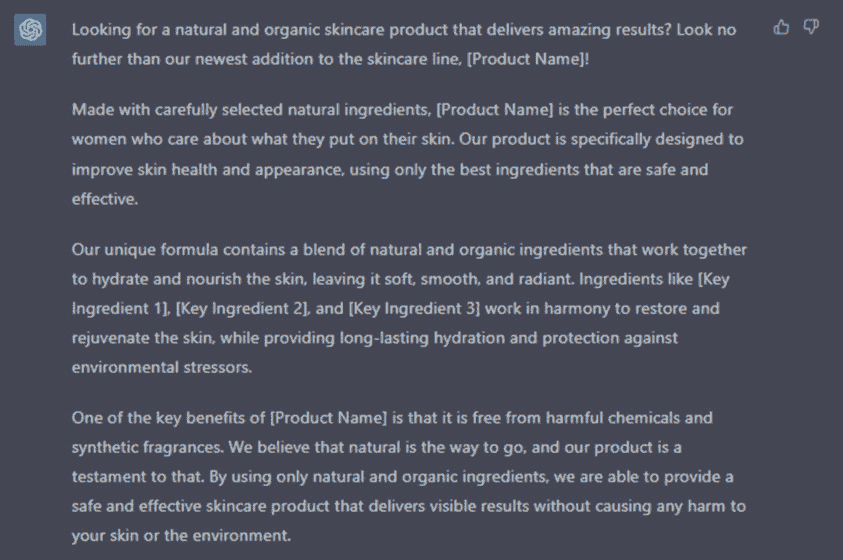
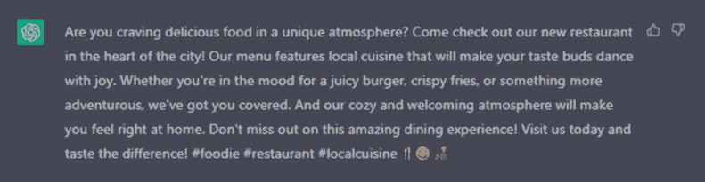
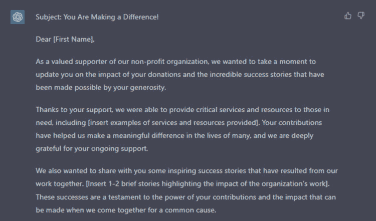
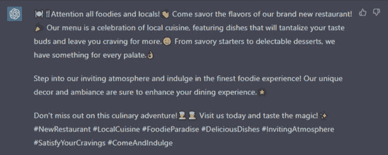

## 模板示例

以下是 5 个不同类型内容的提示。它们是通用的，您需要定义您的产品/服务，但可以得到灵感。

一款新护肤产品的营销活动

目的：创建一个营销活动，推广一款新的护肤产品

目标受众：年龄在 25-40 岁之间，对天然有机护肤产品感兴趣的女性

语调和风格：友好和信息丰富，侧重于产品的好处和成分

关键词：天然，有机，护肤，美容，成分，好处

长度：500-700 字

额外说明：强调产品的独特卖点

一家新餐厅的社交媒体帖子

目的：创建一个社交媒体帖子，推广一家新餐厅

目标受众：餐厅所在地的美食爱好者和当地居民

语调和风格：俏皮和诱人，描述餐厅菜肴令人垂涎

关键词：餐厅，食物，菜单，本地，美食，氛围

长度：100-150 字

额外说明：强调餐厅独特的氛围

非营利组织的电子通讯

目的：创建一封电子通讯，与非营利组织的支持者互动和更新

目标受众：现有和潜在的捐赠者和志愿者

语调和风格：富有同理心和信息丰富，侧重于组织的影响和成功故事

关键词：非营利组织，捐赠，志愿者，影响，成功故事

长度：400-600 字

额外说明：包括捐赠和志愿机会的行动号召

输出（部分内容）：

一款新的健身器材的产品描述

目的：为一款新的健身器材撰写产品描述

目标受众：健身爱好者和对新的健身技术感兴趣的人

语调和风格：信息丰富和技术性，侧重于器材的特点和功能

关键词：健身，器材，技术，特点，功能

长度：300-400 字

额外说明：包括技术规格，并强调该器材的独特卖点。

旅行网站的博客文章

目的：撰写关于特定旅行目的地的博客文章

目标受众：旅行爱好者和计划前往目的地的人们

语调和风格：引人入胜和描述性，带有个人趣闻和旅行者的建议

关键词：旅行，目的地，建议，趣闻，经历

长度：800-1000 字

额外说明：提供实用的旅行建议和目的地的观光推荐

更具体的例子 - 电子邮件

文案目的：推广金融服务的电子邮件

目标受众：年龄在 40-60 岁之间，对财务规划感兴趣的男性和女性

语调和风格：专业和有说服力

关键词：财务规划，退休，投资，储蓄

长度：约 300 字

附加说明：包括金融规划公司提供的服务信息。

表情符号使用：无

输出（部分内容）：

利用这个模板，让您的 ChatGPT 和其他 AI 写作平台的文案效果更上一层楼。天空是极限！

通过包含大部分给定参数来优化您的提示。您不必使用确切的结构，但请尽量包含最重要的内容，比如：

针对新餐厅的社交媒体帖子：

“创建一个有趣且吸引人的社交媒体帖子，以促进一家新餐厅，面向美食爱好者和餐厅所在地区的当地居民。使用让人垂涎欲滴的描述来描述餐厅的菜肴，并强调独特的氛围。尝试使用关键词如餐厅、食物、菜单、当地、美食和氛围。使用食物的吸引人照片使帖子更具吸引力。保持长度在 100-150 字之间。”

针对非营利组织的电子通讯：

“创建一封 400-600 字的电子通讯，以吸引和更新非营利组织的支持者。目标受众是现有和潜在的捐助者和志愿者，因此语气应该是富有同情心和信息性的。侧重于组织的影响和成功故事，使用关键词如非营利、捐赠、志愿者、影响和成功故事。包括捐赠和志愿机会的行动号召，并使用引人注目的图片使通讯更具视觉吸引力。”

针对新健身器材的产品描述：

“为一款面向健身爱好者和对新型健身技术感兴趣的人群的新健身器材撰写 300-400 字的产品描述。语气应该是信息性和技术性的，侧重于器材的特点和功能。使用关键词如健身、器材、技术、特点和功能。包括技术规格，并强调该器材的独特卖点，以使其与市场上其他健身器材区分开来。”

针对旅行网站的博客文章：

“创建一篇 800-1000 字的博客文章，介绍一个特定的旅行目的地，面向旅行爱好者和计划前往该目的地旅行的人群。语气应该引人入胜和描述性，包括个人轶事和旅行者的建议。使用关键词如旅行、目的地、建议、轶事和经历。使用高质量的图片使帖子更具视觉吸引力，并提供实用的旅行建议和目的地的观光推荐。”

你应该时刻记住的一件事是，我们给系统提供的信息越多，它的表现就会越好。这就是为什么在写作时提供尽可能多的相关信息至关重要，这样结果就会更具针对性和特定性，而不是泛泛而谈。此外，您可以通过提供您希望在文本中反映的语气和语言的示例来引导写作风格。
