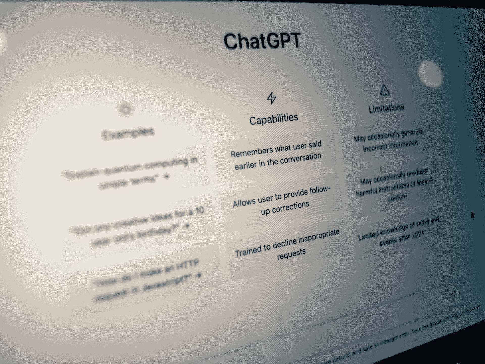
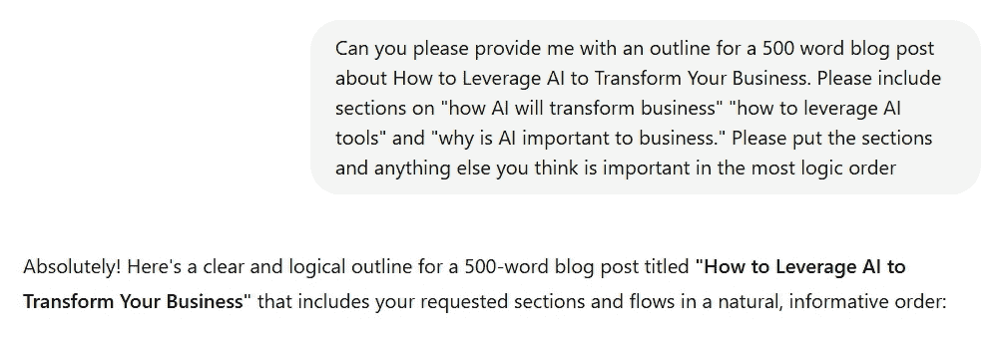

# 您的 AI 写作助手：如何与 ChatGPT 合作以创作更好的内容

> 原文：[Your AI Writing Assistant: How to Collaborate with ChatGPT for Better Content ](https://annas-archive.gl/md5/f0d77be87a4378fdafafc7084f6452b2)
> 
> 译者：[飞龙](https://github.com/wizardforcel)
> 
> 协议：[CC BY-NC-SA 4.0](https://creativecommons.org/licenses/by-nc-sa/4.0/)

# 引言

欢迎来到写作的未来。

不论你是内容创作者、企业主、市场营销人员，还是仅仅想提高写作技能的人，这本书都是为了你而写的。你可能听说过 ChatGPT——也许你甚至尝试过它。但如果你曾经盯着闪烁的光标，想知道如何真正利用 AI 来帮助你写得更好、更快或更有信心，那么你就在正确的位置。

这本书旨在指导你通过 ChatGPT 作为写作伙伴的过程。它不是关于取代你的声音——而是关于增强你的写作过程。

## 什么是 ChatGPT，为什么作家应该关心？

ChatGPT 是由 OpenAI 开发的高级语言模型。把它想象成一个可以回答你问题的、生成内容的、帮助你润色写作并提供新想法的数字助手——所有这些都在自然、对话式的语言中进行。但这个工具不仅仅是一个花哨的聊天机器人。对于作家来说，它可以用来构思内容、撰写草稿、编辑稿件，甚至建议改进你的语气和清晰度。

简而言之，ChatGPT 可以帮助你提高生产力和一致性——特别是如果你在处理多个写作项目或经营依赖数字内容的企业时。

## 这本书面向谁

这本书是为初学者写的——可能对 AI 工具、内容写作或两者都感到陌生的人。也许你经营着一家小企业，想要写更好的博客文章。也许你是一名自由职业者，试图加快你的工作流程。或者也许你对 AI 如何融入你的创作过程感到好奇。不需要任何技术背景或写作学位。

如果你发现以下情况特别有帮助：

● 你已经使用过 ChatGPT，但不知道如何正确引导它。

●     你发现从一张白纸开始写作很困难。

●     你需要帮助构思想法或完善你的写作。

●     你希望在保证质量的前提下提高写作速度。

## 这本书你将学到什么

我们将从基础知识开始——什么是 ChatGPT，它是如何工作的，以及如何访问它。然后我们将介绍不同的方法，你可以使用 ChatGPT 来支持你的写作，从构思博客文章的想法到撰写产品描述，再到润色最终稿件。

快速浏览我们将要涵盖的内容：

### 第一部分：ChatGPT 入门

我们将首先探讨 ChatGPT 的工作原理以及如何有效地与之互动。您将学习如何制定更好的提示，如何获得更准确的结果，以及如何引导对话朝着您想要的方向发展。您还将获得有关设置账户、理解界面以及选择工具的免费和付费版本的提示。

### 第二部分：ChatGPT 写作任务

这是我们卷起袖子，真正使用 ChatGPT 进行写作项目的地方。您将看到如何：

●     在遇到瓶颈时头脑风暴内容想法

●     草拟博客文章、电子邮件通讯和网页

● 编辑和改写现有内容以提高清晰度、语气或流畅性

● 使用 AI 进行 SEO 任务，如关键词研究和文章大纲

每个部分都包括适合初学者的提示、示例和最佳实践。

### 第三部分：技巧、工具和最佳实践

这一部分完全是关于更聪明地工作。您将学习如何与 ChatGPT 建立高效的工作流程，如何精炼和人性化 AI 生成的内容，以及如何避免常见的错误，如过度依赖 AI 或失去您独特的声音。

一章专门讨论许多新用户最头疼的问题：在 AI 辅助写作中保持人文元素。您将发现如何识别内容是否感觉“机械”，以及如何注入您自己的创造力和情感，使您的写作更加出色。

我们还将包括一个实用的提示库，您可以用作各种内容类型的起点——从博客文章到社交媒体标题——这样您就永远不会从头开始。

## 关于创造力和人文关怀的说明

让我们明确一点——ChatGPT 可以是一个极其有用的工具，但它不能替代您的想法、经验或声音。把它想象成一个聪明的合著者：它可以提供建议、生成草稿，并帮助您跳出思维定式。但真正的魔法还是来自您自己。

您的个性、洞察力和情感是使内容与读者产生共鸣的关键。在这本书中，我们将讨论如何将 AI 生成的想法与您的创造力相结合，使您的写作不仅听起来很好，而且听起来像您自己。

## 如何使用这本书

您不需要从头到尾阅读这本书。请随意跳转到您现在觉得最有用的章节。每个章节都是独立的，并提供了您可以立即遵循的逐步示例。

但如果您对 ChatGPT 完全陌生，从开始学习将为您打下坚实的基础。

## 让我们开始吧

这本书的目标是帮助您在写作过程中自信地使用 ChatGPT，无论您是发布博客文章、为您的业务创建内容，还是简单地尝试更高效地写作。您将带着对 AI 如何融入现代写作世界以及它如何作为创作者支持您的更好理解离开。

所以拿起您的笔记本电脑，打开 ChatGPT，让我们一起写出一些精彩的内容吧。

第一部分：

ChatGPT 入门

# 

图片由[Emiliano Vittoriosi](https://unsplash.com/@emilianovittoriosi?utm_content=creditCopyText&utm_medium=referral&utm_source=unsplash)在[Unsplash](https://unsplash.com/photos/a-computer-screen-with-a-bunch-of-words-on-it-vEN1bsdSjxM?utm_content=creditCopyText&utm_medium=referral&utm_source=unsplash)上提供

# 第一章：什么是 ChatGPT，它是如何工作的？

拥抱你的新写作伙伴。

在我们深入探讨如何使用 ChatGPT 使写作更轻松、更快、更有创意之前，了解它实际上是什么很重要。你不需要技术背景就能充分利用这个工具——但有一个大致的了解将帮助你更有效地使用它。

ChatGPT 是由一家名为 OpenAI 的公司开发的人工智能语言模型。它旨在根据你给出的提示生成类似人类的回应。你可以将其视为一个非常高级的写作助手，可以帮助你构思想法、撰写内容、编辑草稿，甚至回答问题。

但关键是：ChatGPT 并不像人类那样“思考”，它也不会浏览互联网获取当前信息。相反，它是基于大量文本数据进行训练的，并使用语言中的模式来预测句子中的下一个单词——非常快速且非常准确。

## “语言模型”是什么意思？

语言模型是一种经过训练以理解和生成人类语言的计算机程序。ChatGPT 是其中最先进的例子之一。它基于一种称为 GPT（代表“生成预训练转换器”）的技术。这仅仅是一种说法，意思是它已经被训练去根据上下文预测单词和短语。

想象一下向计算机输入数十亿本书籍、网站、文章和对话——然后要求它生成听起来同样自然的新的文本。这正是 GPT 模型被构建来做的。

当你将问题或提示输入到 ChatGPT 中时，它会分析语言，预测哪种回应是有意义的，并实时为你写出回应。结果可能会出人意料地富有思考性、创造性和信息性——但它们仍然基于训练数据中的模式，而不是新的或实时信息。

## ChatGPT 能做什么

ChatGPT 可以协助完成各种任务，尤其是在写作方面。以下是一些你可以请求它帮助的事情：

●     构思博客文章想法或文章标题

●     为长篇内容撰写大纲

●     起草电子邮件、产品描述和网站文案

●     建议对语法、语气和清晰度的编辑

●     为不同的受众或平台重写文本

●     用简单语言解释复杂主题

●     生成社交媒体标题和简介

●     帮助你突破写作瓶颈

当你把它当作一个合作伙伴来对待时，它效果最好。如果你引导对话、提出后续问题并给出反馈——就像与一个人类合著者一样——你会得到更强大的结果。

## ChatGPT 无法做到的事情

虽然 ChatGPT 是一个强大的工具，但它确实有限制。以下是一些需要记住的重要事项：

● 它不知道当前新闻。ChatGPT 不能浏览互联网或访问实时数据（除非你使用的是包含网络浏览功能的版本）。它的知识基于特定时间点的数据。

● 它并不总是能准确获取事实。该模型非常擅长表现出自信——即使它错了。在计划发布任何内容之前进行事实核查是个好主意。

● 它没有观点或情感。它所分享的任何“观点”都是基于语言中的常见模式生成的，而不是个人信念或感受。

● 它不能取代你的声音。ChatGPT 可以用许多不同的语气写作，但个性化、编辑并使最终产品听起来像你，这取决于你。

理解这些界限将帮助你更深思熟虑地使用 ChatGPT，并避免在未经检查或改进的情况下过度依赖其输出。

## 这对作家意味着什么

如果你正在为你的业务、博客或营销策略创建内容，ChatGPT 可以提供巨大的帮助。它可以加快写作的早期阶段，帮助你测试不同的语气或格式，在你陷入困境时甚至提供新的视角。

但真正的益处不仅仅是速度——还有灵活性。你可以用它来生成草稿，修改你不满意的句子，或者快速探索表达相同意思的十种不同方式。你可以用它来完成大局任务，如概述，或者细节任务，如润色标题。

这本书的目标是向你展示如何将 ChatGPT 作为一位支持你想法的创意伙伴来使用，而不是取代你。

## 简要了解 ChatGPT 的训练过程

如果你好奇这个工具背后的技术，这里有一个用简单英语的快速概述。

ChatGPT 是通过一种称为机器学习的方法进行训练的。这意味着它被展示了大量的文本——书籍、文章、网站、对话——这样它就能“学习”语言是如何运作的。在训练过程中，它因做出好的预测而获得奖励，在出错时被纠正。随着时间的推移，这个过程帮助它提高理解和生成语言的能力。

正因如此，它现在可以举行对话、撰写博客文章，并模仿不同的语气——因为它已经被训练了，知道这些事情应该如何根据现实世界文本中的模式听起来。

重要的是要记住，它并不像人类那样“理解”意义。它不是在思考你说了什么——它是在识别模式并根据这些模式做出回应。尽管如此，结果往往是出人意料地有帮助的，尤其是当你学会如何用深思熟虑的提示引导它时。

## 总结

ChatGPT 是一种工具。它功能强大、适应性强，有时甚至能提供令人惊讶的深刻见解——但它终究只是一个工具。你越了解它能做什么、不能做什么，就越能有效地利用它来为你服务。

在下一章中，我们将引导你如何开始——你需要什么工具、选择哪个版本，甚至在输入第一个提示之前如何为成功做好准备。

# 

照片由  [安德鲁·尼尔](https://unsplash.com/@andrewtneel?utm_content=creditCopyText&utm_medium=referral&utm_source=unsplash) 拍摄，发布于  [Unsplash](https://unsplash.com/photos/a-computer-screen-with-a-purple-and-green-background-CVfAqFRYjb0?utm_content=creditCopyText&utm_medium=referral&utm_source=unsplash)

# 第二章：成功起步

从简单开始，保持灵活。

既然你已经了解了 ChatGPT 是什么以及它能做什么，现在是时候开始设置了。你不需要任何特殊软件或技术技能即可开始。你只需要能上网，并花几分钟熟悉这个平台。

本章将引导你了解如何访问 ChatGPT、免费版与付费版的区别，以及如何有效使用界面。一旦设置完成，你就可以开始写作、尝试，并以更少的压力完成更多工作。

## 如何访问 ChatGPT

要使用 ChatGPT，你需要通过 OpenAI 创建一个免费账户。步骤如下：

1.  访问  [chat.openai.com](https://chat.openai.com)

1.  如果你已有账户，请点击“注册”或“登录”。

1.  使用你的电子邮件地址，或通过 Google、Microsoft 或 Apple 账户登录。

1.  系统可能会要求你验证手机号码。

1.  登录后，你将进入主聊天界面，一切准备就绪。

你可以在桌面浏览器、平板电脑或手机上使用 ChatGPT。iOS 和 Android 也有移动应用程序，以适合移动设备的形式提供相同的功能。

## 选择正确的版本：免费版与付费版

OpenAI 提供了多个版本的 ChatGPT。免费版本让你可以使用 GPT-3.5，它功能强大，对于许多写作任务来说完全够用。如果你是新手，这个版本是一个很好的起点。

付费版本（ChatGPT Plus）让你可以使用更先进的 GPT-4，它能提供更准确、更具创造性和更周到的回答。截至本文撰写时，费用为每月 20 美元。

以下是各版本功能的简要说明：* 网络浏览和文件上传等功能有时仅在启用“工具”的 GPT-4 中可用，具体取决于 OpenAI 当前的发布和设置。

如果你计划进行更深入的内容工作，使用 AI 进行研究支持，或希望获得最佳结果，升级到 GPT-4 是值得考虑的。但你可以绝对地使用 GPT-3.5 来学习、写作和创建高质量的内容。

## 接口快速浏览

登录后，你会看到一个简单的聊天界面。它被设计得尽可能直观。以下是你将看到的内容：

● 聊天窗口：这是你输入问题或提示并阅读 ChatGPT 回答的地方。

● 新聊天按钮：点击此按钮开始新的对话。这在切换主题或写作任务时很有帮助。

● 侧边栏：在左侧，你可以看到你之前的聊天历史，你可以随时回顾。你也可以重命名聊天以保持整洁。

● 设置（齿轮图标）：使用此功能调整首选项或切换模型（如果你有 GPT-4 访问权限）。

● 复制、重新生成和点赞：ChatGPT 回答后，你可以复制输出、要求它再次尝试（重新生成），或通过点赞/点踩提供反馈。

如果你使用的是移动应用，布局类似，但适应了更小的屏幕。

## 开始你的第一次对话

你不需要用特殊格式表达你的问题。你可以简单地输入像以下这样的内容：

● “帮我写一个关于晨间惯例的博客文章大纲。”

● “将这个段落重写得更像对话。”

● “给我五个关于春季促销的电子邮件主题行想法。”

ChatGPT 对清晰、具体的提示反应最好——但如果你不确定如何提问，不要担心。你将通过实践来学习。如果回答不太准确，你可以通过以下信息进行跟进：

● “让它更简短。”

● “使用更专业的语气。”

● “给我更多关于第三点的细节。”

每次对话都是互动的，所以请随意在过程中调整和改进。我们将在下一章中更多地讨论如何撰写强大的提示。

## 为流畅的工作流程做好准备

虽然 ChatGPT 可以单独使用，但随着你对使用 AI 写作越来越熟悉，你可能想要围绕它建立一个更舒适的工作流程。以下是一些可以帮助你的事情：

● 文本编辑器或文档应用：打开像 Google Docs、Microsoft Word 或 Notion 这样的工具，以便你可以复制、编辑和保存 ChatGPT 的回答。

● 记事工具：使用像记事本或笔记应用这样的简单工具来跟踪你使用过的良好提示或想要重访的想法。

● 剪贴板管理器：如果你经常复制和粘贴，剪贴板工具可以节省时间。

● 键盘快捷键：熟悉复制/粘贴和浏览器标签快捷键，以保持你的工作流程顺畅。

随着你越来越舒适，你会发现自己的节奏。一些用户更喜欢在 ChatGPT 内生成完整的草稿，而另一些用户则更喜欢只用它来编写大纲或进行快速编辑。

## 准备写作

现在你已经登录、设置好，并对界面有了感觉，你就可以开始探索如何实际使用 ChatGPT 进行写作了。在下一章中，我们将讨论编写良好提示的艺术——如何引导工具、获得更好的回应，以及以自然和有帮助的方式与 AI 协作。

让我们去写些精彩的东西。

# 

来自与 ChatGPT 个人对话的图片

# 第三章：如何与 ChatGPT 交谈

编写一个能完成任务的提示。

如果有一种技能能让你的 ChatGPT 体验更轻松，那就是学习如何给出正确的指令——称为提示。提示只是你输入给 ChatGPT 的消息，告诉它你想让它做什么。这可以是一个简短的句子、一个完整的段落，甚至是一系列指令。

在本章中，我们将探讨什么是一个好的提示，如何给 ChatGPT 提供正确数量的上下文，以及如何在想要不同结果时引导它。把这看作是学习如何用工具的语言——不是用术语或代码，而是用简单、具体的指示。

## 什么是提示，实际上？

提示是你与 ChatGPT“交谈”的方式。它可能是一个请求、一个问题，或者是对一项任务的描述。你的提示越清晰，得到的回应就越有帮助和准确。

这里有一些提示示例：

● “写一篇关于早晨锻炼益处的博客文章引言。”

● “给我提供五个春季促销活动的牙科诊所标题想法。”

●     “将这段文字重写得更随意、更友好。”

●     “用三个要点总结这段文字。”

每个这些例子都为 ChatGPT 提供了足够的方向，以便知道你想要什么样的结果——这才是关键。

## 强大提示的基础

当编写提示时，你可以包含一些内容来提高输出质量：

### 1. 明确任务

不要说“写一些关于营销的内容”，而是尝试：

“写一封简短的电子邮件，向中小企业主介绍一项新的社交媒体营销服务。”

你提供关于目的和格式的细节越多，结果就越好。

### 2. 提及受众

告诉 ChatGPT 写作的对象是谁：

“写一篇博客文章，向不熟悉技术的中小企业主解释 SEO。”

了解受众有助于 ChatGPT 选择合适的语气和复杂程度。

### 3. 设置语气或风格

通过包含类似指示的内容，你可以引导写作的风格：

●     “让它听起来专业且信息丰富。”

●     “使用像对话一样的随意、友好的语气。”

●     “用说服性的语气写作，就像销售演讲。”

语气有很大的影响，尤其是如果你使用内容来推广你的品牌或业务。

### 4. 包含格式或长度说明（可选）

你可以要求特定的结构：

●     “将此内容写成提示列表。”

●     “将回应控制在 200 字以内。”

●     “使用简短的段落和清晰的标题。”

你提供的结构越多，结果就越接近你的预期。

## 提示词是一种对话，而不是一次性命令

一件关于 ChatGPT 的最好事情是你可以继续对话。如果回复不太准确，你不必从头开始。你可以用以下指示跟进：

●     “让它更简短。”

●     “为第 2 点添加更多细节。”

●     “你能用更有说服力的语气写吗？”

●     “再试一次，但这次用幽默的方式。”

每次跟进都会使结果更接近一些。这正是 ChatGPT 发挥真正作用的地方，因为你们一起在完善工作。

## 有效的提示词示例

让我们看看一些示例提示词以及微小的变化如何产生重大差异：

基本提示词：

“写一篇关于健康饮食的博客文章。”

改进的提示词：

“为忙碌的专业人士写一篇 500 字的博客文章，关于如何在工作周建立健康的饮食习惯。语气要友好并鼓励人，并包含一些实用的建议。”

基本提示词：

“写一个产品描述。”

改进的提示词：

“为针对健身爱好者的便携式搅拌机写一篇简短的产品描述。强调便利性、功率和在任何地方搅拌的能力。保持语气充满活力和乐观。”

如你所见，为 ChatGPT 提供更多上下文可以帮助它产生更好的回复，而你需要的编辑也更少。

## 添加例子或参考文本

你也可以在你的提示词中包含你自己的内容或例子。例如：

“这是原文段。你能重写它使其听起来更专业吗？”

“我们的团队对帮助业务在线增长充满热情，我们有一些很棒的服务你绝对应该看看。””

或者：

“以以下语气为参考：‘在 BrightWeb Solutions，我们为每个数字营销活动带来清晰度和策略。’现在重写以下段落以匹配那种语气。”

通过提供一个例子，你帮助 AI 匹配你想要的语气或方向。

## 节省时间的提示词

你甚至可以使用 ChatGPT 来帮助你写出更好的提示词。试着问：

●     “有什么好的提示词可以生成博客文章的大纲？”

● “你能给我一个为科技小玩意写产品描述的提示词吗？”

你会惊讶于 ChatGPT 在自我设置方面的协助能力有多强——就像一个随时可用的写作教练。

## 练习使进步

提示词是一种技能。你使用 ChatGPT 越多，你将越擅长塑造结果。不要害怕实验，调整你的措辞，或尝试不同的角度。随着时间的推移，你将发展出最适合你内容和目标的自定义提示词风格。

在本书的下一节中，我们将运用你的提示词技巧，并展示 ChatGPT 如何支持实际的写作任务——从头脑风暴开始。

第二部分：

ChatGPT 用于写作任务

# 

图片由  [Christina @ wocintechchat.com](https://unsplash.com/@wocintechchat?utm_content=creditCopyText&utm_medium=referral&utm_source=unsplash) 在  [Unsplash](https://unsplash.com/photos/a-woman-standing-in-front-of-a-whiteboard-with-writing-on-it-Q8IgAlmHAUA?utm_content=creditCopyText&utm_medium=referral&utm_source=unsplash) 上提供

# 第四章：使用 ChatGPT 进行头脑风暴

将空白页面变成可能性。

每个作家都遇到过这种情况：闪烁的光标，空白的页面，以及迅速想出新鲜内容的压力。无论你是在撰写博客文章、产品发布，还是下周的社交媒体内容，开始可能感觉是最困难的部分。

这就是 ChatGPT 发挥作用的时刻——不是直接给你一个最终答案，而是帮助你探索不同的方向，激发新的想法，并开始行动。把它想象成一个永远不会耗尽能量或建议的头脑风暴伙伴。

在本章中，我们将介绍如何使用 ChatGPT 在不同类型的内容中进行创意生成，如何将这些想法精炼成有用的东西，以及如何使用它来保持你的创造力流动——即使在你灵感不足的时候。

## 为什么使用 ChatGPT 进行头脑风暴？

需要即兴想出想法可能会让人筋疲力尽。ChatGPT 给你一个起点。它提供了你可能没有考虑过的可能性，你意想不到的角度，以及你可以塑造为自己的变体。

这是 ChatGPT 如何支持你的头脑风暴：

●     为陈旧的主题提供新鲜视角

●     在几秒钟内生成大量想法

●     帮助你为不同的受众重新构思主题

●     快速探索多种格式（例如，列表文章，教程，常见问题解答）

●     当你需要快速获得想法时节省时间

由于 ChatGPT 不会陷入僵局或遭受写作障碍，它非常适合启动你的创意过程。

## 思考博客文章想法

博客内容是 ChatGPT 最常见的用途之一，从头脑风暴博客文章主题开始是一个很好的起点。你可以根据行业、主题、受众或格式来请求想法。

示例提示：

“给我 10 个吸引当地顾客的小面包店的博客文章想法。”

示例输出：

1.  完美酸面包的秘密：来自我们首席面包师的技巧

1.  5 种使我们的糕点独特的当地食材

1.  如何用我们新鲜的面包计划完美的早午餐

1.  背后故事：我们面包房厨房的一天

1.  只有在[你的面包店名称]才能找到的季节性美食

1.  为什么我们喜欢用有机面粉烘焙

1.  如何像专业人士一样搭配糕点和咖啡

1.  酥皮饼的历史（以及为什么我们的值得炒作）

1.  认识烤箱背后的团队

1.  客户最爱：前 5 名热销烘焙食品

你可以接着这样做：

“给我一些以教程格式呈现的内容。”

“将列表重写为更轻松愉快、有趣的语气。”

“哪一些最适合 SEO？”

这种灵活性意味着你可以快速将一个提示转换成一个完整的头脑风暴会议，边走边完善。

## 生成社交媒体创意

如果你管理一个品牌的社交媒体或你自己的，你知道保持内容流动是多么困难。ChatGPT 可以帮助生成标题想法、内容主题或整个帖子系列。

示例提示：

“给我 10 个瑜伽工作室推广其新夏季课程的 Instagram 标题创意。”

示例输出：

●     “伸展进入夏日 ☀️ 新的课程表现已上线！”

●     “更多的日光 = 更多时间练习下犬式 🧘‍♀️”

● “在这个夏日，让我们凉爽下来，找到中心，与我们一同流动。”

● “你的垫子一直在等你。新课程 = 新的开始。”

●     “解锁心流状态：加入我们新的晚间瑜伽系列。”

你也可以要求 ChatGPT 匹配特定的语气：

“使标题鼓舞人心，但不要过于严肃。”

“添加表情符号，并确保每个标题不超过 10 个单词。”

## 想出电子邮件营销创意

电子邮件是与你的受众建立联系的好方法——但每周或每月想出要说的话可能会很耗时。ChatGPT 可以通过建议主题、主题和角度来帮助你为下一封通讯提供建议。

示例提示：

“我经营一家植物苗圃。给我提供一些关于我下 4 封电子邮件通讯的创意。”

示例输出：

1.  春季种植技巧：现在种什么才能让夏日生机勃勃

1.  客户风采：认识一位将后院变成花园的园丁

1.  员工精选：我们最喜欢的低维护室内植物

1.  限时优惠：本周只有花卉灌木优惠

补充：

“你能将#1 转换成一个带有主题行和三个主要点的提纲吗？”

## 标题和标语头脑风暴

当你试图命名某物时——无论是博客文章、产品还是活动——ChatGPT 可以帮助生成标题或标语选项。

示例提示：

“为关于开设小型企业网站的文章写 10 个标题创意。”

示例输出：

1.  开门见山：5 步建立你的小型企业网站

1.  从想法到在线：你的网站发布指南

1.  你的第一个网站不必复杂

1.  简单步骤建立能增长你业务的网站

1.  网站基础：每个小型企业都需要知道的事情

1.  你不需要成为技术专家就能建立一个出色的网站

1.  有信心地启动你的网站

1.  小型企业网站入门指南

1.  7 个常见的网站错误（以及如何避免它们）

1.  网站担忧？从这里开始。

然后，你可以要求 ChatGPT：

●     “按语气（友好、专业、有趣）对这些进行排序。”

●     “加入一些幽默感。”

●     “使它们更短，以便于移动设备阅读的标题。”

## 从想法到行动

与 ChatGPT 头脑风暴的价值不仅在于获得一个清单——更在于将这些想法转化为行动。一旦你获得了一些有希望的线索，你可以要求 ChatGPT 帮助你进一步发展它们：

●     “将这个想法转换成一个博客文章提纲。”

●     “为这篇帖子写一个简介段落。”

● “给我一个简短的标题来推广这篇文章。”

这样你就可以从想法到内容创作过渡——而不会在开始时卡住。

## 更好地进行头脑风暴会议的技巧

这里有一些方法可以让你的 ChatGPT 头脑风暴会议更加高效：

● 不要期望完美。将建议作为跳板，而不是最终版本。

● 随时完善。ChatGPT 会从你的后续跟进中学习，所以根据需要调整和引导它。

● 使用批量处理。一次性请求一周或一个月的想法。

● 玩转措辞。用稍微不同的方式提出相同的问题可以产生新的结果。

● 保存你的收藏。保留一个文档或文件夹，存放你为将来使用而生成的好想法。

## 保持势头

使用 ChatGPT 进行头脑风暴有助于减轻创意过程的压力。你不必自己想出所有东西——你只需要塑造那些来到你面前的想法。这意味着你的内容规划中的停滞更少，可以将更多精力投入到执行中。

在下一章中，我们将迈出下一步——在 AI 写作助手的帮助下，将你最喜欢的想法变成完整的初稿。

一起打造点东西吧。

# 

图片由  [Sandipan Das](https://unsplash.com/@sam_199825?utm_content=creditCopyText&utm_medium=referral&utm_source=unsplash) 在  [Unsplash](https://unsplash.com/photos/a-tablet-computer-sitting-on-top-of-a-desk-next-to-a-cup-of-coffee-KdlQsaMB9pc?utm_content=creditCopyText&utm_medium=referral&utm_source=unsplash) 提供

# 第五章：更快地起草内容

从想法到初稿，用 ChatGPT。

一旦你进行了头脑风暴，并选择了方向，接下来的挑战是将这个火花变成具体的东西。无论你是写博客文章、电子邮件、着陆页还是产品文案，初稿往往是最慢的过程部分。

ChatGPT 可以加快事情的速度——不是通过为你做所有工作，而是通过帮助你越过空白页，进入你可以塑造和改进的内容。在本章中，你将学习如何使用 ChatGPT 生成草稿、构建你的写作结构，并在节省时间的同时产生感觉像是你自己的内容。

## 为什么使用 ChatGPT 来起草？

开始写作往往是最困难的部分。盯着一个空白的文档可能会感到压倒性。ChatGPT 帮助你跳过那种卡住的感觉，直接进入创作。

这就是使用 ChatGPT 起草内容可以帮助你的方式：

●     启动你的写作过程

●     在你不确定如何开始时提供结构

●     提供多种表达相同内容的方式

● 加快重复性任务（如撰写产品描述或常见问题解答）

● 给你一些可以编辑的内容，这通常比从头开始更容易。

目标不是复制粘贴所有内容。真正的价值在于将 ChatGPT 提供的内容塑造成符合你的声音、语气和信息的样式。

## 撰写博客文章

假设你想写一篇关于环保包装的博客文章。你可以先要求 ChatGPT 创建一个大纲：

提示：

“给我一个关于小型企业博客上环保包装益处的博客文章大纲。”

回复：

1.  引言：包装的重要性

1.  什么是环保包装？

1.  对企业和环境的关键益处

1.  客户期望和品牌忠诚度

1.  可持续包装选项的例子

1.  如何切换

1.  结论：小改变，大影响

从这里，你可以要求 ChatGPT 一次或分次撰写每个部分：

提示：

“为这篇博客文章撰写一个 200 字的简介。让它友好且信息丰富。”

你可以逐节继续这个过程，边走边审查和编辑。如果某个段落感觉太生硬或不符合语气，你可以要求重写：

“你能让这个听起来更像对话吗？”

“添加一些关于包装浪费的快速统计数据或事实。”

完成后，你将有一个完整的初稿，你可以对其进行精炼和个性化。

## 撰写网站文案

网站内容需要清晰、有说服力且简洁。无论你是在创建主页、关于我们部分还是服务描述，ChatGPT 都可以帮助你快速开始。

提示：

“为一家专注于个性化护理的宠物美容业务撰写一个简短的关于我们部分。”

回复（缩短示例）：

“在 Paws & Shine，我们相信每只宠物都值得感到最好。我们的经验丰富的美容师会花时间了解你宠物的独特需求，在平静和关怀的环境中提供温和、定制的美容服务。”

如果结果不太对，可以跟进：

●     “让它更活泼一些。”

●     “添加一句关于你从事业务年数的话。”

●     “提及移动美容服务。”

在几次简短的来回中，你可以塑造出符合品牌语气的内客，而无需花费数小时从头开始写作。

## 撰写产品描述

产品文案是写作中最耗时的一种类型，尤其是如果你有一个庞大的产品目录。ChatGPT 可以帮助你大规模地生成清晰、以利益为中心的描述。

提示：

“为不锈钢保温旅行杯撰写一个 3 句话的产品描述。重点介绍耐用性、温度控制和环保性。”

回复：

“用我们的不锈钢保温旅行杯，让饮料保持 12 小时热或 24 小时冷。它专为应对日常琐事而设计，既坚固又轻便。丢弃一次性杯子——这个环保杯子可重复使用、可靠，随时可用。”

你可以轻松要求 ChatGPT：

●     调整语气（“让它听起来更奢华”）

●     缩短文本以适应产品目录

●     添加项目符号以提高清晰度

这对于电子商务商店尤其有用，因为产品之间的连贯性很重要。

## 撰写电子邮件和通讯

电子邮件内容应该是清晰、专注和个性化的。ChatGPT 可以帮助你撰写促销电子邮件、欢迎信息或常规通讯。

提示：

“写一封简短的电子邮件向客户介绍一款新的手工香皂季节性产品系列。保持友好和热情。”

响应（示例）：

“我们为春天带来了新鲜事物！我们新的手工香皂系列充满了植物香气和天然成分——非常适合刷新你的日常习惯。来探索我们的最新混合物，找到你的新最爱。”

你可以跟进：

●     “添加一个现在就购买的号召性用语。”

●     “包含一条关于免费送货的说明。”

●     “使内容更适合商业受众。”

使用 ChatGPT 编写的电子邮件仍然可以定制为你的品牌——将草稿作为基础，并添加你个人的风格。

## 在进行中完善

如果 ChatGPT 的第一个结果不是完美的，那没关系。事实上，这是预期的。将每个响应视为一个初稿——需要塑造、编辑和改进的东西。以下是一些有用的后续提示，你可以使用：

●     “你能使这个更简洁吗？”

●     “使用更多主动语态。”

●     “将其分解为项目符号。”

●     “添加一个过渡到下一段落的句子。”

你互动得越多，内容改进得就越多——你达到最终可以发布的草稿的速度就越快。

## 更快、更好草稿的技巧

为了节省更多时间，请记住以下习惯：

● 从结构开始。给 ChatGPT 一个清晰的框架来工作，即使它很粗糙。

● 使用你的头脑风暴想法。参考第四章中生成的内容。

● 按部分工作。不要一次提出太多请求，以免使模型感到不知所措。

● 重复使用强大的提示。保存效果良好的模板以供将来使用。

● 总是回顾和修改。让 AI 帮助你更快地工作，但别忘了你的编辑帽子。

## 从初稿到成品内容

写作不必感觉像是一场缓慢的攀登。有了 ChatGPT，你可以更快地将你的想法变成完整的草稿，这样你就有更多时间专注于最重要的事情——你的信息、你的受众和你的声音。

接下来，我们将看看 ChatGPT 如何帮助你将粗糙的草稿润色：调整流畅性、语气、结构和可读性。

让我们让你的写作提升到下一个层次。

# 

图片由 [Jacob Mindak](https://unsplash.com/@aiaiandai?utm_content=creditCopyText&utm_medium=referral&utm_source=unsplash) 在 [Unsplash](https://unsplash.com/photos/a-persons-feet-resting-on-a-computer-screen-ugkxpq87qOk?utm_content=creditCopyText&utm_medium=referral&utm_source=unsplash) 上提供

# 第六章：在 AI 帮助下编辑和改写

用一点后备力量润色你的写作。

在您草拟完内容后，下一步是将它塑造成平滑、清晰且准备发布的作品。无论您是在压缩冗长的句子、调整语气还是为不同的受众重写，ChatGPT 都可以在过程中协助您。

本章将向您展示如何将 ChatGPT 作为一双额外的眼睛——一个您可以寻求建议、改进和快速修复的工具，这可以节省您的时间并减少编辑压力。您将学习如何处理不同类型的编辑，如何向 ChatGPT 明确地分配修订任务，以及如何在使用 AI 作为辅助的同时保持您独特的声音。

## 为什么使用 ChatGPT 进行编辑？

即使是最佳作家也需要修订。编辑有助于提高清晰度、加强流畅度，并确保您的信息以您期望的方式传达。ChatGPT 可以通过以下方式帮助：

●     捕捉尴尬的表达

●     为了清晰或更有力地重写句子

●     调整语气以匹配您的受众

●     精简长段落

●     提供建议，使您的写作更具吸引力

它不会取代人类编辑或校对员，但它可以加快流程，使自我编辑不那么令人压倒。

## 提高清晰度和流畅度

有时候写作只需要一点清理——句子太长，想法混乱，或者流程不对。您可以将一个段落复制到 ChatGPT 中，并请求帮助使其更清晰。

提示示例：

“你能重写这个段落，使其更容易阅读吗？”

原文：“为了继续为客户提供创新解决方案，我们实施了一系列新的数字策略，这些策略专门设计用于提高品牌知名度和改善多个平台上的参与度指标。”

ChatGPT 回复：

“我们引入了一套新的数字策略，以帮助我们的客户在各种平台上提高品牌知名度和增加参与度。”

您可以通过以下方式继续塑造结果：

●     “让它听起来更随意。”

●     “添加一个句子，将其与客户反馈联系起来。”

●     “将其拆分为两个较短的句子。”

## 语气重写

无论您是追求专业、休闲、俏皮还是有说服力的风格，ChatGPT 都可以帮助调整您写作的语气以适应您的受众。

提示示例：

“将其重写得更像对话：

“我们的会计服务旨在通过定制财务策略和专家建议来支持小型企业。””

ChatGPT 回复：

“我们在这里帮助小型企业通过真正有意义的智能财务策略和建议。”

从这里，您可以进一步微调：

● “在不失去休闲语调的同时增加一点专业性。”

●     “让它听起来更有信心。”

●     “使用第一人称（‘我们’）而不是被动语态。”

在将相同内容适应不同平台时，如将博客段落转换为 LinkedIn 帖子或电子邮件，语气调整特别有帮助。

## 使句子更简洁

繁琐的写作可能会失去读者。ChatGPT 可以帮助您收紧内容，而不会失去您的意义。

提示示例：

“在不删除任何重要内容的情况下，使这个句子更简洁：

“由于许多客户要求延长服务时间，我们现在提供的服务时间已延长至工作日的晚上 9 点。”

ChatGPT 回复：

“由于许多客户要求延长服务时间，我们现在提供的服务时间已延长至工作日的晚上 9 点。”

你还可以询问：

● “将这个段落减少 30%的同时保持相同的语气。”

●     “为普通受众简化。”

●     “从这个部分中删除重复内容。”

## 编辑以提高可读性

如果你想让你的写作更易于理解——特别是对于可能不是你话题专家的受众——ChatGPT 可以帮助简化复杂的概念。

提示示例：

“将这个段落改写为初学者容易理解：

“响应式设计是一种通过使用流体网格、灵活的图像和媒体查询，使内容能够适应不同屏幕尺寸和方向的网页开发方法。”

ChatGPT 回复：

“响应式设计意味着你的网站在手机、平板电脑和电脑上看起来很好，工作得也很好，因为它会自动调整屏幕大小。”

你还可以要求不同阅读水平的写作：

●     “使其适合高中阅读水平。”

●     “为数字营销新手改写。”

●     “添加简单的例子来帮助解释这一点。”

## 为新的受众或格式改写

有时候你已经有了草稿，但你需要改变它的呈现方式——也许你正在将博客文章改为电子邮件，或者将正式段落改写为社交媒体内容。

提示示例：

“将这个段落改写成推文：

“我们的新订阅计划为您提供无限访问高级模板、每月更新和专家支持——所有这些都在一个负担得起的套餐中。”

ChatGPT 回复：

“无限模板 ✅ 每月更新 ✅ 专家支持 ✅

所有这些都在一个简单的订阅中。现在开始 👉 [链接]”

或者尝试：

● “将其改写为具有专业语调的 LinkedIn 帖子。”

● “将其改写为带有友好氛围的 Instagram 配文。”

● “将其作为销售电子邮件的开头句子。”

ChatGPT 可以帮助重新构思你的内容以适应不同的平台，而无需从头开始重写一切。

## 实时改写和微调

你不必等到草稿完成才开始编辑。实际上，许多作家发现边写边编辑——一部分一部分地——可以使整个过程更加顺畅。ChatGPT 可以在你遇到瓶颈时帮助你。

如果一个句子感觉不对劲，只需将其粘贴到聊天中，并附上类似的消息：

●     “这个句子感觉有点笨拙——有什么建议吗？”

●     “你能提供这个内容的两个改写版本吗？”

● “我想说得更有信心。你能帮忙吗？”

你将获得几个版本供选择——或者组合。

## 保持你的风格

使用 ChatGPT 进行编辑时，要记住的最重要的事情之一是确保最终版本仍然听起来像您。AI 可以帮助改进语法、简化复杂语言并调整语气——但将个人风格融入受众的连接则取决于您。

以 ChatGPT 的建议作为起点，然后根据语气、风格和真实性进行修改。这种机器支持和人类洞察力的结合使得最终产品看起来更加精致自然。

## 结束编辑

使用 ChatGPT 编辑完成后，请花点时间：

●     大声朗读内容以检查流畅性

●     添加或调整示例以匹配您的经验

●     检查事实、姓名和数字的准确性

●   如有必要，使用其他工具进行最终语法检查（如 Grammarly）

编辑不必感到乏味。有了 AI 支持，您可以更快地工作，遇到的问题更少，并且更有信心。

接下来，我们将探讨 ChatGPT 如何帮助进行研究和 SEO 写作，帮助您构建既好写又好结构化的内容，以适应搜索。

让我们继续前进。

## 

图片由[Lukas Müller](https://unsplash.com/@honeybadger33?utm_content=creditCopyText&utm_medium=referral&utm_source=unsplash)在[Unsplash](https://unsplash.com/photos/a-white-sign-with-plants-and-a-potted-plant-next-to-it-ONZG-HRGKNQ?utm_content=creditCopyText&utm_medium=referral&utm_source=unsplash)提供

# 第七章：研究和 SEO 内容帮助

在 AI 支持下构建更智能的内容。

优质内容不仅仅是写得很好——它是有策略的。无论您是在写博客文章、产品页面还是服务描述，您都希望人们能找到它。这就是搜索引擎优化（SEO）的作用所在。

虽然 ChatGPT 不能完全替代专业的 SEO 工具，但它可以用各种有用的方式支持您的内容策略。从将您的想法组织成 SEO 友好的大纲到帮助您理解关键词意图，ChatGPT 可以在内容规划和写作过程中成为一个宝贵的助手。

在本章中，我们将探讨如何使用 ChatGPT 加快 SEO 相关写作任务，提高结构和清晰度，并构建更有可能吸引读者的内容——同时不牺牲质量或您的个人风格。

## 关于 ChatGPT 研究的简要说明

在深入之前，了解 ChatGPT 如何处理研究非常重要。该工具不会实时浏览互联网（除非您使用具有网络访问权限或插件的版本）。其回答基于训练数据中的模式，而不是当前的事实或新闻。

这意味着它可以做：

●     提供广泛主题的摘要

●     用通俗易懂的语言解释基本概念

●     帮助你将思想组织成大纲或要点

●     根据常见最佳实践建议内容结构

但它不能：

●     保证准确、最新的统计数据

●     替换受信任的来源或专家引用

●     提供实时关键词数据

在发布之前，始终要核实事实、引言和统计数据。ChatGPT 非常适合支持你的思考过程，但不适合引用硬数据。

## 使用 ChatGPT 创建 SEO 友好大纲

如果你已经知道你的主题，但不确定如何组织你的内容，ChatGPT 可以帮助你将其塑造成搜索引擎（和读者）可以遵循的格式。

Prompt Example:

“为‘如何在家庭开始容器花园’这一主题创建一个 SEO 友好的博客文章大纲。”

Response:

1.  引言：为什么容器园艺是一个很好的选择

1.  选择合适的容器

1.  不同植物的土壤混合最佳方案

1.  阳光、水和摆放技巧

1.  初学者理想植物

1.  常见错误及其避免方法

1.  最终提示和鼓励

这为你提供了一个你可以从中构建的稳固路线图。然后你可以提出后续问题，例如：

●     “在第二部分中添加更多细节。”

●     “每个部分可以包含哪些关键词？”

●     “将其变成一篇 1000 字的文章草稿。”

目标是使用 ChatGPT 作为跳板，在考虑 SEO 友好结构的同时组织你的内容：标题、副标题和关键词位置。

## 请求关键词想法

虽然 ChatGPT 不会从 SEO 工具中提取关键词数据，但它仍然可以根据其在训练中看到的生成有用的关键词建议。

Prompt Example:

“对于初学者博主来说，有哪些与‘家庭办公室组织’相关的关键词可以目标？”

Response:

●     家庭办公室布置

●     桌面整理技巧

●     整理你的工作空间

●     小型家庭办公室的最佳存储方案

●     办公室生产力技巧

●     预算友好的办公室装饰

你可以将这些建议插入到像以下这样的关键词工具中：

●     Google 关键词规划师

●     Ubersuggest

●     Ahrefs

●     SEMrush

●     Keywords Everywhere

ChatGPT 为你提供一个起点。从那里，你可以探索哪些术语有良好的搜索量和低竞争。

## 生成元描述和标题

元描述和标题有助于搜索引擎理解你的内容——并且鼓励用户点击。ChatGPT 可以快速提供你可以测试和调整的选项。

Prompt Example:

“为名为‘如何在预算内计划后院婚礼’的博客文章撰写元描述和 SEO 标题。”

Response:

● 标题：预算内后院婚礼：简单规划指南

● 元描述：在家举办梦想婚礼？发现预算友好的后院庆祝活动小贴士，避免过度消费。

你可以随后要求变体：

●     “让它更具情感。”

●     “在标题中添加一个数字。”

●     “将元描述控制在 150 个字符以内。”

## 用简单术语解释概念

如果你正在撰写关于技术或复杂主题的内容，ChatGPT 可以帮助你将其分解成日常语言。如果你的受众对这个主题是新手，这特别有用。

提示示例：

“用简单的话解释给初学者友好的博客文章中的域名权威性概念。”

ChatGPT 响应：

“域名权威性是一个评分，告诉你在搜索引擎眼中一个网站有多强大或有多可信。分数越高，网站在搜索结果中排名越高的可能性就越大。”

这有助于你清晰地沟通——这对读者和 SEO 都有好处。

## 创建常见问题解答部分

搜索引擎喜欢常见问题解答部分。它们有助于改善内容结构，为读者提供价值，并增加你出现在精选片段中的机会。

提示示例：

“为关于狗美容服务的页面创建五个常见问题及答案。”

响应：

1.  我应该多久给狗做一次美容？

    大多数狗每 4-6 周需要一次护理，但这取决于品种和毛发类型。

1.  你提供对小狗的护理服务吗？

    是的！我们提供温和的护理服务，帮助小狗适应这个过程。

1.  完整的美容服务包括哪些内容？

    完整的会话包括洗澡、剪毛、修剪指甲、清洁耳朵和梳理毛发。

1.  美容预约需要多长时间？

    根据你的狗的大小和品种，大多数会话持续 1-2 小时。

1.  我需要提前预约吗？

    是的，我们建议提前预订以确保你喜欢的时段。

你可以将这些放在专门的常见问题解答部分，或者将它们作为锚点链接散布在整个页面上。

## 帮助你像你的受众一样思考

SEO 不仅仅是关键词——它还关乎理解你的受众在搜索什么。你可以要求 ChatGPT 从读者的角度帮助你重新构思内容。

提示示例：

“当选择狗粮时，新宠物主人可能会提出哪些问题？”

ChatGPT 响应：

● 我的小狗最适合什么品种的狗粮？

● 我该如何阅读宠物食品标签？

● 我应该选择干粮还是湿粮？

● 无谷饮食对狗安全吗？

● 我应该多久喂一次狗？

这些问题可以转化为你的内容中的标题、副标题或特色部分，使你的帖子更有帮助且对 SEO 友好。

## 结构化长篇内容

如果你正在撰写一篇较长的文章，ChatGPT 可以帮助你通过智能结构保持内容的组织和可读性。

提示示例：

“构建一篇关于开始做跨境电子商务生意的 2000 字指南。”

ChatGPT 响应（大纲）：

1.  引言

1.  什么是跨境电子商务？

1.  优缺点

1.  选择一个利基市场

1.  寻找可靠的供应商

1.  设置你的在线商店

1.  推广你的产品

1.  管理订单和客户服务

1.  避免的常见错误

1.  最后的想法

每个部分都可以通过让 ChatGPT 对其进行扩展来单独开发。这样可以节省时间，并帮助你清晰、有目的地写作。

## 关于 SEO 支持的最终想法

虽然 ChatGPT 不能取代关键词研究工具或深入的 SEO 审计，但它是一个有助于塑造 SEO 友好内容的写作伴侣。它可以协助：

● 概要和结构

● 关键词头脑风暴

● 元标签和标题

● 常见问题解答生成

● 以受众为中心的写作

当与适当的研究和你的个人风格相结合时，它成为你内容工具箱中一个有用的组成部分，节省时间并支持策略，而不需要技术背景。

在下一节中，我们将从写作任务转移到工作流程策略，首先讨论如何充分利用 ChatGPT，同时不失你的声音或过度依赖它。

让我们继续前进。

第三部分：

小贴士、工具和最佳实践

# 

图片由[Christin Hume](https://unsplash.com/@christinhumephoto?utm_content=creditCopyText&utm_medium=referral&utm_source=unsplash)在[Unsplash](https://unsplash.com/photos/person-sitting-front-of-laptop-mfB1B1s4sMc?utm_content=creditCopyText&utm_medium=referral&utm_source=unsplash)提供

# 第八章：充分利用你的 AI 助手

与 AI 协作而不失去自我。

到现在为止，你已经看到了 ChatGPT 如何帮助你进行头脑风暴、起草、编辑和结构化内容。这是一个极其有用的工具，但就像任何工具一样，你如何使用它决定了最大的差异。

在本章中，我们将讨论如何使用 ChatGPT 建立高效写作流程，如何保持你的独特声音始终处于中心，以及如何避免过度使用 AI 或过度依赖 AI 等常见错误。你还将获得一些在将 AI 整合到你的写作过程中保持组织和高效的技巧。

## 让 ChatGPT 支持你，而不是取代你

当人们使用 AI 进行写作时，最大的担忧之一是最终产品是否仍然感觉真实。这是一个合理的问题，也是需要解决的问题。

ChatGPT 在结构、速度和多样性方面非常出色。但它没有你的个人经验、故事、情感或洞察力。这就是你的写作有价值的地方。当你深思熟虑地使用 ChatGPT 时，你可以将你的创造力与它的速度和灵活性结合起来，以产生更强大的内容——而不失去你的声音。

### 这里是如何保持这种平衡的方法：

● 使用 ChatGPT 开始，而不是结束。让它帮助你突破空白页，但计划在之后进行修订、完善和个性化内容。

● 注入你自己的观点。AI 不知道经营你的业务、与你的客户合作或通过经验学习的感觉。添加那些人性化的触感。

● 不要盲目复制粘贴。即使是强大的 AI 响应也应该被审查和修改，以确保它们与你的语气、价值观和目标保持一致。

## 不要失去人性化的触感

有助于自动化的写作和感觉机械化的写作之间有区别。读者通常能分辨出缺乏情感或原创性的内容——即使它在技术上正确。

这里有一些给 AI 生成内容增加个性的方法：

● 讲一个故事。以个人轶事、客户示例或相关场景开始你的博客文章。

● 使用自然语言。如果一个句子听起来像教科书中的句子，就用你自己的话重写它。

● 问问自己：我会大声说出这句话吗？如果答案是“不会”，就调整它。

● 保持你独特的措辞。不要去掉你自然节奏的每一部分——怪癖和习惯可以使你的写作更具亲和力。

ChatGPT 可以写得很好，但只有你才能使内容显得人性化。

## 避免常见错误

使用 AI 更快、更好地写作是令人兴奋的，但在过程中有一些需要注意的事项。以下是一些常见的陷阱和避免它们的方法：

### 1. 过度使用相同的结构

ChatGPT 常常遵循常见的模式：“引言、要点、结论。”这没问题——但如果每篇博客文章或电子邮件都遵循相同的节奏，你的内容可能会开始显得重复。

尝试这样做：

● 向 ChatGPT 请求不同的格式（“你能把它写成一篇短故事吗？”或者“把它变成问答形式。”）

● 在生成草稿后手动重新排列结构。

● 通过混合部分、合并想法或改变节奏来增加多样性。

### 2. 忘记核实事实

ChatGPT 根据其训练数据中的模式生成内容——它不知道某件事是否真的真实。即使一个句子听起来很正确，它可能也不是。

总是双重检查：

● 统计数据、数字和日期

● 引用和参考

● 工具、公司或法律术语的名称

使用 ChatGPT 进行措辞和想法，但使用可靠来源验证任何事实性内容。

### 3. 让 AI 设定语气

如果你不够具体，ChatGPT 可能会默认使用通用或过于正式的语气。这可能会使你的内容听起来平淡无奇或与你的品牌不匹配。

为了避免这种情况：

● 在你的提示中明确语气和受众。

● 包括符合你声音的示例短语。

● 审查最终产品，并调整措辞或结构以符合你的常用风格。

## 构建你自己的提示工具包

随着你更频繁地使用 ChatGPT，你将开始注意到哪些类型的提示能给你带来最佳结果。考虑将最好的提示保存在文档或笔记文件中，以便于参考。

创建一个简单的提示库，包括如下类别：

● 博客文章引言

● 产品描述

● 电子邮件主题行

● 内容大纲

● 重写和编辑提示

● 语气特定的措辞（“使这个更有说服力”，“增加幽默”等）

这节省了时间，并为你提供了一个坚实的基础，尤其是在你面临截止日期时。

## 组织你的工作流程

为了从 ChatGPT 中获得最大价值，组织你的过程是有帮助的。以下是一个你可以遵循的简单工作流程：

1.  从一个想法或主题开始。使用 ChatGPT 生成变体、标题或角度。

1.  概述你的结构。请求博客大纲、章节标题或内容路线图。

1.  起草你的内容。一次写一个部分，边写边编辑。

1.  使用 ChatGPT 进行修订。使用后续提示来改进流程、阐明想法或重新调整语气。

1.  个性化并最终确定。加入你的声音，核实事实，并润色以供发布。

随着你对 ChatGPT 越来越熟悉，你会找到最适合你工作流程的快捷方式和系统。目标不是遵循一个僵化的流程，而是找到一种节奏，让你在保持高效的同时不会感到疲惫。

## 将 AI 视为写作伙伴，而不是作家

到了最后，ChatGPT 是一个旨在与你合作而不是为你工作的工具。最好的结果来自于将其视为一个合作伙伴：一个工作迅速、遵循指示并提供新想法的合作伙伴——但仍然依赖于你的指导。

当你将你的洞察力、创造力和意图与 AI 的灵活性结合起来时，你不仅工作得更快，而且写作得更聪明。

在下一章中，我们将把到目前为止你发展起来的所有技能结合起来，通过一个专为作家、营销人员和内容创作者构建的现成提示库进行实际应用。

让我们使你的下一次写作过程更加顺畅。

# 

图片由[Monica Dorame](https://unsplash.com/@mdorame?utm_content=creditCopyText&utm_medium=referral&utm_source=unsplash)在[Unsplash](https://unsplash.com/photos/library-signage-I5PgTyqEhiQ?utm_content=creditCopyText&utm_medium=referral&utm_source=unsplash)提供

# 第九章：作家提示库

你的首选提示集合，用于更快速、更优质的内容。

到现在为止，你已经看到了 ChatGPT 如何支持你完成写作的每个阶段——从生成想法到润色最终稿。但你能够培养的最有帮助的习惯之一是建立一个能够持续产生强大结果的提示集合。

本章是你的参考指南。它包括你可以使用或根据你的项目进行定制的分类提示。这些建议将帮助你节省时间、提高写作流程并得到更清晰的结果——而不必每次都从头开始。

将此提示库作为基础。调整措辞以匹配你的受众、语气和目标。你越个性化你的提示，你的结果就会越好。

## 如何使用本章

下面的每个部分都是按写作任务分组的。请随意：

● 直接将提示复制到 ChatGPT

● 修改它们以包含关于你的业务或内容主题的详细信息

● 在一个会话中结合多个提示以构建完整的内容作品

● 将你喜欢的提示保存在文档或笔记应用中以供快速重用

## 博客写作提示

灵感生成

“给我 10 个针对[类型的企业]针对[受众]的博客文章想法。”

“为[行业]在[季节/月份]列出季节性的博客文章想法。”

“[行业]中哪些是小型企业博客可以涵盖的流行话题？”

大纲

“为[插入主题]创建一个博客文章大纲。”

“为关于[主题]的 1000 字文章制作详细的大纲。”

“给我一个包含简介、技巧部分和常见问题解答的博客结构。”

引言

“为关于[主题]的博客文章写一个引人入胜的简介。让它变得对话式。”

“以一个相关的问题开始博客文章，并引出[主题]的解决方案。”

结论

“为关于[主题]的博客文章写一个友好的结尾段落。”

“以总结和行动号召结束这篇文章。”

语气调整

“以更愉快和随意的语调重写这个段落。”

“让这个听起来更有信息性和权威性。”

“你能软化语气而不失去清晰度吗？”

## 产品描述提示

基本描述

“为[产品]写一个简短的产品描述，包括关键功能和好处。”

“为产品页面描述这个[产品]，使用有说服力的语言。”

语气变化

“让这个听起来奢华且高端。”

“用有说服力的语言为产品页面描述这个[产品]，并简化描述。”

“为初学者简化这个描述。”

格式选项

“将这个段落转换为三个项目符号。”

“创建一个包含简短简介和功能列表的产品描述。”

## 邮件营销提示

通用邮件写作

“为[产品/服务]写一封简短的促销邮件。包括友好的问候语、以利益为中心的信息和 CTA。”

“为新订阅者草拟一封欢迎邮件，邮件内容是关于我的[行业]通讯。”

标题

“给我 10 个宣布[产品/事件/优惠]的邮件标题想法。”

“写一些有趣和好奇心驱动的邮件标题。”

“给我一些使用紧迫感或时间敏感语言的邮件标题。”

重写和微调

“缩短这封邮件，以改善移动阅读体验。”

“使这条信息更加个性化和对话式。”

“添加一行，更清楚地解释主要好处。”

## 网站文案提示

首页内容

“为专注于[独特价值]的[类型的企业]写一个首页简介。”

“为[产品/服务]的着陆页创建一个简短的标语和副标题。”

关于页面

“为重视[价值观或品质]的企业写一个“关于我们”部分。”

“用友好、专业的语气描述创始人的故事和使命。”

服务描述

“用 3 段简短的文字描述[服务]，重点关注利益和结果。”

“将这个长描述简化为更短、更容易浏览的内容。”

## 社交媒体内容提示

标题

“为推广春季销售的[类型的企业]写 5 个 Instagram 标题。”

“为[产品/活动]的照片提供 3 个简短的标题，保持轻松有趣。”

帖子想法

“给我一周的 Facebook 帖子想法，针对[类型的企业]。”

“我可以在 Instagram 上介绍我的团队有哪些方法？”

标签建议

“为关于[主题/行业]的帖子列出 10 个可用的标签。”

“为 [产品/服务] 提供特定领域的标签。”

## 用于 SEO 和关键词支持的提示

关键词头脑风暴

“列出与[主题]相关的关键词，可供小型企业博客定位。”

“与[主要关键词]相关的长尾关键词有哪些？”

元标题与描述

“为一篇关于[主题]的博客文章撰写一个 SEO 标题和元描述。”

“给我五个 150 字符以内的元描述变体。”

常见问题解答部分

“为一篇关于[主题]的博客文章创建一个常见问题解答部分。包含 3-5 个问题及答案。”

“人们关于[主题]常问哪些问题？”

## 重写与编辑提示

清晰度与流畅性

“重写此段落，使其更清晰、更简洁。”

“将其拆分成更短的句子以提高可读性。”

语气调整

“让这段话听起来更自信、更有说服力。”

“调整此内容以匹配冷静、专业的语气。”

格式变更

“将这篇博客段落转换为项目符号列表。”

“将此内容重写为一条推文或简短的社交媒体帖子。”

## 额外技巧：组合提示以完成完整项目

你不必一次只使用一个提示。以下是如何将多个提示串联起来，用 ChatGPT 完成一篇博客文章：

1.  “为一家宠物美容企业提供 5 个博客文章创意。”

1.  “为列表中的第 2 项创建一个大纲。”

1.  “以友好的语气为这篇文章写一个引言。”

1.  “将第一部分扩展成一个简短的段落。”

1.  “写一个鼓励读者预约的结论。”

1.  “为这篇文章建议一个元标题和描述。”

只需几个提示，你就能在更短的时间内、以更少的压力，从想法到完成润色稿。

## 保存、重用与调整

提示不必只使用一次。一旦找到适合你声音和受众的格式，就保存它。你可以在 Google 文档、笔记应用，甚至 ChatGPT 的侧边栏（如果你使用保存的聊天）中建立自己的个人提示库。

随着时间的推移，这个提示库将成为帮助你保持创意、一致性和专注力的捷径。你越能根据你的写作风格定制它，它就变得越有用。

在最后一章，我们将探讨如何灵活运用你所学到的一切，建立一个符合你目标并随你成长的写作系统。

你已接近完成。

照片由  [Dan Counsell](https://unsplash.com/@dancounsell?utm_content=creditCopyText&utm_medium=referral&utm_source=unsplash) 拍摄，发布于  [Unsplash](https://unsplash.com/photos/a-laptop-computer-sitting-on-top-of-a-wooden-table-UFrd8csYr1w?utm_content=creditCopyText&utm_medium=referral&utm_source=unsplash)

# 第十章：作为数字写作者的下一步

自信而清晰地前进。

您已经学会了如何在 ChatGPT 的帮助下进行头脑风暴、起草、编辑和润色您的写作。您已经练习了塑造提示、调整语气和发展更高效的流程。现在，是时候向前看了。

这最后一章全部关于建立势头。我们将向您展示如何将您所学的内容结合成一个灵活的写作常规，如何提升您的技能，以及如何在一段时间内持续改进您的内容——而不会感到疲惫或失去声音。

无论您是为自己的业务写作、管理团队的内容还是发展自己的个人品牌，这一章节将帮助您保持专注、富有创意并控制您的内容策略。

## 将人工智能与您的内容系统相结合

如果您已经使用像 Google Docs、Notion、Grammarly、Trello 或内容日历这样的工具，ChatGPT 可以轻松地融入您现有的设置。它不必取代任何东西——它在那里是为了支持和增强您正在做的事情。

这就是如何将人工智能融入您的写作过程：

● 规划：使用 ChatGPT 来构思内容主题、创建大纲并为每个季度或月份生成想法。

● 写作：在保存的提示的帮助下撰写博客文章、社交媒体标题、产品描述或电子邮件副本。

● 修订：将您的草稿放入 ChatGPT 中，并请求关于清晰度、语气或结构的建议。

● 最后润色：使用 ChatGPT 生成标题、元描述或促销内容的引用。

通过将人工智能作为您工作流程的一部分——而不是一个单独的步骤——您可以节省时间并保持组织有序。

## 探索与 ChatGPT 搭配良好的其他工具

虽然 ChatGPT 是一个强大的独立写作工具，但它与其他您可能已经使用的数字工具搭配得很好。以下是一些值得探索的：

● Grammarly：非常适合语法检查和关于语气、清晰度和用词的实时反馈。

● 海明威编辑器：有助于简化您的写作并突出密集或被动的句子。

● SurferSEO、Clearscope 或 RankMath：这些工具专注于关键词优化和 SEO 策略，您可以将它们叠加在您的人工智能撰写的草稿之上。

● Trello、Asana 或 Notion：使用这些工具来管理内容日程、跟踪修订并与团队协作。

● Google Sheets 或 Airtable：非常适合内容日历、提示库和关键词库。

目标不是依赖更多工具——而是选择适合您需求的正确组合。

## 持续学习和实验

使用人工智能进行写作仍然是一个相对较新的领域，并且它正在快速发展。保持灵活和好奇将帮助您充分利用它。以下是一些保持成长的方法：

● 尝试不同的提示风格。不要害怕尝试新的方法以获得更好的结果。

● 研究您自己的内容。回顾哪些有效，哪些无效，以及读者做出了哪些反应。

● 关注内容趋势。关注您所在领域的人正在做什么——这可以激发想法和新的方向。

● 经常练习。你写得越多，你在提示、编辑和微调 AI 生成内容方面的技能就越好。

● 探索 AI 驱动的设计和视觉。像 Canva 和 Adobe Express 这样的工具可以帮助你将写作与引人入胜的图形搭配起来。

你用 ChatGPT 写的每一篇新内容都为你提供了改进流程的另一个机会。

## 逐步构建简单、可重复的策略

成为数字作家不需要复杂的计划。最有帮助的是拥有一个适合你日程和目标的可重复的系统。

这里有一个你可能尝试的简单每周结构：

星期一：与 ChatGPT 一起头脑风暴博客文章和社交媒体想法

星期二：撰写博客内容和电子邮件副本

星期三：编辑、重写和最终确定

星期四：安排和发布

星期五：审查绩效，调整提示，准备下周的计划

你可以调整日期或频率，但有一个宽松的节奏可以使写作感觉不那么令人压倒，更容易实现——即使你在经营企业或管理多项责任。

## 让你的声音引领

无论 AI 变得多么先进，最好的内容仍然是那种能够连接的内容。而连接来自于真实性。

使用 ChatGPT 来打破僵局，节省时间，并使你的信息更加尖锐——但让你的声音、经验和观点引导内容。你在写作中出现的越多，它的影响力就越大。

这里有一些保持你的写作个性化的方法：

● 分享真实的故事，即使是简短的故事

● 以你的说话方式写作（在你的品牌调性中）

● 使用你自己的生活、商业或领域的例子

● 向你的受众提问并邀请互动

● 从反馈和数据分析中持续学习

你的内容不必完美。它只需要清晰、有帮助，并且具有人性。

## 接下来的方向

当你继续使用 ChatGPT 培养写作习惯时，以下是一些可以考虑的下一步：

● 开始内容日记。跟踪哪些提示效果最好，以及哪些想法与你的受众产生共鸣。

● 建立提示库。保存并重复使用第九章中的模板，用于不同类型的内容。

● 制定发布计划。无论是每周一次还是每月一次，持续发布可以建立信任。

● 教导你的团队。如果你在管理他人，向他们介绍 ChatGPT 并分享这本书作为资源。

● 保持开放的心态。随着 AI 工具的改进，你可能会发现新的使用方式。持续测试和适应。

这不是关于取代写作中的人性部分——这是关于给你更多空间来做最好的工作，并在过程中减少障碍。

## 最后的想法：你是作家，AI 是助手

你已经学会了如何将 ChatGPT 用作写作工具、头脑风暴伙伴、编辑和助手。但请记住：内容背后的想法、洞察和情感？那都是你的。

当你继续前进时，将你的全部自我带入你的写作中。使用 AI 来帮助——但以符合你目标和受众的方式创造、改进和分享。

你的下一件伟大作品只需一个提示即可实现。

# 

照片由  [Hitesh Choudhary](https://unsplash.com/@hiteshchoudhary?utm_content=creditCopyText&utm_medium=referral&utm_source=unsplash) 在  [Unsplash](https://unsplash.com/photos/person-holding-green-paper-t1PaIbMTJIM?utm_content=creditCopyText&utm_medium=referral&utm_source=unsplash) 上拍摄

# 结论

你 + AI = 更强大的写作过程。

你现在已经了解了 ChatGPT 是什么，它是如何工作的，以及如何将其作为写作过程中的有益伴侣使用。从头脑风暴想法和构建大纲到完善语气、提高清晰度和加快草稿，ChatGPT 可以是一个支持性的工具，帮助你更有信心、更少压力地完成内容创作。

但真正的成功来自于你如何使用它。

## 井然有序的工作流程的力量

ChatGPT 不是来接管你的写作的——它在这里为你提供选择，支持你的创造力，并帮助你克服你可能通常会卡住的地方。当与你的洞察力、经验和声音结合时，AI 可以帮助你：

●     快速写作而不牺牲质量

●     在确定正确角度之前探索更多角度

●     更有效地完善你的内容

●     保持与你的内容目标一致

●     在紧迫的截止日期下也能更轻松地创作

通过将 ChatGPT 整合到你的内容策略中，你就可以腾出空间专注于写作中最重要的一部分：清晰度、原创性和联系。

## 通过实践建立信心

就像任何新工具一样，通过定期使用 ChatGPT 来提高的最佳方式。你越是对提示进行实验，调整语气，测试新的内容格式，你就越会了解如何引导 AI 以适应你的需求。

持续练习可以带来以下好处：

●     在你灵感不足时快速产生想法

●     从构思到成品文章的更流畅的工作流程

● 深入了解哪些内容与你的受众产生共鸣

●     在发布日程中保持更大的一致性

没有必要一开始就做到完美。让每一次写作都教会你关于工具、你的风格和你的信息的一些东西。

## 保持你的声音在中心

在这本书中，我们反复回到一个主题：AI 是有帮助的，但你的声音是无可替代的。读者会与感觉真实的内容产生共鸣——反映你的故事、你的语气和你的价值观的内容。

这里有一些提醒，以保持你的写作接地气：

● 将 AI 作为构建想法的工具，而不是作为你声音的替代品

● 编辑语气和清晰度，但保留听起来像你的部分

●     用真实例子、问题和经验来个性化你的内容

● 当感觉某事不对劲时，即使 AI 说得很完美，也要相信你的判断

使用 AI 写作并不是关于自动化。它是关于协作。

## 持续成长，持续写作

随着数字内容在重要性上不断增长，良好的写作和持续的能力变得更加宝贵。借助 ChatGPT 等 AI 工具的支持，你可以在减少倦怠的同时提高创造力，满足这些需求。

展望未来，以下是一些你可以做的事情：

● 培养习惯。在你的日常安排中为 ChatGPT 留出固定的写作时间。

● 探索新的格式。尝试编写剧本、问答、列表文章或案例研究。

● 不断进化你的提示库。基于有效的内容进行调整。

● 保持学习模式。内容景观变化迅速——保持开放，关注趋势、反馈和新工具。

● 利用你的数据。注意哪些帖子表现最好，以及你的受众对什么反应。

你不需要是文案、记者或技术专家，就能创造有意义的内

## 为作家开启新篇章

我们生活在一个内容可以比以往任何时候都更快、更轻松地被创造出来的时代，但将继续脱颖而出的是那些感觉深思熟虑、有帮助、充满人性的内容。

这本书是为了帮助你找到这种平衡而编写的。借助 ChatGPT 的帮助，你现在有一个可以支持你的想法、减轻你的工作量并推动你前进的工具。

所以，请继续——打开一个新的聊天，开始一个新的项目，让你的下一件内容变得生动。你已经拥有了实现这一切所需的一切。

如果你发现自己陷入困境？

直接提问。

# 附录 A：未来学习阅读和资源

扩展你的技能并持续学习。

使用 AI 写作只是更大数字景观的一部分。如果你准备更进一步，无论是掌握内容策略、提高 SEO，还是探索 AI 如何融入营销的未来，这个列表是一个很好的开始。

这些资源按主题分组，这样你可以专注于你最感兴趣的领域。有些是书籍，有些是网站、工具或提供持续洞察和支持的通讯。

## 理解 AI 和 ChatGPT

书籍与文章：

● 亨利·A·基辛格、埃里克·施密特和丹尼尔·胡滕洛赫的《人工智能时代》——对社会中人工智能崛起的全面审视。

● 珍妮尔·肖恩的《你看起来像东西，我爱你》——一个有趣且易于理解的介绍，说明了 AI 系统是如何工作的（包括语言模型）。

● OpenAI 自己的[博客](https://openai.com/blog) – 对于了解 ChatGPT 和相关工具如何发展非常有用。

网络资源：

● [OpenAI 帮助中心](https://help.openai.com) – 包含指南、常见问题解答和使用 ChatGPT 的有效方法文章。

● [AI Explained YouTube 频道](https://www.youtube.com/@AIExplained) – 提供新 AI 工具和功能的分析视频。

## 写作与内容策略

书籍：

● Ann Handley 的《人人都能写出好文案》 – 一本实用的指南，教你如何写出更好的网络内容。

● Kristina Halvorson 的《网络内容策略》 – 适合了解如何规划、构建和管理网站内容。

● Chip Heath 和 Dan Heath 的《让创意 stick》 – 专注于使想法易于记忆，这对于任何内容创作者来说都是一项有用的技能。

网络资源：

● [Copyblogger](https://copyblogger.com) – 提供博客文章、教程和框架，以改进在线写作。

● [ProWritingAid 博客](https://prowritingaid.com) – 专注于改进写作风格、语法和清晰度。

## SEO 和数字营销

书籍：

● Eric Enge、Stephan Spencer 和 Jessie Stricchiola 的《SEO 艺术》 – 为那些想要深入了解 SEO 的人提供了更深入的视角。

● Marcus Sheridan 的《他们问，你回答》 – 一本以营销为重点的书，将内容创作直接与客户问题联系起来。

网络资源与工具：

● Moz SEO 入门指南 – 清晰、逐步介绍搜索引擎的工作原理以及如何优化你的内容。

●     Google Search Central – 来自 Google 的官方 SEO 入门指南。

● Ubersuggest – 一个免费工具，用于关键词研究和 SEO 规划。

● [Answer the Public](https://answerthepublic.com) – 可视化搜索查询和人们关于任何主题提出的问题。

## 与 ChatGPT 搭配使用的写作和生产力工具

●     Grammarly：帮助改进语法、语气和可读性。

●     Hemingway Editor：突出显示难以阅读的句子和被动语态。

●     Canva：用于创建与内容搭配的视觉元素。

●     Notion 或 Trello：帮助进行内容日历和规划。

● Google Docs：非常适合编辑、格式化和分享 AI 生成的草稿。

## 值得关注的通讯和博客

● Ann Handley 的《完全混乱》 – 每周写作建议和数字营销洞察。

● 《倾斜》作者：乔·普利齐（Joe Pulizzi） – 专注于内容创业和策略。

● 内容营销协会博客 – 持续的内容策略提示和行业趋势。

● Marketing Brew – 一份关于营销和媒体动态的快速每日简报。

● GPT for Work – 使用 ChatGPT 进行实际业务任务的技巧和示例。

## 与技术一起不断进步

人工智能和内容工具正在迅速发展。保持好奇心，偶尔检查一下可靠的来源，将帮助你保持最新状态，而无需跟踪每个更新。你不需要掌握一切——只需专注于帮助你写出更好的内容、建立更紧密的联系并节省时间。

这本书旨在成为你的起点。随着你继续探索新的工具、格式和策略，让这个附录成为你下一步的跳板。

继续学习，继续写作，继续构建。

# 附录 B：术语表

常见术语简单指南

无论你是数字内容的新手，还是刚开始探索人工智能在你的写作过程中的作用，拥有一本快速参考词汇表都是很有帮助的。以下是你将在这个书中以及更广泛的写作、人工智能和内容营销世界中使用的关键术语的清晰、易于理解的定义。

## A

人工智能（AI）：

机器或软件模拟人类思维或解决问题的能力。在这本书中，它指的是像 ChatGPT 这样的工具，这些工具根据提示生成文本。

算法：

计算机遵循的一组规则或指令，以解决问题或执行任务。人工智能工具使用算法来理解语言并生成响应。

## B

博客文章：

在网站上发布的文章或条目，通常用于分享信息、回答问题或提高搜索引擎优化（SEO）。

头脑风暴：

想出想法的创造性过程，通常作为写作或规划内容的一个起点。

## C

行动号召（CTA）：

鼓励读者采取特定步骤的声明，例如“现在购买”、“注册”或“了解更多”。

ChatGPT：

由 OpenAI 开发的一种对话式人工智能工具，根据用户提示生成类似人类的响应。它用于写作、编辑和头脑风暴等任务。

内容策略：

创建和管理内容以符合目标、受众需求和品牌声音的计划。

## D

草稿：

写作的早期版本。草稿通常在定稿前进行修改和改进。

数字营销：

使用在线平台和工具向受众推广产品、服务或内容。它包括电子邮件、社交媒体、SEO 等。

## E

编辑：

审查和修改文本的过程，以提高清晰度、语法、语气和结构。

邮件营销：

使用电子邮件向客户和订阅者发送消息、促销或更新。

## F

常见问题解答（FAQ）：

提供常见问题和答案的列表，以帮助读者更容易地理解一个主题。

格式化：

文本组织和支持的方式（标题、项目符号、间距等），以提高可读性。

## G

生成式人工智能：

一种可以基于从数据中学习到的模式创建新内容的人工智能——例如文本、图像或音乐。ChatGPT 是生成式人工智能的一种形式。

语法检查器：

一种检查文本拼写、标点符号和语法错误的工具。

## H

标题：

内容的标题或开头行，旨在吸引注意力并指明主题。

人类触感：

真正的作家为内容带来的独特声音、情感或观点——这是使其与人工智能生成文本区别开来的东西。

## K

关键词：

人们在线搜索的单词或短语。作家使用关键词使内容更容易通过搜索引擎被发现。

关键词研究：

确定在内容中要针对的最佳关键词的过程，以通过搜索引擎吸引更多读者。

## L

落地页：

专注于一个目标的单页网页——通常用于营销以推广产品、收集电子邮件或推动注册。

## M

元描述：

一个简短的摘要（通常不超过 160 个字符），出现在网页标题下方，在搜索结果中帮助用户决定是否点击。

模型（AI 模型）：

一个经过训练的系统，处理输入并生成响应。ChatGPT 基于在大规模文本上训练的语言模型。

## O

框架：

写作的有序计划。它包括主要点和部分，在起草开始前指导内容。

## P

提示：

您向 ChatGPT 提供的指令或输入以生成响应。好的提示清晰、具体且目标导向。

发布计划：

一个计划好的日历，用于确定您在网站、博客或社交媒体平台发布新内容的时间。

## R

重写：

在保持相同核心意义的同时，改变现有文本的语气、结构或清晰度。

可读性：

一篇写作作品理解起来有多容易。简短的句子、平实的语言和清晰的结构可以提高可读性。

## S

SEO（搜索引擎优化）：

提高内容排名以在搜索引擎结果中排名更高的过程，帮助更多人找到它。

社交媒体标题：

一段简短的文本，伴随 Instagram 或 Facebook 等平台上的图片或视频。

主题行：

电子邮件的主题。一个强有力的主题行可以提高打开率和参与度。

## T

语气：

您写作的语气或个性——例如友好、专业、幽默或具有说服力。

标题标签：

一个 HTML 元素，用于定义网页的标题。它出现在浏览器标签和搜索引擎结果中。

## W

网络文案：

网站上的文字，包括主页、服务页面、产品描述和着陆页。

工作流程：

完成任务的逐步过程。写作工作流程可能包括头脑风暴、概述、起草、编辑和发布。

如果在使用 ChatGPT 或创建内容时遇到新术语，请不要犹豫，向工具请求定义或用简单语言解释。它的一个优势是帮助您在过程中理解事物。

# 附录 C：使用 ChatGPT 的清单和模板

建立一个有效的可重复写作流程。

本附录为您提供了一个简单的清单，用于在写作项目中使用 ChatGPT——以及一个灵活的提示模板，您可以复制、粘贴并自定义。无论您是在创建博客文章、产品描述还是社交媒体标题，这些工具都将帮助您保持组织并每次都获得更好的结果。

## ChatGPT 写作清单

使用此清单从开始到结束指导您的流程。

### 第一步：定义您的内容目标

●     您在创建什么？（例如，博客文章、标题、电子邮件）

●     目标受众是谁？（例如，客户、初学者、有经验的读者）

●     语气是什么？（例如，友好、专业、轻松）

●     格式是什么？（例如，列表、指南、问答）

● 您有没有考虑字数或长度？

### 第二步：编写提示

● 从一个明确的指示开始（例如，“写一篇关于……的博客文章引言”）

●     包括你的受众和语气

●     如有必要，提及格式或结构

● 提出后续问题以细化结果（例如，“让它更简短”，“添加一个统计数据”，“列出 3 个好处”）

### 第 3 步：使用 ChatGPT 撰写草稿

●     生成大纲、标题或主题想法

●     逐节或全文撰写草稿

●     创建多个版本以比较语气或风格

●     请求帮助重新措辞或总结复杂部分

### 第 4 步：编辑和个性化

●     检查准确性、语气和流畅性

●     添加真实例子、经验或产品信息

●     调整语气以符合你的品牌或风格

●     大声朗读最终版本以检查清晰度

●     如有需要，使用语法工具或拼写检查

### 第 5 步：最终确定并发布

●     将文本复制到你的 CMS、电子邮件工具或社交媒体调度器

●     添加视觉元素、链接或行动号召

●     使用 SEO 工具进行优化（针对网页内容）

●     保存效果良好的提示以供将来使用

●     发布后跟踪性能和反馈

## 可重复使用的提示模板

这里有一个可重复使用的提示，你可以为几乎任何内容任务进行定制：

提示模板：

“为[目标受众]撰写关于[主题]的[内容类型]。”

使用[语气]的语气并保持[长度或格式偏好]。

专注于[目标或要包含的关键点]。

如果需要，从[具体方向]开始，并以[期望的结束语或行动号召]结束。”

示例 - 博客文章提示：

“为初学者植物主人撰写一篇关于如何在冬季照顾室内植物的 500 字博客文章。”

使用温暖、鼓励的语气。

专注于常见错误、照明技巧和浇水建议。

从一个相关的问题开始，并以呼吁查看我们的植物护理套件结束。”

示例 - 社交媒体提示：

“为推广春季套餐的宠物美容业务撰写 5 个 Instagram 标题。”

使用俏皮的语气，保持标题在 15 个字以下，并包括表情符号和标签。”

示例 - 产品描述提示：

“为为徒步旅行者设计的不锈钢水瓶撰写产品描述。”

使用充满活力、有说服力的语气。

提及隔热、便携性和环保优势。

包括标题、简短段落和 3 个要点。”

## 小贴士：保存最佳提示

一旦找到一个效果良好的提示，将其复制到个人提示库（Google Docs、Notion、笔记应用等）中，以便以后重用或修改。

使用这个清单和提示模板，你现在有一个可重复的过程来指导你使用 ChatGPT 的工作——无论你是创建一篇文章还是计划整个月的内 容。

# ChatGPT 写作工作表

使用这个工作表来计划、提示和润色你的内容，使用 ChatGPT。

## 第 1 步：定义你的内容目标

你在创造什么？

☐ 博客文章  ☐ 电子邮件  ☐ 社交媒体标题  ☐ 产品描述  ☐ 网页内容  ☐ 其他： ___________

主题或科目： ___________________________________________

目标受众是谁？ _______________________________________

它应该有什么语气？

☐ 友好 ☐ 专业 ☐ 随便 ☐ 说服性 ☐ 俏皮 ☐ 其他： ___________

长度或格式偏好？（字数、项目符号、列表等）：

* * *

你想要传达的主要目标或信息：

* * *

* * *

## 第 2 步：起草你的提示

填写空白以编写你定制的 ChatGPT 提示：

“写一个 ______________________________________

关于 _________________________________________

for ___________________________________________

使用一个 ____________________ 语调，并保持它 ___________________________。

专注于 ________________________________________.

从 ________________________________________ 开始，

以 ____________________________________.”** 结尾

## 第 3 步：ChatGPT 响应笔记

响应是否符合你的预期？

☐ 是的 ☐ 有点儿 ☐ 需要改进

做得好的地方：

* * *

你想要改进或更改的地方：

* * *

随后使用的提示或编辑：

* * *

* * *

## 第 4 步：个性化并编辑

☐ 添加个人故事、产品信息或示例

☐ 调整语调以保持一致性

☐ 检查语法、清晰度和流畅度

☐ 需要时朗读并修改

发布前的最后笔记：

* * *

* * *

## 第 5 步：准备发布

☐ 移至博客/电子邮件/网络平台

☐ 添加了图片或链接

☐ 如有必要，优化 SEO

☐ 已将提示保存在你的库中

☐ 已安排或发布

最终版本的链接或存储位置：

* * *

* * *

### ✏️ 奖励：稍后保存此提示

提示名称/标签: __________________________________________

分类：

☐ 博客 ☐ 电子邮件 ☐ 社交媒体 ☐ 网页内容 ☐ 其他： ___________

将你的最终提示粘贴到下面以供将来使用：

* * *

* * *

* * *
